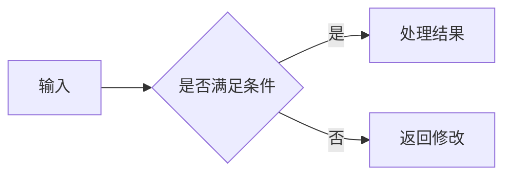

# Hot100 笔记维护与扩展规范

[返回学习面板](README.md) · [新增题目模板](books/hot100/04-模板/04-新增题目页面模板.md) · [校验报告](QA-REPORT.md) · 过程文档见 `报告/`（增强实现记录为 `报告\增强实现记录.md`）

本文档是本目录的维护标准。目标是让维护者不需要阅读全部 Python 代码，也能安全修改内容、增加题目、增加可视化，并维护带 SQLite 学习记录的本地学习站。

## 0. 日常启动方式

不要直接双击 `index.html` 进入长期学习模式。应双击根目录的 `启动学习站.cmd`，它会启动仅监听本机的服务并自动打开学习站。命令窗口需要保持开启；学习结束后在窗口中按 `Ctrl+C` 停止。

学习记录保存在 `data/hot100-study.db`。备份时复制这一份数据库即可；全量重建题解不会覆盖它。

## 1. 先理解三个层次

| 层次 | 主要位置 | 作用 | 是否直接维护 |
|---|---|---|---|
| 内容源 | `06-扩展题源/`、`build_hot100.py` 中的题目清单、原始资料目录 | 保存题目正文和结构化元数据 | 是 |
| Markdown 中间稿 | `00-总览/`～`04-模板/`、`README.md` | 便于审阅、比较和再次生成 | 视文件归属而定 |
| HTML 成品 | `index.html`、各目录的 `.html`、`assets/` | 日常阅读入口 | 否，必须由脚本生成 |
| 学习记录 | `data/hot100-study.db` | 保存看题日期、完成轮次和历史活动 | 只备份，不手工编辑 |

最重要的规则：**不要把 HTML 当作内容源。** 直接修改生成后的 HTML，下次运行生成器时会丢失。

## 2. 目录职责

```text
学习站/
├─ README.md                 学习入口的 Markdown 源，生成 guide.html
├─ MAINTENANCE.md            本维护规范，生成 maintenance.html
├─ index.html                学习面板，由 build_hot100.py 生成
├─ 启动学习站.cmd            启动本地 SQLite 学习站
├─ data/                     学习历史数据库，首次启动时创建
├─ assets/                   公共 CSS/JavaScript，由 build_html_site.py 生成
├─ 00-总览/                  学习路线、模式地图、清单、复盘模板
├─ 01-基础/                  Java 与基础算法速查
├─ 02-专题/                  专题说明与题目导航
├─ 03-题解/                  独立题解的 Markdown 与 HTML 成品
├─ 04-模板/                  解题模板、边界清单、新增题目模板
├─ 05-可视化/                题解页内嵌交互组件的实现源与资源
├─ 06-扩展题源/              后续新增题目的持久正文源
├─ 99-原稿归档/              原始资料副本，只用于核对
└─ tools/                    生成器、页面模板、本地服务与质量检查脚本
```

`99-原稿归档/` 只用于追溯，不应在这里润色或继续写新内容。

## 3. 三个脚本分别做什么

### `build_hot100.py`：全量重建

它会重新生成题解、专题、学习清单、README 和学习面板，并调用 HTML 生成器。它适用于：

- 新增题目或调整题目元数据；
- 调整专题顺序、难度、复杂度或核心不变量；
- 需要从内容源完整恢复网站。

注意：它会覆盖大量 Markdown 和 HTML 文件。普通的措辞小改不要习惯性运行此脚本，除非修改已经写回相应的持久内容源。

### `build_html_site.py`：刷新网页

它把现有 Markdown 转换成完整 HTML，将匹配的交互演示嵌入题解末尾，并更新公共样式与脚本。它适用于：

- 修改某篇 Markdown 后刷新对应 HTML；
- 修改公式渲染、阅读页样式或公共交互；
- 更新本维护文档。

### `check_hot100.py`：发布前检查

它检查题号重复、必需章节、代码围栏、本地链接、HTML 结构、Markdown 残留、公式残留以及 JavaScript 语法。检查失败时不要发布，先处理所有 `ERROR`。

### `study_server.py`：本地数据库服务

它只监听 `127.0.0.1`，使用 Python 标准库提供静态页面和 JSON API，并把记录写入 SQLite：

- 打开题解页时写入一条 `view`；同题 60 秒内重复刷新不会反复记账。
- 点击“完成一轮”时写入一条 `complete`，轮次按题目自动递增。
- 同一天可以看多题，也可以把同一题完成多轮；历史记录不会被新状态覆盖。

学习站首页模板位于 `tools/templates/dashboard.tpl`。修改首页结构、样式或交互时改模板，不要直接改 `index.html`。

## 4. 日常修改的标准流程

1. 判断被修改内容的持久来源，不要先改 HTML。
2. 编辑 UTF-8 编码的 Markdown 或生成器源代码。
3. 只修改普通 Markdown 时，运行：

```powershell
python .\tools\build_html_site.py
```

4. 修改题目清单、专题元数据或扩展题源后，运行：

```powershell
python .\tools\build_hot100.py
```

5. 最后运行：

```powershell
python .\tools\check_hot100.py
```

6. 双击 `启动学习站.cmd` 进入网站，确认新增入口、题名、专题、轮次记录和可视化链接正确。

以上命令应在 `学习站` 目录执行。

## 5. 新增一道题的完整流程

### 第一步：登记题目元数据

打开 `tools/build_hot100.py`，在 `PROBLEM_TSV` 中按期望学习顺序增加一行：

```text
题号|题名|专题|核心方法|时间复杂度|空间复杂度|一句话不变量
```

示例：

```text
704|二分查找|二分查找|左闭右闭二分|O(log n)|O(1)|搜索区间始终包含所有仍可能等于 target 的位置
```

要求：

- 题号必须唯一；文件名会自动补足为四位，例如 `704` 生成 `0704-二分查找.md`。
- 专题名必须与 `CATEGORIES` 中的名称完全一致。
- 不要在前六个字段中使用竖线 `|`。
- 时间、空间复杂度和不变量必须描述实际采用的方法。
- `PROBLEM_TSV` 中的顺序决定学习面板、专题列表和相邻题目的顺序。
- 在 `LEETCODE_SLUGS` 中登记该题在力扣的 slug（即 `https://leetcode.cn/problems/<slug>/` 中的 `<slug>`，带不带 `?envType=study-plan-v2&envId=top-100-liked` 参数由 `LEETCODE_BASE` 统一控制）。登记前请确认链接真实有效（题页会直接显示"前往力扣原题验证"链接；未登记时该链接不渲染，且 `check_hot100.py` 会报"题目缺少力扣 slug"）。

### 第二步：登记难度

- 简单题：把题号加入 `EASY`。
- 困难题：把题号加入 `HARD`。
- 两者都不加入时默认为中等题。

同一题不能同时出现在两个集合中。

### 第三步：编写持久正文

在 `06-扩展题源/` 新建：

```text
四位题号-题名.md
```

例如：

```text
0704-二分查找.md
```

正文从 `### 题目与约束` 开始，不写一级标题、顶部元数据表、“核心不变量”和底部按钮导航；这些内容由生成器根据 `PROBLEM_TSV` 自动补齐。

正文至少应包含：

1. `### 题目与约束`
2. `### 思路推导`
3. `### Java 实现`
4. `### 复杂度`
5. `### 易错点与扩展`

可直接复制[新增题目模板](books/hot100/04-模板/04-新增题目页面模板.md)中的代码块。

### 第四步：需要时绑定可视化

只有演示方法与题解方法真正一致时才绑定，不按专题批量套用。在 `tools/build_html_site.py` 的 `VISUAL_EMBEDS` 中增加题解源路径、组件文件和初始面板：

```python
"03-题解/11-二分查找/0704-二分查找.md": (
    "查找算法可视化.html",
    {"panel": "1"},
),
```

组件文件必须真实存在于 `05-可视化/`，名称和大小写必须完全一致。多面板页面使用 `panel` 指定页签；带模式选择器的页面使用 `mode`。未绑定的题解不显示空演示区。

### 第五步：生成并检查

```powershell
python .\tools\build_hot100.py
python .\tools\check_hot100.py
```

生成完成后，新题应同时出现在：

- `03-题解/<专题>/` 的 Markdown 和 HTML；
- 对应 `02-专题/` 页面；
- `00-总览/03-复习清单`；
- `index.html` 的搜索、专题筛选和进度统计中。

若题页显示“本题正文待补充”，通常是扩展题源文件名中的题号与 `PROBLEM_TSV` 不一致，或正文文件为空。

## 6. 新增专题

只有现有 17 个专题都不合适时才增加新专题。必须同时完成：

1. 在 `CATEGORIES` 增加目录名、专题名、识别信号和不变量。
2. 在 `CATEGORY_DETAILS` 增加专题简介、规则和工具箱。
3. 在 `PROBLEM_TSV` 使用完全相同的专题名。
4. 检查新生成的 `02-专题/`、`03-题解/` 和首页筛选选项。

专题目录采用 `两位序号-专题名`，不要随意更改已有序号，否则大量相对链接会改变。

## 7. 题解内容标准

每道题都应让学习者回答以下问题：

- 看到什么信号时应该想到这个方法？
- 核心不变量是什么？
- 为什么每一步不会漏解或重复计算？
- Java 实现中每个指针、容器或状态代表什么？
- 时间和空间复杂度为何成立？
- 哪个最小反例能击穿常见错误写法？

内容要求：

- 保留原方法，不因润色偷偷更换算法路线。
- 更优方法可以作为独立解法补充，并明确适用条件和复杂度差异。
- Java 代码应完整、可读，变量命名反映含义。
- 不要只给代码；必须先解释状态、不变量和移动/转移依据。
- 避免“秒杀、无敌、必会”等空泛或夸张措辞。
- 一页只保留一个一级标题；正文从二级或三级标题继续。

## 8. Markdown、公式和代码规范

### 标题

- `#`：整页题名，只能有一个，通常由生成器提供。
- `##`：页面主章节。
- `###`：题目、推导、实现、复杂度等正文小节。
- 不要通过加粗文本模拟标题。

### 公式

- 行内公式使用 `$...$`，例如 `$O(n)$`、`$left \le right$`。
- 独立公式使用 `$$...$$`。
- 不要手写 `&#x20;` 补空格；需要乘号时使用 `\times` 或直接写 `×`。
- 很长的公式会在公式区域内部横向滚动，不应撑宽整个页面。
- 当前使用本地 MathML，不依赖网络 CDN；新增复杂命令后应确认 `MathMLParser` 支持。

### Java 代码

````markdown
```java
class Solution {
    // implementation
}
```
````

- 代码围栏必须成对。
- 不要把普通正文整体缩进四个空格，否则 Markdown 会误判为代码块。
- 复杂度符号在普通正文里使用公式，在代码注释里直接写文本即可。

### 图片

- 使用相对路径，不使用 `C:\...`、`E:\...` 等个人绝对路径。
- 与基础笔记绑定的图片放在对应目录的 `pic/`。
- 可视化专用资源放在 `05-可视化/assets/`。
- 文件名尽量使用稳定的中英文、数字和连字符；重命名后必须同步更新全部引用。

## 9. 题解内嵌可视化标准

可视化实现源放在 `05-可视化/`，由生成器以嵌入模式显示在匹配题解的末尾。它不是第二份题解，也不应作为独立学习入口。至少满足：

- 有 `lang="zh-CN"`、非空 `title` 和 `width=device-width` 的 viewport。
- 嵌入模式只保留动画状态图、必要图例、单行当前状态和播放/重置控制；题名、核心题意、思考过程、输入配置、算法说明、复杂度、Java 代码和扩展追问全部隐藏。
- 默认展示的面板必须与当前题目的方法一致；一个泛化演示不能仅按专题绑定给所有题。
- 困难题优先补充可视化；当前困难题的集中实现位于 `05-可视化/困难题核心状态实验室.html`，新增模式后仍需在 `VISUAL_EMBEDS` 单独绑定。
- 控件不会相互遮挡，也不会在窄窗口跑出页面。
- 输入框、选择框和按钮有可理解的文字或 `aria-label`。
- 键盘可以访问主要操作；焦点状态可见。
- Canvas 或动画区域有文字说明，不能只靠颜色表达状态。
- 不依赖在线字体、在线脚本或临时网络资源。
- 动画速度、自动播放和重置操作不会让学习者失去当前状态。

新增完成后，在 `VISUAL_EMBEDS` 显式绑定题解并运行 `build_html_site.py`。生成器会注入嵌入模式、响应式增强和自动高度同步。

## 10. 样式和前端代码的维护位置

公共阅读页样式的真正来源是：

- `tools/build_html_site.py` 中的 `SITE_CSS`
- `tools/build_html_site.py` 中的 `SITE_JS`

`assets/site.css` 和 `assets/site.js` 是生成结果。修改公共样式时，应修改生成器中的常量，再运行 `build_html_site.py`。只改 `assets/` 会在下次构建时被覆盖。

学习站首页的 HTML、CSS、JavaScript 位于 `tools/templates/dashboard.tpl`，题目数据由 `build_hot100.py` 的 `render_dashboard()` 注入。数据库和 API 位于 `tools/study_server.py`。题解与可视化的对应关系位于 `build_html_site.py` 的 `VISUAL_EMBEDS`，统一修饰位于 `polish_visual()`。

### 学习书架与课程模块

学习书架生成器是 `tools/build_library.py`，课程登记表是 `tools/library_catalog.py`。当前只收录明确登记的 Markdown，不会递归发布临时文件、demo README、数据库、密码文本或其他私人附件。

`Hot 100 算法刷题精讲` 是书架里的特殊模块：它不拆 Markdown，而是由 `build_hot100.py` 的题目目录生成，每道题指向 `03-题解/` 下已有的题解页。题目页的浏览与“完成一轮”记录会同步写入 `content_events`，因此书架进度和 Hot 100 面板始终一致；不要在 `library_catalog.py` 里为它登记 `source`。

新增一本课程时：

1. 把源 Markdown 保留在原资料目录，不要搬进 `学习站/library/`。
2. 在 `LIBRARY_MODULES` 增加稳定的英文 `id`、标题、分类和相对源路径。
3. 使用二级标题划分章节；每个二级标题会成为独立 HTML 和独立学习记录单元。
4. 运行 `python .\tools\build_library.py`。全量运行 `build_hot100.py` 时也会自动调用它。
5. 打开学习书架，确认章节顺序、图片、公式、流程图和跨课程链接。

课程中的 Mermaid 图表使用标准围栏，不要把 `flowchart LR` 直接写在普通正文或普通代码块里：

````markdown

````

生成器会把 `flowchart`、`sequenceDiagram`、`mindmap` 等 Mermaid 围栏转换为真正的 SVG 图表。浏览器运行库固定为 `tools/vendor/mermaid-11.16.1.min.js`，构建时复制到 `library/assets/`，因此课程断网也能显示。不要在 Markdown 中引用 Mermaid CDN，也不要直接修改 `library/assets/`。如需升级 Mermaid，应同时修改源运行库文件名、`build_library.py` 中的版本引用和 `check_hot100.py` 中的回归检查。

图表维护规则：

- 节点文字尽量简短；复杂解释放在图表前后的正文中。
- 换行使用 Mermaid 支持的 `<br/>`，不要手写 `&#x20;` 补空格。
- 宽图优先调整方向或拆成两张图，不要在节点中堆叠大段文字。
- 图表失败时先用 Mermaid Live Editor 排查语法，再修正源 Markdown；不要直接修改生成后的 HTML。

`library/` 全部是生成结果，不直接维护。课程记录保存在 SQLite 的 `content_events` 表中，与 Hot 100 的题目记录分开，但共用同一个数据库和启动方式。

## 11. 发布前检查清单

- [ ] 新题题号唯一，题名与文件名一致。
- [ ] 专题、难度、方法、复杂度和不变量已登记。
- [ ] 题目正文包含推导、Java 代码、复杂度和易错点。
- [ ] 原方法仍然保留；新增优化方法已单独标明。
- [ ] 所有代码围栏成对，正文没有被误渲染为代码。
- [ ] 页面没有残留 `$O(n)$`、`&#x20;` 或 Markdown 强调符。
- [ ] 图片、题解和内嵌可视化资源均为有效相对链接。
- [ ] Mermaid 围栏已渲染为图表，没有显示 `flowchart LR`、`sequenceDiagram` 或 `&#x20;` 源文本。
- [ ] 演示位于题解末尾，没有重复题解、独立入口或错误的默认面板。
- [ ] 学习面板只需点击题名进入，不再重复显示“阅读题解”按钮。
- [ ] 所有困难题都有与实际方法一致的内嵌演示。
- [ ] 学习面板能搜索到新题，专题筛选正确。
- [ ] 双击启动脚本后显示“SQLite 数据库已连接”，打开题解会增加当天看题记录。
- [ ] 同一道题连续点击“完成一轮”会保留多条记录并依次显示第 1、2、3 轮。
- [ ] 页面不横向撑开，控件不遮挡，公式与正文基线协调。
- [ ] `check_hot100.py` 输出 `errors: 0`。
- [ ] 页面正文没有直接露出标题井号、强调星号、反引号、代码围栏或方括号加圆括号的链接写法等 Markdown 源标记。

## 12. 常见问题

### 修改后网页没有变化

先运行 `build_html_site.py`，再用 `Ctrl + F5` 强制刷新。不要直接修改 HTML 追求临时效果。

### 全量重建后修改丢失

说明修改只写进了生成物。把内容移回 `06-扩展题源/`、`PROBLEM_TSV` 或相应生成函数，再重新构建。

### 点击链接打开 Markdown

检查目标 Markdown 是否被 `build_html_site.py` 纳入 `sources` 或 `CONTENT_DIRS`，并确认对应 HTML 已生成。日常学习入口必须指向 HTML。

### 公式显示为美元符号或命令文本

检查美元符号是否成对、命令是否受 `MathMLParser` 支持，并确认公式没有被包进代码围栏。不要用 HTML 实体拼接 LaTeX。

### 新题没有出现在首页

只创建题解 Markdown 不会更新首页数据。应将题目加入 `PROBLEM_TSV`，把正文放进 `06-扩展题源/`，然后运行完整的 `build_hot100.py`。

## 13. 最小维护原则

每次修改尽量只动一个权威来源，并让生成器传播到其余文件：

```text
题目元数据 + 持久正文源
          ↓
    build_hot100.py
          ↓
Markdown、专题、清单、学习面板
          ↓
  build_html_site.py
          ↓
完整离线 HTML + 公共样式
          ↓
   check_hot100.py
```

只要遵守“内容源优先、HTML 只生成、发布前全检”这三条，后续扩题和维护就不会逐渐失控。

## 14. 书架“待复习”体系（新增功能，维护须知）

间隔重复不只覆盖 Hot 100 题目，也覆盖书架全部模块章节，但**任何页面都不再把书架与题目混排**：

- Hot 100 面板“今日待复习”只显示题目；右上角“书架待复习 N 项 →”是入口，设置 `review_include_contents=1` 时题目列表下方会出现独立的“书架章节”折叠子区（不与题目混排）；
- 书架总页 `library/index.html`：顶部“全书架待复习 N 章（逾期 M）”汇总条，模块卡右上角有“待复习 n”角标（逾期红色），数据来自 `GET /api/daily`；
- 模块页 `library/<module>/index.html`：进度条下方“本模块待复习”区块列出到期章节（逾期红色）；章节卡挂“待复习/逾期”徽标；筛选器有“待复习”选项；数据来自 `GET /api/daily?module=<module_id>`；
- 章节页状态条：显示“下次复习：MM-DD”，到期当天或逾期会标红；
- 书籍章节专用复习间隔：`REVIEW_INTERVALS_CONTENT=(3,7,15,30,60,90)`（`study_server.py`），Hot 100 题目维持 `(1,3,7,15,30,60)`。

回归断言：面板不混排书架、书架总页汇总条与模块角标、模块页 due 区块、章节页下次复习行、`/api/daily` 的 `module` 参数过滤，均在 `check_hot100.py` 覆盖。
