# Function Calling 与 MCP 协议：设计原理与工程实践

> 整理自原笔记《Function Calling 与 MCP 协议｜深究 MCP 协议的设计》，并依据 MCP 官方规范重新校正、扩展。  
> 技术基线：MCP Protocol Revision `2025-11-25`；最后核对：2026-07-18。  
> 阅读目标：不仅知道“怎么接 MCP”，更能理解它为什么这样设计，以及 Function Calling 与 MCP 各自解决什么问题。

## 目录

- [1. 先给出结论](#1-先给出结论)
- [2. Function Calling 解决了什么问题](#2-function-calling-解决了什么问题)
- [3. Function Calling 的完整运行机制](#3-function-calling-的完整运行机制)
- [4. 为什么仅有 Function Calling 仍然不够](#4-为什么仅有-function-calling-仍然不够)
- [5. 从工程问题推导 MCP](#5-从工程问题推导-mcp)
- [6. MCP 是什么](#6-mcp-是什么)
- [7. MCP 的 Host、Client 与 Server](#7-mcp-的-hostclient-与-server)
- [8. MCP 的两层协议结构](#8-mcp-的两层协议结构)
- [9. 生命周期与能力协商](#9-生命周期与能力协商)
- [10. MCP Server 提供的三类核心能力](#10-mcp-server-提供的三类核心能力)
- [11. MCP Client 可以提供的能力](#11-mcp-client-可以提供的能力)
- [12. Tools 的发现与调用](#12-tools-的发现与调用)
- [13. 两种标准传输](#13-两种标准传输)
- [14. Function Calling 与 MCP 如何协作](#14-function-calling-与-mcp-如何协作)
- [15. MCP 与传统 API 的区别](#15-mcp-与传统-api-的区别)
- [16. Python 实现一个最小 MCP Server](#16-python-实现一个最小-mcp-server)
- [17. 配置与调试](#17-配置与调试)
- [18. 安全模型与生产实践](#18-安全模型与生产实践)
- [19. 常见误解与正确性审查](#19-常见误解与正确性审查)
- [20. 对 MCP 设计的进一步思考](#20-对-mcp-设计的进一步思考)
- [21. 学习与实践路线](#21-学习与实践路线)
- [22. 权威参考资料](#22-权威参考资料)

---

## 1. 先给出结论

Function Calling 和 MCP 经常一起出现，但它们位于不同层次：

- **Function Calling** 解决“模型如何表达它想调用哪个工具、使用什么参数”。
- **MCP** 解决“应用如何发现、连接和调用外部上下文服务，并以统一协议交换数据”。
- **模型不会亲自执行函数**。模型生成调用意图，应用负责验证、授权、执行和回传结果。
- **MCP 不只提供工具**。Server 还可提供 Resources 和 Prompts；Client 也可提供 Sampling、Elicitation、Roots 等能力。
- **MCP 不能替代业务 API**。MCP Server 往往正是业务 API、数据库或本地程序之上的标准化适配层。

可以把二者放在一张图中：

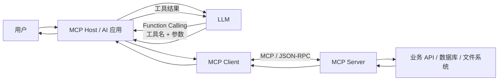

一句话概括：

> Function Calling 是模型与应用之间的“工具意图接口”；MCP 是应用与上下文服务之间的“互操作协议”。

---

## 2. Function Calling 解决了什么问题

### 2.1 纯聊天模型的边界

一个只接收文本并生成文本的模型，本身通常：

- 不知道刚刚发生的天气、库存、邮件或数据库变化；
- 不能直接读取用户文件；
- 不能真正执行代码、发送邮件、修改工单或支付；
- 不能凭空获得私有系统的权限。

它可以说“我已经发出邮件”，但如果应用没有真正调用邮件服务，这句话只是一段文本。

### 2.2 最早的后端路由方案

在 Function Calling 之前，开发者可以在后端写规则：

1. 判断用户请求是否属于天气查询；
2. 从自然语言中抽取城市与日期；
3. 调用天气 API；
4. 把结果拼进 prompt；
5. 请求模型生成最终回答。

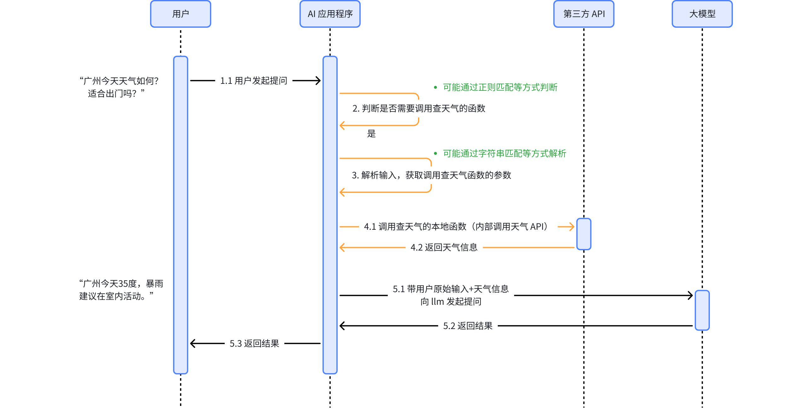

这种方案不是不可用，而是随着工具数量增加变得复杂：

- 路由规则越来越多；
- 参数抽取需覆盖大量自然语言表达；
- 多工具、多步骤任务难以穷举；
- 每次增加工具都要修改后端逻辑。

### 2.3 基于提示词的“模拟 Function Calling”

开发者也可以在 system prompt 中列出函数，让模型按约定 JSON 输出：

```text
你可以使用以下函数：

get_weather(city: string)
作用：查询指定城市的天气。

如果需要调用函数，只输出：
{"name": "函数名", "arguments": {...}}
```

用户询问“广州的天气怎么样”，模型可能输出：

```json
{
  "name": "get_weather",
  "arguments": {
    "city": "广州"
  }
}
```

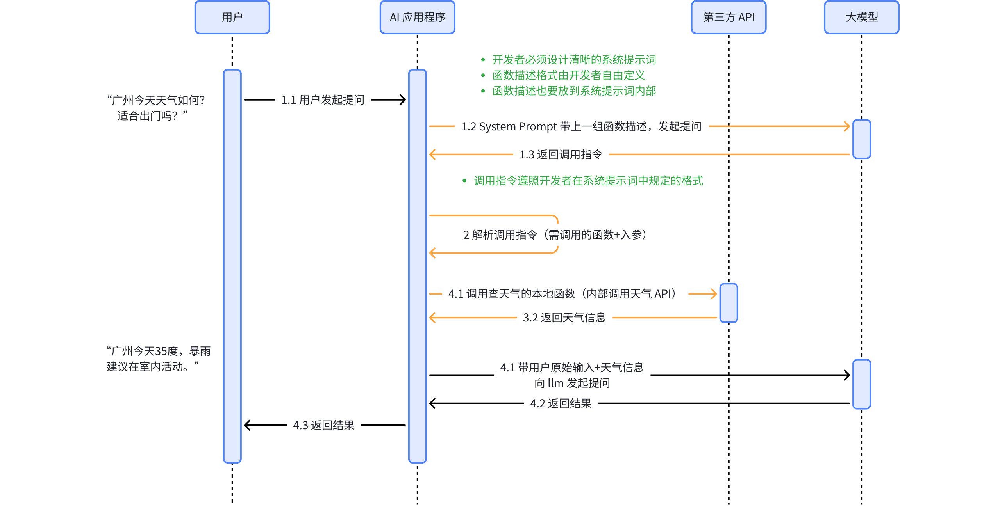

这一思路证明模型能够参与工具选择和参数生成，但存在明显问题：

- JSON 可能被 Markdown 围栏或解释文字包裹；
- 模型可能编造函数名和参数；
- 参数类型与必填项难以稳定满足；
- 大量工具说明占用上下文；
- 每个开发者都要设计自己的格式与解析器。

### 2.4 原生 Function Calling

模型供应商把工具描述作为 API 的独立字段，将工具调用作为结构化响应类型返回，并对模型进行专门训练，这就是通常所说的原生 Function Calling 或 Tool Calling。

它将两个容易混淆的职责分开：

| 职责 | 执行者 |
|---|---|
| 判断是否需要工具 | 模型 |
| 选择工具 | 模型 |
| 生成候选参数 | 模型 |
| 验证参数 | 应用 |
| 检查权限 | 应用/工具服务 |
| 执行工具 | 应用/工具服务 |
| 将结果返回模型 | 应用 |
| 根据结果生成回答 | 模型 |

> 关键纠正：原生 Function Calling 提高了结构稳定性，但不会让模型输出天然可信。名称白名单、JSON Schema 校验、业务校验和授权仍然不可省略。

---

## 3. Function Calling 的完整运行机制

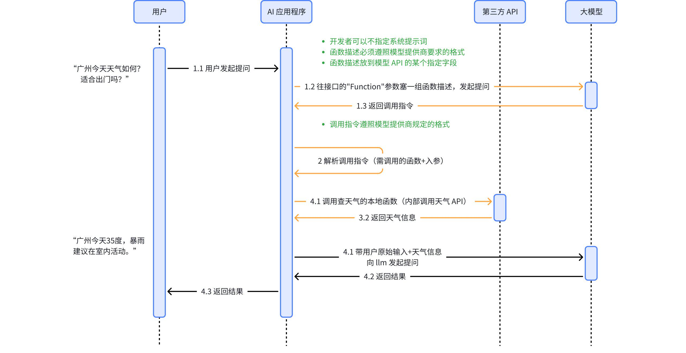

### 3.1 第一次模型调用

应用向模型提供：

- 用户消息；
- system/developer 指令；
- 可用工具定义；
- 每个工具的输入 schema。

现代工具定义通常可抽象成：

```json
{
  "type": "function",
  "name": "get_weather",
  "description": "查询指定城市和日期的天气",
  "parameters": {
    "type": "object",
    "properties": {
      "city": {
        "type": "string",
        "description": "城市名称"
      },
      "date": {
        "type": "string",
        "format": "date",
        "description": "ISO 8601 日期"
      }
    },
    "required": ["city", "date"],
    "additionalProperties": false
  }
}
```

### 3.2 模型返回调用请求

模型可能直接回答，也可能返回一个或多个工具调用：

```json
{
  "id": "call_01",
  "name": "get_weather",
  "arguments": {
    "city": "广州",
    "date": "2026-07-18"
  }
}
```

这里的 `id` 用于把执行结果与原调用对应起来。并行调用多个工具时，这一点尤其重要。

### 3.3 应用执行前校验

应用至少应检查：

1. 工具名是否在白名单；
2. 参数是否通过 schema；
3. 日期、金额、文件路径等是否满足业务约束；
4. 当前用户是否有权限；
5. 写操作是否需要人工确认；
6. 是否超过调用次数、超时或费用预算。

### 3.4 执行并回传结果

应用调用真正的天气 API，再把结果以工具消息交回模型：

```json
{
  "tool_call_id": "call_01",
  "content": {
    "city": "广州",
    "date": "2026-07-18",
    "temperature_c": 34,
    "condition": "雷阵雨"
  }
}
```

模型根据用户原问题和工具结果生成最终自然语言回答。

### 3.5 这其实是一个循环

```text
模型调用 → 是否请求工具？
    ├─ 否：返回最终答案
    └─ 是：校验并执行工具 → 回传结果 → 再次调用模型
```

Agent 就是在这个循环上增加状态、停止条件、重试、审批和可观测性。

---

## 4. 为什么仅有 Function Calling 仍然不够

Function Calling 统一了“模型请求工具”的表达，但没有统一工具从哪里来、如何连接。

假设一个 AI 应用要使用地图、GitHub、数据库和本地文件系统。若只依赖供应商 Function Calling，开发者仍需为每个工具：

1. 手工编写工具 schema；
2. 引入 SDK 或实现 HTTP 请求；
3. 管理认证；
4. 转换结果格式；
5. 把模型调用路由到正确实现；
6. 处理工具更新；
7. 为另一个 AI 应用重复这一套适配。

进一步还存在：

- Python 应用难以直接复用 Node.js 工具代码；
- 企业工具通常不会把源码交给调用方；
- 本地工具需要进程启动、通信和退出管理；
- 远程工具需要统一的鉴权、会话和通知方式；
- 不同宿主使用不同私有插件格式，生态被割裂。

因此问题从“模型如何调用函数”上升为：

> 能不能让工具作为独立服务存在，并让不同 AI 应用使用同一种发现、协商、调用和返回机制？

这正是 MCP 的问题空间。

---

## 5. 从工程问题推导 MCP

### 5.1 目标状态

理想情况下，AI 应用只需添加一项配置或授权，就能：

- 连接某个上下文服务；
- 自动知道它提供哪些能力；
- 得到工具的名称、描述和 schema；
- 调用工具并解析结果；
- 感知工具列表变化；
- 读取资源和模板；
- 在双方能力不同的情况下安全降级。

### 5.2 必须标准化的部分

要达到这个目标，需要标准化：

| 需要统一的部分 | MCP 的答案 |
|---|---|
| 角色关系 | Host、Client、Server |
| 消息格式 | JSON-RPC 2.0 |
| 连接初始化 | 生命周期与版本/能力协商 |
| 能力发现 | `tools/list`、`resources/list`、`prompts/list` |
| 工具执行 | `tools/call` |
| 数据读取 | `resources/read` |
| 提示词获取 | `prompts/get` |
| 动态变化 | JSON-RPC Notifications |
| 本地连接 | stdio |
| 远程连接 | Streamable HTTP |
| 远程授权 | 基于 OAuth 2.1 体系的授权规范 |

### 5.3 解耦后的架构

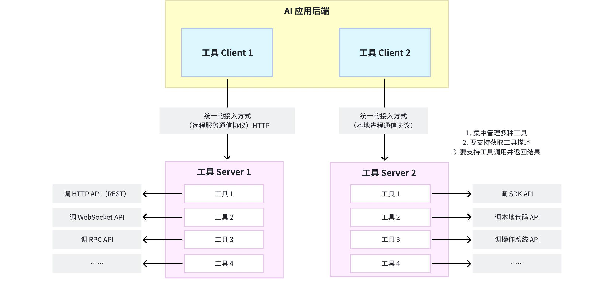

工具实现可以是 Python、Java、Node.js、Go 或其他语言；Host 无需复制源代码，只需通过协议与 MCP Server 交互。

---

## 6. MCP 是什么

MCP（Model Context Protocol，模型上下文协议）是一个开放协议，用于标准化 AI 应用如何连接外部上下文与能力。

官方常用 USB-C 类比：USB-C 统一设备与外设的连接方式，MCP 希望统一 AI 应用与数据源、工具和交互模板之间的连接方式。

但这个类比不能过度延伸：

- USB-C 主要是硬件接口和传输规范；
- MCP 是带生命周期、能力协商和语义方法的应用层协议；
- 接上 MCP Server 不代表 Host 必须把所有能力交给模型；
- MCP 不规定 Host 使用哪个模型，也不规定如何编排 Agent。

官方对范围的限定很重要：

> MCP 专注于上下文交换协议，不规定 AI 应用如何使用 LLM，也不规定应用如何管理最终提供给模型的上下文。

换言之，工具选择、上下文裁剪、审批 UI 和 Agent 循环仍由 Host 决定。

---

## 7. MCP 的 Host、Client 与 Server

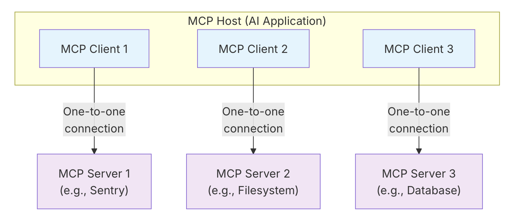

### 7.1 MCP Host

Host 是面向用户的 AI 应用或 Agent，例如 IDE、桌面助手、研究助手。它负责：

- 管理用户会话和模型；
- 创建、管理一个或多个 MCP Client；
- 聚合不同 Server 的能力；
- 决定哪些上下文进入模型；
- 执行授权、审批和安全策略；
- 把模型工具调用路由到对应 Client。

### 7.2 MCP Client

Client 是 Host 内部的协议组件。通常一个 Client 与一个 Server 维护专用会话。它负责：

- 建立传输连接；
- 初始化并协商版本与能力；
- 发送 JSON-RPC 请求；
- 接收响应、通知以及 Server 发起的请求；
- 将协议对象转换为 Host 可用的数据。

### 7.3 MCP Server

Server 是提供上下文能力的程序，可以运行在本机，也可以运行在远程平台。它可以封装：

- 文件系统；
- 数据库；
- SaaS API；
- 企业内部服务；
- 自动化脚本；
- 领域知识与提示模板。

“Server”描述的是协议角色，不等于“远程服务器”。一个通过 stdio 启动的本地子进程也是 MCP Server。

### 7.4 一对一连接不等于一对一部署

Host 通常为每个 Server 创建一个 Client 连接；但远程 Server 可以同时服务多个 Host/Client。不要把协议会话关系误解为服务器只能连接一个用户。

---

## 8. MCP 的两层协议结构

MCP 可以分为数据层与传输层：

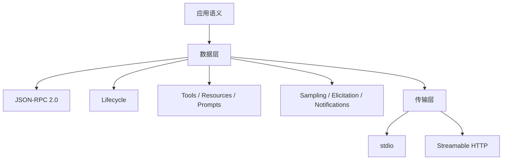

### 8.1 数据层

数据层定义“消息是什么意思”：

- 请求、响应和通知结构；
- 方法名称与参数；
- 初始化和能力协商；
- Tools、Resources、Prompts 等协议原语；
- 进度、取消、日志等通用能力。

### 8.2 传输层

传输层定义“消息如何到达对端”：

- 如何建立连接；
- 如何分帧；
- 如何管理 HTTP 会话；
- 如何承载服务器推送；
- 远程场景如何授权。

MCP 在不同传输之上保持同一套 JSON-RPC 语义，这使 SDK 可以把业务功能与通信细节分离。

---

## 9. 生命周期与能力协商

MCP 是有生命周期的协议。双方不能一连接就盲目调用任意方法。

### 9.1 初始化请求

```json
{
  "jsonrpc": "2.0",
  "id": 1,
  "method": "initialize",
  "params": {
    "protocolVersion": "2025-11-25",
    "capabilities": {
      "elicitation": {
        "form": {},
        "url": {}
      }
    },
    "clientInfo": {
      "name": "example-client",
      "version": "1.0.0"
    }
  }
}
```

Server 返回其选择的协议版本、能力和身份：

```json
{
  "jsonrpc": "2.0",
  "id": 1,
  "result": {
    "protocolVersion": "2025-11-25",
    "capabilities": {
      "tools": {"listChanged": true},
      "resources": {},
      "prompts": {}
    },
    "serverInfo": {
      "name": "knowledge-server",
      "version": "1.0.0"
    }
  }
}
```

随后 Client 发送：

```json
{
  "jsonrpc": "2.0",
  "method": "notifications/initialized"
}
```

### 9.2 为什么需要能力协商

能力协商让协议能够演进：

- Server 没声明 Resources，Client 就不应调用 `resources/list`；
- Client 没声明 Elicitation，Server 就不应请求交互表单；
- 双方可以支持不同的可选能力；
- 协议版本不兼容时应终止连接，而不是带病运行。

这是 MCP 比“约定几个 HTTP 接口”更完整的地方之一。

---

## 10. MCP Server 提供的三类核心能力

### 10.1 Tools：可执行动作

Tools 表示可调用的函数，通常由模型决定是否使用，但 Host 应保留审批和策略控制。

例子：

- 查询天气；
- 创建工单；
- 写文件；
- 执行数据库查询；
- 发送消息。

工具定义包含名称、描述与 `inputSchema`，还可包含 `outputSchema`、图标和行为提示。

### 10.2 Resources：可读取的上下文数据

Resources 更像可寻址的数据：

- 文件内容；
- 数据库 schema；
- Git 历史；
- API 响应；
- 项目配置。

Resources 常由应用或用户选择后加入上下文，不一定让模型自主“调用”。典型方法包括：

```text
resources/list
resources/templates/list
resources/read
resources/subscribe
```

### 10.3 Prompts：可复用交互模板

Prompts 是 Server 提供的参数化模板，例如：

- 代码审查模板；
- 事故分析模板；
- 数据库查询助手模板；
- 领域 few-shot 示例。

典型方法：

```text
prompts/list
prompts/get
```

### 10.4 为什么要分成三类

三类能力代表不同控制语义：

| 原语 | 核心含义 | 常见控制者 |
|---|---|---|
| Tools | 做一件事 | 模型选择、Host 审批 |
| Resources | 读取一份数据 | 应用或用户选择 |
| Prompts | 使用一个交互模板 | 用户或应用选择 |

如果全部塞成 Tool，模型工具列表会膨胀，数据、动作和模板的权限语义也会混在一起。

---

## 11. MCP Client 可以提供的能力

MCP 并非只有 Client 请求、Server 响应。Server 也可以向 Client 发起请求。

### 11.1 Sampling

Server 可通过 `sampling/createMessage` 请求 Host 侧模型完成生成。价值在于：

- Server 不必持有模型厂商 API Key；
- Host 保持模型选择和权限控制；
- Server 可实现包含模型步骤的高级能力。

规范强调应让用户能够查看、修改或拒绝 Sampling 请求。`2025-11-25` 版本还加入了 Sampling 中的工具调用支持。

### 11.2 Elicitation

Server 可通过 `elicitation/create` 请求用户补充信息或完成确认。

当前主要包括：

- `form`：由 schema 生成结构化表单；
- `url`：让用户在外部 URL 完成交互，例如敏感授权或支付。

Server 不应通过 Elicitation 欺骗用户输入密码、长期令牌等敏感信息。

### 11.3 Roots

Roots 允许 Client 向 Server 提供文件系统边界，例如允许访问的工作区目录。它是范围提示和协作机制，不应被 Server 当作唯一安全沙箱。

### 11.4 Logging、Progress、Cancellation 与 Tasks

- Logging：Server 向 Client 发送结构化日志；
- Progress：长操作报告进度；
- Cancellation：取消仍在执行的请求；
- Tasks：`2025-11-25` 引入的实验性耐久执行机制，可查询状态和延后取结果。

这说明 MCP 的目标已经超出简单“工具列表 + 工具调用”，正在覆盖更完整的 Agent 互操作生命周期。

---

## 12. Tools 的发现与调用

### 12.1 发现工具

Client 请求：

```json
{
  "jsonrpc": "2.0",
  "id": 2,
  "method": "tools/list"
}
```

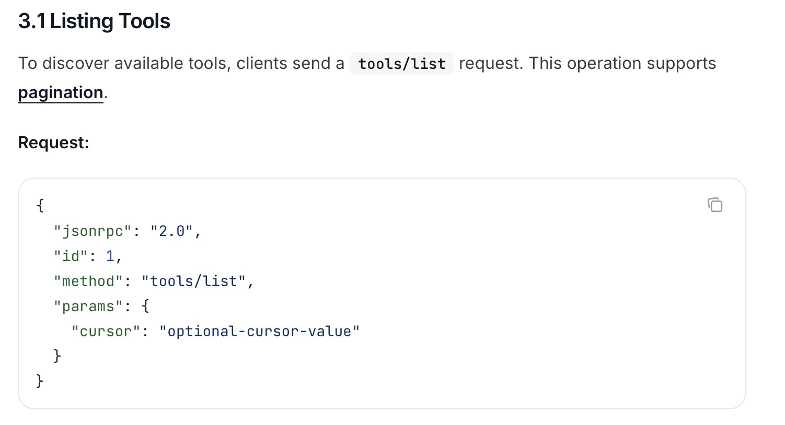

Server 响应：

```json
{
  "jsonrpc": "2.0",
  "id": 2,
  "result": {
    "tools": [
      {
        "name": "weather_current",
        "title": "当前天气",
        "description": "查询指定地点的当前天气",
        "inputSchema": {
          "type": "object",
          "properties": {
            "location": {"type": "string"},
            "units": {
              "type": "string",
              "enum": ["metric", "imperial"]
            }
          },
          "required": ["location"]
        }
      }
    ]
  }
}
```

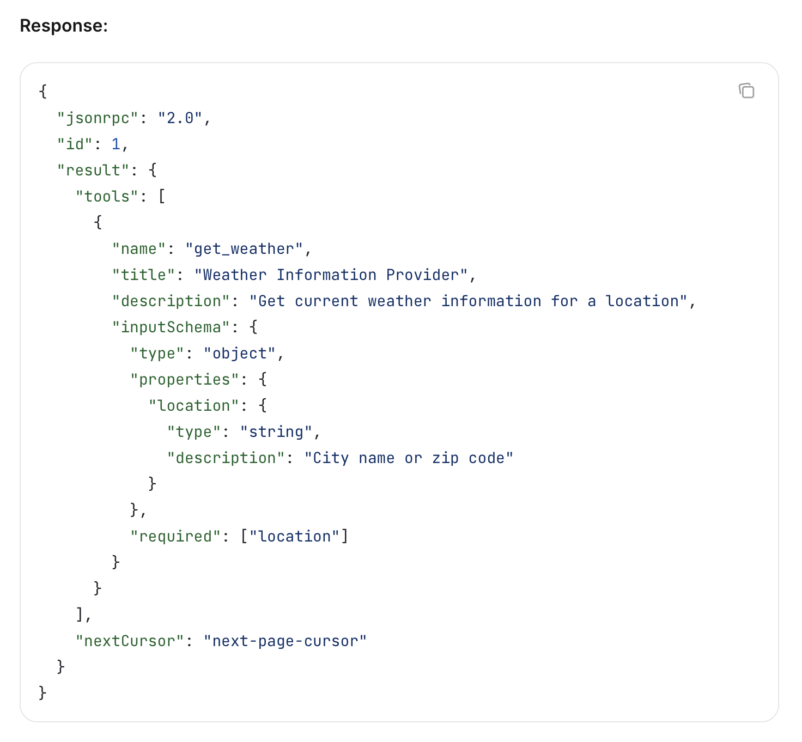

### 12.2 调用工具

```json
{
  "jsonrpc": "2.0",
  "id": 3,
  "method": "tools/call",
  "params": {
    "name": "weather_current",
    "arguments": {
      "location": "Guangzhou",
      "units": "metric"
    }
  }
}
```

结果可以包含文本、图片、音频、资源链接、嵌入资源和结构化内容：

```json
{
  "jsonrpc": "2.0",
  "id": 3,
  "result": {
    "content": [
      {
        "type": "text",
        "text": "Guangzhou: 34°C, thunderstorm"
      }
    ],
    "structuredContent": {
      "temperature_c": 34,
      "condition": "thunderstorm"
    },
    "isError": false
  }
}
```

### 12.3 工具列表动态变化

若 Server 声明 `tools.listChanged`，它可发送：

```json
{
  "jsonrpc": "2.0",
  "method": "notifications/tools/list_changed"
}
```

Client 收到后重新调用 `tools/list`。通知只表示“发生变化”，不是把新工具直接塞给 Client。

### 12.4 Tool Annotations 只是提示

MCP 工具可声明 `readOnlyHint`、`destructiveHint`、`idempotentHint`、`openWorldHint` 等注解。但官方 schema 明确说明这些只是 hints，不能替代信任与安全判断。

> 来自不可信 Server 的工具即使自称只读，也不能据此自动放行。

---

## 13. 两种标准传输

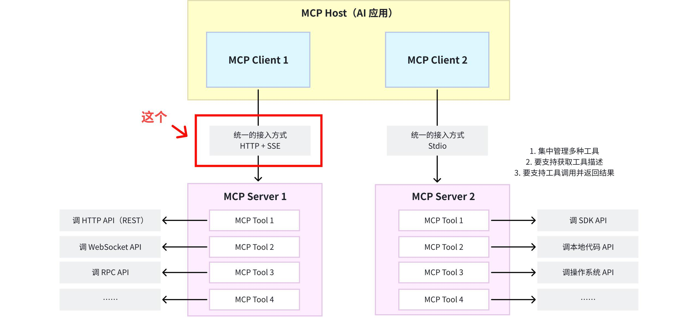

### 13.1 stdio

stdio 用于同一机器上的进程通信：

1. Client 启动 Server 子进程；
2. Client 向 Server 的 `stdin` 写入 MCP JSON-RPC 消息；
3. Server 从 `stdout` 返回 MCP JSON-RPC 消息；
4. `stderr` 可用于日志。

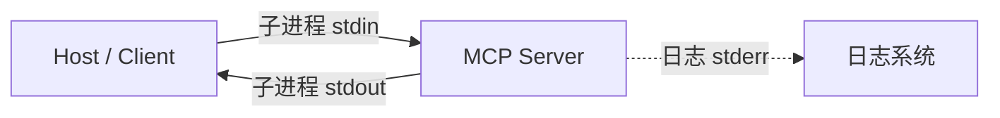

重要约束：

- 每条消息使用 UTF-8；
- 消息按换行分隔，消息内部不得包含实际换行分隔符；
- Server 不能把普通日志写入 stdout，否则会破坏协议流；
- stdio 配置中的命令和环境变量相当于本地代码执行能力，必须信任来源。

stdio 被选择不是因为它功能最丰富，而是因为它：

- 所有主流操作系统和语言都支持；
- 无需占用端口；
- 子进程生命周期容易由 Host 管理；
- 不需要额外网络服务；
- 非常适合本地开发工具。

### 13.2 Streamable HTTP

Streamable HTTP 是标准远程传输。Server 提供一个同时支持 POST 和 GET 的 MCP endpoint，例如：

```text
https://example.com/mcp
```

核心行为：

- Client 用 HTTP POST 发送 JSON-RPC 消息；
- Server 可返回 `application/json` 单一响应；
- Server 也可返回 `text/event-stream`，通过 SSE 发送多个消息；
- Client 可用 GET 打开 SSE 流，接收 Server 主动请求和通知；
- Server 可通过 `Mcp-Session-Id` 管理有状态会话；
- HTTP 授权遵循 MCP Authorization 规范。

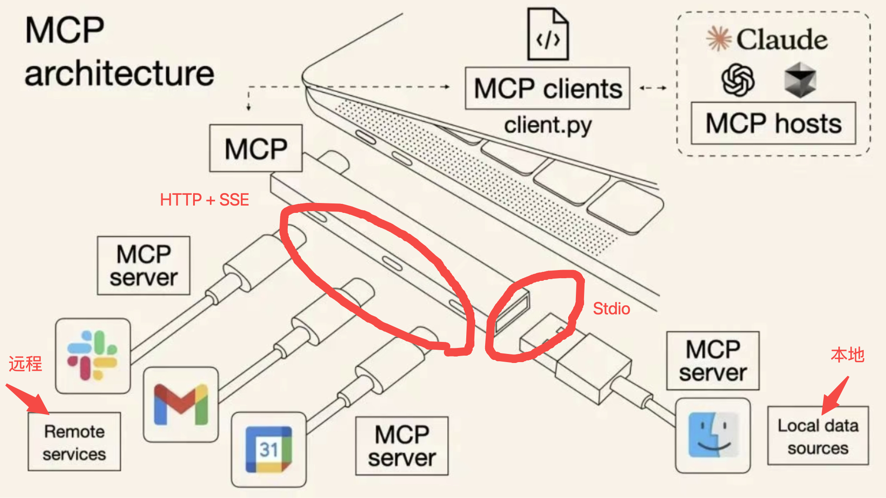

### 13.3 HTTP+SSE 与 Streamable HTTP

旧的 HTTP+SSE 传输来自 `2024-11-05` 协议版本，已被 Streamable HTTP 取代。二者的关键差异不是“文本与二进制”，而是连接模型被简化：

- 旧方案通常使用独立 SSE endpoint 与 POST endpoint；
- 新方案使用单一 MCP endpoint，POST/GET 组合；
- 每个 POST 请求可直接获得 JSON 响应，也可开启 SSE 流；
- 更容易支持无状态基础 Server、有状态会话和反向通知。

### 13.4 一个重要纠错：Streamable HTTP 不等于任意二进制协议

MCP 当前仍使用 UTF-8 JSON-RPC 消息。工具返回图片或音频时，是通过 MCP 内容块表示，例如 base64 数据或资源链接，而不是因为 Streamable HTTP 自动变成了任意二进制 RPC。

HTTP/2/3 也不是 MCP Streamable HTTP 的必要定义条件。HTTP/1.1 配合 SSE 同样可以实现规范要求。

### 13.5 自定义传输

MCP 允许可插拔的自定义传输，但必须保留 MCP 的 JSON-RPC 消息格式和生命周期语义。自定义传输解决特定环境问题，却会降低通用互操作性，因此应谨慎使用。

---

## 14. Function Calling 与 MCP 如何协作

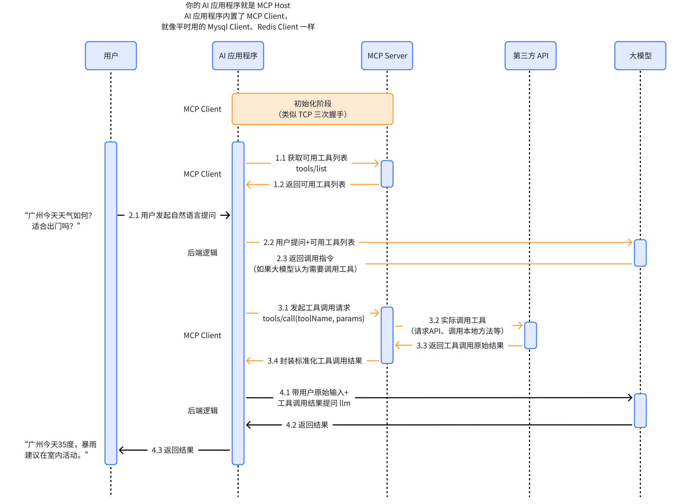

典型 Host 的工作流：

1. Host 根据配置连接一个或多个 MCP Server；
2. MCP Client 完成初始化和能力协商；
3. Client 调用 `tools/list`；
4. Host 将 MCP Tool 转换成模型供应商的 Function Calling/Tool Calling schema；
5. Host 把工具定义和用户消息发给模型；
6. 模型选择工具并生成参数；
7. Host 将模型工具名映射到正确的 MCP Server；
8. Client 发送 `tools/call`；
9. Server 执行业务逻辑并返回结果；
10. Host 将结果转换成模型供应商要求的 Tool Result；
11. 模型生成最终回答，或继续请求其他工具。

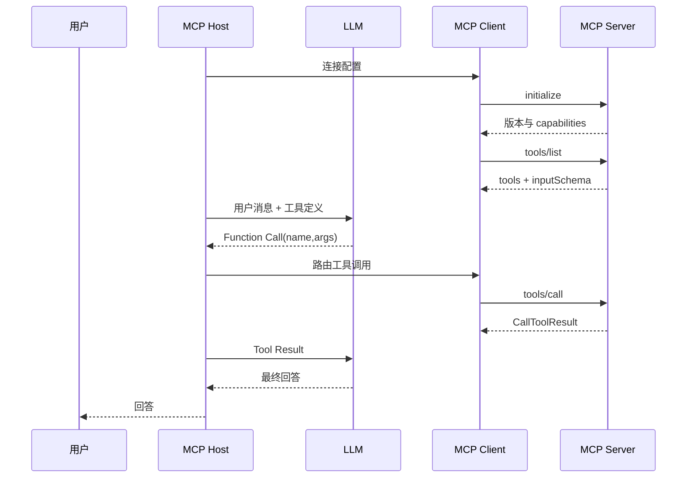

因此，“MCP 将取代 Function Calling”是不准确的。大多数 MCP 工具仍需要某种模型工具调用机制来让模型选择它；MCP 主要替代的是各 Host 对外部工具的一次性、私有适配层。

---

## 15. MCP 与传统 API 的区别

MCP 和 REST/GraphQL/gRPC 并非互斥。

| 维度 | 传统业务 API | MCP |
|---|---|---|
| 主要调用者 | 普通应用代码 | AI Host/MCP Client |
| 接口发现 | OpenAPI、文档、SDK | 协议内 `*/list` |
| 核心对象 | 业务资源和操作 | Tools、Resources、Prompts 等原语 |
| 生命周期 | 由具体 API 决定 | 标准初始化与能力协商 |
| 动态更新 | 轮询、Webhook、自定义流 | 标准 Notifications |
| 模型语义 | 通常没有 | 工具描述、schema、内容块 |
| 本地进程 | 通常不覆盖 | 标准 stdio |
| 远程授权 | API Key/OAuth 等 | 对 HTTP 场景定义 OAuth 体系规范 |

一个常见架构是：

```text
LLM Host → MCP Client → MCP Server → REST API → 业务服务
```

MCP Server 是面向 AI Host 的适配层，REST API 仍是业务系统的稳定接口。

### 15.1 什么时候没必要使用 MCP

- 应用只调用一个固定内部函数；
- 不需要跨 Host 复用；
- 工具与应用同一代码库且不会独立演进；
- 简单 REST API 已完全满足需求；
- 引入新进程、会话和协议层的成本大于收益。

协议带来解耦，也带来额外复杂度。不要为了“用了 MCP”而套一层 MCP。

---

## 16. Python 实现一个最小 MCP Server

下面使用官方 Python SDK 的 FastMCP 高层接口。

### 16.1 安装

```bash
pip install "mcp[cli]"
```

### 16.2 同时提供 Tool、Resource 和 Prompt

```python
from mcp.server.fastmcp import FastMCP

mcp = FastMCP(
    "learning-demo",
    instructions="提供基础计算、课程资料和学习提示词。",
)


@mcp.tool()
def add(a: int, b: int) -> int:
    """计算两个整数的和。"""
    return a + b


@mcp.resource("course://mcp/outline")
def course_outline() -> str:
    """返回 MCP 课程大纲。"""
    return "1. 架构\n2. 生命周期\n3. Tools\n4. Resources\n5. 安全"


@mcp.prompt()
def explain_concept(concept: str, level: str = "beginner") -> str:
    """生成用于解释 MCP 概念的提示词。"""
    return (
        f"请以 {level} 难度解释 MCP 中的 {concept}，"
        "包含定义、工作流程、边界和一个例子。"
    )


if __name__ == "__main__":
    mcp.run(transport="stdio")
```

类型注解和 docstring 会用于生成工具 schema 和描述。真实项目还应补充：

- 输入范围校验；
- 身份和权限检查；
- 超时与取消；
- 结构化错误；
- 日志、追踪和指标；
- 幂等性；
- 测试。

### 16.3 运行 Streamable HTTP

```python
from mcp.server.fastmcp import FastMCP

mcp = FastMCP(
    "remote-demo",
    stateless_http=True,
    json_response=True,
)


@mcp.tool()
def health() -> dict[str, str]:
    """返回服务健康状态。"""
    return {"status": "ok"}


if __name__ == "__main__":
    mcp.run(transport="streamable-http")
```

官方 Python SDK 对生产 Streamable HTTP 推荐优先考虑 `stateless_http=True` 与 `json_response=True`，但是否适用仍取决于服务是否需要状态会话、通知和长任务。

### 16.4 stdio Server 的日志陷阱

错误写法：

```python
print("server started")  # 写入 stdout，会污染 MCP 消息流
```

正确做法：

```python
import logging
import sys

logging.basicConfig(stream=sys.stderr, level=logging.INFO)
logging.info("server started")
```

---

## 17. 配置与调试

### 17.1 本地 stdio 配置

不同 Host 的配置字段可能略有差异，常见形式为：

```json
{
  "mcpServers": {
    "learning-demo": {
      "command": "python",
      "args": ["E:/absolute/path/server.py"],
      "env": {
        "SERVICE_API_KEY": "通过安全方式注入，不要提交到 Git"
      }
    }
  }
}
```

生产或团队环境不要把明文密钥放在共享配置文件中，应使用系统凭据、密钥服务或受保护环境变量。

### 17.2 远程配置

```json
{
  "mcpServers": {
    "remote-demo": {
      "url": "https://example.com/mcp"
    }
  }
}
```

远程服务通常还涉及 OAuth 授权，不能简单把长期 API Key 拼进 URL 查询参数。

### 17.3 MCP Inspector

官方 Inspector 可用于检查初始化、能力列表、Resources、Prompts、Tools 和调用结果：

```bash
npx -y @modelcontextprotocol/inspector
```

调试顺序建议：

1. Server 能否独立启动；
2. stdout 是否只有协议消息；
3. Inspector 能否初始化；
4. `tools/list` 是否返回正确 schema；
5. 使用边界参数调用 Tool；
6. 错误能否返回为可理解的协议结果；
7. 最后再接入真实 Host 和模型。

这能区分“Server 协议错误”和“模型没有选对工具”两类完全不同的问题。

---

## 18. 安全模型与生产实践

MCP 统一连接，也扩大了攻击面。连接 Server 等于向 Host 引入新的数据源和动作入口。

### 18.1 最小权限

- 只暴露完成任务所需的 Tools 与 Resources；
- 数据库默认使用只读账户；
- 文件系统限制在明确目录；
- OAuth 请求最小 scopes；
- 对高风险能力按需进行 step-up authorization；
- 不让一个通用 Tool 接收任意 shell 命令或任意 URL。

### 18.2 不信任工具描述

工具描述、annotations 和 Server instructions 都来自 Server。恶意 Server 可以：

- 声称工具只读，实际执行写入；
- 在描述中注入提示，诱导模型泄露数据；
- 返回包含隐藏指令的内容；
- 使用与其他 Server 相似的工具名进行混淆。

Host 应清晰展示来源，对 Server 进行信任分级，必要时重命名或命名空间化工具。

### 18.3 Human-in-the-loop

以下操作通常需要明确确认：

- 删除或覆盖数据；
- 发邮件、发消息和公开发布；
- 支付、下单、签署；
- 修改权限和凭据；
- 把本地/私有信息发送给远程 Server；
- Sampling 和 Elicitation 中的敏感内容。

确认界面要说明“将调用哪个 Server、执行什么动作、影响哪些数据”，不能只显示“是否允许”。

### 18.4 远程授权

当前 MCP Authorization 规范面向 HTTP 传输并建立在 OAuth 2.1 相关标准上。关键原则包括：

- 验证 token 签名、过期时间、issuer、audience 和 scopes；
- token 必须面向目标 MCP Server；
- 禁止 token passthrough；
- 使用 PKCE 保护公共客户端；
- 优先短期 token；
- 不自行发明密码学和 token 验证逻辑。

stdio 场景通常从环境或系统凭据获得认证信息，不照搬远程 OAuth 流程。

### 18.5 Streamable HTTP 安全

Server 至少应：

- 验证 `Origin`，防止 DNS rebinding；
- 本地服务只绑定 localhost；
- 公网部署使用 TLS；
- 对会话 ID 使用不可预测值；
- 校验 `MCP-Protocol-Version`；
- 设置请求体大小、速率、并发与超时限制；
- 不在错误中泄露堆栈、密钥和内部路径。

### 18.6 工具工程质量

每个有副作用的 Tool 都应考虑：

- 幂等键；
- 事务与回滚；
- 审计日志；
- 重试会不会重复执行；
- 取消是否真的终止下游操作；
- 返回结果是否足够让模型判断成功或失败；
- 用户是否能查看最终影响。

---

## 19. 常见误解与正确性审查

### 19.1 “传统聊天模型完全没有工具调用能力”

更准确的说法：模型本身不会直接触碰外部环境；工具能力由模型的结构化工具调用能力与应用执行层共同构成。即使模型没有原生 Function Calling，也可通过提示词模拟，只是可靠性较低。

### 19.2 “Function Calling 会执行函数”

错误。Function Calling 通常只返回调用请求。执行、权限、错误处理和结果回传都在应用侧。

### 19.3 “MCP 是更高级的 Function Calling”

错误。二者不是前后替代关系，而是不同边界上的接口。MCP Server 的工具经常仍通过模型 Function Calling 被选中。

### 19.4 “MCP 就是统一的 Tool API”

不完整。MCP 包含生命周期、能力协商、Resources、Prompts、Sampling、Elicitation、通知、进度、取消和实验性 Tasks。

### 19.5 “MCP Server 一定是远程服务器”

错误。通过 stdio 运行的本地子进程也是 Server。

### 19.6 “Streamable HTTP 支持任意二进制，所以替代 SSE”

不准确。MCP 消息仍是 UTF-8 JSON-RPC。Streamable HTTP 的核心改进是单 endpoint 的 POST/GET 模型、可选 SSE、多种响应方式和更清晰的会话管理。

### 19.7 “Streamable HTTP 使用 HTTP/2/3 双向流”

不是协议要求。规范以 HTTP POST/GET 和可选 SSE 定义行为，没有要求 HTTP/2 或 HTTP/3。

### 19.8 “接入 MCP Server 就能自动安全使用工具”

错误。协议提高互操作性，不提供自动信任。Host 与 Server 仍要实现认证、授权、审批、隔离、审计和数据保护。

### 19.9 “MCP 配置完全统一”

协议消息和语义是标准化的，但不同 Host 的配置文件位置、字段、认证 UI 与支持能力可能不同。`mcpServers` 是常见宿主配置形式，不是所有产品必须原样使用的协议报文。

### 19.10 “Tools 列表越多越好”

错误。过多工具会增加模型上下文、混淆选择并扩大权限面。Host 应按用户、任务和权限动态筛选。

---

## 20. 对 MCP 设计的进一步思考

### 20.1 MCP 的真正价值是“动态可发现”

只统一 `tools/call` 并不难，困难的是：

- Host 在运行时发现 Server 能力；
- 双方协商可选特性；
- 工具变化后通知 Client；
- 同一协议同时服务本地进程和远程服务；
- 支持 Server 反向请求 Client。

因此 MCP 更像“面向 AI 上下文的插件总线”，而不只是 RPC 格式。

### 20.2 Host 才是信任边界的中心

Server 提供能力，模型提供建议，Host 才同时掌握：

- 用户身份；
- 当前会话；
- Server 来源；
- 模型输出；
- 审批 UI；
- 本地权限；
- 数据流向。

所以 Host 不能把安全责任完全交给模型或 Server。好的 Host 应像浏览器：连接开放生态，但保留来源隔离、权限提示和撤销能力。

### 20.3 Tool 描述是一种“面向模型的用户界面”

传统 API 文档写给开发者；MCP Tool 的名称、description 和 schema 同时写给 Host、开发者和模型。

这带来新的 API 设计要求：

- 名称必须可区分；
- 描述要说明使用时机而非宣传语；
- 参数应少而明确；
- 返回值既适合机器解析，也要便于模型理解；
- 错误应告诉模型是否可以修正参数重试。

### 20.4 Resources 不应被忽视

许多开发者把所有读取都做成 Tool，导致工具膨胀。若内容天然是可定位、可浏览、可订阅的数据，Resource 往往更合适。Tools 表达动作，Resources 表达内容，这个区分有助于权限和上下文管理。

### 20.5 标准化把复杂度从“接入”转移到“治理”

MCP 降低了连接成本，于是组织会更快接入更多 Server。随之而来的问题是：

- 哪些 Server 可信；
- 谁批准了哪些能力；
- 数据去了哪里；
- Tool 版本变化是否破坏任务；
- 如何集中撤销；
- 如何评估模型在数百个 Tools 中的选择质量。

协议解决互操作性，不自动解决治理。大规模使用 MCP 的关键能力最终会是注册、策略、身份、审计和评估。

### 20.6 MCP 不会让所有后端都消失

MCP Server 仍需要可靠的领域代码；Host 仍需要模型编排；业务 API 仍需要稳定契约。MCP 减少的是重复适配，不是工程本身。

---

## 21. 学习与实践路线

### 阶段一：理解消息

手工写出：

- `initialize` 请求与响应；
- `notifications/initialized`；
- `tools/list`；
- `tools/call`；
- 成功和失败结果。

目标是理解 JSON-RPC 的 request、response、notification 和 `id` 关联。

### 阶段二：实现 Server

用官方 SDK 实现：

- 一个只读 Tool；
- 一个带确认的写 Tool；
- 一个 Resource；
- 一个 Prompt；
- 正确写入 stderr 的日志。

用 Inspector 验证所有 schema 与边界输入。

### 阶段三：实现 Client

使用官方 SDK：

1. 启动 stdio Server；
2. 初始化 ClientSession；
3. 列出 Tools；
4. 调用 Tool；
5. 读取 Resource；
6. 获取 Prompt；
7. 处理通知和错误。

### 阶段四：接入模型

将 MCP Tool 转换为模型 Function Calling schema，建立：

```text
模型调用 → MCP tools/call → Tool Result → 模型续答
```

增加工具白名单、schema 校验、调用上限和超时。

### 阶段五：生产化

- Streamable HTTP；
- OAuth 2.1 授权；
- 多租户隔离；
- 审批与审计；
- 可观测性；
- Tool 选择评估；
- 断线、重连、取消和长任务；
- 安全测试与提示词注入测试。

---

## 22. 权威参考资料

本文优先使用 MCP 官方规范和官方 SDK：

- [MCP 官方简介](https://modelcontextprotocol.io/docs/getting-started/intro)
- [MCP 架构概览](https://modelcontextprotocol.io/docs/learn/architecture)
- [MCP 2025-11-25 规范](https://modelcontextprotocol.io/specification/2025-11-25)
- [生命周期](https://modelcontextprotocol.io/specification/2025-11-25/basic/lifecycle)
- [传输层](https://modelcontextprotocol.io/specification/2025-11-25/basic/transports)
- [Tools](https://modelcontextprotocol.io/specification/2025-11-25/server/tools)
- [Resources](https://modelcontextprotocol.io/specification/2025-11-25/server/resources)
- [Prompts](https://modelcontextprotocol.io/specification/2025-11-25/server/prompts)
- [Sampling](https://modelcontextprotocol.io/specification/2025-11-25/client/sampling)
- [Elicitation](https://modelcontextprotocol.io/specification/2025-11-25/client/elicitation)
- [Authorization](https://modelcontextprotocol.io/specification/2025-11-25/basic/authorization)
- [安全最佳实践](https://modelcontextprotocol.io/docs/tutorials/security/security_best_practices)
- [官方 Python SDK](https://github.com/modelcontextprotocol/python-sdk)
- [构建 MCP Server 教程](https://modelcontextprotocol.io/docs/develop/build-server)
- [构建 MCP Client 教程](https://modelcontextprotocol.io/docs/develop/build-client)
- [JSON-RPC 2.0 规范](https://www.jsonrpc.org/specification)

### 最终心智模型

```text
Function Calling：
模型说“我想调用 get_weather(city=广州)”

MCP：
Host 知道去哪个 Server 找 get_weather，
如何发现它、调用它、接收结果、处理通知与协商能力。

业务系统：
真正查询天气、数据库、文件或 SaaS，并承担权限与一致性。
```

> MCP 最重要的意义不是“让模型会调用工具”，而是让不同 AI 应用与不同上下文服务之间形成可发现、可协商、可复用的开放连接层。