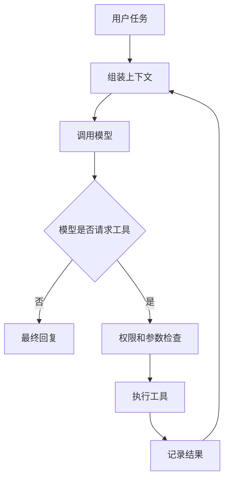
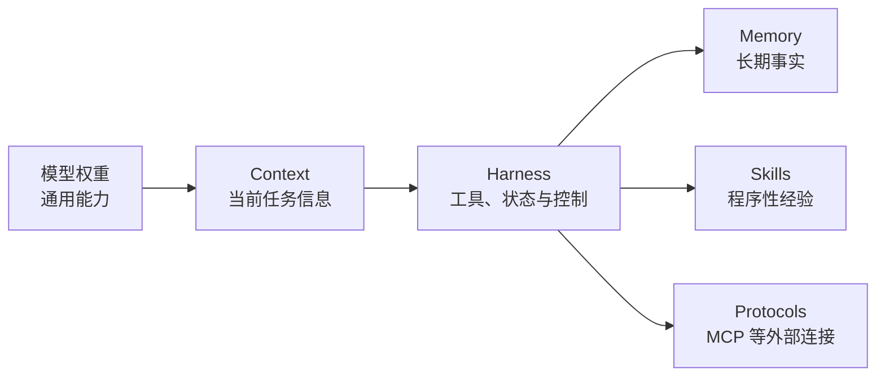
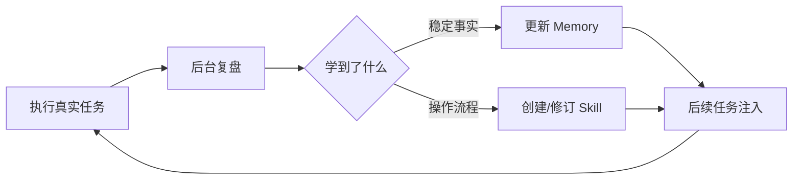
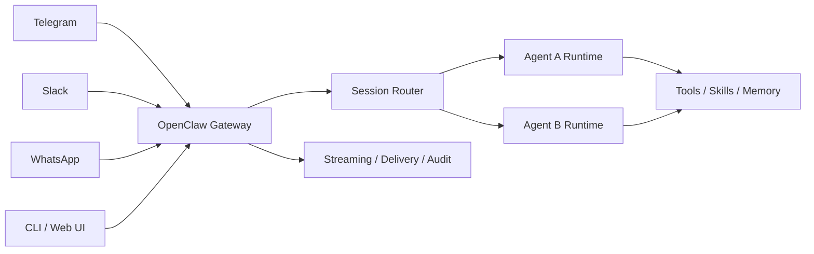
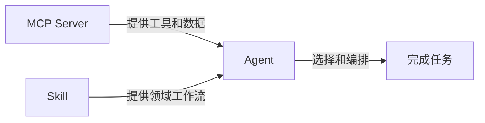
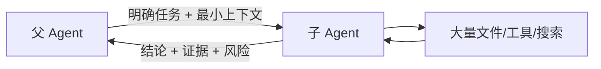
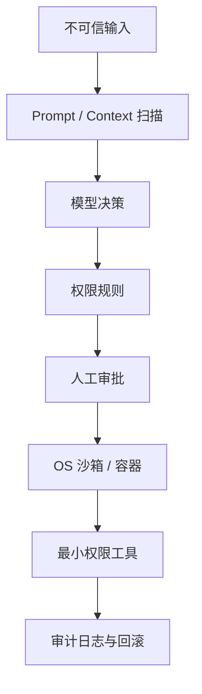
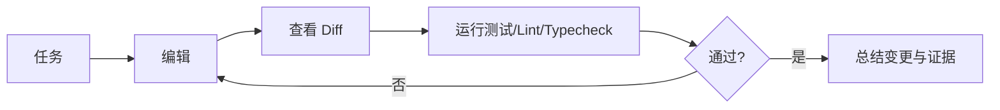

# Hermes、OpenClaw、Codex 与 Claude Code：Agent 与 CLI 学习笔记

> 参考原文：《Hermes Agent 详细讲解 & 本地部署和基于 OpenClaw 迁出的全流程》  
> 整理重点：它们分别用什么机制解决什么问题；不包含安装、本地部署、迁移和卸载步骤。  
> 最后核对：2026-08-14（本次为审阅润色复核）。产品变化较快，命令和能力应以对应官方文档为准。  
> 前置基础：理解 Agent Loop、工具调用与上下文（见《Agent 开发学习笔记：从原理、技术栈到工程落地》第 3、4 章）；Memory、RAG、MCP 等概念可查《Python 实用入门与 AI 开发：语法、API、并发及工程实践》第 36 章术语表。

### 怎么用这份笔记

- **建立比较框架**：先读第 1、4 章，理解“模型 + Harness”和四者的定位差异；
- **按问题查**：多渠道长期在线看第 6 章，软件工程看第 7、8 章，记忆与 Skills 看第 5、11、14 章，安全看第 16 章；
- **快速选型**：第 19 章“如何选择”，第 20 章有四个典型工作流；
- **验证认知**：第 21 章是对原文观点的正确性审查，第 22 章提供分阶段实验；
- **动手前先看**：第 23 章 CLI 速查和第 24 章官方资料，避免把过时命令当长期知识。

## 目录

- [1. 先建立正确的比较框架](#1-先建立正确的比较框架)
- [2. 四者分别是什么](#2-四者分别是什么)
- [3. Agent 系统到底要解决哪些问题](#3-agent-系统到底要解决哪些问题)
- [4. 共同基础：Agent Loop 与 Harness](#4-共同基础agent-loop-与-harness)
- [5. Hermes Agent：用学习闭环解决长期个性化](#5-hermes-agent用学习闭环解决长期个性化)
- [6. OpenClaw：用 Gateway 解决多渠道个人助理](#6-openclaw用-gateway-解决多渠道个人助理)
- [7. Codex：用工程沙箱与多任务工作区解决软件开发](#7-codex用工程沙箱与多任务工作区解决软件开发)
- [8. Claude Code：用终端 Agent 与扩展层解决代码库工作](#8-claude-code用终端-agent-与扩展层解决代码库工作)
- [9. CLI 为什么是 Agent 的重要入口](#9-cli-为什么是-agent-的重要入口)
- [10. 指令文件：SOUL、AGENTS 与 CLAUDE](#10-指令文件soulagents-与-claude)
- [11. Skills：把一次经验变成可复用流程](#11-skills把一次经验变成可复用流程)
- [12. Tools、MCP 与 CLI 工具](#12-toolsmcp-与-cli-工具)
- [13. Subagents、多 Agent 与上下文隔离](#13-subagents多-agent-与上下文隔离)
- [14. Memory、Session 与 Context Compaction](#14-memorysession-与-context-compaction)
- [15. Hooks、自动化与 Gateway](#15-hooks自动化与-gateway)
- [16. 沙箱、审批与安全边界](#16-沙箱审批与安全边界)
- [17. Git、Worktree 与可验证交付](#17-gitworktree-与可验证交付)
- [18. 横向能力对比](#18-横向能力对比)
- [19. 如何选择](#19-如何选择)
- [20. 四个典型工作流](#20-四个典型工作流)
- [21. 原文章节的正确性审查](#21-原文章节的正确性审查)
- [22. 学习路线与实验建议](#22-学习路线与实验建议)
- [23. 常用 CLI 心智速查](#23-常用-cli-心智速查)
- [24. 权威参考资料](#24-权威参考资料)

---

### 章节导读：先看这张表

| 章节 | 回答的核心问题 | 关键概念 |
|---|---|---|
| 1. 先建立正确的比较框架 | 四者是不是同类产品？ | 定位、场景、入口、模型≠产品 |
| 2. 四者分别是什么 | 各自的核心是什么？ | Hermes/OpenClaw/Codex/Claude Code 一页介绍 |
| 3. Agent 系统要解决哪些问题 | 一个可用 Agent 需要什么？ | 问题—机制对照表 |
| 4. 共同基础：Loop 与 Harness | 它们共享什么？ | Agent Loop、Harness、三类外部化 |
| 5~8. 四个产品专章 | 每个产品的独特解法？ | 学习闭环 / Gateway / 工程沙箱 / 终端扩展层 |
| 9. CLI 为什么重要 | 终端入口好在哪？ | 工具总线、可记录重放、接口设计原则、风险 |
| 10. 指令文件 | SOUL/AGENTS/CLAUDE 各放什么？ | 指令不是安全边界 |
| 11. Skills | 经验怎么复用？ | Skill vs Tool、自动生长风险、供应链审查 |
| 12. Tools、MCP 与 CLI | 能力怎么接入？ | 三种接入方式、工具数量控制 |
| 13. Subagents 与多 Agent | 上下文怎么隔离？ | 委派价值、失败模式、worktree |
| 14. Memory 与压缩 | 长期性怎么做对？ | Session/Memory/Context 三分、压缩风险 |
| 15. Hooks 与自动化 | 机械约束怎么做？ | Skill vs Hook、Gateway vs Hook、Automation |
| 16. 沙箱与安全边界 | 危险操作怎么控制？ | 纵深防御、四类风险、安全基线 |
| 17. Git 与可验证交付 | 怎么证明做对了？ | diff/commit/worktree、回滚边界 |
| 18. 横向能力对比 | 一张表看懂差异？ | 设计中心、问题—解法映射 |
| 19. 如何选择 | 我该用哪个？ | 四个选择场景与组合原则 |
| 20. 四个典型工作流 | 实际长什么样？ | 研究助手 / 多渠道助理 / 并行编码 / 受控仓库 |
| 21. 原文正确性审查 | 哪些说法要打折？ | 营销定位、二分法、隐私与隔离的边界 |
| 22. 学习路线与实验 | 怎么动手验证？ | 六阶段实验与比较指标 |
| 23. CLI 心智速查 | 常用命令有哪些？ | 四者 CLI 入口与通用调试法 |
| 24. 权威参考资料 | 去哪里查？ | 官方文档与开放标准 |

---

## 1. 先建立正确的比较框架

Hermes、OpenClaw、Codex 和 Claude Code 都能“让模型做事”，但不是完全同类产品。

| 产品 | 核心定位 | 主要工作场景 | 主要入口 |
|---|---|---|---|
| Hermes Agent | 会积累记忆与技能的通用长期 Agent | 个人助手、研究、自动化、跨渠道任务 | CLI、TUI、桌面端、消息 Gateway |
| OpenClaw | 自托管、多渠道、长期在线的个人 Agent Runtime | 消息平台助手、个人自动化、持续任务 | Gateway、消息渠道、CLI、Web UI |
| Codex | 面向软件工程和可验证知识工作的 Agent 平台 | 编码、重构、测试、审查、并行任务 | CLI、IDE、桌面 App、Cloud、GitHub |
| Claude Code | 以终端和代码库为中心的 Agentic Coding Tool | 代码理解、修改、测试、工程工作流 | CLI、IDE、Web、Agent SDK |

最重要的两个边界：

1. **Claude 是模型与产品家族，Claude Code 才是本文比较的编码 Agent。**单独调用 Claude API，不会自动获得文件编辑、终端、Hooks 和项目指令等能力。
2. **Codex 不只指模型或 CLI。**它还包括 IDE、桌面 App、Cloud、GitHub 代码审查等工作面。

### 1.1 不应只比较“模型聪不聪明”

Agent 的最终表现近似由下列因素共同决定：

```text
Agent 表现 ≈ 模型能力
          × 上下文质量
          × 工具质量
          × 执行与验证循环
          × 状态/记忆设计
          × 安全与权限边界
```

同一个模型放进不同 Harness，表现可能大不相同；强模型接上混乱工具和错误权限，也会变成高风险系统。

---

## 2. 四者分别是什么

### 2.1 Hermes Agent

Hermes Agent 是 Nous Research 开源的通用自主 Agent。官方将其定位为 self-improving agent，突出：

- 从成功或被纠正的任务中创建、更新 Skills；
- 把稳定事实写入 Memory；
- 通过后台 review 和周期性 nudge 形成学习闭环；
- 使用隔离子 Agent 并行委派；
- 通过 Gateway 接入多种消息平台；
- 支持多模型、多种终端后端和 MCP。

“self-improving”主要指**外部记忆、Skills 和用户模型持续变化**，不是模型参数在本地自动训练。

### 2.2 OpenClaw

OpenClaw 是以长期运行 Gateway 为中心的自托管 Agent Runtime。它解决的核心问题是：

> 如何让一个 Agent 长期在线，连接多个消息渠道，管理多个会话、记忆、技能和自动任务，并能通过工具对外部环境采取行动？

它不只是聊天 UI。Gateway 是控制平面，负责消息接入、会话路由、Agent 运行、事件流、持久化和多渠道回送。

### 2.3 Codex

Codex 是 OpenAI 的软件工程 Agent 产品体系：

- CLI 适合本地终端中的仓库工作；
- IDE 扩展利用打开文件、选区和编辑器上下文；
- 桌面 App 适合管理多个并行 Agent 线程和 worktrees；
- Cloud 在隔离环境中异步执行任务；
- GitHub 集成用于代码审查和 PR 工作流。

其核心不是“代码补全”，而是让 Agent 读取代码库、修改文件、运行命令、执行测试并交付可审查证据。

### 2.4 Claude Code

Claude Code 是 Anthropic 的 Agentic Coding Tool。它把 Claude 模型与代码库、Shell、Git 和扩展机制结合：

- `CLAUDE.md` 提供持久项目指令；
- Skills 提供按需知识和工作流；
- MCP 连接外部系统；
- Subagents 隔离和委派任务；
- Hooks 在生命周期事件上提供确定性自动化；
- 权限规则与 OS 沙箱共同限制工具和 Bash。

---

## 3. Agent 系统到底要解决哪些问题

一个实际可用的 Agent，至少要回答以下问题：

| 问题 | 典型解决机制 |
|---|---|
| 模型如何知道项目规则？ | `AGENTS.md`、`CLAUDE.md`、`SOUL.md`、项目上下文文件 |
| 模型如何采取行动？ | 文件工具、Shell、浏览器、业务 API、MCP |
| 如何完成多步骤任务？ | Agent Loop、计划、工具调用、结果回传 |
| 如何避免上下文无限增长？ | 检索、摘要、压缩、隔离子 Agent |
| 如何跨会话记住信息？ | Memory 文件、SQLite、向量/全文检索 |
| 如何复用成功经验？ | Skills、命令、插件、自动生成流程 |
| 如何处理并行任务？ | Subagents、Agent Teams、多线程、worktrees |
| 如何长期在线？ | Gateway、Daemon、Cloud Tasks、Automations |
| 如何控制危险操作？ | 审批、权限规则、Hooks、沙箱、容器 |
| 如何知道它做对了？ | diff、测试、日志、轨迹、引用、回滚 |
| 如何切换模型或服务商？ | Provider abstraction、模型路由、配置层 |
| 如何连接企业系统？ | MCP、连接器、业务 CLI、SDK/API |

四个产品的差异，主要是它们对这些问题的优先级和解法不同。

---

## 4. 共同基础：Agent Loop 与 Harness

### 4.1 最小 Agent Loop



伪代码：

```python
def run_agent(messages, tools):
    while True:
        response = model.invoke(messages, tools=tools)
        messages.append(response)

        if not response.tool_calls:
            return response

        for call in response.tool_calls:
            validate_permissions(call)
            result = execute_tool(call)
            messages.append(tool_result(call.id, result))
```

### 4.2 Harness 才是产品差异所在

Harness 是围绕模型循环的全部系统：

- system prompt 和项目指令；
- 工具注册、描述和路由；
- 权限与审批；
- 上下文压缩；
- Memory 与 Skills；
- 子 Agent；
- 事件流和 UI；
- 会话持久化；
- 任务队列；
- 测试、回滚和日志。

“Agent 产品”本质上是模型加 Harness，而不是一段无限循环代码。

### 4.3 三类外部化

可以把现代 Agent 的能力概括成三种外部化：



- Memory 外部化“记住什么”；
- Skills 外部化“怎么做”；
- MCP/CLI 外部化“能调用什么”。

---

## 5. Hermes Agent：用学习闭环解决长期个性化

### 5.1 它主要解决的问题

通用 Agent 每次都从头开始，会出现：

- 用户反复解释偏好；
- 成功过的复杂流程下次仍重新探索；
- 用户纠正无法沉淀；
- 长期助手只保存聊天，却没有可复用操作经验。

Hermes 的核心答案是闭环：



### 5.2 Memory 与 Skills 分工

官方定义的边界很有价值：

- Memory 保存短小、稳定、经常需要的事实；
- Skills 保存较长、只在相关任务中加载的程序性知识。

例子：

```text
Memory：用户偏好用中文、提交信息遵循 Conventional Commits。
Skill：完成一次发布需要检查版本、运行测试、生成 changelog、打标签。
```

如果把整个发布流程塞进 Memory，每轮都要付上下文成本；如果把“用户用中文”放进 Skill，可能无法在普通对话中稳定生效。

### 5.3 Agent-Managed Skills

Hermes 的 `skill_manage` 允许 Agent 创建、patch、重写或删除 Skill。官方列出的触发场景包括：

- 成功完成包含多次工具调用的复杂任务；
- 经历失败后找到正确路径；
- 用户纠正了做法；
- 发现非显然的工作流。

这解决的是**程序性记忆自动形成**，但也引入新风险：

- 错误经验被固化；
- 临时 workaround 变成长期规则；
- Skill 随环境变化而失效；
- Agent 修改自身未来行为，造成漂移。

因此 Hermes 提供 Skills 写入审批和安全扫描。值得注意的是，官方当前配置中 agent skill 写入默认可自由发生，若用于敏感环境，应开启写入审批并定期 review diff。

### 5.4 多层记忆与检索

Hermes 的长期性不仅靠一份 Markdown：

- SQLite 保存会话元数据、消息、工具调用和 token；
- FTS5 提供跨会话关键词搜索；
- Memory/User 文件保存稳定事实与用户画像；
- 可插拔记忆提供更深层检索或用户建模；
- 长会话通过压缩减少活动上下文。

“保存历史”和“模型每轮看到全部历史”是两回事。保存可以完整，注入必须有预算。

### 5.5 Delegation 与上下文隔离

Hermes 可把任务交给独立子 Agent：

- 子 Agent 不继承主会话完整历史；
- 主 Agent 只接收结果或摘要；
- 可给子任务选择不同模型；
- 可以并行执行多个工作流。

它主要解决：

1. 主上下文被大量中间过程污染；
2. 多个独立子任务串行过慢；
3. 简单子任务使用昂贵主模型；
4. 不可信资料直接污染主 Agent 判断。

但“父 Agent 看不到子 Agent 中间过程”只是隔离机制，不等于彻底消除 prompt injection。子 Agent 的最终摘要仍可能包含误导，工具结果也可能有副作用。

### 5.6 Programmatic Tool Calling

Hermes 的 `execute_code` 让 Agent 编写短程序，通过沙箱 RPC 组合工具。它试图解决传统工具调用的 token 开销：

```text
传统：模型 → 工具 A → 模型 → 工具 B → 模型 → 工具 C
程序化：模型 → 生成控制程序 → 程序调用 A/B/C → 汇总结果 → 模型
```

适合循环、过滤、聚合和批量任务；不适合让未经检查的代码获得无限本机权限。

### 5.7 Hermes 的产品取向

Hermes 更像“能学习个人工作方式的通用 Agent Runtime”，而不是只服务代码库：

- 支持多渠道；
- 支持定时任务；
- 支持多模型；
- 可长期保存会话；
- Skills 与 Memory 有主动写入循环；
- 重点在长期成长和模型无关性。

---

## 6. OpenClaw：用 Gateway 解决多渠道个人助理

### 6.1 它主要解决的问题

如果用户希望 Agent 像“数字员工”一样长期在线，会遇到：

- 消息来自 Telegram、Slack、WhatsApp 等不同渠道；
- 每个渠道事件格式不同；
- 同一个用户需要稳定会话；
- 任务可能持续很久；
- Agent 要主动通知、定时执行和跨设备访问；
- 多个 Agent 需要不同人格、工作区、工具和权限。

OpenClaw 的答案是单一长生命周期 Gateway。

### 6.2 Gateway 架构



官方架构中，一个长期运行的 Gateway：

- 拥有消息渠道连接；
- 通过 WebSocket 提供控制平面；
- 路由 session；
- 触发 Agent loop；
- 发送 lifecycle、assistant、tool 事件；
- 将最终结果回送原渠道。

这与“一次启动一次退出的 Coding CLI”有根本差异。

### 6.3 Agent Loop 的工程化

OpenClaw 把一次 turn 明确分成：

1. Gateway RPC 验证参数并解析 session；
2. 立即返回 run ID；
3. 运行时加载模型、认证、Skills 快照和工作区；
4. 串行化同一 session 的执行；
5. 流式发送模型与工具事件；
6. 强制 timeout；
7. 保存消息和使用量；
8. 回送消息。

它主要解决多渠道环境中**并发、重复输出、会话顺序、超时和投递**问题。

### 6.4 文件式 Memory

OpenClaw 官方 Memory 设计强调透明：

- `MEMORY.md` 保存长期事实、偏好和决策；
- `memory/YYYY-MM-DD.md` 保存每日记录；
- 可选 `DREAMS.md` 保存 dreaming sweep 供人复核；
- 模型只记得写进磁盘并在后续被加载或检索的内容。

优点：

- 人类可阅读、可修改、可备份；
- 不依赖隐藏状态；
- 易与 Git/同步工具结合。

缺点：

- 文件会膨胀；
- 写入质量依赖模型；
- 敏感信息可能长期留存；
- 文件被污染后会持续影响后续会话。

### 6.5 Skills 作为能力扩展

OpenClaw 通过 Skills 把外部工具用法和流程封装为 Markdown 指令。它解决了社区复用和快速扩展，但 Skill 经常具有较高权限，因此风险类似“安装插件 + 执行代码”，而不是“下载一篇提示词”。

### 6.6 OpenClaw 的产品取向

OpenClaw 更像“个人 Agent 操作系统的 Gateway 层”：

- 核心是长期在线和渠道统一；
- 本地工作区与文件式记忆；
- 可配置多个 Agent；
- 适合跨平台消息驱动自动化；
- 风险集中在 Gateway 暴露、长期凭据、Skills 供应链和广泛系统权限。

---

## 7. Codex：用工程沙箱与多任务工作区解决软件开发

### 7.1 它主要解决的问题

软件工程 Agent 与个人聊天助手不同：

- 必须理解完整代码库，不只回答代码片段；
- 必须修改多个文件并保持一致；
- 必须运行测试、lint 和类型检查；
- 必须展示 diff 和证据；
- 多个任务要并行但不能互相污染 Git 状态；
- 长任务可能需要转到云端；
- 代码和凭据不能随意外泄。

Codex 围绕“工程环境 + 可验证执行”设计。

### 7.2 Codex CLI

Codex CLI 是终端优先的本地 Agent。它能：

- 读取和搜索仓库；
- 修改文件；
- 运行命令和测试；
- 展示计划、工具调用和 diff；
- 使用图像作为上下文；
- 连接 MCP；
- 在长对话中压缩上下文；
- 依据审批和沙箱限制动作。

CLI 的优势是直接复用现有工程工具：Git、编译器、测试框架、包管理器、脚本和项目 CLI。

### 7.3 `AGENTS.md`

`AGENTS.md` 为 Codex 提供持久仓库规则：

- 项目结构；
- 构建和测试命令；
- 编码规范；
- 验证要求；
- 子目录特有规则。

它解决“每次任务都重新解释项目约定”的问题。更靠近文件的嵌套指令适用于对应子树，使大型 monorepo 能表达局部规则。

### 7.4 Skills、Plugins、MCP 与 Hooks

Codex 的可扩展面各自承担不同责任：

| 扩展面 | 解决的问题 |
|---|---|
| Skill | 可复用的任务知识、工作流、脚本和参考资料 |
| Plugin | 将 Skills、工具、MCP、Hooks、资源等打包分发 |
| MCP/App Connector | 连接实时外部数据和动作 |
| Hook | 在工具调用、命令或编辑生命周期进行机械执行/约束 |
| `config.toml` | 项目或个人的模型、沙箱、MCP、Hooks 等设置 |
| `AGENTS.md` | 持久项目约定和验证要求 |

它们不是不同名字的 prompt。选择标准是作用域和确定性。

### 7.5 沙箱与审批

Codex 将安全边界显式产品化：

- 默认使用沙箱限制文件系统和网络；
- 工作区内写入与工作区外动作可以分开授权；
- 高权限命令需要审批；
- 云任务在隔离环境运行；
- 可限制云环境网络域名；
- 任务交付包括终端日志、测试结果和变更证据。

安全目标不是保证模型永不犯错，而是缩小错误影响范围，并让用户能审查。

### 7.6 Codex App 与多 Agent

桌面 App 主要解决“终端不适合监督多个长期任务”：

- 每个任务在独立 thread 中；
- 支持并行运行；
- 使用 worktree 隔离同一仓库的不同 Agent；
- 直接审查 diff；
- 可在本地、IDE 和 Cloud 之间衔接；
- Automations 可定期运行任务。

这是一种“Agent 指挥中心”设计，而不是 Gateway 式消息机器人设计。

### 7.7 Codex Cloud

Cloud 适合：

- 长时间异步任务；
- 多任务并行；
- 不占用本地终端；
- 在隔离容器中运行；
- 生成可审查提交或 PR。

它的代价是环境复现、凭据注入、网络策略和本地未提交状态需要额外处理。

---

## 8. Claude Code：用终端 Agent 与扩展层解决代码库工作

### 8.1 它主要解决的问题

Claude Code 的核心问题与 Codex CLI 接近：让 Claude 不只生成代码，而是进入代码库、使用终端、修改、运行和验证。

### 8.2 核心工作环境

启动于项目目录后，Claude Code 可以在权限边界内访问：

- 项目文件；
- Shell 命令；
- Git 状态；
- `CLAUDE.md`；
- Auto Memory；
- MCP、Skills、Subagents 等扩展。

核心循环仍是“理解 → 工具 → 观察 → 继续”，产品差异在扩展机制和安全控制。

### 8.3 `CLAUDE.md`

`CLAUDE.md` 解决持久上下文问题：

- 项目命令；
- 代码规范；
- 架构约定；
- 不可违反的项目原则；
- 常见错误和注意事项。

它会自动加载，因此应该短小。官方建议把大块参考资料放进按需 Skills，避免每轮占用上下文。

### 8.4 Skills

Claude Code Skill 可以是：

- 参考知识；
- 可手动执行的 `/name` 工作流；
- Claude 自动匹配的按需能力；
- 给 Subagent 预加载的专业说明。

Skill description 会用于触发匹配，完整正文仅在使用时加载。副作用较强的 Skill 可设置为只能由用户调用，降低误触风险和上下文成本。

### 8.5 Subagents 与 Agent Teams

Subagent 使用独立上下文完成局部任务，返回摘要；Agent Teams 是多个独立会话共享任务和互相通信的更强协作形态。

- Subagent 适合搜索、审查和一次性研究；
- Agent Teams 适合需要同伴协作、互相挑战和分工的复杂任务；
- Teams 成本更高，且官方仍将其视为实验性能力。

### 8.6 Hooks

Hooks 是 Claude Code 非常鲜明的控制面：

- `PreToolUse` 可在工具执行前阻止或要求确认；
- `PostToolUse` 可自动运行格式化或测试；
- Session/Compact/Subagent 等事件可触发脚本、HTTP、MCP Tool、Prompt 或 Agent。

关键区别：

> `CLAUDE.md` 和 Skill 是给模型的要求；Hook 是事件触发的外部执行与约束。

“不要读取 `.env`”写进 prompt 不是硬保证；PreToolUse Hook 和权限 deny 才更接近机械执行。

### 8.7 Permissions 与 Sandbox

Claude Code 将二者分开：

- Permissions 决定哪些工具、文件、命令或域名允许、询问或拒绝；
- Sandbox 在 OS 层限制 Bash 及其子进程的文件系统与网络。

权限阻止 Agent 尝试，沙箱阻止命令越界，二者构成纵深防御。

---

## 9. CLI 为什么是 Agent 的重要入口

CLI 并不只是“没有图形界面的聊天框”。它天然拥有适合 Agent 的组合能力。

### 9.1 CLI 是通用工具总线

Agent 不必为每项能力都实现专用 API：

```text
git / rg / pytest / npm / docker / kubectl / gh / jq / curl / ffmpeg
```

只要命令设计良好，模型就能组合使用。

### 9.2 CLI 输出可记录、可重放

命令、参数、退出码、stdout/stderr 都适合形成轨迹。相比鼠标操作，CLI 更容易：

- 复现；
- 审计；
- 写进 Skill；
- 加入测试；
- 放进 Hook；
- 在 CI 中运行。

### 9.3 CLI 与 Agent 的接口设计原则

适合 Agent 使用的 CLI 应：

- 支持 `--json` 或结构化输出；
- 使用明确退出码；
- 非交互模式可显式开启；
- `--dry-run` 可预览副作用；
- 幂等或支持 idempotency key；
- 错误信息说明如何修复；
- 参数稳定且可发现；
- 输出不过度冗长；
- 密钥不出现在命令行和日志中。

### 9.4 CLI 的风险

Shell 也是最宽泛的能力之一：

- 命令注入；
- 通配符误操作；
- 工作目录错误；
- 继承密钥环境变量；
- 网络外传；
- 跨目录删除；
- 重试造成重复副作用。

因此 Agent CLI 必须与审批、沙箱、工作目录检查和最小权限一起使用。

---

## 10. 指令文件：SOUL、AGENTS 与 CLAUDE

### 10.1 它们解决同一大类问题

模型默认不知道你的长期规则。指令文件把“每次都要说的话”放进版本化文本。

| 文件/机制 | 更适合放什么 |
|---|---|
| `SOUL.md` | 人格、语气、价值取向、长期助手身份 |
| `AGENTS.md` | 仓库结构、命令、开发规范、验证要求 |
| `CLAUDE.md` | Claude Code 的项目上下文、规范与工作指令 |
| `MEMORY.md` / `USER.md` | 稳定事实、偏好、历史决策 |
| Skill | 较长、按需加载的流程或专业知识 |

### 10.2 指令不是安全边界

以下内容不能只靠 Markdown 保证：

```text
不要删除文件。
不要上传密钥。
一定要运行测试。
```

更可靠的对应方式：

- 删除文件：权限规则、审批和沙箱；
- 上传密钥：网络限制、DLP 和环境隔离；
- 必须测试：Hook、CI 和合并门禁。

### 10.3 好指令文件的写法

- 写具体命令，不写“做好测试”；
- 写验证标准，不写空泛角色扮演；
- 指明目录作用域；
- 避免重复 README；
- 冲突规则要显式解决；
- 经常使用的规则保持短小；
- 大段手册拆到 Skills 或引用文件。

---

## 11. Skills：把一次经验变成可复用流程

### 11.1 Skill 解决什么问题

Prompt 是一次性的，Skill 是可发现、可复用、可版本化的程序性知识。

```text
任务经验 → 抽象步骤 → Skill 文档/脚本 → 后续按需加载 → 执行 → 改进
```

### 11.2 Skill 不等于 Tool

| Skill | Tool |
|---|---|
| 告诉 Agent 如何做 | 真正执行某个动作 |
| Markdown、参考资料、脚本 | 函数、CLI、MCP Tool、API |
| 需要模型理解和编排 | 参数明确、返回明确 |
| 适合工作流与知识 | 适合原子动作和数据访问 |

例子：

- GitHub Tool：获取 PR diff；
- Code Review Skill：如何检查正确性、安全、测试和兼容性。

### 11.3 Hermes 的主动生长 vs 其他工具的显式维护

Hermes 把自动创建和改进 Skills 作为核心学习循环；OpenClaw、Codex、Claude Code 也能创建或修改 Skill，但通常更强调用户、仓库或插件维护，而不是把自动生长作为主要产品叙事。

自动生成的优势：个性化、低维护、快速沉淀。  
自动生成的风险：行为漂移、错误固化、权限扩大、难以复现。

### 11.4 Skill 供应链

安装 Skill 应像审查代码：

1. 检查来源和版本；
2. 阅读 `SKILL.md`；
3. 检查脚本和依赖；
4. 搜索网络请求、密钥访问和破坏命令；
5. 在低权限沙箱测试；
6. 固定版本或内容哈希；
7. 更新前审查 diff。

“纯 Markdown”也可能提示 Agent 调用危险工具，不能因为没有二进制就视为无害。

---

## 12. Tools、MCP 与 CLI 工具

### 12.1 三种常见能力接入

| 接入方式 | 适合场景 | 优点 | 局限 |
|---|---|---|---|
| 内置 Tool | 高频核心能力 | 集成深、体验稳定 | 需要产品维护 |
| CLI | 本地工程工具 | 可组合、可审计、生态大 | Shell 权限宽、输出不总稳定 |
| MCP | 外部服务与标准化工具 | 发现、schema、跨语言 | 连接和信任治理更复杂 |

### 12.2 MCP 解决连接，Skill 解决使用方式



例如：MCP 连接数据库，Skill 说明表结构、查询规范和隐私限制。

### 12.3 不要暴露过多工具

工具越多：

- schema 占用越大；
- 选错概率越高；
- 名称冲突越多；
- 权限面越宽；
- 提示词注入影响越严重。

应按任务、角色和工作区动态筛选，而不是把所有工具一次交给模型。

---

## 13. Subagents、多 Agent 与上下文隔离

### 13.1 为什么要委派

主 Agent 的上下文是稀缺资源。一个研究任务读取 100 个文件，主会话未必需要看到全过程。

Subagent 的典型流程：



### 13.2 Subagent 的四个价值

- 上下文隔离；
- 并行执行；
- 模型分级；
- 专业化工具和指令。

### 13.3 委派的常见失败

- 任务太模糊；
- 子 Agent 没拿到必要文件或约束；
- 父 Agent 无法验证摘要；
- 两个 Agent 同时修改同一文件；
- 并行成本超过节省时间；
- 递归委派失控。

### 13.4 Worktree 解决写冲突

对于代码任务，独立 Git worktree 比共享目录更安全：

```text
Agent A → worktree-A → feature implementation
Agent B → worktree-B → tests
Agent C → worktree-C → security review
```

结果通过 diff、commit 或 patch 汇合，而不是让三个 Agent 抢同一个工作目录。

---

## 14. Memory、Session 与 Context Compaction

### 14.1 三个概念必须分开

| 概念 | 作用 |
|---|---|
| Session persistence | 保存完整对话和工具轨迹，可恢复或审计 |
| Memory | 提炼跨会话需要的事实与偏好 |
| Context | 当前这一次模型调用实际看到的信息 |

保存了不等于每轮都发送给模型。

### 14.2 为什么需要压缩

长对话会导致：

- token 成本上升；
- 响应变慢；
- 旧信息干扰当前任务；
- 超出上下文窗口；
- 工具结果淹没关键约束。

压缩策略：

```text
保留：当前目标、未完成事项、关键决策、最近交互、文件路径
摘要：早期讨论、已完成步骤、长日志
丢弃：重复输出、可重新查询内容、无关细节
```

### 14.3 压缩的风险

摘要不是无损压缩。它可能：

- 丢失限定条件；
- 把猜测写成事实；
- 忘记失败路径；
- 失去具体证据。

关键状态应结构化保存，必要时回查原始 transcript，而不是只信摘要。

### 14.4 Memory 写入也要治理

长期记忆应支持：

- 用户可见；
- 来源可追踪；
- 可编辑、删除和过期；
- 敏感信息分类；
- 写入审批；
- 多用户隔离。

Hermes 的 write approval、OpenClaw 的透明 Markdown、Claude Code 的 Auto Memory、Codex 的线程与持久指令，代表不同取舍。

---

## 15. Hooks、自动化与 Gateway

### 15.1 Skill 与 Hook 的边界

```text
Skill：模型看到流程，然后判断怎样执行。
Hook：事件发生时，外部机制必定触发。
```

适合 Hook：

- 文件编辑后运行 formatter；
- 命令前检查危险模式；
- Session 结束时归档；
- 修改关键文件后通知；
- 自动收集审计记录。

适合 Skill：

- 发布流程；
- 代码审查方法；
- 事故响应 playbook；
- 数据分析步骤。

### 15.2 Gateway 与 Hook 不是同一层

Gateway 是长期运行的控制平面；Hook 是生命周期事件处理器。

OpenClaw/Hermes Gateway 解决多渠道和长期在线；Codex/Claude Code Hooks 主要解决工作流中的机械自动化与策略执行。

### 15.3 Automation 的两类形态

- 时间驱动：Cron、定时任务、周期 monitor；
- 事件驱动：文件变更、PR、消息、工具调用、Session 生命周期。

时间驱动适合日报、巡检；事件驱动适合 lint、审批、审计。

---

## 16. 沙箱、审批与安全边界

### 16.1 Agent 安全不是一个开关



每层都可能失效，因此需要纵深防御。

### 16.2 四类风险

1. **模型错误**：误解目标、参数错误、循环；
2. **提示词注入**：网页、邮件、文件诱导 Agent；
3. **供应链**：恶意 Skill、插件、MCP Server、CLI 包；
4. **权限过大**：Agent 可读密钥、写全盘、任意联网。

### 16.3 产品侧重点

- Hermes：命令风险分类、写入安全、容器后端、MCP 凭据过滤、上下文扫描、Session 隔离；
- OpenClaw：Gateway 暴露、渠道认证、Skills 和长期凭据治理尤其关键；
- Codex：工作区沙箱、网络默认限制、审批、云隔离和可验证日志；
- Claude Code：Permissions、deny/ask/allow、PreToolUse Hooks 和 Bash OS 沙箱。

### 16.4 “本地运行”不等于隐私绝对安全

即使状态保存在本地：

- 模型 API 仍可能收到 prompt、代码和工具结果；
- Browser/搜索/MCP 会向外部服务发送数据；
- 日志可能记录敏感内容；
- 本地恶意 Skill 可读取文件；
- 消息平台本身是第三方渠道。

应画出真实数据流，而不是只看程序安装在哪里。

### 16.5 推荐安全基线

- 独立低权限用户运行；
- 工作目录白名单；
- 默认无外网或域名 allowlist；
- 密钥最小 scope 和短期 token；
- 高风险写操作人工确认；
- Skills/Plugins/MCP 固定来源和版本；
- 读写工具分离；
- 写操作幂等并可回滚；
- Session、Memory 和 Trace 有保留期；
- 定期审查 Agent 自生成的 Skills 和 Memory。

---

## 17. Git、Worktree 与可验证交付

Coding Agent 的关键不是“生成了多少代码”，而是是否能证明结果可靠。

### 17.1 最小验证闭环



### 17.2 为什么 Git 很适合 Agent

- diff 提供明确变更集；
- commit 是可回退检查点；
- branch/worktree 隔离任务；
- blame/history 提供设计背景；
- PR 提供人类审查界面。

### 17.3 回滚不是万能撤销

文件检查点只能回滚受跟踪文件变化，无法自动撤销：

- 已发送邮件；
- 已执行支付；
- 远程数据库更新；
- 外部 API 副作用；
- 已泄露的秘密。

因此副作用审批必须发生在执行之前。

---

## 18. 横向能力对比

### 18.1 设计中心

| 维度 | Hermes Agent | OpenClaw | Codex | Claude Code |
|---|---|---|---|---|
| 第一目标 | 长期成长的通用 Agent | 多渠道长期个人助理 | 软件工程 Agent 平台 | 终端/代码库 Agent |
| 核心控制面 | Learning loop + Gateway | Gateway | CLI/App/Cloud threads | CLI + extension layer |
| 主要状态 | SQLite + Memory + Skills | Workspace Markdown + sessions | Thread、repo、Cloud task | Session、Auto Memory、CLAUDE.md |
| 主要扩展 | Tools、Skills、MCP、Providers | Skills、Tools、channels | Skills、Plugins、MCP、Hooks | Skills、Subagents、MCP、Hooks、Plugins |
| 长期在线 | 强 | 核心能力 | Automations/Cloud | 可通过 Web/SDK/Channels，非单一核心 |
| 多渠道消息 | 强 | 核心能力 | 连接器/应用场景，非主定位 | Channels/集成可用，代码工作为主 |
| 编码深度 | 通用工具可做 | 通用工具可做 | 核心定位 | 核心定位 |
| 自生成 Skills | 核心叙事与内置闭环 | 可扩展但非唯一中心 | 可由 Agent 创建，通常显式工作流 | 可创建，通常显式维护 |
| 多 Agent | Delegation | 多 Agent 路由/并行 lanes | 多 thread、worktree、Cloud | Subagents、Agent Teams |
| 模型中立 | 强 | 强 | OpenAI 模型体系 | Claude 模型体系 |

### 18.2 问题—解法映射

| 问题 | Hermes | OpenClaw | Codex | Claude Code |
|---|---|---|---|---|
| 记住用户 | Memory、User profile、Honcho | MEMORY/daily memory | 线程、指令、可用记忆表面 | Auto Memory、CLAUDE.md |
| 复用流程 | 自动/手动 Skills | Skills/工作区配置 | Skills/Plugins/AGENTS | Skills/Plugins/CLAUDE |
| 外部系统 | Tools、MCP、Gateway | Tools、Skills、MCP/集成 | MCP、App connectors、CLI | MCP、CLI、Web/Chrome |
| 长任务 | Session、background、Gateway | Gateway run、queue、timeout | Cloud tasks、threads | Subagents/Teams/Web/SDK |
| 并行 | 隔离子 Agent | 多 Agent/并行执行 | 多 Agent + worktree | Subagents + Teams |
| 规则执行 | Approval、安全扫描 | Gateway policy/skills/sandbox | 沙箱、审批、Hooks | Permissions、Sandbox、Hooks |
| 追踪 | SQLite trajectory | events、transcript、audit | terminal log、diff、tests | transcript、tool output、hooks |

### 18.3 不是“谁全面谁就最好”

每多一项能力，都增加：

- 配置复杂度；
- 上下文噪音；
- 权限面；
- 故障模式；
- 成本；
- 运维负担。

正确选择取决于任务边界，而不是功能数量。

---

## 19. 如何选择

### 19.1 选择 Hermes Agent

适合：

- 希望通用 Agent 长期学习个人偏好；
- 看重自动形成程序性 Skills；
- 需要模型供应商中立；
- 需要消息 Gateway、定时任务与多种执行后端；
- 愿意治理自生成 Memory/Skills。

不适合：只需要一个严格、固定、可审计的单用途自动化，此时普通程序或工作流引擎更简单。

### 19.2 选择 OpenClaw

适合：

- 想让 Agent 长期在线；
- 消息渠道是主要交互界面；
- 需要本地透明记忆和多 Agent 路由；
- 愿意承担 Gateway、安全和 Skills 供应链运维。

不适合：只想在代码仓库完成临时编码任务。

### 19.3 选择 Codex

适合：

- 主要任务是编码、测试、重构和审查；
- 需要本地 CLI、IDE、桌面多 Agent 与 Cloud 衔接；
- 重视 worktree、沙箱、diff 和验证证据；
- 已使用 OpenAI/Codex 产品体系。

不适合：主要目标是自托管的 Telegram/微信长期生活助理。

### 19.4 选择 Claude Code

适合：

- 终端和代码库是主要工作界面；
- 需要细粒度的 Skills、Subagents、Hooks、MCP 和 Permissions；
- 想让团队把工程规则写入 `CLAUDE.md` 与插件；
- 已使用 Claude 模型或 Anthropic Agent SDK。

不适合：需要完全模型中立的 Harness，或主要需求是非编码多渠道 Gateway。

### 19.5 它们可以组合吗

可以，但要避免两个 Agent 同时拥有同一写权限。例如：

- OpenClaw 负责消息入口，编码任务转成 Codex/Claude Code 受控任务；
- Hermes 负责长期记忆和任务分发，代码修改由隔离 Coding Agent 执行；
- Codex/Claude Code 通过 MCP 使用外部服务；
- Skills 传达流程，CLI/MCP 执行动作。

组合时必须明确：谁是最终调度者、谁能写文件、谁保存 Memory、谁审批副作用。

---

## 20. 四个典型工作流

### 20.1 长期研究助手：Hermes

```text
用户提出研究主题
→ 主 Agent 制定方向
→ 子 Agent 并行检索
→ 主 Agent 汇总结论
→ 后台 review 保存用户偏好
→ 将稳定研究流程更新为 Skill
→ 下次自动复用
```

关键检查：新 Skill 是否值得长期保留，引用是否可验证，Memory 是否包含敏感内容。

### 20.2 多渠道个人助理：OpenClaw

```text
Telegram 消息
→ Gateway 识别用户与 session
→ 加载 workspace、Memory、Skills
→ 模型决定调用日历工具
→ 审批后执行
→ Gateway 将结果回送 Telegram
→ Session 持久化
```

关键检查：Gateway 不暴露公网、用户身份正确、日历写入有确认。

### 20.3 并行软件任务：Codex App/Cloud

```text
任务 A、B、C
→ 创建独立 threads/worktrees
→ Agent 分别修改与测试
→ 每个任务返回 diff 和验证结果
→ 人类审查
→ 选择性合并
```

关键检查：worktree 基线一致，测试真实运行，未覆盖用户未提交改动。

### 20.4 受控仓库工作流：Claude Code

```text
加载 CLAUDE.md
→ 使用 Skill 获取发布流程
→ Subagent 审查变更
→ 主 Agent 修改代码
→ PostToolUse Hook 运行 formatter
→ Permissions/Sandbox 限制命令
→ 测试通过后总结
```

关键检查：Hooks 是否真的执行，Skill 是否适用当前版本，MCP 连接是否仍在线。

---

## 21. 原文章节的正确性审查

### 21.1 “Hermes 是唯一会自我成长的 Agent”

这是官方营销定位，不宜作为可验证的绝对事实。更严谨的表述：Hermes 将 Agent 管理的 Memory、Skills、后台 review 和用户建模组成显式闭环，并把它作为核心产品特性。

### 21.2 “Hermes 的 Skill 主要自己生长，OpenClaw 主要靠市场”

这个对比抓住了产品侧重点，但过度二分。Hermes 同样有 Skills Hub 和第三方 Skills；OpenClaw 也可在本地创建和维护 Skills。真正差异是 Hermes 把自动创建/修订纳入内置学习循环。

### 21.3 “本地 Skill 从源头避免外部攻击”

只减少第三方供应链风险，不能消除风险。Agent 可能从恶意网页学到错误流程，也可能把临时错误固化。自生成 Skill 仍需扫描、写入审批和 diff review。

### 21.4 “子 Agent 隔离能防止 Prompt Injection”

它能降低主上下文污染，但不能保证安全：

- 子 Agent 可能执行了有副作用的工具；
- 最终摘要可能仍被操纵；
- 父 Agent 可能无条件信任结论；
- 共享文件和网络仍是侧通道。

### 21.5 “本地部署意味着隐私安全”

不成立。模型 API、浏览器、消息平台、MCP 和遥测仍可能传输数据。应审计完整数据流与日志，而不是只看 Agent 状态是否存本地。

### 21.6 “Codex/Claude Code 只服务 Coding”

它们以软件工程为第一场景，但工具、浏览器、MCP、文档和自动化使其能完成部分知识工作。仍不应把它们直接等同于长期在线个人 Gateway。

### 21.7 安全事故数字

原文引用了特定新闻中的事故和恶意 Skills 比例。此类数字高度依赖样本、时间和定义，本笔记不重复作为普遍结论。可靠结论是：第三方 Skills 和拥有系统权限的 Agent 构成真实供应链与权限风险，应逐项审计。

### 21.8 版本变化

原文部分命令、平台支持和默认配置可能已经变化。例如 Hermes 当前官方文档已列出 Windows 原生方式，并对 Skill/Memory 写入审批提供更明确配置。本文不整理部署步骤，以避免把短期命令固化成长期知识。

---

## 22. 学习路线与实验建议

> 前置要求：已能运行任意一种 Agent CLI（或自建最小 Agent Loop），理解工具调用与权限审批的基本概念。若还没有环境，先看第 24 章官方文档，或从《Agent 开发学习笔记》第 3 章的伪代码开始。

### 阶段一：只理解 Loop

实现一个只有三个工具的 Agent：读取文件、搜索文本、运行测试。观察完整 messages 和 tool call ID。

目标：理解模型只提出调用，Harness 执行调用。

### 阶段二：建立持久指令

为同一仓库分别写一份简短 `AGENTS.md`/`CLAUDE.md` 风格说明：

- 项目结构；
- 测试命令；
- 禁止修改的目录；
- 完成标准。

目标：理解项目上下文不是聊天记忆。

### 阶段三：做一个 Skill

把重复三次的流程写成 Skill：

```text
触发条件
→ 前置检查
→ 执行步骤
→ 验证
→ 失败处理
→ 输出格式
```

目标：理解程序性知识如何按需加载。

### 阶段四：使用 Subagent

让子 Agent 扫描大量文件，只返回：结论、证据路径、风险和未确定项。

目标：测量主上下文 token 与结果质量。

### 阶段五：加安全边界

- 默认只读；
- 工作区内写；
- 工作区外审批；
- 网络 allowlist；
- 写工具幂等；
- Hook 或 CI 强制测试。

目标：体验“提示规则”与“机械约束”的差异。

### 阶段六：比较四种 Harness

选择同一个任务，例如“分析仓库并修复一个 bug”，记录：

| 指标 | 说明 |
|---|---|
| 成功率 | 是否真正满足验收标准 |
| 工具调用数 | 是否存在无效循环 |
| 输入/输出 token | 总成本而非单次成本 |
| 上下文污染 | 中间输出是否挤占主会话 |
| 可追溯性 | 能否找到每一步证据 |
| 安全交互 | 危险动作是否准确审批 |
| 恢复能力 | 中断后能否继续 |
| 复用能力 | 经验是否能沉淀为 Skill/指令 |

不要只用“回答看起来不错”作为评测。

---

## 23. 常用 CLI 心智速查

> 本节不提供部署，只列常见入口。版本变化时先使用 `<command> --help` 和官方 CLI Reference。

### 23.1 Hermes CLI

```text
hermes                    进入交互式 Agent
hermes chat               启动/执行聊天任务
hermes sessions ...       管理和恢复 Session
hermes skills ...         查看、审计和管理 Skills
hermes bundles ...        组合多个 Skills
hermes memory ...         搜索与管理 Memory
hermes cron ...           管理定时任务
hermes doctor             诊断运行环境和配置
```

常见会话内命令围绕 `/new`、`/resume`、`/compress`、`/skills`、审批和后台任务展开。具体名称以当前 `/help` 为准。

### 23.2 OpenClaw CLI

```text
openclaw agent ...        运行 Agent turn
openclaw agents ...       管理多个 Agent
openclaw sessions ...     管理 Session
openclaw memory ...       管理和查询 Memory
openclaw skills ...       管理 Skills
openclaw message ...      消息与投递
openclaw tasks ...        任务管理
openclaw mcp ...          MCP 能力
openclaw docs ...         搜索文档
```

OpenClaw CLI 经常是 Gateway 的控制客户端，不应把每条命令都理解为独立本地进程工作流。

### 23.3 Codex CLI

```text
codex                     进入终端 Agent
codex --help              查看当前命令和参数
codex mcp ...             管理 MCP Server
```

日常核心不是背命令，而是：选对工作目录、确认审批/沙箱模式、提供 `AGENTS.md`、审查 diff 并验证测试。

### 23.4 Claude Code CLI

```text
claude                    进入交互式 Agent
claude --help             查看 CLI 选项
claude mcp ...            管理 MCP Server
```

会话内常用能力可通过 `/help`、`/mcp`、`/skills`、权限与上下文相关命令发现。Claude Code 更新频繁，不应把第三方 cheatsheet 当永久契约。

### 23.5 通用 CLI 调试法

```text
1. command --help
2. command subcommand --help
3. 检查当前工作目录
4. 使用只读或 dry-run
5. 开启详细日志
6. 检查退出码
7. 检查实际 diff/副作用
8. 再提升权限
```

---

## 24. 权威参考资料

### Hermes Agent

- [Hermes Agent 官方文档](https://hermes-agent.nousresearch.com/docs/)
- [功能概览](https://hermes-agent.nousresearch.com/docs/user-guide/features/overview/)
- [Skills System](https://hermes-agent.nousresearch.com/docs/user-guide/features/skills/)
- [Persistent Memory](https://hermes-agent.nousresearch.com/docs/user-guide/features/memory/)
- [Sessions](https://hermes-agent.nousresearch.com/docs/user-guide/sessions/)
- [Delegation & Parallel Work](https://hermes-agent.nousresearch.com/docs/guides/delegation-patterns/)
- [Security](https://hermes-agent.nousresearch.com/docs/user-guide/security)
- [GitHub](https://github.com/NousResearch/hermes-agent)

### OpenClaw

- [OpenClaw 官方文档](https://docs.openclaw.ai/)
- [Gateway architecture](https://docs.openclaw.ai/concepts/gateway)
- [Agent loop](https://docs.openclaw.ai/concepts/agent-loop)
- [Memory overview](https://docs.openclaw.ai/concepts/memory)
- [CLI Reference](https://docs.openclaw.ai/cli)

### Codex

- [Codex 开发者文档](https://developers.openai.com/codex/)
- [Codex CLI Getting Started](https://help.openai.com/en/articles/11096431)
- [Introducing Codex](https://openai.com/index/introducing-codex/)
- [Introducing the Codex app](https://openai.com/index/introducing-the-codex-app/)
- [Codex GitHub](https://github.com/openai/codex)

> Codex Manual 自动抓取在本次整理中受到官方站点 403 限制；Codex 部分改用 OpenAI 官方产品页、帮助中心、开发者页面及本地当前能力表面交叉核对，没有使用第三方文章补齐产品事实。

### Claude Code

- [How Claude Code works](https://code.claude.com/docs/en/how-claude-code-works)
- [Extend Claude Code](https://code.claude.com/docs/en/features-overview)
- [Permissions](https://code.claude.com/docs/en/permissions)
- [Hooks reference](https://code.claude.com/docs/en/hooks)
- [MCP](https://code.claude.com/docs/en/mcp)
- [Subagents](https://code.claude.com/docs/en/sub-agents)

### 相关开放标准

- [Model Context Protocol](https://modelcontextprotocol.io/)
- [Agent Skills specification](https://agentskills.io/)

### 本地关联笔记

- [Python 实用入门与 AI 开发：语法、API、并发及工程实践](../Python/Python%E5%AE%9E%E7%94%A8%E5%85%A5%E9%97%A8%E4%B8%8EAI%E5%BC%80%E5%8F%91%EF%BC%9A%E8%AF%AD%E6%B3%95%E3%80%81API%E3%80%81%E5%B9%B6%E5%8F%91%E5%8F%8A%E5%B7%A5%E7%A8%8B%E5%AE%9E%E8%B7%B5.md)（语言基础与 AI 术语表）
- [Agent 开发学习笔记：从原理、技术栈到工程落地](../%E5%8D%95%E8%A1%8C%E6%9C%AC/Agent%20%E5%BC%80%E5%8F%91%E5%AD%A6%E4%B9%A0%E7%AC%94%E8%AE%B0%EF%BC%9A%E4%BB%8E%E5%8E%9F%E7%90%86%E3%80%81%E6%8A%80%E6%9C%AF%E6%A0%88%E5%88%B0%E5%B7%A5%E7%A8%8B%E8%90%BD%E5%9C%B0.md)
- [LangChain 入门学习笔记](../langchain/LangChain%E5%85%A5%E9%97%A8%E5%AD%A6%E4%B9%A0%E7%AC%94%E8%AE%B0.md)
- [Function Calling 与 MCP 协议：设计原理与工程实践](../0816MCP/Function%20Calling%20%E4%B8%8E%20MCP%20%E5%8D%8F%E8%AE%AE%EF%BC%9A%E8%AE%BE%E8%AE%A1%E5%8E%9F%E7%90%86%E4%B8%8E%E5%B7%A5%E7%A8%8B%E5%AE%9E%E8%B7%B5.md)

---

## 最后的判断

```text
Hermes 的核心问题：Agent 怎样从长期使用中形成 Memory 与 Skills？
OpenClaw 的核心问题：Agent 怎样作为多渠道、长期在线的个人运行时？
Codex 的核心问题：Agent 怎样在隔离工程环境中并行完成并验证软件任务？
Claude Code 的核心问题：Claude 怎样通过终端、项目上下文和扩展层深入代码库工作？
```

它们共享 Agent Loop，却选择了不同的产品中心。理解这些“问题—机制”关系，比记住某个版本的安装命令更有长期价值。