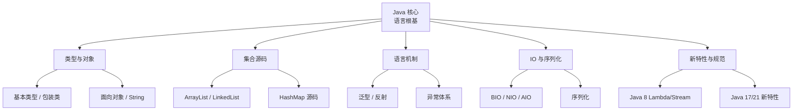
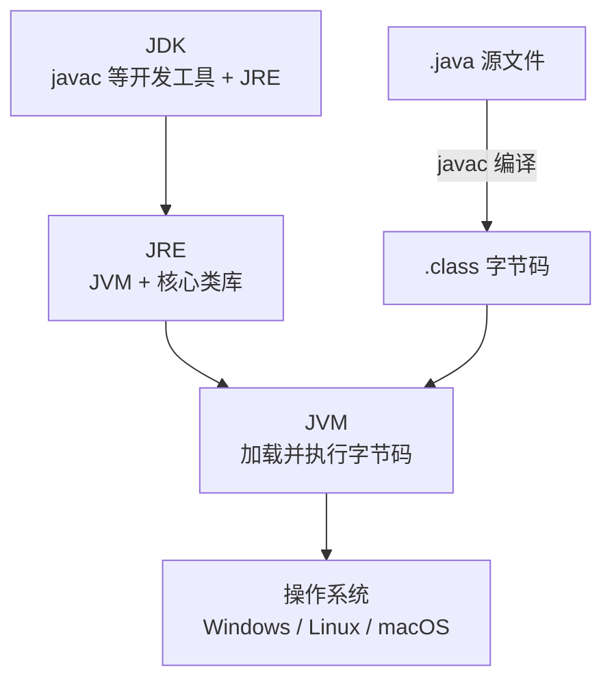
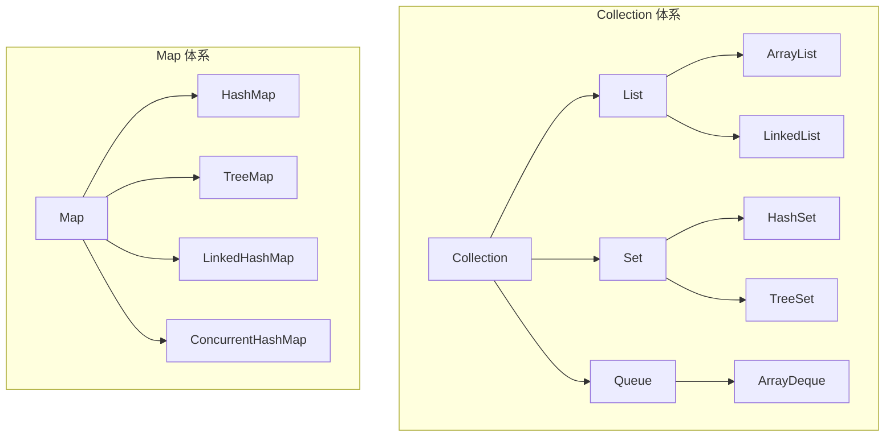
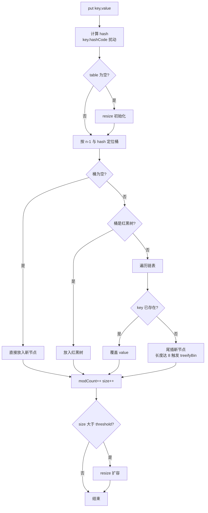
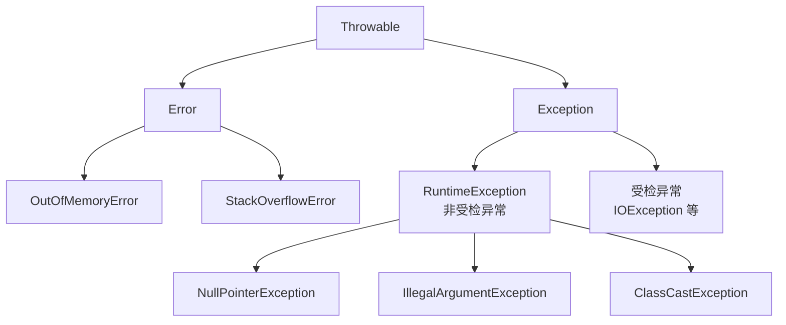
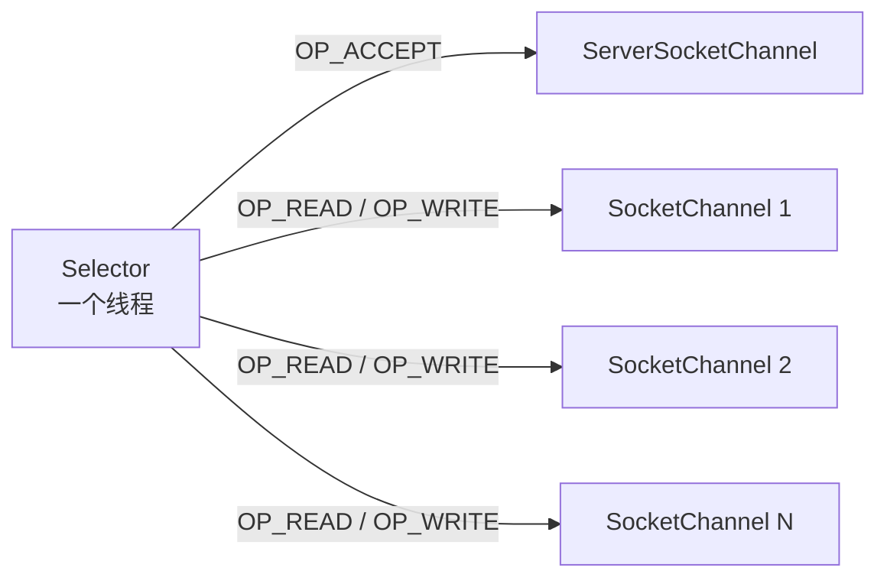
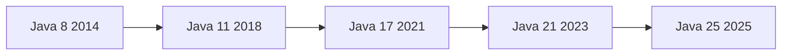

# Java 核心：语法、对象、集合源码、泛型反射、IO 与 NIO 及新特性

> 这份笔记的目标读者：有任意一门编程语言基础、正在准备大厂校招的 Java 后端候选人，也适合在职工程师系统回炉。  
> 建议版本：以 JDK 17 / 21 长期支持版为主讲解，凡是 JDK 8 与它们行为不同的地方都会单独标注。  
> 阅读方式：第一次学习按顺序读第 0~14 章；刷题和面试前重点回看第 5~9 章；冲刺阶段直接做第 17 章自测题。  
> 配套课程：并发编程、JVM、MySQL、Redis、计算机网络等模块会分别展开，本课程只覆盖“语言根基”这一层。  
> 示例代码以 JDK 17/21 为准；Java 8 差异与 JDK 21 专属语法会单独标注。“输出”是典型运行结果，可能因环境略有不同。

### 怎么用这份笔记

- **系统入门**：从第 0 章建立全局认知，第 1~4 章打语法与对象基础，每章末尾的“面试追问”先自己答再对答案；
- **应试突破**：第 5~7 章集合源码、第 8 章泛型、第 9 章反射是八股文高发区，需要能默写出 HashMap 的 put 流程；
- **当手册查**：第 16 章是一页速查表，第 17 章是分主题自测题；
- **学习闭环**：读完每章后，用 IDEA 对示例代码打断点，观察对象内存和集合扩容过程，比死记结论有效得多。

## 目录

- [0. 学习地图：Java 核心考什么](#0-学习地图java-核心考什么)
- [1. JDK、JRE、JVM 与字节码](#1-jdkjrejvm-与字节码)
- [2. 基本语法与类型系统](#2-基本语法与类型系统)
- [3. 面向对象三大特性](#3-面向对象三大特性)
- [4. Object、equals/hashCode 与 String](#4-objectequalshashcode-与-string)
- [5. 集合框架总览与 List 家族](#5-集合框架总览与-list-家族)
- [6. HashMap 源码精读](#6-hashmap-源码精读)
- [7. 其他 Map 与 Set 家族](#7-其他-map-与-set-家族)
- [8. 泛型：类型擦除与通配符](#8-泛型类型擦除与通配符)
- [9. 反射与动态代理](#9-反射与动态代理)
- [10. 异常体系与最佳实践](#10-异常体系与最佳实践)
- [11. IO 流体系与装饰器模式](#11-io-流体系与装饰器模式)
- [12. BIO、NIO、AIO 与零拷贝](#12-bionioaio-与零拷贝)
- [13. 序列化与反序列化](#13-序列化与反序列化)
- [14. Java 8 新特性：Lambda、Stream 与新日期](#14-java-8-新特性lambdastream-与新日期)
- [15. Java 9~25 新特性演进](#15-java-925-新特性演进)
- [16. 编程规范与一页速查](#16-编程规范与一页速查)
- [17. 高频自测题与参考资料](#17-高频自测题与参考资料)

---

## 0. 学习地图：Java 核心考什么

大厂校招对 Java 后端的考察通常分六层：**语言根基 → 并发 → JVM → 数据库 → 网络 → 框架与工程**。本课程是第一层，也是后面所有层的地基。语言根基不过关，谈并发和 JVM 时连“对象引用”“泛型擦除”“异常链”这类概念都会卡壳。

### 0.1 本课程覆盖的高频考点

| 主题 | 大厂高频考点 | 面试权重 |
|---|---|---|
| 类型系统 | 8 种基本类型、包装类缓存、自动装箱拆箱、`==` 与 `equals` | ★★★ |
| 面向对象 | 封装/继承/多态、重载与重写、抽象类与接口、初始化顺序 | ★★★ |
| String | 不可变性、常量池、`intern`、StringBuilder 与 StringBuffer | ★★★ |
| 集合 | ArrayList 扩容、HashMap 源码、LinkedList 对比、fail-fast | ★★★★★ |
| 泛型 | 类型擦除、通配符、PECS、桥方法 | ★★★★ |
| 反射 | Class 对象、动态代理、为什么框架离不开反射 | ★★★★ |
| 异常 | 受检/非受检、finally、try-with-resources、异常链 | ★★★ |
| IO/NIO | 字节流与字符流、装饰器模式、BIO/NIO/AIO、零拷贝 | ★★★★ |
| 序列化 | serialVersionUID、transient、反序列化安全 | ★★★ |
| 新特性 | Java 8 Lambda/Stream、Java 17/21 新特性 | ★★★ |

> 边界说明：本课只覆盖“语言根基”。并发原语、ThreadLocal、JMM、类加载与 GC 等分别由《Java 并发编程》《JVM》课程展开；在本课目录里找不到它们不是遗漏。

### 0.2 知识体系图



### 0.3 学习方法：源码驱动

1. **先画结构，再背结论**。集合、异常、IO 都有清晰的类层次，先画出体系图，再把每个类的行为挂到图上，记忆负担会小很多。
2. **直接读源码**。IDEA 里按住 Ctrl 点击 `ArrayList`、`HashMap` 就能进源码。面试问“扩容多少倍”“为什么转红黑树”，答案都在源码常量和注释里。
3. **版本敏感**。JDK 8 与 JDK 17/21 在 `String` 存储、`switch`、接口方法、集合 API 上都有差异，回答时主动说明“以 JDK 哪个版本为准”，这是加分项。
4. **用“是什么→为什么→怎么用→坑在哪”四问学习每个知识点**，而不是背单句结论。

### 0.4 面试追问

- 问：语言根基和并发、JVM 的关系是什么？
- 答：这层是后面两门课的地基，不是孤立的知识点。举例来说：学集合时要理解 `modCount` 为什么会导致并发修改异常，这要在《并发编程》的“可见性与竞态”里才能彻底讲清；学 String 不可变设计，背后是 JVM 字符串常量池与安全的权衡；学 HashMap 扩容，涉及的是内存与再哈希成本。把这层学扎实，并发和 JVM 的很多概念会有“原来在这里埋着伏笔”的贯通感。

## 1. JDK、JRE、JVM 与字节码

几乎所有 Java 面试的第一题都是“JVM、JRE、JDK 有什么区别”，以及“Java 为什么能跨平台”。这一章把运行模型讲透，后面的所有内容都建立在这套模型上。

### 1.1 三者的关系



- **JDK（Java Development Kit）**：面向开发者的工具包，包含 JRE 和 `javac`、`jar`、`javadoc`、`jdb` 等开发调试工具。
- **JRE（Java Runtime Environment）**：面向运行时的环境，包含 JVM 和 Java 核心类库（`java.lang`、`java.util` 等），供已经编译好的程序运行。
- **JVM（Java Virtual Machine）**：真正执行字节码的虚拟机。同一份字节码，在 Windows、Linux、macOS 上有各自的 JVM 实现，因此 Java 程序“一次编写，到处运行”。

JDK 9 引入模块化后，JRE 不再是独立的目录结构，JDK 直接内置运行时模块，但这个“JDK 包含 JRE，JRE 包含 JVM”的包含关系在概念上仍然成立。

### 1.2 从源码到运行：编译与解释并存

```text
.java 源码 --javac 编译--> .class 字节码 --JVM 加载--> 解释执行 + JIT 编译热点代码
```

严格说，Java 是“**编译与解释并存**”的语言：

1. `javac` 把 `.java` 编译成与平台无关的 `.class` 字节码（编译期）；
2. JVM 启动后逐条解释执行字节码（解释期）；
3. 对频繁执行的“热点代码”，JIT（Just-In-Time，即时编译器，如 C1/C2）会把它编译成当前平台的机器码并缓存，后续直接执行机器码。

这正是“先编译、后解释、再即时编译”的三段式模型。字节码是中间语言，机器码是最终产物。

### 1.3 类路径与 main 方法

运行一个 Java 程序的基本姿势：

```bash
javac Hello.java        # 生成 Hello.class
java Hello              # 启动 JVM，加载并执行 Hello 类
```

`java` 命令通过 **classpath（类路径）** 找到类和依赖的 jar。JDK 9 之后还引入了模块路径（module path），但校招阶段掌握 classpath 即可。

main 方法的签名必须精确是：

```java
public class Hello {
    public static void main(String[] args) {
        System.out.println("Hello, Java");
    }
}
```

为什么是这样？

- `public`：JVM 启动时从类外部调用它，必须可见；
- `static`：JVM 启动时还没有创建任何对象，必须通过类直接调用；
- `void`：JVM 不需要接收返回值；
- `String[] args`：接收命令行参数。

JDK 21 预览、JDK 25 正式化的“隐式类与实例 main 方法”允许简写成 `void main() { ... }`，适合教学和小脚本，但面试仍以标准签名为准。

### 1.4 JDK 版本节奏：LTS 与普通版本

| 版本 | 发布年份 | 是否 LTS | 校招关注点 |
|---|---|---|---|
| Java 8 | 2014 | 是 | 存量最大，Lambda/Stream/新日期时间 API 的起点 |
| Java 11 | 2018 | 是 | HttpClient 正式、String 新方法、单文件源码运行、ZGC 实验 |
| Java 17 | 2021 | 是 | 密封类正式、模式匹配 switch 预览、强封装 |
| Java 21 | 2023 | 是 | 虚拟线程、模式匹配 switch、record 模式正式 |
| Java 25 | 2025 | 是 | 最新 LTS，隐式类与主方法、灵活构造器主体正式化 |

校招简历写“熟悉 Java”时，建议写明“熟练掌握 Java 8/17/21”，并在回答中体现版本差异。

### 1.5 面试追问

- 问：JVM vs JDK vs JRE？
- 答：三者是包含关系：JDK ⊃ JRE ⊃ JVM。JVM 是虚拟机本体，负责加载字节码、执行指令、管理内存（垃圾回收也在这里）；JRE = JVM + Java 核心类库（如 java.lang、java.util），是“能运行 Java 程序”的最小环境；JDK = JRE + 开发工具（javac 编译器、jdb 调试器、jstack/jmap 等诊断工具），是“能开发 Java 程序”的完整套件。记忆方法：只在服务器上跑程序装 JRE 即可，要写代码就必须装 JDK。
- 问：Java 是编译型还是解释型语言？
- 答：两者并存，分三步看：第一步，`javac` 把 .java 源码编译成 .class 字节码（这一步只做语法检查与翻译，不针对具体平台）；第二步，JVM 的解释器逐条解释执行字节码（启动快，但慢）；第三步，JIT（即时编译器）发现某些代码被反复执行（称为“热点代码”，比如被调用上万次的循环），就把它整段编译成本地机器码并缓存，之后直接执行机器码。所以 Java 的启动性能不如纯编译语言，但长时间运行后热点代码能达到接近 C 的执行速度——这也是“Java 越跑越快”说法的由来。
- 问：什么是字节码？为什么字节码能跨平台？
- 答：字节码是存放在 .class 文件里的中间指令集，它面向“虚拟的计算机”设计，不依赖任何真实操作系统与 CPU 指令集。跨平台的关键在于“一次编译，到处安装的是 JVM 而不是程序”：Windows、Linux、macOS 各自有一份用本机语言编写的 JVM，它们都认识同一份字节码规范，由各自负责把字节码翻译成所在平台的机器指令。类比：字节码像一份“世界语讲稿”，各平台的 JVM 是讲稿的当地翻译。副作用是“write once, debug anywhere”——JVM 实现本身的差异仍可能带来细微行为差异。
- 问：`public static void main(String[] args)` 每个修饰符的作用？
- 答：这个签名是 JVM 启动程序时按约定查找的入口，每个词都不可省略：`public` —— main 由 JVM 从类外部调用，必须公开；`static` —— JVM 启动时还没有任何对象实例，必须不依赖对象就能调用；`void` —— 程序结束状态通过 `System.exit(int)` 传递给操作系统，而不是返回值；`String[] args` —— 接收命令行参数，比如 `java App hello world` 时 args 就是 ["hello", "world"]。写错任何一个（如漏掉 static），编译能通过，但运行时报“main 方法不是 static”之类的启动错误。

## 2. 基本语法与类型系统

类型系统是 Java 的“世界观”：一切数据要么是基本类型（存在栈上、按值传递），要么是对象引用（指向堆上的对象）。这一章先把类型、包装类和运算符讲清楚，集合与泛型章节都会用到。

### 2.1 八种基本类型

| 类型 | 字节数 | 默认值 | 取值范围（节选） |
|---|---|---|---|
| `byte` | 1 | 0 | -128 ~ 127 |
| `short` | 2 | 0 | -32768 ~ 32767 |
| `int` | 4 | 0 | 约 ±21 亿 |
| `long` | 8 | 0L | ±9.22e18 |
| `float` | 4 | 0.0f | 单精度浮点 |
| `double` | 8 | 0.0d | 双精度浮点 |
| `char` | 2 | `'\u0000'` | 0 ~ 65535（无符号） |
| `boolean` | 规范未定 | false | true / false |

要点：

- `char` 是无符号 16 位，Java 内部用 UTF-16 表示字符，所以一个“字符”不总等于一个 Unicode 码点，生僻字或 emoji 需要两个 `char`（代理对）。
- `boolean` 在 JLS 中没有规定精确大小：HotSpot 中局部变量通常占 4 字节，`boolean[]` 每个元素占 1 字节。
- 浮点默认字面量是 `double`，写 `float f = 1.2;` 会编译报错，必须写 `1.2f`。
- 长整型字面量建议加 `L`：`long x = 12345678901L;`。

### 2.2 基本类型 vs 引用类型：== 与 equals

```java
int a = 100;
int b = 100;
System.out.println(a == b);        // true，基本类型比较的是值

String s1 = new String("abc");
String s2 = new String("abc");
System.out.println(s1 == s2);      // false，引用类型 == 比较的是地址
System.out.println(s1.equals(s2)); // true，equals 比较的是内容
```

规则只有一条：**`==` 比较基本类型的值；比较引用类型时只比较“是否指向同一个对象”**。要比较对象内容必须用 `equals`，而自定义类要比较内容就必须重写 `equals`（见“Object 与 String”章）。

### 2.3 包装类与自动装箱、拆箱

每个基本类型都有对应的包装类：`Byte`、`Short`、`Integer`、`Long`、`Float`、`Double`、`Character`、`Boolean`。

```java
Integer i = 100;     // 自动装箱：等价于 Integer.valueOf(100)
int n = i;           // 自动拆箱：等价于 i.intValue()
```

包装类有两个高频考点：

**1. 缓存池**。`Integer`、`Long`、`Short`、`Byte` 默认缓存 -128~127，`Character` 缓存 0~127，`Boolean` 只有 true/false。`Integer` 缓存上限可用 `-XX:AutoBoxCacheMax` 调整。`valueOf` 优先返回缓存对象，`new Integer()` 一定创建新对象（JDK 9 起该构造器已废弃）。

```java
Integer a = 100, b = 100;
System.out.println(a == b);  // true，命中缓存

Integer c = 200, d = 200;
System.out.println(c == d);  // false，超出缓存范围，是两个对象
```

**2. 拆箱空指针**。

```java
Integer x = null;
int y = x;   // 抛 NullPointerException：拆箱时调用 x.intValue()
```

比较包装类一律用 `equals` 或拆成基本类型后再比，不要用 `==` 赌缓存范围。`Integer` 与 `int` 混用时 `==` 会触发自动拆箱，所以 `new Integer(100) == 100` 为 true。

### 2.4 final、static 与访问修饰符

| 修饰符 | 修饰类 | 修饰方法 | 修饰变量 |
|---|---|---|---|
| `final` | 不可被继承 | 不可被重写 | 引用不可变（对象内容仍可变） |
| `static` | 只能修饰内部类（静态内部类） | 属于类，不依赖实例 | 属于类，只有一份 |
| `abstract` | 抽象类，不可实例化 | 抽象方法，只有声明 | 不可用 |

```java
final class Config { }          // 不能被继承

class User {
    final int id;               // 初始化后不可再赋值
    static int count;           // 所有实例共享

    static void reset() { }     // 类方法，通过 类名.方法名 调用
}
```

访问修饰符控制可见性，从宽到窄：

| 修饰符 | 同类 | 同包 | 子类 | 任意 |
|---|---|---|---|---|
| `public` | 是 | 是 | 是 | 是 |
| `protected` | 是 | 是 | 是 | 否 |
| 默认（包私有） | 是 | 是 | 否 | 否 |
| `private` | 是 | 否 | 否 | 否 |

注意：`protected` 的“子类可访问”指的是子类内部通过继承访问，不是说子类能访问父类实例的 protected 字段。

### 2.5 运算符与类型转换

- **类型提升**：运算时 `byte`/`short`/`char` 先提升为 `int`，所以 `byte a = 1; byte b = a + a;` 编译报错，要写成 `byte b = (byte)(a + a);`。
- **隐式转换**：小范围向大范围自动转（`int → long → float → double`）；`long → float` 精度可能丢失但语法允许。
- **强制转换**：大范围向小范围可能截断：`int x = 130; byte y = (byte)x;` 结果是 -126。
- **短路运算**：`&&`、`||` 左侧能决定结果时不再计算右侧；`&`、`|` 不短路。
- **位运算**：`&` 按位与、`|` 按位或、`^` 异或、`~` 取反；`<<` 左移补零、`>>` 右移保留符号位、`>>>` 无符号右移补零。`int` 移位距离按 32 取模，`long` 按 64 取模。
- **溢出**：`Integer.MAX_VALUE + 1` 会回绕成 `Integer.MIN_VALUE` 且不抛异常；需要检测溢出时用 `Math.addExact`、`Math.multiplyExact`（溢出抛 `ArithmeticException`）。
- **三目运算**：`条件 ? 表达式1 : 表达式2`，两分支类型不一致时可能发生隐式转换，例如 `Object o = flag ? 1 : 2.0;` 结果是 `Double`。

### 2.6 面试追问

- 问：`Integer a = 200; Integer b = 200; a == b` 结果？
- 答：false，但把 200 换成 100 结果就是 true——这是 `==` 比较引用与 Integer 缓存机制共同作用的结果。自动装箱时调用的是 `Integer.valueOf(200)`，该方法内部对 -128~127 范围内的值返回缓存池里的同一个对象（启动时预先创建），超出范围则每次 new 一个新对象。所以 a 和 b 是两个地址不同的对象，`==` 比较地址得 false。两个教训：包装类型的相等判断一律用 `equals`；`==` 只在确认比较基本类型时使用。
- 问：自动装箱拆箱的原理？
- 答：装箱与拆箱是编译器的“语法糖”：编译器把 `Integer a = 10;` 翻译成 `Integer a = Integer.valueOf(10);`，把 `int b = a;` 翻译成 `int b = a.intValue();`——本质就是调用包装类的方法，没有任何魔法。最大的坑在拆箱 null：`Integer a = null; int b = a;` 编译完全通过，运行时调用 null.intValue() 直接抛 NullPointerException。典型事故场景是 `Map<String, Integer>` 里 get 到了不存在的 key 返回 null，赋值给 int 的那一刻爆炸。
- 问：`short s1 = 1; s1 = s1 + 1;` 能否编译？
- 答：第一句不能。Java 的算术规则：两个 byte/short/char 参与 `+` 运算时会先提升为 int，所以 `s1 + 1` 的结果类型是 int，把 int 赋给 short 需要强制转换，编译器拒绝（怕你丢失精度）。第二句 `s1 += 1;` 反而能编译，因为复合赋值运算符（+=、-= 等）在语言规范里内置了一次隐式的窄化强制转换，等价于 `s1 = (short)(s1 + 1);`。这道题考的是“类型提升”与“复合赋值的隐式转换”两个规则的交叉记忆。
- 问：`final` 修饰的引用能修改对象内容吗？
- 答：能。把引用想象成“拴在对象上的绳子”：final 把绳子焊死，绳子永远只能拴这只对象，但对象本身的内容（比如 List 里的元素）随便改。`final List<String> list = new ArrayList<>(); list.add("x");` 完全合法，`list = new ArrayList<>();` 编译报错。想要对象内容也不可变，得用不可变类型（String、List.of 创建的集合、record）。这也是为什么“把参数声明为 final”只能防重新赋值，防不了方法内修改传入的集合。

## 3. 面向对象三大特性

封装、继承、多态是 Java 的三大特性，面试常考“重写规则”“抽象类与接口区别”“初始化顺序”三个点，这一章全部覆盖。

### 3.1 封装

封装是用访问修饰符把内部状态藏起来，只暴露必要的方法：

```java
public class BankAccount {
    private long balance;          // 内部状态对外不可见

    public void deposit(long amount) {
        if (amount <= 0) throw new IllegalArgumentException("金额必须为正");
        this.balance += amount;    // 通过方法约束状态变化
    }
}
```

好处：状态变化可控、实现可替换、降低耦合。命名上使用 getter/setter 是惯例，不是语法要求。

### 3.2 继承

Java 类只允许**单继承**（一个类只能有一个父类），但可以**多实现接口**。子类自动拥有父类的非 private 成员，并通过 `super` 调用父类构造器或方法。

```java
public class Animal {
    protected String name;
    public Animal(String name) { this.name = name; }
    public void speak() { System.out.println("..."); }
}

public class Dog extends Animal {
    public Dog(String name) { super(name); }   // 必须先调用父类构造器
    @Override
    public void speak() { System.out.println(name + " 汪汪"); }
}
```

继承的注意点：

- 子类构造器第一行必须调用 `super(...)` 或 `this(...)`；都没写时编译器隐式调用父类无参构造器，父类没有无参构造器就会编译报错。
- `private` 成员不继承，`final` 方法不可重写，`final` 类不可继承。
- 能用组合就不要滥用继承：继承暴露了父类实现，容易造成脆弱的基类问题；“is-a”关系才适合继承，“has-a”关系用组合。

### 3.3 多态：重载与重写

**重载（Overload）** 发生在同一类中，方法名相同、参数列表不同，与返回类型无关；在编译期根据参数静态决定调用哪个方法。

**重写（Override）** 发生在父子类之间，方法签名相同，运行时根据对象实际类型动态绑定。

```java
Animal a = new Dog("旺财");
a.speak();   // 编译期看 Animal，运行期调 Dog.speak()，输出“旺财 汪汪”
```

重写必须满足四条规则：

1. 方法名、参数列表必须完全一致；
2. 返回类型相同或为其子类型（协变返回）；
3. 访问权限不能比父类更严格（`protected` 不能被改成 `private`）；
4. 不能抛出比父类更宽泛的受检异常。

静态方法可以被“隐藏”但不能被重写；`private`/`final` 方法也不能被重写。重载解析优先级：精确匹配 → 自动类型提升 → 装箱 → 可变参数，逐级降级。

### 3.4 抽象类与接口

| 对比项 | 抽象类 | 接口 |
|---|---|---|
| 关键字 | `abstract class` | `interface` |
| 继承方式 | 单继承 | 可多实现、可多继承（接口继承接口） |
| 构造器 | 有 | 无 |
| 实例字段 | 可以有 | 只能有 `public static final` 常量 |
| 方法 | 抽象方法 + 具体方法 | JDK 8 起 default/static，JDK 9 起 private |
| 设计语义 | “是什么”的模板 | “能做什么”的能力契约 |

```java
public abstract class Shape {
    protected String color;
    public abstract double area();          // 抽象方法，子类必须实现
    public String describe() { return color + "图形"; }
}

public interface Runnable2 {
    void run();                              // 抽象方法
    default void log() { }                   // JDK 8：默认方法，实现类可覆写
    static String kind() { return "R"; }     // JDK 8：静态方法，接口名调用
}
```

什么时候用谁：要共享状态或模板逻辑（如模板方法模式）用抽象类；要定义“能力契约”且允许多重身份（如一个类既能 `Runnable` 又能 `Serializable`）用接口。现代设计更倾向于接口 + 组合。

接口默认方法的冲突规则（钻石问题）：一个类同时实现两个接口，且两个接口存在**同名同参**的 default 方法时，实现类必须重写该方法消除冲突；若一个接口继承自另一个，子接口的 default 方法优先。

### 3.5 初始化顺序

创建一个子类对象时，初始化顺序是：

```text
父类静态变量/静态块（按声明顺序） → 子类静态变量/静态块 → main
→ new 对象：父类实例变量/实例块 → 父类构造器 → 子类实例变量/实例块 → 子类构造器
```

```java
class Parent {
    static { System.out.print("P-static "); }
    { System.out.print("P-instance "); }
    Parent() { System.out.print("P-ctor "); }
}
class Child extends Parent {
    static { System.out.print("C-static "); }
    { System.out.print("C-instance "); }
    Child() { System.out.print("C-ctor "); }
}
// new Child() 输出：P-static C-static P-instance P-ctor C-instance C-ctor
```

静态初始化只在类首次被加载时执行一次，与创建多少个对象无关。

### 3.6 内部类

内部类有四种：

| 类型 | 特点 | 典型用途 |
|---|---|---|
| 静态内部类 | 不持有外部类引用，可独立创建 | 与外部类逻辑相关的辅助类 |
| 成员内部类 | 隐式持有外部类引用，`Outer.this` 访问外部 | 需要访问外部实例状态 |
| 局部内部类 | 定义在方法内，作用域限方法 | 极少用 |
| 匿名内部类 | 没有名字，一次创建并实现接口/继承类 | 回调、事件监听；Java 8 后多被 Lambda 替代 |

关键坑：匿名/局部内部类访问方法局部变量时，该变量必须是 `final` 或 **effectively final**（初始化后不再重新赋值）。原因：内部类会复制局部变量的副本，两份变量必须保证一致。

```java
public class Outer {
    private int x = 1;
    class Inner {
        int read() { return x; }       // 成员内部类通过 Outer.this.x 访问
    }
    static class StaticInner { }

    Runnable make() {
        int y = 2;                      // effectively final
        return () -> System.out.println(x + y);  // Lambda 也能捕获
    }
}
```

### 3.7 枚举 enum：一组有名字的常量

`enum` 是 Java 5 引入的特殊类，编译器会把 `OrderStatus` 变成继承 `java.lang.Enum` 的 final 类，每个枚举常量就是该类的一个静态 final 实例。

```java
public enum OrderStatus {
    CREATED, PAID, SHIPPED, DONE
}

OrderStatus s = OrderStatus.valueOf("PAID");     // 按名字取，找不到抛 IllegalArgumentException
OrderStatus[] all = OrderStatus.values();        // 按声明顺序返回全部常量
int order = OrderStatus.SHIPPED.ordinal();       // 声明序号，从 0 开始
```

枚举可以与 switch 配合，也可以带字段、构造器和方法：

```java
public enum Level {
    LOW(1), MEDIUM(2), HIGH(3);                  // 必须先声明常量，再写字段和方法

    private final int score;
    Level(int score) { this.score = score; }
    public int score() { return score; }
}

switch (level) {
    case LOW -> System.out.println("低");
    case MEDIUM -> System.out.println("中");
    case HIGH -> System.out.println("高");
}
```

要点：

- 枚举天然是单例，单例模式最简单可靠的写法就是“只有一个常量的枚举”；
- `EnumMap`/`EnumSet` 是专为枚举设计的高性能容器（见第 7 章），底层用数组，比 HashMap 更快；
- 构造器默认私有，不允许外部 new；枚举常量全局唯一，比较直接用 `==`。

### 3.8 面试追问

- 问：重写和重载的区别？
- 答：两个概念长得像但机制完全不同。重载（Overload）：同一个类里方法名相同、参数列表不同，编译期就根据“你写的参数类型”静态决定调哪个，跟运行时对象无关；注意“返回类型不同不构成重载”。重写（Override）：子类重新实现父类的同签名方法，运行期根据对象的实际类型动态绑定——`Animal a = new Dog(); a.sound();` 调的是 Dog 的实现，这就是多态的底层机制。重写还有三条约束：返回类型相同或是其子类（协变）、访问权限不能比父类小、不能抛出更宽的受检异常。写 `@Override` 注解能让编译器帮你确认确实是重写而不是手滑重载。
- 问：接口能实例化吗？为什么接口中可以有实现？
- 答：接口不能直接 new——它只定义“能做什么”，不定义“怎么做”，没有完整的对象状态。日常写的 `new Runnable() {...}` 其实是创建了一个匿名实现类的对象，而不是实例化接口本身。关于接口里的实现方法：JDK 8 之前接口只能有抽象方法，8 引入 default 方法（有默认实现，实现类可直接继承），动机是解决“接口演化的兼容问题”——比如集合框架要给 List 加 forEach 方法，如果没有 default，所有第三方实现类全部编译报错；static 方法用于接口内的工具逻辑；JDK 9 又允许 private 方法，用于 default 方法之间复用代码。但接口依旧没有实例字段，这正是它和抽象类的核心边界之一。
- 问：子类构造器可以不调用父类构造器吗？
- 答：不调用是不可能的——父类的部分必须先初始化，这是对象模型决定的。规则是：子类构造器第一行如果不是 `this(...)` 或 `super(...)`，编译器会自动插入一行 `super();`（调用父类无参构造器）。因此一旦父类只定义了有参构造器（此时编译器不再自动生成无参构造器），子类构造器又不显式 `super(参数)`，就直接编译失败。面试常考的连环追问是构造顺序：父类静态字段/静态块 → 子类静态字段/静态块 → 父类实例字段/构造块 → 父类构造器 → 子类实例字段/构造块 → 子类构造器，静态部分只在类第一次加载时执行一次。
- 问：为什么局部内部类访问的局部变量要求 effectively final？
- 答：关键在于两者的生命周期不同。方法内的局部变量在栈上，方法返回就销毁；而内部类对象（比如 Lambda、匿名类）可能被返回、被别的线程持有，活得比方法久。所以内部类访问局部变量时，编译器实际是把变量的值拷贝一份存进内部类对象里。问题来了：如果原变量之后又被赋值，栈上的值变了、副本没变，两边看到的数据不一致，语义就乱了。Java 的解决方式简单粗暴：规定被捕获的变量必须是 final 或“事实上不再被修改”（effectively final），从源头消除不一致。这也解释了为什么 Lambda 里不能修改外部局部变量。

## 4. Object、equals/hashCode 与 String

所有类的祖先都是 `Object`，而 `String` 是 Java 里使用频率最高的类，也是面试最爱深挖的类。这一章讲透两者的底层机制。

### 4.1 Object 的方法总览

| 方法 | 作用 | 注意 |
|---|---|---|
| `equals(Object)` | 内容相等比较 | 默认是引用比较，需重写 |
| `hashCode()` | 返回散列值 | 与 equals 有契约关系 |
| `toString()` | 字符串表示 | 默认是 `类名@hashCode` |
| `getClass()` | 返回运行时 Class | 泛型擦除后取真实类型 |
| `clone()` | 浅拷贝 | protected native，需实现 Cloneable；深拷贝见下方说明 |
| `wait()/notify()/notifyAll()` | 线程等待/唤醒 | 必须在 synchronized 块内，见并发课程 |
| `finalize()` | 对象回收前回调 | JDK 9 起弃用，不要使用 |

`clone()` 默认是**浅拷贝**：引用字段只复制引用，不复制被引用对象。需要深拷贝时，要么在 `clone()` 里手动复制每个可变字段，要么用序列化拷贝（实现 `Serializable` 后写字节再读回），或用拷贝构造器/工厂方法。

### 4.2 equals 的五条契约

重写 `equals` 必须满足：

1. **自反**：`x.equals(x)` 为 true；
2. **对称**：`x.equals(y)` 与 `y.equals(x)` 结果一致；
3. **传递**：`x.equals(y)`、`y.equals(z)` 为 true 时，`x.equals(z)` 必为 true；
4. **一致**：对象未修改时，多次调用结果一致；
5. **非空性**：`x.equals(null)` 为 false。

标准写法（IDEA 可自动生成）：

```java
@Override
public boolean equals(Object o) {
    if (this == o) return true;
    if (o == null || getClass() != o.getClass()) return false;
    User user = (User) o;
    return id == user.id && name.equals(user.name);
}
```

用 `getClass() != o.getClass()` 而不是 `instanceof`，可以避免子类与父类互相 equals 破坏对称性（如 `Person` 和 `Student` 用 instanceof 时可能双向为 true，但反过来比较结果不一致）。

### 4.3 hashCode 契约

- 两个对象 `equals` 相等，`hashCode` **必须**相等；
- 两个对象 `hashCode` 不等，`equals` **必然**不等（逆否命题）；
- 两个对象 `hashCode` 相等，`equals` 可能不等（哈希碰撞，合法）。

这就是“重写 equals 必须重写 hashCode”的原因：HashMap 等散列容器先用 hashCode 定位桶，再用 equals 精确比较；桶里是 hashCode 相等但内容不同的对象，equals 就会返回 false，导致 `map.get(key)` 取不到值。

```java
@Override
public int hashCode() {
    return Objects.hash(id, name);   // 内部使用 31 作为乘数
}
```

为什么常用 31：它是奇素数，`31 * h + value` 在编译器里可优化为 `(h << 5) - h`，碰撞率低且计算快。

### 4.4 String 的不可变性与常量池

`String` 被 `final` 修饰，且 JDK 8 内部用 `char[]` 存储、JDK 9 起改用 `byte[] + coder`（紧凑字符串，Latin-1 字符只占 1 字节）。所有修改方法都返回新字符串，原对象不变。

**为什么 String 要不可变**：

1. **缓存安全**：字符串常量池、HashMap 的 key 依赖 hashCode，可变会导致散列失效；
2. **线程安全**：不可变对象天然可共享，无需同步；
3. **安全**：类加载器、网络地址、文件路径等敏感字符串不会被意外篡改；
4. **性能**：常量池复用，避免重复创建。

**字符串常量池（String Pool）**：

- JDK 7 之前位于方法区（PermGen），JDK 7 起移入堆；
- 编译期字面量 `"abc"` 会入池；`new String("abc")` 在堆上新建对象，不改变池中内容；
- `intern()` 方法把字符串加入池并返回池中的引用。

```java
String s1 = "abc";                 // 常量池中创建/复用
String s2 = new String("abc");     // 堆上新建对象
System.out.println(s1 == s2);      // false
System.out.println(s1 == s2.intern()); // true，intern 返回池中引用

String s3 = "a" + "b";             // 编译期常量折叠，等价于 "ab"
String s4 = "ab";
System.out.println(s3 == s4);      // true
```

高频题：`new String("abc")` 创建几个对象？

- 若常量池中没有 `"abc"`：创建 2 个（常量池的 `"abc"` + 堆上的 String 对象；实际还可能包含 `char[]`，可视为 2 个主要对象）；
- 若常量池已有 `"abc"`：只创建 1 个堆对象。

拼接细节：JDK 8 的 javac 会把变量拼接编译成 `StringBuilder.append`；JDK 9 起改用 `invokedynamic` + `StringConcatFactory`，但“每次拼接创建新对象”的本质不变，循环内拼接仍应手写 `StringBuilder`。

### 4.5 StringBuilder 与 StringBuffer

| 对比项 | String | StringBuilder | StringBuffer |
|---|---|---|---|
| 可变 | 否 | 是 | 是 |
| 线程安全 | 是（不可变） | 否 | 是（方法加 synchronized） |
| 性能 | 拼接最慢 | 最快 | 居中 |
| 适用 | 常量/少量拼接 | 单线程大量拼接 | 多线程共享同一对象 |

```java
StringBuilder sb = new StringBuilder();
for (int i = 0; i < 1000; i++) {
    sb.append(i);          // 原地修改，不产生中间对象
}
String result = sb.toString();
```

容量细节：`new StringBuilder()` 默认容量 16，容量不足时按“旧容量 × 2 + 2”扩容（`AbstractStringBuilder` 的 grow 逻辑）；能预估大小时用 `new StringBuilder(initialCapacity)` 预分配，减少扩容复制。

### 4.6 面试追问

- 问：为什么重写 equals 必须重写 hashCode？
- 答：要先知道散列容器的查找流程：以 HashMap 为例，put/get 都是先用 key 的 hashCode 计算数组下标定位“桶”，桶内再用 equals 逐个比较。契约规定：equals 相等的两个对象，hashCode 必须相等。只重写 equals 不重写 hashCode 时，两个内容相同的对象 hashCode 大概率不同（Object 默认按地址算），于是被分到不同的桶——用其中一个做 key put 进去，再用“内容相同的另一个对象”去 get，定位到的桶里根本没有它，直接返回 null。这类 bug 在业务里极其隐蔽：存的时候好好的，取的时候说没有。反过来“hashCode 相等但 equals 不等”是允许的（哈希冲突），不算违约。
- 问：`String s = new String("abc")` 创建了几个对象？
- 答：最多 2 个、至少 1 个，要看执行时机。编译期：如果字符串常量池里还没有 "abc"，编译阶段就会在常量池创建一个 "abc" 对象（类加载时完成）；运行期：`new String("abc")` 又在堆上创建一个新对象，s 指向的是这个堆对象而不是常量池里的。所以第一次执行创建 2 个，第二次执行同样的代码常量池已经有了，只创建 1 个。追问常问“s == "abc" 吗”——不相等，因为 == 比较的是地址，s 在堆、字面量在常量池，内容相同地址不同；想比较内容用 equals 或对 s 调用 intern() 后再比。
- 问：`intern()` 的作用？
- 答：intern 的语义是“返回这个字符串在常量池里的唯一引用”：池里已有内容相同的字符串就直接返回池中引用，没有就把当前字符串放入池中再返回。典型用途是去重省内存——比如系统里有几百万条重复的城市名字符串，全部 intern 后内存里只保留一份。还有一个经典面试题：`new String("a") + new String("b")` 拼出的 "ab" 在堆上，调用 intern 后 JDK 7+ 的行为是常量池里没有 "ab" 时直接把堆上的引用登记进池（而不是复制一份），因此 `s.intern() == s` 为 true，而直接写字面量 "ab" 的场景 intern 返回的是常量池里的旧对象，== 为 false。JDK 7 起常量池从永久代移到了堆中，才有了这个行为差异。
- 问：String、StringBuilder、StringBuffer 怎么选？
- 答：先理解性能差异的来源：String 不可变，每次“拼接”都会产生新对象并把旧内容整个复制一遍，在循环里拼接 n 次就是 O(n²) 的复制——这是面试必考的反模式（循环里用 + 拼 SQL）。StringBuilder 内部维护可变的字符数组（默认容量 16，不够扩容），append 直接在数组尾部追加，拼接 n 次是 O(n)。选择规则：字符串内容不变（如常量、配置）用 String；单线程内拼接（绝大多数场景）用 StringBuilder；多线程共享同一个可变字符串才用 StringBuffer（方法上有 synchronized，有性能损耗，实际上很少遇到这种场景）。
- 问：String 为什么设计成不可变？
- 答：四个理由，面试按顺序讲：① **常量池的前提**：常量池要求同一内容只有一份引用，如果 String 可变，改一个引用的内容会影响所有指向它的地方，池化就崩了；② **hashCode 缓存**：String 重写 hashCode 时把结果缓存起来（首次计算后不再重算），不可变保证缓存永远有效，所以 String 特别适合做 HashMap 的 key；③ **线程安全**：不可变对象天然线程安全，多线程共享不需要任何同步；④ **安全性**：文件路径、数据库连接 URL、类名等关键参数都用 String 表示，若是可变的，恶意代码在你校验完之后、真正使用之前偷偷改掉内容（TOCTOU 攻击）就防不胜防。

## 5. 集合框架总览与 List 家族

集合是 Java 使用频率最高、面试挖得最深的类库。先建立整体体系，再逐个读源码，这是大厂要求的“源码驱动”式学习。

### 5.1 集合体系总览



- **Collection** 是单列集合的根接口，下面分 `List`（有序可重复）、`Set`（不可重复）、`Queue`（队列）；
- **Map** 是双列集合，存键值对，与 Collection 是并列的两大体系；
- 集合里存的是**对象引用**，基本类型会自动装箱；`Set` 的去重依赖 `equals` 与 `hashCode`（见“Object 与 String”章）。

### 5.2 ArrayList 源码精读

`ArrayList` 底层是 `Object[]` 数组，支持随机访问。

**扩容机制**：

1. 无参构造只创建一个空数组，**第一次 add 时才扩容到默认容量 10**（懒加载）；
2. 容量不够时 `grow()`：`newCapacity = oldCapacity + (oldCapacity >> 1)`，即 **1.5 倍**；
3. 若 1.5 倍仍小于需求容量，直接扩容到需求容量；
4. 复制使用 `Arrays.copyOf`（底层 `System.arraycopy`，native 方法）；
5. 最大容量约 `Integer.MAX_VALUE - 8`。

```java
ArrayList<Integer> list = new ArrayList<>();   // 此时容量 0
for (int i = 0; i < 11; i++) list.add(i);      // 第一次 add 扩到 10，第 11 个元素再扩到 15
```

**增删复杂度**：末尾 add 均摊 $O(1)$（扩容偶尔发生）；指定位置 add/remove 需要移动元素，$O(n)$；`get(i)` 直接按下标访问，$O(1)$。

**modCount 与 fail-fast**：每次结构修改（add/remove/clear）都会 `modCount++`。迭代器创建时记录 `expectedModCount`，迭代中检测到不一致就抛 `ConcurrentModificationException`，防止多线程或遍历中修改造成不可预期的结果。

**subList 是视图**：`list.subList(1, 3)` 返回的是原列表的视图，修改它会反映到原列表；在视图上结构性修改会导致原列表的 modCount 变化，再操作原列表可能抛异常。

### 5.3 LinkedList 源码精读

`LinkedList` 底层是**双向链表**：每个节点持有 `prev`、`item`、`next` 三个引用。

- 头尾 add/remove 是 $O(1)$；按下标 `get(i)`/`add(i)` 需要从头或尾开始遍历，$O(n)$；
- 实现了 `List` 和 `Deque`，可当栈、队列、双端队列用；
- 每个节点还要存前后指针，**内存占用比 ArrayList 大**，且节点在堆上分散，缓存局部性差；
- 面试结论：数据量小、以遍历为主时 ArrayList 更优；频繁在头部插入删除才考虑 LinkedList。

### 5.4 Vector、Stack 与 ArrayDeque

- `Vector` 的方法用 `synchronized` 修饰，线程安全但性能差；扩容默认 2 倍（可指定 `capacityIncrement`）。JDK 1.2 起就被建议用 ArrayList 替代，只在遗留代码中出现。
- `Stack` 继承 Vector，用它的 `addElement`/`removeElementAt`/`elementAt` 实现栈操作，整表同步，历史包袱重，官方建议用 `ArrayDeque`。
- `ArrayDeque` 底层是循环数组，push/pop/offer/poll 均为 $O(1)$，**不允许 null**；作为栈/队列是首选。

```java
Deque<Integer> stack = new ArrayDeque<>();
stack.push(1); stack.push(2);
System.out.println(stack.pop());   // 2
```

### 5.5 Arrays.asList 与 List.of 的坑

```java
List<String> list = Arrays.asList("a", "b");
list.add("c");   // 抛 UnsupportedOperationException：Arrays.asList 返回固定大小列表
list.set(0, "x"); // 可以，修改会同步到原数组

List<String> list2 = List.of("a", "b");  // JDK 9+，完全不可变
list2.set(0, "x");  // 抛 UnsupportedOperationException
```

`Arrays.asList` 返回的是 `java.util.Arrays$ArrayList`（内部数组），不是 `java.util.ArrayList`，只能替换元素不能增删。`List.of`/`Map.of`/`Set.of` 返回不可变集合，任何修改都抛异常；它们也**不允许 null 元素**，传入 null 会抛 NullPointerException。

### 5.6 遍历时删除的正确姿势

```java
// 错误：for-each 中调用 list.remove，迭代器检查 modCount 失败
// for (String s : list) { if (s.equals("a")) list.remove(s); }

// 正确 1：迭代器 remove
Iterator<String> it = list.iterator();
while (it.hasNext()) {
    if (it.next().equals("a")) it.remove();
}

// 正确 2：JDK 8 removeIf
list.removeIf(s -> s.equals("a"));

// 正确 3：倒序 for 循环按索引删除
for (int i = list.size() - 1; i >= 0; i--) {
    if (list.get(i).equals("a")) list.remove(i);
}
```

**fail-fast vs fail-safe**：ArrayList/HashMap 的迭代器是 fail-fast（快速失败，结构变化立即抛异常）；`CopyOnWriteArrayList`、`ConcurrentHashMap` 等并发容器的迭代器基于快照或弱一致语义，迭代过程中修改不会抛异常（fail-safe），但也不保证看到最新数据。

### 5.7 List 家族对比表

| 对比项 | ArrayList | LinkedList | Vector |
|---|---|---|---|
| 底层结构 | Object 数组 | 双向链表 | Object 数组 |
| 随机访问 get(i) | $O(1)$ | $O(n)$ | $O(1)$ |
| 头尾插入删除 | 头 $O(n)$，尾均摊 $O(1)$ | $O(1)$ | 同 ArrayList |
| 中间插入删除 | $O(n)$ | $O(n)$（先找再改） | $O(n)$ |
| 扩容 | 1.5 倍 | 无 | 2 倍 |
| 线程安全 | 否 | 否 | 是（方法级同步） |
| 内存 | 连续数组，占用少 | 每节点多两个指针 | 连续数组 |

### 5.8 PriorityQueue：二叉堆

`PriorityQueue` 底层是二叉堆（用数组存储），默认**小顶堆**（堆顶最小）：

- `offer`/`poll` 入堆、出堆 $O(\log n)$，`peek` 看堆顶 $O(1)$；
- 用集合构造时采用堆化，整体构建 $O(n)$；
- 传 `Comparator` 可改顺序，`new PriorityQueue<>(Comparator.reverseOrder())` 就是大顶堆；
- **不允许 null**，线程不安全；并发场景用 `PriorityBlockingQueue`（并发课程展开）；
- 容量不足时按策略扩容：容量小于 64 时近乎翻倍，否则 1.5 倍；
- 典型用途：Top K、任务调度、合并 K 个有序流（与 Hot 100 的堆专题直接衔接）。

```java
PriorityQueue<Integer> pq = new PriorityQueue<>();
pq.offer(3); pq.offer(1); pq.offer(2);
System.out.println(pq.poll());   // 1，小顶堆先出最小
```

### 5.9 面试追问

- 问：ArrayList 和 LinkedList 的区别？
- 答：底层结构决定一切。ArrayList 是连续数组：按下标随机访问 O(1)（直接算偏移量），中间插入/删除要移动后续所有元素 O(n)，扩容要整体复制；LinkedList 是双向链表：头尾插入/删除 O(1)，但按位置访问要从头/尾遍历 O(n)。真实项目里几乎总是选 ArrayList，除了结构差异还有两个容易被忽略的原因：① 数组的内存连续性对 CPU 缓存友好，LinkedList 每个节点都是零散堆对象，遍历缓存命中率低；② LinkedList 每个节点额外要存前后指针，内存开销更大。只有“频繁在头部增删”这类场景 LinkedList 才有优势，实践中更常见的替代是 ArrayDeque。
- 问：ArrayList 扩容多少倍？为什么是 1.5 倍？
- 答：JDK 8 起新容量 = 旧容量 + (旧容量 >> 1)，即 1.5 倍（10 → 15 → 22 → 33…），用位运算实现。为什么是 1.5 而不是 2？扩容本身要新建数组并把旧元素全部复制过去，成本 O(n)：倍率太小时扩容太频繁，均摊成本升高；倍率太大时每次扩容预留的空间可能用不上，内存浪费且复制的绝对量也变大。1.5 倍的巧妙之处在于：1.5 倍乘出来的数反复乘仍然满足“再次扩容可以复用之前释放的空间”（15 + 15/2 = 22 不超过 10+15=25），内存可以原地增长（系统层面）。对比记忆：HashMap 用 2 倍，因为它要求容量永远是 2 的幂，方便用位运算取模。
- 问：为什么遍历时用集合自身的 remove 会抛 ConcurrentModificationException？
- 答：ArrayList 内部维护一个 modCount（结构修改次数计数器），每次 add/remove 都会 +1。创建迭代器时会快照一份 expectedModCount = modCount，之后每调一次 next() 都校验两者是否相等——不相等说明遍历过程中集合结构被人改了，立即抛 ConcurrentModificationException（快速失败设计，宁可报错也不给你遍历到错乱的数据）。坑在于：循环里调用 list.remove(i) 改了 modCount 但迭代器不知道，下一次 next() 校验失败爆炸。正确做法是用迭代器自己的 `iterator.remove()`（它会同步更新 expectedModCount），或者 JDK 8 的 `list.removeIf(...)`。还有一个隐蔽考点：循环中倒数第二个元素删除时不抛异常（ hasNext 判断提前短路），这种“偶发不报错”的 bug 更难排查。
- 问：`Arrays.asList` 和 `List.of` 有什么区别？
- 答：三个维度：① 改元素——Arrays.asList 返回的是底层数组的视图，set() 可以改（改了原数组也变）；List.of 完全不可变，set 直接抛异常。② 增删——两者都不支持 add/remove（Arrays.asList 是定长视图，List.of 是不可变），都会抛 UnsupportedOperationException。③ null——Arrays.asList 允许 null 元素；List.of 禁止 null，传 null 直接抛 NPE。最容易踩的坑是把 Arrays.asList 的返回值当成正常 ArrayList 用：它返回的是内部类 Arrays.ArrayList（没有重写 add），转型成 List 后一调 add 就炸。

## 6. HashMap 源码精读

HashMap 是 Java 面试的“必考之王”：存储结构、hash 计算、put 流程、扩容、红黑树转换、线程安全，每一环都会被追问。这一章按“结构 → 流程 → 为什么”三层讲透。

### 6.1 底层结构

JDK 8 起 HashMap 是**数组 + 链表 + 红黑树**：

```text
table: Node[] 数组，每个槽位叫“桶”(bucket)
桶内: 链表（Node）或红黑树（TreeNode）
```

数组长度默认 16；当桶内链表过长（阈值 8）且数组长度不小于 64 时，链表转红黑树，把最坏查找从 $O(n)$ 降到 $O(\log n)$。

### 6.2 关键常量

| 常量 | 值 | 含义 |
|---|---|---|
| `DEFAULT_INITIAL_CAPACITY` | 1 << 4 = 16 | 默认初始容量 |
| `MAXIMUM_CAPACITY` | 1 << 30 | 最大容量 |
| `DEFAULT_LOAD_FACTOR` | 0.75f | 默认负载因子 |
| `TREEIFY_THRESHOLD` | 8 | 链表长度达到 8 尝试转树 |
| `UNTREEIFY_THRESHOLD` | 6 | 扩容拆分后节点数 ≤ 6 转回链表 |
| `MIN_TREEIFY_CAPACITY` | 64 | 转树要求的最小数组长度 |

**懒初始化**：无参构造只设置 `loadFactor`，不创建数组；第一次 `put` 时才在 `resize()` 中创建长度为 16 的 table。

**容量与阈值**：`threshold = capacity × loadFactor`，默认 16 × 0.75 = 12。元素个数 `size` 超过 threshold 时扩容。指定初始容量时，构造器调用 `tableSizeFor()` 把容量向上取整为 2 的幂，并暂存到 threshold，真正建表发生在首次 resize。

### 6.3 hash 计算与寻址

```java
static final int hash(Object key) {
    int h;
    return (key == null) ? 0 : (h = key.hashCode()) ^ (h >>> 16);
}
```

- key 为 null 时 hash 为 0，所以 null key 固定落在 table[0]；
- 扰动函数：把 hashCode 的高 16 位与低 16 位异或，让高位信息参与低位计算，减少碰撞；
- 桶下标：`(n - 1) & hash`。n 是 2 的幂时等价于 `hash % n`，但位运算更快且结果非负。

### 6.4 put 流程



简化源码（JDK 8 逻辑）：

```java
final V putVal(int hash, K key, V value, boolean onlyIfAbsent, boolean evict) {
    Node<K,V>[] tab; Node<K,V> p; int n, i;
    if ((tab = table) == null || (n = tab.length) == 0)
        n = (tab = resize()).length;              // 懒初始化
    if ((p = tab[i = (n - 1) & hash]) == null)
        tab[i] = newNode(hash, key, value, null); // 桶空，直接放
    else {
        Node<K,V> e; K k;
        if (p.hash == hash && ((k = p.key) == key || (key != null && key.equals(k))))
            e = p;                                 // 首节点 key 相同
        else if (p instanceof TreeNode)
            e = ((TreeNode<K,V>) p).putTreeVal(this, tab, hash, key, value);
        else {
            for (int binCount = 0; ; ++binCount) {
                if ((e = p.next) == null) {
                    p.next = newNode(hash, key, value, null);  // 尾插
                    if (binCount >= TREEIFY_THRESHOLD - 1)
                        treeifyBin(tab, hash);     // 长度达 8，尝试转树
                    break;
                }
                if (e.hash == hash && ((k = e.key) == key || (key != null && key.equals(k))))
                    break;
                p = e;
            }
        }
        if (e != null) {
            V oldValue = e.value;
            e.value = value;                       // key 已存在，覆盖
            return oldValue;
        }
    }
    ++modCount;
    if (++size > threshold) resize();
    return null;
}
```

要点：JDK 8 采用**尾插法**（新节点挂链表尾部），JDK 7 是**头插法**；头插在并发扩容时可能形成环形链表，导致 get 死循环，JDK 8 改为尾插后不再出现该问题（但并发仍不安全）。

### 6.5 get 流程

```text
计算 hash → (n-1)&hash 定位桶 → 桶空返回 null
→ 首节点 key 命中直接返回 → 是树则树中查找 → 否则遍历链表
```

比较条件永远是 `hash 相等 && (引用相同 || equals 相等)`，这就是自定义 key 必须重写 `equals` 和 `hashCode` 的原因。

### 6.6 resize 扩容

扩容发生在两种时机：

1. 首次 put 建表（容量 16，阈值 12）；
2. `size > threshold` 时，容量翻倍、阈值翻倍。

扩容过程：

1. 创建长度为 2 倍的新数组；
2. 迁移每个桶：
   - 单节点：按 `hash & (newCap - 1)` 重新定位；
   - 链表：根据 `(e.hash & oldCap) == 0` 拆成两条，等于 0 的留在**原下标**，否则移到**原下标 + oldCap**；
   - 红黑树：`split()` 拆成两棵子树，节点数 ≤ 6 的子树转回链表。

关键优化：因为容量总是 2 的幂，扩容后元素要么在原位、要么在原位加旧容量，不需要重新计算 hash，并且 JDK 8 尾插保持了链表相对顺序。

### 6.7 为什么转红黑树，阈值为什么是 8 和 6

- 极端坏数据下所有 key 挤进同一桶，链表查找退化为 $O(n)$；红黑树保证 $O(\log n)$；
- 阈值 8 来自泊松分布：负载因子 0.75、哈希均匀的理想情况下，桶内出现 8 个节点的概率约为 6e-8，基本不可能自然发生；出现 8 往往意味着 hashCode 很差，转树用于抵御恶意构造；
- 树转回链表的阈值是 6，与 8 之间留 2 的缓冲，避免元素在 7、8 之间反复横跳触发频繁转换；
- 转树前必须满足数组长度 ≥ 64，否则先扩容（扩容能让元素分散，比直接转树更划算）。
- 转树有内存代价：`TreeNode` 比普通 `Node` 多 parent/left/right/prev/red 等字段，内存约为 2 倍，所以只在桶足够长时才转，短链表用树反而更慢更占内存。

### 6.8 为什么容量必须是 2 的幂

1. 下标计算 `(n - 1) & hash` 只有在 n 为 2 的幂时才等价于取模，且更快；
2. 扩容时只需看 `hash & oldCap` 是 0 还是 1，就能决定元素留在原位还是搬到“原下标 + oldCap”，无需重新散列；
3. `tableSizeFor()` 负责把传入的初始容量向上取整为 2 的幂：`new HashMap<>(10)` 实际容量是 16。

### 6.9 HashMap 的线程安全问题

HashMap 不是线程安全的，并发 put 可能：

- **数据覆盖**：两个线程同时命中空桶，各自写入，后写者覆盖先写者；
- **size 计数丢失**：`++size` 非原子；
- JDK 7 并发扩容可能形成环形链表，get 死循环；JDK 8 改为尾插后不再死循环，但覆盖与丢失问题仍在。

并发场景的替代：

| 方案 | 说明 |
|---|---|
| `Hashtable` | 全表 synchronized，性能差，基本淘汰 |
| `Collections.synchronizedMap(map)` | 包装类，同样全表锁 |
| `ConcurrentHashMap` | 首选，锁粒度细，见 6.10 |

### 6.10 ConcurrentHashMap 演进

- **JDK 7**：分段锁（Segment），把表分成 16 段，每段一把 ReentrantLock，不同段可并发写；
- **JDK 8**：抛弃分段锁，改为 **CAS + synchronized**：桶为空时用 CAS 放入节点，桶非空时锁住桶头节点；锁粒度从“段”细化到“桶”，并发度更高；
- 读操作无锁（volatile 读 + 弱一致），size 用 CounterCell 数组近似计数。

`ConcurrentHashMap` 不允许 null key/null value（因为并发下无法区分“没有这个 key”和“value 是 null”），与 HashMap 不同。

### 6.11 面试追问

- 问：HashMap 的底层结构？
- 答：JDK 8+ 是“数组 + 链表 + 红黑树”的组合：数组是主体（容量永远是 2 的幂），每个位置叫一个桶；哈希冲突的元素在桶里串成链表；当一条链表长度达到 8 且数组长度 ≥ 64 时，链表升级为红黑树（查询从 O(n) 变 O(log n)）；树节点减少到 6 时退化回链表（用 7 作为缓冲避免频繁来回转换）。两个常考细节：① 为什么阈值是 8？泊松分布下正常哈希冲突链表长度到 8 的概率约千万分之六，树化是兜底手段而不是常规操作；② 为什么数组要 ≥ 64 才树化？数组太小时冲突多说明容量不足，优先扩容而不是树化——扩容本身就能打散链表。
- 问：put 的完整流程？
- 答：按源码顺序讲六步：① 计算扰动 hash：`(h = key.hashCode()) ^ (h >>> 16)`，高 16 位异或低 16 位，让高位也参与运算，减少因容量小导致的高位信息丢失；② 用 `(n-1) & hash` 定位数组下标（等价于取模但更快，这就是容量必须为 2 的幂的原因）；③ 桶为空 → 直接创建新节点放入；④ 桶里第一个节点 key 相同（hash 相等且 equals）→ 覆盖旧值；⑤ 桶是红黑树 → 按树的方式插入；⑥ 桶是链表 → 尾插遍历，过程中发现相同 key 则覆盖，链表长度到 8 且数组 ≥ 64 则树化；⑦ 插入完成后 size 超过阈值（容量 × 0.75）触发 resize 扩容。负载因子 0.75 是空间与时间（冲突概率）的折中。
- 问：为什么用红黑树而不是二叉搜索树？
- 答：普通二叉搜索树（BST）的形态取决于插入顺序：顺序插入 1、2、3、4、5 会退化成一条链，查询从 O(log n) 变 O(n)，等于没树。红黑树通过“节点着色 + 旋转”两条规则自平衡：① 节点是红色或黑色，根节点黑色，红色节点的子节点必须是黑色（不允许红红相连）；② 从任一节点到其所有叶子的路径包含相同数量的黑色节点。这两条性质保证最长路径不超过最短路径的 2 倍，从而查询、插入、删除都稳定在 O(log n)。相比 AVL 树（更严格平衡、查询略快但插入删除旋转多），红黑树是查询与修改的折中，更适合 HashMap 这种写多读也多的场景。为什么不用 AVL、B+ 树要能顺着答：AVL 削弱了修改性能，B+ 树是为磁盘页设计的数据结构，内存场景红黑树更合适。
- 问：扩容时链表怎么迁移？
- 答：妙处在不用重新计算每个元素的下标。容量翻倍（2n）意味着掩码多看一位：原来 `(n-1) & hash` 只用了 hash 的低 k 位，扩容后用低 k+1 位——新下标只取决于多出来的那一位是 0 还是 1。源码用 `hash & oldCap` 判断：结果为 0 → 新下标不变；结果非 0 → 新下标 = 原下标 + oldCap。所以链表被拆成“低位链”和“高位链”两条，分别挂到对应位置，全程只做位运算。这个设计还有个好处：拆分保持了链表内元素的相对顺序（JDK 8 尾插），避免了 JDK 7 头插在并发扩容下形成环形链表导致死循环的经典 bug——不过 JDK 8 的 HashMap 依然不是线程安全的，并发场景用 ConcurrentHashMap。
- 问：HashMap 为什么不安全？JDK 8 还有死循环问题吗？
- 答：分版本答。JDK 7 的问题最出名：头插法 + 并发扩容会让两个线程互相修改链表指针，形成环形链表，之后 get 遍历这条链时 CPU 飙到 100% 死循环。JDK 8 改成尾插并优化了迁移逻辑，环形链表死循环没有了，但并发 put 依然会互相覆盖、丢数据（两个线程同时往同一个桶插，后者覆盖前者），size 也可能算错。结论：任何版本的多线程读写 HashMap 都必须换容器——无并发冲突要求高读性能用 Collections.synchronizedMap，并发度高用 ConcurrentHashMap（分段锁/JDK 8 的 CAS + synchronized 锁单桶），它连读都不用加锁。
- 问：如何预估 HashMap 容量？
- 答：扩容的触发条件是 size > 容量 × 0.75（负载因子），所以想放 N 个元素不触发扩容，容量至少是 N / 0.75。例如放 1000 个元素需要容量 ≥ 1334，而 HashMap 构造时会把传入容量向上取整为 2 的幂 → 实际是 2048。JDK 8 之后的 Java 8u19+ / Guava 提供了 `HashMap.newHashMap(1000)`（自动算好）或 Guava 的 `Maps.newHashMapWithExpectedSize(1000)`。反过来想加深理解：如果直接 `new HashMap<>()` 默认容量 16，放 1000 个元素要经历 16→32→…→2048 共 7 次扩容，每次都整表复制——这就是“预估容量”优化的价值。

## 7. 其他 Map 与 Set 家族

HashMap 讲透后，LinkedHashMap、TreeMap 和 Set 家族都是它的“变体”，理解底层再对比差异，就能举一反三。

### 7.1 LinkedHashMap：有序的 HashMap

`LinkedHashMap` 在 HashMap 的数组 + 链表/红黑树之外，额外维护一条**双向链表**记录元素的顺序：

- **插入序**（默认）：按 put 顺序遍历；
- **访问序**：`accessOrder=true` 时，每次 get/put 会把命中的节点移到链表尾部，从而可以按“最近最少使用”淘汰头部。

访问序正是 **LRU 缓存**的实现基础：

```java
class LRUCache<K, V> extends LinkedHashMap<K, V> {
    private final int capacity;

    public LRUCache(int capacity) {
        super(capacity, 0.75f, true);   // accessOrder = true
        this.capacity = capacity;
    }

    @Override
    protected boolean removeEldestEntry(Map.Entry<K, V> eldest) {
        return size() > capacity;       // 超过容量时淘汰最久未访问的头部
    }
}
```

面试常问“手写 LRU”，除了继承 LinkedHashMap，还可以用 HashMap + 双向链表自实现，后者更能体现基本功。

### 7.2 TreeMap：有序的 Map

`TreeMap` 底层是**红黑树**，key 必须可比较（实现 `Comparable`）或构造时传入 `Comparator`：

- put/get/remove 均为 $O(\log n)$；
- 支持范围操作：`firstKey()`、`lastKey()`、`ceilingKey()`、`floorKey()`、`subMap()` 等；
- 不允许 null key（无法比较），而 HashMap 允许一个 null key；
- 遍历按 key 的自然顺序或比较器顺序。

```java
Map<String, Integer> map = new TreeMap<>();
map.put("b", 2); map.put("a", 1); map.put("c", 3);
System.out.println(map.keySet());      // [a, b, c]，按字典序
System.out.println(map.ceilingKey("b")); // b
```

需要“按 key 排序、找邻近 key”时用 TreeMap；只需要存取速度时用 HashMap。

### 7.3 Set 家族：Map 的马甲

Set 内部几乎都包装了对应的 Map：

| Set | 底层 | 特点 |
|---|---|---|
| `HashSet` | HashMap | 无序、去重、$O(1)$；元素作为 key，value 是固定对象 |
| `LinkedHashSet` | LinkedHashMap | 去重且保持插入顺序 |
| `TreeSet` | TreeMap（红黑树） | 去重且按自然序/比较器排序，$O(\log n)$ |

```java
Set<String> set = new HashSet<>();
set.add("a"); set.add("a");          // 第二次 add 返回 false
System.out.println(set.size());      // 1
```

去重依据是 `hashCode` + `equals`，所以自定义对象放进 Set 前必须重写这两个方法，否则两个内容相同的对象会被当成不同元素。

### 7.4 Map 的遍历方式

```java
Map<String, Integer> map = new HashMap<>();
map.put("a", 1); map.put("b", 2);

// 1. entrySet（推荐，一次拿 key 和 value）
for (Map.Entry<String, Integer> e : map.entrySet()) {
    System.out.println(e.getKey() + "=" + e.getValue());
}

// 2. keySet + get（两次查找，不推荐大数据量）
for (String key : map.keySet()) {
    System.out.println(key + "=" + map.get(key));
}

// 3. JDK 8 forEach
map.forEach((k, v) -> System.out.println(k + "=" + v));
```

**不要在遍历中修改 Map 结构**（put/remove 非迭代器方式），否则抛 ConcurrentModificationException；需要删除用 `Iterator.remove()` 或 `removeIf`。

### 7.5 其他 Map 简表

| Map | 特点 | 用途 |
|---|---|---|
| `WeakHashMap` | key 用弱引用，GC 后可回收 | 缓存、监听器注册 |
| `IdentityHashMap` | 用引用相等代替 equals 比较 key | 特殊场景，如序列化框架记录对象身份 |
| `EnumMap` | 以枚举为 key，数组实现，性能极高 | 枚举状态映射 |
| `Hashtable` | 全表同步，不允许 null | 遗留代码 |

### 7.6 面试追问

- 问：如何实现一个 LRU 缓存？
- 答：LRU（最近最少使用）的核心是“get/put 都算一次访问，满了淘汰最久没被访问的”。两种实现：① 继承 LinkedHashMap，构造时传 accessOrder=true（每次 get 把节点移到双向链表尾部），重写 removeEldestEntry 在 size 超容量时返回 true 淘汰头部——三行搞定，面试先说这个展示你懂源码；② 手写 HashMap + 双向链表：HashMap 负责 O(1) 定位节点，双向链表维护访问顺序（头部最新、尾部最旧），get 命中就把节点摘下来接到头部，put 满了就删尾部——面试官考手写时就要这个。追问“LinkedHashMap 怎么做到有序”：它在 HashMap 的节点上加了 before/after 两个指针串成双向链表，遍历时沿这条链走。
- 问：TreeMap 和 HashMap 的区别？
- 答：底层与性能：HashMap 是数组+链表+红黑树的散列表，增删查均摊 O(1) 但无序；TreeMap 是红黑树，增删查 O(log n)，遍历按 key 排序。功能：TreeMap 支持“范围与邻近”操作——firstKey/lastKey 取头尾、ceilingKey/floorKey 找大于等于/小于等于的 key、subMap/headMap/tailMap 取区间，这些是 HashMap 完全做不到的（比如“查分数在 500~600 之间的所有学生”）。约束：TreeMap 的 key 必须可比较（实现 Comparable 或构造时传 Comparator），不允许 null key；HashMap 允许一个 null key。选型口诀：要速度选 HashMap，要顺序或范围查询选 TreeMap。
- 问：HashSet 为什么能去重？
- 答：HashSet 内部就是一个 HashMap——add 的元素当 key，value 填一个共享的占位对象。去重流程分两步：先算元素的 hashCode 定位到桶（hash 不同 → 肯定是不同元素，直接放）；桶里已有元素再用 equals 逐个比较（相同 → 判定重复，add 返回 false）。这解释了两个高频坑：① 自定义类不重写 hashCode/equals，两个内容相同的对象会都被放进去；② 用可变对象做 Set 元素，放进去后又修改了参与 hashCode 计算的字段，这个元素就“取不到了”（hash 变了定位不到原来的桶）。所以规范是：放进 Set/Map 的对象用不可变字段参与哈希，或者干脆别改。
- 问：Map 的 entrySet 和 keySet 有什么区别？
- 答：性能差异来自查找次数：entrySet 遍历直接拿到 Entry 对象，key 和 value 一次获取；keySet 只拿到 key，要 value 还得再调一次 map.get(key)——等于多一次完整定位（算 hash、找桶、链表比较）。数据量大时差距明显。补充两个考点：① 只需要 key 的场景（如遍历打印所有键）用 keySet 反而更清晰；② 遍历时删除元素两者都要用迭代器的 remove 或 removeIf，直接 map.remove 会抛 ConcurrentModificationException。

## 8. 泛型：类型擦除与通配符

泛型把“运行时错误”提前到“编译期错误”，是类型安全的核心机制。面试重点永远是**类型擦除**和**通配符 PECS**。

### 8.1 为什么需要泛型

没有泛型时只能用 Object 容器，取出时必须强转，转错类型到运行期才暴露：

```java
List list = new ArrayList();
list.add("abc");
Integer x = (Integer) list.get(0);   // 编译通过，运行期 ClassCastException
```

使用泛型后：

```java
List<String> list = new ArrayList<>();
list.add("abc");
String x = list.get(0);              // 无需强转，编译期检查类型
```

### 8.2 泛型类、接口与方法

```java
public class Box<T> {                 // 泛型类
    private T value;
    public T get() { return value; }
    public void set(T value) { this.value = value; }

    public static <E> Box<E> of(E e) {   // 泛型方法：<E> 在返回类型前
        Box<E> box = new Box<>();
        box.set(e);
        return box;
    }
}

public interface Comparable<T> {      // 泛型接口
    int compareTo(T o);
}
```

类型参数命名惯例：`T`（Type）、`E`（Element）、`K/V`（Key/Value）、`R`（Return）。

### 8.3 类型擦除

**运行时不存在泛型**。编译器完成类型检查后，会把泛型信息擦除：

- 无界类型参数 `T` 擦除为 `Object`；
- 有界类型参数 `T extends Number` 擦除为上界 `Number`；
- `List<String>` 和 `List<Integer>` 在运行时都是同一个 `List` 类。

```java
List<String> a = new ArrayList<>();
List<Integer> b = new ArrayList<>();
System.out.println(a.getClass() == b.getClass());  // true，都是 ArrayList

// 不能 instanceof 泛型类型
// if (obj instanceof List<String>) { }   // 编译错误
```

擦除带来的限制：

- 不能用 `new T()`（不知道 T 的构造器）；
- 不能 `new T[10]`（见 8.5）；
- 静态字段/静态方法不能用类级类型参数（静态成员属于类本身，不依赖具体类型）；
- 异常类不能泛型化，`catch` 不能捕获类型参数。

### 8.4 通配符与 PECS

通配符 `?` 解决“泛型不可协变”的问题（`List<String>` 不是 `List<Object>` 的子类型）：

| 写法 | 含义 | 能做什么 |
|---|---|---|
| `List<?>` | 未知类型 | 只能读（读成 Object），不能写 |
| `List<? extends Number>` | 上界：Number 及其子类 | 只能读（读成 Number），不能写 |
| `List<? super Integer>` | 下界：Integer 及其父类 | 可以写 Integer，读只能读成 Object |

记忆口诀 **PECS：Producer Extends，Consumer Super**：

- 要从集合中取数据（生产方），用 `? extends T`；
- 要向集合中放数据（消费方），用 `? super T`；
- 只读不写用 extends，只写不读用 super，读写都有就用具体类型 `T`。

```java
public static void copy(List<? extends Number> src, List<? super Number> dst) {
    for (Number n : src) {     // extends：可以读
        dst.add(n);            // super：可以写
    }
}
```

### 8.5 泛型与数组、重载的冲突

数组是**协变且运行时保留类型**（reified）的，泛型是**不可变且擦除**的，二者天然冲突：

```java
// String[] 是 Object[] 的子类型（数组协变）
Object[] arr = new String[3];

// 泛型数组创建被禁止
// T[] arr = new T[10];                 // 编译错误
// List<String>[] arr = new List<>[10]; // 编译错误

// 解决办法：通过反射创建或使用 List
T[] arr = (T[]) Array.newInstance(clazz, 10);
```

重载冲突：擦除后签名相同的方法不能共存：

```java
// void f(List<String> list) { }
// void f(List<Integer> list) { }   // 编译错误：擦除后都是 void f(List)
```

### 8.6 桥方法与运行时获取类型

擦除时编译器可能生成**桥方法（bridge method）**保持多态。例如父类 `Number get()`，子类 `Integer get()`，擦除后子类的 `Integer get()` 覆盖不了 `Number get()`，编译器会生成一个桥方法 `Number get()` 内部调用 `Integer get()`。

需要拿到运行时真实泛型（如 JSON 反序列化、MyBatis）时：

```java
// 方式 1：类声明里带类型参数，可反射拿到
class MyHandler extends TypeReference<List<String>> { }

// 方式 2：Jackson/MyBatis 常见写法
Type type = new TypeToken<List<String>>() { }.getType();   // Guava
```

原理：`class X extends TypeReference<List<String>>` 这类**泛型父类**的签名信息通过 `getGenericSuperclass()` 保留在字节码里，可以解析出 `List<String>`。

### 8.7 面试追问

- 问：什么是类型擦除？
- 答：泛型只在编译期做类型检查，编译成字节码后类型参数就被“擦除”了：`List<String>` 和 `List<Integer>` 在运行时是同一个 Class 对象，无法用 instanceof 区分。擦除规则：无界参数擦成 Object（`<T>` → Object），有上界擦成上界（`<T extends Number>` → Number）。证据是这段代码能编译：`List<String> list = new ArrayList<>(); List<Integer> l2 = (List<Integer>) list;` 强转成功但取元素时 ClassCastException。为什么这么设计？为了兼容 JDK 5 之前的老代码（泛型是非侵入式升级）。所以运行时拿不到 `T.class`、不能 `new T()`、不能创建泛型数组——这些都是擦除的直接后果。
- 问：`? extends T` 和 `? super T` 的区别？
- 答：这是通配符的读写规则，口诀 PECS（Producer Extends, Consumer Super）：① `? extends T`（上界通配符）——集合里装的是 T 或 T 的子类，但编译器不知道具体是哪个子类，所以**只能读不能写**（取出来当 T 用没问题，写不进去），适合“生产数据”的场景，如 `int sum(List<? extends Number> list)`；② `? super T`（下界通配符）——集合里装的是 T 或 T 的父类，**只能写 T 及其子类**（写进去的一定合法），读出来只能当 Object，适合“消费数据”的场景，如 `void fill(List<? super Integer> list)`。举例：把 Apple 列表复制到 Fruit 列表，源用 `extends`，目标用 `super`。日常业务代码大多直接用具体类型，PECS 主要出现在框架和工具方法的签名里。
- 问：为什么不能创建泛型数组？
- 答：这是“数组的类型检查在运行时”与“泛型擦除”两个规则打架的结果。Java 数组是协变的（String[] 可以赋给 Object[]），且运行时记得自己的元素类型（往 Object[] 里塞 Integer 会抛 ArrayStoreException）；而泛型被擦除后 `ArrayList<String>[]` 在运行时就是普通的 ArrayList[]，根本检查不了元素类型。假如允许创建：`List<String>[] arr = new List<String>[10]; Object[] o = arr; o[0] = new ArrayList<Integer>();`——ArrayStoreException 本该在赋值时报，但运行时已无法区分，脏数据一直传到取出时才炸 ClassCastException，类型安全形同虚设。解决方案是用 `List<List<String>>` 替代二维泛型数组。
- 问：如何绕过擦除拿到运行时类型？
- 答：擦除的是“新建对象的泛型参数”，但**继承结构里的泛型信息会被编译器写进字节码的签名区**，可以反射读取。经典技巧是定义泛型抽象父类：`class BaseDao<T> {}`，子类 `class UserDao extends BaseDao<User> {}`，在 BaseDao 里 `(ParameterizedType) getClass().getGenericSuperclass()).getActualTypeArguments()[0]` 就能拿到 User 这个 Class——MyBatis-Plus 的 BaseMapper、各种通用 DAO 都是这么做的。第二种常用方案是构造时显式传 `Class<T> clazz`，需要类型信息时用 clazz.newInstance()/做反序列化，Jackson 的 ObjectMapper 就是这个思路。两种方案的本质：让泛型信息“物化”为实实在在的 Class 对象传进来。

## 9. 反射与动态代理

反射是“框架的基石”：Spring 的 IoC/AOP、MyBatis 的 Mapper、各种 ORM 和序列化框架，底层都依赖反射或动态代理。面试常问“为什么框架需要反射”“JDK 动态代理为什么必须基于接口”。

### 9.1 获取 Class 对象的三种方式

```java
// 1. 类名.class（不会触发静态初始化）
Class<String> c1 = String.class;

// 2. 实例.getClass()（运行时实际类型）
Class<?> c2 = "hello".getClass();

// 3. Class.forName("全限定名")（默认触发静态初始化）
Class<?> c3 = Class.forName("java.lang.String");
```

注意：`Class.forName` 默认 `initialize=true`，会执行类的静态初始化；JDBC 驱动注册就是利用这个行为。`类名.class` 只完成加载，不触发初始化。

### 9.2 反射常用 API

| API | 作用 |
|---|---|
| `getDeclaredConstructor(...)` / `getConstructor(...)` | 获取构造器（Declared 只能取本类声明的） |
| `getDeclaredField(...)` / `getField(...)` | 获取字段 |
| `getDeclaredMethod(name, 参数类型...)` / `getMethod(...)` | 获取方法 |
| `setAccessible(true)` | 绕过 private 和访问检查 |
| `newInstance()` / `constructor.newInstance(args)` | 创建对象 |
| `field.get/set(obj, value)` | 读写字段 |
| `method.invoke(obj, args)` | 调用方法 |

```java
Class<?> clazz = Class.forName("com.example.User");
Object obj = clazz.getDeclaredConstructor().newInstance();      // 反射创建
Method setName = clazz.getDeclaredMethod("setName", String.class);
setName.invoke(obj, "张三");                                    // 反射调用
Field name = clazz.getDeclaredField("name");
name.setAccessible(true);                                       // 访问私有字段
System.out.println(name.get(obj));
```

### 9.3 强封装与反射安全

JDK 16 起默认**强封装 JDK 内部 API**：反射访问 `jdk.internal` 等模块内部会抛 `InaccessibleObjectException`，需要通过 `--add-opens` 开启。反射仍能访问应用自己的 private 成员（加 `setAccessible(true)`），但它破坏了封装，是最后手段。

反射的性能代价：

- 动态解析方法、类型检查，无法像直接调用那样内联；
- `setAccessible` 本身有安全检查；
- 优化手段：缓存 `Method`/`Field` 对象（不要每次都 get）、批量 `setAccessible`、用 `MethodHandle` 或 `LambdaMetafactory`。

### 9.4 动态代理

**JDK 动态代理**：运行时生成一个实现指定接口的代理类，把方法调用转发给 `InvocationHandler`：

```java
public interface Greeting {
    void sayHello(String name);
}

Greeting proxy = (Greeting) Proxy.newProxyInstance(
        Greeting.class.getClassLoader(),
        new Class<?>[]{Greeting.class},
        (obj, method, args) -> {
            System.out.println("before: " + method.getName());
            Object result = method.invoke(new GreetingImpl(), args);
            System.out.println("after");
            return result;
        });
proxy.sayHello("世界");
```

**CGLIB 动态代理**：通过生成目标类的子类来代理，**不要求接口**，但不能代理 `final` 类和 `final` 方法。

| 对比项 | JDK Proxy | CGLIB |
|---|---|---|
| 代理原理 | 生成接口实现类 | 生成子类 |
| 是否必须接口 | 是 | 否 |
| final 类/方法 | 无影响 | 不能代理 |
| 性能 | 反射调用 | 生成字节码，调用更快（ASM） |
| 框架现状 | Spring AOP 默认（有接口时） | Spring Boot 2+ 默认强制 CGLIB |

### 9.5 反射与代理的应用场景

- **Spring IoC**：扫描类 → 反射创建 Bean、按注解注入依赖；
- **Spring AOP**：JDK Proxy/CGLIB 生成代理对象，在方法调用前后织入切面逻辑（事务、日志、鉴权）；
- **MyBatis**：`Mapper` 接口没有实现类，通过 JDK 动态代理生成实现，把方法调用翻译成 SQL 执行；
- **序列化/JSON 框架**：Jackson、Gson 反射读写字段；
- **注解处理**：运行时通过反射读取注解（`@Autowired`、`@RequestMapping` 等）决定行为。

### 9.6 面试追问

- 问：什么是反射？为什么框架离不开反射？
- 答：反射是“程序在运行时检查和操作自身结构”的能力：拿到 Class 对象后可以读取字段、方法、注解，可以创建实例、调用方法、修改字段值（连 private 都能 setAccessible 后访问）。框架离不开它的根本原因是**控制反转**：Spring 在写框架的时候根本不知道你的业务类叫什么，它只能读配置或扫描注解拿到类名字符串，运行时用 `Class.forName("com.xxx.UserService")` 加载、newInstance 创建、再按注解把依赖注入进去——整个依赖注入容器就是建在反射之上的。同理，MyBatis 把 SQL 结果映射到你的实体类、Jackson 把 JSON 反序列化成你的对象、JUnit 发现并调用你的 @Test 方法，全是反射。
- 问：new 和反射创建对象的区别？
- 答：三个维度：① 时机——new 在编译期就确定了要 new 哪个类（写死在字节码里），反射的类名是运行期从字符串/配置解析出来的；② 性能——new 是一条指令的事，反射要经过方法查找、安全检查、参数装箱打包，慢一个数量级（JIT 对高频反射有内联优化，且 setAccessible 后会跳过访问检查）；③ 能力——反射可以调用 private 构造器和方法，绕过编译期的访问控制，new 做不到。选择上：业务代码 99% 用 new（或让 Spring 帮你 new），框架/工具类需要“处理写代码时不存在的类”才用反射，且要把 Method/Field 缓存起来复用。
- 问：JDK 动态代理为什么必须基于接口？
- 答：要理解 JDK 代理的生成方式：运行时动态生成一个类（名字形如 $Proxy0），这个类**继承了 Proxy 类并实现你指定的接口们**，接口里的每个方法都被重写为“转发给 InvocationHandler.invoke()”。由于 Java 单继承的限制（已经继承了 Proxy），它只能用“实现接口”的方式对外提供方法集——所以没有接口的类它无能为力。CGLIB 的思路不同：直接生成目标类的**子类**，重写方法做拦截（用的是方法字节码操作），因此不要求接口，但 final 类和 final 方法无法代理。Spring 的默认策略：目标有接口用 JDK 代理，没有接口自动切 CGLIB（Boot 2.x 起默认一律 CGLIB，可通过配置改回）。MyBatis 的 Mapper 接口就是 JDK 代理的典型应用——接口没有实现类，代理里把方法调用转成 SQL 执行。- 问：如何提升反射性能？
- 答：反射慢的三个原因：方法查找要遍历、每次调用都有访问权限检查、参数要装箱打包成 Object[]。针对性优化：① **缓存**——Method/Field/Constructor 对象查找一次后存到静态 Map 里复用，避免每次反射都重新查找（查找才是大头）；② **setAccessible(true)**——一次设置后跳过后续的访问检查（private 也能调，同时更快）；③ JDK 7+ 用 **MethodHandle**（方法句柄），它在创建时就完成了类型校验与链接，调用开销接近直接调用；JDK 18+ 的 FFM API / LambdaMetafactory 还能进一步生成调用点。务实建议：单次反射几十微秒的差距业务无感，优先保证可读性；只有框架的超级热路径（如每秒百万次的序列化）才值得上这些优化。

## 10. 异常体系与最佳实践

异常处理考察的是“工程素养”：能不能说清受检/非受检，知不知道 finally 与 return 的优先级，会不会写 try-with-resources。

### 10.1 Throwable 层级



### 10.2 Error vs Exception

- **Error**：JVM 层面严重问题，程序无法也不应处理，如 `OutOfMemoryError`、`StackOverflowError`、`NoClassDefFoundError`；不要捕获，捕获也无法恢复；
- **Exception**：程序可处理的问题，分为受检异常和非受检异常。

### 10.3 受检异常 vs 非受检异常

| 对比项 | 受检异常（Checked） | 非受检异常（Unchecked） |
|---|---|---|
| 父类 | Exception（非 RuntimeException） | RuntimeException |
| 是否强制处理 | 必须捕获或 throws 声明 | 不需要 |
| 典型 | IOException、SQLException、FileNotFoundException | NullPointerException、IllegalArgumentException、ClassCastException |
| 设计意图 | 可预期的外部失败，调用方应处理 | 编程错误，修复代码而不是捕获 |

```java
// 受检异常：编译器强制处理
try {
    Files.readString(Path.of("a.txt"));
} catch (IOException e) {
    log.error("读取失败", e);
}

// 非受检异常：不强制，但好的代码仍会校验参数
if (arg == null) throw new IllegalArgumentException("参数不能为空");
```

### 10.4 try-catch-finally 的执行顺序

规则：

1. try 无异常：先执行 try 剩余部分，再执行 finally，然后继续；
2. try 有异常：跳到匹配的 catch，再执行 finally；
3. **finally 一定执行**，除非 JVM 退出（`System.exit`）或线程被杀；
4. **return 的值在进入 finally 之前已经确定**；finally 里的 return 会覆盖 try/catch 的返回值；
5. finally 里抛异常会覆盖 try 的异常（异常丢失）。

```java
static int test() {
    try {
        return 1;
    } finally {
        return 2;      // 覆盖，结果永远是 2
    }
}
```

最佳实践：**不要在 finally 中 return 或抛异常**；finally 只做资源释放等收尾。

### 10.5 try-with-resources

JDK 7 引入，自动关闭实现了 `AutoCloseable` 的资源：

```java
try (FileInputStream in = new FileInputStream("a.txt");
     FileOutputStream out = new FileOutputStream("b.txt")) {
    in.transferTo(out);
} catch (IOException e) {
    log.error("复制失败", e);
}
```

要点：

- 多个资源按**声明逆序**关闭（out 先关，in 后关）；
- 关闭异常会被收集为 **suppressed 异常**，主异常正常抛出，不会像 finally 那样互相覆盖；
- 自定义资源只需实现 `AutoCloseable`（`close()` 抛 Exception）或 `Closeable`（close 抛 IOException）。

### 10.6 自定义异常与最佳实践

```java
public class BusinessException extends RuntimeException {
    private final int code;
    public BusinessException(int code, String message) {
        super(message);
        this.code = code;
    }
    public int getCode() { return code; }
}
```

工程规范：

1. **不要吞异常**：`catch (Exception e) { }` 空捕获是最大的反模式，至少要记日志；
2. **精确捕获**：优先 catch 具体异常，多个异常用多 catch 而不是一个 Exception；同类处理逻辑的多个异常用竖线合并：`catch (IOException | SQLException e)`；
3. **早抛出、晚捕获**：底层抛详细异常，顶层统一处理并记录上下文；
4. **保留原始异常**：`throw new BusinessException(e)` 时把原异常作为 cause 传入，形成异常链；
5. **不要用异常控制正常流程**：异常抛出的开销远高于 if 判断；
6. 日志用 `log.error("message", e)` 打印完整堆栈，不要只打 `e.getMessage()`。

### 10.7 面试追问

- 问：Error 和 Exception 的区别？
- 答：两者都继承自 Throwable，但定位完全不同。Error 表示 JVM 自身层面的严重问题，程序基本无能为力：OutOfMemoryError（堆耗尽）、StackOverflowError（栈溢出，常见于无限递归）、NoClassDefFoundError（类缺失）——正确姿势是不捕获，而是修代码或调参数。Exception 是程序可以也应该处理的问题，又分两类：受检异常（IOException、SQLException，编译器强制你 try-catch 或 throws，代表“外部环境可能失败”）；非受检异常（RuntimeException 及其子类，如 NPE、ClassCastException，代表“程序本身的 bug”，不该靠 catch 掩盖而该修代码）。面试常追问：OOM 能不能 try-catch 住？能 catch 到但没意义——内存已经被吃光，catch 里再分配内存大概率还是炸，正确做法是排查内存泄漏。
- 问：受检异常和非受检异常怎么选？
- 答：判断标准是“调用方能不能合理恢复”。受检异常（编译器强制处理）用于**调用方可以采取补救措施**的外部失败：文件不存在（换路径/提示用户）、网络超时（重试）、数据库连不上（告警重连）——这些不是代码 bug，是环境问题，强制处理能提醒调用方兜底。非受检异常（RuntimeException）用于**程序错误**：参数非法（IllegalArgumentException）、非法状态（IllegalStateException）、空指针——这些应该靠修代码消灭，强行 catch 反而掩盖 bug。一个反例能说明受检异常的代价：Java 的受检异常被广泛诟病（lambda 里不能抛、层层 throws 声明污染签名），所以现代框架（Spring）几乎全用非受检异常 + 全局异常处理器统一兜底。
- 问：finally 中的 return 会怎样？
- 答：finally 里的 return 会**覆盖** try 或 catch 里的返回值，并且连 catch 里抛出的异常都会被它吞掉——这是它的危险性所在。例：try 里 return 1，finally 里 return 2，调用方拿到的是 2。更隐蔽的是 finally 里修改返回值：基本类型改了无效（返回值在 finally 执行前已确定并暂存），但引用类型改字段会生效（对象是同一个）。执行顺序的完整规则：try/catch 计算返回值并暂存 → 执行 finally → finally 若有 return/throw 就以它为准且原异常丢失 → 否则返回暂存值。规范：finally 里只做资源清理，永远不要写 return、throw，甚至尽量别写可能抛异常的代码（否则会覆盖业务异常）。
- 问：try-with-resources 相对 finally 的优势？
- 答：try-with-resources（JDK 7+）要求资源实现 AutoCloseable，编译器自动生成关闭逻辑。三个优势：① **代码简洁**：不用手写判 null 和 close 的 try-catch 嵌套；② **关闭顺序正确**：多个资源按声明的**逆序**关闭（后打开的先关，符合依赖关系，比如先关 BufferedReader 再关它包着的 FileReader）；③ **异常不被覆盖**：如果 try 主体和 close 都抛异常，主体异常作为主异常上抛，close 的异常通过 addSuppressed 挂在后面（getSuppressed() 可取到）——手写 finally 的年代，close 的异常会顶掉业务异常，真正的故障原因直接消失。使用门槛：资源变量必须是 final 或 effectively final，JDK 9 起允许直接引用外部 final 变量而不必在 try 里重新声明。
- 问：final、finally、finalize 的区别？
- 答：三个词仅拼写相似，功能毫无关系。final 是修饰符：修饰类（不可继承，如 String）、方法（不可重写）、变量（不可重新赋值，基本类型值不变、引用类型指向不变）。finally 是异常处理的收尾块，无论 try 是否抛异常都执行（System.exit 或 JVM 崩溃除外），用于资源清理——现代代码优先用 try-with-resources。finalize 是 Object 的回收前回调方法，JDK 9 起标记废弃、18 起进一步弱化：它执行时机不确定（可能永远不执行）、会“复活”对象干扰 GC、性能差，资源清理的正确姿势是 try-with-resources 或 Cleaner。面试答到“finalize 已废弃，别用它”就是满分方向。

## 11. IO 流体系与装饰器模式

Java IO 是典型的装饰器模式应用，也是“字节流 vs 字符流”“为什么需要缓冲流”等高频题的来源。

### 11.1 流的概念与分类

**流（Stream）** 是数据的单向通道：输入流读数据，输出流写数据。按处理单位分：

| 分类 | 输入 | 输出 | 处理对象 |
|---|---|---|---|
| 字节流 | `InputStream` | `OutputStream` | 字节（二进制），一切文件 |
| 字符流 | `Reader` | `Writer` | 字符（文本），内部处理编码 |

按功能分：

| 分类 | 说明 | 典型 |
|---|---|---|
| 节点流 | 直接连接数据源 | FileInputStream、FileReader |
| 处理流 | 包装其他流，增强功能 | BufferedInputStream、DataInputStream、ObjectInputStream |

### 11.2 字节流 vs 字符流

- 字节流以 `byte` 为单位，可以处理图片、视频、压缩包等任意二进制；
- 字符流以 `char` 为单位，负责把字节按字符集解码/编码，适合处理文本；
- 字符流内部本质仍是字节流 + 编码转换，所以文本用 Reader/Writer，二进制用 Stream；
- 读取文本建议 `Files.readString()`（JDK 11+）或 BufferedReader 按行读：

```java
// 按行读文本（JDK 11+）
String content = Files.readString(Path.of("a.txt"), StandardCharsets.UTF_8);

// 传统方式
try (BufferedReader reader = Files.newBufferedReader(Path.of("a.txt"))) {
    String line;
    while ((line = reader.readLine()) != null) {
        System.out.println(line);
    }
}
```

### 11.3 装饰器模式：IO 的核心设计

```java
InputStream in = new BufferedInputStream(new FileInputStream("a.bin"));
```

`FileInputStream` 负责从文件读字节，`BufferedInputStream` 在内存里缓存 8KB，减少系统调用次数。这种“一层包一层、动态叠加能力”的设计就是**装饰器模式**：

- 组件（Component）：`InputStream` 抽象；
- 具体组件（ConcreteComponent）：`FileInputStream`；
- 装饰器（Decorator）：`BufferedInputStream`、`DataInputStream` 等。

好处：按需组合，`Buffered + Data + File` 任意搭配；符合开闭原则。代价：类数量膨胀（这正是 Java IO 类多的原因）。

### 11.4 常用流清单

| 流 | 用途 | 备注 |
|---|---|---|
| FileInputStream / FileOutputStream | 文件字节读写 | 老 API，新代码优先 Files/Path |
| FileReader / FileWriter | 文件字符读写 | 默认平台编码，建议显式指定 |
| BufferedInputStream / BufferedOutputStream | 字节缓冲 | 默认 8KB |
| BufferedReader / BufferedWriter | 字符缓冲 | `readLine()` 高频使用 |
| DataInputStream / DataOutputStream | 读写基本类型 | 顺序敏感，读写必须对称 |
| ObjectInputStream / ObjectOutputStream | 对象序列化 | 见“序列化与反序列化”章 |
| PrintStream / PrintWriter | 格式化输出 | System.out 就是 PrintStream |
| ByteArrayInputStream / ByteArrayOutputStream | 内存字节流 | 把字节数组当流 |
| PushbackInputStream | 可回推字节 | 解析器常用 |

### 11.5 转换流与字符编码

**转换流**是字节流与字符流的桥梁：

```java
Reader reader = new InputStreamReader(
        new FileInputStream("a.txt"), StandardCharsets.UTF_8);
Writer writer = new OutputStreamWriter(
        new FileOutputStream("b.txt"), StandardCharsets.UTF_8);
```

常用编码：

| 编码 | 特点 |
|---|---|
| ASCII | 7 位，1 字节，只能表示英文 |
| UTF-8 | 变长 1~4 字节，兼容 ASCII，互联网默认 |
| UTF-16 | 2 或 4 字节，Java 内部 char 的编码 |
| GBK | 中文 2 字节，历史遗留 |

乱码的根本原因：**写入与读取使用的字符集不一致**。修复手段：`String` 与字节互转时显式指定 charset（`getBytes(StandardCharsets.UTF_8)`），不要依赖平台默认编码。

### 11.6 面试追问

- 问：字节流和字符流怎么选？
- 答：看数据本质：**字节流（InputStream/OutputStream）处理原始 8 位字节**，图片、视频、压缩包、任何“我不关心它是不是文本”的数据都用它；**字符流（Reader/Writer）处理 16 位字符**，内部持有一个字节流 + 编码解码器（Charset），自动完成“字节 ↔ 字符”的转换。处理文本文件时用字符流的好处是编码显式可控：读一个 UTF-8 文件用字节流自己 new String(bytes, "UTF-8") 也行，但字符流 + 指定编码更不容易出错。核心规则：不确定内容类型或已知是二进制 → 字节流，绝不冒险用字符流（字符流有编码转换，二进制数据会被破坏）；确定是文本 → 字符流并显式指定编码。
- 问：为什么 IO 用装饰器模式？
- 答：IO 能力的组合空间是乘性的：数据来源（文件、网络、内存数组）× 功能增强（缓冲、按行读、对象序列化、压缩）。如果用继承，2 种来源 × 5 种功能 = 10 个类的排列组合都要写出来，组合爆炸。装饰器模式的解法：所有流实现同一个抽象（InputStream），装饰器持有另一个 InputStream 并在其上增强——于是可以像搭积木一样层层包装：`new ObjectInputStream(new BufferedInputStream(new FileInputStream(f)))`，每一层只关心自己加的那点能力，组合数量随需而定。这就是“开闭原则”在 JDK 里最经典的落地：加一种新功能只需新增一个装饰器类，不改任何旧类。
- 问：为什么要用缓冲流？
- 答：核心是系统调用（syscall）的成本。不带缓冲的 FileInputStream.read() 每读 1 个字节就要陷入一次内核态：用户态 → 内核态拷贝 → 切回用户态，这个往返的固定开销远大于读一个字节本身，读 10MB 文件就是 1000 万次系统调用。BufferedInputStream 内部维护一个默认 8KB 的缓冲数组，一次系统调用读 8KB 缓在内存里，后续 8191 次读取都直接命中内存缓冲，系统调用次数骤降 8191 倍。写缓冲同理，但要注意 flush：缓冲区没满时数据还在内存里，用 BufferedWriter 写日志这类场景忘了 flush/close，最后一段数据会丢。
- 问：乱码怎么排查？
- 答：乱码的本质永远是“写入编码 ≠ 读取编码”，排查三步：① 确认数据的真实编码——用 VS Code/Notepad++ 打开看右下角（或 file 命令），中文 Windows 生成的文件常见 GBK，Linux 默认 UTF-8；② 找出读取端用的编码——Java 的坑点在于不指定就取平台默认编码（file.encoding），Windows 中文系统默认 GBK、Linux 默认 UTF-8，同一份代码跨平台表现不一致就是这个原因；③ 统一为 UTF-8：读取/写入都显式传 Charset（`new InputStreamReader(in, StandardCharsets.UTF_8)`），JDK 18 起默认编码已统一为 UTF-8 但老项目仍要显式。经典案例：数据库 latin1、应用 UTF-8、页面 GBK 三层编码各不相同，要逐层核对才能定位。

## 12. BIO、NIO、AIO 与零拷贝

IO 模型决定高并发服务的骨架：BIO 一连接一线程，NIO 一个线程管千连接，AIO 回调式异步。这一章是后续 Netty、网络编程课程的直接前置。

### 12.1 五种 IO 模型（Java 视角）

操作系统层面的 IO 模型有五种：**阻塞 IO、非阻塞 IO、IO 多路复用、信号驱动 IO、异步 IO**。Java 对应到三个 API：

- **BIO（Blocking IO）**：对应阻塞 IO，JDK 1.0；
- **NIO（Non-blocking IO）**：对应非阻塞 + 多路复用，JDK 1.4；
- **AIO（NIO.2，Asynchronous IO）**：对应异步 IO，JDK 1.7。

### 12.2 BIO：一连接一线程

```java
ServerSocket server = new ServerSocket(8080);
while (true) {
    Socket socket = server.accept();     // 阻塞等待连接
    new Thread(() -> handle(socket)).start();   // 每连接一线程
}
```

- `accept()`、`read()`、`write()` 都会阻塞线程；
- 并发高时线程数爆炸，线程上下文切换开销巨大，1 万连接基本不可行；
- 适合连接数少、逻辑简单的场景（如传统 tomcat 7 的默认模型）。

### 12.3 NIO：Buffer、Channel、Selector

NIO 有三大核心组件：

| 组件 | 作用 |
|---|---|
| **Channel（通道）** | 双向数据通道：SocketChannel、ServerSocketChannel、FileChannel |
| **Buffer（缓冲区）** | 读写数据的容器：ByteBuffer、CharBuffer 等；position/limit/capacity 三个游标 |
| **Selector（选择器）** | 多路复用器：一个线程注册多个 Channel，事件就绪时被唤醒 |



NIO 关键机制：

- `configureBlocking(false)` 让 Channel 非阻塞；
- 注册感兴趣的事件：`OP_ACCEPT`（新连接）、`OP_READ`（可读）、`OP_WRITE`（可写）；
- `selector.select()` 阻塞等待就绪事件，返回就绪集合 `selectedKeys`；
- 一个线程可以管理成千上万连接，线程数不再随连接数增长；
- 底层对应操作系统的 `select`/`poll`/`epoll`（Linux）或 IOCP（Windows）。

注意：NIO 的“非阻塞”是 **IO 非阻塞**，不是线程非阻塞；读数据仍需要自己处理半包、粘包问题（这正是 Netty 解决的痛点）。

### 12.4 AIO：异步回调

```java
AsynchronousServerSocketChannel server =
        AsynchronousServerSocketChannel.open().bind(new InetSocketAddress(8080));
server.accept(null, new CompletionHandler<AsynchronousSocketChannel, Void>() {
    @Override
    public void completed(AsynchronousSocketChannel ch, Void attachment) { }
    @Override
    public void failed(Throwable exc, Void attachment) { }
});
```

- 操作系统完成 IO 后回调 `CompletionHandler`，是真正的异步（Proactor 模式）；
- 但 Linux 的 AIO 支持不成熟，Netty 等主流框架最终选择 NIO + Reactor，而不是 AIO；
- 校招只需说清“AIO 是异步回调、实际用得少、Linux 生态下 NIO 是主流”即可。

### 12.5 零拷贝

传统 `read + write` 传输文件，数据要经过 4 次拷贝（2 次 CPU 拷贝 + 2 次 DMA 拷贝）、4 次用户态/内核态切换：

```text
磁盘 → 内核缓冲区（DMA）→ 用户缓冲区（CPU）→ Socket 缓冲区（CPU）→ 网卡（DMA）
```

零拷贝的目标是减少 CPU 拷贝和上下文切换：

| 技术 | 原理 | 效果 |
|---|---|---|
| mmap | 用户空间直接映射内核缓冲区，省一次 CPU 拷贝 | 拷贝从 4 次降到 3 次 |
| sendfile | 数据在内核内直接送到 Socket 缓冲区，不进用户态 | 2 次上下文切换，2 次拷贝；网卡支持 SG-DMA 时 0 CPU 拷贝 |
| Java `FileChannel.transferTo()` | 底层调用 sendfile | 适合大文件传输，如 Nginx 静态文件 |

“零拷贝”不是零次拷贝，而是**零 CPU 拷贝**（内核态与用户态之间的拷贝为 0）。

### 12.6 Reactor 模型与 Netty

NIO 的经典编程范式是 **Reactor 模式**：

- **单 Reactor 单线程**：一个线程同时处理 accept 和 IO 事件，简单但 CPU 用不满；
- **单 Reactor 多线程**：accept 与 IO 分离，IO 事件交给 worker 线程池处理业务；
- **主从 Reactor 多线程**（Netty 默认）：mainReactor 只负责 accept，subReactor 组负责读写，业务交给线程池。

Netty 是对 NIO 的高性能封装：解决粘包/半包、提供编解码器、内存池、零拷贝（CompositeByteBuf、FileRegion），是 Java 后端高并发方向必须掌握的框架（后续网络模块展开）。

### 12.7 三种模型对比

| 对比项 | BIO | NIO | AIO |
|---|---|---|---|
| IO 模型 | 阻塞 | 非阻塞 + 多路复用 | 异步 |
| 线程模型 | 一连接一线程 | 一线程多连接 | 回调线程 |
| 并发能力 | 低 | 高 | 高 |
| 编程复杂度 | 低 | 高（半包/粘包） | 中 |
| 适用 | 低并发、简单服务 | 高并发网关、RPC、Netty | 场景少 |
| 典型代表 | Tomcat 7 默认 | Netty、Dubbo | 少见 |

### 12.8 面试追问

- 问：BIO、NIO、AIO 的区别？
- 答：三者的差异本质是“线程在等待数据时干什么”。BIO（同步阻塞）：线程发起 read 后原地卡住直到数据到达，一个连接占一个线程，1000 个连接就要 1000 个线程，内存和上下文切换成本爆炸；NIO（同步非阻塞 + 多路复用）：线程把连接注册到 Selector 上，一个线程轮询/等待所有连接的就绪事件，哪个连接有数据就处理哪个——“一个线程管一万个连接”；AIO（异步）：发起 read 后立刻返回，内核把数据准备好后回调你的方法，连“等就绪事件”都省了。Java 生态的现实：NIO（配合 Reactor 模式，如 Netty）是主流，AIO 在 Linux 上受限于底层实现（epoll 模拟）并未更快，Netty 干脆移除了 AIO 支持。
- 问：NIO 为什么快？
- 答：准确说是“NIO 在高并发连接场景下快”，快在三点：① **线程模型革命**：BIO 每连接一线程，1 万连接 = 1 万个线程 = 巨大的内存（每线程默认 1MB 栈）与上下文切换开销；NIO 的 Selector 让一个线程监视所有连接的就绪状态，只处理真正有数据的连接，线程数从“正比于连接数”变成“正比于 CPU 核数”；② **非阻塞**：read 没数据时返回 0 而不是挂起，线程永远不会卡在某个慢连接上；③ **零拷贝与直接内存**：FileChannel.transferTo/sendfile 减少数据拷贝，DirectBuffer 让网络读写少一次堆内到堆外的复制。注意边界：连接数少或都是短连接时 NIO 未必更快（Selector 轮询有管理成本），它的主场是“长连接、海量连接、高并发”如 IM、网关、RPC 服务端。
- 问：什么是零拷贝？
- 答：对比传统读文件再发网络的两条路径就懂了：传统方式数据要经历“磁盘 → 内核缓冲 → 用户空间（应用） → 内核 socket 缓冲 → 网卡”，共 4 次拷贝 + 4 次用户态/内核态切换，其中两次拷贝完全多余（数据进了用户空间又原样送出去）。零拷贝（Linux sendfile 系统调用）让数据直接从内核缓冲 → 网卡，全程不经过用户态，拷贝从 4 次降到 2~3 次（配合 DMA 与页缓存）。Java 的入口是 `FileChannel.transferTo(position, count, socketChannel)`，Kafka 消费消息、RocketMQ、Nginx 发静态文件都靠它。收益场景是“大文件、静态内容”这类不需要在用户态加工的数据；如果要在应用层修改数据（如加密），就必须进用户空间，零拷贝用不上。
- 问：select、poll、epoll 的区别？
- 答：三者都是 I/O 多路复用的内核机制，演进脉络是“解决连接数上限 → 解决每次全量扫描”。select：每次调用把整个 fd 集合从用户态拷进内核，内核线性扫描所有 fd，且有 1024 个的上限——连接数一多性能断崖。poll：用链表打破 1024 上限，但仍是“拷贝全量 + 线性扫描”，O(n)。epoll（Linux 特有）：三个系统调用分工——epoll_create 建实例、epoll_ctl 注册/删除 fd（一次性的）、epoll_wait 只返回**就绪**的 fd；内核用红黑树管理 fd + 就绪链表回调，把“每次全量扫描 O(n)”变成“事件通知 O(就绪数)”，万级连接下优势巨大。这也是 Redis、Nginx、Netty（Linux 下）单机扛高并发的底层支撑。macOS/Windows 对应的机制是 kqueue 和 IOCP。
- 问：Netty 为什么不用 AIO？
- 答：三个原因：① **Windows/Linux 的 AIO 实现不对称**：Windows 的 IOCP 是真异步（内核完成数据拷贝后回调），Linux 的 AIO（io_submit 等）长期不完善，Netty 在 Linux 上是用 epoll 模拟 AIO 的语义，等于多包了一层没有收益；② **抽象代价**：AIO 的回调式编程模型与 NIO 的 Reactor 事件模型差异大，维护两套实现且其中一套没有性能优势，纯增复杂度（Netty 4 曾实现过 AIO 传输，后在 4.0.0.CR3 移除）；③ **NIO 多路复用已够用**：Netty 的主从 Reactor 模型（boss 线程收连接、worker 线程处理 IO）已把单机连接数推到极限，瓶颈不在“等就绪”这一步。面试答到“Linux AIO 用 epoll 模拟、没有额外收益”这个点即可。

## 13. 序列化与反序列化

对象在内存里是一堆字节分布，跨进程传输（RPC）、落盘、缓存时都需要把对象变成字节（序列化），再在另一端还原（反序列化）。

### 13.1 什么是序列化

```text
序列化：对象 → 字节序列（存储/传输）
反序列化：字节序列 → 对象
```

Java 自带的序列化机制让类实现 `Serializable`（标记接口）即可：

```java
public class User implements Serializable {
    private static final long serialVersionUID = 1L;   // 强烈建议显式声明
    private String name;
    private int age;
}

// 写
try (ObjectOutputStream oos = new ObjectOutputStream(new FileOutputStream("user.bin"))) {
    oos.writeObject(new User("张三", 20));
}
// 读
try (ObjectInputStream ois = new ObjectInputStream(new FileInputStream("user.bin"))) {
    User user = (User) ois.readObject();
}
```

### 13.2 serialVersionUID 的作用

`serialVersionUID` 是序列化版本的“指纹”：

- 未显式声明时，JVM 根据类结构（字段、方法等）自动生成；
- 反序列化时，如果字节流里的 UID 与当前类的 UID 不一致，抛 `InvalidClassException`；
- **类结构变更**（增删字段、改类型）会导致自动生成的 UID 变化，老数据无法反序列化；
- 显式声明固定 UID 后，兼容新增字段、删除字段等普通变更（字段匹配按名字，多余的忽略，缺少的用默认值），从而保持前后兼容。

所以规范要求：**实现 Serializable 的类必须显式声明 `serialVersionUID`**，这是线上兼容的底线。

### 13.3 transient 与 static

- `transient` 修饰的字段**不参与序列化**，反序列化后为默认值（null、0、false）；
- `static` 字段属于类、不属于对象，**不参与序列化**；
- 典型用途：密码、敏感 token、派生字段（如从其他字段算出来的缓存）用 transient 排除。

```java
public class Account implements Serializable {
    private static final long serialVersionUID = 1L;
    private String username;
    private transient String password;   // 不落盘
}
```

### 13.4 反序列化的构造行为

- Java 反序列化**不会调用被序列化类的构造器**，而是通过底层机制直接分配对象；
- 若存在**不可序列化的父类**，会调用该父类的无参构造器；
- 因此反序列化可以绕过构造器校验，这正是安全问题的根源之一。

### 13.5 反序列化安全

反序列化是著名的攻击面：

- 攻击者构造恶意字节流，可能触发 `readObject` 中的危险调用链，造成 **RCE**（历史上 fastjson、Apache Commons Collections 等多次爆出反序列化漏洞）；
- 防御手段：
  - 对不可信数据**不要直接反序列化**，优先用 JSON 等白名单格式；
  - JDK 9+ 用 `ObjectInputFilter` 设置类型白名单/黑名单；
  - 升级有漏洞的库，避免使用默认 AutoType 的序列化框架。

### 13.6 主流序列化方案对比

| 方案 | 格式 | 跨语言 | 性能 | 场景 |
|---|---|---|---|---|
| Java 原生 Serializable | 二进制 | 否 | 慢 | 仅限 Java 到 Java 的简单场景 |
| JSON（Jackson/Gson） | 文本 | 是 | 中 | HTTP API、配置文件，互联网主流 |
| Protobuf | 二进制 | 是 | 高 | gRPC、微服务内部通信 |
| Kryo | 二进制 | 否 | 高 | Java 集群内部、缓存 |
| Hessian | 二进制 | 部分 | 中 | 老式 RPC（Dubbo 早期） |

工程建议：对外接口用 JSON；高性能内部 RPC 用 Protobuf 或 Kryo；几乎不用 Java 原生序列化（性能差、兼容差、不安全）。

### 13.7 面试追问

- 问：serialVersionUID 有什么用？
- 答：它是序列化版本的“指纹”，反序列化时先核对：字节流里记录的 UID 与当前类的 UID 不一致 → 直接抛 InvalidClassException 拒绝反序列化。为什么不显式声明会出事：JVM 会根据类结构（字段、方法签名等）自动计算 UID，你哪怕只是加了一个 getter，自动 UID 就变了，历史持久化的数据/缓存里的旧字节流全部反序列化失败——线上等价于“升级后缓存全废”。显式声明固定 UID 后，新增字段（旧数据反序列化时该字段取默认值）、删除字段（多余数据忽略）这类普通变更都能兼容。所以规范是：实现 Serializable 必须写 `private static final long serialVersionUID = 1L;`。
- 问：transient 的作用？
- 答：被 transient 修饰的字段会被序列化机制跳过，反序列化后该字段是类型默认值（引用类型 null、数值 0、布尔 false）。三个典型用途：① **敏感信息**不落盘（密码、token），反序列化出来是 null，需要时重新从安全源加载；② **派生/缓存字段**：可以从其他字段推算出来的值（如“用户全名 = 姓 + 名”），序列化它纯属浪费；③ **不可序列化的成员**：字段类型本身没实现 Serializable（如某些线程对象、连接对象），不标 transient 的话整个对象序列化直接抛 NotSerializableException。注意两点：static 字段本来就不属于对象，序列化机制天然跳过，不需要标 transient；想“自定义跳过逻辑”可以手写 writeObject/readObject 私有方法，JVM 会反射调用。
- 问：反序列化会调用构造器吗？
- 答：分两层答：① 目标类自身——反序列化**不调用其构造器**，JVM 通过底层机制（不经过任何构造函数）直接按字节流里的字段值还原对象，这保证了即使构造器里有校验逻辑，也会被绕过；② 父类——如果父类没有实现 Serializable，那么父类部分会走正常构造流程（调用父类无参构造器），因为“可序列化”只覆盖到实现该接口的那一层。这个行为的安全含义很重：对象的“不变量校验”通常写在构造器里，反序列化绕过了它，所以不可信数据的反序列化是经典攻击面（攻击者构造特殊字节流让对象处于非法状态，或触发 readObject 里的恶意调用链），防御见序列化安全一节的白名单方案。
- 问：如何防止反序列化攻击？
- 答：先理解攻击原理：Java 反序列化会根据字节流还原任意类的对象并自动调用 readObject/readResolve 等方法，攻击者把“恶意调用链”（gadget chain，如 Commons Collections 的 Transformer 链）编码进字节流，服务端一反序列化就执行任意代码——历史上 WebLogic、Jenkins、fastjson 都因此出过重大漏洞。防御分三层：① **源头**：不可信数据（用户输入、外部接口返回）根本不要用 Java 原生反序列化，改用 JSON 等文本格式；② **过滤**：JDK 9+ 的 ObjectInputFilter 设置允许反序列化的类白名单，命中黑名单/未知类直接拒绝；③ **依赖治理**：及时升级 Commons-Collections、fastjson（关闭 autoType）、Shiro 等已知有 gadget 的库。一句话总结：原生反序列化只用于“自己人对自己人”的可信场景。

## 14. Java 8 新特性：Lambda、Stream 与新日期

Java 8 是历史上影响最大的一次版本升级，校招默认你熟悉它。函数式编程、Stream 管道、新日期 API 都是日常开发高频能力。

### 14.1 Lambda 与函数式接口

**函数式接口**是只有一个抽象方法的接口（可以有多个 default/static 方法），通常加 `@FunctionalInterface` 注解声明：

```java
@FunctionalInterface
interface Calculator {
    int calc(int a, int b);
}

Calculator add = (a, b) -> a + b;          // Lambda 是函数式接口的实例
Calculator mul = Integer::sum;             // 方法引用
System.out.println(add.calc(2, 3));        // 5
```

JDK 内置的常用函数式接口：

| 接口 | 抽象方法 | 用途 |
|---|---|---|
| `Predicate<T>` | `boolean test(T)` | 判断 |
| `Function<T, R>` | `R apply(T)` | 转换 |
| `Consumer<T>` | `void accept(T)` | 消费 |
| `Supplier<T>` | `T get()` | 供给 |
| `Runnable` | `void run()` | 无参无返回值 |
| `Comparator<T>` | `int compare(T, T)` | 比较 |

Lambda 捕获的局部变量必须是 `final` 或 effectively final（与内部类规则一致）。

### 14.2 方法引用

| 形式 | 示例 | 等价 Lambda |
|---|---|---|
| 静态方法 | `Integer::parseInt` | `s -> Integer.parseInt(s)` |
| 实例方法（特定对象） | `System.out::println` | `x -> System.out.println(x)` |
| 实例方法（任意对象） | `String::length` | `s -> s.length()` |
| 构造器 | `ArrayList::new` | `() -> new ArrayList<>()` |

### 14.3 Stream 管道

Stream 的三段式：**创建 → 中间操作（惰性）→ 终止操作（触发执行）**。

```java
List<String> names = List.of("Tom", "Jerry", "Alice", "Bob");

List<String> result = names.stream()                 // 创建
        .filter(s -> s.length() > 3)                 // 中间：过滤
        .map(String::toUpperCase)                    // 中间：映射
        .sorted()                                    // 中间：排序
        .limit(2)                                    // 中间：截断
        .collect(Collectors.toList());               // 终止：收集
```

常用操作：

| 类别 | 方法 |
|---|---|
| 创建 | `stream()`、`parallelStream()`、`Stream.of`、`Arrays.stream`、`Stream.iterate` |
| 中间 | `filter`、`map`、`flatMap`、`sorted`、`distinct`、`limit`、`skip`、`peek` |
| 终止 | `collect`、`forEach`、`count`、`reduce`、`min/max`、`anyMatch/allMatch/noneMatch`、`findFirst/findAny` |
| 收集器 | `toList`、`toSet`、`toMap`、`joining`、`groupingBy`、`partitioningBy`、`summarizingInt` |

```java
// 分组统计
Map<Integer, Long> countByLen = names.stream()
        .collect(Collectors.groupingBy(String::length, Collectors.counting()));

// 拼接
String joined = names.stream().collect(Collectors.joining(", "));
```

**惰性求值**：中间操作不执行，直到遇到终止操作；`limit`、`findFirst` 等短路操作可以提前结束。**并行流** `parallelStream()` 使用公共 ForkJoinPool，处理大数据时才可能更快，且必须保证元素操作无副作用、线程安全；小数据用并行反而更慢。

收集差异：`Stream.toList()` 是 JDK 16 加入的，返回**不可变**列表；`collect(Collectors.toList())` 从 JDK 8 就有，返回**可变**列表，需要增删结果时用后者。

### 14.4 Optional

`Optional` 用于显式表达“可能为空”，避免到处判 null：

```java
Optional<String> opt = Optional.ofNullable(name);

String result = opt
        .map(String::trim)                          // 存在才转换
        .filter(s -> !s.isEmpty())                  // 过滤
        .orElse("默认值");                          // 为空给默认值

// 或抛异常
String v = opt.orElseThrow(() -> new IllegalArgumentException("name 缺失"));
```

反模式：把 Optional 当字段、方法参数；拿到 Optional 后直接 `.get()` 不判断；用 Optional 包裹必然非空的值。

### 14.5 新日期时间 API（java.time）

JDK 8 之前用 `Date`/`Calendar`/`SimpleDateFormat`，问题一堆：可变、线程不安全、API 混乱。新 API 全部**不可变且线程安全**：

| 类 | 含义 |
|---|---|
| `LocalDate` | 日期（年-月-日） |
| `LocalTime` | 时间（时:分:秒.纳秒） |
| `LocalDateTime` | 日期 + 时间，无时区 |
| `Instant` | 时间戳（UTC） |
| `Duration` / `Period` | 时间差 / 日期间隔 |
| `ZonedDateTime` | 带时区的完整时间 |
| `DateTimeFormatter` | 格式化（线程安全） |

```java
LocalDate today = LocalDate.now();
LocalDate date = LocalDate.of(2026, 8, 29);
String text = date.format(DateTimeFormatter.ofPattern("yyyy-MM-dd"));

// SimpleDateFormat 非线程安全；DateTimeFormatter 线程安全，可静态共享
LocalDateTime dt = LocalDateTime.parse("2026-08-29 10:30:00",
        DateTimeFormatter.ofPattern("yyyy-MM-dd HH:mm:ss"));
```

### 14.6 其他 Java 8 要点

- 接口 default/static 方法（第 3 章）；
- `java.util.function` 全套函数式接口；
- `CompletableFuture` 异步编程（并发课程展开）；
- 默认使用 G1 垃圾回收器（JVM 课程展开）；
- 元空间（Metaspace）取代永久代（JVM 课程展开）。

### 14.7 面试追问

- 问：Lambda 表达式捕获局部变量的限制？
- 答：Lambda 可以捕获三类变量：静态变量、实例字段、局部变量——前两个随便读写，**局部变量必须是 final 或 effectively final（从不被修改）**。原因与局部内部类相同：局部变量在栈上随方法调用结束销毁，而 Lambda 可能被延迟执行甚至跑到别的线程，所以编译器把捕获的局部变量**复制**一份存进 Lambda 对象；如果原变量之后又被赋值，就会出现“两个名字、两个值”的不一致。解决办法就是禁止修改。延伸考点：Lambda 里不能修改捕获变量但可以修改它指向的对象（往捕获的 List 里 add 合法）；另外 Lambda 里的 this 指向外围类实例，与匿名内部类的 this 指向匿名类自身不同。
- 问：Stream 的中间操作和终止操作的区别？
- 答：Stream 操作分两类：中间操作（filter、map、sorted、limit…）返回的还是 Stream，**只记录操作不执行**（惰性求值）；终止操作（forEach、collect、count、findFirst…）才触发整条管道从头到尾跑一遍。两个实践要点：① 惰性意味着可以“白搭”条件——`stream.filter(x -> x > 0).limit(5)` 遇到前 5 个满足条件的元素后后面的根本不会被过滤判断（短路优化），比先过滤全部再取前 5 快；② **流是一次性的**：终止操作之后流就关闭了，再调任何操作抛 IllegalStateException，这是新手最常踩的坑。另一个必考点：没有终止操作的流“一行代码都不会执行”，比如 `list.stream().map(x -> { System.out.println(x); return x; });` 不加 forEach 什么都不打印。
- 问：SimpleDateFormat 为什么线程不安全？替代方案？
- 答：原因在内部实现：SimpleDateFormat 持有一个共享的 Calendar 成员变量，format/parse 过程会读写这个 Calendar 的中间状态。多线程同时调用时，线程 A 刚把 Calendar 设到一半，线程 B 又把它覆盖成自己的值，结果就是日期算错、数字错位，甚至抛 ArrayIndexOutOfBoundsException——而且这种错误在高并发下偶发出现，极难排查。解决方案按优先级：① JDK 8+ 用 **DateTimeFormatter**（不可变对象，天然线程安全，还能优雅处理时区）；② 老代码里用 **ThreadLocal<SimpleDateFormat>** 给每个线程发一个独立实例；③ 要么干脆加锁（性能最差，不推荐）。延伸：这也是为什么 JDK 8 新日期 API（java.time）全量设计为不可变的原因。
- 问：parallelStream 有什么注意点？
- 答：四个坑：① **共享线程池**：所有 parallelStream 默认共用 JVM 全局的一个 ForkJoinPool（并行度 = CPU 核数 - 1），任何一个地方用它跑了慢任务，其他所有用 parallelStream 的代码都会被饿死；② **元素必须无状态且线程安全**：forEach 里往非线程安全的集合 add、修改共享变量，结果错乱；③ **不是无条件更快**：拆分任务（fork/join）本身有开销，数据量小（几千以内）、或每个元素的处理本身很轻（纯内存运算）时，并行化的开销超过收益，反而更慢；④ **避免装箱与 IO**：IntStream 等原始类型流避免装箱损耗，流里做 IO/远程调用会让共享池被慢任务占满。建议：默认用普通 Stream，数据量大（十万级以上）且单元素计算重的 CPU 密集任务才换 parallelStream，并用压测验证。

## 15. Java 9~25 新特性演进

面试官问“JDK 8 之后你了解哪些新特性”，不是要你背 JEP 编号，而是要你能说出几个**用得上**的特性及其版本。

### 15.1 版本演进



### 15.2 分版本速览

| 版本 | 年份 | 值得说的特性 |
|---|---|---|
| Java 9 | 2017 | 模块化 JPMS；`List.of`/`Map.of`/`Set.of`；JShell；Stream 增强 |
| Java 10 | 2018 | `var` 局部变量类型推断 |
| Java 11 | 2018 LTS | HttpClient 正式；`String.isBlank/lines/strip/repeat`；单文件源码运行 |
| Java 12/13 | 2019 | switch 表达式预览；文本块预览 |
| Java 14 | 2020 | switch 表达式正式；record 预览；instanceof 模式匹配预览 |
| Java 15 | 2020 | 文本块正式；密封类预览；ZGC 正式 |
| Java 16 | 2021 | record 正式；instanceof 模式匹配正式；强封装 JDK 内部 |
| Java 17 | 2021 LTS | 密封类正式；模式匹配 switch 预览 |
| Java 21 | 2023 LTS | 虚拟线程；模式匹配 switch 正式；record 模式；有序集合；分代 ZGC |
| Java 25 | 2025 LTS | 隐式类与主方法正式化；灵活构造器主体；Primitive 类型模式（预览） |

### 15.3 校招必须会写的几个新语法

**var（Java 10）**：局部变量类型推断，必须有初始值，不能用于字段、方法参数和返回类型：

```java
var list = new ArrayList<String>();   // 推断为 ArrayList<String>
```

**文本块（Java 15 正式）**：多行字符串：

```java
String json = """
        {
          "name": "张三",
          "age": 20
        }
        """;
```

**record（Java 16 正式）**：不可变数据载体，自动生成构造器、`equals`/`hashCode`/`toString`：

```java
public record Point(int x, int y) { }

Point p = new Point(1, 2);
System.out.println(p.x() + ", " + p.y());   // 访问器是 x() 而不是 getX()
```

record 与普通类的区别：字段隐式 final、类隐式 final、没有无参构造器、不能扩展其他类；适合做 DTO、传输对象、不可变值对象。

**密封类（Java 17 正式）**：限制继承范围：

```java
public sealed interface Shape permits Circle, Square { }
public final class Circle implements Shape { }
public final class Square implements Shape { }
```

**switch 表达式（Java 14 正式）**：箭头语法自带 break，多个匹配项用逗号合并，需要返回值的块分支用 `yield`：

```java
String grade = switch (score / 10) {
    case 9, 10 -> "A";
    case 8 -> "B";
    default -> {
        System.out.println("继续加油");
        yield "C";       // 块形式的 switch 表达式必须 yield 返回值
    }
};
```

**模式匹配 switch（Java 21 正式）**：

```java
static String describe(Object obj) {
    return switch (obj) {
        case Integer i -> "整数 " + i;
        case String s -> "字符串 " + s;
        case null -> "null";              // JDK 21 正式，17 起为预览
        default -> "其他";
    };
}
```

**record 模式（Java 21 正式）**：解构 record：

```java
if (obj instanceof Point(int x, int y)) {
    System.out.println(x + y);            // 直接拿到组件
}
```

### 15.4 Java 21 的重头戏：虚拟线程

**虚拟线程（Virtual Threads，JEP 444，Java 21 正式）**解决“线程太贵”的问题：

- 传统平台线程由操作系统调度，创建和切换开销大，几万线程就顶不住；
- 虚拟线程由 JVM 调度（M:N 模型），创建成本极低，可以创建百万级；
- 虚拟线程在阻塞 IO（如等待数据库、网络响应）时自动让出载体线程，不浪费 CPU；
- 使用方式几乎无感：

```java
// 传统
new Thread(() -> handle()).start();

// 虚拟线程（Java 21）
Thread.startVirtualThread(() -> handle());
// 或
try (var executor = Executors.newVirtualThreadPerTaskExecutor()) {
    executor.submit(() -> handle());
}
```

注意：虚拟线程适合 IO 密集型任务；CPU 密集任务不会变快。它**不改变并发安全问题**，该加锁还是加锁（详见并发课程）。

### 15.5 有序集合（Sequenced Collections）

Java 21 为有确定顺序的集合统一了首尾访问 API：

```java
List<Integer> list = new ArrayList<>(List.of(1, 2, 3));
System.out.println(list.getFirst());        // 1
System.out.println(list.getLast());         // 3
System.out.println(list.reversed());        // [3, 2, 1]

LinkedHashMap<String, Integer> map = new LinkedHashMap<>();
map.put("a", 1); map.put("b", 2);
System.out.println(map.firstEntry());       // a=1
```

### 15.6 面试追问

- 问：JDK 8 之后你用过哪些新特性？
- 答：按版本线报菜名并各配一句用途：JDK 9 模块化；JDK 10 var 局部变量类型推断；JDK 13/15 文本块（三重引号多行字符串，SQL/JSON 不再拼转义换行）；JDK 14/16 record 不可变数据载体；JDK 14/17 switch 表达式；JDK 16/17 instanceof 模式匹配；JDK 17 sealed 密封类；JDK 21 虚拟线程与有序集合。回答策略：挑两三个真实用过的展开讲效果。
- 问：record 和普通类的区别？
- 答：record（JDK 16 转正）是为“不可变数据载体”量身定做的语法糖：`record Point(int x, int y) {}` 一行等价于普通类的全参构造器、每个字段的访问器（注意是 x() 不是 getX()）、equals/hashCode（按所有字段）、toString（按字段名输出）。约束与特性：字段（称为组件）隐式 final，没有 setter，天生不可变；类隐式 final 不可继承，可以实现接口、可以有静态方法和静态字段；构造器里可以加紧凑校验（`record Point { Point { if (x < 0) throw ...; } }`）。适用边界：DTO、API 返回体、Map 的复合 key、多返回值——凡“纯数据、创建后不变”的场景都该用；需要可变状态的实体类（如 JPA 实体）不能用 record。
- 问：虚拟线程是什么？解决了什么问题？
- 答：虚拟线程（JDK 21 转正，Project Loom）是由 **JVM 而不是操作系统**调度的超轻量线程：创建成本几 KB 内存（平台线程默认 1MB 栈）、可以轻松创建百万个，阻塞时不占用操作系统线程——JVM 会把它“挂起”并把载体线程让给其他虚拟线程。它解决的问题非常具体：Java 传统线程模型的成本让“一个请求一个线程”的编程方式在万级并发下不可行，大家被迫学 NIO/响应式这种复杂模型；有了虚拟线程，**用同步阻塞的写法获得接近异步的吞吐**——`Thread.ofVirtual().start(...)` 或直接用 Executors.newVirtualThreadPerTaskExecutor()，代码里该怎么写 IO 就怎么写。边界要答清：虚拟线程只解决“线程不够用”，不解决数据竞争（该加锁还是加锁），也不适合 CPU 密集任务（并行度受限于核数）；另外 synchronized 块内的阻塞会钉住载体线程（JDK 24 已改进），热路径建议用 ReentrantLock。
- 问：sealed 类的作用？
- 答：sealed（JDK 17 转正）让类的继承关系**封闭可控**：`public sealed interface Shape permits Circle, Square, Triangle` 明确声明只有这三个类可以实现它，实现类还必须是 final/sealed/non-sealed 三者之一（不允许随意扩展）。价值在两点：① 领域建模——把“这个概念只可能有这几种形态”直接写进类型系统（如支付方式只有支付宝/微信/银行卡），防止别人随意加实现破坏假设；② 与 switch 模式匹配组合时，编译器能做**穷尽性检查**：`switch (shape) { case Circle c -> ...; case Square s -> ...; case Triangle t -> ...; }` 少写一个分支编译报错，未来新增实现类时所有 switch 立刻标红提醒——这就是“代数数据类型”的 Java 落地，和 record 配合使用是现代 Java 建模的标配。

## 16. 编程规范与一页速查

这一章把《阿里巴巴 Java 开发手册》里与“语言根基”直接相关的核心规范提炼出来，再给一页常用 API 速查，方便日常写代码时对照。

### 16.1 核心规范

**命名**：

- 类名：大驼峰 `UserService`；方法/变量：小驼峰 `getUserName`；常量：全大写下划线 `MAX_RETRY_COUNT`；包名：全小写 `com.example.order`；
- 布尔变量不要用 `is` 前缀加动词（如 `isDeleted` 的 getter 会生成 `getDeleted` 还是 `isDeleted` 有歧义），POJO 布尔字段规范上避免 `isXxx`；
- 不要用拼音或自造缩写命名。

**代码**：

- 禁止魔法值：`if (status == 1)` 应写成具名常量或枚举；
- 方法尽量单一职责、参数不超过 5 个；
- 循环内不要做字符串 `+` 拼接（用 StringBuilder）；
- 集合初始化尽量预估容量，避免扩容；
- `equals` 用常量调用：`"abc".equals(s)` 而不是 `s.equals("abc")`（防空指针）；
- 大整数、金额用 `BigDecimal`，且**用字符串构造**：`new BigDecimal("0.1")`，不要 `new BigDecimal(0.1)`；比较大小用 `compareTo` 而不是 `equals`（`equals` 要求精度 scale 也相同，`0.1` 与 `0.10` 会不相等）；需要固定小数位用 `setScale(2, RoundingMode.HALF_UP)`；
- 浮点比较不要用 `==`，用差值范围或 `BigDecimal`；
- 时间相关用 `java.time`，不直接用 `Date` 做业务逻辑；`SimpleDateFormat` 不要定义为 static 共享；
- 并发场景不用 `HashMap`、`ArrayList`，用 `ConcurrentHashMap`、`CopyOnWriteArrayList` 或加锁（详见并发课程）；
- 日志：`log.error("订单创建失败，orderId={}", orderId, e)`，异常要打印堆栈，不要只打 `e.getMessage()`。

### 16.2 高频踩坑清单

| 坑 | 正确做法 |
|---|---|
| `Integer` 用 `==` 比较 | 用 `equals` 或拆箱 |
| 循环内字符串 `+` 拼接 | 用 `StringBuilder` |
| 遍历集合时直接 `remove` | `Iterator.remove` 或 `removeIf` |
| 自定义对象放进 HashMap/Set 没重写 hashCode | 同时重写 equals 和 hashCode |
| `Arrays.asList` 结果调 add | 用 `new ArrayList<>(Arrays.asList(...))` 包装 |
| 浮点直接 `==` 比较 | `BigDecimal` 或误差范围 |
| `SimpleDateFormat` 静态共享 | `DateTimeFormatter` 或 ThreadLocal |
| 受检异常 catch 后什么都不做 | 至少记日志，能处理就处理 |
| finally 里 return | 不要，finally 只做资源释放 |
| 用 `new Integer(100)` | 用 `Integer.valueOf(100)` 或自动装箱 |
| 忽略返回值（如 `set.remove`） | 按需检查返回值 |
| 大集合默认容量 | 预估后指定 initialCapacity |
| BigDecimal 比较 | 用 compareTo，equals 会因 scale 不同误判 |
| 需要只读集合 | Collections.unmodifiableXxx 包装 |

### 16.3 一页速查

**String**：

```java
" abc ".trim();                    // 去首尾空白（JDK 11+ 用 strip 处理 Unicode）
"abc".equalsIgnoreCase("ABC");     // 忽略大小写比较
String.join(",", "a", "b", "c");   // a,b,c
"ab\ncd".lines().toList();         // 按行拆分（JDK 11+）
"a".repeat(3);                     // aaa（JDK 11+）
```

**集合**：

```java
List<String> list = new ArrayList<>(List.of("a", "b"));
list.removeIf(s -> s.equals("a"));               // 安全删除
Map<String, Integer> map = new HashMap<>();
map.merge("k", 1, Integer::sum);                 // 计数累加
map.computeIfAbsent("k", k -> new ArrayList<>()).add("v");  // 初始化后添加
list.sort(Comparator.comparing(String::length)); // 按长度排序
Collections.sort(list);                          // 稳定排序
Collections.reverse(list);                       // 反转
Collections.unmodifiableList(list);              // 只读视图，防外部修改
Collections.emptyList();                         // 空列表，不新建对象
```

**Stream**：

```java
int[] arr = {3, 1, 2};
int sum = Arrays.stream(arr).sum();
List<Integer> sorted = Arrays.stream(arr).boxed().sorted().toList();  // JDK 16+，结果不可变
Map<Boolean, List<Integer>> part =
        Arrays.stream(arr).boxed().collect(Collectors.partitioningBy(n -> n % 2 == 0));
```

**日期**：

```java
LocalDate today = LocalDate.now();
LocalDate firstDay = today.withDayOfMonth(1);
long days = ChronoUnit.DAYS.between(LocalDate.of(2026, 1, 1), today);
String s = today.format(DateTimeFormatter.ofPattern("yyyyMMdd"));
```

**空指针防护**：

```java
Objects.requireNonNull(obj, "obj 不能为空");
String safe = Optional.ofNullable(obj).map(Object::toString).orElse("");
```

### 16.4 如何继续深入

- 读完集合章节后在 IDEA 里给 ArrayList/HashMap 打断点，观察扩容前后的数组长度；
- 手写 HashMap 的 put 流程图和 LRU，面试前默写一遍；
- 用 `javap -c` 反编译 `.class` 观察泛型擦除、字符串拼接、Lambda 的实际字节码；
- 后续按顺序学习《Java 并发编程》《JVM》《Java Web 与 Spring》，把本课程的线索（volatile、类加载、反射注解）逐个接上。

## 17. 高频自测题与参考资料

### 17.1 分主题自测

本页把全书高频考点压缩成 52 道自测题：先盖住“一句话要点”尝试作答，再对照检查；能一次答对八成以上，就可以进入下一门课《Java 并发编程》。

| 主题 | 问题 | 一句话要点 |
|---|---|---|
| 基础 | JVM、JRE、JDK 区别 | JDK 含 JRE 和开发工具，JRE 含 JVM 和类库 |
| 基础 | Java 为什么跨平台 | 字节码 + 各平台 JVM 实现 |
| 基础 | main 方法为什么是 static | JVM 启动时无对象可调用 |
| 类型 | 基本类型有哪些，各占多少字节 | 8 种，byte1/short2/int4/long8/float4/double8/char2/boolean 不定 |
| 类型 | Integer 缓存范围 | -128~127，可用 AutoBoxCacheMax 调整 |
| 类型 | 拆箱空指针怎么发生 | Integer null 赋给 int 触发 intValue |
| OOP | 重写有哪些约束 | 签名一致、协变返回、权限不收紧、异常不扩大 |
| OOP | 抽象类和接口区别 | 模板 vs 契约；状态、构造器、多继承 |
| OOP | 初始化顺序 | 父静态→子静态→父实例→父构造→子实例→子构造 |
| OOP | 内部类为什么要求 effectively final | 捕获副本需保持一致 |
| String | 为什么不可变 | 池化、缓存、线程安全、安全 |
| String | new String 创建几个对象 | 看常量池，1 或 2 |
| String | StringBuffer 和 StringBuilder | 一个同步一个不同步 |
| 集合 | ArrayList 扩容 | 懒初始化 10，之后 1.5 倍 |
| 集合 | ArrayList vs LinkedList | 数组 vs 链表，随机访问与增删复杂度互换 |
| 集合 | fail-fast 原理 | modCount 校验 |
| 集合 | Arrays.asList 的坑 | 定长视图，只能 set 不能 add |
| 集合 | HashMap 底层结构 | 数组+链表+红黑树 |
| 集合 | HashMap put 流程 | 扰动→定位→空桶/覆盖/树/尾插→modCount→扩容 |
| 集合 | 为什么用红黑树 | 最坏 O(log n)，抵御恶意哈希 |
| 集合 | 为什么阈值 8 和 6 | 泊松概率极低；留缓冲防抖动 |
| 集合 | 为什么容量是 2 的幂 | 位运算寻址 + 扩容原地/加旧容量 |
| 集合 | HashMap 为什么线程不安全 | 覆盖、丢数据；JDK8 不再死循环 |
| 集合 | ConcurrentHashMap 怎么做 | JDK8 CAS + synchronized 锁桶头 |
| 集合 | LRU 怎么实现 | LinkedHashMap accessOrder 或 HashMap+双向链表 |
| 泛型 | 什么是类型擦除 | 编译后擦除为 Object/上界，运行时无泛型 |
| 泛型 | extends 和 super | PECS：生产者 extends，消费者 super |
| 泛型 | 为什么不能 new T[] | 数组协变且保留类型，与擦除冲突 |
| 反射 | 获取 Class 的三种方式 | .class、getClass、forName（会初始化） |
| 反射 | 为什么框架需要反射 | 编译期不知道用户类，运行时按配置加载 |
| 反射 | JDK 动态代理为什么必须接口 | 生成接口实现类；无接口用 CGLIB 子类 |
| 异常 | Error 和 Exception | 不可恢复 vs 可处理 |
| 异常 | finally 和 return | finally 覆盖返回值，不要在里面 return |
| 异常 | try-with-resources 优点 | 自动逆序关闭、suppressed 异常 |
| IO | 字节流和字符流 | 二进制 vs 文本+编码 |
| IO | 为什么用缓冲流 | 减少系统调用 |
| IO | IO 为什么用装饰器模式 | 能力动态组合 |
| NIO | BIO/NIO/AIO | 阻塞/多路复用/异步回调 |
| NIO | NIO 三大件 | Channel、Buffer、Selector |
| NIO | 什么是零拷贝 | 减少 CPU 拷贝，sendfile/transferTo |
| 序列化 | serialVersionUID 作用 | 版本兼容，必须显式声明 |
| 序列化 | transient 作用 | 不参与序列化 |
| 新特性 | Java 8 核心 | Lambda、Stream、Optional、新日期 |
| 新特性 | Stream 惰性 | 中间操作不执行，终止操作触发 |
| 新特性 | record 是什么 | 不可变数据载体，自动生成常用方法 |
| 新特性 | 虚拟线程 | JVM 调度轻量线程，适合 IO 密集 |
| 新特性 | switch 表达式和 yield | 箭头语法自动 break，块分支用 yield 返回值 |
| OOP | 枚举的本质是什么 | 继承 java.lang.Enum 的 final 类，每个常量是静态实例 |
| 集合 | PriorityQueue 底层与复杂度 | 二叉堆，入堆出堆 O(log n)，默认小顶堆 |
| 规范 | Integer 怎么比较 | equals |
| 规范 | 金额怎么算 | BigDecimal 字符串构造 |
| 规范 | BigDecimal 怎么比较 | 用 compareTo，equals 会因 scale 不同误判 |

### 17.2 考前 30 分钟速记

- 一句话回答“ArrayList 与 LinkedList”：数组 vs 链表，get 快 vs 插删头快；
- 一句话回答“HashMap”：数组 + 链表 + 红黑树，2 的幂容量，0.75 负载因子，8/6 转树阈值，扩容翻倍；
- 一句话回答“泛型”：编译期检查、运行期擦除、extends 只读、super 只写；
- 一句话回答“反射”：运行时获取类信息并操作对象，框架装配的基础，JDK 代理基于接口、CGLIB 基于子类；
- 一句话回答“BIO/NIO/AIO”：一连接一线程、一线程多连接、异步回调；
- 一句话回答“String”：不可变、常量池、intern、Builder 拼接；
- 一句话回答“新特性”：Java 8 函数式、17 密封类、21 虚拟线程。

### 17.3 参考资料

本课程内容以 JDK 官方文档与下列公开资料为参考，建议按需查阅原文：

- [Java 官方教程（Oracle Java Tutorials）](https://docs.oracle.com/javase/tutorial/)
- [Java 语言规范（JLS）](https://docs.oracle.com/javase/specs/jls/se21/html/index.html)
- [JavaGuide：Java 基础与集合源码](https://javaguide.cn/java/basis/java-basic-questions-01.html)
- [JavaGuide：HashMap 源码分析](https://javaguide.cn/java/collection/hashmap-source-code.html)
- [JavaGuide：Java 21 新特性概览](https://javaguide.cn/java/new-features/java21.html)
- [CS-Notes：Java 容器](https://github.com/CyC2018/CS-Notes)
- [菜鸟教程：Java 教程](https://www.runoob.com/java/java-tutorial.html)
- [OpenJDK JEP 索引](https://openjdk.org/jeps/0)
- 《Java 编程思想》《Effective Java》《阿里巴巴 Java 开发手册》

> 学习闭环：每章末尾的“面试追问”建议先默写答案再看笔记；自测题能一口气答出 80% 后，就可以进入下一门课《Java 并发编程》了。
