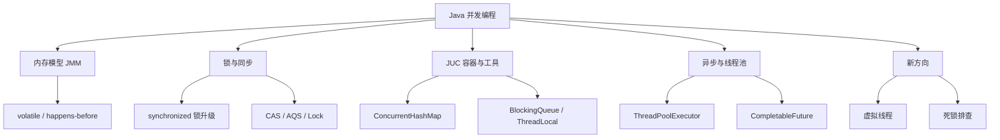
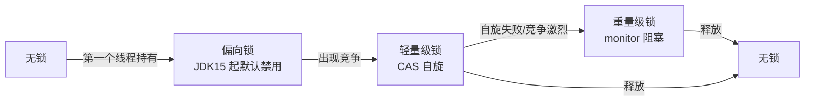
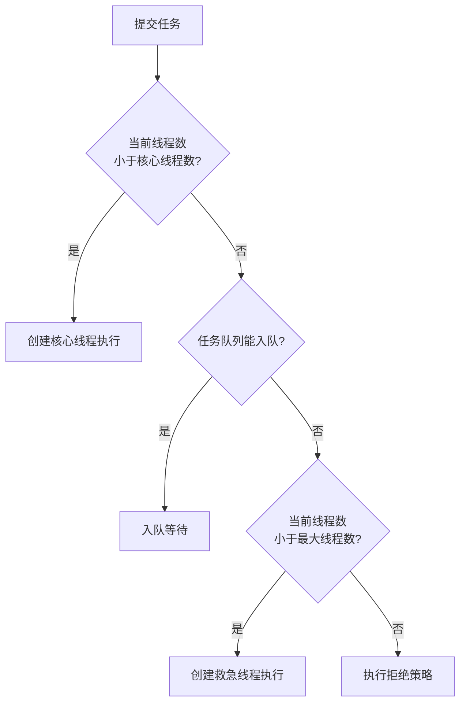
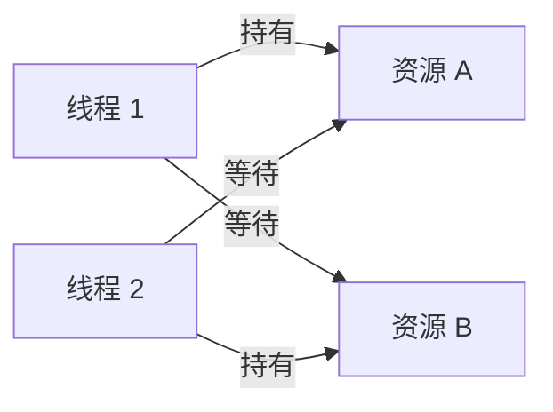

# Java 并发编程：线程、锁、JMM 与高并发基础

> 这份笔记的目标读者：已经学完《Java 核心》语言根基、准备大厂校招的 Java 后端候选人。  
> 建议版本：以 JDK 17/21 为主讲解；JDK 8 差异与 JDK 21 虚拟线程等专属内容会单独标注。  
> 阅读方式：第一次学习按顺序读第 0~14 章；面试前重点回看第 4~10 章（锁、线程池、ThreadLocal）；冲刺阶段直接做第 16 章自测题。  
> 配套课程：线程调度与 IO 模型的底层原理在《操作系统》《计算机网络》展开；本课只讲 Java 层的并发机制与 JUC。  
> 示例代码以 JDK 17/21 为准，标注了 JDK 8 差异；涉及并发的输出顺序可能因环境变化，不要以输出顺序判断正确性。

### 怎么用这份笔记

- **建立模型**：第 0~3 章先把 JMM、可见性、有序性讲透，后面所有锁和并发容器都建立在这套模型上；
- **源码驱动**：第 4~9 章是面试高发区，要求能说出 synchronized 锁升级路径、AQS 的 state 与队列、线程池执行流程；
- **当手册查**：第 15 章是排查与调优清单，第 16 章是分主题自测题；
- **动手验证**：每章示例都可以在 IDEA 里打断点或加日志观察线程状态；多线程问题靠“想”容易出错，靠实验最可靠。

## 目录

- [0. 学习地图：并发必考什么](#0-学习地图并发必考什么)
- [1. 线程基础：创建、状态与中断](#1-线程基础创建状态与中断)
- [2. 并发三要素与 Java 内存模型](#2-并发三要素与-java-内存模型)
- [3. volatile 深入](#3-volatile-深入)
- [4. synchronized 原理与锁升级](#4-synchronized-原理与锁升级)
- [5. CAS 与原子类](#5-cas-与原子类)
- [6. AQS 源码精读](#6-aqs-源码精读)
- [7. ReentrantLock 与锁家族](#7-reentrantlock-与锁家族)
- [8. 并发集合](#8-并发集合)
- [9. 线程池 ThreadPoolExecutor 精读](#9-线程池-threadpoolexecutor-精读)
- [10. ThreadLocal 与内存泄漏](#10-threadlocal-与内存泄漏)
- [11. 并发工具类](#11-并发工具类)
- [12. CompletableFuture 与异步编程](#12-completablefuture-与异步编程)
- [13. 死锁、活锁与饥饿](#13-死锁活锁与饥饿)
- [14. 虚拟线程与结构化并发](#14-虚拟线程与结构化并发)
- [15. 高并发实战与排查](#15-高并发实战与排查)
- [16. 高频自测题与参考资料](#16-高频自测题与参考资料)

---

## 0. 学习地图：并发必考什么

并发是校招 Java 后端“含金量最高”的一层：它考察的不只是 API，而是对内存模型、锁机制和工程权衡的理解。本章先给出考点地图和学习方法。

### 0.1 本课程覆盖的高频考点

| 主题 | 大厂高频考点 | 面试权重 |
|---|---|---|
| 线程基础 | 创建方式、6 种状态、中断机制 | ★★★ |
| JMM | 可见性/原子性/有序性、happens-before | ★★★★ |
| volatile | 语义、内存屏障、与 synchronized 区别 | ★★★★ |
| synchronized | 锁对象、可重入、锁升级 | ★★★★★ |
| CAS | 原理、ABA、原子类、LongAdder | ★★★★ |
| AQS | state、CLH 队列、独占/共享 | ★★★★ |
| Lock | ReentrantLock、读写锁、StampedLock | ★★★ |
| 并发集合 | ConcurrentHashMap、CopyOnWrite、BlockingQueue | ★★★★ |
| 线程池 | 7 参数、执行流程、拒绝策略、调优 | ★★★★★ |
| ThreadLocal | 原理、内存泄漏、线程池传递 | ★★★★ |
| 并发工具 | CountDownLatch、CyclicBarrier、Semaphore | ★★★ |
| 异步 | CompletableFuture、异常传播 | ★★★ |
| 死锁 | 四必要条件、检测与预防 | ★★★★ |
| 虚拟线程 | JEP 444、适用场景、钉住问题 | ★★★★ |

### 0.2 知识体系图



### 0.3 学习方法：五连问

每个并发知识点都用五个问题过一遍：

1. **它解决什么问题**：可见性、原子性、还是资源控制？
2. **底层怎么实现**：内存屏障？CAS 指令？队列？
3. **怎么用**：正确写法与典型场景。
4. **代价是什么**：性能开销、死锁风险、内存泄漏。
5. **坑在哪**：什么写法看着对、实际错。

### 0.4 边界说明

本课只讲 Java 层：线程的创建与调度由操作系统完成，select/epoll 等 IO 模型在《操作系统》《计算机网络》课程展开；类加载、GC 与对象布局在《JVM》课程展开；本课目录里找不到它们不是遗漏。

### 0.5 面试追问

- 问：并发编程的核心矛盾是什么？
- 答：多个线程同时读写共享状态时，产生原子性、可见性、有序性三类问题；锁、volatile、原子类分别针对其中一类或几类。

## 1. 线程基础：创建、状态与中断

先搞清楚“线程是什么、有几种状态、怎么安全终止”，再谈锁和线程池，否则后面全是空中楼阁。

### 1.1 创建线程的三种方式

```java
// 方式 1：继承 Thread（不推荐，占用继承位，且任务与线程耦合）
class MyThread extends Thread {
    @Override
    public void run() {
        System.out.println("thread run");
    }
}
new MyThread().start();

// 方式 2：实现 Runnable（推荐，任务与线程分离）
Thread t = new Thread(() -> System.out.println("runnable run"), "worker-1");
t.start();

// 方式 3：Callable + FutureTask（能拿到返回值或异常）
Callable<Integer> task = () -> 1 + 2;
FutureTask<Integer> future = new FutureTask<>(task);
new Thread(future).start();
Integer result = future.get();     // 阻塞等待结果，抛 ExecutionException 包装任务异常
```

本质：`Thread` 和 `Callable` 最终都通过 `Runnable` 进入 `Thread.run()`；区别只在于能否返回结果、能否抛异常。生产代码几乎不直接 `new Thread`，而是用线程池（见“线程池”章）。

### 1.2 线程的六种状态

```mermaid
flowchart TD
    NEW[NEW<br/>创建未启动] -->|start| RUNNABLE[RUNNABLE<br/>可运行/运行中]
    RUNNABLE -->|获取 synchronized 锁失败| BLOCKED[BLOCKED<br/>阻塞等锁]
    RUNNABLE -->|wait / join / park| WAITING[WAITING<br/>无限期等待]
    RUNNABLE -->|sleep / wait(timeout) / parkNanos| TIMED[TIMED_WAITING<br/>限期等待]
    BLOCKED -->|拿到锁| RUNNABLE
    WAITING -->|notify / unpark / 线程结束| RUNNABLE
    TIMED -->|超时或唤醒| RUNNABLE
    RUNNABLE -->|run 返回或异常| TERMINATED[TERMINATED<br/>已终止]
```

| 状态 | 触发 | 离开 |
|---|---|---|
| NEW | `new Thread` 后 | `start()` |
| RUNNABLE | 调用 start；被唤醒 | 时间片/锁/等待 |
| BLOCKED | 竞争 synchronized 锁失败 | 拿到锁 |
| WAITING | `wait()`、`join()`、`LockSupport.park()` | `notify`/`notifyAll`、目标线程结束、`unpark` |
| TIMED_WAITING | `sleep(ms)`、`wait(timeout)`、`join(ms)`、`parkNanos` | 超时或唤醒 |
| TERMINATED | run 执行完或抛异常 | 不可逆 |

注意：`sleep` **不释放锁**，`wait` **会释放锁**；`yield` 只是提示让出 CPU，线程仍是 RUNNABLE。

### 1.3 中断机制：协作式取消

Java 的线程终止是**协作式**的：不能粗暴 stop（已废弃），而是请求对方中断，由对方决定何时退出。

```java
Thread worker = new Thread(() -> {
    while (!Thread.currentThread().isInterrupted()) {
        // 处理任务，随时检查中断标志
    }
});
worker.start();
worker.interrupt();          // 设置中断标志；若线程正阻塞，则抛 InterruptedException 并清除标志
```

```java
// 处理 InterruptedException 的正确姿势：恢复中断标志，让上层知道
try {
    Thread.sleep(1000);
} catch (InterruptedException e) {
    Thread.currentThread().interrupt();   // 重新设置标志，而不是吞掉
    throw new RuntimeException(e);
}
```

常用方法对照：

| 方法 | 作用 |
|---|---|
| `interrupt()` | 设置中断标志；阻塞中的线程抛 InterruptedException |
| `isInterrupted()` | 查询标志，不清除 |
| `Thread.interrupted()` | 查询并清除标志（静态） |
| `join()` | 等待线程结束（内部 wait，可被打断） |
| `sleep(ms)` | 当前线程睡指定时间 |
| `yield()` | 提示让出 CPU |

补充：`LockSupport.park()` 被 `interrupt()` 时**不会抛 InterruptedException**，只会设置中断标志（与 sleep/wait 不同）；AQS 正是基于 park/unpark 让线程挂起与唤醒，所以 AQS 的等待可以被中断唤醒但不会抛异常。

### 1.4 守护线程

`setDaemon(true)` 的线程是守护线程：所有用户线程结束后 JVM 直接退出，不等待守护线程。典型用途是后台监控、心跳；不要在守护线程里做必须落盘的收尾工作。

### 1.5 面试追问

- 问：start 和 run 的区别？
- 答：`start()` 创建新线程并执行 run；直接调 `run()` 只是当前线程里执行一次普通方法调用。
- 问：sleep 和 wait 的区别？
- 答：sleep 不释放锁、到点自动醒；wait 必须持有锁时调用、释放锁并进入等待，需要 notify/notifyAll 唤醒。
- 问：如何安全终止一个线程？
- 答：协作式中断：调用 `interrupt()`，任务里检查 `isInterrupted()` 或捕获 InterruptedException 后自行退出，不要用已废弃的 stop。
- 问：六种状态分别在什么时候进入？
- 答：见 1.2 表格；重点分清 BLOCKED（等 synchronized 锁）与 WAITING（主动等待被唤醒）。

## 2. 并发三要素与 Java 内存模型

并发 bug 的根源只有三个：原子性、可见性、有序性。理解 JMM（Java Memory Model）就是理解 Java 如何约束这三者。

### 2.1 并发问题的三大根源

| 问题 | 根源 | 典型表现 |
|---|---|---|
| 原子性 | 线程切换（时间片） | `i++` 三步操作被打断，计数丢失 |
| 可见性 | CPU 缓存 | 一个线程改了变量，另一个线程看不到 |
| 有序性 | 编译器和 CPU 重排序 | 双重检查锁的“半个对象”问题 |

示例：两个线程各执行 10000 次 `count++`，结果几乎不可能等于 20000，因为 `count++` 在字节码层面是“读-改-写”三步，不是原子操作。

### 2.2 JMM 是什么

JMM 是 Java 语言规范里定义的抽象内存模型，用来约束线程与内存的交互，**不绑定具体硬件**：

```text
线程 A ──工作内存（寄存器/缓存）──┐
                                 ├── 主内存（共享变量真正所在）
线程 B ──工作内存（寄存器/缓存）──┘
```

- 所有共享变量存在**主内存**；
- 每个线程有自己的**工作内存**（抽象概念，对应寄存器与 CPU 缓存），读写共享变量前要先在工作内存与主内存之间同步；
- 线程不能直接读写其他线程的工作内存，变量传递必须经过主内存。

JMM 通过三类手段保证并发安全：

1. **关键字**：`volatile`、`synchronized`、`final`；
2. **happens-before 规则**：给跨线程的内存操作建立偏序；
3. **内存屏障**：JVM 在合适位置插入屏障指令，阻止重排序并保证缓存同步。

### 2.3 happens-before 八条规则

如果操作 A happens-before 操作 B，那么 A 对内存的写入对 B **可见**，且 A 不会重排到 B 之后。八条规则：

1. **程序顺序规则**：同一线程内，写在前面的操作 happens-before 后面的操作；
2. **监视器锁规则**：锁的解锁 happens-before 后续对该锁的加锁（synchronized/Lock）；
3. **volatile 规则**：volatile 变量的写 happens-before 后续对该变量的读；
4. **线程启动规则**：`Thread.start()` 之前的操作 happens-before 新线程中的操作；
5. **线程终止规则**：线程中的所有操作 happens-before 其他线程从 `join()` 返回；
6. **中断规则**：`interrupt()` 的调用 happens-before 被中断线程检测到中断（抛异常或查到标志）；
7. **final 规则**：对象构造完成前对 final 字段的写 happens-before 后续通过引用读取该对象；
8. **传递性**：A happens-before B 且 B happens-before C，则 A happens-before C。

```java
// 利用 volatile 规则：写 happens-before 读
volatile boolean ready = false;
int value = 0;

// 线程 A
value = 42;       // 普通写
ready = true;     // volatile 写

// 线程 B
if (ready) {      // volatile 读
    System.out.println(value);   // 一定看到 42
}
```

### 2.4 as-if-serial 与重排序

编译器和 CPU 会做指令重排序，但必须遵守 **as-if-serial**：单线程语义下，重排序不能改变程序结果。重排序对多线程可见，所以需要 volatile/synchronized 来约束。

### 2.5 面试追问

- 问：并发编程的三要素？
- 答：原子性（线程切换）、可见性（CPU 缓存）、有序性（重排序）。
- 问：JMM 是什么？
- 答：Java 语言规范定义的抽象内存模型，用主内存/工作内存、happens-before、内存屏障来约束线程间可见性与重排序。
- 问：happens-before 有什么用？
- 答：只要两个操作满足 happens-before，前面的写就对后面的读可见；它把“靠经验保证并发”变成“按规则推导保证并发”。
- 问：volatile 变量的写读之间能保证什么？
- 答：写 happens-before 后续读，读一定能看到该写之前的所有可见操作的结果（配合传递性）。

## 3. volatile 深入

volatile 是最轻量的同步手段，也是面试最喜欢“挖坑”的关键字。

### 3.1 volatile 的两条语义

1. **可见性**：volatile 变量的写会立即刷新到主内存，读会直接从主内存读取；
2. **有序性**：禁止指令重排序，JVM 在读写前后插入内存屏障。

它**不保证原子性**：`volatile int count; count++` 仍是“读-改-写”三步，多个线程同时执行照样丢计数。

```java
// 反例：volatile 不能替代锁或原子类
volatile int count = 0;
// 100 个线程各执行 count++ 1000 次，结果 < 100000
```

### 3.2 内存屏障

JMM 的保守插入策略：

| 操作 | 前置屏障 | 后置屏障 |
|---|---|---|
| volatile 写 | StoreStore | StoreLoad |
| volatile 读 | —（无） | LoadLoad + LoadStore |

- **StoreStore**：屏障前的普通写不会被重排到 volatile 写之后；
- **StoreLoad**：保证 volatile 写的值对其他线程可见（x86 上往往就是一条 `lock` 前缀指令）；
- **LoadLoad/LoadStore**：都插在 volatile 读**之后**，保证屏障后的普通读/写不会被重排到 volatile 读之前。

补充：x86（TSO 内存模型）上 volatile **读**通常不需要额外指令（普通 load 本身就具备 acquire 语义），volatile **写**才体现为 `lock` 前缀指令。

注意：volatile 的语义由 JMM 定义，**不是“禁用 CPU 缓存”**；具体实现依赖屏障指令与缓存一致性协议。

### 3.3 典型应用一：状态标志

```java
volatile boolean stopped = false;

// 工作线程
while (!stopped) {
    doWork();
}

// 主线程
stopped = true;    // 可见性保证工作线程能退出
```

### 3.4 典型应用二：双重检查锁单例

```java
public class Singleton {
    private static volatile Singleton instance;   // 必须 volatile

    public static Singleton getInstance() {
        if (instance == null) {                    // 第一次检查（不加锁）
            synchronized (Singleton.class) {
                if (instance == null) {            // 第二次检查（加锁）
                    instance = new Singleton();
                }
            }
        }
        return instance;
    }
}
```

为什么必须 volatile：`new Singleton()` 分为“分配内存 → 初始化字段 → 把引用赋给 instance”三步，没有 volatile 时，CPU 可能把“赋引用”重排到“初始化”之前，另一个线程第一次检查时看到非 null 却拿到未初始化的“半个对象”。volatile 的 StoreStore 屏障保证初始化完成前引用不会被发布。

JDK 5 之后还有另一条路：把 `instance` 字段设为 `final`，利用 final 规则保证安全发布。

### 3.5 volatile 与 synchronized 对比

| 对比项 | volatile | synchronized |
|---|---|---|
| 可见性 | 是 | 是 |
| 原子性 | 否 | 是（临界区内） |
| 有序性 | 禁止重排序 | 是（互斥天然有序） |
| 阻塞 | 否 | 是（竞争时阻塞） |
| 使用成本 | 低 | 较高 |
| 适用 | 标志位、单例发布、状态开关 | 复合操作、临界区 |

### 3.6 面试追问

- 问：volatile 能保证原子性吗？
- 答：不能；它只保证可见性和有序性，`i++` 这类复合操作仍需原子类或锁。
- 问：volatile 的底层实现？
- 答：JMM 层面插入内存屏障（volatile 写前 StoreStore、写后 StoreLoad，读后 LoadLoad/LoadStore）；具体由 JVM 映射到 CPU 指令，x86 上 volatile 写常表现为 lock 前缀指令。
- 问：双重检查锁为什么需要 volatile？
- 答：防止构造过程重排序导致发布“半个对象”，保证初始化先于引用发布。
- 问：volatile 能替代锁吗？
- 答：只能替代“单写多读 + 状态简单”的场景；多个线程同时读改写共享变量时必须用锁或原子类。

## 4. synchronized 原理与锁升级

synchronized 是 Java 最基础也最常用的锁。面试要求从“怎么用”讲到“底层锁升级”，两者都要熟。

### 4.1 三种用法与锁对象

```java
// 1. 同步实例方法：锁是 this
public synchronized void m1() { }

// 2. 同步静态方法：锁是 Class 对象
public static synchronized void m2() { }

// 3. 同步代码块：锁是括号里的对象
public void m3() {
    synchronized (lock) { }
}
```

关键认知：

- 锁的对象是 **monitor（监视器）**，Java 里每个对象都关联一个 monitor（由对象头中的锁记录/指向）;
- 只有**竞争同一个锁对象**的线程才互斥；用 `this` 和用 `Class` 锁互不相关；
- 是**可重入**的：同一线程重入同一 monitor 会计数 +1，退出同步块时 -1，计数归零才真正释放；所以同步方法里可以再调自己的同步方法。

### 4.2 锁升级：无锁 → 轻量级 → 重量级

JDK 6 之后 synchronized 做了大量优化，锁存在升级路径：



- **偏向锁（历史）**：只有第一个线程反复进入时，在对象头记录线程 ID，省去 CAS；JDK 15 起默认禁用并弃用（JEP 374），实际开发可以忽略它；
- **轻量级锁**：线程在栈帧中创建锁记录，用 CAS 把对象头 Mark Word 替换为指向锁记录的指针；CAS 失败说明有竞争，升级；
- **重量级锁**：进入 monitor，竞争线程被阻塞（涉及操作系统互斥量与线程唤醒），开销最大，但公平性最好。

一句话结论：**锁只会升级不会降级**（重量级锁释放后对象回到无锁状态，但“偏向锁→轻量级→重量级”的升级方向不可逆）。

<!--demo:锁升级可视化.html-->

除了升级，JIT 还有两个锁优化：**锁消除**（逃逸分析发现锁对象不逃逸，直接去掉无意义的加锁）与**锁粗化**（把相邻多次加同一把锁合并成一次，减少加解锁次数）。它们是“锁升级”之外的另一半性能故事。

### 4.3 wait/notify 与锁的关系

```java
synchronized (lock) {
    while (!condition) {
        lock.wait();      // 释放锁并等待；被唤醒后重新竞争锁
    }
    // 条件满足后继续
    lock.notifyAll();     // 唤醒等待者；notify 本身不释放锁，要等同步块退出
}
```

规范：

- `wait()`/`notify()`/`notifyAll()` 必须持有该对象的锁才能调用；
- `wait` 会释放锁，`notify` 不会释放锁；
- 等待条件必须用 **while 循环**包裹（虚假唤醒），不能用 if；
- 优先 `notifyAll` 而不是 `notify`，避免唤醒错线程。

### 4.4 synchronized 与 Lock 对比

| 对比项 | synchronized | ReentrantLock |
|---|---|---|
| 获取/释放 | 自动（块结束释放） | 手动 lock/unlock（必须 finally 释放） |
| 可中断 | 否 | `lockInterruptibly()` 是 |
| 超时 | 否 | `tryLock(timeout)` 是 |
| 公平性 | 非公平 | 可构造公平锁 |
| 条件变量 | 每个对象一个 wait/notify | `newCondition()` 多个条件队列 |
| 底层 | monitor（锁升级） | AQS + LockSupport |

### 4.5 面试追问

- 问：synchronized 锁的是什么？
- 答：对象的 monitor；实例方法锁 this，静态方法锁 Class，代码块锁指定对象。
- 问：锁升级过程？
- 答：无锁 → 偏向锁（JDK 15 起默认禁用）→ 轻量级锁（CAS 自旋）→ 重量级锁（monitor 阻塞）；升级方向不可逆。
- 问：synchronized 可重入吗？
- 答：可重入，monitor 计数 +1/-1，归零才释放。
- 问：wait 和 notify 为什么要放在 synchronized 里？
- 答：保证“检查条件-等待-唤醒”的原子性，避免条件竞争和丢失唤醒。
- 问：锁粒度怎么设计？
- 答：尽量锁最小范围（只锁共享代码段）、锁对象收敛（不要锁 this 又锁 Class 造成混乱）、避免锁内做 IO。

## 5. CAS 与原子类

CAS（Compare And Swap）是无锁编程的基石：不阻塞线程，而是乐观地“比较并交换”，失败就重试。

### 5.1 CAS 原理

```text
CAS(内存地址 V, 期望值 A, 新值 B)：
    如果 V 当前值 == A，则把 V 更新为 B，返回 true
    否则什么都不做，返回 false
```

```java
AtomicInteger count = new AtomicInteger(0);

// 等价于 while 循环自旋：
// 读旧值 → CAS(旧值, 旧值+1) → 失败则重读再试
count.incrementAndGet();
```

底层是 CPU 提供的原子指令（x86 的 `cmpxchg`），由硬件保证“比较 + 交换”这一整步不可分割，所以 CAS 是原子的。

### 5.2 CAS 的三个缺点

| 缺点 | 说明 | 解决 |
|---|---|---|
| 自旋消耗 CPU | 竞争激烈时不断重试 | 限制自旋次数、锁粗化或改用锁 |
| 只能保证一个变量的原子性 | 多个变量无法一次 CAS | 把多个值封装成对象用 `AtomicReference` |
| ABA 问题 | A 被改成 B 又被改回 A，CAS 误以为没变过 | `AtomicStampedReference` 带版本号 |

ABA 示例：线程 1 读到值 A；线程 2 改成 B 又改回 A；线程 1 的 CAS 成功，但中间状态被“偷走”过。解决方式是带上版本号或时间戳：

```java
AtomicStampedReference<Integer> ref = new AtomicStampedReference<>(100, 0);
int[] stamp = new int[1];
Integer value = ref.get(stamp);          // 读取当前值和版本
ref.compareAndSet(value, 101, stamp[0], stamp[0] + 1);  // 值和版本都匹配才交换
```

### 5.3 原子类家族

| 类别 | 类 |
|---|---|
| 基本类型 | AtomicInteger、AtomicLong、AtomicBoolean |
| 引用类型 | AtomicReference、AtomicStampedReference、AtomicMarkableReference |
| 数组 | AtomicIntegerArray、AtomicLongArray、AtomicReferenceArray |
| 字段更新器 | AtomicIntegerFieldUpdater、AtomicReferenceFieldUpdater |
| 累加器（JDK 8） | LongAdder、LongAccumulator、DoubleAdder、DoubleAccumulator |

```java
AtomicInteger ai = new AtomicInteger(10);
ai.getAndIncrement();      // 返回旧值 10，然后变为 11
ai.incrementAndGet();      // 返回 12
ai.compareAndSet(12, 20);  // true，变为 20
ai.updateAndGet(x -> x * 2); // 40，JDK 8 函数式更新
```

**LongAdder（JDK 8）**：把单个计数拆成 base + 多个 Cell 分段，各线程分散累加，最后求和，适合“高并发写、不常读”的统计场景（如 QPS 计数）；吞吐比 AtomicLong 高，但 get 不是强一致快照。

### 5.4 面试追问

- 问：CAS 的原理？
- 答：硬件原子指令，比较内存值是否等于期望值，等于才交换；Java 层用自旋重试实现无锁更新。
- 问：CAS 的缺点？
- 答：自旋消耗 CPU、只能一个变量、ABA 问题。
- 问：ABA 问题怎么解决？
- 答：AtomicStampedReference 加版本号；不能靠“值相同就安全”的假设。
- 问：AtomicInteger 和 LongAdder 怎么选？
- 答：低并发或需要强一致结果用 AtomicInteger；超高并发计数、只求和统计用 LongAdder。

## 6. AQS 源码精读

`AbstractQueuedSynchronizer`（AQS）是 JUC 锁与同步器的公共基类：ReentrantLock、Semaphore、CountDownLatch、ReentrantReadWriteLock 都建立在它上面。理解 AQS 就理解了一半 JUC。

### 6.1 AQS 的核心设计

```text
volatile int state    同步状态（0 表示空闲，1 表示被持有，可重入锁会更大）
CLH 变体等待队列      获取失败的线程封装成 Node 排队
独占模式 / 共享模式   两种获取方式
```

三个要点：

1. **state**：volatile 修饰的同步状态，子类自己定义它的含义；
2. **CLH 队列**：基于链表的 FIFO 等待队列（头节点是持有锁的线程，后面的节点排队）；
3. **模板方法模式**：AQS 定好 `acquire`/`release` 骨架，把 `tryAcquire`/`tryRelease` 留给子类实现。

### 6.2 acquire 与 release 骨架

```java
// 独占获取（ReentrantLock.lock 的核心）
public final void acquire(int arg) {
    if (!tryAcquire(arg)) {              // 子类实现：尝试获取
        Node node = addWaiter(Node.EXCLUSIVE);   // 获取失败入队
        acquireQueued(node, arg);                // 自旋/阻塞等待
    }
}

// 独占释放
public final boolean release(int arg) {
    if (tryRelease(arg)) {               // 子类实现：尝试释放
        Node h = head;
        if (h != null && h.waitStatus != 0)
            unparkSuccessor(h);          // 唤醒队首等待者
        return true;
    }
    return false;
}
```

完整流程（以 ReentrantLock 为例）：

```text
lock() → acquire(1) → tryAcquire 成功？→ 是：直接持有，state=1
                              → 否：封装成 Node 加入队尾，LockSupport.park 阻塞
unlock() → release(1) → tryRelease 成功（state 归零）→ 唤醒队首线程
```

### 6.3 独占与共享

| 模式 | 获取 | 释放 | 应用 |
|---|---|---|---|
| 独占 | acquire | release | ReentrantLock |
| 共享 | acquireShared | releaseShared | Semaphore、CountDownLatch、ReentrantReadWriteLock 的读锁 |

共享模式特殊之处：一个线程释放后可以**同时唤醒多个**等待者（如 Semaphore 释放 3 个许可，唤醒多个排队线程）。

### 6.4 Condition：AQS 里的等待队列

`Condition` 对应 `Object.wait/notify` 的增强版：一个锁可以有**多个条件队列**。

```java
ReentrantLock lock = new ReentrantLock();
Condition notFull = lock.newCondition();
Condition notEmpty = lock.newCondition();

// 生产者
lock.lock();
try {
    while (queue.isFull()) notFull.await();   // 释放锁并等待
    queue.put(x);
    notEmpty.signal();                        // 唤醒一个消费者
} finally {
    lock.unlock();
}
```

底层：每个 Condition 维护一条单向等待队列，`await` 把当前线程挂到条件队列并释放锁，`signal` 把队头节点移回 AQS 主队列等待重新抢锁。

### 6.5 AQS 的典型应用

| 同步器 | state 含义 | 模式 |
|---|---|---|
| ReentrantLock | 持有次数（可重入） | 独占 |
| Semaphore | 剩余许可数 | 共享 |
| CountDownLatch | 剩余倒计数 | 共享 |
| ReentrantReadWriteLock | 高 16 位读锁 + 低 16 位写锁 | 独占 + 共享 |

### 6.6 面试追问

- 问：AQS 是什么？核心字段有哪些？
- 答：抽象队列同步器，核心是 volatile int state 和 CLH 变体 FIFO 等待队列；子类实现 tryAcquire/tryRelease 等钩子。
- 问：AQS 的获取失败流程？
- 答：tryAcquire 失败 → addWaiter 入队 → acquireQueued 自旋/阻塞 → 被前驱唤醒后再次尝试。
- 问：独占和共享模式的区别？
- 答：独占一次一个线程持有；共享可多个线程同时获取（读锁、许可），释放时可唤醒多个等待者。
- 问：ReentrantLock 的可重入怎么实现的？
- 答：state 计数：同一线程重入 state+1，释放递减，归零才真正释放并唤醒后继。

## 7. ReentrantLock 与锁家族

除了 synchronized，JUC 还提供功能更强的 Lock 系列。校招重点在 ReentrantLock，读写锁与 StampedLock 作为扩展。

### 7.1 ReentrantLock

```java
ReentrantLock lock = new ReentrantLock();      // 默认非公平
ReentrantLock fair = new ReentrantLock(true);  // 公平锁

lock.lock();
try {
    // 临界区
} finally {
    lock.unlock();      // 必须 finally 释放，否则死锁
}
```

核心能力：

| 能力 | 说明 |
|---|---|
| 可重入 | 同线程重入 state+1 |
| 公平/非公平 | 公平锁按 FIFO 排队；非公平锁先 CAS 抢一次再排队 |
| 可中断 | `lockInterruptibly()` 等待时可响应中断 |
| 超时 | `tryLock(2, TimeUnit.SECONDS)` 拿不到就放弃 |
| 多条件 | `newCondition()` 任意多个 |
| 性能 | 竞争激烈时通常优于 synchronized（JDK 6 之后差距缩小） |

### 7.2 公平锁 vs 非公平锁

- **非公平锁**（默认）：新线程先直接 CAS 抢锁，抢不到才排队；吞吐更高，但可能“插队”导致等待线程饥饿；
- **公平锁**：`hasQueuedPredecessors()` 检查队列里是否有人先到，有人就先排队；更公平但吞吐低。

### 7.3 读写锁：ReentrantReadWriteLock

```java
ReentrantReadWriteLock rw = new ReentrantReadWriteLock();
Lock readLock = rw.readLock();
Lock writeLock = rw.writeLock();

readLock.lock();     // 读读共享
try { /* 读 */ } finally { readLock.unlock(); }

writeLock.lock();    // 读写互斥、写写互斥
try { /* 写 */ } finally { writeLock.unlock(); }
```

**锁降级**：持有写锁时获取读锁，再释放写锁——保证在释放写锁的瞬间，仍以读锁保护数据，避免另一个写者插入。

注意饥饿：ReentrantReadWriteLock 默认非公平，读锁被大量获取时，后来的读锁可能继续插队，写锁长期拿不到（写饥饿）；写占比高的场景要评估公平模式或换方案。

### 7.4 StampedLock：乐观读（JDK 8）

```java
StampedLock sl = new StampedLock();

long stamp = sl.tryOptimisticRead();   // 乐观读：不真正加锁
int value = shared;
if (!sl.validate(stamp)) {             // 期间被写过？
    stamp = sl.readLock();             // 退化为悲观读
    try { value = shared; } finally { sl.unlockRead(stamp); }
}
```

- 乐观读**不加锁**，性能最好，但读到的数据可能已经过期，必须 `validate` 校验；
- 适合读多写少、读操作很快的场景；不可重入，使用复杂度高，生产用得谨慎。

### 7.5 面试追问

- 问：synchronized 和 ReentrantLock 的区别？
- 答：自动释放 vs 手动释放；后者支持可中断、超时、公平、多条件；底层 monitor vs AQS。
- 问：公平锁一定公平吗？为什么默认非公平？
- 答：公平锁严格按队列顺序，但吞吐更低；非公平锁允许新线程抢一次，减少唤醒开销，默认选择是非公平。
- 问：什么是锁降级？为什么要降级？
- 答：写锁 → 读锁，保证释放写锁瞬间仍受读锁保护，防止其他写者插入造成数据不一致。
- 问：StampedLock 的乐观读安全吗？
- 答：乐观读不加锁，靠 validate 检查版本；读期间被写就退化为悲观读重读。

## 8. 并发集合

`HashMap`、`ArrayList` 都不是线程安全的，JUC 提供了一套并发容器。面试重点：ConcurrentHashMap 的实现演进、CopyOnWriteArrayList 的写时复制、BlockingQueue 家族。

### 8.1 线程安全集合总览

| 容器 | 代替 | 实现思路 |
|---|---|---|
| ConcurrentHashMap | HashMap | 分段/桶级并发控制 |
| CopyOnWriteArrayList | ArrayList | 写时复制 |
| CopyOnWriteArraySet | HashSet | 基于 CopyOnWriteArrayList |
| ConcurrentLinkedQueue | LinkedList | 无锁 CAS 链表 |
| BlockingQueue 系列 | Queue | 阻塞式存取 |
| ConcurrentSkipListMap/Set | TreeMap/TreeSet | 跳表，有序并发 |

### 8.2 ConcurrentHashMap：JDK 7 vs JDK 8

**JDK 7：分段锁（Segment）**

- 把整个表分成 16 段，每段一把 ReentrantLock；
- 不同段可以并发写，同一段内互斥；锁粒度是“段”。

**JDK 8：CAS + synchronized**

- 抛弃分段锁，锁粒度细化到**单个桶（链表/红黑树头节点）**；
- 空桶用 CAS 直接放节点，非空桶用 synchronized 锁桶头；
- 读操作无锁（Node 的 val 是 volatile），并发度更高。

```java
// JDK 8 的 put 简化逻辑
if (tab[i] == null) {
    casTabAt(tab, i, null, new Node<>(hash, key, value));  // 空桶 CAS
} else {
    synchronized (tab[i]) {                                 // 非空桶锁头
        // 链表尾插或树中插入；长度达 8 且容量达 64 转红黑树
    }
}
```

其他关键点：

- `sizeCtl`：-1 表示正在初始化，正数表示扩容阈值，负数高位表示扩容中；
- **扩容协助**：扩容时旧桶会放入 ForwardingNode，其他线程遇到它可协助迁移（helpTransfer）；
- 计数用 `CounterCell` 数组分段累加，`size()` 是近似值；
- 迭代器是**弱一致**的：迭代过程中新增/删除不一定能看到，但不会抛 ConcurrentModificationException；
- 不允许 null key/value。

### 8.3 CopyOnWriteArrayList：读多写少

```java
CopyOnWriteArrayList<String> list = new CopyOnWriteArrayList<>();
list.add("a");   // 加锁 + 复制整个数组 + 追加 + 替换引用
list.get(0);     // 无锁直接读 volatile 数组
```

- 写操作（add/remove/set）复制一份新数组，修改后把引用指向新数组；
- 读操作永不阻塞，读的是“某个瞬间的快照”，可能读不到刚写的数据；
- 迭代器基于快照，不会抛 ConcurrentModificationException；
- 代价：每次写都 O(n) 复制，适合**读多写极少**（如黑名单、路由表）；写频繁场景反而比加锁更慢。

### 8.4 BlockingQueue 家族

阻塞队列是线程池和生产者-消费者模式的核心。四组方法：

| 操作 | 抛异常 | 返回特殊值 | 阻塞 | 超时 |
|---|---|---|---|---|
| 入队 | add | offer | put | offer(e, time, unit) |
| 出队 | remove | poll | take | poll(time, unit) |
| 查看 | element | peek | 不支持 | 不支持 |

| 实现 | 特点 | 边界 |
|---|---|---|
| ArrayBlockingQueue | 数组，一把锁 + 两个条件 | 构造时必须指定容量（有界） |
| LinkedBlockingQueue | 链表，两把锁（put/take 分离） | 默认容量 Integer.MAX_VALUE，可指定有界 |
| SynchronousQueue | 无缓冲，直接交接 | 容量为 0，put 必须等 take |
| PriorityBlockingQueue | 二叉堆，按优先级出队 | 无界，不允许 null |
| DelayQueue | 延迟到期才能取出 | 元素需实现 Delayed |

```java
// 生产者-消费者经典写法
BlockingQueue<String> queue = new ArrayBlockingQueue<>(100);

// 生产者
queue.put("task");               // 满则阻塞
// 消费者
String task = queue.take();      // 空则阻塞

// 带超时的非阻塞版本
boolean ok = queue.offer("task", 2, TimeUnit.SECONDS);
String t = queue.poll(2, TimeUnit.SECONDS);
```

### 8.5 面试追问

- 问：ConcurrentHashMap JDK 8 怎么保证线程安全？
- 答：空桶 CAS，非空桶 synchronized 锁桶头，读无锁；相比 JDK 7 分段锁粒度更细。
- 问：为什么 ConcurrentHashMap 不允许 null？
- 答：并发下无法区分“key 不存在”和“value 是 null”，get 返回 null 的语义会变得不可靠。
- 问：CopyOnWriteArrayList 的适用场景？
- 答：读多写极少；写时复制 O(n)，读是无锁快照。
- 问：ArrayBlockingQueue 和 LinkedBlockingQueue 的区别？
- 答：数组/链表、必须有界/默认无界、单锁双条件/双锁。
- 问：SynchronousQueue 有什么用？
- 答：无缓冲直接交接，CachedThreadPool 用它实现“来任务就开线程”。

## 9. 线程池 ThreadPoolExecutor 精读

线程池是并发面试的“必考之王”，不仅要背 7 个参数，还要能讲清执行流程、拒绝策略和调优。

### 9.1 为什么用线程池

接口层次：`Executor`（只有 execute）→ `ExecutorService`（submit/shutdown/awaitTermination 等）→ `ScheduledExecutorService`（定时/周期任务）；`ThreadPoolExecutor` 是 ExecutorService 的核心实现。

1. **复用线程**：避免频繁创建/销毁线程的开销；
2. **控制并发数**：限制同时运行的线程数，保护系统；
3. **统一管理**：任务队列、超时回收、拒绝策略、监控一把抓。

### 9.2 七个核心参数

| 参数 | 含义 |
|---|---|
| `corePoolSize` | 核心线程数：长期保活的线程数 |
| `maximumPoolSize` | 最大线程数：核心 + 救急线程上限 |
| `keepAliveTime` + `unit` | 非核心线程空闲多久被回收 |
| `workQueue` | 任务队列（BlockingQueue） |
| `threadFactory` | 线程工厂（自定义命名/守护属性） |
| `handler` | 拒绝策略（队列和线程都满时） |

### 9.3 执行流程



一句话流程：**先核心线程，再任务队列，再救急线程，最后拒绝**。

```java
ThreadPoolExecutor pool = new ThreadPoolExecutor(
        2,                       // corePoolSize
        5,                       // maximumPoolSize
        30, TimeUnit.SECONDS,    // keepAliveTime
        new ArrayBlockingQueue<>(10),   // 有界队列
        new ThreadFactoryBuilder().setNameFormat("order-pool-%d").build(),  // 自定义命名
        new ThreadPoolExecutor.CallerRunsPolicy()   // 拒绝策略
);
```

### 9.4 四种拒绝策略

| 策略 | 行为 | 适用 |
|---|---|---|
| `AbortPolicy`（默认） | 抛 RejectedExecutionException | 必须发现过载 |
| `CallerRunsPolicy` | 调用者线程直接执行该任务 | 降速保护，不想丢任务 |
| `DiscardPolicy` | 静默丢弃 | 允许丢的日志/统计 |
| `DiscardOldestPolicy` | 丢弃队头最旧任务再提交 | 新任务比旧任务重要 |

### 9.5 线程池状态

```text
RUNNING → SHUTDOWN → TIDYING → TERMINATED
    └─────→ STOP ────→ TIDYING → TERMINATED
```

| 状态 | 含义 |
|---|---|
| RUNNING | 接收新任务并处理队列 |
| SHUTDOWN | 不接收新任务，继续处理队列（shutdown） |
| STOP | 不接收新任务、不处理队列、中断执行中的线程（shutdownNow） |
| TIDYING | 任务清空、线程归零，执行 terminated() |
| TERMINATED | 终止完成 |

### 9.6 execute vs submit

```java
pool.execute(runnable);            // 无返回值
Future<?> f = pool.submit(task);   // 有返回值；task 可以是 Callable/Runnable
f.get();                           // 阻塞拿结果，任务异常包装为 ExecutionException
```

submit 底层也是 execute，只是额外用 FutureTask 包装；任务内部异常不会立刻抛给提交线程，必须 get 才能发现。

### 9.7 Executors 工厂的坑

| 工厂方法 | 队列 | 问题 |
|---|---|---|
| newFixedThreadPool | 无界 LinkedBlockingQueue | 任务堆积 OOM |
| newSingleThreadExecutor | 无界队列 | 同上 |
| newCachedThreadPool | SynchronousQueue + 最大线程 Integer.MAX_VALUE | 任务暴增线程爆炸 |
| newScheduledThreadPool | DelayedWorkQueue + 最大线程 Integer.MAX_VALUE | 同上 |

阿里开发手册明确要求：**手动 new ThreadPoolExecutor**，用有界队列、自定义线程名，避免 Executors 默认实现带来的 OOM 或线程爆炸。

### 9.8 参数设计与调优

线程数估算（经验公式，实际靠压测校准）：

- **CPU 密集型**：`CPU 核数 + 1`，线程基本不阻塞；
- **IO 密集型**：`CPU 核数 × (1 + 等待时间 / 计算时间)`，例如等待 90%、计算 10% 时约为 `核数 × 10`；
- 队列选择有界队列（ArrayBlockingQueue 或指定容量的 LinkedBlockingQueue），容量按“峰值积压可接受内存”估算；
- 线程名必须可辨识（排查问题时 jstack 才看得懂）；
- 拒绝策略按业务选：核心交易用 AbortPolicy 暴露问题，能降速的用 CallerRunsPolicy。

### 9.9 优雅关闭

```java
pool.shutdown();                              // 不再接收新任务，处理完队列
if (!pool.awaitTermination(30, TimeUnit.SECONDS)) {
    pool.shutdownNow();                       // 超时后强制中断
}
```

不要在应用退出时直接把线程池扔给 JVM：线程池里的非守护线程会阻止进程退出，且未处理完的任务会丢。

注意：`shutdown()` 之后继续 `submit` 会抛 `RejectedExecutionException`；优雅关闭期间应停止提交新任务，并用 awaitTermination 确认队列处理完。

### 9.10 面试追问

- 问：线程池执行任务的完整流程？
- 答：核心线程 → 任务队列 → 救急线程 → 拒绝策略，四步依次判断。
- 问：核心线程会被回收吗？
- 答：默认不会；设置 `allowCoreThreadTimeOut(true)` 后核心线程空闲超时也会被回收。
- 问：Executors 为什么不让用？
- 答：无界队列导致 OOM、无上限线程数导致资源耗尽；必须手动指定参数。
- 问：线程数怎么定？
- 答：CPU 密集 ≈ 核数 + 1；IO 密集按 `核数 × (1 + 等待/计算)` 估算，最终压测校准。
- 问：如何优雅关闭线程池？
- 答：shutdown 后 awaitTermination，超时再 shutdownNow，并处理中断。

## 10. ThreadLocal 与内存泄漏

ThreadLocal 是“线程私有变量”的实现，也是面试最爱结合“内存泄漏”考察的类。

### 10.1 原理

```text
每个 Thread 内部有一个 ThreadLocal.ThreadLocalMap（字段 threadLocals）
map 的 key 是 ThreadLocal 对象（弱引用），value 是 set 进去的值
所以：每个线程一份数据，互不干扰
```

```java
ThreadLocal<Integer> userId = new ThreadLocal<>();

userId.set(1001);      // 写入当前线程的 map
Integer id = userId.get();   // 从当前线程的 map 取
userId.remove();       // 删除，防止泄漏
```

```java
// 注意：不同线程 get 到的是各自 set 的值
ThreadLocal<Integer> tl = new ThreadLocal<>();
new Thread(() -> { tl.set(1); System.out.println(tl.get()); }).start();
new Thread(() -> { tl.set(2); System.out.println(tl.get()); }).start();
// 输出 1 和 2（顺序不定）
```

### 10.2 典型用途

- **请求上下文**：把用户 ID、traceId 放进 ThreadLocal，整个请求链路随处可取；
- **线程安全的工具对象**：SimpleDateFormat 非线程安全，每个线程持有自己的实例；
- **数据库连接/事务**：同线程复用同一连接（Spring 事务的底层思路）。

```java
private static final ThreadLocal<SimpleDateFormat> FORMATTER =
        ThreadLocal.withInitial(() -> new SimpleDateFormat("yyyy-MM-dd HH:mm:ss"));

String time = FORMATTER.get().format(new Date());
```

### 10.3 内存泄漏：弱引用 key + 强引用 value

ThreadLocalMap 的 Entry 结构：

```text
Entry extends WeakReference<ThreadLocal<?>>
    key   = ThreadLocal 实例（弱引用：外部无强引用时会被 GC）
    value = 用户存的值（强引用：只要 Entry 在就不会被回收）
```

泄漏链条：

```text
线程（线程池长期存活）→ threadLocals → Entry[null, value] → value 无法回收
```

- 业务代码里 ThreadLocal 用完后，外部强引用消失，key 被回收变成 null；
- 但线程若被线程池复用、长期不销毁，value 一直被强引用，堆积成内存泄漏甚至 OOM；
- `set`/`get` 时会顺带清理部分 null key 的 Entry，但**不保证**，不能依赖；
- 正确姿势：**每次用完调用 `remove()`**，尤其是线程池里的任务。

```java
try {
    tl.set(compute());
    // 业务逻辑
} finally {
    tl.remove();       // 一定清理
}
```

### 10.4 线程间的传递

| 类 | 能力 | 局限 |
|---|---|---|
| ThreadLocal | 当前线程私有 | 子线程拿不到 |
| InheritableThreadLocal | 创建子线程时继承父线程的值 | 线程池复用不传递，任务间会串 |
| TransmittableThreadLocal（阿里 TTL） | 线程池提交任务时传递最新值，执行后清理 | 第三方库，需引入依赖 |

```java
InheritableThreadLocal<String> ctx = new InheritableThreadLocal<>();
ctx.set("parent");
new Thread(() -> System.out.println(ctx.get())).start();   // 能拿到 parent
```

线程池场景要用 TTL，否则同一个池线程处理多个任务时，上一次任务留下的 ThreadLocal 值会被下一个任务读到（串数据）。

### 10.5 面试追问

- 问：ThreadLocal 的原理？
- 答：每个线程持有自己的 ThreadLocalMap，key 是 ThreadLocal（弱引用），value 是线程私有数据。
- 问：为什么 ThreadLocal 会内存泄漏？
- 答：key 弱引用可被回收，value 强引用一直挂在长期存活的线程（线程池）上，不 remove 就堆积。
- 问：怎么避免泄漏？
- 答：用完必须 remove，最好 try-finally；线程池场景尤其严格。
- 问：InheritableThreadLocal 能解决线程池传递吗？
- 答：不能，它只在创建子线程时复制一次；线程池复用线程会串数据，需要 TransmittableThreadLocal。
- 问：ThreadLocal 是线程安全的吗？
- 答：它本身没有同步机制，但每个线程读写的都是自己那份数据，天然隔离；跨线程共享同一个 ThreadLocal 对象不会共享 value。

## 11. 并发工具类

CountDownLatch、CyclicBarrier、Semaphore 是三个高频工具类，面试常让说区别和适用场景。

### 11.1 CountDownLatch：倒计数门闩

```java
CountDownLatch latch = new CountDownLatch(3);

// 3 个工作线程，各完成一个任务后 countDown
for (int i = 0; i < 3; i++) {
    new Thread(() -> {
        doWork();
        latch.countDown();      // 计数减一
    }).start();
}

latch.await();                  // 主线程阻塞，直到计数归零
System.out.println("三个任务都完成了");
```

超时版本：`latch.await(2, TimeUnit.SECONDS)` 返回 boolean，超时未归零返回 false。

特点：**一次性**，计数归零后不可复用；适用“等 N 个任务都完成再继续”的汇合场景。

### 11.2 CyclicBarrier：可循环屏障

```java
CyclicBarrier barrier = new CyclicBarrier(3, () -> System.out.println("三人都到齐，开始下一轮"));

// 3 个线程各自执行，到达屏障点 await，都到齐后放行并可选执行 barrierAction
for (int i = 0; i < 3; i++) {
    new Thread(() -> {
        doRound();
        barrier.await();        // 等待其他线程到达
        doNextRound();
    }).start();
}
```

与 CountDownLatch 的区别：

| 对比项 | CountDownLatch | CyclicBarrier |
|---|---|---|
| 语义 | 倒计数，等 N 个事件完成 | N 个线程互相等齐 |
| 复用 | 一次性 | 可循环使用 |
| 谁等待 | 调用 await 的线程（通常是主线程） | 参与屏障的每个线程都 await |
| 额外动作 | 无 | 可以指定 barrierAction |

### 11.3 Semaphore：信号量限流

```java
Semaphore semaphore = new Semaphore(5);   // 最多 5 个许可

for (int i = 0; i < 100; i++) {
    new Thread(() -> {
        try {
            semaphore.acquire();          // 获取许可，无则阻塞
            doLimitedWork();
        } catch (InterruptedException e) {
            Thread.currentThread().interrupt();
        } finally {
            semaphore.release();          // 归还许可
        }
    }).start();
}
```

`semaphore.acquire(3)` 可一次获取多个许可（release 时也要对应归还）。

用途：限流（同时最多 N 个线程访问外部接口/数据库连接池）、信号量保护。底层就是 AQS 共享模式，state 表示剩余许可数。

### 11.4 Exchanger：交换数据

两个线程在汇合点交换数据：

```java
Exchanger<String> exchanger = new Exchanger<>();

new Thread(() -> {
    String got = exchanger.exchange("来自 A 的数据");
    System.out.println("A 收到：" + got);
}).start();

new Thread(() -> {
    String got = exchanger.exchange("来自 B 的数据");
    System.out.println("B 收到：" + got);
}).start();
```

适用双线程对称交换（如两个缓冲区交替使用），场景较少。

### 11.5 面试追问

- 问：CountDownLatch 和 CyclicBarrier 的区别？
- 答：前者是倒计数等待事件完成、一次性；后者是线程互相等齐、可循环，且支持到达屏障后执行动作。
- 问：Semaphore 的作用？
- 答：控制同时访问的并发数，用于限流；底层基于 AQS 共享模式。
- 问：await 和 countDown 谁来调？
- 答：CountDownLatch 由完成任务方 countDown、等待方 await；CyclicBarrier 由所有参与线程各自 await。

## 12. CompletableFuture 与异步编程

JDK 8 的 CompletableFuture 把异步回调编排成函数式流水线，是微服务、网关、并行 IO 的常用工具。

### 12.1 创建异步任务

```java
// runAsync：无返回值
CompletableFuture<Void> f1 = CompletableFuture.runAsync(() -> System.out.println("run"));

// supplyAsync：有返回值
CompletableFuture<Integer> f2 = CompletableFuture.supplyAsync(() -> 1 + 2);

// 默认用 ForkJoinPool.commonPool，可指定线程池
Executor pool = Executors.newFixedThreadPool(4);
CompletableFuture<Integer> f3 = CompletableFuture.supplyAsync(() -> queryDb(), pool);
```

### 12.2 链式编排

```java
CompletableFuture<String> future = CompletableFuture
        .supplyAsync(() -> fetchUser())                    // 异步取用户
        .thenApply(user -> user.getName())                 // 同步转换
        .thenApply(String::toUpperCase)                    // 继续转换
        .thenAccept(name -> System.out.println(name));     // 消费
```

| 方法 | 作用 |
|---|---|
| thenApply | 转换，返回新 CompletableFuture |
| thenAccept | 消费，无返回值 |
| thenRun | 上一个完成后执行 Runnable |
| thenCompose | 扁平化：上一个结果交给下一个异步任务（flatMap） |
| thenCombine | 两个任务结果合并 |
| exceptionally | 异常时返回兜底值 |
| whenComplete / handle | 无论成败都执行，handle 可返回新值 |
| allOf | 等所有任务完成 |
| anyOf | 任意一个完成即返回 |

```java
// 两个异步任务并行，然后合并
CompletableFuture<Integer> a = CompletableFuture.supplyAsync(() -> queryA());
CompletableFuture<Integer> b = CompletableFuture.supplyAsync(() -> queryB());

CompletableFuture<Integer> sum = a.thenCombine(b, Integer::sum);

// 等一批全部完成
CompletableFuture.allOf(a, b).join();
```

### 12.3 异常处理

```java
CompletableFuture<Integer> f = CompletableFuture
        .supplyAsync(() -> riskyCall())
        .exceptionally(ex -> {
            log.error("调用失败", ex);
            return -1;                       // 兜底值
        })
        .handle((value, ex) -> ex == null ? value : -1);
```

注意：链上某个环节异常会沿链条传播，必须用 exceptionally/handle 处理，否则异常被“吞掉”，join/get 时才抛出。

### 12.4 使用注意

1. 默认线程池是 commonPool，别在里面做阻塞 IO 或长计算，会拖垮其他并行流/异步任务；生产环境显式传 Executor；
2. 回调里不要再阻塞等待，否则退化成同步；
3. `get()`/`join()` 会阻塞当前线程，仅在真正需要结果时调用，并处理 InterruptedException/ExecutionException；
4. 别忘记处理异常：没有异常处理的链条失败时很隐蔽。

### 12.5 ForkJoinPool 与工作窃取

`ForkJoinPool` 是并行计算的执行器，`parallelStream()` 底层用的就是它的 commonPool。

原理：

- **分治**：任务通过 `ForkJoinTask`（常用 `RecursiveTask`）拆分成子任务，子任务可继续拆分；
- **工作窃取**：每个工作线程维护自己的双端任务队列，干完自己的任务就去“偷”其他线程队尾的任务，自动平衡负载；
- 适合 CPU 密集的分治任务（大数组求和、归并排序、树遍历），不适合频繁阻塞 IO 的任务。

```java
class SumTask extends RecursiveTask<Long> {
    private final long[] a; private final int lo, hi;
    SumTask(long[] a, int lo, int hi) { this.a = a; this.lo = lo; this.hi = hi; }

    @Override
    protected Long compute() {
        if (hi - lo <= 1000) {                       // 小任务直接算
            long s = 0;
            for (int i = lo; i < hi; i++) s += a[i];
            return s;
        }
        int mid = (lo + hi) >>> 1;
        SumTask left = new SumTask(a, lo, mid);
        SumTask right = new SumTask(a, mid, hi);
        left.fork();                                  // 异步拆分
        return right.compute() + left.join();         // 汇总
    }
}
```

注意：commonPool 的线程数默认等于 CPU 核数 - 1，在里面做阻塞操作会占住宝贵的工作线程；生产用自定义 ForkJoinPool 或避免阻塞。

### 12.6 面试追问

- 问：CompletableFuture 和 Future 的区别？
- 答：Future 只能 get 阻塞拿结果；CompletableFuture 支持回调编排、组合、异常处理，是声明式异步。
- 问：thenApply 和 thenCompose 的区别？
- 答：thenApply 返回普通值；thenCompose 返回 CompletableFuture 并扁平化，用于串联异步任务。
- 问：默认用什么线程池？
- 答：ForkJoinPool.commonPool，生产建议显式指定业务线程池。
- 问：异常怎么处理？
- 答：exceptionally 给兜底值、handle 统一处理、whenComplete 观察；不处理的话异常会延迟到 get/join 才暴露。

## 13. 死锁、活锁与饥饿

死锁是并发最经典的故障，面试必问“四个必要条件”和“怎么预防、怎么排查”。

### 13.1 死锁的四个必要条件

1. **互斥**：资源同一时刻只能被一个线程占用；
2. **持有并等待**：线程持有资源 A 的同时等待资源 B；
3. **不可剥夺**：资源只能由持有者主动释放；
4. **循环等待**：线程 1 等线程 2 的资源，线程 2 等线程 1 的资源。



```java
// 经典死锁示例：两个线程按相反顺序加锁
Object lockA = new Object();
Object lockB = new Object();

new Thread(() -> {
    synchronized (lockA) {
        sleep(100);                       // 制造交叉
        synchronized (lockB) { }          // 等 B
    }
}).start();

new Thread(() -> {
    synchronized (lockB) {
        sleep(100);
        synchronized (lockA) { }          // 等 A，互相等 → 死锁
    }
}).start();
```

### 13.2 预防与避免

- **破坏循环等待**：所有线程按同一全局顺序加锁（先 A 后 B），最常用；
- **破坏持有并等待**：一次性申请所有资源；
- **破坏不可剥夺**：用 `tryLock(timeout)` 拿不到就释放已有锁并重试；
- **破坏互斥**：用无锁方案（原子类、不可变对象、ThreadLocal）替代。

```java
// 用 tryLock 避免死锁
ReentrantLock lockA = new ReentrantLock();
ReentrantLock lockB = new ReentrantLock();

boolean gotA = lockA.tryLock(1, TimeUnit.SECONDS);
if (gotA) {
    try {
        if (lockB.tryLock(1, TimeUnit.SECONDS)) {
            try { /* 临界区 */ } finally { lockB.unlock(); }
        }
    } finally {
        lockA.unlock();
    }
}
```

### 13.3 死锁检测

- **jstack**：`jstack <pid>`，输出末尾会直接标出 “Found one Java-level deadlock”，并列出循环等待的两个线程和锁；
- **ThreadMXBean**：程序内调用 `findDeadlockedThreads()` 检测并告警；
- 生产排查顺序：`jps` 找 pid → `jstack` 看线程状态与锁等待 → 定位互相等待的锁 → 检查加锁顺序。

### 13.4 活锁与饥饿

- **活锁**：线程没有阻塞，但互相谦让导致一直无法推进（如两个线程反复释放锁让对方先拿）；
- **饥饿**：低优先级或非公平锁下，某些线程长期拿不到资源执行。

### 13.5 面试追问

- 问：死锁的四个必要条件？
- 答：互斥、持有并等待、不可剥夺、循环等待；四者缺一不可。
- 问：如何避免死锁？
- 答：最实用的是统一加锁顺序，或 tryLock 超时；也可用无锁/原子类消除互斥。
- 问：怎么排查线上死锁？
- 答：jstack 线程转储里找 “deadlock”，或程序内 ThreadMXBean.findDeadlockedThreads。
- 问：活锁和死锁的区别？
- 答：死锁是互相等待永不推进；活锁是线程都在动但互相让路，同样无法完成。

## 14. 虚拟线程与结构化并发

虚拟线程（JEP 444，JDK 21 正式）是 Java 并发模型的“新基建”，校招已经把它列为必问项，尤其是“和线程池什么关系”“有什么坑”。

### 14.1 为什么需要虚拟线程

平台线程（操作系统线程）很贵：

- 创建/销毁成本高，默认栈 1MB 级；
- 1 万个平台线程就明显吃力，切换开销大；
- 高并发服务的旧方案是“线程池 + 异步回调”，代码复杂、心智负担重。

虚拟线程让“**每任务一线程**”重新可行：创建成本极低，可以轻松创建百万级。

### 14.2 原理：M:N 调度

```text
平台线程（carrier，数量有限，如 CPU 核数）
    ↑ mount / unmount ↓
虚拟线程（数量巨大，JVM 调度）
```

- JVM 把大量虚拟线程调度到少量平台线程上执行（M:N 模型）；
- 虚拟线程执行**阻塞 IO**（读数据库、等网络）时，自动从载体线程卸载（unmount），载体线程去跑其他虚拟线程；
- 阻塞不再浪费平台线程，这是它适合 IO 密集型的原因。

### 14.3 创建与使用

```java
// 方式 1：直接创建
Thread vThread = Thread.startVirtualThread(() -> handleRequest());

// 方式 2：每任务一个虚拟线程的执行器（最常用）
try (var executor = Executors.newVirtualThreadPerTaskExecutor()) {
    executor.submit(() -> handleRequest());
    executor.submit(() -> handleRequest());
}   // try-with-resources 结束时等待全部完成

// 方式 3：构造 Thread 对象
Thread vt = Thread.ofVirtual().name("vt-1").start(runnable);
```

### 14.4 适用与不适用

| 场景 | 是否适合 | 原因 |
|---|---|---|
| IO 密集型（HTTP 调用、DB、RPC） | 非常适合 | 阻塞时释放载体线程 |
| 高并发短任务 | 适合 | 创建成本低 |
| CPU 密集计算 | 不适合 | 不阻塞，虚拟线程不会更快 |
| 有状态、依赖线程数的代码 | 谨慎 | 不要池化、不要假设线程数 |

最佳实践：

- **不要池化虚拟线程**：池化会限制并发度，违背设计初衷；每任务创建即可；
- 每请求一个虚拟线程替代“线程池 + 异步回调”，代码回到同步风格；
- 锁内阻塞注意钉住问题（14.5）；
- 虚拟线程里用 ThreadLocal 同样要 finally `remove()`：线程数量巨大且不池化，清理不及时会在每个线程的 ThreadLocalMap 留下脏数据，下一个任务会读到上一个任务的上下文；
- 虚拟线程**不改变并发安全**：共享变量该加锁还是加锁。

### 14.5 Pinning：synchronized 钉住问题

JDK 21~23 的已知限制：虚拟线程在 **synchronized 块内阻塞**时，会“钉住”载体线程（carrier），无法卸载，导致大量阻塞的虚拟线程把有限载体线程占满。

```java
// JDK 21~23 有钉住风险：synchronized 内做阻塞 IO
synchronized (lock) {
    Thread.sleep(1000);      // 阻塞时钉住载体线程
}
```

对策：

- 用 `ReentrantLock` 等 JUC 锁替代 synchronized（AQS 的阻塞已适配虚拟线程）；
- 把慢操作移出临界区，缩短 synchronized 范围；
- **JDK 24 的 JEP 491 已修复**该问题（同步虚拟线程不再钉住载体线程），但老代码仍建议遵循前两条。

### 14.6 与线程池的对比

| 对比项 | 平台线程 + 线程池 | 虚拟线程 |
|---|---|---|
| 线程来源 | 操作系统 | JVM |
| 数量级 | 百/千级 | 百万级 |
| 创建成本 | 高 | 极低 |
| 是否池化 | 必须池化 | 不要池化 |
| 阻塞 IO | 占线程，需异步化 | 自动卸载，同步代码即可 |
| 适用 | CPU 密集、有上限资源 | IO 密集、高并发 |
| 引入版本 | JDK 1.5（并发包） | JDK 21（JEP 444） |

### 14.7 面试追问

- 问：虚拟线程是什么？
- 答：JVM 调度的轻量线程（M:N），阻塞时自动卸载，创建成本极低，适合 IO 密集型高并发。
- 问：虚拟线程和线程池怎么选？
- 答：CPU 密集或需要限制并发上限用平台线程池；IO 密集海量任务用虚拟线程，且不要池化。
- 问：什么是钉住（pinning）？
- 答：JDK 21~23 中虚拟线程在 synchronized 内阻塞会占住载体线程；用 ReentrantLock 或缩短临界区规避，JDK 24 已修复。
- 问：虚拟线程能解决并发安全问题吗？
- 答：不能；它只解决“线程太多太贵”，共享可变状态的竞争、死锁、可见性问题依然存在。

## 15. 高并发实战与排查

把前面的知识连起来，落到“设计、编码、排查”三个环节。

### 15.1 线程数估算

| 类型 | 经验公式 | 说明 |
|---|---|---|
| CPU 密集 | CPU 核数 + 1 | 线程基本不阻塞 |
| IO 密集 | CPU 核数 × (1 + 等待时间/计算时间) | 等待 90% 时约核数 × 10 |
| 虚拟线程 | 不用算，每任务一个 | IO 密集型直接换模型 |

最终以压测为准：观察 CPU 使用率、队列积压、RT（响应时间）三个指标微调。

### 15.2 编码反模式清单

| 反模式 | 问题 | 正确做法 |
|---|---|---|
| 用 `i++` 做计数器 | 非原子 | AtomicInteger/LongAdder |
| 锁内做网络/DB 调用 | 锁持有时长爆炸 | 缩短临界区，锁外取数 |
| 忘释放 Lock | 死锁 | try-finally unlock |
| 用 Executors 默认线程池 | OOM/线程爆炸 | 手动 ThreadPoolExecutor + 有界队列 |
| 线程池任务里用 ThreadLocal 不清理 | 泄漏/串数据 | finally 里 remove，或用 TTL |
| 用 volatile 解决 i++ | 不保证原子 | 原子类或锁 |
| wait 条件用 if | 虚假唤醒 | while 循环检查 |
| 直接 new Thread 处理请求 | 线程数失控 | 线程池或虚拟线程 |
| 忘记处理 CompletableFuture 异常 | 静默失败 | exceptionally/handle |

### 15.3 并发代码自查清单

1. 共享可变状态有没有被正确同步（锁/原子类/不可变）？
2. 锁的获取顺序是否全局一致（防死锁）？
3. 锁的释放是否在 finally（Lock 必须手动释放）？
4. 线程池参数是否合理、队列是否有界、线程名是否可辨识？
5. ThreadLocal 是否用完就 remove？
6. 异步任务异常是否被处理？
7. 有没有“看着线程安全”的坑（volatile 加 i++、无界队列）？

### 15.4 排查工具

| 工具 | 用途 |
|---|---|
| jps | 查看 Java 进程 pid |
| jstack | 线程转储：线程状态、锁等待、死锁检测 |
| jcmd | 综合诊断命令（Thread.print 等） |
| jstat | JVM 统计（GC、类加载） |
| jvisualvm / JMC | 图形化监控线程与 CPU |
| Arthas | 线上热诊断：thread、watch、trace |

排查死锁/线程卡死的标准动作：

```bash
jps                    # 找到 pid
jstack <pid> > dump.txt   # 导出线程转储
```

转储里看：大量 BLOCKED 的线程集中在同一把锁 → 锁竞争；成对等待对方锁 → 死锁；全部 RUNNABLE 但 CPU 高 → 自旋/热点循环。

### 15.5 面试追问

- 问：线上线程数怎么定？
- 答：先按公式估算，再用压测校准；看 CPU、队列积压和 RT。
- 问：怎么定位死锁？
- 答：jstack 找 “deadlock” 段落，或 ThreadMXBean.findDeadlockedThreads。
- 问：锁内做 IO 为什么不好？
- 答：持锁时间决定并发上限，IO 把锁时间放大几个数量级；应锁外取数、锁内只做短操作。

## 16. 高频自测题与参考资料

### 16.1 分主题自测

本页把全书高频考点压缩成 53 道自测题：先盖住“一句话要点”尝试作答，再对照检查；能一次答对八成以上，就可以进入下一门课《JVM》。

| 主题 | 问题 | 一句话要点 |
|---|---|---|
| 线程 | 创建线程的几种方式 | Thread/Runnable/Callable，本质都是 Runnable |
| 线程 | 六种状态 | NEW/RUNNABLE/BLOCKED/WAITING/TIMED_WAITING/TERMINATED |
| 线程 | sleep 和 wait 区别 | sleep 不释放锁，wait 释放锁 |
| 线程 | 怎么安全停止线程 | 协作式中断 interrupt + 检查标志 |
| JMM | 并发三要素 | 原子性/可见性/有序性 |
| JMM | happens-before 有哪些 | 程序序、锁、volatile、start、join、中断、final、传递 |
| JMM | as-if-serial | 单线程语义下允许重排序但不能改结果 |
| volatile | volatile 保证什么 | 可见性 + 有序性，不保证原子性 |
| volatile | volatile 底层 | 内存屏障，JMM 定义 |
| volatile | 双重检查锁为什么 volatile | 防止构造重排序发布半个对象 |
| synchronized | 锁的是什么 | 对象的 monitor |
| synchronized | 锁升级路径 | 无锁→偏向（15 起禁用）→轻量→重量 |
| synchronized | 可重入原理 | monitor 计数 +1/-1 |
| synchronized | wait 为什么必须持有锁 | 保证检查-等待-唤醒原子性 |
| CAS | CAS 原理 | 硬件原子比较并交换，失败自旋 |
| CAS | CAS 缺点 | 自旋耗 CPU、单变量、ABA |
| CAS | ABA 怎么解决 | AtomicStampedReference 版本号 |
| CAS | LongAdder 原理 | base + Cell 分段累加 |
| AQS | AQS 核心字段 | volatile state + CLH 等待队列 |
| AQS | AQS 获取失败流程 | tryAcquire→入队→自旋/阻塞→唤醒重试 |
| AQS | 独占和共享 | 一个持有 vs 多线程获取（读锁/许可） |
| AQS | Condition 是什么 | 锁上的等待队列，多条件 |
| Lock | ReentrantLock 与 synchronized 区别 | 手动释放/可中断/超时/公平/多条件 |
| Lock | 公平锁为什么慢 | 严格 FIFO，减少吞吐 |
| Lock | 锁降级 | 写锁→读锁，防写者插入 |
| Lock | StampedLock 乐观读 | 不加锁读 + validate |
| 并发集合 | ConcurrentHashMap JDK8 | 空桶 CAS，非空桶锁桶头 |
| 并发集合 | ConcurrentHashMap 为什么不准 null | 并发下 get null 语义不可靠 |
| 并发集合 | CopyOnWriteArrayList | 写时复制，读无锁快照 |
| 并发集合 | BlockingQueue 四组方法 | 抛异常/特殊值/阻塞/超时 |
| 并发集合 | SynchronousQueue | 无缓冲直接交接 |
| 线程池 | 七个参数 | 核心/最大/超时/队列/工厂/拒绝 |
| 线程池 | 执行流程 | 核心→队列→救急→拒绝 |
| 线程池 | 拒绝策略 | Abort/CallerRuns/Discard/DiscardOldest |
| 线程池 | Executors 为什么不用 | 无界队列/无限线程 OOM |
| 线程池 | 线程数估算 | CPU 核数+1；IO 核数×(1+等待/计算) |
| 线程池 | 优雅关闭 | shutdown + awaitTermination + shutdownNow |
| ThreadLocal | 原理 | Thread 内 ThreadLocalMap |
| ThreadLocal | 为什么泄漏 | key 弱引用、value 强引用、线程池复用 |
| ThreadLocal | 怎么防泄漏 | 用完 remove |
| ThreadLocal | 线程池传递 | InheritableThreadLocal 不够，用 TTL |
| 工具类 | CountDownLatch vs CyclicBarrier | 一次性倒计数 vs 可循环汇合 |
| 工具类 | Semaphore 用途 | 限流 |
| 异步 | CompletableFuture 默认线程池 | ForkJoinPool.commonPool |
| 异步 | thenApply vs thenCompose | 值转换 vs 扁平化异步 |
| 异步 | 异常处理 | exceptionally/handle |
| 死锁 | 四个必要条件 | 互斥/持有等待/不可剥夺/循环等待 |
| 死锁 | 怎么避免 | 统一加锁顺序、tryLock 超时 |
| 死锁 | 怎么排查 | jstack deadlock、ThreadMXBean |
| 虚拟线程 | 是什么 | JVM 调度的轻量线程 |
| 虚拟线程 | 适合什么 | IO 密集；CPU 密集无效 |
| 虚拟线程 | 钉住问题 | synchronized 内阻塞钉载体线程，24 修复 |
| 实战 | 锁内做 IO 的问题 | 持锁时间爆炸，降低并发 |

### 16.2 考前 30 分钟速记

- 一句话回答“并发三要素”：原子性、可见性、有序性，对应线程切换、CPU 缓存、重排序；
- 一句话回答“volatile”：可见性 + 有序性，不保证原子性，靠内存屏障；
- 一句话回答“synchronized”：对象 monitor，锁升级 无锁→轻量→重量，可重入；
- 一句话回答“AQS”：volatile state + CLH 队列 + 模板方法，独占/共享两种模式；
- 一句话回答“线程池”：核心→队列→救急→拒绝，手动构造、有界队列、可辨识线程名；
- 一句话回答“ThreadLocal”：线程私有 map，key 弱引用 value 强引用，用完 remove；
- 一句话回答“虚拟线程”：JVM 调度的百万级轻量线程，IO 密集用、别池化、小心 synchronized 钉住。

### 16.3 参考资料

- [JavaGuide：Java 并发编程专题](https://javaguide.cn/java/concurrent/)
- [JavaGuide：并发常见面试题总结（上/中/下）](https://interview.javaguide.cn/java/java-concurrent.html)
- [JEP 444：Virtual Threads](https://openjdk.org/jeps/444)
- [JEP 491：Synchronize Virtual Threads without Pinning](https://openjdk.org/jeps/491)
- [JLS 17.4：Java 内存模型与 happens-before](https://docs.oracle.com/javase/specs/jls/se21/html/jls-17.html#jls-17.4)
- 《Java 并发编程的艺术》（方腾飞等）
- 《Java 并发编程实战》（Brian Goetz 等）
- 《Effective Java》第 3 版并发章节
- 阿里巴巴《Java 开发手册》并发处理规约

> 学习闭环：第 0~14 章读完、自测题能答 80% 后，进入下一门课《JVM》，把锁升级、ThreadLocal 泄漏、线程池调优等话题放到 JVM 内存与 GC 的视角下再理解一遍。
