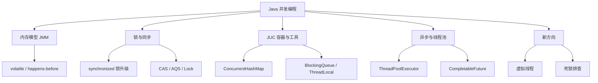
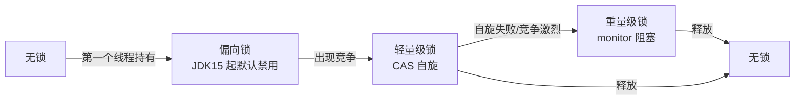
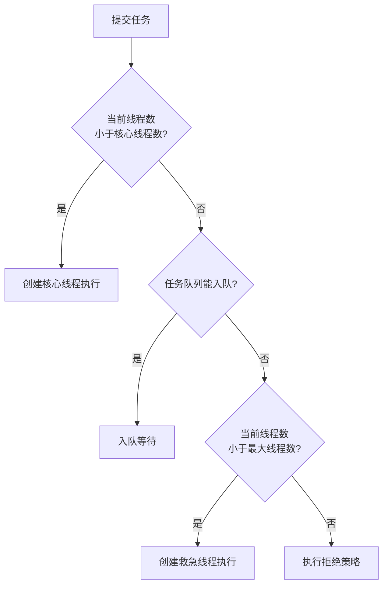
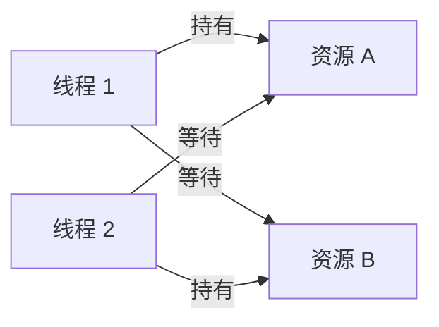

# Java 并发编程：线程、锁、JMM 与高并发基础

> 这份笔记的目标读者：已经学完《Java 核心》语言根基、准备大厂校招的 Java 后端候选人。  
> 建议版本：以 JDK 17/21 为主讲解；JDK 8 差异与 JDK 21 虚拟线程等专属内容会单独标注。  
> 阅读方式：第一次学习按顺序读第 0~14 章；面试前重点回看第 4~10 章（锁、线程池、ThreadLocal）；冲刺阶段直接做第 16 章自测题。  
> 配套课程：线程调度与 IO 模型的底层原理在《操作系统》《计算机网络》展开；本课只讲 Java 层的并发机制与 JUC。  
> 示例代码以 JDK 17/21 为准，标注了 JDK 8 差异；涉及并发的输出顺序可能因环境变化，不要以输出顺序判断正确性。

### 怎么用这份笔记

- **建立模型**：第 0~3 章先把 JMM、可见性、有序性讲透，后面所有锁和并发容器都建立在这套模型上；
- **源码驱动**：第 4~9 章是面试高发区，要求能说出 synchronized 锁升级路径、AQS 的 state 与队列、线程池执行流程；
- **当手册查**：第 15 章是排查与调优清单，第 16 章是分主题自测题；
- **动手验证**：每章示例都可以在 IDEA 里打断点或加日志观察线程状态；多线程问题靠“想”容易出错，靠实验最可靠。

## 目录

- [0. 学习地图：并发必考什么](#0-学习地图并发必考什么)
- [1. 线程基础：创建、状态与中断](#1-线程基础创建状态与中断)
- [2. 并发三要素与 Java 内存模型](#2-并发三要素与-java-内存模型)
- [3. volatile 深入](#3-volatile-深入)
- [4. synchronized 原理与锁升级](#4-synchronized-原理与锁升级)
- [5. CAS 与原子类](#5-cas-与原子类)
- [6. AQS 源码精读](#6-aqs-源码精读)
- [7. ReentrantLock 与锁家族](#7-reentrantlock-与锁家族)
- [8. 并发集合](#8-并发集合)
- [9. 线程池 ThreadPoolExecutor 精读](#9-线程池-threadpoolexecutor-精读)
- [10. ThreadLocal 与内存泄漏](#10-threadlocal-与内存泄漏)
- [11. 并发工具类](#11-并发工具类)
- [12. CompletableFuture 与异步编程](#12-completablefuture-与异步编程)
- [13. 死锁、活锁与饥饿](#13-死锁活锁与饥饿)
- [14. 虚拟线程与结构化并发](#14-虚拟线程与结构化并发)
- [15. 高并发实战与排查](#15-高并发实战与排查)
- [16. 高频自测题与参考资料](#16-高频自测题与参考资料)

---

## 0. 学习地图：并发必考什么

并发是校招 Java 后端“含金量最高”的一层：它考察的不只是 API，而是对内存模型、锁机制和工程权衡的理解。本章先给出考点地图和学习方法。

### 0.1 本课程覆盖的高频考点

| 主题 | 大厂高频考点 | 面试权重 |
|---|---|---|
| 线程基础 | 创建方式、6 种状态、中断机制 | ★★★ |
| JMM | 可见性/原子性/有序性、happens-before | ★★★★ |
| volatile | 语义、内存屏障、与 synchronized 区别 | ★★★★ |
| synchronized | 锁对象、可重入、锁升级 | ★★★★★ |
| CAS | 原理、ABA、原子类、LongAdder | ★★★★ |
| AQS | state、CLH 队列、独占/共享 | ★★★★ |
| Lock | ReentrantLock、读写锁、StampedLock | ★★★ |
| 并发集合 | ConcurrentHashMap、CopyOnWrite、BlockingQueue | ★★★★ |
| 线程池 | 7 参数、执行流程、拒绝策略、调优 | ★★★★★ |
| ThreadLocal | 原理、内存泄漏、线程池传递 | ★★★★ |
| 并发工具 | CountDownLatch、CyclicBarrier、Semaphore | ★★★ |
| 异步 | CompletableFuture、异常传播 | ★★★ |
| 死锁 | 四必要条件、检测与预防 | ★★★★ |
| 虚拟线程 | JEP 444、适用场景、钉住问题 | ★★★★ |

### 0.2 知识体系图



### 0.3 学习方法：五连问

每个并发知识点都用五个问题过一遍：

1. **它解决什么问题**：可见性、原子性、还是资源控制？
2. **底层怎么实现**：内存屏障？CAS 指令？队列？
3. **怎么用**：正确写法与典型场景。
4. **代价是什么**：性能开销、死锁风险、内存泄漏。
5. **坑在哪**：什么写法看着对、实际错。

### 0.4 边界说明

本课只讲 Java 层：线程的创建与调度由操作系统完成，select/epoll 等 IO 模型在《操作系统》《计算机网络》课程展开；类加载、GC 与对象布局在《JVM》课程展开；本课目录里找不到它们不是遗漏。

### 0.5 面试追问

- 问：并发编程的核心矛盾是什么？
- 答：多线程同时读写同一份共享数据时，CPU 的三个硬件特性会各自制造一类问题：线程切换到一半被打断（原子性）、每个核有自己的缓存改了别人看不见（可见性）、编译器和 CPU 会调整指令顺序做优化（有序性）。理解了这个分类，工具选择就清晰了：volatile 解决可见性和有序性、synchronized/锁三类全解决、原子类用 CAS 解决原子性。整门并发课其实就是围绕这三个词展开的。

## 1. 线程基础：创建、状态与中断

先搞清楚“线程是什么、有几种状态、怎么安全终止”，再谈锁和线程池，否则后面全是空中楼阁。

### 1.1 创建线程的三种方式

```java
// 方式 1：继承 Thread（不推荐，占用继承位，且任务与线程耦合）
class MyThread extends Thread {
    @Override
    public void run() {
        System.out.println("thread run");
    }
}
new MyThread().start();

// 方式 2：实现 Runnable（推荐，任务与线程分离）
Thread t = new Thread(() -> System.out.println("runnable run"), "worker-1");
t.start();

// 方式 3：Callable + FutureTask（能拿到返回值或异常）
Callable<Integer> task = () -> 1 + 2;
FutureTask<Integer> future = new FutureTask<>(task);
new Thread(future).start();
Integer result = future.get();     // 阻塞等待结果，抛 ExecutionException 包装任务异常
```

本质：`Thread` 和 `Callable` 最终都通过 `Runnable` 进入 `Thread.run()`；区别只在于能否返回结果、能否抛异常。生产代码几乎不直接 `new Thread`，而是用线程池（见“线程池”章）。

### 1.2 线程的六种状态

```mermaid
flowchart TD
    NEW[NEW<br/>创建未启动] -->|start| RUNNABLE[RUNNABLE<br/>可运行/运行中]
    RUNNABLE -->|获取 synchronized 锁失败| BLOCKED[BLOCKED<br/>阻塞等锁]
    RUNNABLE -->|wait / join / park| WAITING[WAITING<br/>无限期等待]
    RUNNABLE -->|sleep / wait(timeout) / parkNanos| TIMED[TIMED_WAITING<br/>限期等待]
    BLOCKED -->|拿到锁| RUNNABLE
    WAITING -->|notify / unpark / 线程结束| RUNNABLE
    TIMED -->|超时或唤醒| RUNNABLE
    RUNNABLE -->|run 返回或异常| TERMINATED[TERMINATED<br/>已终止]
```

| 状态 | 触发 | 离开 |
|---|---|---|
| NEW | `new Thread` 后 | `start()` |
| RUNNABLE | 调用 start；被唤醒 | 时间片/锁/等待 |
| BLOCKED | 竞争 synchronized 锁失败 | 拿到锁 |
| WAITING | `wait()`、`join()`、`LockSupport.park()` | `notify`/`notifyAll`、目标线程结束、`unpark` |
| TIMED_WAITING | `sleep(ms)`、`wait(timeout)`、`join(ms)`、`parkNanos` | 超时或唤醒 |
| TERMINATED | run 执行完或抛异常 | 不可逆 |

注意：`sleep` **不释放锁**，`wait` **会释放锁**；`yield` 只是提示让出 CPU，线程仍是 RUNNABLE。

### 1.3 中断机制：协作式取消

Java 的线程终止是**协作式**的：不能粗暴 stop（已废弃），而是请求对方中断，由对方决定何时退出。

```java
Thread worker = new Thread(() -> {
    while (!Thread.currentThread().isInterrupted()) {
        // 处理任务，随时检查中断标志
    }
});
worker.start();
worker.interrupt();          // 设置中断标志；若线程正阻塞，则抛 InterruptedException 并清除标志
```

```java
// 处理 InterruptedException 的正确姿势：恢复中断标志，让上层知道
try {
    Thread.sleep(1000);
} catch (InterruptedException e) {
    Thread.currentThread().interrupt();   // 重新设置标志，而不是吞掉
    throw new RuntimeException(e);
}
```

常用方法对照：

| 方法 | 作用 |
|---|---|
| `interrupt()` | 设置中断标志；阻塞中的线程抛 InterruptedException |
| `isInterrupted()` | 查询标志，不清除 |
| `Thread.interrupted()` | 查询并清除标志（静态） |
| `join()` | 等待线程结束（内部 wait，可被打断） |
| `sleep(ms)` | 当前线程睡指定时间 |
| `yield()` | 提示让出 CPU |

补充：`LockSupport.park()` 被 `interrupt()` 时**不会抛 InterruptedException**，只会设置中断标志（与 sleep/wait 不同）；AQS 正是基于 park/unpark 让线程挂起与唤醒，所以 AQS 的等待可以被中断唤醒但不会抛异常。

### 1.4 守护线程

`setDaemon(true)` 的线程是守护线程：所有用户线程结束后 JVM 直接退出，不等待守护线程。典型用途是后台监控、心跳；不要在守护线程里做必须落盘的收尾工作。

### 1.5 面试追问

- 问：start 和 run 的区别？
- 答：`thread.start()` 才会真正向操作系统申请创建一个新线程，新线程里执行 run 方法的内容；而直接调用 `thread.run()` 不会创建任何新线程，等价于在当前线程里执行了一次普通方法调用——如果你在 main 里调 run，这段“并发代码”就串行地跑在 main 线程里，完全失去并发意义。可以自己验证：打印 `Thread.currentThread().getName()`，用 start 是 Thread-0，用 run 是 main。另外 start() 对同一个线程对象只能调一次，第二次抛 IllegalThreadStateException。
- 问：sleep 和 wait 的区别？
- 答：四个维度对比：① 所属——sleep 是 Thread 的静态方法，wait 是 Object 的方法（任何对象都能调用）；② 锁——sleep 睡觉时**不释放**已持有的锁，别的线程照样进不了临界区；wait 会**释放**锁，让其他线程有机会进入临界区干活；③ 唤醒——sleep 到时间自动醒；wait 必须等别的线程 notify/notifyAll，或超时；④ 前提——wait 必须在 synchronized 块内调用（否则抛 IllegalMonitorStateException），sleep 随处可调。一句话记忆：sleep 是“抱着锁睡觉”，wait 是“放下锁等人叫”。
- 问：如何安全终止一个线程？
- 答：Java 的线程终止是“协作式”的：`thread.interrupt()` 只是给线程打一个中断标记，并不会强制停止它；线程需要在合适的时机自己检查并退出——循环里检查 `Thread.currentThread().isInterrupted()`，或在阻塞方法（sleep/wait/queue.take）里捕获 InterruptedException 后清理资源、恢复中断标记、退出。为什么不用 Thread.stop()：它会瞬间释放所有锁，被锁保护的数据可能停在“改了一半”的状态，破坏数据一致性，所以 JDK 早就废弃了它。实践要点：捕获 InterruptedException 后**不要吞掉异常**，要么恢复 `Thread.currentThread().interrupt()` 再退出，要么直接向上抛。
- 问：六种状态分别在什么时候进入？
- 答：NEW（创建后未 start）→ RUNNABLE（start 后，包含“正在跑”和“就绪等 CPU”两种，Java 不区分）→ 之后按阻塞原因分三种：等 synchronized 锁进入 BLOCKED；调 wait/join/park 进入 WAITING（无限等）或 TIMED_WAITING（带超时地等，如 sleep(1000)）；run 方法执行完进入 TERMINATED。最需要分清的是 BLOCKED 与 WAITING：前者是“被动地抢锁没抢到”，只能等持锁线程释放；后者是“主动地等待某个条件或唤醒”。这个区分在 jstack 排查时非常关键：大量 BLOCKED 说明锁竞争激烈，大量 WAITING 要看在等什么。

## 2. 并发三要素与 Java 内存模型

并发 bug 的根源只有三个：原子性、可见性、有序性。理解 JMM（Java Memory Model）就是理解 Java 如何约束这三者。

### 2.1 并发问题的三大根源

| 问题 | 根源 | 典型表现 |
|---|---|---|
| 原子性 | 线程切换（时间片） | `i++` 三步操作被打断，计数丢失 |
| 可见性 | CPU 缓存 | 一个线程改了变量，另一个线程看不到 |
| 有序性 | 编译器和 CPU 重排序 | 双重检查锁的“半个对象”问题 |

示例：两个线程各执行 10000 次 `count++`，结果几乎不可能等于 20000，因为 `count++` 在字节码层面是“读-改-写”三步，不是原子操作。

### 2.2 JMM 是什么

JMM 是 Java 语言规范里定义的抽象内存模型，用来约束线程与内存的交互，**不绑定具体硬件**：

```text
线程 A ──工作内存（寄存器/缓存）──┐
                                 ├── 主内存（共享变量真正所在）
线程 B ──工作内存（寄存器/缓存）──┘
```

- 所有共享变量存在**主内存**；
- 每个线程有自己的**工作内存**（抽象概念，对应寄存器与 CPU 缓存），读写共享变量前要先在工作内存与主内存之间同步；
- 线程不能直接读写其他线程的工作内存，变量传递必须经过主内存。

JMM 通过三类手段保证并发安全：

1. **关键字**：`volatile`、`synchronized`、`final`；
2. **happens-before 规则**：给跨线程的内存操作建立偏序；
3. **内存屏障**：JVM 在合适位置插入屏障指令，阻止重排序并保证缓存同步。

### 2.3 happens-before 八条规则

如果操作 A happens-before 操作 B，那么 A 对内存的写入对 B **可见**，且 A 不会重排到 B 之后。八条规则：

1. **程序顺序规则**：同一线程内，写在前面的操作 happens-before 后面的操作；
2. **监视器锁规则**：锁的解锁 happens-before 后续对该锁的加锁（synchronized/Lock）；
3. **volatile 规则**：volatile 变量的写 happens-before 后续对该变量的读；
4. **线程启动规则**：`Thread.start()` 之前的操作 happens-before 新线程中的操作；
5. **线程终止规则**：线程中的所有操作 happens-before 其他线程从 `join()` 返回；
6. **中断规则**：`interrupt()` 的调用 happens-before 被中断线程检测到中断（抛异常或查到标志）；
7. **final 规则**：对象构造完成前对 final 字段的写 happens-before 后续通过引用读取该对象；
8. **传递性**：A happens-before B 且 B happens-before C，则 A happens-before C。

```java
// 利用 volatile 规则：写 happens-before 读
volatile boolean ready = false;
int value = 0;

// 线程 A
value = 42;       // 普通写
ready = true;     // volatile 写

// 线程 B
if (ready) {      // volatile 读
    System.out.println(value);   // 一定看到 42
}
```

### 2.4 as-if-serial 与重排序

编译器和 CPU 会做指令重排序，但必须遵守 **as-if-serial**：单线程语义下，重排序不能改变程序结果。重排序对多线程可见，所以需要 volatile/synchronized 来约束。

### 2.5 面试追问

- 问：并发编程的三要素？
- 答：① 原子性——一个操作不可被分割，典型反例是 `i++`：它实际是“读-加-写”三步，两个线程交错执行会丢更新（根源是线程切换调度）；② 可见性——一个线程改了共享变量，另一个线程可能读到旧值（根源是每个 CPU 核有自己的高速缓存，写先落缓存未必立刻刷回主存）；③ 有序性——代码的实际执行顺序可能与书写顺序不同（根源是编译器和 CPU 为了优化做指令重排序，单线程内结果不变，多线程下会出问题）。三类问题各有对应的解决工具，这是并发知识体系的总纲。
- 问：JMM 是什么？
- 答：Java Memory Model，Java 语言规范定义的一套抽象规则，用来回答“一个线程的写操作，什么条件下对另一个线程可见”。它屏蔽了不同 CPU 架构（x86 强有序、ARM 弱有序）的差异，给 Java 程序员一个统一的承诺。核心内容三块：主内存与工作内存的抽象（所有共享变量存在主内存，线程操作的是自己的工作内存副本，用完再同步回去）；happens-before 规则（判定“一个写是否对后续读可见”的判据）；内存屏障（JVM 实现 JMM 的底层手段）。注意 JMM 是“规范”不是“内存结构”——不要把它和 JVM 运行时数据区（堆、栈）混为一谈，后者是 HotSpot 的实现细节。
- 问：happens-before 有什么用？
- 答：没有它，判断“多线程下能不能看到某个写入”只能靠猜硬件行为；有了它，就有了一套可推导的规则。常用规则举例：程序顺序规则（单线程内前面的操作先于后面）、监视器锁规则（解锁先于后续加锁）、volatile 规则（写先于后续读）、线程启动规则（start 前的写对 run 内可见）、传递性（A 先于 B、B 先于 C，则 A 先于 C）。实际使用：比如线程 A 创建 HashMap 并填好数据后调 `threadB.start()`，线程 B 在 run 里读这个 map——满足线程启动规则，B 能看到全部数据，不需要额外同步。反过来，两个线程只靠共享普通变量“打旗语”，就不满足任何规则，读到的值不可靠。
- 问：volatile 变量的写读之间能保证什么？
- 答：保证两件事：① 可见性——volatile 写 happens-before 后续对同一变量的读，读线程一定能看到这次写；② 有序性——禁止指令重排序跨过 volatile 读写。一个容易被忽略的加强点：借助 happens-before 的传递性，volatile 写之前的**所有**普通写操作，对 volatile 读之后的代码也可见。经典用法：“非 volatile 的配置对象 + volatile 的 ready 标记”——写线程先填好配置再置 ready=true，读线程看到 ready==true 后读配置，一定能拿到完整数据。但要牢记 volatile 不保证原子性（见下一问），这是它和锁最本质的差距。

## 3. volatile 深入

volatile 是最轻量的同步手段，也是面试最喜欢“挖坑”的关键字。

### 3.1 volatile 的两条语义

1. **可见性**：volatile 变量的写会立即刷新到主内存，读会直接从主内存读取；
2. **有序性**：禁止指令重排序，JVM 在读写前后插入内存屏障。

它**不保证原子性**：`volatile int count; count++` 仍是“读-改-写”三步，多个线程同时执行照样丢计数。

```java
// 反例：volatile 不能替代锁或原子类
volatile int count = 0;
// 100 个线程各执行 count++ 1000 次，结果 < 100000
```

### 3.2 内存屏障

JMM 的保守插入策略：

| 操作 | 前置屏障 | 后置屏障 |
|---|---|---|
| volatile 写 | StoreStore | StoreLoad |
| volatile 读 | —（无） | LoadLoad + LoadStore |

- **StoreStore**：屏障前的普通写不会被重排到 volatile 写之后；
- **StoreLoad**：保证 volatile 写的值对其他线程可见（x86 上往往就是一条 `lock` 前缀指令）；
- **LoadLoad/LoadStore**：都插在 volatile 读**之后**，保证屏障后的普通读/写不会被重排到 volatile 读之前。

补充：x86（TSO 内存模型）上 volatile **读**通常不需要额外指令（普通 load 本身就具备 acquire 语义），volatile **写**才体现为 `lock` 前缀指令。

注意：volatile 的语义由 JMM 定义，**不是“禁用 CPU 缓存”**；具体实现依赖屏障指令与缓存一致性协议。

### 3.3 典型应用一：状态标志

```java
volatile boolean stopped = false;

// 工作线程
while (!stopped) {
    doWork();
}

// 主线程
stopped = true;    // 可见性保证工作线程能退出
```

### 3.4 典型应用二：双重检查锁单例

```java
public class Singleton {
    private static volatile Singleton instance;   // 必须 volatile

    public static Singleton getInstance() {
        if (instance == null) {                    // 第一次检查（不加锁）
            synchronized (Singleton.class) {
                if (instance == null) {            // 第二次检查（加锁）
                    instance = new Singleton();
                }
            }
        }
        return instance;
    }
}
```

为什么必须 volatile：`new Singleton()` 分为“分配内存 → 初始化字段 → 把引用赋给 instance”三步，没有 volatile 时，CPU 可能把“赋引用”重排到“初始化”之前，另一个线程第一次检查时看到非 null 却拿到未初始化的“半个对象”。volatile 的 StoreStore 屏障保证初始化完成前引用不会被发布。

JDK 5 之后还有另一条路：把 `instance` 字段设为 `final`，利用 final 规则保证安全发布。

### 3.5 volatile 与 synchronized 对比

| 对比项 | volatile | synchronized |
|---|---|---|
| 可见性 | 是 | 是 |
| 原子性 | 否 | 是（临界区内） |
| 有序性 | 禁止重排序 | 是（互斥天然有序） |
| 阻塞 | 否 | 是（竞争时阻塞） |
| 使用成本 | 低 | 较高 |
| 适用 | 标志位、单例发布、状态开关 | 复合操作、临界区 |

### 3.6 面试追问

- 问：volatile 能保证原子性吗？
- 答：不能。volatile 只保证两件事：读到的永远是最新值（可见性）、读写不会被重排序打乱（有序性）。但 `i++` 是“读 i → 加 1 → 写回”三步复合操作，volatile 挡不住线程切换：线程 A 读到 5，还没写回，线程 B 也读到 5，两人都写 6——两次自增只加了 1。正确做法三选一：`AtomicInteger.incrementAndGet()`（CAS 无锁）、`synchronized` 块、或 LongAdder（超高并发计数）。用一个反例检验自己：volatile boolean flag 做开关可以（单次读写，天然原子），volatile int count 做计数器不行（复合操作）——区别就在“单次读写”和“读改写”上。
- 问：volatile 的底层实现？
- 答：分两层看。JMM 层：JVM 在 volatile 读写前后插入内存屏障，禁止指令重排序越过边界——写前加 StoreStore（保证之前的普通写先完成）、写后加 StoreLoad（保证写立即对后续读可见，这是开销最大的一种屏障）、读后加 LoadLoad/LoadStore。CPU 层：x86 本身是强有序架构，JVM 只需要在 volatile 写上加 `lock` 前缀指令（如 lock addl），它会把当前核的缓存行写回主存并使其他核的缓存副本失效，这就是“可见性”的硬件原理。面试加分点：能说出“x86 上 volatile 读是普通读（x86 本身不重排读），开销主要在写”——说明理解到了架构差异层面。
- 问：双重检查锁为什么需要 volatile？
- 答：DCL（Double-Checked Locking）单例的标准写法是 `private static volatile Singleton instance;`，两次判空 + synchronized。没有 volatile 时的问题出在 `instance = new Singleton();` 这一行——它不是原子操作，分三步：① 分配内存；② 调用构造器初始化；③ 把引用指向内存。② 和 ③ 可能被重排序成 ①③②：线程 A 执行到 ③（对象还没初始化完），线程 B 进来第一次判空发现 instance 不为 null，直接返回——拿到一个“字段还是默认值”的半成品对象。volatile 禁止这个重排序，保证“初始化完成后引用才可见”。追问方向：静态内部类单例（利用类加载的天然线程安全）和枚举单例可以完全绕开这个问题，也是更推荐的写法。
- 问：volatile 能替代锁吗？
- 答：不能完全替代。volatile 能做的：状态的发布与可见（开关、配置引用）、“一写多读”的简单场景——因为只有一个线程写，不存在写写冲突。volatile 做不到的：① 原子性的复合操作（i++、check-then-act“先检查再执行”）；② 互斥——多个线程同时进入临界区时它没有排他能力；③ 它无法保护一组变量的整体一致性（volatile 只约束自己）。所以替代规则：状态标志位、一次性发布用 volatile；涉及“读-改-写”或“多变量联动”就用锁或原子类。能答出“volatile 是可见性工具不是互斥工具”这个本质，就是合格答案。

## 4. synchronized 原理与锁升级

synchronized 是 Java 最基础也最常用的锁。面试要求从“怎么用”讲到“底层锁升级”，两者都要熟。

### 4.1 三种用法与锁对象

```java
// 1. 同步实例方法：锁是 this
public synchronized void m1() { }

// 2. 同步静态方法：锁是 Class 对象
public static synchronized void m2() { }

// 3. 同步代码块：锁是括号里的对象
public void m3() {
    synchronized (lock) { }
}
```

关键认知：

- 锁的对象是 **monitor（监视器）**，Java 里每个对象都关联一个 monitor（由对象头中的锁记录/指向）;
- 只有**竞争同一个锁对象**的线程才互斥；用 `this` 和用 `Class` 锁互不相关；
- 是**可重入**的：同一线程重入同一 monitor 会计数 +1，退出同步块时 -1，计数归零才真正释放；所以同步方法里可以再调自己的同步方法。

### 4.2 锁升级：无锁 → 轻量级 → 重量级

JDK 6 之后 synchronized 做了大量优化，锁存在升级路径：



- **偏向锁（历史）**：只有第一个线程反复进入时，在对象头记录线程 ID，省去 CAS；JDK 15 起默认禁用并弃用（JEP 374），实际开发可以忽略它；
- **轻量级锁**：线程在栈帧中创建锁记录，用 CAS 把对象头 Mark Word 替换为指向锁记录的指针；CAS 失败说明有竞争，升级；
- **重量级锁**：进入 monitor，竞争线程被阻塞（涉及操作系统互斥量与线程唤醒），开销最大，但公平性最好。

一句话结论：**锁只会升级不会降级**（重量级锁释放后对象回到无锁状态，但“偏向锁→轻量级→重量级”的升级方向不可逆）。

<!--demo:锁升级可视化.html-->

除了升级，JIT 还有两个锁优化：**锁消除**（逃逸分析发现锁对象不逃逸，直接去掉无意义的加锁）与**锁粗化**（把相邻多次加同一把锁合并成一次，减少加解锁次数）。它们是“锁升级”之外的另一半性能故事。

### 4.3 wait/notify 与锁的关系

```java
synchronized (lock) {
    while (!condition) {
        lock.wait();      // 释放锁并等待；被唤醒后重新竞争锁
    }
    // 条件满足后继续
    lock.notifyAll();     // 唤醒等待者；notify 本身不释放锁，要等同步块退出
}
```

规范：

- `wait()`/`notify()`/`notifyAll()` 必须持有该对象的锁才能调用；
- `wait` 会释放锁，`notify` 不会释放锁；
- 等待条件必须用 **while 循环**包裹（虚假唤醒），不能用 if；
- 优先 `notifyAll` 而不是 `notify`，避免唤醒错线程。

### 4.4 synchronized 与 Lock 对比

| 对比项 | synchronized | ReentrantLock |
|---|---|---|
| 获取/释放 | 自动（块结束释放） | 手动 lock/unlock（必须 finally 释放） |
| 可中断 | 否 | `lockInterruptibly()` 是 |
| 超时 | 否 | `tryLock(timeout)` 是 |
| 公平性 | 非公平 | 可构造公平锁 |
| 条件变量 | 每个对象一个 wait/notify | `newCondition()` 多个条件队列 |
| 底层 | monitor（锁升级） | AQS + LockSupport |

### 4.5 面试追问

- 问：synchronized 锁的是什么？
- 答：synchronized 锁的永远是**对象**，不是代码。三种写法对应的锁对象：实例方法 `synchronized void f()` 锁的是当前实例 this——两个不同实例互不干扰；静态方法 `static synchronized void f()` 锁的是类的 Class 对象——所有实例共享这一把锁，和 `synchronized(Xxx.class)` 等价；同步代码块 `synchronized(obj)` 锁的是括号里指定的对象。由此推导出一个经典考点：同一个实例的两个 synchronized 实例方法互斥，但**不同实例**的两个 synchronized 方法不互斥；实例方法与静态 synchronized 方法也不互斥（锁对象不同）。选锁对象的两个原则：所有线程必须用同一把锁（否则白锁）、锁对象不要被外部拿到（防止别人锁它造成意外阻塞）。
- 问：锁升级过程？
- 答：JDK 6 引入的优化：锁状态记录在对象头的 Mark Word 里，随竞争激烈程度逐级升级、不可逆。① 无锁：对象刚创建，没人碰；② 偏向锁：只有一个线程反复进入，Mark Word 记下线程 ID，之后该线程进入零成本（连 CAS 都不做）——适合“始终只有一个线程”的场景，JDK 15 起默认禁用（维护成本高于收益）；③ 轻量级锁：第二个线程来了，偏向撤销，线程用 CAS 自旋抢锁（不阻塞，适合持锁时间极短的场景）；④ 自旋失败次数多了，膨胀为重量级锁：向操作系统申请 monitor，抢不到的线程真实阻塞挂起（涉及用户态/内核态切换，成本最高，但不烧 CPU）。理解思路：从“乐观假设没人抢”到“悲观地排队”，按实际竞争程度逐步加码。
- 问：synchronized 可重入吗？
- 答：可重入。同一个线程对自己已经持有的锁再次加锁（比如同步方法里调用另一个同步方法，或递归调用），不会把自己锁死——JVM 给 monitor 维护了“持有线程 + 重入计数”两个字段：同一线程每进入一次计数 +1，每退出一次 -1，减到 0 才真正释放锁、唤醒等待线程。可重入是必备特性，否则这种常见代码直接死锁：`synchronized void a() { b(); } synchronized void b() { }`——a 拿着锁调 b，b 再要同一把锁，不可重入的话就是自己等自己。ReentrantLock 名字里的 Reentrant 也是这个意思，机制同样是计数。
- 问：wait 和 notify 为什么要放在 synchronized 里？
- 答：两个原因：① 规范要求——不持有对象锁就调 wait/notify 会直接抛 IllegalMonitorStateException；② 正确性需要——生产者消费者的标准模式是“while(条件不满足) wait(); 处理”，检查条件和等待必须是原子动作：如果不在锁内，可能出现“你刚检查完队列是空的，还没来得及 wait，生产者塞进消息并 notify 了一下（此刻没人在等，这次唤醒就丢了），你才开始 wait”——消息永远等不到，这就是经典的**丢失唤醒**问题。锁把“检查 + 等待”变成不可分割的动作，生产者的“修改 + 唤醒”也被同一把锁挡住，通知就不会落在两次检查之间。另外 wait 要放在 while 里而不是 if 里，防虚假唤醒。
- 问：锁粒度怎么设计？
- 答：三个原则：① **锁范围最小化**——只把真正读写共享变量的几行锁起来，方法里的参数计算、日志、IO 都留在锁外；锁的持有时间直接决定并发上限，锁内一次 50ms 的数据库调用意味着这把锁每秒最多 20 个线程通过；② **锁对象统一**——同一份共享数据的所有访问必须用同一把锁，混用 this/Class/不同对象会出现“自以为互斥其实没有”的竞态；③ **能拆则拆**——不同数据用不同的锁（如 ConcurrentHashMap 的分桶思想），减少无关线程互相阻塞。反面教材：`synchronized` 包住整个业务方法，里面的远程调用、发邮件全被串行化——这是性能事故最常见的来源之一。

## 5. CAS 与原子类

CAS（Compare And Swap）是无锁编程的基石：不阻塞线程，而是乐观地“比较并交换”，失败就重试。

### 5.1 CAS 原理

```text
CAS(内存地址 V, 期望值 A, 新值 B)：
    如果 V 当前值 == A，则把 V 更新为 B，返回 true
    否则什么都不做，返回 false
```

```java
AtomicInteger count = new AtomicInteger(0);

// 等价于 while 循环自旋：
// 读旧值 → CAS(旧值, 旧值+1) → 失败则重读再试
count.incrementAndGet();
```

底层是 CPU 提供的原子指令（x86 的 `cmpxchg`），由硬件保证“比较 + 交换”这一整步不可分割，所以 CAS 是原子的。

### 5.2 CAS 的三个缺点

| 缺点 | 说明 | 解决 |
|---|---|---|
| 自旋消耗 CPU | 竞争激烈时不断重试 | 限制自旋次数、锁粗化或改用锁 |
| 只能保证一个变量的原子性 | 多个变量无法一次 CAS | 把多个值封装成对象用 `AtomicReference` |
| ABA 问题 | A 被改成 B 又被改回 A，CAS 误以为没变过 | `AtomicStampedReference` 带版本号 |

ABA 示例：线程 1 读到值 A；线程 2 改成 B 又改回 A；线程 1 的 CAS 成功，但中间状态被“偷走”过。解决方式是带上版本号或时间戳：

```java
AtomicStampedReference<Integer> ref = new AtomicStampedReference<>(100, 0);
int[] stamp = new int[1];
Integer value = ref.get(stamp);          // 读取当前值和版本
ref.compareAndSet(value, 101, stamp[0], stamp[0] + 1);  // 值和版本都匹配才交换
```

### 5.3 原子类家族

| 类别 | 类 |
|---|---|
| 基本类型 | AtomicInteger、AtomicLong、AtomicBoolean |
| 引用类型 | AtomicReference、AtomicStampedReference、AtomicMarkableReference |
| 数组 | AtomicIntegerArray、AtomicLongArray、AtomicReferenceArray |
| 字段更新器 | AtomicIntegerFieldUpdater、AtomicReferenceFieldUpdater |
| 累加器（JDK 8） | LongAdder、LongAccumulator、DoubleAdder、DoubleAccumulator |

```java
AtomicInteger ai = new AtomicInteger(10);
ai.getAndIncrement();      // 返回旧值 10，然后变为 11
ai.incrementAndGet();      // 返回 12
ai.compareAndSet(12, 20);  // true，变为 20
ai.updateAndGet(x -> x * 2); // 40，JDK 8 函数式更新
```

**LongAdder（JDK 8）**：把单个计数拆成 base + 多个 Cell 分段，各线程分散累加，最后求和，适合“高并发写、不常读”的统计场景（如 QPS 计数）；吞吐比 AtomicLong 高，但 get 不是强一致快照。

### 5.4 面试追问

- 问：CAS 的原理？
- 答：CAS（Compare And Swap）是一条 CPU 原子指令（x86 的 cmpxchg），它一次性完成“比较内存位置的值是否等于期望值，相等则替换为新值”，整个过程不可被其他线程打断——原子性由硬件保证而不是锁。Java 层的 AtomicInteger.incrementAndGet() 内部就是循环：读当前值 → 尝试 CAS(旧值, 旧值+1) → 成功返回；失败说明期间有别的线程改过，重新读最新值再试（自旋）。它没有锁、没有线程挂起和唤醒，所以在低到中等竞争下比 synchronized 快；竞争极其激烈时自旋空转烧 CPU，反而不如排队。
- 问：CAS 的缺点？
- 答：三个：① **自旋消耗 CPU**——竞争激烈时线程反复失败重试，空转烧 CPU 不干活，此时应该换锁（排队等待不消耗 CPU）；② **只能保证单个变量的原子性**——要原子地更新“账户 A 扣 100、账户 B 加 100”两个变量，单个 CAS 无能为力，只能封装成对象用 AtomicReference 或干脆加锁；③ **ABA 问题**——值从 A 改成 B 又改回 A，CAS 看到的还是 A 就以为没变过，但对于“链表节点被释放又重新分配”这类场景，中间状态被偷换可能造成逻辑错误（栈顶指针指向了地址相同但内容不同的节点）。三个缺点的应对分别是：换锁、AtomicReference 封装、AtomicStampedReference 加版本号。
- 问：ABA 问题怎么解决？
- 答：给值附加一个“版本号”，CAS 时不仅比较值，还要比较版本号——值被改回去了，版本号却回不去（只增不减），暴露了中间的变化。AtomicStampedReference 内部维护 [引用, stamp] 二元组，compareAndSet 需要同时传期望值和期望版本：`ref.compareAndSet(oldRef, newRef, oldStamp, oldStamp + 1)`。不需要版本号本身递增、只需要“标记是否被改过”时用 AtomicMarkableReference（boolean 标记）。一个实务提醒：大多数业务场景（计数器、累加）值回不回都无所谓，ABA 不构成威胁；只有“值相同不代表状态相同”的场景（链表/栈等引用结构）才需要版本号——按需选型，别无脑上版本号。
- 问：AtomicInteger 和 LongAdder 怎么选？
- 答：差异在“写”的竞争策略。AtomicInteger 所有线程对同一个 value 做 CAS，竞争激烈时大量线程自旋失败重试，吞吐下降；LongAdder（JDK 8）把计数拆成 base + 一个 Cell 数组，不同线程按哈希落到不同 Cell 上分别累加（分散热点），sum() 时把 base 和所有 Cell 加起来。代价是 sum() 读到的**不是精确的瞬时快照**（读的过程中可能还有线程在累加）。选型：低并发、或需要“读到的一定是准确值”的场景（如序列号、限流阈值判断）用 AtomicInteger；超高并发写、只是做统计（QPS 计数、监控指标）用 LongAdder。一句话：LongAdder 用“读的弱一致”换了“写的吞吐”。

## 6. AQS 源码精读

`AbstractQueuedSynchronizer`（AQS）是 JUC 锁与同步器的公共基类：ReentrantLock、Semaphore、CountDownLatch、ReentrantReadWriteLock 都建立在它上面。理解 AQS 就理解了一半 JUC。

### 6.1 AQS 的核心设计

```text
volatile int state    同步状态（0 表示空闲，1 表示被持有，可重入锁会更大）
CLH 变体等待队列      获取失败的线程封装成 Node 排队
独占模式 / 共享模式   两种获取方式
```

三个要点：

1. **state**：volatile 修饰的同步状态，子类自己定义它的含义；
2. **CLH 队列**：基于链表的 FIFO 等待队列（头节点是持有锁的线程，后面的节点排队）；
3. **模板方法模式**：AQS 定好 `acquire`/`release` 骨架，把 `tryAcquire`/`tryRelease` 留给子类实现。

### 6.2 acquire 与 release 骨架

```java
// 独占获取（ReentrantLock.lock 的核心）
public final void acquire(int arg) {
    if (!tryAcquire(arg)) {              // 子类实现：尝试获取
        Node node = addWaiter(Node.EXCLUSIVE);   // 获取失败入队
        acquireQueued(node, arg);                // 自旋/阻塞等待
    }
}

// 独占释放
public final boolean release(int arg) {
    if (tryRelease(arg)) {               // 子类实现：尝试释放
        Node h = head;
        if (h != null && h.waitStatus != 0)
            unparkSuccessor(h);          // 唤醒队首等待者
        return true;
    }
    return false;
}
```

完整流程（以 ReentrantLock 为例）：

```text
lock() → acquire(1) → tryAcquire 成功？→ 是：直接持有，state=1
                              → 否：封装成 Node 加入队尾，LockSupport.park 阻塞
unlock() → release(1) → tryRelease 成功（state 归零）→ 唤醒队首线程
```

### 6.3 独占与共享

| 模式 | 获取 | 释放 | 应用 |
|---|---|---|---|
| 独占 | acquire | release | ReentrantLock |
| 共享 | acquireShared | releaseShared | Semaphore、CountDownLatch、ReentrantReadWriteLock 的读锁 |

共享模式特殊之处：一个线程释放后可以**同时唤醒多个**等待者（如 Semaphore 释放 3 个许可，唤醒多个排队线程）。

### 6.4 Condition：AQS 里的等待队列

`Condition` 对应 `Object.wait/notify` 的增强版：一个锁可以有**多个条件队列**。

```java
ReentrantLock lock = new ReentrantLock();
Condition notFull = lock.newCondition();
Condition notEmpty = lock.newCondition();

// 生产者
lock.lock();
try {
    while (queue.isFull()) notFull.await();   // 释放锁并等待
    queue.put(x);
    notEmpty.signal();                        // 唤醒一个消费者
} finally {
    lock.unlock();
}
```

底层：每个 Condition 维护一条单向等待队列，`await` 把当前线程挂到条件队列并释放锁，`signal` 把队头节点移回 AQS 主队列等待重新抢锁。

### 6.5 AQS 的典型应用

| 同步器 | state 含义 | 模式 |
|---|---|---|
| ReentrantLock | 持有次数（可重入） | 独占 |
| Semaphore | 剩余许可数 | 共享 |
| CountDownLatch | 剩余倒计数 | 共享 |
| ReentrantReadWriteLock | 高 16 位读锁 + 低 16 位写锁 | 独占 + 共享 |

### 6.6 面试追问

- 问：AQS 是什么？核心字段有哪些？
- 答：AQS（AbstractQueuedSynchronizer，抽象队列同步器）是 java.util.concurrent 锁体系的基座，ReentrantLock、Semaphore、CountDownLatch、线程池的 Worker 都基于它。核心结构两块：① `volatile int state`——同步状态，不同工具赋予它不同含义（ReentrantLock 里是重入次数、Semaphore 里是剩余许可数、CountDownLatch 里是剩余计数），用 volatile 保证可见、CAS 保证修改原子；② 一条 CLH 变体的双向 FIFO 队列——抢锁失败的线程包装成节点入队排队。使用方式是模板方法：AQS 只负责排队、阻塞、唤醒这些通用流程，子类重写 tryAcquire/tryRelease（独占）或 tryAcquireShared/tryReleaseShared（共享）来定义“state 怎样才算获取成功”。这套“模板方法 + 状态”的设计，让几十种同步工具共享同一套队列机制。
- 问：AQS 的获取失败流程？
- 答：以 ReentrantLock.lock() 为例走一遍 AQS 的 acquire 流程：① 先调子类实现的 tryAcquire 尝试直接抢锁（可能一次就成功，根本不排队）；② 失败则 addWaiter 把当前线程包装成 Node 追加到等待队列尾部；③ 进入 acquireQueued 自旋循环：检查自己的前驱节点是不是队列头（head 的下一个才是排队的第一个），是的话再试一次 tryAcquire；不是的话判断“前驱是否已取消”并把前驱的 waitStatus 标记为 SIGNAL（意思是“你释放时记得叫我”），然后 `LockSupport.park()` 把自己挂起；④ 持锁线程 release 时 unpark 队列头的后继节点，被唤醒的线程从 park 处醒来继续自旋抢锁。设计亮点：入队后不是立刻睡死，而是先看一眼“是不是轮到我了”，减少不必要的挂起/唤醒开销。
- 问：独占和共享模式的区别？
- 答：AQS 用两种模式支持两类同步工具。独占模式（Exclusive）：同一时刻只有一个线程能持有资源，如 ReentrantLock 的写语义——对应 tryAcquire/tryRelease 钩子，释放时只唤醒队列头的一个后继。共享模式（Shared）：允许多个线程同时获取，如 Semaphore 的 N 个许可、CountDownLatch 的计数归零、ReentrantReadWriteLock 的读锁（多读）——对应 tryAcquireShared/tryReleaseShared，返回负数表示失败、0 表示成功但不再传播、正数表示成功且**后继等待者也可能立即获取**（传播唤醒，比如 CountDownLatch 归零时所有等待者都能过）。理解两种模式就理解了为什么 Semaphore 能限流、读写锁能“读读并行、读写互斥”。
- 问：ReentrantLock 的可重入怎么实现的？
- 答：靠 AQS 的 state 字段做重入计数，逻辑在 tryAcquire/tryRelease 里：tryAcquire 时如果发现 state 不为 0 但持有者就是自己（对比 exclusiveOwnerThread），state 加 1 直接返回 true——不用排队，这是“重入”；tryRelease 时每解锁一次 state 减 1，减到 0 才把持有者置空并唤醒队列里的后继线程。这解释了两个现象：① 锁几次就要 unlock 几次，多解会抛 IllegalMonitorStateException；② 重入期间锁没有被“真正释放”，等待线程一次机会都没有。对比 synchronized：两者都可重入，但 synchronized 的计数在 monitor 对象头里（JVM 实现），ReentrantLock 的计数在 AQS 的 state 里（Java 代码实现）——这也是“synchronized 锁信息在对象头、ReentrantLock 基于 AQS”这个对比的具体体现。

## 7. ReentrantLock 与锁家族

除了 synchronized，JUC 还提供功能更强的 Lock 系列。校招重点在 ReentrantLock，读写锁与 StampedLock 作为扩展。

### 7.1 ReentrantLock

```java
ReentrantLock lock = new ReentrantLock();      // 默认非公平
ReentrantLock fair = new ReentrantLock(true);  // 公平锁

lock.lock();
try {
    // 临界区
} finally {
    lock.unlock();      // 必须 finally 释放，否则死锁
}
```

核心能力：

| 能力 | 说明 |
|---|---|
| 可重入 | 同线程重入 state+1 |
| 公平/非公平 | 公平锁按 FIFO 排队；非公平锁先 CAS 抢一次再排队 |
| 可中断 | `lockInterruptibly()` 等待时可响应中断 |
| 超时 | `tryLock(2, TimeUnit.SECONDS)` 拿不到就放弃 |
| 多条件 | `newCondition()` 任意多个 |
| 性能 | 竞争激烈时通常优于 synchronized（JDK 6 之后差距缩小） |

### 7.2 公平锁 vs 非公平锁

- **非公平锁**（默认）：新线程先直接 CAS 抢锁，抢不到才排队；吞吐更高，但可能“插队”导致等待线程饥饿；
- **公平锁**：`hasQueuedPredecessors()` 检查队列里是否有人先到，有人就先排队；更公平但吞吐低。

### 7.3 读写锁：ReentrantReadWriteLock

```java
ReentrantReadWriteLock rw = new ReentrantReadWriteLock();
Lock readLock = rw.readLock();
Lock writeLock = rw.writeLock();

readLock.lock();     // 读读共享
try { /* 读 */ } finally { readLock.unlock(); }

writeLock.lock();    // 读写互斥、写写互斥
try { /* 写 */ } finally { writeLock.unlock(); }
```

**锁降级**：持有写锁时获取读锁，再释放写锁——保证在释放写锁的瞬间，仍以读锁保护数据，避免另一个写者插入。

注意饥饿：ReentrantReadWriteLock 默认非公平，读锁被大量获取时，后来的读锁可能继续插队，写锁长期拿不到（写饥饿）；写占比高的场景要评估公平模式或换方案。

### 7.4 StampedLock：乐观读（JDK 8）

```java
StampedLock sl = new StampedLock();

long stamp = sl.tryOptimisticRead();   // 乐观读：不真正加锁
int value = shared;
if (!sl.validate(stamp)) {             // 期间被写过？
    stamp = sl.readLock();             // 退化为悲观读
    try { value = shared; } finally { sl.unlockRead(stamp); }
}
```

- 乐观读**不加锁**，性能最好，但读到的数据可能已经过期，必须 `validate` 校验；
- 适合读多写少、读操作很快的场景；不可重入，使用复杂度高，生产用得谨慎。

### 7.5 面试追问

- 问：synchronized 和 ReentrantLock 的区别？
- 答：五个维度：① 释放方式——synchronized 出异常自动释放，ReentrantLock 必须 try-finally 手动 unlock（忘写就是死锁隐患）；② 功能——ReentrantLock 多出四个能力：可中断加锁（lockInterruptibly，等锁时能响应中断）、超时加锁（tryLock(timeout)，拿不到就算了）、公平锁（按排队顺序，默认非公平）、多个 Condition 条件队列（精确唤醒某类等待线程）；③ 底层——synchronized 是 JVM 内置的 monitor（对象头 + 锁升级），ReentrantLock 是 Java 层的 AQS 实现；④ 性能——JDK 6 锁升级优化后两者接近，性能已不是选型依据；⑤ 选型建议——默认用 synchronized（简单不出错），只有需要上面四个高级能力时才用 ReentrantLock。
- 问：公平锁一定公平吗？为什么默认非公平？
- 答：公平锁（new ReentrantLock(true)）严格按 FIFO 队列给锁，先来先得，绝不插队——但代价是吞吐明显下降：每次释放锁都要唤醒排队线程，涉及挂起/恢复的上下文切换，而且持有锁的间隙（前一个刚释放、下一个还没醒）锁是闲置的。非公平锁允许“新来的线程直接 CAS 抢一次，抢到了就不用排队”——锁刚释放的瞬间大概率被正好在运行的线程抢走，省掉了唤醒开销，吞吐更高；代价是队列里的线程可能长期抢不过新来的（饥饿风险）。默认非公平是因为大多数场景吞吐优先、且持锁时间短，饥饿实际很少发生。注意“公平”只保证锁的获取顺序公平，不保证线程调度、执行时长上的公平。
- 问：什么是锁降级？为什么要降级？
- 答：锁降级指在 ReentrantReadWriteLock 里，**持有着写锁的同时再去获取读锁，然后释放写锁**——最终状态从写锁变成读锁。为什么需要：典型场景是“更新数据后要读出来做后续处理”。如果更新完直接释放写锁再申请读锁，中间有个空窗，别的写线程可能插进来又改了数据，你读到的就不是自己刚写的那份；先拿读锁再放写锁，整个过程中数据始终被保护，保证“读到的就是自己写的”。对应的“锁升级”（持读锁的同时申请写锁）是**不允许的**：多个读线程都想升级会互相等对方释放读锁，直接死锁——所以读写锁只支持降级不支持升级。
- 问：StampedLock 的乐观读安全吗？
- 答：安全，但用法特殊。乐观读（tryOptimisticRead）**完全不阻塞写线程**：它只是读一个版本号戳（stamp），然后直接读数据，读完调 `validate(stamp)` 校验“读的这段时间里有没有发生过写”——没发生，数据有效直接用；发生了（说明读的同时有写入），退化为普通悲观读锁重新读一遍。它比读写锁快的原因是读操作零阻塞、零开销，适合“读极多、写偶尔”且每次读的数据很小（能在一个 CPU 时间片内读完）的场景，如坐标系点位。两个注意点：① 乐观读期间数据可能被改，读完的数据要**拷贝到局部变量**再校验使用，不能边读边用；② StampedLock 不可重入，且不支持 Condition，别在锁内再调它自己的方法。

## 8. 并发集合

`HashMap`、`ArrayList` 都不是线程安全的，JUC 提供了一套并发容器。面试重点：ConcurrentHashMap 的实现演进、CopyOnWriteArrayList 的写时复制、BlockingQueue 家族。

### 8.1 线程安全集合总览

| 容器 | 代替 | 实现思路 |
|---|---|---|
| ConcurrentHashMap | HashMap | 分段/桶级并发控制 |
| CopyOnWriteArrayList | ArrayList | 写时复制 |
| CopyOnWriteArraySet | HashSet | 基于 CopyOnWriteArrayList |
| ConcurrentLinkedQueue | LinkedList | 无锁 CAS 链表 |
| BlockingQueue 系列 | Queue | 阻塞式存取 |
| ConcurrentSkipListMap/Set | TreeMap/TreeSet | 跳表，有序并发 |

### 8.2 ConcurrentHashMap：JDK 7 vs JDK 8

**JDK 7：分段锁（Segment）**

- 把整个表分成 16 段，每段一把 ReentrantLock；
- 不同段可以并发写，同一段内互斥；锁粒度是“段”。

**JDK 8：CAS + synchronized**

- 抛弃分段锁，锁粒度细化到**单个桶（链表/红黑树头节点）**；
- 空桶用 CAS 直接放节点，非空桶用 synchronized 锁桶头；
- 读操作无锁（Node 的 val 是 volatile），并发度更高。

```java
// JDK 8 的 put 简化逻辑
if (tab[i] == null) {
    casTabAt(tab, i, null, new Node<>(hash, key, value));  // 空桶 CAS
} else {
    synchronized (tab[i]) {                                 // 非空桶锁头
        // 链表尾插或树中插入；长度达 8 且容量达 64 转红黑树
    }
}
```

其他关键点：

- `sizeCtl`：-1 表示正在初始化，正数表示扩容阈值，负数高位表示扩容中；
- **扩容协助**：扩容时旧桶会放入 ForwardingNode，其他线程遇到它可协助迁移（helpTransfer）；
- 计数用 `CounterCell` 数组分段累加，`size()` 是近似值；
- 迭代器是**弱一致**的：迭代过程中新增/删除不一定能看到，但不会抛 ConcurrentModificationException；
- 不允许 null key/value。

### 8.3 CopyOnWriteArrayList：读多写少

```java
CopyOnWriteArrayList<String> list = new CopyOnWriteArrayList<>();
list.add("a");   // 加锁 + 复制整个数组 + 追加 + 替换引用
list.get(0);     // 无锁直接读 volatile 数组
```

- 写操作（add/remove/set）复制一份新数组，修改后把引用指向新数组；
- 读操作永不阻塞，读的是“某个瞬间的快照”，可能读不到刚写的数据；
- 迭代器基于快照，不会抛 ConcurrentModificationException；
- 代价：每次写都 O(n) 复制，适合**读多写极少**（如黑名单、路由表）；写频繁场景反而比加锁更慢。

### 8.4 BlockingQueue 家族

阻塞队列是线程池和生产者-消费者模式的核心。四组方法：

| 操作 | 抛异常 | 返回特殊值 | 阻塞 | 超时 |
|---|---|---|---|---|
| 入队 | add | offer | put | offer(e, time, unit) |
| 出队 | remove | poll | take | poll(time, unit) |
| 查看 | element | peek | 不支持 | 不支持 |

| 实现 | 特点 | 边界 |
|---|---|---|
| ArrayBlockingQueue | 数组，一把锁 + 两个条件 | 构造时必须指定容量（有界） |
| LinkedBlockingQueue | 链表，两把锁（put/take 分离） | 默认容量 Integer.MAX_VALUE，可指定有界 |
| SynchronousQueue | 无缓冲，直接交接 | 容量为 0，put 必须等 take |
| PriorityBlockingQueue | 二叉堆，按优先级出队 | 无界，不允许 null |
| DelayQueue | 延迟到期才能取出 | 元素需实现 Delayed |

```java
// 生产者-消费者经典写法
BlockingQueue<String> queue = new ArrayBlockingQueue<>(100);

// 生产者
queue.put("task");               // 满则阻塞
// 消费者
String task = queue.take();      // 空则阻塞

// 带超时的非阻塞版本
boolean ok = queue.offer("task", 2, TimeUnit.SECONDS);
String t = queue.poll(2, TimeUnit.SECONDS);
```

### 8.5 面试追问

- 问：ConcurrentHashMap JDK 8 怎么保证线程安全？
- 答：JDK 8 放弃了 JDK 7 的分段锁（Segment，锁一段桶），改为**锁粒度细到单个桶**：put 时如果目标桶是空的，用 CAS 无锁地放入第一个节点；桶不为空（有哈希冲突），才用 synchronized 锁住这个桶的头节点，锁的只是这一条链表/红黑树。效果：不同桶的 put 完全并行，只有真正撞在同一个桶里的线程才互斥；get 全程无锁（依赖 volatile 的可见性，Node 的 val 和 next 都是 volatile）。JDK 7 的 Segment 段锁默认 16 段，并发度固定 16；JDK 8 的并发度等于桶数（默认 1024 起），且随扩容增长。追问方向：size 怎么统计（baseCount + CounterCell 分段计数，LongAdder 思路）、扩容如何支持多线程协助迁移。
- 问：为什么 ConcurrentHashMap 不允许 null？
- 答：核心是二义性问题：`map.get(key)` 返回 null 有两种可能——key 不存在，或 key 存在但 value 就是 null。单线程的 HashMap 可以用 `containsKey(key)` 再查一次来区分；但**并发环境下两次调用之间别的线程可能已经 put/remove**，containsKey 说“存在”、get 却拿到另一个线程改的 null（或反过来），无法做出可靠判断。HashMap 允许 null 是因为它单线程，业务自己保证语义；ConcurrentHashMap 直接禁止（put null 抛 NPE），把这个歧义从 API 层面消灭。这也解释了为什么 ConcurrentHashMap 的很多 API（如 computeIfAbsent）依赖“null 表示不存在”的约定——允许 null 会让整个并发语义失效。
- 问：CopyOnWriteArrayList 的适用场景？
- 答：COW（Copy-On-Write）的机制：所有写操作（add/set/remove）都先复制一份完整的新数组，在新数组上修改，最后把引用原子替换掉；读操作完全不加锁，读的是当前数组的快照。优点：读无锁、读写不互斥、迭代器不会抛 ConcurrentModificationException（遍历的是创建时的旧快照）。代价：每次写的成本是 O(n)（整表复制），且写期间内存里同时存在两份数据。适用场景画像：**读远多于写、列表不大、容忍读到稍旧数据**——典型如监听器列表（注册/注销少，事件触发时大量遍历）、黑白名单、配置列表。反例：频繁 add 的日志收集、百万级大列表，用它会疯狂复制内存。
- 问：ArrayBlockingQueue 和 LinkedBlockingQueue 的区别？
- 答：四个维度：① 结构——数组 vs 链表节点；② 有界性——ArrayBlockingQueue 构造时**必须**指定容量（天然有界，防积压）；LinkedBlockingQueue 默认容量 Integer.MAX_VALUE（**默认无界**，生产慢消费快时队列无限增长直到 OOM——这也是 Executors.newFixedThreadPool 的隐患来源），想有界要显式传容量；③ 锁——ArrayBlockingQueue 用一把锁管生产和消费（读写互斥）；LinkedBlockingQueue 用两把锁（putLock/takeLock 分离），生产和消费可以并行，吞吐更高；④ 内存——数组预分配连续内存无 GC 压力，链表每个元素都要新建节点。选型：需要“队列满就阻塞生产者”的背压语义选 ArrayBlockingQueue；追求吞吐且自己控制容量选 LinkedBlockingQueue。无界队列在生产环境基本是禁忌。
- 问：SynchronousQueue 有什么用？
- 答：它是一个**容量为零**的队列：put 一步都不会成功，必须有另一个线程正在 take 等着，两边才能“手递手”完成交接——没有消费者时 put 直接阻塞（或返回失败）。这个特性恰好匹配 Executors.newCachedThreadPool 的需求：来一个任务，队列“存不下”，线程池只能开新线程处理；空闲线程又通过这个队列接走新任务。除线程池交接外，它也适合“生产者必须等到消费者接手才继续”的强同步传递场景。理解了 SynchronousQueue，就能理解 CachedThreadPool 为什么“无上限开线程”：队列永远不存任务，任务要么立刻被接走，要么触发新建线程——任务量大而处理慢时线程数会失控，这就是它被禁用的原因。

## 9. 线程池 ThreadPoolExecutor 精读

线程池是并发面试的“必考之王”，不仅要背 7 个参数，还要能讲清执行流程、拒绝策略和调优。

### 9.1 为什么用线程池

接口层次：`Executor`（只有 execute）→ `ExecutorService`（submit/shutdown/awaitTermination 等）→ `ScheduledExecutorService`（定时/周期任务）；`ThreadPoolExecutor` 是 ExecutorService 的核心实现。

1. **复用线程**：避免频繁创建/销毁线程的开销；
2. **控制并发数**：限制同时运行的线程数，保护系统；
3. **统一管理**：任务队列、超时回收、拒绝策略、监控一把抓。

### 9.2 七个核心参数

| 参数 | 含义 |
|---|---|
| `corePoolSize` | 核心线程数：长期保活的线程数 |
| `maximumPoolSize` | 最大线程数：核心 + 救急线程上限 |
| `keepAliveTime` + `unit` | 非核心线程空闲多久被回收 |
| `workQueue` | 任务队列（BlockingQueue） |
| `threadFactory` | 线程工厂（自定义命名/守护属性） |
| `handler` | 拒绝策略（队列和线程都满时） |

### 9.3 执行流程



一句话流程：**先核心线程，再任务队列，再救急线程，最后拒绝**。

```java
ThreadPoolExecutor pool = new ThreadPoolExecutor(
        2,                       // corePoolSize
        5,                       // maximumPoolSize
        30, TimeUnit.SECONDS,    // keepAliveTime
        new ArrayBlockingQueue<>(10),   // 有界队列
        new ThreadFactoryBuilder().setNameFormat("order-pool-%d").build(),  // 自定义命名
        new ThreadPoolExecutor.CallerRunsPolicy()   // 拒绝策略
);
```

### 9.4 四种拒绝策略

| 策略 | 行为 | 适用 |
|---|---|---|
| `AbortPolicy`（默认） | 抛 RejectedExecutionException | 必须发现过载 |
| `CallerRunsPolicy` | 调用者线程直接执行该任务 | 降速保护，不想丢任务 |
| `DiscardPolicy` | 静默丢弃 | 允许丢的日志/统计 |
| `DiscardOldestPolicy` | 丢弃队头最旧任务再提交 | 新任务比旧任务重要 |

### 9.5 线程池状态

```text
RUNNING → SHUTDOWN → TIDYING → TERMINATED
    └─────→ STOP ────→ TIDYING → TERMINATED
```

| 状态 | 含义 |
|---|---|
| RUNNING | 接收新任务并处理队列 |
| SHUTDOWN | 不接收新任务，继续处理队列（shutdown） |
| STOP | 不接收新任务、不处理队列、中断执行中的线程（shutdownNow） |
| TIDYING | 任务清空、线程归零，执行 terminated() |
| TERMINATED | 终止完成 |

### 9.6 execute vs submit

```java
pool.execute(runnable);            // 无返回值
Future<?> f = pool.submit(task);   // 有返回值；task 可以是 Callable/Runnable
f.get();                           // 阻塞拿结果，任务异常包装为 ExecutionException
```

submit 底层也是 execute，只是额外用 FutureTask 包装；任务内部异常不会立刻抛给提交线程，必须 get 才能发现。

### 9.7 Executors 工厂的坑

| 工厂方法 | 队列 | 问题 |
|---|---|---|
| newFixedThreadPool | 无界 LinkedBlockingQueue | 任务堆积 OOM |
| newSingleThreadExecutor | 无界队列 | 同上 |
| newCachedThreadPool | SynchronousQueue + 最大线程 Integer.MAX_VALUE | 任务暴增线程爆炸 |
| newScheduledThreadPool | DelayedWorkQueue + 最大线程 Integer.MAX_VALUE | 同上 |

阿里开发手册明确要求：**手动 new ThreadPoolExecutor**，用有界队列、自定义线程名，避免 Executors 默认实现带来的 OOM 或线程爆炸。

### 9.8 参数设计与调优

线程数估算（经验公式，实际靠压测校准）：

- **CPU 密集型**：`CPU 核数 + 1`，线程基本不阻塞；
- **IO 密集型**：`CPU 核数 × (1 + 等待时间 / 计算时间)`，例如等待 90%、计算 10% 时约为 `核数 × 10`；
- 队列选择有界队列（ArrayBlockingQueue 或指定容量的 LinkedBlockingQueue），容量按“峰值积压可接受内存”估算；
- 线程名必须可辨识（排查问题时 jstack 才看得懂）；
- 拒绝策略按业务选：核心交易用 AbortPolicy 暴露问题，能降速的用 CallerRunsPolicy。

### 9.9 优雅关闭

```java
pool.shutdown();                              // 不再接收新任务，处理完队列
if (!pool.awaitTermination(30, TimeUnit.SECONDS)) {
    pool.shutdownNow();                       // 超时后强制中断
}
```

不要在应用退出时直接把线程池扔给 JVM：线程池里的非守护线程会阻止进程退出，且未处理完的任务会丢。

注意：`shutdown()` 之后继续 `submit` 会抛 `RejectedExecutionException`；优雅关闭期间应停止提交新任务，并用 awaitTermination 确认队列处理完。

### 9.10 面试追问

- 问：线程池执行任务的完整流程？
- 答：submit 一个任务后按顺序四步：① 当前线程数 < corePoolSize → 创建**核心线程**直接执行（哪怕其他核心线程正闲着，也要新建，直到填满核心数）；② 核心满了 → 任务**进入队列排队**（注意：是先入队而不是先开新线程）；③ 队列也满了 → 创建**非核心（救急）线程**执行，直到达到 maximumPoolSize；④ 线程数已达 max 且队列满 → 触发**拒绝策略**（AbortPolicy 抛异常、CallerRunsPolicy 由提交线程自己跑、Discard 丢弃、DiscardOldest 丢最老的）。一个反直觉的点要主动讲：max 比核心数大的线程池，只有队列**满了**才会开救急线程——队列是无界的（如 LinkedBlockingQueue 默认）就永远轮不到开救急线程，max 形同虚设，这也是为什么手写线程池推荐有界队列。
- 问：核心线程会被回收吗？
- 答：默认不会——核心线程空闲时阻塞在队列的 take() 上等任务，永远存活，这是“核心”的含义（保持随时可用的运力）。两个例外/细节：① 调用 `allowCoreThreadTimeOut(true)` 后，核心线程空闲超过 keepAliveTime 也会被回收，线程数可以降到 0（配合无任务时队列空闲的场景省资源）；② 非核心线程空闲超过 keepAliveTime 会被回收（从队列 poll 超时退出），核心线程用的是无限阻塞的 take，非核心用的是带超时的 poll——同一个队列，两种等待方式。追问“为什么核心线程不销毁重建”：线程创建/销毁本身有成本，池化的意义就是复用常驻线程；但如果业务有明显的波峰波谷（如白天忙深夜闲），allowCoreThreadTimeOut 反而能省资源。
- 问：Executors 为什么不让用？
- 答：阿里规约禁止 Executors 的根本原因是**参数失控**：① `newFixedThreadPool` / `newSingleThreadExecutor` 用的是 LinkedBlockingQueue 且不传容量——**无界队列**，任务生产速度长期大于消费速度时队列无限堆积，最终 OOM；② `newCachedThreadPool` 用 SynchronousQueue + 最大线程数 Integer.MAX_VALUE——任务处理不过来时**无限创建线程**，每个线程 1MB 栈 + 内核资源，线程数爆炸直接把系统拖死。正确姿势是手动 `new ThreadPoolExecutor(核心数, 最大数, keepAlive, 单位, 有界队列, 命名工厂, 拒绝策略)`——每个参数都显式思考过：核心多少、队列多大、满了怎么办。有界队列 + 合理拒绝策略，才能在过载时“快速失败 + 可观测”，而不是静默堆积到崩溃。
- 问：线程数怎么定？
- 答：先分任务类型估算。CPU 密集（纯计算，无阻塞）：核数 + 1（多的 1 个是防备偶尔的缺页中断等暂停，保证核不空转）；IO 密集（大量等网络/数据库/磁盘）：线程在等待时不占 CPU，可以多开——公式 `核数 × (1 + 等待时间/计算时间)`，如 8 核、每任务 90% 时间在等 DB，则 8 × 10 = 80 线程。估算只是起点，**最终以压测为准**，观察三个信号：CPU 利用率接近 100% 说明加线程无益（瓶颈在 CPU）、队列持续堆积说明消费不过来、RT 上升说明过载。另外记住线程不是免费的：每个线程 1MB 栈内存 + 上下文切换开销，线程数远超核数时切换成本会反噬吞吐。虚拟线程的出现正是为了解决“IO 密集需要海量线程”的成本问题。
- 问：如何优雅关闭线程池？
- 答：两步走的“先礼后兵”：① `shutdown()`——停止接收新任务（新提交抛 RejectedExecutionException），但**已提交的任务（含队列里排队的）会继续执行完**；配合 `awaitTermination(30, TimeUnit.SECONDS)` 等待一段时间。② 超时还没跑完 → `shutdownNow()`——给所有线程发中断信号，并返回队列里还没执行的任务列表；线程要能响应中断（阻塞方法抛 InterruptedException、循环里检查 isInterrupted），否则 shutdownNow 也停不下来。完整代码模板：shutdown → awaitTermination → false 则 shutdownNow → 再 awaitTermination → 仍失败则记录被丢弃的任务。常见坑：应用关闭时没关线程池，导致 JVM 挂着不退出（非 daemon 线程）；任务里吞掉中断信号导致永远停不下来。

## 10. ThreadLocal 与内存泄漏

ThreadLocal 是“线程私有变量”的实现，也是面试最爱结合“内存泄漏”考察的类。

### 10.1 原理

```text
每个 Thread 内部有一个 ThreadLocal.ThreadLocalMap（字段 threadLocals）
map 的 key 是 ThreadLocal 对象（弱引用），value 是 set 进去的值
所以：每个线程一份数据，互不干扰
```

```java
ThreadLocal<Integer> userId = new ThreadLocal<>();

userId.set(1001);      // 写入当前线程的 map
Integer id = userId.get();   // 从当前线程的 map 取
userId.remove();       // 删除，防止泄漏
```

```java
// 注意：不同线程 get 到的是各自 set 的值
ThreadLocal<Integer> tl = new ThreadLocal<>();
new Thread(() -> { tl.set(1); System.out.println(tl.get()); }).start();
new Thread(() -> { tl.set(2); System.out.println(tl.get()); }).start();
// 输出 1 和 2（顺序不定）
```

### 10.2 典型用途

- **请求上下文**：把用户 ID、traceId 放进 ThreadLocal，整个请求链路随处可取；
- **线程安全的工具对象**：SimpleDateFormat 非线程安全，每个线程持有自己的实例；
- **数据库连接/事务**：同线程复用同一连接（Spring 事务的底层思路）。

```java
private static final ThreadLocal<SimpleDateFormat> FORMATTER =
        ThreadLocal.withInitial(() -> new SimpleDateFormat("yyyy-MM-dd HH:mm:ss"));

String time = FORMATTER.get().format(new Date());
```

### 10.3 内存泄漏：弱引用 key + 强引用 value

ThreadLocalMap 的 Entry 结构：

```text
Entry extends WeakReference<ThreadLocal<?>>
    key   = ThreadLocal 实例（弱引用：外部无强引用时会被 GC）
    value = 用户存的值（强引用：只要 Entry 在就不会被回收）
```

泄漏链条：

```text
线程（线程池长期存活）→ threadLocals → Entry[null, value] → value 无法回收
```

- 业务代码里 ThreadLocal 用完后，外部强引用消失，key 被回收变成 null；
- 但线程若被线程池复用、长期不销毁，value 一直被强引用，堆积成内存泄漏甚至 OOM；
- `set`/`get` 时会顺带清理部分 null key 的 Entry，但**不保证**，不能依赖；
- 正确姿势：**每次用完调用 `remove()`**，尤其是线程池里的任务。

```java
try {
    tl.set(compute());
    // 业务逻辑
} finally {
    tl.remove();       // 一定清理
}
```

### 10.4 线程间的传递

| 类 | 能力 | 局限 |
|---|---|---|
| ThreadLocal | 当前线程私有 | 子线程拿不到 |
| InheritableThreadLocal | 创建子线程时继承父线程的值 | 线程池复用不传递，任务间会串 |
| TransmittableThreadLocal（阿里 TTL） | 线程池提交任务时传递最新值，执行后清理 | 第三方库，需引入依赖 |

```java
InheritableThreadLocal<String> ctx = new InheritableThreadLocal<>();
ctx.set("parent");
new Thread(() -> System.out.println(ctx.get())).start();   // 能拿到 parent
```

线程池场景要用 TTL，否则同一个池线程处理多个任务时，上一次任务留下的 ThreadLocal 值会被下一个任务读到（串数据）。

### 10.5 面试追问

- 问：ThreadLocal 的原理？
- 答：反直觉的设计：数据不存在 ThreadLocal 对象里，而是存在**每个线程自己身上**——每个 Thread 对象内部有一个 ThreadLocalMap（类似小 HashMap），key 是 ThreadLocal 对象本身，value 是你要存的线程私有数据。`threadLocal.get()` 的实际动作：拿到当前线程 → 取出它自己的 map → 以 this（ThreadLocal 对象）为 key 查 value。所以同一个 ThreadLocal 对象，A 线程 get 到 A 的值、B 线程 get 到 B 的值，天然隔离、无需任何锁。典型用途：保存每个请求的用户上下文/事务连接/日期格式化器。理解了“map 在线程身上”这个结构，内存泄漏问题和 InheritableThreadLocal 的局限就都好推了。
- 问：为什么 ThreadLocal 会内存泄漏？
- 答：泄漏链条有点绕，画出来看：ThreadLocalMap 的 entry 是 [key 弱引用 → value 强引用]。key 被设计成弱引用，是为了 ThreadLocal 对象（如方法里的局部变量）在外部失去引用后能被 GC 回收、避免 ThreadLocal 本身泄漏。但 key 被回收后，entry 变成 (null → value)，而 **value 被线程的 map 强引用着**——只要线程活着（线程池的核心线程几乎永生），value 就永远无法回收。堆积几十上百个 entry 后，这些“永远取不到也删不掉”的 value 就造成了内存泄漏。设计者的缓解措施：get/set 时顺手清理 key 为 null 的“脏 entry”，但**如果之后再也不调用这个 ThreadLocal 的任何方法，脏 entry 就一直留着**。所以最终防线是人的习惯：用完必须 remove。
- 问：怎么避免泄漏？
- 答：铁律：**ThreadLocal 用完必须调 remove()**，而且放在 try-finally 里保证异常路径也执行：

```java
static final ThreadLocal<UserContext> CTX = new ThreadLocal<>();
try {
    CTX.set(currentUser);
    doBusiness();                       // 业务链路里随处 CTX.get()
} finally {
    CTX.remove();                       // 不 remove 就是给线程池埋雷
}
```

为什么线程池场景尤其严格：线程复用意味着上一个请求 set 的 value 会留给下一个请求——轻则数据串了（用户 A 看到用户 B 的信息，安全事故），重则内存泄漏。另一个常见误区：以为“只在 ThreadLocal 里放一个很小的对象”就没风险——value 再小，它引用着的大对象（整个上下文树）都无法回收。框架层的解法是拦截器/过滤器统一 set 和 finally remove（如 Spring 的 RequestContextHolder 就是这么管理的）。
- 问：InheritableThreadLocal 能解决线程池传递吗？
- 答：不能用在线程池场景。InheritableThreadLocal 的传递发生在**子线程创建的那一刻**：new Thread 时把父线程的值复制给子线程，之后父线程改了、子线程不知道。问题在于线程池的线程是**提前创建、反复复用**的：第一次创建时复制了一份当时的值，之后主线程更新了上下文，池里线程拿到的还是旧值；更糟的是任务之间会互相“继承”——任务 A set 的值，任务 B（复用同一个线程）能读到，直接串数据。正确方案是阿里的 **TransmittableThreadLocal（TTL）**：用 TtlRunnable 包装任务，在任务执行时抓取并回放当前调用方的上下文，执行完恢复——本质是把“创建时传递”改成了“执行时传递”。
- 问：ThreadLocal 是线程安全的吗？
- 答：先纠正问题的方向：ThreadLocal 不是“让共享数据变线程安全”的工具，而是“避免共享”的工具——它把一份共享数据变成每个线程一份独立数据，既然没有共享，自然不需要锁，这就是“以隔离换安全”。所以准确说法是：通过 ThreadLocal 存取是线程安全的（各线程互不干扰）。两个必须分清的点：① 如果你往 ThreadLocal 里 set 的**对象本身**后来又被别的线程直接引用到了，隔离就被打破，该同步还得同步；② ThreadLocal 解决的是“每个线程一份独立副本”的场景（用户上下文、事务连接、格式化器），而不是“多个线程共同维护一份数据”的场景（计数器请用原子类）。一句话：需要共享用锁/原子类，需要隔离用 ThreadLocal。

## 11. 并发工具类

CountDownLatch、CyclicBarrier、Semaphore 是三个高频工具类，面试常让说区别和适用场景。

### 11.1 CountDownLatch：倒计数门闩

```java
CountDownLatch latch = new CountDownLatch(3);

// 3 个工作线程，各完成一个任务后 countDown
for (int i = 0; i < 3; i++) {
    new Thread(() -> {
        doWork();
        latch.countDown();      // 计数减一
    }).start();
}

latch.await();                  // 主线程阻塞，直到计数归零
System.out.println("三个任务都完成了");
```

超时版本：`latch.await(2, TimeUnit.SECONDS)` 返回 boolean，超时未归零返回 false。

特点：**一次性**，计数归零后不可复用；适用“等 N 个任务都完成再继续”的汇合场景。

### 11.2 CyclicBarrier：可循环屏障

```java
CyclicBarrier barrier = new CyclicBarrier(3, () -> System.out.println("三人都到齐，开始下一轮"));

// 3 个线程各自执行，到达屏障点 await，都到齐后放行并可选执行 barrierAction
for (int i = 0; i < 3; i++) {
    new Thread(() -> {
        doRound();
        barrier.await();        // 等待其他线程到达
        doNextRound();
    }).start();
}
```

与 CountDownLatch 的区别：

| 对比项 | CountDownLatch | CyclicBarrier |
|---|---|---|
| 语义 | 倒计数，等 N 个事件完成 | N 个线程互相等齐 |
| 复用 | 一次性 | 可循环使用 |
| 谁等待 | 调用 await 的线程（通常是主线程） | 参与屏障的每个线程都 await |
| 额外动作 | 无 | 可以指定 barrierAction |

### 11.3 Semaphore：信号量限流

```java
Semaphore semaphore = new Semaphore(5);   // 最多 5 个许可

for (int i = 0; i < 100; i++) {
    new Thread(() -> {
        try {
            semaphore.acquire();          // 获取许可，无则阻塞
            doLimitedWork();
        } catch (InterruptedException e) {
            Thread.currentThread().interrupt();
        } finally {
            semaphore.release();          // 归还许可
        }
    }).start();
}
```

`semaphore.acquire(3)` 可一次获取多个许可（release 时也要对应归还）。

用途：限流（同时最多 N 个线程访问外部接口/数据库连接池）、信号量保护。底层就是 AQS 共享模式，state 表示剩余许可数。

### 11.4 Exchanger：交换数据

两个线程在汇合点交换数据：

```java
Exchanger<String> exchanger = new Exchanger<>();

new Thread(() -> {
    String got = exchanger.exchange("来自 A 的数据");
    System.out.println("A 收到：" + got);
}).start();

new Thread(() -> {
    String got = exchanger.exchange("来自 B 的数据");
    System.out.println("B 收到：" + got);
}).start();
```

适用双线程对称交换（如两个缓冲区交替使用），场景较少。

### 11.5 面试追问

- 问：CountDownLatch 和 CyclicBarrier 的区别？
- 答：视角不同：CountDownLatch 是“一个或多个线程**等待别人做完某事**”——计数器由别的线程 countDown 减，等待方 await 阻塞到归零；CyclicBarrier 是“一组线程**互相等齐**”——每个参与者自己 await，人到齐了屏障放行，大家一起继续。衍生差异：① 复用——Latch 计数归零就废了不能重置；Barrier 人齐后自动重置可循环使用（适合分批迭代计算）；② 角色——Latch 的 countDown 方和 await 方可以是不同线程（甚至不同数量），Barrier 的 await 者就是参与者本身；③ 附加能力——Barrier 支持在放行瞬间执行一个优先动作（传入 Runnable，如汇总校验）。典型场景：Latch 等“多个下游服务初始化完成”再启动主流程；Barrier 做“多线程分片计算，每轮算完对齐合并”。
- 问：Semaphore 的作用？
- 答：Semaphore（信号量）维护一定数量的“许可”，线程 acquire 拿一个（许可不足就阻塞），用完 release 还回去——从而限制**同时**访问某资源的线程数上限。典型用途：① 限流——数据库连接池最多 50 个并发、某个下游接口最多 20 个并发调用，超出的排队或快速失败（tryAcquire）；② 资源池化——固定数量的机器/槽位被竞争使用。底层是 AQS 共享模式：state 就是剩余许可数，acquire 是 CAS 减、release 是 CAS 加，减到负数就进等待队列。两个细节：release 可以不由 acquire 的线程调用（甚至可以初始 0 个许可，靠别的线程 release 来“发令”，可实现类似 CountDownLatch 的效果）；公平模式同样可选（防止饥饿）。
- 问：await 和 countDown 谁来调？
- 答：两个工具的角色分配完全不同。CountDownLatch：把任务拆给 N 个工作线程，每个工作线程做完自己的部分调一次 countDown()（计数减 1）；主线程调 await() 阻塞等待计数归零（表示“所有部分都完成了”）再继续汇总——countDown 的人不阻塞，await 的人不干活，是“等待事件完成”的关系。CyclicBarrier：N 个参与线程**人人都是参与者**，各自完成自己的阶段后调 await() 等在屏障处；第 N 个线程到达时屏障放行，所有人一起进入下一阶段——没有人单独等待，人人既干活又等待。代码上的直观区别：Latch 是“N 个 countDown + 1 个 await”，Barrier 是“N 个 await，没有 countDown”。

## 12. CompletableFuture 与异步编程

JDK 8 的 CompletableFuture 把异步回调编排成函数式流水线，是微服务、网关、并行 IO 的常用工具。

### 12.1 创建异步任务

```java
// runAsync：无返回值
CompletableFuture<Void> f1 = CompletableFuture.runAsync(() -> System.out.println("run"));

// supplyAsync：有返回值
CompletableFuture<Integer> f2 = CompletableFuture.supplyAsync(() -> 1 + 2);

// 默认用 ForkJoinPool.commonPool，可指定线程池
Executor pool = Executors.newFixedThreadPool(4);
CompletableFuture<Integer> f3 = CompletableFuture.supplyAsync(() -> queryDb(), pool);
```

### 12.2 链式编排

```java
CompletableFuture<String> future = CompletableFuture
        .supplyAsync(() -> fetchUser())                    // 异步取用户
        .thenApply(user -> user.getName())                 // 同步转换
        .thenApply(String::toUpperCase)                    // 继续转换
        .thenAccept(name -> System.out.println(name));     // 消费
```

| 方法 | 作用 |
|---|---|
| thenApply | 转换，返回新 CompletableFuture |
| thenAccept | 消费，无返回值 |
| thenRun | 上一个完成后执行 Runnable |
| thenCompose | 扁平化：上一个结果交给下一个异步任务（flatMap） |
| thenCombine | 两个任务结果合并 |
| exceptionally | 异常时返回兜底值 |
| whenComplete / handle | 无论成败都执行，handle 可返回新值 |
| allOf | 等所有任务完成 |
| anyOf | 任意一个完成即返回 |

```java
// 两个异步任务并行，然后合并
CompletableFuture<Integer> a = CompletableFuture.supplyAsync(() -> queryA());
CompletableFuture<Integer> b = CompletableFuture.supplyAsync(() -> queryB());

CompletableFuture<Integer> sum = a.thenCombine(b, Integer::sum);

// 等一批全部完成
CompletableFuture.allOf(a, b).join();
```

### 12.3 异常处理

```java
CompletableFuture<Integer> f = CompletableFuture
        .supplyAsync(() -> riskyCall())
        .exceptionally(ex -> {
            log.error("调用失败", ex);
            return -1;                       // 兜底值
        })
        .handle((value, ex) -> ex == null ? value : -1);
```

注意：链上某个环节异常会沿链条传播，必须用 exceptionally/handle 处理，否则异常被“吞掉”，join/get 时才抛出。

### 12.4 使用注意

1. 默认线程池是 commonPool，别在里面做阻塞 IO 或长计算，会拖垮其他并行流/异步任务；生产环境显式传 Executor；
2. 回调里不要再阻塞等待，否则退化成同步；
3. `get()`/`join()` 会阻塞当前线程，仅在真正需要结果时调用，并处理 InterruptedException/ExecutionException；
4. 别忘记处理异常：没有异常处理的链条失败时很隐蔽。

### 12.5 ForkJoinPool 与工作窃取

`ForkJoinPool` 是并行计算的执行器，`parallelStream()` 底层用的就是它的 commonPool。

原理：

- **分治**：任务通过 `ForkJoinTask`（常用 `RecursiveTask`）拆分成子任务，子任务可继续拆分；
- **工作窃取**：每个工作线程维护自己的双端任务队列，干完自己的任务就去“偷”其他线程队尾的任务，自动平衡负载；
- 适合 CPU 密集的分治任务（大数组求和、归并排序、树遍历），不适合频繁阻塞 IO 的任务。

```java
class SumTask extends RecursiveTask<Long> {
    private final long[] a; private final int lo, hi;
    SumTask(long[] a, int lo, int hi) { this.a = a; this.lo = lo; this.hi = hi; }

    @Override
    protected Long compute() {
        if (hi - lo <= 1000) {                       // 小任务直接算
            long s = 0;
            for (int i = lo; i < hi; i++) s += a[i];
            return s;
        }
        int mid = (lo + hi) >>> 1;
        SumTask left = new SumTask(a, lo, mid);
        SumTask right = new SumTask(a, mid, hi);
        left.fork();                                  // 异步拆分
        return right.compute() + left.join();         // 汇总
    }
}
```

注意：commonPool 的线程数默认等于 CPU 核数 - 1，在里面做阻塞操作会占住宝贵的工作线程；生产用自定义 ForkJoinPool 或避免阻塞。

### 12.6 面试追问

- 问：CompletableFuture 和 Future 的区别？
- 答：Future（JDK 5）的问题在于“提交之后只能干等”：get() 阻塞拿结果、isDone() 轮询，没有回调能力——想做“任务 A 完成后自动执行 B”只能起一个线程轮询或阻塞等待，链路一长全是 get 阻塞点。CompletableFuture（JDK 8）实现了 CompletionStage 接口，支持函数式编排：thenApply 转换结果、thenCompose 串联下一个异步任务、thenCombine 合并两个任务的结果、allOf/anyOf 等待多个任务、exceptionally 兜底异常——整条异步链路声明式写完，不阻塞任何线程。简单说：Future 是“一张取餐凭证”，CompletableFuture 是“点了外卖之后自动接单、烹饪、配送的全流程调度”。
- 问：thenApply 和 thenCompose 的区别？
- 答：类比 Stream 的 map 和 flatMap。thenApply(fn)：fn 是同步函数，输入上一步结果返回普通值，整条链还是一个 CompletableFuture——适合“拿到结果后加工”。thenCompose(fn)：fn 返回的是一个新的 CompletableFuture（典型场景：fn 内部又发起了一次异步调用），compose 会**扁平化**，把两层嵌套的 CompletableFuture<CompletableFuture<T>> 拍平成 CompletableFuture<T>。选型口诀：fn 返回值是“数据”用 thenApply；fn 返回值是“另一个异步任务”用 thenCompose——用错了会得到嵌套的未来对象，链条就没法继续编排了。同类规则也适用于 thenCombine（合并两个独立任务）和 whenComplete（观察结果与异常，不改变结果）。
- 问：默认用什么线程池？
- 答：不指定执行器时，CompletableFuture 的异步任务（supplyAsync/ runAsync）跑在 **ForkJoinPool.commonPool()** 上——JVM 全局共享的池，并行度 = CPU 核数 - 1（至少 1）。三个坑：① **全局共享**：代码里所有 parallelStream 和所有 CompletableFuture 共用这一个池，某个慢任务（比如在异步链里调了一次远程接口）会占住公共线程，把别处不相关的并行计算全部拖慢；② **核数-1 的并行度对 IO 密集任务严重不足**：commonPool 是为 CPU 密集的 fork/join 计算设计的，IO 等待会白白占住线程；③ **daemon 线程**：main 退出后异步任务直接被杀。生产做法：`supplyAsync(supplier, bizExecutor)` 显式传入按业务隔离、按 IO 密集度配置的独立线程池——这也是排查“异步任务莫名变慢”时的第一检查点。
- 问：异常怎么处理？
- 答：异步链里的异常不会立刻抛出，而是沿着链条向后传递，直到某个处理点。三个 API 的分工：exceptionally(fn)——链路上任何一环抛异常就进入这里，返回兜底值让链条继续走（类似 catch + 返回默认值）；handle(fn)——无论成功失败都会执行，参数是 (结果, 异常)，可以在一处统一加工；whenComplete(fn)——只观察不改结果（异常继续向后传），适合记录日志。最大的坑：**如果整条链都没处理异常**，异常不会打日志也不会崩——它静静藏在 Future 里，直到有人调 get()/join() 时才以 CompletionException 抛出；没人 get 就永远无感失败。所以规范：每条异步链的末端必须有 exceptionally/handle 兜底 + 日志，否则线上故障将无迹可寻。

## 13. 死锁、活锁与饥饿

死锁是并发最经典的故障，面试必问“四个必要条件”和“怎么预防、怎么排查”。

### 13.1 死锁的四个必要条件

1. **互斥**：资源同一时刻只能被一个线程占用；
2. **持有并等待**：线程持有资源 A 的同时等待资源 B；
3. **不可剥夺**：资源只能由持有者主动释放；
4. **循环等待**：线程 1 等线程 2 的资源，线程 2 等线程 1 的资源。



```java
// 经典死锁示例：两个线程按相反顺序加锁
Object lockA = new Object();
Object lockB = new Object();

new Thread(() -> {
    synchronized (lockA) {
        sleep(100);                       // 制造交叉
        synchronized (lockB) { }          // 等 B
    }
}).start();

new Thread(() -> {
    synchronized (lockB) {
        sleep(100);
        synchronized (lockA) { }          // 等 A，互相等 → 死锁
    }
}).start();
```

### 13.2 预防与避免

- **破坏循环等待**：所有线程按同一全局顺序加锁（先 A 后 B），最常用；
- **破坏持有并等待**：一次性申请所有资源；
- **破坏不可剥夺**：用 `tryLock(timeout)` 拿不到就释放已有锁并重试；
- **破坏互斥**：用无锁方案（原子类、不可变对象、ThreadLocal）替代。

```java
// 用 tryLock 避免死锁
ReentrantLock lockA = new ReentrantLock();
ReentrantLock lockB = new ReentrantLock();

boolean gotA = lockA.tryLock(1, TimeUnit.SECONDS);
if (gotA) {
    try {
        if (lockB.tryLock(1, TimeUnit.SECONDS)) {
            try { /* 临界区 */ } finally { lockB.unlock(); }
        }
    } finally {
        lockA.unlock();
    }
}
```

### 13.3 死锁检测

- **jstack**：`jstack <pid>`，输出末尾会直接标出 “Found one Java-level deadlock”，并列出循环等待的两个线程和锁；
- **ThreadMXBean**：程序内调用 `findDeadlockedThreads()` 检测并告警；
- 生产排查顺序：`jps` 找 pid → `jstack` 看线程状态与锁等待 → 定位互相等待的锁 → 检查加锁顺序。

### 13.4 活锁与饥饿

- **活锁**：线程没有阻塞，但互相谦让导致一直无法推进（如两个线程反复释放锁让对方先拿）；
- **饥饿**：低优先级或非公平锁下，某些线程长期拿不到资源执行。

### 13.5 面试追问

- 问：死锁的四个必要条件？
- 答：① 互斥——资源同一时刻只能被一个线程使用（锁天然满足）；② 持有并等待——线程拿着资源 A 不放，同时去等资源 B；③ 不可剥夺——资源只能由持有者主动释放，别人抢不走（synchronized 的锁就是这样）；④ 循环等待——形成“线程 1 等 2 的资源、线程 2 等 1 的资源”的环形等待链。**缺任何一个死锁都不会发生**，这四个条件也直接给出了四种预防思路：破坏循环等待（全局统一加锁顺序，最常用）、破坏持有并等待（一次性申请所有资源）、破坏不可剥夺（tryLock 超时拿不到就释放重来）、破坏互斥（无锁化/不可变对象）。面试时要能背出四条件并逐条给出破坏方案。
- 问：如何避免死锁？
- 答：按“四条件逐个破坏”展开，工程上最常用前两个：① **统一加锁顺序**（破坏循环等待）——所有需要多把锁的地方都约定“先锁账户 A 再锁账户 B”（比如按账户 ID 排序后加锁），环形等待从根上不可能形成，零性能损耗，是首选方案；② **tryLock 超时**（破坏不可剥夺）——拿不到就把自己已持有的锁全释放并稍后重试，用 ReentrantLock 的 tryLock(1, TimeUnit.SECONDS) 实现；③ **一次性申请**（破坏持有并等待）——要么全拿到要么都不拿；④ **减小锁范围/无锁化**（削弱互斥）——能用原子类、不可变对象、ThreadLocal 就不用锁。再补充检测手段兜底：线上定期 jstack 或程序内 ThreadMXBean 检测。
- 问：怎么排查线上死锁？
- 答：标准动作四步：① `jps -l` 找到目标 Java 进程的 pid；② `jstack <pid> > dump.txt` 导出线程转储（JDK 自带，或用 arthas 的 thread 命令）；③ 在转储里找关键字 **"Found one Java-level deadlock"**——JVM 会自动检测并列出互相等待的线程对、各自持有的锁和等待的锁，顺着就能定位到代码位置；没有 deadlock 关键字时，找大量 BLOCKED 状态的线程，看它们 waiting to lock 的锁地址是否被某个线程 locked。④ 修复：按加锁顺序法改造。程序内兜底：定期调用 `ThreadMXBean.findDeadlockedThreads()`，发现死锁线程告警。预防性监控：线程池任务长时间不结束、接口 RT 突然飙升，往往是死锁/活锁的前兆信号。
- 问：活锁和死锁的区别？
- 答：死锁是“都停了”：双方互相等待对方释放资源，线程挂起，CPU 不干活——比如两人过独木桥互相等对方先退。活锁是“都在动但原地绕圈”：双方不断响应对方、不断改变自己的状态，却始终无法推进——比如走廊里两人互相让路，同时往同一侧让，又同时换边，永远错过。检测上活锁更隐蔽：线程状态是 RUNNABLE、CPU 也在消耗（或者消耗很低但一直在做无用功），jstack 看不出“卡住”，只能通过“任务迟迟不完成 + 日志在重复某些动作”来识别。解法都是引入**随机性**打破对称（活锁让路前随机等待一小段时间）或改变重试策略（如指数退避）——不响应对方的节奏，对称自然被打破。

## 14. 虚拟线程与结构化并发

虚拟线程（JEP 444，JDK 21 正式）是 Java 并发模型的“新基建”，校招已经把它列为必问项，尤其是“和线程池什么关系”“有什么坑”。

### 14.1 为什么需要虚拟线程

平台线程（操作系统线程）很贵：

- 创建/销毁成本高，默认栈 1MB 级；
- 1 万个平台线程就明显吃力，切换开销大；
- 高并发服务的旧方案是“线程池 + 异步回调”，代码复杂、心智负担重。

虚拟线程让“**每任务一线程**”重新可行：创建成本极低，可以轻松创建百万级。

### 14.2 原理：M:N 调度

```text
平台线程（carrier，数量有限，如 CPU 核数）
    ↑ mount / unmount ↓
虚拟线程（数量巨大，JVM 调度）
```

- JVM 把大量虚拟线程调度到少量平台线程上执行（M:N 模型）；
- 虚拟线程执行**阻塞 IO**（读数据库、等网络）时，自动从载体线程卸载（unmount），载体线程去跑其他虚拟线程；
- 阻塞不再浪费平台线程，这是它适合 IO 密集型的原因。

### 14.3 创建与使用

```java
// 方式 1：直接创建
Thread vThread = Thread.startVirtualThread(() -> handleRequest());

// 方式 2：每任务一个虚拟线程的执行器（最常用）
try (var executor = Executors.newVirtualThreadPerTaskExecutor()) {
    executor.submit(() -> handleRequest());
    executor.submit(() -> handleRequest());
}   // try-with-resources 结束时等待全部完成

// 方式 3：构造 Thread 对象
Thread vt = Thread.ofVirtual().name("vt-1").start(runnable);
```

### 14.4 适用与不适用

| 场景 | 是否适合 | 原因 |
|---|---|---|
| IO 密集型（HTTP 调用、DB、RPC） | 非常适合 | 阻塞时释放载体线程 |
| 高并发短任务 | 适合 | 创建成本低 |
| CPU 密集计算 | 不适合 | 不阻塞，虚拟线程不会更快 |
| 有状态、依赖线程数的代码 | 谨慎 | 不要池化、不要假设线程数 |

最佳实践：

- **不要池化虚拟线程**：池化会限制并发度，违背设计初衷；每任务创建即可；
- 每请求一个虚拟线程替代“线程池 + 异步回调”，代码回到同步风格；
- 锁内阻塞注意钉住问题（14.5）；
- 虚拟线程里用 ThreadLocal 同样要 finally `remove()`：线程数量巨大且不池化，清理不及时会在每个线程的 ThreadLocalMap 留下脏数据，下一个任务会读到上一个任务的上下文；
- 虚拟线程**不改变并发安全**：共享变量该加锁还是加锁。

### 14.5 Pinning：synchronized 钉住问题

JDK 21~23 的已知限制：虚拟线程在 **synchronized 块内阻塞**时，会“钉住”载体线程（carrier），无法卸载，导致大量阻塞的虚拟线程把有限载体线程占满。

```java
// JDK 21~23 有钉住风险：synchronized 内做阻塞 IO
synchronized (lock) {
    Thread.sleep(1000);      // 阻塞时钉住载体线程
}
```

对策：

- 用 `ReentrantLock` 等 JUC 锁替代 synchronized（AQS 的阻塞已适配虚拟线程）；
- 把慢操作移出临界区，缩短 synchronized 范围；
- **JDK 24 的 JEP 491 已修复**该问题（同步虚拟线程不再钉住载体线程），但老代码仍建议遵循前两条。

### 14.6 与线程池的对比

| 对比项 | 平台线程 + 线程池 | 虚拟线程 |
|---|---|---|
| 线程来源 | 操作系统 | JVM |
| 数量级 | 百/千级 | 百万级 |
| 创建成本 | 高 | 极低 |
| 是否池化 | 必须池化 | 不要池化 |
| 阻塞 IO | 占线程，需异步化 | 自动卸载，同步代码即可 |
| 适用 | CPU 密集、有上限资源 | IO 密集、高并发 |
| 引入版本 | JDK 1.5（并发包） | JDK 21（JEP 444） |

### 14.7 面试追问

- 问：虚拟线程是什么？
- 答：虚拟线程（JDK 21 转正）是**由 JVM 调度而非操作系统调度**的轻量线程：成千上万个虚拟线程映射到少量操作系统线程（载体线程）上运行，M:N 的关系。关键机制：虚拟线程执行阻塞 IO 时，JVM 会把它从载体线程上“卸载”（保存栈帧到堆），载体线程立刻去跑别的虚拟线程，IO 完成后再“装载”回来继续执行——阻塞不再占用操作系统线程。成本对比：平台线程默认 1MB 栈 + 内核调度开销，可创建数千个；虚拟线程初始几百字节、可创建百万个。它改变的不是性能上限，而是**编程模型**：用同步阻塞的简单写法（每请求一线程）获得接近异步框架的并发能力，业务代码不需要改成响应式回调链。
- 问：虚拟线程和线程池怎么选？
- 答：按任务类型决策。CPU 密集任务：并行度受限于核数，用平台线程池（核数 + 1），虚拟线程没有优势——计算还是那些计算。IO 密集 + 海量任务（网关、爬虫、每请求一线程的服务端）：虚拟线程的主场，不需要池化——**虚拟线程就应该用完即弃**，池化反而失去意义（它便宜到不需要复用）。需要**限制并发上限**的场景（如下游只能承受 100 并发）：虚拟线程不擅长限流，配 Semaphore 控制并发数，或用传统线程池的固定大小来天然限流。另外三个实践要点：不要池化虚拟线程、不要在虚拟线程里跑长 CPU 计算（会饿坏别的虚拟线程）、JDK 21~23 中 synchronized 内阻塞会“钉住”载体线程（热点路径换 ReentrantLock）。
- 问：什么是钉住（pinning）？
- 答：钉住指虚拟线程在特定位置发生阻塞时**无法从载体线程上卸载**，把唯一执行它的操作系统线程“钉死”在原地——其他虚拟线程即使就绪也没载体可用，吞吐骤降。JDK 21~23 的触发条件：在 `synchronized` 块/方法内发生阻塞（如调 IO、wait），以及执行 native 方法时。规避方式：① 热点路径的 synchronized 改用 ReentrantLock（可正常卸载）；② 缩短 synchronized 临界区，把阻塞调用移到块外；③ 用 `-Djdk.tracePinnedThreads=full` 排查钉住点（打印钉住的栈）。JDK 24（JEP 491）已经修复了 synchronized 导致的钉住——synchronized 内阻塞也能正常卸载，升级 JDK 后这个问题自然消失，但面试时能讲清来龙去脉是加分项。
- 问：虚拟线程能解决并发安全问题吗？
- 答：不能，这是最容易产生的误解。虚拟线程改变的只是线程的**成本和调度方式**（从“贵、靠 OS 调度”变成“便宜、靠 JVM 调度”），并发安全的三大问题（原子性、可见性、有序性）一个都没少：两个虚拟线程对共享变量 i++ 照样丢更新，synchronized/volatile/CAS 该怎么用还怎么用，死锁在两个互相等锁的虚拟线程之间照样发生（甚至因为量更大更难排查）。正确的定位：虚拟线程解决的是“IO 密集场景下线程数量不够用、响应式编程太复杂”的问题，让并发**吞吐**上一个台阶；并发**正确性**的知识体系（JMM、锁、原子类、ThreadLocal）全部原样适用——甚至因为虚拟线程更容易被创建，竞争和泄漏问题可能来得更隐蔽。

## 15. 高并发实战与排查

把前面的知识连起来，落到“设计、编码、排查”三个环节。

### 15.1 线程数估算

| 类型 | 经验公式 | 说明 |
|---|---|---|
| CPU 密集 | CPU 核数 + 1 | 线程基本不阻塞 |
| IO 密集 | CPU 核数 × (1 + 等待时间/计算时间) | 等待 90% 时约核数 × 10 |
| 虚拟线程 | 不用算，每任务一个 | IO 密集型直接换模型 |

最终以压测为准：观察 CPU 使用率、队列积压、RT（响应时间）三个指标微调。

### 15.2 编码反模式清单

| 反模式 | 问题 | 正确做法 |
|---|---|---|
| 用 `i++` 做计数器 | 非原子 | AtomicInteger/LongAdder |
| 锁内做网络/DB 调用 | 锁持有时长爆炸 | 缩短临界区，锁外取数 |
| 忘释放 Lock | 死锁 | try-finally unlock |
| 用 Executors 默认线程池 | OOM/线程爆炸 | 手动 ThreadPoolExecutor + 有界队列 |
| 线程池任务里用 ThreadLocal 不清理 | 泄漏/串数据 | finally 里 remove，或用 TTL |
| 用 volatile 解决 i++ | 不保证原子 | 原子类或锁 |
| wait 条件用 if | 虚假唤醒 | while 循环检查 |
| 直接 new Thread 处理请求 | 线程数失控 | 线程池或虚拟线程 |
| 忘记处理 CompletableFuture 异常 | 静默失败 | exceptionally/handle |

### 15.3 并发代码自查清单

1. 共享可变状态有没有被正确同步（锁/原子类/不可变）？
2. 锁的获取顺序是否全局一致（防死锁）？
3. 锁的释放是否在 finally（Lock 必须手动释放）？
4. 线程池参数是否合理、队列是否有界、线程名是否可辨识？
5. ThreadLocal 是否用完就 remove？
6. 异步任务异常是否被处理？
7. 有没有“看着线程安全”的坑（volatile 加 i++、无界队列）？

### 15.4 排查工具

| 工具 | 用途 |
|---|---|
| jps | 查看 Java 进程 pid |
| jstack | 线程转储：线程状态、锁等待、死锁检测 |
| jcmd | 综合诊断命令（Thread.print 等） |
| jstat | JVM 统计（GC、类加载） |
| jvisualvm / JMC | 图形化监控线程与 CPU |
| Arthas | 线上热诊断：thread、watch、trace |

排查死锁/线程卡死的标准动作：

```bash
jps                    # 找到 pid
jstack <pid> > dump.txt   # 导出线程转储
```

转储里看：大量 BLOCKED 的线程集中在同一把锁 → 锁竞争；成对等待对方锁 → 死锁；全部 RUNNABLE 但 CPU 高 → 自旋/热点循环。

### 15.5 面试追问

- 问：线上线程数怎么定？
- 答：完整流程三步：① 估算——CPU 密集任务按核数 + 1；IO 密集按 `核数 × (1 + 等待时间/计算时间)`（如 8 核、单任务 90% 时间等 DB → 80 线程），虚拟线程场景这一步直接跳过；② 压测校准——用真实流量模型压测，观察三个关键信号：CPU 利用率（接近 100% 说明加线程无益，瓶颈在计算）、队列积压（持续增长说明消费能力不足）、RT（上升说明过载，宁可拒绝也不无限堆积）；③ 动态调整——线程数、队列长度做成可配置（如放在配置中心），热更新应对流量变化。反向信号也要会读：线程数远超核数且大部分 WAITING → IO 等待为主，加线程有用；大量 BLOCKED → 瓶颈在锁竞争，加线程只会更糟，先优化锁。
- 问：怎么定位死锁？
- 答：见《死锁、活锁与饥饿》章的排查四步（jps → jstack → 找 deadlock 关键字 → 修复加锁顺序）。这里补充两个实战细节：① jstack 输出里除了 "Found one Java-level deadlock"，还要会读每个线程的行——`"pool-1-thread-2" ... BLOCKED on object@0x123 (a java.lang.Object) waiting to lock <0x456> ... locked <0x789>`，把所有 BLOCKED 线程的 waiting/locked 链画出来就是等待图，有环即死锁；② 死锁未形成但锁竞争激烈时，找 BLOCKED 最多的那把锁，回溯持锁线程在干什么（大概率是锁内做了慢操作）。生产上更常用 Arthas：`thread -b` 直接找出阻塞其他线程最多的线程，一条命令定位，比手工分析转储快得多。
- 问：锁内做 IO 为什么不好？
- 答：锁的核心代价是“其他线程排队等待的时间 = 持锁时间”。内存操作微秒级，锁内做它影响不大；但一次数据库查询几十毫秒、一次远程调用几百毫秒——锁内做 IO 会把持锁时间放大三个数量级：原本每秒能支撑 10 万次通过临界区，现在只剩几十次，吞吐直接崩塌，还会放大锁竞争（大量线程 BLOCKED）。正确姿势：**锁内只做“读-改-写共享变量”这一件小事**，IO 取数、计算、远程调用全部放在锁外；确实需要“取数后基于最新状态更新”的场景，用“锁外取数 → 锁内校验版本是否仍有效 → 失效则重试”的模式，或改用无锁的 CAS 方案。排查方法：jstack 多抓几次，总看到同一条业务线程持有锁在 WAITING（等 IO），就是典型的锁内 IO。

## 16. 高频自测题与参考资料

### 16.1 分主题自测

本页把全书高频考点压缩成 53 道自测题：先盖住“一句话要点”尝试作答，再对照检查；能一次答对八成以上，就可以进入下一门课《JVM》。

| 主题 | 问题 | 一句话要点 |
|---|---|---|
| 线程 | 创建线程的几种方式 | Thread/Runnable/Callable，本质都是 Runnable |
| 线程 | 六种状态 | NEW/RUNNABLE/BLOCKED/WAITING/TIMED_WAITING/TERMINATED |
| 线程 | sleep 和 wait 区别 | sleep 不释放锁，wait 释放锁 |
| 线程 | 怎么安全停止线程 | 协作式中断 interrupt + 检查标志 |
| JMM | 并发三要素 | 原子性/可见性/有序性 |
| JMM | happens-before 有哪些 | 程序序、锁、volatile、start、join、中断、final、传递 |
| JMM | as-if-serial | 单线程语义下允许重排序但不能改结果 |
| volatile | volatile 保证什么 | 可见性 + 有序性，不保证原子性 |
| volatile | volatile 底层 | 内存屏障，JMM 定义 |
| volatile | 双重检查锁为什么 volatile | 防止构造重排序发布半个对象 |
| synchronized | 锁的是什么 | 对象的 monitor |
| synchronized | 锁升级路径 | 无锁→偏向（15 起禁用）→轻量→重量 |
| synchronized | 可重入原理 | monitor 计数 +1/-1 |
| synchronized | wait 为什么必须持有锁 | 保证检查-等待-唤醒原子性 |
| CAS | CAS 原理 | 硬件原子比较并交换，失败自旋 |
| CAS | CAS 缺点 | 自旋耗 CPU、单变量、ABA |
| CAS | ABA 怎么解决 | AtomicStampedReference 版本号 |
| CAS | LongAdder 原理 | base + Cell 分段累加 |
| AQS | AQS 核心字段 | volatile state + CLH 等待队列 |
| AQS | AQS 获取失败流程 | tryAcquire→入队→自旋/阻塞→唤醒重试 |
| AQS | 独占和共享 | 一个持有 vs 多线程获取（读锁/许可） |
| AQS | Condition 是什么 | 锁上的等待队列，多条件 |
| Lock | ReentrantLock 与 synchronized 区别 | 手动释放/可中断/超时/公平/多条件 |
| Lock | 公平锁为什么慢 | 严格 FIFO，减少吞吐 |
| Lock | 锁降级 | 写锁→读锁，防写者插入 |
| Lock | StampedLock 乐观读 | 不加锁读 + validate |
| 并发集合 | ConcurrentHashMap JDK8 | 空桶 CAS，非空桶锁桶头 |
| 并发集合 | ConcurrentHashMap 为什么不准 null | 并发下 get null 语义不可靠 |
| 并发集合 | CopyOnWriteArrayList | 写时复制，读无锁快照 |
| 并发集合 | BlockingQueue 四组方法 | 抛异常/特殊值/阻塞/超时 |
| 并发集合 | SynchronousQueue | 无缓冲直接交接 |
| 线程池 | 七个参数 | 核心/最大/超时/队列/工厂/拒绝 |
| 线程池 | 执行流程 | 核心→队列→救急→拒绝 |
| 线程池 | 拒绝策略 | Abort/CallerRuns/Discard/DiscardOldest |
| 线程池 | Executors 为什么不用 | 无界队列/无限线程 OOM |
| 线程池 | 线程数估算 | CPU 核数+1；IO 核数×(1+等待/计算) |
| 线程池 | 优雅关闭 | shutdown + awaitTermination + shutdownNow |
| ThreadLocal | 原理 | Thread 内 ThreadLocalMap |
| ThreadLocal | 为什么泄漏 | key 弱引用、value 强引用、线程池复用 |
| ThreadLocal | 怎么防泄漏 | 用完 remove |
| ThreadLocal | 线程池传递 | InheritableThreadLocal 不够，用 TTL |
| 工具类 | CountDownLatch vs CyclicBarrier | 一次性倒计数 vs 可循环汇合 |
| 工具类 | Semaphore 用途 | 限流 |
| 异步 | CompletableFuture 默认线程池 | ForkJoinPool.commonPool |
| 异步 | thenApply vs thenCompose | 值转换 vs 扁平化异步 |
| 异步 | 异常处理 | exceptionally/handle |
| 死锁 | 四个必要条件 | 互斥/持有等待/不可剥夺/循环等待 |
| 死锁 | 怎么避免 | 统一加锁顺序、tryLock 超时 |
| 死锁 | 怎么排查 | jstack deadlock、ThreadMXBean |
| 虚拟线程 | 是什么 | JVM 调度的轻量线程 |
| 虚拟线程 | 适合什么 | IO 密集；CPU 密集无效 |
| 虚拟线程 | 钉住问题 | synchronized 内阻塞钉载体线程，24 修复 |
| 实战 | 锁内做 IO 的问题 | 持锁时间爆炸，降低并发 |

### 16.2 考前 30 分钟速记

- 一句话回答“并发三要素”：原子性、可见性、有序性，对应线程切换、CPU 缓存、重排序；
- 一句话回答“volatile”：可见性 + 有序性，不保证原子性，靠内存屏障；
- 一句话回答“synchronized”：对象 monitor，锁升级 无锁→轻量→重量，可重入；
- 一句话回答“AQS”：volatile state + CLH 队列 + 模板方法，独占/共享两种模式；
- 一句话回答“线程池”：核心→队列→救急→拒绝，手动构造、有界队列、可辨识线程名；
- 一句话回答“ThreadLocal”：线程私有 map，key 弱引用 value 强引用，用完 remove；
- 一句话回答“虚拟线程”：JVM 调度的百万级轻量线程，IO 密集用、别池化、小心 synchronized 钉住。

### 16.3 参考资料

- [JavaGuide：Java 并发编程专题](https://javaguide.cn/java/concurrent/)
- [JavaGuide：并发常见面试题总结（上/中/下）](https://interview.javaguide.cn/java/java-concurrent.html)
- [JEP 444：Virtual Threads](https://openjdk.org/jeps/444)
- [JEP 491：Synchronize Virtual Threads without Pinning](https://openjdk.org/jeps/491)
- [JLS 17.4：Java 内存模型与 happens-before](https://docs.oracle.com/javase/specs/jls/se21/html/jls-17.html#jls-17.4)
- 《Java 并发编程的艺术》（方腾飞等）
- 《Java 并发编程实战》（Brian Goetz 等）
- 《Effective Java》第 3 版并发章节
- 阿里巴巴《Java 开发手册》并发处理规约

> 学习闭环：第 0~14 章读完、自测题能答 80% 后，进入下一门课《JVM》，把锁升级、ThreadLocal 泄漏、线程池调优等话题放到 JVM 内存与 GC 的视角下再理解一遍。
