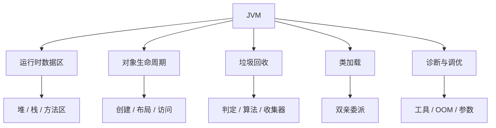
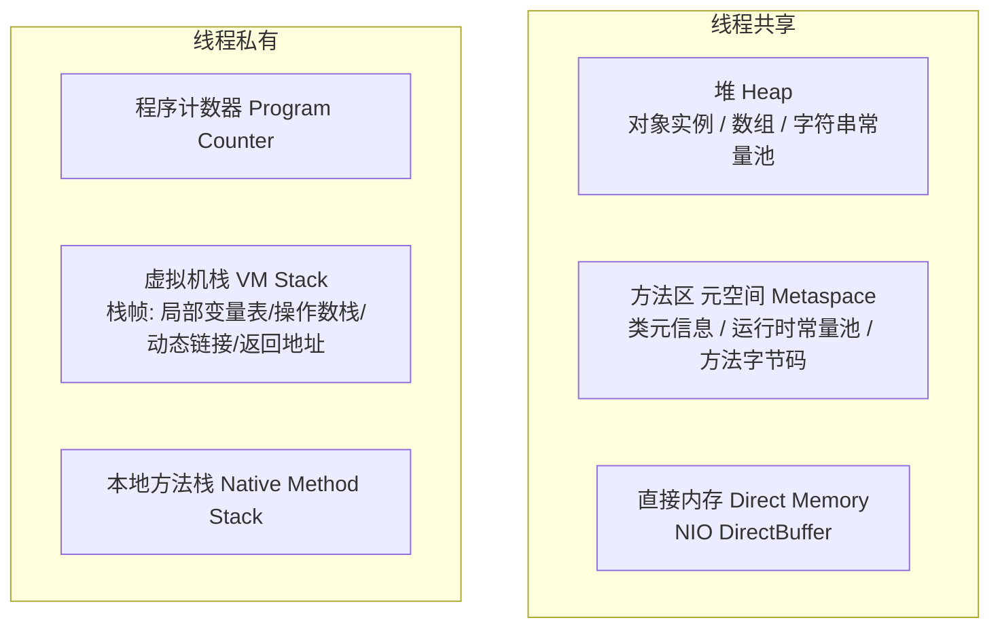
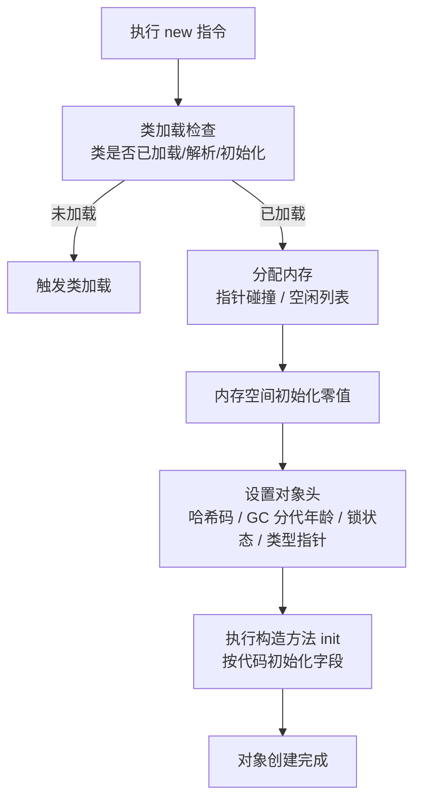
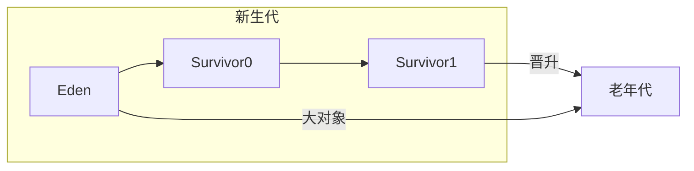
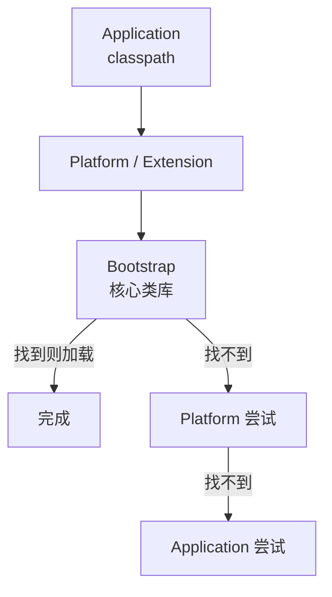

# JVM：内存区域、垃圾回收与类加载

> 这份笔记的目标读者：已学完《Java 核心》《Java 并发编程》、准备大厂校招的 Java 后端候选人。  
> 建议版本：以 HotSpot JDK 8/17/21 为主讲解，凡是 JDK 版本行为不同的地方都会单独标注。  
> 阅读方式：第一次学习按顺序读第 0~10 章；面试前重点回看第 1、5、7、9 章；冲刺阶段直接做第 11 章自测题。  
> 配套课程：并发课程的 JMM、锁升级与 ThreadLocal 会在这里得到底层验证；本课只讲 JVM 运行时，不重复讲语言语法。  
> 示例命令均可在 JDK 8/17 上运行；标注了版本差异的命令会特别说明。

### 怎么用这份笔记

- **建立地图**：第 0~2 章把运行时数据区、对象的一生讲清楚，这是所有 GC 讨论的地基；
- **突破八股**：第 3~7 章是 JVM 面试核心（GC 算法、收集器、类加载、双亲委派），要求能画图、能说参数；
- **实战排查**：第 8~10 章给命令、给流程、给案例，面试问“线上 OOM 怎么排查”时直接按流程答；
- **动手验证**：每个 OOM 案例都可以在 IDEA/命令行复现，用 jmap、jstack、MAT 亲眼看一遍比背结论强。

## 目录

- [0. 学习地图：JVM 考什么](#0-学习地图jvm-考什么)
- [1. 运行时数据区](#1-运行时数据区)
- [2. 对象的创建、内存布局与访问](#2-对象的创建内存布局与访问)
- [3. 垃圾回收基础：哪些对象需要回收](#3-垃圾回收基础哪些对象需要回收)
- [4. 垃圾回收算法与分代收集](#4-垃圾回收算法与分代收集)
- [5. 垃圾收集器：Serial 到 ZGC](#5-垃圾收集器serial-到-zgc)
- [6. 内存分配与回收策略](#6-内存分配与回收策略)
- [7. 类加载机制与双亲委派](#7-类加载机制与双亲委派)
- [8. JVM 工具与常用参数](#8-jvm-工具与常用参数)
- [9. OOM 排查实战](#9-oom-排查实战)
- [10. JVM 调优思路与案例](#10-jvm-调优思路与案例)
- [11. 高频自测题与参考资料](#11-高频自测题与参考资料)

---

## 0. 学习地图：JVM 考什么

JVM 是校招 Java 后端“含金量最高”的一层之一，因为它直接反映候选人是否理解“代码之外的世界”：内存从哪来、对象怎么生、怎么死、类怎么加载、出了问题怎么查。

### 0.1 本课程覆盖的高频考点

| 主题 | 大厂高频考点 | 面试权重 |
|---|---|---|
| 内存区域 | 堆/栈/方法区划分、元空间、直接内存、哪些区域会 OOM | ★★★★★ |
| 对象 | 创建流程、对象头、分配与访问定位 | ★★★★ |
| 存活判定 | 可达性分析、GC Roots、四种引用 | ★★★★ |
| GC 算法 | 标记-清除/复制/整理、分代收集 | ★★★★ |
| 收集器 | G1、CMS、ZGC、Parallel 对比与选型 | ★★★★★ |
| 分配策略 | Eden 优先、大对象、晋升、空间担保 | ★★★ |
| 类加载 | 生命周期、双亲委派、打破双亲委派 | ★★★★ |
| 工具与参数 | jps/jstat/jmap/jstack、-X/-XX 参数 | ★★★★ |
| OOM 排查 | 堆/栈/元空间/直接内存 OOM 的定位流程 | ★★★★ |
| 调优 | 吞吐 vs 延迟、GC 选型、停顿优化 | ★★★★ |

### 0.2 知识体系图



### 0.3 学习方法：三句话模型

1. **内存先于代码**：任何 JVM 问题都先问“这块数据在哪个区域、谁持有引用”；
2. **GC 是分代的**：新生代复制、老年代整理/清除，收集器只是不同节奏的调度器；
3. **参数服务于目标**：吞吐、延迟、内存三者不可兼得，先定目标再选参数。

**考法样板**：考点不能只背“是什么”，要能答“怎么考、答到多深”。例如：

- **类加载**：先答“加载/验证/准备/解析/初始化”五阶段与双亲委派，再展开“为什么需要破坏（JDBC/Tomcat SPI）、怎么破坏（线程上下文加载器）、不破坏的代价”；
- **GC 原理**：先答“哪些对象可回收 + 三色标记”，再答“漏标要满足哪两个条件、为什么需要写屏障/SATB、浮动垃圾是什么”；
- **OOM 排查**：先答错误消息的含义，再答“怎么用 jmap/jcmd 拿堆转储、MAT 看支配树与 GC Roots 路径定位泄漏”。

### 0.4 边界说明

并发课程的 JMM（工作内存/可见性）是语言规范层面，本课的运行时数据区是 HotSpot 实现层面，两者名字相近但不是一回事；synchronized 锁升级与对象头的关系在本课对象布局中会再次出现。

### 0.5 面试追问

- 问：JMM 和 JVM 运行时数据区有什么区别？
- 答：JMM 是语言规范定义的抽象内存模型，解决可见性与重排序；运行时数据区是 HotSpot 实现层面的内存划分（堆、栈、方法区等）。

## 1. 运行时数据区

JVM 在运行 Java 程序时把内存划分为若干区域。面试第一题几乎都是“画出运行时数据区并说明哪些线程共享、哪些会 OOM”。

### 1.1 运行时数据区总览



| 区域 | 线程 | 作用 | 异常 |
|---|---|---|---|
| 程序计数器 | 私有 | 记录当前线程**下一条**要执行的字节码指令地址（行号） | 唯一不会 OOM 的区域 |
| 虚拟机栈 | 私有 | 每次方法调用压入一个栈帧 | StackOverflowError / OutOfMemoryError |
| 本地方法栈 | 私有 | 执行 native 方法 | 同栈 |
| 堆 | 共享 | 存放对象实例与数组，GC 主战场 | OutOfMemoryError |
| 方法区 | 共享 | 类元信息、运行时常量池、方法字节码 | OutOfMemoryError |
| 直接内存 | 共享 | NIO 的 DirectByteBuffer、Netty 堆外内存（不属于运行时数据区，常一并考察） | OutOfMemoryError |

### 1.2 堆（Heap）

- 对象实例和数组的主要存放区域，也是 **GC 的主战场**；
- 逻辑上分代：**新生代**（Eden + 两个 Survivor，默认比例 8:1:1）与**老年代**；
- 字符串常量池在 JDK 7 起移入堆；静态变量也随之从方法区移入堆；
- 通过 `-Xms`（初始）/`-Xmx`（最大）控制，生产上通常设置两者相等，避免运行期动态扩容。

### 1.3 虚拟机栈与栈帧

每个线程一个虚拟机栈，每次方法调用创建一个**栈帧**：

| 栈帧内容 | 作用 |
|---|---|
| 局部变量表 | 方法参数与局部变量（基本类型值、引用、returnAddress） |
| 操作数栈 | 字节码运算的工作区 |
| 动态链接 | 指向运行时常量池中该方法的引用（解析多态调用） |
| 方法返回地址 | 方法退出后回到调用处 |

栈深度超过限制抛 `StackOverflowError`（典型：无限递归）；栈容量可动态扩展时可能抛 OOM。

### 1.4 方法区与元空间

- JDK 7 及以前：方法区由**永久代（PermGen）**实现，位于 JVM 堆内；
- JDK 8 起：永久代被**元空间（Metaspace）**取代，使用**本地内存**（不占堆），默认无上限（受操作系统内存限制）；
- 元空间存：类元信息、运行时常量池、方法字节码、注解等；
- 动态生成类过多（CGLIB、反射、Groovy）会撑爆元空间，用 `-XX:MaxMetaspaceSize` 限制。

**为什么用元空间换永久代**：永久代大小难预估、容易 OOM；与 JRockit 融合（JRockit 没有永久代）；字符串常量池在 JDK 7 已迁到堆，类元数据与字符串池解耦后，永久代里剩下的主要是类元信息，放本地内存更灵活（不占堆，天然无上限）。

### 1.5 程序计数器与直接内存

- 程序计数器记录**下一条**要执行的字节码指令地址；多线程切换时靠它恢复执行位置；**唯一不会 OOM**；
- 直接内存严格说不属于 JVM 运行时数据区，但常与 NIO 一起考察：`ByteBuffer.allocateDirect`、Netty 的堆外内存；受 `-XX:MaxDirectMemorySize` 约束，默认等于 `-Xmx`。

### 1.6 面试追问

- 问：运行时数据区分几块？哪些共享？
- 答：程序计数器、虚拟机栈、本地方法栈线程私有；堆、方法区（元空间）线程共享；直接内存不属于运行时数据区，常一并考察。
- 问：哪些区域会 OOM？
- 答：除程序计数器外都可能：堆、栈（扩展时）、元空间、直接内存。
- 问：JDK 8 的元空间和永久代区别？
- 答：永久代在堆内、有上限；元空间用本地内存，类元信息不再受堆大小限制。
- 问：栈帧里有什么？
- 答：局部变量表、操作数栈、动态链接、方法返回地址。

## 2. 对象的创建、内存布局与访问

一个 `new` 背后发生的事情，是 JVM 面试的经典开场：“对象创建过程是什么？对象在内存里长什么样？”

### 2.1 对象创建流程



细节：

1. **类加载检查**：能否定位到类的符号引用、类是否已加载；未加载先走类加载流程（第 7 章）；
2. **分配内存**：
   - 堆内存规整时用**指针碰撞**（移动指针）；不规整时用**空闲列表**；
   - 优先在 **TLAB（Thread Local Allocation Buffer）** 上分配：每个线程一块私有的 Eden 区域，避免竞争；TLAB 大小默认可动态调整（`-XX:TLABSize` 定初始、`-XX:-ResizeTLAB` 关闭调整），对象太大放不进 TLAB 时退回堆直接分配；
   - 并发分配用 CAS 保证原子；
3. **初始化零值**：保证实例字段不赋初值也能用（int=0、引用=null）；
4. **设置对象头**：哈希码、GC 分代年龄、锁标志位（synchronized 锁升级就写在 Mark Word 里）、类型指针；
5. **执行构造器**：把用户写好的字段初值、构造器代码执行完，对象才算真正可用。

### 2.2 对象的内存布局

HotSpot 里对象在堆中的布局分三部分：

| 部分 | 内容 |
|---|---|
| 对象头 | Mark Word（哈希、GC 年龄、锁状态）+ 类型指针（指向类元数据）+ 数组长度（仅数组） |
| 实例数据 | 字段值（按字段声明顺序与对齐规则排列） |
| 对齐填充 | 让对象大小是 8 字节的整数倍（HotSpot 要求） |

**指针压缩（CompressedOops）**：64 位 JVM 默认开启（JDK 6u23+），堆小于 32GB 时把对象引用从 8 字节压缩到 4 字节，省内存并提升缓存命中；推导：压缩指针 32 位可寻址 4G 个对象，每个对象按 8 字节对齐 → 4G × 8B = 32GB 上限，考虑对齐实际可用堆略小于 32GB，顶到边界后压缩失效——这也是生产上避免把堆顶到 32GB 以上的原因之一（JDK 24 的紧凑对象头可放宽该上限）。

Mark Word 是理解 synchronized 的关键：无锁时存哈希码和 GC 年龄；轻量级锁时存指向栈中锁记录的指针；重量级锁时存指向 monitor 的指针。

### 2.3 对象访问定位

Java 程序通过栈上的引用访问堆中对象，主流有两种方式：

| 方式 | 原理 | 优缺点 |
|---|---|---|
| 句柄 | 堆中划分句柄池，引用 → 句柄 → 对象实例 | 对象移动（GC 复制）时只需改句柄，但多一次间接寻址 |
| 直接指针 | 引用直接指向对象地址 | 访问快（少一次寻址），HotSpot 默认使用 |

### 2.4 逃逸分析：栈上分配与标量替换

JIT 编译期做**逃逸分析**：对象只在方法内使用、不逃逸出方法时，可能：

- **标量替换（主要手段）**：把对象拆成多个基础字段直接分配在栈/寄存器，不真正创建对象；HotSpot 实际主要靠它，“栈上分配”更多是教学概念；
- **锁消除**：对象不逃逸时，去掉不必要的 synchronized。

这些是优化手段，不是规范保证；`-XX:+DoEscapeAnalysis`（默认开启）控制。

### 2.5 面试追问

- 问：new 一个对象的完整过程？
- 答：类加载检查 → 分配内存（TLAB/指针碰撞）→ 零值初始化 → 设置对象头 → 执行构造器。
- 问：对象头里有什么？
- 答：Mark Word（哈希、GC 年龄、锁状态）、类型指针、数组长度。
- 问：什么是逃逸分析？有什么优化？
- 答：对象不逃逸时做标量替换（主要）、锁消除；“栈上分配”更多是教学概念。
- 问：为什么 synchronized 和对象头有关？
- 答：锁状态记录在 Mark Word，锁升级就是反复改写 Mark Word 的过程（并发课程已讲）。

## 3. 垃圾回收基础：哪些对象需要回收

GC 的第一件事是回答“谁还活着、谁可以回收”。面试常考“怎么判断对象已死”和“四种引用”。

### 3.1 引用计数 vs 可达性分析

| 算法 | 原理 | 问题 |
|---|---|---|
| 引用计数 | 每个对象记录被引用次数，为 0 则回收 | 无法解决循环引用（A 引用 B、B 引用 A，外部无引用但计数不为 0） |
| 可达性分析 | 从 GC Roots 出发遍历，不可达的对象判定为可回收 | 主流 JVM 采用（HotSpot） |

**GC Roots** 包括：

- 虚拟机栈（栈帧局部变量表）中引用的对象；
- 方法区中静态变量/常量引用的对象（JDK 7 起静态变量实例本身在堆中，这里指持有它们的类对象与常量池引用）；
- 本地方法栈中 JNI 引用的对象；
- 活跃线程（Thread）对象、被 synchronized 持有的对象等。

可达性分析必须在一个一致性的快照中进行，因此会产生 **STW（Stop The World）**：用户线程暂停，避免引用关系在执行中变化。

**JVM 怎么知道栈帧里哪个槽是引用（OopMap 与安全点）**：GC 扫描时不能逐个栈槽猜类型，HotSpot 的做法是：

- **OopMap**：JIT 编译后在方法的特定位置（安全点）记录“栈帧/寄存器里哪些槽是引用、对象偏移多少”，GC 直接查表，OopMap 相当于一份引用位置的“地图”；
- **安全点 Safepoint**：只有执行到安全点（方法调用、循环回跳、异常抛出等）的线程才可能被暂停；如果一个线程长时间不进安全点（如没有安全点的纯计数循环），其他线程会一直等它，表现为 STW 迟迟不结束；
- **安全区域 Safe Region**：阻塞/睡眠的线程到不了安全点，进入安全区域时先告知 GC“我在哪段代码”，离开前检查 GC 是否完成——这就是“为什么 STW”的完整链条：一致性快照 → 暂停用户线程 → 安全点协作暂停 → OopMap 精确定位引用。

### 3.2 四种引用

`java.lang.ref` 包定义了四种引用强度：

| 引用 | 回收时机 | 用途 |
|---|---|---|
| 强引用 | 永不回收（除非不可达） | new 出来的普通对象 |
| 软引用 SoftReference | 内存不足（即将 OOM）时回收 | 图片缓存、大对象缓存 |
| 弱引用 WeakReference | 下一次 GC 就被回收 | ThreadLocalMap 的 key、缓存 |
| 虚引用 PhantomReference | 对象回收后收到通知 | 跟踪对象回收、DirectBuffer 清理 |

```java
SoftReference<byte[]> cache = new SoftReference<>(new byte[1024 * 1024]);
byte[] data = cache.get();      // 可能为 null（已被回收）

WeakReference<Object> weak = new WeakReference<>(new Object());
System.gc();
// weak.get() 很可能为 null
```

注意：`System.gc()` 只是建议触发 GC，不保证立即执行；生产代码不要依赖它。

**机制层**：软引用回收时机由 `-XX:SoftRefLRUPolicyMSPerMB`（默认 1000ms/MB）控制；引用被回收/入队由 ReferenceQueue + ReferenceHandler 守护线程处理；WeakHashMap 的 value 强引用链与 ThreadLocal 泄漏同源（key 弱、value 强），用完后要主动 remove。

### 3.3 finalize 与清理

`finalize()` 已被弃用（JDK 9 起），不要用它做资源清理；对象回收前也不保证执行。资源清理用 try-with-resources。

### 3.4 面试追问

- 问：怎么判断对象可以回收？
- 答：可达性分析：从 GC Roots 出发不可达的对象判定为可回收；引用计数有循环引用缺陷，HotSpot 不用。
- 问：GC Roots 有哪些？
- 答：栈帧局部变量、静态变量、常量引用、JNI 引用、活跃线程与锁对象。
- 问：四种引用的区别？
- 答：强引用永不回收；软引用内存不足回收；弱引用下次 GC 回收；虚引用只用于回收通知。
- 问：为什么可达性分析要 STW？
- 答：遍历期间引用关系不能变化，否则分析结果不可信。

## 4. 垃圾回收算法与分代收集

三种基础算法是收集器设计的最小单元，理解它们才能看懂 G1/ZGC 为什么那样设计。

### 4.1 标记-清除（Mark-Sweep）

```text
标记：标记所有可达对象
清除：回收所有未标记对象
```

- 优点：实现简单；
- 缺点：产生大量**内存碎片**；碎片多了以后分配大对象困难，可能提前触发 GC。

### 4.2 标记-复制（Mark-Copy）

```text
把存活对象复制到另一块区域，然后整块清空原区域
```

- 优点：没有碎片，分配只需移动指针；复制时对象紧凑；
- 缺点：内存利用率低（需要一块空闲区），存活对象多时复制成本高；
- 应用：新生代。Eden:S0:S1 = 8:1:1，每次把 Eden + 一块 Survivor 的存活对象复制到另一块 Survivor，利用率 90%。

### 4.3 标记-整理（Mark-Compact）

```text
标记存活对象 → 把存活对象向一端移动 → 清理边界之外的空间
```

- 优点：没有碎片，内存利用率高；
- 缺点：移动对象成本高，需要 STW；
- 应用：老年代。

**成本模型**：标记-清除的碎片会让大对象分配失败，进而**提前触发 Minor GC**，形成恶性循环；标记-复制成本 O(存活对象数)、标记-清除/整理成本 O(堆大小)——新生代存活少所以用复制划算，这是分代选型的数学理由。

### 4.4 分代收集



分代假设（弱分代假说）：绝大多数对象“朝生夕灭”，活过几轮 GC 的对象倾向于长期存活。

- **新生代**：对象优先分配在这里，GC 频繁但快（Minor GC / Young GC），用标记-复制；
- **老年代**：长期存活对象，GC 频率低（Major GC / Full GC），用标记-整理或标记-清除；
- **跨代引用**：老年代对象引用新生代对象时，用**记忆集/卡表**记录，避免每次 GC 都全堆扫描。

### 4.5 并发标记：三色标记与写屏障

并发标记（CMS/G1 的标记阶段）用**三色标记**描述对象状态：

- **白色**：尚未被访问，可能是垃圾；
- **灰色**：自身已被访问，但它的引用还没扫描完；
- **黑色**：自身与它的引用都扫描完了。

并发标记会漏标，必须同时满足两个条件：① 黑色对象新增了对白色对象的引用；② 灰色对象同时失去了对该白色对象的引用。JVM 用**写屏障**在引用变化时记录，两种应对策略：

- **CMS 增量更新（Incremental Update）**：把黑色对象“变灰”，重新扫描它新增的引用；
- **G1 SATB（Snapshot-At-The-Beginning）**：记录并发标记开始时刻的引用快照，并发期间被覆盖/删除的旧引用（快照时刻存在的引用）也会保留并在标记结束重扫，防止灰色对象在并发期间失去对存量白色对象的引用而漏标；代价是多保留一些本可回收的对象（浮动垃圾）。

记忆集/卡表就是写屏障维护的跨代/跨 Region 引用记录，避免每次 GC 全堆扫描。

### 4.6 面试追问

- 问：三种 GC 算法的区别？
- 答：标记-清除有碎片；标记-复制无碎片但利用率低；标记-整理无碎片但移动成本高。
- 问：为什么新生代用复制、老年代用整理？
- 答：新生代存活率低，复制成本小；老年代存活率高，整理比复制划算。
- 问：什么是卡表/记忆集？
- 答：记录老年代哪些区域存在指向新生代的引用，GC 时只扫描这些区域，避免全堆扫描。

## 5. 垃圾收集器：Serial 到 ZGC

收集器是算法的工程实现。校招必须能对比 Serial、Parallel、CMS、G1，并说出 JDK 各版本默认收集器和 ZGC 的定位。

### 5.1 新生代收集器

| 收集器 | 线程模型 | 特点 |
|---|---|---|
| Serial | 单线程 | 客户端默认；简单、停顿可控 |
| ParNew | 多线程 | Serial 的并行版，CMS 的新生代搭档 |
| Parallel Scavenge | 多线程 | 吞吐优先，可精确控制吞吐量与停顿 |

### 5.2 老年代收集器

| 收集器 | 算法 | 特点 |
|---|---|---|
| Serial Old | 标记-整理 | Serial 的老年代版，CMS 失败的兜底 |
| Parallel Old | 标记-整理 | 与 Parallel Scavenge 配套，JDK 8 默认组合 |
| CMS | 标记-清除 | 并发收集、低停顿；JDK 9 弃用，JDK 14 移除 |

**CMS（Concurrent Mark Sweep）** 四阶段：

```text
初始标记（STW，只标记 GC Roots 直接引用）→ 并发标记 → 重新标记（STW，修正并发期间变化）→ 并发清除
```

CMS 的问题：标记-清除产生碎片；并发阶段占 CPU；并发失败（Concurrent Mode Failure）时退化为 Serial Old 全停顿；浮动垃圾（标记期间新产生的垃圾留到下次）。

### 5.3 G1：JDK 9+ 默认

**G1（Garbage First）** 把堆划分为多个大小相等的 **Region**（逻辑分代，物理不连续），可预测停顿：

- 每个 Region 可以扮演 Eden/Survivor/Old/Humongous（大对象区）；
- 维护各 Region 的回收价值，**优先回收垃圾最多的 Region**（Garbage First 的含义）；
- 目标：`-XX:MaxGCPauseMillis` 指定的停顿时间内尽量多回收；
- 触发 Mixed GC 的堆占用阈值 `-XX:InitiatingHeapOccupancyPercent`（IHOP）默认 45%；`-XX:G1HeapWastePercent` 默认 5%，可回收空间比例不足时提前结束 Mixed GC；
- 采用记忆集维护跨 Region 引用，Young GC 用标记-复制，Mixed GC 处理老年代 Region；
- 缺点：大对象（Humongous）处理不如连续堆友好，调参比 Parallel 复杂。

### 5.4 ZGC：超低停顿

**ZGC**（JDK 11 实验、JDK 15 正式）目标是停顿不超过 10ms，甚至 1ms 级别，且**停顿不随堆大小线性增长**：

- 基于**着色指针（colored pointers）**与**读屏障**实现并发转移；
- 标记、转移都可以并发执行，几乎全程不 STW；
- 适合超大堆（几十 GB 以上）、低延迟场景；
- 支持堆上限：JDK 12 前 4TB、JDK 13 起 16TB；着色指针的 4 个状态位（Finalizable/Remapped/Marked0/Marked1）承载标记与重映射信息；
- JDK 21 加入**分代 ZGC**，进一步降低年轻代回收停顿。

**self-healing（自愈）闭环**：读屏障在访问到已被转移的对象时返回新地址并顺手修正旧地址（remap），让访问者参与转移收敛；代价是每次引用访问都要过读屏障（CPU 开销），且堆上限、JDK 版本间行为差异（11→13→15→21）都要说清楚。

**Shenandoah**（JEP 189 实验、JEP 379 JDK 15 正式）：与 ZGC 并列的超低停顿收集器，同样支持并发转移；实现路线不同（无着色指针，靠 Brooks 指针与读屏障），选型时与 ZGC 二选一即可。

### 5.5 收集器选型对比

| 收集器 | 停顿 | 吞吐 | 适用 |
|---|---|---|---|
| Parallel | 较高 | 最高 | JDK 8 默认，批处理、离线任务 |
| CMS | 较低 | 中 | 已移除，仅历史 |
| G1 | 可预测 | 中高 | JDK 9+ 默认，服务端通用 |
| ZGC | 极低 | 中 | 超大堆 + 低延迟 |
| Shenandoah | 极低 | 中 | JDK 15 正式（JEP 379），超低停顿的另一选择 |

**选型决策链**：先定目标，再选候选，最后说代价，不要一上来背收集器名。

```text
吞吐优先（批处理/离线）      → Parallel（开销最小）
延迟可预测（服务端通用）      → G1（JDK 9+ 默认）
超低停顿 + 超大堆             → ZGC / Shenandoah（二选一）
```

- G1 的代价：Region 元数据、卡表/记忆集带来 **5%~20% 额外内存**，并发标记还占 CPU；小堆（如 4GB 以下）上这些开销占比高，用 Parallel 更划算；
- ZGC 的代价：读屏障影响每次引用访问、堆上限 16TB、JDK 版本间行为有差异（JDK 21 分代 ZGC）；
- 面试答法四步：**目标 → 候选 → 代价 → 验证**（如“我要延迟可预测，选 G1；它多占 5~20% 内存，先看堆是否够，再压测对比 YGCT/FGC”）。

### 5.6 面试追问

- 问：JDK 8 和 JDK 17 默认收集器？
- 答：JDK 8 默认 Parallel Scavenge + Parallel Old；JDK 9 起默认 G1。
- 问：G1 和 CMS 的区别？
- 答：G1 分区 + 可预测停顿 + 无碎片；CMS 标记-清除、有碎片，已从 JDK 14 移除。
- 问：G1 为什么叫 Garbage First？
- 答：按回收价值排序，优先回收垃圾占比最高的 Region，以最小代价控制停顿。
- 问：ZGC 为什么停顿低？
- 答：着色指针 + 读屏障实现并发标记与转移，几乎不 STW；适合超大堆低延迟。
- 问：Full GC 频繁一般是什么原因？
- 答：老年代空间不足、晋升过快、大对象过多、内存泄漏；先看 GC 日志和堆使用曲线。

## 6. 内存分配与回收策略

对象分配不是随机的，HotSpot 有一套默认策略，面试常考“对象优先分配在哪、什么时候进老年代”。

### 6.1 四条主要策略

1. **对象优先在 Eden 分配**：Eden 满时触发 Minor GC，存活对象复制到 Survivor；
2. **大对象直接进老年代**：超过 `-XX:PretenureSizeThreshold` 的大对象（尤其是数组）直接进老年代，避免 Eden 与 Survivor 之间反复复制；注意该参数默认 0（不启用）且只对 Serial/ParNew 生效，G1 不认它——G1 中大小 ≥ Region 一半的对象作为 Humongous 大对象直接进大对象区；
3. **长期存活对象晋升老年代**：对象每熬过一次 Minor GC 年龄 +1，达到 `-XX:MaxTenuringThreshold`（默认 15）晋升（默认 15 只对 Parallel 系列；CMS 下默认 6，且主要按动态年龄判定）；
4. **动态年龄判定**：Survivor 中同龄对象总和超过 Survivor 一半时，大于等于该年龄的对象直接晋升，不必等满 15。

**设计动机**：MaxTenuringThreshold 上限 15 源于对象头 4 bit 年龄字段（2⁴−1）；动态年龄“同龄总和超 Survivor 一半”是容量约束下的折中；大对象直接进老年代是避免反复复制大数组的成本模型。

### 6.2 空间分配担保

Minor GC 前检查老年代是否足够容纳晋升对象：老年代最大连续空间 ≥ 新生代全部对象，或 ≥ 历次晋升的平均值，才冒险执行 Minor GC，否则直接 Full GC。`-XX:HandlePromotionFailure` 参数自 JDK 6u24 起已失效，不要再把它写进答案。

### 6.3 为什么新生代要两块 Survivor

标记-复制需要一块干净的空闲区承接存活对象；S0/S1 交替使用，保证任何时刻都有一块空 Survivor，避免碎片。默认 Eden:S0:S1 = 8:1:1，浪费 10% 空间换无碎片；对应默认参数 `-XX:NewRatio=2`（年轻代:老年代 ≈ 1:2）、`-XX:SurvivorRatio=8`（Eden:S0:S1 = 8:1:1）。

### 6.4 面试追问

- 问：对象一般分配在哪？
- 答：优先 Eden（TLAB 内），大对象直接老年代，长期存活对象晋升老年代。
- 问：晋升老年代的条件？
- 答：年龄达到 MaxTenuringThreshold（默认 15），或动态年龄判定，或大对象直接进入。
- 问：为什么要分代？
- 答：绝大多数对象短命，新生代用复制算法高频回收成本低；老年代存活率高，用整理算法低频回收。

## 7. 类加载机制与双亲委派

“一个类从字节码到能 new 出对象，中间经历了什么”，是 JVM 面试绕不开的题。

### 7.1 类加载的生命周期

```text
加载 → 验证 → 准备 → 解析 → 初始化 → 使用 → 卸载
```

| 阶段 | 做什么 |
|---|---|
| 加载 | 读取字节码，生成 Class 对象 |
| 验证 | 校验字节码格式、语义、符号引用（安全） |
| 准备 | 为静态变量分配内存并设默认值（0/null，final 常量直接赋值） |
| 解析 | 把符号引用替换为直接引用 |
| 初始化 | 执行静态变量赋值与静态代码块（触发 `<clinit>`） |

**初始化触发时机**（主动引用）：

- `new`、读写静态字段、调用静态方法；
- 反射 `Class.forName`；
- 初始化子类前先初始化父类；
- 作为程序入口（main 所在类）；
- 使用 MethodHandle、动态语言支持等。

被动引用（不触发初始化）经典演示：`Child.x` 只读父类静态字段，只初始化父类、不初始化子类；`new Child[10]` 只触发数组类的初始化。

被动引用（不触发初始化）：通过子类引用父类静态字段、定义数组、引用常量（编译期进入常量池）。

### 7.2 三类加载器与双亲委派

| 加载器 | 加载范围 |
|---|---|
| Bootstrap ClassLoader | JDK 核心类库（rt.jar / java.base 模块） |
| Extension / Platform ClassLoader | JDK 扩展库（JDK 9 起更名 Platform） |
| Application ClassLoader | classpath 下的应用类 |

**双亲委派**：一个类加载请求先交给父加载器，父加载器处理不了才由自己加载。



好处：

1. **避免重复加载**：同一个类只会被上层的加载器加载一次；
2. **安全**：核心类库只能由 Bootstrap 加载，应用代码无法用同名类（如 `java.lang.String`）冒充核心类。

**类唯一性（命名空间）**：同一个全限定名由不同类加载器加载出来是两个不同的类（Class 对象不同、instanceof 判 false）；热部署正是靠新加载器加载新版类来替换旧版本。

### 7.3 打破双亲委派

| 场景 | 机制 | 例子 |
|---|---|---|
| SPI（服务提供方接口） | 双亲委派下父加载器加载的接口需要子加载器的实现，用线程上下文类加载器（TCCL）反向加载 | JDBC DriverManager |
| 容器热部署 | 每个 WebApp 独立类加载器，卸载类即可替换应用 | Tomcat |
| OSGi / 模块化 | 类加载器按模块管理依赖 | OSGi 框架 |

**JDBC 的失败现场**：`DriverManager` 由 Bootstrap/平台加载器加载，而 MySQL 驱动在应用的 classpath 里（由 Application 加载器加载）。双亲委派下父加载器看不到子加载器的类，直接“接口调用实现”会失败；所以 DriverManager 用 `Thread.currentThread().getContextClassLoader()`（TCCL，默认是 Application 加载器）反向把驱动类加载进来。把驱动从 classpath 移除、或 TCCL 被改掉时，就会看到 `ClassNotFoundException: com.mysql.cj.jdbc.Driver`。

**为什么推荐重写 `findClass` 而不是 `loadClass`**：`loadClass` 是双亲委派的总入口（内部顺序是 findLoadedClass → 父加载器 → 自己），`findClass` 只是“自己负责加载字节码”的钩子。自定义加载器只重写 `findClass`，就能保留双亲委派的查重与安全逻辑，只替换“类从哪来”；直接重写 `loadClass` 等于绕过整条委派链，容易重复加载、破坏类唯一性。Tomcat 的 WebAppClassLoader 则是“先加载 WEB-INF/classes，再委派”，用这个违背父优先的顺序实现应用隔离与热部署。

```java
// 打破双亲委派的通用做法：重写 loadClass，先自己加载，失败再回退父加载器
protected Class<?> loadClass(String name, boolean resolve) throws ClassNotFoundException {
    synchronized (getClassLoadingLock(name)) {          // 保证同一类只加载一次
        Class<?> clazz = findLoadedClass(name);
        if (clazz == null) {
            try {
                clazz = findClass(name);                // 先自己加载
            } catch (ClassNotFoundException e) {
                clazz = super.loadClass(name, false);   // 失败回退双亲委派
            }
        }
        if (resolve) resolveClass(clazz);
        return clazz;
    }
}
```

### 7.4 面试追问

- 问：类加载的过程？
- 答：加载 → 验证 → 准备 → 解析 → 初始化；其中初始化会执行静态代码块。
- 问：什么是双亲委派？
- 答：加载请求先交给父加载器，父加载不了才自己加载；保证核心类不被篡改、避免重复加载。
- 问：怎么打破双亲委派？
- 答：重写 loadClass 先自己加载，或使用线程上下文类加载器（SPI）、容器自定义加载器（Tomcat 热部署）。
- 问：什么时候触发类初始化？
- 答：new/静态成员访问/静态方法调用、反射、初始化子类先初始化父类、main 类。

## 8. JVM 工具与常用参数

面试问“线上怎么排查”，答得出 jps/jstack/jmap/jstat 的具体用法就是加分项。

### 8.1 命令行工具

| 工具 | 用途 | 典型用法 |
|---|---|---|
| jps | 列出 Java 进程 | `jps -l` |
| jstat | 查看类加载、GC、编译统计 | `jstat -gc <pid> 1000` |
| jmap | 堆转储、堆信息 | `jmap -dump:format=b,file=heap.hprof <pid>` |
| jstack | 线程转储（锁、死锁） | `jstack <pid>` |
| jcmd | 综合诊断（JDK 7+） | `jcmd <pid> GC.heap_info` / `Thread.print` / `VM.native_memory` |
| jinfo | 查看/修改运行参数 | `jinfo -flags <pid>` |
| jhsdb | 基于 Serviceability Agent 的底层调试工具集 | `jhsdb jmap --heap --pid <pid>` |

```bash
jps -l                                  # 找 pid
jstat -gcutil 12345 1000                # 每秒输出一次 GC 利用率
jmap -dump:format=b,file=/tmp/heap.hprof 12345   # 堆转储（会 STW，谨慎）
jstack 12345 > thread_dump.txt          # 线程转储
```

注意：jhat 已于 JDK 9 移除（JEP 241），堆转储分析用 MAT / VisualVM。

**输出解读判据**：jstat 看老年代 `O` 利用率——持续 >70% 且 Full GC 几分钟一次，说明晋升过快或泄漏；`YGCT` 占比 >5% 说明年轻代 GC 太频繁（堆偏小或对象创建量大）；先看趋势再动参数，一次只改一个变量。

### 8.2 常用参数分类

| 分类 | 示例 | 说明 |
|---|---|---|
| 标准参数 | `-version` | 所有 JVM 都支持 |
| -X 参数 | `-Xms256m -Xmx1g -Xmn512m`、`-Xlog` | 堆大小、年轻代、JDK 9+ 统一日志（JEP 158） |
| -XX 参数 | `-XX:MaxMetaspaceSize`、`-XX:+UseG1GC` | 扩展参数，布尔用 +/- 开启 |

高频参数清单：

```bash
-Xms2g -Xmx2g                          # 堆初始=最大，避免扩容抖动
-Xmn512m                               # 新生代大小
-XX:MaxMetaspaceSize=512m              # 元空间上限
-XX:+UseG1GC                           # JDK 9+ 默认，可显式指定
-XX:MaxGCPauseMillis=200               # G1 停顿目标
-XX:+HeapDumpOnOutOfMemoryError        # OOM 自动堆转储
-XX:HeapDumpPath=/logs/heap.hprof      # 转储路径
-Xlog:gc*:file=/logs/gc.log:time,uptime,level,tags  # GC 日志（JDK 9+ 语法）
-XX:+PrintGCDetails                        # JDK 8 及以前打印 GC 明细；JDK 9+ 由 -Xlog:gc* 统一承担
```

**为什么生产建议 -Xms = -Xmx**：堆扩容本身伴随 Full GC，且扩容后 G1 的预测模型基线漂移、停顿估算失真；干脆初始即最大，避免运行中抖动。

### 8.3 图形与第三方工具

- **jconsole / jvisualvm**：本地监控 CPU、内存、线程；JDK 9 起 jvisualvm 不再随 JDK 分发；
- **MAT（Memory Analyzer）**：分析堆转储，找泄漏对象与 GC Roots 路径；
- **Arthas（阿里）**：线上热诊断，`dashboard`、`thread`、`watch`、`trace`；
- **JFR（Java Flight Recorder）**：JDK 11+ 默认可用，低开销采样，事件式分析。

堆外内存统计：启动加 `-XX:NativeMemoryTracking=summary`，用 `jcmd <pid> VM.native_memory summary` 查看 DirectBuffer 与各类内存占用。

### 8.4 面试追问

- 问：怎么查一个 Java 进程的 GC 情况？
- 答：jps 找 pid，jstat -gcutil 观察 GC 频率与耗时，或看 GC 日志。
- 问：jmap dump 有什么注意点？
- 答：会触发 STW、文件很大，生产环境要低峰期执行；更稳妥的是加 HeapDumpOnOutOfMemoryError 自动转储。
- 问：堆参数怎么配？
- 答：-Xms 与 -Xmx 相等避免扩容；新生代、元空间、直接内存按业务定上限。

## 9. OOM 排查实战

OOM 是线上最常见的 JVM 故障，面试标准问法是“遇到过 OOM 吗？怎么排查的？”答案要按区域展开。

### 9.1 堆 OOM（最常见）

现象：`java.lang.OutOfMemoryError: Java heap space`。

排查流程：

```text
1. 确认确实堆不足还是泄漏
2. 启动参数加 -XX:+HeapDumpOnOutOfMemoryError -XX:HeapDumpPath=/logs/
3. OOM 后拿到 heap.hprof
4. MAT 打开，Histogram 看大对象，Dominator Tree 找持有者
5. 从可疑对象回溯 GC Roots 路径，定位泄漏代码
```

常见泄漏点：

- 静态集合不断 add 不清理（`static List<Object>`）；
- ThreadLocal 用完不 remove（线程池场景）；
- 连接/流未关闭（数据库、Redis、HTTP 客户端）；
- 监听器/观察者注册后未注销；
- 缓存无限增长（没用 LRU）。

**数值判据**：用 jstat 连续采样看老年代 `OU`——单调上涨、不随流量回落 = 泄漏；随流量起伏、峰值才超 = 堆容量不足。配合 `jstat -class` 看 Loaded/Unloaded 数量，类加载器泄漏会表现为 Loaded 只增不减。

### 9.2 栈相关错误：StackOverflow 与无法创建线程

- **StackOverflowError**：栈深度超限（递归过深、栈帧过大），最常见；
- **OutOfMemoryError: unable to create new native thread**：线程数超限（系统 ulimit、进程内存耗尽），成因与栈深度无关。

排查：jstack 看线程栈确认递归；调 `-Xss`（默认值因平台而异，x64 Linux 常见 1MB）或修代码；native thread OOM 检查系统 ulimit 与线程池滥用。

### 9.3 元空间 OOM

现象：`java.lang.OutOfMemoryError: Metaspace`。

常见原因：动态生成类（CGLIB 代理、反射、Groovy/脚本引擎、热部署未卸载）。排查：看是否每请求都生成新类；用 `-XX:MaxMetaspaceSize` 提前暴露；修复后配合类加载器卸载。

### 9.4 直接内存 OOM

现象：`OutOfMemoryError: Direct buffer memory`。

常见原因：ByteBuffer.allocateDirect 未释放、Netty 堆外内存使用失控。排查：`-XX:MaxDirectMemorySize` 限制；检查是否调用了 DirectBuffer cleaner 或池化；jcmd 查看 DirectBuffer 统计。

### 9.5 其他高频 OOM

- **GC overhead limit exceeded**：`-XX:+UseGCOverheadLimit`（默认开启）下，JVM 花费超过 98% 时间做 GC 却回收不到 2% 的堆时抛出；通常是堆太小或内存泄漏导致的回收风暴；
- **Requested array size exceeds VM limit**：申请数组长度超过 JVM 限制（如 `new byte[Integer.MAX_VALUE]`），是程序错误而非泄漏。

### 9.6 内存泄漏 vs 内存溢出

- **泄漏**：对象不再使用但一直被引用，GC 无法回收，越积越多最终溢出；
- **溢出**：申请的内存超过堆上限（可能是泄漏导致，也可能单纯堆太小/一次性大对象）。

### 9.7 面试追问

- 问：线上堆 OOM 怎么排查？
- 答：开 HeapDumpOnOutOfMemoryError 拿转储，MAT 查 Histogram 与 GC Roots 路径，定位泄漏代码；区分“泄漏”和“堆太小”。
- 问：StackOverflowError 和 OOM 什么区别？
- 答：前者栈深度超限（递归）；后者是内存总量不足（含无法创建 native thread）。
- 问：Metaspace OOM 常见于什么场景？
- 答：动态生成类（CGLIB、反射、脚本引擎）、类加载器未卸载。
- 问：ThreadLocal 为什么会造成泄漏？
- 答：key 弱引用被回收、value 强引用挂在长生命周期线程上，见并发课程。

## 10. JVM 调优思路与案例

调优不是“背参数”，而是先定目标、再测量、再针对性调整。面试问“你调过 JVM 吗”，把流程讲清楚比报参数名重要。

### 10.1 三个目标不可能三角

| 目标 | 含义 | 手段 |
|---|---|---|
| 吞吐 | 单位时间完成多少业务 | Parallel 收集器、大堆、少 GC |
| 延迟 | 单次请求/GC 停顿多久 | G1/ZGC、控制停顿 |
| 内存 | 占用多少内存 | 小堆、及时释放 |

通常业务优先延迟（响应时间），离线任务优先吞吐。

### 10.2 调优流程

```text
1. 明确指标：RT、QPS、GC 频率与停顿、CPU、内存
2. 收集数据：GC 日志、jstat、JFR、压测结果
3. 定位问题：Full GC 频繁？单次停顿长？CPU 飙高？OOM？
4. 针对性调整：堆大小、代比例、收集器、代码问题
5. 验证：回压测，对比指标，不要一次改多个变量
```

### 10.3 常见问题与对策

| 症状 | 可能原因 | 对策 |
|---|---|---|
| Full GC 频繁 | 老年代不足、晋升过快 | 调大堆、调大 Survivor、检查大对象 |
| 单次 GC 停顿长 | 堆太大 + Parallel、CMS 碎片 | 换 G1/ZGC、控制停顿目标 |
| CPU 100% 且 GC 频繁 | 内存泄漏导致回收风暴 | 堆转储定位泄漏（第 9 章） |
| 新生代 GC 频繁 | Eden 太小 | 调大 -Xmn 或调整 G1 Region |
| 直接内存 OOM | NIO/Netty 未回收 | MaxDirectMemorySize + 池化 |

**调大 Survivor 为什么有效 + 代价**：Survivor 变大 → 更多短命对象在新生代多熬几轮不晋升 → 老年代压力减小、Full GC 变少；代价是 Eden 相对变小（Minor GC 更频繁）且 Survivor 本身占用内存。**mini 案例**：GC 日志显示老年代 O 占比持续爬升、Full GC 每 5 分钟一次 → 先 `-Xmn` 从 1g 调 2g 看 YGCT 与晋升率 → 仍高则配合 `-XX:SurvivorRatio=6`（Survivor 更大）→ 回压测对比 Full GC 间隔与总吞吐，一次只改一个变量。

### 10.4 典型参数模板

```bash
# 低延迟在线服务（JDK 17）
java -Xms4g -Xmx4g \
     -XX:MaxMetaspaceSize=512m \
     -XX:+UseG1GC \
     -XX:MaxGCPauseMillis=100 \
     -XX:+HeapDumpOnOutOfMemoryError \
     -XX:HeapDumpPath=/logs/heap.hprof \
     -Xlog:gc*:file=/logs/gc.log:time,uptime,level,tags \
     -jar app.jar
```

```bash
# 吞吐优先离线任务（JDK 8）
java -Xms8g -Xmx8g -XX:+UseParallelGC -XX:+UseParallelOldGC \
     -XX:ParallelGCThreads=8 -jar batch.jar
```

### 10.5 面试追问

- 问：G1 停顿目标怎么设置？
- 答：`-XX:MaxGCPauseMillis`，但停顿目标过小会导致 GC 更频繁、吞吐下降，需要权衡。
- 问：堆设置多大合适？
- 答：先看存活对象基线（老年代使用量 + 增长斜率），一般留 1.5~2 倍余量；靠监控数据而不是拍脑袋。
- 问：调优的第一步是什么？
- 答：测量。没有 GC 日志和监控就调优是赌博；先收集数据再动手，一次只改一个变量。

## 11. 高频自测题与参考资料

### 11.1 分主题自测

本页把全书高频考点压缩成分主题自测题：先盖住“一句话要点”尝试作答，再对照检查；能一次答对八成以上，就可以进入下一门课《操作系统》。

| 主题 | 问题 | 一句话要点 |
|---|---|---|
| 内存 | 运行时数据区分几块 | 堆/方法区/栈/本地方法栈/程序计数器 + 直接内存 |
| 内存 | 哪些线程共享 | 堆、方法区共享；栈、计数器私有 |
| 内存 | 元空间和永久代 | 元空间在本地内存，取代堆内永久代 |
| 内存 | 哪个区域不会 OOM | 程序计数器 |
| 内存 | 栈帧里有什么 | 局部变量表、操作数栈、动态链接、返回地址 |
| 对象 | new 对象流程 | 加载检查→分配→零值→对象头→构造器 |
| 对象 | 对象头内容 | Mark Word、类型指针、数组长度 |
| 对象 | 什么是逃逸分析 | 对象不逃逸时栈上分配/标量替换/锁消除 |
| GC | 判断对象可回收 | 可达性分析，GC Roots 不可达 |
| GC | GC Roots 有哪些 | 栈局部变量、静态变量、常量、JNI、活跃线程 |
| GC | 四种引用 | 强/软/弱/虚，回收时机递增 |
| GC | 三种算法 | 清除有碎片、复制无碎片、整理移动对象 |
| GC | 为什么分代 | 对象大多短命，新生代复制更划算 |
| GC | 什么是卡表 | 记录跨代引用，避免全堆扫描 |
| GC | 三色标记/SATB | 漏标需“黑→白新引用 + 灰失去引用”同时满足；SATB 保留被覆盖的旧引用、结束重扫 |
| 收集器 | JDK8 默认收集器 | Parallel Scavenge + Parallel Old |
| 收集器 | JDK9+ 默认收集器 | G1 |
| 收集器 | G1 特点 | Region 分区、回收价值优先、停顿可预测 |
| 收集器 | CMS 结局 | JDK 9 弃用、JDK 14 移除 |
| 收集器 | ZGC 原理 | 着色指针 + 读屏障，并发转移 |
| 分配 | 对象优先分配在哪 | Eden（TLAB） |
| 分配 | 什么时候进老年代 | 大对象、年龄达阈值、动态年龄判定 |
| 类加载 | 生命周期 | 加载→验证→准备→解析→初始化 |
| 类加载 | 双亲委派好处 | 避免重复加载、核心类安全 |
| 类加载 | 怎么打破双亲委派 | 重写 loadClass、TCCL、容器加载器 |
| 类加载 | 什么触发初始化 | new/静态成员/反射/子类先父类/main |
| 工具 | 查 GC 用什么 | jstat -gcutil |
| 工具 | 线程转储 | jstack |
| 工具 | 堆转储 | jmap -dump，配 HeapDumpOnOutOfMemoryError |
| OOM | 堆 OOM 排查 | 转储 + MAT 查 GC Roots 路径 |
| OOM | StackOverflow 原因 | 递归过深、栈帧过大 |
| OOM | Metaspace OOM | 动态生成类过多（CGLIB/反射） |
| OOM | 直接内存 OOM | NIO/Netty 堆外未释放 |
| OOM | 泄漏 vs 溢出 | 泄漏是引用没断，溢出是容量不足 |
| 调优 | 三目标 | 吞吐、延迟、内存不可兼得 |
| 调优 | 调优第一步 | 测量，收集 GC 日志与监控 |
| 调优 | G1 停顿参数 | MaxGCPauseMillis |

### 11.2 追问型自测（只给提示不给答案）

下面 5 题是“答对一句话后还会被追问”的升级题：先按提示口头作答，再回对应章节对答案。

1. 三色标记为什么需要写屏障？（提示：漏标要同时满足哪两个条件；SATB 记录的是“新产生的引用”还是“被覆盖的旧引用”）
2. 指针压缩为什么堆小于 32GB 才生效？（提示：压缩后引用 4 字节、对象 8 字节对齐，4G × 8 的边界怎么来的）
3. 为什么说“小堆用 G1 不划算”？（提示：G1 的 Region 与并发标记要占用额外内存和 CPU，停顿可预测性在小堆上收益不明显）
4. 两个类加载器加载同名类，为什么不是同一个类？（提示：类唯一性由“加载器 + 名字”共同决定，instanceof 会怎样）
5. 怎么区分内存泄漏和容量不足？（提示：jstat/jmap 看老年代 OU 是否单调上涨，还是随流量起伏）

### 11.3 考前 30 分钟速记

> 速记是开场白不是完整答案：一句话立住骨架后，还要能展开三层——机制（怎么实现）、为什么（设计动机）、边界（失效/代价/变体）。

- 一句话回答“内存区域”：堆、方法区共享，栈、计数器私有，元空间在本地内存；
- 一句话回答“对象创建”：加载检查→分配→零值→对象头→构造器；
- 一句话回答“GC 判定”：GC Roots 可达性分析，四种引用按强度回收；
- 一句话回答“收集器”：Parallel 吞吐、CMS 已移除、G1 分区可预测停顿、ZGC 超低停顿；
- 一句话回答“类加载”：加载→验证→准备→解析→初始化，双亲委派保安全；
- 一句话回答“OOM 排查”：堆转储 + MAT 找 GC Roots 路径，先分泄漏还是溢出；
- 一句话回答“调优”：先定目标（吞吐/延迟），测量，一次只改一个变量。

### 11.4 参考资料

- [JavaGuide：JVM 入门与内存区域](https://javaguide.cn/java/jvm/jvm-intro.html)
- [JavaGuide：垃圾收集器对比](https://javaguide.cn/java/jvm/jvm-garbage-collection.html)
- [JEP 363：Remove CMS（JDK 14）](https://openjdk.org/jeps/363)
- [JEP 377：ZGC 正式（JDK 15）](https://openjdk.org/jeps/377)
- 《深入理解 Java 虚拟机（第 3 版）》（周志明）
- [Oracle：Java 调优与诊断命令手册](https://docs.oracle.com/en/java/javase/17/troubleshoot/)
- [Arthas 官方文档](https://arthas.aliyun.com/doc/)

> 学习闭环：第 0~10 章读完、自测题能答 80% 后，进入下一门课《操作系统》，把进程线程、IO 模型与 JVM 的线程/锁实现接起来。
