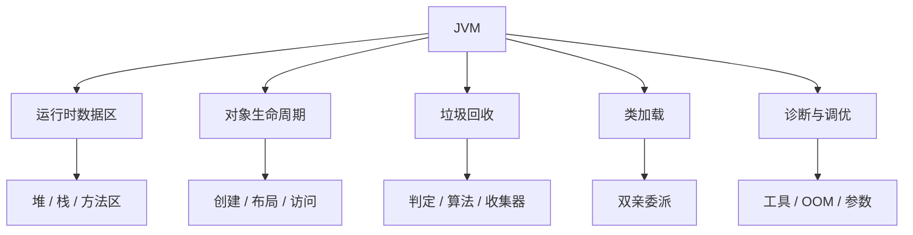
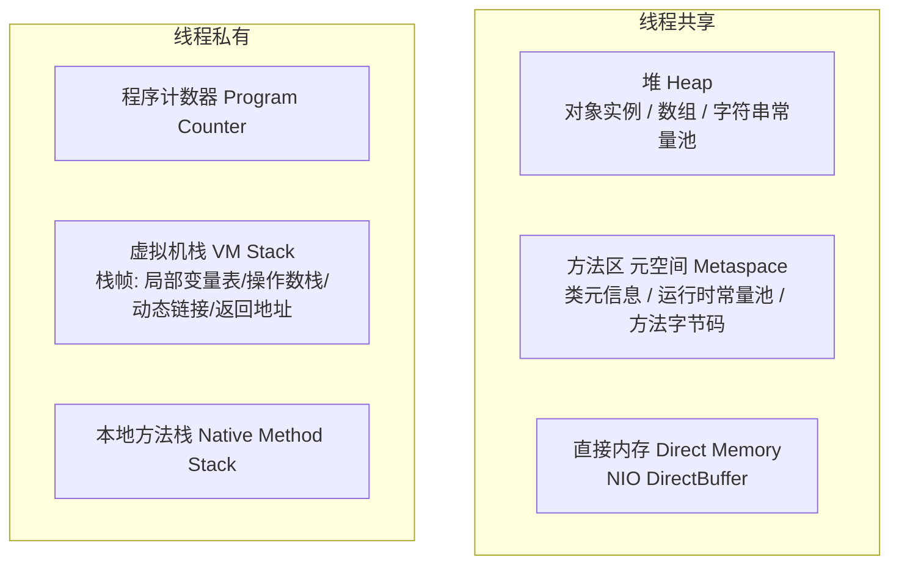
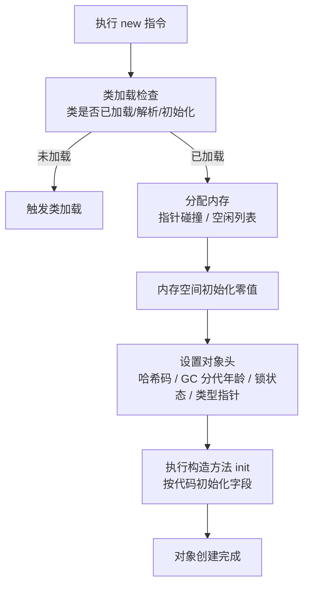
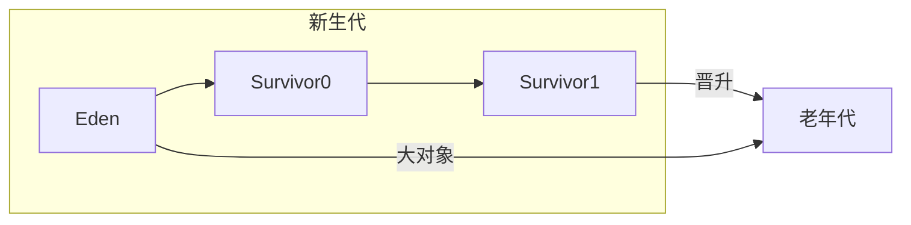
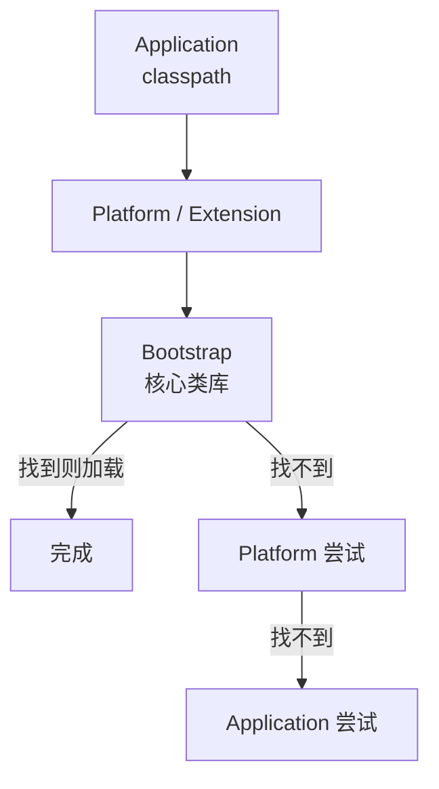

# JVM：内存区域、垃圾回收与类加载

> 这份笔记的目标读者：已学完《Java 核心》《Java 并发编程》、准备大厂校招的 Java 后端候选人。  
> 建议版本：以 HotSpot JDK 8/17/21 为主讲解，凡是 JDK 版本行为不同的地方都会单独标注。  
> 阅读方式：第一次学习按顺序读第 0~10 章；面试前重点回看第 1、5、7、9 章；冲刺阶段直接做第 11 章自测题。  
> 配套课程：并发课程的 JMM、锁升级与 ThreadLocal 会在这里得到底层验证；本课只讲 JVM 运行时，不重复讲语言语法。  
> 示例命令均可在 JDK 8/17 上运行；标注了版本差异的命令会特别说明。

### 怎么用这份笔记

- **建立地图**：第 0~2 章把运行时数据区、对象的一生讲清楚，这是所有 GC 讨论的地基；
- **突破八股**：第 3~7 章是 JVM 面试核心（GC 算法、收集器、类加载、双亲委派），要求能画图、能说参数；
- **实战排查**：第 8~10 章给命令、给流程、给案例，面试问“线上 OOM 怎么排查”时直接按流程答；
- **动手验证**：每个 OOM 案例都可以在 IDEA/命令行复现，用 jmap、jstack、MAT 亲眼看一遍比背结论强。

## 目录

- [0. 学习地图：JVM 考什么](#0-学习地图jvm-考什么)
- [1. 运行时数据区](#1-运行时数据区)
- [2. 对象的创建、内存布局与访问](#2-对象的创建内存布局与访问)
- [3. 垃圾回收基础：哪些对象需要回收](#3-垃圾回收基础哪些对象需要回收)
- [4. 垃圾回收算法与分代收集](#4-垃圾回收算法与分代收集)
- [5. 垃圾收集器：Serial 到 ZGC](#5-垃圾收集器serial-到-zgc)
- [6. 内存分配与回收策略](#6-内存分配与回收策略)
- [7. 类加载机制与双亲委派](#7-类加载机制与双亲委派)
- [8. JVM 工具与常用参数](#8-jvm-工具与常用参数)
- [9. OOM 排查实战](#9-oom-排查实战)
- [10. JVM 调优思路与案例](#10-jvm-调优思路与案例)
- [11. 高频自测题与参考资料](#11-高频自测题与参考资料)

---

## 0. 学习地图：JVM 考什么

JVM 是校招 Java 后端“含金量最高”的一层之一，因为它直接反映候选人是否理解“代码之外的世界”：内存从哪来、对象怎么生、怎么死、类怎么加载、出了问题怎么查。

### 0.1 本课程覆盖的高频考点

| 主题 | 大厂高频考点 | 面试权重 |
|---|---|---|
| 内存区域 | 堆/栈/方法区划分、元空间、直接内存、哪些区域会 OOM | ★★★★★ |
| 对象 | 创建流程、对象头、分配与访问定位 | ★★★★ |
| 存活判定 | 可达性分析、GC Roots、四种引用 | ★★★★ |
| GC 算法 | 标记-清除/复制/整理、分代收集 | ★★★★ |
| 收集器 | G1、CMS、ZGC、Parallel 对比与选型 | ★★★★★ |
| 分配策略 | Eden 优先、大对象、晋升、空间担保 | ★★★ |
| 类加载 | 生命周期、双亲委派、打破双亲委派 | ★★★★ |
| 工具与参数 | jps/jstat/jmap/jstack、-X/-XX 参数 | ★★★★ |
| OOM 排查 | 堆/栈/元空间/直接内存 OOM 的定位流程 | ★★★★ |
| 调优 | 吞吐 vs 延迟、GC 选型、停顿优化 | ★★★★ |

### 0.2 知识体系图



### 0.3 学习方法：三句话模型

1. **内存先于代码**：任何 JVM 问题都先问“这块数据在哪个区域、谁持有引用”；
2. **GC 是分代的**：新生代复制、老年代整理/清除，收集器只是不同节奏的调度器；
3. **参数服务于目标**：吞吐、延迟、内存三者不可兼得，先定目标再选参数。

**考法样板**：考点不能只背“是什么”，要能答“怎么考、答到多深”。例如：

- **类加载**：先答“加载/验证/准备/解析/初始化”五阶段与双亲委派，再展开“为什么需要破坏（JDBC/Tomcat SPI）、怎么破坏（线程上下文加载器）、不破坏的代价”；
- **GC 原理**：先答“哪些对象可回收 + 三色标记”，再答“漏标要满足哪两个条件、为什么需要写屏障/SATB、浮动垃圾是什么”；
- **OOM 排查**：先答错误消息的含义，再答“怎么用 jmap/jcmd 拿堆转储、MAT 看支配树与 GC Roots 路径定位泄漏”。

### 0.4 边界说明

并发课程的 JMM（工作内存/可见性）是语言规范层面，本课的运行时数据区是 HotSpot 实现层面，两者名字相近但不是一回事；synchronized 锁升级与对象头的关系在本课对象布局中会再次出现。

### 0.5 面试追问

- 问：JMM 和 JVM 运行时数据区有什么区别？
- 答：两个“内存”完全是不同层面的概念。JMM（Java Memory Model）是语言规范里的**抽象并发模型**：它定义主内存/工作内存、happens-before 规则，只解决“一个线程的写何时对另一个线程可见”这一件事，与物理内存如何划分无关。运行时数据区是 **HotSpot 虚拟机的实现结构**：把内存划分为堆、虚拟机栈、方法区（元空间）、程序计数器、本地方法栈，描述的是“JVM 运行时内存怎么组织”。一句话区分：JMM 管的是“线程之间怎么看到彼此的写入”，运行时数据区管的是“JVM 把各类数据放在哪”。面试把两者混为一谈是常见扣分点。

## 1. 运行时数据区

JVM 在运行 Java 程序时把内存划分为若干区域。面试第一题几乎都是“画出运行时数据区并说明哪些线程共享、哪些会 OOM”。

### 1.1 运行时数据区总览



| 区域 | 线程 | 作用 | 异常 |
|---|---|---|---|
| 程序计数器 | 私有 | 记录当前线程**下一条**要执行的字节码指令地址（行号） | 唯一不会 OOM 的区域 |
| 虚拟机栈 | 私有 | 每次方法调用压入一个栈帧 | StackOverflowError / OutOfMemoryError |
| 本地方法栈 | 私有 | 执行 native 方法 | 同栈 |
| 堆 | 共享 | 存放对象实例与数组，GC 主战场 | OutOfMemoryError |
| 方法区 | 共享 | 类元信息、运行时常量池、方法字节码 | OutOfMemoryError |
| 直接内存 | 共享 | NIO 的 DirectByteBuffer、Netty 堆外内存（不属于运行时数据区，常一并考察） | OutOfMemoryError |

### 1.2 堆（Heap）

- 对象实例和数组的主要存放区域，也是 **GC 的主战场**；
- 逻辑上分代：**新生代**（Eden + 两个 Survivor，默认比例 8:1:1）与**老年代**；
- 字符串常量池在 JDK 7 起移入堆；静态变量也随之从方法区移入堆；
- 通过 `-Xms`（初始）/`-Xmx`（最大）控制，生产上通常设置两者相等，避免运行期动态扩容。

### 1.3 虚拟机栈与栈帧

每个线程一个虚拟机栈，每次方法调用创建一个**栈帧**：

| 栈帧内容 | 作用 |
|---|---|
| 局部变量表 | 方法参数与局部变量（基本类型值、引用、returnAddress） |
| 操作数栈 | 字节码运算的工作区 |
| 动态链接 | 指向运行时常量池中该方法的引用（解析多态调用） |
| 方法返回地址 | 方法退出后回到调用处 |

栈深度超过限制抛 `StackOverflowError`（典型：无限递归）；栈容量可动态扩展时可能抛 OOM。

### 1.4 方法区与元空间

- JDK 7 及以前：方法区由**永久代（PermGen）**实现，位于 JVM 堆内；
- JDK 8 起：永久代被**元空间（Metaspace）**取代，使用**本地内存**（不占堆），默认无上限（受操作系统内存限制）；
- 元空间存：类元信息、运行时常量池、方法字节码、注解等；
- 动态生成类过多（CGLIB、反射、Groovy）会撑爆元空间，用 `-XX:MaxMetaspaceSize` 限制。

**为什么用元空间换永久代**：永久代大小难预估、容易 OOM；与 JRockit 融合（JRockit 没有永久代）；字符串常量池在 JDK 7 已迁到堆，类元数据与字符串池解耦后，永久代里剩下的主要是类元信息，放本地内存更灵活（不占堆，天然无上限）。

### 1.5 程序计数器与直接内存

- 程序计数器记录**下一条**要执行的字节码指令地址；多线程切换时靠它恢复执行位置；**唯一不会 OOM**；
- 直接内存严格说不属于 JVM 运行时数据区，但常与 NIO 一起考察：`ByteBuffer.allocateDirect`、Netty 的堆外内存；受 `-XX:MaxDirectMemorySize` 约束，默认等于 `-Xmx`。

### 1.6 面试追问

- 问：运行时数据区分几块？哪些共享？
- 答：五块，按共享性分两组：**线程私有**——程序计数器（记录当前执行的字节码行号，线程切换后能恢复执行位置）、虚拟机栈（每个方法调用压入一个栈帧，存局部变量表和操作数栈）、本地方法栈（native 方法的栈）；**线程共享**——堆（所有对象实例和数组的家，GC 的主战场）、方法区（类信息、常量、静态变量，JDK 8 起由元空间实现，使用本地内存）。另外**直接内存**（NIO 的 DirectBuffer 用的堆外内存）严格说不属于运行时数据区，但受机器内存限制、也可能 OOM，面试常一并考察。记忆窍门：私有的都和“线程执行”相关，共享的都和“数据存储”相关。
- 问：哪些区域会 OOM？
- 答：程序计数器是唯一不会 OOM 的区域（它只存一个行号，大小固定），其余都会：① 堆 OOM——`OutOfMemoryError: Java heap space`，对象太多或泄漏，最常见；② 栈 OOM——`OutOfMemoryError: unable to create new native thread`（线程数过多、每个线程栈太大，内存不够开新栈）或 StackOverflowError（栈深度超限，通常是递归没出口）；③ 元空间 OOM——动态生成类太多（CGLIB、反射、Groovy 脚本）；④ 直接内存 OOM——NIO 的 DirectBuffer 分配超限。排查的共同入口：`-XX:+HeapDumpOnOutOfMemoryError` 拿到转储 + 报错信息里带的区域提示，先分清是哪个区域的 OOM 再对症下药。
- 问：JDK 8 的元空间和永久代区别？
- 答：方法区的两个时代。永久代（JDK 7 及之前）：方法区实现在**堆内**，和堆共用内存上限（-XX:MaxPermSize），类信息、常量池都挤在堆里——问题是不容易调优，字符串常量池放这里还容易 OOM，于是 JDK 7 就先把字符串常量池挪到了堆。元空间（JDK 8+）：方法区改用**本地内存**（堆外）实现，默认只受机器物理内存限制（可用 -XX:MaxMetaspaceSize 设上限）。迁移的动机：永久代和堆的 GC 边界纠缠不清、调优困难、大小难估——类加载器的行为差异让永久代大小极难预估，干脆交给更灵活的本地内存。追问“常量池去哪了”：字符串常量池在堆（JDK 7 起），运行时常量池在元空间。
- 问：栈帧里有什么？
- 答：栈帧是方法调用的“现场快照”，四块结构：① **局部变量表**——方法参数和局部变量的槽位数组，`long/double` 占两个槽，这也是“this 存在局部变量表第 0 位”（实例方法）的原因；② **操作数栈**——字节码指令的工作台，`iadd` 这类指令就是从操作数栈弹出两个数相加再压回，字节码的执行模型就是“局部变量表 ↔ 操作数栈”之间搬数据；③ **动态链接**——指向运行时常量池中该方法的符号引用，运行期才解析为直接引用（这是多态方法调用的实现基础）；④ **方法返回地址**——方法结束后回到调用者的位置，正常返回/异常返回的处理入口。理解栈帧就能理解很多现象：为什么递归太深会 StackOverflowError（栈帧压满栈）、为什么局部变量表大小影响一次方法调用的内存占用。

## 2. 对象的创建、内存布局与访问

一个 `new` 背后发生的事情，是 JVM 面试的经典开场：“对象创建过程是什么？对象在内存里长什么样？”

### 2.1 对象创建流程



细节：

1. **类加载检查**：能否定位到类的符号引用、类是否已加载；未加载先走类加载流程（第 7 章）；
2. **分配内存**：
   - 堆内存规整时用**指针碰撞**（移动指针）；不规整时用**空闲列表**；
   - 优先在 **TLAB（Thread Local Allocation Buffer）** 上分配：每个线程一块私有的 Eden 区域，避免竞争；TLAB 大小默认可动态调整（`-XX:TLABSize` 定初始、`-XX:-ResizeTLAB` 关闭调整），对象太大放不进 TLAB 时退回堆直接分配；
   - 并发分配用 CAS 保证原子；
3. **初始化零值**：保证实例字段不赋初值也能用（int=0、引用=null）；
4. **设置对象头**：哈希码、GC 分代年龄、锁标志位（synchronized 锁升级就写在 Mark Word 里）、类型指针；
5. **执行构造器**：把用户写好的字段初值、构造器代码执行完，对象才算真正可用。

### 2.2 对象的内存布局

HotSpot 里对象在堆中的布局分三部分：

| 部分 | 内容 |
|---|---|
| 对象头 | Mark Word（哈希、GC 年龄、锁状态）+ 类型指针（指向类元数据）+ 数组长度（仅数组） |
| 实例数据 | 字段值（按字段声明顺序与对齐规则排列） |
| 对齐填充 | 让对象大小是 8 字节的整数倍（HotSpot 要求） |

**指针压缩（CompressedOops）**：64 位 JVM 默认开启（JDK 6u23+），堆小于 32GB 时把对象引用从 8 字节压缩到 4 字节，省内存并提升缓存命中；推导：压缩指针 32 位可寻址 4G 个对象，每个对象按 8 字节对齐 → 4G × 8B = 32GB 上限，考虑对齐实际可用堆略小于 32GB，顶到边界后压缩失效——这也是生产上避免把堆顶到 32GB 以上的原因之一（JDK 24 的紧凑对象头可放宽该上限）。

Mark Word 是理解 synchronized 的关键：无锁时存哈希码和 GC 年龄；轻量级锁时存指向栈中锁记录的指针；重量级锁时存指向 monitor 的指针。

### 2.3 对象访问定位

Java 程序通过栈上的引用访问堆中对象，主流有两种方式：

| 方式 | 原理 | 优缺点 |
|---|---|---|
| 句柄 | 堆中划分句柄池，引用 → 句柄 → 对象实例 | 对象移动（GC 复制）时只需改句柄，但多一次间接寻址 |
| 直接指针 | 引用直接指向对象地址 | 访问快（少一次寻址），HotSpot 默认使用 |

### 2.4 逃逸分析：栈上分配与标量替换

JIT 编译期做**逃逸分析**：对象只在方法内使用、不逃逸出方法时，可能：

- **标量替换（主要手段）**：把对象拆成多个基础字段直接分配在栈/寄存器，不真正创建对象；HotSpot 实际主要靠它，“栈上分配”更多是教学概念；
- **锁消除**：对象不逃逸时，去掉不必要的 synchronized。

这些是优化手段，不是规范保证；`-XX:+DoEscapeAnalysis`（默认开启）控制。

### 2.5 面试追问

- 问：new 一个对象的完整过程？
- 答：五步：① **类加载检查**——常量池里定位到类的符号引用，若类还没加载则先触发类加载；② **分配内存**——在堆上划出一块对象大小的空间，两种方式：指针碰撞（内存规整时移动分界指针，配合 TLAB——每个线程在 Eden 预分配的一小块私有空间，避免并发分配竞争）或空闲列表（内存不规整时维护空闲块表）；③ **零值初始化**——把分配到的内存全部置为默认值（0/false/null），这就是“字段不赋初值也有默认值”的原因；④ **设置对象头**——填 Mark Word（哈希码、GC 分代年龄、锁标志位）和类型指针（指向类元数据）；⑤ **执行构造器**——按代码逻辑初始化字段，此时对象才是“可用的”。注意第 ③ 和 ⑤ 之间有个中间状态——只完成了零值初始化的对象，这正是并发课里 DCL 需要 volatile 的原因。
- 问：对象头里有什么？
- 答：对象头是对象的“元数据”，两部分：① **Mark Word**（64 位系统 8 字节）——一个复用字段，随对象状态变化存储不同内容：无锁态存对象哈希码 + GC 分代年龄（4 bit，这就是分代年龄最大 15 的原因）+ 偏向锁标记；轻量级锁状态存指向栈中锁记录的指针；重量级锁状态存指向 monitor 的指针——所以“锁升级”的本质就是反复改写 Mark Word 的锁标志位；② **类型指针**——指向类元数据（方法区/元空间），运行时通过它确定对象是哪个类的实例（这也是 instanceof 和反射的依据）。数组对象还多一个**数组长度**字段（4 字节），因为数组大小运行时可变。理解 Mark Word 是打通“对象内存布局 → 锁升级 → 哈希”三个知识点的枢纽。
- 问：什么是逃逸分析？有什么优化？
- 答：逃逸分析（Escape Analysis）是 JIT 的静态分析：判断一个 new 出来的对象会不会“逃出”它所在的方法/线程——被返回、赋给全局字段、传给别的方法，都算逃逸。不逃逸时可以做两个优化：① **标量替换**（主要手段）——把对象拆散成若干个基本类型标量（成员变量），直接在栈上寄存器/栈帧里分配和管理，对象压根不在堆上创建，减轻 GC 压力（注意：严格说是“标量替换”而不是教科书常说的“栈上分配”，HotSpot 没有真正的栈上分配对象）；② **锁消除**——如果对象只在方法内部使用且加了同步（如局部 StringBuffer.append），JIT 判断无竞争直接去掉锁。参数默认开启（-XX:+DoEscapeAnalysis）。验证方法：堆转储里找不到本应大量创建的对象。
- 问：为什么 synchronized 和对象头有关？
- 答：锁状态记录在 Mark Word，锁升级就是反复改写 Mark Word 的过程（并发课程已讲）。

## 3. 垃圾回收基础：哪些对象需要回收

GC 的第一件事是回答“谁还活着、谁可以回收”。面试常考“怎么判断对象已死”和“四种引用”。

### 3.1 引用计数 vs 可达性分析

| 算法 | 原理 | 问题 |
|---|---|---|
| 引用计数 | 每个对象记录被引用次数，为 0 则回收 | 无法解决循环引用（A 引用 B、B 引用 A，外部无引用但计数不为 0） |
| 可达性分析 | 从 GC Roots 出发遍历，不可达的对象判定为可回收 | 主流 JVM 采用（HotSpot） |

**GC Roots** 包括：

- 虚拟机栈（栈帧局部变量表）中引用的对象；
- 方法区中静态变量/常量引用的对象（JDK 7 起静态变量实例本身在堆中，这里指持有它们的类对象与常量池引用）；
- 本地方法栈中 JNI 引用的对象；
- 活跃线程（Thread）对象、被 synchronized 持有的对象等。

可达性分析必须在一个一致性的快照中进行，因此会产生 **STW（Stop The World）**：用户线程暂停，避免引用关系在执行中变化。

**JVM 怎么知道栈帧里哪个槽是引用（OopMap 与安全点）**：GC 扫描时不能逐个栈槽猜类型，HotSpot 的做法是：

- **OopMap**：JIT 编译后在方法的特定位置（安全点）记录“栈帧/寄存器里哪些槽是引用、对象偏移多少”，GC 直接查表，OopMap 相当于一份引用位置的“地图”；
- **安全点 Safepoint**：只有执行到安全点（方法调用、循环回跳、异常抛出等）的线程才可能被暂停；如果一个线程长时间不进安全点（如没有安全点的纯计数循环），其他线程会一直等它，表现为 STW 迟迟不结束；
- **安全区域 Safe Region**：阻塞/睡眠的线程到不了安全点，进入安全区域时先告知 GC“我在哪段代码”，离开前检查 GC 是否完成——这就是“为什么 STW”的完整链条：一致性快照 → 暂停用户线程 → 安全点协作暂停 → OopMap 精确定位引用。

### 3.2 四种引用

`java.lang.ref` 包定义了四种引用强度：

| 引用 | 回收时机 | 用途 |
|---|---|---|
| 强引用 | 永不回收（除非不可达） | new 出来的普通对象 |
| 软引用 SoftReference | 内存不足（即将 OOM）时回收 | 图片缓存、大对象缓存 |
| 弱引用 WeakReference | 下一次 GC 就被回收 | ThreadLocalMap 的 key、缓存 |
| 虚引用 PhantomReference | 对象回收后收到通知 | 跟踪对象回收、DirectBuffer 清理 |

```java
SoftReference<byte[]> cache = new SoftReference<>(new byte[1024 * 1024]);
byte[] data = cache.get();      // 可能为 null（已被回收）

WeakReference<Object> weak = new WeakReference<>(new Object());
System.gc();
// weak.get() 很可能为 null
```

注意：`System.gc()` 只是建议触发 GC，不保证立即执行；生产代码不要依赖它。

**机制层**：软引用回收时机由 `-XX:SoftRefLRUPolicyMSPerMB`（默认 1000ms/MB）控制；引用被回收/入队由 ReferenceQueue + ReferenceHandler 守护线程处理；WeakHashMap 的 value 强引用链与 ThreadLocal 泄漏同源（key 弱、value 强），用完后要主动 remove。

### 3.3 finalize 与清理

`finalize()` 已被弃用（JDK 9 起），不要用它做资源清理；对象回收前也不保证执行。资源清理用 try-with-resources。

### 3.4 面试追问

- 问：怎么判断对象可以回收？
- 答：主流方案是**可达性分析**：以 GC Roots 为起点向下搜索，走过的路径叫引用链；到不了根的对象（比如只在方法内创建、方法结束后无人引用的对象）就是“不可达”，判定可回收。GC Roots 通常是“一定活着的东西”：各线程栈帧里的局部变量、静态变量、常量引用、JNI 引用、活跃线程本身。为什么不用**引用计数**（给对象记被引用次数，归零回收）：无法解决循环引用——A 引用 B、B 引用 A，两者都已无用但计数都是 1，永远不回收，直接内存泄漏；Python 用引用计数（靠额外的循环回收器补救），HotSpot 选择可达性分析。注意“可回收”不等于“立即回收”——只是标记为候选，真正回收由 GC 决定；且 finalize 兜底还可能让对象复活一次（已废弃机制）。
- 问：GC Roots 有哪些？
- 答：可以理解为“JVM 认定必然活着的引用入口”，共五类：① **虚拟机栈**中引用的对象——正在执行的方法里的局部变量参数（最常见，业务代码的引用基本都从这里出发）；② **方法区中类的静态变量**——`static User currentUser` 这类；③ **方法区中的常量引用**——字符串常量池里的引用；④ **本地方法栈中 JNI 引用的对象**——native 代码持有的；⑤ **活跃线程与同步锁持有的对象**——Thread 对象本身、被锁住的监视器对象。记忆方法：站在“什么东西肯定不能回收”的角度想——线程正在用的（栈）、类级别的（静态/常量）、系统级的（JNI/线程本身）。排查内存泄漏时，MAT 工具的 "Path to GC Roots" 功能就是看“泄漏对象到哪个 GC Root 还有引用链”，剪断那条链就解决了泄漏。
- 问：四种引用的区别？
- 答：强度从高到低：① **强引用**——`Object o = new Object()`，只要可达就永不回收（哪怕 OOM 也不回收强引用对象），日常代码默认都是它；② **软引用 SoftReference**——内存不足即将 OOM 时才回收，适合做**内存敏感的缓存**（图片缓存：内存够就留着提速，不够就让 GC 收走保命）；③ **弱引用 WeakReference**——下一次 GC 必定回收（无论内存够不够），ThreadLocalMap 的 key 就用它（ThreadLocal 外部引用消失后 entry 可被清理），WeakHashMap 同理；④ **虚引用 PhantomReference**——get 永远返回 null，唯一作用是在对象被回收时收到**系统通知**（放进 ReferenceQueue），用于管理堆外资源（DirectBuffer 的清理就靠它，Cleaner 的底层）。记忆口诀：强不死、软不够才死、弱必死、虚死了才告诉你。
- 问：为什么可达性分析要 STW？
- 答：可达性分析要求“分析期间对象引用关系不能变”——否则线程 A 刚把某对象标记为“存活”，线程 B 同时把它唯一引用置 null；或反过来，刚标记为“死亡”，线程 B 又给它赋了个引用（对象复活）——分析结果直接不可信，可能回收活对象（程序崩溃）或漏收死对象（泄漏）。所以整个分析阶段必须 Stop The World：所有用户线程暂停，冻结引用关系快照。现代收集器的优化方向不是取消 STW，而是**缩短**：CMS/G1 用三色标记法把标记拆成“初始标记（短 STW）→ 并发标记（与用户线程并行）→ 重新标记（短 STW）→ 并发清理”，把最耗时的并发标记移出 STW；ZGC 更进一步用读屏障 + 着色指针实现“并发转移”，停顿控制在毫秒内。注意并发标记会引入新问题——用户线程在并发期间修改引用（漏标/多标），需要三色标记的解决方案（增量更新/原始快照），这是深入追问的高频点。

## 4. 垃圾回收算法与分代收集

三种基础算法是收集器设计的最小单元，理解它们才能看懂 G1/ZGC 为什么那样设计。

### 4.1 标记-清除（Mark-Sweep）

```text
标记：标记所有可达对象
清除：回收所有未标记对象
```

- 优点：实现简单；
- 缺点：产生大量**内存碎片**；碎片多了以后分配大对象困难，可能提前触发 GC。

### 4.2 标记-复制（Mark-Copy）

```text
把存活对象复制到另一块区域，然后整块清空原区域
```

- 优点：没有碎片，分配只需移动指针；复制时对象紧凑；
- 缺点：内存利用率低（需要一块空闲区），存活对象多时复制成本高；
- 应用：新生代。Eden:S0:S1 = 8:1:1，每次把 Eden + 一块 Survivor 的存活对象复制到另一块 Survivor，利用率 90%。

### 4.3 标记-整理（Mark-Compact）

```text
标记存活对象 → 把存活对象向一端移动 → 清理边界之外的空间
```

- 优点：没有碎片，内存利用率高；
- 缺点：移动对象成本高，需要 STW；
- 应用：老年代。

**成本模型**：标记-清除的碎片会让大对象分配失败，进而**提前触发 Minor GC**，形成恶性循环；标记-复制成本 O(存活对象数)、标记-清除/整理成本 O(堆大小)——新生代存活少所以用复制划算，这是分代选型的数学理由。

### 4.4 分代收集



分代假设（弱分代假说）：绝大多数对象“朝生夕灭”，活过几轮 GC 的对象倾向于长期存活。

- **新生代**：对象优先分配在这里，GC 频繁但快（Minor GC / Young GC），用标记-复制；
- **老年代**：长期存活对象，GC 频率低（Major GC / Full GC），用标记-整理或标记-清除；
- **跨代引用**：老年代对象引用新生代对象时，用**记忆集/卡表**记录，避免每次 GC 都全堆扫描。

### 4.5 并发标记：三色标记与写屏障

并发标记（CMS/G1 的标记阶段）用**三色标记**描述对象状态：

- **白色**：尚未被访问，可能是垃圾；
- **灰色**：自身已被访问，但它的引用还没扫描完；
- **黑色**：自身与它的引用都扫描完了。

并发标记会漏标，必须同时满足两个条件：① 黑色对象新增了对白色对象的引用；② 灰色对象同时失去了对该白色对象的引用。JVM 用**写屏障**在引用变化时记录，两种应对策略：

- **CMS 增量更新（Incremental Update）**：把黑色对象“变灰”，重新扫描它新增的引用；
- **G1 SATB（Snapshot-At-The-Beginning）**：记录并发标记开始时刻的引用快照，并发期间被覆盖/删除的旧引用（快照时刻存在的引用）也会保留并在标记结束重扫，防止灰色对象在并发期间失去对存量白色对象的引用而漏标；代价是多保留一些本可回收的对象（浮动垃圾）。

记忆集/卡表就是写屏障维护的跨代/跨 Region 引用记录，避免每次 GC 全堆扫描。

### 4.6 面试追问

- 问：三种 GC 算法的区别？
- 答：三种基础算法是所有收集器的积木：① **标记-清除**：先标记存活对象，再清除死对象——实现简单，缺点是清除后内存出现大量不连续**碎片**（大对象放不下，明明总空间够），且效率不高；② **标记-复制**：把内存对半分（或 Eden+2 Survivor），活着的对象复制到另一半，然后整体清空——无碎片、复制效率与存活数成正比（存活少就快），缺点是内存利用率减半；③ **标记-整理**：标记后把存活对象向一端移动，清理边界外内存——无碎片且利用率 100%，代价是移动对象要更新所有引用，成本高且需要 STW。搭配逻辑：新生代存活率低 → 复制算法（浪费 10% 空间换效率）；老年代存活率高 → 复制不划算 → 整理（或 CMS 的清除+定期整理）。三色标记法是现代收集器把“标记”做并发化的实现基础。
- 问：为什么新生代用复制、老年代用整理？
- 答：核心依据是“对象存活率决定算法成本”。新生代的特点：绝大多数对象朝生夕死（99% 的对象在一次 Minor GC 内死亡），每次 GC 只有极少数存活——复制算法的成本正比于**存活对象数**，所以复制很便宜（复制 1% 的对象），清空剩下 99% 的空间零碎片；老年代的特点：对象大多是长期存活的（存活率高达 90%+），复制意味着把 90% 的对象搬来搬去，成本爆炸——标记-整理虽然要移动对象，但只整理一次、不产生碎片。再补一句“为什么要有老年代”：如果所有对象都在新生代反复复制，长期存活对象每轮 GC 都要被搬一次，成本不可接受；分代的本质是按存活时间把对象分区，各区用最匹配的算法——这也是“绝大多数对象都是朝生夕死的”这个经验假设（弱分代假说）的价值。
- 问：什么是卡表/记忆集？
- 答：解决一个跨代引用问题：Minor GC 只回收新生代，但老年代的对象可能引用着新生代对象（比如一个老对象的字段指向新创建的小对象），这些老年代对象也是新生代对象的 GC Root——不扫描它们就会漏标、错误回收活对象。最笨的办法是 Minor GC 时把整个老年代也扫一遍（等于每次 Minor GC 都做了全堆扫描，分代失去意义）。卡表的方案：把老年代按 512 字节一组划分成“卡页”，用一个字节数组记录“哪一页存在跨代引用”——写屏障在引用字段赋值时把对应卡页标记为“脏”；Minor GC 只扫描被标记的卡页，扫描范围从整个老年代缩小到几个卡页。G1 的 Remembered Set 是更细粒度的版本（每个 Region 一个记忆集），代价是内存与维护开销更大——这是 G1 实现按 Region 回收的支撑技术。

## 5. 垃圾收集器：Serial 到 ZGC

收集器是算法的工程实现。校招必须能对比 Serial、Parallel、CMS、G1，并说出 JDK 各版本默认收集器和 ZGC 的定位。

### 5.1 新生代收集器

| 收集器 | 线程模型 | 特点 |
|---|---|---|
| Serial | 单线程 | 客户端默认；简单、停顿可控 |
| ParNew | 多线程 | Serial 的并行版，CMS 的新生代搭档 |
| Parallel Scavenge | 多线程 | 吞吐优先，可精确控制吞吐量与停顿 |

### 5.2 老年代收集器

| 收集器 | 算法 | 特点 |
|---|---|---|
| Serial Old | 标记-整理 | Serial 的老年代版，CMS 失败的兜底 |
| Parallel Old | 标记-整理 | 与 Parallel Scavenge 配套，JDK 8 默认组合 |
| CMS | 标记-清除 | 并发收集、低停顿；JDK 9 弃用，JDK 14 移除 |

**CMS（Concurrent Mark Sweep）** 四阶段：

```text
初始标记（STW，只标记 GC Roots 直接引用）→ 并发标记 → 重新标记（STW，修正并发期间变化）→ 并发清除
```

CMS 的问题：标记-清除产生碎片；并发阶段占 CPU；并发失败（Concurrent Mode Failure）时退化为 Serial Old 全停顿；浮动垃圾（标记期间新产生的垃圾留到下次）。

### 5.3 G1：JDK 9+ 默认

**G1（Garbage First）** 把堆划分为多个大小相等的 **Region**（逻辑分代，物理不连续），可预测停顿：

- 每个 Region 可以扮演 Eden/Survivor/Old/Humongous（大对象区）；
- 维护各 Region 的回收价值，**优先回收垃圾最多的 Region**（Garbage First 的含义）；
- 目标：`-XX:MaxGCPauseMillis` 指定的停顿时间内尽量多回收；
- 触发 Mixed GC 的堆占用阈值 `-XX:InitiatingHeapOccupancyPercent`（IHOP）默认 45%；`-XX:G1HeapWastePercent` 默认 5%，可回收空间比例不足时提前结束 Mixed GC；
- 采用记忆集维护跨 Region 引用，Young GC 用标记-复制，Mixed GC 处理老年代 Region；
- 缺点：大对象（Humongous）处理不如连续堆友好，调参比 Parallel 复杂。

### 5.4 ZGC：超低停顿

**ZGC**（JDK 11 实验、JDK 15 正式）目标是停顿不超过 10ms，甚至 1ms 级别，且**停顿不随堆大小线性增长**：

- 基于**着色指针（colored pointers）**与**读屏障**实现并发转移；
- 标记、转移都可以并发执行，几乎全程不 STW；
- 适合超大堆（几十 GB 以上）、低延迟场景；
- 支持堆上限：JDK 12 前 4TB、JDK 13 起 16TB；着色指针的 4 个状态位（Finalizable/Remapped/Marked0/Marked1）承载标记与重映射信息；
- JDK 21 加入**分代 ZGC**，进一步降低年轻代回收停顿。

**self-healing（自愈）闭环**：读屏障在访问到已被转移的对象时返回新地址并顺手修正旧地址（remap），让访问者参与转移收敛；代价是每次引用访问都要过读屏障（CPU 开销），且堆上限、JDK 版本间行为差异（11→13→15→21）都要说清楚。

**Shenandoah**（JEP 189 实验、JEP 379 JDK 15 正式）：与 ZGC 并列的超低停顿收集器，同样支持并发转移；实现路线不同（无着色指针，靠 Brooks 指针与读屏障），选型时与 ZGC 二选一即可。

### 5.5 收集器选型对比

| 收集器 | 停顿 | 吞吐 | 适用 |
|---|---|---|---|
| Parallel | 较高 | 最高 | JDK 8 默认，批处理、离线任务 |
| CMS | 较低 | 中 | 已移除，仅历史 |
| G1 | 可预测 | 中高 | JDK 9+ 默认，服务端通用 |
| ZGC | 极低 | 中 | 超大堆 + 低延迟 |
| Shenandoah | 极低 | 中 | JDK 15 正式（JEP 379），超低停顿的另一选择 |

**选型决策链**：先定目标，再选候选，最后说代价，不要一上来背收集器名。

```text
吞吐优先（批处理/离线）      → Parallel（开销最小）
延迟可预测（服务端通用）      → G1（JDK 9+ 默认）
超低停顿 + 超大堆             → ZGC / Shenandoah（二选一）
```

- G1 的代价：Region 元数据、卡表/记忆集带来 **5%~20% 额外内存**，并发标记还占 CPU；小堆（如 4GB 以下）上这些开销占比高，用 Parallel 更划算；
- ZGC 的代价：读屏障影响每次引用访问、堆上限 16TB、JDK 版本间行为有差异（JDK 21 分代 ZGC）；
- 面试答法四步：**目标 → 候选 → 代价 → 验证**（如“我要延迟可预测，选 G1；它多占 5~20% 内存，先看堆是否够，再压测对比 YGCT/FGC”）。

### 5.6 面试追问

- 问：JDK 8 和 JDK 17 默认收集器？
- 答：JDK 8 默认 **Parallel Scavenge（新生代）+ Parallel Old（老年代）**——纯吞吐优先的多线程收集器，GC 期间全程 STW，适合批处理、后台计算这类“不在乎单次停顿、只求总吞吐”的场景。JDK 9 起默认 **G1**——面向服务端、可预测停顿的收集器，把堆划分为等大的 Region，优先回收垃圾最多的区域，目标是“在 MaxGCPauseMillis 时间内尽量多回收”。演进逻辑：Parallel（吞吐）→ CMS（低延迟先行者，但有碎片和并发失败问题，JDK 14 移除）→ G1（区域化 + 停顿可控）→ ZGC/Shenandoah（亚毫秒级停顿）。选型速记：JDK 8 老项目想降低停顿可显式切 CMS/G1；JDK 17 新项目默认 G1 即可覆盖绝大多数场景；超大堆（几十 GB）+ 极低延迟要求再上 ZGC。
- 问：G1 和 CMS 的区别？
- 答：六个维度：① 内存布局——CMS 仍是传统的连续分代（新生代+老年代），G1 把堆切成 2048 个左右等大 Region（1~32MB），每个 Region 可动态扮演 Eden/Survivor/老年代；② 算法——CMS 用标记-清除（碎片累积，最终靠 Full GC 整理，停顿不可控），G1 整体是标记-整理、Region 间是复制（无碎片）；③ 停顿——CMS 尽力而为不可控，G1 可以设 -XX:MaxGCPauseMillis 目标并按“回收价值”挑选 Region 集合来兑现；④ 并发失败——CMS 有“并发模式失败”风险（老年代预留空间不够，退化为 Serial Full GC），G1 有 to-space exhausted 类似问题但概率低；⑤ 内存开销——G1 的 Remembered Set 占堆 10%~20%，小堆场景反而是负担；⑥ 生命周期——CMS JDK 9 废弃、14 移除，G1 是官方推荐的继任者。选型：中小堆（<8G）CMS 尚可，大堆 + 可控停顿选 G1。
- 问：G1 为什么叫 Garbage First？
- 答：名字就是它的核心策略。G1 把堆切成几百到几千个等大的 Region，每次 GC 时它**统计每个 Region 里“垃圾占该 Region 的比例”和回收它需要的时间**，然后优先挑“垃圾最多（回收价值最高）”的 Region 组成一个回收集合（CSet）——用有限的时间预算（如 MaxGCPauseMillis=200ms），回收最多的空间。这是“停顿可控”的实现原理：时间是预算，Region 是可选单元，挑多少个由预算决定。对比传统收集器的“必须整代回收”，G1 实现了**局部回收**：堆里哪个区域最脏先扫哪个，垃圾占比低的区域晚点再说。由此 G1 才能承诺“停顿不超过 N 毫秒”——代价是要维护每个 Region 的记忆集与统计信息（内存开销 10%~20%）。
- 问：ZGC 为什么停顿低？
- 答：ZGC（JDK 11 实验、15 生产、21 支持任意堆大小）把停顿压到**亚毫秒级**且与堆大小无关（TB 级堆也一样），靠两件武器：① **着色指针（Colored Pointers）**——64 位指针中拿出几个 bit 存 GC 状态（标记、重映射信息），对象引用本身就携带 GC 元数据，让“对象搬没搬家、搬到了哪”这类信息直接记在指针上；② **读屏障（Load Barrier）**——用户线程每次从堆里读一个引用时执行一小段检查，如果指向的对象正被 GC 移动，就地完成指针修正再继续——把“整理内存”这件本来需要 STW 的大事，化整为零地分摊到每次读操作里。效果：标记、转移全部与用户线程并发，只有极短的根扫描 STW。适用场景：超大堆（几十 GB~TB）+ 对延迟极度敏感的服务（交易、实时风控）；代价：吞吐比 G1 略低（读屏障开销）+ 更高的内存占用。版本演进：JDK 21 的分代 ZGC 进一步提升吞吐，生产建议直接用分代 ZGC。
- 问：Full GC 频繁一般是什么原因？
- 答：Full GC 是“整个堆的大扫除”，停顿最长，频繁出现一定要排查。常见原因按概率排：① **内存泄漏**——对象只进不出，老年代使用量呈爬坡曲线，每次 Full GC 后的“谷底”一次比一次高（这是泄漏的标志性曲线）；② **晋升过快**——Survivor 太小/动态年龄判定导致年轻代对象大批提前晋升，老年代被快速填满（GC 日志看晋升总量）；③ **大对象直接进老年代**——一次分配几十 MB 的数组/集合（常见于一次性查询全表、未分页的报表），反复分配直接塞满老年代；④ **元空间/直接内存不足连带触发**；⑤ **显式 System.gc()**——代码或 RMI 等框架调用（可用 -XX:+DisableExplicitGC 屏蔽，但需确认无依赖）。排查入口：GC 日志（-Xlog:gc*）+ 老年代使用曲线 + jmap -histo 看对象分布，先定位“什么东西占着老年代”，再判断是泄漏还是配置问题。

## 6. 内存分配与回收策略

对象分配不是随机的，HotSpot 有一套默认策略，面试常考“对象优先分配在哪、什么时候进老年代”。

### 6.1 四条主要策略

1. **对象优先在 Eden 分配**：Eden 满时触发 Minor GC，存活对象复制到 Survivor；
2. **大对象直接进老年代**：超过 `-XX:PretenureSizeThreshold` 的大对象（尤其是数组）直接进老年代，避免 Eden 与 Survivor 之间反复复制；注意该参数默认 0（不启用）且只对 Serial/ParNew 生效，G1 不认它——G1 中大小 ≥ Region 一半的对象作为 Humongous 大对象直接进大对象区；
3. **长期存活对象晋升老年代**：对象每熬过一次 Minor GC 年龄 +1，达到 `-XX:MaxTenuringThreshold`（默认 15）晋升（默认 15 只对 Parallel 系列；CMS 下默认 6，且主要按动态年龄判定）；
4. **动态年龄判定**：Survivor 中同龄对象总和超过 Survivor 一半时，大于等于该年龄的对象直接晋升，不必等满 15。

**设计动机**：MaxTenuringThreshold 上限 15 源于对象头 4 bit 年龄字段（2⁴−1）；动态年龄“同龄总和超 Survivor 一半”是容量约束下的折中；大对象直接进老年代是避免反复复制大数组的成本模型。

### 6.2 空间分配担保

Minor GC 前检查老年代是否足够容纳晋升对象：老年代最大连续空间 ≥ 新生代全部对象，或 ≥ 历次晋升的平均值，才冒险执行 Minor GC，否则直接 Full GC。`-XX:HandlePromotionFailure` 参数自 JDK 6u24 起已失效，不要再把它写进答案。

### 6.3 为什么新生代要两块 Survivor

标记-复制需要一块干净的空闲区承接存活对象；S0/S1 交替使用，保证任何时刻都有一块空 Survivor，避免碎片。默认 Eden:S0:S1 = 8:1:1，浪费 10% 空间换无碎片；对应默认参数 `-XX:NewRatio=2`（年轻代:老年代 ≈ 1:2）、`-XX:SurvivorRatio=8`（Eden:S0:S1 = 8:1:1）。

### 6.4 面试追问

- 问：对象一般分配在哪？
- 答：优先 Eden（TLAB 内），大对象直接老年代，长期存活对象晋升老年代。
- 问：晋升老年代的条件？
- 答：年龄达到 MaxTenuringThreshold（默认 15），或动态年龄判定，或大对象直接进入。
- 问：为什么要分代？
- 答：绝大多数对象短命，新生代用复制算法高频回收成本低；老年代存活率高，用整理算法低频回收。

## 7. 类加载机制与双亲委派

“一个类从字节码到能 new 出对象，中间经历了什么”，是 JVM 面试绕不开的题。

### 7.1 类加载的生命周期

```text
加载 → 验证 → 准备 → 解析 → 初始化 → 使用 → 卸载
```

| 阶段 | 做什么 |
|---|---|
| 加载 | 读取字节码，生成 Class 对象 |
| 验证 | 校验字节码格式、语义、符号引用（安全） |
| 准备 | 为静态变量分配内存并设默认值（0/null，final 常量直接赋值） |
| 解析 | 把符号引用替换为直接引用 |
| 初始化 | 执行静态变量赋值与静态代码块（触发 `<clinit>`） |

**初始化触发时机**（主动引用）：

- `new`、读写静态字段、调用静态方法；
- 反射 `Class.forName`；
- 初始化子类前先初始化父类；
- 作为程序入口（main 所在类）；
- 使用 MethodHandle、动态语言支持等。

被动引用（不触发初始化）经典演示：`Child.x` 只读父类静态字段，只初始化父类、不初始化子类；`new Child[10]` 只触发数组类的初始化。

被动引用（不触发初始化）：通过子类引用父类静态字段、定义数组、引用常量（编译期进入常量池）。

### 7.2 三类加载器与双亲委派

| 加载器 | 加载范围 |
|---|---|
| Bootstrap ClassLoader | JDK 核心类库（rt.jar / java.base 模块） |
| Extension / Platform ClassLoader | JDK 扩展库（JDK 9 起更名 Platform） |
| Application ClassLoader | classpath 下的应用类 |

**双亲委派**：一个类加载请求先交给父加载器，父加载器处理不了才由自己加载。



好处：

1. **避免重复加载**：同一个类只会被上层的加载器加载一次；
2. **安全**：核心类库只能由 Bootstrap 加载，应用代码无法用同名类（如 `java.lang.String`）冒充核心类。

**类唯一性（命名空间）**：同一个全限定名由不同类加载器加载出来是两个不同的类（Class 对象不同、instanceof 判 false）；热部署正是靠新加载器加载新版类来替换旧版本。

### 7.3 打破双亲委派

| 场景 | 机制 | 例子 |
|---|---|---|
| SPI（服务提供方接口） | 双亲委派下父加载器加载的接口需要子加载器的实现，用线程上下文类加载器（TCCL）反向加载 | JDBC DriverManager |
| 容器热部署 | 每个 WebApp 独立类加载器，卸载类即可替换应用 | Tomcat |
| OSGi / 模块化 | 类加载器按模块管理依赖 | OSGi 框架 |

**JDBC 的失败现场**：`DriverManager` 由 Bootstrap/平台加载器加载，而 MySQL 驱动在应用的 classpath 里（由 Application 加载器加载）。双亲委派下父加载器看不到子加载器的类，直接“接口调用实现”会失败；所以 DriverManager 用 `Thread.currentThread().getContextClassLoader()`（TCCL，默认是 Application 加载器）反向把驱动类加载进来。把驱动从 classpath 移除、或 TCCL 被改掉时，就会看到 `ClassNotFoundException: com.mysql.cj.jdbc.Driver`。

**为什么推荐重写 `findClass` 而不是 `loadClass`**：`loadClass` 是双亲委派的总入口（内部顺序是 findLoadedClass → 父加载器 → 自己），`findClass` 只是“自己负责加载字节码”的钩子。自定义加载器只重写 `findClass`，就能保留双亲委派的查重与安全逻辑，只替换“类从哪来”；直接重写 `loadClass` 等于绕过整条委派链，容易重复加载、破坏类唯一性。Tomcat 的 WebAppClassLoader 则是“先加载 WEB-INF/classes，再委派”，用这个违背父优先的顺序实现应用隔离与热部署。

```java
// 打破双亲委派的通用做法：重写 loadClass，先自己加载，失败再回退父加载器
protected Class<?> loadClass(String name, boolean resolve) throws ClassNotFoundException {
    synchronized (getClassLoadingLock(name)) {          // 保证同一类只加载一次
        Class<?> clazz = findLoadedClass(name);
        if (clazz == null) {
            try {
                clazz = findClass(name);                // 先自己加载
            } catch (ClassNotFoundException e) {
                clazz = super.loadClass(name, false);   // 失败回退双亲委派
            }
        }
        if (resolve) resolveClass(clazz);
        return clazz;
    }
}
```

### 7.4 面试追问

- 问：类加载的过程？
- 答：五个阶段：① **加载**——通过全限定名读取 .class 字节流，在方法区生成 Class 对象（字节流可以来自文件、网络、动态生成——这是各种花式类加载的入口）；② **验证**——确保字节流符合 JVM 规范，防止恶意构造的字节码危害 JVM（文件格式、元数据、字节码、符号引用四层验证）；③ **准备**——为静态变量分配内存并设**零值**（注意：`static int a = 1` 此时 a=0，赋值 1 的动作在初始化阶段；但 `static final int A = 1` 常量在准备阶段就直接赋值）；④ **解析**——把常量池的符号引用替换为直接引用；⑤ **初始化**——执行类构造器 `<clinit>()`（静态变量赋值语句 + 静态代码块按书写顺序合并），这是“类真正开始干活”的时点。加载/验证/准备/解析的顺序大体确定，但解析可以延后（支持运行时绑定）。
- 问：什么是双亲委派？
- 答：类加载器的层级：启动类加载器（Bootstrap，加载 java.lang 等 core 类）→ 扩展/平台类加载器 → 应用类加载器（classpath）→ 自定义加载器。收到加载请求时的委派规则：**先层层上抛给父加载器，父加载器无法完成时才自己加载**。两个目的：① 安全——java.lang.String 永远由启动类加载器加载，用户自己写一个同名的 String 类也替换不了核心 API，防止核心类被篡改；② 唯一——同一个类只会被同一个加载器加载一次，保证类在 JVM 里的唯一性（类的相等性 = 类本身 + 加载器）。实现只有十几行：loadClass 里先 `parent.loadClass()`，父加载器抛 ClassNotFoundException 才调自己的 findClass。
- 问：怎么打破双亲委派？
- 答：三个经典场景与手段：① **重写 loadClass**——双亲委派的逻辑写在 loadClass 里（findClass 只负责真正的加载），重写 loadClass 让自己先加载即可打破；② **线程上下文类加载器**——JDBC 的困境：DriverManager 在启动类加载器里，但 MySQL 驱动在应用 classpath 里，父加载器“看不到”子加载器的类。解决方案是 Thread.currentThread().getContextClassLoader()（默认 = 应用类加载器），让父加载器的代码反过来用子加载器加载实现——这是 SPI（ServiceLoader）的标准套路；③ **容器类加载器**——Tomcat 为每个 webapp 准备独立的 WebAppClassLoader（先自己加载、找不到再委派），实现应用间类隔离与热部署；OSGi/JDK 9 模块化是更体系化的版本。破与不破的分寸：核心 API 的安全边界不能破（抛 SecurityException 防御），其他场景按隔离/热部署需求来。
- 问：什么时候触发类初始化？
- 答：只有“主动使用”才触发初始化（执行 <clinit>），六种主动引用：① new 实例化、读写非 final 静态字段、调用静态方法；② 反射调用（Class.forName）；③ 初始化子类时父类若未初始化则先初始化；④ JVM 启动的主类（含 main 的）；⑤ JDK 7 的 MethodHandle 句柄指向的类；⑥ 接口含 default 方法时实现类初始化会触发接口初始化。**被动引用不触发**（这也是高频考题）：通过子类引用父类静态字段（只初始化父类）、定义类数组（不初始化元素类）、引用编译期常量（final 常量在编译期已放入常量池）。经典例子：`Const.VALUE` 是编译期常量时引用它不会触发 Const 类初始化，把 VALUE 改成运行期计算的就触发了。

## 8. JVM 工具与常用参数

面试问“线上怎么排查”，答得出 jps/jstack/jmap/jstat 的具体用法就是加分项。

### 8.1 命令行工具

| 工具 | 用途 | 典型用法 |
|---|---|---|
| jps | 列出 Java 进程 | `jps -l` |
| jstat | 查看类加载、GC、编译统计 | `jstat -gc <pid> 1000` |
| jmap | 堆转储、堆信息 | `jmap -dump:format=b,file=heap.hprof <pid>` |
| jstack | 线程转储（锁、死锁） | `jstack <pid>` |
| jcmd | 综合诊断（JDK 7+） | `jcmd <pid> GC.heap_info` / `Thread.print` / `VM.native_memory` |
| jinfo | 查看/修改运行参数 | `jinfo -flags <pid>` |
| jhsdb | 基于 Serviceability Agent 的底层调试工具集 | `jhsdb jmap --heap --pid <pid>` |

```bash
jps -l                                  # 找 pid
jstat -gcutil 12345 1000                # 每秒输出一次 GC 利用率
jmap -dump:format=b,file=/tmp/heap.hprof 12345   # 堆转储（会 STW，谨慎）
jstack 12345 > thread_dump.txt          # 线程转储
```

注意：jhat 已于 JDK 9 移除（JEP 241），堆转储分析用 MAT / VisualVM。

**输出解读判据**：jstat 看老年代 `O` 利用率——持续 >70% 且 Full GC 几分钟一次，说明晋升过快或泄漏；`YGCT` 占比 >5% 说明年轻代 GC 太频繁（堆偏小或对象创建量大）；先看趋势再动参数，一次只改一个变量。

### 8.2 常用参数分类

| 分类 | 示例 | 说明 |
|---|---|---|
| 标准参数 | `-version` | 所有 JVM 都支持 |
| -X 参数 | `-Xms256m -Xmx1g -Xmn512m`、`-Xlog` | 堆大小、年轻代、JDK 9+ 统一日志（JEP 158） |
| -XX 参数 | `-XX:MaxMetaspaceSize`、`-XX:+UseG1GC` | 扩展参数，布尔用 +/- 开启 |

高频参数清单：

```bash
-Xms2g -Xmx2g                          # 堆初始=最大，避免扩容抖动
-Xmn512m                               # 新生代大小
-XX:MaxMetaspaceSize=512m              # 元空间上限
-XX:+UseG1GC                           # JDK 9+ 默认，可显式指定
-XX:MaxGCPauseMillis=200               # G1 停顿目标
-XX:+HeapDumpOnOutOfMemoryError        # OOM 自动堆转储
-XX:HeapDumpPath=/logs/heap.hprof      # 转储路径
-Xlog:gc*:file=/logs/gc.log:time,uptime,level,tags  # GC 日志（JDK 9+ 语法）
-XX:+PrintGCDetails                        # JDK 8 及以前打印 GC 明细；JDK 9+ 由 -Xlog:gc* 统一承担
```

**为什么生产建议 -Xms = -Xmx**：堆扩容本身伴随 Full GC，且扩容后 G1 的预测模型基线漂移、停顿估算失真；干脆初始即最大，避免运行中抖动。

### 8.3 图形与第三方工具

- **jconsole / jvisualvm**：本地监控 CPU、内存、线程；JDK 9 起 jvisualvm 不再随 JDK 分发；
- **MAT（Memory Analyzer）**：分析堆转储，找泄漏对象与 GC Roots 路径；
- **Arthas（阿里）**：线上热诊断，`dashboard`、`thread`、`watch`、`trace`；
- **JFR（Java Flight Recorder）**：JDK 11+ 默认可用，低开销采样，事件式分析。

堆外内存统计：启动加 `-XX:NativeMemoryTracking=summary`，用 `jcmd <pid> VM.native_memory summary` 查看 DirectBuffer 与各类内存占用。

### 8.4 面试追问

- 问：怎么查一个 Java 进程的 GC 情况？
- 答：命令行三板斧：① `jps -l` 列出所有 Java 进程拿到 pid；② `jstat -gcutil <pid> 1000`——每秒输出一行百分比视图：各代使用占比（O=老年代使用率）、YGC/FGC 次数、YGCT/FGCT 累计耗时、GCT 总耗时——重点看两个信号：FGC 次数是否增长（增长=有 Full GC）、O 列是否“锯齿谷底逐次抬高”（内存泄漏曲线）；③ GC 日志（最完整）：启动参数加 `-Xlog:gc*:file=gc.log:time,uptime,level,tags`（JDK 9+），能看每次 GC 的类型、各代回收前后大小、停顿时间、晋升量。进阶工具：`jcmd <pid> GC.run` 手动触发 GC（验证是否存在“Full GC 后内存也够用”）；VisualVM/JMC 图形化看 GC 与内存实时曲线；线上用 Arthas 的 dashboard 一屏看 GC 与线程。
- 问：jmap dump 有什么注意点？
- 答：`jmap -dump:live,format=b,file=heap.hprof <pid>` 会把整个堆快照写盘，三个注意点：① **触发长时间 STW**——dump 过程线程全部暂停，堆越大越久（几个 GB 可能秒到分钟级），线上高峰期执行等于手动制造一次大停顿，务必低峰期或摘流量后执行；② **文件很大**——与堆大小相当，确保磁盘空间足够，且 dump 文件含敏感数据（用户信息可能都在堆里），传输和保存注意保密；③ live 选项会先触发一次 Full GC（只 dump 存活对象），本身就有一次停顿。更稳妥的替代：启动参数 `-XX:+HeapDumpOnOutOfMemoryError -XX:HeapDumpPath=/logs/` —— OOM 时自动转储，不用人工干预；或 JFR（Flight Recorder）持续低开销采样。dump 的分析工具：MAT（Eclipse Memory Analyzer）看 Histogram（对象直方图）与 Leak Suspects（泄漏 suspects 自动分析）。
- 问：堆参数怎么配？
- 答：核心参数与原则：① **-Xms = -Xmx**（初始堆 = 最大堆）——运行期堆扩缩容需要 Full GC 参与，固定大小避免这种无谓抖动，也利于容量规划；② 新生代：-Xmn 或 -XX:NewRatio（默认 1:2，新生代占 1/3）——对象创建多、GC 频繁时适当调大新生代；③ **-XX:MaxMetaspaceSize**——元空间默认无上限（用本地内存），动态生成类多的应用必须设上限防 OOM；④ **-XX:MaxDirectMemorySize**——直接内存上限，Netty/大量 NIO 应用必配；⑤ 堆外总账要算清：堆 + 元空间 + 直接内存 + 线程栈（线程数 × 1MB）< 机器物理内存，否则被 OS 的 OOM killer 杀进程（连堆转储都没有）。G1 场景再加 -XX:MaxGCPauseMillis。原则：参数服务于指标（RT/吞吐），先测后调，一次改一个。

## 9. OOM 排查实战

OOM 是线上最常见的 JVM 故障，面试标准问法是“遇到过 OOM 吗？怎么排查的？”答案要按区域展开。

### 9.1 堆 OOM（最常见）

现象：`java.lang.OutOfMemoryError: Java heap space`。

排查流程：

```text
1. 确认确实堆不足还是泄漏
2. 启动参数加 -XX:+HeapDumpOnOutOfMemoryError -XX:HeapDumpPath=/logs/
3. OOM 后拿到 heap.hprof
4. MAT 打开，Histogram 看大对象，Dominator Tree 找持有者
5. 从可疑对象回溯 GC Roots 路径，定位泄漏代码
```

常见泄漏点：

- 静态集合不断 add 不清理（`static List<Object>`）；
- ThreadLocal 用完不 remove（线程池场景）；
- 连接/流未关闭（数据库、Redis、HTTP 客户端）；
- 监听器/观察者注册后未注销；
- 缓存无限增长（没用 LRU）。

**数值判据**：用 jstat 连续采样看老年代 `OU`——单调上涨、不随流量回落 = 泄漏；随流量起伏、峰值才超 = 堆容量不足。配合 `jstat -class` 看 Loaded/Unloaded 数量，类加载器泄漏会表现为 Loaded 只增不减。

### 9.2 栈相关错误：StackOverflow 与无法创建线程

- **StackOverflowError**：栈深度超限（递归过深、栈帧过大），最常见；
- **OutOfMemoryError: unable to create new native thread**：线程数超限（系统 ulimit、进程内存耗尽），成因与栈深度无关。

排查：jstack 看线程栈确认递归；调 `-Xss`（默认值因平台而异，x64 Linux 常见 1MB）或修代码；native thread OOM 检查系统 ulimit 与线程池滥用。

### 9.3 元空间 OOM

现象：`java.lang.OutOfMemoryError: Metaspace`。

常见原因：动态生成类（CGLIB 代理、反射、Groovy/脚本引擎、热部署未卸载）。排查：看是否每请求都生成新类；用 `-XX:MaxMetaspaceSize` 提前暴露；修复后配合类加载器卸载。

### 9.4 直接内存 OOM

现象：`OutOfMemoryError: Direct buffer memory`。

常见原因：ByteBuffer.allocateDirect 未释放、Netty 堆外内存使用失控。排查：`-XX:MaxDirectMemorySize` 限制；检查是否调用了 DirectBuffer cleaner 或池化；jcmd 查看 DirectBuffer 统计。

### 9.5 其他高频 OOM

- **GC overhead limit exceeded**：`-XX:+UseGCOverheadLimit`（默认开启）下，JVM 花费超过 98% 时间做 GC 却回收不到 2% 的堆时抛出；通常是堆太小或内存泄漏导致的回收风暴；
- **Requested array size exceeds VM limit**：申请数组长度超过 JVM 限制（如 `new byte[Integer.MAX_VALUE]`），是程序错误而非泄漏。

### 9.6 内存泄漏 vs 内存溢出

- **泄漏**：对象不再使用但一直被引用，GC 无法回收，越积越多最终溢出；
- **溢出**：申请的内存超过堆上限（可能是泄漏导致，也可能单纯堆太小/一次性大对象）。

### 9.7 面试追问

- 问：线上堆 OOM 怎么排查？
- 答：标准流程五步：① **拿现场**——启动参数已配 `-XX:+HeapDumpOnOutOfMemoryError` 的话 OOM 时自动生成 hprof；没配就只能 jmap 手动 dump（低峰期）。② **区分类型**——先看报错：Java heap space（堆）、GC overhead limit exceeded（GC 恢复不过来）、Metaspace、direct memory——区域不同药方不同。③ **MAT 分析**——打开 hprof：Histogram 看对象数量/占用排行（哪个类的实例异常多）；Dominator Tree 找“支配”最大内存的对象；Leak Suspects 报告自动给出泄漏嫌疑点；最终通过 "Path to GC Roots" 看泄漏对象被谁引用着（排除弱/软引用）——这条引用链就是泄漏代码。④ **判断性质**——泄漏（谷底逐次抬高的锯齿）还是堆不够（稳定但接近上限）：泄漏改代码，不够加堆。⑤ **验证**——修复后压测复现原场景确认。
- 问：StackOverflowError 和 OOM 什么区别？
- 答：一个是“深度超限”，一个是“总量不足”。StackOverflowError：单线程的调用栈深度超过 -Xss 上限（默认 512KB~1MB），最常见的原因是**没有出口的递归**（递归条件写错）或递归深度设计过大，每个线程独立发生，不影响其他线程；排查就是看栈顶重复的调用序列（栈信息会直接打印出递归链）。OOM：整个内存区域不够用，可能是堆（对象/泄漏）、元空间（动态类）、直接内存（NIO）、或 unable to create new native thread（线程数太多把内存/系统限制吃光——注意这个也是 OOM 而不是 StackOverflow）。处理：SOE 改递归（加出口、改循环/尾递归）；OOM 按区域分别排查。扩展：栈大小 -Xss 调小可以容纳更多线程（每个线程栈更省内存），但可接受的递归深度也变浅，权衡设置。
- 问：Metaspace OOM 常见于什么场景？
- 答：元空间存的是类元数据，OOM 的根源是“类的数量失控”，两个典型场景：① **动态生成类**——CGLIB/ASM 运行时生成代理子类、反射+脚本引擎（Groovy、JSP 编译）反复生成新类：普通类加载器卸载条件苛刻（其所有实例都被回收 + 类加载器本身被回收），持续生成就持续占用元空间直到 MaxMetaspaceSize 上限。典型案例：CGLIB 代理每次都 new Enhancer 没复用、反射 Method.invoke 的老版本 JDK 生成委托类。② **类加载器泄漏**——热部署容器（Tomcat 重部署应用）旧类加载器因某个对象仍被引用而无法卸载，它加载的所有类就全部留在元空间，每重部署一次涨一批。排查：jcmd <pid> GC.class_stats / JFR 看类数量曲线（持续增长就是信号）+ 找出类加载器数量。预防：复用 Enhancer、设置 MaxMetaspaceSize、排查长命对象对类加载器的引用。
- 问：ThreadLocal 为什么会造成泄漏？
- 答：这是 JVM 与并发两个知识点的交叉考题，JVM 视角的回答落在内存区域上：ThreadLocalMap 的 entry 是 [key 弱引用 → value 强引用]，key（ThreadLocal 对象）被 GC 回收后 entry 变成 (null → value)，而 **value 被线程的 map 强引用着**——线程池核心线程几乎永生，这些 (null → value) entry 就一直躺在堆里无法回收，堆积在老年代造成泄漏。为什么 key 设计成弱引用而不是强引用：强引用下 ThreadLocal 对象永远可达，连它自己都无法回收，泄漏更严重；弱引用至少保证 key 能被清掉，配合 set/get/remove 时的“探测式清理”能清理部分脏 entry。JVM 侧的排查方法：jmap -histo 看 java.lang.ThreadLocal$Entry 数量与 ThreadPool 相关类；根治在代码规范：finally 里 remove（并发课程的完整答案）。

## 10. JVM 调优思路与案例

调优不是“背参数”，而是先定目标、再测量、再针对性调整。面试问“你调过 JVM 吗”，把流程讲清楚比报参数名重要。

### 10.1 三个目标不可能三角

| 目标 | 含义 | 手段 |
|---|---|---|
| 吞吐 | 单位时间完成多少业务 | Parallel 收集器、大堆、少 GC |
| 延迟 | 单次请求/GC 停顿多久 | G1/ZGC、控制停顿 |
| 内存 | 占用多少内存 | 小堆、及时释放 |

通常业务优先延迟（响应时间），离线任务优先吞吐。

### 10.2 调优流程

```text
1. 明确指标：RT、QPS、GC 频率与停顿、CPU、内存
2. 收集数据：GC 日志、jstat、JFR、压测结果
3. 定位问题：Full GC 频繁？单次停顿长？CPU 飙高？OOM？
4. 针对性调整：堆大小、代比例、收集器、代码问题
5. 验证：回压测，对比指标，不要一次改多个变量
```

### 10.3 常见问题与对策

| 症状 | 可能原因 | 对策 |
|---|---|---|
| Full GC 频繁 | 老年代不足、晋升过快 | 调大堆、调大 Survivor、检查大对象 |
| 单次 GC 停顿长 | 堆太大 + Parallel、CMS 碎片 | 换 G1/ZGC、控制停顿目标 |
| CPU 100% 且 GC 频繁 | 内存泄漏导致回收风暴 | 堆转储定位泄漏（第 9 章） |
| 新生代 GC 频繁 | Eden 太小 | 调大 -Xmn 或调整 G1 Region |
| 直接内存 OOM | NIO/Netty 未回收 | MaxDirectMemorySize + 池化 |

**调大 Survivor 为什么有效 + 代价**：Survivor 变大 → 更多短命对象在新生代多熬几轮不晋升 → 老年代压力减小、Full GC 变少；代价是 Eden 相对变小（Minor GC 更频繁）且 Survivor 本身占用内存。**mini 案例**：GC 日志显示老年代 O 占比持续爬升、Full GC 每 5 分钟一次 → 先 `-Xmn` 从 1g 调 2g 看 YGCT 与晋升率 → 仍高则配合 `-XX:SurvivorRatio=6`（Survivor 更大）→ 回压测对比 Full GC 间隔与总吞吐，一次只改一个变量。

### 10.4 典型参数模板

```bash
# 低延迟在线服务（JDK 17）
java -Xms4g -Xmx4g \
     -XX:MaxMetaspaceSize=512m \
     -XX:+UseG1GC \
     -XX:MaxGCPauseMillis=100 \
     -XX:+HeapDumpOnOutOfMemoryError \
     -XX:HeapDumpPath=/logs/heap.hprof \
     -Xlog:gc*:file=/logs/gc.log:time,uptime,level,tags \
     -jar app.jar
```

```bash
# 吞吐优先离线任务（JDK 8）
java -Xms8g -Xmx8g -XX:+UseParallelGC -XX:+UseParallelOldGC \
     -XX:ParallelGCThreads=8 -jar batch.jar
```

### 10.5 面试追问

- 问：G1 停顿目标怎么设置？
- 答：`-XX:MaxGCPauseMillis=200`（默认 200ms）是 G1 的“服务承诺”：每次 GC 尽量在这个时间内完成。G1 的兑现机制：把堆切成 Region，每次 GC 按预算挑选回收集合（CSet）——目标越小，每轮挑的 Region 越少。**设置过小的反效果**：每轮只能回收很少的 Region，垃圾产生速度超过回收速度 → 堆被占满 → 触发 Full G1（退化 Full GC，停顿更长）→ 同时 GC 频率上升，吞吐下降。调参经验：默认 200ms 已适合大多数在线服务；设到 50ms 以下需要评估——回收速度追得上垃圾产生速度才有意义。配合的监控指标：实际停顿是否达成目标（GC 日志）、是否出现 to-space exhausted、并发标记周期频率。本质是“停顿-吞吐”三角权衡，没有免费午餐。
- 问：堆设置多大合适？
- 答：回答框架是“基线 → 余量 → 验证”：① **算基线**——稳定运行时老年代 Full GC 后的“谷底”使用量就是“活对象基线”（必须常驻内存的数据大小），GC 日志或监控曲线直接读；② **留余量**——堆设为基线的 1.5~2 倍：余量太小则 GC 频繁、稍有流量波动就 Full GC；余量太大则 GC 扫描范围大、单次停顿变长（对 Parallel 这类整堆收集器尤其明显），还挤占机器内存；③ **验证**——压测看 GC 频率与停顿是否达标。两个常见误区：盲目大堆（“内存大就多给点”）——G1 之外大堆意味着更长停顿，且挤占机器内存导致 swapping（swap 一发生性能断崖）；只加堆不改代码——内存泄漏场景加堆只是延缓 OOM，曲线照样爬坡。特殊场景：超大堆 + 低延迟诉求，方向是 ZGC 而不是继续加堆。
- 问：调优的第一步是什么？
- 答：**测量，不是调参数**。完整方法论：① 定目标——先明确优化的是延迟（RT/停顿）还是吞吐（QPS），目标数值化（如 P99 < 200ms、FGC 每天少于 1 次）；② 收集数据——GC 日志（-Xlog:gc*）、jstat 周期采样、JFR 低开销持续采样、应用指标（RT/错误率）；③ 分析定位——从数据里找症状：Full GC 频繁？停顿长？晋升快？对应到第 10.3 节的“症状-原因-对策”表；④ 单变量实验——一次只改一个参数/一处代码，回压测对比，改多个就不知道是哪个起效；⑤ 固化——有效后写入配置与文档，持续监控防退化。面试的加分答法：讲一个自己调优的完整故事（现象 → 数据 → 定位 → 改动 → 前后指标对比），比背 20 个参数有说服力得多；同时要能说出“大部分 JVM 性能问题根因在代码（泄漏、大对象、同步滥用），参数只是治标”。

## 11. 高频自测题与参考资料

### 11.1 分主题自测

本页把全书高频考点压缩成分主题自测题：先盖住“一句话要点”尝试作答，再对照检查；能一次答对八成以上，就可以进入下一门课《操作系统》。

| 主题 | 问题 | 一句话要点 |
|---|---|---|
| 内存 | 运行时数据区分几块 | 堆/方法区/栈/本地方法栈/程序计数器 + 直接内存 |
| 内存 | 哪些线程共享 | 堆、方法区共享；栈、计数器私有 |
| 内存 | 元空间和永久代 | 元空间在本地内存，取代堆内永久代 |
| 内存 | 哪个区域不会 OOM | 程序计数器 |
| 内存 | 栈帧里有什么 | 局部变量表、操作数栈、动态链接、返回地址 |
| 对象 | new 对象流程 | 加载检查→分配→零值→对象头→构造器 |
| 对象 | 对象头内容 | Mark Word、类型指针、数组长度 |
| 对象 | 什么是逃逸分析 | 对象不逃逸时栈上分配/标量替换/锁消除 |
| GC | 判断对象可回收 | 可达性分析，GC Roots 不可达 |
| GC | GC Roots 有哪些 | 栈局部变量、静态变量、常量、JNI、活跃线程 |
| GC | 四种引用 | 强/软/弱/虚，回收时机递增 |
| GC | 三种算法 | 清除有碎片、复制无碎片、整理移动对象 |
| GC | 为什么分代 | 对象大多短命，新生代复制更划算 |
| GC | 什么是卡表 | 记录跨代引用，避免全堆扫描 |
| GC | 三色标记/SATB | 漏标需“黑→白新引用 + 灰失去引用”同时满足；SATB 保留被覆盖的旧引用、结束重扫 |
| 收集器 | JDK8 默认收集器 | Parallel Scavenge + Parallel Old |
| 收集器 | JDK9+ 默认收集器 | G1 |
| 收集器 | G1 特点 | Region 分区、回收价值优先、停顿可预测 |
| 收集器 | CMS 结局 | JDK 9 弃用、JDK 14 移除 |
| 收集器 | ZGC 原理 | 着色指针 + 读屏障，并发转移 |
| 分配 | 对象优先分配在哪 | Eden（TLAB） |
| 分配 | 什么时候进老年代 | 大对象、年龄达阈值、动态年龄判定 |
| 类加载 | 生命周期 | 加载→验证→准备→解析→初始化 |
| 类加载 | 双亲委派好处 | 避免重复加载、核心类安全 |
| 类加载 | 怎么打破双亲委派 | 重写 loadClass、TCCL、容器加载器 |
| 类加载 | 什么触发初始化 | new/静态成员/反射/子类先父类/main |
| 工具 | 查 GC 用什么 | jstat -gcutil |
| 工具 | 线程转储 | jstack |
| 工具 | 堆转储 | jmap -dump，配 HeapDumpOnOutOfMemoryError |
| OOM | 堆 OOM 排查 | 转储 + MAT 查 GC Roots 路径 |
| OOM | StackOverflow 原因 | 递归过深、栈帧过大 |
| OOM | Metaspace OOM | 动态生成类过多（CGLIB/反射） |
| OOM | 直接内存 OOM | NIO/Netty 堆外未释放 |
| OOM | 泄漏 vs 溢出 | 泄漏是引用没断，溢出是容量不足 |
| 调优 | 三目标 | 吞吐、延迟、内存不可兼得 |
| 调优 | 调优第一步 | 测量，收集 GC 日志与监控 |
| 调优 | G1 停顿参数 | MaxGCPauseMillis |

### 11.2 追问型自测（只给提示不给答案）

下面 5 题是“答对一句话后还会被追问”的升级题：先按提示口头作答，再回对应章节对答案。

1. 三色标记为什么需要写屏障？（提示：漏标要同时满足哪两个条件；SATB 记录的是“新产生的引用”还是“被覆盖的旧引用”）
2. 指针压缩为什么堆小于 32GB 才生效？（提示：压缩后引用 4 字节、对象 8 字节对齐，4G × 8 的边界怎么来的）
3. 为什么说“小堆用 G1 不划算”？（提示：G1 的 Region 与并发标记要占用额外内存和 CPU，停顿可预测性在小堆上收益不明显）
4. 两个类加载器加载同名类，为什么不是同一个类？（提示：类唯一性由“加载器 + 名字”共同决定，instanceof 会怎样）
5. 怎么区分内存泄漏和容量不足？（提示：jstat/jmap 看老年代 OU 是否单调上涨，还是随流量起伏）

### 11.3 考前 30 分钟速记

> 速记是开场白不是完整答案：一句话立住骨架后，还要能展开三层——机制（怎么实现）、为什么（设计动机）、边界（失效/代价/变体）。

- 一句话回答“内存区域”：堆、方法区共享，栈、计数器私有，元空间在本地内存；
- 一句话回答“对象创建”：加载检查→分配→零值→对象头→构造器；
- 一句话回答“GC 判定”：GC Roots 可达性分析，四种引用按强度回收；
- 一句话回答“收集器”：Parallel 吞吐、CMS 已移除、G1 分区可预测停顿、ZGC 超低停顿；
- 一句话回答“类加载”：加载→验证→准备→解析→初始化，双亲委派保安全；
- 一句话回答“OOM 排查”：堆转储 + MAT 找 GC Roots 路径，先分泄漏还是溢出；
- 一句话回答“调优”：先定目标（吞吐/延迟），测量，一次只改一个变量。

### 11.4 参考资料

- [JavaGuide：JVM 入门与内存区域](https://javaguide.cn/java/jvm/jvm-intro.html)
- [JavaGuide：垃圾收集器对比](https://javaguide.cn/java/jvm/jvm-garbage-collection.html)
- [JEP 363：Remove CMS（JDK 14）](https://openjdk.org/jeps/363)
- [JEP 377：ZGC 正式（JDK 15）](https://openjdk.org/jeps/377)
- 《深入理解 Java 虚拟机（第 3 版）》（周志明）
- [Oracle：Java 调优与诊断命令手册](https://docs.oracle.com/en/java/javase/17/troubleshoot/)
- [Arthas 官方文档](https://arthas.aliyun.com/doc/)

> 学习闭环：第 0~10 章读完、自测题能答 80% 后，进入下一门课《操作系统》，把进程线程、IO 模型与 JVM 的线程/锁实现接起来。
