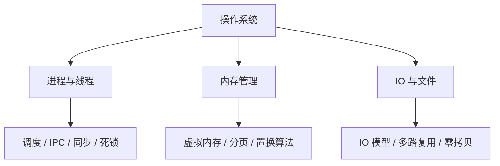
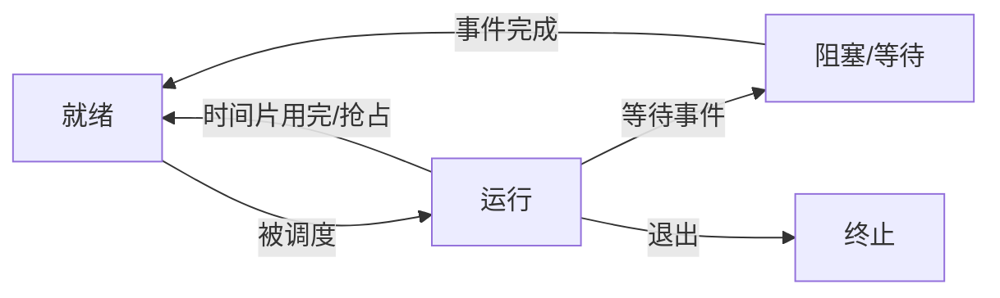
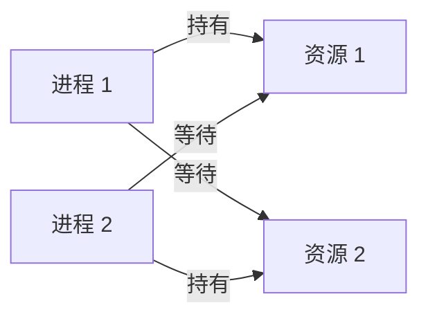
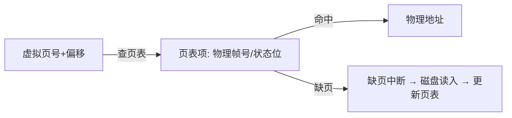

# 操作系统：进程线程、内存管理与 IO 模型

> 这份笔记的目标读者：准备大厂校招的 Java 后端候选人，需要补计算机基础短板。  
> 阅读方式：第一次学习按顺序读第 0~6 章；面试前重点回看第 2、4、6 章；冲刺阶段直接做第 8 章自测题。  
> 配套课程：JVM 的线程与锁、《计算机网络》的 TCP，都和本课的进程线程、IO 模型直接相关；本课只讲操作系统层。  
> 示例命令以常见 Linux 发行版为准；不同发行版输出略有差异。

### 怎么用这份笔记

- **建立模型**：第 1~2 章讲清“进程/线程是什么、怎么被调度”，后续所有并发和 IO 讨论都建立在它上面；
- **面试主线**：第 4 章死锁、第 6 章 IO 模型与 epoll 是大厂高频，要求能画状态图、能说清 select/poll/epoll 差异；
- **落到命令**：第 7 章是 Linux 排查速查，笔试和面试的“线上问题排查”场景直接套用。

## 目录

- [0. 学习地图：操作系统考什么](#0-学习地图操作系统考什么)
- [1. 操作系统基础：内核、系统调用与中断](#1-操作系统基础内核系统调用与中断)
- [2. 进程与线程](#2-进程与线程)
- [3. 进程间通信](#3-进程间通信)
- [4. 同步互斥与死锁](#4-同步互斥与死锁)
- [5. 内存管理](#5-内存管理)
- [6. IO 模型与多路复用](#6-io-模型与多路复用)
- [7. Linux 常用命令与排查](#7-linux-常用命令与排查)
- [8. 高频自测题与参考资料](#8-高频自测题与参考资料)

---

## 0. 学习地图：操作系统考什么

校招把操作系统当“基础能力的试金石”：并发、网络、分布式都能向上追溯到操作系统概念。这一层不过关，谈线程池、epoll、零拷贝都会悬空。

### 0.1 本课程覆盖的高频考点

| 主题 | 大厂高频考点 | 面试权重 |
|---|---|---|
| 基础 | 用户态/内核态、系统调用、中断 | ★★★ |
| 进程线程 | 状态机、调度算法、进程 vs 线程 | ★★★★ |
| IPC | 管道、共享内存、消息队列、信号量 | ★★★ |
| 同步死锁 | 互斥、信号量、死锁四条件与避免 | ★★★★★ |
| 内存 | 虚拟内存、分页、页面置换、TLB | ★★★★ |
| IO | 五种 IO 模型、select/poll/epoll、零拷贝 | ★★★★★ |
| Linux | 常用命令与线上排查 | ★★★★ |

### 0.2 知识体系图



### 0.3 学习方法

1. 每个概念先问“它解决什么问题”（虚拟内存解决内存不够和隔离，分页解决碎片）；
2. 能画图：进程状态机、死锁循环等待、epoll 事件模型；
3. 能举例：把 JVM 线程、Redis 单线程、Netty 模型对应到操作系统概念上。

**考法样板**：考点不能只背“是什么”，要能答“怎么考、答到多深”。例如：

- **死锁**：先答四条件，再答“四条件必要不充分 + 怎么预防/避免/检测 + 银行家算法算例”；
- **虚拟内存**：先答“分页 + 缺页 + TLB”，再答“一次地址翻译要几次内存访问、为什么必须有 TLB、缺页中断完整流程”；
- **IO 模型**：先答五种模型两阶段，再答“select 的 O(n) 花在哪、epoll 为什么 O(1)、Java/Netty 走哪条路”。

### 0.4 边界说明

TCP/IP 与 HTTP 在《计算机网络》课程展开；本课只到操作系统层（IO 模型、进程线程、内存、Linux 命令）。

## 1. 操作系统基础：内核、系统调用与中断

### 1.1 内核与用户态/内核态

- **内核态**：操作系统核心代码运行的特权状态，可执行特权指令、直接访问硬件；
- **用户态**：应用程序运行的状态，不能直接操作硬件；
- 切换原因：系统调用、异常、外设中断。

为什么要分两态：隔离与安全。应用不能随便写磁盘、改页表，必须通过操作系统这个“守门员”。

### 1.2 系统调用

应用请求内核服务的唯一入口：

```text
应用（用户态）→ 系统调用（陷入内核）→ 内核执行 → 返回用户态
```

常见系统调用：文件（open/read/write/close）、进程（fork/exec/wait）、内存（mmap/brk）、网络（socket/connect/send/recv）。

**“陷入内核”的硬件流程**：syscall 指令 → CPU 查 IDT（中断描述符表）找到内核入口 → 切换到内核栈并保存现场（寄存器/用户栈指针）→ 内核执行 → sysret 恢复现场回用户态。**syscall 为什么慢**：权限检查 + 栈切换 + 现场保存恢复 + 缓存/TLB 失效，量级是百纳秒~微秒（普通函数调用是纳秒级）。

### 1.3 中断与异常

| 类型 | 来源 | 例子 |
|---|---|---|
| 外部中断 | 硬件异步通知 | 键盘输入、网卡数据到达 |
| 异常 | CPU 同步产生 | 缺页、除零 |
| 陷阱 | 主动触发 | 系统调用（int 0x80/syscall） |

中断处理要快，通常分上半部（关中断快速响应）与下半部（开中断慢慢处理，如 Linux softirq）。

### 1.4 面试追问

- 问：用户态和内核态的区别？
- 答：特权级别不同；内核态可执行特权指令，用户态必须通过系统调用进入内核态。
- 问：系统调用为什么会慢？
- 答：涉及用户态/内核态切换、参数校验与拷贝，比普通函数调用开销大得多。
- 问：中断和系统调用的区别？
- 答：系统调用是应用主动陷入内核；中断是硬件异步通知。

## 2. 进程与线程

### 2.1 进程与 PCB

进程是**资源分配的最小单位**：代码、数据、堆栈、打开的文件、页表等。每个进程在内核里有一个 **PCB（进程控制块）**，记录 PID、状态、寄存器、内存、文件、优先级等。

进程状态模型：



完整的进程状态还包括：**新建（New）**（PCB 已创建未就绪）与**挂起**（就绪/阻塞挂起：进程换出到磁盘，配合 swap）；此外还有两个高频概念：

- **僵尸进程**：子进程先退出，父进程未调用 `wait/waitpid` 回收，PCB 残留；父进程调用 wait/waitpid 即自行回收，若父进程先退出，则由 init（PID 1）收养并在其子进程退出时回收；
- **孤儿进程**：父进程先退出，子进程被 init（PID 1）收养并负责回收；孤儿与僵尸不是互斥的——孤儿自己退出后，在 init 尚未 wait 的间隙同样会短暂处于僵尸态。

子进程退出时内核会向父进程发 `SIGCHLD` 信号，父进程可选择在信号处理里 wait 回收。

### 2.2 线程

线程是**CPU 调度的最小单位**，同一进程的线程共享地址空间、文件、全局变量，各有独立栈与寄存器。

| 对比项 | 进程 | 线程 |
|---|---|---|
| 资源 | 独立地址空间 | 共享进程地址空间 |
| 切换开销 | 大（切换页表、刷新 TLB） | 小 |
| 通信 | 需要 IPC | 直接共享内存，但要同步 |
| 健壮性 | 一个崩不影响其他 | 一个线程崩溃可能拖垮整个进程 |

**协程/纤程**：用户态调度、比线程更轻（Java 21 虚拟线程就是 JVM 实现的“协程式”线程）。

**线程实现模型**：用户级线程（N:1，内核只看到一个进程）、内核级线程（1:1，一个用户线程对应一个内核线程）、混合模型（N:M）。Java 平台线程是 1:1（每个 Java 线程对应一个内核线程）；Java 21 虚拟线程是 M:N（大量虚拟线程调度到少量载体线程上，与并发课程一致）。

**代价与边界**：N:1 一个线程阻塞系统调用会卡死整个进程；1:1 每个线程占内核栈与实体，线程多时开销大；M:N 实现复杂。虚拟线程的“轻”在堆上栈 + park 让出载体线程，但 JNI 调用或进入 `synchronized` 阻塞仍会 pin 住载体线程——这是它“轻在哪、边界在哪”的完整答案。

### 2.3 调度算法

| 算法 | 思想 | 问题 |
|---|---|---|
| FCFS 先来先服务 | 排队 | 长任务阻塞后续，平均等待长 |
| SJF 短作业优先 | 最短先做 | 需要预知运行时间，长任务饥饿 |
| 时间片轮转 | 轮流执行 | 时间片大小难定 |
| 优先级调度 | 高优先级先跑 | 低优先级饥饿（配合老化解决） |
| 多级反馈队列 | 多队列 + 动态升级降级 | 教材经典算法，与 Linux 无传承（Linux 在 CFS 前用 O(1)/更早 O(n) 调度器） |

现代 Linux 使用 **CFS（完全公平调度）**：按虚拟运行时间保证公平。

**权衡轴**：没有“最好”的调度算法，只有匹配目标的算法——批处理看**吞吐**（SJF 类）、交互看**响应时间**（时间片/优先级类）、实时看 **deadline**（EDF 类）。convoy 效应（convoy effect）：长任务排在短任务前面时，后续所有短任务都要等它，平均等待被拉长，这正是 SJF/时间片轮转要解决的问题。

**CFS 机制**：每个可运行线程维护虚拟运行时间 `vruntime`，它按 **nice 权重**增速——权重高的线程 vruntime 增长慢，因此分到更多 CPU；调度器把线程放进**红黑树**，每次取最左（vruntime 最小）的线程运行；睡眠醒来的线程 vruntime 会被调小（睡眠补偿），避免被饿死。CFS 不需要显式时间片，靠“目标延迟 + 权重”动态换算每次运行时长。

**Java 关联线**：Java 线程优先级映射到操作系统 nice 值，从而影响 vruntime 增速；但 JVM 只把 10 个优先级压缩成少数几个 nice 值，大量线程其实同优先级，所以 `setPriority` 的实际影响远小于想象——真要控制调度，靠线程池并发度而不是优先级。

### 2.4 面试追问

- 问：进程和线程的区别？
- 答：进程是资源分配单位、有独立地址空间；线程是调度单位、共享进程资源，切换更轻。
- 问：上下文切换开销在哪？
- 答：保存/恢复寄存器与程序计数器、切换页表（进程）、TLB 失效、缓存热度下降。
- 问：说说你知道的调度算法？
- 答：FCFS、SJF、时间片轮转、优先级、多级反馈队列；Linux 用 CFS。
- 问：为什么线程切换比进程切换快？
- 答：不需要切换地址空间和页表，只需切换线程栈与寄存器上下文。

## 3. 进程间通信

进程地址空间隔离，通信必须借助内核或共享机制。

### 3.1 常见 IPC 方式

| 方式 | 原理 | 特点 |
|---|---|---|
| 管道 Pipe | 内核缓冲区，一端写一端读 | 单向、字节流、父子进程常用 |
| 命名管道 FIFO | 文件系统上的管道 | 无亲缘关系进程可用 |
| 消息队列 | 内核维护消息链表 | 有类型、按消息读写 |
| 共享内存 | 映射同一块物理内存 | 最快，但需同步 |
| 信号量 | 计数器 + P/V 操作 | 用于同步而非传数据 |
| 信号 Signal | 异步通知 | kill、SIGTERM 等 |
| Socket | 网络协议栈 | 跨主机，最通用 |

### 3.2 选型

- 同机、高频、大数据：共享内存 + 信号量；
- 同机、简单流式：管道；
- 跨主机：Socket；
- 同步控制：信号量、条件变量、锁。

**拷贝次数链与选型三问**：共享内存 0 次拷贝（直接映射物理页）、管道 1 次（内核缓冲区中转）、消息队列 2 次（用户→内核→用户）；共享内存快在“免拷贝 + 免系统调用”，代价是要同步。选型三问：同机还是跨主机？要不要积压缓冲？要强一致吗？

### 3.3 面试追问

- 问：进程间通信有哪些方式？
- 答：管道、消息队列、共享内存、信号量、信号、Socket；共享内存最快但要自己同步。
- 问：共享内存为什么快？
- 答：数据直接映射到双方地址空间，不需要复制到内核再复制回来，一次读写即可。
- 问：管道和消息队列的区别？
- 答：管道是字节流、单向；消息队列按消息单元收发、可带类型。

## 4. 同步互斥与死锁

多线程/多进程访问共享资源时，必须有同步机制；同步设计不好就会死锁。这一章是校招操作系统部分的最高频区。

### 4.1 临界区与同步原语

**临界区**：访问共享资源的代码段，同一时刻只允许一个执行流进入。

| 原语 | 作用 |
|---|---|
| 互斥锁（Mutex） | 一次一个线程进入临界区 |
| 信号量（Semaphore） | 计数器，可控制 N 个资源（P 减、V 加） |
| 自旋锁（Spinlock） | 忙等轮询，不睡眠让出 CPU；适合短临界区/多核场景，与互斥锁“睡不睡”的区别对应 synchronized 锁升级 |
| 读写锁 | 读读共享、读写/写写互斥 |
| 条件变量 | 等待某个条件满足再继续（常与互斥锁配合） |

**条件变量机制**：`wait` 必须持锁调用，且原子地“释放锁 + 挂起”，被唤醒后要先重新抢锁再继续；要用 `while(条件)` 而不是 `if` 防虚假唤醒；`notify` 只随机唤醒一个等待者、可能唤醒同类（如唤醒生产者），必要时用 `notifyAll`。Java 的 wait/notify 就是这套语义。

**与 synchronized 锁升级对照**：无锁/偏向/轻量级全程用户态（CAS 改 Mark Word），重量级才走 OS 的 futex（两次内核往返）；JDK 15 起偏向锁默认禁用（JEP 374），反向自检“为什么禁”——撤销偏向锁要安全点 STW，收益被高并发稀释。

```text
生产者-消费者（信号量版本）：
empty 信号量 = 缓冲区容量，full 信号量 = 0
生产者：P(empty) → 放数据 → V(full)
消费者：P(full) → 取数据 → V(empty)
```

经典同步问题的结论：

- **读者-写者问题**：读读可并行、读写互斥，本质就是读写锁；读者优先可能让写者饥饿，写者优先反之；
- **哲学家就餐**：防止死锁的常用解法是“编号取叉”（所有人先拿小号叉，破坏循环等待）或“一次拿两把叉”（拿不到第二把就都放下，破坏“持有并等待”）。

### 4.2 死锁的四个必要条件

1. **互斥**：资源同一时刻只能被一个进程占用；
2. **持有并等待**：占着一个资源的同时等另一个；
3. **不可剥夺**：资源只能主动释放；
4. **循环等待**：A 等 B、B 等 A 形成环。

**四条件必要不充分**：满足四条件未必死锁，还要有真正互等的时序。写两个线程互相持有对方要的锁即可复现，`jstack` 会输出 `Found one Java-level deadlock`，按“等待的锁 → 持有者线程 → 它又在等谁”的环定位；排查顺序：先 jstack 找环，再统一加锁顺序。



### 4.3 死锁的预防、避免与检测

| 策略 | 做法 |
|---|---|
| 预防 | 破坏四个必要条件之一：资源一次性申请（破坏持有等待）、按序申请（破坏循环等待）、可抢占（破坏不可剥夺） |
| 避免 | 银行家算法：分配前判断是否处于安全状态 |
| 检测与恢复 | 资源分配图检测环；终止进程或剥夺资源 |

银行家算法一句话：每次分配前模拟“按最坏情况能否让所有进程完成”，能则安全分配，否则拒绝。

**完整机制**：系统维护四张表——`Available`（每种资源剩余）、`Max`（每个进程的最大需求）、`Allocation`（已分配）、`Need = Max - Allocation`（还缺多少）。分配前先做**安全性检查**：

```text
1. 找一个 Need ≤ Available 的未完成进程；
2. 假设分配给它并等它运行完，回收 Allocation，Available 变大；
3. 重复直到所有进程都能完成 → 存在安全序列，状态安全，允许分配；
   找不到任何可满足的进程 → 不安全，拒绝本次分配。
```

**3 进程算例**：资源 R 共 10 个，P0（Allocation=3，Need=4）、P1（Allocation=2，Need=3）、P2（Allocation=2，Need=6），则 Available = 10 − 3 − 2 − 2 = 3。安全性检查：P1（Need 3 ≤ 3）先完成 → Available = 3+2 = 5；再 P0（4 ≤ 5）完成 → Available = 8；最后 P2（6 ≤ 8）完成。存在安全序列 P1 → P0 → P2，当前状态安全，可以分配。

**为什么现代 OS 不做“避免”**：银行家算法要求进程**预申报最大需求**（现实业务做不到）、检查是 O(n²·m) 量级、且提前拒绝分配会浪费资源。Linux 实际是“鸵鸟策略 + 检测恢复”：平时不预防，死锁了靠超时/重启/资源分配图检测处理。

### 4.4 面试追问

- 问：死锁的四个必要条件？
- 答：互斥、持有并等待、不可剥夺、循环等待，缺一不可。
- 问：怎么预防死锁？
- 答：工程上最常用的是统一资源申请顺序（破坏循环等待）；tryLock 超时属于检测-恢复思路的工程折中——等待时仍在持有并等待，超时后释放已持锁才打破僵局。
- 问：银行家算法是什么？
- 答：资源分配前检查是否存在安全序列，避免系统进入不安全状态。
- 问：信号量和互斥锁的区别？
- 答：互斥锁语义是“一个”；信号量是“最多 N 个”，可做资源计数与同步。

## 5. 内存管理

内存管理回答三个问题：怎么隔离、怎么装得下、怎么换得快。

### 5.1 虚拟内存

每个进程拥有独立的虚拟地址空间，由 MMU（内存管理单元）把虚拟地址映射到物理内存：

```text
虚拟地址 → 页表 → 物理地址
```

好处：

- **隔离**：进程之间互相看不到对方内存；
- **按需加载**：只有用到的页才装入物理内存；
- **超量使用**：物理内存不够时用磁盘交换（swap）；
- **共享**：同一份代码/库映射到多个进程。

进程虚拟地址空间自低到高：**text（代码）→ data/BSS（数据）→ heap（brk + mmap）→ 栈（向低地址增长）**；JVM 的堆对应 heap 区，虚拟机栈对应进程栈。

### 5.2 分页与分段

| 方式 | 划分 | 优点 | 缺点 |
|---|---|---|---|
| 分页 | 固定大小页（如 4KB） | 无外部碎片、便于换入换出 | 有内部碎片、物理帧不连续（虚拟地址仍线性，只是不保留程序逻辑结构） |
| 分段 | 按逻辑段（代码/数据/栈） | 符合程序逻辑、便于共享保护 | 有外部碎片 |

现代系统通常**分页**为主，段页式结合（x86 的段页式实践中主要用分页）。

**写时复制（COW）**：fork 时父子进程共享只读物理页，任一进程写入时触发**缺页中断/访问位检测**，才复制该页并改为可写；大幅降低 fork 开销，Redis BGSAVE、JVM fork 都依赖它。



### 5.3 TLB 与局部性

- **TLB（快表）**：页表的硬件缓存，命中则免去一次内存访问；
- **局部性**：时间局部性（刚访问的地址很快再访问）+ 空间局部性（附近地址会被访问），这是缓存和置换算法有效的前提。

**地址翻译的因果链**：单级页表下，一次取数据 = 访问内存 1 次 + 查页表 1 次 = **2 次内存访问**；多级页表让页表本身可以按需换入，但翻译路径更长——x86-64 四级页表一次翻译约 **4~5 次内存访问**（TLB 命中则回到 1 次）。翻译比取数本身还贵，所以必须有 TLB：命中时免去查页表，一次访问回到 1 次内存操作。

**缺页中断 6 步**：MMU 查 PTE 发现有效位为 0 → CPU 触发缺页异常 → 内核检查该地址是否在进程的 VMA（虚拟内存区域）内（非法地址直接段错误）→ 从磁盘读入页帧 → 更新 PTE 并置有效位 → 重新执行触发缺页的指令。

**JVM 与 swap 的灾难场景**：GC 要扫描并移动堆对象，一旦对象所在页被换到磁盘，扫描/移动会触发大量换入，GC 时间从毫秒级涨到秒级甚至分钟级（抖动）。生产上建议关闭 swap 或把 `vm.swappiness` 设为很低，宁可 OOM 快速失败重启，也不要让 GC 被 swap 拖垮。

### 5.4 页面置换算法

| 算法 | 思想 | 问题 |
|---|---|---|
| FIFO | 先进入的先换出 | 可能触发 Belady 异常 |
| LRU | 最久未使用先换出 | 需要记录访问历史，硬件成本高 |
| Clock（时钟） | 近似 LRU，环形链表 + 访问位 | 实现简单，性能接近 LRU |
| LFU | 使用次数最少先换出 | 新页容易被误换 |
| OPT（最优置换） | 换出未来最久不用的页 | 理论最优、不可实现，作为基准 |

**Belady 异常**：页框增加、缺页反而增多，只可能发生在 FIFO 这类算法；LRU/OPT 不会。

**可数算例**：引用串 1,2,3,4,1,2,5,1,2,3,4,5——FIFO 3 框 9 次缺页、4 框 10 次缺页，缺页随页框增加而变多，就是 Belady 的可数演示。Linux 实际用 active/inactive 双链表近似 LRU，靠访问位标记热页。

### 5.5 内存分配方式（简述）

- 连续分配的历史背景：首次适配/最佳适配/最差适配三种放置策略与外部碎片问题，伙伴系统正是为解决外部碎片而生；
- **伙伴系统**：按 2 的幂拆分/合并块，减少外部碎片，Linux 页分配器；
- **slab**：为常用对象（如 PCB）建立对象缓存，避免频繁创建/销毁。

### 5.6 面试追问

- 问：虚拟内存解决什么问题？
- 答：隔离、按需加载、支持超过物理内存的程序、共享代码。
- 问：分页和分段的区别？
- 答：分页固定大小无外部碎片；分段按逻辑划分便于共享但易碎片。
- 问：缺页中断是什么？
- 答：访问的页不在内存时触发，从磁盘载入并更新页表，可能触发页面置换。
- 问：为什么 LRU 不常用在硬件实现？
- 答：需要记录精确访问历史，开销大；实际多用近似算法（Clock）。

## 6. IO 模型与多路复用

IO 模型决定高并发服务的骨架，是校招网络/分布式面试的前置必考。Java 的 BIO/NIO/AIO（并发课程）底层就是这里的模型。

### 6.1 五种 IO 模型

一次读操作分两阶段：**等待数据就绪** + **从内核拷贝到用户空间**。按这两个阶段的处理方式划分：

| 模型 | 等待阶段 | 拷贝阶段 | 特点 |
|---|---|---|---|
| 阻塞 IO | 阻塞 | 阻塞 | 简单，每连接一线程 |
| 非阻塞 IO | 轮询（不阻塞） | 阻塞 | 忙等浪费 CPU |
| IO 多路复用 | select/poll/epoll 统一等 | 阻塞 | 一个线程管多连接 |
| 信号驱动 IO | 信号通知 | 阻塞 | 使用少 |
| 异步 IO（AIO） | 不阻塞 | 内核完成并回调 | 真正的异步 |

**逐模型解读**：阻塞 = 谁在等？线程在等数据；等什么？内核缓冲区；耗什么？线程。多路复用 = 一个线程等所有 fd，等的是“就绪事件”，把“等”集中起来。**信号驱动 vs 异步的区别**：信号驱动是“就绪后发信号，拷贝还要自己来”；异步是“内核连拷贝一起做完再回调”。Java 里 Selector 封装多路复用、Netty 走 NIO 而非 AIO（Linux AIO 对文件/网络支持有限）；选型口诀：高并发网络服务用 NIO（epoll），不用阻塞每连接一线程。

### 6.2 select、poll、epoll 对比

| 对比项 | select | poll | epoll（Linux） |
|---|---|---|---|
| 连接数上限 | 1024（FD_SETSIZE） | 无上限 | 无上限 |
| 扫描方式 | 每次全量扫描 | 每次全量扫描 | 事件驱动，只返回就绪事件 |
| 用户态拷贝 | 每次拷贝 fd 集合 | 每次拷贝 | 注册时拷贝一次 fd 集合；epoll_wait 仍把就绪事件拷回用户态 |
| 触发模式 | 仅水平触发 | 仅水平触发 | 水平 + 边缘触发 |
| 性能 | 连接越多越慢 | 同 select | 海量连接少量活跃时最优 |

**水平触发（LT）**：只要缓冲区还有数据就持续通知；**边缘触发（ET）**：只在状态变化（从无到有）时通知一次——剩余数据仍在内核，只是不再触发新事件，需循环读到 EAGAIN，否则会漏读。ET 效率更高但容易踩坑。

```text
epoll 三步：
epoll_create 创建实例
epoll_ctl 注册感兴趣的 fd 和事件
epoll_wait 等待就绪事件，只返回就绪集合
```

epoll 内部：内核用**红黑树**管理注册的 fd，用**就绪链表**记录有事件的 fd；事件包括 `EPOLLIN`（可读）、`EPOLLOUT`（可写）、`EPOLLERR`（错误）、`EPOLLET`（边缘触发）。多线程同时 epoll_wait 同一实例会有惊群，可用 `EPOLLEXCLUSIVE` 只唤醒一个。

这就是 Nginx、Netty、Redis 高并发的底层基础。

**复杂度对比**：select/poll 每次全量拷贝 + 扫描（O(全体 fd)）；epoll 注册一次（O(1)）、取就绪事件 O(就绪数 k)。ET 读循环伪码：`while (read(fd, buf, len) > 0) 处理; 直到返回 EAGAIN 再退出`。Java NIO 的 EPollArrayWrapper 是 epoll 的封装；Netty 曾踩过“空轮询 bug”（fd 无事件却不断 wakeup），用计数器规避。

Nginx 模型：master 进程管理配置与 worker，每个 worker 一个独立 epoll 实例，多进程多路复用分担连接。

### 6.3 零拷贝

传统 read+write 传输文件：

```text
磁盘 → 内核缓冲区（DMA）→ 用户缓冲区（CPU）→ Socket 缓冲区（CPU）→ 网卡（DMA）
```

完整账目：传统 read+write 是 **4 次上下文切换 + 4 次拷贝（2 次 CPU + 2 次 DMA）**。零拷贝减少“内核 ↔ 用户”之间的 CPU 拷贝：

| 技术 | 效果 |
|---|---|
| mmap | 4 次上下文切换 + 3 次拷贝（省 1 次 CPU 拷贝） |
| sendfile | 2 次上下文切换；网卡支持 SG-DMA 时 0 次 CPU 拷贝 |
| Java FileChannel.transferTo | 底层调用 sendfile |

**省的是哪一次**：read+write 的 4 次拷贝里，2 次 CPU 拷贝发生在“内核↔用户”之间，零拷贝省的就是这两次（mmap 省 1 次、sendfile+SG-DMA 省 2 次）。**sendfile 的局限**：内核内直传，无法在传输中加工数据（如加 HTTP 头、改内容）；要加工就用 mmap 或 DirectBuffer + 手动写。

### 6.4 面试追问

- 问：五种 IO 模型？
- 答：阻塞、非阻塞、多路复用、信号驱动、异步；Java 对应 BIO/NIO/AIO。
- 问：select/poll/epoll 区别？
- 答：select 有 1024 上限且全量扫描；poll 无上限仍全量扫描；epoll 事件驱动只返回就绪事件。
- 问：水平触发和边缘触发？
- 答：LT 有数据就一直通知，ET 只在状态变化时通知一次、要读完，否则丢事件。
- 问：什么是零拷贝？
- 答：减少内核与用户态之间的 CPU 拷贝；sendfile/mmap，Java 用 transferTo。

## 7. Linux 常用命令与排查

校招笔试和面试常让“口述线上排查”，会背命令组合就是加分项。

### 7.1 高频命令速查

| 分类 | 命令 | 用途 |
|---|---|---|
| 进程 | `ps -ef`、`top`、`kill -9` | 查看/终止进程 |
| 线程 | `top -H -p <pid>`、`jstack` | 看线程与堆栈 |
| 网络 | `netstat -tunlp`、`ss -tulnp` | 端口与连接（-p 显示进程） |
| 文件 | `ls -lh`、`du -sh *`、`df -h` | 文件/目录/磁盘 |
| 内存 | `free -h` | 内存使用 |
| 文本 | `grep`、`awk`、`sed`、`sort`、`uniq -c` | 日志处理 |
| 请求 | `curl -v`、`telnet`、`nc` | 接口与连通性 |
| 系统 | `uname -a`、`lscpu`、`ulimit -a` | 系统信息与限制 |
| 系统状态 | `vmstat`、`iostat -x`、`uptime` | CPU/IO/负载 |
| 日志 | `tail -f`、`less` | 跟踪日志 |
| 权限 | `chmod`、`chown` | 文件权限 |

补充说明：

- **load average 与 CPU 使用率不同**：load 是“运行中 + 不可中断”任务数的滑动平均，1.0 表示满载一个核；CPU 使用率是采样时刻的占用百分比；
- `vmstat` 的 r（运行队列）、b（阻塞）、cs（上下文切换）列看系统压力；`iostat -x` 的 `%util` 看磁盘是否饱和；`top` 的 `wa` 列是等待 IO 的时间占比；
- `lsof -i:8080` 按端口查进程；`strace -p <pid>` 跟踪系统调用，定位卡住的原因。

**真实输出判断**：top 看 us（用户态）/sy（内核态）/wa（等待 IO）——us 高=业务代码热点、sy 高=系统调用/锁竞争、wa 高=磁盘瓶颈；free 要**看过 available 而不是 used**（used 会把 page cache 算进去，容易误判内存满）；jstack 三种读法：`WAITING (parking)`=锁/条件等待、`RUNNABLE` 且栈顶在 native=在等 IO 或锁、GC 线程=正在 GC。

### 7.2 典型排查组合

```bash
# CPU 高的线程
top -H -p <pid>                     # 找到 CPU 最高的线程号
printf '%x\n' <tid>                 # 转十六进制
jstack <pid> | grep -A 30 'nid=0x<hex>'   # 看该线程在干什么

# 端口占用
netstat -tunlp | grep 8080          # 或 ss -tulnp | grep 8080（-p 需要权限才能看到他人进程）

# 磁盘满
df -h
du -sh /var/log/* | sort -hr | head

# 日志统计
grep 'ERROR' app.log | awk '{print $1}' | sort | uniq -c | sort -rn | head

# 接口连通性
curl -v http://localhost:8080/health
```

### 7.3 文件权限速记

`rwx` = 读(4) 写(2) 执行(1)；`chmod 755` = 属主 rwx、组 r-x、其他 r-x；`chmod +x` 加执行权限。

### 7.4 面试追问

- 问：线上 CPU 100% 怎么排查？
- 答：top 找进程 → top -H 找线程 → 线程号转十六进制 → jstack 对 nid 定位代码行。
- 问：端口被占用怎么查？
- 答：netstat -tunlp 或 ss -tulnp 找到 PID，再决定杀进程或换端口。
- 问：日志里统计某个错误出现次数？
- 答：grep 过滤 + awk 取字段 + sort + uniq -c + sort -rn。

## 8. 高频自测题与参考资料

### 8.1 分主题自测

本页把全书高频考点压缩成分主题自测题：先盖住“一句话要点”尝试作答，再对照检查；能一次答对八成以上，就可以进入下一门课《计算机网络》。

| 主题 | 问题 | 一句话要点 |
|---|---|---|
| 基础 | 用户态和内核态 | 特权级别不同，应用通过系统调用进内核 |
| 基础 | 系统调用为什么慢 | 状态切换 + 参数校验拷贝 |
| 进程 | 进程 vs 线程 | 资源分配单位 vs 调度单位 |
| 进程 | 进程状态 | 就绪/运行/阻塞/终止 |
| 进程 | 调度算法 | FCFS/SJF/轮转/优先级/多级反馈/CFS |
| 进程 | 线程切换为什么快 | 不换页表，只换寄存器与栈 |
| IPC | 进程间通信方式 | 管道/消息队列/共享内存/信号量/信号/Socket |
| IPC | 共享内存为什么快 | 免去内核复制，但要同步 |
| 同步 | 死锁四条件 | 互斥/持有等待/不可剥夺/循环等待 |
| 同步 | 预防死锁 | 按序申请、一次性申请、tryLock |
| 同步 | 银行家算法 | 分配前检查安全序列 |
| 同步 | 信号量 vs 互斥锁 | N 个资源 vs 一个 |
| 内存 | 虚拟内存好处 | 隔离/按需加载/超量使用/共享 |
| 内存 | 分页 vs 分段 | 固定大小无外部碎片 vs 逻辑分段 |
| 内存 | 缺页中断 | 页不在内存，从磁盘载入 |
| 内存 | 页面置换算法 | FIFO/LRU/Clock/LFU |
| 内存 | TLB | 页表缓存，命中免内存访问 |
| IO | 五种 IO 模型 | 阻塞/非阻塞/多路复用/信号驱动/异步 |
| IO | select 上限 | 1024 |
| IO | epoll 为什么快 | 事件驱动，只处理就绪事件 |
| IO | LT vs ET | LT 一直通知，ET 变化通知一次 |
| IO | 零拷贝 | mmap/sendfile 减少 CPU 拷贝 |
| Linux | 查端口占用 | netstat -tunlp / ss -tulnp |
| Linux | 查 CPU 高的线程 | top -H + jstack 对 nid |
| Linux | 看磁盘空间 | df -h / du -sh |

### 8.2 追问型自测（只给提示不给答案）

下面 5 题是“答对一句话后还会被追问”的升级题：先按提示口头作答，再回对应章节对答案。

1. 僵尸进程为什么必须先 wait 再退出？（提示：父进程 wait/waitpid 自行回收；只有父先退出才由 init 收养）
2. 自旋锁什么时候比互斥锁更合适？（提示：临界区长度、是否多核、睡眠唤醒的上下文切换代价）
3. 零拷贝“省的是哪一次拷贝”？（提示：read+write 共 4 次拷贝含 2 次 CPU 拷贝；sendfile 配合 SG-DMA 时 CPU 拷贝为 0）
4. 一次缺页中断的完整流程？（提示：MMU 查 PTE → 缺页异常 → VMA 合法性 → 磁盘 IO → 更新 PTE → 重执行指令）
5. epoll 的 O(1) 体现在哪？（提示：select 每次全量拷贝+扫描；epoll 注册一次、就绪链表取 O(k)）

### 8.3 考前 30 分钟速记

> 速记是开场白不是完整答案：一句话立住骨架后，还要能展开三层——机制（怎么实现）、为什么（设计动机）、边界（失效/代价/变体）。

- 一句话回答“进程 vs 线程”：资源分配单位 vs 调度单位，线程共享进程地址空间；
- 一句话回答“死锁”：互斥、持有等待、不可剥夺、循环等待，按序申请最实用；
- 一句话回答“虚拟内存”：隔离 + 按需加载 + 超量使用，页表负责映射；
- 一句话回答“IO 模型”：阻塞每连接一线程，多路复用一线程多连接，异步内核回调；
- 一句话回答“epoll”：事件驱动，只返回就绪事件，LT/ET 两种触发；
- 一句话回答“零拷贝”：数据少进出用户态，sendfile 内核内直传。

### 8.4 参考资料

- [JavaGuide：操作系统常见面试题](https://javaguide.cn/cs-basics/operating-system/operating-system-basic-questions-01.html)
- [JavaGuide：IO 多路复用详解](https://javaguide.cn/cs-basics/operating-system/io-multiplexing.html)
- 《深入理解计算机系统（CSAPP）》第 8/9/12 章
- 《现代操作系统》（Tanenbaum）
- [Linux 手册页](https://man7.org/linux/man-pages/)

> 学习闭环：第 0~7 章读完、自测题能答 80% 后，进入下一门课《计算机网络》，把 TCP 握手挥手、HTTP 与这里的 IO 模型和 Socket 串起来。
