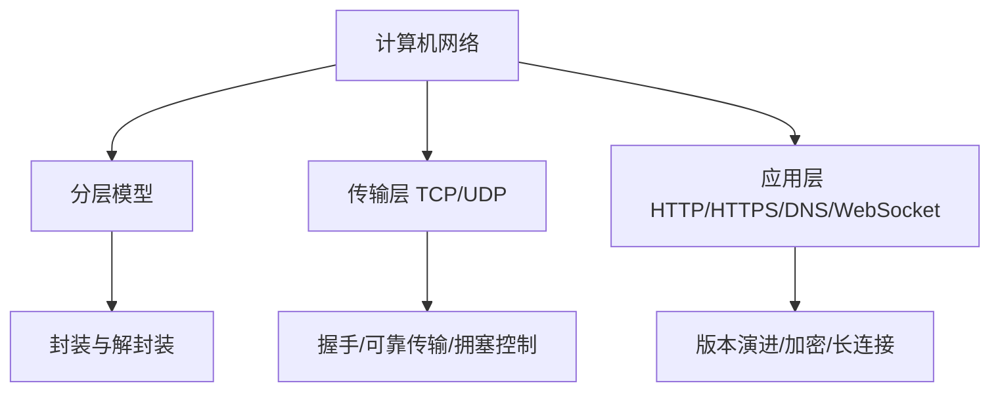
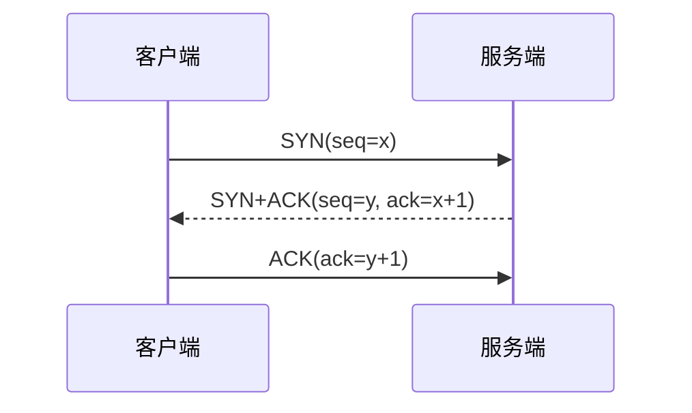
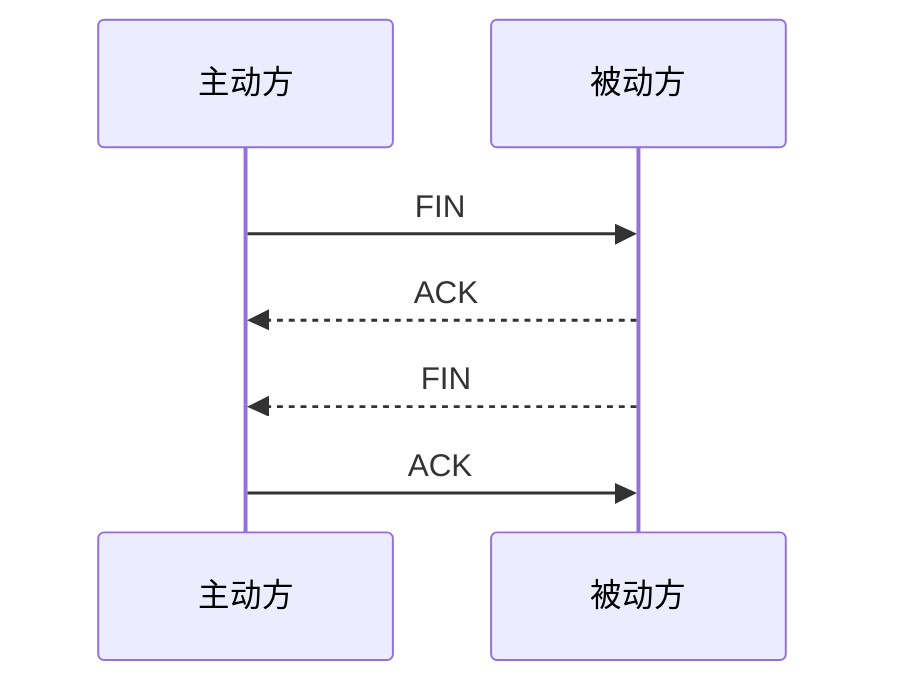

# 计算机网络：TCP/IP、HTTP 与 WebSocket

> 这份笔记的目标读者：准备大厂校招的 Java 后端候选人，需要系统补计算机网络基础。  
> 阅读方式：第一次学习按顺序读第 0~4 章；面试前重点回看第 2、3 章；冲刺阶段直接做第 5 章自测题。  
> 配套课程：操作系统课程的 IO 模型与 Socket 是本章 TCP 的底层；Java 核心课程的 BIO/NIO 是它的代码实现。  
> 概念以常见面试口径为准，协议细节以 RFC 为准。

### 怎么用这份笔记

- **分层理解**：第 1 章建立“分层 + 封装”的思维，后面所有协议都能放到对应层；
- **背流程但更要懂为什么**：三次握手、四次挥手、拥塞控制既要能画，也要能解释每个字段/状态的意义；
- **结合项目**：HTTPS 握手、WebSocket 长连接、DNS 解析是“项目里用过吗”的加分素材。

## 目录

- [0. 学习地图：计算机网络考什么](#0-学习地图计算机网络考什么)
- [1. 网络分层与 IP 基础](#1-网络分层与-ip-基础)
- [2. TCP 与 UDP](#2-tcp-与-udp)
- [3. HTTP、HTTPS 与状态管理](#3-httphttps-与状态管理)
- [4. DNS 与 WebSocket](#4-dns-与-websocket)
- [5. 高频自测题与参考资料](#5-高频自测题与参考资料)

---

## 0. 学习地图：计算机网络考什么

网络是后端面试的“必考基础”：TCP 握手、HTTP 状态码、HTTPS 加密、DNS、WebSocket 几乎场场出现，而且经常和项目结合深挖。

### 0.1 本课程覆盖的高频考点

| 主题 | 大厂高频考点 | 面试权重 |
|---|---|---|
| 分层 | OSI 七层、TCP/IP 四层、封装解封装 | ★★★ |
| IP 基础 | IP 地址、子网掩码、ARP、路由 | ★★★ |
| TCP | 三次握手、四次挥手、TIME_WAIT、可靠传输、流量控制、拥塞控制 | ★★★★★ |
| UDP | 特点与适用场景、与 TCP 对比 | ★★★ |
| HTTP | 方法、状态码、版本演进、Cookie/Session/Token | ★★★★★ |
| HTTPS | TLS 握手、对称/非对称加密、证书 | ★★★★ |
| DNS | 解析流程、递归/迭代、缓存、HTTPDNS | ★★★ |
| WebSocket | 与 HTTP 关系、握手、心跳、适用场景 | ★★★ |

### 0.2 知识体系图



### 0.3 学习方法

1. **从分层切入**：任何协议先问“在第几层、解决什么问题”；
2. **画时序图**：三次握手、四次挥手、HTTPS 握手必须能手画；
3. **每章 5 分钟实验**：nc + curl -v 看三次握手、tcpdump 看 S/S./. 标记、curl -i 看 304 头——亲眼看一次比背十遍管用。

**考法样板**：考点不能只背“是什么”，要能答“怎么考、答到多深”。例如：

- **TCP 可靠**：先答“序列号 + ACK + 重传 + 滑动窗口”，再答“为什么是 3 个重复 ACK、RTO 怎么动态估计、超时重传与快重传的区别”；
- **HTTP 缓存**：先答强缓存/协商缓存，再答“两者优先级、304 省的是什么、上线看不到新版本怎么排查”；
- **HTTPS**：先答“证书 + 非对称换对称”，再答“RSA 与 ECDHE 两条密钥交换路径、前向保密为什么、TLS 1.3 少了哪一步”。

## 1. 网络分层与 IP 基础

### 1.1 OSI 七层与 TCP/IP 四层

| OSI 七层 | TCP/IP 四层 | 代表协议 | 典型设备 |
|---|---|---|---|
| 应用层 | 应用层 | HTTP/HTTPS/DNS/FTP/WebSocket | 网关 |
| 表示层 | 应用层 | TLS/SSL、编码 | — |
| 会话层 | 应用层 | 连接管理 | — |
| 传输层 | 传输层 | TCP/UDP | 防火墙 |
| 网络层 | 网络层 | IP/ICMP/ARP/路由协议 | 路由器 |
| 数据链路层 | 网络接口层 | 以太网、MAC、VLAN | 交换机 |
| 物理层 | 网络接口层 | 网线、光缆、无线 | 集线器/网卡 |

### 1.2 封装与解封装

```text
发送：应用数据 → TCP 头 → IP 头 → 以太网帧头 → 比特流
接收：逐层去掉头部还原数据
```

每层只处理自己的头，下层对上层透明。

### 1.3 IP 地址与子网

- IPv4 32 位，点分十进制；IPv6 128 位；
- 地址 = 网络号 + 主机号，子网掩码决定分界：`192.168.1.0/24` 表示前 24 位是网络号；
- 私有地址：`10.0.0.0/8`、`172.16.0.0/12`、`192.168.0.0/16`；回环 `127.0.0.1`；
- CIDR 记法：`/24`、`/16`；路由按最长前缀匹配。

### 1.4 ARP 与路由

- **ARP**：根据 IP 查 MAC（广播请求、单播应答），有缓存；
- **路由**：路由器查路由表，决定下一跳；跨网段通信必须经路由器，本网段通信用 MAC 直连。

口径说明：ARP 严格属于数据链路层，TCP/IP 模型常按网络层讲解，两种口径面试都认可，说清层级即可。

**NAT/NAPT 与内网穿透**：内网私有 IP 通过网关映射成公网 IP（+端口）访问外网；需要被外网访问时用 STUN/TURN 打洞或中转。**负载均衡**：四层（LVS，转发 TCP/UDP）vs 七层（Nginx，内容路由、TLS 终结、缓存压缩）。

**中间设备拆到哪一层**：交换机只拆到 L2（MAC），路由器拆到 L3（IP），不关心 TCP 端口；LVS 四层转发也不看应用内容。**子网算例**：192.168.1.66/26 → 网络 192.168.1.64、可用主机 .65~.126、广播 .127；掩码不一致会导致单向通信故障。**ARP 跨网段**：跨网段不发广播找对端 MAC，而是找网关 MAC，把帧交给网关转发。

### 1.5 面试追问

- 问：OSI 七层和 TCP/IP 四层对应关系？
- 答：应用/表示/会话并入应用层，链路层与物理层并成网络接口层。
- 问：ARP 是做什么的？
- 答：把 IP 解析成 MAC 地址，数据链路层转发需要 MAC。
- 问：子网掩码的作用？
- 答：区分网络号和主机号，决定哪些主机在同一网段可直接通信。

## 2. TCP 与 UDP

传输层是面试主战场，TCP 的每个机制都值得深挖。

### 2.1 TCP vs UDP

| 对比项 | TCP | UDP |
|---|---|---|
| 连接 | 面向连接（三次握手） | 无连接 |
| 可靠性 | 可靠：确认、重传、排序 | 不可靠：尽力而为 |
| 有序性 | 保证 | 不保证 |
| 流量/拥塞控制 | 有 | 无 |
| 首部 | 20 字节起 | 8 字节 |
| 应用 | HTTP/HTTPS、MySQL、Redis 主从 | DNS、视频通话、游戏、QUIC 底层 |

报文头：TCP 头最小 20 字节（源/目的端口各 2、序号 4、确认号 4、数据偏移与标志位、窗口 2、校验和 2、紧急指针 2，选项最多可到 60 字节）；UDP 头固定 8 字节（源/目的端口、长度、校验和）。

### 2.2 三次握手



为什么是三次：确认双方“收发能力”都正常，并同步初始序列号；两次不够（服务端无法确认自己的 SYN 客户端收到了），四次多余。

**四个高频追问点**：

- **为什么 ISN 要随机**：初始序列号随机化（RFC 1948）防止序列号预测攻击，也让新旧连接的报文不容易混淆；
- **第三次 ACK 丢了会怎样**：服务端没收到 ACK 会重发 SYN+ACK，客户端收到后忽略（连接已建立）；不会因此断开；
- **为什么前两次不能带数据、第三次可以**：前两次还没确认对方收发能力，带数据会被对方当垃圾处理；第三次握手时双方能力已确认，可以捎带数据（快路径）；
- **与半连接队列的闭环**：第一次握手只进半连接队列（syn queue），第三次握手完成才进全连接队列（accept queue）；攻击者只发 SYN 不回应 ACK 就能占满 syn queue，这就是 SYN Flood，防御用 `tcp_syncookies`（不依赖队列也能完成握手）。

### 2.3 四次挥手



- 第一次 FIN 表示“我发完了”，ACK 表示“收到你的关闭请求”；
- 第二次 FIN 表示“我也发完了”，因为 TCP 全双工，两边要各自关闭；
- 主动关闭方最后进入 **TIME_WAIT（2MSL）**：保证最后一个 ACK 送达、让旧连接的报文在网络中消亡，避免干扰新连接；MSL 口径：RFC 793 建议 2 分钟、Linux 约 60 秒，“2MSL=120s”只是常见面试口径，重点是上述两个作用；
- 大量 TIME_WAIT 常见于服务端主动关闭连接的场景，常规做法是让客户端先断开、避免服务端频繁主动 close；`tcp_tw_reuse` 只对**主动发起连接的一方**复用 TIME_WAIT 生效，不能解决服务端被动侧的堆积（`tcp_tw_recycle` 已随 Linux 4.12 移除，不要作为方案）。

**状态转换**：握手侧 CLOSED→SYN_SENT→ESTABLISHED，服务端 LISTEN→SYN_RCVD→ESTABLISHED；挥手侧主动方 FIN_WAIT_1→FIN_WAIT_2→TIME_WAIT，被动方 CLOSE_WAIT→LAST_ACK→CLOSED。排查要点：CLOSE_WAIT 堆积=应用漏 close()；FIN_WAIT_2 长时间停留可看 `tcp_fin_timeout`；LAST_ACK 不消失通常是最后一个 ACK 丢失。

**半连接/全连接队列**：收到 SYN 未完成握手进半连接队列（syn queue，`tcp_max_syn_backlog`）；握手完成待应用 accept 进全连接队列（accept queue = min(backlog, `somaxconn`)）。队列满的表现是丢 SYN 或连接被 reset；SYN Flood 可用 `tcp_syncookies` 缓解；Java/Netty 的 `bind(port, backlog)` 就对应 backlog 参数。

<!--demo:TCP握手挥手可视化.html-->

### 2.4 可靠传输：确认与重传

- 每个段有序列号，接收方回 ACK；
- 超时重传（RTO 动态估计）、快速重传（连续收到 3 个重复 ACK 立即重传，不等超时）；
- **滑动窗口**：发送方窗口内可连续发多个段，不必等一个 ACK 发一个，提升吞吐。
- **SACK**（RFC 2018，Linux 默认开启）：快速重传一次只恢复一个丢失段；SACK 通告乱序块，让发送方只补缺失的段。

**TCP Keep-Alive vs 业务心跳**：`SO_KEEPALIVE` 默认约 2 小时才探测（`tcp_keepalive_time` 7200s），只能发现对端不可达、探测不到假死；业务心跳（WebSocket ping/pong、应用层定时包）更快可控，是生产首选。

**RTO 怎么估与“为什么是 3 个重复 ACK”**：Karn 算法先排除重传段的 RTT 采样，再用 Jacobson 公式（SRTT 平滑 + RTTVAR 方差，RTO ≈ SRTT + 4×RTTVAR），重传后 RTO 指数退避；3 个重复 ACK 而不是 1 个，是因为乱序也会产生重复 ACK，连续 3 个才大概率说明真的丢了。**假死机理**：协议栈活着能回 ACK，TCP 层无感知，应用假死必须靠心跳。

### 2.5 流量控制与拥塞控制

**流量控制**：端到端，接收方通过窗口大小告诉发送方“你还能发多少”，防止发送过快淹没接收方。

**拥塞控制**：网络全局，发送方自适应调整 cwnd（拥塞窗口），四个算法：

| 算法 | 行为 |
|---|---|
| 慢启动 | cwnd 从 1 指数增长，到 ssthresh 转拥塞避免 |
| 拥塞避免 | cwnd 线性增长 |
| 快重传 | 收到 3 个重复 ACK 立即重传丢失段 |
| 快恢复 | 快重传后 cwnd 减半而非归零，继续线性增长 |

补充：

- **实际发送窗口 = min(cwnd, rwnd)**：拥塞窗口与接收窗口取小者；
- 丢包处理分两种：**超时重传** → cwnd 重置回 1（慢启动重来）；**快速重传/快恢复** → cwnd 减半（ssthresh = cwnd/2），不是所有丢包都减半；
- 初始窗口：教科书是 1 个 MSS，现代实现（RFC 6928 / Linux 默认）可达 10 个 MSS。

**信号集（什么时候做什么）**：RTO 超时 = 严重拥塞，ssthresh 降为 cwnd/2、cwnd 归 1 重新慢启动；收到 3 个重复 ACK = 轻度拥塞，cwnd 减半、进入快恢复继续线性增长；显式拥塞通知（ECN）让路由器在丢包前打标记，发送方提前降速。

**每个“为什么”**：慢启动指数增长是为了快速探测可用带宽；到阈值后转线性，是怕指数增长很快撞垮网络；丢包减半而不是归零（快恢复），是保留已探测到的带宽成果——归零是 Tahoe 时代的旧思路，Reno 起才用快恢复。

**rwnd = 0 与 BDP**：接收窗口为 0 时发送方停止发送，但会启动 **persist timer** 周期性发送 1 字节探测，防止接收方窗口更新报文丢失后双方互等；`window scale` 选项把窗口从 16 位放大（最大 1GB），否则高带宽长链路算不过来——例如 10Gbps × 10ms RTT，带宽延迟积 = 10G × 0.01s = 100Mbit ≈ 12.5MB，远大于 64KB 的默认窗口上限。

### 2.6 粘包与半包

TCP 是字节流，没有消息边界：

- **粘包**：多个消息被一次读出；
- **半包**：一个消息被分两次读出。

解决：定长消息、分隔符（如 `\n`）、消息头带长度（length 前缀，Netty 的 LengthFieldBasedFrameDecoder）。

**Java/Netty 落地点**：粘包/半包用 `LengthFieldBasedFrameDecoder`（长度字段前置）；心跳用 `IdleStateHandler(30, 0, 0)`（读空闲 30s 触发）；OKHttp 默认不缓存、且只缓存 GET；查 TIME_WAIT 用 `ss -tan state time-wait`，大量 TIME_WAIT 本身不是问题，端口耗尽才是杀伤点。

MTU 与分片：以太网 MTU 1500；IP 层可分片（DF 位禁止分片），任一分片丢失整包重组失败；TCP 用 MSS 协商（约 MTU-40）避免分片，UDP 大报文会触发 IP 分片。

### 2.7 面试追问

- 问：三次握手为什么不是两次？
- 答：要双向确认并同步序列号；两次无法确认服务端发出的 SYN 客户端收到。
- 问：四次挥手为什么是四次？
- 答：全双工，各自独立关闭；被动方 ACK 与 FIN 分开发。
- 问：TIME_WAIT 有什么用？
- 答：保证最后 ACK 可达、旧报文消亡，避免复用端口产生脏数据。
- 问：TCP 怎么保证可靠？
- 答：序列号 + 确认 + 超时/快速重传 + 滑动窗口；再补一句“首部校验和保证端到端完整性，接收方按序号重排乱序段”就更完整。
- 问：流量控制和拥塞控制的区别？
- 答：前者是端到端接收窗口，后者是网络全局的拥塞窗口。
- 问：TCP 粘包怎么解决？
- 答：定长/分隔符/长度前缀，Netty 用 LengthFieldBasedFrameDecoder。

## 3. HTTP、HTTPS 与状态管理

HTTP 是后端开发每天面对最多的协议，面试从“状态码”到“HTTP/3 为什么用 QUIC”都可能问。

### 3.1 HTTP 报文

```text
请求：请求行（方法 路径 版本）+ 请求头 + 空行 + 请求体
响应：状态行（版本 状态码 短语）+ 响应头 + 空行 + 响应体
```

常见请求头：`Host`、`Content-Type`、`Authorization`、`Cookie`、`User-Agent`、`Accept`、`Content-Length`、`Connection`。

### 3.2 方法与状态码

方法：

| 方法 | 语义 | 幂等 |
|---|---|---|
| GET | 获取资源 | 是 |
| POST | 提交/创建 | 否 |
| PUT | 整体更新 | 是 |
| PATCH | 局部更新 | 否 |
| DELETE | 删除 | 是 |
| OPTIONS | 预检/查询支持 | 是 |

**幂等到底指什么**：同一个请求重复执行多次，结果与执行一次相同（不产生额外副作用）。反例：POST 重复提交会重复下单；PATCH 通常非幂等（如“把余额加 1”每次结果不同），所以对账、支付回调要用幂等键（Idempotency-Key）或 If-Match 条件更新来兜底。

状态码：

| 区间 | 含义 | 例子 |
|---|---|---|
| 1xx | 信息 | 100 Continue |
| 2xx | 成功 | 200 OK、201 Created、204 No Content |
| 3xx | 重定向 | 301 永久、302 临时、304 Not Modified |
| 4xx | 客户端错误 | 400、401 未认证、403 无权限、404、429 限流 |
| 5xx | 服务端错误 | 500、502 网关错误、503 服务不可用、504 超时 |

**可观察场景**：400 常见于 JSON 解析失败/参数校验不过；401 会触发浏览器弹凭据框而 403 不会（可用这个区分“没登录”和“没权限”）；429 带 `Retry-After` 头告诉客户端多久后再试；502 通常是网关 connect 上游失败，504 是连上了但上游处理超时；503 服务暂不可用也带 `Retry-After`。另外 302 在历史上会把 POST 转成 GET，语义不干净，所以新增了 303（POST→GET 明确）与 307/308（保持方法重定向），307 临时、308 永久。

### 3.3 HTTP 缓存

- **强缓存**：`Expires`（绝对时间）与 `Cache-Control: max-age`（相对秒数，优先）；命中直接读缓存，不发请求；
- **协商缓存**：`Last-Modified`/`If-Modified-Since`（秒级弱校验）与 `ETag`/`If-None-Match`（强校验，命中返回 304）；
- 优先级：`Cache-Control > Expires > ETag > Last-Modified`。

**深挖点**：Last-Modified 是秒级弱校验（同一秒内改了两次识别不出）；304 省的是**响应体**不省请求；`no-cache` 是“每次都要协商”而 `no-store` 是“根本不存”；上线后看不到新版本先查强缓存 max-age 与 CDN。

### 3.4 HTTP 版本演进

| 版本 | 关键改进 | 问题 |
|---|---|---|
| 1.0 | 基本语义，默认短连接（已有非标准 keep-alive） | 每次请求通常新建连接 |
| 1.1 | 持久连接（Keep-Alive）、管道化、Host 头 | 队头阻塞 |
| 2.0 | 多路复用、二进制分帧、头部压缩（HPACK）、服务端推送 | TCP 层队头阻塞仍存在 |
| 3.0 | 基于 QUIC（UDP）、0-RTT、连接迁移 | 生态与部署成本 |

面试高频：**HTTP/1.1 队头阻塞**是应用层按顺序处理；**HTTP/2 多路复用**解决应用层阻塞，但丢包时 TCP 仍会阻塞整个流。

面试提示：HTTP/1.1 的管道化主流浏览器大多禁用；HTTP/2 的服务端推送已被 Chrome 106+ 移除/不推荐（RFC 9113 未强制），不要写进“项目优化”答法。

**为什么管道化死了**：它把队头阻塞从发送端挪到接收端（响应必须按序返回，一个慢响应堵住后面所有）；0-RTT 有重放风险，只适合幂等请求；HPACK 压缩头部曾引类 CRIME 攻击（压缩侧信道），实现要加随机；QUIC 的 Connection ID 是为了连接迁移——WiFi 切 4G 时 IP 变了但连接 ID 不变，连接不断。

**QUIC 在 UDP 上如何可靠**：单连接内多个 Stream 独立收发，消除**跨流**队头阻塞（同一 Stream 内仍按序交付）；单调递增的 packet number 消除重传歧义；可插拔拥塞控制（NewReno/CUBIC/BBR）；Connection ID 支持连接迁移；内嵌 TLS 1.3。

### 3.5 Cookie、Session 与 Token

| 方案 | 原理 | 特点 |
|---|---|---|
| Cookie | 浏览器本地存储，随请求自动携带 | 容量小（4KB）、有 CSRF 风险 |
| Session | 服务端保存状态，Session ID 放 Cookie | 服务端内存/Redis，分布式要共享 |
| Token/JWT | 无状态，签名自包含 | 可跨服务校验，但难主动吊销 |

JWT 结构：`Header.Payload.Signature`，用密钥签名防篡改；缺点是无法主动失效（可加过期时间/黑名单）。

**CSRF 攻击链**：用户已登录（Cookie 自动携带）→ 打开恶意页面 → 自动向银行发转账请求 → 浏览器带上 Cookie 被服务端当本人。防御：CSRF Token / SameSite / Origin 校验。**分布式 Session 三方案**：粘性（sticky，节点挂会丢）、Session 复制（广播，浪费）、集中式 Redis（主流）。**JWT 怎么踢人**：黑名单、短 TTL + refresh token。

### 3.6 HTTPS 与 TLS 握手

HTTPS = HTTP + TLS，解决三类问题：加密（防窃听）、完整性（防篡改）、身份认证（防冒充）。

TLS 1.2 有两种主流密钥交换：

- **RSA 密钥交换**：客户端生成 pre-master，用服务端公钥加密发给服务端，双方算出会话密钥；缺点是私钥泄露可解密历史流量（无前向保密）；
- **ECDHE 密钥交换**：双方各自生成临时 DH 私钥、交换公钥，**各自独立计算出相同的会话密钥**（不存在“公钥加密 pre-master”）；临时私钥用完即弃，即使长期私钥泄露历史流量也解不开（前向保密）；证书/RSA 只负责认证 DH 公钥防中间人。

```text
ECDHE 握手骨架：
1. ClientHello（版本、套件、随机数）
2. ServerHello + 证书 + ServerKeyExchange（DH 公钥签名）
3. 客户端校验证书，发送 ClientKeyExchange（自己的 DH 公钥）
4. 双方各自用“自己的 DH 私钥 + 对方的 DH 公钥”算出同一个会话密钥
5. 后续通信全部用对称加密（AES）
```

**TLS 1.3 vs 1.2**：移除 RSA 密钥交换、强制 ECDHE（默认前向保密）；完整握手从 2-RTT 降到 1-RTT，支持 0-RTT 恢复；废弃 CBC/RC4 等旧套件，Certificate 等握手消息本身也加密。

要点：

- 对称加密快、非对称加密慢，所以“非对称协商密钥 + 对称加密数据”；
- 证书由 CA 签发，客户端信任链验证；
- 默认端口：HTTP 80、HTTPS 443；“为什么不全部用 HTTPS”：握手性能成本、证书成本、混合内容（页面混入 HTTP 资源会被降级）。

**信任链验证**：客户端拿服务端证书 → 沿证书链逐级验签直到内置根证书 → 校验域名 CN/SAN → 检查吊销（CRL/OCSP）。**为什么不能只有公钥**：公钥无法证明“这是谁的”，必须由 CA 签名绑定域名。TLS 1.3 握手消息加密是为了防降级攻击 + 隐私（证书不暴露）；0-RTT 携带数据有重放风险，只适合幂等请求。

### 3.7 面试追问

- 问：GET 和 POST 的区别？
- 答：语义上 GET 取、POST 提交；GET 幂等、可缓存，POST 不幂等；参数位置只是惯例——URL 长度限制是浏览器/服务器行为，不是 HTTP 规范。
- 问：301 和 302 的区别？
- 答：301 永久重定向、302 临时重定向；SEO 场景 301，临时跳转 302。
- 问：Cookie、Session、Token 的区别？
- 答：Cookie 是存储机制，Session 是服务端状态，Token 是无状态凭据。
- 问：HTTPS 为什么混合加密？
- 答：非对称协商会话密钥，对称加密传输数据，兼顾安全与性能。
- 问：HTTP/2 和 HTTP/3 的队头阻塞？
- 答：HTTP/2 解决应用层队头阻塞，但 TCP 丢包仍阻塞；HTTP/3 用 QUIC（UDP）消除**跨流**队头阻塞（同一 Stream 内仍按序交付）。

## 4. DNS 与 WebSocket

### 4.1 DNS 的作用与记录

DNS 把域名解析成 IP。常用记录：

| 记录 | 含义 |
|---|---|
| A / AAAA | 域名 → IPv4 / IPv6 |
| CNAME | 别名指向另一个域名 |
| MX | 邮件服务器 |
| NS | 域名服务器 |
| TXT | 文本记录（SPF、域名验证） |

### 4.2 解析流程：递归与迭代

```text
浏览器缓存 → hosts 文件 → 操作系统解析器缓存 → 本地 DNS 服务器
→ 根服务器 → 顶级域服务器（.com）→ 权威服务器 → 返回 IP（逐级迭代）
```

- 客户端到本地 DNS 通常是**递归查询**（本地 DNS 帮你查到底）；
- 本地 DNS 到根/顶级/权威服务器是**迭代查询**（每级只告诉下一级去哪问）；
- 各级都有缓存（TTL 控制），缓存命中可大幅减少查询。

**UDP/TCP 53 分工**：普通查询默认 UDP 53，响应超过 512 字节会置 TC=1 截断，客户端改用 TCP 重查；区域传送（AXFR）必须 TCP。**污染层级**：浏览器/OS 缓存污染、本地 DNS 被篡改、中间设备投毒——HTTPDNS 直接 IP + 签名最彻底，dig 命令看响应里的 `tc` 标记自查截断。

### 4.3 DNS 问题与优化

- **DNS 污染/劫持**：递归解析被篡改返回错误 IP；对策：HTTPDNS（直接 IP 访问 + 签名）、DoH/DoT；
- **TTL 与切换**：CDN/域名迁移要等缓存过期，先用短 TTL 再切。

### 4.4 WebSocket

WebSocket 是建立在 TCP 之上的**全双工长连接**协议，服务端可以主动推送。

与 HTTP 的关系：

| 对比项 | HTTP | WebSocket |
|---|---|---|
| 方向 | 请求-响应，服务端不能主动推 | 全双工，双向随时发 |
| 连接 | 每次请求/或长连接但仍是应答式 | 一次握手后保持长连接 |
| 开销 | 每次请求带完整头部 | 握手后帧很小（2 字节起） |
| 场景 | 普通接口 | 实时推送、聊天、游戏、行情 |

握手过程：

```text
客户端发 HTTP Upgrade 请求（必须带 Connection: Upgrade、Upgrade: websocket、Sec-WebSocket-Key）
服务端计算 Sec-WebSocket-Accept = base64(SHA-1(key + "258EAFA5-E914-47DA-95CA-C5AB0DC85B11")) 并应答 101 Switching Protocols
之后转为 WebSocket 帧双向通信
```

帧格式要点：首字节含 FIN/RSV/opcode（0x1 文本、0x2 二进制、0x8 Close、0x9 Ping、0xA Pong）；长度超过 125 用 16/64 位扩展；客户端发出的帧必须掩码。

工程要点：

- 用**心跳（ping/pong）**保活与检测死连接；
- 断线重连、消息序号去重；
- 集群部署时 WebSocket 连接要按用户路由到同一节点（或借助 Redis 发布订阅做跨节点推送）；
- 注意连接数上限与内存（每连接有缓冲）。

**细节补充**：客户端帧必须掩码，动机是防缓存污染（恶意页面把伪造数据塞进中间缓存）；粘性路由必须是因为连接状态在节点本地；心跳周期常见 30s/90s，与 TCP Keep-Alive 的 2 小时呼应；Redis 用 pub/sub 做跨节点广播，节点挂了要重订阅。

### 4.5 面试追问

- 问：DNS 解析过程？
- 答：缓存 → 本地 DNS（递归）→ 根/顶级/权威服务器（迭代）→ 返回 IP 并逐级缓存。
- 问：什么是 DNS 污染？怎么防？
- 答：递归解析被篡改；用 HTTPDNS 或 DoH/DoT。
- 问：WebSocket 和 HTTP 的区别？
- 答：HTTP 请求-响应；WebSocket 握手升级后全双工长连接，服务端可主动推送。
- 问：WebSocket 怎么保活？
- 答：心跳 ping/pong、断线重连、消息去重。
- 问：WebSocket 集群怎么推送？
- 答：连接按用户固定路由到节点，或节点间用 Redis 发布订阅转发消息。

## 5. 高频自测题与参考资料

### 5.1 分主题自测

本页把全书高频考点压缩成分主题自测题：先盖住“一句话要点”尝试作答，再对照检查；能一次答对八成以上，就可以进入下一门课《MySQL》。

| 主题 | 问题 | 一句话要点 |
|---|---|---|
| 分层 | OSI 七层 | 应用/表示/会话/传输/网络/链路/物理 |
| 分层 | TCP/IP 四层 | 应用/传输/网络/网络接口 |
| IP | 子网掩码作用 | 区分网络号与主机号 |
| IP | ARP 作用 | IP 解析为 MAC |
| TCP | 三次握手 | SYN / SYN+ACK / ACK，同步序列号 |
| TCP | 为什么不是两次 | 无法确认服务端 SYN 到达 |
| TCP | 四次挥手 | FIN/ACK、FIN/ACK，双工各自关闭 |
| TCP | TIME_WAIT 作用 | 保证最后 ACK、旧报文消亡 |
| TCP | 可靠传输手段 | 序列号/ACK/重传/滑动窗口 |
| TCP | 拥塞控制算法 | 慢启动/拥塞避免/快重传/快恢复 |
| TCP | 流量 vs 拥塞控制 | 端到端窗口 vs 全局 cwnd |
| TCP | 粘包解决 | 定长/分隔符/长度前缀 |
| TCP | TCP vs UDP | 可靠连接 vs 无连接高效 |
| HTTP | GET vs POST | 取 vs 提交；幂等与缓存差异 |
| HTTP | 304 含义 | 资源未修改，走缓存 |
| HTTP | 301 vs 302 | 永久 vs 临时重定向 |
| HTTP | 401 vs 403 | 未认证 vs 无权限 |
| HTTP | 1.1 队头阻塞 | 应用层按序处理 |
| HTTP | 2.0 改进 | 多路复用/二进制分帧/HPACK |
| HTTP | 3.0 底层 | QUIC（UDP），消除跨流队头阻塞（同一 Stream 内仍按序交付） |
| HTTPS | 混合加密 | 非对称协商密钥 + 对称加密数据 |
| HTTPS | 证书作用 | 身份认证 + 公钥分发 |
| HTTPS | ECDHE 好处 | 前向安全 |
| 状态 | Cookie vs Session | 本地存储 vs 服务端状态 |
| 状态 | JWT 特点 | 无状态自包含，难主动吊销 |
| DNS | 递归 vs 迭代 | 客户端到本地递归，服务器间迭代 |
| DNS | DNS 污染对策 | HTTPDNS、DoH/DoT |
| WebSocket | 与 HTTP 区别 | 全双工长连接，服务端可推送 |
| WebSocket | 握手 | Upgrade + 101 Switching Protocols |
| WebSocket | 保活 | ping/pong 心跳、断线重连 |
| WebSocket | 集群推送 | 连接路由 + Redis 发布订阅 |

### 5.2 追问型自测（只给提示不给答案）

下面 5 题是“答对一句话后还会被追问”的升级题：先按提示口头作答，再回对应章节对答案。

1. 半连接/全连接队列满了分别会发生什么？（提示：syn queue 满丢 SYN 或开 syncookies；accept queue 满对新连接 reset）
2. 为什么 tcp_tw_reuse 解决不了服务端 TIME_WAIT 堆积？（提示：它只对主动发起连接的一方复用本地 TIME_WAIT 生效）
3. TLS 1.3 相比 1.2 少了哪一步、为什么更快？（提示：移除 RSA 密钥交换强制 ECDHE、握手 2-RTT→1-RTT、握手消息加密）
4. QUIC 的“跨流队头阻塞”具体指什么？（提示：单连接多 Stream 独立；同一 Stream 内仍按序交付）
5. 协商缓存 304 到底省了什么？（提示：省响应体不省请求；ETag 强校验 vs Last-Modified 弱校验）

### 5.3 考前 30 分钟速记

> 速记是开场白不是完整答案：一句话立住骨架后，还要能展开三层——机制（怎么实现）、为什么（设计动机）、边界（失效/代价/变体）。

- 一句话回答“三次握手”：SYN → SYN+ACK → ACK，双向确认收发能力；
- 一句话回答“四次挥手”：FIN/ACK、FIN/ACK（被动方先 ACK、后单独 FIN），主动方 TIME_WAIT 2MSL；
- 一句话回答“TCP 可靠”：序列号 + ACK + 超时/快速重传 + 滑动窗口；
- 一句话回答“拥塞控制”：慢启动指数、拥塞避免线性、快重传、快恢复减半；
- 一句话回答“HTTPS”：TLS 非对称换钥、对称传数据、证书防冒充；
- 一句话回答“HTTP/3”：QUIC 走 UDP，消除跨流队头阻塞（同一 Stream 内仍按序交付）；
- 一句话回答“WebSocket”：握手升级后全双工长连接，心跳保活，Redis 跨节点推送。

### 5.4 参考资料

- [JavaGuide：计算机网络常见面试题](https://javaguide.cn/cs-basics/network/other-network-questions.html)
- [JavaGuide：HTTP 常见面试题](https://javaguide.cn/cs-basics/network/http-questions-01.html)
- [MDN：HTTP 文档](https://developer.mozilla.org/zh-CN/docs/Web/HTTP)
- [RFC 6455：WebSocket 协议](https://www.rfc-editor.org/rfc/rfc6455)
- [RFC 9110：HTTP Semantics](https://www.rfc-editor.org/rfc/rfc9110)
- 《计算机网络：自顶向下方法》
- 《图解 HTTP》《图解 TCP/IP》

> 学习闭环：第 0~4 章读完、自测题能答 80% 后，进入下一门课《MySQL》，把连接、事务、索引放到数据库引擎的视角下学习。
