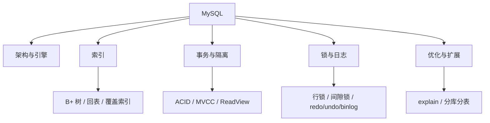
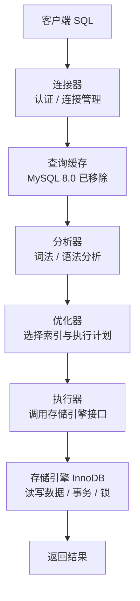
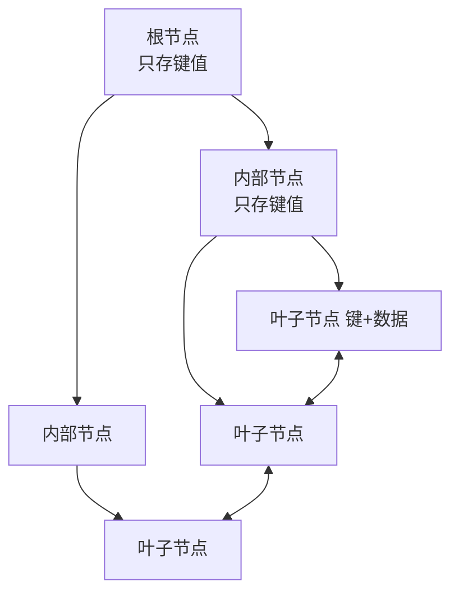

# MySQL：索引、事务、MVCC 与优化

> 这份笔记的目标读者：准备大厂校招的 Java 后端候选人，MySQL 是数据库方向必学且权重最高的一门。  
> 阅读方式：第一次学习按顺序读第 0~9 章；面试前重点回看第 2、4、5、6 章；冲刺阶段直接做第 10 章自测题。  
> 配套课程：分布式事务与分库分表会在《分布式基础》展开；本课聚焦 InnoDB 单机/主从视角。  
> 版本说明：以 MySQL 8.0 的 InnoDB 为准。

### 怎么用这份笔记

- **先架构后细节**：第 1 章把一条 SQL 的执行链路走通，后面所有概念都有位置可放；
- **面试主线**：索引（B+ 树）、事务（ACID）、隔离级别、MVCC、锁、日志是六件套，要求能画图、能推导；
- **实战导向**：第 8 章 explain 与优化、第 9 章分库分表是项目和场景题的素材；
- **动手验证**：在本地 MySQL 建表插数据，用 explain 观察索引选择，比背结论可靠。

## 目录

- [0. 学习地图：MySQL 考什么](#0-学习地图mysql-考什么)
- [1. 架构与存储引擎](#1-架构与存储引擎)
- [2. 索引与 B+ 树](#2-索引与-b-树)
- [3. 事务与 ACID](#3-事务与-acid)
- [4. 并发问题与隔离级别](#4-并发问题与隔离级别)
- [5. MVCC 原理](#5-mvcc-原理)
- [6. 锁机制](#6-锁机制)
- [7. 日志体系：binlog、redo log、undo log](#7-日志体系binlogredo-logundo-log)
- [8. SQL 优化](#8-sql-优化)
- [9. 分库分表](#9-分库分表)
- [10. 高频自测题与参考资料](#10-高频自测题与参考资料)

---

## 0. 学习地图：MySQL 考什么

MySQL 是校招后端“数据存储”方向的第一主角：索引原理、事务隔离、MVCC、锁、日志、SQL 优化，几乎每个都是必问项，而且经常连环追问。

### 0.1 本课程覆盖的高频考点

| 主题 | 大厂高频考点 | 面试权重 |
|---|---|---|
| 架构 | Server 层/存储引擎层、SQL 执行流程 | ★★★ |
| 索引 | B+ 树、聚簇/二级索引、回表、最左前缀、索引失效 | ★★★★★ |
| 事务 | ACID、隔离级别、并发问题 | ★★★★★ |
| MVCC | 版本链、ReadView、快照读 vs 当前读 | ★★★★★ |
| 锁 | 行锁/间隙锁/临键锁、意向锁、死锁 | ★★★★★ |
| 日志 | binlog/redo log/undo log、两阶段提交 | ★★★★ |
| 优化 | explain、慢查询、深分页、索引优化 | ★★★★ |
| 分库分表 | 垂直/水平、分片键、全局主键 | ★★★★ |

### 0.2 知识体系图



### 0.3 学习方法

1. **以 InnoDB 为唯一主线**：默认引擎，事务、MVCC、行锁都是它；
2. **把机制串成链**：隔离级别 → MVCC/锁 → 日志 → crash-safe，一条链讲下来就是高分答案；
3. **每个结论配 explain**：索引失效、覆盖索引都能用 explain 验证。

**考法样板**：考点不能只背“是什么”，要能答“怎么考、答到多深”。例如：

- **索引**：先答 B+ 树结构，再答“树高怎么算（16KB 页 / 14B 项 ≈ 1170 扇出）、为什么行宽变大树高变高、覆盖索引为什么免回表”；
- **隔离级别**：先答四种隔离级别与三类并发问题，再答“RR 为什么是默认、MVCC 怎么实现快照读、RR 下幻读为什么难复现”；
- **两阶段提交**：先答 prepare/commit 流程，再答“逐崩溃点怎么恢复、为什么和分布式 XA 不是一回事”。

### 0.4 边界说明

MySQL 主从复制的高可用方案（MHA、MGR、半同步）与分布式事务在《分布式基础》展开；本课聚焦单机 InnoDB 原理与 SQL 工程。

## 1. 架构与存储引擎

### 1.1 一条 SQL 的执行流程



分层：

- **Server 层**：连接器、分析器、优化器、执行器，与存储引擎无关；
- **存储引擎层**：负责数据的存储与读取，插件式，InnoDB/MyISAM 等。

### 1.2 InnoDB vs MyISAM

| 对比项 | InnoDB | MyISAM |
|---|---|---|
| 事务 | 支持 | 不支持 |
| 行锁 | 支持 | 只支持表锁 |
| 外键 | 支持 | 不支持 |
| 崩溃恢复 | 好（redo log） | 差 |
| 聚簇索引 | 有（主键即数据） | 无（数据独立存储） |
| 场景 | 默认，OLTP 主选 | 只读历史表、数据仓库（基本淘汰） |

### 1.3 InnoDB 数据组织

- 表数据按**主键聚簇**存放：叶子节点就是整行数据；
- 磁盘最小单位是**页（Page，默认 16KB）**，行记录存在页内；
- 页之间通过双向链表连接，叶子层构成有序链表，支撑范围扫描；
- 行格式：8.0 默认 DYNAMIC（变长/大字段可 off-page 溢出到单独页）；页内结构：记录头（delete_mask、next_record）+ 页目录（槽 + 二分查找）+ 页内单向链表；
- **自适应哈希索引（AHI）**：InnoDB 自动为 Buffer Pool 中的热点页建内存哈希，加速等值查询；`innodb_adaptive_hash_index` 默认 ON，对范围查询无帮助。

### 1.4 InnoDB 内存架构（简述）

- **Buffer Pool**：缓存数据页与索引页，`innodb_buffer_pool_size` 默认 128MB，生产建议设为物理内存的 50%~75%；内部用 LRU + 预读管理；
- **change buffer**：5.5 起引入，缓存非唯一二级索引的变更，合并写减少随机 IO（`innodb_change_buffering` 默认 all）；
- **doublewrite**：双写缓冲防止页写入一半崩溃产生“坏页”（torn page），默认开启。

### 1.5 面试追问

- 问：一条 update 语句的执行过程？
- 答：连接器认证 → 分析器解析 → 优化器选计划 → 执行器调 InnoDB 读写，期间写 redo/undo/binlog（见“日志体系”章）。
- 问：InnoDB 和 MyISAM 的区别？
- 答：事务、行锁、外键、崩溃恢复、聚簇索引；InnoDB 是现代默认。
- 问：InnoDB 为什么用聚簇索引？
- 答：主键即数据，按主键范围查询友好，避免“表数据 + 索引”两次维护。

## 2. 索引与 B+ 树

索引是 MySQL 第一必考。理解 B+ 树结构，就能推导出“为什么最左前缀、为什么覆盖索引快、为什么函数会让索引失效”。

### 2.1 B+ 树结构



特点：

- 非叶子节点**只存键**，不存数据 → 扇出大、树矮（千万级数据树高 3~4 层），查询只要几次磁盘 IO；
- 叶子节点存数据（聚簇索引）或主键（二级索引），且叶子间有链表，**范围查询友好**；
- 相比哈希索引：支持范围与排序；相比 B 树：非叶子不存数据，树更矮。

**手算树高（面试推导题）**：InnoDB 页默认 16KB。非叶子节点只存“键 + 页指针”，按 bigint 主键 8 字节 + 指针 6 字节算，每项约 14 字节，一页可放 16KB / 14B ≈ **1170 个键**（扇出约 1170）；叶子页按每行约 100 字节算，一页约 **160 行**。于是：

```text
树高 1（根即叶子）   → 160 行
树高 2（根 + 叶子）  → 1170 × 160 ≈ 19 万行
树高 3              → 1170² × 160 ≈ 2.2 亿行
树高 4              → 1170³ × 160 ≈ 2560 亿行
```

所以千万级表树高只有 3~4 层，一次查询的磁盘 IO ≈ 树高层数次（页内二分不额外 IO），加上可能的 1 次回表——这就是“B+ 树矮、IO 少”的完整答案。**变形题（定量）**：行宽 1KB → 每页约 16 行 → 树高 3 只扛约 1170² × 16 ≈ 2200 万行（比 100B 行宽的 2.2 亿少一个数量级），所以宽表要拆列/垂直拆分；主键用 UUID（32 字节）→ 扇出变小 → 树变高，这正是推荐自增 int/bigint 主键的原因。

### 2.2 聚簇索引与二级索引

| 索引 | 叶子内容 | 特点 |
|---|---|---|
| 聚簇索引（主键） | 整行数据 | 每表一个；主键查询最快 |
| 二级索引（普通索引） | 索引列 + 主键 | 可多个；查询需回表 |

**回表**：通过二级索引找到主键，再回聚簇索引取整行。

**覆盖索引**：查询的列全部在二级索引里，不需要回表（explain 的 Extra 显示 Using index）。这是最常用的优化手段。

```sql
-- 联合索引 idx(a, b)
SELECT b FROM t WHERE a = 1;   -- 覆盖索引，无需回表
SELECT * FROM t WHERE a = 1;   -- 需要回表
```

### 2.3 最左前缀原则

联合索引 `(a, b, c)` 能用到：

```text
WHERE a=1            → 命中 a
WHERE a=1 AND b=2    → 命中 a, b
WHERE a=1 AND b=2 AND c=3 → 全命中
WHERE b=2            → 无法命中（跳过最左列）
WHERE a=1 AND c=3    → 只命中 a（跳过 b，c 失效）
WHERE a>1 AND b=2    → 只命中 a（范围之后失效）
```

口诀：**联合索引按从左到右的顺序匹配，遇到范围查询或跳过列就停**。

### 2.4 索引下推（ICP）

索引下推（Index Condition Pushdown，5.6 引入）让存储引擎在**索引层**先过滤索引内条件，减少回表次数：

```sql
-- 联合索引 (a, b)，WHERE a > 1 AND b = 2
-- 无 ICP：先按 a 取出所有记录回表，再过滤 b
-- 有 ICP：在索引里先过滤 b = 2，只对命中的记录回表
```

EXPLAIN 的 Extra 显示 `Using index condition`。与覆盖索引的区别：覆盖索引**不用回表**，ICP 仍要回表但**减少回表次数**。

### 2.5 索引失效的常见场景

1. 对索引列使用**函数或运算**：`WHERE YEAR(create_time)=2026`、`WHERE id+1=100`；
2. **隐式类型转换**：`WHERE phone = 13812345678`（phone 是 varchar，与数字常量比较时 **phone 列被隐式 CAST 成数字**，转换作用在索引列上，索引失效）；判定口诀：看隐式转换作用在不在索引列上，在则失效；

双向规则：`WHERE id = '1'`（数值列与字符串常量比较）**不失效**——常量被 CAST 成数值，转换不在索引列上；只有“索引列被 CAST”才失效，用 EXPLAIN 验证 type 从 ref 掉成 ALL 即可确认。
3. **模糊查询前缀通配**：`LIKE '%abc'` 失效，`LIKE 'abc%'` 可用；
4. **不满足最左前缀**；
5. **OR 连接的非索引条件**：`WHERE a=1 OR b=2`（b 无索引时全表）；
6. 优化器认为**全表扫描更快**（数据量小或区分度低）。

### 2.6 什么时候建索引

- 建：WHERE/ORDER BY/GROUP BY/JOIN 的列、区分度高的列、覆盖索引组合；
- 不建：频繁更新的列、区分度极低（性别）、冗余索引（已有 `(a,b)` 再建 `(a)`）、小表。
- 优化器按**基数（cardinality）**估选索引：区分度低（如性别）不建；`SHOW INDEX` 可看 Cardinality 列，统计过期用 `ANALYZE TABLE` 刷新。

### 2.7 面试追问

- 问：为什么 MySQL 用 B+ 树而不是 B 树/哈希？
- 答：B+ 树非叶子只存键、树矮 IO 少，叶子链表支持范围查询；哈希不支持范围与排序。
- 问：回表和覆盖索引？
- 答：二级索引查主键再回聚簇索引取整行；覆盖索引查询列都在索引里，免回表。
- 问：最左前缀是什么？
- 答：联合索引按声明顺序匹配，跳过中间列或遇到范围后，后续列无法使用。
- 问：索引失效场景？
- 答：函数/运算、隐式转换、%前缀、不满足最左前缀、OR 未全索引。

## 3. 事务与 ACID

事务是数据库可靠性的核心。面试标准问法：“事务的四大特性是什么？分别由什么保证？”

### 3.1 ACID 四特性

| 特性 | 含义 | 由什么保证 |
|---|---|---|
| 原子性 Atomicity | 要么全成功要么全回滚 | undo log（回滚日志） |
| 一致性 Consistency | 事务前后数据满足约束 | 应用约束 + 其他三性共同保证 |
| 隔离性 Isolation | 并发事务互不干扰 | 锁 + MVCC |
| 持久性 Durability | 提交后不丢 | redo log（重做日志）+ 刷盘 |

```sql
START TRANSACTION;
UPDATE account SET balance = balance - 100 WHERE id = 1;
UPDATE account SET balance = balance + 100 WHERE id = 2;
COMMIT;      -- 或 ROLLBACK;
```

### 3.2 为什么需要日志保证原子性/持久性

- **undo log**：记录“怎么改回去”，事务回滚时逆序执行，保证原子性；同时是 MVCC 版本链（见“MVCC 原理”章）；
- **redo log**：记录“改了什么”，先写日志再写数据（WAL），崩溃后重放恢复，保证持久性；
- 两者都写，为什么？redo 负责“提交后不丢”，undo 负责“失败能回滚”，职责不同。

### 3.3 面试追问

- 问：ACID 分别由什么保证？
- 答：原子性 undo log、持久性 redo log、隔离性锁+MVCC、一致性由应用约束与前三者共同保证。
- 问：WAL 是什么？
- 答：Write-Ahead Logging，先写日志后写数据；崩溃时用日志恢复，避免每次提交都全量刷数据页。
- 问：事务里一条语句失败会怎样？
- 答：默认语句级回滚，手动 ROLLBACK 回滚整个事务；两个例外：死锁（1213）回滚整个事务、锁等待超时（1205）仅回滚当前语句（事务保持打开但被标记，后续语句可能继续报错，建议主动回滚整个事务），应用要捕获 1213 重试。

## 4. 并发问题与隔离级别

多个事务并发执行会产生三类读问题，隔离级别就是“用多少隔离换多少并发”的刻度。

### 4.1 三类并发问题

| 问题 | 现象 | 示例 |
|---|---|---|
| 脏读 | 读到**未提交**的数据 | 事务 A 改了没提交，事务 B 读到，A 回滚 → B 读到脏数据 |
| 不可重复读 | 同一条记录两次读不一样 | 事务 B 两次读同一行，中间事务 A 提交修改 |
| 幻读 | 同一条件两次查询结果行数不一样 | 事务 B 两次 SELECT 同一范围，中间事务 A 插入新行 |

### 4.2 四个隔离级别

| 隔离级别 | 脏读 | 不可重复读 | 幻读 |
|---|---|---|---|
| READ UNCOMMITTED（读未提交） | 可能 | 可能 | 可能 |
| READ COMMITTED（读已提交） | 解决 | 可能 | 可能 |
| REPEATABLE READ（可重复读） | 解决 | 解决 | 解决（快照读靠 MVCC、当前读靠间隙锁，见下） |
| SERIALIZABLE（串行化） | 解决 | 解决 | 解决 |

MySQL InnoDB 默认 **REPEATABLE READ**：

- 快照读（普通 SELECT）靠 **MVCC** 实现可重复读，并天然避免幻读；
- 当前读（`SELECT ... FOR UPDATE`、`UPDATE`、`DELETE`）靠**间隙锁/临键锁**防止幻读；
- 所以 MySQL 的 RR 实际能防幻读，与教科书“RR 可能幻读”的差异就在这里。

**双会话实验**：READ UNCOMMITTED 下会话 A 改不提交、会话 B 能读到（脏读复现）；RR 下教材式幻读演示**做不出来**——快照读两次结果一致，要看到幻读必须当前读（`SELECT ... FOR UPDATE` 被间隙锁挡住）或 SERIALIZABLE；“做不出来的实验”本身就是活教材。

**丢失更新（第四类问题）**：两个事务都读同一值、各自加 1 再写，后写覆盖先写——它不在隔离级别表的“脏/不可重复/幻读”里，因为即使 SERIALIZABLE 也只是加锁挡并发，挡不住“读旧值→算新值→写”的业务重放；复现：双会话先 SELECT 再不带条件 UPDATE；防：乐观锁（`UPDATE ... SET x = x + 1 WHERE version = 旧值`，用“写当前值表达式”）或 SELECT FOR UPDATE 串行化。

**为什么默认 RR**：历史原因——statement 格式 binlog 逻辑复制在 RC 下与主库可能不一致，RR 下才安全；8.0 默认 row 格式后 RC 也安全，互联网公司常选 **RC + row**（间隙锁少、并发更高）。

### 4.3 快照读 vs 当前读

| 类型 | 语句 | 加锁 | 读的数据 |
|---|---|---|---|
| 快照读 | 普通 SELECT | 不加锁 | 基于 ReadView 的版本快照 |
| 当前读 | SELECT ... FOR UPDATE / LOCK IN SHARE MODE / UPDATE / DELETE | 加锁 | 最新已提交数据 |

### 4.4 面试追问

- 问：脏读、不可重复读、幻读的区别？
- 答：读到未提交数据、同一行前后不一致、同一范围行数变化（插入/删除）。
- 问：MySQL 默认隔离级别？
- 答：REPEATABLE READ；快照读用 MVCC 防幻读，当前读用间隙锁防幻读。
- 问：RC 和 RR 怎么选？
- 答：RR 防幻读但有间隙锁死锁风险；RC 每次读最新已提交，锁更少，高并发写场景常改 RC（需业务接受不可重复读）。

## 5. MVCC 原理

MVCC（多版本并发控制）让快照读不加锁也能读到一致快照，是 InnoDB 隔离级别的核心实现。

### 5.1 隐藏列与版本链

InnoDB 每行有三个隐藏字段：

| 隐藏列 | 作用 |
|---|---|
| DB_TRX_ID | 最近一次修改该行的事务 ID |
| DB_ROLL_PTR | 指向 undo log 中上一版本（回滚指针） |
| DB_ROW_ID | 无主键且无唯一索引时的隐藏聚簇键（可忽略） |

每次 UPDATE 不覆盖旧值，而是通过 undo log 形成**版本链**：

```text
最新版本 ←(roll_ptr)— 上一版本 ←(roll_ptr)— 更早版本 ... ← 最老版本
```

### 5.2 ReadView 与可见性判断

ReadView（读视图）是“事务开始读数据那一刻”的快照信息，核心字段：

| 字段 | 含义 |
|---|---|
| m_ids | 当前活跃（未提交）事务 ID 列表 |
| min_trx_id | 活跃事务中最小 ID |
| max_trx_id | 下一个将分配的事务 ID |
| creator_trx_id | 创建 ReadView 的事务自己的 ID |

对版本链上某个版本的 trx_id 判断可见性：

```text
trx_id == creator_trx_id        → 自己改的，可见
trx_id < min_trx_id             → 已提交，可见
trx_id >= max_trx_id            → 未来事务，不可见
trx_id ∈ m_ids（活跃列表）       → 未提交，不可见
否则（已提交且不活跃）            → 可见
```

不可见就沿 roll_ptr 找上一版本，直到找到可见版本或结束。

**多事务时间线走查**：假设 T0（trx_id=100）已提交，写了 v1；T1（trx_id=101）未提交，对同一行又写了 v3；T2（trx_id=102）已提交，写了 v2；T3（trx_id=103）执行快照读，创建 ReadView 时活跃事务为 [101, 103]，min=101，max=104。此时版本链是 v3(T1 未提交) → v2(T2 已提交) → v1(T0 已提交)：

```text
v3：trx_id=101 ∈ m_ids（未提交）→ 不可见，沿 roll_ptr 找 v2
v2：trx_id=102，不在活跃列表、小于 max → 已提交可见 → 读到 v2
```

注意链尾 v1 必须是**已提交**事务写的：若 T1 在链两端各有一版本，意味着 T1 更新两次且中间夹着 T2 的更新，这在行锁下物理不可能（T1 第二次更新会被 T2 的锁阻塞），面试画版本链时别画出这种时序。

如果 T4（trx_id=104）在 T3 创建 ReadView **之后**提交并写了 v4，v4 的 trx_id=104 ≥ max_trx_id=104，被判为“未来事务”不可见——T3 一直读到 v2，这就是 RR 快照隔离：ReadView 在第一次快照读时固定，后续不刷新（RC 则是每次 SELECT 重建，所以能看到别人新提交的数据）。

<!--demo:ReadView版本链可视化.html-->

### 5.3 RC 与 RR 的关键差异

| 隔离级别 | ReadView 生成时机 | 效果 |
|---|---|---|
| READ COMMITTED | **每次 SELECT** 都生成新 ReadView | 能看到其他事务新提交的数据 → 不可重复读 |
| REPEATABLE READ | **事务第一次 SELECT** 生成，之后复用 | 整个事务看到同一快照 → 可重复读 |

这就是“RC 每次读最新已提交、RR 全程一致快照”的底层答案，也是面试最爱的追问点。

### 5.4 MVCC 的边界

- MVCC 只管**快照读**；当前读（FOR UPDATE/UPDATE/DELETE）必须加锁，RR 下用间隙锁防幻读；
- undo log 不能无限保留，过期版本由 purge 线程清理。

**RR 防幻读的边界**：两个事务都先快照读再插入，互相看不到对方新插的行——无唯一索引时会**真重复插入**（两边都插成功），有唯一索引则报 **1062**；所以幂等靠唯一索引 + 冲突捕获，或 FOR UPDATE 把并发串行化。

### 5.5 面试追问

- 问：MVCC 解决什么问题？
- 答：让快照读不加锁读到一致版本，提高并发；是 RC/RR 读语义的实现基础。
- 问：版本链怎么来的？
- 答：每行有 trx_id 和 roll_ptr，UPDATE 生成新版本并把旧版本挂到 undo log 版本链。
- 问：ReadView 判断可见性的规则？
- 答：自己可见；trx_id 小于 min 可见；大于等于 max 不可见；在活跃列表不可见，否则可见；不可见沿版本链找上一版。
- 问：RC 和 RR 的 ReadView 区别？
- 答：RC 每次 SELECT 生成；RR 首次 SELECT 生成后复用。
- 问：MVCC 能防幻读吗？
- 答：快照读可以（全程同一快照）；当前读要靠间隙锁/临键锁。

## 6. 锁机制

锁决定并发写入的粒度与代价。面试常问“行锁有哪些、间隙锁是什么、怎么排查死锁”。

### 6.1 锁的粒度

| 锁 | 范围 | 说明 |
|---|---|---|
| 全局锁 | 整个实例 | `FLUSH TABLES WITH READ LOCK`，备份用；Enterprise Backup 类工具可免 FTWRL，`mysqldump --single-transaction` 仍需短暂持锁取一致性 binlog 位点 |
| 表锁 | 整张表 | `LOCK TABLES`，MyISAM 用 |
| 元数据锁 MDL | 表结构 | DDL 自动加，防止 DDL 与 DML 冲突 |
| 行锁 | 索引记录 | InnoDB 才有，锁的是索引项 |

大表 DDL：原生 ALTER 持 MDL 排他锁、阻塞 DML；生产用 pt-online-schema-change（影子表 + 触发器 + rename）或 gh-ost（binlog 增量到影子表），并低峰执行、限流监控。

### 6.2 行锁的分类

| 锁 | 锁什么 | 冲突 |
|---|---|---|
| 共享锁 S（读锁） | 一行记录 | S 与 S 兼容，S 与 X 冲突 |
| 排他锁 X（写锁） | 一行记录 | X 与任何锁冲突 |
| 记录锁 Record Lock | 单条索引记录 | 锁单行 |
| 间隙锁 Gap Lock | 记录之间的间隙 | 防插入（防幻读） |
| 临键锁 Next-Key Lock | 记录 + 前间隙 | 默认 RR 下的范围锁 |

**意向锁（IS/IX）**：表级标记“有事务打算加行级 S/X 锁”，让表锁与行锁能快速判断是否冲突，不用逐行扫描。

**临键锁区间语义**：锁“左开右闭”区间 `(a, b]`，例如存在 10、15 时范围条件会锁 `(10, 15]`；RR 下当前读的范围查询靠它防幻读。

### 6.3 什么时候加什么锁

```text
普通 SELECT             → 快照读，不加锁（MVCC）
SELECT ... FOR UPDATE   → 行级 X 锁（当前读）
SELECT ... LOCK IN SHARE MODE → 行级 S 锁
UPDATE / DELETE         → 行级 X 锁（当前读）
RR 下范围条件           → 可能加临键锁（记录锁 + 间隙锁）
```

**乐观锁 vs 悲观锁**：悲观锁=`SELECT ... FOR UPDATE` 加行锁；乐观锁=版本号条件更新（`UPDATE SET version=version+1 WHERE id=? AND version=?`，影响 0 行则重试，本质是 CAS）；读多写少用乐观，冲突率高用悲观。

### 6.4 死锁

两个事务互相持有对方需要的锁：

```sql
-- 事务 1：UPDATE t SET ... WHERE id=1; 然后 UPDATE t SET ... WHERE id=2;
-- 事务 2：UPDATE t SET ... WHERE id=2; 然后 UPDATE t SET ... WHERE id=1;
```

InnoDB 处理：

- 死锁检测自动回滚**代价较小的事务**，另一个继续（报 Deadlock found 错误，应用要重试）；
- `innodb_lock_wait_timeout`（默认 50 秒）作为锁等待超时兜底；
- `innodb_deadlock_detect` 默认 ON；高并发单热点行场景可关闭检测省开销，靠锁等待超时兜底；
- 排查：`SHOW ENGINE INNODB STATUS` 看 LATEST DETECTED DEADLOCK，定位互相等待的 SQL；
- 预防：统一加锁顺序、尽量走索引缩小锁范围、短事务、RC 隔离级别减少间隙锁。

**回滚“代价较小”的机制**：比较已修改行数/undo 大小，回滚改动少的一方；等待图检测是 O(n²) 量级，单热点行场景可关检测省开销（`innodb_deadlock_detect=OFF`）靠超时兜底；**间隙锁死锁典型**：两个事务先各插一行、再互相查对方插入的范围；可复现实验：两个会话按相反顺序 UPDATE id=1、id=2 稳定触发。

### 6.5 面试追问

- 问：行锁锁的是什么？
- 答：索引记录（聚簇索引或二级索引项）；没有索引时全表扫描逐行加锁，表现上等价于表锁（InnoDB 没有真正的表锁）。
- 问：间隙锁是做什么的？
- 答：锁住记录之间的间隙，防止其他事务插入，解决 RR 下当前读的幻读。
- 问：临键锁和记录锁/间隙锁的关系？
- 答：临键锁 = 记录锁 + 前向间隙锁，是 RR 默认的范围锁形态。
- 问：死锁怎么处理？
- 答：InnoDB 自动回滚代价小的事务；应用捕获死锁错误重试；规范加锁顺序从源头减少。
- 问：意向锁有什么用？
- 答：表级“预告”行锁意图，让表锁快速判断冲突，避免逐行检查。

## 7. 日志体系：binlog、redo log、undo log

三大日志是 MySQL 可靠性与复制的地基，面试爱问“三者的区别”和“两阶段提交”。

### 7.1 三日志对比

| 日志 | 层级 | 内容 | 作用 |
|---|---|---|---|
| redo log | InnoDB 引擎层 | 物理日志：页的修改 | 崩溃恢复（crash-safe）、持久性 |
| undo log | InnoDB 引擎层 | 逻辑日志：怎么回滚 | 原子性、MVCC 版本链 |
| binlog | Server 层 | 逻辑日志：statement 为 SQL 原文，8.0 默认 row 为行变更 | 归档、主从复制、误删恢复 |

关键区别：

- redo 是物理的（“第 X 页偏移 Y 改成 Z”），binlog 是逻辑的（statement 格式记录 SQL 原文，row 格式记录行变更）；
- redo 循环写、有限大小；binlog 追加写、可全量归档；
- 主从复制靠 binlog，崩溃恢复靠 redo log。

**binlog 三种格式**：statement（SQL 原文，UUID()/NOW()/LIMIT 等会导致主从不一致）、row（记录行变更前后值，8.0 默认）、mixed（前两种的混合）。

### 7.2 WAL 与刷盘

WAL（Write-Ahead Logging）：**先写 redo log，再写数据页**。

```text
事务提交时：redo log 刷盘（group commit 自动合并刷盘）
之后数据页可以留在内存 buffer pool，由后台慢慢刷
崩溃时：用 redo log 重放，未落盘但已提交的修改不丢
```

注：group commit 是自动合并刷盘的机制，没有同名配置项；可配置的是 `innodb_flush_log_at_trx_commit`，默认 1，为 1 时 group commit 自动生效。

**刷盘三档的丢失窗口**：`innodb_flush_log_at_trx_commit` = 0（每秒刷一次，最多丢 1 秒）、1（每次提交都刷盘，不丢但最慢）、2（每次提交写 OS 缓存、每秒刷盘，OS 宕机丢 1 秒）；配合 `sync_binlog=1` 就是生产“双 1”配置。

### 7.3 两阶段提交：redo 与 binlog 的一致性

如果 redo 先写、binlog 后写，崩溃可能造成“库数据恢复后与 binlog 对不上”（主从不一致）。解决办法是**两阶段提交**：


崩溃恢复规则：

```text
redo 是 prepare 且 binlog 完整   → 事务提交有效，重放
redo 是 prepare 且 binlog 缺失   → 事务回滚
redo 是 commit                  → 事务有效
```

这就是“binlog 和 redo 逻辑一致”的保证，主从不会出现半边提交。

**逐崩溃点走查**：

| 崩溃时刻 | 恢复行为 |
|---|---|
| redo prepare 之前 | 事务还没写持久化日志，直接回滚，无副作用 |
| redo prepare 已写、binlog 未写 | binlog 里没有对应 XID_EVENT，判为不完整，回滚 |
| binlog 写了一半 | 缺少完整 XID_EVENT，判不完整，回滚 |
| binlog 已完整落盘 | 用 XID 核对一致，补写 redo commit，事务提交有效 |
| redo commit 之后 | 事务已提交，正常重放生效 |

机制本质：redo 在 prepare 阶段记录 **XID**，恢复时把“redo 中 prepare 的 XID”与“binlog 的 XID_EVENT”对齐——一致则补 commit，不一致则回滚。注意这是 **MySQL 单机内 redo 与 binlog 的两阶段提交**，与分布式事务的 2PC/XA（跨库、跨服务、有独立协调者）不是一回事，面试别混答。

### 7.4 主从复制速览

- 异步复制三线程：主库 binlog dump 线程、从库 IO 线程（拉 binlog 写 relay log）、从库 SQL 线程（重放 relay log）；
- GTID 让复制位置自描述，断点续传更稳；
- 复制延迟原因：重放串行、大事务、从库读压力；缓解：并行复制、拆分大事务；读写分离把读流量导向只读从库、减轻主库压力（从库本身要扩容，否则压力反而上升）；
- 高可用方案（MHA/MGR/半同步）与分布式事务在《分布式基础》展开。

### 7.5 面试追问

- 问：redo log 和 binlog 的区别？
- 答：redo 是引擎层物理日志、循环写、崩溃恢复；binlog 是 Server 层逻辑日志、追加写、复制与归档。
- 问：undo log 有什么用？
- 答：回滚（原子性）和 MVCC 版本链。
- 问：什么是 WAL？
- 答：先写日志后写数据，崩溃后重放日志，保证已提交数据不丢。
- 问：为什么需要两阶段提交？
- 答：让 redo 与 binlog 的提交状态一致，崩溃恢复后库与主从副本对齐。

## 8. SQL 优化

优化题的套路是固定的：先定位慢 SQL，再看执行计划，最后针对索引/写法调整。

### 8.1 定位慢查询

```sql
SHOW VARIABLES LIKE 'slow_query_log';
SET GLOBAL slow_query_log = ON;
SET GLOBAL long_query_time = 1;          -- 超过 1 秒记录
```

慢查询日志（slow.log）里拿到 SQL 后，用 explain 分析。

默认值：`slow_query_log` 默认 OFF、`long_query_time` 默认 10 秒；`SET GLOBAL` 只对新连接生效。

### 8.2 explain 关键列

```sql
EXPLAIN SELECT * FROM t WHERE a = 1;
```

| 列 | 含义 | 好/坏 |
|---|---|---|
| type | 访问类型 | system/const > eq_ref > ref > range > index > ALL |
| key | 实际使用的索引 | 为 NULL 说明没走索引 |
| rows | 预估扫描行数 | 越小越好 |
| Extra | 附加信息 | Using index 好；Using filesort/Using temporary 要警惕 |

type 结论：出现 **ALL（全表扫描）** 且数据量大，基本就是要优化。

type 全取值：system（表只有一行）/ const（主键或唯一键等值）/ eq_ref（JOIN 按主键/唯一键每行至多一匹配）/ ref（非唯一索引等值）/ range（索引范围）/ index（扫整棵索引树）/ ALL（全表）。其他列：possible_keys（候选索引）vs key（实际使用）、key_len（索引使用长度）、Extra 的 `Using index condition`（ICP）/ `Using where`（索引定位后再过滤，不一定是回表，也可能是索引覆盖但仍有条件过滤）/ `Using join buffer`（连接缓冲）。

**key_len 算例**：联合索引 `(a int, b varchar(20) utf8mb4)`，`WHERE a=1 AND b='x'` 的 key_len = 4 + 1（a 的可空位）+ 80 + 2（b 长度字节）+ 1 = 88，能算出“到底用了索引哪几列”；`EXPLAIN ANALYZE`（8.0.18+）还能看实际执行耗时与行数，比 EXPLAIN 的估算更可信。

### 8.3 常见优化手段

1. **覆盖索引**：查询列都在索引里，免回表；
2. **避免 SELECT \***：只取需要的列（配合覆盖索引）；
3. **避免索引失效**（2.5 节）：函数、隐式转换、%前缀等；
4. **深分页**：`LIMIT 100000, 20` 要扫描前 10 万行，改用：

```sql
-- 延迟关联：先只查主键，再回表取数据
SELECT t.* FROM t
JOIN (SELECT id FROM t ORDER BY id LIMIT 100000, 20) tmp
  ON t.id = tmp.id;

-- 或游标分页（基于上次位置）
SELECT * FROM t WHERE id > 100000 ORDER BY id LIMIT 20;
```

深分页为什么慢：InnoDB 要一条条跳过 offset 行，offset 越大扫描越多（代价 O(offset)）；排序字段非唯一时 `id > 上次id` 会漏行（相同排序值被截断），要用复合游标 `(create_time, id) > (上次时间, 上次id)`。

5. **分组/排序走索引**：让 ORDER BY/GROUP BY 命中索引，避免 filesort/temporary；
6. **合理用 EXPLAIN 验证**：改完必须看执行计划是否变化；
7. 大事务拆小、长事务监控（长事务拖住 undo 和锁）。

8. **count 系列**：InnoDB 5.7.18+ 的 `count(*)` 自动选**最小二级索引**扫描（页数最少、IO 最少）；`count(列)` 不统计 NULL 且非索引列要回表；MyISAM 直接返回存储的行数（O(1)），但无事务/行锁语义；“近似”的是 information_schema 或 SHOW TABLE STATUS 的 rows 估算值，别混；结论 `count(*) ≈ count(1)` 优于 `count(大字段列)`。

### 8.4 面试追问

- 问：explain 主要看哪些列？
- 答：type（访问类型）、key（用没用索引）、rows（扫描行数）、Extra（filesort/temporary/Using index）。
- 问：深分页怎么优化？
- 答：延迟关联或游标分页（基于 id > 上次位置），避免大偏移扫描。
- 问：为什么避免 SELECT *？
- 答：占用更多 IO 与内存，且破坏覆盖索引。
- 问：一条 SQL 慢可能的原因？
- 答：没走索引/索引失效、深分页、filesort、锁等待、大事务、表数据量大未归档。

## 9. 分库分表

单库单表扛不住后就要拆。面试问“怎么设计分库分表”，答出垂直/水平、分片键、全局主键、带来的问题即可。

### 9.1 什么时候拆

- 单表数据量过大（千万级往上，B+ 树与 IO 压力增大）；
- 单库连接数/写入吞吐到瓶颈；
- 先做优化（索引、归档、缓存）仍不够才拆。

### 9.2 垂直拆分 vs 水平拆分

| 方式 | 做法 | 解决 |
|---|---|---|
| 垂直分库 | 按业务拆到不同库（用户库/订单库） | 单库压力、连接数 |
| 垂直分表 | 把宽表拆成多张窄表 | 单行大、热点字段集中 |
| 水平分表 | 同一张表按分片键拆成多张结构相同的表 | 单表数据量与写入瓶颈 |

### 9.3 分片键选择

- 必须**均匀**：避免热点（如按 user_id 哈希）；
- 要能**路由**：业务查询尽量带分片键，否则要全分片扫；
- 常见方案：`user_id % N`、`order_id % N`、按时间分表（月表）、一致性哈希（减少扩容迁移）。

### 9.4 全局主键

分片后自增主键会冲突，常见方案：

| 方案 | 原理 | 特点 |
|---|---|---|
| UUID | 本地生成 | 无序、索引性能差 |
| 雪花 ID | 时间戳 + 机器号 + 序号 | 有序、趋势递增，常用 |
| 号段模式 | 数据库分配一段 ID 缓存到内存 | 依赖中心库 |
| Redis 自增 | 原子 INCR | 依赖 Redis 可用性 |

### 9.5 分库分表带来的问题

- **跨片查询**：JOIN 变多次查询 + 应用层组装，排序/分页要各片取再归并；
- **分布式事务**：需要 2PC/TCC/消息最终一致（《分布式基础》展开）；
- **扩容**：取模扩容要迁移数据，可用一致性哈希或双写迁移；
- **全局唯一约束/索引**：如唯一手机号，需要额外处理（唯一表/路由到同一片）。

### 9.6 中间件

- **ShardingSphere-JDBC**：客户端分片，应用内路由，性能好、无独立节点；
- **ShardingSphere-Proxy**：代理层，对应用透明；
- **MyCat**：代理层，老牌。

### 9.7 面试追问

- 问：什么时候需要分库分表？
- 答：单表/单库到瓶颈，且索引、缓存、归档优化后仍不够；不要为了拆而拆。
- 问：垂直和水平拆分的区别？
- 答：垂直按业务/字段拆，水平按数据行拆。
- 问：分片键怎么选？
- 答：均匀分布 + 查询能路由；user_id 哈希是最常见选择。
- 问：分片后主键怎么生成？
- 答：雪花 ID 或号段；UUID 无序不推荐做索引主键。
- 问：分片后 JOIN 怎么处理？
- 答：应用层多次查询组装；或尽量按分片键把关联数据放同一片。

## 10. 高频自测题与参考资料

### 10.1 分主题自测

本页把全书高频考点压缩成分主题自测题：先盖住“一句话要点”尝试作答，再对照检查；能一次答对八成以上，就可以进入下一门课《Redis》。

| 主题 | 问题 | 一句话要点 |
|---|---|---|
| 架构 | 一条 SQL 的执行流程 | 连接→分析→优化→执行→存储引擎 |
| 引擎 | InnoDB vs MyISAM | 事务/行锁/崩溃恢复/聚簇索引 |
| 索引 | B+ 树特点 | 非叶子只存键、叶子链表、树矮 |
| 索引 | 聚簇 vs 二级索引 | 叶子是整行 vs 叶子是主键 |
| 索引 | 回表 | 二级索引查主键再回聚簇取行 |
| 索引 | 覆盖索引 | 查询列都在索引里，免回表 |
| 索引 | 最左前缀 | 联合索引按声明顺序匹配，跳过/范围即停 |
| 索引 | 索引失效 | 函数、隐式转换、%前缀、不满足最左前缀 |
| 事务 | ACID 由什么保证 | undo 原子、redo 持久、锁+MVCC 隔离、应用保一致 |
| 事务 | WAL | 先写日志后写数据 |
| 隔离 | 脏读/不可重复读/幻读 | 未提交/同行变/行数变 |
| 隔离 | MySQL 默认级别 | REPEATABLE READ |
| 隔离 | RR 怎么防幻读 | 快照读 MVCC，当前读间隙锁 |
| 隔离 | 快照读 vs 当前读 | 不加锁版本快照 vs 加锁最新数据 |
| MVCC | 隐藏列 | trx_id、roll_ptr、row_id |
| MVCC | ReadView 可见性 | 自己/已提交可见，活跃与未来不可见 |
| MVCC | RC vs RR 差异 | 每次生成 vs 首次生成复用 |
| 锁 | 行锁分类 | 记录锁/间隙锁/临键锁 |
| 锁 | 间隙锁作用 | 防插入，防幻读 |
| 锁 | 意向锁 | 表级预告行锁意图 |
| 锁 | 死锁处理 | 自动回滚代价小事务，应用重试 |
| 日志 | redo vs binlog | 物理循环写崩溃恢复 vs 逻辑追加复制归档 |
| 日志 | undo log | 回滚 + MVCC 版本链 |
| 日志 | 两阶段提交 | prepare→binlog→commit，崩溃恢复对齐 |
| 日志 | binlog 三种格式 | statement 有不确定性 / row 占空间大 / mixed 自动切换 |
| 优化 | explain 看什么 | type/key/rows/Extra |
| 优化 | type 好坏 | const>ref>range>index>ALL |
| 优化 | ICP 索引下推 | 过滤下推到引擎层，减少回表 |
| 优化 | 深分页 | 延迟关联/游标分页 |
| 优化 | 覆盖索引优化 | 免回表 |
| 优化 | count 系列 | InnoDB 扫最小索引；MyISAM 元数据 O(1) |
| 分片 | 垂直 vs 水平 | 按业务/字段 vs 按数据行 |
| 分片 | 分片键要求 | 均匀 + 可路由 |
| 分片 | 全局主键 | 雪花/号段，少用 UUID |
| 分片 | 分片后的 JOIN | 应用层多次查询组装 |

### 10.2 追问型自测（只给提示不给答案）

下面 5 题是“答对一句话后还会被追问”的升级题：先按提示口头作答，再回对应章节对答案。

1. 隐式类型转换为什么会让索引失效？（提示：CAST 作用在索引列上、函数破坏有序性；用 EXPLAIN 验证 type/key）
2. ICP 索引下推到底省了什么？（提示：过滤下推到存储引擎层，减少回表次数）
3. 为什么 RR 下“教材式幻读”很难复现？（提示：快照读走 MVCC；要看到幻读得用当前读 FOR UPDATE/SERIALIZABLE）
4. binlog 三种格式怎么取舍？（提示：statement 有函数不确定性问题、row 占空间大、mixed 自动切换）
5. 两阶段提交在崩溃时靠什么对齐 redo 与 binlog？（提示：redo prepare 记录 XID，恢复时核对 binlog 的 XID_EVENT）

### 10.3 考前 30 分钟速记

> 速记是开场白不是完整答案：一句话立住骨架后，还要能展开三层——机制（怎么实现）、为什么（设计动机）、边界（失效/代价/变体）。

- 一句话回答“B+ 树”：非叶子只存键、树矮 IO 少、叶子链表支持范围；
- 一句话回答“回表/覆盖索引”：二级索引回聚簇取行；查询列全在索引里就不用回；
- 一句话回答“ACID”：undo 原子、redo 持久、锁+MVCC 隔离、约束保一致；
- 一句话回答“MVCC”：版本链 + ReadView，RC 每次生成、RR 复用；
- 一句话回答“隔离级别”：RR 默认，快照读 MVCC 防幻读，当前读间隙锁防幻读；
- 一句话回答“三大日志”：redo 崩溃恢复、undo 回滚/MVCC、binlog 复制归档，两阶段提交对齐 redo/binlog；
- 一句话回答“分库分表”：垂直拆业务、水平拆数据，分片键要均匀可路由，雪花 ID 做全局主键。

### 10.4 参考资料

- [JavaGuide：MySQL 索引详解](https://javaguide.cn/database/mysql/mysql-index.html)
- [JavaGuide：MySQL 事务隔离级别与 MVCC](https://javaguide.cn/database/mysql/transaction-isolation-level.html)
- [JavaGuide：MySQL 三大日志](https://javaguide.cn/database/mysql/mysql-logs.html)
- [MySQL 官方文档：InnoDB 锁与事务](https://dev.mysql.com/doc/refman/8.0/en/innodb-locking.html)
- 《高性能 MySQL（第 3 版）》
- 《MySQL 技术内幕：InnoDB 存储引擎》

> 学习闭环：第 0~9 章读完、自测题能答 80% 后，进入下一门课《Redis》，把缓存一致性与 MySQL 的强一致语义对照着理解。
