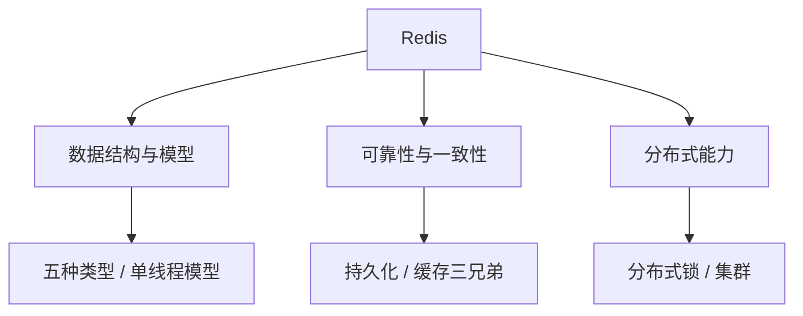

# Redis：数据结构、缓存与高可用

> 这份笔记的目标读者：准备大厂校招的 Java 后端候选人，Redis 是缓存与分布式方向必学的一门。  
> 阅读方式：第一次学习按顺序读第 0~6 章；面试前重点回看第 1、4、5、6 章；冲刺阶段直接做第 7 章自测题。  
> 配套课程：Redis 的分布式锁与缓存一致性会延伸到《分布式基础》；本课聚焦 Redis 本身。  
> 版本说明：以 Redis 6/7 为准，标注了 4.0、7.0 的差异。

### 怎么用这份笔记

- **数据结构先行**：第 1 章把五种数据类型和底层编码讲清，后面所有方案（锁、限流、延迟队列）都建立在它上面；
- **面试主线**：缓存三兄弟、持久化、分布式锁、集群是四大高频区；
- **动手验证**：用 `redis-cli` 敲一遍 `SET NX EX`、Lua 脚本、`CONFIG GET`，比背命令可靠。

## 目录

- [0. 学习地图：Redis 考什么](#0-学习地图redis-考什么)
- [1. 基础与数据结构](#1-基础与数据结构)
- [2. 事务、Lua 与发布订阅](#2-事务lua-与发布订阅)
- [3. 持久化：RDB 与 AOF](#3-持久化rdb-与-aof)
- [4. 缓存三兄弟与一致性](#4-缓存三兄弟与一致性)
- [5. 分布式锁](#5-分布式锁)
- [6. 集群与高可用](#6-集群与高可用)
- [7. 高频自测题与参考资料](#7-高频自测题与参考资料)

---

## 0. 学习地图：Redis 考什么

Redis 是“缓存/分布式”方向的第一主角：单线程为什么快、数据怎么不丢、缓存一致性怎么做、分布式锁怎么写、集群怎么高可用，面试几乎必问。

### 0.1 本课程覆盖的高频考点

| 主题 | 大厂高频考点 | 面试权重 |
|---|---|---|
| 数据结构 | 五种类型、底层编码、为什么单线程快 | ★★★★ |
| 过期与淘汰 | 惰性+定期删除、8 种淘汰策略 | ★★★ |
| 持久化 | RDB/AOF/混合持久化、恢复优先级 | ★★★★ |
| 缓存问题 | 穿透/击穿/雪崩、缓存与 DB 一致性 | ★★★★★ |
| 分布式锁 | SETNX、Lua 释放、Redisson 看门狗、红锁 | ★★★★★ |
| 集群 | 主从、哨兵、Cluster 槽、一致性哈希 | ★★★★ |
| 其他 | 事务、Lua、发布订阅、限流 | ★★★ |

### 0.2 知识体系图



### 0.3 学习方法

1. **一个模型打底**：Redis 是单线程事件循环 + 内存操作，这是“为什么快”“为什么命令原子”的总根源；
2. **对比 MySQL**：Redis 弱一致、快；MySQL 强一致、慢；缓存一致性本质是两者折中；
3. **每个方案问代价**：布隆过滤器有误判、延迟双删有窗口、红锁有争议，能说出 trade-off 才算懂。

**考法样板**：考点不能只背“是什么”，要能答“怎么考、答到多深”。例如：

- **为什么快**：先答“内存 + 单线程 + epoll”，再答“瓶颈分析链（CPU 不是瓶颈→网络 IO 是）、6.0 IO 多线程怎么分层、慢命令为什么阻塞后续命令”；
- **缓存一致性**：先答“先更库再删缓存”，再答“并发时序反例、延迟双删的坑、Canal 订阅 binlog 为什么是最终一致”；
- **分布式锁**：先答“SET NX EX + Lua 释放”，再答“value 为什么必须唯一、看门狗怎么续期、主从切换丢锁与 RedLock 争议”。

### 0.4 边界说明

缓存一致性、分布式锁的工程权衡会延伸到《分布式基础》课程；本课聚焦 Redis 自身机制。

## 1. 基础与数据结构

### 1.1 为什么 Redis 快

- **纯内存操作**：读写都在内存；
- **单线程事件循环**：避免锁竞争与上下文切换；6.0 起网络 IO 可多线程（`io-threads` 默认 1，需显式开启；默认只处理**写**，处理**读**还要开 `io-threads-do-reads yes`），命令执行、过期、淘汰仍由主线程；后台 BIO 线程负责 fsync、释放对象；
- **IO 多路复用**：基于 epoll 处理大量连接；
- **高效数据结构**：SDS、跳表、压缩编码等为具体场景定制。

单线程的代价：单个命令执行慢会阻塞所有请求（如 `KEYS *`、大 key），所以要避免耗时命令、监控慢命令。

**瓶颈分析链**：内存读写本身是纳秒级，CPU 不是瓶颈；真正的瓶颈在**网络 IO**（读请求、写响应）。IO 多路复用把“等待事件”变成事件驱动，单线程再免掉锁竞争、上下文切换和多线程缓存一致性开销——这是“单线程反而快”的完整推理，不是“单线程=快”的结论。

**一条命令的旅程**：客户端请求到达 socket → epoll 产生就绪事件 → 6.0 开启 `io-threads` 时由 IO 线程读入缓冲区 → 主线程从队列取命令、执行内存操作 → 结果写回发送缓冲区 → IO 线程写回 socket。命令执行始终在主线程串行。

**慢命令的队头分析**：主线程一次只执行一条命令，一条 O(N) 命令（`KEYS *`、大 key、大量 key 同时过期）执行期间，后续所有命令都在排队，表现为延迟尖刺。对策：禁用/改用 `SCAN`、拆分大 key、过期时间加随机偏移、开启 `slowlog` 监控。

### 1.2 五种数据类型

| 类型 | 底层结构 | 典型命令 | 场景 |
|---|---|---|---|
| String | SDS 动态字符串 | SET/GET/INCR/SETNX | 缓存、计数、分布式锁 |
| Hash | listpack/哈希表 | HSET/HGET/HGETALL | 对象属性、购物车 |
| List | quicklist | LPUSH/RPUSH/LPOP/BRPOP | 队列、消息列表 |
| Set | intset/哈希表 | SADD/SISMEMBER/SINTER | 去重、共同好友、抽奖 |
| ZSet | listpack/跳表+字典 | ZADD/ZRANGE/ZSCORE | 排行榜、延时队列（score=时间） |

```bash
SET user:1 '{"name":"张三"}' EX 3600     # 带过期时间
INCR page_view                         # 原子自增
LPUSH task_queue job                   # 入队
BRPOP task_queue 0                     # 阻塞出队
SADD online 1001                       # 在线集合
ZADD rank 98 user1                     # 排行榜
```

扩展类型（都早于 6.0，且复用 string 等底层编码）：**Bitmap**（2.2+，位图，签到/布隆场景）、**HyperLogLog**（2.8.9+，UV 统计，约 12KB 存上亿去重）、**GEO**（3.2+，地理位置，底层是 ZSet）。

### 1.3 底层编码

| 数据类型 | 小数据 | 大数据 |
|---|---|---|
| String | int / embstr（≤44 字节） | raw |
| Hash | listpack（7.0 前 ziplist） | 哈希表 |
| List | quicklist（listpack 节点链表） | quicklist |
| Set | intset（全整数） | 哈希表 |
| ZSet | listpack（7.0 前 ziplist） | 跳表 + 字典 |

Redis 会根据元素数量/大小自动切换编码，空间换性能。

**编码细节推导**：embstr 上限 44 = 64（SDS 内联结构上限）− 19（redisObject 头）− 1（结束符）；ziplist 的连锁更新（插入改变 prevlen 引发级联扩容）是 listpack 取代它的动机；intset 只升不降（删掉大整数不会回退编码）；哈希表 rehash 期间新旧两表并存，内存暂时翻倍。

哈希表的 **渐进式 rehash**：扩容/缩容触发后分多次迁移，期间查找查新旧两表、新增只写新表，避免一次性搬迁卡顿。

**ZSet 为什么用跳表**：插入删除 $O(\log n)$、支持范围查询、实现比平衡树简单；配合字典做 $O(1)$ 的 score 查询。

跳表参数：层数生成概率 p=1/4；最大层数 7.0 前 32、7.0 起 64。

**O(log n) 从哪来**：新元素从第 1 层开始，以概率 p=1/4 向上多建一层，所以期望层数只有 1/(1−p) ≈ 1.33 层（常量）；在 n 个元素里，最高层约 log₄n 层。查找从最高层向下走，每层期望跳过 1/p=4 个节点，总步数就是 O(log n)。跳表节点还维护 **span（跨度）**，记录“这层跳过了几个节点”，因此能按排名取元素（`ZRANGE ... BY RANK`）。

**p=1/4 的取舍**：p 越小层越少、内存越省，但每层跨度变大、查找步数略增；Redis 取 1/4 是内存与查找速度的折中（p=1/2 时期望层数 2，p=1/4 时期望层数 4/3，约省 1/3 层指针）。最大层数 32 对应 2⁶⁴ 元素容量（源码注释口径）；7.0 起层数上限提到 64，与 64 位容量/rank 对齐。

**与红黑树对比**：红黑树同样 O(log n)，但范围查询要中序遍历、实现与旋转复杂；跳表靠 span 和后继指针天然支持范围/排名查询、无旋转、并发友好（有无锁跳表实现），所以 Redis 选它。

### 1.4 过期删除与内存淘汰

**过期删除策略**（针对带 TTL 的 key）：

- **惰性删除**：访问时检查是否过期，过期才删；
- **定期删除**：周期性地抽样检查并删除部分过期 key；
- 两者结合：惰性删除即时清理被访问的过期 key，定期删除兜底清扫从未被访问的过期 key。

**内存淘汰策略**（内存满时，`maxmemory-policy`）：

| 策略 | 行为 |
|---|---|
| noeviction | 不淘汰，写命令报错（默认） |
| allkeys-lru | 所有 key 中淘汰最久未使用 |
| volatile-lru | 仅带 TTL 的 key 中淘汰最久未使用 |
| allkeys-lfu / volatile-lfu | 按访问频率淘汰 |
| allkeys-random / volatile-random | 随机淘汰 |
| volatile-ttl | 淘汰剩余 TTL 最短的 |

注意区分：过期删除是“key 到期了要清掉”；淘汰是“内存满了踢谁”。

**细节**：volatile 系只从带 TTL 的 key 里抽样淘汰，过期 key 少时会空转、迟迟不删；近似 LRU 是随机抽样（默认 5 个）淘汰最久未用，不是全量 LRU；5.0 起 LFU 可用且带衰减机制（计数随时间下降）；从节点**不主动过期**，由主节点删除后把 del 同步过去。

### 1.5 面试追问

- 问：Redis 为什么快？
- 答：内存 + 单线程事件循环 + IO 多路复用 + 高效数据结构；6.0 多线程只处理网络 IO。
- 问：单线程的缺点？
- 答：一条慢命令（KEYS、大 key）阻塞全部请求；要监控 slowlog、避免大 key。
- 问：五种数据类型及场景？
- 答：String 缓存计数、Hash 对象、List 队列、Set 去重、ZSet 排行榜/延时队列。
- 问：过期删除和内存淘汰的区别？
- 答：过期是 TTL 到点清理；淘汰是内存满时的逐出策略。
- 问：ZSet 为什么用跳表？
- 答：范围查询友好、O(log n) 插入删除、实现简单，配合字典快速查 score。

## 2. 事务、Lua 与发布订阅

### 2.1 事务：弱事务

```bash
MULTI
SET a 1
INCR b
EXEC
```

Redis 事务特点：

- 命令排队后**一次性顺序执行**，执行期间不会被其他命令插入；
- **不支持回滚**：某条命令执行报错，前面的命令不会撤销（不是 ACID 事务）；
- 更像“批处理 + 隔离”；需要**读改写原子性**时用 Lua（原子执行 ≠ 回滚，出错同样不撤销）；
- **WATCH 乐观锁**：`WATCH key` 后执行 MULTI/EXEC，若被监控的 key 在期间被其他客户端修改，EXEC 返回 nil（中止执行），配合重试；`DISCARD` 取消事务；
- 两类错误：队列期的语法错误导致整个事务不执行；执行期的运行错误不中断后续命令、也不回滚。

### 2.2 Lua：原子性脚本

```bash
EVAL "return redis.call('GET', KEYS[1])" 1 user:1
```

Lua 脚本整体原子执行，是“读改写”场景（如限流、库存扣减、分布式锁释放）的标准手段。

```lua
-- 分布式锁释放：比较值一致才删除
if redis.call('get', KEYS[1]) == ARGV[1] then
    return redis.call('del', KEYS[1])
else
    return 0
end
```

### 2.3 限流与延迟队列

- **延迟队列**：ZSet 的 score 存“到期时间戳”，轮询 `ZRANGEBYSCORE key -inf now` 取到期任务，再 `ZREM` 移除（两步组合非原子，严格场景在 Lua 内完成取+删）；
- **限流**：INCR + EXPIRE 两条命令非原子，用 Lua 实现滑动窗口/令牌桶（如“每用户每秒最多 N 次”在脚本内完成判断与计数）。

**细节**：INCR + EXPIRE 分开写，中间崩溃会让 key 永不过期（用 SET NX EX 或 Lua 一次完成）；MULTI 内部做不了“读改写”（EXEC 前拿不到中间结果），必须 Lua；滑动窗口用 ZSet 按时间戳计数（ZREMRANGEBYSCORE 清窗口）；延迟队列要“先移后做”——先从 ZSet 移除再处理，避免处理失败重复消费（与《消息队列》的重复消费呼应）。

### 2.4 发布订阅与 Stream

- **Pub/Sub**：发布订阅，消息即发即弃，**不持久化**，消费者掉线丢消息；
- **Stream**（5.0+）：消息队列，支持持久化、消费者组、ACK，功能接近 Kafka；
- 场景：Pub/Sub 做简单通知；可靠消息用 Stream 或外部 MQ。

### 2.5 面试追问

- 问：Redis 事务和 MySQL 事务的区别？
- 答：Redis 事务只保证顺序执行，不保证回滚；MySQL 是完整 ACID。
- 问：为什么要用 Lua？
- 答：多个命令需要原子执行时（读改写），Lua 脚本整体原子。
- 问：Pub/Sub 和 Stream 区别？
- 答：Pub/Sub 即发即弃不持久化；Stream 持久化、有消费者组和 ACK。

## 3. 持久化：RDB 与 AOF

Redis 是内存数据库，重启后内存数据清空；是否丢数据取决于持久化配置与最近一次落盘时机（默认 save 规则下会按条件落盘）。持久化要回答的就是“怎么不丢、丢多少可接受”。

### 3.1 RDB 快照

RDB 把内存数据以二进制快照写入磁盘：

```bash
SAVE      # 同步阻塞（生产不用）
BGSAVE    # fork 子进程后台保存（常用）
```

| 优点 | 缺点 |
|---|---|
| 文件紧凑、恢复快 | 快照间隔期间的数据会丢 |
| 适合备份/迁移 | fork 大实例有短暂阻塞；COW 只复制快照期间脏页，内存占用可能显著上升，需评估 |

触发：手动 BGSAVE、自动 save 条件（7.0 起默认 `save 3600 1 300 100 60 10000`，旧示例 `save 900 1` 需自行配置）、主从全量同步。

**默认规则翻译成丢失窗口**：`save 3600 1 300 100 60 10000` = 3600 秒内 1 次、300 秒内 100 次、60 秒内 1 万次变更任一满足就快照，最坏情况重启丢最近 1 小时数据；AOF everysec 的“1 秒”是每秒钟最多丢 1 秒窗口；AOF 重写中途崩溃：旧 AOF 原样保留、临时文件作废，重启仍按旧文件恢复，不会出现半截文件。

### 3.2 AOF 追加日志

AOF 把每条**写命令**追加到文件，重启时重放恢复：

```bash
CONFIG SET appendonly yes
CONFIG SET appendfsync everysec    # always / everysec / no
```

刷盘策略：

| 策略 | 安全性 | 性能 |
|---|---|---|
| always | 每命令 fsync，最多丢 1 条 | 最慢 |
| everysec | 每秒 fsync，最多丢 1 秒 | 推荐 |
| no | 交给操作系统 | 最快，可能丢多 |

问题：AOF 文件不断变大 → **AOF 重写（rewrite）**：fork 子进程根据当前内存生成最小命令集，替换旧文件。手动触发 `BGREWRITEAOF`；自动条件 `auto-aof-rewrite-percentage`（默认 100%）与 `auto-aof-rewrite-min-size`（默认 64mb）同时满足才触发。

### 3.3 混合持久化（Redis 4.0）

`aof-use-rdb-preamble`：4.0 引入时默认关、5.0 起默认开；开启后 AOF 文件 = **RDB 快照头 + 之后的增量命令**，重启时先加载 RDB 再重放增量，兼顾“恢复快”和“丢得少”。7.0 起 AOF 采用多文件架构（base RDB + 增量 AOF + manifest）。

**恢复优先级**：同时存在时优先 AOF（数据更全）。

### 3.4 对比与选型

| 对比项 | RDB | AOF |
|---|---|---|
| 数据完整性 | 可能丢一个快照周期 | everysec 最多丢 1 秒 |
| 文件大小 | 小 | 大（可重写） |
| 恢复速度 | 快 | 慢（开启混合持久化后接近 RDB） |
| 备份友好 | 是 | 一般 |
| 推荐 | 备份/冷备 | 生产主持久化 |

生产组合：**AOF everysec 为主 + RDB 定时备份**（或 4.0+ 混合持久化）。

### 3.5 面试追问

- 问：RDB 和 AOF 的区别？
- 答：RDB 二进制快照、恢复快、丢一个周期；AOF 命令追加、丢得少、文件大；4.0 起可混合。
- 问：AOF 刷盘策略怎么选？
- 答：everysec 是默认与推荐，最多丢 1 秒；对账/交易场景可 always。
- 问：重启恢复用哪个？
- 答：AOF 优先，数据更全。
- 问：AOF 重写是做什么？
- 答：根据当前内存生成最小命令集，压缩文件体积。

## 4. 缓存三兄弟与一致性

缓存面试 90% 围绕“三兄弟”和“缓存与数据库一致性”，要能讲现象、原因、方案和 trade-off。

### 4.1 缓存穿透

**现象**：查询**不存在的数据**，缓存永远不命中，请求全打到数据库。

**解决**：

1. 参数校验：明显非法的 key 直接拒绝；
2. **缓存空值**：查不到也缓存空值并设短 TTL，防同一 key 反复打库；
3. **布隆过滤器**：把所有可能存在的 key 放进过滤器，过滤掉肯定不存在的；代价是有误判率。

**布隆过滤器机制**：一个位数组 + k 个哈希函数，插入把 k 个位都置 1，查询时全 1 才“可能存在”；误判来源是哈希碰撞，且**不能删除**（清一位会影响其他 key）；参数公式 m = −n·ln p / (ln2)²、k = m/n·ln2；落地用 RedisBloom 的 BF.ADD / BF.EXISTS。

### 4.2 缓存击穿

**现象**：某个**热点 key 过期瞬间**，大量请求同时打数据库。

**解决**：

1. **互斥锁**：缓存未命中时先拿锁，只有一个线程重建缓存，其他线程等待或返回旧值；
2. **逻辑过期**：缓存不过期，value 里带逻辑过期时间，发现过期后异步重建；
3. 热点 key 加“永不过期 + 后台刷新”。

**互斥锁细节**：拿锁后要**双检**（再查一次缓存，避免多个线程都重建）且锁要设超时（防重建线程挂掉死锁）；**逻辑过期数据格式** = value + 过期时间戳（如 `{"v": data, "expire": 1700000000}`），发现过期后加锁异步重建，请求先返回旧值。

### 4.3 缓存雪崩

**现象**：**大量 key 同时过期**（或 Redis 挂掉），请求全部打到数据库。

**解决**：

1. 过期时间加**随机抖动**，避免同一时间点集体失效；
2. 热点 key 错峰/永不过期；
3. **多级缓存**（本地缓存 + Redis + DB）；
4. Redis 高可用（哨兵/集群，见“集群与高可用”章）；
5. 数据库侧限流/降级保护。

### 4.4 缓存与数据库一致性

目标不是“绝对强一致”，而是**最终一致 + 可接受的窗口**。

**Cache Aside（旁路缓存）**：

```text
读：先查缓存，未命中查库并回填缓存
写：先更新数据库，再删除缓存
```

为什么更新 DB 后**删缓存**而不是更新缓存：删比更新简单，且能避免并发下旧值覆盖新值。

**A/B 写交错反例（为什么更新缓存会永久脏）**：T1 写 DB=100 → T2 写 DB=200 → T2 写缓存=200 → T1 写缓存=100，最终缓存=100、DB=200，除非下次再更新否则永远不一致；换成“删缓存”后，每次写完 DB 都删，读请求按需回填的一定是当时 DB 的最新值，最坏只是短暂缺失，不会脏。

**延迟双删**：先删缓存 → 更新 DB → 短暂延迟 → 再删一次缓存，兜住“更新 DB 期间有并发读把旧值写回”的窗口。

延迟多久：取“一次读 + 回填”的最坏时间（通常几百毫秒到 1 秒）。两个坑：① 第二次删可能失败——删缓存要带重试/失败落 MQ 补偿；② 双删只是缩小窗口，不是绝对强一致——它和 Cache Aside 一样是**最终一致**。

**订阅 binlog 最终一致**：应用更新 DB，Canal 订阅 binlog 异步删/更新缓存；DB 是唯一事实源，最终一致。

| 方案 | 一致性窗口 | 复杂度 |
|---|---|---|
| Cache Aside（删缓存） | 较小 | 低 |
| 延迟双删 | 更小 | 中 |
| binlog 订阅（Canal） | 很小 | 高 |
| 分布式锁串行化 | 几乎强一致 | 高，性能差 |

如果业务要求强一致（如金额），**不要缓存或不要异步**，直接走 DB。

另外三种数据更新模式：**Read Through**（读未命中由缓存组件回源并写回）、**Write Through**（先写缓存再同步写 DB）、**Write Behind**（先写缓存异步批量落库，吞吐高但可能丢写）。

### 4.5 面试追问

- 问：穿透、击穿、雪崩的区别？
- 答：查不存在的数据 / 热点 key 过期瞬间 / 大量 key 同时失效。
- 问：穿透怎么解决？
- 答：空值缓存、布隆过滤器、参数校验。
- 问：击穿怎么解决？
- 答：互斥锁重建、逻辑过期、热点永不过期。
- 问：雪崩怎么解决？
- 答：过期时间加随机、多级缓存、Redis 高可用、限流降级。
- 问：更新 DB 后为什么删缓存？
- 答：避免并发下旧值覆盖新值，删比更新简单；延迟双删/binlog 订阅进一步缩窗口。

## 5. 分布式锁

分布式锁是“多个实例互斥访问共享资源”的经典方案，Redis 版面试问得最多。

### 5.1 最简实现：SETNX + EX

```bash
SET lock:order:1001 <unique-id> NX EX 30
```

- `NX`：不存在才设置（拿锁）；`EX 30`：自动过期防死锁；
- **必须原子**：不能 `SETNX` 之后再 `EXPIRE`（两条命令之间崩溃会死锁），一条命令搞定；
- value 用**唯一 ID**（UUID）：释放时只删自己的锁，防误删别人的锁。

### 5.2 释放锁必须用 Lua

```lua
-- 比较 value 一致才删除，保证“谁的锁谁释放”
if redis.call('get', KEYS[1]) == ARGV[1] then
    return redis.call('del', KEYS[1])
else
    return 0
end
```

不能先 GET 再 DEL：两条命令之间锁可能过期并被别人拿到，GET/DEL 非原子会误删新锁。

### 5.3 锁过期与续期：Redisson 看门狗

业务执行时间超过锁的 TTL，锁自动释放会导致并发进入。Redisson 的解决：

```java
RLock lock = redisson.getLock("lock:order");
lock.lock();          // 默认 30 秒，启动看门狗
try {
    // 业务逻辑
} finally {
    lock.unlock();    // 原子释放（Lua）
}
```

- **看门狗**：默认每 10 秒把锁续期到 30 秒，业务没结束锁不丢；
- 进程挂了看门狗停，锁到期自动释放，不会死锁；
- `tryLock(timeout)` 支持等待超时与租约时间。

### 5.4 红锁 RedLock 与争议

单节点锁在主从切换时可能丢：拿到锁后 master 挂了，从节点还没同步锁，另一个客户端也能拿到锁。

**RedLock**：向 N 个（通常 5）独立 Redis 节点都申请锁，超过半数成功才算拿到。

争议：

- 依赖时钟与网络假设，分布式系统专家 Martin Kleppmann 质疑其安全性，Redis 作者 antirez 撰文辩护，业界观点存在争议；
- 工程上多数场景用**单节点 + 看门狗 + 高可用 Redis** 已经足够；要求绝对互斥时考虑 Zookeeper（顺序节点 + watch）。

**GC 停顿与 fencing token**：客户端拿到锁后 GC 停顿超过 TTL，锁到期被别的客户端拿走，原客户端醒来继续写——互斥被打破；解法是 **fencing token**：每次加锁拿到单调递增令牌，写操作携带，服务端只接受令牌更大的写。RedLock 完整算法还要：有效期扣掉所有节点的耗时；各节点加**随机延迟**再申请，缓解时钟偏见。

### 5.5 实现要点总结

1. 获取：`SET key unique_id NX EX ttl`（原子）；
2. 释放：Lua 比较 unique_id 再 DEL（原子）；
3. 续期：Redisson 看门狗自动续期；
4. 可重入：Redisson 用 Hash 记录重入次数；
5. 别用：`SETNX` + `EXPIRE` 分开写、GET+DEL 非原子、value 不带唯一 ID。

### 5.6 面试追问

- 问：Redis 分布式锁怎么写？
- 答：SET key unique_id NX EX 原子拿锁，Lua 原子释放，Redisson 看门狗续期。
- 问：为什么释放锁要用 Lua？
- 答：比较 value 和删除必须是原子操作，否则可能误删别人的锁。
- 问：锁过期了业务还没执行完怎么办？
- 答：看门狗自动续期；进程挂了看门狗停，锁到期释放。
- 问：主从切换会丢锁吗？
- 答：会；RedLock 多数派可缓解但有争议，极端互斥场景考虑 ZK。

## 6. 集群与高可用

单机 Redis 有容量与可用性上限，演进路线：主从 → 哨兵 → Cluster。

### 6.1 主从复制

```text
master 负责写，slave 同步数据，读写分离
全量同步：RDB 快照 + 缓冲命令
增量同步：断线重连后按 repl_backlog 补发
```

- 术语：replication ID + 偏移量 offset 定位同步位置；`repl-backlog-size` 默认 1MB，断线偏移滑出 backlog 退化为全量；
- 复制是**异步**的，主从不一致正是“切换丢锁”的根源；从节点默认只读；
- 全量复制依赖 RDB（触发/复用 BGSAVE）；主节点别关持久化，否则提升的从节点可能无数据；主从都建议开持久化。

**psync 剧本与丢失窗口**：从节点带上 replid + offset 请求同步，主节点判断偏移还在 backlog 内就增量、否则全量（先 RDB 后补缓冲命令）；`repl-diskless-sync` 可不开盘直接 socket 传 RDB，避免磁盘 IO；复制是异步的，master 宕机前没传到的写会丢——这就是主从切换丢锁的根源。

问题：master 挂了自己不会自动切换，需要哨兵。

### 6.2 哨兵 Sentinel

哨兵集群（建议 3 个以上奇数节点）负责：

- **监控**：心跳检测 master/slave；
- **通知**：状态变化通知客户端；
- **故障转移**：master 挂了选一个 slave 提升为 master，其他 slave 重新指向；
- 判定流程：每个哨兵独立判断 sdown（主观下线）→ quorum 个哨兵一致才 odown（客观下线，quorum 可配置、非严格多数派）→ 故障转移需**多数派哨兵在线**选出 Leader；
- **脑裂**：分区后旧 master 恢复需转型从节点并清空/重同步（可能丢写），缓解用 `min-replicas-to-write` / `min-replicas-max-lag`；注意区分 quorum（判定票数）与 majority（选举票数）。

客户端通过哨兵拿当前 master 地址，实现自动切换。

**选主三级依据**：优先级（replica-priority）→ 复制偏移量（数据最新）→ runid 字典序；可手动演练 `sentinel failover <master>`。

### 6.3 Cluster 集群

Cluster 解决“数据量超过单机”：

- 数据分 **16384 个槽**，每个节点负责一段槽区间；
- key 通过 `CRC16(key) % 16384` 定位槽，客户端路由到对应节点；
- 节点间 gossip 协议维护集群状态；
- 支持槽迁移实现扩缩容；
- 与主从结合：每个槽可以有主从副本，保证高可用。
- 重定向：`MOVED`（槽已迁移，客户端更新路由缓存重发）、`ASK`（迁移中临时转向）；最少 3 个主节点；**hash tag**（如 `{user1000}`）保证多 key 落在同一槽，是 Lua 多 key 脚本的前提。

**细节推导**：16384 槽用 2KB bitmap 表示（16384 / 8 = 2048 字节），节点间 gossip 携带槽位信息方便；`ASK` 后客户端要发 **ASKING** 再请求，防止重定向循环；跨槽多 key 操作报 CROSSSLOT，用 hash tag 把相关 key 放进同一槽。

```bash
redis-cli --cluster create 127.0.0.1:7000 127.0.0.1:7001 ... --cluster-replicas 1
```

### 6.4 一致性哈希 vs 槽

| 方案 | 思路 | 扩容 |
|---|---|---|
| 一致性哈希 | key 哈希到环，只迁移相邻节点数据 | 迁移少，但可能出现数据倾斜 |
| Cluster 槽 | 固定 16384 槽 + 槽迁移 | 按槽迁移，均匀，官方推荐 |

### 6.5 面试追问

- 问：主从复制怎么同步？
- 答：首次全量 RDB + 缓冲命令，之后增量传播；断线用 repl_backlog 补发。
- 问：哨兵的作用？
- 答：监控、通知、自动故障转移；quorum 多数派判断客观下线。
- 问：Cluster 怎么分片？
- 答：16384 个槽，CRC16(key) 取模路由；槽可迁移，配主从副本。
- 问：为什么不用一致性哈希？
- 答：Cluster 槽迁移均匀、官方实现；一致性哈希有倾斜问题，且迁移逻辑要自己写。
- 问：缓存雪崩时 Redis 挂了怎么办？
- 答：哨兵/集群保证高可用 + 多级缓存 + 限流降级（见“缓存三兄弟与一致性”章）。

## 7. 高频自测题与参考资料

### 7.1 分主题自测

本页把全书高频考点压缩成分主题自测题：先盖住“一句话要点”尝试作答，再对照检查；能一次答对八成以上，就可以继续后面的课程。

| 主题 | 问题 | 一句话要点 |
|---|---|---|
| 基础 | Redis 为什么快 | 内存 + 单线程事件循环 + IO 多路复用 |
| 基础 | 五种数据类型 | String/Hash/List/Set/ZSet |
| 基础 | ZSet 场景 | 排行榜、延时队列 |
| 基础 | 单线程缺点 | 慢命令阻塞全部请求 |
| 编码 | ZSet 底层 | 跳表 + 字典 |
| 过期 | 过期删除策略 | 惰性 + 定期 |
| 淘汰 | 内存淘汰策略 | noeviction/lru/lfu/random/ttl |
| 事务 | Redis 事务特点 | 顺序执行、不支持回滚 |
| Lua | 为什么用 Lua | 多命令原子执行 |
| 发布 | Pub/Sub vs Stream | 即发即弃 vs 持久化消息队列 |
| 持久化 | RDB 特点 | 快照、恢复快、丢一个周期 |
| 持久化 | AOF 刷盘 | always/everysec/no |
| 持久化 | 混合持久化 | RDB 头 + 增量命令 |
| 持久化 | 恢复优先级 | AOF 优先 |
| 缓存 | 穿透 | 查不存在的数据 |
| 缓存 | 穿透解决 | 空值缓存、布隆过滤器 |
| 缓存 | 击穿 | 热点 key 过期瞬间 |
| 缓存 | 击穿解决 | 互斥锁、逻辑过期 |
| 缓存 | 雪崩 | 大量 key 同时失效 |
| 缓存 | 雪崩解决 | 随机过期、多级缓存、高可用 |
| 一致性 | Cache Aside 写 | 先更新 DB 再删缓存 |
| 一致性 | 延迟双删 | 先删→更库→延迟→再删，缩窗口 |
| 一致性 | binlog 订阅 | Canal 异步删缓存，最终一致 |
| 锁 | 拿锁命令 | SET key uid NX EX |
| 锁 | 释放锁 | Lua 比较再 DEL |
| 锁 | 看门狗 | Redisson 自动续期 |
| 锁 | 红锁争议 | 多数派也不能绝对保证 |
| 集群 | 主从同步 | 全量 RDB + 增量传播 |
| 集群 | 哨兵职责 | 监控/通知/故障转移 |
| 集群 | Cluster 分片 | 16384 槽，CRC16 路由 |
| 集群 | 槽 vs 一致性哈希 | 槽迁移均匀，官方推荐 |

### 7.2 追问型自测（只给提示不给答案）

下面 5 题是“答对一句话后还会被追问”的升级题：先按提示口头作答，再回对应章节对答案。

1. WATCH 事务怎么保证“读改写”不被并发打断？（提示：WATCH 盯版本号，EXEC 时校验被改则放弃，客户端重试）
2. ZSet 跳表为什么是 O(log n)？（提示：期望层数、p=1/4 的概率推进、层数上限 32/64 的含义）
3. 延迟队列“取 + 删”两步为什么可能重复消费？（提示：ZRANGEBYSCORE + ZREM 非原子，严格场景在 Lua 内完成）
4. 单线程模型为什么不需要加锁？（提示：命令串行执行天然互斥；6.0 多线程只处理网络 IO，命令执行仍单线程）
5. 缓存一致性为什么“先更库再删缓存”而不是更新缓存？（提示：并发写可能把旧值写回缓存；删除后按需回填更简单）

### 7.3 考前 30 分钟速记

> 速记是开场白不是完整答案：一句话立住骨架后，还要能展开三层——机制（怎么实现）、为什么（设计动机）、边界（失效/代价/变体）。

- 一句话回答“Redis 为什么快”：内存 + 单线程事件循环 + epoll + 高效数据结构；
- 一句话回答“持久化”：RDB 快照恢复快丢一个周期，AOF 命令追加丢得少，混合两者都要；
- 一句话回答“三兄弟”：穿透查不存在、击穿热点过期、雪崩大量同失效；空值/布隆、互斥/逻辑过期、随机过期/多级缓存；
- 一句话回答“一致性”：先更库再删缓存，延迟双删/Canal 缩窗口，强一致别缓存；
- 一句话回答“分布式锁”：SET NX EX 原子拿、Lua 原子释放、Redisson 续期，value 用唯一 ID；
- 一句话回答“集群”：主从复制、哨兵故障转移、Cluster 16384 槽分片。

### 7.4 参考资料

- [JavaGuide：Redis 常见面试题总结](https://javaguide.cn/database/redis/redis-questions-01.html)
- [Redis 官方文档](https://redis.io/docs/)
- [Redisson 官方文档](https://redisson.org/)
- [Redis 设计与实现（黄健宏）](https://redisbook.com/)
- [《Redis 开发与运维》](https://book.douban.com/subject/26971561/)

> 学习闭环：第 0~6 章读完、自测题能答 80% 后，接下来进入 Web 与框架模块，把 Java、MySQL、Redis 串成真实后端项目。
