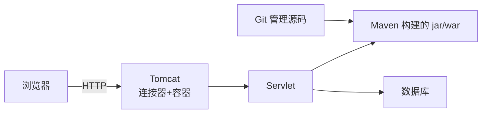

# Java Web 基础：Servlet、Tomcat、Maven、Git 与前后端分离

> 这份笔记的目标读者：已学完 Java 核心、并发、MySQL 等基础课，准备进入 Web/框架方向的校招候选人。  
> 阅读方式：第一次学习按顺序读第 0~5 章；面试前重点回看第 1、2 章；冲刺阶段直接做第 6 章自测题。  
> 配套课程：HTTP 细节在《计算机网络》展开；Spring 家族在下一门课；本课把“请求怎么进来、工程怎么组织”讲清。  
> 示例以 Servlet 4.0 / Tomcat 9 / Maven 3.8 / Git 2.x 为准。

### 怎么用这份笔记

- **打通链路**：第 1~2 章从浏览器请求讲到 Servlet 处理，是“项目里请求流程”的标准答法；
- **工程能力**：第 3 章 Maven、第 4 章 Git 是笔试和协作的基本功；
- **接口设计**：第 5 章 RESTful 与前后端分离直接对应项目中的 Controller 层设计。

## 目录

- [0. 学习地图：Java Web 考什么](#0-学习地图java-web-考什么)
- [1. Web 基础：请求链路与会话](#1-web-基础请求链路与会话)
- [2. Servlet 与 Tomcat](#2-servlet-与-tomcat)
- [3. Maven 构建工具](#3-maven-构建工具)
- [4. Git 版本控制](#4-git-版本控制)
- [5. 前后端分离与 RESTful](#5-前后端分离与-restful)
- [6. 高频自测题与参考资料](#6-高频自测题与参考资料)

---

## 0. 学习地图：Java Web 考什么

Java Web 是“框架层”的前置：Servlet/Tomcat 是 Spring MVC 的地基，Maven/Git 是每天都要用的工程工具，RESTful 是接口设计的通用语言。

### 0.1 本课程覆盖的高频考点

| 主题 | 大厂高频考点 | 面试权重 |
|---|---|---|
| Web 基础 | 请求链路、Cookie/Session、静态/动态资源 | ★★★ |
| Servlet | 生命周期、Filter/Listener、线程安全 | ★★★★ |
| Tomcat | 架构、线程模型、连接器与容器 | ★★★ |
| Maven | 坐标/依赖、生命周期、常用插件 | ★★★ |
| Git | 三区、分支合并、回滚 | ★★★★ |
| RESTful | 资源设计、状态码、统一响应、CORS | ★★★★ |

### 0.2 知识体系图



### 0.3 学习方法

1. 先走通一条请求链路（浏览器 → Tomcat → Servlet → DB → 响应），所有概念往链路上挂；
2. Maven/Git 以“每天怎么用”为纲，命令要能默写核心几条；
3. RESTful 结合项目接口讲，能说出设计取舍。

## 1. Web 基础：请求链路与会话

### 1.1 一次请求的完整链路

```text
浏览器输入 URL
→ DNS 解析域名（网络课程）
→ 建立 TCP 连接、发送 HTTP 请求（网络课程）
→ Tomcat 接收请求
→ 匹配 Servlet/Controller 处理
→ 访问数据库/缓存
→ 返回 HTTP 响应（JSON/HTML）
→ 浏览器渲染
```

### 1.2 静态资源 vs 动态资源

| 类型 | 内容 | 处理者 |
|---|---|---|
| 静态资源 | HTML/CSS/JS/图片 | Tomcat 默认 Servlet 直接返回文件 |
| 动态资源 | 依赖数据的页面/接口 | Servlet/Spring MVC 处理后生成 |

现代前后端分离后，前端静态资源由 Nginx/CDN 托管，后端只提供 JSON 接口。

### 1.3 Cookie 与 Session

- **Cookie**：保存在浏览器的小段数据，随请求自动携带；大小约 4KB；可被禁用；
- **Session**：服务端保存的用户会话状态，通过 Session ID 关联；Session ID 通常放在 Cookie 里；
- 分布式部署时 Session 要共享（Redis 存储），或用无状态 Token 替代（见第 5 章）。
- Cookie 的三个安全属性：**HttpOnly**（JS 读不到，防 XSS 窃取）、**Secure**（仅 HTTPS 传输）、**SameSite**（限制跨站携带，防 CSRF）。

```java
// 获取会话并写入属性
HttpSession session = request.getSession();
session.setAttribute("userId", 1001);
```

### 1.4 面试追问

- 问：一次 HTTP 请求在 Java Web 里怎么流转？
- 答：Tomcat 接收 → 匹配 Servlet → 业务处理 → 返回响应，链路见 1.1。
- 问：Cookie 和 Session 的区别？
- 答：Cookie 在客户端、有大小限制；Session 在服务端，靠 Session ID 关联，可存任意对象。
- 问：分布式下 Session 怎么处理？
- 答：Redis 共享 Session，或改用 JWT 无状态认证。

## 2. Servlet 与 Tomcat

### 2.1 Servlet 是什么

Servlet 是运行在 Web 容器中的 Java 组件，处理 HTTP 请求并生成响应。它是 Spring MVC 的前身，理解它的生命周期才能理解框架封装了什么。

**Servlet 与 Java EE / Jakarta EE 的关系**（版本陷阱高发区）：Servlet 4.0 属于 Java EE 8，包名 `javax.servlet`，配套 Tomcat 9；Java EE 于 2017 年移交 Eclipse 基金会、2018 年更名 **Jakarta EE**，2020 年完成包名 `javax.servlet` → `jakarta.servlet` 的更名（Servlet 5.0 / Jakarta EE 9），需要 Tomcat 10+；Servlet 6.0 对应 Jakarta EE 10 / Tomcat 10.1。陷阱题：**Tomcat 10 里 `import javax.servlet` 编译不过**，老代码要批量改包名。

### 2.2 Servlet 生命周期

```text
加载 → 实例化（构造器）→ init()（只调用一次）→ service()（每次请求）→ destroy()（容器关闭）
```

```java
@WebServlet("/hello")
public class HelloServlet extends HttpServlet {
    @Override
    public void init() { }                          // 初始化，只执行一次

    @Override
    protected void doGet(HttpServletRequest req, HttpServletResponse resp) {
        resp.getWriter().write("hello");
    }

    @Override
    public void destroy() { }                       // 销毁前清理资源
}
```

要点：

- Servlet 是**单实例多线程**：容器只创建一个实例，多个请求并发调用 service()，所以 Servlet 里的成员变量要注意线程安全；
- `service()` 根据请求方法分派到 doGet/doPost；
- `@WebServlet` 是 Servlet 3.0 注解方式，旧项目用 web.xml 配置。
- **默认懒加载**：第一次请求到达才实例化并 init()；`@WebServlet(loadOnStartup = 1)` 或 web.xml 的 `load-on-startup` 可让容器启动时就初始化；init 抛 ServletException 的常见原因是初始化资源失败。
- **JSP 本质是 Servlet**：首次访问时 JSP 被转译为 Java 再编译成 class，对应 `jspInit` / `jspService` / `jspDestroy`；前后端分离时代 JSP 已边缘化，只作了解。

### 2.3 Filter 与 Listener

| 组件 | 时机 | 用途 |
|---|---|---|
| Filter（过滤器） | 请求进入 Servlet **前/后** | 编码、登录校验、日志、跨域 |
| Listener（监听器） | 应用/会话/请求生命周期事件 | 启动初始化、在线统计 |

```java
@WebFilter("/*")
public class EncodingFilter implements Filter {
    @Override
    public void doFilter(ServletRequest request, ServletResponse response, FilterChain chain) {
        request.setCharacterEncoding("UTF-8");
        response.setCharacterEncoding("UTF-8");
        chain.doFilter(request, response);       // 放行，形成过滤器链
    }
}
```

**完整执行顺序**：`Filter.doFilter`（容器级最外层）→ DispatcherServlet → `Interceptor.preHandle` → Controller → `postHandle` → `afterCompletion` → 沿 Filter 链返回。Filter 属 Servlet 规范、先于一切 MVC 组件；Interceptor 属 Spring MVC、在 DispatcherServlet 内部围绕 Handler，两者不要混为一谈。

### 2.4 Tomcat 架构与线程模型

```text
Tomcat = Connector（连接器，处理网络 IO）+ Container（容器，管理 Servlet）
```

- **连接器**：监听端口、解析 HTTP 请求、创建 Request/Response；
- **容器**：Engine → Host → Context → Wrapper 层级，Servlet 由 Wrapper 管理；
- **线程模型**：BIO 时代一连接一线程（Tomcat 8.0 及之前默认 BIO，8.5 起弃用并默认 NIO）；8.5+/9 默认 NIO，用线程池 + 多路复用处理连接，线程数受 `maxThreads` 限制；
- 常见误区澄清：Tomcat **不使用 Netty**，连接器为自研 NIO/NIO2/APR 实现；Netty 常见于自研网关、Spring WebFlux（Reactor Netty）等场景。

**关键默认值**：默认端口 8080（HTTPS 8443）；`maxThreads` 默认 200；NIO 下 `maxConnections` 默认 10000；`acceptCount`（等待队列）默认 100。

**进阶方向（各一句定位）**：异步 Servlet（`AsyncContext` 释放容器线程，长任务不占线程池）、SSE（`text/event-stream` 单向服务端推送）、WebSocket（全双工，见《计算机网络》）；这三者都属于加分项，校招先掌握前几节的同步模型。

### 2.5 面试追问

- 问：Servlet 生命周期？
- 答：加载 → 实例化 → init → service（每次请求）→ destroy。
- 问：Servlet 线程安全吗？
- 答：单实例多线程，成员变量需注意；局部变量安全，实例字段要加锁或用 ThreadLocal。
- 问：Filter 和 Interceptor 的区别？
- 答：Filter 属于 Servlet 规范、作用在整个请求前后；Interceptor 属于 Spring MVC、作用在 Handler 调用前后。
- 问：Tomcat 怎么处理高并发？
- 答：NIO + 线程池，连接由 Selector 管理，任务交给线程池执行，线程数有上限保护。

## 3. Maven 构建工具

### 3.1 Maven 是什么

Maven 是 Java 项目的构建与依赖管理工具，负责四件事：**编译、测试、打包、依赖管理**。它基于“约定优于配置”：`src/main/java` 放源码、`src/test/java` 放测试、`pom.xml` 描述项目，目录规范后工具自动识别，不需要手写构建脚本。

```text
一个 Maven 项目 = 目录规范 + pom.xml（坐标、依赖、插件、构建配置）
```

### 3.2 坐标与仓库

每个构件用**坐标**唯一标识，坐标三要素缺一不可：

| 要素 | 含义 | 示例 |
|---|---|---|
| groupId | 组织/公司标识，常为域名倒写 | com.alibaba |
| artifactId | 项目/模块名 | fastjson |
| version | 版本号 | 1.2.83（2.x 是独立坐标 com.alibaba.fastjson2:fastjson2） |

仓库分三级，查找顺序为**本地 → 私服 → 中央**：

- **本地仓库**：默认 `~/.m2/repository`，下载过的依赖缓存到这里；
- **中央仓库**：Maven 官方维护，全网公共构件；
- **私服**：公司内部 Nexus/Artifactory，承载私有构件并代理中央仓库，团队构建更快更稳。

版本号带 `-SNAPSHOT` 表示快照版本，可拉取未发布的开发版本；注意远程快照默认按日更新（daily），`-U` 才强制拉最新；`RELEASE` 是固定发布版本，只拉一次。

### 3.3 依赖管理

```xml
<dependency>
    <groupId>mysql</groupId>
    <artifactId>mysql-connector-java</artifactId>
    <version>8.0.33</version>
</dependency>
```

`scope` 决定依赖的作用范围，是高频考点：

| scope | 编译期 | 运行期 | 说明 |
|---|---|---|---|
| compile（默认） | 有 | 有 | 主代码直接使用 |
| provided | 有 | 无 | 容器已提供，如 servlet-api、lombok |
| runtime | 无 | 有 | 运行期才需要，如 JDBC 驱动 |
| test | 测试有 | 无 | 仅测试代码用，如 JUnit |

**依赖冲突**：Maven 按“最短路径优先”，路径相同时按 pom 声明顺序“第一声明优先”；解决冲突用 `mvn dependency:tree` 看依赖树，再用 `exclusions` 排除传递依赖，或直接用 `dependencyManagement` 统一版本。

### 3.4 生命周期与常用命令

Maven 内置三套生命周期：**clean**（清理）、**default**（构建）、**site**（站点）。default 的核心阶段按顺序执行，执行后一个阶段会自动执行之前所有阶段：

```text
validate → compile → test → package → verify → install → deploy
```

| 命令 | 作用 |
|---|---|
| mvn clean | 删除 target 目录 |
| mvn compile | 编译主代码 |
| mvn test | 运行测试（触发 compile） |
| mvn package | 打包 jar/war（触发 test） |
| mvn install | 安装到本地仓库，供其他模块引用 |
| mvn deploy | 发布到私服 |
| mvn dependency:tree | 查看依赖树，排查冲突 |

常用插件：`maven-compiler-plugin` 指定编译 JDK 版本，`maven-surefire-plugin` 执行单元测试，`maven-shade-plugin` 打包含依赖的 fat jar，`spring-boot-maven-plugin` 打可执行 jar。

### 3.5 Maven vs Gradle

| 对比项 | Maven | Gradle |
|---|---|---|
| 配置文件 | pom.xml（XML） | build.gradle（Groovy/Kotlin） |
| 构建速度 | 较慢，全量执行 | 增量 + 缓存，更快 |
| 生态 | 历史最久、插件最全 | 现代 Android/Spring 项目常用 |
| 学习成本 | 约定式，规则固定 | 灵活，可编程 |

理解 Maven 后，Gradle 只需看“任务模型”即可迁移，底层依赖管理思想一致。

### 3.6 面试追问

- 问：Maven 依赖冲突怎么解决？
- 答：先 `dependency:tree` 定位冲突来源，再用 exclusions 排除传递依赖，或通过 dependencyManagement 统一版本。
- 问：SNAPSHOT 和 RELEASE 的区别？
- 答：SNAPSHOT 是未发布快照，默认按日更新、`-U` 强制拉新；RELEASE 是稳定版本，只在本地仓库缺失时下载。
- 问：执行 mvn package 会发生什么？
- 答：validate → compile → test → package 依次执行，测试失败则打包失败。

## 4. Git 版本控制

### 4.1 三区模型

Git 的一切操作都围绕三个区域：

```text
工作区（你写代码的地方）
   │ git add
   ▼
暂存区（index，已选中待提交）
   │ git commit
   ▼
本地仓库（HEAD 指向最近提交）
   │ git push
   ▼
远程仓库（GitHub/GitLab）
```

理解三区就能解释大多数命令：`git status` 看文件在哪个区，`git diff` 看工作区改动，`git diff --cached` 看暂存区改动。

### 4.2 高频命令表

| 场景 | 命令 |
|---|---|
| 初始化/配置 | git init、git config --global user.name/email |
| 提交 | git add .、git commit -m "msg" |
| 查看 | git status、git log --oneline、git diff |
| 分支 | git branch、git checkout -b feature、git switch |
| 合并 | git merge feature、git rebase main |
| 暂存现场 | git stash、git stash pop |
| 远程 | git remote add origin url、git push、git pull、git fetch |
| 打标签 | git tag v1.0.0 |

### 4.3 分支与合并

- **merge**：生成一个合并提交，保留双方历史，形成分叉再汇合的图谱；
- **rebase**：把当前分支的提交“变基”到目标分支顶端，历史是线性的一条线；代价是改写提交，已 push 的分支不要 rebase。

merge 后 main 包含合入提交 M，历史保留分叉：

```text
main:    A---M
feature: B--C
```

rebase 后 B、C 被改写为 B′、C′，接在目标分支顶端，历史呈线性：

```text
main:    A
feature:     B'--C'
```

冲突解决流程：`git merge` 报冲突 → 打开冲突文件手动合并 → `git add` 标记解决 → `git commit` 完成。冲突不可怕，关键是看懂 `<<<<<<< / ======= / >>>>>>>` 分段。

团队常见工作流：main 保护分支 + feature 分支开发 + Pull Request 评审后合入；Git Flow 在此基础上加 develop/release/hotfix 分支，适合发布节奏固定的团队。

### 4.4 回滚与撤销

| 命令 | 效果 | 适用 |
|---|---|---|
| git reset --soft HEAD~1 | 撤销提交，改动留在暂存区 | 提交信息写错了 |
| git reset --mixed HEAD~1 | 撤销提交，改动回到工作区 | 提交内容要改 |
| git reset --hard HEAD~1 | 彻底丢弃提交与改动 | 确定不要了（危险） |
| git revert <commit> | 生成一个反向新提交 | 已 push 到共享分支 |

原则：**未 push 用 reset，已 push 用 revert**。revert 不改写历史，协作时最安全。

### 4.5 团队协作要点

- `.gitignore` 忽略 target/、.idea/、*.log 等不该入库的文件；
- 提交粒度：一个功能/一个修复一次提交，message 写清“做了什么、为什么”；
- 拉取代码：`git pull` = fetch + merge，先 commit 或 stash 再 pull，避免工作区被覆盖；
- 评审：PR 里 diff 最小化，rebase 后 force push 前先和团队确认。

### 4.6 面试追问

- 问：merge 和 rebase 的区别？
- 答：merge 保留分叉历史、产生合并提交；rebase 线性化历史、改写提交；已共享的分支用 merge。
- 问：reset 和 revert 的区别？
- 答：reset 移动 HEAD 丢弃提交，适合未 push；revert 新增反向提交，适合已 push。
- 问：pull 和 fetch 的区别？
- 答：fetch 只下载不合并，pull 下载并合并（fetch + merge）。

## 5. 前后端分离与 RESTful

### 5.1 前后端分离

传统模式是 JSP 在后端渲染 HTML，前后端代码耦合在同一工程；前后端分离后：

```text
前端（Vue/React）静态资源 → Nginx 托管，反向代理 /api；页面渲染发生在浏览器端（JS 执行），Nginx 不参与渲染
后端（Spring Boot）只提供 JSON API，负责业务与数据
浏览器请求 /api/** → Nginx 反向代理到后端
```

收益：前端后端独立开发部署、可并行、可复用同一套 API 给 App；代价：跨域、接口契约、联调成本上升，需要统一响应规范。

### 5.2 RESTful 设计

**Spring MVC 前瞻框**：这些接口最终由 Spring MVC 处理——`DispatcherServlet` → `HandlerMapping` → `HandlerAdapter`（`@RequestBody` 经 HttpMessageConverter 反序列化 JSON）→ Controller → 返回写出，详见《Spring 家族》。

REST 把一切抽象为**资源**，URL 用名词复数，操作用 HTTP 方法表达：

| 方法 | 语义 | 示例 | 幂等 |
|---|---|---|---|
| GET | 查询 | GET /users/1 | 是 |
| POST | 新增 | POST /users | 否 |
| PUT | 整体更新 | PUT /users/1 | 是 |
| PATCH | 部分更新 | PATCH /users/1 | 否 |
| DELETE | 删除 | DELETE /users/1 | 是 |

状态码语义要准确：

| 状态码 | 含义 |
|---|---|
| 200 OK | 查询/更新成功 |
| 201 Created | 新增成功 |
| 204 No Content | 删除成功，无返回体 |
| 400 Bad Request | 参数错误 |
| 401 Unauthorized | 未认证 |
| 403 Forbidden | 无权限 |
| 404 Not Found | 资源不存在 |
| 409 Conflict | 资源冲突（如重复创建） |
| 500 Internal Server Error | 服务端异常 |
| 502 Bad Gateway | 网关/上游异常 |

统一响应体：业务码 + 消息 + 数据，例如 `{"code":0,"msg":"ok","data":{...}}`；分页接口固定返回 `page/size/total/list`。

### 5.3 认证与鉴权：Session vs JWT

```text
Session 方案：登录成功 → 服务端存 Session → 返回 Session ID（放 Cookie）
             → 后续请求带 Cookie → 服务端查 Session 校验
JWT 方案：登录成功 → 服务端签发 JWT → 客户端保存（Header/本地存储）
         → 后续请求带 Authorization: Bearer <token> → 服务端验签即可
```

JWT 由三部分组成：**Header（算法）+ Payload（业务声明）+ Signature（签名）**，用 base64url 编码后拼接，签名用密钥生成，防篡改。注意 Payload 是明文，**不要放密码等敏感信息**。

| 对比 | Session | JWT |
|---|---|---|
| 存储位置 | 服务端内存/Redis | 客户端 |
| 是否天然支持分布式 | 否，需共享存储 | 是，无状态 |
| 失效控制 | 服务端可即时删除 | 签发后难主动吊销，需黑名单 |
| 安全性 | 依赖 Cookie 安全属性 | 依赖密钥保管与 HTTPS |
| 适用 | 传统 Web 应用 | 前后端分离、App、微服务 |

实践建议：JWT 有效期短（如 15~30 分钟）+ refresh token 换新；关键接口可加 Redis 黑名单做兜底。

### 5.4 跨域 CORS

浏览器同源策略（协议+域名+端口都相同才算同源）会拦截跨域请求。后端通过响应头放行：

```text
Access-Control-Allow-Origin: https://front.example.com
Access-Control-Allow-Methods: GET, POST, PUT, DELETE
Access-Control-Allow-Headers: Content-Type, Authorization
```

带自定义头或非简单请求时，浏览器先发 **OPTIONS 预检请求**，后端正确响应预检后，真实请求才会发出。Spring 里用 `@CrossOrigin` 或全局 CorsConfiguration 配置。

### 5.5 接口安全底线

- 参数校验：@Valid + 注解（@NotNull/@Size/@Pattern），防脏数据与注入；
- 限流：按用户/IP 限流，防刷接口（见《微服务与高并发》Sentinel）；
- HTTPS：传输加密，防中间人；
- 敏感字段脱敏：手机号/身份证返回前打码；
- 日志不打印密码、token。

**Web 安全三件套（校招必背）**：

- **XSS（跨站脚本）**：输出转义 + CSP（内容安全策略）+ Cookie HttpOnly，防止恶意脚本窃取数据；
- **CSRF（跨站请求伪造）**：CSRF Token / Referer、Origin 校验 + Cookie SameSite，防止浏览器自动携带 Cookie 发起的伪造请求；
- **SQL 注入**：一律用 PreparedStatement 占位符（MyBatis 的 `#{}`），绝不字符串拼接 SQL。

**文件上传/下载**：上传用 `multipart/form-data` + `@MultipartConfig`/Part（Spring 用 MultipartFile）；下载用响应头 `Content-Disposition: attachment`（中文文件名需编码）。

### 5.6 面试追问

- 问：为什么 RESTful 用名词做 URL 而不用动词？
- 答：资源是稳定的实体，动作用 HTTP 方法表达；动词会让 URL 无限膨胀且语义重复。
- 问：JWT 和 Session 怎么选？
- 答：微服务/前后端分离选 JWT 无状态；需要服务端即时失效、安全要求高的场景选 Session + Redis。
- 问：跨域请求为什么会有预检？
- 答：浏览器先发 OPTIONS 探测服务端是否允许，避免直接发出有副作用的真实请求。
- 问：POST 和 PUT 的区别？
- 答：POST 新增、非幂等；PUT 整体替换、幂等，重复提交结果一致。

## 6. 高频自测题与参考资料

### 6.1 分主题自测

本页把全书高频考点压缩成分主题自测题：先盖住“一句话要点”尝试作答，再对照检查；能一次答对八成以上，就可以进入下一门课《Spring 家族》。

| 主题 | 问题 | 一句话要点 |
|---|---|---|
| 链路 | 一次请求怎么流转 | 浏览器→Tomcat→Servlet→DB→响应 |
| 资源 | 静态 vs 动态资源 | 静态直接返回文件，动态经 Servlet 生成 |
| 会话 | Cookie 存在哪 | 客户端，约 4KB，可禁用 |
| 会话 | Session 存在哪 | 服务端，靠 Session ID 关联 |
| 会话 | 分布式 Session 方案 | Redis 共享或无状态 JWT |
| Servlet | 生命周期 | 加载→实例化→init→service→destroy |
| Servlet | init 调用几次 | 一次，容器加载时执行 |
| Servlet | 线程安全 | 单实例多线程，成员变量要小心 |
| Servlet | service 如何分派 | 按方法分派 doGet/doPost |
| Filter | 过滤器作用 | 编码、登录校验、日志、跨域 |
| Filter | Filter vs Interceptor | Servlet 层前后 vs MVC Handler 前后 |
| Tomcat | 组成 | Connector 连接器 + Container 容器 |
| Tomcat | 高并发模型 | NIO + 线程池，Selector 管理连接 |
| Tomcat | 容器层级 | Engine→Host→Context→Wrapper |
| Maven | 坐标三要素 | groupId/artifactId/version |
| Maven | 仓库查找顺序 | 本地→私服→中央 |
| Maven | provided 含义 | 编译期有，运行期容器提供 |
| Maven | 依赖冲突解决 | 最短路径优先，tree+exclusions |
| Maven | 生命周期顺序 | compile→test→package→install |
| Maven | SNAPSHOT 特点 | 未发布快照，默认按日更新，-U 强制拉新 |
| Git | 三区 | 工作区/暂存区/本地仓库 |
| Git | merge vs rebase | 保留分叉 vs 线性历史 |
| Git | reset vs revert | 移 HEAD 丢弃 vs 反向新提交 |
| Git | pull vs fetch | 下载+合并 vs 仅下载 |
| Git | 冲突文件标志 | <<<<<<< / ======= / >>>>>>> |
| 分离 | 前后端分离部署 | Nginx 托管前端，反代 /api |
| REST | 资源命名 | 名词复数，操作用方法表达 |
| REST | POST vs PUT | 新增非幂等 vs 整体替换幂等 |
| REST | 201 含义 | 新增成功 |
| REST | 401 vs 403 | 未认证 vs 无权限 |
| 认证 | JWT 组成 | Header + Payload + Signature |
| 认证 | JWT 特点 | 无状态，难主动吊销 |
| CORS | 预检请求方法 | OPTIONS |
| 安全 | 接口防刷手段 | 参数校验、限流、HTTPS |

### 6.2 考前 30 分钟速记

- 一句话回答“请求链路”：浏览器 → DNS/TCP/HTTP → Tomcat 连接器 → Servlet → DB → 响应；
- 一句话回答“会话”：Cookie 客户端小数据，Session 服务端状态，分布式用 Redis 共享或 JWT 无状态；
- 一句话回答“Servlet”：单实例多线程，init 一次、service 每次、destroy 收尾；
- 一句话回答“Maven”：坐标定位构件，仓库三级查找，生命周期一串命令，依赖冲突先看树再排除；
- 一句话回答“Git”：三区模型，merge 保历史、rebase 线性化，未 push 用 reset、已 push 用 revert；
- 一句话回答“RESTful”：资源名词 + 方法动词，状态码语义化，统一响应体，JWT 无状态认证，CORS 用响应头放行。

### 6.3 参考资料

- [JavaGuide：Servlet 常见面试题总结](https://javaguide.cn/java/framework/servlet-questions.html)
- [Maven 官方文档：Maven Getting Started Guide](https://maven.apache.org/guides/getting-started/)
- [Pro Git 中文版（Git 权威指南，免费）](https://git-scm.com/book/zh/v2)
- [RESTful API 设计规范（微软）](https://learn.microsoft.com/zh-cn/azure/architecture/best-practices/api-design)
- [JWT 官网](https://jwt.io/)
- 《Tomcat 架构解析》

> 学习闭环：第 0~5 章读完、自测题能答 80% 后，进入下一门课《Spring 家族》，把 Servlet 的请求处理升级为 Spring MVC 的分层框架。
