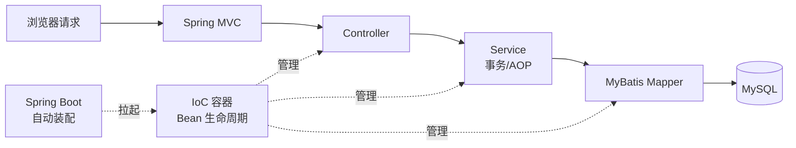

# Spring 家族：IoC/AOP、Boot 自动装配、MVC 与 MyBatis

> 这份笔记的目标读者：已学完 Java Web 基础、知道请求如何到达 Servlet 的校招候选人。  
> 阅读方式：第一次学习按顺序读第 0~8 章；面试前重点回看第 1、3、4、6 章；冲刺阶段直接做第 9 章自测题。  
> 配套课程：Servlet/Tomcat 细节在《Java Web 基础》；数据库原理在《MySQL》；本课把“容器、框架怎么把请求变成业务代码”讲透。  
> 示例以 Spring Framework 6 / Spring Boot 3 / MyBatis-Plus 3.5 为准。

### 怎么用这份笔记

- **先抓主线**：第 1~2 章讲容器与 Bean 生命周期，是所有框架行为的根基；
- **攻难点**：第 3 章三级缓存、第 4 章 AOP 是面试高频深挖点，结合画图理解；
- **落地项目**：第 7~8 章直接对应 Controller 与 Mapper 层，写完可对照自己项目里的注解复盘。

## 目录

- [0. 学习地图：Spring 家族考什么](#0-学习地图spring-家族考什么)
- [1. IoC 与 DI](#1-ioc-与-di)
- [2. Bean 生命周期](#2-bean-生命周期)
- [3. 循环依赖与三级缓存](#3-循环依赖与三级缓存)
- [4. AOP：面向切面编程](#4-aop面向切面编程)
- [5. Spring 事务](#5-spring-事务)
- [6. Spring Boot 自动装配](#6-spring-boot-自动装配)
- [7. Spring MVC 请求流程](#7-spring-mvc-请求流程)
- [8. MyBatis 与 MyBatis-Plus](#8-mybatis-与-mybatis-plus)
- [9. 高频自测题与参考资料](#9-高频自测题与参考资料)

---

## 0. 学习地图：Spring 家族考什么

Spring 是整个 Java 后端的“操作系统”：IoC 容器管理对象，AOP 管理横切逻辑，Boot 让它开箱即用，MVC 处理请求，MyBatis 处理数据库。面试考的不是注解用法，而是**每个机制解决什么问题、底层怎么实现**。

### 0.1 本课程覆盖的高频考点

| 主题 | 大厂高频考点 | 面试权重 |
|---|---|---|
| IoC/DI | 容器、注入方式、@Autowired 原理 | ★★★★★ |
| Bean 生命周期 | 完整流程、扩展点、初始化顺序 | ★★★★ |
| 循环依赖 | 三级缓存、为什么三级 | ★★★★ |
| AOP | 动态代理、切点通知、失效场景 | ★★★★ |
| Spring 事务 | 传播行为、隔离级别、默认回滚规则、失效场景 | ★★★★★ |
| Boot 自动装配 | 原理、条件装配、自定义 starter | ★★★★ |
| Spring MVC | 请求流程、核心组件、异常处理 | ★★★★ |
| MyBatis | 缓存、`#{}` vs `${}`、动态 SQL | ★★★ |

### 0.2 知识体系图



### 0.3 学习方法

1. 每个机制先问三件事：解决什么问题、核心流程是什么、代价/坑是什么；
2. 生命周期、三级缓存、AOP、MVC 四张流程图要能手画；
3. 事务、拦截器、MyBatis 缓存等“失效场景”专门整理成清单，面试最爱考。

## 1. IoC 与 DI

### 1.1 为什么需要 IoC

没有容器时，对象自己 new 依赖：

```java
UserService service = new UserService(new UserDao(new DataSource()));
```

依赖一变（换实现、加中间层）就要改多处构造代码，类之间强耦合。**控制反转（IoC）**把“创建对象、组装依赖”的职责交给容器：对象只声明“我需要什么”，容器负责给。**依赖注入（DI）**是 IoC 的实现手段，也就是容器把依赖“送进来”。

```text
传统：对象主动 new 依赖（控制权在自己手里）
IoC：对象声明依赖，容器创建并注入（控制权反转给容器）
```

### 1.2 容器与 Bean

- **BeanFactory**：IoC 容器的根接口，负责管理 Bean 的创建与获取，懒加载；
- **ApplicationContext**：BeanFactory 的增强版，增加国际化、事件发布、资源加载、AOP 集成等，是日常使用的容器；
- **Bean**：由容器创建、装配并管理生命周期的对象，配置方式有 XML、注解（@Component/@Service/@Repository/@Controller）、@Configuration + @Bean。

**实例化时机差异**：ApplicationContext 启动时默认**预实例化全部单例**（饿汉式），所以启动慢但首次使用快、配置错误能提前暴露；BeanFactory 按需懒加载。不想被预初始化的单例可以加 `@Lazy`。

```java
@Configuration
public class AppConfig {
    @Bean
    public DataSource dataSource() {
        return new HikariDataSource();
    }
}
```

### 1.3 依赖注入的三种方式

| 方式 | 写法 | 优点 | 缺点 |
|---|---|---|---|
| 构造器注入 | 构造器参数 | 不可变、必填依赖明确、利于测试 | 依赖多时构造器臃肿 |
| Setter 注入 | setXxx() | 可选依赖、可动态改 | 依赖可变，易漏注入 |
| 字段注入 | @Autowired 字段 | 代码最少 | 难测试、隐藏依赖，不推荐 |

官方推荐**构造器注入**：依赖是 final 的，实例化时全部就绪，杜绝空指针。

### 1.4 @Autowired 是怎么工作的

```text
1. 按类型（byType）找候选 Bean
2. 找到唯一 → 直接注入
3. 找到多个 → 先按 @Qualifier 过滤 → 再按 @Primary 决胜 → 最后才按字段/参数名回退；仍不唯一 → 抛 NoUniqueBeanDefinitionException
4. 一个都找不到 → 默认报错；required=false 则注入 null
```

@Qualifier("userDao") 精确指定名字；多个同类型 Bean 也常用 @Primary 标记默认首选。构造器注入时，Spring 4.3 之后可以省略 @Autowired（单构造器场景）。

**@Resource vs @Autowired**：@Resource 是 JSR-250 注解，默认**按名称**注入（找不到再按类型）；@Autowired 默认**按类型**注入。面试题：两个同类型不同名的 Bean，@Autowired + @Qualifier 或 @Resource(name = ...) 都能定位，但查找顺序不同。

### 1.5 Bean 作用域与单例线程安全

| 作用域 | 生命周期 | 适用 |
|---|---|---|
| singleton（默认） | 容器创建一次，全局共享 | 无状态 Service、Dao |
| prototype | 每次获取都新建 | 有状态对象 |
| request | 每次 HTTP 请求一个 | Web 场景 |
| session | 每个 Session 一个 | Web 场景 |

单例 Bean 本身不保证线程安全：成员变量若可写且被多线程共享，就有并发问题。实践上让 Service 保持**无状态**（只存方法局部变量），有状态数据放数据库/Redis/ThreadLocal。

**单例注入原型 Bean 的陷阱**：singleton 注入 prototype 依赖时，注入发生在原型 Bean 首次创建之时，之后拿到的始终是同一个实例（“单例陷阱”）。解法：注入 `ObjectProvider<T>` 每次 `getObject()` 新建、注入 FactoryBean，或 `@Scope(value = "prototype", proxyMode = ScopedProxyMode.TARGET_CLASS)` 生成 scoped 代理、每次调用新建。

### 1.6 面试追问

- 问：IoC 和 DI 的关系？
- 答：IoC 是设计思想（控制权反转），DI 是具体实现（容器注入依赖）。
- 问：三种注入方式选哪种？
- 答：默认构造器注入，可选依赖用 Setter，字段注入不推荐。
- 问：@Autowired 按什么找 Bean？
- 答：先按类型，多个再按字段名，最后用 @Qualifier/@Primary 精确定位。
- 问：单例 Bean 线程安全吗？
- 答：无状态就安全；有状态成员变量需避免或加同步/ThreadLocal。

## 2. Bean 生命周期

### 2.1 完整生命周期

Bean 从定义到销毁经历两大阶段：**实例化与属性填充**（容器管理）→ **初始化与销毁**（开发者可插手）。完整流程：

```text
1. 扫描/读取 Bean 定义
2. 实例化（构造器）
3. 属性填充（依赖注入）
4. 感知 Aware 接口（BeanNameAware、BeanFactoryAware、ApplicationContextAware 等）
5. BeanPostProcessor#postProcessBeforeInitialization（初始化前）
6. @PostConstruct 初始化方法
7. InitializingBean#afterPropertiesSet
8. 自定义 init-method
9. BeanPostProcessor#postProcessAfterInitialization（初始化后，AOP 代理常在此生成）
10. 使用 Bean
11. 容器关闭 → @PreDestroy → DisposableBean#destroy → 自定义 destroy-method
```

### 2.2 关键扩展点

- **BeanPostProcessor**：对**所有 Bean**生效，在初始化前后回调，是 AOP、@Autowired、@Async 等能力的底层钩子；
- **Aware 接口族**：让 Bean 拿到容器资源。注意触发机制不同：BeanNameAware / BeanFactoryAware 由 `invokeAwareMethods` 在属性填充后直接回调；ApplicationContextAware 经 `ApplicationContextAwareProcessor`（一个 BeanPostProcessor）在初始化前（第 5 步）触发。结论都是“在初始化回调之前”，但实现路径不同，深挖时能区分；
- **InitializingBean / DisposableBean**：接口方式的初始化和销毁回调；
- **init-method / destroy-method**：XML 或 @Bean(initMethod=..., destroyMethod=...) 指定。

### 2.3 初始化顺序

```text
@PostConstruct → InitializingBean.afterPropertiesSet → init-method
```

销毁顺序相反：@PreDestroy → DisposableBean.destroy → destroy-method。销毁只对 singleton 生效，prototype 容器不负责销毁。

### 2.4 面试追问

- 问：Bean 生命周期大概几步？
- 答：实例化 → 属性填充 → Aware → 初始化前后置处理器 → 初始化回调 → 使用 → 销毁。
- 问：BeanPostProcessor 有什么用？
- 答：在初始化前后统一增强所有 Bean，AOP 代理、依赖注入注解都靠它。
- 问：三种初始化方式顺序？
- 答：@PostConstruct → afterPropertiesSet → init-method。
- 问：prototype Bean 会被容器销毁吗？
- 答：不会，容器只管理 singleton 的销毁。

## 3. 循环依赖与三级缓存

### 3.1 什么是循环依赖

```java
@Service class A { @Autowired B b; }
@Service class B { @Autowired A a; }
```

A 需要 B，B 又需要 A，容器创建 A 时发现缺 B，创建 B 时又发现缺 A，形成死循环。Spring 用**三级缓存**打破这个环。

### 3.2 三级缓存结构

| 级别 | 名称 | 存什么 |
|---|---|---|
| 一级 | singletonObjects | 创建完成的成品 Bean |
| 二级 | earlySingletonObjects | 提前暴露的早期 Bean（未完成初始化） |
| 三级 | singletonFactories | ObjectFactory 工厂，能生成早期 Bean 引用 |

### 3.3 属性填充（字段/Setter）注入如何被解决

```text
创建 A：实例化 A → 放入三级缓存（保存 A 的 ObjectFactory）
       → 填充 B → 发现 B 未创建
创建 B：实例化 B → 放入三级缓存
       → 填充 A → 从三级缓存拿到 A 的 ObjectFactory
       → 生成 A 的早期引用（挪到二级缓存）→ 注入给 B
       → B 初始化完成 → 存入一级缓存
回到 A：拿到 B → 注入完成 → A 初始化完成 → 存入一级缓存
```

关键点：B 拿到的是 A 的**早期引用**（对象已实例化、属性还没填完），因为引用相同，最终 A 完成初始化后 B 里的 A 也是成品。

### 3.4 为什么需要三级而不是两级

如果只有两级（缓存成品 + 早期引用），AOP 代理会有问题：A 需要被代理时，代理对象应在初始化后由 BeanPostProcessor 生成；但 B 在 A 初始化前就要引用 A，如果提前把 A 的早期引用放进二级缓存，后续 AOP 创建的代理就和 B 持有的引用不一致。

三级缓存存的是 **ObjectFactory**（一个能产出早期引用的工厂），等到真正有人需要 A 时，ObjectFactory 判断：需要代理就返回代理，不需要就返回原始对象。这样**代理的创建被推迟到真正需要的时刻**，既解决循环依赖，又保证代理一致。

### 3.5 哪些循环依赖解决不了

- **构造器注入**：实例化都完成不了，无从提前暴露；
- **prototype 作用域**：不缓存，无法提前引用；
- **@Async 参与循环依赖**：注入到其他 Bean 的可能是原始对象导致异步失效，或抛 `BeanCurrentlyInCreationException`，应避免 @Async 依赖循环（三级缓存的早期代理机制通常能兜住 @Transactional，但 @Async 是典型坑）；
- 多例/懒加载结合构造器的复杂场景。

解决建议：循环依赖本质是设计问题，优先重构（抽出公共依赖或依赖抽象接口），不要依赖三级缓存兜底。

**版本事实**：Spring Boot 2.6 起默认**禁止循环引用**（`spring.main.allow-circular-references=false`），出现循环依赖会直接启动报错，需要显式开启；且三级缓存只能解决字段/Setter 注入，构造器循环依赖仍不可解。

### 3.6 面试追问

- 问：三级缓存各存什么？
- 答：成品、早期引用、能生成早期引用的 ObjectFactory。
- 问：为什么三级缓存能解决 setter 循环依赖？
- 答：实例化后先暴露 ObjectFactory，依赖方拿到早期引用，最后再补完整初始化。
- 问：为什么不用二级缓存？
- 答：二级缓存无法正确处理 AOP 代理的创建时机，会拿到与最终代理不一致的对象。
- 问：构造器循环依赖能解决吗？
- 答：不能，构造器阶段无法提前暴露；可用 @Lazy 打破或重构设计。

## 4. AOP：面向切面编程

### 4.1 AOP 解决什么问题

日志、事务、权限校验、性能统计这类逻辑散落在每个业务方法里，重复且难维护。**AOP（面向切面编程）**把这些“横切关注点”抽出来统一处理，业务代码保持纯净。

```text
没有 AOP：每个方法里手写 日志→业务→事务→日志
有 AOP：切面定义 日志/事务，业务方法只写业务
```

### 4.2 核心术语

| 术语 | 含义 |
|---|---|
| 切面 Aspect | 横切逻辑的模块（切点 + 通知） |
| 切点 Pointcut | 匹配哪些方法，用表达式如 execution(* com.demo.service.*.*(..)) |
| 通知 Advice | 在切点执行的逻辑（5 种类型） |
| 连接点 JoinPoint | 能被切点匹配的方法调用点 |
| 织入 Weaving | 把切面应用到目标对象生成代理的过程 |

### 4.3 通知类型

| 通知 | 时机 | 典型用途 |
|---|---|---|
| @Before | 方法执行前 | 校验、日志 |
| @After | 方法结束后（无论成败） | 清理资源 |
| @AfterReturning | 正常返回后 | 记录结果 |
| @AfterThrowing | 抛异常后 | 告警 |
| @Around | 前后都能管，可决定是否执行原方法 | 事务、限流、耗时统计 |

**多个切面的执行顺序**：用 `@Order(数字)` 或实现 Ordered 接口排序，值小者优先。方向要注意：`@Before` 按升序执行（值小的先），`@After`/`@AfterReturning`/`@AfterThrowing` 按降序执行（值小的后），像洋葱一样环绕；同一个 @Around 切面内，`proceed()` 之前相当于 before、之后相当于 after。

### 4.4 实现原理：JDK 动态代理 vs CGLIB

AOP 通过**动态代理**实现：不修改目标类字节码，而是生成一个代理对象，调用时先经过代理逻辑。

- **JDK 动态代理**：目标类必须实现接口，运行时用 Proxy + InvocationHandler 生成接口代理；
- **CGLIB**：目标类无需接口，通过字节码技术生成目标类的子类，重写方法织入逻辑；final 类/方法无法被代理。

```text
Spring 选择：目标有接口且 proxyTargetClass=false → JDK 代理
否则 → CGLIB。Spring Boot 2.x 起默认强制 CGLIB
```

代码层面可显式强制 CGLIB：`@EnableAspectJAutoProxy(proxyTargetClass = true)`；Boot 2.x 起默认就是 CGLIB，一般无需配置。

### 4.5 AOP/事务失效场景

- **同类内部调用**：this.method() 走的是原始对象而不是代理，切面不生效；应注入自身代理或拆分 Bean；
- **private/final 方法**：CGLIB 无法重写；
- **异常被吞**：事务切面只在异常“抛出方法外”时回滚，catch 后不抛就失效；
- **方法不是 public**：Spring 事务默认只代理 public 方法。

### 4.6 面试追问

- 问：AOP 的原理？
- 答：动态代理；有接口用 JDK Proxy，无接口用 CGLIB 子类代理。
- 问：JDK 代理和 CGLIB 的区别？
- 答：前者要求接口、基于 InvocationHandler；后者生成子类、final 方法不行。
- 问：同类调用为什么 AOP 失效？
- 答：this 指向原始对象，没经过代理；要自注入代理或拆类。
- 问：@Transactional 什么时候失效？
- 答：同类调用、非 public、异常被 catch、异常类型不含 rollbackFor 指定类型等。

## 5. Spring 事务

Spring 事务是校招第一梯队考点：它本质是**事务切面**（AOP 的具体应用），把「开启/提交/回滚」织入业务方法，业务代码只写数据库操作。

### 5.1 编程式 vs 声明式

| 方式 | 做法 | 适用 |
|---|---|---|
| 编程式 | `PlatformTransactionManager` 手动 begin/commit/rollback；`TransactionTemplate` 用 execute 回调包住业务（事务由模板管理） | 事务边界复杂、需要精细控制 |
| 声明式 | `@Transactional` 注解，事务切面自动管理 | 绝大多数业务，最简单 |

实践默认声明式；只有“一个方法内多段逻辑要分别包事务”这类场景才考虑编程式。

### 5.2 传播行为（七种）

传播行为定义“一个事务方法调用另一个事务方法时，事务如何合并”：

| 传播 | 行为 | 典型用途 |
|---|---|---|
| REQUIRED（默认） | 有事务就加入，没有就新建 | 普通业务 |
| SUPPORTS | 有则加入，没有就非事务执行 | 查询方法 |
| MANDATORY | 必须有事务，否则抛异常 | 强制在事务内调用 |
| REQUIRES_NEW | 挂起当前事务，新建独立事务 | 日志、审计（失败不影响主事务） |
| NOT_SUPPORTED | 挂起当前事务，非事务执行 | 大查询不想占事务 |
| NEVER | 有事务就抛异常 | 明确禁止事务 |
| NESTED | 保存点，内层回滚只回滚到保存点 | 部分回滚 |

重点对比：**REQUIRED** 内外合并，内层异常会带崩外层；**REQUIRES_NEW** 独立提交，日志落库不回滚；**NESTED** 借助保存点局部回滚，外层可以 catch 后继续。

### 5.3 隔离级别

`@Transactional(isolation = ...)` 可选：DEFAULT（跟随数据库，MySQL 默认 REPEATABLE_READ）/ READ_UNCOMMITTED / READ_COMMITTED / REPEATABLE_READ / SERIALIZABLE。隔离级别越高并发越差，具体语义见《MySQL》。

### 5.4 默认回滚规则（校招必考）

- **RuntimeException / Error → 回滚**；
- **受检异常（Checked Exception）→ 默认不回滚**（事务已提交，异常只抛给调用方）；
- 需要受检异常也回滚时用 `@Transactional(rollbackFor = Exception.class)`；
- `noRollbackFor` 指定某些异常不回滚。

结合 4.5：异常被 catch 吞掉、同类 this 调用、非 public 方法都会让回滚失效。

### 5.5 与 AOP 的关系与标注位置

`@Transactional` 本质是事务切面（TransactionInterceptor 实现），所以 4.x 的失效场景对它全部成立。标注位置：官方建议放在**实现类或实现方法**上，而不是接口——接口注解对 CGLIB 代理（Boot 默认）不生效，且同类调用不走代理。

### 5.6 面试追问

- 问：REQUIRED 和 REQUIRES_NEW 的区别？
- 答：REQUIRED 合并到当前事务，内层异常会导致整体回滚；REQUIRES_NEW 挂起外层、独立提交，适合日志落库。
- 问：为什么受检异常默认不回滚？
- 答：Spring 默认只对 RuntimeException/Error 回滚，受检异常视为“业务可恢复”，需要 rollbackFor 显式声明。
- 问：@Transactional 标在接口上有什么问题？
- 答：CGLIB 代理基于子类，接口注解不被继承，事务可能不生效；官方建议标在实现类/方法上。

## 6. Spring Boot 自动装配

### 6.1 起步依赖

Spring Boot 的核心卖点是“约定大于配置 + 开箱即用”。`spring-boot-starter-web` 一个依赖就带入 Tomcat、Spring MVC、Jackson 等一整套 Web 场景依赖，不再手动管理版本。

**内嵌 Tomcat 机制**：`spring-boot-starter-web` 默认带入 `spring-boot-starter-tomcat`；内嵌容器由 `ServletWebServerFactoryAutoConfiguration` + `TomcatServletWebServerFactory` 创建，`server.port` 等配置生效；想换 Undertow/Jetty 只需替换 starter 依赖。

注：“不再手动管理版本”需配合 `spring-boot-starter-parent` 或 BOM（dependencyManagement）才成立，裸加 starter 不会有版本管理。

**Boot 2 vs 3 / Jakarta 迁移**：Boot 3 要求 Spring Framework 6 + Java 17+，`javax.*` 全部迁移为 `jakarta.*`（内嵌 Tomcat 10.1 / Servlet 6.0）；Boot 2.7 用 `AutoConfiguration.imports` 作为迁移过渡；Boot 3 还引入 AOT / GraalVM Native 支持。对照旧资料（javax）时会踩包名坑。

### 6.2 @SpringBootApplication 组合注解

```java
@SpringBootApplication
public class DemoApplication {
    public static void main(String[] args) {
        SpringApplication.run(DemoApplication.class, args);
    }
}
```

它由三个注解组合：@SpringBootConfiguration（配置类）、@EnableAutoConfiguration（开启自动装配）、@ComponentScan（扫描启动类所在包及子包）。

### 6.3 @EnableAutoConfiguration 原理

```text
@EnableAutoConfiguration
  → 通过 @Import 导入 AutoConfigurationImportSelector
  → 读取 META-INF/spring/org.springframework.boot.autoconfigure.AutoConfiguration.imports
     （Boot 2.7 之前是 spring.factories 里的全限定键 org.springframework.boot.autoconfigure.EnableAutoConfiguration）
  → 得到候选自动配置类列表
  → 按 @Conditional* 条件逐个判断是否生效
  → 生效的配置类注册成 Bean
```

这就是“引入 starter 就自动配好”的底层：候选配置在 jar 里声明，启动时按条件挑选。想排查装了哪些配置，可在启动参数加 `--debug` 或 `--trace`，会打印自动装配报告（Positive/Negative matches）。

### 6.4 @Conditional 条件装配

| 注解 | 生效条件 |
|---|---|
| @ConditionalOnClass / OnMissingClass | 类路径有没有某个类 |
| @ConditionalOnBean / OnMissingBean | 容器有没有某个 Bean |
| @ConditionalOnProperty | 配置项是否满足 |
| @ConditionalOnWebApplication | 是否是 Web 应用 |

正是这些条件让同一个 jar 在 Web 项目和非 Web 项目里装配出不同结果。

### 6.5 自定义 Starter 步骤

```text
1. 建 auto-configuration 模块：写 @AutoConfiguration 配置类 + 条件注解
2. 在 META-INF/spring/...AutoConfiguration.imports 里声明配置类全限定名
3. 建 starter 模块：依赖自动配置模块 + 场景依赖
4. 提供 spring-configuration-metadata 让 IDE 有属性提示
```

**外部化配置优先级**（高→低）：命令行参数 > Java 系统属性（-D）> OS 环境变量 > `application-{profile}.yml` > `application.yml` > 默认值。`@ConfigurationProperties` 把配置绑定成类型安全对象，`@Value("${key}")` 取单个值；`spring.profiles.active` 激活 profile。

### 6.6 面试追问

- 问：自动装配原理一句话？
- 答：@EnableAutoConfiguration 导入选择器，读 SPI 文件拿到候选配置，再按 @Conditional 条件决定是否装配。
- 问：如何关闭某个自动配置？
- 答：@SpringBootApplication(exclude = DataSourceAutoConfiguration.class) 或配置 spring.autoconfigure.exclude。
- 问：自定义 starter 怎么做？
- 答：自动配置类 + imports 声明 + 条件注解 + starter 聚合依赖。

## 7. Spring MVC 请求流程

**与自动装配衔接**：Boot 的 `DispatcherServletAutoConfiguration` 自动注册 DispatcherServlet 并绑定 `spring.mvc.*` 配置，所以引入 starter-web 后 MVC 组件无需手配——上一章的自动装配在这里落到 MVC。

### 7.1 一次请求的完整流程

```text
请求 → Tomcat → DispatcherServlet（前端控制器）
  → HandlerMapping 找 Handler（Controller 方法 + 拦截器链）
  → HandlerAdapter 适配调用（参数解析、校验）
  → 拦截器 preHandle → Controller 方法执行
  → 拦截器 postHandle → 返回值处理（@ResponseBody 转 JSON / 视图解析）
  → 拦截器 afterCompletion → 响应返回客户端
```

### 7.2 核心组件

| 组件 | 职责 |
|---|---|
| DispatcherServlet | 统一入口，调度所有环节 |
| HandlerMapping | 根据 URL 找处理器及拦截器 |
| HandlerAdapter | 调用处理器，负责参数绑定 |
| HandlerExceptionResolver | 异常解析 |
| ViewResolver | 视图解析（JSON 场景基本用不到） |

### 7.3 常用注解

| 注解 | 用途 |
|---|---|
| @RequestMapping / @GetMapping / @PostMapping | 映射 URL 与方法 |
| @RequestParam | 绑定查询参数 |
| @PathVariable | 绑定路径参数 /users/{id} |
| @RequestBody | 反序列化 JSON 为对象 |
| @ResponseBody / @RestController | 返回值写为 JSON |
| @RequestHeader | 读取请求头 |

### 7.4 拦截器与 Filter

```text
Filter（Servlet 规范）：请求进 Servlet 前后，作用范围更大
Interceptor（Spring MVC）：Handler 调用前后，能拿到 Handler 对象
顺序：Filter → Interceptor.preHandle → Controller → Interceptor.postHandle → Interceptor.afterCompletion → Filter 返回
```

实现：实现 HandlerInterceptor 接口（preHandle/postHandle/afterCompletion），在 WebMvcConfigurer 里注册拦截路径。

### 7.5 统一异常处理

```java
@RestControllerAdvice
public class GlobalExceptionHandler {
    @ExceptionHandler(BizException.class)
    public Result handleBiz(BizException e) {
        return Result.fail(e.getCode(), e.getMessage());
    }
}
```

业务异常 → 统一响应业务码；未捕获异常 → 兜底 500。避免把异常堆栈直接抛给前端。

### 7.6 面试追问

- 问：Spring MVC 一次请求经过哪些组件？
- 答：DispatcherServlet → HandlerMapping → HandlerAdapter → 拦截器 → Controller → 返回值处理 → 响应。
- 问：HandlerAdapter 的作用？
- 答：把请求参数适配成方法参数，并调用处理器。
- 问：Filter 和 Interceptor 顺序？
- 答：Filter 先，Interceptor 在 Controller 前后，afterCompletion 最后。
- 问：统一异常处理怎么做？
- 答：@RestControllerAdvice + @ExceptionHandler，分类返回业务码。

## 8. MyBatis 与 MyBatis-Plus

### 8.1 JDBC 的痛点

JDBC 手写要处理连接、PreparedStatement、ResultSet 遍历、异常关闭，样板代码多且易错。MyBatis 半自动 ORM 把 SQL 与 Java 映射分离：SQL 写在 XML 或注解里，参数自动绑定，结果自动映射成对象。

```text
JDBC：手动连接 → 手动设参 → 手动取结果 → 手动关资源
MyBatis：写 SQL → 自动参数绑定与结果映射，Mapper 接口直接调
```

### 8.2 核心组件与 `#{}` vs `${}`

- **SqlSessionFactory**：基于配置构建，是 MyBatis 入口；
- **SqlSession**：执行 SQL 的会话，默认非线程安全，每次请求用完关闭；
- **Mapper 接口**：接口 + XML/注解映射，MyBatis 用动态代理生成实现类。

```xml
<select id="selectById" resultType="User">
    SELECT * FROM user WHERE id = #{id}
</select>
```

| 写法 | 行为 | 安全性 |
|---|---|---|
| `#{}` | 预编译占位符 ?，参数走 setXxx | 防 SQL 注入 |
| `${}` | 直接字符串拼接进 SQL | 有注入风险，只用于表名/排序字段等 |

### 8.3 一级缓存与二级缓存

- **一级缓存**：默认开启，**SqlSession 级别**；同一会话内相同 SQL 命中缓存，会话关闭即失效；增删改会清空；
- **二级缓存**：**namespace（Mapper）级别**，跨会话共享；需在 XML 配置 `<cache/>` 开启。条件与坑：缓存对象必须**可序列化**；多表关联查询跨 namespace 时可能读到脏数据（用 `cache-ref` 关联或干脆关闭）；`localCacheScope` 控制一级缓存作用域、`flushCache` 控制 DML 是否清缓存；拿不准就直接用 Redis。

### 8.4 动态 SQL

`<if>`、`<where>`、`<choose>`、`<foreach>`、`<set>` 标签按条件拼接 SQL：

```xml
<select id="list" resultType="User">
    SELECT * FROM user
    <where>
        <if test="name != null"> AND name = #{name}</if>
        <if test="age != null"> AND age = #{age}</if>
    </where>
</select>
```

`<where>` 自动去掉多余的 AND/OR，`<foreach>` 用于 in 集合。

### 8.5 MyBatis-Plus 增强

MyBatis-Plus 在 MyBatis 之上提供开箱即用的能力，不侵入业务代码：

- 内置**通用 CRUD**：BaseMapper 自带 insert/selectById/updateById/deleteById，无需写 XML；
- **条件构造器**：QueryWrapper/LambdaQueryWrapper 链式拼条件，lambda 写法防字段名硬编码；
- **分页插件**：PaginationInnerInterceptor 自动生成 count + limit；
- **逻辑删除**：@TableLogic 把删除变成 update deleted=1；
- **乐观锁插件**：@Version 自动加 version 条件；
- **代码生成器**：一键生成 entity/mapper/service/controller。

```java
List<User> list = userMapper.selectList(
    new LambdaQueryWrapper<User>()
        .eq(User::getStatus, 1)
        .like(User::getName, "张")
        .orderByDesc(User::getCreateTime));
```

### 8.6 面试追问

- 问：`#{}` 和 `${}` 区别？
- 答：`#{}` 预编译占位防注入；`${}` 字符串拼接，仅限表名/排序等非用户输入场景。
- 问：MyBatis 一级缓存和二级缓存？
- 答：一级 SqlSession 级默认开；二级 namespace 级需显式开启，多表写场景慎用。
- 问：Mapper 接口没有实现类怎么调用的？
- 答：MyBatis 通过 JDK 动态代理为接口生成代理，按方法找到对应 SQL 执行。
- 问：MyBatis-Plus 解决了什么？
- 答：通用 CRUD、条件构造器、分页、逻辑删除等样板代码，SQL 需要定制时仍可写 XML。

## 9. 高频自测题与参考资料

### 9.1 分主题自测

本页把全书高频考点压缩成分主题自测题：先盖住“一句话要点”尝试作答，再对照检查；能一次答对八成以上，就可以进入下一门课《设计模式》。

| 主题 | 问题 | 一句话要点 |
|---|---|---|
| IoC | IoC 解决什么 | 对象创建与依赖交给容器，解耦 |
| IoC | 容器根接口 | BeanFactory，增强版 ApplicationContext |
| IoC | 推荐注入方式 | 构造器注入 |
| IoC | @Autowired 查找顺序 | 按类型→@Qualifier 过滤→@Primary→字段名回退 |
| IoC | 单例 Bean 线程安全 | 无状态安全，有状态成员要小心 |
| IoC | Bean 作用域 | singleton/prototype/request/session |
| 生命周期 | 实例化后第一步 | 属性填充（依赖注入） |
| 生命周期 | BeanPostProcessor 时机 | 初始化前、初始化后 |
| 生命周期 | 初始化回调顺序 | @PostConstruct→afterPropertiesSet→init-method |
| 生命周期 | Aware 接口作用 | 让 Bean 获取容器资源 |
| 循环依赖 | 三级缓存结构 | 成品/早期引用/ObjectFactory |
| 循环依赖 | 提前暴露时机 | 实例化后、属性填充前 |
| 循环依赖 | 为什么三级 | 保证 AOP 代理创建时机正确 |
| 循环依赖 | 解决不了的场景 | 构造器注入、prototype |
| AOP | AOP 解决什么 | 横切逻辑复用 |
| AOP | 切点 vs 通知 | 定位方法 vs 执行逻辑 |
| AOP | 通知类型 | 五种：Before/After/Returning/Throwing/Around |
| AOP | JDK 代理前提 | 目标必须实现接口 |
| AOP | CGLIB 原理 | 生成子类重写方法 |
| AOP | AOP 失效场景 | 同类 this 调用、private/final |
| 事务 | 事务失效场景 | 同类调用、异常被吞、非 public |
| Boot | 自动装配入口 | @EnableAutoConfiguration |
| Boot | 候选配置来源 | AutoConfiguration.imports / spring.factories |
| Boot | 条件装配注解 | @ConditionalOnClass/OnMissingBean 等 |
| Boot | 起步依赖作用 | 聚合场景依赖，免手动管版本 |
| MVC | 前端控制器 | DispatcherServlet |
| MVC | HandlerMapping 作用 | 按 URL 找 Handler 和拦截器 |
| MVC | HandlerAdapter 作用 | 参数适配并调用处理器 |
| MVC | 拦截器 vs Filter | 前者 MVC 层、后者 Servlet 层 |
| MVC | 统一异常处理 | @RestControllerAdvice + @ExceptionHandler |
| MyBatis | `#{}` vs `${}` | 预编译防注入 vs 字符串拼接 |
| MyBatis | 一级缓存级别 | SqlSession |
| MyBatis | 二级缓存级别 | namespace（Mapper） |
| MyBatis | Mapper 原理 | JDK 动态代理生成实现 |
| MyBatis | 动态 SQL 标签 | if/where/foreach/choose/set |
| MyBatis-Plus | 核心增强 | 通用 CRUD、条件构造器、分页 |

### 9.2 考前 30 分钟速记

- 一句话回答“IoC”：容器管创建与注入，构造器注入最稳，@Autowired 按类型→@Qualifier 过滤→@Primary→字段名回退；
- 一句话回答“生命周期”：实例化→属性填充→Aware→前后置处理器→初始化回调→使用→销毁；
- 一句话回答“三级缓存”：三级存 ObjectFactory，二级存早期引用，一级存成品，为的是代理创建时机正确；
- 一句话回答“AOP”：动态代理织入横切逻辑，JDK 要接口、CGLIB 生子类，同类调用会失效；
- 一句话回答“自动装配”：@EnableAutoConfiguration 读 SPI 候选 + @Conditional 条件筛选；
- 一句话回答“MVC”：DispatcherServlet 调度，Mapping 找方法、Adapter 调方法、异常统一处理；
- 一句话回答“MyBatis”：#{ } 预编译防注入，一级缓存 SqlSession、二级缓存 namespace，Plus 免写通用 CRUD。

### 9.3 参考资料

- [Spring 官方文档：Core Technologies](https://docs.spring.io/spring-framework/reference/core.html)
- [Spring Boot 官方文档：Auto-configuration](https://docs.spring.io/spring-boot/how-to/spring-beans-and-dependency-injection.html)
- [JavaGuide：Spring 常见面试题总结](https://javaguide.cn/system-design/framework/spring/spring-knowledge-and-questions-summary.html)
- [MyBatis 官方文档](https://mybatis.org/mybatis-3/zh_CN/index.html)
- [MyBatis-Plus 官方文档](https://baomidou.com/)
- 《Spring 揭秘》（王福强）

> 学习闭环：第 0~8 章读完、第 9 章自测题能答 80% 后，进入下一门课《设计模式》，把框架源码里反复出现的设计套路提炼成可复用思维。
