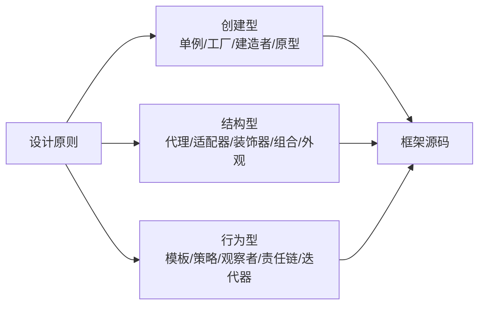

# 设计模式：23 种模式与框架源码体现

> 这份笔记的目标读者：已学完 Java 核心与 Spring 家族，想在阅读源码、系统设计时具备通用设计语言的校招候选人。  
> 阅读方式：第一次按顺序读第 0~4 章，重点记“解决什么问题 + 一个代码骨架”；面试前回看第 5 章框架体现；冲刺阶段做第 6 章自测题。  
> 配套课程：动态代理与反射细节在《Java 核心》，AOP 在《Spring 家族》；本课把它们串成设计套路。  
> 模式命名以 GoF 23 种为准，示例代码均为最小骨架。

### 怎么用这份笔记

- **记场景不记代码**：每个模式先记住“什么场景用、结构长什么样”，代码能写出骨架即可；
- **对号入座**：第 5 章把框架源码里的模式列成对照表，是面试“你在源码里见过哪些模式”的答题弹药；
- **克制使用**：模式是工具不是 KPI，能用简单代码解决就不硬套模式。

## 目录

- [0. 学习地图：设计模式考什么](#0-学习地图设计模式考什么)
- [1. 设计原则：模式的地基](#1-设计原则模式的地基)
- [2. 创建型模式](#2-创建型模式)
- [3. 结构型模式](#3-结构型模式)
- [4. 行为型模式](#4-行为型模式)
- [5. 框架源码中的设计模式](#5-框架源码中的设计模式)
- [6. 高频自测题与参考资料](#6-高频自测题与参考资料)

---

## 0. 学习地图：设计模式考什么

设计模式是**面向对象设计原则的落地套路**。大厂面试常考三类：经典模式的意图与结构（单例/工厂/代理/模板/观察者）、框架源码里的体现（Spring/MyBatis/Netty）、以及项目里实际用过的场景。

### 0.1 本课程覆盖的高频考点

| 主题 | 大厂高频考点 | 面试权重 |
|---|---|---|
| 设计原则 | 开闭、单一职责、依赖倒置 | ★★★★ |
| 创建型 | 单例、工厂三兄弟、建造者 | ★★★★★ |
| 结构型 | 代理、适配器、装饰器 | ★★★★ |
| 行为型 | 模板、策略、观察者、责任链 | ★★★★ |
| 源码体现 | Spring/MyBatis 中的模式对照 | ★★★★ |

### 0.2 知识体系图



说明：图为**示意子集**，正文覆盖全部 5 种创建型 + 7 种结构型 + 11 种行为型。

### 0.3 学习方法

1. 每个模式用四问法：解决什么问题、核心角色有哪些、类图长什么样、框架哪里用了；
2. 单例、工厂、代理、模板、观察者、责任链这六个必须能手写骨架；
3. 面试“用过什么模式”要结合自己的项目场景讲，而不是背定义。

## 1. 设计原则：模式的地基

### 1.1 七大原则速记

| 原则 | 一句话 |
|---|---|
| 单一职责 SRP | 一个类只负责一件事，变化只影响一个职责 |
| 开闭原则 OCP | 对扩展开放、对修改关闭，加功能不加旧代码 |
| 里氏替换 LSP | 子类必须能替换父类且行为不破坏 |
| 接口隔离 ISP | 客户端只依赖它需要的接口，不强迫实现用不到的方法 |
| 依赖倒置 DIP | 依赖抽象不依赖具体，高层不依赖低层 |
| 迪米特法则 LoD | 最少知道原则，不和自己无关的对象打交道 |
| 合成复用 CARP | 优先组合/聚合，而不是继承复用 |

### 1.2 开闭原则最核心

开闭原则是 OO 设计的北极星：需求变化时优先**新增**类/接口，而不是修改已验证的旧代码。策略模式、模板方法、装饰器本质都是开闭原则的落地：把变化点封装，新增实现即可扩展。

```java
// 反例：加一种支付就要改 if-else
if (type == 1) { payByAlipay(); } else if (type == 2) { payByWechat(); }

// 正例：定义支付接口，新增实现类，调用方只依赖接口
interface PayStrategy { void pay(); }
class AlipayStrategy implements PayStrategy { public void pay() { } }
```

### 1.3 面试追问

- 问：开闭原则是什么，怎么做到？
- 答：对扩展开放、对修改关闭；用接口/抽象封装变化点，新增实现而不是改旧逻辑。
- 问：依赖倒置和依赖注入的关系？
- 答：依赖倒置是设计原则（面向抽象），依赖注入是 Spring 实现该原则的手段。
- 问：继承和组合怎么选？
- 答：is-a 且复用稳定用继承；否则优先组合，避免脆弱的基类。

## 2. 创建型模式

### 2.1 单例模式

保证一个类**全局只有一个实例**，并提供全局访问点。常见写法：

| 写法 | 特点 |
|---|---|
| 饿汉式 | 类加载即创建，简单但可能浪费 |
| 懒汉式（同步方法） | 用到才创建，但锁开销大 |
| 双重检查 DCL | 判空 + synchronized + volatile，兼顾性能与安全 |
| 静态内部类 | 由 JVM 保证懒加载与线程安全，推荐 |
| 枚举 | 天然防反射/序列化破坏，最推荐 |

```java
public class Singleton {
    private Singleton() { }
    private static volatile Singleton instance;
    public static Singleton getInstance() {
        if (instance == null) {                 // 第一次判空，减少锁竞争
            synchronized (Singleton.class) {
                if (instance == null) {         // 第二次判空，防止重复创建
                    instance = new Singleton();
                }
            }
        }
        return instance;
    }
}
```

`volatile` 的作用：防止指令重排导致返回“未完成构造”的对象。另两种推荐写法的骨架：

```java
// 静态内部类：由 JVM 保证懒加载 + 线程安全
public class Singleton {
    private Singleton() { }
    private static class Holder { static final Singleton INSTANCE = new Singleton(); }
    public static Singleton getInstance() { return Holder.INSTANCE; }
}

// 枚举：反射/序列化双免疫，最推荐
public enum Singleton {
    INSTANCE
}
```

破坏单例的途径：反射调用私有构造器、序列化反序列化。防御：**只有枚举对反射/序列化双双免疫**（`Constructor.newInstance` 对枚举直接抛 IllegalArgumentException，反序列化走 `valueOf` 返回同一实例）；其余写法用“判断实例已存在才抛异常”的构造器校验 + 重写 `readResolve()` 返回同一实例——直接“构造器里抛异常”会让合法创建也失败，是常见错误写法。

### 2.2 工厂模式三兄弟

| 模式 | 核心 | 场景 |
|---|---|---|
| 简单工厂 | 一个工厂类按参数返回产品 | 产品少、类型固定 |
| 工厂方法 | 抽象工厂 + 每个产品一个工厂子类 | 新增产品只需加类，符合开闭 |
| 抽象工厂 | 工厂接口一次创建一族产品 | 产品族（如不同系统的按钮+文本框） |

注意：**简单工厂不属于 GoF 23 种**（GoF 创建型只有 5 种：单例/工厂方法/抽象工厂/建造者/原型）；它是惯用法且违反开闭，工厂方法正是针对它的改进——校招经典坑题。

```java
// 工厂方法：每个产品对应一个工厂
interface ProductFactory { Product create(); }
class AFactory implements ProductFactory { public Product create() { return new A(); } }
```

Spring 的 BeanFactory 是工厂模式的代表：通过名字/类型“生产”Bean，屏蔽创建细节。

### 2.3 建造者模式

对象构造参数多且可选时，用 Builder 链式设置，避免构造器参数爆炸：

```java
User user = User.builder()
    .name("张三")
    .age(20)
    .build();
```

Lombok 的 @Builder、Spring 的 BeanDefinitionBuilder 都是典型应用。核心：把“构造过程”与“对象本身”分离。

### 2.4 原型模式

用已有对象克隆出新对象，避免重复初始化：实现 Cloneable 接口重写 clone()。三个细节：Cloneable 是**标记接口**，不实现就调 clone() 会抛 `CloneNotSupportedException`；`Object.clone()` 是 protected，必须重写为 public 才能外部调用；默认是**浅拷贝**（数组/集合成员仍共享引用），深拷贝要手动复制内部对象或用序列化流。

### 2.5 面试追问

- 问：单例的线程安全问题？
- 答：饿汉类加载时创建天然安全；懒汉要同步；DCL 需要 volatile；静态内部类由 JVM 保证。
- 问：单例怎么被破坏、怎么防？
- 答：反射、序列化；枚举免疫，或用 readResolve/构造器校验。
- 问：工厂方法和抽象工厂区别？
- 答：前者一个产品一个工厂，后者一个工厂创建一族产品。
- 问：建造者模式解决什么？
- 答：参数多且可选时避免长构造器和可读性差的问题。

## 3. 结构型模式

### 3.1 代理模式

不直接访问目标对象，通过代理对象控制访问，可在调用前后加逻辑。静态代理手写代理类；动态代理运行时生成代理。

```text
Client → Proxy（前置逻辑 → 调 target → 后置逻辑）→ Target
```

动态代理两种实现：JDK Proxy（目标需接口）与 CGLIB（子类代理，见《Spring 家族》AOP 章）。典型应用：Spring AOP、MyBatis Mapper 代理、RPC 远程调用代理。版本细节：Spring 5.3 起使用内嵌（repackaged）的 CGLIB，Spring 6 的子类代理由 ByteBuddy 生成——答“概念上 CGLIB、新版 ByteBuddy”最稳。

### 3.2 适配器模式

把不兼容的接口转换成客户端期望的接口，解决“接口对不上”。典型：日志框架 slf4j 适配 log4j/logback；Spring MVC 的 HandlerAdapter 把不同 Controller 类型适配成统一调用。关键是**解决接口不兼容**，不改业务逻辑。

### 3.3 装饰器模式

在**不改变原对象接口**的前提下动态增强功能，一层层包装：

```java
InputStream in = new BufferedInputStream(new FileInputStream("a.txt"));
```

代理 vs 装饰器：代理控制访问（可能根本不调目标）、与目标接口常一致但职责是管控；装饰器增强功能、接口与目标一致且一定调用原对象。

### 3.4 组合模式

让“部分-整体”结构一致：文件和文件夹都实现同一接口，客户端递归调用即可。典型：文件系统目录树、Swing 组件树 / HTML DOM 树（叶子与容器实现统一接口、客户端递归调用）。

### 3.5 外观模式

为复杂子系统提供一个统一入口，客户端只依赖门面。典型：MyBatis 的 SqlSession 门面（背后是 Executor/StatementHandler 一整套）；支付系统对外一个 PayFacade。注意与代理区分：外观是**聚合多个子系统**，代理是**管控单个目标**。

### 3.6 其他结构型速记

| 模式 | 一句话 |
|---|---|
| 桥接 | 抽象与实现分离，各自独立变化（如 JDBC Driver） |
| 享元 | 共享细粒度对象，减少内存（如 Integer.valueOf 缓存 -128~127，可调 AutoBoxCacheMax；String 常量池思想一致、实现不同） |

### 3.7 面试追问

- 问：代理模式的应用？
- 答：AOP、Mapper 代理、RPC、缓存、权限。
- 问：装饰器和代理区别？
- 答：装饰器增强功能并一定调原对象；代理管控访问，可不调原对象。
- 问：适配器解决什么？
- 答：接口不兼容，转换调用，不改双方业务。
- 问：外观模式好处？
- 答：隐藏子系统复杂度，客户端只依赖统一门面。

## 4. 行为型模式

### 4.1 模板方法模式

父类定义**算法骨架**，把可变步骤延迟到子类实现：

```java
abstract class DataLoader {
    public final void load() {          // 骨架固定
        open();
        parse();
        close();
    }
    protected void open()  { }          // 钩子：默认空实现
    protected void close() { }          // 钩子
    protected abstract void parse();    // 子类实现
}
```

典型：Spring 的 JdbcTemplate、DispatcherServlet 的 doService/doDispatch 框架方法、MyBatis 的 BaseExecutor。核心：**复用骨架、子类填可变点**，同时父类用 final 防止骨架被破坏。补充：JdbcTemplate 是**模板方法 + 回调**的混合——`execute()` 定骨架，业务步骤经 PreparedStatementCallback / RowCallbackHandler 回调传入，而不是子类覆写；更“纯”的模板方法实例是 HttpServlet（doGet/doPost）与 AbstractList。

### 4.2 策略模式

把算法封装成独立策略对象，运行时替换：

```java
interface SortStrategy { void sort(int[] arr); }
class QuickSort implements SortStrategy { public void sort(int[] arr) { } }
// 客户端持有策略引用，可动态切换
```

典型：Comparator 传参、Spring Security 的认证策略、支付渠道选择。它把 if-else 的分支变成策略对象，符合开闭原则。

### 4.3 观察者模式

定义一对多依赖：主题状态变化，自动通知所有观察者：

```java
interface Observer { void update(String msg); }
class ConcreteObserver implements Observer { public void update(String msg) { } }
```

典型：Spring 的 ApplicationEvent/EventListener、消息队列的发布订阅、Swing 监听器。核心：发布者不依赖具体订阅者，只管广播。注意：`java.util.Observer/Observable` 自 Java 9 起废弃，面试别推荐；Spring 事件默认同线程同步广播，异步要加 @Async。

### 4.4 责任链模式

把处理器串成链，请求沿链传递直到被处理或到达末端：

```text
Request → FilterA → FilterB → FilterC → Handler
```

典型：Servlet FilterChain、Spring MVC 拦截器链、Netty ChannelPipeline、审批流。每个节点决定处理还是放行。

### 4.5 迭代器模式

提供统一方式遍历集合，不暴露内部结构。Java 的 Iterator/Iterable 就是标准实现，for-each 语法糖底层就是迭代器。核心：**遍历与集合解耦**。

### 4.6 其他行为型速记

| 模式 | 一句话 |
|---|---|
| 状态 | 行为随内部状态切换（如订单状态机） |
| 命令 | 请求封装成对象，支持撤销队列（如 Runnable、按钮事件） |
| 中介 | 对象间不直接通信，经中介转发（如消息中心） |
| 备忘录 | 保存并恢复对象状态（如编辑器撤销） |
| 访问者 | 数据结构与操作分离 |
| 解释器 | 定义语法并解释执行 |

### 4.7 面试追问

- 问：模板方法和策略模式区别？
- 答：模板方法是继承复用骨架、子类填步骤；策略是组合、整体替换算法。
- 问：观察者模式解决什么？
- 答：一对多解耦，主题变化广播给订阅者，如 Spring 事件。
- 问：责任链模式在哪见过？
- 答：Filter 链、Netty Pipeline、拦截器链。
- 问：策略模式相对 if-else 的优势？
- 答：分支逻辑分散到策略类，新增算法不改调用方，符合开闭。

## 5. 框架源码中的设计模式

| 框架/组件 | 模式 | 体现 |
|---|---|---|
| Spring | 工厂 | BeanFactory/ApplicationContext 创建 Bean |
| Spring | 单例 | 默认 singleton 作用域 |
| Spring | 代理 | AOP 的 JDK/CGLIB 动态代理 |
| Spring | 模板方法 | JdbcTemplate、DispatcherServlet 骨架方法 |
| Spring | 观察者 | ApplicationEvent + @EventListener |
| Spring | 责任链 | 拦截器链、Filter 链 |
| Spring | 适配器 | HandlerAdapter 适配各种 Controller |
| MyBatis | 代理 | Mapper 接口动态代理 |
| MyBatis | 外观 | SqlSession 统一入口 |
| MyBatis | 模板方法 | BaseExecutor 执行骨架 |
| Netty | 责任链 | ChannelPipeline 处理链 |
| Netty | 装饰器 | WrappedByteBuf 骨架（如 ReadOnlyByteBuf 只读包装） |
| JDK | 策略 | Comparator、线程池拒绝策略 |
| JDK | 装饰器 | IO 流 InputStream 层层包装 |
| JDK | 迭代器 | Iterator/Iterable、for-each |
| JDK | 享元 | Integer.valueOf 缓存、String 常量池 |
| Tomcat | 责任链 | 过滤器链 |
| SLF4J | 适配器/门面 | 统一日志门面适配 log4j/logback |

面试答题套路：模式名 + 框架里具体类/接口 + 它解决的那个问题，一条 30 秒内讲完。

### 5.1 面试追问

- 问：Spring 里用了哪些设计模式？
- 答：工厂（BeanFactory）、单例（默认作用域）、代理（AOP）、模板（JdbcTemplate）、观察者（事件）、责任链（拦截器）。
- 问：MyBatis 里为什么 Mapper 只有接口？
- 答：JDK 动态代理在运行时生成实现，代理按方法定位 SQL 执行。
- 问：Netty 的 ChannelPipeline 是什么模式？
- 答：责任链，事件沿链传递，每个 Handler 决定处理还是放行。

## 6. 高频自测题与参考资料

### 6.1 分主题自测

本页把全书高频考点压缩成分主题自测题：先盖住“一句话要点”尝试作答，再对照检查；能一次答对八成以上，就可以进入下一门课《消息队列》。

| 主题 | 问题 | 一句话要点 |
|---|---|---|
| 原则 | 单一职责 | 一个类只做一件事 |
| 原则 | 开闭原则 | 扩展开放、修改关闭 |
| 原则 | 里氏替换 | 子类可替换父类且不破坏行为 |
| 原则 | 依赖倒置 | 依赖抽象，不依赖具体 |
| 原则 | 合成复用 | 优先组合，少继承 |
| 单例 | DCL 为什么 volatile | 防指令重排暴露半成品 |
| 单例 | 防破坏的写法 | 枚举天然免疫反射/序列化 |
| 单例 | 静态内部类特点 | JVM 保证懒加载且线程安全 |
| 工厂 | 简单工厂缺点 | 加产品要改工厂，违反开闭 |
| 工厂 | 工厂方法 | 每个产品一个工厂子类 |
| 工厂 | 抽象工厂 | 一次创建一族产品 |
| 建造者 | 适用场景 | 参数多且可选 |
| 原型 | 浅拷贝 vs 深拷贝 | 复制引用 vs 复制内容 |
| 代理 | 动态代理前提 | JDK 需接口，CGLIB 生成子类 |
| 代理 | 代理应用 | AOP、Mapper、RPC |
| 适配器 | 解决什么 | 接口不兼容的转换 |
| 装饰器 | vs 代理 | 增强功能并调原对象 vs 管控访问 |
| 组合 | 适用结构 | 部分-整体树形结构 |
| 外观 | 好处 | 隐藏子系统，统一入口 |
| 模板 | 父类作用 | 定骨架，可变步骤交子类 |
| 模板 | 框架例子 | JdbcTemplate、DispatcherServlet |
| 策略 | 核心思想 | 算法封装可替换，替代 if-else |
| 观察者 | 核心 | 主题广播，观察者订阅 |
| 责任链 | 框架例子 | Filter 链、Netty Pipeline |
| 迭代器 | 好处 | 遍历与集合解耦 |
| 状态 | 适用 | 行为随状态切换 |
| 命令 | 典型 | 请求封装成对象，支持撤销 |
| 源码 | Spring 单例体现 | 默认 singleton 作用域 |

### 6.2 考前 30 分钟速记

- 一句话回答“原则”：开闭是总纲，单一职责定边界，依赖倒置面向抽象，组合优于继承；
- 一句话回答“单例”：枚举最稳，DCL 要 volatile，反射序列化能破坏；
- 一句话回答“工厂”：简单工厂一个类、工厂方法一个产品一个厂、抽象工厂一族产品；
- 一句话回答“代理/装饰器”：代理管访问、装饰器做增强；JDK 代理要接口、CGLIB 生子类；
- 一句话回答“模板/策略/观察者/责任链”：模板定骨架、策略换算法、观察者做广播、责任链传请求；
- 一句话回答“框架体现”：Spring 工厂+单例+代理+模板+观察者+责任链，MyBatis 代理+外观+模板，Netty 责任链。

### 6.3 参考资料

- [Refactoring Guru：设计模式（图解 + 示例）](https://refactoringguru.cn/design-patterns)
- [JavaGuide：系统设计与设计模式总结](https://javaguide.cn/system-design/)
- 《设计模式：可复用面向对象软件的基础》（GoF）
- 《Head First 设计模式》
- 《深入设计模式》（Alexander Shvets 图解版，配合 Refactoring Guru 使用）

> 学习闭环：第 0~5 章读完、自测题能答 80% 后，进入下一门课《消息队列》，把观察者、责任链思想落到分布式系统的异步架构里。
