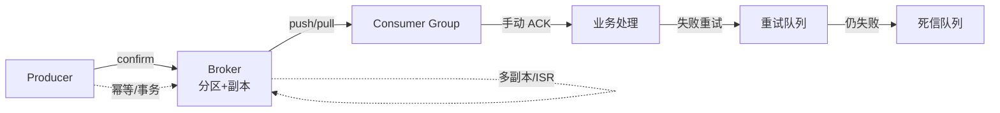

# 消息队列：Kafka/RocketMQ/RabbitMQ 选型、可靠性与高可用

> 这份笔记的目标读者：已掌握 MySQL、Redis 与 Spring 家族，准备进入分布式与高并发体系的校招候选人。  
> 阅读方式：第一次按顺序读第 0~9 章；面试前重点回看第 4~7 章（可靠性/顺序/幂等/积压）；冲刺阶段做第 10 章自测题。  
> 配套课程：MySQL 事务与 Redis 在之前课程；本课以 Kafka 为主线，RocketMQ/RabbitMQ 作对照。  
> 示例以 Kafka 3.x / RocketMQ 5.x / RabbitMQ 3.12 为准。

### 怎么用这份笔记

- **先答“为什么”**：第 1 章讲清 MQ 的价值与代价，是所有场景题的出发点；
- **背熟四问**：可靠性、顺序、幂等、积压是 MQ 面试四大必考，第 4~7 章逐条展开；
- **Kafka 精读**：第 9 章是 Kafka 原理精讲，答“Kafka 为什么快、怎么不丢消息”就靠它。

## 目录

- [0. 学习地图：消息队列考什么](#0-学习地图消息队列考什么)
- [1. 为什么用 MQ](#1-为什么用-mq)
- [2. MQ 核心模型](#2-mq-核心模型)
- [3. 三大 MQ 对比与选型](#3-三大-mq-对比与选型)
- [4. 消息可靠性：不丢消息](#4-消息可靠性不丢消息)
- [5. 顺序消息](#5-顺序消息)
- [6. 重复消费与幂等](#6-重复消费与幂等)
- [7. 消息积压与消费堆积](#7-消息积压与消费堆积)
- [8. 高可用与数据一致性](#8-高可用与数据一致性)
- [9. Kafka 核心原理](#9-kafka-核心原理)
- [10. 高频自测题与参考资料](#10-高频自测题与参考资料)

---

## 0. 学习地图：消息队列考什么

消息队列是分布式系统的“异步总线”，也是面试分水岭：从“知道三个 MQ 名字”到“能设计不丢、不乱序、可幂等的消息链路”，体现的是工程思维。

### 0.1 本课程覆盖的高频考点

| 主题 | 大厂高频考点 | 面试权重 |
|---|---|---|
| 价值与代价 | 异步/解耦/削峰，以及引入的问题 | ★★★★ |
| 三大 MQ | 各自特点与选型 | ★★★ |
| 可靠性 | 不丢消息的三段保证 | ★★★★★ |
| 顺序消息 | 全局/分区顺序实现 | ★★★★ |
| 幂等 | 重复消费原因与去重方案 | ★★★★ |
| 积压 | 原因、排查、扩容 | ★★★★ |
| 高可用 | 副本、ISR、主从 | ★★★ |
| Kafka 原理 | 存储、零拷贝、消费者组 | ★★★★★ |

### 0.2 知识体系图



### 0.3 学习方法

1. 把一条消息的一生串起来：生产 → 存储 → 消费 → 失败重试，每个环节问“会丢吗、会乱吗、会重复吗”；
2. 三大 MQ 对比表要能默写；
3. 场景题（秒杀、订单）里 MQ 的位置，与《微服务与高并发》互相对照。

## 1. 为什么用 MQ

### 1.1 三大价值

- **异步**：下单后不必同步等短信/积分/日志，消息发出去主流程立刻返回，降低响应时间；
- **解耦**：生产者不依赖消费者的实现，新增消费者不影响上游，双方只依赖 Topic/Queue 契约；
- **削峰**：秒杀等流量尖峰先压进 MQ，下游按自己的消费能力慢慢处理，避免把数据库打垮。

```text
同步链路：下单 → 扣库存 → 发短信 → 记积分 → 全部完成才返回（慢、耦合）
异步链路：下单 → 扣库存 → 发消息 → 返回；短信/积分异步消费（快、解耦）
```

### 1.2 引入 MQ 的代价

- **链路复杂度上升**：多了一个必须高可用的中间件；
- **一致性变弱**：消息处理失败导致数据不一致，需要补偿与对账；
- **重复消费**：网络重试天然可能重复，消费端必须幂等；
- **消息丢失/乱序/积压**：三类经典问题，需要专门设计兜底。

### 1.3 一个真实场景的数字对比

```text
下单同步链路：扣库存 20ms + 优惠券 15ms + 短信 200ms + 积分 50ms + 记日志 30ms
  → RT ≈ 315ms，任何一个下游抖动都会拖慢下单
引入 MQ 后：扣库存 20ms + 发消息 3ms
  → RT ≈ 25ms，短信/积分/日志异步消化，下游故障不影响下单主流程
```

**什么时候不要用 MQ**：

- 强一致场景：转账扣款双方必须同时成功，MQ 的异步最终一致不满足，要用分布式事务；
- 链路极短：只有一步下游操作且必须同步拿结果，直接调用比 MQ 简单可靠；
- 对消息时效敏感：轮询消费的延迟不可控，实时查询直接查库/接口。

**面试加分点**：能主动说出“MQ 不是银弹，引入前先问一句——这条链路能接受最终一致吗”，比背三大好处更能体现工程判断。

### 1.4 面试追问

- 问：为什么用 MQ？
- 答：异步提速、解耦上下游、削峰填谷；同时要接受复杂度与最终一致。
- 问：不用 MQ 能不能实现削峰？
- 答：可以，如本地队列/线程池 + 限流，但扩展性、解耦性不如 MQ。
- 问：MQ 带来哪些新问题？
- 答：丢失、重复、乱序、积压，以及中间件自身的高可用。
- 问：什么场景不适合用 MQ？
- 答：强一致、需要同步拿结果、链路极短的场景；引入前先确认业务能接受最终一致。

## 2. MQ 核心模型

```text
Producer（生产者）→ Broker（消息代理，负责存储与转发）→ Consumer（消费者）
```

| 概念 | 含义 |
|---|---|
| Topic | 消息主题，逻辑分类 |
| Queue | 队列，消息实体存放处 |
| Partition | 分区，Topic 的物理分片，Kafka/RocketMQ 的核心 |
| Offset | 消息在分区内的位置 |
| Consumer Group | 消费组，组内分摊、组间广播 |
| ACK | 消费确认，处理成功才提交 |

**Topic vs Queue**：Queue 是点对点（一条消息一个消费者消费）；Topic 是发布订阅（多个消费者组各拿一份）。Kafka 的 Topic 由多个 Partition 组成，Partition 内部有序，是顺序消息和并行的平衡点。

### 2.1 三大 MQ 术语映射

| 通用概念 | Kafka | RocketMQ | RabbitMQ |
|---|---|---|---|
| 消息代理 | Broker | Broker | Broker（含交换机） |
| 逻辑分类 | Topic | Topic | Exchange + Routing Key |
| 物理分片 | Partition | Queue（ConsumeQueue） | Queue |
| 消费位置 | Offset | CommitLog Offset（ConsumeQueue 存索引） | Delivery Tag（内存态） |
| 消费组 | Consumer Group | Consumer Group | 多消费者竞争同一队列 |

三大 MQ 的概念名不同但角色一一对应，面试时说“Kafka 的 Partition ≈ RabbitMQ 的 Queue ≈ RocketMQ 的 Queue”考官立刻知道你懂原理而不是背名词。

### 2.2 三种消费语义

| 语义 | 含义 | 实现方式 |
|---|---|---|
| 至多一次 at-most-once | 可能丢，绝不重复 | 自动 ACK（收到就确认） |
| 至少一次 at-least-once | 绝不丢，可能重复 | 手动 ACK + 失败重投（主流选择） |
| 精确一次 exactly-once | 不丢不重 | 幂等生产者 + 事务 + 消费端幂等，代价最高 |

面试标准答案：**生产上普遍选 at-least-once + 消费端幂等**，Kafka 的 exactly-once 只在“Kafka 读 Kafka”的流处理闭环内成立，跨系统（MQ → DB）仍要靠幂等。

### 2.3 面试追问

- 问：Topic 和 Queue 的区别？
- 答：Topic 支持多组订阅广播；Queue 一条消息只被一个消费者消费。
- 问：Partition 有什么用？
- 答：横向扩展存储与消费并行度；单分区内有序，跨分区不保证顺序。
- 问：三种消费语义怎么选？
- 答：生产选 at-least-once + 消费端幂等；exactly-once 只在闭环流处理内成立，跨系统靠幂等兜底。

## 3. 三大 MQ 对比与选型

| 维度 | Kafka | RocketMQ | RabbitMQ |
|---|---|---|---|
| 定位 | 分布式日志/流平台 | 分布式消息中间件 | 通用消息代理 |
| 吞吐 | 极高（百万级/秒） | 高（十万级/秒） | 中（万级/秒） |
| 延迟 | 毫秒级 | 毫秒级 | 亚毫秒~毫秒级 |
| 顺序消息 | 分区内有序 | 分区/队列有序 | 单队列有序 |
| 事务消息 | 需事务 API 配合 | 半消息机制，支持好 | 弱 |
| 延迟消息 | 不原生支持 | 支持定时/延迟 | 插件支持 |
| 协议 | 自定义 TCP | 自定义（Remoting） | AMQP 等 |
| 生态运维 | 生态最大 | 阿里系、金融场景多 | 轻量、上手快 |
| 典型场景 | 日志、埋点、流计算 | 订单、交易、事务消息 | 一般业务、任务分发 |

**选型口诀**：日志流/大数据/高吞吐选 Kafka；金融交易、需要事务和顺序消息选 RocketMQ；中小团队、需要丰富协议和低延迟选 RabbitMQ。

**RabbitMQ 核心机制（对比表外的必考）**：路由模型 = 交换机（Exchange）+ 绑定（Binding）+ 队列（Queue）；交换机三种常用类型：**fanout**（广播）、**direct**（按 routing key 精确匹配）、**topic**（通配符匹配，`*` 匹配一个词、`#` 匹配多词含零个），另有 headers（按消息头匹配）；消费确认 `basic.ack/nack/reject` + `basicQos`（prefetch 限制未确认数）+ `requeue`（nack 后重回队列）；死信交换机 DLX（`x-dead-letter-exchange`）配合队列 TTL 实现延迟/死信流转。

**两类“事务”别混**：Kafka 事务 API（0.11+）解决的是**跨分区原子写**（producer 端），RocketMQ 半消息解决的是**业务事务与消息的一致性**——不是同一个东西，Kafka 的事务能力并不弱。RocketMQ 延迟消息细节：4.x 固定 18 级（1s~2h），5.x 支持任意延迟时间，存量 4.x 系统极其常见。

**RocketMQ 消费模式**：集群消费（Clustering，组内竞争分摊，默认）vs 广播消费（Broadcasting，组内各消费一份）；Push 模式是 broker 推送 + 客户端长轮询拉取的封装，Pull 模式由客户端主动拉。

### 3.1 面试追问

- 问：三个 MQ 怎么选？
- 答：看吞吐、事务、顺序、协议生态；Kafka 日志流、RocketMQ 交易、RabbitMQ 通用。
- 问：为什么 Kafka 吞吐最高？
- 答：顺序写磁盘、页缓存、零拷贝、分区并行（第 9 章展开）。

## 4. 消息可靠性：不丢消息

一条消息从生产到消费经历三段，每段都可能丢，需要逐段防御：

```text
生产端：发送后 Broker 确认（confirm/ack），失败重试
Broker：多副本 + 持久化，副本同步后再确认
消费端：手动 ACK，处理成功才提交 offset
```

### 4.1 生产端

- 发送成功要有 **confirm 回调**：Broker 落盘/同步成功才返回确认，失败或超时重发；
- 配置重试次数与重试间隔，重试仍失败进本地重试表，定时补偿；
- Kafka 用 `acks=all`（ISR 全部确认）+ `retries>0`；RocketMQ 用同步发送 + sendResult 校验；RabbitMQ 用 publisher confirm。

### 4.2 Broker 端

- **持久化**：消息落盘（Kafka 落分区日志、RocketMQ 落 CommitLog、RabbitMQ 落队列文件）；
- **多副本**：主副本同步到从副本才算安全（Kafka ISR、RocketMQ 主从同步、RabbitMQ 镜像/仲裁队列）；
- 只靠内存的队列一重启就丢，生产环境必须持久化。

### 4.3 消费端

- 使用**手动 ACK**：先处理业务，成功后再提交 offset；失败不 ACK 让消息重投；
- 不要用自动 ACK：消费端收到就确认，业务处理中宕机会丢；
- 注意“先提交后处理”会丢，“先处理后提交”会重复——重复靠幂等兜底（第 6 章）。

### 4.4 死信队列兜底

重试 N 次仍失败的消息进**死信队列（DLQ）**，单独存储、人工或补偿任务处理，避免一直阻塞正常消费。

### 4.5 可靠性代码模板（Spring Boot）

**RabbitMQ 生产端 confirm + 消费端手动 ACK：**

```java
// application.yml
// spring.rabbitmq.publisher-confirm-type: correlated   开启 confirm 回调
// spring.rabbitmq.listener.simple.acknowledge-mode: manual   消费端手动 ACK

// 生产端：Broker 落盘/入副本后才回调，未确认记入本地重试表
rabbitTemplate.setConfirmCallback((data, ack, cause) -> {
    if (!ack) {
        retryTable.save(data.getId(), cause);   // 定时任务补偿重发
    }
});

// 消费端：处理成功才 ACK，失败 nack 进死信（requeue=false 防无限循环）
@RabbitListener(queues = "order.pay")
public void onMessage(Message message, Channel channel) throws IOException {
    long tag = message.getMessageProperties().getDeliveryTag();
    try {
        handle(message);
        channel.basicAck(tag, false);
    } catch (Exception e) {
        channel.basicNack(tag, false, false);
    }
}
```

**Kafka 生产端三件套：**

```properties
spring.kafka.producer.acks=all                             # ISR 全部确认
spring.kafka.producer.retries=3
spring.kafka.producer.properties.enable.idempotence=true   # 幂等生产者：重试不重复
```

三段代码分别对应“生产 confirm、Broker 多副本持久化、消费手动 ACK”，面试时直接按这三段讲。

### 4.6 面试追问

- 问：如何保证消息不丢失？
- 答：三段防御：生产 confirm、Broker 多副本持久化、消费手动 ACK，失败进死信。
- 问：自动 ACK 有什么问题？
- 答：收到即确认，业务处理中宕机就丢消息。
- 问：先 ACK 后处理会怎样？
- 答：处理中宕机会丢；先处理后 ACK 会重复，用幂等解决。

## 5. 顺序消息

### 5.1 什么时候需要顺序

典型：订单状态流转（创建 → 支付 → 发货 → 完成），乱序会导致状态回退；数据库 binlog 同步；多步写入必须按序执行。

### 5.2 实现方式

```text
全局严格顺序：整个 Topic 只用一个分区/队列（牺牲并行度）
分区顺序（常用）：按业务 key 哈希，同一 key 进同一分区
示例：订单号 % 分区数 → 同一订单的所有消息进同一分区
```

Kafka 同一 Partition 内 FIFO 有序；RocketMQ 用 MessageQueueSelector 把相同业务 key 路由到同一队列；RabbitMQ 单队列天然有序。

### 5.3 消费端配合

- 消费端**单线程**处理同一分区，或用串行执行器；
- 重试不能乱序：顺序消息场景建议把失败消息阻塞重试或投递到专门队列，避免后面的消息先被处理；
- RocketMQ 顺序消费 API 是 `MessageListenerOrderly`，保证队列级串行（锁粒度到队列），与通用说法对应；
- 分布式环境下“全局顺序”代价极大，能降级为分区顺序就降级。

### 5.4 顺序消息代码

```java
// ===== Kafka：同一订单 key 进同一分区（key 哈希定分区）=====
kafkaTemplate.send("order-events", orderId, message);   // key = orderId

// ===== RocketMQ：MessageQueueSelector 显式路由 =====
producer.send(msg, (mqs, msg, arg) -> {
    Long orderId = (Long) arg;
    return mqs.get((int) (orderId % mqs.size()));       // 同一订单固定队列
}, orderId);

// ===== RocketMQ 消费端：队列级串行 =====
consumer.registerMessageListener(new MessageListenerOrderly() {
    public ConsumeOrderlyStatus consumeMessage(List<MessageExt> msgs, ConsumeOrderlyContext ctx) {
        msgs.forEach(this::handle);                     // 队列加锁、串行执行
        return ConsumeOrderlyStatus.SUCCESS;
    }
});
```

两端配合才有序：发送端按 key 路由保证同组消息进同一队列，消费端串行保证处理顺序；任何一端并行化（如消费端线程池乱序提交）都会破坏顺序。

### 5.5 面试追问

- 问：怎么保证顺序消息？
- 答：同一业务 key 路由到同一分区，消费端串行处理；全局严格顺序只用一个分区。
- 问：顺序消息和吞吐冲突怎么办？
- 答：大多数业务只需要分区顺序（同一订单/用户内有序），分区并行保证吞吐。

## 6. 重复消费与幂等

### 6.1 为什么会重复

- 生产端重试：Broker 已写入但确认丢失，重发造成重复；
- 消费端重投：业务处理成功但 ACK 前宕机，重启后重投；
- 消费者重平衡：分区重新分配导致消息重复消费。

“至少一次”语义（at-least-once）必然带来重复，只能靠**消费端幂等**兜底。

### 6.2 幂等方案

| 方案 | 做法 | 适用 |
|---|---|---|
| 唯一键 + 去重表 | 消息带业务唯一 ID，处理前查/插去重表 | 通用 |
| 数据库唯一约束 | 用唯一索引防重复插入 | 落库场景 |
| 状态机校验 | 只有合法状态流转才处理（已支付不重复支付） | 订单状态 |
| Redis SETNX | 用消息 ID 做分布式锁/去重标记 | 高频幂等 |
| 版本号/乐观锁 | update 时带 version 条件 | 更新场景 |

关键：幂等键最稳的是**业务唯一标识**（订单号+事件类型）。补充各 MQ 的消息 ID 差异：Kafka 没有消息级 ID（靠 offset+分区定位，重投是同一条）；RocketMQ 的 msgId（客户端生成）重投**不变**、offsetMsgId（broker 生成）才变；RabbitMQ 的 delivery tag 重投会变。所以不能说“消息 ID 一定变”——RocketMQ msgId 不变很适合做幂等键，但最稳的仍是业务唯一键。

### 6.3 幂等代码：去重表 + Redis 预去重

```sql
CREATE TABLE consume_record (
  biz_key     VARCHAR(64) PRIMARY KEY,   -- 业务唯一键：订单号 + 事件类型
  consumed_at DATETIME NOT NULL
) ENGINE = InnoDB;
```

```java
@Transactional
public void onPaySuccess(PayMessage msg) {
    String bizKey = msg.getOrderNo() + ":PAID";
    try {
        consumeRecordMapper.insert(new ConsumeRecord(bizKey));  // 唯一键冲突 = 已处理
    } catch (DuplicateKeyException e) {
        return;                                                  // 重复消息直接吞掉
    }
    orderMapper.markPaid(msg.getOrderNo());   // 业务处理与去重记录同库同事务
}
```

```java
// 高频场景：Redis SETNX 预去重挡流量（必须设过期时间），DB 唯一键兜底
Boolean first = redis.opsForValue().setIfAbsent("dedup:" + bizKey, "1", 24, TimeUnit.HOURS);
if (Boolean.FALSE.equals(first)) return;
```

可靠性排序：同库同事务的去重表 > 独立去重表 > Redis 预去重（Redis 丢数据时靠 DB 唯一键兜底）。

### 6.4 面试追问

- 问：重复消费怎么解决？
- 答：消费端幂等；唯一业务键 + 去重表/唯一约束/状态机。
- 问：为什么 at-least-once 会重复？
- 答：确认丢失或处理成功未 ACK 都会重投，语义上必然可能重复。

## 7. 消息积压与消费堆积

### 7.1 为什么积压

- 消费者消费能力不足（数量少、单条处理慢）；
- 消费者宕机或阻塞（死循环、锁等待、下游 DB 慢）；
- 生产突发流量（秒杀、热点事件）。

### 7.2 排查与解决

```text
1. 看积压量：消费 lag（Kafka 用 kafka-consumer-groups 查，RocketMQ 控制台，RabbitMQ 队列深度）
2. 找瓶颈：消费者日志、下游接口耗时、是否阻塞
3. 应急扩容：增加消费者实例（分区数要足够，Kafka 消费者数不超过分区数）
4. 提升单条处理速度：批量消费、合并写库、异步化
5. 终极兜底：先捞消息落表/落对象存储，再慢慢回放；不要无限追 lag
```

注意：Kafka 增加消费者实例不能超过分区数，否则多余消费者闲置；分区数在 Topic 创建时规划好，扩容分区影响顺序性。

### 7.3 积压应急：批量消费代码

```yaml
spring:
  kafka:
    listener:
      type: batch                          # 开启批量消费
      consumer:
        max-poll-records: 200              # 单次最多拉 200 条
```

```java
@KafkaListener(topics = "order-events", groupId = "order-group", batch = "true")
public void onBatch(List<ConsumerRecord<String, String>> records) {
    List<OrderEvent> events = records.stream().map(this::toEvent).toList();
    orderService.batchProcess(events);     // 合并写库：一次批量 insert，比逐条快数倍
}
```

批量消费 + 批量落库是“不扩容也能提速”的第一手段；千万级积压再加“临时 Topic 分流”：写一个消费者把积压消息转发到 10 倍分区的临时 Topic，开 10 倍消费者消化后再切回。

### 7.4 面试追问

- 问：消息积压了怎么办？
- 答：查 lag → 定位消费慢点 → 扩容消费者 + 批量消费 + 下游优化，紧急时落表后回放。
- 问：为什么加消费者不一定提速？
- 答：消费者数超过分区数就闲置，且单分区内串行。

## 8. 高可用与数据一致性

### 8.1 副本机制

- **Kafka**：每个分区多副本（leader/follower），ISR 是与 leader 保持同步的副本集合；生产端可配 acks=all 要求 ISR 全部确认；leader 挂了从 ISR 选新 leader；
- **RocketMQ**：主从架构，主写从备，同步/异步复制可配；NameServer 负责路由，无状态易部署。故障转移：4.x 默认人工切换（或 DLedger Raft 自动选主），5.x Controller 模式自动选主——与 Kafka ISR 自动选主对比，RocketMQ 历史上偏人工；
- **RabbitMQ**：镜像队列/仲裁队列（Quorum Queue），多节点复制，Raft 选主。

**Kafka unclean.leader.election**：默认 false，只从 ISR 选主、保不丢消息；设为 true 可选出落后副本当 leader（可用性优先），代价是丢已确认消息——这是“为什么同步确认仍可能丢”的深挖点。

### 8.2 数据一致性

MQ 体系下业务数据与消息状态很难强一致，常用**最终一致 + 补偿**：

- **本地消息表**：业务事务里同时写业务表和消息表，事务提交后异步投递，投递成功更新状态；
- **事务消息**：RocketMQ 半消息 + 回查，Broker 与业务事务对账，保证“业务成功则消息必达”；
- **对账任务**：定时扫描消息表/状态表，补偿漏投或失败的消息。

### 8.3 本地消息表代码

```sql
CREATE TABLE local_message (
  id            BIGINT PRIMARY KEY AUTO_INCREMENT,
  biz_order_no  VARCHAR(64) NOT NULL,
  payload       TEXT NOT NULL,
  status        TINYINT NOT NULL DEFAULT 0,   -- 0 待投递 1 已投递
  retry_count   INT NOT NULL DEFAULT 0,
  next_retry_at DATETIME NOT NULL
);
```

```java
@Transactional
public void createOrder(Order order) {
    orderMapper.insert(order);                          // 业务数据
    localMessageMapper.insert(LocalMessage.of(order));  // 同事务写入待投递消息
}

// 定时任务：扫待投递 → 发 MQ → 成功置 1；失败按 next_retry_at 指数退避，超限告警人工介入
```

消息记录与业务数据在同一个数据库事务里，“业务成功则消息一定存在”；投递异步化、失败可无限补偿——不引入 RocketMQ 事务消息时最实用的方案。

### 8.4 面试追问

- 问：Broker 挂了会丢消息吗？
- 答：多副本 + 同步确认 + ISR 选主可大幅降低丢失；acks=all 且 min.insync.replicas 配置合理时不丢。
- 问：本地消息表和事务消息区别？
- 答：都是事务与消息一致性方案；本地消息表应用侧实现，事务消息由 RocketMQ 半消息机制保证。

## 9. Kafka 核心原理

### 9.1 为什么 Kafka 快

**元数据演进：ZooKeeper → KRaft**：早期 Kafka 依赖 ZK 存元数据并做 controller 选举；2.8 引入 KRaft（Raft 协议）、3.3 生产可用、3.x 双模式并存、**4.0 彻底移除 ZK**。面试答“为什么不用 ZK 了”：去外部依赖，元数据存于 controller 节点的元数据分区并经 Raft 复制、controller 选举更简单。

1. **顺序写磁盘**：消息追加到 Partition 日志文件尾部，顺序 IO 接近内存速度；
2. **页缓存**：读写走 OS Page Cache，不重复在用户态缓存，**进程**重启后页缓存仍在（OS 重启/宕机会丢未 flush 数据，靠 ISR 多副本兜底）；
3. **零拷贝**：消费时用 sendfile 直接从磁盘/页缓存发到网卡，省去用户态拷贝；
4. **分区并行**：多分区多消费者并行，横向扩展。

**幂等生产者与事务**：`enable.idempotence=true`（3.0 起默认）用 producer ID + 序列号在 broker 端去重“生产重试导致的重复”；再往上 Kafka 事务 API（`transactional.id`）解决跨分区原子写——与 RocketMQ 半消息是两类事务。

### 9.2 存储结构

```text
Topic → 多个 Partition（每个分区一个日志目录）
      → Segment 段文件（日志 + 索引），按 offset 二分查找
      → 消息落盘后按保留策略（时间/大小）清理
```

### 9.3 消费者组与重平衡

- 同一个消费者组内，一个分区同一时刻只被组内**一个**消费者消费（分摊）；不同组可以各消费一份（广播）；
- **重平衡（Rebalance）**：消费者加入/退出/分区数变化时，触发分区重新分配，期间短暂停止消费；
- offset 记录在 `__consumer_offsets` 主题里（默认 50 个分区 + compact 清理），消费者恢复后从记录位置继续消费。**提交语义**：手动提交的是“已处理消息的**下一个** offset”；`enable.auto.commit` 默认 true，生产建议关闭改手动，处理成功再提交。

### 9.4 面试追问

- 问：Kafka 为什么吞吐高？
- 答：顺序写 + 页缓存 + 零拷贝 + 分区并行。
- 问：消费者组怎么工作？
- 答：组内分摊分区、组间独立消费；重平衡时重新分配分区。
- 问：offset 存哪？
- 答：内部主题 __consumer_offsets，记录每个分区消费位置。

## 10. 高频自测题与参考资料

### 10.1 分主题自测

本页把全书高频考点压缩成分主题自测题：先盖住“一句话要点”尝试作答，再对照检查；能一次答对八成以上，就可以进入下一门课《分布式基础》。

| 主题 | 问题 | 一句话要点 |
|---|---|---|
| 价值 | MQ 三大好处 | 异步、解耦、削峰 |
| 代价 | 引入 MQ 的问题 | 复杂度、最终一致、重复/乱序/积压 |
| 模型 | 核心组件 | Producer/Broker/Consumer |
| 模型 | Topic vs Queue | 多组订阅 vs 点对点 |
| 模型 | Partition 作用 | 并行度 + 分区内有序 |
| 选型 | Kafka 特点 | 高吞吐、日志流、生态大 |
| 选型 | RocketMQ 特点 | 事务、顺序、延迟消息 |
| 选型 | RabbitMQ 特点 | 协议丰富、低延迟、轻量 |
| 可靠 | 生产端保证 | confirm 确认 + 失败重试 |
| 可靠 | Broker 保证 | 多副本 + 持久化 |
| 可靠 | 消费端保证 | 手动 ACK，先处理再确认 |
| 可靠 | 死信队列作用 | 失败消息隔离兜底 |
| 顺序 | 全局顺序实现 | 单分区/单队列 |
| 顺序 | 分区顺序实现 | 业务 key 哈希到同分区 |
| 顺序 | 消费端要求 | 同分区串行处理 |
| 重复 | 重复原因 | 确认丢失重发、ACK 前宕机 |
| 幂等 | 通用方案 | 唯一业务键 + 去重表/唯一约束 |
| 幂等 | 状态机幂等 | 只有合法状态流转才处理 |
| 积压 | 常见原因 | 消费能力不足、消费者阻塞 |
| 积压 | 应急措施 | 扩容消费者、批量消费、回放 |
| 积压 | Kafka 扩容限制 | 消费者数不超过分区数 |
| 高可用 | Kafka ISR | 与 leader 同步的副本集合 |
| 高可用 | 选主来源 | 从 ISR 中选举 |
| 一致 | 本地消息表 | 业务事务同写消息表，异步投递 |
| 一致 | 事务消息 | RocketMQ 半消息 + 回查 |
| Kafka | 快的原因 | 顺序写 + 页缓存 + 零拷贝 |
| Kafka | 零拷贝 | sendfile 省用户态拷贝 |
| Kafka | 消费组 | 组内分摊、组间广播 |
| Kafka | 重平衡 | 成员变化触发分区重分配 |
| Kafka | offset 存储 | 内部主题 __consumer_offsets |

### 10.2 考前 30 分钟速记

- 一句话回答“为什么用 MQ”：异步提速、解耦上下游、削峰填谷，接受最终一致；
- 一句话回答“不丢消息”：生产 confirm、Broker 多副本持久化、消费手动 ACK，失败进死信；
- 一句话回答“顺序消息”：业务 key 进同分区、消费串行；全局严格顺序牺牲并行；
- 一句话回答“重复消费”：at-least-once 必可能重复，唯一业务键 + 去重表/唯一约束/状态机幂等；
- 一句话回答“积压”：查 lag → 定位瓶颈 → 扩容消费者 + 批量消费，紧急落表回放；
- 一句话回答“Kafka 快”：顺序写盘、页缓存、零拷贝、分区并行；
- 一句话回答“选型”：日志选 Kafka、交易选 RocketMQ、通用轻量选 RabbitMQ。

### 10.3 参考资料

- [Kafka 官方文档](https://kafka.apache.org/documentation/)
- [RocketMQ 官方文档](https://rocketmq.apache.org/docs/)
- [RabbitMQ 官方文档](https://www.rabbitmq.com/documentation.html)
- [JavaGuide：消息队列常见面试题总结](https://javaguide.cn/high-performance/message-queue/message-queue.html)
- 《Kafka 权威指南（第 2 版）》
- 《RocketMQ 技术内幕》

> 学习闭环：第 0~9 章读完、自测题能答 80% 后，进入下一门课《分布式基础》，把 MQ 的最终一致思想扩展为 CAP、分布式事务与幂等设计。
