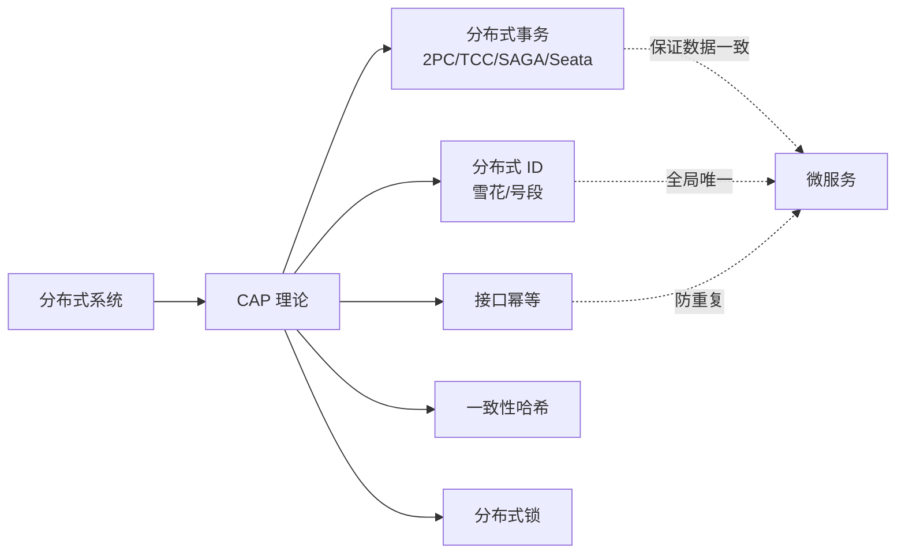

# 分布式基础：CAP、分布式事务、分布式 ID 与幂等

> 这份笔记的目标读者：已完成 Java 核心、MySQL、Redis、消息队列课程，准备进入微服务与高并发方向的校招候选人。  
> 阅读方式：第一次按顺序读第 0~8 章；面试前重点回看第 2、4、6 章；冲刺阶段做第 9 章自测题。  
> 配套课程：Redis 锁与高可用细节在《Redis》；MQ 最终一致在《消息队列》；本课补全分布式理论框架。  
> 示例以 Seata 1.8 / 雪花算法 / ZK 3.8 为准。

### 怎么用这份笔记

- **理论先行**：第 1~2 章 CAP/BASE 是所有分布式设计的坐标系，先建立判断框架；
- **事务深挖**：第 3~4 章从 2PC 到 Seata，按“解决什么、怎么解决、代价”三层记忆；
- **工程组件**：第 5~7 章是分布式 ID、幂等、一致性哈希，直接对应项目落地。

## 目录

- [0. 学习地图：分布式基础考什么](#0-学习地图分布式基础考什么)
- [1. 从单机到分布式](#1-从单机到分布式)
- [2. CAP 与 BASE](#2-cap-与-base)
- [3. 分布式事务：2PC 与 3PC](#3-分布式事务2pc-与-3pc)
- [4. TCC、SAGA 与 Seata](#4-tccsaga-与-seata)
- [5. 分布式 ID](#5-分布式-id)
- [6. 接口幂等](#6-接口幂等)
- [7. 一致性哈希](#7-一致性哈希)
- [8. 分布式锁对比](#8-分布式锁对比)
- [9. 高频自测题与参考资料](#9-高频自测题与参考资料)

---

## 0. 学习地图：分布式基础考什么

分布式把“一台机器上的问题”变成“多台机器共同面对的问题”：网络会断、时钟会偏、状态要一致。面试考的是**权衡能力**：在一致性、可用性、性能之间怎么选，以及选完怎么兜底。

### 0.1 本课程覆盖的高频考点

| 主题 | 大厂高频考点 | 面试权重 |
|---|---|---|
| CAP/BASE | 三要素、取舍、最终一致 | ★★★★★ |
| 分布式事务 | 2PC/3PC/TCC/SAGA/Seata | ★★★★★ |
| 分布式 ID | 雪花、号段、对比 | ★★★★ |
| 幂等 | 场景、方案、防重 | ★★★★ |
| 一致性哈希 | 原理、虚拟节点、应用 | ★★★★ |
| 分布式锁 | Redis/ZK/etcd 对比 | ★★★★ |

### 0.2 知识体系图



### 0.3 学习方法

1. 每个方案背“三件套”：解决什么问题、核心流程、代价/坑；
2. 画时序图理解 2PC/TCC/Seata AT 的交互；
3. 面试场景题先定性（什么级别的一致？），再选方案，最后说兜底。

## 1. 从单机到分布式

### 1.1 为什么要分布式

- **性能**：单机 CPU/内存/磁盘到瓶颈，水平扩展分摊压力；
- **可用性**：单点故障会挂掉整个系统，多副本提高可用；
- **容量**：数据量超过单机存储上限，需要分片；
- **组织协作**：大团队按业务拆分独立开发部署。

### 1.2 分布式带来的问题

| 问题 | 表现 | 应对 |
|---|---|---|
| 网络不可靠 | 请求丢失、超时、重复 | 重试 + 幂等、超时熔断 |
| 时钟不一致 | 时间戳排序不可靠 | 逻辑时钟/业务版本 |
| 数据一致 | 多副本/多服务状态漂移 | 分布式事务、对账补偿 |
| 可用性 | 单点故障、脑裂 | 多副本、选主、隔离 |
| 排查困难 | 问题分散在多个服务 | 链路追踪、日志聚合 |

时钟三件套：**物理时钟**（NTP 同步精度有限，跨机器不能直接比时间戳）、**Lamport 逻辑时钟**（计数器，只保证事件偏序）、**向量时钟**（能判断因果并发）。

### 1.3 面试追问

- 问：分布式和单机最大的区别？
- 答：单机假设“调用必达、状态一致”，分布式必须面对网络不可靠和部分失败。
- 问：为什么分布式系统难做？
- 答：没有全局时钟、没有全局状态视图，只能通过协议和权衡逼近“看起来一致”。

## 2. CAP 与 BASE

### 2.1 CAP 三要素

| 要素 | 含义 |
|---|---|
| Consistency 一致性 | 所有节点同一时刻看到相同数据 |
| Availability 可用性 | 每个请求都能得到非错误的响应 |
| Partition tolerance 分区容错 | 网络分区时系统仍能继续工作 |

**CAP 定理**：网络分区必然可能发生（P 必选），分区时只能在 C 和 A 之间二选一。注意：CAP 不是说平时不能同时满足，而是分区发生时必须做取舍。

### 2.2 CP vs AP

```text
CP：分区时拒绝写，保证一致（ZooKeeper、etcd、HBase）
AP：分区时继续服务，牺牲强一致，事后收敛（Eureka、Cassandra、大部分缓存）
```

典型对照：Eureka 各节点互相注册、允许读到过期数据（AP）；ZooKeeper 过半确认、少数派不可写（CP）。

### 2.3 BASE 与最终一致

BASE = **Basically Available（基本可用）+ Soft state（软状态）+ Eventually consistent（最终一致）**，是 AP 路线的工程实践：允许中间状态不一致，通过异步复制、补偿、对账在“一段时间后”达到一致。订单状态流转、缓存与数据库同步都是最终一致的典型。

### 2.4 面试追问

- 问：CAP 具体怎么理解？
- 答：P 必选，分区时 C 与 A 二选一；CP 保一致损可用，AP 保可用后收敛。
- 问：BASE 和 ACID 什么关系？
- 答：ACID 是单库强一致，BASE 是分布式最终一致，二者适用不同场景。
- 问：注册中心 Eureka 和 ZK 谁符合 CP？
- 答：ZK 是 CP，Eureka 是 AP。

### 2.5 一致性协议：Raft / ZAB / Paxos

分布式一致性的落地协议，校招高频：

- **Raft**：三块——**leader 选举**（任期 term、随机超时、多数派投票）、**日志复制**（AppendEntries、日志索引匹配、多数派确认才提交）、**脑裂避免**（旧任期 leader 无法提交新日志，靠任期号 + 多数派压住）。etcd、K8s、Consul 都用它；
- **ZAB**：ZooKeeper 的原子广播协议，Zxid 全局递增（高 32 位 epoch + 低 32 位计数）、FIFO 有序、过半确认——回答“ZK 为什么是 CP”就靠它；
- **Paxos**：一句话——Proposer 提案、Acceptor 接受、多数派通过；是理论基石，Raft 是它的工程化简化。

呼应：8.2 的 ZK 锁依赖临时顺序节点 + 过半确认，2.2 的 CP 实例（ZK/etcd）背后就是这些协议。

### 2.6 分布式缓存一致性与分布式会话

**缓存一致性（与《Redis》交叉）**：Cache Aside 读流程——先查缓存，未命中查库回填；写流程——**先更新 DB 再删缓存**（更新缓存会被并发写回旧值），删除失败要重试或落 MQ 补偿；延迟双删缩窗口；Canal 订阅 binlog 异步删缓存做到最终一致；强一致场景别缓存或锁串行化。详见《Redis》第 4 章。

**分布式会话**：粘性会话（同用户固定节点，节点挂会丢）、Session 复制（广播同步，浪费）、集中式 Session（存 Redis，主流）、无状态化（JWT/Token 不存服务端）。与幂等/重试串联：会话丢失后的重试必须幂等，否则重复下单。

## 3. 分布式事务：2PC 与 3PC

### 3.1 为什么需要分布式事务

一次操作跨多个库/多个服务（如下单：订单库 + 库存库 + 账户库），单库事务管不了，需要一个协调者让所有参与者要么全成功要么全回滚。

### 3.2 两阶段提交 2PC

```text
阶段一 prepare：协调者问所有参与者“能提交吗”，参与者执行事务但不提交，锁定资源，回复 yes/no
阶段二 commit/abort：全部 yes → 广播 commit；任一 no/超时 → 广播 abort
```

优点：实现直观，强一致。缺点：

- **同步阻塞**：prepare 后资源被锁住，等待协调者指令；
- **协调者单点**：协调者挂了，参与者可能永远等待；
- **部分提交（partial commit）风险**：commit 阶段网络分区，部分参与者已提交、部分未提交，无法真正原子（脑裂一词留给复制/选主场景）。

**故障恢复细节**：协调者崩溃后靠事务日志恢复，向参与者查询决策再续做；commit 一旦发出不可撤销；未收齐 prepare 应答时按 abort 决断。Seata 的 XA 模式就是基于数据库 XA 的 2PC 实现，把 3.2 与 4.3 串起来。

### 3.3 三阶段提交 3PC

3PC 在 2PC 基础上：增加 **CanCommit** 预询问阶段 + 引入超时机制（参与者超时自动 abort/commit），降低阻塞范围。但它依然无法彻底解决分区下的不一致，工程上主流是 TCC/最终一致方案。

### 3.4 面试追问

- 问：2PC 流程？
- 答：prepare 全部确认后 commit，任一失败 abort。
- 问：2PC 的缺点？
- 答：同步阻塞、协调者单点、commit 阶段部分提交无法保证原子。
- 问：3PC 改进了什么？
- 答：加 CanCommit 和超时，减少阻塞；但仍非绝对可靠。

## 4. TCC、SAGA 与 Seata

### 4.1 TCC

TCC 把每个参与者的操作拆成三个阶段，业务自己实现补偿逻辑：

```text
Try：预留资源（冻结库存、冻结金额）
Confirm：确认执行（真正扣减），幂等
Cancel：释放预留（回滚），幂等
```

优点：性能高、不长期锁资源；缺点：**侵入性强**，每个业务都要写 Try/Confirm/Cancel 三套逻辑，还要处理空回滚（Try 没执行却收到 Cancel）、悬挂（Cancel 先于 Try）、幂等等边界问题。

### 4.2 SAGA

SAGA 把长事务拆成多个本地事务，正向执行失败后按逆序执行**补偿事务**：

```text
T1 → T2 → T3，T2 失败 → C2 补偿 T2 → C1 补偿 T1
```

适合长流程、跨多服务的业务（订单全链路），不锁资源，但补偿逻辑要自己保证正确性，且中间状态对外可见。

### 4.3 Seata 四种模式

| 模式 | 思路 | 适用 |
|---|---|---|
| AT | 自动反向 SQL 回滚（生成 undo_log），对业务无侵入 | 简单跨库事务，首选 |
| TCC | 业务实现 Try/Confirm/Cancel | 性能要求高、需预留资源 |
| SAGA | 长事务 + 补偿 | 长链路、多服务 |
| XA | 数据库原生 2PC，强一致 | 依赖数据库支持 |

**Seata AT 原理**：全局事务发起 → 每个分支事务执行本地 SQL，同时记录 undo_log → 全部成功则全局提交并删 undo_log → 任一分支失败则按 undo_log 反向补偿。事务协调者（TC）通过全局事务 ID 串联所有分支。

**不止 2PC 一条路：本地消息表与事务消息**——本地消息表：业务事务里同库写消息表，事务提交后异步投递、定时扫描补偿；事务消息：RocketMQ 半消息（half）→ 本地事务 → commit/rollback → 回查。两者都是最终一致方案，别让面试官以为分布式事务只有 2PC 系列。

### 4.4 面试追问

- 问：TCC 和 2PC 的区别？
- 答：2PC 靠数据库锁 + 协调者，强一致但阻塞；TCC 业务预留/确认/取消，不长期锁资源，侵入性强。
- 问：SAGA 怎么回滚？
- 答：逆序执行补偿事务，适合长流程。
- 问：Seata AT 为什么无侵入？
- 答：代理数据源自动生成 undo_log，全局回滚时解析反向 SQL 补偿。

## 5. 分布式 ID

### 5.1 要求

全局唯一、趋势递增（利于索引与排序）、高性能高可用、尽量短。

### 5.2 方案对比

| 方案 | 原理 | 优点 | 缺点 |
|---|---|---|---|
| UUID | 随机/时间 + 节点标识 | 无中心化、简单 | 无序、太长、索引性能差 |
| 数据库自增/号段 | 单库自增或批量取号段 | 简单、趋势递增 | 依赖 DB、号段要维护 |
| 雪花算法 | 时间戳 + 机器 ID + 序列 | 趋势递增、性能高、无中心化 | 依赖时钟，回拨会重复 |
| Redis INCR | 原子自增 | 简单、可用 | 依赖 Redis 高可用（主从切换/持久化丢失可能跳号或重复）、吞吐上限、号码可预测 |
| 美团 Leaf | 号段/雪花两种独立模式（可搭配） | 高可用、容灾 | 需要运维组件 |

号段模式细节：DB 批量取一段 ID（如一次取 1000 个）放应用内存发放，用完再取；Leaf 号段用**双 buffer 预取**（当前段快用完时异步取下一段），降低 DB 压力。

### 5.3 雪花算法结构

```text
64 位 = 1 位符号位 + 41 位时间戳（毫秒，约 69 年）
      + 10 位机器 ID + 12 位序列号（每毫秒 4096 个）
```

时钟回拨处理：序列号只保证同一毫秒内不重复，扛不住时间戳回拨；标准手段是**等待追平 / 拒绝生成 / 切换备用机器 ID / 依赖第三方时间源**。实践上用 Leaf 等封装好的实现，避免自己踩坑。

### 5.4 面试追问

- 问：为什么不用 UUID 做主键？
- 答：128 位（无连字符 32 个十六进制字符），无序导致 B+ 树随机插入、页分裂多，且太长。
- 问：雪花算法组成部分？
- 答：时间戳 + 机器 ID + 序列号，共 64 位。
- 问：时钟回拨怎么办？
- 答：等待追平 / 拒绝生成 / 切换备用机器 ID / 第三方时间源，生产用 Leaf 等成熟方案。

## 6. 接口幂等

### 6.1 什么是幂等

同一个请求重复执行多次，结果与执行一次相同，不产生副作用。支付、下单、转账、库存扣减必须幂等，否则用户多点一次按钮就重复扣款。

### 6.2 实现方案

| 方案 | 做法 | 适用 |
|---|---|---|
| 唯一键去重 | 业务唯一键 + 去重表/唯一索引，重复插入失败即已处理 | 落库类操作 |
| Token 机制 | 前端先取 token，提交时带 token，服务端消费一次 | 表单提交 |
| 状态机 | 只允许合法状态流转，已支付不能重复支付 | 订单状态 |
| 乐观锁 | update set x=x+?, version=version+1 where version=旧值；影响行数为 0 则并发冲突，重试 | 更新类 |
| 分布式锁 | 处理前加锁，防止并发重复 | 高并发场景 |

### 6.3 与防重区别

幂等针对“同一业务多次执行结果一致”，防重更侧重“重复请求被拦截”；实践中常配合使用：分布式锁挡并发，唯一键/状态机保证落库不重复。

### 6.4 面试追问

- 问：接口幂等怎么实现？
- 答：唯一业务键去重、token、状态机、乐观锁、分布式锁，按场景组合。
- 问：支付回调为什么必须幂等？
- 答：回调可能重发多次，不幂等会重复入账。
- 问：分布式锁和幂等什么关系？
- 答：锁挡并发进入，幂等保证重复执行结果一致，两者互补。

## 7. 一致性哈希

### 7.1 为什么需要

普通取模 `hash(key) % N` 在节点数变化时几乎全部 key 重新映射，缓存全部失效（缓存雪崩）。一致性哈希让**只有少量 key 迁移**。

### 7.2 原理

```text
把 hash 值空间组织成环（0 ~ 2^32-1）
节点（服务器）按 hash 值放到环上
key 顺时针找到的第一个节点即归属节点
节点增减时，只有该节点与上一个节点之间的 key 受影响
```

**虚拟节点**：每个物理节点在环上放多个虚拟节点（如 100~200 个），使数据分布更均匀，也便于带权（性能高的机器虚拟节点多）。典型应用：Redis 客户端分片（Jedis Sharding）、负载均衡、分布式缓存路由。

### 7.3 与 Redis Cluster 槽对比

| 方案 | 思路 | 扩容 |
|---|---|---|
| 一致性哈希 | 环 + 虚拟节点 | 只迁移相邻数据，但可能倾斜 |
| Cluster 槽 | 16384 槽，CRC16 取模 | 槽迁移均匀，官方实现 |

### 7.4 面试追问

- 问：一致性哈希解决什么问题？
- 答：节点增减时最小化 key 重映射，避免缓存大面积失效。
- 问：虚拟节点作用？
- 答：让数据分布均匀，避免节点少时倾斜。
- 问：为什么 Redis Cluster 不用一致性哈希？
- 答：槽方案迁移均匀、有官方工具，一致性哈希可能出现数据倾斜。

## 8. 分布式锁对比

### 8.1 为什么单机锁不够

synchronized/ReentrantLock 只锁单 JVM；微服务多实例部署时，同一资源可能被多台机器并发操作，需要跨进程的锁。

### 8.2 三种实现

| 方案 | 原理 | 优点 | 缺点 |
|---|---|---|---|
| Redis | SET key uid NX EX + Lua 释放 | 性能高、实现简单 | 主从切换可能丢锁（红锁有争议） |
| ZooKeeper | 临时顺序节点 + watch，最小序号拿锁 | 可靠、无过期误删 | 性能较低、依赖 ZK |
| etcd | 租约 lease + 续期 + revision 排序 | 可靠、支持续期 | 需要运维 etcd |

ZK 锁的**惊群优化**：不 watch 根下全部子节点，只 watch 自己前一个节点；前一个节点释放/失效后，重新取最小序号判断自己是否拿到锁。

```java
// Redis 加锁（原子）
SET lock:order:1001 uid-xxx NX EX 30
// 释放锁（Lua 原子：比较 value 再删除）
if redis.call("get", KEYS[1]) == ARGV[1] then return redis.call("del", KEYS[1]) else return 0 end
```

要点：value 用唯一 ID 防止误删别人的锁；加锁和释放都要原子；用 Redisson 看门狗自动续期避免业务没跑完锁过期。

### 8.3 面试追问

- 问：分布式锁三要素？
- 答：互斥、防死锁（过期）、防误删（唯一 value + 续期）。
- 问：Redis 和 ZK 锁怎么选？
- 答：追求性能选 Redis；追求强可靠、可容忍稍慢选 ZK/etcd。

## 9. 高频自测题与参考资料

### 9.1 分主题自测

本页把全书高频考点压缩成分主题自测题：先盖住“一句话要点”尝试作答，再对照检查；能一次答对八成以上，就可以进入下一门课《微服务与高并发》。

| 主题 | 问题 | 一句话要点 |
|---|---|---|
| 分布式 | 最大难点 | 网络不可靠、部分失败 |
| CAP | 三要素 | 一致性/可用性/分区容错 |
| CAP | 必选哪个 | P 必选，分区时 C/A 二选一 |
| CAP | CP 例子 | ZooKeeper、etcd |
| CAP | AP 例子 | Eureka、Cassandra |
| BASE | 核心 | 基本可用 + 最终一致 |
| 2PC | 两个阶段 | prepare + commit/abort |
| 2PC | 主要缺点 | 同步阻塞、协调者单点、部分提交 |
| 3PC | 改进 | CanCommit + 超时机制 |
| TCC | 三阶段 | Try 预留、Confirm 确认、Cancel 取消 |
| TCC | 侵入性 | 业务要写三套逻辑 |
| TCC | 边界问题 | 空回滚、悬挂、幂等 |
| SAGA | 回滚方式 | 逆序补偿 |
| Seata | AT 原理 | undo_log 自动反向 SQL |
| Seata | 模式选择 | 简单用 AT，长链路 SAGA |
| ID | 要求 | 全局唯一、趋势递增、高性能 |
| ID | UUID 缺点 | 无序、太长、索引差 |
| ID | 雪花结构 | 时间戳 + 机器 ID + 序列 |
| ID | 雪花风险 | 时钟回拨会重复 |
| 幂等 | 定义 | 重复执行结果一致 |
| 幂等 | 通用方案 | 唯一键去重表 |
| 幂等 | 表单防重 | Token 机制一次消费 |
| 幂等 | 支付回调 | 状态机 + 幂等键 |
| 哈希 | 一致性哈希解决 | 节点增减最小迁移 |
| 哈希 | 虚拟节点作用 | 均匀分布 |
| 哈希 | vs Cluster 槽 | 槽迁移均匀，官方实现 |
| 锁 | Redis 加锁 | SET key uid NX EX |
| 锁 | 释放锁 | Lua 比较再删除 |
| 锁 | 防误删 | value 存唯一 ID |
| 锁 | ZK 锁特点 | 可靠，性能较低 |

### 9.2 考前 30 分钟速记

- 一句话回答“CAP”：P 必选，分区时在 C 和 A 里选，CP 保一致、AP 后收敛；
- 一句话回答“2PC/TCC”：2PC 协调者两阶段强一致但阻塞；TCC 业务三阶段不锁资源但侵入；
- 一句话回答“Seata”：AT 用 undo_log 自动回滚无侵入，TCC 手写补偿，SAGA 长链路逆序补偿；
- 一句话回答“分布式 ID”：雪花 = 时间戳 + 机器 + 序列，回拨要防；生产用 Leaf；
- 一句话回答“幂等”：唯一键去重 + 状态机 + token，挡并发用锁，保结果用幂等；
- 一句话回答“一致性哈希”：哈希环顺时针找节点，虚拟节点均匀分布；
- 一句话回答“分布式锁”：SET NX EX 原子拿、Lua 原子释放、唯一 value 防误删、续期防过期。

### 9.3 参考资料

- [CAP 定理（Gilbert & Lynch 原文）](https://groups.csail.mit.edu/tds/papers/Lynch/jacm85.pdf)
- [Seata 官方文档](https://seata.apache.org/zh-cn/docs/overview/what-is-seata/)
- [美团技术：分布式 ID 生成方案（Leaf）](https://tech.meituan.com/2019/03/07/open-source-project-leaf.html)
- [一致性哈希详解（菜鸟教程）](https://www.runoob.com/w3cnote/consistent-hashing.html)
- [ZooKeeper 官方文档](https://zookeeper.apache.org/doc/current/)
- 《从 Paxos 到 Zookeeper：分布式一致性原理与实践》

> 学习闭环：第 0~8 章正文读完、第 9 章自测题能答 80% 后，进入下一门课《微服务与高并发》，把这些基础能力组装成注册发现、限流熔断与秒杀系统。
