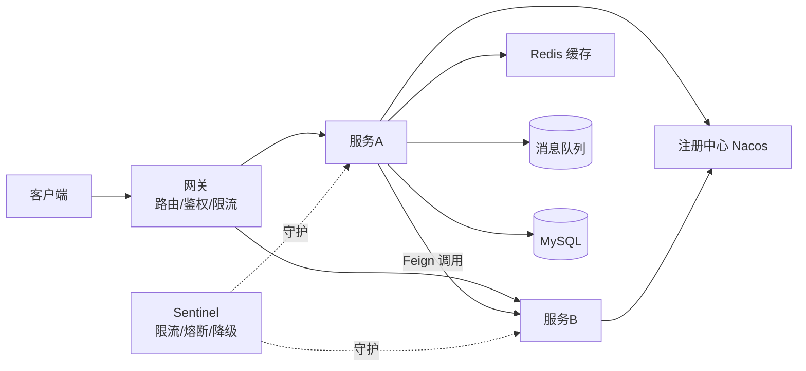

# 微服务与高并发：Spring Cloud、限流熔断与秒杀设计

> 这份笔记的目标读者：已学完 Spring 家族、消息队列、分布式基础，准备应对微服务架构与高并发场景题的校招候选人。  
> 阅读方式：第一次按顺序读第 0~6 章；面试前重点回看第 5 章（限流熔断降级）与第 6 章（秒杀）；冲刺阶段做第 7 章自测题。  
> 配套课程：Redis 缓存细节在《Redis》，MQ 在《消息队列》，分布式理论在《分布式基础》；本课是它们的组装实战。  
> 示例以 Spring Cloud Alibaba 2023 / Sentinel 1.8 / Nacos 2.x 为准。

### 怎么用这份笔记

- **架构视角**：第 1~4 章讲微服务怎么拆、怎么找、怎么调；
- **治理视角**：第 5 章限流/熔断/降级是“扛住流量”的三板斧；
- **场景题视角**：第 6 章秒杀是系统设计题的母题，背熟它的分层设计可迁移到很多场景。

## 目录

- [0. 学习地图：微服务与高并发考什么](#0-学习地图微服务与高并发考什么)
- [1. 微服务拆分](#1-微服务拆分)
- [2. 注册与配置中心](#2-注册与配置中心)
- [3. 网关](#3-网关)
- [4. RPC 与 OpenFeign](#4-rpc-与-openfeign)
- [5. 限流、熔断与降级](#5-限流熔断与降级)
- [6. 秒杀设计：高并发系统设计母题](#6-秒杀设计高并发系统设计母题)
- [7. 缓存与数据库一致性落地](#7-缓存与数据库一致性落地)
- [8. 高频自测题与参考资料](#8-高频自测题与参考资料)

---

## 0. 学习地图：微服务与高并发考什么

微服务是分布式理论的工程化，高并发是微服务最大的考题。面试官的套路通常是：先问组件（网关/注册中心/Feign），再问治理（限流/熔断/降级），最后抛一个场景（秒杀/抢购）看你能否把组件串起来。

### 0.1 本课程覆盖的高频考点

| 主题 | 大厂高频考点 | 面试权重 |
|---|---|---|
| 微服务拆分 | 拆分原则、利弊 | ★★★ |
| 注册中心 | Nacos/Eureka、注册发现流程 | ★★★★ |
| 网关 | 路由、鉴权、限流 | ★★★★ |
| RPC | Feign 原理、负载均衡 | ★★★★ |
| 治理 | 限流/熔断/降级、Sentinel | ★★★★★ |
| 秒杀 | 分层设计、防超卖 | ★★★★★ |
| 缓存一致性 | 先更库再删缓存、多级缓存 | ★★★★ |

### 0.2 知识体系图



### 0.3 学习方法

1. 组件按“职责 + 流程”记：注册中心管寻址、网关管入口、Feign 管调用、Sentinel 管保护；
2. 限流四算法、熔断三状态、降级两类策略要能默写；
3. 秒杀题按“前端 → 网关 → 缓存 → MQ → 数据库”五层答，每层说清楚做什么。

## 1. 微服务拆分

### 1.1 为什么拆

- **独立部署**：单个服务可以单独发版、单独扩容，互不阻塞；
- **故障隔离**：一个服务挂了不影响其他服务；
- **团队自治**：按业务拆团队，技术栈可局部选型；
- **性能扩展**：热点服务单独横向扩容，不必整体扩。

### 1.2 拆分的代价

- 分布式复杂度：网络调用替代本地调用，出现超时、重试、乱序；
- 数据拆分：跨服务数据不能 JOIN，一致性靠最终一致；
- 运维成本：服务多，需要注册中心、网关、链路追踪、监控告警；
- 调试困难：一次请求跨多个服务，排查要依赖日志聚合与链路 ID。

### 1.3 拆分原则

```text
1. 按业务域/限界上下文拆分（用户、订单、商品、支付）
2. 高内聚低耦合：一个服务只负责一个完整业务闭环
3. 数据归属清晰：服务拥有自己的数据，禁止跨服务直连库
4. 团队结构与服务边界对齐
5. 演进式拆分：先单体跑通，瓶颈出现再拆，不要为拆而拆
```

### 1.4 面试追问

- 问：微服务拆分的依据？
- 答：按业务域与团队边界，高内聚低耦合，数据归属清晰，演进式拆分。
- 问：微服务带来的最大问题？
- 答：网络调用与分布式一致性问题，以及运维和排查复杂度。

## 2. 注册与配置中心

### 2.1 为什么需要注册中心

服务地址会随扩缩容变化，硬编码 IP 不可行。注册中心维护“服务名 → 实例列表”的映射，提供注册、发现、健康检查。

```text
启动：服务启动后向注册中心注册（服务名 + IP + 端口）
保活：心跳续约；注册中心发现心跳超时则剔除
发现：调用方从注册中心拉取/订阅目标服务实例列表
调用：负载均衡选一个实例发起调用
```

### 2.2 Nacos vs Eureka

| 对比 | Nacos | Eureka |
|---|---|---|
| 定位 | 注册中心 + 配置中心 | 注册中心 |
| CAP | AP/CP 可切换 | AP |
| 健康检查 | 主动探测 + 心跳 | 心跳 |
| 配置管理 | 原生支持（动态配置） | 无 |
| 现状 | Spring Cloud Alibaba 主流 | 2.x 从未开源发布，现为 1.x 维护状态 |

**临时 vs 持久实例**：Nacos 里临时实例走心跳、心跳断了就剔除；持久实例走主动探测、不自动摘除（适合 K8s 等有状态场景）。**Eureka 自我保护**：当心跳续约低于阈值（默认 15 分钟内低于 85%）时，Eureka 进入自我保护模式、不再剔除实例并亮红色警告——宁可保留可能已挂的实例，也不让注册表被误清空，这正是 AP 取向的体现。

### 2.3 面试追问

- 问：服务注册发现流程？
- 答：注册 → 心跳续约 → 调用方发现 → 负载均衡调用；实例下线被剔除。
- 问：Nacos 和 Eureka 区别？
- 答：Nacos 还能当配置中心、可切换 AP/CP；Eureka 2.x 从未开源发布（2018 年官方叫停开发），现为 1.x 维护状态。
- 问：注册中心挂了会怎样？
- 答：已注册实例还能靠本地缓存继续调用，但新实例/变更感知失效，所以要高可用部署。

## 3. 网关

### 3.1 网关做什么

网关是流量的统一入口，职责：

- **路由**：按 URL/断言（Predicate）匹配并把请求转发到下游服务；负载均衡在网关下游选择实例，与路由是两个层次；
- **鉴权**：统一校验 token，未认证直接拦截；
- **限流**：入口层限流，先挡住大部分流量；
- **其他**：跨域、灰度、日志、请求头增强。

Spring Cloud Gateway 基于 WebFlux 响应式模型，核心概念：Route（路由）、Predicate（匹配条件）、Filter（过滤器，GlobalFilter 全局、GatewayFilter 局部）。

**网关横切能力**：统一跨域（CORS）、限流（可集成 Sentinel 网关适配，按路由/API 维度）、灰度（按 header/权重分流）、日志与链路追踪；限流建议网关层和业务层各做一道。

### 3.2 网关 vs 注册中心

```text
注册中心：服务与服务的寻址（内部）
网关：外部流量进入内部的统一入口（边界）
网关从注册中心发现下游服务地址，把请求路由过去
```

### 3.3 面试追问

- 问：网关解决了什么问题？
- 答：统一入口、鉴权限流、路由转发，避免每个服务重复实现。
- 问：Gateway 和 Zuul 区别？
- 答：Gateway 基于 WebFlux 非阻塞，Zuul 1.x 基于 Servlet 阻塞；Zuul 1.x 已停止维护、Zuul 2 未进入 Spring Cloud 主线，Spring Cloud Gateway 是官方推荐替代。

## 4. RPC 与 OpenFeign

### 4.1 RPC vs HTTP

| 对比 | RPC（Dubbo） | HTTP/REST（OpenFeign） |
|---|---|---|
| 协议 | 自定义二进制（高性能） | HTTP/JSON |
| 性能 | 高 | 中 |
| 通用性 | 跨语言弱 | 跨语言强 |
| 场景 | 服务间高性能调用 | 通用接口、外部系统 |

Spring Cloud 生态默认 OpenFeign：声明式 HTTP 客户端，写接口注解即可调用远程服务，底层动态代理生成实现。

### 4.2 OpenFeign 原理

```text
@FeignClient("order-service") 定义接口
→ 启动时扫描，为接口生成 JDK 动态代理
→ 调用方法时按注解拼 URL、参数序列化
→ 经负载均衡选择实例 → HTTP 调用
→ 反序列化返回结果
```

要点：连接/读超时单独配置；重试只对幂等接口开；fallback 处理失败降级；熔断需集成 Sentinel/Hystrix。

### 4.3 负载均衡

客户端负载均衡（Spring Cloud LoadBalancer；Ribbon 自 Spring Cloud 2020.0 起被移除，由 LoadBalancer 取代）：调用方从注册中心拿到实例列表，按轮询/随机/权重选一个。与服务端负载均衡（Nginx）区别：前者在客户端进程内选实例，后者由独立节点分发。

### 4.4 面试追问

- 问：Feign 是怎么工作的？
- 答：接口扫描生成动态代理，拼请求经负载均衡调远程服务。
- 问：RPC 和 HTTP 怎么选？
- 答：内部追求性能用 RPC；跨语言/对外用 HTTP。
- 问：Feign 调用失败怎么办？
- 答：配置超时与重试（幂等接口）、fallback 降级、熔断保护。

## 5. 限流、熔断与降级

### 5.1 限流算法

| 算法 | 思路 | 特点 |
|---|---|---|
| 固定窗口 | 每秒计数，超阈值拒绝 | 简单，但窗口边界双倍流量 |
| 滑动窗口 | 时间窗口细分，统计最近 N 秒 | 更平滑，代价是计数多 |
| 令牌桶 | 匀速放令牌，桶存积攒令牌 | 允许突发流量，主流 |
| 漏桶 | 请求入桶匀速流出 | 绝对匀速，不能突发 |

```text
令牌桶：系统按 rate 放令牌进桶（桶容量 burst）
      请求来了取令牌，取到放行、取不到拒绝 → 允许短暂突发
漏桶：请求先进队列，按固定速率处理 → 平滑但拒绝突发
```

Sentinel 默认用**滑动窗口 + 计数器**；**令牌桶对应冷启动 Warm Up 模式**、**漏桶对应匀速排队模式**；**热点参数**是参数维度限流（如按商品 ID），与流量整形是两类不同的能力。

### 5.2 熔断

熔断器三状态：

```text
CLOSED（关闭）：正常调用
OPEN（打开）：失败率/慢调用率超阈值 → 快速失败，不再打下游
HALF_OPEN（半开）：过段时间放少量请求试探，成功则恢复 CLOSED，失败回到 OPEN
```

作用：下游故障时快速失败，给下游恢复时间，防止故障蔓延（雪崩）。

### 5.3 降级

- **主动降级**：大促/高峰主动关掉非核心功能（如推荐位、弹窗），保核心链路；
- **被动降级**：依赖故障/超时返回兜底数据（默认值、缓存旧数据、提示“稍后重试”）。

### 5.4 Sentinel vs Hystrix

| 对比 | Sentinel | Hystrix |
|---|---|---|
| 状态 | 阿里开源，社区维护 | Netflix 已停更维护模式 |
| 控制台 | 有可视化控制台、动态规则 | 无 |
| 限流能力 | 丰富（滑动窗口/Warm Up/匀速排队/热点参数） | 较弱 |
| 隔离 | 信号量（并发线程数） | 线程池（默认），可配信号量 |
| 生态 | Spring Cloud Alibaba 标配 | 老项目存量 |

规则持久化：Sentinel 规则默认存在**内存**（重启即失），生产要推送并持久化到配置中心（Nacos/Apollo），应用启动时拉取。

### 5.5 面试追问

- 问：四种限流算法？
- 答：固定窗口、滑动窗口、令牌桶、漏桶；令牌桶允许突发、漏桶匀速。
- 问：熔断三状态？
- 答：关闭 → 打开 → 半开试探；失败率超阈值打开，试探成功恢复。
- 问：降级和熔断区别？
- 答：熔断是保护下游的快速失败机制；降级是主动/被动返回兜底结果保核心业务。

## 6. 秒杀设计：高并发系统设计母题

### 6.1 秒杀难点

- **高并发读**：商品页/库存被疯狂刷新；
- **高并发写**：大量请求同时扣库存，数据库扛不住；
- **防超卖**：库存不能扣成负数；
- **防重复**：同一用户不能重复下单；
- **防刷**：脚本机器人抢购。

### 6.2 分层设计

```text
前端层：页面静态化到 CDN；倒计时；按钮置灰防连点
网关层：限流（令牌桶）、黑白名单、风控
缓存层：库存预热到 Redis，Lua 原子预扣
队列层：通过 MQ 把扣库存成功后的下单请求异步化
数据库层：真正落库（订单 + 扣减），用唯一键/状态机防重
```

### 6.3 防超卖核心

```java
// Redis Lua 原子预扣：库存足够才扣减并返回成功
-- KEYS[1]=库存key  ARGV[1]=扣减数
local stock = redis.call("GET", KEYS[1])
if not stock then return -1 end
if tonumber(stock) >= tonumber(ARGV[1]) then
    return redis.call("DECRBY", KEYS[1], ARGV[1])
else
    return -1
end
```

**预扣判空与回补**：Lua 里先判断库存 key 是否存在（`GET` 为 nil 直接失败，别把不存在当 0）再判断是否足够；预扣成功但后续下单失败/超时，要**原子回补库存**（INCR）并记录流水；活动结束后用 Redis 扣减流水与 DB 订单对账，差异补偿。

数据库兜底：`UPDATE stock SET num = num - 1 WHERE id = ? AND num > 0`（条件更新天然防超卖），或用乐观锁 version。

### 6.4 其他关键点

- **Redis 预热**：活动开始前把库存预加载，避免活动瞬间打爆 DB；
- **订单唯一**：下单接口带用户 + 商品 + 场次生成唯一单号，唯一索引防重复；
- **隔离**：秒杀服务独立部署、独立线程池，避免影响普通业务；
- **降级**：库存不足、系统过载时快速返回“已售罄”，不拖垮主流程；
- **对账**：活动结束后核对 Redis 扣减与 DB 订单，差异补偿。

**幂等不是秒杀专属**：任何可能被重试/重放的接口都要幂等——下单、支付回调、MQ 消费、Feign 重试。通用手段：唯一业务键 + 去重表、状态机、乐观锁、token 一次性消费（详见《分布式基础》第 6 章）。

### 6.5 面试追问

- 问：秒杀系统怎么设计？
- 答：静态化 + 限流 → Redis 预热 + Lua 预扣 → MQ 异步下单 → DB 条件更新防超卖 → 隔离降级。
- 问：怎么防超卖？
- 答：Redis Lua 原子预扣 + DB 条件更新 num>0，双重保障。
- 问：为什么扣库存用 Lua？
- 答：多条 Redis 命令原子执行，避免并发读改写造成超卖。
- 问：秒杀怎么防重复下单？
- 答：唯一订单号 + 唯一索引 + 状态机。

## 7. 缓存与数据库一致性落地

### 7.1 多级缓存

```text
本地缓存（Caffeine）→ Redis → 数据库
本地缓存快但多实例不一致，Redis 共享但网络有开销，DB 兜底
```

### 7.2 一致性方案回顾

- **Cache Aside**：读先查缓存，未命中查库再回填；写先更新 DB 再删缓存；
- **延迟双删**：删除缓存 → 更新 DB → 延迟再删一次，缩小并发窗口；
- **binlog 订阅（Canal）**：监听 MySQL binlog 异步删缓存，最终一致；
- 强一致场景：不要依赖缓存，直接走 DB 或加分布式锁串行化。

### 7.3 热点 key 处理

- 多副本分散热点 key（`key_01` ~ `key_10`）避免单点；
- 本地缓存兜底热点，降低 Redis 压力；
- 布隆过滤器挡不存在请求（防穿透），见《Redis》。

### 7.4 面试追问

- 问：更新 DB 后为什么删缓存而不是更新缓存？
- 答：更新缓存并发下容易写入旧值，删除后按需回填更简单可靠。
- 问：延迟双删的延迟多久？
- 答：略大于读请求回填缓存的时间（通常几百毫秒到 1 秒），缩窗口但非绝对。
- 问：缓存和数据库强一致怎么做？
- 答：不加缓存或锁串行化；绝大多数场景接受最终一致。

## 8. 高频自测题与参考资料

### 8.1 分主题自测

本页把全书高频考点压缩成分主题自测题：先盖住“一句话要点”尝试作答，再对照检查；能一次答对八成以上，就可以进入下一门课《部署与运维》。

| 主题 | 问题 | 一句话要点 |
|---|---|---|
| 拆分 | 微服务好处 | 独立部署、故障隔离、独立扩展 |
| 拆分 | 最大代价 | 分布式复杂度与运维成本 |
| 拆分 | 拆分原则 | 业务域边界、高内聚低耦合 |
| 注册 | 注册中心职责 | 注册、发现、健康检查 |
| 注册 | 发现流程 | 注册→心跳→发现→负载均衡调用 |
| 注册 | Nacos vs Eureka | Nacos 还管配置、可切 AP/CP |
| 网关 | 网关职责 | 路由、鉴权、限流、统一入口 |
| 网关 | 与注册中心关系 | 网关从注册中心找下游地址 |
| RPC | RPC vs HTTP | 二进制高效 vs 通用简单 |
| Feign | 原理 | 动态代理拼请求 + 负载均衡 |
| Feign | 失败处理 | 超时重试（幂等）、fallback、熔断 |
| 负载 | 客户端负载均衡 | 调用方从实例列表选一个 |
| 限流 | 固定窗口缺点 | 窗口边界可双倍流量 |
| 限流 | 滑动窗口 | 细分窗口统计，更平滑 |
| 限流 | 令牌桶 | 允许突发，主流 |
| 限流 | 漏桶 | 匀速输出，不支持突发 |
| 熔断 | 三状态 | 关闭/打开/半开 |
| 熔断 | 半开作用 | 放少量请求试探恢复 |
| 降级 | 主动降级 | 大促关非核心功能 |
| 降级 | 被动降级 | 超时/故障返回兜底数据 |
| 治理 | Sentinel vs Hystrix | Sentinel 活跃、有控制台 |
| 秒杀 | 分层 | 静态化→限流→预热→Lua→MQ→DB |
| 秒杀 | 防超卖 | Lua 原子预扣 + DB 条件更新 |
| 秒杀 | 防重复 | 唯一单号 + 唯一索引 |
| 秒杀 | 预热目的 | 避免活动瞬间打爆 DB |
| 秒杀 | 隔离 | 独立部署/线程池保主链路 |
| 缓存 | 多级缓存 | 本地→Redis→DB |
| 缓存 | Cache Aside 写 | 先更库再删缓存 |
| 缓存 | 延迟双删 | 先删→更库→延迟→再删 |
| 缓存 | 强一致做法 | 不加缓存或锁串行化 |
| 热点 | 热点 key | 多副本分散 + 本地缓存 |
| 服务治理 | 排查手段 | 链路追踪、日志聚合、监控 |

### 8.2 考前 30 分钟速记

- 一句话回答“微服务”：按业务域拆、高内聚低耦合，独立部署但接受分布式复杂度；
- 一句话回答“注册发现”：注册中心记实例，心跳保活，调用方订阅 + 负载均衡；
- 一句话回答“网关”：统一入口，路由鉴权限流，从注册中心发现下游；
- 一句话回答“Feign”：声明式接口 + 动态代理 + 负载均衡 + 超时熔断降级；
- 一句话回答“限流四算法”：固定窗口简单有边界问题，滑动窗口平滑，令牌桶允许突发，漏桶绝对匀速；
- 一句话回答“熔断降级”：熔断快速失败保护下游，降级返回兜底保核心；
- 一句话回答“秒杀”：静态化 + 限流 + 预热 + Lua 预扣 + MQ 异步 + DB 条件更新 + 隔离降级对账。

### 8.3 参考资料

- [Spring Cloud Alibaba 官方文档（Nacos/Sentinel/Seata）](https://sca.aliyun.com/)
- [Nacos 官方文档](https://nacos.io/zh-cn/docs/what-is-nacos.html)
- [Sentinel 官方文档](https://sentinelguard.io/zh-cn/)
- [Spring Cloud Gateway 官方文档](https://docs.spring.io/spring-cloud-gateway/reference/)
- [阿里云开发者社区：秒杀系统设计最佳实践](https://developer.aliyun.com/article/796213)
- 《凤凰架构：构建可靠的大型分布式系统》

> 学习闭环：第 0~7 章读完、自测题能答 80% 后，进入下一门课《部署与运维》，把微服务搬到 Linux、Docker 与 Kubernetes 上，打通从代码到线上的最后一公里。
