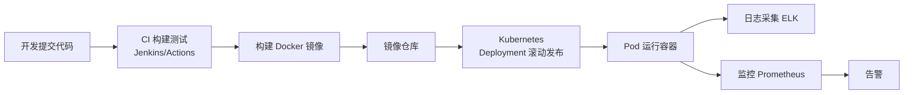

# 部署与运维：Linux、Docker、Kubernetes 与 CI/CD

> 这份笔记的目标读者：已能写出完整后端服务，但还没把代码“放到线上跑起来”的校招候选人。  
> 阅读方式：第一次按顺序读第 0~5 章，Linux 命令边看边敲；面试前回看第 3、4 章（Docker/K8s 概念）；冲刺阶段做第 7 章自测题。  
> 配套课程：本课是工程收尾课，把前面所有课程串成“开发 → 构建 → 部署 → 监控”闭环。  
> 示例以 Ubuntu 22.04 / Docker 24 / Kubernetes 1.29 / Jenkins 2.x（LTS 2.4xx）为准。

### 怎么用这份笔记

- **命令是基本功**：第 1~2 章的命令在面试“会不会排查问题”时直接考，务必手敲一遍；
- **概念抓模型**：第 3~4 章记住“镜像/容器/Pod/Deployment/Service”的职责关系；
- **流程串起来**：第 5~6 章理解 CI/CD 与监控告警怎么形成闭环。

## 目录

- [0. 学习地图：部署与运维考什么](#0-学习地图部署与运维考什么)
- [1. Linux 基础与常用命令](#1-linux-基础与常用命令)
- [2. 进程与系统性能排查](#2-进程与系统性能排查)
- [3. Docker 容器化](#3-docker-容器化)
- [4. Kubernetes](#4-kubernetes)
- [5. CI/CD 与发布策略](#5-cicd-与发布策略)
- [6. 日志与监控](#6-日志与监控)
- [7. 高频自测题与参考资料](#7-高频自测题与参考资料)

---

## 0. 学习地图：部署与运维考什么

校招岗位写代码为主，但“会不会部署、出问题会不会查”是区分工程能力的分水岭。面试常考：Linux 排查命令、Docker/K8s 核心对象、发布流程。

### 0.1 本课程覆盖的高频考点

| 主题 | 大厂高频考点 | 面试权重 |
|---|---|---|
| Linux | 常用命令、权限、进程端口 | ★★★★ |
| 性能排查 | top/free/df/日志分析 | ★★★★ |
| Docker | 镜像容器、Dockerfile | ★★★★ |
| Kubernetes | Pod/Deployment/Service | ★★★ |
| CI/CD | 流水线、发布策略 | ★★★ |
| 监控日志 | Prometheus、ELK | ★★★ |

### 0.2 知识体系图



### 0.3 学习方法

1. 命令按场景记：看进程、看端口、看日志、看磁盘、看内存各记两三条；
2. Docker/K8s 先记“对象职责”，再记命令；
3. 把“一次发版”完整走一遍：提交 → CI 构建 → 镜像 → K8s 滚动更新 → 监控确认。

## 1. Linux 基础与常用命令

### 1.1 文件与目录

| 命令 | 作用 |
|---|---|
| ls / ls -la | 列出文件（含隐藏、详细信息） |
| cd / pwd | 切换目录 / 当前路径 |
| mkdir -p / rm -rf / cp -r / mv | 建目录 / 删除 / 复制 / 移动（rm 慎用） |
| cat / less / head / tail | 查看文件内容 |
| find / grep -r | 找文件 / 文本搜索 |
| ln -s | 软链接 |

### 1.2 权限模型

```text
权限三位一组：所有者 rwx、所属组 rwx、其他人 rwx
r=4, w=2, x=1
chmod 755 file   → 所有者 rwx，组和其他 r-x
chmod +x script  → 加执行权限
```

### 1.3 网络相关

```bash
ping 127.0.0.1        # 只验证本机协议栈；排查网络用 ping <网关/外部IP>
netstat -tlnp         # 查看监听端口和进程
ss -tlnp              # 现代替代
curl -I http://x.com  # 只看响应头
```

注：netstat/ss 的 `-p` 看**他人**进程的 PID 需要 root，非 root 时加 sudo。

### 1.4 面试追问

- 问：如何查看某个端口被谁占用？
- 答：netstat -tlnp 或 ss -tlnp 过滤端口，再按 PID 查进程。
- 问：755 权限什么意思？
- 答：所有者可读写执行，组和其他可读可执行。
- 问：tail -f 和 grep 常用组合？
- 答：tail -f app.log | grep --line-buffered ERROR 实时过滤错误日志（grep 默认块缓冲会延迟输出）。

## 2. 进程与系统性能排查

### 2.1 核心排查命令

| 命令 | 看什么 |
|---|---|
| top / htop | CPU、内存、进程排行，负载 load average |
| free -h | 内存总量/已用/缓存 |
| df -h | 磁盘空间 |
| ps -ef / ps aux | 进程列表与状态 |
| iostat / vmstat | 磁盘 IO、系统状态 |
| uptime | 平均负载（1/5/15 分钟） |

### 2.2 排查套路

```text
1. 先看负载：uptime，load 是否接近 CPU 核数
2. 再看进程：top 找 CPU/内存占用高的进程（Shift+P 按 CPU，Shift+M 按内存）
3. 定位线程：top -H -p <pid> 看线程，jstack 转线程栈
4. 看资源：free 内存、df 磁盘、iostat IO
5. 看日志：tail -f、grep 异常堆栈
```

### 2.3 后台运行

```bash
nohup java -jar app.jar > app.log 2>&1 &
```

nohup 让进程忽略挂断信号，& 放后台，日志重定向到文件。生产建议用 systemd 或容器托管，而不是裸 nohup。

**systemd 托管模板**：`[Unit]` 写依赖、`[Service]` 写 ExecStart / Restart=always / User / Environment / WorkingDirectory、`[Install]` 写 WantedBy；`systemctl enable/start/status` 管理，`journalctl -u 服务名 -f` 看日志，logrotate 做日志轮转。

### 2.4 面试追问

- 问：服务 CPU 100% 怎么排查？
- 答：top 找进程 → top -H 找线程 → jstack 看线程栈 → 定位代码热点。
- 问：磁盘满了怎么办？
- 答：df -h 确认，du -sh 找大目录，清理日志/临时文件，检查是否被删除但未释放的文件（lsof）。
- 问：load average 高说明什么？
- 答：等待运行的任务多，可能 CPU 满或 IO 阻塞。

## 3. Docker 容器化

### 3.1 镜像 vs 容器

```text
镜像 Image：只读模板（代码 + 环境 + 依赖），可复用、可分发
容器 Container：镜像的运行实例，有独立文件系统与网络，启动/停止互不影响
类比：镜像 = 类，容器 = 对象
```

### 3.2 Dockerfile

```dockerfile
FROM openjdk:17-jdk-slim        # 基础镜像
WORKDIR /app                     # 工作目录
COPY target/app.jar app.jar      # 拷贝构建产物
EXPOSE 8080                      # 声明端口
ENTRYPOINT ["java", "-jar", "app.jar"]   # 启动命令
```

常用指令：FROM、RUN（构建时执行）、COPY/ADD（拷贝）、WORKDIR、ENV、EXPOSE、CMD/ENTRYPOINT。镜像**分层**：只有修改文件系统的指令（RUN/COPY/ADD）才产生镜像层，EXPOSE/CMD/ENTRYPOINT/WORKDIR/ENV 只改元数据；层可复用缓存，某条指令一变，其后所有层缓存失效；多阶段构建（先编译后只拷产物）能大幅缩小镜像。

**Dockerfile 最佳实践**：`.dockerignore` 排除无关文件；基础镜像固定 tag（不要 latest）；非 root 运行（USER）；合并 RUN 减少层数；CMD 用 exec 形式（JSON 数组）；HEALTHCHECK 声明健康检查；多阶段构建先编译后拷贝产物。注意 **openjdk 官方镜像已停更**，建议换 `eclipse-temurin:17-jre-jammy`。

### 3.3 常用命令

```bash
docker build -t my-app:v1 .     # 构建镜像
docker images                   # 查看镜像
docker run -d -p 8080:8080 my-app:v1   # 运行并映射端口
docker ps / docker ps -a        # 查看运行中/全部容器
docker logs -f <container>      # 查看容器日志
docker exec -it <container> bash  # 进入容器
docker stop/rm <container>      # 停止/删除
docker compose up -d            # 多容器编排
```

### 3.4 数据卷与网络

- **数据卷 volume**：容器删除数据不丢，挂载到宿主机目录，`-v /host:/container`；
- **网络**：默认 bridge，容器间用服务名通信；`-p 8080:8080` 端口映射；
- 容器是无状态的：需要持久化的数据必须挂卷或放外部存储（DB/Redis/对象存储）。

**数据卷细化**：bind mount（宿主机路径直挂，`-v /host:/container`）、named volume（docker volume 管理，`-v myvol:/container`）、匿名卷；`--mount` 是结构化写法（可配 `:ro` 只读、type=volume）；tmpfs 是内存挂载，重启即丢、不持久。

**网络与资源限制**：内置网络 bridge/host/none，集群环境用 overlay（Swarm）；默认 bridge（docker0）**不自带容器名 DNS 解析**，需要自定义 bridge 网络或 --link，Compose 自动创建的用户自定义 bridge 才有服务名解析。资源限制 `--memory/--cpus/--memory-swap`，`docker stats` 查看；容器共享宿主机内核，隔离弱于 VM（VM 有独立内核），安全敏感场景用 VM 或加限制。

### 3.5 面试追问

- 问：镜像和容器的区别？
- 答：镜像是只读模板，容器是运行实例，可启停删除。
- 问：镜像为什么分层？
- 答：层可复用缓存、可增量分发，多阶段构建还能减小体积。
- 问：容器数据会丢吗？
- 答：容器删除即丢，持久化要挂数据卷或使用外部存储。

## 4. Kubernetes

### 4.1 核心对象

| 对象 | 职责 |
|---|---|
| Pod | 最小调度单元，一个或多个容器共享网络与存储 |
| Deployment | 管理无状态应用的副本数、滚动更新、回滚 |
| Service | 稳定的访问入口，负载均衡到一组 Pod |
| Ingress | 规则对象，按域名/路径路由到 Service；真正承载流量的是 Ingress Controller（如 ingress-nginx）+ LoadBalancer/NodePort |
| ConfigMap / Secret | 配置与敏感信息，注入 Pod 环境变量或挂载 |
| Namespace | 逻辑隔离（环境/团队） |

**Pod 生命周期与探针**：状态 Pending（调度中）→ Running → Succeeded/Failed（任务型 Pod），异常时 Unknown。三种探针：`startupProbe`（慢启动保护，成功前不启用其余探针）、`livenessProbe`（存活，失败按 restartPolicy 重启容器）、`readinessProbe`（就绪，失败从 Service 摘流量）；类型 httpGet/tcpSocket/exec；参数 initialDelaySeconds（启动延迟）、periodSeconds（间隔）、failureThreshold（连续失败次数）；`restartPolicy`（Always/OnFailure/Never）、`terminationGracePeriodSeconds`（优雅终止宽限）。

```yaml
startupProbe:
  httpGet: { path: /health/startup, port: 8080 }
  failureThreshold: 30
  periodSeconds: 10
livenessProbe:
  httpGet: { path: /health, port: 8080 }
  initialDelaySeconds: 10
  periodSeconds: 15
  failureThreshold: 3
readinessProbe:
  httpGet: { path: /ready, port: 8080 }
```

**调度与 HPA**：kube-scheduler 按节点资源、亲和性、污点容忍选节点；`nodeSelector`/节点亲和性/污点容忍控制落点。HPA（水平扩缩容）：Pod 必须设 `requests`、集群要有 metrics-server，按 `targetCPUUtilizationPercentage`（默认 80%）扩缩副本。requests/limits 决定 QoS 三类：Guaranteed（requests=limits）/ Burstable（requests<limits）/ BestEffort（都不设）。

**ConfigMap/Secret 细节**：注入方式 env（单值）/ envFrom（整份）/ 挂载为文件；**Secret 的 base64 只是编码不是加密**（etcd 里是明文，生产要 KMS/Vault 加密）；**环境变量注入不会热更新**（要重启 Pod），挂载文件由 kubelet 延时同步自动更新、想立即生效仍需滚动重启；`kubectl create configmap/secret`、`kubectl get -o yaml` 查看。

### 4.2 Deployment 示例

```yaml
apiVersion: apps/v1
kind: Deployment
metadata:
  name: app
spec:
  replicas: 3
  selector:
    matchLabels:
      app: demo
  template:
    metadata:
      labels:
        app: demo
    spec:
      containers:
        - name: demo
          image: registry/demo:v1
          ports:
            - containerPort: 8080
---
apiVersion: v1
kind: Service
metadata:
  name: app-svc
spec:
  selector:
    app: demo
  ports:
    - port: 80
      targetPort: 8080
```

### 4.3 滚动更新与回滚

```bash
kubectl apply -f deployment.yaml    # 部署/更新
kubectl set image deployment/app demo=registry/demo:v2   # 滚动更新镜像
kubectl rollout status deployment/app
kubectl rollout undo deployment/app # 回滚到上一版本
```

滚动更新策略：分批替换旧 Pod，保持服务不中断；节奏由 `maxUnavailable`（最多允许多少 Pod 不可用）与 `maxSurge`（最多允许多少额外 Pod）控制；`minReadySeconds` 只定义“Pod 就绪后保持多久才计入可用”，不直接控制节奏。

### 4.4 面试追问

- 问：Pod 和容器的关系？
- 答：Pod 是最小调度单元，可包含多个容器（共享网络和存储），通常一个 Pod 一个主容器。
- 问：Deployment 和 Service 的区别？
- 答：Deployment 管副本与更新，Service 提供稳定访问入口。
- 问：怎么滚动发布和回滚？
- 答：set image 触发滚动，rollout undo 回滚；副本分批替换。

## 5. CI/CD 与发布策略

### 5.1 CI/CD 是什么

```text
CI 持续集成：代码提交后自动 编译 → 测试 → 静态检查 → 构建镜像
CD 持续交付/部署：自动把构建产物部署到 测试环境 → 预发布 → 生产
```

流水线示例（GitHub Actions 或 Jenkins）：

```text
push 代码 → checkout → JDK/Maven 构建 → 单元测试
→ 构建 Docker 镜像并推送仓库 → 部署到 K8s（滚动更新）→ 健康检查 → 通知
```

**分支工作流**：feature 分支 + PR/MR、保护分支、tag 发布；小团队可用 trunk-based。**灰度 vs 金丝雀 vs A/B**：金丝雀是小流量验证新版本；灰度按流量权重/用户分组逐步放量；A/B 是同时跑两个版本对比业务指标——边界要分清。

### 5.2 发布策略

| 策略 | 做法 | 特点 |
|---|---|---|
| 滚动发布 | 分批替换旧版本 | 简单、兼容性要求高 |
| 蓝绿发布 | 新旧两套环境，切流量 | 回滚快，成本翻倍 |
| 金丝雀发布 | 先放少量流量到新版本验证 | 风险最小，需流量控制 |

### 5.3 面试追问

- 问：CI 和 CD 区别？
- 答：CI 自动构建测试，CD 自动部署上线。
- 问：金丝雀发布是什么？
- 答：新版本先接小部分流量验证，稳定后全量切换，失败可快速回滚。
- 问：发布失败怎么处理？
- 答：回滚上一版本（K8s rollout undo / 蓝绿切流量），保留现场日志排查。

## 6. 日志与监控

### 6.1 日志体系

```text
采集：Filebeat/Fluentd 从容器/机器收集日志
存储检索：ELK（Elasticsearch + Logstash + Kibana）或 Loki
用途：按 traceId 串联一次请求在多个服务的日志（链路追踪）
```

日志规范：统一 JSON 格式、带时间戳/服务名/traceId/级别；不打印密码与 token。

**ELK vs EFK**：ELK = Elasticsearch + Logstash + Kibana，Logstash 功能强但重（Java）；EFK 用 Fluentd/Filebeat 替代 Logstash——Filebeat 是 Go 写的轻量采集器、Fluentd 插件生态丰富；只查不聚合的小场景可考虑 Loki（与 Grafana 同生态、按标签索引省存储）。

### 6.2 监控与告警

```text
指标采集：Prometheus 拉取 /metrics
展示：Grafana 面板（CPU、内存、QPS、错误率、延迟）
告警：Prometheus Alertmanager 按规则（如 5xx 率 > 1% 持续 5 分钟）通知
```

**职责分开**：Prometheus 按 rules 文件**评估**是否触发，Alertmanager 负责**去重/分组/抑制/通知**。**指标四类型**：counter（只增不减，如请求总数）、gauge（可增可减，如当前连接数）、histogram（分桶分布，如延迟）、summary（客户端算分位数）；Exporter 把指标暴露成 /metrics 文本（如 `http_requests_total{method="GET"} 1024`）。

**SLA vs SLO**：SLA 是合同承诺、SLO 是内部目标；99.9% 年停机约 8.76 小时、99.99% 约 52.6 分钟；错误预算 = 100% − SLO，用“5xx 率 > 1% 持续 5 分钟”这类规则消耗预算触发告警。

### 6.3 面试追问

- 问：日志怎么排查跨服务问题？
- 答：统一 traceId，日志聚合到 ELK/Loki，按 traceId 串起整条链路。
- 问：监控哪些指标？
- 答：RED 三指标（请求率 Rate/错误率 Errors/延迟 Duration）+ 资源指标；另记 SRE 四大黄金信号：延迟、流量、错误、饱和度。
- 问：Prometheus 怎么工作？
- 答：定时拉取服务暴露的 /metrics，存时序库，规则触发告警。
- 问：JVM 服务怎么压测与排查？
- 答：top -H 拿线程号转 16 进制（printf '%x'）对 jstack 的 nid；生产 -Xms=-Xmx 一般相等；-Xlog:gc* 看 GC；-XX:+HeapDumpOnOutOfMemoryError 自动落堆；压测工具 ab/wrk/JMeter；持续 Full GC 先 jmap -histo 看对象再定位。
- 问：网络故障怎么分层排查？
- 答：dig 查 DNS → curl -v 看 TCP/HTTP → ss 看连接状态（TIME_WAIT 大量、CLOSE_WAIT 多=服务端没关连接泄漏）；df -i 看 inode；lsof | grep deleted 找已删未释放文件。

## 7. 高频自测题与参考资料

### 7.1 分主题自测

本页把全书高频考点压缩成分主题自测题：先盖住“一句话要点”尝试作答，再对照检查；能一次答对八成以上，就完成了全部技术课程，进入最后的《校招面试冲刺》。

| 主题 | 问题 | 一句话要点 |
|---|---|---|
| Linux | 查看目录 | ls -la |
| Linux | 查看文件内容 | cat/less/head/tail |
| Linux | 权限数字 | r=4 w=2 x=1 |
| Linux | 查看端口 | netstat -tlnp / ss -tlnp |
| Linux | 后台运行 | nohup ... & 日志重定向 |
| Linux | 软链接 | ln -s |
| 排查 | 看进程 | ps -ef / top |
| 排查 | 看内存 | free -h |
| 排查 | 看磁盘 | df -h |
| 排查 | 实时看日志 | tail -f 加 grep |
| 排查 | CPU 高排查 | top → top -H → jstack |
| Docker | 镜像 vs 容器 | 只读模板 vs 运行实例 |
| Docker | Dockerfile 基础 | FROM/RUN/COPY/ENTRYPOINT |
| Docker | 镜像分层好处 | 复用缓存、增量分发 |
| Docker | 数据持久化 | 挂数据卷或外部存储 |
| Docker | 端口映射 | -p 8080:8080 |
| Docker | 多容器编排 | docker compose |
| K8s | 最小调度单元 | Pod |
| K8s | 无状态应用管理 | Deployment |
| K8s | 稳定访问入口 | Service |
| K8s | 外部入口 | Ingress |
| K8s | 配置与敏感信息 | ConfigMap / Secret |
| K8s | 滚动更新 | set image / rollout |
| K8s | 回滚 | rollout undo |
| CI/CD | CI 做什么 | 自动构建测试 |
| CI/CD | CD 做什么 | 自动部署上线 |
| 发布 | 金丝雀发布 | 小流量验证再全量 |
| 监控 | RED 三指标 | 请求率、错误率、延迟（SRE 四大黄金信号另记） |

### 7.2 考前 30 分钟速记

- 一句话回答“Linux 排查”：uptime 看负载、top 看进程、free 看内存、df 看磁盘、netstat 看端口、tail -f 看日志；
- 一句话回答“Docker”：镜像只读模板、容器运行实例，Dockerfile 描述构建，数据挂卷才持久；
- 一句话回答“K8s”：Pod 最小单元，Deployment 管副本更新，Service 稳定入口，Ingress 对外，rollout 可回滚；
- 一句话回答“CI/CD”：提交后自动构建测试，流水线推镜像部署，金丝雀小流量验证；
- 一句话回答“监控”：Prometheus 采指标、Grafana 展示、Alertmanager 告警，ELK 聚合日志按 traceId 串链路。

### 7.3 参考资料

- [菜鸟教程：Linux 命令大全](https://www.runoob.com/linux/linux-command-manual.html)
- [Docker 官方文档](https://docs.docker.com/)
- [Kubernetes 官方文档（中文）](https://kubernetes.io/zh-cn/docs/home/)
- [GitHub Actions 文档](https://docs.github.com/zh/actions)
- [Prometheus 官方文档](https://prometheus.io/docs/introduction/overview/)
- 《Kubernetes 权威指南》

> 学习闭环：第 0~6 章读完、自测题能答 80% 后，进入最后一门课《校招面试冲刺》，把全部知识压缩成可复习的冲刺清单。
