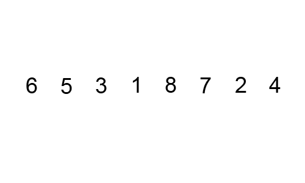
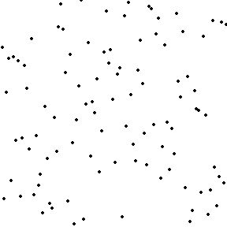
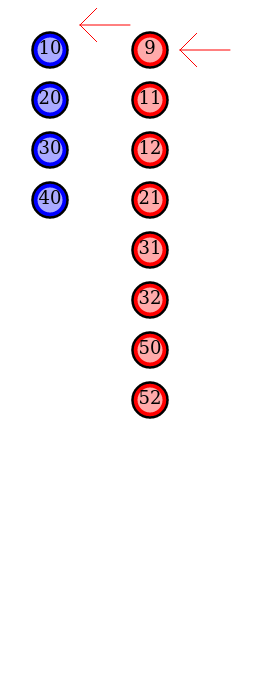
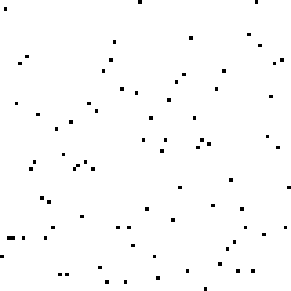
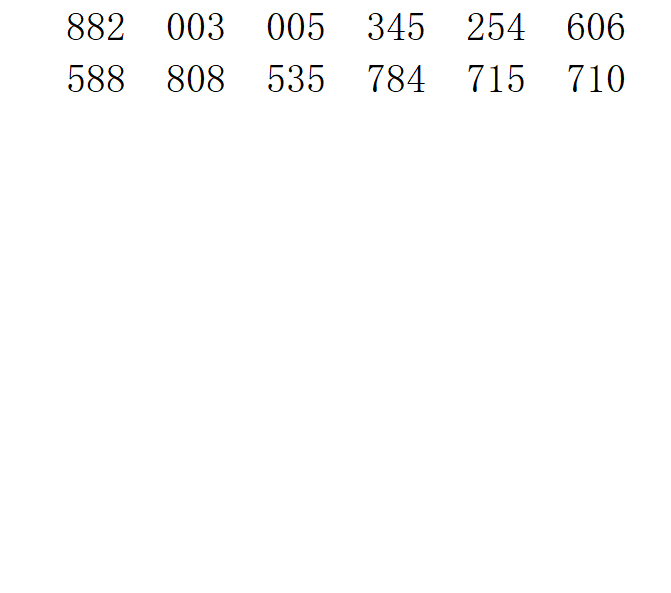

# Java 排序算法学习笔记

## 一、概述

排序是将一组数据按照特定顺序重新排列的操作，是算法题中的基础技能。

### 1.1 排序算法分类

| 分类 | 算法 | 特点 |
|------|------|------|
| **比较排序** | 冒泡、选择、插入、希尔、归并、快排、堆排 | 通过比较元素大小决定顺序，下限 Ω(n log n) |
| **非比较排序** | 计数排序、桶排序、基数排序 | 不直接比较，利用数据特性，可达到 O(n) |

### 1.2 如何评价排序算法

| 指标 | 说明 |
|------|------|
| **时间复杂度** | 最好、最坏、平均情况下的执行时间 |
| **空间复杂度** | 排序过程中需要的额外内存 |
| **稳定性** | 相等的元素排序后相对顺序是否保持不变 |
| **原地排序** | 是否只需要 O(1) 的额外空间 |

### 1.3 稳定性有什么用？

> 稳定排序在"先按 A 排，再按 B 排"的场景下很重要。例如先按分数排序，再按姓名排序时，相同姓名的学生能保持分数顺序。

---

## 二、冒泡排序（Bubble Sort）

### 2.1 原理

**核心思想：** 从左到右依次比较相邻元素，将较大的元素"冒泡"到右侧。每轮确定一个最大值放在末尾。

```
初始: [5, 3, 8, 4, 2]

第1轮:
  比较 5和3 → 交换 → [3, 5, 8, 4, 2]
  比较 5和8 → 不交换
  比较 8和4 → 交换 → [3, 5, 4, 8, 2]
  比较 8和2 → 交换 → [3, 5, 4, 2, 8]  ← 8 已就位

第2轮:
  比较 3和5 → 不交换
  比较 5和4 → 交换 → [3, 4, 5, 2, 8]
  比较 5和2 → 交换 → [3, 4, 2, 5, 8]  ← 5 已就位

第3轮:
  比较 3和4 → 不交换
  比较 4和2 → 交换 → [3, 2, 4, 5, 8]  ← 4 已就位

第4轮:
  比较 3和2 → 交换 → [2, 3, 4, 5, 8]  ← 排序完成
```

### 2.2 动画演示



### 2.3 代码实现

```java
// 标准冒泡排序
public void bubbleSort(int[] arr) {
    int n = arr.length;
    for (int i = 0; i < n - 1; i++) {
        for (int j = 0; j < n - 1 - i; j++) {
            if (arr[j] > arr[j + 1]) {
                // 交换相邻元素
                int temp = arr[j];
                arr[j] = arr[j + 1];
                arr[j + 1] = temp;
            }
        }
    }
}
```

```java
// 优化版：如果某一轮没有交换，说明已经有序，提前结束
public void bubbleSortOptimized(int[] arr) {
    int n = arr.length;
    for (int i = 0; i < n - 1; i++) {
        boolean swapped = false;
        for (int j = 0; j < n - 1 - i; j++) {
            if (arr[j] > arr[j + 1]) {
                int temp = arr[j];
                arr[j] = arr[j + 1];
                arr[j + 1] = temp;
                swapped = true;
            }
        }
        if (!swapped) break;  // 没有交换，提前结束
    }
}
```

### 2.4 复杂度与稳定性

| 指标 | 值 |
|------|----|
| 最好时间复杂度 | O(n)（优化版，已有序） |
| 最坏时间复杂度 | O(n²) |
| 平均时间复杂度 | O(n²) |
| 空间复杂度 | O(1)（原地排序） |
| 稳定性 | ✅ 稳定 |

---

## 三、选择排序（Selection Sort）

### 3.1 原理

**核心思想：** 每次从未排序区间找到最小元素，放到已排序区间的末尾。

```
初始: [5, 3, 8, 4, 2]

第1轮: 找到最小值 2（索引4），与 arr[0] 交换 → [2, 3, 8, 4, 5]
第2轮: 在 [3,8,4,5] 中找到最小值 3（索引1），已在位置 → [2, 3, 8, 4, 5]
第3轮: 在 [8,4,5] 中找到最小值 4（索引3），与 arr[2] 交换 → [2, 3, 4, 8, 5]
第4轮: 在 [8,5] 中找到最小值 5（索引4），与 arr[3] 交换 → [2, 3, 4, 5, 8]
```

### 3.2 动画演示



### 3.3 代码实现

```java
public void selectionSort(int[] arr) {
    int n = arr.length;
    for (int i = 0; i < n - 1; i++) {
        int minIdx = i;                     // 假设当前位置是最小值
        for (int j = i + 1; j < n; j++) {
            if (arr[j] < arr[minIdx]) {
                minIdx = j;                 // 更新最小值索引
            }
        }
        // 将最小值交换到已排序区间的末尾
        if (minIdx != i) {
            int temp = arr[i];
            arr[i] = arr[minIdx];
            arr[minIdx] = temp;
        }
    }
}
```

### 3.4 复杂度与稳定性

| 指标 | 值 |
|------|----|
| 最好时间复杂度 | O(n²) |
| 最坏时间复杂度 | O(n²) |
| 平均时间复杂度 | O(n²) |
| 空间复杂度 | O(1) |
| 稳定性 | ❌ 不稳定（例如 [5, 5, 3] → 第一个 5 会和 3 交换，导致两个 5 的相对顺序改变） |

---

## 四、插入排序（Insertion Sort）

### 4.1 原理

**核心思想：** 将待排序元素插入到已排序区间的正确位置（类似打牌时整理手牌）。

```
初始: [5, 3, 8, 4, 2]

第1轮: arr[1]=3，与 arr[0]=5 比较，插入 → [3, 5, 8, 4, 2]
第2轮: arr[2]=8，与 arr[1]=5 比较，不动 → [3, 5, 8, 4, 2]
第3轮: arr[3]=4，向左查找插入位置：
        8 > 4 → 后移 → [3, 5, 8, 8, 2]
        5 > 4 → 后移 → [3, 5, 5, 8, 2]
        3 < 4 → 插入 → [3, 4, 5, 8, 2]
第4轮: arr[4]=2，向左查找插入位置 → [2, 3, 4, 5, 8]
```

### 4.2 动画演示



### 4.3 代码实现

```java
public void insertionSort(int[] arr) {
    int n = arr.length;
    for (int i = 1; i < n; i++) {
        int key = arr[i];          // 当前要插入的元素
        int j = i - 1;
        // 将大于 key 的元素依次后移
        while (j >= 0 && arr[j] > key) {
            arr[j + 1] = arr[j];
            j--;
        }
        arr[j + 1] = key;          // 插入到正确位置
    }
}
```

### 4.4 复杂度与稳定性

| 指标 | 值 |
|------|----|
| 最好时间复杂度 | O(n)（已有序，只需遍历一次） |
| 最坏时间复杂度 | O(n²)（逆序） |
| 平均时间复杂度 | O(n²) |
| 空间复杂度 | O(1) |
| 稳定性 | ✅ 稳定 |

---

## 五、希尔排序（Shell Sort）

### 5.1 原理

**核心思想：** 插入排序的改进版。先将数组按一定间隔（gap）分组，对每组进行插入排序；逐步缩小 gap，直到 gap = 1 时做最后一次插入排序。

> 希尔排序让"大跨步"移动成为可能，减少了插入排序中大量的元素后移操作。

```
初始: [9, 8, 3, 7, 5, 6, 4, 1]
gap = 4: 分组为 [9,5] [8,6] [3,4] [7,1]，组内排序 → [5, 6, 3, 1, 9, 8, 4, 7]
gap = 2: 分组为 [5,3,9,4] [6,1,8,7]，组内排序 → [3, 1, 4, 6, 5, 7, 9, 8]
gap = 1: 直接插入排序 → [1, 3, 4, 5, 6, 7, 8, 9]
```

### 5.2 动画演示


### 5.3 代码实现

```java
public void shellSort(int[] arr) {
    int n = arr.length;
    // 初始 gap 为 n/2，每次缩小一半
    for (int gap = n / 2; gap > 0; gap /= 2) {
        // 对每个分组进行插入排序
        for (int i = gap; i < n; i++) {
            int key = arr[i];
            int j = i;
            while (j >= gap && arr[j - gap] > key) {
                arr[j] = arr[j - gap];
                j -= gap;
            }
            arr[j] = key;
        }
    }
}
```

### 5.4 复杂度与稳定性

| 指标 | 值 |
|------|----|
| 最好时间复杂度 | O(n log n) |
| 最坏时间复杂度 | O(n²)（取决于 gap 序列） |
| 平均时间复杂度 | 约 O(n^1.3) |
| 空间复杂度 | O(1) |
| 稳定性 | ❌ 不稳定（分组打乱了相对顺序） |

---

## 六、归并排序（Merge Sort）

### 6.1 原理

**核心思想：** 分治法。将数组不断拆分为两半，分别排序后再合并。

```
             [5, 3, 8, 4, 2, 7, 1, 6]
             /                      \
      [5, 3, 8, 4]              [2, 7, 1, 6]
       /        \                /        \
    [5, 3]    [8, 4]         [2, 7]    [1, 6]
     /   \     /   \          /   \     /   \
   [5]  [3]  [8]  [4]      [2]  [7]  [1]  [6]
     \   /     \   /          \   /     \   /
    [3, 5]    [4, 8]        [2, 7]    [1, 6]
       \        /              \        /
      [3, 4, 5, 8]          [1, 2, 6, 7]
             \                      /
            [1, 2, 3, 4, 5, 6, 7, 8]
```

### 6.2 动画演示


### 6.3 代码实现

```java
// 归并排序（递归版）
public void mergeSort(int[] arr, int left, int right) {
    if (left >= right) return;

    int mid = left + (right - left) / 2;
    mergeSort(arr, left, mid);         // 排序左半
    mergeSort(arr, mid + 1, right);    // 排序右半
    merge(arr, left, mid, right);      // 合并两个有序区间
}

private void merge(int[] arr, int left, int mid, int right) {
    int[] temp = new int[right - left + 1];  // 临时数组
    int i = left;        // 左半指针
    int j = mid + 1;     // 右半指针
    int k = 0;           // 临时数组指针

    // 比较两个区间的元素，依次放入临时数组
    while (i <= mid && j <= right) {
        if (arr[i] <= arr[j]) {
            temp[k++] = arr[i++];
        } else {
            temp[k++] = arr[j++];
        }
    }

    // 剩余元素直接复制
    while (i <= mid) temp[k++] = arr[i++];
    while (j <= right) temp[k++] = arr[j++];

    // 将临时数组复制回原数组
    System.arraycopy(temp, 0, arr, left, temp.length);
}
```

```java
// 归并排序（迭代版）—— 自底向上
public void mergeSortIterative(int[] arr) {
    int n = arr.length;
    for (int size = 1; size < n; size *= 2) {         // 子数组大小
        for (int left = 0; left + size < n; left += 2 * size) {
            int mid = left + size - 1;
            int right = Math.min(left + 2 * size - 1, n - 1);
            merge(arr, left, mid, right);
        }
    }
}
```

### 6.4 复杂度与稳定性

| 指标 | 值 |
|------|----|
| 最好时间复杂度 | O(n log n) |
| 最坏时间复杂度 | O(n log n) |
| 平均时间复杂度 | O(n log n) |
| 空间复杂度 | O(n)（需要临时数组） |
| 稳定性 | ✅ 稳定 |

> **归并排序是性能最稳定的排序算法**——无论什么数据都是 O(n log n)。适合数据量大、对稳定性有要求的场景。缺点是需要 O(n) 额外空间。

---

## 七、快速排序（Quick Sort）

### 7.1 原理

**核心思想：** 分治法。选一个基准值（pivot），将小于基准的放左边，大于基准的放右边，然后递归排序左右两边。

```
初始: [5, 3, 8, 4, 2, 7, 1, 6]

选 arr[0]=5 为基准（pivot）
分区过程：
  [5, 3, 8, 4, 2, 7, 1, 6]
   i→                      ←j
   j 向左找小于 5 的元素，找到 1
   i 向右找大于 5 的元素，找到 8
   交换 arr[1] 和 arr[6] → [5, 3, 1, 4, 2, 7, 8, 6]
   继续...
   最终基准归位 → [2, 3, 1, 4, 5, 7, 8, 6]
                           ↑ pivot 到位

递归排序左半 [2,3,1,4] 和右半 [7,8,6]
```

### 7.2 动画演示


### 7.3 代码实现

```java
// 快速排序（标准版）
public void quickSort(int[] arr, int left, int right) {
    if (left >= right) return;

    int pivotIndex = partition(arr, left, right);  // 分区，返回基准最终位置
    quickSort(arr, left, pivotIndex - 1);           // 排序左半
    quickSort(arr, pivotIndex + 1, right);          // 排序右半
}

private int partition(int[] arr, int left, int right) {
    int pivot = arr[left];    // 选择第一个元素作为基准
    int i = left, j = right;

    while (i < j) {
        // 从右往左找小于 pivot 的元素
        while (i < j && arr[j] >= pivot) j--;
        // 从左往右找大于 pivot 的元素
        while (i < j && arr[i] <= pivot) i++;
        // 交换
        if (i < j) {
            int temp = arr[i];
            arr[i] = arr[j];
            arr[j] = temp;
        }
    }

    // 基准归位
    arr[left] = arr[i];
    arr[i] = pivot;
    return i;
}
```

```java
// 快速排序（优化版）—— 三数取中法选基准，避免最坏情况
public void quickSortOptimized(int[] arr, int left, int right) {
    if (left >= right) return;

    // 三数取中：取 left, mid, right 的中位数做基准
    int mid = left + (right - left) / 2;
    if (arr[left] > arr[mid]) swap(arr, left, mid);
    if (arr[left] > arr[right]) swap(arr, left, right);
    if (arr[mid] > arr[right]) swap(arr, mid, right);
    swap(arr, left, mid);  // 将中位数放到 left 作为基准

    int pivotIndex = partition(arr, left, right);
    quickSortOptimized(arr, left, pivotIndex - 1);
    quickSortOptimized(arr, pivotIndex + 1, right);
}

private void swap(int[] arr, int i, int j) {
    int temp = arr[i];
    arr[i] = arr[j];
    arr[j] = temp;
}
```

### 7.4 复杂度与稳定性

| 指标 | 值 |
|------|----|
| 最好时间复杂度 | O(n log n) |
| 最坏时间复杂度 | O(n²)（数组已有序且选第一个为基准时） |
| 平均时间复杂度 | O(n log n) |
| 空间复杂度 | O(log n)（递归栈空间） |
| 稳定性 | ❌ 不稳定 |

> **快速排序是所有 O(n log n) 排序算法中平均性能最好的**。绝大多数语言的内置排序都是快速排序（或混合排序）。优化主要通过：三数取中选基准、随机选基准、小数组切换插入排序。

---

## 八、堆排序（Heap Sort）

### 8.1 原理

**核心思想：** 利用最大堆（或最小堆）的特性进行排序。

1. **建堆：** 将数组构建成最大堆
2. **排序：** 将堆顶（最大值）与末尾交换，堆大小减 1，然后调整堆
3. 重复直到堆为空

```
建堆过程（最大堆：父节点 >= 子节点）：

        原始数组: [4, 10, 3, 5, 1, 8, 7, 6]
        构建最大堆:
               4
            /     \
          10       3
         /  \    /  \
        5    1  8    7
       /
      6

        堆化后:
              10                         10
            /    \                     /    \
          6       8     交换后：      6       3
         / \     / \              /  \     / \
        5  4   3   7            5    4   8   7
       /                       /
      1                       1

排序过程：
  交换堆顶与末尾 → [1, 6, 8, 5, 4, 3, 7, 10] → 调整堆
  交换堆顶与末尾 → [1, 6, 7, 5, 4, 3, 8, 10] → 调整堆
  ... 重复直到有序
```

### 8.2 动画演示


### 8.3 代码实现
    int n = arr.length;

    // 1. 建堆：从最后一个非叶子节点开始，自底向上堆化
    for (int i = n / 2 - 1; i >= 0; i--) {
        heapify(arr, n, i);
    }

    // 2. 排序：依次取出堆顶（最大值）
    for (int i = n - 1; i > 0; i--) {
        // 将堆顶（最大值）交换到数组末尾
        int temp = arr[0];
        arr[0] = arr[i];
        arr[i] = temp;
        // 调整剩余元素的堆
        heapify(arr, i, 0);
    }
}

// 堆化：维护以 i 为根节点的子树使其满足最大堆性质
private void heapify(int[] arr, int n, int i) {
    int largest = i;           // 假设当前节点最大
    int left = 2 * i + 1;      // 左子节点
    int right = 2 * i + 2;     // 右子节点

    // 找到三者中的最大值
    if (left < n && arr[left] > arr[largest]) {
        largest = left;
    }
    if (right < n && arr[right] > arr[largest]) {
        largest = right;
    }

    // 如果最大值不是当前节点，交换并递归调整
    if (largest != i) {
        int temp = arr[i];
        arr[i] = arr[largest];
        arr[largest] = temp;
        heapify(arr, n, largest);
    }
}
```

### 8.4 复杂度与稳定性

| 指标 | 值 |
|------|----|
| 最好时间复杂度 | O(n log n) |
| 最坏时间复杂度 | O(n log n) |
| 平均时间复杂度 | O(n log n) |
| 空间复杂度 | O(1)（原地排序） |
| 稳定性 | ❌ 不稳定 |

> **堆排序的优势：** 时间复杂度稳定在 O(n log n)，且只需要 O(1) 额外空间。但实际效率通常低于快速排序（因为缓存局部性差）。

---

## 九、计数排序（Counting Sort）

### 9.1 原理

**核心思想：** 非比较排序。统计每个元素出现的次数，然后根据统计结果输出。

适用于**数据范围较小**的整数排序。

```
原始数组: [2, 5, 3, 0, 2, 3, 0, 3]

1. 找到范围: min=0, max=5
2. 计数数组: count[0]=2, count[1]=0, count[2]=2, count[3]=3, count[4]=0, count[5]=1
3. 累加（前缀和，用于稳定排序）: count[0]=2, count[1]=2, count[2]=4, count[3]=7, count[4]=7, count[5]=8
4. 输出结果: [0, 0, 2, 2, 3, 3, 3, 5]
```

### 9.2 动画演示



### 9.3 代码实现

```java
public void countingSort(int[] arr) {
    if (arr.length == 0) return;

    // 1. 找到最大值和最小值
    int max = arr[0], min = arr[0];
    for (int num : arr) {
        if (num > max) max = num;
        if (num < min) min = num;
    }

    // 2. 计数
    int range = max - min + 1;
    int[] count = new int[range];
    for (int num : arr) {
        count[num - min]++;
    }

    // 3. 累加（前缀和，用于稳定排序）
    for (int i = 1; i < range; i++) {
        count[i] += count[i - 1];
    }

    // 4. 输出（从后往前遍历，保持稳定性）
    int[] output = new int[arr.length];
    for (int i = arr.length - 1; i >= 0; i--) {
        int pos = count[arr[i] - min] - 1;
        output[pos] = arr[i];
        count[arr[i] - min]--;
    }

    // 5. 复制回原数组
    System.arraycopy(output, 0, arr, 0, arr.length);
}
```

```java
// 简化版（不稳定，但更直观）
public void countingSortSimple(int[] arr) {
    if (arr.length == 0) return;

    int max = Arrays.stream(arr).max().getAsInt();
    int min = Arrays.stream(arr).min().getAsInt();
    int range = max - min + 1;

    int[] count = new int[range];
    for (int num : arr) count[num - min]++;

    int idx = 0;
    for (int i = 0; i < range; i++) {
        while (count[i]-- > 0) {
            arr[idx++] = i + min;
        }
    }
}
```

### 9.4 复杂度与稳定性

| 指标 | 值 |
|------|----|
| 时间复杂度 | O(n + k)，k 是数据范围 |
| 空间复杂度 | O(k) |
| 稳定性 | ✅ 稳定 |

> **适用场景：** 数据范围小（如成绩 0-100 分）、数据量大、整数排序。当 k > n log n 时不如比较排序。

---

## 十、桶排序（Bucket Sort）

### 10.1 原理

**核心思想：** 将数据分到有限数量的桶里，每个桶分别排序，再合并。

```
原始数组: [0.42, 0.32, 0.23, 0.51, 0.75, 0.11, 0.67, 0.89]

分桶（10个桶，范围 [0,1)）:
  桶0: [0.11]
  桶1: [0.23]
  桶2: [0.32]
  桶3: [0.42]
  桶4: [0.51]
  桶5: [0.67]
  桶6: [0.75]
  桶7: [0.89]
  桶8: []
  桶9: []

各桶排序后合并: [0.11, 0.23, 0.32, 0.42, 0.51, 0.67, 0.75, 0.89]
```

### 10.2 动画演示


### 10.3 代码实现

```java
public void bucketSort(float[] arr) {
    if (arr.length == 0) return;

    int n = arr.length;

    // 1. 创建 n 个桶
    @SuppressWarnings("unchecked")
    List<Float>[] buckets = new ArrayList[n];
    for (int i = 0; i < n; i++) {
        buckets[i] = new ArrayList<>();
    }

    // 2. 将元素放入对应的桶
    for (float num : arr) {
        int bucketIndex = (int) (num * n);  // 假设数据范围 [0, 1)
        buckets[bucketIndex].add(num);
    }

    // 3. 每个桶内部排序
    for (List<Float> bucket : buckets) {
        Collections.sort(bucket);
    }

    // 4. 合并所有桶
    int idx = 0;
    for (List<Float> bucket : buckets) {
        for (float num : bucket) {
            arr[idx++] = num;
        }
    }
}
```

```java
// 整数版桶排序
public void bucketSortInt(int[] arr, int bucketSize) {
    if (arr.length == 0) return;

    int max = Arrays.stream(arr).max().getAsInt();
    int min = Arrays.stream(arr).min().getAsInt();

    // 桶数量
    int bucketCount = (max - min) / bucketSize + 1;
    List<Integer>[] buckets = new ArrayList[bucketCount];
    for (int i = 0; i < bucketCount; i++) {
        buckets[i] = new ArrayList<>();
    }

    // 放入桶中
    for (int num : arr) {
        int idx = (num - min) / bucketSize;
        buckets[idx].add(num);
    }

    // 各桶排序后合并
    int idx = 0;
    for (List<Integer> bucket : buckets) {
        Collections.sort(bucket);
        for (int num : bucket) {
            arr[idx++] = num;
        }
    }
}
```

### 10.4 复杂度与稳定性

| 指标 | 值 |
|------|----|
| 最好时间复杂度 | O(n + k) |
| 平均时间复杂度 | O(n + k) |
| 最坏时间复杂度 | O(n²)（所有元素落入同一个桶） |
| 空间复杂度 | O(n + k) |
| 稳定性 | ✅ 稳定 |

> **关键：** 桶排序的效率取决于**数据分布是否均匀**。如果数据分布偏斜，大量元素落入少数桶，效率会退化。适合均匀分布的数据（如 [0, 1) 之间的浮点数）。

---

## 十一、基数排序（Radix Sort）

### 11.1 原理

**核心思想：** 按位比较。先按个位排序，再按十位排序，再按百位排序……直到最高位。

```
原始数组: [170, 45, 75, 90, 802, 24, 2, 66]

按个位排序:
  个位: 0→[170, 90], 2→[802, 2], 4→[24], 5→[45, 75], 6→[66]
  结果: [170, 90, 802, 2, 24, 45, 75, 66]

按十位排序:
  十位: 0→[802, 2], 2→[24], 4→[45], 6→[66], 7→[170, 75], 9→[90]
  结果: [802, 2, 24, 45, 66, 170, 75, 90]

按百位排序:
  百位: 0→[2, 24, 45, 66, 75, 90], 1→[170], 8→[802]
  结果: [2, 24, 45, 66, 75, 90, 170, 802]
```

### 11.2 动画演示



### 11.3 代码实现

```java
public void radixSort(int[] arr) {
    if (arr.length == 0) return;

    // 1. 找到最大值
    int max = Arrays.stream(arr).max().getAsInt();

    // 2. 按每一位进行计数排序
    for (int exp = 1; max / exp > 0; exp *= 10) {
        countingSortByDigit(arr, exp);
    }
}

// 按指定位数进行计数排序
private void countingSortByDigit(int[] arr, int exp) {
    int n = arr.length;
    int[] output = new int[n];
    int[] count = new int[10];  // 0-9 共 10 个数字

    // 统计该位每个数字出现的次数
    for (int num : arr) {
        int digit = (num / exp) % 10;
        count[digit]++;
    }

    // 累加（前缀和）
    for (int i = 1; i < 10; i++) {
        count[i] += count[i - 1];
    }

    // 从后往前遍历，稳定排序
    for (int i = n - 1; i >= 0; i--) {
        int digit = (arr[i] / exp) % 10;
        output[count[digit] - 1] = arr[i];
        count[digit]--;
    }

    // 复制回原数组
    System.arraycopy(output, 0, arr, 0, n);
}
```

### 11.4 复杂度与稳定性

| 指标 | 值 |
|------|----|
| 时间复杂度 | O(d × (n + k))，d 是位数，k 是基数（10） |
| 空间复杂度 | O(n + k) |
| 稳定性 | ✅ 稳定 |

> **适用场景：** 整数排序，且位数较少。如手机号、身份证号等。

---

## 十二、排序算法总结对比

### 12.1 总览表

| 排序算法 | 平均时间 | 最好时间 | 最坏时间 | 空间 | 稳定 | 原地 | 推荐场景 |
|---------|---------|---------|---------|------|------|------|---------|
| 冒泡排序 | O(n²) | O(n) | O(n²) | O(1) | ✅ | ✅ | 教学，小规模 |
| 选择排序 | O(n²) | O(n²) | O(n²) | O(1) | ❌ | ✅ | 教学 |
| 插入排序 | O(n²) | O(n) | O(n²) | O(1) | ✅ | ✅ | 小规模或基本有序 |
| 希尔排序 | O(n^1.3) | O(n log n) | O(n²) | O(1) | ❌ | ✅ | 中等规模 |
| **归并排序** | **O(n log n)** | O(n log n) | O(n log n) | O(n) | ✅ | ❌ | **大规模 + 稳定性** |
| **快速排序** | **O(n log n)** | O(n log n) | O(n²) | O(log n) | ❌ | ✅ | **通用（最快）** |
| 堆排序 | O(n log n) | O(n log n) | O(n log n) | O(1) | ❌ | ✅ | 需要稳定 O(n log n) 时间+O(1) 空间 |
| 计数排序 | O(n + k) | O(n + k) | O(n + k) | O(k) | ✅ | ❌ | 数据范围小的整数 |
| 桶排序 | O(n + k) | O(n + k) | O(n²) | O(n + k) | ✅ | ❌ | 均匀分布的数据 |
| 基数排序 | O(d×(n+k)) | O(d×(n+k)) | O(d×(n+k)) | O(n + k) | ✅ | ❌ | 位数少的整数 |

### 12.2 记忆口诀

```
插冒归堆稳不变        —— 插入、冒泡、归并、堆排序的稳定性（稳/不稳）不变
快选希堆都不稳          —— 快速、选择、希尔、堆排序不稳定
插冒选是 O(n²)         —— 插入、冒泡、选择是平方级
快归堆希 O(n log n)    —— 快速、归并、堆、希尔是 n log n 级
计桶基是 O(n)          —— 计数、桶、基数是线性级
```

### 12.3 刷题建议

| 场景 | 推荐排序 |
|------|---------|
| 直接排序 | `Arrays.sort()`（JDK 内置，Dual-Pivot QuickSort + TimSort） |
| 需要稳定排序 | 归并排序 |
| 数据量小 / 基本有序 | 插入排序 |
| 内存有限 | 堆排序 |
| 数据范围小（如成绩） | 计数排序 |
| Top-K 问题 | 堆排序（PriorityQueue） |

> **实际刷题时，95% 的情况直接用 `Arrays.sort()` 即可。** 手写排序主要在以下几种场景：
> - 面试时考察基础
> - 需要定制排序规则
> - 数据有特殊性质可利用

### 12.4 Java 内置排序

```java
// 1. 对数组排序
int[] arr = {5, 3, 8, 1, 2};
Arrays.sort(arr);                       // 升序：Dual-Pivot QuickSort
System.out.println(Arrays.toString(arr)); // [1, 2, 3, 5, 8]

// 2. 对对象数组排序
String[] strs = {"banana", "apple", "cat"};
Arrays.sort(strs);                      // TimSort（稳定排序）
System.out.println(Arrays.toString(strs)); // [apple, banana, cat]

// 3. 对 List 排序
List<Integer> list = new ArrayList<>(Arrays.asList(5, 3, 8, 1, 2));
Collections.sort(list);                 // TimSort
System.out.println(list);               // [1, 2, 3, 5, 8]

// 4. 自定义排序
Arrays.sort(arr, (a, b) -> b - a);     // 降序
list.sort((a, b) -> b - a);            // List 降序
list.sort(Collections.reverseOrder()); // 逆序

// 5. 部分排序
Arrays.sort(arr, 0, 3);                // 只排序前3个元素

// 6. 并行排序（数据量大时）
Arrays.parallelSort(arr);              // 利用多线程，大数据量更快
```

### 12.5 Java 内置排序的底层实现

| JDK 版本 | Arrays.sort(int[]) | Arrays.sort(Object[]) |
|---------|-------------------|---------------------|
| Java 7+ | Dual-Pivot QuickSort | TimSort（稳定） |
| Java 8+ | Dual-Pivot QuickSort | TimSort（稳定） |

> **Dual-Pivot QuickSort：** 选取两个基准进行分区，比经典快排快约 20%。
> **TimSort：** 归并排序 + 插入排序的混合体，充分利用数据中已有的有序片段（run），稳定且高效。

---

## 十三、完整综合示例

```java
import java.util.*;

public class SortDemo {
    public static void main(String[] args) {
        // 测试数据
        int[] arr = {29, 10, 14, 37, 13, 33, 48, 22};

        System.out.println("原始数组: " + Arrays.toString(arr));
        System.out.println();

        // 1. 冒泡排序
        int[] arr1 = arr.clone();
        bubbleSort(arr1);
        System.out.println("冒泡排序: " + Arrays.toString(arr1));

        // 2. 选择排序
        int[] arr2 = arr.clone();
        selectionSort(arr2);
        System.out.println("选择排序: " + Arrays.toString(arr2));

        // 3. 插入排序
        int[] arr3 = arr.clone();
        insertionSort(arr3);
        System.out.println("插入排序: " + Arrays.toString(arr3));

        // 4. 希尔排序
        int[] arr4 = arr.clone();
        shellSort(arr4);
        System.out.println("希尔排序: " + Arrays.toString(arr4));

        // 5. 归并排序
        int[] arr5 = arr.clone();
        mergeSort(arr5, 0, arr5.length - 1);
        System.out.println("归并排序: " + Arrays.toString(arr5));

        // 6. 快速排序
        int[] arr6 = arr.clone();
        quickSort(arr6, 0, arr6.length - 1);
        System.out.println("快速排序: " + Arrays.toString(arr6));

        // 7. 堆排序
        int[] arr7 = arr.clone();
        heapSort(arr7);
        System.out.println("堆排序:   " + Arrays.toString(arr7));

        // 8. 计数排序
        int[] arr8 = arr.clone();
        countingSort(arr8);
        System.out.println("计数排序: " + Arrays.toString(arr8));

        // 9. Java 内置排序
        int[] arr9 = arr.clone();
        Arrays.sort(arr9);
        System.out.println("内置排序: " + Arrays.toString(arr9));

        System.out.println();
        System.out.println("所有排序结果一致: " +
            Arrays.equals(arr1, arr5) && Arrays.equals(arr5, arr9));
    }

    // ===== 各排序方法（见前文各章节）=====
    // 省略重复代码...
}
```

**预期输出：**
```
原始数组: [29, 10, 14, 37, 13, 33, 48, 22]

冒泡排序: [10, 13, 14, 22, 29, 33, 37, 48]
选择排序: [10, 13, 14, 22, 29, 33, 37, 48]
插入排序: [10, 13, 14, 22, 29, 33, 37, 48]
希尔排序: [10, 13, 14, 22, 29, 33, 37, 48]
归并排序: [10, 13, 14, 22, 29, 33, 37, 48]
快速排序: [10, 13, 14, 22, 29, 33, 37, 48]
堆排序:   [10, 13, 14, 22, 29, 33, 37, 48]
计数排序: [10, 13, 14, 22, 29, 33, 37, 48]
内置排序: [10, 13, 14, 22, 29, 33, 37, 48]

所有排序结果一致: true
```

---

> **一句话总结：**
> - 面试/刷题直接用 `Arrays.sort()`
> - 需要手写时，**快排最实用、归并最稳定、堆排最省内存**
> - 数据有特殊性质（范围小、位数少、均匀分布）考虑非比较排序
