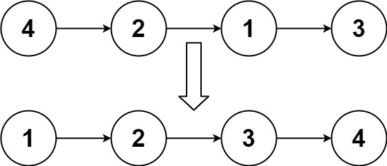

# 148. 排序链表

[← 链表专题](../../02-专题/07-链表.md) · [总目录](../../../../README.md) · [复习清单](../../00-总览/03-复习清单.md)

| 题目信息 | 内容 |
|---|---|
| 难度 | 中等 |
| 核心模式 | 归并排序 |
| 时间复杂度 | O(n log n) |
| 空间复杂度 | O(1) 可用自底向上 |


## 题目与约束

给你链表的头结点 `head` ，请将其按 **升序** 排列并返回 **排序后的链表** 。

  **示例 1：**

  

  **输入：**head = [4,2,1,3]<br>**输出：**[1,2,3,4]

  **示例 2：**

  

  **输入：**head = [-1,5,3,4,0]<br>**输出：**[-1,0,3,4,5]

  **示例 3：**

  **输入：**head = []<br>**输出：**[]

  **提示：**

  - 链表中节点的数目在范围 `[0, 5 * 104]` 内
  - `-105 <= Node.val <= 105`

  **进阶：**你可以在 `O(n log n)` 时间复杂度和常数级空间复杂度下，对链表进行排序吗？

## 核心不变量

> 链表适合通过断链、归并完成稳定排序。

## 解法 1：自顶向下归并版

### 思路推导
  1. **直觉与痛点（转数组/冒泡排序）**：

     - *想法 1*：把链表的值全部塞进一个数组，对数组用自带的 `Arrays.sort()` 排好序，然后再塞回链表。**痛点**：空间复杂度变成了 $O(N)$，面试官直接让你回家等通知。
     - *想法 2*：用冒泡排序或选择排序直接在链表上换位置。**痛点**：时间复杂度是 $O(N^2)$，链表一旦很长直接超时（Time Limit Exceeded）。

  2. **破局思路（归并排序的优化思路）**：

     要满足 $O(N \log N)$ 的时间复杂度，我们通常会想到**快速排序**或**归并排序**。

     - 快排在单链表上很难实现（因为没有从后往前跑的指针，而且容易退化成 $O(N^2)$）。
     - **归并排序简直是为链表量身定制的！** 数组做归并合并时，还需要开辟额外的 $O(N)$ 数组空间来存放结果；而链表做归并合并，只需要改变指针指向，**合并操作本身的空间复杂度是零开销的！**

  3. **逻辑推演（分治法 Divide and Conquer）**：

     - **分（Divide）**：用“快慢指针”找到链表的中点。找到后，**果断地一刀剪断**，把链表拆成左右两半。
     - **治（Conquer）**：递归地对左半部分和右半部分继续执行“分”的操作，直到链表被拆成只剩 1 个节点（1个节点天然是有序的）。
     - **合（Combine）**：调用“合并两个有序链表”的方法，把两个排好序的短链表，像拉链一样拼成一个长链表。层层往上合并，最终得到全局有序的链表。
### Java 实现（自顶向下归并版）
```java
/**
 * Definition for singly-linked list.
 * public class ListNode {
 *     int val;
 *     ListNode next;
 *     ListNode() {}
 *     ListNode(int val) { this.val = val; }
 *     ListNode(int val, ListNode next) { this.val = val; this.next = next; }
 * }
 */
class Solution {
    public ListNode sortList(ListNode head) {
        // 1. 递归的终止条件：如果链表为空，或者只有一个节点，天然是有序的，直接返回
        if (head == null || head.next == null) {
            return head;
        }

        // 2. 【分】使用快慢指针找到链表的中点
        // 注意致命细节：fast 必须比 slow 多走一步（即初始化在 head.next），
        // 这样在偶数长度时，slow 才能准确停在左半部分最后一个节点，方便切断！
        ListNode slow = head;
        ListNode fast = head.next;
        while (fast != null && fast.next != null) {
            slow = slow.next;
            fast = fast.next.next;
        }

        // 找到右半部分的头节点
        ListNode mid = slow.next;
        // 灵魂一刀：切断链表，变成彻底独立的左右两半！
        slow.next = null;

        // 3. 【治】递归地对左右两半分别进行排序
        ListNode left = sortList(head);
        ListNode right = sortList(mid);

        // 4. 【合】将两个排好序的链表合并成一个（直接调用 21 题的逻辑）
        return merge(left, right);
    }

    // 子模块：合并两个有序链表
    private ListNode merge(ListNode l1, ListNode l2) {
        ListNode dummy = new ListNode(-1);
        ListNode curr = dummy;

        while (l1 != null && l2 != null) {
            if (l1.val < l2.val) {
                curr.next = l1;
                l1 = l1.next;
            } else {
                curr.next = l2;
                l2 = l2.next;
            }
            curr = curr.next;
        }

        // 接上剩下没走完的那一半
        curr.next = (l1 != null) ? l1 : l2;

        return dummy.next;
    }
}
```
### 复杂度
  - **时间复杂度**：$O(N \log N)$。归并排序的标准时间复杂度。把链表对半拆分需要递归 $\log N$ 层，每一层的合并操作需要遍历总共 $N$ 个节点。
  - **空间复杂度**：$O(\log N)$。因为这是“自顶向下”的递归写法，系统调用栈的最大深度为 $\log N$。

### 易错点与扩展（面试高频考点）

1. **踩坑警告：快慢指针的初始化（死循环地狱）**
   - 很多同学喜欢写 `ListNode slow = head, fast = head;`。如果链表长度为 2（比如 `[4, 2]`），跑完 `while` 循环后，`slow` 会停在 `2` 上。
   - 此时你从 `slow.next`（也就是 `null`）切断，左半边依然是 `[4, 2]`，右半边是 `null`。这就陷入了**无限递归**（栈溢出）！
   - **破解法**：必须写 `fast = head.next;`。这样在只有两个节点时，`slow` 就停在 `4`，左边是 `[4]`，右边是 `[2]`，完美切割！
2. **面试考官最后的一击：“你的空间复杂度是 $O(\log N)$，并没有完全符合题目 $O(1)$ 的进阶要求。你能做到真正的 $O(1)$ 吗？”**
   - **满分抢答**：能！使用**自底向上（Bottom-Up）的迭代版归并排序**。
   - *解释思路*：我们不利用递归去分块。而是直接在原链表上，先按 `步长 = 1` 强制两两合并；再按 `步长 = 2` 四四合并；再按 `步长 = 4` 八八合并...直到步长大于链表总长度。因为全程用循环取代了递归，空间复杂度被彻底压缩成了完美的 $O(1)$。
   - *(注：在真正的白板面试中，写出自顶向下的递归版已经足够拿到 90 分的 Offer。自底向上的迭代版边界极其繁琐，通常只需要你说出思路即可。)*

## 解法 2：自底向上 O(1) 空间版

### 思路推导
  放弃从上往下“切一半”的递归思想。我们直接从最底层开始，强行规定一个**步长（subLength）**。

  初始步长为 1，意味着我们把链表看作一个个长度为 1 的独立节点，然后两两合并；

  合并一轮后，步长翻倍变成 2，我们把链表看作一个个长度为 2 的小块，继续两两合并；

  接着步长变成 4、8、16…… 直到设定的步长大于链表的总长度，整个链表就自然排好序了。
### 思路推导
  1. **第一步：知己知彼**。想要自底向上，必须先遍历一遍链表，统计出链表的总长度 `length`。这样我们才知道外层循环的“步长翻倍”什么时候该停下。

  2. **第二步：引入“缝合怪” `prev`**。在合并一个个小块时，我们需要把合并好的结果重新接回主链表。因此，我们需要一个 `prev` 指针（初始指向 `dummy`），它就像一根针，永远跟在已经合并好的链表尾部，准备把下一组缝合上来。

  3. **第三步：精准切割（最容易报错的地方）**：

     假设当前步长为 `k`，我们需要从当前链表中切下两个长度为 `k` 的片段（`head1` 和 `head2`）：

     - 找到 `head1`，往前走 `k-1` 步，把它和后面的链表**物理断开**（`next = null`）。
     - 找到 `head2`，同样往前走 `k-1` 步，把它和剩下的大部队**物理断开**。
     - 千万别忘了用一个变量 `nextGroup` 记录大部队的头节点，不然剩下的链表就彻底丢了！

  4. **第四步：合并与缝合**。调用我们烂熟于心的 `merge(head1, head2)`。然后让 `prev.next` 指向合并后的新车头。最后，把 `prev` 移动到合并后的车尾，准备进入下一次切割。
### Java 实现（纯迭代版）
```java
/**
 * Definition for singly-linked list.
 * public class ListNode {
 *     int val;
 *     ListNode next;
 *     ListNode() {}
 *     ListNode(int val) { this.val = val; }
 *     ListNode(int val, ListNode next) { this.val = val; this.next = next; }
 * }
 */
class Solution {
    public ListNode sortList(ListNode head) {
        if (head == null || head.next == null) {
            return head;
        }

        // 1. 遍历一遍，统计链表的总长度
        int length = 0;
        ListNode node = head;
        while (node != null) {
            length++;
            node = node.next;
        }

        // 2. 引入虚拟头节点，这是迭代法的生命线
        ListNode dummy = new ListNode(-1);
        dummy.next = head;

        // 3. 外层循环：控制步长 subLen 每次翻倍 (1, 2, 4, 8...)
        // 注意是用位运算 <<= 1 实现翻倍，逼格和性能拉满
        for (int subLen = 1; subLen < length; subLen <<= 1) {
            // prev 负责把合并后的小片段缝合起来
            ListNode prev = dummy;
            // curr 负责在前面开路，切割链表
            ListNode curr = dummy.next;

            // 内层循环：按当前步长，把链表从头到尾切块合并一遍
            while (curr != null) {
                // --- 动作 A：切下第一块 (head1) ---
                ListNode head1 = curr;
                // curr 往前走 subLen - 1 步，来到第一块的尾巴
                for (int i = 1; i < subLen && curr.next != null; i++) {
                    curr = curr.next;
                }

                // --- 动作 B：切下第二块 (head2) ---
                // 第一块的尾巴后面那个节点，就是第二块的头
                ListNode head2 = curr.next;
                // 果断切断第一块和第二块的联系
                curr.next = null;

                curr = head2; // curr 移动到第二块的开头
                // curr 往前走 subLen - 1 步，来到第二块的尾巴
                for (int i = 1; i < subLen && curr != null && curr.next != null; i++) {
                    curr = curr.next;
                }

                // --- 动作 C：记录大部队，并切断第二块 ---
                ListNode nextGroup = null;
                if (curr != null) {
                    nextGroup = curr.next; // 记录剩下还没处理的链表
                    curr.next = null;      // 果断切断第二块和大部队的联系
                }

                // --- 动作 D：合并与缝合 ---
                // 将 head1 和 head2 两个短链表合并
                ListNode merged = merge(head1, head2);

                // 把合并后的结果接到 prev 后面
                prev.next = merged;

                // 将 prev 移动到这根拼接好的链表的【最末尾】，准备缝合下一组
                while (prev.next != null) {
                    prev = prev.next;
                }

                // curr 重新回到大部队的开头，继续下一次切块
                curr = nextGroup;
            }
        }

        return dummy.next;
    }

    // 标准模块：合并两个有序链表（跟之前一模一样，无缝复用）
    private ListNode merge(ListNode l1, ListNode l2) {
        ListNode dummy = new ListNode(-1);
        ListNode curr = dummy;
        while (l1 != null && l2 != null) {
            if (l1.val <= l2.val) {
                curr.next = l1;
                l1 = l1.next;
            } else {
                curr.next = l2;
                l2 = l2.next;
            }
            curr = curr.next;
        }
        curr.next = (l1 != null) ? l1 : l2;
        return dummy.next;
    }
}
```
### 复杂度
  - **时间复杂度**：$O(N \log N)$。外层循环执行 $\log N$ 次（步长每次翻倍），内层循环每次都需要把链表遍历一遍（$O(N)$）。总体时间复杂度依然是极速的 $O(N \log N)$。
  - **空间复杂度**：$O(1)$。没有任何递归调用！我们在原链表上通过疯狂的指针切断和重连完成了排序，达到了内存使用的极致压缩。

### 易错点与扩展（进阶的细节）

1. **为什么切 `head1` 和切 `head2` 的条件不一样？**

   - 仔细看代码，切 `head1` 时条件是 `i < subLen && curr.next != null`，因为就算剩余长度不够 `subLen`，我们也要把剩下的节点当成 `head1`，但必须保证不报空指针。
   - 切 `head2` 时条件变成了 `i < subLen && curr != null && curr.next != null`。这是因为在某些极端的末尾情况，`head2` 可能一开始就是 `null`（说明后面没节点了），如果此时调用 `curr.next` 会直接空指针异常。**对边界的极其敏锐的嗅觉，是这道题的隐形考点。**

2. **`prev` 到底是什么角色？**

   - 很多新手看代码会疑惑：`merge` 函数返回了合并后的头节点，但我怎么知道它的**尾节点**在哪？

   - 这就是 `while (prev.next != null) { prev = prev.next; }` 存在的原因。因为我们需要用尾节点去连接下一组循环合并出来的头节点。`prev` 就像一个忠诚的搬砖工，每次缝合完毕后，都默默跑到队伍的最末尾，等待下一次的拼装指令。

## 力扣原题

[🔗 前往力扣原题验证 →](https://leetcode.cn/problems/sort-list/?envType=study-plan-v2&envId=top-100-liked)

<!--bottom-nav-->
<div class="problem-nav">
<a class="problem-nav-btn" href="../07-链表/0138-随机链表的复制.html" target="_blank" rel="noopener noreferrer">← 上一题</a>
<a class="problem-nav-btn" href="../../../../index.html">🏠 回到 Hot 100 目录</a>
<a class="problem-nav-btn primary" href="../07-链表/0023-合并 K 个升序链表.html" target="_blank" rel="noopener noreferrer">下一题 →</a>
</div>
<!--/bottom-nav-->
