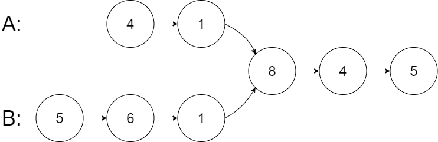
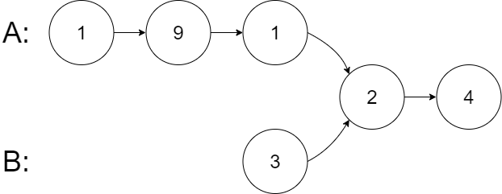
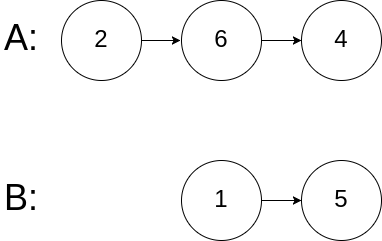

# 160. 相交链表

[← 链表专题](../../02-专题/07-链表.md) · [总目录](../../../../README.md) · [复习清单](../../00-总览/03-复习清单.md)

| 题目信息 | 内容 |
|---|---|
| 难度 | 简单 |
| 核心模式 | 双指针换头 |
| 时间复杂度 | O(m+n) |
| 空间复杂度 | O(1) |


## 题目与约束

给你两个单链表的头节点 `headA` 和 `headB` ，请你找出并返回两个单链表相交的起始节点。如果两个链表不存在相交节点，返回 `null` 。

  图示两个链表在节点 `c1` 开始相交**：**

  [](https://assets.leetcode.cn/aliyun-lc-upload/uploads/2018/12/14/160_statement.png)

  题目数据 **保证** 整个链式结构中不存在环。

  **注意**，函数返回结果后，链表必须 **保持其原始结构** 。

  **自定义评测：**

  **评测系统** 的输入如下（你设计的程序 **不适用** 此输入）：

  - `intersectVal` - 相交的起始节点的值。如果不存在相交节点，这一值为 `0`
  - `listA` - 第一个链表
  - `listB` - 第二个链表
  - `skipA` - 在 `listA` 中（从头节点开始）跳到交叉节点的节点数
  - `skipB` - 在 `listB` 中（从头节点开始）跳到交叉节点的节点数

  评测系统将根据这些输入创建链式数据结构，并将两个头节点 `headA` 和 `headB` 传递给你的程序。如果程序能够正确返回相交节点，那么你的解决方案将被 **视作正确答案** 。

  **示例 1：**

  [](https://assets.leetcode.com/uploads/2018/12/13/160_example_1.png)

  **输入：**intersectVal = 8, listA = [4,1,8,4,5], listB = [5,6,1,8,4,5], skipA = 2, skipB = 3<br>**输出：**Intersected at '8'<br>**解释：**相交节点的值为 8 （注意，如果两个链表相交则不能为 0）。<br>从各自的表头开始算起，链表 A 为 [4,1,8,4,5]，链表 B 为 [5,6,1,8,4,5]。<br>在 A 中，相交节点前有 2 个节点；在 B 中，相交节点前有 3 个节点。<br>— 请注意相交节点的值不为 1，因为在链表 A 和链表 B 之中值为 1 的节点 (A 中第二个节点和 B 中第三个节点) 是不同的节点。换句话说，它们在内存中指向两个不同的位置，而链表 A 和链表 B 中值为 8 的节点 (A 中第三个节点，B 中第四个节点) 在内存中指向相同的位置。

  **示例 2：**

  [](https://assets.leetcode.com/uploads/2018/12/13/160_example_2.png)

  **输入：**intersectVal = 2, listA = [1,9,1,2,4], listB = [3,2,4], skipA = 3, skipB = 1<br>**输出：**Intersected at '2'<br>**解释：**相交节点的值为 2 （注意，如果两个链表相交则不能为 0）。<br>从各自的表头开始算起，链表 A 为 [1,9,1,2,4]，链表 B 为 [3,2,4]。<br>在 A 中，相交节点前有 3 个节点；在 B 中，相交节点前有 1 个节点。

  **示例 3：**

  [](https://assets.leetcode.com/uploads/2018/12/13/160_example_3.png)

  **输入：**intersectVal = 0, listA = [2,6,4], listB = [1,5], skipA = 3, skipB = 2<br>**输出：**No intersection<br>**解释：**从各自的表头开始算起，链表 A 为 [2,6,4]，链表 B 为 [1,5]。<br>由于这两个链表不相交，所以 intersectVal 必须为 0，而 skipA 和 skipB 可以是任意值。<br>这两个链表不相交，因此返回 null 。

  **提示：**

  - `listA` 中节点数目为 `m`
  - `listB` 中节点数目为 `n`
  - `1 <= m, n <= 3 * 104`
  - `1 <= Node.val <= 105`
  - `0 <= skipA <= m`
  - `0 <= skipB <= n`
  - 如果 `listA` 和 `listB` 没有交点，`intersectVal` 为 `0`
  - 如果 `listA` 和 `listB` 有交点，`intersectVal == listA[skipA] == listB[skipB]`

  **进阶：**你能否设计一个时间复杂度 `O(m + n)` 、仅用 `O(1)` 内存的解决方案？

## 核心不变量

> 两指针各走 A+B 后自然对齐，比较的是节点引用。

## 完整推导

### 思路推导
  1. **直觉与痛点（哈希表）**：

     把链表 A 的所有节点塞进一个 `HashSet`，然后遍历链表 B，看 B 的节点哪个在 Set 里。

     **痛点**：空间复杂度是 $O(N)$，不符合面试官要求的 $O(1)$。

  2. **常规思路（差值法 / 截长补短）**：

     链表相交后，后面的长度是一模一样的。所以尾部是对齐的，只是头部参差不齐。

     我们可以先分别遍历求出链表 A 和 B 的长度。让较长的链表先走“长度差”步，然后两个链表再同时往下走，相遇的第一个节点就是交点。

     **痛点**：虽然空间 $O(1)$ 达标了，但需要先算长度、算差值、甚至写判断谁长谁短的分支，代码略显繁琐。

  3. **简洁思路（双指针换乘法）**：

     假设链表 A 独有的长度为 $a$，链表 B 独有的长度为 $b$，相交的公共部分长度为 $c$。

     - 指针 `pA` 走过的总路程：走完 A 链表，**换乘**到 B 链表，走到交点。总距离 = $a + c + b$。

     - 指针 `pB` 走过的总路程：走完 B 链表，**换乘**到 A 链表，走到交点。总距离 = $b + c + a$。

       因为 $a + c + b = b + c + a$，所以无论 $a$ 和 $b$ 差多少，**两个指针一定会同时到达交点！**
### Java 实现（极致优雅）
```java
/**
 * Definition for singly-linked list.
 * public class ListNode {
 *     int val;
 *     ListNode next;
 *     ListNode(int x) {
 *         val = x;
 *         next = null;
 *     }
 * }
 */
public class Solution {
    public ListNode getIntersectionNode(ListNode headA, ListNode headB) {
        // 如果其中一个为空，绝对不可能相交
        if (headA == null || headB == null) return null;

        ListNode pA = headA;
        ListNode pB = headB;

        // 只要两个指针没相遇，就一直走
        while (pA != pB) {
            // pA 走一步，如果走到 A 的尽头（null），则换乘到 B 的车头
            pA = (pA == null) ? headB : pA.next;

            // pB 走一步，如果走到 B 的尽头（null），则换乘到 A 的车头
            pB = (pB == null) ? headA : pB.next;
        }

        // 当退出循环时，pA 和 pB 要么同时指向交点，要么同时指向 null（不相交的情况）
        return pA;
    }
}
```
### 复杂度
  - **时间复杂度**：$O(M + N)$。最坏情况下（没有交点），两个指针都把两个链表各走了一遍，总共走了 $M + N$ 步。
  - **空间复杂度**：$O(1)$。只用了两个指针 `pA` 和 `pB`。

### 易错点与扩展（可能会被追问的细节）

1. **致命踩坑：判断交点是比较“值”还是比较“引用”？**
   - **绝对是比较引用（内存地址）！** 面试中千万不要写 `pA.val == pB.val`。相交的意思是两个链表在物理上合并成了同一个节点，而不是仅仅里面存的数字一样。代码里的 `pA != pB` 比较的就是对象地址。
2. **面试官发问：“如果这两个链表根本就不相交，你的代码会死循环吗？”**
   - **满分回答**：不会！如果不想交（即 $c = 0$），`pA` 走完 $a + b$ 步后会到达 B 的末尾的 `null`，`pB` 走完 $b + a$ 步后也会到达 A 的末尾的 `null`。此时 `pA == null` 且 `pB == null`，满足 `pA == pB` 的退出条件，循环完美结束并返回 `null`。

## 力扣原题

[🔗 前往力扣原题验证 →](https://leetcode.cn/problems/intersection-of-two-linked-lists/?envType=study-plan-v2&envId=top-100-liked)

<!--bottom-nav-->
<div class="problem-nav">
<a class="problem-nav-btn" href="../06-矩阵/0240-搜索二维矩阵 II.html" target="_blank" rel="noopener noreferrer">← 上一题</a>
<a class="problem-nav-btn" href="../../../../index.html">🏠 回到 Hot 100 目录</a>
<a class="problem-nav-btn primary" href="../07-链表/0234-回文链表.html" target="_blank" rel="noopener noreferrer">下一题 →</a>
</div>
<!--/bottom-nav-->
