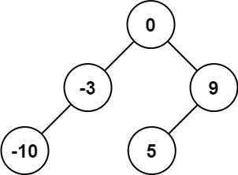

# 108. 将有序数组转换为二叉搜索树

[← 二叉树专题](../../02-专题/08-二叉树.md) · [总目录](../../../../README.md) · [复习清单](../../00-总览/03-复习清单.md)

| 题目信息 | 内容 |
|---|---|
| 难度 | 简单 |
| 核心模式 | 分治取中点 |
| 时间复杂度 | O(n) |
| 空间复杂度 | O(log n) |


## 题目与约束

给你一个整数数组 `nums` ，其中元素已经按 **升序** 排列，请你将其转换为一棵 平衡 二叉搜索树。

  **示例 1：**

  

  **输入：**nums = [-10,-3,0,5,9]<br>**输出：**[0,-3,9,-10,null,5]<br>**解释：**[0,-10,5,null,-3,null,9] 也将被视为正确答案：<br>

  **示例 2：**

  

  **输入：**nums = [1,3]<br>**输出：**[3,1]<br>**解释：**[1,null,3] 和 [3,1] 都是高度平衡二叉搜索树。

  **提示：**

  - `1 <= nums.length <= 104`
  - `-104 <= nums[i] <= 104`
  - `nums` 按 **严格递增** 顺序排列

## 核心不变量

> 中点作根可同时保证 BST 有序与高度平衡。

## 完整推导

### 思路推导
  1. **直觉与痛点（随便建树的恶果）**：

     既然是有序数组，我能不能直接把第一个元素当根节点，第二个元素当右孩子，第三个当右孩子的右孩子……？

     **痛点**：能建出 BST，但这棵树会长成一根“糖葫芦”（严重向右倾斜的链表）。题目要求必须是**高度平衡**的！如果树不平衡，查找效率就会从 $O(\log N)$ 退化成 $O(N)$，毫无意义。

  2. **破局思路（找天平的支点：中位数）**：

     怎样才能让天平（树）两边平衡？必须把**最中间、最重量级**的人（中位数）拎起来当老大（根节点）！

     因为数组已经排好序了，中位数左边的数字一定比它小（天然适合做左子树），中位数右边的数字一定比它大（天然适合做右子树），而且两边的人数基本相等（保证了高度平衡）。

  3. **逻辑推演（递归分治）**：

     - **第一步（定规矩）**：在一个区间 `[left, right]` 内，找到中间位置 `mid = left + (right - left) / 2`。

     - **第二步（封王）**：把 `nums[mid]` 这个数字提拔为当前的根节点 `root`。

     - **第三步（分封诸侯）**：

       让左边的地盘 `[left, mid - 1]` 自己去建一棵左子树，建好后接在我的 `root.left` 上。

       让右边的地盘 `[mid + 1, right]` 自己去建一棵右子树，建好后接在我的 `root.right` 上。

     - **第四步（终止条件）**：如果地盘被分光了（`left > right`），说明没数字可建了，返回 `null`。
### Java 实现（极简递归版）
```java
/**
 * Definition for a binary tree node.
 * public class TreeNode {
 *     int val;
 *     TreeNode left;
 *     TreeNode right;
 *     TreeNode() {}
 *     TreeNode(int val) { this.val = val; }
 *     TreeNode(int val, TreeNode left, TreeNode right) {
 *         this.val = val;
 *         this.left = left;
 *         this.right = right;
 *     }
 * }
 */
class Solution {
    public TreeNode sortedArrayToBST(int[] nums) {
        // 防御性编程
        if (nums == null || nums.length == 0) {
            return null;
        }
        // 把整个数组的范围 [0, nums.length - 1] 交给辅助函数去建树
        return buildTree(nums, 0, nums.length - 1);
    }

    // 辅助函数：在 nums 数组的 [left, right] 闭区间内，构造平衡 BST 并返回根节点
    private TreeNode buildTree(int[] nums, int left, int right) {
        // 1. 递归终止条件：区间无效，说明没有任何数字可以用来建树了
        if (left > right) {
            return null;
        }

        // 2. 找中点，作为当前的根节点
        // 这里使用 left + (right - left) / 2 是为了防止 (left + right) 数值过大导致 int 溢出
        int mid = left + (right - left) / 2;
        TreeNode root = new TreeNode(nums[mid]);

        // 3. 递归构造左子树，范围是当前中点的左边半段
        root.left = buildTree(nums, left, mid - 1);

        // 4. 递归构造右子树，范围是当前中点的右边半段
        root.right = buildTree(nums, mid + 1, right);

        // 5. 返回这座“天平”的支点
        return root;
    }
}
```
### 复杂度
  - **时间复杂度**：$O(N)$。每次选取中点花费 $O(1)$ 的时间，总共 $N$ 个数字，每个数字都会被访问一次并创建为一个节点。
  - **空间复杂度**：$O(\log N)$。因为这是一棵高度平衡的二叉树，所以递归深度最大也就是树的高度 $\log N$。每次递归调用只使用了常数级别的额外空间。

### 易错点与扩展（面试细节大考问）

1. **踩坑警告：中点偏左还是偏右？**
   - 如果数组长度是偶数（比如 `[1, 2, 3, 4]`），中点有两个（`2` 和 `3`），该选哪一个？
   - 我们代码里写的 `left + (right - left) / 2` 在向下取整后，会**永远选择偏左**的那个（即 `2`）。
   - **面试官灵魂追问**：“如果我让你每次选偏右的那个做根节点，你会怎么改代码？”
   - *满分抢答*：只需要改一行！把求 `mid` 的公式改成 `int mid = left + (right - left + 1) / 2;`，这样遇到偶数个数时，就会强行拿到偏右的那个数字。建出来的依然是完美的平衡二叉树，只是形状会有细微的不同（树向左边倾斜一点点而不是向右倾斜）。
2. **面试炫技：“你能不用递归（也就是用迭代/BFS）写出这道题吗？”**
   - *降维解法*：可以用三个队列！一个队列存准备要建立的节点，一个队列存该节点对应的 `left` 边界，一个队列存对应的 `right` 边界。每次从三个队列里拿出一组数据，算中点赋值，然后把它的左右边界范围再塞回队列里。虽然代码极长且没人会在生产环境这么写，但能说出这个思路，绝对证明你把 BFS 玩透了！

#### 📝 算法避坑笔记：从“线性思维”到“树形思维”的跨越

**—— 以「108. 将有序数组转换为二叉搜索树」为例**

#### ❌ 一、 典型错误复盘：为什么 `for` 循环行不通？

- **错误做法**：找到数组中点作为根节点后，直接用一个 `for` 循环，把左边的数字依次挂在左下角，右边的数字依次挂在右下角。
- **错误后果**：建出了一棵形状像“人”字的树（左右两边全是单直线的链表），严重违反了题目“高度平衡”的要求。
- **致错根源（两大幻觉）**：
  1. **被“小数据”视觉欺骗**：力扣示例给的数组只有 5 个节点，左半边只有 2 个节点。2 个节点无论怎么建都是一条直线，这造成了“可以用 `for` 循环串起来”的严重错觉。
  2. **用“一维线性工具”解“二维分岔问题”**：`for` 循环是线性推进的，而二叉树是向外辐射的分形结构。

#### ✅ 二、 破局核心：正确的“树形思维”

- **分形与分治（Divide and Conquer）**：

  树的局部和整体长得一模一样。既然大数组需要找中点当老大，那么切分出来的**小数组也必须自己找中点当小老大**，绝不能草率排队。

- **递归的“甩手掌柜”心法**：

  不要试图在脑子里走完树的所有分支。只要做好当前节点该做的事，剩下的直接“外包”：

  > *“我把中点挑出来当根节点。剩下的左半边？直接扔给递归函数，让它给我返回建好的左子树就行，我不关心细节！”*

#### 🚀 三、 算法实战“肌肉记忆”（三大铁律）

1. **遇树先想“递归”**：

   除层序遍历（BFS）必须用队列外，90% 的二叉树问题（求深、翻转、对称、建树），第一直觉必须是递归。如果在树的题里写了 `for/while` 去构建结构，立刻拉响警报。

2. **脑内推演，节点数必须 $\ge 7$**：

   永远不要用 3 个或 5 个节点的极小数据去推演规律，极小数据必然呈现退化形态。脑补测试用例时，至少用 7 个节点（3层高度）的满二叉树，才能看清真实的逻辑走向。

3. **找准中点防溢出**：

   求中位数的标准写法永远是 `int mid = left + (right - left) / 2;`，避免 `(left + right)` 导致整型溢出。

## 力扣原题

[🔗 前往力扣原题验证 →](https://leetcode.cn/problems/convert-sorted-array-to-binary-search-tree/?envType=study-plan-v2&envId=top-100-liked)

<!--bottom-nav-->
<div class="problem-nav">
<a class="problem-nav-btn" href="../08-二叉树/0102-二叉树的层序遍历.html" target="_blank" rel="noopener noreferrer">← 上一题</a>
<a class="problem-nav-btn" href="../../../../index.html">🏠 回到 Hot 100 目录</a>
<a class="problem-nav-btn primary" href="../08-二叉树/0098-验证二叉搜索树.html" target="_blank" rel="noopener noreferrer">下一题 →</a>
</div>
<!--/bottom-nav-->
