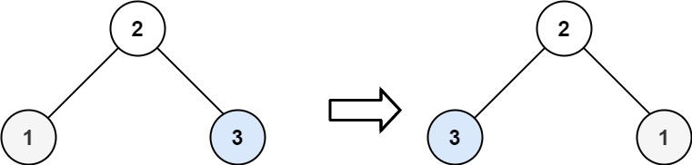

# 226. 翻转二叉树

[← 二叉树专题](../../02-专题/08-二叉树.md) · [总目录](../../../../README.md) · [复习清单](../../00-总览/03-复习清单.md)

| 题目信息 | 内容 |
|---|---|
| 难度 | 简单 |
| 核心模式 | 递归交换左右子树 |
| 时间复杂度 | O(n) |
| 空间复杂度 | O(h) |


## 题目与约束

给你一棵二叉树的根节点 `root` ，翻转这棵二叉树，并返回其根节点。

**示例 1：**


**输入：**root = [4,2,7,1,3,6,9]<br>**输出：**[4,7,2,9,6,3,1]

**示例 2：**



**输入：**root = [2,1,3]<br>**输出：**[2,3,1]

**示例 3：**

**输入：**root = []<br>**输出：**[]

**提示：**

- 树中节点数目范围在 `[0, 100]` 内
- `-100 <= Node.val <= 100`

## 核心不变量

> 每个节点只做一件事：交换左右孩子。

## 完整推导

### 思路推导

这道题最适合训练“递归函数只负责当前节点”的思维：

1. 空节点无需处理，直接返回。
2. 当前节点交换 `left` 与 `right`。
3. 对交换后的左右子树继续做同样的事情。

先交换再递归、先递归再交换都能得到正确结果；关键是整棵树的每个节点都恰好被处理一次。

### Java 实现

```java
class Solution {
    public TreeNode invertTree(TreeNode root) {
        if (root == null) {
            return null;
        }

        TreeNode temp = root.left;
        root.left = root.right;
        root.right = temp;

        invertTree(root.left);
        invertTree(root.right);
        return root;
    }
}
```

### 复杂度

- 时间复杂度：`O(n)`，每个节点访问一次。
- 空间复杂度：`O(h)`，递归栈深度等于树高；退化链表时最坏为 `O(n)`。

### 易错点与扩展

1. 交换的是节点引用，而不是节点值。
2. 不要只交换根节点；左右子树也必须递归处理。
3. 迭代写法可使用队列做 BFS：节点出队后交换孩子，再把非空孩子入队。

## 力扣原题

[🔗 前往力扣原题验证 →](https://leetcode.cn/problems/invert-binary-tree/?envType=study-plan-v2&envId=top-100-liked)

<!--bottom-nav-->
<div class="problem-nav">
<a class="problem-nav-btn" href="../08-二叉树/0104-二叉树的最大深度.html" target="_blank" rel="noopener noreferrer">← 上一题</a>
<a class="problem-nav-btn" href="../../../../index.html">🏠 回到 Hot 100 目录</a>
<a class="problem-nav-btn primary" href="../08-二叉树/0101-对称二叉树.html" target="_blank" rel="noopener noreferrer">下一题 →</a>
</div>
<!--/bottom-nav-->
