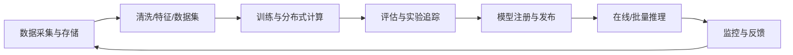
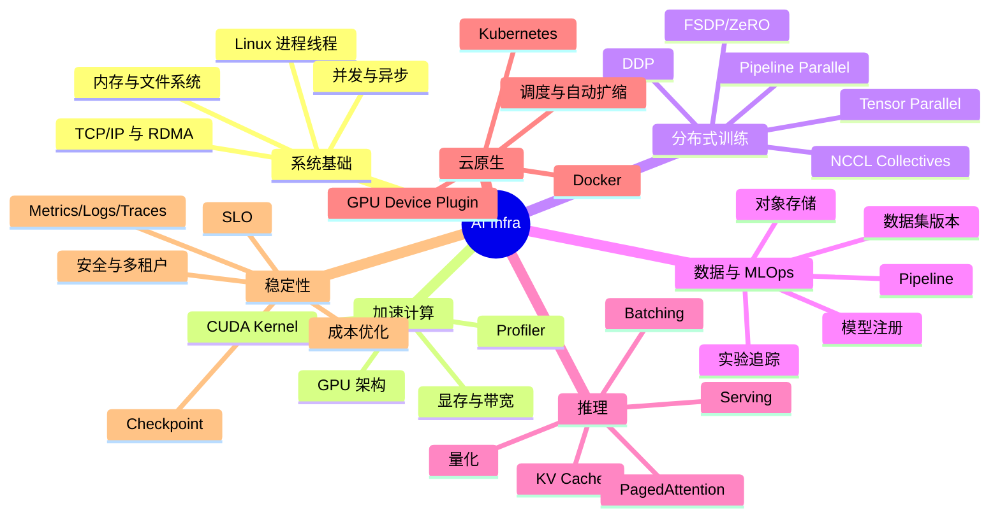
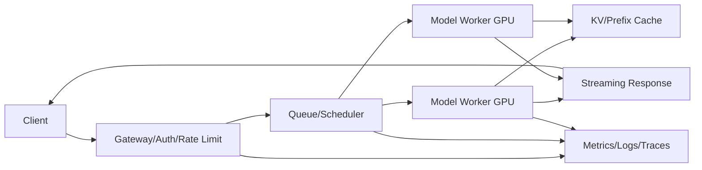
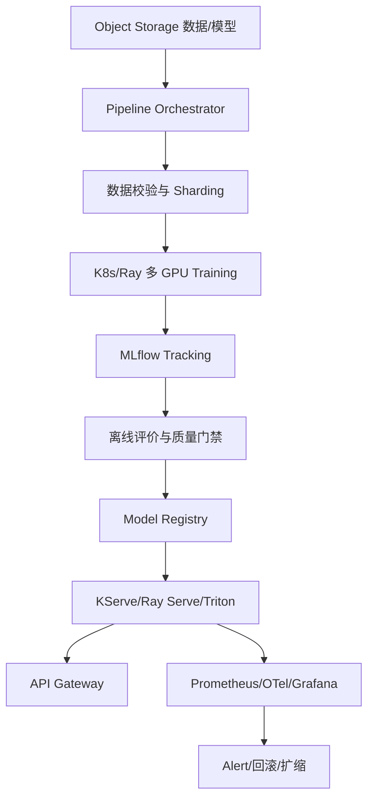

# AI Infra 完整学习笔记：从 GPU、分布式训练到大模型推理与 MLOps

> 目标：一次性建立 AI Infrastructure 的完整知识框架，能够理解训练、推理、数据、调度、可观测性和成本优化之间的关系，并知道每类技术解决什么问题。  
> 定位：以工程实践为主，适合准备 AI Infra、ML Platform、分布式训练、推理平台和大模型工程岗位。  
> 最后核对：2026-07-22。框架与硬件更新很快，具体 API 和版本应以官方文档为准。

## 目录

- [1. AI Infra 是什么](#1-ai-infra-是什么)
- [2. AI Infra 岗位知识地图](#2-ai-infra-岗位知识地图)
- [3. Linux 与系统基础](#3-linux-与系统基础)
- [4. CPU、内存、存储与网络](#4-cpu内存存储与网络)
- [5. GPU 与 CUDA 基础](#5-gpu-与-cuda-基础)
- [6. 单卡训练性能分析](#6-单卡训练性能分析)
- [7. 分布式系统基本概念](#7-分布式系统基本概念)
- [8. 分布式训练](#8-分布式训练)
- [9. 大模型并行策略](#9-大模型并行策略)
- [10. 通信、NCCL 与集群网络](#10-通信nccl-与集群网络)
- [11. 数据流水线与存储](#11-数据流水线与存储)
- [12. 实验追踪、模型注册与 MLOps](#12-实验追踪模型注册与-mlops)
- [13. 模型推理基础](#13-模型推理基础)
- [14. 大语言模型推理](#14-大语言模型推理)
- [15. 推理服务架构](#15-推理服务架构)
- [16. Docker、Kubernetes 与 GPU 调度](#16-dockerkubernetes-与-gpu-调度)
- [17. 可观测性与故障排查](#17-可观测性与故障排查)
- [18. 可靠性、安全与多租户](#18-可靠性安全与多租户)
- [19. 成本与容量规划](#19-成本与容量规划)
- [20. 常见技术栈与选型](#20-常见技术栈与选型)
- [21. 完整项目：从训练到推理服务](#21-完整项目从训练到推理服务)
- [22. 高频面试问题](#22-高频面试问题)
- [23. 学习路线](#23-学习路线)
- [24. 一页速记](#24-一页速记)
- [25. 关联笔记与官方资料](#25-关联笔记与官方资料)

---

## 1. AI Infra 是什么

AI Infra 是支撑机器学习模型从数据准备、训练、评估到部署、推理和持续迭代的一整套基础设施。



AI 算法工程师更关注模型结构、损失函数和指标；AI Infra 工程师更关注：

- 模型怎样稳定获得数据和算力；
- 单卡程序怎样扩展到多卡、多机；
- 训练失败怎样恢复；
- 大模型怎样以低延迟、高吞吐提供服务；
- GPU 怎样被调度、隔离和充分利用；
- 实验、数据、代码和模型怎样形成可追溯关系；
- 系统怎样监控、扩缩容、容灾和控制成本。

### 1.1 AI Infra 与传统后端/云原生的区别

AI Infra 仍建立在操作系统、网络、存储、容器和分布式系统之上，但工作负载具有特殊性：

- GPU 昂贵且数量有限，空闲和碎片浪费明显；
- 训练任务可能持续数小时到数周，需要可靠 checkpoint；
- 单个模型和优化器状态可能达到 TB 级；
- 数据吞吐不足会让 GPU 等待；
- 分布式训练对尾部慢节点和网络抖动敏感；
- 大模型推理包含动态序列长度和巨大的 KV Cache；
- 模型质量、数据版本和业务指标都要进入发布门禁。

### 1.2 常见岗位方向

| 方向 | 主要工作 |
|---|---|
| 训练框架/分布式训练 | DDP、FSDP、ZeRO、TP/PP、通信优化 |
| GPU/CUDA 性能 | Kernel、算子融合、显存、Profiler、Triton/CUDA |
| ML Platform/MLOps | 训练任务、实验追踪、模型注册、流水线、权限 |
| 推理平台 | 模型加载、动态批处理、量化、缓存、弹性扩缩 |
| 数据基础设施 | 数据湖、数据集版本、ETL、流式加载、特征平台 |
| 集群调度 | Kubernetes、GPU 资源、队列、配额、拓扑感知 |
| 可观测性/SRE | 指标、日志、Trace、SLO、故障恢复、容量规划 |

---

## 2. AI Infra 岗位知识地图



推荐的学习顺序不是先背所有平台名称，而是：

```text
Linux/网络/存储
→ PyTorch 单卡训练与 GPU
→ 分布式系统和 DDP
→ FSDP/ZeRO/模型并行
→ 推理与服务化
→ Docker/Kubernetes
→ MLOps、监控和成本
```

---

## 3. Linux 与系统基础

AI 工作负载最终运行在操作系统进程中。不会排查 Linux，就很难判断“训练慢”究竟是模型、CPU、磁盘、网络还是 GPU。

### 3.1 进程、线程与协程

- 进程拥有独立虚拟地址空间，是资源隔离和故障边界；
- 线程共享进程内存，切换成本更低，但要处理锁和竞态；
- 协程由用户态运行时调度，适合大量 I/O 等待任务；
- Python GIL 限制同一进程多个线程并行执行 Python 字节码，但 C/CUDA 算子可释放 GIL；
- PyTorch DDP 通常采用“一张 GPU 一个进程”，而不是一个进程管理所有 GPU。

### 3.2 虚拟内存与 Page Cache

程序看到的是虚拟地址，操作系统负责映射到物理内存。内存不足时可能使用 Swap，但训练任务大量换页会极慢。

读取文件后，Linux 会用 Page Cache 缓存数据。第二轮读取更快可能只是命中缓存，不代表磁盘真正更快。评测数据吞吐时要区分冷缓存和热缓存。

OOM 可能来自：

- CPU 内存耗尽，被 Linux OOM Killer 终止；
- GPU 显存不足，框架抛出 CUDA OOM；
- 容器超过 cgroup memory limit；
- 共享内存 `/dev/shm` 太小，DataLoader Worker 失败。

### 3.3 文件描述符、信号与退出码

Socket、文件和 Pipe 都占用文件描述符。高并发服务可能遇到 `Too many open files`。训练任务收到 SIGTERM 时应保存 checkpoint 并优雅退出；SIGKILL 无法捕获。

退出码、标准输出/错误、core dump 和内核日志是排障证据，不能只看 Python 最后一行异常。

### 3.4 必会的诊断视角

| 问题 | 观察内容 |
|---|---|
| CPU 高 | `top/htop`、线程、上下文切换、火焰图 |
| 内存增长 | RSS、Page Cache、对象生命周期、容器限制 |
| 磁盘慢 | IOPS、吞吐、队列深度、随机/顺序访问 |
| 网络慢 | 带宽、RTT、丢包、重传、连接数 |
| GPU 慢 | 利用率、显存、功耗、Kernel 时间、CPU 等待 |

---

## 4. CPU、内存、存储与网络

### 4.1 计算受限与带宽受限

性能瓶颈通常分为：

- Compute-bound：算术运算占主导，提高 FLOPS 有帮助；
- Memory-bound：数据搬运占主导，提高显存/内存带宽更重要；
- I/O-bound：磁盘、对象存储或网络供数不足；
- Latency-bound：大量小操作、同步和调度开销占主导。

不能只看 GPU 利用率判断原因。某些内存拷贝和通信也会显示 GPU 活跃，但有效计算吞吐很低。

### 4.2 存储层次

```text
GPU HBM/显存：最快、最贵、容量小
CPU 内存：数据预处理与缓存
本地 NVMe：高速临时数据/Checkpoint 缓冲
共享文件系统：多节点共享训练数据
对象存储：便宜、耐久、适合大规模数据和模型制品
```

对象存储不是 POSIX 文件系统：通常按对象整体读写，不擅长大量小文件和随机修改。常见优化是把小样本打包成 Shard，顺序流式读取。

### 4.3 网络基础

需要理解：

- 带宽：单位时间最多传多少数据；
- 延迟 RTT：一次往返需要多久；
- 吞吐：实际有效传输速率；
- 丢包/重传：会引发尾部延迟和通信停顿；
- TCP 适合可靠通用传输；
- RDMA 允许更少 CPU 参与和内存拷贝，常用于高性能训练网络；
- InfiniBand、RoCE 是常见高性能互联方案；
- NVLink/NVSwitch 负责节点内或特定 GPU 拓扑的高速互联。

分布式训练的性能取决于最慢 Rank。平均带宽高但某条链路抖动，仍会拖慢所有 Worker。

---

## 5. GPU 与 CUDA 基础

### 5.1 GPU 为什么适合深度学习

CPU 擅长复杂控制和低延迟串行任务；GPU 具有大量执行单元和高显存带宽，适合矩阵乘法、卷积等高度并行计算。

CUDA 采用 SIMT（Single Instruction, Multiple Threads）风格：许多线程执行相同 Kernel，但处理不同数据。常见层级：

```text
Grid → Thread Block → Warp → Thread
```

Warp 是硬件调度的重要单位。一个 Warp 内线程走不同分支会发生分支发散，导致部分线程等待。

### 5.2 GPU 内存层次

- Register：每线程私有，最快，过多会降低并发驻留；
- Shared Memory：同一 Block 共享，低延迟，由程序控制；
- L1/L2 Cache：硬件缓存；
- Global Memory/HBM：容量大、延迟高，访问合并很重要；
- Host Memory：CPU 内存，经 PCIe/NVLink 搬运。

算子优化经常是在减少 Global Memory 往返、增加数据复用，而不只是减少浮点运算次数。

### 5.3 CUDA Stream 与异步执行

Kernel Launch 通常对 CPU 异步。不同 Stream 可让计算、通信和数据拷贝重叠，但依赖关系仍要通过 Event/同步正确表达。

错误的计时方式可能只测到 Kernel 提交时间。精确 GPU 计时需要 CUDA Event 或在边界同步。过度同步会破坏并行和流水线。

### 5.4 Tensor Core 与低精度

Tensor Core 加速特定矩阵运算。FP16、BF16、TF32、FP8、INT8/INT4 在精度、范围、速度和显存之间权衡。

- FP16 范围较小，训练常需要 Loss Scaling；
- BF16 指数范围接近 FP32，训练更稳；
- TF32 是 NVIDIA GPU 上加速部分 FP32 矩阵运算的格式/模式；
- INT8/INT4 常用于推理量化；
- 低精度是否加速取决于硬件、Shape 对齐和 Kernel 支持。

### 5.5 CUDA 软件栈

```text
AI Framework（PyTorch/JAX）
→ 算子库（cuBLAS/cuDNN/FlashAttention 等）
→ CUDA Runtime/Driver API
→ NVIDIA Driver
→ GPU Hardware
```

常见兼容问题来自驱动、CUDA Runtime、框架 Wheel 和自定义扩展的 ABI/架构不匹配。`nvidia-smi` 显示的 CUDA 版本通常表示驱动支持上限，不等于当前 PyTorch 实际链接的 CUDA Runtime。

### 5.6 GPU 环境诊断代码

```python
import torch

print("PyTorch:", torch.__version__)
print("PyTorch CUDA runtime:", torch.version.cuda)
print("CUDA available:", torch.cuda.is_available())

if torch.cuda.is_available():
    for i in range(torch.cuda.device_count()):
        prop = torch.cuda.get_device_properties(i)
        print(i, prop.name)
        print("  memory_GB:", round(prop.total_memory / 1024**3, 2))
        print("  capability:", f"{prop.major}.{prop.minor}")
```

这只能确认框架基本可见性。通信、Kernel、驱动错误仍需结合 `nvidia-smi`、日志和最小计算测试。

---

## 6. 单卡训练性能分析

### 6.1 吞吐与利用率

训练吞吐可用 samples/s、tokens/s、steps/s 衡量。GPU 利用率只是采样窗口内是否有工作，不能替代有效吞吐。

一次训练 Step 通常包含：

```text
取数据 → Host-to-Device → Forward → Loss
→ Backward → Optimizer → 日志/Checkpoint
```

Profiler 应回答每部分耗时、是否串行、是否存在空洞和显存峰值在哪里。

### 6.2 DataLoader 瓶颈

常见原因：

- 小文件随机读取；
- 图像解码/Tokenizer 占满 CPU；
- Worker 太少或太多；
- Batch 拼接和 Python 逻辑慢；
- 对象存储请求延迟；
- 每轮重复昂贵预处理。

优化可包括 Sharding、预取、Pinned Memory、持久 Worker、缓存、向量化、离线预处理和专用数据流水线。但 Worker 数不是越多越好，过多会争抢 CPU、内存和文件描述符。

### 6.3 显存由什么组成

训练显存大致包括：

```text
模型参数 + 梯度 + 优化器状态 + 激活值
+ 临时工作区 + 通信 Buffer + 内存碎片
```

Adam 的一阶、二阶状态会显著增加显存。激活通常随 batch、序列长度和层数增长。Gradient Checkpointing 用重复计算换激活显存；FSDP/ZeRO 则分片参数、梯度和优化器状态。

### 6.4 常见优化顺序

1. 先建立正确、可复现的基线；
2. Profiler 定位瓶颈；
3. 使用合适的混合精度和高效算子；
4. 增大 batch 以提高并行度，但监控泛化和显存；
5. 减少 Python 小操作和不必要同步；
6. 优化数据供给；
7. 再考虑 `torch.compile`、算子融合或自定义 Kernel。

没有 Profiling 证据时，不要直接重写 CUDA Kernel。

---

## 7. 分布式系统基本概念

### 7.1 Rank、World Size 与进程组

- World Size：参与通信的进程总数；
- Rank：进程在全局组中的编号；
- Local Rank：进程在当前节点上的编号，常用于选择 GPU；
- Process Group/Communicator：参与一组 Collective 的成员集合。

### 7.2 Collective Communication

| 操作 | 含义 | 典型用途 |
|---|---|---|
| Broadcast | 一个 Rank 发给所有 Rank | 同步初始参数 |
| All-Reduce | 汇总并把结果发回所有 Rank | DDP 梯度同步 |
| All-Gather | 每个 Rank 收集所有分片 | 聚合参数/输出 |
| Reduce-Scatter | 汇总后按分片发给各 Rank | FSDP/ZeRO 梯度分片 |
| All-to-All | 每个 Rank 给每个 Rank 不同数据 | MoE Token 路由 |

通信量、消息大小、拓扑和是否能与计算重叠决定扩展效率。

### 7.3 同步、屏障与 Straggler

同步训练中，各 Rank 通常要在通信点互相等待。某个 Worker 因数据慢、GPU 降频或网络抖动落后，所有 Worker 都会被拖慢，这个慢 Worker 称为 Straggler。

不必要的 Barrier 会增加空等。正确设计应让依赖通过 Collective 和事件自然同步，仅在确实需要全局一致时使用屏障。

### 7.4 容错与一致性

分布式训练发生 Worker 失败时，通常整个 Job 重启并从 checkpoint 恢复。弹性训练允许成员变化，但要处理数据进度、学习率、随机性和全局 batch 变化。

Checkpoint 必须是完整且一致的训练快照。写文件过程中断可能产生半成品，因此常写临时路径、完成后原子提交或用清单标记完成。

---

## 8. 分布式训练

### 8.1 Data Parallel 与 DDP

数据并行让每个 GPU 保存完整模型，处理不同 mini-batch。反向传播过程中使用 All-Reduce 汇总梯度，所有 Rank 用相同梯度更新，因此参数保持一致。

全局 Batch Size：

$$
B_{global}=B_{per\_gpu}\times N_{gpu}\times N_{accumulation}
$$

增加 GPU 后若保持单卡 batch 不变，全局 batch 会增大，可能需要调整学习率、Warmup 和训练步数。

### 8.2 DDP 最小结构

```python
import os
import torch
import torch.distributed as dist
from torch.nn.parallel import DistributedDataParallel as DDP
from torch.utils.data import DataLoader, DistributedSampler

def main():
    dist.init_process_group(backend="nccl")
    local_rank = int(os.environ["LOCAL_RANK"])
    torch.cuda.set_device(local_rank)

    model = build_model().to(local_rank)
    model = DDP(model, device_ids=[local_rank])

    sampler = DistributedSampler(train_dataset, shuffle=True)
    loader = DataLoader(train_dataset, sampler=sampler, batch_size=32)
    optimizer = torch.optim.AdamW(model.parameters(), lr=1e-4)

    for epoch in range(num_epochs):
        sampler.set_epoch(epoch)  # 让每轮各 Rank 获得一致但不同的洗牌
        for x, y in loader:
            x, y = x.to(local_rank), y.to(local_rank)
            optimizer.zero_grad()
            loss = loss_fn(model(x), y)
            loss.backward()
            optimizer.step()

    dist.destroy_process_group()

if __name__ == "__main__":
    main()
```

这段代码是结构示意，依赖 `build_model/train_dataset/loss_fn` 等项目对象。通常使用 `torchrun --nproc-per-node=<GPU数> train.py` 启动。

### 8.3 为什么不用 `DataParallel`

PyTorch 官方分布式模型偏好“一设备一进程”。DDP 避免单进程集中分发数据和汇总梯度，支持多机，并能在反向传播时用 Bucket 重叠梯度通信。`DataParallel` 更适合简单试验，不是高性能训练首选。

### 8.4 扩展效率

若 1 张卡吞吐为 $T_1$，$N$ 张卡吞吐为 $T_N$：

$$
Efficiency=\frac{T_N}{N\times T_1}
$$

效率下降来源包括通信、数据不足、同步、负载不均和每卡 batch 太小。强扩展固定总问题规模，弱扩展随设备增加问题规模；报告性能时要说明是哪一种。

---

## 9. 大模型并行策略

当模型、激活和优化器状态无法放入单卡，必须分片。

### 9.1 ZeRO 与 FSDP

普通 DDP 每卡复制参数、梯度和优化器状态。ZeRO/FSDP 逐步分片：

| 层级 | 分片内容 |
|---|---|
| Stage 1 | 优化器状态 |
| Stage 2 | 优化器状态 + 梯度 |
| Stage 3 / Full Shard | 优化器状态 + 梯度 + 参数 |

FSDP Full Shard 在计算前 All-Gather 当前模块参数，计算后重新分片；梯度通过 Reduce-Scatter 聚合并分片。显存下降的代价是更多通信和更复杂的 checkpoint。

### 9.2 Tensor Parallel

把单个大矩阵乘法按行或列分到多个 GPU。每层都可能通信，适合节点内高速互联。Transformer 的 Attention 和 MLP 可设计成列并行/行并行组合，减少中间通信次数。

### 9.3 Pipeline Parallel

把模型不同层放到不同设备，再把 batch 切成 Micro-batch，让不同阶段并行处理。流水线开始和结束会出现空泡（Bubble）；Micro-batch 越多，利用率通常越高，但调度和激活缓存更复杂。

### 9.4 Sequence/Context Parallel

长序列的激活和注意力矩阵很大，可按序列维度分片。需要在 Attention、归一化或其他操作中交换必要信息。它解决的是长上下文内存，而不是简单复制 batch。

### 9.5 Expert Parallel 与 MoE

Mixture-of-Experts 每个 Token 只路由到少数专家，使参数量增加但每 Token 计算增长较少。All-to-All 负责 Token 在专家所在 GPU 之间交换。

难点包括负载均衡、热门专家拥塞、通信和 Capacity Factor。路由不均会让部分 GPU 忙、部分 GPU 空闲。

### 9.6 多维并行

超大模型常组合 Data + Tensor + Pipeline + Sequence/Expert Parallel。选型取决于：

- 模型参数与层结构；
- 序列长度与 batch；
- 单卡显存；
- 节点内/节点间拓扑；
- 通信带宽；
- 框架支持和运维复杂度。

优先选择能满足容量的最简单策略，再用 Profile 决定是否增加维度。

---

## 10. 通信、NCCL 与集群网络

NCCL 是面向 NVIDIA GPU 的 Collective Communication Library，不是完整分布式框架。PyTorch DDP/FSDP 等通过 NCCL 执行 GPU Collective。

### 10.1 Ring 与 Tree

Ring All-Reduce 把数据切块在环上 Reduce-Scatter，再 All-Gather，带宽利用率好；Tree 算法步骤少，可能更适合小消息和低延迟场景。实际 NCCL 会根据拓扑、消息大小和配置选择算法/协议。

### 10.2 拓扑为什么重要

同节点 GPU 可能通过 NVLink/NVSwitch 或 PCIe 连接，跨节点通过 NIC。Rank 映射不合理会让高频通信跨越慢链路。

拓扑感知需要关注：

- GPU—GPU 互联；
- GPU—CPU NUMA 距离；
- GPU—NIC 亲和性；
- 多网卡和 Rail；
- GPUDirect RDMA；
- 交换机超售和拥塞。

### 10.3 NCCL 常见故障

- 所有 Rank 没有执行相同顺序的 Collective，导致 Hang；
- Rank/World Size/地址配置错误；
- 防火墙、端口或网卡选择错误；
- 某 GPU Xid、ECC 或硬件故障；
- 网络丢包、RDMA 配置异常；
- 一个 Rank 提前 OOM/异常，其余 Rank 等待；
- 不同节点软件、驱动或 NCCL 版本不一致。

排查要收集所有 Rank 日志，并打开合适的 NCCL Debug 信息。只看 Rank 0 往往看不到最早失败点。

---

## 11. 数据流水线与存储

### 11.1 数据生命周期

```text
原始数据 → 校验/清洗 → 去重/过滤 → 切分
→ Tokenize/特征 → Shard → 版本化数据集 → 训练读取
```

必须记录来源、许可证、时间范围、过滤规则、Schema、统计信息和数据 Hash。否则无法复现模型，也无法响应删除或合规要求。

### 11.2 小文件问题与 Sharding

数百万小文件会造成元数据操作、连接和随机 I/O 开销。常把样本打包为 Parquet、WebDataset/TAR、TFRecord、RecordIO 等 Shard，顺序读取并在 Shard/样本层打乱。

Shard 太大时恢复和随机性差，太小时元数据开销又上升。应结合对象存储请求、Worker 数和容错选择。

### 11.3 Streaming 与 Shuffle

数据大于本地磁盘时，可从对象存储流式读取。完整全局 Shuffle 成本高，实践常使用：

- Shard 顺序随机；
- 有限 Shuffle Buffer；
- 每个 Rank 独立且不重叠的分片；
- 每个 Epoch 改变随机种子。

需要保证断点恢复后不会大量重复或漏掉数据，尤其在按 Token 计费/训练步数严格的场景。

### 11.4 数据质量与训练稳定性

要监控：缺失率、长度分布、类别比例、重复率、非法值、Tokenizer 未知比例、图片损坏率、样本来源占比。数据异常可能表现为 Loss Spike、NaN 或特定 Rank 变慢。

### 11.5 Feature Store 的边界

传统 ML 的 Feature Store 统一离线训练和在线服务特征，避免训练—服务偏差。它通常包含：

- 离线存储：历史特征用于训练；
- 在线存储：低延迟读取最新特征；
- Point-in-time Join：只使用预测时刻之前的信息；
- 特征定义、血缘、版本和权限。

大语言模型预训练主要使用数据集/语料流水线，不一定需要传统 Feature Store。

---

## 12. 实验追踪、模型注册与 MLOps

### 12.1 可复现运行需要记录什么

- Git Commit 和代码状态；
- 数据集版本/快照；
- 配置和超参数；
- 环境、容器镜像、驱动和框架版本；
- 随机种子与并行配置；
- 训练/验证指标和系统指标；
- Checkpoint、日志、图表和评价报告。

实验追踪的 Run 是一次执行记录，Artifact 是模型、图表等文件，Experiment 用于组织相关 Runs。

### 12.2 模型注册表

Model Registry 管理：

- 模型版本和来源 Run；
- 评价指标和数据集；
- 审批与发布状态/别名；
- 模型签名、输入输出 Schema；
- 部署记录和回滚关系。

“上传一个 `.pt` 文件”不等于完成模型注册，还需要血缘、依赖、Tokenizer/预处理和质量门禁。

### 12.3 Pipeline 与 Orchestrator

训练流水线是有依赖的 DAG：数据校验 → 特征/Tokenize → 训练 → 评价 → 注册 → 部署。Airflow、Argo Workflows、Kubeflow Pipelines 等负责调度和状态，不替代训练框架。

任务应幂等：重试不会产生重复发布或覆盖错误版本。大制品通过对象存储传递，不应把模型文件直接塞入调度器元数据库。

### 12.4 MLflow 的职责示例

MLflow Tracking 记录参数、指标、代码版本和 Artifact；Model Registry 管理模型版本和血缘。团队部署通常将元数据放数据库、大 Artifact 放对象存储。

```python
import mlflow

with mlflow.start_run():
    mlflow.log_params({"lr": 1e-4, "batch_size": 64})
    for epoch in range(num_epochs):
        train_loss, val_loss = train_one_epoch_and_validate()
        mlflow.log_metric("train_loss", train_loss, step=epoch)
        mlflow.log_metric("val_loss", val_loss, step=epoch)
    mlflow.log_artifact("evaluation_report.json")
```

这只是记录接口示意。生产还要处理认证、对象存储权限、Run 命名、数据血缘和日志脱敏。

---

## 13. 模型推理基础

训练追求单位时间处理尽可能多数据；在线推理同时关注延迟、吞吐、可用性和成本。

### 13.1 延迟与吞吐

- Latency：单请求完成时间；
- Throughput：每秒处理请求/样本/Token 数；
- P50/P95/P99：不同分位延迟，尾延迟影响用户体验；
- Queue Time：请求在队列等待的时间；
- Service Time：真正执行时间。

增大 batch 通常提高吞吐，但请求等待凑批会增加延迟。服务目标决定权衡。

### 13.2 Online、Batch 与 Streaming Inference

| 模式 | 特点 | 示例 |
|---|---|---|
| 在线 | 单请求低延迟 | 搜索、实时风控 |
| 批量 | 离线大吞吐 | 每日客户评分 |
| 流式 | 持续事件、保持状态 | 实时语音、日志异常 |

### 13.3 动态批处理

Serving 系统在短时间窗口聚合请求。固定 shape 模型易批处理；文本序列长度不同会产生 Padding 浪费，需要长度分桶或连续批处理。

### 13.4 模型优化

- `eval()` 与关闭梯度；
- 算子融合和编译；
- FP16/BF16/INT8/INT4；
- Pruning、Distillation；
- 静态/动态 Shape；
- CPU/GPU 数据预处理并行；
- 模型分片和缓存。

优化后必须重新验证精度、数值稳定性和不同输入分布。

---

## 14. 大语言模型推理

### 14.1 Prefill 与 Decode

- Prefill：一次处理输入 Prompt，能以矩阵形式并行，通常 Compute-bound；
- Decode：逐 Token 生成，每步读取大量权重和 KV Cache，常受内存带宽和调度影响。

常见指标：

- TTFT（Time To First Token）：首 Token 延迟；
- TPOT（Time Per Output Token）：后续每 Token 延迟；
- Inter-Token Latency：Token 间隔；
- Tokens/s：吞吐；
- E2E Latency：完整请求时间。

### 14.2 KV Cache

自回归生成若每一步重复计算所有历史 Key/Value，成本很高。KV Cache 保存每层历史 Token 的 Key/Value，新 Token 只计算增量。

KV Cache 大致随以下因素线性增长：

```text
并发序列数 × 序列长度 × 层数 × KV Head 数 × Head Dim × 字节数
```

长上下文和高并发会迅速耗尽显存。Grouped-Query/Multi-Query Attention 通过减少 KV Head 降低缓存。

### 14.3 Continuous Batching

静态批处理必须等整批所有序列结束，短请求会被长请求拖住。Continuous Batching 在每个调度步加入新请求、移除已完成请求，提高 GPU 利用率。

调度器要权衡 Prefill 与 Decode：大 Prompt Prefill 可能阻塞正在交互生成的请求，因此会使用 Chunked Prefill、优先级或预算控制。

### 14.4 PagedAttention

传统 KV Cache 为每个请求预留连续大块显存，会产生内部浪费和外部碎片。PagedAttention 借鉴虚拟内存分页，把逻辑连续 KV Cache 映射到非连续物理块，从而提高缓存利用率，并便于共享前缀。

### 14.5 推测解码

小 Draft Model 先生成多个候选 Token，大模型一次验证；若接受率高，可以减少大模型串行 Decode 次数。效果取决于 Draft 速度、接受率和验证开销，不是所有模型/请求都加速。

### 14.6 LLM 量化

- Weight-only INT8/INT4 降低权重带宽和显存；
- KV Cache 量化降低长上下文缓存；
- GPTQ/AWQ 等采用不同校准和误差补偿思路；
- 量化可能影响少数困难任务、长文本和特定层。

性能取决于高效 Kernel。文件变小但 Kernel 需要反量化且硬件不支持时，延迟未必下降。

### 14.7 分布式推理

模型单卡放不下时使用 Tensor/Pipeline Parallel；多副本 Data Parallel 用于扩吞吐。跨节点 TP 每层频繁通信，通常更依赖高速网络。能在单节点完成的模型，往往优先节点内并行和多副本。

---

## 15. 推理服务架构



### 15.1 API 层与模型 Worker 分离

API Gateway 负责认证、配额、输入限制、路由和协议；Scheduler 负责排队、批处理和优先级；Model Worker 专注 GPU 执行。分离可以独立扩缩、隔离故障。

### 15.2 Backpressure

请求速度超过处理能力时，如果无限排队，会导致内存增长和延迟雪崩。必须设置队列上限、超时、拒绝/降级策略和客户端重试预算。

### 15.3 自动扩缩

只看 GPU 利用率可能太晚或不准确。扩缩指标可包括：

- 队列长度和排队时间；
- 活跃序列/Token 数；
- TTFT/P95 延迟；
- GPU 显存和计算利用率；
- 请求速率与预测负载。

模型冷启动需要下载权重、分配显存、编译/捕获图，可能持续数十秒到数分钟。应预热、保留最小副本或使用缓存镜像/本地权重。

### 15.4 多模型服务

可采用：

- 每模型独占 Worker，隔离好但资源碎片；
- 多模型共享 GPU，提高利用率但相互干扰；
- 动态加载/卸载，节省显存但冷启动明显；
- Adapter/LoRA 多租户，共享 Base Model。

需要根据热度、模型大小、SLO 和安全边界选择。

### 15.5 vLLM、Triton 与 Ray Serve 的定位

- vLLM：专注 LLM 高吞吐推理，包含 KV Cache 管理、Continuous Batching 和分布式推理能力；
- NVIDIA Triton Inference Server：多框架模型服务、动态批处理、模型仓库和实例组；
- Ray Serve：Python 分布式服务编排，适合多模型/多阶段 Pipeline；
- KServe：Kubernetes 原生推理工作负载、发布和自动扩缩抽象。

它们不是互斥关系，例如上层用 KServe/Ray 编排，下层 Worker 使用 vLLM/Triton。

---

## 16. Docker、Kubernetes 与 GPU 调度

### 16.1 容器解决什么问题

容器打包用户态依赖、代码和配置，并用 Namespace/cgroup 隔离资源。容器共享宿主机内核，GPU 容器仍依赖宿主机驱动和容器运行时挂载设备/库。

镜像最佳实践：

- 固定基础镜像和依赖版本；
- 多阶段构建、减少镜像体积；
- 不把 Secret 写入镜像；
- 非 Root 运行；
- 生成 SBOM、扫描漏洞和签名；
- 模型权重与镜像是否分离要权衡启动速度和镜像大小。

### 16.2 Kubernetes 核心对象

- Pod：最小调度单元；
- Deployment：无状态副本和滚动发布；
- Job：一次性批处理；
- StatefulSet：稳定身份/存储；
- Service/Ingress/Gateway：服务发现和流量入口；
- ConfigMap/Secret：配置与敏感信息；
- PVC：持久卷声明；
- Namespace/RBAC/Quota：多租户治理。

### 16.3 GPU Device Plugin

Kubernetes 通过厂商 Device Plugin 向 Kubelet 注册 GPU/NIC/FPGA 等扩展资源。安装驱动和插件后，节点暴露如 `nvidia.com/gpu` 的资源。

```yaml
apiVersion: v1
kind: Pod
metadata:
  name: gpu-worker
spec:
  restartPolicy: Never
  containers:
    - name: trainer
      image: registry.example.com/train:v1
      resources:
        requests:
          cpu: "4"
          memory: "16Gi"
        limits:
          nvidia.com/gpu: 1
```

标准扩展 GPU 通常在 `limits` 中指定；Kubernetes 会将其作为调度需求。具体共享、MIG 和时间切片由厂商插件及平台配置提供。

### 16.4 调度问题

- GPU 型号、显存和拓扑标签；
- Node Selector/Affinity/Taint/Toleration；
- Gang Scheduling：分布式 Job 需要所有 Worker 同时获得资源；
- Queue、Priority、Preemption；
- 配额和公平共享；
- Bin Packing 减少碎片；
- NUMA/GPU/NIC 拓扑感知；
- Spot/Preemptible 节点配合 checkpoint。

普通 Kubernetes Scheduler 不理解训练任务所有语义，常结合 Volcano、Kueue 或平台自定义调度器。

### 16.5 GPU 共享与隔离

- 整卡独占：性能隔离最好；
- MIG：硬件分区显存和计算资源；
- Time Slicing：多个进程时间共享，隔离较弱；
- MPS：允许多个 CUDA 进程更高效共享执行资源；
- 应用级多模型共置：由 Serving Runtime 管理。

共享提高利用率，也增加显存竞争、性能干扰和安全复杂度。

---

## 17. 可观测性与故障排查

### 17.1 三类信号

- Metrics：聚合数值，适合趋势和告警；
- Logs：离散事件与上下文；
- Traces：请求跨组件的调用路径。

OpenTelemetry 提供生成和传递 Trace/Metrics/Logs 的标准化方式；Prometheus 用带 Labels 的时间序列存储指标。

### 17.2 指标分层

| 层次 | 指标示例 |
|---|---|
| 硬件 | GPU 利用率、显存、温度、功耗、ECC/Xid、NIC 带宽 |
| 训练 | loss、tokens/s、step time、data time、communication time |
| 推理 | QPS、TTFT、TPOT、P95/P99、队列、KV Cache 使用率 |
| 系统 | CPU、内存、磁盘、网络、Pod 重启、OOM |
| 业务/模型 | 准确率、拒答率、漂移、用户成功率 |

### 17.3 Label Cardinality

Prometheus 每种 Label 组合都会产生一条时间序列。把 `user_id`、`request_id` 或原始 URL 放入 Label 会导致基数爆炸、占用大量内存。高基数字段放日志或 Trace，不放 Metrics Label。

### 17.4 SLI、SLO 与告警

SLI 是观测指标，例如 99% 请求在 2 秒内完成；SLO 是目标。告警应反映用户影响和错误预算消耗，而不只是“CPU 超过 80%”。

### 17.5 分布式训练排障顺序

1. 确认最早失败 Rank 和时间；
2. 检查是否某 Rank OOM/数据异常；
3. 检查所有 Rank 的 Collective 顺序；
4. 检查 GPU Xid/ECC/温度/降频；
5. 检查网络丢包、重传和 RDMA；
6. 比较每 Rank data/compute/communication time；
7. 使用最小 NCCL/训练用例隔离硬件与代码；
8. 固化日志、拓扑、镜像、驱动和复现步骤。

### 17.6 推理排障顺序

把 E2E 延迟拆成：Gateway → Queue → Preprocess → Model → Postprocess → Network。若 TTFT 高，可能是排队或 Prefill；若 TPOT 高，可能是 Decode、显存带宽或并行通信；若偶发 P99 高，检查冷启动、GC、长 Prompt 和共置干扰。

---

## 18. 可靠性、安全与多租户

### 18.1 Checkpoint 与恢复

Checkpoint 频率是恢复损失与写入开销的权衡。大模型分片 checkpoint 由各 Rank 并行写入，避免在 Rank 0 聚合导致 CPU OOM 和网络瓶颈。

要验证 checkpoint 可加载和真正恢复训练，不能只确认文件存在。定期做恢复演练。

### 18.2 幂等与重试

重试训练 Task 不能重复注册同一模型、覆盖优质版本或重复扣费。使用 Run ID、Artifact Hash、原子提交和状态机保证幂等。

只重试临时错误；配置错误、数据损坏和确定性 OOM 盲目重试只会浪费 GPU。

### 18.3 多租户隔离

- 身份认证与 RBAC；
- Namespace、Quota 和队列；
- 网络策略和出站限制；
- Secret 管理和短期凭据；
- 对象存储前缀/租户权限；
- GPU/CPU/内存限制；
- 日志、模型、数据的租户隔离；
- 防止共享缓存泄露 Prompt/KV/特征。

### 18.4 供应链与模型安全

- 固定依赖、扫描镜像、生成 SBOM；
- 签名镜像和模型制品；
- 不加载不可信 Pickle/Checkpoint；
- 数据来源和许可证审计；
- 训练防投毒、推理防越权和提示注入；
- 模型访问审计和速率限制。

### 18.5 灰度与回滚

发布方式包括 Shadow、Canary、A/B、Blue-Green。新模型除系统 SLO 外，还要通过模型质量和业务指标门禁。回滚必须包含模型、Tokenizer、预处理和配置的完整版本。

---

## 19. 成本与容量规划

### 19.1 训练成本

```text
训练成本 ≈ GPU 单价 × GPU 数 × 运行时间
+ CPU/内存/存储/网络/工程成本
```

降低成本不能只减少 GPU 数。若数据管道慢使训练时间翻倍，总成本反而更高。

### 19.2 MFU 与有效利用

Model FLOPs Utilization（MFU）比较模型理论所需 FLOPs 与硬件峰值能力。它比 `nvidia-smi` 利用率更接近有效计算，但计算口径必须说明。

### 19.3 推理容量

容量规划需要输入分布：Prompt 长度、输出长度、并发、峰值 QPS、SLO、模型大小和量化方式。平均流量无法覆盖峰值和长尾请求。

基本方法：

1. 在目标硬件压测单副本；
2. 得到不同并发和长度下吞吐/延迟曲线；
3. 选择满足 SLO 的工作点；
4. 根据峰值和冗余计算副本；
5. 加入冷启动、故障和扩容时间余量。

### 19.4 成本优化手段

- 混合精度、量化、蒸馏；
- 动态批处理和 Continuous Batching；
- 模型路由，小模型处理简单请求；
- Prefix/KV/结果缓存；
- Spot 节点 + 高频 checkpoint；
- GPU 共享与合理 Bin Packing；
- 关闭空闲环境和过期制品；
- 按 Token/请求成本建立团队可见账单。

缓存命中率、质量损失和失效策略必须一起考虑。

---

## 20. 常见技术栈与选型

| 层次 | 常见技术 | 主要职责 |
|---|---|---|
| 框架 | PyTorch、JAX | 模型与自动微分 |
| 分布式 | DDP、FSDP、DeepSpeed、Megatron | 训练并行和内存分片 |
| 通信 | NCCL、Gloo、MPI | Collective 和进程通信 |
| Kernel | CUDA、Triton、cuBLAS、cuDNN | GPU 算子与性能 |
| 集群训练 | Ray Train、Kubeflow、Slurm | 多节点任务与资源编排 |
| 实验/MLOps | MLflow、W&B、Airflow/Argo | 追踪、流水线、模型生命周期 |
| 数据 | Parquet、Arrow、对象存储、Ray Data/Spark | 数据加工和流式供给 |
| 推理 | vLLM、Triton、TensorRT-LLM、Ray Serve、KServe | 模型服务和优化 |
| 容器调度 | Docker、containerd、Kubernetes | 环境、资源、发布和弹性 |
| 观测 | Prometheus、Grafana、OpenTelemetry | 指标、看板、Trace、告警 |

### 20.1 选型原则

- 先明确问题：单卡放不下、吞吐不够，还是调度/运维困难；
- 选择最小可行复杂度；
- 确认社区成熟度、版本兼容和退出成本；
- 用目标模型、数据、硬件和流量实测；
- 把故障恢复、监控和安全纳入 POC；
- 不因“支持功能多”就同时引入所有组件。

例如模型能单卡运行时，不应直接采用跨节点 Pipeline Parallel；普通分类服务不必为了流行而使用 LLM Serving Runtime。

---

## 21. 完整项目：从训练到推理服务

### 21.1 项目目标

构建一个图片分类平台：数据存对象存储，多 GPU 训练，实验可追踪，通过模型注册审核后部署在线服务，并具有监控和回滚。

### 21.2 架构



### 21.3 实现步骤

1. 定义数据 Schema、训练/验证/测试切分和版本；
2. 将小文件打包 Shard，记录清单与 Hash；
3. 单卡建立正确基线和 Profile；
4. 使用 DDP 扩展，验证梯度、全局 batch 和指标一致；
5. 每轮记录指标，定期写原子 checkpoint；
6. 评价准确率、分组指标、延迟和模型大小；
7. 注册通过门禁的模型，绑定数据/代码/镜像；
8. 构建推理镜像，执行离线与负载测试；
9. Canary 发布，监控错误、P99、GPU 和模型指标；
10. 支持一键回滚和恢复演练。

### 21.4 验收标准

- 同一配置能够复现实验；
- Worker 失败后从有效 checkpoint 恢复；
- 多卡吞吐提升有测量报告；
- 服务满足明确 SLO；
- 发布有质量门禁、审计和回滚；
- 数据、代码、模型、镜像血缘可追踪；
- 成本可按训练 Run 和推理模型归集。

---

## 22. 高频面试问题

### Q1：DDP 为什么比 DataParallel 常用？

DDP 一 GPU 一进程，可跨节点，减少单进程调度瓶颈，并在反向传播中重叠梯度通信。DataParallel 由单进程分发和汇总，更适合简单试验。

### Q2：All-Reduce 在 DDP 中做什么？

汇总各 Rank 对不同 mini-batch 计算的梯度，并把聚合结果分发给所有 Rank，使每个副本用一致梯度更新。

### Q3：FSDP 与 DDP 的区别？

DDP 每卡保存完整参数、梯度和优化器状态；FSDP 可分片这些状态，在计算前按需 All-Gather 参数、反向后 Reduce-Scatter 梯度，节省显存但增加通信和 checkpoint 复杂度。

### Q4：训练 GPU 利用率低怎样排查？

先看 Step Timeline，拆分 data、H2D、compute、communication、optimizer 和 checkpoint；再检查 DataLoader、同步、小 Kernel、每卡 batch、网络和 GPU 降频。不能只凭利用率猜测。

### Q5：为什么增加 GPU 后吞吐没有线性增长？

通信比例上升、每卡计算不足、数据供给、同步和慢 Rank 都会降低扩展效率。还可能跨越更慢的节点间网络。

### Q6：什么是 KV Cache？

保存每层历史 Token 的 Key/Value，避免自回归 Decode 重复计算历史。它提高速度但随并发和序列长度消耗大量显存。

### Q7：Continuous Batching 解决什么问题？

允许调度器在生成过程中动态加入新请求、移除已完成请求，避免静态 Batch 被最长序列拖住，提高 GPU 利用率和吞吐。

### Q8：量化后模型更小为什么未必更快？

硬件和 Kernel 可能不支持目标低精度；反量化开销、Shape、批量和其他瓶颈会抵消收益。必须在目标硬件端到端压测。

### Q9：Kubernetes 怎样使用 GPU？

节点安装厂商驱动和 Device Plugin，插件向 Kubelet 注册扩展资源，如 `nvidia.com/gpu`；Pod 在资源限制中申请，Scheduler 将其放到有可分配 GPU 的节点。

### Q10：训练任务为什么需要 Gang Scheduling？

分布式 Job 需要多个 Worker 同时启动。若只调度部分 Worker，它们占着 GPU 等待其余 Worker，可能造成资源死锁和浪费。

### Q11：如何设计大模型 checkpoint？

按并行策略分片并行写对象存储，保存模型、优化器、调度器、步数和随机状态；使用原子完成标记，校验完整性，并定期做真实恢复测试。

### Q12：Metrics、Logs、Traces 如何分工？

Metrics 看聚合趋势和告警，Logs 看具体事件，Traces 看请求跨组件路径。三者通过 Run/Request/Trace ID 关联，但高基数 ID 不应作为 Prometheus Label。

### Q13：怎样定义推理服务 SLO？

结合业务定义可用性、错误率、P95/P99、TTFT/TPOT、吞吐和质量门槛，并明确统计窗口和请求类型。不能只写平均延迟。

### Q14：AI Infra 最重要的工程原则？

先正确再优化；用测量定位瓶颈；数据/代码/模型/环境可追溯；失败可恢复；资源有边界；系统复杂度与实际规模匹配。

---

## 23. 学习路线

### 第一阶段：单机基础

- Linux 进程、线程、内存、I/O、网络；
- Python、PyTorch 训练循环；
- GPU/CUDA 基本模型；
- 使用 Profiler 找出一次训练瓶颈。

练习：为一段 CNN 训练记录 data time、forward、backward、optimizer 时间，并解释 GPU 空洞。

### 第二阶段：多 GPU

- Collective、Rank、Process Group；
- DDP、DistributedSampler、torchrun；
- 全局 batch 与扩展效率；
- NCCL 日志和 Hang 排查。

练习：单卡扩到 2/4 卡，报告吞吐、效率、显存和指标变化。

### 第三阶段：大模型训练

- FSDP/ZeRO；
- Tensor/Pipeline/Sequence Parallel；
- 混合精度、Checkpoint、数据 Sharding；
- NVLink、RDMA 和拓扑。

练习：估算一个模型用 Adam 训练的参数/梯度/状态内存，选择并行策略。

### 第四阶段：推理

- 延迟、吞吐、Batching；
- Prefill/Decode、KV Cache、PagedAttention；
- 量化和分布式推理；
- 压测、SLO 和扩缩容。

练习：部署一个开源模型，测不同 Prompt/输出长度和并发下 TTFT、TPOT、tokens/s。

### 第五阶段：平台与运维

- Docker、Kubernetes、GPU Plugin、调度；
- MLflow/对象存储/Pipeline；
- Prometheus、OpenTelemetry、告警；
- 安全、多租户、成本和容量。

练习：完成第 21 章的端到端项目，并做一次 Worker 故障、checkpoint 恢复和模型回滚演练。

---

## 24. 一页速记

```text
AI Infra = 数据 + 算力 + 训练 + 推理 + 平台 + 稳定性。

单卡：先 Profile；判断计算、显存、数据还是同步瓶颈。
DDP：模型复制、数据分片、梯度 All-Reduce。
FSDP/ZeRO：分片参数、梯度和优化器状态。
TP/PP/SP/EP：模型、层、序列和专家维度并行。
NCCL：GPU Collective；性能取决于消息、拓扑和网络。

LLM 推理：Prefill + Decode；KV Cache 占显存。
Continuous Batching：动态加入/移除序列。
PagedAttention：分页管理 KV Cache，减少碎片。
量化：更小不保证更快，必须目标硬件实测。

Kubernetes：Device Plugin 暴露 GPU；调度还需队列、配额、
Gang Scheduling、拓扑和多租户。

MLOps：数据/代码/配置/模型/镜像形成可追溯血缘。
Observability：Metrics + Logs + Traces。
可靠性：Checkpoint、幂等、重试、灰度、回滚和恢复演练。
成本：提高有效吞吐，减少等待、碎片、冷启动和无效计算。
```

---

## 25. 关联笔记与官方资料

### 本地关联笔记

- [机器学习快速入门](../%E6%9C%BA%E5%99%A8%E5%AD%A6%E4%B9%A0/%E6%9C%BA%E5%99%A8%E5%AD%A6%E4%B9%A0%E5%BF%AB%E9%80%9F%E5%85%A5%E9%97%A8%EF%BC%9A%E4%BB%8E%E5%9F%BA%E6%9C%AC%E6%A6%82%E5%BF%B5%E5%88%B0%E5%AE%8C%E6%95%B4%E5%AE%9E%E8%B7%B5.md)
- [深度学习快速入门](../%E6%9C%BA%E5%99%A8%E5%AD%A6%E4%B9%A0/%E6%B7%B1%E5%BA%A6%E5%AD%A6%E4%B9%A0%E5%BF%AB%E9%80%9F%E5%85%A5%E9%97%A8%EF%BC%9A%E4%BB%8E%E7%A5%9E%E7%BB%8F%E7%BD%91%E7%BB%9C%E5%88%B0%20Transformer.md)
- [Agent 开发学习笔记](Agent%20%E5%BC%80%E5%8F%91%E5%AD%A6%E4%B9%A0%E7%AC%94%E8%AE%B0%EF%BC%9A%E4%BB%8E%E5%8E%9F%E7%90%86%E3%80%81%E6%8A%80%E6%9C%AF%E6%A0%88%E5%88%B0%E5%B7%A5%E7%A8%8B%E8%90%BD%E5%9C%B0.md)
- [Hermes、OpenClaw、Codex 与 Claude Code](../20260419_Hermes_Agent/Hermes%E3%80%81OpenClaw%E3%80%81Codex%20%E4%B8%8E%20Claude%20Code%EF%BC%9AAgent%20%E4%B8%8E%20CLI%20%E5%AD%A6%E4%B9%A0%E7%AC%94%E8%AE%B0.md)
- [仓颉 AI 编译器岗位面试速记](%E4%BB%93%E9%A2%89%20AI%20%E7%BC%96%E8%AF%91%E5%99%A8%E5%B2%97%E4%BD%8D%E9%9D%A2%E8%AF%95%E9%80%9F%E8%AE%B0%EF%BC%9A%E7%BC%96%E8%AF%91%E5%99%A8%E5%9F%BA%E7%A1%80%E3%80%81AI%20Coding%20Agent%20%E4%B8%8E%E5%B7%A5%E7%A8%8B%E5%AE%9E%E8%B7%B5.md)

### 官方资料

- [PyTorch Distributed Overview](https://docs.pytorch.org/tutorials/beginner/dist_overview.html)
- [PyTorch Distributed](https://docs.pytorch.org/docs/stable/distributed.html)
- [PyTorch FSDP](https://docs.pytorch.org/docs/stable/fsdp.html)
- [CUDA Programming Guide](https://docs.nvidia.com/cuda/cuda-programming-guide/index.html)
- [NCCL Documentation](https://docs.nvidia.com/deeplearning/nccl/)
- [Kubernetes GPU Scheduling](https://kubernetes.io/docs/tasks/manage-gpus/scheduling-gpus/)
- [Kubernetes Device Plugins](https://kubernetes.io/docs/concepts/extend-kubernetes/compute-storage-net/device-plugins/)
- [Ray Train Overview](https://docs.ray.io/en/latest/train/overview.html)
- [MLflow Tracking](https://mlflow.org/docs/latest/tracking)
- [vLLM Documentation](https://docs.vllm.ai/)
- [NVIDIA Triton Inference Server](https://docs.nvidia.com/deeplearning/triton-inference-server/user-guide/docs/)
- [Prometheus Data Model](https://prometheus.io/docs/concepts/data_model/)
- [OpenTelemetry Signals](https://opentelemetry.io/docs/concepts/signals/)

---

## 结语

AI Infra 的核心不是记住最多工具，而是理解一条统一链路：数据是否及时供给，GPU 是否做有效计算，通信是否匹配拓扑，训练能否恢复，模型能否按 SLO 服务，所有结果是否可追溯，以及系统能否用合理成本长期运行。

真正的能力体现在：面对“慢、贵、挂、不可复现”时，能够用指标和实验定位具体层次，选择复杂度合适的方案，并用验证证明改进有效。
