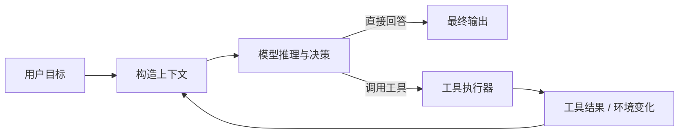
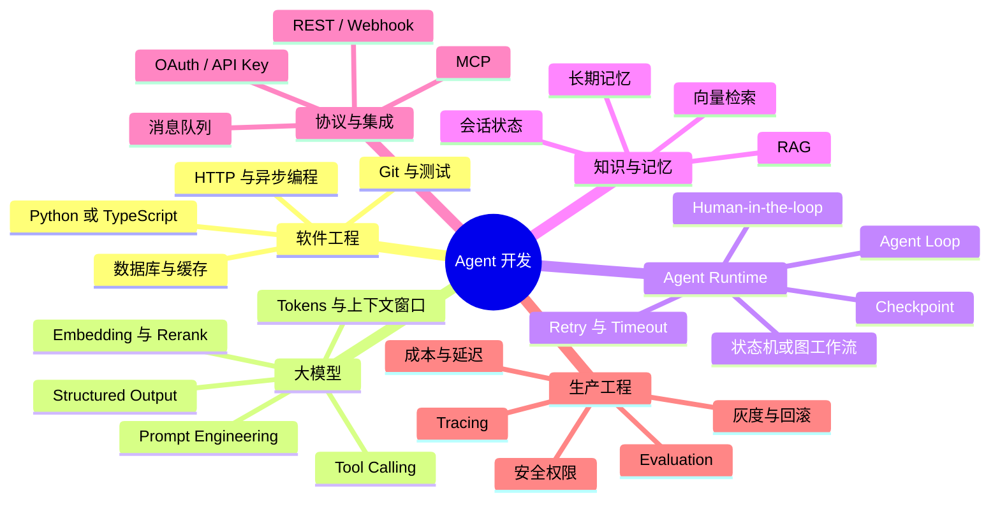
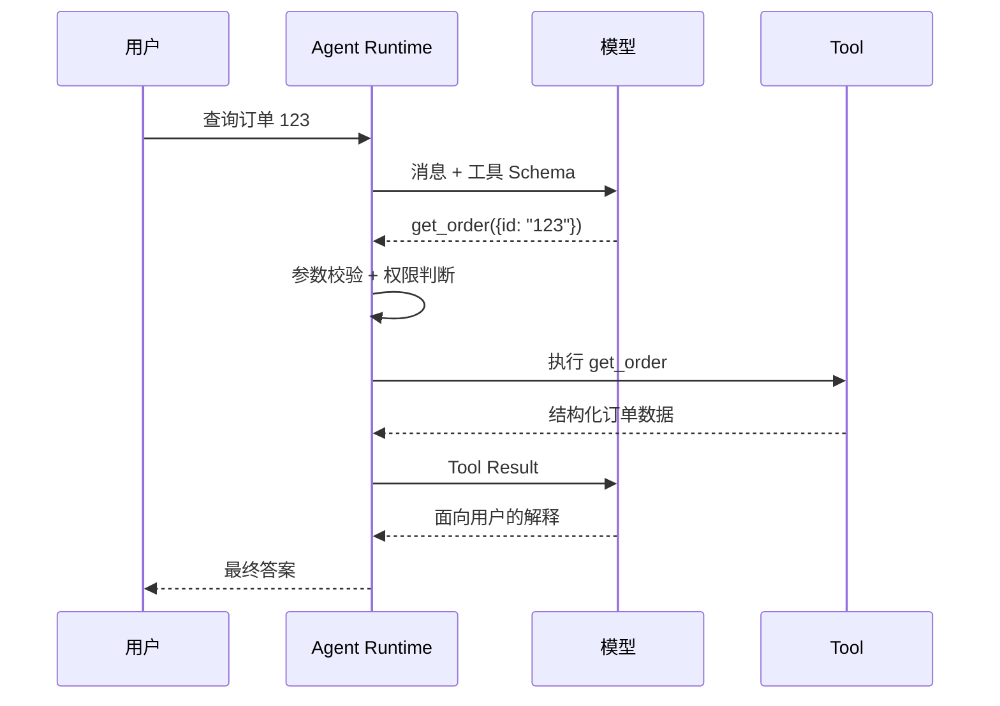
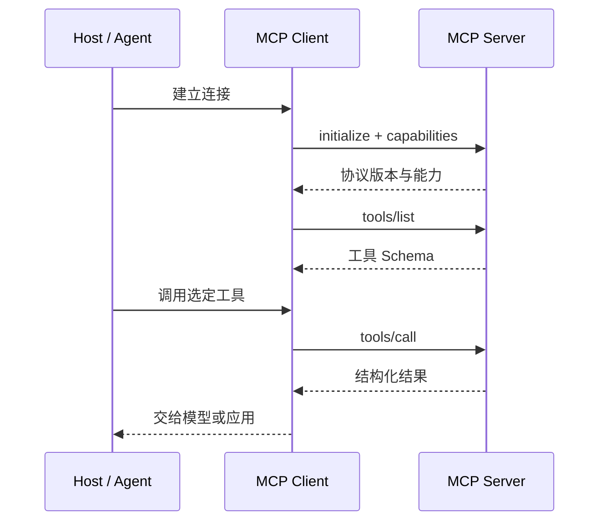
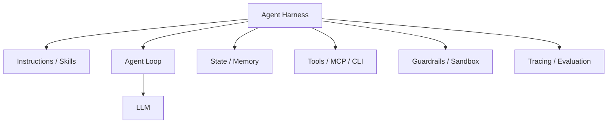
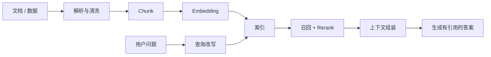
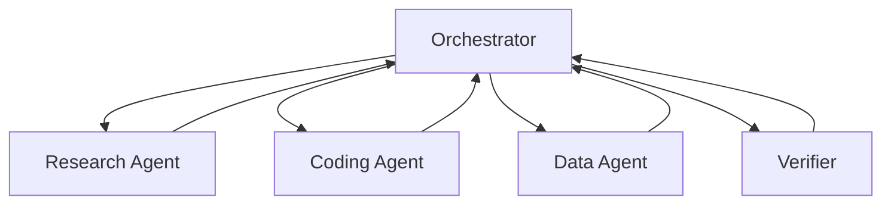
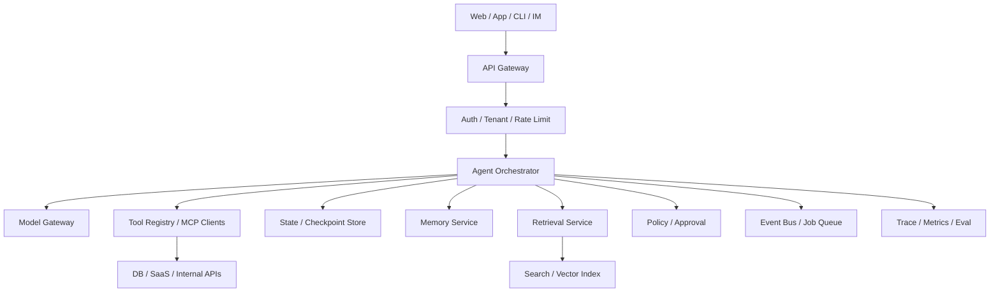
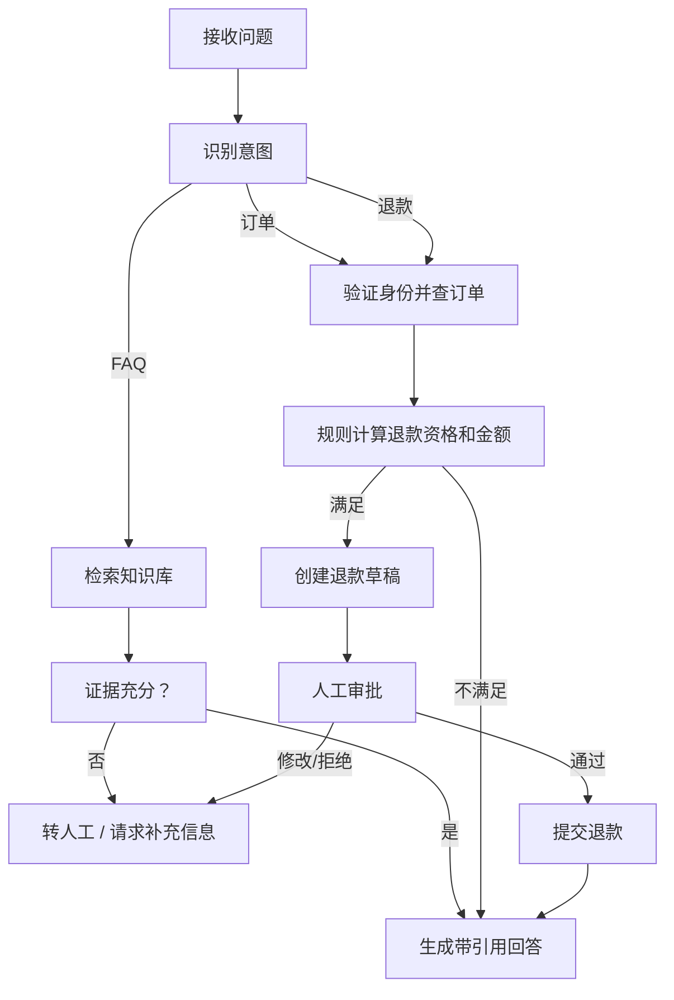

# Agent 开发学习笔记：从原理、技术栈到工程落地

> 目标：从“会调用大模型”进阶到“能开发可靠、可评测、可维护的 Agent 系统”。  
> 适用读者：已掌握 Python 基础和模型 API 调用（前置参考《Python 实用入门与 AI 开发：语法、API、并发及工程实践》）。  
> 最后核对：2026-08-14（本次为审阅润色复核）。框架与模型变化很快，具体 API 以官方文档为准。

### 怎么用这份笔记

- **第一次通读**：按第 1 → 21 章顺序阅读，先建立“责任划分”的整体观，再看各环节的细节；
- **做项目时**：用第 16 章的架构和第 17 章的开发流程搭骨架，把第 18 章的客服案例当作模板改；
- **按问题查**：工具调用失败看第 4 章，MCP 集成看第 5 章，状态与记忆看第 7 章，安全看第 13 章，评测看第 14 章，选型看第 19 章；
- **术语记不清**：Token、RAG、Agent、Function Calling 等概念可查《Python 实用入门与 AI 开发》第 36 章术语表；
- **只读不练等于没学**：练习见第 21 章，至少把“工具 Agent”和“RAG 问答”两个练习完整跑通。

## 目录

- [1. Agent 到底是什么](#1-agent-到底是什么)
- [2. 开发 Agent 需要哪些技术](#2-开发-agent-需要哪些技术)
- [3. 从模型调用到 Agent Loop](#3-从模型调用到-agent-loop)
- [4. Tool / Function Calling](#4-tool--function-calling)
- [5. MCP：标准化工具与上下文接入](#5-mcp标准化工具与上下文接入)
- [6. Workflow、Agent 与 Harness](#6-workflowagent-与-harness)
- [7. 状态、会话与记忆](#7-状态会话与记忆)
- [8. RAG 与知识系统](#8-rag-与知识系统)
- [9. Prompt、Context Engineering 与结构化输出](#9-promptcontext-engineering-与结构化输出)
- [10. Planning、Reflection 与任务分解](#10-planningreflection-与任务分解)
- [11. 多 Agent 系统](#11-多-agent-系统)
- [12. Human-in-the-loop](#12-human-in-the-loop)
- [13. 安全与权限](#13-安全与权限)
- [14. 可观测性、评测与测试](#14-可观测性评测与测试)
- [15. 性能、成本与可靠性](#15-性能成本与可靠性)
- [16. 推荐工程架构](#16-推荐工程架构)
- [17. 完整开发流程](#17-完整开发流程)
- [18. 示例：知识库客服 Agent](#18-示例知识库客服-agent)
- [19. 框架与技术选型](#19-框架与技术选型)
- [20. 常见误区](#20-常见误区)
- [21. 学习路线](#21-学习路线)
- [22. 延伸阅读与权威资料](#22-延伸阅读与权威资料)

---

## 1. Agent 到底是什么

普通大模型应用通常是一次映射：

```text
输入 → 模型 → 输出
```

Agent 则让模型处在一个循环中：模型观察环境、决定下一步、调用工具、读取结果，再决定继续还是结束。



因此，一个可工作的 Agent 至少包含：

1. **Model**：理解目标、生成内容或选择动作。
2. **Instructions**：规定角色、任务、边界与输出要求。
3. **Tools**：让模型读取外部信息或改变外部世界。
4. **Loop**：执行“模型—工具—模型”的控制循环。
5. **State**：保存当前任务进度、中间结果和会话信息。
6. **Guardrails**：限制危险输入、输出及工具动作。
7. **Observability**：记录每一步，以便调试、评测和审计。

一个重要判断是：**Agent 不是“更长的 Prompt”，而是由模型参与控制流决策的软件系统。**

### 1.1 Agent 的自主性是连续谱

| 形态 | 控制者 | 适合任务 |
|---|---|---|
| 单次生成 | 程序 | 摘要、改写、分类 |
| 固定 Workflow | 程序 | 明确、稳定、可枚举的流程 |
| Router | 模型选择分支 | 意图路由、专家选择 |
| Tool-calling Agent | 模型选择工具和参数 | 信息不完整、步骤动态的任务 |
| 多 Agent | 多个模型角色协作 | 可并行且边界清晰的复杂任务 |

自主性越高，灵活性越强，但可预测性、成本控制和测试难度也越差。工程上应选择**完成任务所需的最低自主性**。

---

### 1.2 Agent 与普通自动化的边界

判断是否需要 Agent，关键不是任务是否“看起来智能”，而是下一步能否由程序预先确定。例如发票处理可固定为 OCR、字段校验、金额计算和入库，即使 OCR 使用模型，整体仍是 Workflow。只有当输入格式未知、系统需要判断缺少什么信息、动态选择数据源并追问用户时，才需要 Agent 式决策。

| 维度 | Workflow 更合适 | Agent 更合适 |
|---|---|---|
| 路径 | 步骤与分支可枚举 | 根据中间结果探索 |
| 正确性 | 必须严格执行规则 | 允许概率判断并能验证 |
| 环境 | 输入和接口稳定 | 信息来源和任务差异大 |

真实系统常采用混合结构：Workflow 负责身份、权限、交易和状态转移；Agent 负责意图理解、检索、计划与自然语言生成。

### 1.3 Agent 的能力来自哪里

Agent 效果不是由模型单独决定：

```text
任务成功 ≈ 模型能力 × 上下文质量 × 工具质量
         × 运行时控制 × 验证能力 × 权限设计
```

模型再强，如果工具描述含糊、检索不到证据或工具返回十万行日志，仍会失败。排错时应区分模型误判、上下文缺失、工具错误、状态丢失、权限拒绝和验证标准错误，而不是把所有问题都归结为 Prompt。

---
## 2. 开发 Agent 需要哪些技术

### 2.1 基础能力地图



### 2.2 推荐学习优先级

不要一开始就钻研多 Agent。更实用的顺序是：

```text
模型 API
  → 结构化输出
  → Function Calling
  → 单 Agent Loop
  → 状态与持久化
  → RAG
  → 安全、Tracing、Evaluation
  → Human-in-the-loop
  → 图工作流
  → 多 Agent
```

### 2.3 Python 还是 TypeScript

| 维度 | Python | TypeScript |
|---|---|---|
| AI/数据生态 | 丰富，实验速度快 | 足够完善 |
| Web 全栈 | 后端强 | 前后端统一更方便 |
| 类型约束 | 依赖类型标注和 Pydantic | 静态类型体验较自然 |
| 适用建议 | 算法、数据、快速原型 | 产品、Node 服务、全栈团队 |

语言并不是 Agent 可靠性的决定因素。可靠性更多来自清晰的工具契约、状态设计、权限控制和评测体系。

---

## 3. 从模型调用到 Agent Loop

### 3.1 最小循环

下面是与具体厂商无关的伪代码：

```python
def run_agent(user_goal, model, tool_registry, max_steps=12):
    messages = [
        {"role": "system", "content": SYSTEM_INSTRUCTIONS},
        {"role": "user", "content": user_goal},
    ]

    for step in range(max_steps):
        response = model.generate(
            messages=messages,
            tools=tool_registry.schemas(),
        )
        messages.append(response.message)

        if response.final_answer is not None:
            return response.final_answer

        for call in response.tool_calls:
            args = validate_arguments(call.name, call.arguments)
            authorize(call.name, args)
            result = tool_registry.execute(call.name, args)
            messages.append({
                "role": "tool",
                "tool_call_id": call.id,
                "content": serialize(result),
            })

    raise StepLimitExceeded("Agent 未在规定步数内完成任务")
```

真实系统还必须处理：

- 参数校验失败；
- 工具超时、限流和重试；
- 同一工具的重复调用；
- 幂等与重复写入；
- 上下文过长；
- 用户中断；
- 高风险操作审批；
- 流式事件；
- Token 和费用预算；
- 运行状态持久化与恢复。

### 3.2 为什么必须有终止条件

模型可能在“搜索—观察—再次搜索”之间循环。至少应设置：

- 最大步数；
- 最大运行时间；
- 最大 Token 或费用；
- 单工具调用次数；
- 重复动作检测；
- 明确的成功/失败状态。

不要只依赖模型自己说“完成了”。应由程序检查业务完成条件，例如文件存在、测试通过、数据库事务成功或审批状态已确认。

---

### 3.3 Agent Loop 实际维护的是状态

生产 Agent 不应只维护消息列表，还要保存 `run_id`、当前目标、完成步骤、中间产物、审批状态、剩余步数/时间/费用、错误次数和最终状态。消息适合模型阅读，结构化状态适合程序控制。“已付款”“审批通过”等业务事实不能只存在自然语言消息中。

循环通常产生 `model_started`、`tool_requested`、`approval_required`、`tool_completed`、`state_checkpointed`、`run_finished` 等事件。UI 可据此展示进度，可观测系统也可重建完整轨迹。

### 3.4 错误应按可恢复性分类

| 错误 | 示例 | 处理方式 |
|---|---|---|
| 临时错误 | 超时、429、短暂断网 | 有上限的指数退避重试 |
| 参数错误 | 日期格式错误、缺必填项 | 将结构化错误返回模型修正 |
| 用户可修复 | 缺订单号、身份未确认 | 暂停并询问用户 |
| 权限错误 | 无权读取账户 | 明确拒绝，不允许模型绕过 |
| 业务冲突 | 库存不足、订单已退款 | 读取最新状态并调整计划 |
| 程序错误 | 工具 Bug、Schema 不一致 | 终止、告警、进入人工队列 |

“所有异常都重试”会放大故障。付款、发信等操作没有幂等键时，重试还会造成重复副作用。

### 3.5 完成条件必须可验证

模型说“完成了”只是文字。代码任务要检查测试，订单任务要检查事务 ID，数据任务要检查 Schema 和业务约束，RAG 要检查真实引用，审批任务要检查审批参数与执行参数一致。开放任务可由模型生成候选，但应由独立 verifier 检查事实、格式或不变量。

### 3.6 同步循环与长任务运行时

短任务可以同步运行；需要等待人工、外部回调或执行数小时的任务，应使用状态库和队列：

```text
API 接收 → 保存状态 → 投递队列 → Worker 执行
→ 每步 Checkpoint → 等待审批/回调 → 恢复执行
```

进程不能依靠 `sleep()` 长期等待。Worker 崩溃后，应从最近 Checkpoint 恢复，而不是重新执行所有副作用。

---
## 4. Tool / Function Calling

工具调用解决的是：**模型能表达“想做什么”，但真正的动作由可信程序执行。**

### 4.1 基本数据流



### 4.2 工具设计原则

好的工具应具备：

1. **单一、清晰的职责**：`get_order` 优于含糊的 `do_business_operation`。
2. **准确的描述**：说明何时使用、何时不要使用。
3. **严格的输入 Schema**：枚举、范围、格式和必填项都要明确。
4. **结构化结果**：返回字段而不是冗长自然语言。
5. **稳定错误码**：区分可重试、需用户修正和永久失败。
6. **最小权限**：读工具与写工具分离。
7. **幂等设计**：写动作使用 idempotency key 或业务唯一键。

### 4.3 把读与写分开

```text
低风险：search_docs、get_order、list_files
中风险：create_draft、prepare_patch、generate_report
高风险：send_email、delete_file、execute_payment、deploy
```

高风险动作最好采用“准备—预览—审批—提交—验证”五阶段（模式见 4.5），而不是让一个工具直接完成不可逆操作。

Function Calling 的协议细节可继续阅读：  
[《Function Calling 与 MCP 协议：设计原理与工程实践》](../0816MCP/Function%20Calling%20%E4%B8%8E%20MCP%20%E5%8D%8F%E8%AE%AE%EF%BC%9A%E8%AE%BE%E8%AE%A1%E5%8E%9F%E7%90%86%E4%B8%8E%E5%B7%A5%E7%A8%8B%E5%AE%9E%E8%B7%B5.md)

---

### 4.4 Schema 是模型与程序之间的契约

工具 Schema 不只保证 JSON 可解析，还要表达字段、单位、时区、枚举和范围。即使模型正确填写订单号与退款金额，程序仍必须校验订单归属、可退款余额、重复退款和权限。格式正确不等于业务合法。

身份和租户信息应来自可信运行时，不能允许模型自行填写 `user_id`。工具输出也应结构化，至少包含状态、数据、摘要、错误码和是否可重试。大结果应保存为 Artifact，只把摘要和引用放入上下文。

### 4.5 写工具的事务模式

高风险操作可拆为：

```text
prepare → preview → approve → commit → verify
```

邮件先生成草稿与收件人预览，退款先计算金额并生成草稿，审批后才提交。提交工具应支持幂等键：相同任务重复请求时返回第一次结果，不能再次产生副作用。

跨系统操作还要考虑补偿。例如订单创建成功但通知失败，可重发通知；不能假设所有外部动作都能像数据库事务一样回滚。

### 4.6 工具粒度的权衡

`manage_customer` 太粗，副作用不清；把一次查询拆成十个字段工具又太细，增加调用轮数。较好的粒度通常对应一个可审计业务能力：`get_order`、`calculate_refund`、`create_refund_draft`、`submit_refund`。读写分离、准备与提交分离，便于权限和审批。

### 4.7 工具调用失败怎样诊断

- 没选工具：描述不清、工具过多或模型误以为能直接回答；
- 选错工具：名称与用途重叠；
- 参数错误：Schema 含糊或上下文缺字段；
- 重复调用：结果没有成功标志或完成条件缺失；
- 忽略结果：返回太长，关键字段埋在文本中；
- 越权调用：权限只写在 Prompt，执行器没有强制检查。

评测应分别统计工具选择、参数正确率和最终任务成功率。

---
## 5. MCP：标准化工具与上下文接入

如果每个 Agent 都为 GitHub、数据库、文件系统和企业应用分别开发一套私有适配，集成成本会呈乘法增长。MCP（Model Context Protocol）用统一的客户端—服务器协议降低复用成本。

### 5.1 MCP 三类核心原语

| 原语 | 主要控制者 | 作用 |
|---|---|---|
| Prompts | 用户 | 可选择的提示模板或工作流入口 |
| Resources | 应用 | 向模型提供文件、记录等上下文 |
| Tools | 模型 | 执行查询或动作 |

MCP 基础消息采用 JSON-RPC 2.0，并通过初始化协商能力。MCP 解决的是**连接标准化**，并不会自动解决业务授权、Prompt Injection、数据泄露或工具本身的安全问题。

### 5.2 Function Calling 与 MCP 的关系

```text
Function Calling：模型如何表达一次工具调用
MCP：Agent 应用如何发现、连接和调用外部能力
```

两者不是竞争关系。常见实现是：MCP Client 读取 Server 的工具 Schema，再把它们转换成模型可使用的 Function/Tool 定义。

### 5.3 什么时候不需要 MCP

- 系统只有两三个内部函数；
- 工具不会被其他客户端复用；
- 对延迟和调用链有极致要求；
- MCP Server 反而扩大了安全与运维边界。

协议不是越多越好。内部函数调用足够时，不应为了“Agent 化”强行引入 MCP。

---

### 5.4 MCP 的参与者与调用链

MCP 包含 Host、Client、Server 与 Transport。Host 承载模型和用户体验；Client 与一个 Server 建立协议连接；Server 暴露 Tools、Resources、Prompts；Transport 负责 JSON-RPC 消息传输。



初始化会协商协议版本和能力，不能假设所有 Server 支持相同原语。超时、取消、断连和 Server 重启也需要生命周期管理。

### 5.5 Tools、Resources 与 Prompts 不应混用

Tool 是模型可选择的动作；Resource 是应用读取的上下文；Prompt 是用户选择的模板入口。把所有读取都做成 Tool 会让模型控制过多上下文；把有副作用操作包装为 Resource 又会绕过工具审批语义。

### 5.6 MCP 不负责完整业务安全

“兼容 MCP”不表示可信。Host 仍要审查 Server 来源和工具描述；Server 仍要认证、授权、限流和脱敏；用户仍需看到高风险操作并审批。工具返回的网页、邮件和文档也可能包含 Prompt Injection。

凭据应保留在 Server 或 Secret Broker 中，不能进入模型上下文。日志记录工具、参数摘要、调用者和结果状态，但必须移除 Token 与个人数据。

### 5.7 什么时候值得建立 MCP Server

当能力需要被多个 IDE/Agent 复用、需要标准发现与连接时，MCP 有价值。只有一个应用调用两个内部函数时，直接函数接口更简单。协议会增加进程、认证、版本和运维边界，应由复用收益证明其必要性。

---
## 6. Workflow、Agent 与 Harness

### 6.1 三个概念

**Workflow**：程序预先定义步骤和分支。  
**Agent**：模型根据当前状态动态决定下一步。  
**Agent Harness**：包围模型的完整运行环境，包括工具、文件系统、指令、会话、审批、压缩、Skills、子 Agent 和事件循环。



Hermes、OpenClaw、Codex 和 Claude Code 的 Harness 差异及产品定位，见：  
[《Hermes、OpenClaw、Codex 与 Claude Code：Agent 与 CLI 学习笔记》](../20260419_Hermes_Agent/Hermes%E3%80%81OpenClaw%E3%80%81Codex%20%E4%B8%8E%20Claude%20Code%EF%BC%9AAgent%20%E4%B8%8E%20CLI%20%E5%AD%A6%E4%B9%A0%E7%AC%94%E8%AE%B0.md)

### 6.2 选择原则

- 步骤清楚、合规要求高：优先 Workflow。
- 路径不可预知、需要探索：在局部使用 Agent。
- 最常见的生产架构：**确定性 Workflow 包围有限自主的 Agent 节点**。

例如退款流程不应全部交给 Agent。Agent 可以识别意图、检索政策、草拟建议；资格判断、金额计算和实际退款仍由确定性规则执行。

---

### 6.3 常见 Workflow 模式

**Prompt Chaining** 把任务固定拆成“提取事实 → 检查证据 → 生成摘要”，每步可验证。**Routing** 先分类意图，再进入退款、技术支持或销售流程。**Parallelization** 同时查询文档、数据库与工单，合并器处理超时和冲突。

**Orchestrator-Workers** 由协调者动态拆分数量未知的子任务，适合研究与代码任务。**Evaluator-Optimizer** 让生成器产出候选、评估器按 Rubric 反馈、再有限轮修订，必须设置轮数和明确改进标准。

### 6.4 Harness 为什么决定实际能力

同一模型放在不同 Harness 中效果可能显著不同。Harness 决定文件与上下文、工具执行、状态持久化、历史压缩、子任务、审批、测试、恢复和进度展示。因此比较代码 Agent 时，不能只比较模型，还要比较隔离、工具和验证能力。

### 6.5 确定性节点与模型节点

图中的节点不一定调用模型。身份验证、规则计算、Schema 校验和数据库写入应使用普通代码；模型适合理解非结构化输入和生成候选。可靠退款流程可能是：模型识别意图 → 程序查订单 → 规则计算资格 → 模型解释政策 → 人工审批 → 程序提交。

---
## 7. 状态、会话与记忆

“记忆”这个词经常混合了不同的数据层。

| 层次 | 内容 | 生命周期 | 典型存储 |
|---|---|---|---|
| 当前上下文 | 当前消息、工具结果 | 一次模型调用 | Prompt |
| 工作状态 | 计划、步骤、变量、审批 | 一次任务 | Checkpoint / DB |
| 会话记忆 | 对话摘要、最近事实 | 一个会话 | SQL / KV |
| 长期记忆 | 用户偏好、稳定知识 | 跨会话 | SQL / 文档 / 向量库 |
| 审计记录 | 完整事件、调用参数 | 按合规策略保存 | Event Log |

### 7.1 不要把所有历史都塞入 Prompt

上下文窗口是有限且昂贵的。常用策略包括：

- 滑动窗口：保留最近消息；
- 摘要压缩：将较早历史变成结构化摘要；
- 事实抽取：只保存用户偏好、实体和决定；
- 按需检索：根据当前问题加载相关历史；
- 外部状态：任务进度保存在数据库，而不是依赖模型“记住”。

### 7.2 长期记忆的写入策略

不要让模型把每句话都写成长期记忆。写入前应判断：

1. 是否在未来仍有价值；
2. 是否是稳定事实而非临时情绪；
3. 是否包含敏感信息；
4. 是否与已有记忆冲突；
5. 用户是否允许保存；
6. 是否需要过期时间和删除机制。

### 7.3 Checkpoint 与 Memory 不同

Checkpoint 用于恢复一次运行的精确状态；Memory 用于未来任务的相关信息。前者强调一致性和恢复，后者强调筛选、检索和更新。LangGraph 的持久化层会在步骤边界保存状态，从而支持恢复、Human-in-the-loop、时间旅行调试和容错。

---

### 7.4 状态 Schema 应怎样设计

状态应保存可恢复、可验证的事实，而不是冗长思考。常见字段包括运行 ID、消息、任务状态、当前步骤、Artifact 引用、审批、工具尝试次数、预算和最终结果。

字段要有明确所有者：哪些由模型建议，哪些只能由程序或审批系统修改。`payment_status` 不能因为模型生成“支付成功”就被改写。

### 7.5 短期记忆如何控制长度

常用策略包括最近消息窗口、早期历史摘要、工具结果裁剪、按需检索历史和把计划/业务变量外置到状态字段。摘要会丢信息，也可能写入错误事实，因此订单号、承诺、审批和来源不能只存在摘要中。

### 7.6 长期记忆的完整生命周期

长期记忆不是“写入向量库”就结束，而要经过提取、过滤、去重、冲突处理、读取、更新、过期和删除。例如用户先要求默认中文，后来改为英文，应更新当前偏好，而不是把两条冲突记忆都塞给模型。

记忆应按 `(tenant_id, user_id, memory_type)` 等命名空间隔离。读取时检查权限、相关性和时效性，避免把一个项目的敏感信息带入另一个会话。

### 7.7 Checkpoint 与副作用一致性

若工具已发送邮件，但进程在保存 Checkpoint 前崩溃，恢复后可能再次发送。解决方案包括幂等键、执行记录、事务性 Outbox 和恢复前检查完成状态。

Checkpoint 太少会重复大量工作，太多会增加存储成本，通常在节点或副作用边界保存。

### 7.8 记忆与隐私

保存用户偏好前应说明用途，支持查看、更正和删除。密码、Token、医疗和财务细节不应自动进入长期记忆。Embedding 也可能泄露语义信息，仍需访问控制、保留期限和删除同步。

---
## 8. RAG 与知识系统

RAG 解决的是模型参数中缺少私有、最新或可引用知识的问题。



### 8.1 RAG 的关键技术

- 文档解析：PDF、HTML、Office、表格、OCR；
- Chunking：按标题、语义或业务对象切分；
- Embedding：将文本映射为向量；
- 检索：向量、BM25/全文检索或 Hybrid Search；
- Metadata Filter：按租户、权限、时间、文档类型过滤；
- Reranker：对候选文档重新排序；
- Citation：将答案绑定到具体证据；
- 评测：Recall@K、MRR、上下文相关性、忠实度和答案正确性。

### 8.2 Agentic RAG

传统 RAG 每次固定检索一次；Agentic RAG 让模型决定：

- 是否需要检索；
- 检索哪个数据源；
- 是否改写查询；
- 证据不足时是否继续搜索；
- 是否调用结构化数据库而非向量库。

它能提高复杂问题的召回率，但也增加延迟、费用和不确定性。必须限制搜索轮数并记录证据链。

---

### 8.3 建库阶段决定召回上限

RAG 失败经常发生在生成之前。建库要解析 PDF、HTML、Office、表格和 OCR，保留标题、页码、章节、时间及权限元数据，生成稳定 ID，并支持增量更新、删除和版本追踪。若表格已被解析成错乱文本，更强模型也无法恢复原始结构。

### 8.4 Chunking 的真实权衡

块太小会把定义和条件分开，块太大则引入噪声并浪费 Token。可按标题、段落、代码函数、表格行组切分。Parent-Child 方法用小块检索以提高定位精度，再返回较大父块保持语义完整。

不存在通用最佳 Chunk 大小，必须通过实际问题的 Recall@K、答案忠实度和成本评测。

### 8.5 混合检索与重排

向量检索擅长语义近似，却可能漏掉错误码、产品编号和人名；BM25 擅长精确词项。Hybrid Search 合并候选，再用 Reranker 同时阅读查询和候选进行精排。Reranker 更准但更贵，通常只处理 Top-N。

### 8.6 查询改写与多步检索

系统可以把带指代的对话问题改写为独立问题（消解指代）、展开缩写、拆分复杂问题，或先查实体再查关联记录。改写也可能偏离原意，因此要保留原查询、限制轮数，并在 Trace 中记录全部查询和候选。

### 8.7 权限必须在检索层过滤

不能先召回所有租户文档，再提示模型“不要使用无权内容”。搜索请求必须绑定认证上下文，确保无权内容从未进入候选和 Prompt。文档删除或权限变化时，向量索引、关键词索引与缓存都要同步失效。

### 8.8 RAG 评测要拆层

- 解析质量：正文、表格和元数据是否正确；
- 召回质量：正确证据是否进入 Top-K；
- 排序质量：证据是否足够靠前；
- 上下文质量：是否有噪声和冲突；
- 忠实度：回答是否只基于证据；
- 引用正确性：引用是否支持对应结论。

证据未召回时应修复解析、查询或检索；证据已在上下文但模型误答时，再调整 Prompt、模型和答案验证。

### 8.9 缓存与知识更新

可缓存 Embedding、检索结果和生成答案，但缓存键要包含租户、权限、索引版本、模型和 Prompt 版本。文档更新后必须失效相关缓存，高风险答案不能只依赖旧缓存。

---
## 9. Prompt、Context Engineering 与结构化输出

Prompt Engineering 关注“如何写指令”；Context Engineering 关注“本次调用到底给模型哪些信息、工具、状态和约束”。在 Agent 中，后者通常更重要。

### 9.1 推荐的指令结构

```text
角色与目标
可做和不可做的事情
业务规则与优先级
工具使用条件
不确定时的处理方式
高风险动作审批规则
完成条件
输出 Schema
```

### 9.2 指令优先级

系统/开发者指令、用户请求、工具返回的数据应分层处理。外部网页、邮件和文档属于**不可信数据**，即使其中写着“忽略以前的指令”，也不应被当成系统指令执行。

### 9.3 结构化输出

当输出要交给程序处理时，使用 JSON Schema、Pydantic 或 Zod 定义结构，避免解析自然语言：

```python
from pydantic import BaseModel, Field
from typing import Literal

class TicketDecision(BaseModel):
    intent: Literal["question", "refund", "complaint", "other"]
    confidence: float = Field(ge=0.0, le=1.0)
    needs_human: bool
    reason: str
```

结构化输出减少格式漂移，但不保证语义正确。仍需业务校验，例如退款金额不能为负、订单必须属于当前用户。

---

### 9.4 上下文预算如何分配

上下文窗口不是免费硬盘。一次调用通常包含系统指令、用户消息、工具 Schema、会话历史、检索证据和预留输出空间。任何一部分无限增长都会挤压其他内容。

常见策略是给各类内容设置预算和优先级：系统/安全规则必须保留；当前用户请求和关键状态优先；历史按相关性裁剪；工具结果只保留摘要；检索片段去重并排序；为输出和工具调用预留 Token。

### 9.5 上下文顺序与边界标记

相关信息应靠近使用位置，并用清晰标签区分“指令”和“不可信数据”。网页、邮件、文档内容要放入数据边界，明确其中的命令不可执行。

同一事实出现多个冲突版本时，不能简单全部塞给模型。应根据来源、时间和权限选择权威版本，或让模型明确报告冲突。

### 9.6 结构化输出的失败处理

Schema 能约束格式，却不能保证语义。系统还要检查枚举、范围、外键、权限和业务不变量。解析失败可有限重试并附带验证错误，但不能无限让模型“修 JSON”。

结构化输出应版本化。增加必填字段可能破坏旧消费者；可以使用版本字段、向后兼容默认值和契约测试管理演进。

### 9.7 Prompt 版本管理

Prompt 应像代码一样有版本、测试、审查和回滚。记录模板版本、模型、工具集合和上下文策略，才能解释线上变化。修改一句指令可能改变工具选择，不应绕过回归评测直接上线。

---
## 10. Planning、Reflection 与任务分解

### 10.1 Planning 解决什么问题

当任务包含多个依赖步骤时，模型容易遗漏条件或过早回答。计划可以显式表达：

- 子任务；
- 依赖关系；
- 当前状态；
- 完成标准；
- 可并行部分。

### 10.2 计划不应成为“装饰文字”

计划应映射到真实状态，而不是仅输出一段列表：

```json
{
  "steps": [
    {"id": "s1", "status": "completed", "evidence": "order:123"},
    {"id": "s2", "status": "in_progress", "depends_on": ["s1"]},
    {"id": "s3", "status": "pending", "depends_on": ["s2"]}
  ]
}
```

### 10.3 Reflection 的边界

让模型复查自己的答案有时能发现缺漏，但同一模型也可能重复原错误。更可靠的复核方式是：

- 确定性验证器；
- 编译器和测试；
- Schema 校验；
- 第二数据源交叉验证；
- 独立评审模型；
- 人工审批。

“模型认为自己正确”不是证据。

---

### 10.4 计划的三种实现方式

**Plan-then-Execute** 先生成完整计划再执行，适合步骤相对稳定的任务，但早期假设错误会让后续计划失效。**ReAct** 每一步观察后再决定动作，灵活但容易局部循环。**Rolling Plan** 保存短期计划，每完成或失败一步就重新规划，是两者折中。

计划应存为结构化状态，包含步骤 ID、依赖、状态、证据、失败原因和完成条件。模型提出计划，运行时负责状态转换。

### 10.5 任务怎样拆分才可委派

好的子任务输入边界清楚、输出可验证、依赖明确。例如“查找三个支持结论的官方来源并返回 URL/摘要”比“研究一下这个主题”更可控。

拆得太细会增加通信和上下文成本，拆得太粗又无法并行和验证。通常按工具权限、专业领域、独立交付物或可并行证据源拆分。

### 10.6 Reflection 何时真正有用

Reflection 适合有明确检查标准的任务：代码是否通过测试、答案是否覆盖 Rubric、引用是否支持结论。若没有新证据和验证器，同一个模型反复思考可能只会把原错误表达得更自信。

可以让评估器只返回结构化缺陷，优化器按缺陷修订，并限制 1～3 轮。若评分没有提升或缺陷重复，应停止并转人工。

### 10.7 计划与外部现实

外部系统会变化：库存被其他用户占用、文件被修改、审批过期。执行前要重新读取关键状态，并使用乐观锁、版本号或条件写入，不能盲目执行几分钟前生成的计划。

---
## 11. 多 Agent 系统

多 Agent 的主要价值不是角色扮演，而是：

- 上下文隔离；
- 专业工具隔离；
- 并行执行；
- 不同权限边界；
- 独立检查与对抗性评审。

### 11.1 常见拓扑



### 11.2 何时不该使用多 Agent

- 一个 Agent 加几个工具已经足够；
- 子任务强依赖、无法并行；
- 上下文传递成本大于隔离收益；
- 没有可验证的交付契约；
- 只是想让多个 Agent “讨论一下”。

每增加一个 Agent，就增加一次模型不确定性、状态同步、权限管理和故障定位成本。先证明单 Agent 的瓶颈，再拆分。

### 11.3 子任务契约

委派时至少包含：

```text
目标、输入、允许使用的工具、禁止动作、输出格式、完成标准、预算、截止条件
```

主 Agent 必须验证子 Agent 的结果，不能把“已完成”的文字直接当作完成证据。

---

### 11.4 多 Agent 的通信方式

Agent 间不应共享无限聊天历史。更好的通信是结构化任务和 Artifact：目标、输入引用、允许工具、预算、输出 Schema、证据和状态。大文件放对象存储或工作区，只传引用。

通信模式包括中心化 Orchestrator、共享事件总线、黑板式共享状态和点对点 Handoff。中心化容易控制与审计；去中心化灵活，但更难避免循环和权限扩散。

### 11.5 上下文隔离与权限隔离

Research Agent 只需要搜索权限，Coding Agent 需要工作区写权限，Deployment Agent 可能需要更严格审批。不要因为它们属于同一任务就共享全部 Secret 和工具。

子 Agent 结果仍是不可信输入。主 Agent 或程序必须验证引用、文件差异和测试，不能把子 Agent 的“完成”声明直接当事实。

### 11.6 并行带来的新问题

两个 Agent 可能同时修改同一文件、重复调用付费 API、使用不同版本状态或产生冲突结论。需要工作区/分支隔离、资源锁、合并策略、去重键和统一预算。

并行只适合真正独立分支。强依赖任务并行会增加返工，不一定降低总延迟。

### 11.7 Handoff 与 Delegation

Handoff 把后续会话控制权交给另一个专门 Agent；Delegation 由主 Agent 保留控制，只委派子任务并接收结果。客服意图转接适合 Handoff，研究任务的并行证据收集适合 Delegation。

---
## 12. Human-in-the-loop

Human-in-the-loop（HITL）不是失败兜底，而是 Agent 控制系统的一部分。

### 12.1 应暂停审批的情况

- 付款、退款、下单；
- 对外发送邮件或公开发布；
- 删除、覆盖或批量移动数据；
- 执行生产 SQL、部署或修改权限；
- 法律、医疗、财务等高风险决定；
- 模型置信度低或证据冲突。

### 12.2 三种决策

常见审批接口应允许：

- `approve`：按原参数执行；
- `edit`：修改参数后执行；
- `reject`：拒绝并给 Agent 反馈。

要实现可暂停数小时甚至数天的审批，运行状态必须持久化。不能让一个进程一直占用内存等待用户。

---

### 12.3 审批请求应展示什么

审批界面应展示动作、目标对象、关键参数、数据来源、预期影响、是否可逆和超时。只显示“是否允许工具调用”不足以让用户判断。

编辑参数后要重新执行权限和业务校验；不能认为人工修改天然安全。审批应绑定工具名、参数哈希和版本，防止审批后参数被替换。

### 12.4 暂停与恢复

HITL 需要持久化 Checkpoint。运行进入 `waiting_for_approval` 后释放 Worker；审批事件到达时加载状态并恢复。审批应有过期时间，恢复前重新检查库存、余额等易变状态。

### 12.5 人工接管与降级

人工接管需要完整上下文：用户目标、已执行动作、证据、失败原因和建议下一步。若只是把一段长聊天转给人工，接管成本很高。

系统还应提供降级：模型不可用时转搜索/规则流程，写工具故障时只生成草稿，证据不足时拒答而非猜测。

---
## 13. 安全与权限

Agent 安全的核心原则是：**模型是不可信的决策组件，外部内容是不可信输入，工具是受控执行边界。**

### 13.1 威胁模型

| 风险 | 示例 | 主要缓解措施 |
|---|---|---|
| Prompt Injection | 网页要求 Agent 泄露密钥 | 指令/数据隔离、内容标记、最小权限 |
| 越权访问 | 检索其他租户数据 | 服务端鉴权、租户过滤，不依赖模型 |
| 危险工具调用 | 删除文件、执行任意命令 | allowlist、沙箱、审批 |
| Secret 泄露 | 将 Token 写入日志或 Prompt | Secret broker、脱敏、禁止回传 |
| 数据投毒 | 恶意文档进入知识库 | 来源校验、审核、版本和追踪 |
| 拒绝服务 | 无限循环或超大结果 | 步数、时间、Token、结果大小限制 |
| 供应链风险 | 不可信 MCP/Skill/Plugin | 签名、审查、固定版本、隔离 |

### 13.2 授权必须在工具侧执行

错误做法：在 Prompt 中写“只能读取当前用户的订单”。  
正确做法：工具从认证上下文获得 `user_id`，在服务端查询时强制过滤；模型不能覆盖它。

### 13.3 沙箱与审批互补

沙箱限制最坏影响范围；审批让人确认意图。审批不能替代沙箱，因为用户也可能看不出恶意参数；沙箱也不能替代审批，因为沙箱内仍可能发生不希望的删除或网络请求。

---

### 13.4 Prompt Injection 的攻击链

间接注入常来自网页、邮件、仓库文件或工具结果。攻击内容诱导模型忽略规则、读取 Secret、调用工具或向外发送数据。模型无法可靠地区分所有恶意文字，因此防护不能只靠一句“忽略恶意指令”。

应组合：指令与数据分区、工具最小权限、网络/文件隔离、敏感动作审批、输出过滤、来源标记和审计。最关键的是即使模型被诱导，工具层仍不允许越权。

### 13.5 Capability-Based Security

不要给 Agent 一个万能管理员 Token。按任务发放短期、窄范围能力，例如只读某个项目、只能创建草稿、只能写临时目录。能力应可撤销、有过期时间并绑定调用者。

### 13.6 Secret 管理

Secret 存在环境或 Secret Manager，由工具服务使用。不要放入系统 Prompt、长期记忆、Trace 或工具返回。日志和错误栈要脱敏；子 Agent 只得到完成任务所需凭据。

### 13.7 网络与文件系统隔离

代码执行工具应使用容器/沙箱，限制挂载目录、CPU、内存、进程、运行时间和网络出口。工作区写入与系统目录分离；外部下载需域名策略和大小限制。

沙箱限制影响范围，但不保证生成代码正确。审批确认用户意图，但用户也可能看不懂恶意命令，所以两者必须同时存在。

### 13.8 供应链风险

MCP Server、Skill、Plugin 和依赖包都可能包含恶意代码或更新。应固定版本、审查来源、校验签名/哈希、限制自动更新，并在隔离环境测试。工具描述变化也应触发评测，因为它会改变模型行为。

---
## 14. 可观测性、评测与测试

Demo 判断“看起来能用”，生产系统必须回答：

- Agent 为什么选择这个工具？
- 使用了哪些输入和证据？
- 哪一步失败、重试或超时？
- 成功率、延迟和成本如何？
- 新 Prompt 或模型是否让旧能力退化？

### 14.1 Trace 应记录什么

```text
run_id / user_id(脱敏) / session_id
模型、参数和 Prompt 版本
每个步骤的输入输出摘要
工具名、参数摘要、耗时、状态和错误码
Token、费用、缓存命中
检索文档 ID 与分数
审批与权限决策
最终结果与用户反馈
```

敏感字段不能原样进入日志。可观测性不是“记录一切”，而是记录足以复现和审计、同时符合隐私要求的信息。

### 14.2 分层评测

| 层次 | 评测对象 | 示例指标 |
|---|---|---|
| 工具单测 | 普通代码 | 参数校验、权限、幂等、错误码 |
| 模型节点 | 分类/抽取/生成 | Accuracy、F1、Schema 成功率 |
| 检索 | RAG | Recall@K、MRR、相关性 |
| 轨迹 | 工具选择过程 | 工具选择、参数、步数、违规动作 |
| 最终任务 | 业务结果 | 任务成功率、人工接管率 |
| 线上指标 | 产品效果 | 延迟、费用、满意度、事故率 |

### 14.3 构建评测集

评测集至少包括：

- 正常样本；
- 边界条件；
- 模糊或信息不足；
- 工具故障和超时；
- 对抗性 Prompt Injection；
- 越权请求；
- 多轮状态；
- 历史线上失败案例。

模型输出具有随机性，不要只跑一次。关键用例应多次采样并统计通过率。

### 14.4 LLM-as-a-Judge

Judge 模型适合评估语气、完整性、相关性等开放指标，但应：

- 使用明确 Rubric；
- 隐藏候选顺序或随机换序；
- 用人工标注校准；
- 对事实和权限优先使用确定性检查；
- 保存 Judge 版本与理由。

---

### 14.5 从最终答案评测到轨迹评测

最终答案正确，不代表过程安全；答案错误，也可能是工具故障而非模型问题。轨迹评测检查：是否选对工具、参数是否正确、是否重复调用、证据是否读取、是否越权、步数和成本是否合理。

可以给每个用例定义允许/禁止工具和关键状态断言。代码 Agent 还应检查 Diff 范围、测试结果和是否改动无关文件。

### 14.6 确定性测试优先

Schema、权限、金额、SQL、文件路径和编译结果应使用普通断言。开放文本才考虑 LLM Judge。Judge 也要用人工标注校准，防止位置偏差、长度偏差和自我偏好。

### 14.7 评测数据怎样维护

评测集要版本化，并记录来源、难度、预期动作和安全标签。线上失败应经过脱敏后进入回归集；不要只加入成功案例。训练/提示词开发用例与最终保留测试集应分离。

### 14.8 离线与在线指标

离线关注任务成功、工具准确率、忠实度、延迟和成本；线上还要看用户完成率、人工接管率、撤销率、事故率和业务效果。满意度高不代表答案正确，点击多也不代表长期价值。

### 14.9 Trace 与隐私

Trace 要足够复现，但不应无限保存原始个人数据和 Secret。可记录哈希、字段摘要、Artifact ID 和脱敏片段。设置保留期限、访问审计和删除流程。

---
## 15. 性能、成本与可靠性

### 15.1 延迟分解

```text
总延迟 ≈ 模型推理 + 工具网络 + 检索 + 重试 + 串行步骤 + 排队
```

优化方式：

- 独立读操作并行；
- 小模型负责分类、路由和抽取；
- 缓存稳定结果；
- 控制工具返回大小；
- 流式输出进度；
- 将固定逻辑移出模型；
- 避免无意义的反思循环。

### 15.2 可靠性模式

- Timeout：每个外部调用都有超时；
- Retry：只重试临时错误，使用指数退避和抖动；
- Circuit Breaker：依赖异常时快速失败；
- Bulkhead：不同工具使用独立并发池；
- Idempotency：写操作可安全重试；
- Checkpoint：长任务从最近成功点恢复；
- Dead Letter Queue：无法处理的任务进入人工队列；
- Fallback：降级到搜索、规则流程或人工服务。

### 15.3 模型路由

不是每一步都需要最强模型。可以按照任务复杂度、风险和延迟选择模型，但路由本身也要评测。高风险判断不应仅因为成本而自动降级。

---

### 15.4 Token 与费用预算

预算要按一次完整 Run 管理，而不是只限制单次模型调用。可设置最大模型调用数、输入/输出 Token、工具费用、运行时间和子 Agent 数量。接近预算时应缩短上下文、停止探索或请求用户确认，而不是突然失败。

### 15.5 缓存分层

可缓存模型响应、Embedding、检索候选、Rerank 和工具读取结果。缓存键需包含模型、Prompt、工具、权限和数据版本。写工具不能用普通结果缓存替代幂等机制。

语义缓存根据问题相似度复用答案，可能把相似但条件不同的问题混为一谈，不适合权限、价格、医疗和实时状态等高风险场景。

### 15.6 并发与背压

Agent 一次任务可能并行产生多个模型和工具请求。服务应限制每用户、租户、工具和供应商的并发，队列过载时实施背压、排队或拒绝，而不是耗尽连接和内存。

取消请求要向下游传播。用户停止任务后，子 Agent、搜索和长工具也应尽快取消，避免继续计费和产生副作用。

### 15.7 模型路由怎样实现

路由可依据任务类型、上下文长度、模态、风险、延迟和预算。简单分类/抽取使用小模型，复杂规划和代码使用强模型，高风险任务还要提高验证强度。

路由器本身也会犯错，应记录选择原因、设置回退，并用端到端成功率而不是单次模型价格评价。频繁在模型间切换还会带来格式与工具能力差异。

### 15.8 降级与灾难恢复

供应商不可用时可切换备用模型、退化为检索结果、暂停写操作或转人工。状态库和 Artifact 要备份，队列任务要可重放，但重放前必须检查幂等记录。

---
## 16. 推荐工程架构



### 16.1 模块职责

- **API Gateway**：认证、限流、请求 ID、流式连接。
- **Orchestrator**：控制 Loop、路由、状态转移和终止条件。
- **Model Gateway**：统一模型接口、重试、预算、版本和脱敏。
- **Tool Registry**：Schema、授权策略、超时和执行适配。
- **State Store**：会话与 checkpoint；通常使用 PostgreSQL/Redis 等。
- **Memory Service**：事实抽取、冲突处理、过期和删除。
- **Retrieval Service**：权限感知的混合检索和引用。
- **Policy Engine**：规则、风险分级、人工审批。
- **Observability**：Trace、指标、离线评测和回放。

### 16.2 为什么要有 Model Gateway

业务代码若直接散落多个模型 SDK，会导致重试、日志、限流和供应商切换难以统一。Model Gateway 可以规范：

- 请求/响应模型；
- 模型白名单；
- 超时与重试；
- Token/费用预算；
- Prompt 和模型版本；
- 数据脱敏和审计；
- 供应商降级策略。

---

### 16.3 控制平面与执行平面

控制平面管理任务、权限、预算、路由和状态；执行平面运行模型、工具与 Worker。分离后可独立扩缩容，并限制执行环境接触敏感配置。

### 16.4 事件驱动与队列

长任务通过事件解耦：`RunCreated`、`ToolCompleted`、`ApprovalReceived`、`RunFailed`。事件应包含 ID、版本、时间和关联 Run，但不要携带巨大正文，正文存 Artifact。

消费者可能重复收到事件，因此处理器要幂等。事件顺序不可靠时使用版本号或状态机拒绝旧事件。

### 16.5 Artifact 管理

报告、代码补丁、图片和大工具结果应保存为 Artifact，状态只保存 URI、哈希、类型、所有者和权限。这样避免消息膨胀，也便于下载、审计和生命周期管理。

### 16.6 多租户隔离

租户 ID 必须贯穿 API、状态、记忆、检索、缓存、日志和 Artifact。仅在 Prompt 中说明租户不构成隔离。数据库可使用行级策略、独立 Schema 或独立实例，按风险选择。

### 16.7 状态机与补偿

任务状态应显式定义允许转移，如 `created → running → waiting_approval → completed/failed`。非法转移要拒绝。跨系统副作用无法原子提交时，使用 Saga/补偿流程并记录每步完成状态。

---
## 17. 完整开发流程

### 第一步：定义任务而不是先选框架

明确：用户是谁、输入是什么、成功结果是什么、哪些动作有风险、失败后如何处理。

### 第二步：建立非 Agent 基线

先尝试规则、搜索、固定 Workflow 或单次结构化输出。基线有助于证明 Agent 是否真的提高效果。

### 第三步：建立最小评测集

在开发 Prompt 之前收集 30～100 个代表性用例，并标注预期行为、允许工具和禁止动作。

### 第四步：只加入必要工具

工具越多，选择难度和攻击面越大。先提供最小集合，命名和 Schema 要清楚。

### 第五步：实现单 Agent Loop

加入最大步数、错误处理、结构化输出、Trace 和费用记录。先不做多 Agent。

### 第六步：加入状态和持久化

区分消息、业务状态、checkpoint、长期记忆和审计事件。

### 第七步：加入安全控制

服务端鉴权、租户隔离、工具 allowlist、沙箱、审批、Secret 管理和数据脱敏。

### 第八步：离线评测和对抗测试

比较基线与 Agent；测试 Prompt Injection、工具失败、越权和循环。

### 第九步：小流量上线

设置 Feature Flag、预算、告警、人工接管和快速回滚；先只开放低风险读操作。

### 第十步：根据失败轨迹迭代

按错误类型修复：工具契约、检索、Prompt、模型、业务规则或 UI。不要把所有问题都归因于“模型不够强”。

---

### 开发流程中必须持续维护的四份资产

1. **任务契约**：输入、输出、允许动作、完成条件；
2. **工具契约**：Schema、权限、副作用、错误码和幂等；
3. **评测集**：正常、边界、对抗和历史失败用例；
4. **运行策略**：预算、审批、重试、降级和保留期限。

Prompt 和模型变化时，这四份资产帮助判断系统是否仍满足原目标。

### 上线门禁

上线前至少检查任务成功率、安全用例、P95 延迟、平均/最大费用、人工接管流程、回滚和告警。写操作先在只读/草稿模式运行，确认轨迹后再逐步开放。

### 失败分类驱动迭代

将失败归类为意图、检索、工具选择、参数、权限、状态、模型生成、验证和 UI。不同类别采取不同修复。只修改 Prompt 会掩盖真正的工具或数据问题。

---
## 18. 示例：知识库客服 Agent

### 18.1 需求

客服 Agent 要回答产品问题、查询订单并草拟退款建议，但实际退款必须人工审批。

### 18.2 状态设计

```python
from typing import Literal, TypedDict

class SupportState(TypedDict):
    session_id: str
    user_id: str
    messages: list[dict]
    intent: Literal["faq", "order", "refund", "unknown"] | None
    evidence: list[dict]
    order: dict | None
    proposed_action: dict | None
    approval_status: Literal["not_required", "pending", "approved", "rejected"]
    final_answer: str | None
```

### 18.3 工具

| 工具 | 权限 | 说明 |
|---|---|---|
| `search_kb` | 读 | 权限感知的知识检索 |
| `get_order` | 读 | 服务端强制绑定当前用户 |
| `calculate_refund` | 读/计算 | 确定性规则计算，不由模型心算 |
| `create_refund_draft` | 可逆写 | 只生成草稿 |
| `submit_refund` | 高风险写 | 仅审批后调用，带幂等键 |

### 18.4 工作流



### 18.5 完成标准

- FAQ 答案引用了可访问的有效文档；
- 订单只能查询当前用户；
- 金额由规则引擎产生；
- 未审批时 `submit_refund` 不可调用；
- 同一审批重复提交不会重复退款；
- 每个工具动作都可在 Trace 中审计；
- 证据不足时不编造答案。

这个例子展示了生产 Agent 的常见形态：模型负责理解、路由和表达；代码负责权限、计算、状态、一致性和最终副作用。

---

### 18.6 一次请求的完整执行链

1. API 根据登录态获得 `user_id` 与租户，不接受模型提供身份；
2. Orchestrator 创建 `run_id`，加载线程 Checkpoint；
3. 模型识别 FAQ/订单/退款意图；
4. FAQ 调用权限感知检索，订单查询由工具服务绑定当前用户；
5. 退款资格和金额由规则引擎计算；
6. 模型只生成解释与草稿；
7. 高风险提交进入 `waiting_approval`，保存 Checkpoint 并释放 Worker；
8. 审批到达后重新检查订单版本和余额；
9. 使用幂等键提交退款并查询结果；
10. 保存 Trace、Artifact 和最终状态。

### 18.7 失败分支

- 检索无证据：明确不知道并转人工，不编造政策；
- 订单不存在：请求用户核对，但不泄露其他用户订单；
- 规则服务超时：有限重试后只生成待处理工单；
- 审批过期：重新生成草稿，不执行旧参数；
- 提交超时：先按幂等键查询是否成功，再决定重试；
- 模型不可用：保留任务状态，降级到搜索或人工。

### 18.8 这个案例怎样测试

工具单测验证权限、金额和幂等；节点测试验证意图与结构化输出；轨迹测试验证退款前必经规则和审批；端到端测试模拟服务超时与恢复；对抗测试把恶意指令放入知识文档，确认无法触发退款工具。

性能测试还要观察并发下状态隔离、队列积压和 P95 延迟。线上先开放 FAQ 只读能力，再逐步开放订单查询、草稿和提交。

---
## 19. 框架与技术选型

### 19.1 不同抽象层

| 层次 | 代表方案 | 适合场景 |
|---|---|---|
| 直接模型 SDK | 各模型官方 SDK | 最小依赖、完全控制 |
| Agent SDK | OpenAI Agents SDK 等 | 快速构建工具 Agent、handoff、guardrail、trace |
| Agent Framework | LangChain Agents 等 | 需要丰富模型与工具集成 |
| Graph Runtime | LangGraph 等 | 长任务、持久化、分支、循环、HITL |
| Agent Harness | Codex、Claude Code、Hermes 等 | 使用现成的交互与工具运行环境 |
| 协议层 | MCP | 工具和上下文跨客户端复用 |

### 19.2 LangChain 与 LangGraph

当前官方定位中：LangChain 提供模型、工具和预构建 Agent 抽象；LangGraph 是更低层的有状态编排运行时，强调 durable execution、streaming、persistence 和 Human-in-the-loop。

如果只是入门或构建普通工具 Agent，优先使用高层 Agent API；当业务需要精确状态、分支、恢复和审批时，再使用 LangGraph。

已有专项笔记：  
[《LangChain 入门学习笔记》](../langchain/LangChain%E5%85%A5%E9%97%A8%E5%AD%A6%E4%B9%A0%E7%AC%94%E8%AE%B0.md)

### 19.3 是否需要框架

以下情况可以直接使用模型 SDK：

- 工具少、循环简单；
- 团队希望减少依赖；
- 需要精确控制消息和性能；
- 已有成熟的工作流平台。

以下情况框架更有价值：

- 需要 checkpoint、恢复和人工中断；
- 需要复杂图结构和并行分支；
- 需要统一的工具/模型适配；
- 需要现成 tracing、evaluation 或生态集成。

选框架时重点评估数据模型、持久化语义、错误恢复、可观测性和退出成本，而不是只比较“支持多少 Agent 模式”。

---

### 19.4 选型时真正要比较什么

| 维度 | 需要确认的问题 |
|---|---|
| 状态 | Schema、Checkpoint、并发更新如何实现 |
| 恢复 | Worker 崩溃和人工暂停后能否恢复 |
| 工具 | Schema、错误、流式结果和审批是否完整 |
| 模型 | 是否支持所需供应商、结构化输出与多模态 |
| 观测 | 能否导出 Trace、Token、工具和自定义事件 |
| 评测 | 是否方便回放数据集与做轨迹断言 |
| 部署 | 队列、扩缩容、多租户和数据驻留怎样处理 |
| 退出成本 | 状态、Prompt、工具是否被私有格式锁定 |

用一个代表性业务 PoC 比较，不要只运行 Hello World。测试暂停恢复、工具超时、重复事件、权限、长上下文和版本升级。

### 19.5 直接 SDK、框架与平台的取舍

直接 SDK 控制最强、依赖最少，但状态、工具、Trace 和评测要自己实现。框架提供编排与生态，适合复杂流程；托管平台减少运维，但引入成本、数据驻留和锁定问题。

团队规模和已有基础设施同样重要。已有成熟工作流、队列和可观测平台时，轻量 SDK 可能比引入全套 Agent 平台更合适。

### 19.6 协议与内部接口

MCP 可标准化工具接入，Agent-to-Agent 协议可标准化跨 Agent 通信，但内部核心状态仍应有自己的领域模型。协议适合边界互操作，不应反向决定全部业务设计。

### 19.7 版本升级策略

Agent 框架迭代快，应锁定依赖、阅读迁移说明、运行全量回归并灰度升级。特别关注消息格式、工具调用、Checkpoint 序列化和中间件顺序变化。状态格式升级需要迁移或兼容读取旧版本。

---
## 20. 常见误区

### 误区 1：Agent 等于聊天机器人

聊天只是界面。Agent 的本质是根据状态选择动作并与环境交互。

### 误区 2：工具越多，能力越强

工具过多会降低选择准确率并扩大攻击面。应按任务动态加载最小工具集。

### 误区 3：把权限规则写进 Prompt 就安全了

Prompt 是软约束。真正权限必须在工具、API、数据库和沙箱层强制执行。

### 误区 4：向量数据库就是记忆

向量库只是检索索引。记忆还涉及写入标准、身份、冲突、版本、过期、权限和删除。

### 误区 5：多 Agent 一定优于单 Agent

多 Agent 会增加通信、成本和故障点。只有上下文隔离、权限隔离或并行收益明确时才值得使用。

### 误区 6：上线后看用户反馈就算评测

没有离线数据集和轨迹指标，就无法判断变化来自模型、Prompt、工具、检索还是用户分布。

### 误区 7：Agent 成功返回就代表任务完成

必须验证外部状态和业务不变量，例如测试、数据库状态、文件哈希或审批记录。

### 误区 8：MCP 自动提供安全性

MCP 标准化连接和能力协商，但信任、授权、用户同意和工具安全仍由 Host、Client、Server 及业务系统共同实现。

---

### 误区 9：模型上下文越长越好

上下文更长会增加费用、延迟和噪声。应选择相关内容、结构化状态并为输出预留空间，而不是把仓库、历史和所有工具结果一次塞入。

### 误区 10：成功率低就换更强模型

失败可能来自 Schema、检索、权限、状态或完成条件。先按 Trace 分类，只有确实是理解与推理能力不足时才升级模型。

### 误区 11：重试可以提高可靠性

重试只适合临时错误。不可重试错误会浪费费用；非幂等写操作可能产生重复副作用。可靠性来自错误分类、幂等、Checkpoint、降级和补偿的组合。

### 误区 12：有了人工审批就可以给高权限

审批者可能疲劳、误点或看不懂参数。仍需最小权限、沙箱、参数校验和可逆设计。

### 误区 13：Agent 的自然语言解释等于审计记录

模型解释可能遗漏或美化过程。审计必须来自运行时事件、工具日志、审批和状态转移，而不是让模型总结自己做过什么。

---
## 21. 学习路线

> 前置要求：能调用模型 API、熟悉 JSON 与结构化输出、掌握 Python 基础。基础不牢可先读《Python 实用入门与 AI 开发：语法、API、并发及工程实践》第 16~33 章（HTTP、Pydantic、FastAPI、并发、模型 API 调用）。

### 第一阶段：模型应用基础

- 掌握消息角色、Token、上下文窗口和流式输出；
- 使用 JSON Schema 做结构化抽取；
- 理解温度、重试、限流和错误处理。

练习：开发一个工单分类器，输出严格 JSON，并建立 50 条评测集。

### 第二阶段：工具 Agent

- 定义三个只读工具；
- 实现 Agent Loop、最大步数和 Trace；
- 测试错误参数、超时和重复调用。

练习：天气/订单/知识检索 Agent，但禁止任何写动作。

### 第三阶段：RAG 与状态

- 文档解析、Chunk、Embedding、Hybrid Search、Rerank；
- 会话状态、checkpoint、摘要压缩；
- 引用和权限过滤。

练习：带引用的私有知识库问答，并评测 Recall@K 与忠实度。

### 第四阶段：生产控制

- 服务端鉴权、租户隔离、沙箱、审批；
- 轨迹评测、Prompt Injection 测试；
- 费用、延迟、回滚和人工接管。

练习：增加一个“草拟但不发送邮件”的工具，再通过审批执行发送。

### 第五阶段：复杂编排

- 图工作流、持久化、暂停恢复；
- 并行节点、子图和补偿事务；
- 有明确契约的子 Agent。

练习：研究 Agent + 写作 Agent + 引用验证器，并比较其与单 Agent 的质量、费用和延迟。

---

## 22. 延伸阅读与权威资料

### 本地关联笔记

- [Python 实用入门与 AI 开发：语法、API、并发及工程实践](../Python/Python%E5%AE%9E%E7%94%A8%E5%85%A5%E9%97%A8%E4%B8%8EAI%E5%BC%80%E5%8F%91%EF%BC%9A%E8%AF%AD%E6%B3%95%E3%80%81API%E3%80%81%E5%B9%B6%E5%8F%91%E5%8F%8A%E5%B7%A5%E7%A8%8B%E5%AE%9E%E8%B7%B5.md)（语言基础、并发、模型 API 调用与 AI 术语表）
- [Hermes、OpenClaw、Codex 与 Claude Code：Agent 与 CLI 学习笔记](../20260419_Hermes_Agent/Hermes%E3%80%81OpenClaw%E3%80%81Codex%20%E4%B8%8E%20Claude%20Code%EF%BC%9AAgent%20%E4%B8%8E%20CLI%20%E5%AD%A6%E4%B9%A0%E7%AC%94%E8%AE%B0.md)
- [Function Calling 与 MCP 协议：设计原理与工程实践](../0816MCP/Function%20Calling%20%E4%B8%8E%20MCP%20%E5%8D%8F%E8%AE%AE%EF%BC%9A%E8%AE%BE%E8%AE%A1%E5%8E%9F%E7%90%86%E4%B8%8E%E5%B7%A5%E7%A8%8B%E5%AE%9E%E8%B7%B5.md)
- [LangChain 入门学习笔记](../langchain/LangChain%E5%85%A5%E9%97%A8%E5%AD%A6%E4%B9%A0%E7%AC%94%E8%AE%B0.md)

### 官方资料

- [OpenAI Agents SDK 文档](https://openai.github.io/openai-agents-python/)
- [OpenAI Function Calling 指南](https://platform.openai.com/docs/guides/function-calling)
- [LangChain Agents](https://docs.langchain.com/oss/python/langchain/agents)
- [LangGraph 概览](https://docs.langchain.com/oss/python/langgraph/overview)
- [LangGraph Persistence](https://docs.langchain.com/oss/python/langgraph/persistence)
- [LangChain Human-in-the-loop](https://docs.langchain.com/oss/python/langchain/human-in-the-loop)
- [Model Context Protocol Specification](https://modelcontextprotocol.io/specification/)
- [MCP Server Primitives](https://modelcontextprotocol.io/specification/2025-06-18/server/index)
- [MCP Security Best Practices](https://modelcontextprotocol.io/specification/2025-06-18/basic/security_best_practices)
- [Agent Skills Specification](https://agentskills.io/)
- [Anthropic：Building Effective Agents](https://www.anthropic.com/research/building-effective-agents)

---

## 结语

Agent 开发最重要的能力，不是记住某个框架的 API，而是学会划分责任：

```text
模型负责：理解、生成、模糊判断、动态选择
普通代码负责：规则、权限、计算、事务、验证
运行时负责：状态、循环、恢复、预算、调度
工具层负责：受控地读取或改变外部世界
评测系统负责：证明它是否真的可靠
人负责：目标、价值判断与高风险授权
```

一个成熟的 Agent 系统不是让模型拥有无限自主权，而是在明确边界、充分证据和可验证反馈中，给予它恰到好处的决策空间。

最后给三个实践建议：

1. **先做最小 Agent，再谈框架**：用模型 SDK 手写一个带三个只读工具、最大步数和 Trace 的循环，比直接套用框架更能理解原理；
2. **把模型当作“最不可靠的组件”来设计**：权限、金额、事务和验证交给普通代码，模型只负责理解和表达；
3. **用评测集和 Trace 代替“看起来能用”**：没有离线数据集和轨迹指标，就无法判断变化来自模型、Prompt、工具还是检索。
