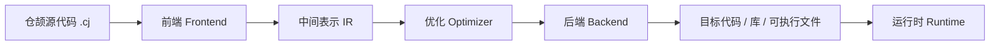
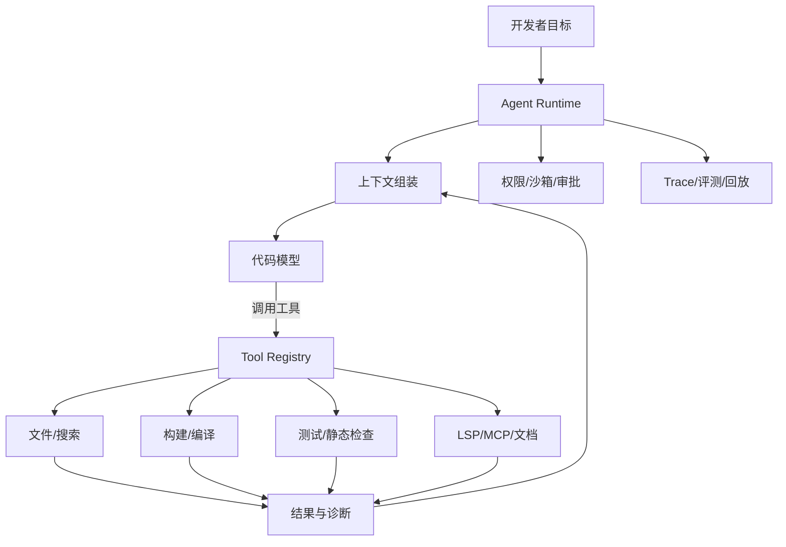

# 仓颉 AI 编译器岗位面试速记

> 面向：仓颉（Cangjie）AI 编译器 / 编译器工具链 / 智能辅助编程相关实习面试。  
> 深度：日常实习够用，覆盖基本概念、常见追问和与 Codex、Trae 的关系，不展开复杂论文推导。  
> 最后核对：2026-07-19。仓颉版本、工具参数和 AI 产品能力变化较快，以官方文档为准。

## 目录

- [1. 先建立岗位认知](#1-先建立岗位认知)
- [2. 编译器到底解决什么问题](#2-编译器到底解决什么问题)
- [3. 一条编译流水线](#3-一条编译流水线)
- [4. 必须掌握的编译器基本概念](#4-必须掌握的编译器基本概念)
- [5. 仓颉语言与编译器要点](#5-仓颉语言与编译器要点)
- [6. AI 编译器是什么](#6-ai-编译器是什么)
- [7. Codex、Trae 与 AI 编程 Agent](#7-codextrae-与-ai-编程-agent)
- [8. AI 如何辅助编译器开发](#8-ai-如何辅助编译器开发)
- [9. 代码 Agent 的基本架构](#9-代码-agent-的基本架构)
- [10. 编译器岗位需要的工程能力](#10-编译器岗位需要的工程能力)
- [11. 高频面试问题与回答框架](#11-高频面试问题与回答框架)
- [12. 一周准备路线](#12-一周准备路线)
- [13. 本地关联笔记与权威资料](#13-本地关联笔记与权威资料)

---

## 1. 先建立岗位认知

“仓颉 AI 编译器”这个岗位可能对应几类工作，面试前要先理解它不是单一方向：

| 方向 | 主要问题 | 常见工作 |
|---|---|---|
| 语言前端 | 源代码是什么意思 | 词法、语法、类型检查、宏、错误提示 |
| 中端优化 | 怎样生成更好的程序表示 | AST/IR、数据流分析、优化 Pass、正确性 |
| 后端与运行时 | 怎样在目标平台高效执行 | 指令选择、寄存器分配、代码生成、GC、并发 |
| 工具链 | 怎样让开发者高效使用语言 | 编译命令、包管理、LSP、调试、测试、诊断 |
| AI 编译器 | 怎样让 AI 参与编译器和开发流程 | 代码理解、错误修复、优化建议、智能问答、Agent |

仓颉官方资料把编译器、运行时、标准库和工具链视为完整语言能力；白皮书还提到 CHIR（Cangjie High-level IR）高层编译优化、后端优化、运行时优化，以及语言服务、调试、静态检查、包管理和智能辅助编程工具。因此，面试不能只准备“模型如何写代码”，还要会讲清楚编译器从源代码到程序运行的基本链路。

### 1.1 与 Codex、Trae 的关系

可以用一句话区分：

```text
仓颉 AI 编译器：让仓颉程序被正确、高效、安全地编译和运行，并让开发工具更智能。
Codex / Trae：让模型理解项目目标，通过编辑器、终端和工具帮助开发者修改、验证和交付代码。
```

两者的交集不是“仓颉编译器等于 Codex”，而是：

- AI Agent 可以调用仓颉编译器、测试框架、静态检查器作为工具；
- 编译器的错误诊断、AST、类型信息和 LSP 能成为 Agent 的高质量上下文；
- AI 可以辅助补全、修复编译错误、生成测试和解释优化结果；
- 编译器团队仍需保证语义正确性，不能把模型生成结果直接当作编译器结论。

面试时如果被问“是不是类似 Codex、Trae”，建议回答：**产品交互上可能类似，都有代码上下文、工具调用和 Agent Loop；技术岗位核心不同，仓颉编译器岗位更关注语言语义、IR、优化、工具链和运行时，AI 只是提升开发与使用效率的一层。**

---

## 2. 编译器到底解决什么问题

编译器把人类容易编写的源程序转换为机器或运行时可以执行的形式，同时检查程序是否符合语言规则，并尽量优化性能。



编译器至少承担四类责任：

1. **理解程序**：识别关键字、表达式、函数、类型和作用域；
2. **发现错误**：在运行前报告语法、类型、可见性和部分语义错误；
3. **转换程序**：把高层语言转换为更低层的 IR、汇编或机器码；
4. **改善程序**：在不改变可观察语义的前提下，减少时间、空间或能耗。

“编译成功”只说明程序通过了编译器规定的检查，不等于业务逻辑正确；“优化后更快”也必须通过正确性测试和基准测试证明。

### 2.1 编译器与解释器

| 方式 | 核心做法 | 优势 | 代价 |
|---|---|---|---|
| 编译 | 运行前生成目标代码 | 运行速度、部署性能较好 | 编译等待、平台适配成本 |
| 解释 | 运行时逐步分析执行 | 交互灵活、启动简单 | 运行时开销较大 |
| JIT | 先运行，再把热点代码编译 | 兼顾启动和热点性能 | 运行时复杂、需要分析开销 |

现代语言常是混合形态：前端先编译成某种中间表示，运行时再解释、JIT 或调用 AOT 生成的代码。回答问题时不要把“编译型语言”和“完全没有运行时”画等号。

---

## 3. 一条编译流水线

### 3.1 词法分析 Lexer

输入字符流，输出 Token 流。例如：

```text
func add(a: Int64, b: Int64) -> Int64 { a + b }
```

会被识别为关键字 `func`、标识符 `add`、括号、参数名、类型名、箭头、运算符等 Token。词法分析关心字符如何组成合法单词，不负责判断 `a + b` 的类型是否匹配。

常见问题：非法字符、未闭合字符串、数字字面量格式错误、注释处理和 Unicode 标识符。

### 3.2 语法分析 Parser

Parser 根据语法规则把 Token 组织成 AST（抽象语法树）。AST 去掉空格、注释等表面信息，保留程序结构：这是函数定义、参数列表、返回类型和加法表达式。

```text
源代码 → Token → AST
```

语法错误示例包括括号不匹配、缺少分隔符、表达式位置出现声明等。好的诊断不仅说“语法错误”，还要指出位置、原因和可能的修复方式。

### 3.3 语义分析

AST 结构正确后，编译器还要判断它是否有意义：

- 变量是否先声明后使用；
- 名称是否在当前作用域可见；
- 函数实参与形参是否匹配；
- 类型是否兼容；
- 返回值是否满足函数声明；
- 泛型约束是否满足；
- `break`、`return` 等控制语句是否出现在允许位置；
- 模块和包的依赖、可见性是否正确。

语义分析阶段常建立符号表、类型环境和作用域树。它是“AI 修编译错误”非常重要的基础，因为只有知道错误属于哪个语义节点，修复建议才可能准确。

### 3.4 AST、HIR 与更低层 IR

- **AST**：接近源代码语法，适合诊断、重构和语法相关工具；
- **HIR**：保留较多高层语义，适合类型、控制流和语言特性的优化；
- **MIR/低层 IR**：更接近执行模型，便于数据流、寄存器和代码生成；
- **机器码/汇编**：目标处理器真正执行或加载的形式。

仓颉资料中提到 CHIR，是理解“高层 IR 如何承载语言语义并支持优化”的关键。不同编译器命名可能不同，不要把某个 IR 名字当作所有编译器的固定标准；要关注它在流水线中的职责。

### 3.5 优化 Pass

优化 Pass 是对 IR 的一次有明确输入输出关系的变换。常见优化包括：

| 优化 | 思路 | 需要注意 |
|---|---|---|
| 常量折叠 | 编译期计算常量表达式 | 不能改变溢出语义 |
| 死代码消除 | 删除不会影响结果的代码 | 不能误删副作用 |
| 内联 | 把小函数调用展开 | 代码膨胀、递归和调试信息 |
| 公共子表达式消除 | 复用相同计算 | 内存和异常语义 |
| 循环优化 | 减少循环开销或移动不变计算 | 依赖、边界和浮点精度 |
| 向量化 | 使用 SIMD 并行处理数据 | 对齐、别名和目标指令集 |

面试中最重要的词是**保持语义等价**。一个优化若只在 benchmark 上更快，但改变了异常、并发、浮点或内存可见性，就不是正确的优化。

### 3.6 后端

后端通常将 IR 降低到目标架构。基本任务包括指令选择、寄存器分配、指令调度、栈帧布局和目标文件生成。不同目标平台（如 ARM64、x86-64）会影响指令集、调用约定、寄存器数量和 ABI。

### 3.7 链接与运行时

编译器生成的目标文件还可能需要链接器把多个目标文件和库组合起来。运行时负责语言无法完全静态解决的能力，例如内存管理、异常、并发、反射、字符串和跨语言调用。

仓颉强调自动内存管理和运行时检查，面试时可从“编译器保证什么、运行时补充什么”来回答：类型和部分语义在编译期检查，数组越界、类型转换、数值溢出等某些问题可能需要运行时检查或配置。

---

## 4. 必须掌握的编译器基本概念

### 4.1 类型系统

类型系统通过静态或动态规则限制值的使用方式。静态类型语言在编译期发现更多错误；类型推导可以减少代码书写，但不会消除类型检查。

需要知道的概念：

- 基本类型、复合类型、函数类型；
- 类型推导与显式类型标注；
- 泛型与约束；
- 子类型、类型转换和可赋值性；
- `null safety` 与可空类型；
- 类型擦除或运行时类型信息；
- 类型错误的定位和恢复。

仓颉官方资料强调静态类型系统、自动内存管理和 null safety。面试无需背完整语法，但要能解释：**类型信息既用于提前发现错误，也会影响 IR、优化、诊断和 AI 辅助修复。**

### 4.2 作用域与符号表

符号表记录名称与声明的绑定关系。进入函数、循环或代码块时可能创建新的作用域，离开时恢复外层环境。实现上通常与作用域栈、哈希表或持久化环境结合。

AI 辅助编译器若要解释“这个变量来自哪里”，也必须能读取符号解析结果，而不是只做文本搜索。

### 4.3 控制流图 CFG

CFG 用节点表示基本块，用边表示可能的控制转移。它是死代码消除、可达性分析、分支优化、循环识别和数据流分析的基础。

```text
入口 → 条件判断 → true 分支 → 汇合
                 ↘ false 分支 ↗
```

### 4.4 数据流分析

数据流分析在 CFG 上传播某类事实，例如：

- 某变量在此处是否已初始化；
- 某值可能的取值范围；
- 某变量是否仍然活跃；
- 某表达式是否可被常量替换；
- 某对象是否可能为空。

分析通常需要在循环上迭代，直到达到不动点（fixed point）。这个词在面试中很常见：反复应用 transfer function，直到状态不再变化或达到保守近似。

### 4.5 正确性、性能与可诊断性的权衡

编译器并非“优化越多越好”。优化需要在以下目标之间平衡：

- 生成代码的性能；
- 编译时间和内存；
- 二进制大小；
- 调试信息质量；
- 错误定位准确性；
- 语言语义的严格保持。

AI 生成的优化建议必须通过编译器验证、测试和 benchmark。模型可以提出候选方案，但不能取代编译器的语义检查。

---

## 5. 仓颉语言与编译器要点

### 5.1 官方资料应怎样读

建议优先顺序：

1. [仓颉编程语言官网文档](https://cangjie-lang.cn/docs)：语言规约、用户手册和工具资料入口；
2. [仓颉语言白皮书](https://docs.cangjie-lang.cn/)：语言定位、运行时、编译优化和工具链概览；
3. [开发指南](https://docs.cangjie-lang.cn/cjnative/cover0.html)：按主题学习语法和语言特性；
4. [版本文档与发布说明](https://docs.cangjie-lang.cn/docs/1.0.0/)：核对当前版本能力和变化。

语言规约是判断语法和语义的权威来源；博客和二手教程只能帮助理解，不应作为面试中“语言是否支持某特性”的最终依据。

### 5.2 包是重要编译边界

仓颉官方用户手册将包描述为编译的最小单元。包可以独立产生 AST、静态库或动态库等产物，并通过可见性修饰符控制声明暴露范围。

这对工程和 AI 都很重要：

- 编译器可以按包增量处理；
- 构建系统可以根据包依赖决定编译顺序；
- 语言服务可以在包范围内提供符号和类型信息；
- Agent 可以按包理解项目，而不是把整个仓库一次性塞进上下文；
- 错误影响范围更容易定位。

### 5.3 宏与编译期能力

仓颉资料提到词法宏和编译期代码变换。宏可以减少重复代码、生成模板或定义 DSL，但也会增加诊断、调试和工具链复杂度。面试回答宏时可以提到：

- 宏展开发生在编译流程的哪个阶段；
- 展开后的代码如何参与语义检查；
- 错误如何映射回用户写的宏调用；
- IDE/LSP 如何展示展开前后的信息；
- 宏是否影响增量编译和缓存。

### 5.4 语言服务与编译器共用能力

IDE 的补全、跳转、重命名、诊断和悬浮提示，需要词法、解析、符号、类型和包信息。因此 LSP 不只是 UI 插件，而是编译器知识以服务形式暴露出来。

如果 AI Agent 能调用这些结构化能力，就比只读取文本更可靠。例如：

```text
读取错误诊断 → 定位 AST/符号 → 获取类型信息 → 修改代码 → 编译与测试验证
```

---

## 6. AI 编译器是什么

“AI 编译器”有几种常见含义，面试时要先澄清语境。

### 6.1 面向 AI 模型/算子的编译器

把神经网络或张量计算图转换成特定硬件高效执行的代码，重点包括算子融合、内存规划、布局变换、自动调度、量化、图优化和硬件后端。

### 6.2 使用 AI 改进传统编译器

用机器学习或大模型帮助选择优化策略、生成规则、预测代价、发现 bug、生成测试或解释诊断。例如根据代码特征预测内联、向量化或调度决策。但最终编译结果仍必须满足传统编译器的正确性约束。

### 6.3 给编译器使用者提供智能能力

把编译器、LSP、构建、测试、静态检查和文档连接到代码 Agent，完成自然语言改码、错误修复、测试生成和项目问答。Codex、Trae、Claude Code 等更接近这一类开发工具/Agent。

### 6.4 三类问题不要混淆

```text
编译 AI 模型：编译对象是神经网络/算子
AI 改进编译器：AI 是优化或开发辅助技术
AI 编程 Agent：AI 是面向开发者的交互与自动化层
```

仓颉岗位中的“AI”具体落点要结合 JD 和团队项目确认。可以在面试反问：岗位更偏语言前端、CHIR/后端优化、工具链智能化，还是面向仓颉的代码 Agent？

---

## 7. Codex、Trae 与 AI 编程 Agent

### 7.1 从补全到 Agent

传统代码补全通常是：

```text
光标附近上下文 → 模型 → 下一段代码
```

Agentic Coding 则是：

```text
自然语言目标
  → 读取仓库与指令
  → 制定或调整计划
  → 编辑多个文件
  → 调用终端、编译器、测试和搜索
  → 读取结果
  → 修复失败
  → 提交可审查的变更
```

它解决的问题不是“模型会不会写一段函数”，而是“模型能否在真实工程上下文中完成一项有验证标准的任务”。

### 7.2 Codex / Trae 的共同抽象

| 组件 | 作用 |
|---|---|
| 模型 | 理解目标、生成计划、选择动作 |
| 上下文 | 项目文件、指令、错误、历史和检索结果 |
| 工具 | 文件读写、搜索、终端、构建、测试、MCP |
| Agent Loop | 观察结果后继续决策 |
| 权限控制 | 审批写文件、执行命令和外部操作 |
| 验证器 | 编译、测试、静态检查和差异审查 |

Codex 侧重软件工程任务、终端/编辑器/云端工作区和可验证修改；Trae 侧重 AI IDE 中的对话、代码上下文和 Agentic Edit。具体功能随版本变化，面试时不要把某个产品的暂时功能说成行业定义。

### 7.3 它们为什么需要编译器

AI 写代码最容易出现的问题不是语法，而是语义和工程集成：类型不匹配、API 用错、依赖缺失、并发错误、测试没覆盖、构建配置不对。编译器和工具链可以提供高价值反馈：

```text
代码修改 → 编译 → 结构化诊断 → Agent 解释/修复 → 再编译
```

编译器输出越结构化（错误码、文件、行列、相关符号、候选修复），Agent 越容易正确处理。反过来，AI 也可以帮助用户理解复杂诊断，但不应绕过编译器直接声称“已经修复”。

---

## 8. AI 如何辅助编译器开发

### 8.1 代码理解与导航

- 根据包、模块、符号和调用图回答“这个函数从哪里被调用”；
- 解释 AST/IR 变化；
- 汇总某个优化 Pass 的影响；
- 生成新贡献者需要的代码导读。

### 8.2 诊断与修复

Agent 可以读取编译诊断、相关源码和构建命令，提出最小修改。可靠流程是：

1. 解析结构化错误；
2. 定位相关 AST/符号和上下文；
3. 生成候选补丁；
4. 运行编译和针对性测试；
5. 失败则读取新的诊断；
6. 最终交给人工审查。

### 8.3 测试生成与回归

编译器测试不只是“程序输出对不对”，还包括：

- 语法和语义正例/反例；
- 错误位置和错误信息；
- AST/IR 快照；
- 优化前后语义一致性；
- 不同目标平台的代码生成；
- 编译器崩溃、超时和内存异常；
- 差分测试、模糊测试和回归测试。

AI 可以生成候选测试，但需要编译器测试框架执行和筛选，避免生成大量重复或无效用例。

### 8.4 优化建议

模型可以根据代码和 profile 提出“这里可能适合内联/减少分配/调整循环”，但必须由编译器、benchmark 和正确性测试确认。优化建议不是优化结果。

---

## 9. 代码 Agent 的基本架构



开发者面试时要能指出每层职责：

- **Context Builder**：选择相关代码、错误和文档，控制 Token；
- **Tool Registry**：定义工具 Schema、超时、权限和错误格式；
- **Runtime**：维持消息、步骤、重试和停止条件；
- **Verifier**：调用编译器、测试和静态检查，而不是让模型自评；
- **Policy**：限制写文件、执行命令、访问网络和敏感数据；
- **Trace**：记录模型决策、工具调用、结果和最终差异。

相关概念可跳转阅读：

- [Agent 开发学习笔记：从原理、技术栈到工程落地](Agent%20%E5%BC%80%E5%8F%91%E5%AD%A6%E4%B9%A0%E7%AC%94%E8%AE%B0%EF%BC%9A%E4%BB%8E%E5%8E%9F%E7%90%86%E3%80%81%E6%8A%80%E6%9C%AF%E6%A0%88%E5%88%B0%E5%B7%A5%E7%A8%8B%E8%90%BD%E5%9C%B0.md)
- [Hermes、OpenClaw、Codex 与 Claude Code 学习笔记](../20260419_Hermes_Agent/Hermes%E3%80%81OpenClaw%E3%80%81Codex%20%E4%B8%8E%20Claude%20Code%EF%BC%9AAgent%20%E4%B8%8E%20CLI%20%E5%AD%A6%E4%B9%A0%E7%AC%94%E8%AE%B0.md)
- [Function Calling 与 MCP 协议笔记](../0816MCP/Function%20Calling%20%E4%B8%8E%20MCP%20%E5%8D%8F%E8%AE%AE%EF%BC%9A%E8%AE%BE%E8%AE%A1%E5%8E%9F%E7%90%86%E4%B8%8E%E5%B7%A5%E7%A8%8B%E5%AE%9E%E8%B7%B5.md)
- [LangChain 入门学习笔记](../langchain/LangChain%E5%85%A5%E9%97%A8%E5%AD%A6%E4%B9%A0%E7%AC%94%E8%AE%B0.md)

---

## 10. 编译器岗位需要的工程能力

### 10.1 编程基础

至少能熟练阅读和编写一种系统语言，理解 C/C++、Rust、Java 或仓颉中的函数、类型、内存、并发和模块。Python 常用于测试、脚本、数据分析和 AI 胶水层。

### 10.2 数据结构与算法

重点准备：哈希表、树、图、栈、队列、字符串、排序、复杂度、递归和动态规划。编译器额外关注 AST、CFG、DAG、符号表、依赖图和工作列表算法。

### 10.3 Linux 与工程工具

会使用 Git、命令行、编译命令、环境变量、日志、调试器和基本 Shell/Python 脚本。实习岗位通常更看重能否快速定位问题，而不是背命令。

### 10.4 测试与调试

理解单元测试、集成测试、回归测试、差分测试、Fuzz、sanitizer、benchmark 和 core dump。编译器 bug 通常需要最小复现（minimal reproducer）：把大工程缩减成仍能触发问题的最小源码。

### 10.5 版本与协作

能读 issue、写清复现步骤、提交小范围 patch、补测试、看 CI 失败日志和进行 code review。AI Agent 生成的代码尤其需要小提交、可审查 diff 和验证记录。

---

## 11. 高频面试问题与回答框架

### Q1：编译器前端包括哪些阶段？

答：通常包括词法分析、语法分析、语义分析和生成/维护中间表示。词法把字符转成 Token，语法把 Token 组织成 AST，语义阶段检查作用域、类型和可见性，再将结果转换到适合优化的 IR。具体实现可能合并或拆分阶段。

### Q2：AST 和 IR 有什么区别？

答：AST 更接近源语言结构，适合诊断、重构和语言工具；IR 更关注统一的执行和优化表示。高层 IR 保留更多语言语义，低层 IR 更接近机器和控制流。它们不是简单的“树和图”的区别，而是服务不同编译阶段。

### Q3：为什么需要多个 IR？

答：一个表示很难同时兼顾源语言诊断、类型语义、通用优化和目标代码生成。多层 IR 让每个阶段拥有合适的抽象，并在边界处进行明确降级和验证。

### Q4：什么是优化 Pass？如何保证正确？

答：Pass 是对 IR 的一次局部或全局变换。正确性来自对语言语义、控制流、内存、副作用和异常规则的保持，再配合单测、回归、差分测试和 benchmark。性能提升不能替代语义验证。

### Q5：AI Agent 与普通代码补全有什么区别？

答：补全主要预测局部文本；Agent 根据目标读取项目上下文，调用文件、搜索、终端、编译器和测试工具，形成观察—行动循环。Agent 的风险和能力边界取决于工具权限和验证流程。

### Q6：模型写错代码后，系统怎样修复？

答：编译器或测试提供结构化错误；Agent 将错误和相关代码加入上下文，生成最小补丁，再重新编译测试。最终以编译器、测试和人工审查为准，不以模型自述为准。

### Q7：为什么编译器错误信息对 AI 很重要？

答：它包含精确文件、行列、错误类别、符号和相关位置，是比原始终端文本更稳定的反馈。结构化诊断能减少上下文噪声，帮助 Agent 定位和验证修复。

### Q8：AI 编译器岗位中，模型能替代编译器吗？

答：不能。模型适合生成候选代码、规则、测试、解释和优化建议；编译器负责确定的语义检查、代码生成和正确性。二者是“生成/建议 + 确定性验证”的关系。

### Q9：如何设计一个修复编译错误的 Agent？

答：先定义工具：读取文件、获取结构化诊断、查询符号/LSP、应用补丁、编译、运行针对性测试。再设置权限、最大循环次数、差异审查和失败转人工。用一组真实编译错误做离线评测，指标包括一次修复率、回归率、平均步骤和误改文件数。

### Q10：如何减少 Agent 的幻觉？

答：缩小任务范围，提供相关且可信的代码上下文，让模型调用编译器/LSP/测试获取证据，使用结构化输出，限制工具权限和调用预算，并把关键结论绑定到真实诊断或测试结果。单纯加长 Prompt 通常不是根治办法。

### Q11：你如何定位编译器崩溃？

答：先保存版本、平台、编译命令和最小源码；复现并获取堆栈；判断发生在前端、IR Pass、后端还是运行时；使用断点、日志和 sanitizers 缩小范围；添加回归测试；修复后运行完整测试和相关 benchmark。

### Q12：仓颉语言学习到什么程度可以开始？

答：先掌握函数、变量、类型、泛型、包、可见性、异常/并发、宏或编译期能力，再阅读编译命令和工具链。面试中诚实说明掌握范围，并展示如何从语言规约、最小样例和测试验证结论。

---

## 12. 一周准备路线

### 第 1 天：语言与编译流水线

复习词法、语法、语义、AST、IR、Pass、后端、链接和运行时。能画出源代码到可执行程序的流程。

### 第 2 天：仓颉基础

阅读官方开发指南，写几个 `.cj` 小程序，理解函数、类型、包、可见性、宏/编译期能力和错误诊断。不要只看语法表，要实际运行编译器。

### 第 3 天：工程工具链

了解包管理、构建、测试、LSP、调试、静态检查、文档生成和 Fuzz 工具。准备一个“从编译错误到最小修复”的案例。

### 第 4 天：AI Coding Agent

复习模型、上下文、Function Calling、MCP、Agent Loop、权限、沙箱、终端工具和验证闭环。阅读本目录已有 [Agent 开发笔记](Agent%20%E5%BC%80%E5%8F%91%E5%AD%A6%E4%B9%A0%E7%AC%94%E8%AE%B0%EF%BC%9A%E4%BB%8E%E5%8E%9F%E7%90%86%E3%80%81%E6%8A%80%E6%9C%AF%E6%A0%88%E5%88%B0%E5%B7%A5%E7%A8%8B%E8%90%BD%E5%9C%B0.md)。

### 第 5 天：编译器 + AI 结合

准备三个具体场景：自动修编译错误、生成编译器回归测试、解释优化/IR。每个场景都讲清输入、工具、模型角色、确定性验证和失败兜底。

### 第 6 天：项目与代码题

复习数据结构、复杂度、字符串、树、图和递归。准备讲一个自己做过的项目：目标、难点、排错、测试、结果和如果加入 AI Agent 会怎样改进。

### 第 7 天：模拟面试

练习 60 秒自我介绍、3 分钟项目介绍和以下追问：为什么编译器、为什么仓颉、为什么 AI、如何保证 Agent 生成代码正确、遇到不会的仓颉特性如何查证。

---

## 13. 本地关联笔记与权威资料

### 本地笔记

- [Agent 开发学习笔记](Agent%20%E5%BC%80%E5%8F%91%E5%AD%A6%E4%B9%A0%E7%AC%94%E8%AE%B0%EF%BC%9A%E4%BB%8E%E5%8E%9F%E7%90%86%E3%80%81%E6%8A%80%E6%9C%AF%E6%A0%88%E5%88%B0%E5%B7%A5%E7%A8%8B%E8%90%BD%E5%9C%B0.md)
- [Hermes、OpenClaw、Codex 与 Claude Code](../20260419_Hermes_Agent/Hermes%E3%80%81OpenClaw%E3%80%81Codex%20%E4%B8%8E%20Claude%20Code%EF%BC%9AAgent%20%E4%B8%8E%20CLI%20%E5%AD%A6%E4%B9%A0%E7%AC%94%E8%AE%B0.md)
- [LangChain 入门学习笔记](../langchain/LangChain%E5%85%A5%E9%97%A8%E5%AD%A6%E4%B9%A0%E7%AC%94%E8%AE%B0.md)
- [Function Calling 与 MCP 协议](../0816MCP/Function%20Calling%20%E4%B8%8E%20MCP%20%E5%8D%8F%E8%AE%AE%EF%BC%9A%E8%AE%BE%E8%AE%A1%E5%8E%9F%E7%90%86%E4%B8%8E%E5%B7%A5%E7%A8%8B%E5%AE%9E%E8%B7%B5.md)

### 官方资料

- [华为开发者：仓颉语言](https://developer.huawei.com/consumer/cn/cangjie/)
- [仓颉语言官网文档](https://cangjie-lang.cn/docs)
- [仓颉语言白皮书](https://docs.cangjie-lang.cn/)
- [仓颉开发指南](https://docs.cangjie-lang.cn/cjnative/cover0.html)
- [仓颉函数语法](https://docs.cangjie-lang.cn/cjnative/user_manual/source_zh_cn/basic_programming_concepts/function.html)
- [仓颉包概述](https://docs.cangjie-lang.cn/en/docs/1.0.0/user_manual/source_zh_cn/package/package_overview.html)
- [仓颉版本文档](https://docs.cangjie-lang.cn/docs/1.0.0/)
- [OpenAI Codex 官方介绍](https://openai.com/zh-Hans-CN/codex/)
- [Model Context Protocol 规范](https://modelcontextprotocol.io/specification/)
- [LLVM 官方文档](https://llvm.org/docs/)

---

## 一页速记

```text
编译器：把源代码转换成可执行形式，并检查和优化程序。
前端：Lexer → Parser → AST → 语义分析 → 高层 IR。
中端：CFG、数据流分析、优化 Pass、保持语义等价。
后端：指令选择、寄存器分配、调度、目标代码和 ABI。
运行时：内存、异常、并发、字符串、GC/资源管理等动态支持。
仓颉：现代语言 + 编译器 + 运行时 + 标准库 + 工具链；包是重要编译边界，CHIR 是重要高层 IR 关键词。
AI Agent：模型 + 上下文 + 工具 + Loop + 权限 + 验证。
Codex/Trae：面向软件工程的 AI Coding Agent，不等同于编译器。
结合点：Agent 调用编译器和测试获得证据，编译器提供结构化诊断和语言语义，模型提出候选修改，人和工具负责最终验证。
```

面试最稳妥的总回答是：**我理解仓颉 AI 编译器岗位需要同时关注编译器的确定性正确性和 AI Agent 的不确定性。模型可以帮助理解代码、生成补丁和测试，但必须通过仓颉编译器、LSP、静态检查、测试和人工审查形成闭环。**