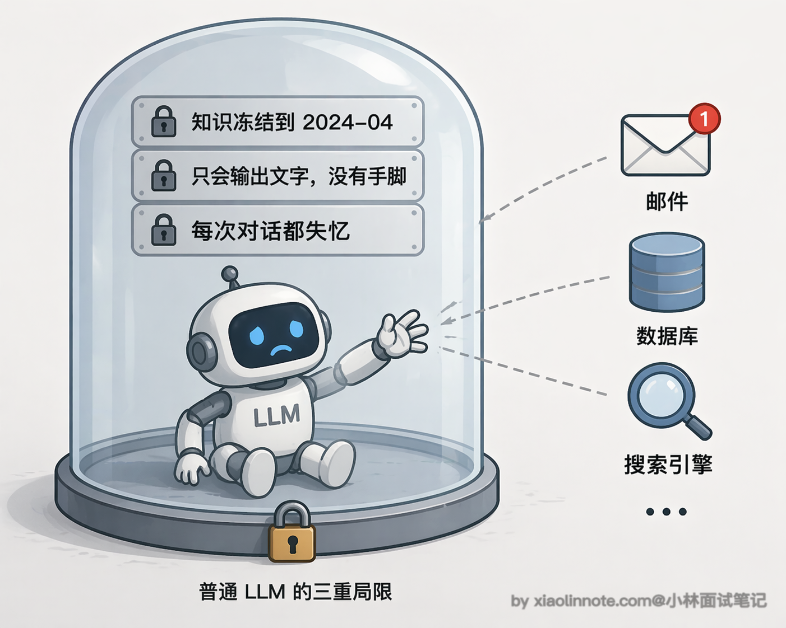
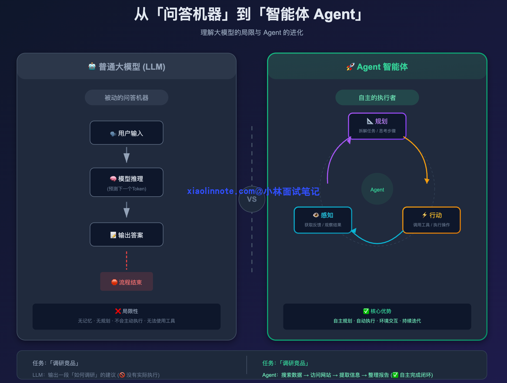
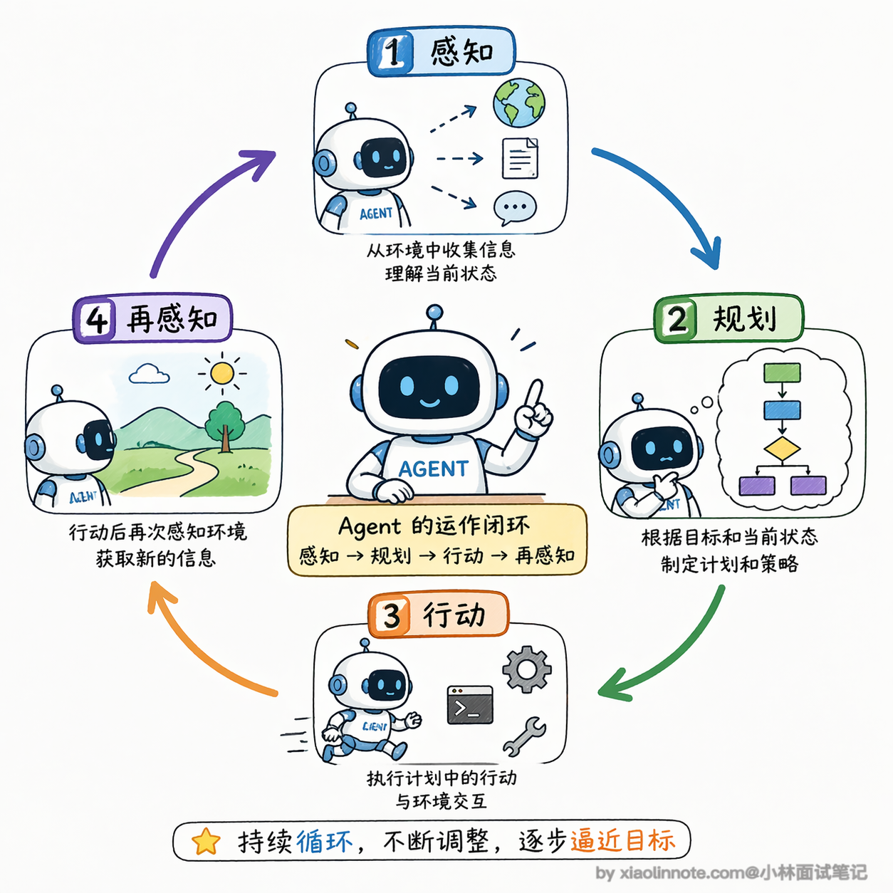
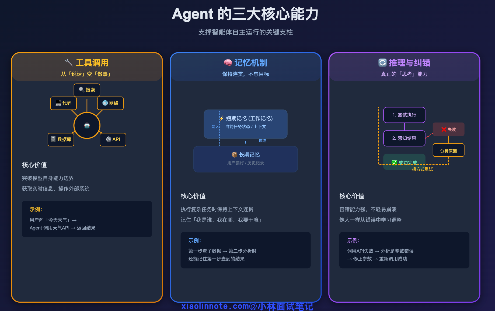
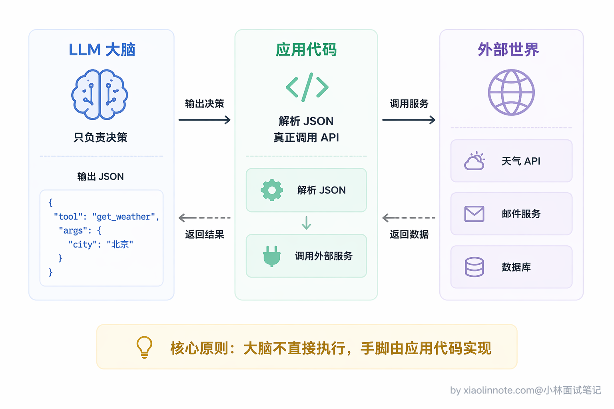
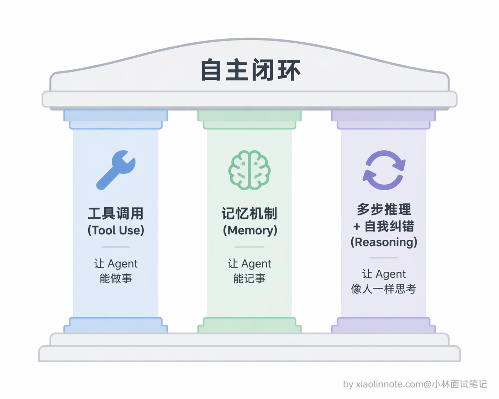
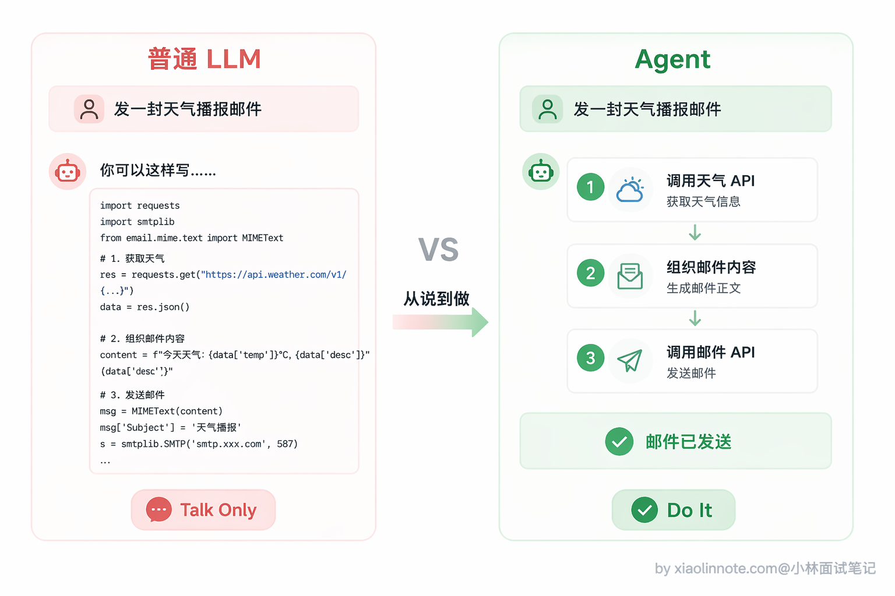
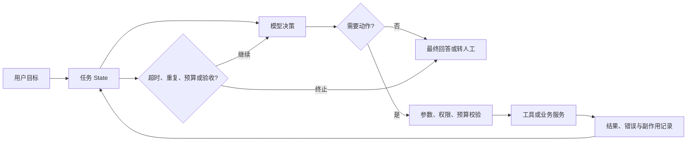
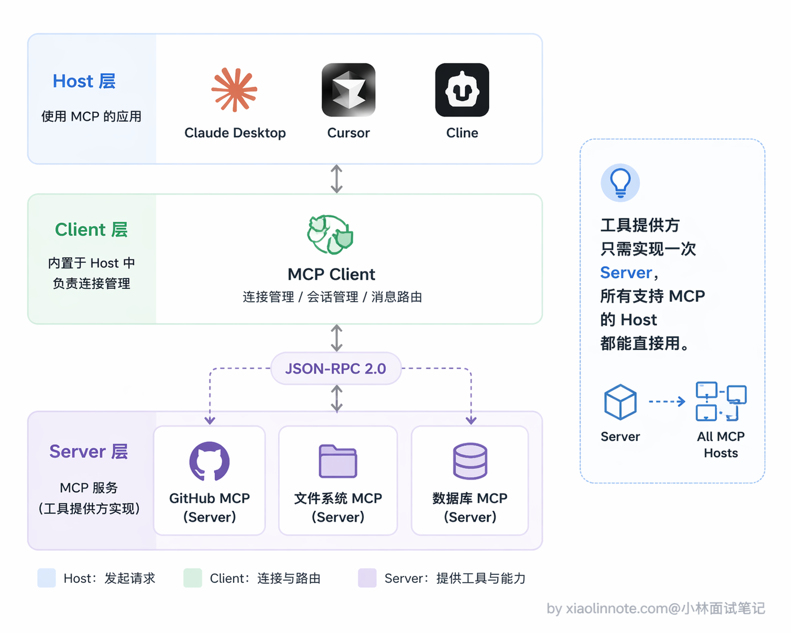
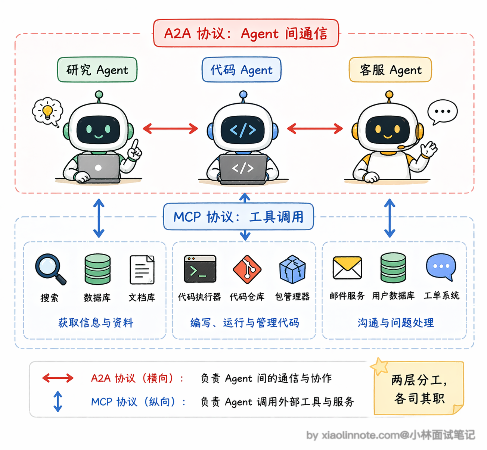

# 什么是 Agent？与大模型有什么本质不同？

> 原文：[什么是 Agent？与大模型有什么本质不同？](https://xiaolinnote.com/ai/agent/1_whatisagent.html) · 小林面试笔记


👔面试官：说说你理解的 AI Agent 是什么？

🙋‍♂️我：Agent 就是给大模型加了插件，比如 ChatGPT 的插件功能，让它能联网搜索、调用 API 啥的。

👔面试官：插件是 Agent？那 ChatGPT 开了搜索功能就是 Agent 了？你说的只是工具调用，跟 Agent 差远了。

🙋‍♂️我：哦，那 Agent 就是能调用工具的大模型，给它配几个工具函数，它就能做更多事了。

👔面试官：还是工具调用。Agent 最核心的是什么？你有没有提到「自主」两个字？

🙋‍♂️我：自主……就是它自己决定调哪个工具？

👔面试官：还不够。自主规划、多步执行、感知结果再调整，这才是 Agent 的闭环。你给它个目标，它自己把任务拆成多步，一步一步做，每步结果反馈回来再指导下一步，这和普通调工具有本质区别。

被问懵了吧，其实答好这道题，抓住一个核心词就行：「自主闭环」。

## 💡 简要回答

我理解 Agent 是一个由模型、工具、状态和运行时共同组成的目标驱动系统。它可以在明确的权限、预算和停止条件内，自主选择下一步行动；“自主”不是无限制地自行操作。

单次 LLM 调用通常只是根据当前输入和上下文生成输出；至于是否多轮、是否保留状态，取决于外部应用如何编排。Agent 则在运行时维护任务状态，并在每轮根据目标、工具结果和约束选择继续、调用工具或结束。

它不只是输出文字，而是真的能做事。

## 📝 详细解析

### 普通大模型的局限性

要理解 Agent，得先说说普通大模型的局限性在哪。

你直接调用某个 LLM 接口时，常见形态是“输入一次、输出一次”；多轮对话和任务状态仍由外部应用维护。模型不会因为生成了工具名就自动拥有网络、数据库或发送邮件的权限，必须由宿主程序决定是否执行并把结果反馈回来。可以把它想象成一个只会答题的人：要让它“自己去查资料再汇报”，还需要运行时为它安排循环和工具。

那普通大模型到底差在哪？我们来一层一层拆。最直观的一个问题是「知识被冻结」，模型的训练数据有截止日期，你问它今天的天气、最新的股价，它完全不知道，因为它没有任何途径去获取实时信息。这就好比一个人毕业之后就再也不看新闻了，你问他今天发生了什么，他只能给你讲课本上的知识。

在「知识冻结」之上，还有一个更本质的问题：它「不能行动」。你让它帮你发邮件、帮你查数据库、帮你执行一段代码，它只能告诉你「你可以这样做」，但它自己做不到。为什么？因为它本质上就是一个文本生成器，所有输出都是一串文字，仅此而已。它能给你写出一封完美的邮件正文，但点那个「发送」按钮的事情，它是真做不了的。



而且更麻烦的是，单次调用本身不会自动拥有持续状态。要完成“先查资料再整理成报告”，宿主程序需要保存消息、工具结果和进度，并在下一轮重新提供必要上下文；跨任务偏好还需要额外的持久化存储和治理。

这三个局限一环扣一环：知识可能过时，外部动作没有执行权限，状态也不会凭空持久化。它们不意味着普通 LLM“完全无能为力”，而是说明多步骤任务需要额外的编排、工具和状态管理。



### Agent 特别在哪？

Agent 就完全不一样了。它有一个核心的运作闭环：**感知 -> 规划 -> 行动 -> 再感知**。



你给它一个目标，比如「帮我调研竞品然后整理成报告」，它不是直接输出一段文字了事，而是先拆解任务，我要搜索哪些关键词、我要访问哪些网站、我要怎么组织内容，然后一步一步去执行，每一步的结果又反馈回来，指导下一步怎么做。

这种能力背后，有三件核心的事在支撑，我一个一个讲。



**第一件：工具调用（Tool Use）**，这是让 Agent 从「说话」变成「做事」的关键。Agent 能调用外部工具，比如搜索引擎、代码执行器、数据库、API 等等。不过这里有一个容易误解的地方：不是模型自己执行，而是模型「告诉宿主程序该调什么」，运行时先做 schema、权限和业务校验，再决定是否真正执行，结果随后反馈给模型。模型负责提出决策，系统负责执行和兜底。

为什么工具调用如此重要？因为它一下子突破了前面说的三个局限。知识被冻结？接上搜索引擎，模型就能获取实时信息。不能行动？接上邮件 API、代码执行器，模型就能真正做事。这就好比一个人原来只能用嘴说话，现在给他配了手、脚和各种工具，能力上限瞬间拔高了一个量级。

我来举个最具体的例子。假设你给 Agent 配了两个工具：查天气和发邮件，然后让它「帮我查一下北京天气，发邮件给老板」：

```python
# 这里定义了两个工具，就像给 Agent 配了两个「技能说明书」
# 注意：这里没有一行真正执行的逻辑，只是告诉模型「我有哪些能力、需要哪些参数」
tools = [
    {
        "name": "get_weather",
        "description": "获取指定城市的当前天气",
        "parameters": {
            "type": "object",
            "properties": {
                "city": {"type": "string", "description": "城市名称"}
            },
            "required": ["city"]
        }
    },
    {
        "name": "send_email",
        "description": "发送邮件给指定收件人",
        "parameters": {
            "type": "object",
            "properties": {
                "to": {"type": "string"},
                "subject": {"type": "string"},
                "body": {"type": "string"}
            },
            "required": ["to", "subject", "body"]
        }
    }
]

# 你告诉 Agent："帮我查一下北京天气，然后发邮件给 boss@company.com"
# Agent 不是一次性回答，而是分两步真正执行：
# 第一步：调用 get_weather(city="北京") → 得到 "晴天 15°C"
# 第二步：调用 send_email(to="boss@company.com", subject="今日天气", body="北京今天晴天 15°C")
# 每一步都是真实发生的，不是在"假装"
```

你看这段代码，工具定义里没有一行执行逻辑，只有「名字、描述、需要哪些参数」，本质上就是一份说明书。模型读了这份说明书，自己决定该调哪个工具、参数填什么，然后把决策以 JSON 格式告诉你，真正执行的还是你的代码。这个「决策和执行分离」的思想，是理解工具调用最核心的一点。



理解了工具调用之后，你会发现 Agent 光有「做事」的能力还不够，它还得「记事」。这就引出了第二件核心的事。



**第二件：状态与记忆机制**。单次 LLM 调用不会自动记住上一轮；Agent 系统通常把当前任务状态放在消息、结构化 State 或检查点中，并按需压缩后继续传入上下文。跨任务信息可以存入向量库、关系库、键值库或事件存储，再结合权限、租户和保留策略检索。短期上下文、可恢复的任务状态和长期记忆不是同一个东西，也不是每个 Agent 都必须具备。

那有了工具能做事、有了记忆能记事，Agent 就完整了吗？还差最后一块拼图，也是 Agent 最像「人」的地方。

**第三件：多步决策与受控恢复**。这一点经常被忽略，但它并不等于模型一定正确，也不意味着可以无限重试。

Agent 在执行过程中如果某一步失败了，它不会直接崩掉，而是能感知到失败、分析原因、换一种方式重试。比如用关键词 A 搜索没找到有用信息，它会自己换关键词 B 再搜一次；调用某个 API 报错了，它会看报错信息然后调整参数重新调用。

这意味着运行时可以把失败结果交回模型，让它尝试修正参数或选择替代路径；是否允许重试、重试几次以及哪些副作用可重试，必须由系统策略决定。更进一步，还可以用校验器或人工审核判断结果是否满足验收条件。

这种「边做边反思」的能力，让 Agent 在面对复杂、不确定的任务时，表现远比死板的自动化流程好得多。

讲完这三件事，我们用一个最直观的场景来感受一下差距。你让一个普通 LLM「帮我发一封天气播报邮件」，它能做的只是告诉你「你可以这样写代码……」；而一个 Agent，它会真的去调天气 API、拿到数据、组织邮件内容、再调邮件发送接口，整个过程自动完成。这就是本质区别：**从生成文字，到执行任务**。



下面这张图把“模型决策”和“系统执行”拆开了。真正的 Agent loop 不应只有模型，还要有状态、校验、预算和停止出口：



模型输出工具调用意图不等于工具已经执行；宿主程序可以拒绝、修改为人工确认，或在执行失败后终止。

### 为什么 Agent 现在才爆发？

你可能会问，Agent 的概念其实很早就有了，为什么近几年工程讨论明显增多？一个较稳妥的解释是，模型的指令遵循能力、结构化工具调用、编排框架和外部 API 生态逐步成熟；具体时间线和产品能力应以对应版本的官方资料为准。

第一个条件是部分大模型在复杂指令、结构化输出和多步决策上的可用性提高了。但模型之间差异很大，不能只凭型号或宣传判断，仍需在自己的工具集合和任务集上评测。

第二个条件是工具调用接口逐步标准化。模型可以输出结构化的调用请求，但不同提供方的 schema、错误语义和并发/重试能力仍可能不同，不能把一种 API 机制当成跨平台保证。

第三个条件是配套生态的完善。编排框架、检索系统、观测工具和 API 服务降低了集成成本，但它们也会引入版本、权限、成本和可观测性问题。Agent 是否适合生产，仍要看任务边界和故障处置能力。

### Agent 生态的最新趋势

Agent 火起来之后，一个很自然的问题就冒出来了：Agent 越来越多，它们之间怎么协作？工具越来越多，怎么统一管理？这两个问题催生了两个非常重要的标准协议，面试里被问到的概率很高，值得了解一下。

第一个常被讨论的是 MCP（Model Context Protocol，模型上下文协议）。可以把它理解成 Agent 应用连接工具和资源的一种接口约定，但它不是安全策略或业务编排本身。

在缺少共同接口时，框架与工具提供方往往需要各自编写适配层。MCP 通过协议约定减少一部分重复适配；但兼容 Host/Client 仍要处理版本、认证、权限、参数、超时、错误和审计，不能理解为“任何支持者都无需额外工程就能互通”。

在采用 MCP 的实现中，常见的架构抽象是 Host（承载交互、配置和权限策略的应用）、Client（维护协议连接的一侧）和 Server（暴露工具、资源或提示的一侧）；这些角色可以拆进不同进程，也可以组合部署。



协议生态会持续变化，组织归属、参与方、可用 Server 数量和安全能力都不应写成长期不变的事实。学习时只需先掌握边界：MCP 类协议用于规范 Host/Client 与 Server 之间的能力发现和调用，是否支持某种能力、如何认证和隔离，仍要查看具体实现与官方文档。

另一个常被讨论的方向是 Agent-to-Agent（A2A）协议。如果说 MCP 类协议主要描述 Agent 与工具/资源的连接，A2A 类协议主要描述 Agent 之间如何发现能力、传递任务和交换结果；二者的具体规范、实现和兼容性要以当前官方资料为准。

在多 Agent 系统里，不同 Agent 可能来自不同厂商或框架，协作时需要约定能力描述、输入输出、任务状态、错误和认证。某些协议提出了类似“能力卡片”的描述方式，但这并不自动解决权限、幂等、超时、取消和数据治理问题。

这两个协议的关系其实是互补的：MCP 管的是 Agent 和工具之间的连接，A2A 管的是 Agent 和 Agent 之间的通信。你可以这样理解，MCP 让每个 Agent 都能方便地「伸手拿工具」，A2A 让不同的 Agent 能方便地「互相说话合作」。未来的 Agent 生态大概率是两个协议同时存在、各管一层的格局。面试的时候能把这两个协议的定位和区别说清楚，会非常加分。



### 工程落地与排错

把 Agent 做成可运行系统时，至少要把以下边界写进运行时，而不是只写在 prompt 里：

| 关注点 | 实现问题 | 常见排错入口 |
| --- | --- | --- |
| 停止 | 最大步数、总耗时、token/费用预算、验收条件 | 是否因重复调用或错误重试耗尽预算 |
| 安全 | 工具白名单、身份/租户校验、敏感参数脱敏、写操作人工确认 | 是否把模型输出当成授权，是否能审计真实副作用 |
| 可靠性 | 超时、幂等键、重试范围、取消和断点恢复 | 重试是否造成重复扣款/发信，失败是否可恢复 |
| 可观测性 | 每轮输入摘要、工具名/参数校验结果、结果、耗时和 trace id | 能否复现“为什么选这个工具”，是否区分模型错与工具错 |

评估时不要只看最终答案：同时记录任务完成率、工具调用准确率、无效/重复调用率、人工接管率、P50/P95 延迟、每任务成本和安全拦截率。这样才能判断问题出在模型决策、工具契约还是运行时策略。

## 🎯 面试总结

回顾开头的对话，踩了三个典型的雷。

第一个雷是把 Agent 等同于「插件」或「工具调用」，这是最常见的误区，工具调用只是 Agent 能力的一部分，不是 Agent 本身。

第二个雷是停在「能调工具」这一层，没有点出自主性，Agent 的关键不是「有工具」，而是「自己决定用不用、什么时候用、用哪个」。

第三个雷是忽略了执行闭环，感知 -> 规划 -> 行动 -> 再感知这个循环才是 Agent 区别于普通 LLM 的核心机制。

面试时答这道题，一定要点出三件事：一是 Agent 有自主规划能力，给它一个复杂目标它能自己拆解成多步；二是它能行动，通过工具调用跟外部世界真实交互；三是它有闭环，每步的结果会反馈回来指导下一步，而不是一次性生成完就结束。另外还要提一句容易混的点：模型本身只是「大脑」，工具的真正执行是你的代码，模型只负责决策。

---
