# Agent 的基本架构由哪些核心组件构成？

> 原文：[Agent 的基本架构由哪些核心组件构成？](https://xiaolinnote.com/ai/agent/2_components.html) · 小林面试笔记


👔面试官：Agent 架构里有哪些核心组件？

🙋‍♂️我：有 LLM 和工具系统，LLM 是大脑，工具让它能联网搜索、执行代码这些。

👔面试官：就两个？一个 Agent 跑起来，任务执行到一半它怎么知道之前做了什么？

🙋‍♂️我：哦，还有记忆，就是把上下文存进去，让它记得之前的步骤。

👔面试官：记忆就是上下文吗？长任务上下文放不下怎么办？记忆还分哪几种你知道吗？

🙋‍♂️我：这个……可能还有数据库存历史记录？

👔面试官：对，短期状态通常要放在上下文或外部状态里，长期数据可以用多种存储，两者不一样。还有一个组件你一直没提，复杂目标怎么拆解成步骤，靠谁？

好，咱来系统捋一下，Agent 的四个核心组件各自负责什么、为什么缺一不可。

## 💡 简要回答

我理解 Agent 常见的核心构件可以概括为 LLM、工具、状态/记忆和规划/控制策略；这不是固定的四件套。生产系统还必须有运行时、权限、停止条件和可观测性。

LLM 负责理解输入和提出决策；工具让系统与外部世界交互；状态记录当前任务的消息、进度和结果，长期记忆则是可选的跨任务存储；规划/控制策略负责拆解、路由或决定是否继续。真正执行工具、校验权限和结束循环的是运行时。

这些构件组合起来，才可能在约束内支持多步任务；是否需要显式规划、长期记忆或多轮 loop，要由任务和风险决定。

## 📝 详细解析

理解了 Agent 是什么之后，我们来看它的内部结构，一个完整的 Agent 系统，到底由哪几个核心部件组成。

你可以把整个 Agent 系统类比成一家公司：**LLM 是决策顾问**，提出下一步建议；**工具系统是执行团队**；**状态/记忆系统是档案室**；**规划模块是项目经理**。但真正的流程负责人还包括运行时：它负责权限、重试、预算、并发和停止。四个概念是常见抽象，不代表每个系统都必须有独立模块。

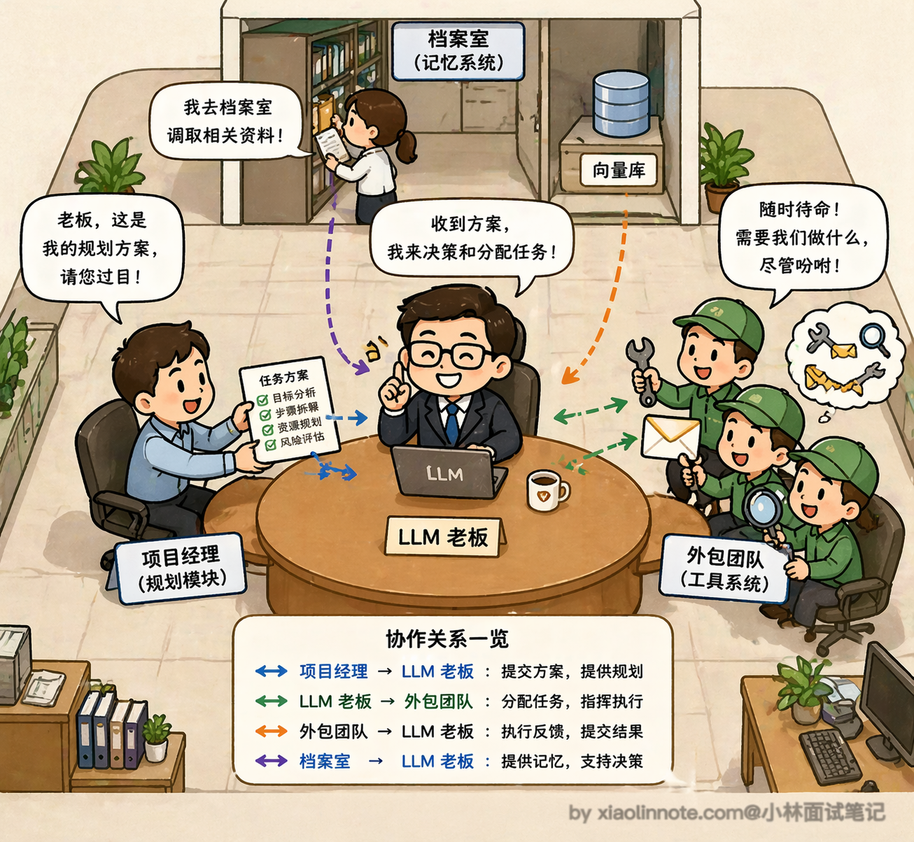

### LLM 核心

先来说 **LLM 核心**。它是整个 Agent 的大脑，所有的输入，不管是用户的指令、工具返回的结果还是记忆里调出来的内容，最终都要经过 LLM 来理解和决策。它负责判断：下一步该做什么？是继续思考、调用某个工具、还是已经可以给出最终答案了？没有 LLM，其他三个组件就是一堆零件，没有人来统一指挥。

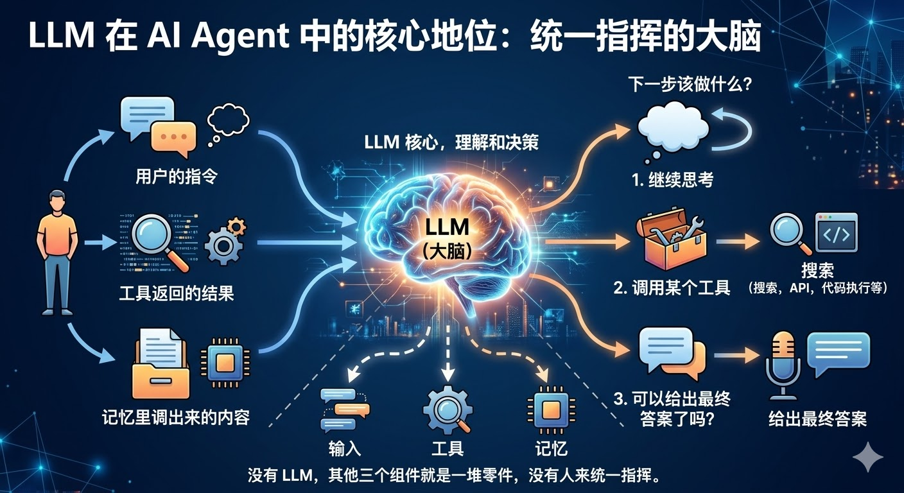

不过很多人忽略了一个重要的东西：System Prompt（系统提示词）。

你可以把它理解成给老板的「岗位说明书」，在 Agent 开始工作之前，System Prompt 就已经定义好了它的角色、行为边界、输出格式要求等等。

比如你做一个客服 Agent，System Prompt 里会写「你是一个专业的客服助手，只回答产品相关问题，遇到不确定的信息要说不知道，不要编造答案」。这段话看着简单，但它决定了 Agent 的「人格」和行为准则，写得好不好直接影响 Agent 的表现。实际工程里，System Prompt 的调优往往占了开发时间的相当大一部分，因为它是你能最直接控制 Agent 行为的手段。

另一个实际工程中非常重要的问题是：选哪个模型？

不同模型之间的差异可能很大。Agent 需要做多步决策，模型的推理、指令遵循和结构化输出能力都会影响工具选择；具体型号和成本会随提供方、版本、区域和合同变化，应以自己的任务集、工具 schema 和预算做对比评测。

市场上有面向推理或长任务优化的模型，也有速度和成本优先的小模型；“更适合做 Agent 大脑”不是脱离任务的结论，需要比较工具调用成功率、任务完成率、延迟和成本。

但推理模型的代价是延迟更高、token 消耗更大，所以不是所有场景都适合用。一个常见的工程做法是：用推理能力强的大模型做核心决策（比如任务规划、关键判断），用更快更便宜的小模型做简单任务（比如意图分类、格式提取），根据不同环节的需求来搭配。

其次是工具调用的稳定性，有些模型生成的 JSON 格式经常出错、参数乱填，导致工具调用失败，这在生产环境里会带来大量的重试和 token 浪费。

最后是上下文窗口大小，Agent 每一步的工具返回结果都要塞进上下文，一个复杂任务跑十几步下来，上下文很容易就撑满了，如果模型的窗口太小，后面的步骤就「看不到」前面发生了什么。所以在实际项目里，模型选择不是一个「越贵越好」的问题，而是要根据任务复杂度、延迟要求、成本预算来做权衡。

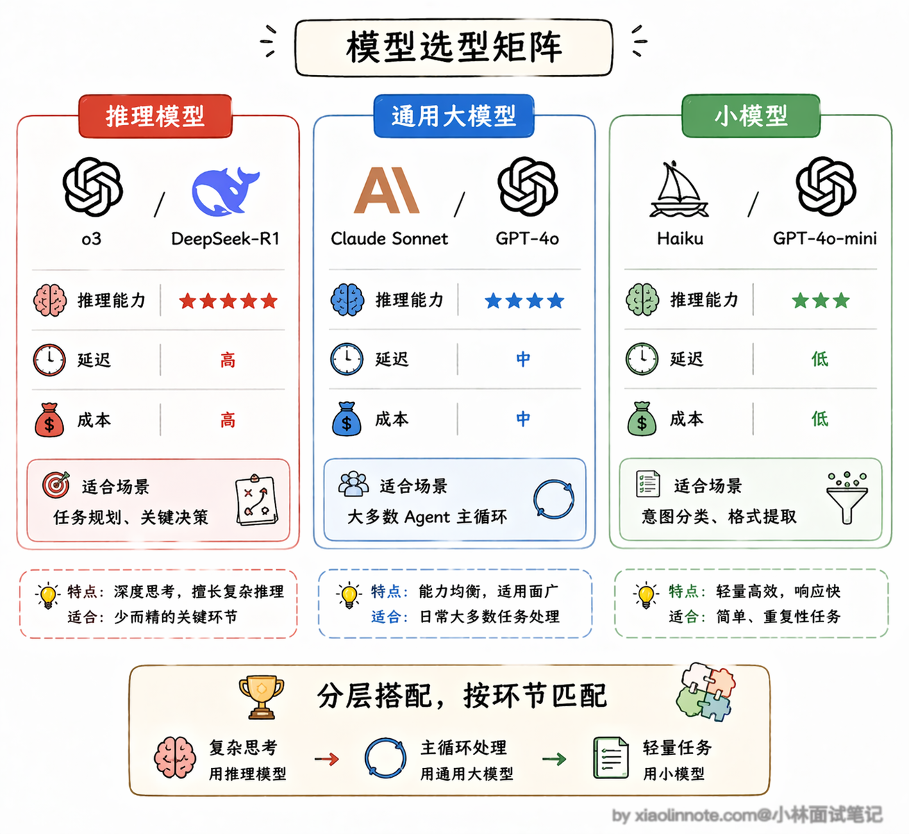

### 工具系统

然后是 **工具系统**，这是 Agent 与许多外部能力交互的重要受控入口，但文件、消息队列、工作流节点或人工审批也可能参与系统边界。

LLM 本身是个纯粹的「语言处理器」，它不能上网、不能读文件、不能执行代码，但这些限制都可以通过工具来突破。工具可以是搜索引擎、数据库查询、代码执行器、发邮件的 API，任何你能用函数封装的能力都可以变成工具。

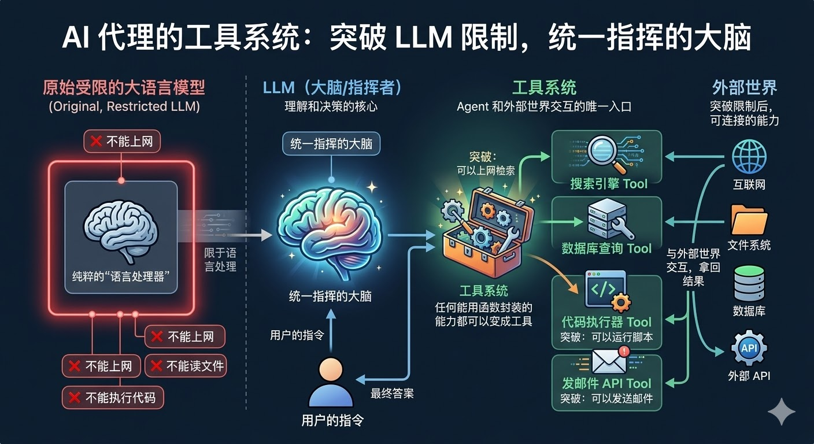

工具是怎么定义的？我给你看一个最标准的格式：

```python
# 定义工具的结构（以 OpenAI function calling 格式为例）
# 你只需要告诉模型三件事：工具叫什么名、能做什么事、需要哪些参数
tools = [
    {
        "type": "function",
        "function": {
            "name": "search_web",
            "description": "搜索互联网上的信息",
            "parameters": {
                "type": "object",
                "properties": {
                    "query": {
                        "type": "string",
                        "description": "搜索关键词"
                    }
                },
                "required": ["query"]
            }
        }
    }
]

# LLM 决定调用工具时，会返回类似这样的结构：
# {"tool_call": {"name": "search_web", "arguments": {"query": "2024年大模型最新进展"}}}
# 然后你的代码负责真正执行这个搜索，把结果再塞回给 LLM
```

你看，工具定义里没有一行执行逻辑，只有「名字、描述、参数说明」。模型读了这份说明书，决定要调哪个工具、参数填什么，把决策以 JSON 格式告诉你，你的代码去真正执行，结果再反馈给模型。整个分工很清晰：**模型负责「决定做什么」，程序负责「真正执行」**。

这里还有一个非常容易被忽略的点：工具描述的质量直接影响 Agent 的表现。

模型是根据你写的 description 来判断「什么时候该用这个工具」的，如果描述写得含糊、有歧义，模型就可能在不该用的时候调了它，或者该用的时候没调。

举个例子，你有一个查数据库的工具，如果 description 只写了「查询数据」，模型可能在用户问天气的时候也去查数据库，因为「查询数据」太宽泛了。但如果你写成「查询公司内部销售数据库，支持按日期、产品类别筛选」，模型就能精确判断什么场景该用它。所以在实际开发中，工具描述其实是需要反复调优的，它的重要性不亚于 prompt 工程。

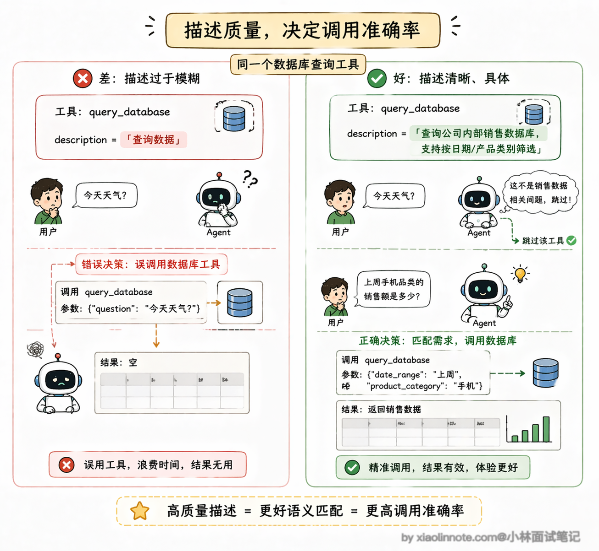

当工具越来越多的时候，管理和标准化就变成了一个大问题。

MCP（Model Context Protocol，模型上下文协议）是一类用于连接应用与外部能力的协议；常见抽象包括 Tools（可执行的操作）、Resources（可读取的数据）和 Prompts（可复用的提示模板）。协议版本、消息细节和支持范围应以目标实现的官方文档为准。

在采用 MCP 的实现中，常见的架构抽象是 Host（承载交互、配置和权限策略的应用）、Client（维护协议连接的一侧）和 Server（暴露工具、资源或提示的一侧）；这些角色可以拆进不同进程，也可以组合部署。

工具提供方只要按 MCP 标准实现一个 Server，任何支持 MCP 的 Agent 都能自动发现和调用这些能力，不需要额外写适配代码。你可以把 MCP 理解成工具世界的「USB-C 接口」，只要插口标准一致，什么设备都能连上。

协议生态的组织归属、参与方、Server 数量和安全能力会变化，不宜写成长期不变的事实。学习时先掌握边界：MCP 类协议用于约定 Host/Client 与 Server 的能力发现和调用，认证、隔离、审批和具体支持范围仍要查看实现文档。

### 记忆系统

接下来是 **记忆系统**，它分几个层次，你可以类比人的记忆方式来理解。

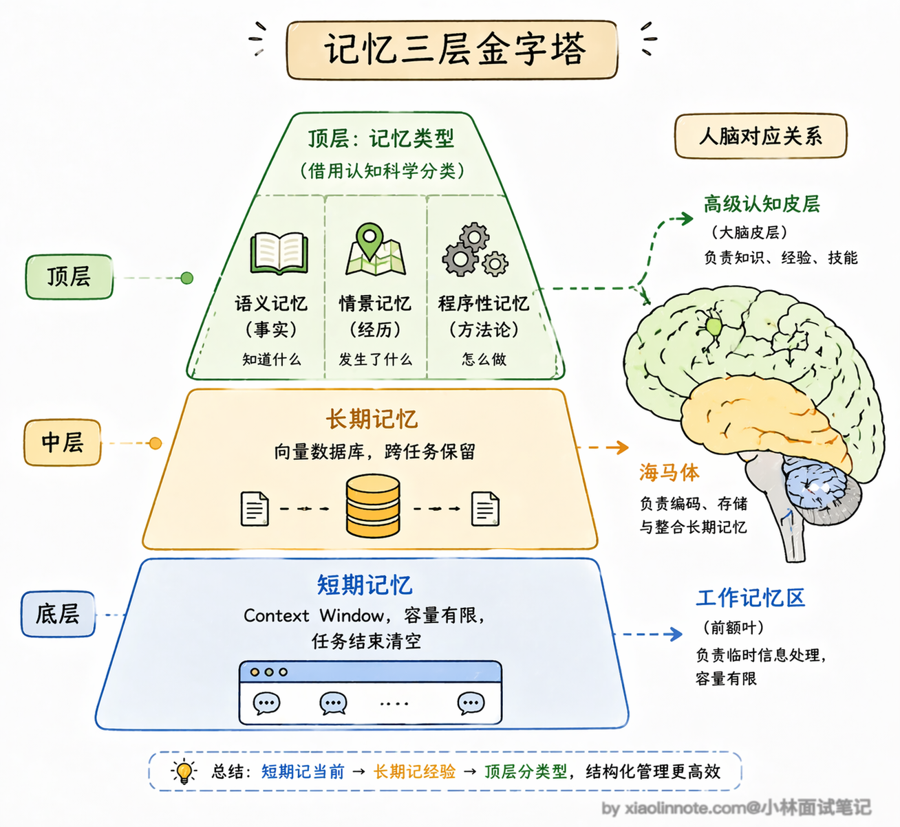

最基础的是**短期上下文**，通常包含当前任务需要的消息、工具结果和结构化状态，并由运行时决定哪些内容放进 context window。

Agent 在一次任务执行过程中靠它记住中间状态，比如第一步搜索到了什么、第二步执行结果是什么。这就像人的「工作记忆」，容量有限；任务结束后是否清理，取决于系统的检查点、审计和保留策略。

然后是**长期记忆**，可以用向量库、关系库、键值库或事件存储实现。只有需要语义召回的文本才适合 embedding；权限、时间、租户和精确字段通常还要依赖 metadata 或结构化查询。

这就像人的「长期记忆」，容量大、可以跨天保留，但需要主动「回忆」才能调出来。

这里借用认知科学对人类长期记忆的分类来理解 Agent 长期记忆的组织方式（这是便于理解的类比，不是协议要求；实际实现可能是多种存储和查询的组合）：

- 语义记忆（Semantic Memory）存的是事实性知识，比如「用户是做金融行业的」「某个 API 的调用频率限制是每分钟 60 次」；
- 情景记忆（Episodic Memory）存的是具体的经历，比如「上次用户问退款问题时我们查了订单系统，发现他的订单已过退款期」；
- 还有一种是程序性记忆（Procedural Memory），存的是「怎么做事」的经验，比如「处理退款问题的标准流程是先查订单状态再核实支付方式」。程序性记忆特别有意思，它不是存某个具体的事实，而是把 Agent 做事的方法论沉淀下来，让它下次碰到类似任务时能直接套用高效的处理流程，而不是每次都从头摸索。

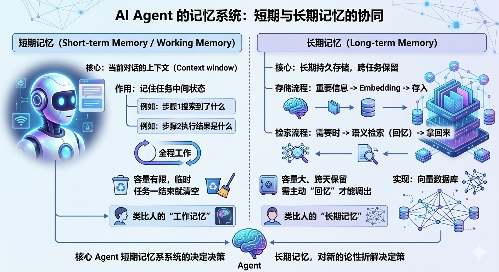

不过记忆系统在工程实践中有几个挑战是经常被忽视的。

短期记忆最大的问题是上下文窗口有限，一个复杂任务执行十几步，每步工具返回大量文本，上下文很快就满了，这时候你要么做摘要压缩（把前面的步骤浓缩成关键信息），要么做滑动窗口（只保留最近几步的详细内容），但不管哪种方式都会丢失信息，怎么在「记住够多」和「不撑爆上下文」之间取舍，是记忆工程里最核心的设计问题。

长期记忆的挑战则在于「什么该存、什么不该存」以及「存了之后怎么管理」。

如果什么都往向量数据库里塞，检索出来的噪音会很多，反而干扰模型的决策；如果存得太少，又失去了长期记忆的意义。目前比较好的做法是在存入之前做一轮重要性评估，只把真正有价值的信息持久化。另外还有一个容易忽略的机制叫记忆衰减（Memory Decay）。

你想想看，一个客服 Agent 三个月前处理的某个问题，到今天还重要吗？大概率已经不重要了。记忆衰减的做法是给每条记忆加一个时间权重，越久远的记忆权重越低，检索的时候自然就排在后面了。

具体实现上通常用一个指数衰减公式：记忆的相关性分数 = 语义相似度 x 时间衰减因子，时间衰减因子随着时间推移逐渐降低。衰减速度可以根据业务场景调整，比如客服场景衰减可以快一些（因为大多数对话是一次性的），而法律合规场景衰减就要慢得多（因为历史记录可能在很久之后还会被引用）。

这样 Agent 就不会被一堆过时的信息淹没，总是优先关注最近的、最相关的记忆。

### 规划模块

最后是 **规划模块**，它决定了 Agent 能不能应对复杂任务。

简单任务一步就搞定了，但如果你让 Agent「帮我写一份竞品分析报告」，它需要先把这个目标拆解：搜索竞品资料 -> 整理关键数据 -> 对比分析 -> 撰写报告。规划模块就是做这件事的。

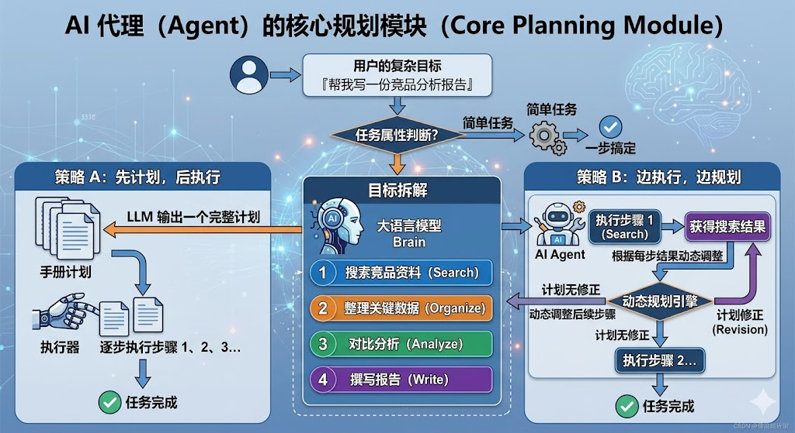

规划模块的底层其实依赖的是 LLM 的推理能力，而提升推理能力有几种主要的技术手段。

最基础的是 **CoT**（Chain of Thought，思维链）式推理，它强调在生成答案前分解中间步骤。但工程上不应把暴露完整的内部推理当成接口契约；更稳妥的是让模型输出结构化计划、检查点和简短依据，供运行时校验。

为什么分步策略有时能提升效果？因为中间步骤会成为后续决策的输入，给模型更多的分解空间；但它也增加 token、延迟和暴露敏感信息的风险，效果必须在目标任务上验证。

在此基础上还有 **ToT**（Tree of Thoughts，思维树），它不是走一条线性的推理链，而是在每个推理节点上展开多个可能的分支，然后评估每个分支的质量，选出最优的路径继续往下走。

你可以把 CoT 理解成「一条路走到底」，ToT 理解成「走到岔路口先看看几条路，选最好的那条再往前」。ToT 在需要创造性思考或者复杂决策的场景下效果更好，但计算成本也更高，因为它要同时评估多条路径。

有了这些推理技术打底，规划模块在实际运作中有两种主流模式。

- 第一种是「先规划后执行」，也就是 **Plan-and-Execute 模式**，先让 LLM 输出一个完整的步骤列表，然后按顺序逐步执行。好处是整体结构清晰，你能在执行前就看到完整计划，方便人工审核；缺点是如果中间某一步的结果和预期不一样，原来的计划可能就不合适了，需要重新调整。
- 第二种是「边执行边规划」，也就是 **ReAct 模式**，每走一步就根据当前结果重新思考下一步该做什么，不提前制定完整计划。好处是灵活性极高，能根据实际情况随时调整；缺点是容易「走偏」，因为每一步都是局部最优决策，有时候会忽略整体目标。在实际工程里，很多团队会把两种模式结合起来，先做一个粗略的计划确定大方向，执行过程中再根据反馈动态微调。

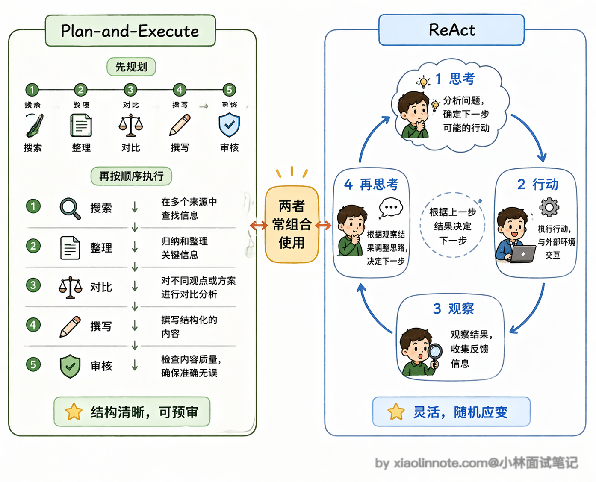

这四个组件合在一起，到底是怎么跑起来的？我用一段伪代码来还原整个运行过程，看完你就能理解它们是怎么协作的：

```python
# Agent 运行的核心 loop（伪代码）
def agent_run(user_goal: str):
    # 第一步：规划模块上场，把目标拆成步骤列表
    plan = llm.plan(user_goal)

    memory = []  # 短期记忆，用来存每一步的中间结果

    for step in plan:
        # 第二步：LLM 核心做决策，这一步该怎么做？
        action = llm.decide(
            step=step,
            history=memory,                    # 把短期记忆传进去，让它知道之前做了什么
            long_term=vector_db.search(step)   # 从长期记忆里捞出相关历史
        )

        if action.type == "tool_call":
            # 第三步：工具系统负责真正执行
            result = tools.execute(action.tool_name, action.args)
            memory.append({"step": step, "result": result})  # 执行结果存入短期记忆

        elif action.type == "final_answer":
            return action.content  # LLM 判断任务完成，返回最终答案
```

看完这段伪代码，你会发现 Agent 的核心节奏其实很简单：规划 -> 决策 -> 执行 -> 结果存入记忆 -> 再决策，循环往复，直到任务完成。LLM 始终是那个做决策的角色，工具系统是执行者，记忆系统让它不会「失忆」，规划模块帮它把大目标拆成小步骤。

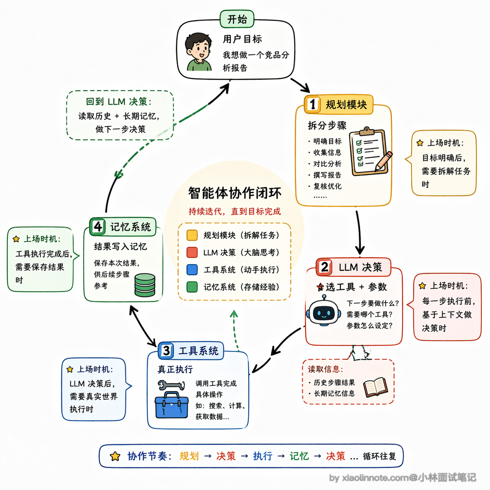

LangChain、LlamaIndex、AutoGen 这些主流框架，本质上都是围绕这四个组件来设计的，只是封装方式和侧重点各有不同。

这几个组件的边界可以用下面的数据流理解：

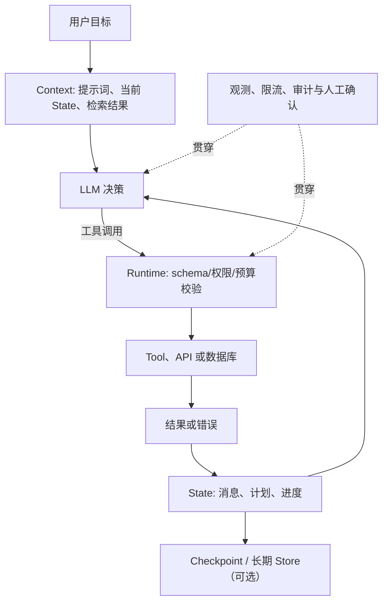

这里要区分三个词：**Context** 是本轮传给模型的信息，**State** 是任务运行时维护的结构化状态，**Store** 是跨轮次或跨任务持久化的存储。把三者都叫“记忆”，容易导致数据泄露、过度注入和恢复失败。

### 工程排错清单

| 症状 | 优先检查 | 不应直接假设 |
| --- | --- | --- |
| 工具选错 | 工具描述、路由规则、候选工具数量和任务样本 | 一定是模型能力不足 |
| 参数无效 | JSON Schema、服务端校验、身份和权限 | prompt 能代替授权 |
| 长任务忘记目标 | State 是否结构化、摘要是否保留约束、是否有检查点 | 只换更大上下文就能永久解决 |
| 重复写入或重复发信 | 幂等键、重试策略、人工确认和审计 | 所有错误都可以自动重试 |
| 成本/延迟失控 | 每轮 token、工具耗时、并发和停止条件 | 只降低模型价格就够了 |

## 🎯 面试总结

开头对话里踩了三个雷，面试时都要注意避开。

第一个雷是漏掉组件，很多人只说 LLM 和工具两个，把记忆和规划模块忘了，但这两个恰恰是让 Agent 能跑复杂任务的关键。

第二个雷是对记忆的理解太浅，「记忆就是上下文」这个回答不完整：当前 State/Context 负责任务内连续性，跨任务记忆则可以使用向量、关系、键值或事件存储，并需要权限、保留和删除策略。

第三个雷是工具系统的分工理解有偏差，模型本身不执行工具，它只是输出「调哪个工具、传什么参数」的决策，真正执行是你的代码，这个「决策和执行分离」的设计是面试里很容易被追问的点。

答好这道题，能把四个组件和类比（LLM 是老板、工具是外包团队、记忆是档案室、规划是项目经理）结合起来说，会非常加分。

---
