# Workflow，Agent，Tools 这三个的概念和区别介绍一下？

> 原文：[Workflow，Agent，Tools 这三个的概念和区别介绍一下？](https://xiaolinnote.com/ai/agent/3_workflow_tools.html) · 小林面试笔记


👔面试官：Workflow、Agent、Tools 这三个概念说一下，区别是什么？

🙋‍♂️我：Tools 是工具函数，Agent 是能调工具的智能体，Workflow 是把多个 Agent 串起来的流程，三者是从小到大的关系。

👔面试官：Workflow 是「多个 Agent 串联」？Workflow 里的节点必须是 Agent 吗？LLM 能不能直接当节点？

🙋‍♂️我：也可以，LLM 直接做节点，比如做意图分类，那就不算 Agent 了……

👔面试官：对，Workflow 的节点可以是 LLM、Agent 或 Tools，关键不是节点是什么，而是谁来决定「下一步去哪」，你明白这句话什么意思吗？

🙋‍♂️我：就是说流程走向不一样？Workflow 是固定的，Agent 是动态的？

👔面试官：对了一半。Tools 有没有决策能力？三者在「谁做决策」这个维度上各自是什么情况，你来说说。

被问懵了吧，其实三者最核心的区分角度就一个：谁来做「下一步该干什么」这个决策。

## 💡 简要回答

我理解这三个概念是常见的、可以嵌套的抽象，不是严格的三层层级或三选一关系。

Tools 是最小的能力单元，就是封装好的可调用函数，比如搜索、执行代码、发邮件，它只负责「执行」，本身没有任何决策能力。

Agent 是一个完整的决策系统，内部用 LLM 做大脑，自己判断什么时候调哪个 Tool、要不要继续、什么时候结束，是主动的。

Workflow 是由代码或编排运行时定义的控制流，把 Agent、LLM、Tools 组织起来；主路径通常预先定义，但节点内部仍可以包含 LLM 分类、动态检索或受约束的 Agent。

三者最核心的区别就一句话：Tools 暴露能力，Agent 在运行时提出下一步决策，Workflow 由开发者定义主控制流。实际系统还要由运行时负责权限、停止、重试和观测。

## 📝 详细解析

要理解这三个概念，得先搞清楚一件事：**它们不在同一维度上，通常可以相互嵌套。** 很多文章把它们并排列出来对比，容易让人误以为是三选一的关系；实际项目里三者经常同时存在，只是扮演不同的角色。

我们按从小到大的粒度，一层一层讲清楚。

### 第一层：Tools，最小的能力积木

Tools 是整个体系里最简单、最底层的概念，**它本质上是一个「按特定格式暴露给 LLM 的函数」**：普通函数是给程序员调用的，Tool 是给 LLM 调用的，所以必须给它配一份 LLM 看得懂的 schema（名字、描述、参数类型），否则 LLM 不知道它存在、也不知道怎么用。除了这层 schema 包装，它和普通函数没有本质区别，有明确的输入参数、明确的输出结果。

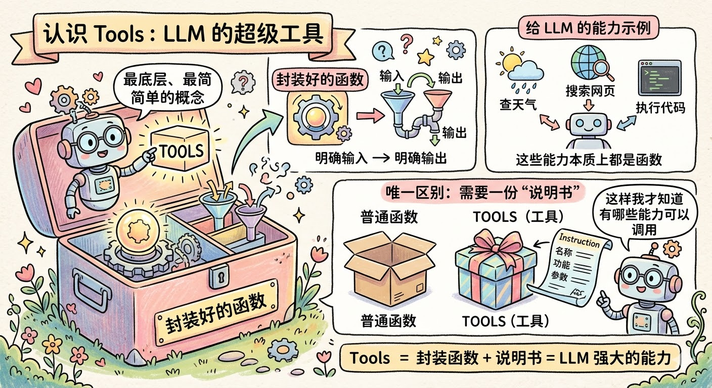

你给 LLM 配备的每一个能力，比如「查天气」「搜索网页」「执行 Python 代码」「往数据库写一条记录」，本质上都是一个函数。Tools 和普通函数唯一的区别是：你需要额外写一份「说明书」告诉 LLM 这个工具叫什么名字、能做什么事、需要传哪些参数，这样 LLM 才知道自己有哪些能力可以调用。

来看一个最直观的例子：

```python
# 定义两个工具，注意观察：这里只有「说明书」，没有任何决策逻辑
# Tools 根本不知道自己「应该」在什么时候被用，它只负责「被调用时干什么」
tools = [
    {
        "name": "web_search",
        "description": "在互联网上搜索信息，适合查询实时数据或不确定的知识",
        "parameters": {
            "type": "object",
            "properties": {
                # 参数说明清晰，LLM 看到这个描述就知道该填什么
                "query": {"type": "string", "description": "搜索关键词，越具体越好"}
            },
            "required": ["query"]
        }
    },
    {
        "name": "send_email",
        "description": "向指定邮箱发送一封邮件",
        "parameters": {
            "type": "object",
            "properties": {
                "to":      {"type": "string", "description": "收件人邮箱地址"},
                "subject": {"type": "string", "description": "邮件主题"},
                "body":    {"type": "string", "description": "邮件正文内容"}
            },
            "required": ["to", "subject", "body"]
        }
    }
]

# 工具的实际执行逻辑单独写，和「说明书」是分开的
def execute_web_search(query: str) -> str:
    # 这里才是真正发出 HTTP 请求去搜索的代码
    ...

def execute_send_email(to: str, subject: str, body: str) -> str:
    # 这里才是真正调用邮件 API 发送邮件的代码
    ...
```

注意一个很关键的设计：**工具本身没有任何决策能力，它甚至不知道自己「应该」在什么时候被使用。** 这不是什么设计缺陷，而是故意的，Tools 的使命就是把一个具体能力封装好、随时待命，至于什么时候该用它，那是别人的事。

你可以把 Tools 理解成瑞士军刀上的每一个刀片：折叠刀、开瓶器、螺丝刀，每个刀片都有自己擅长的事，但刀片本身不会说「现在应该把我翻出来」。**决定拿哪个刀片的，是拿着刀的那只手。** 这只手，就是我们接下来要说的 Agent。

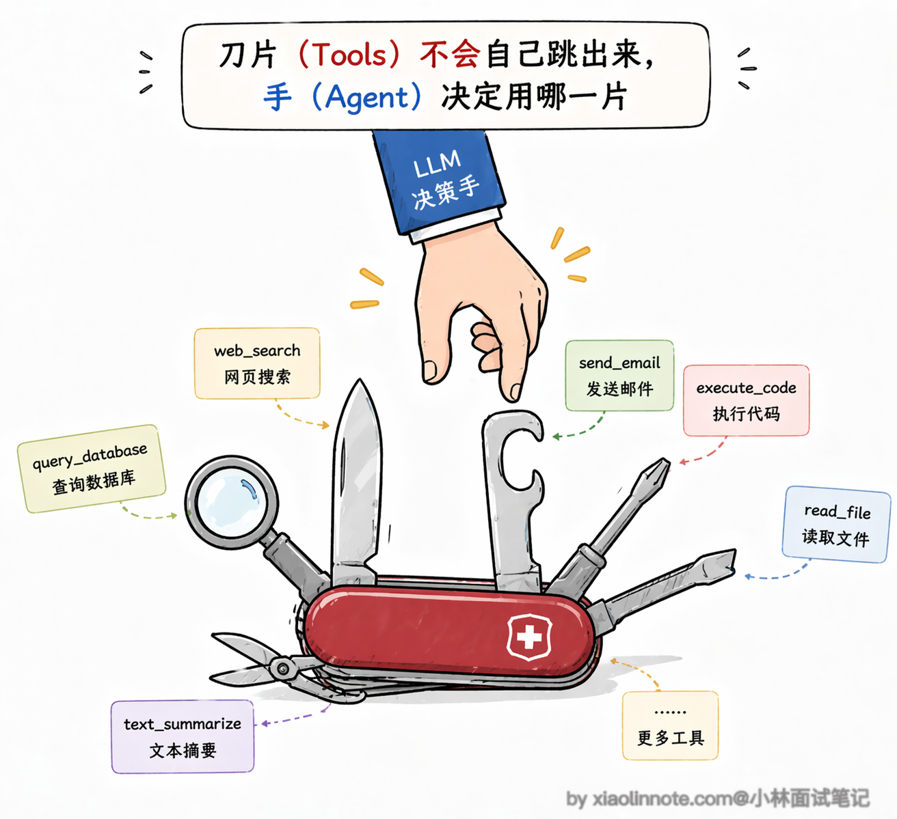

说到工具，还有一个非常重要的工程话题：工具该怎么设计才能让 LLM 用好？

这个问题看似简单，但实际上很多 Agent 系统表现不好，根源不是 LLM 不行，而是工具设计有问题。好的工具设计有几个核心原则。

- 首先是「职责单一」，一个工具只做一件事，不要把「查天气 + 发邮件」混在一个工具里，因为 LLM 在判断该不该调用一个工具时，是根据工具描述来的，如果一个工具干的事太杂，模型就很难精确判断什么时候该用它。
- 其次是「描述要精确」，这一点的重要性怎么强调都不过分，模型完全靠你写的 description 来理解这个工具能做什么。如果描述写得含糊，比如只写「查询数据」，模型就可能在不该用的时候去调它；但如果你写成「查询公司内部销售数据库，支持按日期和产品类别筛选，返回销售额和订单数」，模型就能精确判断什么场景该用它。
- 第三是「错误信息要清晰」，工具执行失败的时候，返回给 LLM 的错误信息必须是它能「看懂」的，比如「参数 city 不能为空」就比「Error code 400」好得多，因为前者能帮助 LLM 自己修正参数重试，后者它完全不知道该怎么处理。第四是「参数设计要简洁」，能少传的参数就不传，能有默认值的就给默认值，因为 LLM 填的参数越多，出错的概率就越大。

另外还有一个工程问题：随着工具越来越多，怎么管理、发现、授权和审计工具本身也变得重要。

MCP（Model Context Protocol）提供了一种把工具或资源注册、描述和调用标准化的接口约定，可以减少不同框架与工具之间的重复适配；但兼容性、认证、权限、超时、错误处理和审计仍需由实现验证，不能理解为接入后自动互通。

### 第二层：Agent，拿着工具自己做决定的人

理解了 Tools 之后，Agent 就很好懂了。**Agent 就是那个「拿着工具、自己决定用哪个」的角色**。

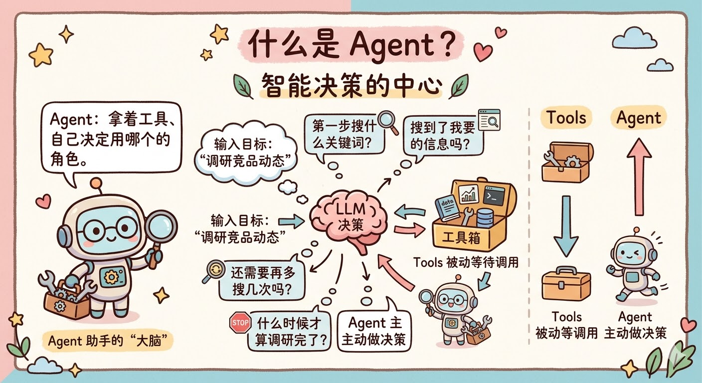

你给 Agent 一个目标，比如「帮我调研一下最近竞品的动态」，它不会直接给你一个答案，而是开始自己思考：我要完成这个目标，第一步应该搜索什么关键词？搜索结果里有没有我需要的信息？需不需要再多搜几次？什么时候才算调研完了？

这一系列「要不要、用哪个、够不够、停不停」的判断，全部由 Agent 内部的 LLM 做决策。这就是 Agent 和 Tools 最本质的区别：**Tools 被动等待调用，Agent 主动做决策。**

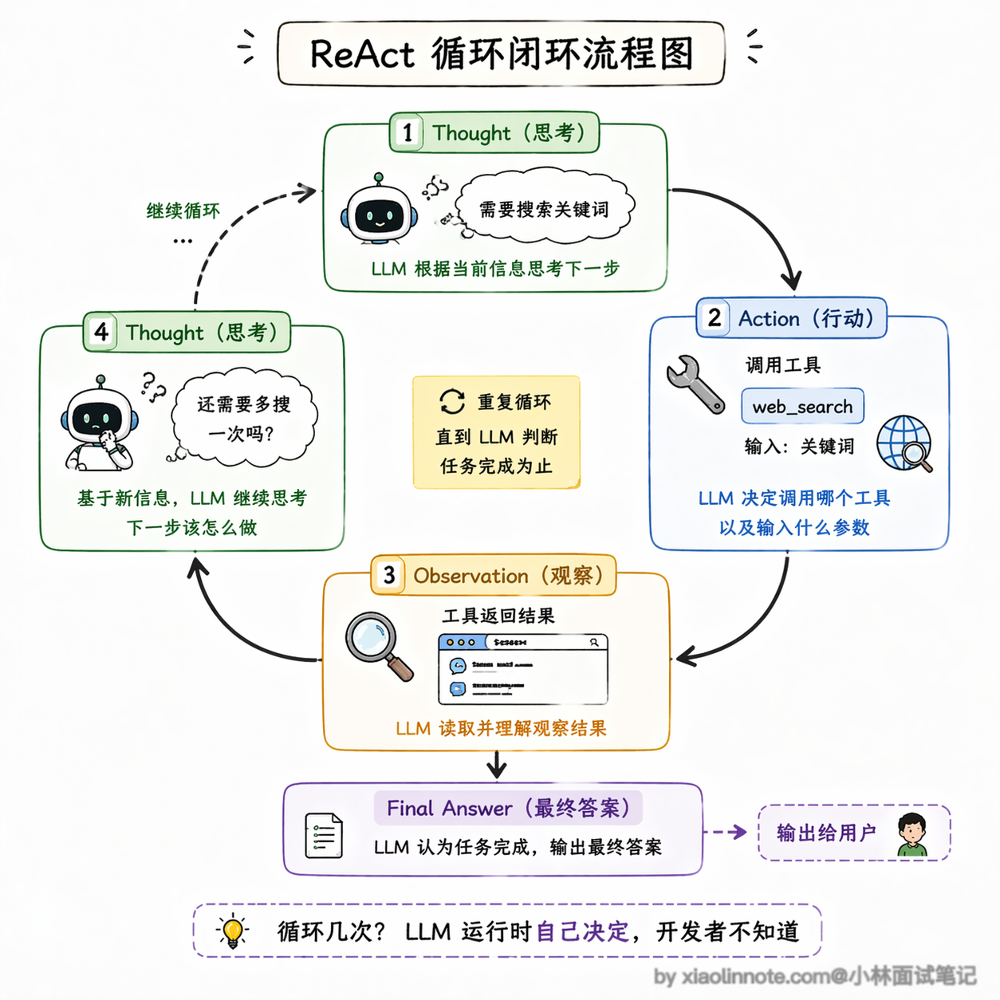

Agent 的运行方式是一个反复循环的过程：**想清楚（Thought）-> 行动（Action）-> 看结果（Observation）-> 再想清楚 -> 再行动……** 直到 LLM 判断任务完成为止，这个循环才结束。

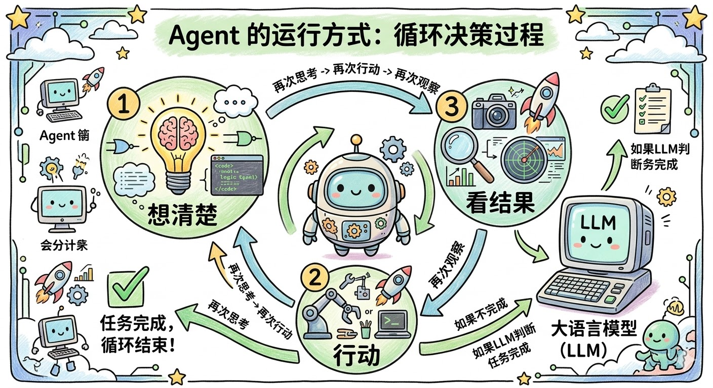

用代码来看这个循环是什么样的：

```python
import anthropic

client = anthropic.Anthropic()

def run_agent(user_goal: str):
    # 把用户目标放进对话历史，Agent 的所有思考和行动都在这个 messages 里积累
    messages = [{"role": "user", "content": user_goal}]

    # Agent 的核心：一个不断循环的决策过程
    # 注意：开发者根本不知道这个循环会跑几次，完全由 LLM 自己决定
    while True:
        # 每一轮，LLM 看到当前的完整对话历史，自己判断下一步该做什么
        response = client.messages.create(
            model="provider:model-id",  # 使用项目已验证并锁版本的模型标识
            max_tokens=1024,
            tools=tools,      # 把「工具说明书」传给 LLM，让它知道自己有哪些能力
            messages=messages
        )

        # LLM 告诉我们「任务完成了」，把最终答案返回出去，循环结束
        if response.stop_reason == "end_turn":
            return response.content[0].text

        # LLM 认为还需要调工具，我们就真正去执行它指定的工具
        # 注意：LLM 只是「告诉我们调哪个工具、传什么参数」，真正执行的是我们的代码
        tool_use = next(b for b in response.content if b.type == "tool_use")
        tool_result = execute_tool(tool_use.name, tool_use.input)

        # 把工具的执行结果塞回对话历史，LLM 下一轮能看到这个结果，再接着决策
        messages.append({"role": "assistant", "content": response.content})
        messages.append({
            "role": "user",
            "content": [{"type": "tool_result", "tool_use_id": tool_use.id, "content": tool_result}]
        })
        # 回到循环顶部，LLM 再看一遍现在的状态，做下一步决策
```

这段代码里有一个地方值得特别注意：这个 `while True` 循环会跑几次，开发者完全不知道，也不需要知道，**这正是 Agent 和普通代码最不一样的地方**。普通代码的每一步都是开发者预先写好的，但 Agent 的执行路径是 LLM 实时决定的，你可以让它完成复杂的、你事先根本没法预测路径的任务。

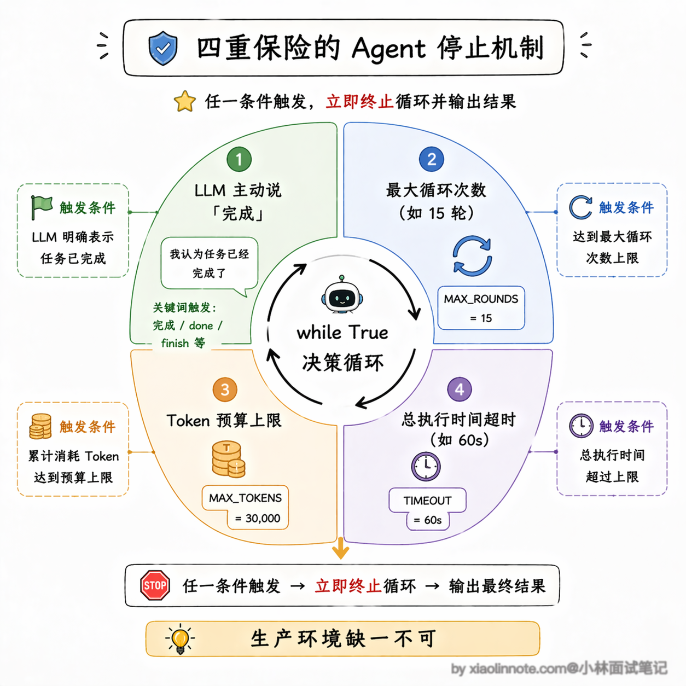

但你可能马上会想到一个问题：既然循环是 `while True`，那万一 LLM 一直觉得任务没完成，或者陷入了某种死循环怎么办？

这是一个非常实际的工程问题，也就是所谓的「停止条件」（Stop Condition）。在生产环境里，一个成熟的 Agent 系统必须有明确的停止机制，不能让它无限跑下去。

常见的停止条件包括：模型或验收器判断完成、最大循环次数、token/工具/金额预算、超时、取消和人工接管。阈值应根据任务的失败代价、p95 延迟和成本预算测量配置，哪个先触发都要记录原因并安全收尾。

当然，Agent 还有另一个副作用：**行为是不确定的**。

同样的任务，今天跑和明天跑，可能调了不同的工具、走了不同的路径，甚至得到微妙不同的结果。这是因为 LLM 本质上是个概率模型，每次生成都带有随机性。**灵活性和不确定性是一对孪生兄弟，有 Agent 的灵活，就必然伴随着一定程度的不可预测。**

这个不确定性在生产环境里有多现实呢？

举个具体的例子，你让 Agent 帮你做竞品调研，第一次跑的时候它可能先搜索了竞品 A 再搜竞品 B，然后做了对比分析；第二次跑同样的任务，它可能先搜了竞品 B 的最新融资新闻，然后跑去搜了行业报告，最后才回来看竞品 A。

两次的最终报告质量可能都还行，但中间走的路径完全不同，这就导致了一个问题：如果某次跑出来的结果有错，你很难复现它当时的执行路径来排查问题。

所以在生产环境里，很多团队会给 Agent 加上详细的执行日志，记录每一步的思考过程和工具调用结果，方便事后追溯。

### 第三层：Workflow，把所有人组织起来的总指挥

理解了 Tools 和 Agent 之后，Workflow 就水到渠成了。

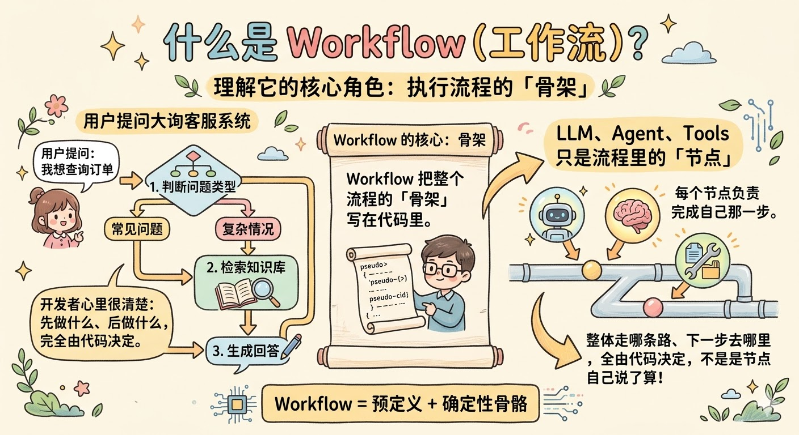

假设你现在要做一个客服系统，大致流程是：先判断用户问的是什么类型的问题，再去知识库里检索相关内容，最后生成一个回答。这里面每一步的逻辑，开发者其实心里都很清楚，先做什么、后做什么、结果满足什么条件走哪个分支，完全可以在代码里写死。

**这就是 Workflow 做的事：把整个执行流程的「骨架」写在代码里，LLM、Agent、Tools 都只是这个流程里的「节点」，每个节点负责完成自己那一步，但整体走哪条路、下一步去哪里，全由开发者的代码决定，不是任何节点自己说了算。**

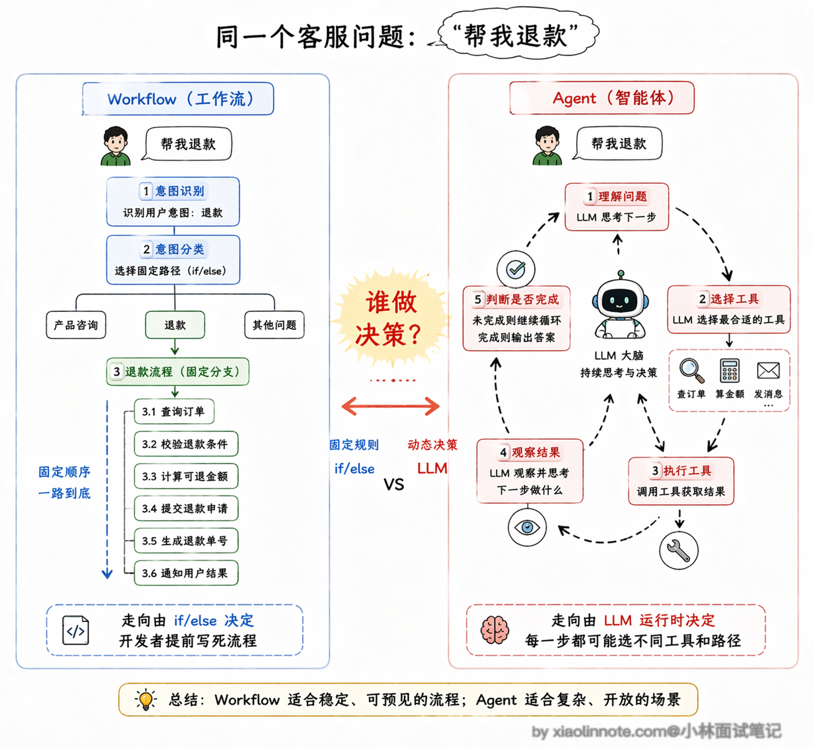

来看一个具体的例子：

```python
def run_customer_service_workflow(user_query: str) -> str:
    # ---- 第一步：意图识别 ----
    # 这里把 LLM 当成一个分类器来用，它只负责判断这个问题属于哪个类别
    # 「下一步去哪」这个决策是下面的 if/elif 来做的，不是 LLM 自己决定的
    intent = classify_intent_with_llm(user_query)  # 返回 "product" / "refund" / "other"

    # ---- 第二步：根据意图走不同分支 ----
    # 注意：这个分支判断是开发者写的 Python 代码，不是 LLM 的决策
    if intent == "product":
        # 产品问题：去知识库检索，再生成回答
        docs = search_knowledge_base(user_query)    # 直接调 Tool，固定的检索步骤
        answer = generate_answer_with_llm(user_query, docs)  # LLM 作为节点生成回答
        return answer

    elif intent == "refund":
        # 退款问题：查订单系统，再走审核流程
        order_info = query_order_system(user_query)  # 调 Tool 查订单
        if order_info["eligible"]:
            process_refund(order_info["order_id"])   # 调 Tool 处理退款
            return "退款已受理，预计 3 个工作日到账"
        else:
            return "很抱歉，该订单不满足退款条件"

    else:
        # 其他问题：转人工
        escalate_to_human_agent(user_query)
        return "已为您转接人工客服，请稍候"

 # 整个流程的走向在代码里一目了然
 # 出了任何问题，你可以精确定位是哪一步出了错
```

你看，LLM 在这里面出现了两次，一次是做意图分类，一次是生成回答，但**它只是流程里的两个工位，「接下来去哪」这件事完全由 if/elif 这些普通 Python 代码控制**。

这就是 Workflow 和 Agent 最核心的区别：**谁在做「下一步去哪」这个决策？Agent 是 LLM 自己决定，Workflow 是开发者在代码里写死。**

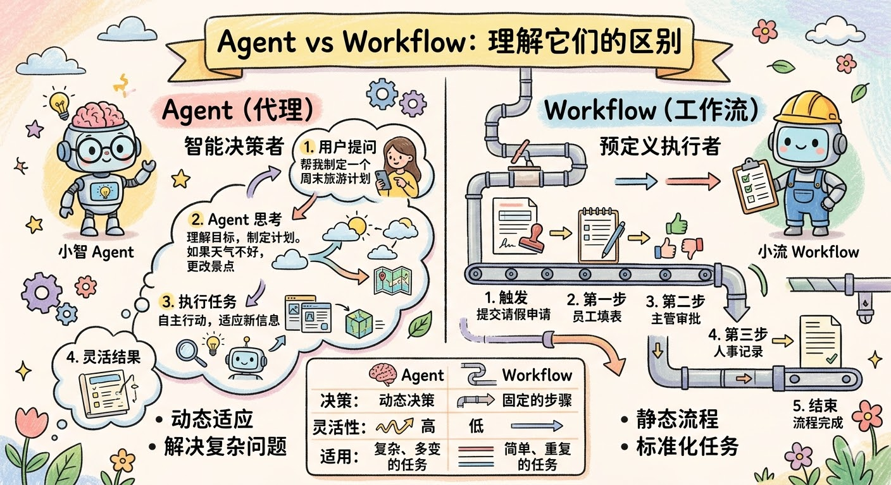

Workflow 最大的优点是**可预测、可控、好调试**。你在代码里看到什么，它就做什么，不会有任何「惊喜」。生产环境里出了问题，你可以打断点逐步追，精确定位是哪个节点出了故障。这种确定性在线上系统里非常珍贵。

### 三者怎么组合？Agentic Workflow 是常见折中

讲完了三层结构，我们来说说实际工程里怎么用。

很多人学完这三个概念之后，会自然而然地想：「那我应该用哪个？」这个问题本身就有点问错方向了，因为在真实的项目里，**三者通常是同时存在、相互嵌套的：**

完全靠 Agent 自主决策的系统需要额外的边界治理：行为路径难以穷举，出错复现和成本控制更难；在高风险业务中，通常要把关键步骤固定下来或加入审批。

**完全靠 Workflow 写死** 的系统又太脆，因为你没法把所有情况都穷举到代码里，遇到预料之外的输入就容易失败或者给出很差的结果。

因此，一个常见的折中模式是**「Agentic Workflow」**：**用 Workflow 固定主流程的骨架，在需要灵活判断的节点嵌入 Agent，其余固定节点直接用 LLM 或 Tools。** 骨架便于控制和调试，局部 Agent 提供有限灵活性；但两者的成本、权限和故障面也会叠加，仍需按任务评估。

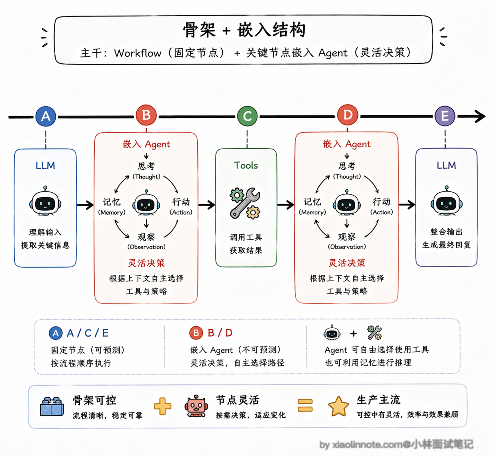

工程实践中常见几种 Workflow 编排模式，值得按“固定步骤、路由、并行、评估循环”来理解；具体框架的命名和实现应以目标版本文档为准。

- 第一种叫「Prompt Chaining」（提示链），就是把一个大任务拆成多个小步骤，前一步的输出作为后一步的输入，像流水线一样串起来。
- 第二种叫「Routing」（路由），先用一个 LLM 做分类判断，然后根据分类结果把请求分发到不同的处理分支，前面客服系统的例子就是典型的路由模式。
- 第三种叫「Parallelization」（并行化），把可以同时进行的子任务并行执行，最后汇总结果，这在需要多维度分析的场景下特别有用，比如同时从多个数据源检索信息。
- 第四种叫「Orchestrator-Workers」（编排者-工人），一个中央编排者负责分配任务，多个 Worker 各自完成子任务，适合任务可以分解但子任务之间相互独立的场景。

还有一种非常实用但经常被忽略的模式叫「Evaluator-Optimizer」（评估者-优化者）。

它的核心思路是：一个 LLM 负责生成输出，另一个 LLM（或者同一个模型换一个角色）负责评估这个输出的质量，如果评估不通过就把反馈给回生成者，让它改进后重新输出，如此循环直到评估通过或者达到最大重试次数。

这个模式特别适合对输出质量要求很高的场景，比如生成营销文案、撰写法律条款、编写代码等等。它的本质其实就是把「人类审稿-修改」的过程自动化了，用 LLM 来充当那个「审稿人」。不过要注意的是，评估标准必须在代码里定义清楚（比如用一个打分函数来判断是否通过），不能让评估者自由发挥，否则评估本身的质量也不可控。

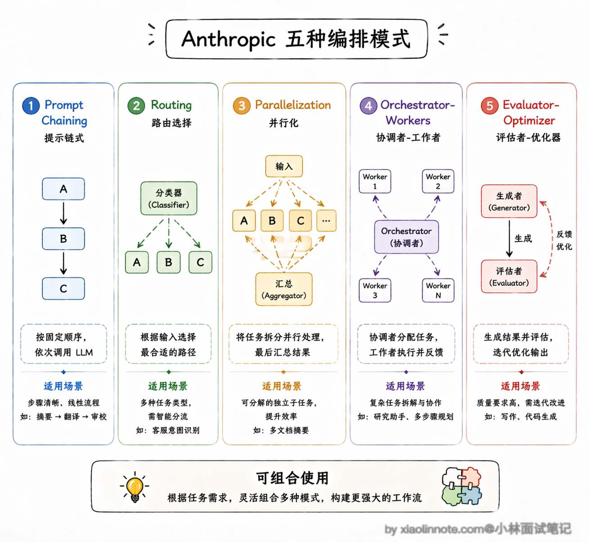

这几种模式不是互斥的，实际项目里经常是混合使用，根据具体需求组合出最合适的架构。

从性能和成本角度看，Workflow 模式的优势也很明显。纯 Agent 模式下，一个复杂任务可能需要 LLM 跑十几轮甚至几十轮决策循环，每轮都要把完整的上下文发给模型，token 消耗是线性增长的，延迟也会累积。

而 Workflow 模式因为流程是固定的，你可以精确控制每个节点的 token 预算，不需要的上下文不传，该并行的步骤并行执行，整体的延迟和成本都更可控。这也是为什么很多团队在从原型阶段（用纯 Agent 快速验证想法）过渡到生产阶段时，都会把系统重构成 Agentic Workflow 的架构。

把三者的核心差异对照起来看，就很清楚了：

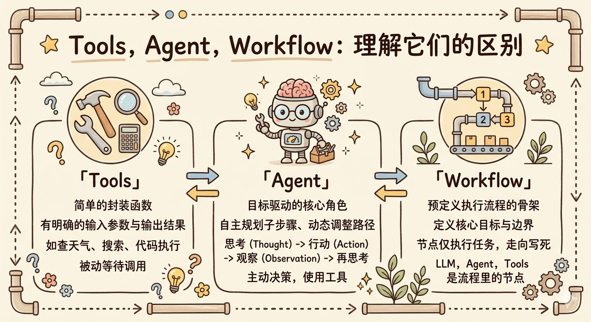

| 维度 | Tools | Agent | Workflow |
| --- | --- | --- | --- |
| 决策能力 | 不负责控制流，只执行被授权的能力 | 在运行时提出动态决策 | 主控制流由开发者/编排器定义；节点内部可有 LLM 决策 |
| 执行方式 | 被动，等待被调用 | 主动，自主循环直到完成 | 按开发者定义的顺序执行 |
| 确定性 | 高（输入固定则输出固定） | 低（同输入可能走不同路径） | 高（行为完全可预测） |
| 灵活性 | 只做被定义的能力 | 高，但受 schema、权限和停止条件约束 | 主路径可预测，节点内部可保留有限动态性 |
| 调试难度 | 容易（单一函数） | 难（执行路径不确定） | 容易（链路清晰，可逐步追踪） |
| 适用场景 | 封装单一具体能力 | 路径未知且风险可控的复杂任务 | 需要审计、稳定失败出口的业务系统 |

### 选型与排错

先问三个问题：下一步是否必须由模型决定？副作用能否重试且可审计？失败后是否有人工或确定性兜底？如果主路径已知，优先用 Workflow；如果只是某个节点需要灵活判断，把 Agent 限定在该节点，并为它设置工具白名单、最大步数、超时、预算和验收条件。

工具层还要独立测试：参数 schema 是否能拒绝非法输入，服务端是否再次鉴权，写操作是否有幂等键，错误是否区分可重试与不可重试。这样“工具选错”“流程走错”和“工具执行失败”才不会混为一个模型问题。

## 🎯 面试总结

开头对话里最典型的误区是把 Workflow 理解成「多个 Agent 串联」，这个说法不对，Workflow 的节点可以是任意的 LLM 调用、Tools 或 Agent，关键不是节点类型，而是控制流由谁掌握——Workflow 是开发者在代码里写死的 if/else，Agent 是 LLM 动态决定的。

面试时答这道题，要抓住「谁做决策」这个核心角度：Tools 没有决策能力，只负责被调用时执行；Agent 由 LLM 在运行时动态决策，同样的输入可能走不同路径；Workflow 的决策提前写死在代码里，行为完全可预测。

三者不是三选一的关系，而是可以相互嵌套的，面试时还要补一句：生产环境里最主流的不是纯 Agent，而是 Agentic Workflow，用 Workflow 固定主流程骨架，在需要灵活判断的节点嵌入 Agent，这样兼顾了可控性和灵活性。

---
