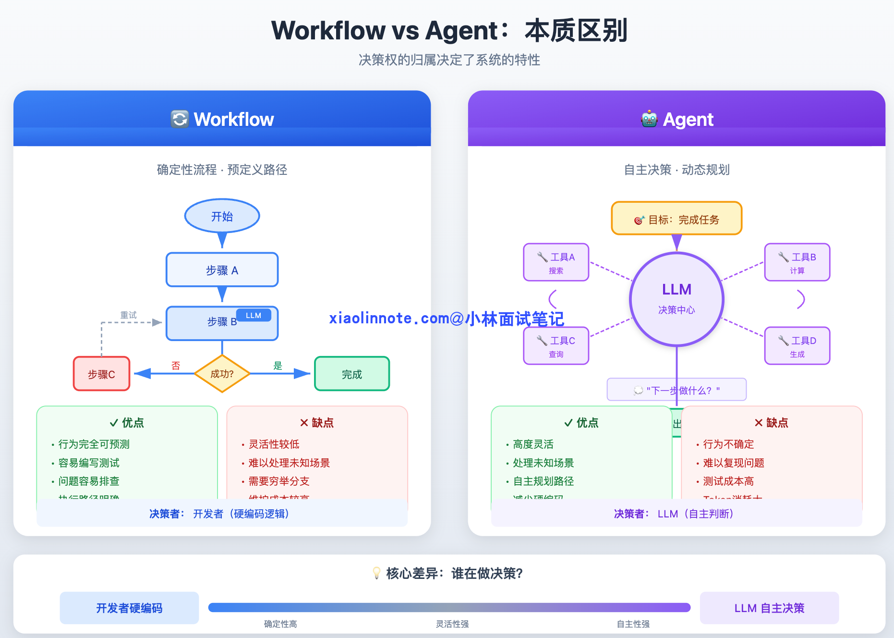
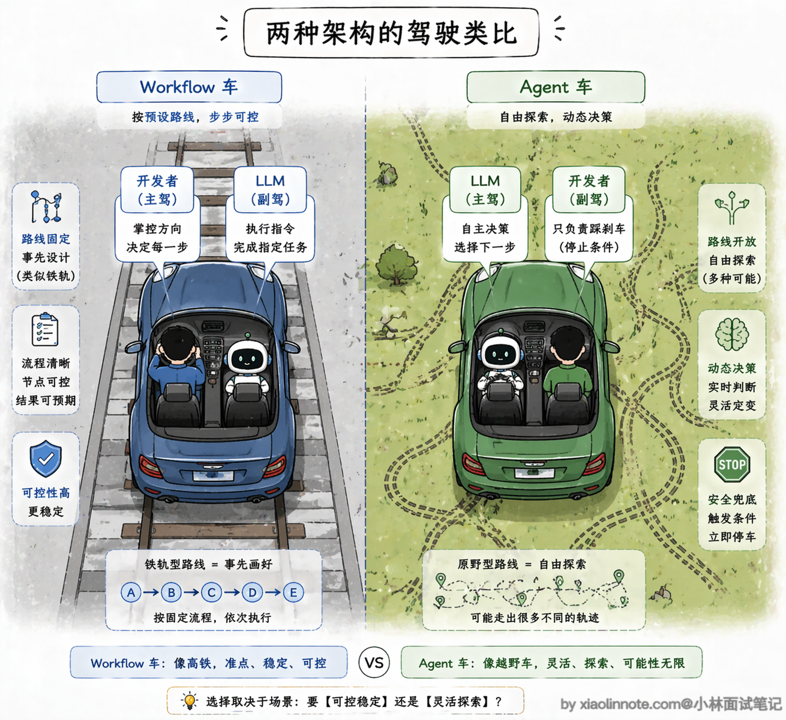
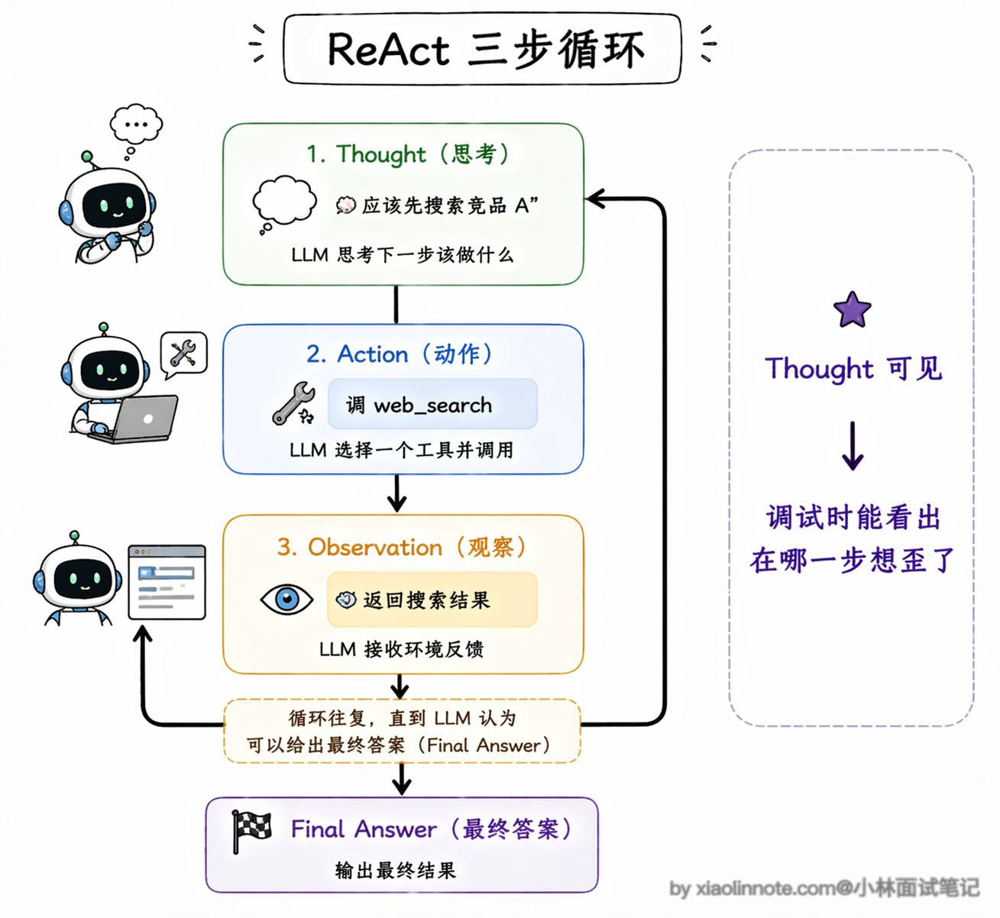
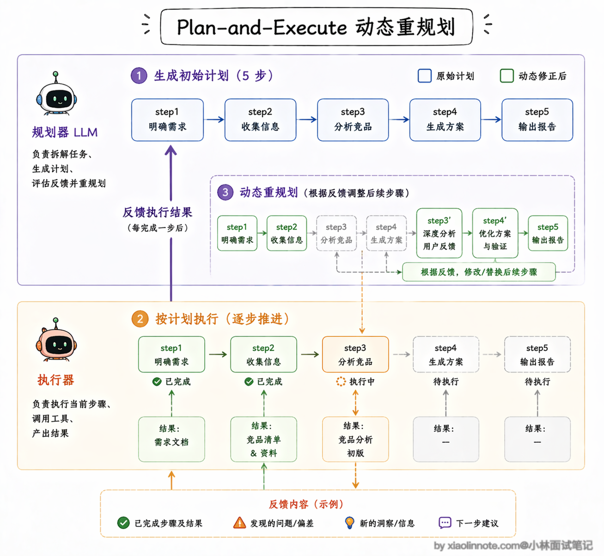
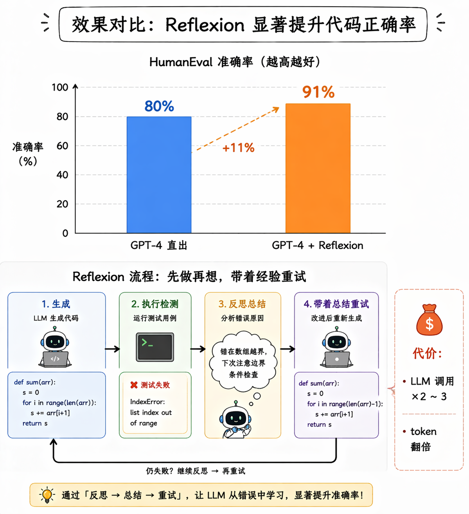
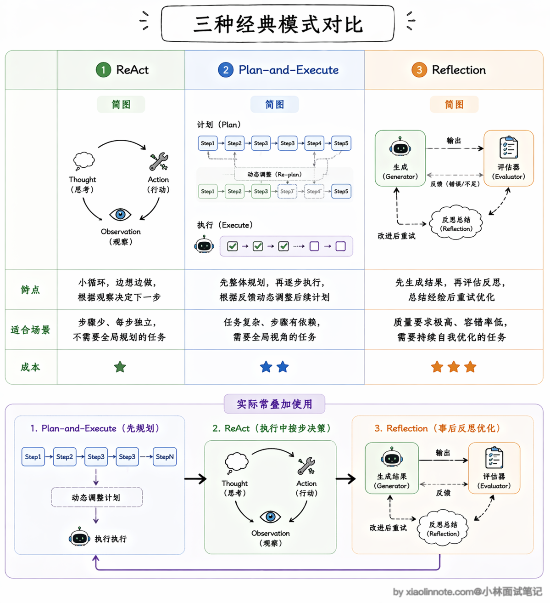
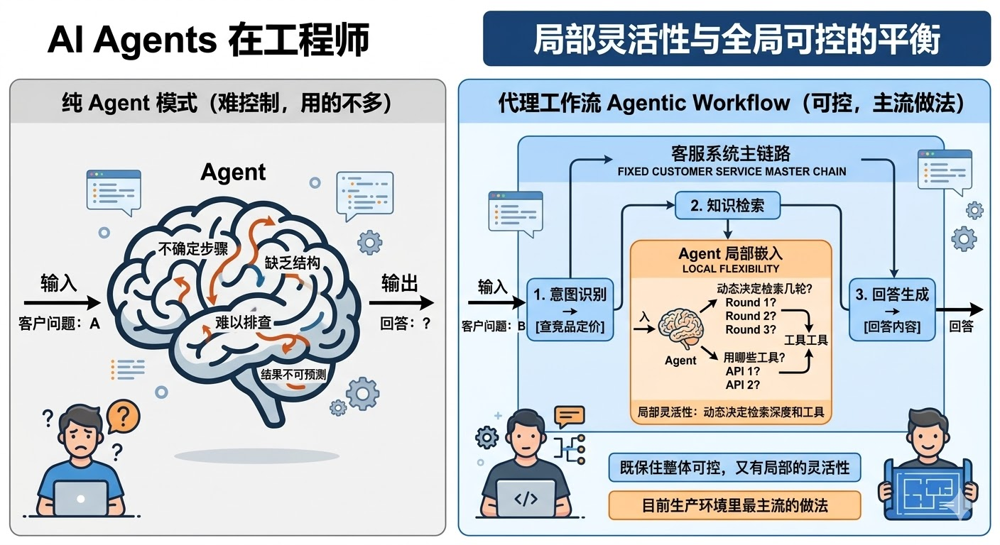
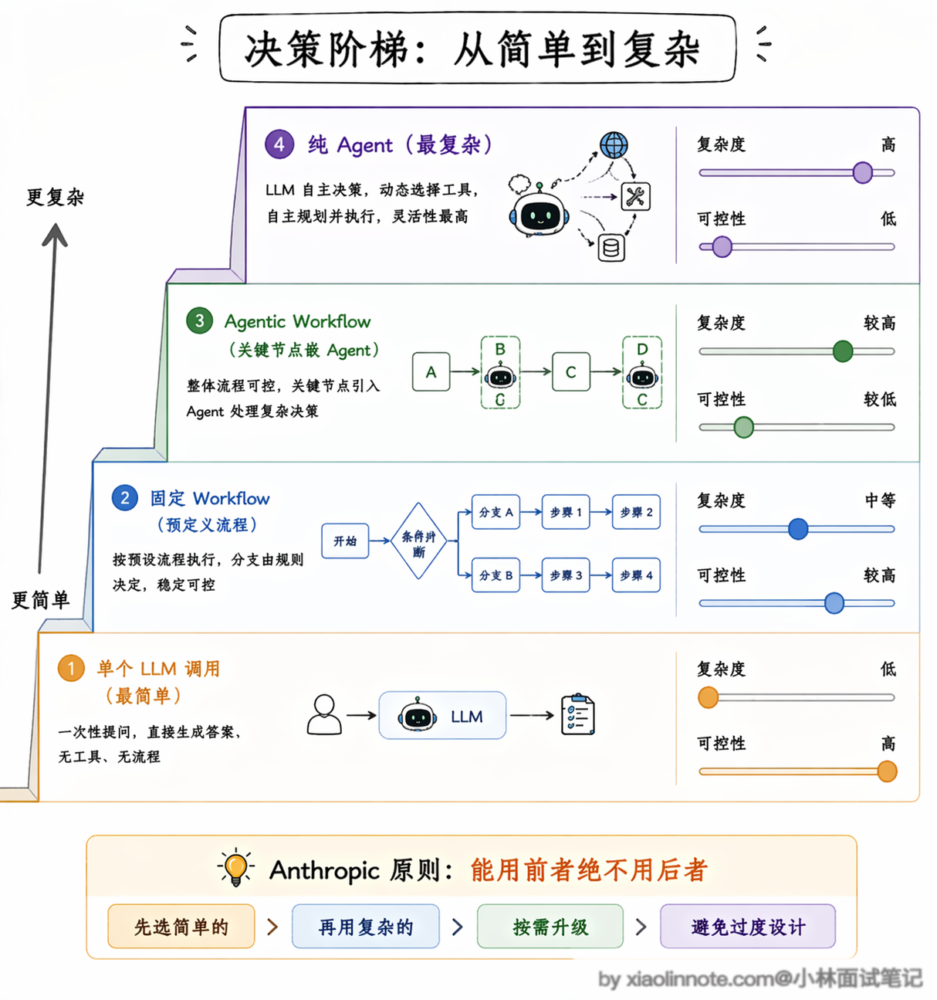
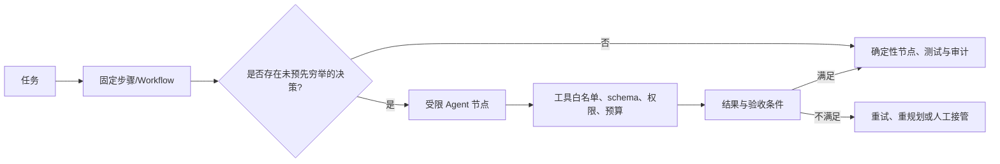

# 了解哪些其他的 Agent 设计范式？Agent 和 Workflow的区别是什么？

> 原文：[了解哪些其他的 Agent 设计范式？Agent 和 Workflow的区别是什么？](https://xiaolinnote.com/ai/agent/4_patterns.html) · 小林面试笔记


👔面试官：你了解哪些 Agent 的设计范式？

🙋‍♂️我：有 ReAct，就是让模型先思考再行动，还有……多 Agent 协作那种。

👔面试官：多 Agent 协作是架构模式，不是设计范式。除了 ReAct，还有哪些？Reflection 知道吗？

🙋‍♂️我：Reflection 是反思，就是模型做完之后自己检查一遍？这应该是调试用的吧。

👔面试官：Reflection 是正式的设计范式，不是调试工具，它在执行流程里加了自我评估环节，能显著提升输出质量，但也有代价，你知道是什么代价吗？

🙋‍♂️我：多跑几次 LLM？会慢一点？

👔面试官：是 token 消耗和延迟都会增加。那我再问，生产环境里你会优先用纯 Agent 模式还是 Workflow？为什么？

好，这道题考的是你对 Agent 工程取舍的理解，咱系统说一下。

## 💡 简要回答

我理解 Agent 和 Workflow 最核心的区别是「谁来决定下一步」。Workflow 由代码或编排器定义主控制流，确定性和审计性更强；Agent 让 LLM 在约束内提出下一步，灵活但需要额外的权限、预算和停止控制。

常见的设计范式除了纯 Agent 之外，还有 ReAct、Plan-and-Execute、Reflection 这几种。

我在实际工程里用得最多的反而是把两者混用，固定流程的部分用 Workflow，需要灵活决策的节点嵌入 Agent 能力，这样既保住了整体可控，又有局部的灵活性。

## 📝 详细解析

在 Agent 开发里有一个非常基础但经常被忽视的问题：**什么情况下该用 Agent，什么情况下该用 Workflow？** 这是实际工程里最常碰到的架构决策，弄错了要么过度工程化，要么系统一点都不可控。

### Workflow 和 Agent 的区别

先把两者的本质区别说清楚。**Workflow** 通常是由代码或编排器预先定义主路径、分支和失败出口；LLM 可以作为节点，也可以承担受约束的分类/抽取，但不必负责整个控制流。好处是更容易测试和审计；坏处是对未预料情况的覆盖需要显式补充。



**Agent** 则把部分「下一步做什么」的决策权交给 LLM。你提供目标、工具契约和边界，它提出工具调用或最终答案，运行时再校验并执行。好处是能覆盖部分未知路径；坏处是行为不确定，同样输入可能走不同路径，因此必须记录 State、工具调用和停止原因。

光说文字可能还不够直观，我用代码结构来对比一下，你一眼就能感受到区别：

```python
# Workflow 风格：流程固定，每步都是确定的，LLM 只是工具
def workflow_answer_question(user_query: str):
    # 第一步：固定做向量检索
    docs = vector_db.search(user_query, top_k=5)
    # 第二步：固定做 rerank（重排序，筛选最相关的结果）
    reranked = reranker.rank(user_query, docs)
    # 第三步：固定喂给 LLM 生成答案
    answer = llm.generate(user_query, context=reranked)
    return answer

# Agent 风格：流程不固定，LLM 自己在运行时动态决定每一步
def agent_answer_question(user_query: str):
    while True:
        # LLM 自己决定：要搜索？要计算？还是直接回答？
        action = llm.decide(user_query, history=memory)
        if action.type == "search":
            result = vector_db.search(action.query)
            memory.append(result)
        elif action.type == "calculate":
            result = calculator.run(action.expr)
            memory.append(result)
        elif action.type == "final_answer":
            return action.content
```

对比来看，Workflow 的每一行都是明确的指令，控制流完全由代码决定；Agent 的 loop 里只有 `llm.decide()`，所有路径都是 LLM 在运行时动态选的。两种风格在代码结构上就完全不一样，Workflow 是「开发者在驾驶」，Agent 是「LLM 在驾驶，开发者在副驾驶设了一些安全限制」。



### Agent 三种设计范式

在具体的 Agent 设计范式上，可以把下面几种作为常见教学抽象；它们不是互斥的产品分类，实际系统常组合使用：

**ReAct**（Reasoning + Acting）是最常见的一种。

它的名字直接说明了它的核心机制：把推理（Reasoning）和行动（Acting）交替进行。具体来说，ReAct 的每一轮循环由三个步骤组成，形成一个完整的 Thought -> Action -> Observation 循环。

Thought 阶段可以理解为模型对当前状态进行分解或选择；工程接口不应假设模型一定会暴露完整内部推理。Action 是结构化工具调用，Observation 是工具结果或错误；运行时把必要的状态反馈给下一轮决策。

为什么要把这三步显式地分开？因为把“决策”和“执行结果”分开后，运行时可以校验参数、记录轨迹并区分模型错误与工具错误。结构化计划、检查点和验收条件通常比依赖可见的 Thought 更适合生产；循环还必须有最大步数、超时、预算和人工接管出口。



不过 ReAct 也有一个明显的短板：它是「走一步看一步」的模式，每一步都是局部最优决策，处理特别复杂的、需要全局规划的任务时，容易在中间迷失方向。比如一个需要十几步才能完成的研究任务，ReAct 可能做到第五步就忘了最初的目标是什么，或者反复在几个工具之间打转。

**Plan-and-Execute** 就是针对这个短板来的。

它把规划和执行彻底分开，先让一个 LLM 专门做规划，输出一个完整的步骤列表，然后由另一个 LLM（或同一个模型以不同角色）逐步执行。

规划和执行解耦之后，好处是复杂任务的整体结构非常清晰，你甚至可以在执行前让人工审核一下计划是否合理。

这里有一个非常关键的机制需要特别说一下：动态重规划。很多人对 Plan-and-Execute 的理解停留在「先做一个计划，然后死板地执行」，这其实是不对的。

成熟的 Plan-and-Execute 实现里，每执行完一步都会把结果反馈给规划器，规划器会判断：当前的执行结果和预期一致吗？后续的计划还适用吗？需不需要调整？如果发现某一步的结果和预期严重偏离，规划器会修改后续的步骤，甚至插入新的步骤来应对。

比如你原计划是「搜索竞品 A 的产品信息 -> 搜索竞品 B 的产品信息 -> 对比分析」，但执行第一步时发现竞品 A 刚刚发布了一个重大更新，规划器可能会动态插入一步「搜索竞品 A 最新更新的详细信息」，然后再继续后面的计划。

这种「计划是活的、会根据执行结果动态调整」的能力，让 Plan-and-Execute 既保持了全局视野，又不会因为死板而失效。缺点是多了规划和重规划的 LLM 调用，延迟和成本都会增加，而且如果初始规划本身的方向就做错了，后面不管怎么调整执行细节都很难挽回。

**Reflection（反思）** 则是在前两种范式的基础上加了一层「质量保障」。

它的做法是在 Agent 完成一步或者完成整个任务之后，再让一个 LLM（可以是同一个模型也可以是专门的评估模型）来判断做得好不好、结果是否符合预期。如果评估不通过，就重试或者换一种策略。这个机制能显著提升输出质量，尤其是在代码生成、文案写作这类「质量要求高但一次做对很难」的场景下效果特别明显。

Reflection 有一个非常值得关注的变体叫 Reflexion。它和基础 Reflection 的区别在于，Reflexion 不只是简单地说「这个结果不好，重做一遍」，而是会生成一段具体的「反思总结」，记录下这次失败的原因和改进建议，然后把这段总结作为额外的上下文传给下一次尝试。

你可以把它理解成「写错题本」，不是简单地重做一遍，而是先分析错在哪了、下次该注意什么，然后带着这些经验教训再做一次。

论文中的 Reflexion/类似反思机制在特定代码基准和实验设置下可能带来提升，但不能外推成所有模型、任务或生产流量的固定增益。代价也很直接：每轮反思会增加模型调用、token 和延迟，因此应比较质量提升与每任务成本，并设置最大轮数。



那面试的时候如果被追问「这三种范式怎么选」，怎么回答？

其实核心看两个维度：任务复杂度和质量要求。如果任务步骤不多、每步都比较独立，ReAct 就够了，简单直接；如果任务很复杂、步骤之间有依赖关系需要全局统筹，Plan-and-Execute 更合适；如果对输出质量要求特别高、允许多花一些时间和成本，就在前面的基础上叠加 Reflection。实际项目里这三种范式也不是互斥的，很多系统会混合使用，比如用 Plan-and-Execute 做整体规划，每个步骤内部用 ReAct 来执行，关键步骤再加上 Reflection 做质量把关。



实际工程里，纯 Agent 模式需要较强的边界治理；对高风险或可审计业务，通常会把主流程固定下来。



一个常见的做法是**「Agentic Workflow」**，整体用 Workflow 框住主流程，在需要灵活处理的节点嵌入 Agent 能力。比如一个客服系统，意图识别 -> 知识检索 -> 回答生成这条主链路可以固定，但「知识检索」节点内部再由受限 Agent 决定检索策略。这样兼顾可控性和局部灵活性，但是否合适要用自己的延迟、成本、完成率和故障数据验证。

Anthropic 的工程文章提出过一个很实用的选型原则：**能用 Workflow 解决的问题，就不必引入 Agent。** 这是面向可控性与成本的工程建议，不是所有业务的硬性规则。

这句话听起来有点反直觉，毕竟 Agent 更灵活、更「智能」，为什么不优先用呢？原因是在生产环境里，可控性比灵活性更重要。Workflow 的行为是确定的，出了问题你能精确定位是哪个节点出了错，修复起来也很快。

而 Agent 的行为是概率性的，同样的输入可能走不同的路径，测试覆盖率天然就低。

所以可以先从最简单的 Workflow 开始，只有当某个节点确实需要灵活决策、固定逻辑无法覆盖且收益足以抵消成本时，才把那个节点升级成 Agent。这个「从简单到复杂、按需升级」的思路，比预先断言某种模式一定适合生产更稳妥。



两种模式的核心差异，直接对照看更直观：

| 维度 | Workflow | Agent |
| --- | --- | --- |
| 决策者 | 开发者/编排器定义主控制流；节点内部可有 LLM 决策 | LLM 在运行时提出下一步，运行时负责校验 |
| 确定性 | 高，行为完全可预测 | 低，同输入可能走不同路径 |
| 灵活性 | 主路径可预测，节点内部可保留有限动态性 | 高，但受工具、权限、预算和停止条件约束 |
| 调试难度 | 容易，链路清晰 | 困难，行为不确定 |
| 适用场景 | 需要审计和稳定失败出口的业务 | 路径未知且风险可控的复杂任务 |

### 选型与排错



排错时先看执行轨迹：如果工具调用参数不合法，优先查 schema 和服务端校验；如果检索结果不相关，优先查召回和路由；如果结果“看起来正确”但不可复现，补齐随机性、模型/提示版本、工具输入输出和 State 快照。Reflection 只能提供额外的评估与重试机会，不能替代事实校验或权限控制。

## 🎯 面试总结

开头对话里踩了三个雷，要重点记住。

第一个雷是设计范式不熟，ReAct 是最常见的，但 Plan-and-Execute（把规划和执行解耦）和 Reflection（执行后加自我评估环节）也是必须说出来的，三个范式各有适用场景。

第二个雷是把 Reflection 当调试手段，它是正式的运行时机制，内嵌在 Agent 的执行流程里，代价是增加 token 消耗和延迟，这个取舍在面试里经常被追问。

第三个雷也是最重要的一个：以为 Agent 不需要治理就能直接成为生产默认方案。纯 Agent 的行为、成本和故障路径更难预先界定，但在受权限、预算、停止条件和观测约束的场景也可能适用。

常见的工程折中是 Agentic Workflow：整体用 Workflow 框住主流程，在需要灵活判断的节点嵌入受限 Agent 能力；也可以用纯 Agent，但要明确工具白名单、预算、停止条件、审计和回退。能说明这些权衡，比背诵“生产里很少用纯 Agent”更准确。

---
