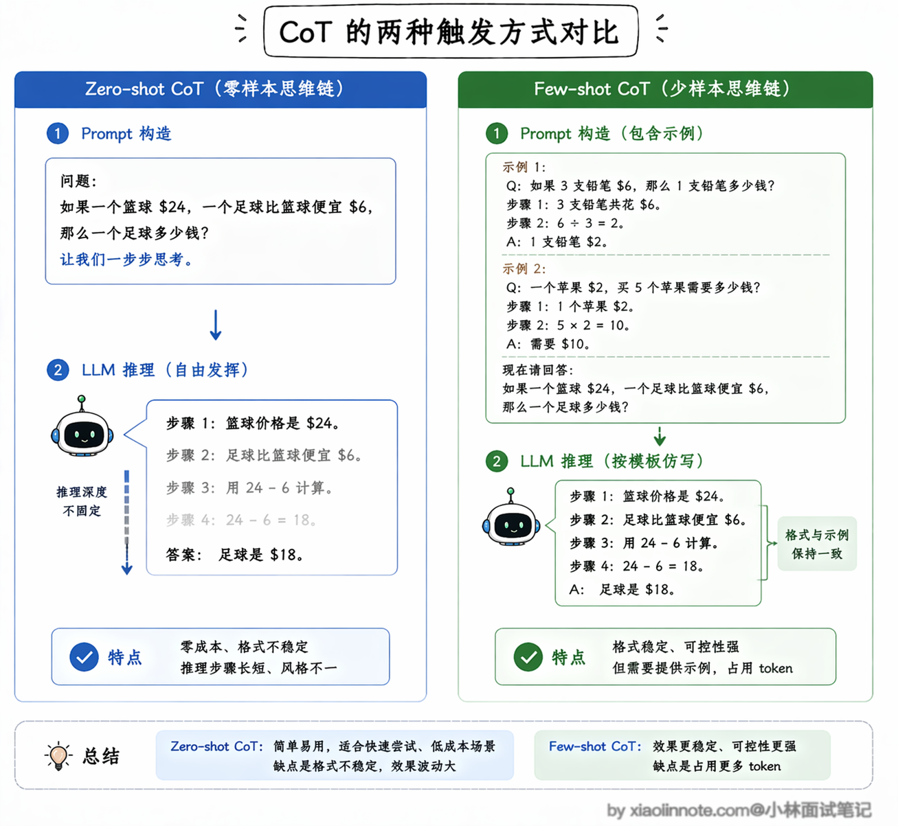
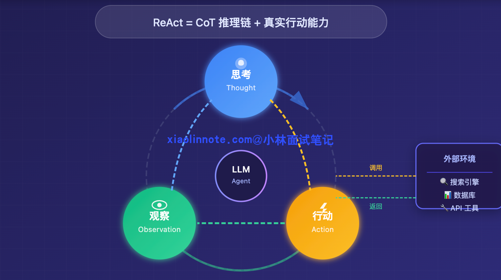
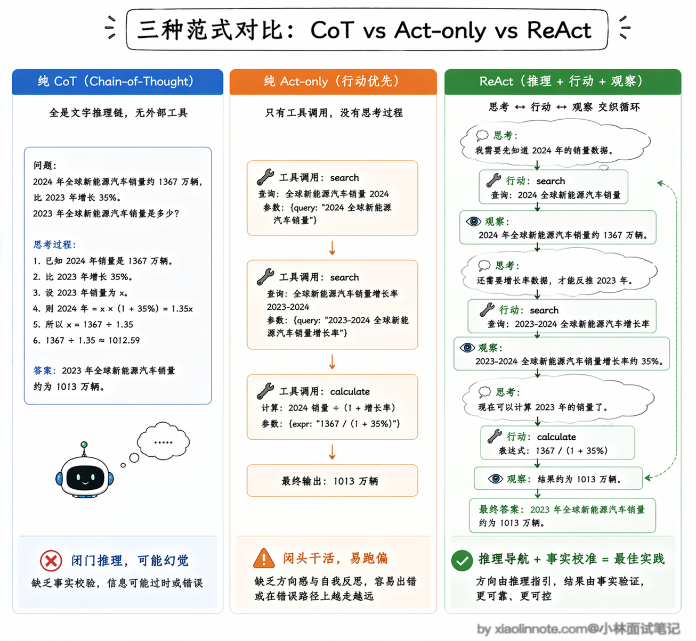
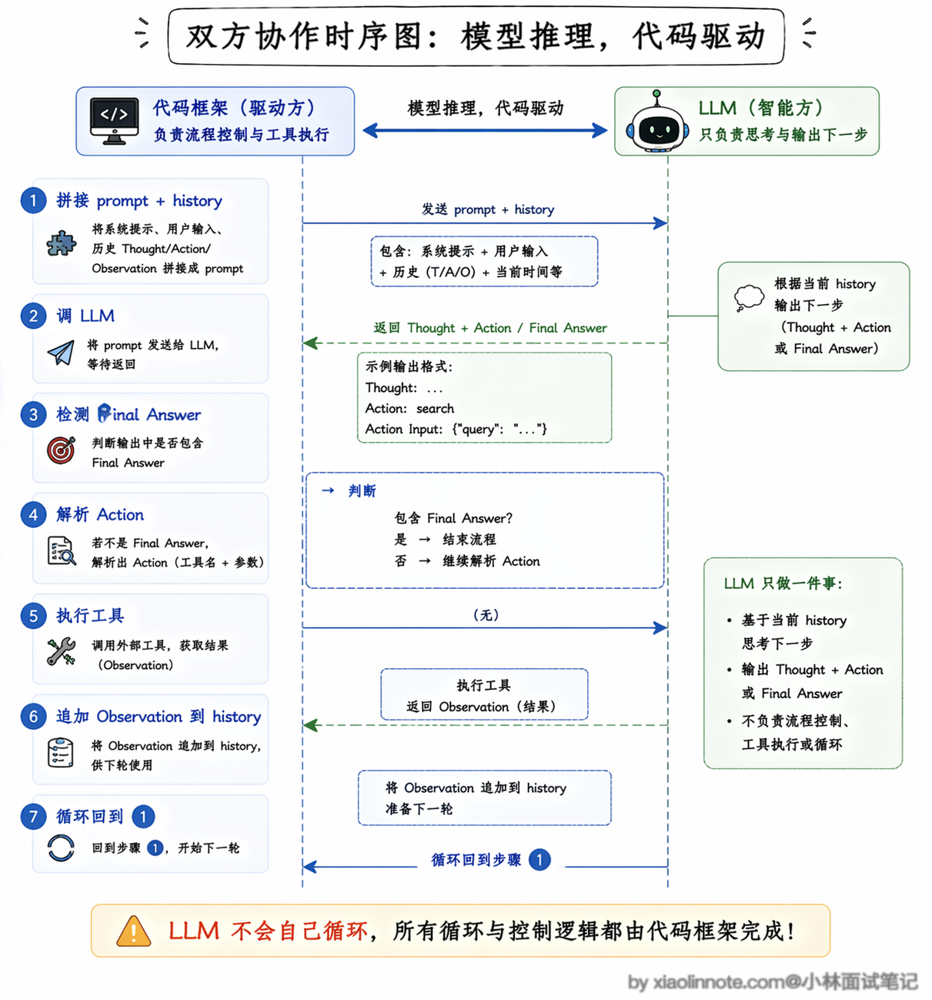
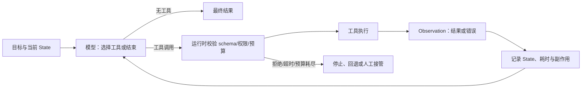
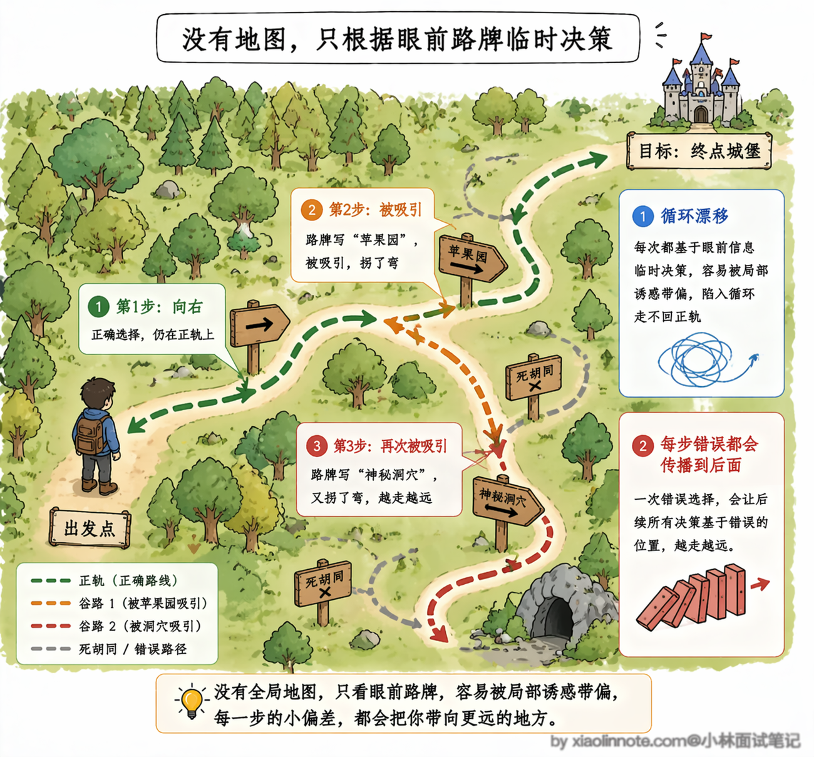
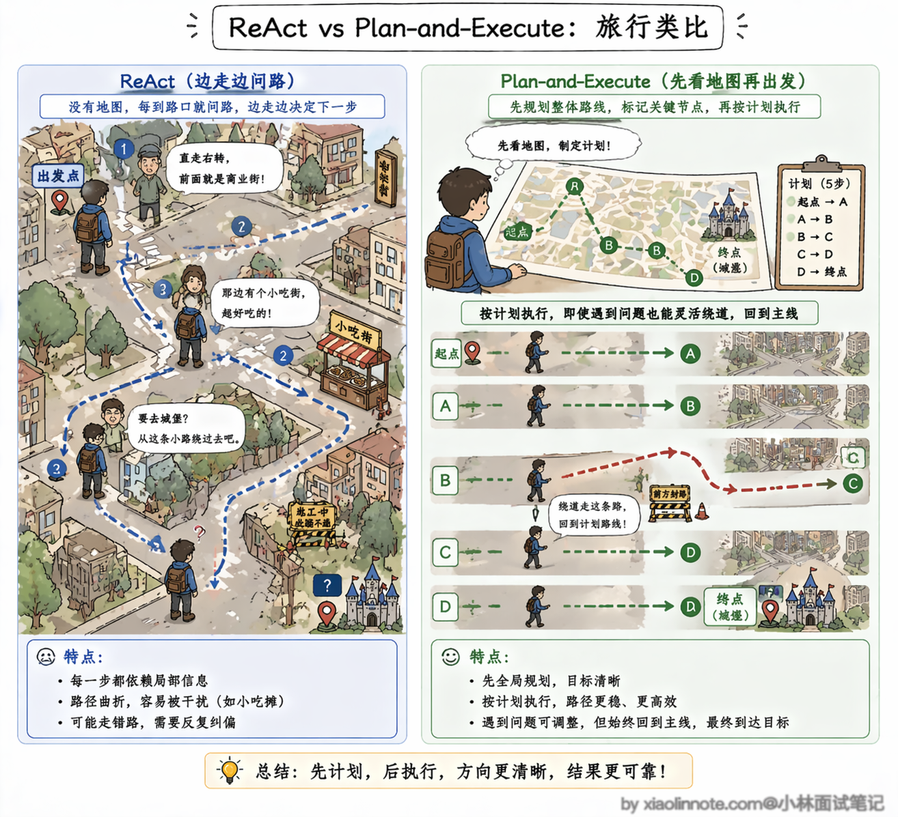
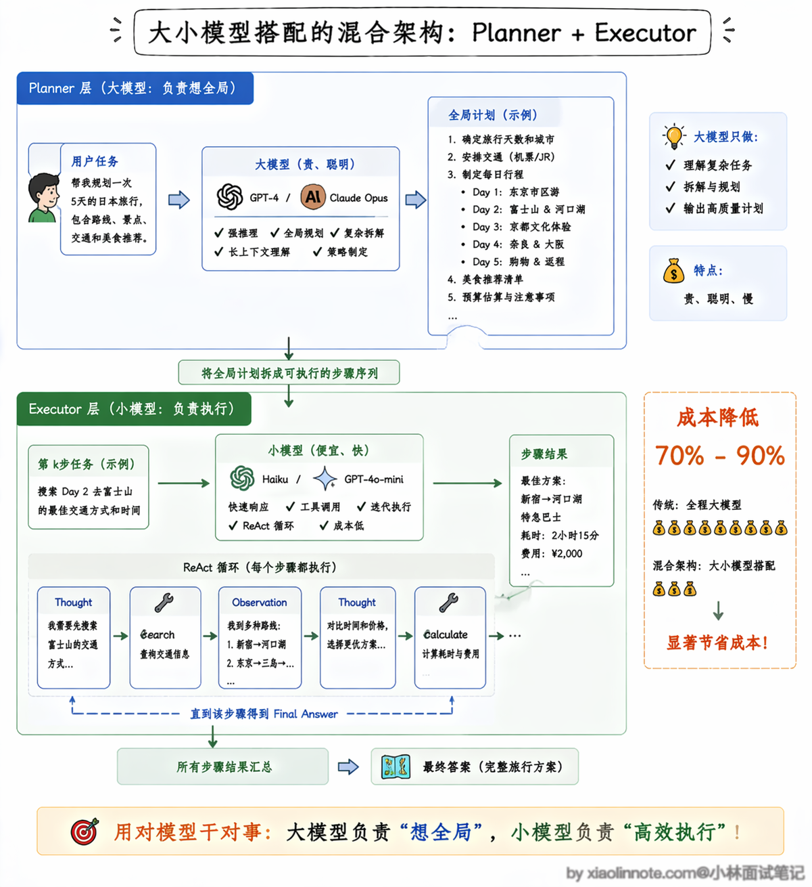

# Agent 推理模式有哪些？ReAct 是啥？具体是怎么实现的？

> 原文：[Agent 推理模式有哪些？ReAct 是啥？具体是怎么实现的？](https://xiaolinnote.com/ai/agent/5_react.html) · 小林面试笔记


👔面试官：你做过 Agent 项目，那你说说 ReAct 是什么，跟普通的 LLM 调用有什么区别？

🙋‍♂️我：ReAct 就是让模型一边思考一边行动，调工具拿结果，然后继续思考……就是一个循环。

👔面试官：好，那你说说这个循环是谁在驱动？是模型自己在转，还是有别的机制？

🙋‍♂️我：应该是……模型自己在循环？它判断完成了就停下来？

👔面试官：不对，模型每次只输出一段文本，它不会自己「循环」。那这个循环到底是怎么跑起来的？

🙋‍♂️我：那可能是框架帮它跑的？解析输出，执行工具，再把结果传回去？

👔面试官：对了，这才是关键。模型每次只做一件事：根据历史输出下一步的 Thought 和 Action。你的代码负责检测输出、执行工具、把 Observation 填回历史，再次调用模型，这才叫 ReAct 的真正实现方式。

理解了「模型负责推理、代码负责驱动」这个分工，ReAct 就不再神秘了。

## 💡 简要回答

Agent 的推理模式我用过几种。

最基础的是直接输出答案；CoT 可以用分步策略帮助模型处理复杂问题，但不应把完整内部推理暴露当成接口要求；ReAct 则把模型决策、工具行动和外部观察交替起来，形成由运行时驱动的循环。

ReAct 是一种常见的教学和工程抽象，但生产系统通常使用结构化 tool call、状态记录和校验器，而不是依赖可见的 Thought 文本。它适合路径需要根据观察结果调整、且风险可控的任务。

## 📝 详细解析

### 什么是推理模式？

要理解「推理模式」这个词，得先说清楚 LLM 面临的一个根本困境。

LLM 的工作原理，是根据你给它的输入，一个 token 一个 token 地往后预测。


你问它一个简单问题，它可以直接说出答案。但如果你问的是一个需要多步推导的问题，比如「A 公司的市值是 B 公司的 1.2 倍，B 公司比 C 公司高 30%，请问 A 和 C 谁更高，差多少？」，LLM 在没有任何辅助的情况下，往往直接给你一个「感觉对」的答案，而这个答案可能是错的。

原因在于，当它「一口气」预测答案时，中间的推导步骤都是隐式的，没有办法强制自己在每一步都做出正确的推断。误差会在中间某个暗处悄悄累积，最终暴露在答案里。

你可以把它类比成心算和笔算的区别。让你心算「123 × 456」，你可能算错；但如果你把每一步都写在纸上，「123 × 6 = 738、123 × 50 = 6150……」，一步一步来，算错的概率就会大大降低。


原因不是“写出来就一定正确”，而是中间步骤可能成为后续生成的显式上下文，帮助模型保持状态。工程上还应加入计算器、规则校验、引用或测试，因为模型自己写出的中间步骤也可能是错的。

「推理模式」存在的根本原因是给多步任务增加分解、反馈或校验机制，从而降低累积错误。CoT、ReAct 是不同的设计抽象；它们不保证正确，也不要求系统暴露模型的完整内部推理。

### CoT是什么？

**CoT**，全称 Chain of Thought（思维链），由 Wei 等人在 2022 年提出，是最早也最简单的解法。

核心想法是让模型先进行分步分解，再给出答案或结构化计划。模型可能输出摘要、计划或最终答案，不应假设某句 prompt 会稳定地产生完整、真实且可审计的内部推理。

如果中间结果被应用保留到上下文，它会影响后续生成；但中间结果可能错误，仍需要工具、规则、证据或测试校验。

当模型输出“第一步/中间结论”并被保留到上下文时，下一步可以引用它；但这并不表示中间结论天然正确。可验证计算应交给工具，证据应绑定来源，理由字段与最终结论也应分开记录。

CoT 有两种触发方式，理解了区别才能在实际项目中选对。

- 第一种叫 Zero-shot CoT：用提示要求模型分解问题或给出简洁步骤；格式、深度和可靠性不稳定，还可能增加输出与泄露风险。
- 第二种叫 Few-shot CoT：提供若干“输入 -> 结构化步骤/结论”的示例，让模型模仿格式。示例可以展示可公开的步骤或验收字段，不必包含完整隐藏推理；示例质量和 token 占用仍需评估。



但基础 CoT/逐步推理本身不提供外部执行语义：它不会自动访问实时数据、执行工具或保证事实正确。

即使模型生成了很长的步骤，也拿不到实时数据，不能替代计算器、数据库和权限校验工具。

如果你问 LLM「现在苹果公司的市值是多少？」，它只能根据训练数据里的知识回答，而那些知识可能已经过时好几个月了。严格说，CoT 框架里不是不能调工具（你可以用 Prompt 让它生成一个「建议调用 API」的文本），但 CoT 的设计本身没有把推理和工具调用交织在一起，接工具需要你自己在外面额外胶水。

如果任务需要“拿数据 -> 执行工具 -> 根据结果继续决策”，就需要一个由 runtime 驱动的工具循环；ReAct 是描述这种交替结构的一种范式，而不是要求把隐藏推理原样呈现给用户。

### ReAct 是什么？

**ReAct** 是 Reasoning and Acting 的缩写，由 Yao 等人在 2022 年提出，核心思路是在 CoT 的推理链里，插入真实的「行动」。

它让 LLM 按照「思考 -> 行动 -> 观察」这个循环来推进任务：先思考当前该怎么做，然后调用一个工具去获取信息或执行操作，把工具返回的结果作为新的「观察」接收回来，再进入下一轮思考，直到 LLM 判断任务完成。



那为什么不直接用纯 CoT 或者纯 Act-only（只行动不推理）呢？这个对比非常关键。

纯 CoT 的问题前面说过了，它只能在脑子里推理，推得再好也拿不到真实数据，遇到需要实时信息的场景就抓瞎，而且纯靠内部推理很容易产生幻觉，因为没有外部事实来校准。

纯 Act-only 可以让模型直接输出工具调用，不输出理由；它可能减少输出，但仍需要状态、校验和观察反馈来决定下一步，遇到复杂任务时可能更难诊断。是否需要可公开的理由字段，应按审计与安全要求设计。

在某些多跳问答论文基准中，加入中间决策和观察的策略优于只输出动作；这类结果依赖模型、提示、工具和数据集，不能直接当成生产收益。若召回了不相关内容，ReAct 也可能沿错误观察继续执行，因此需要相关性校验和回退。

ReAct 的核心是把决策和行动交织在一起：决策字段帮助模型选择下一步，Action 把决定交给工具，Observation 把外部反馈带回状态。它提供闭环结构，但不保证比其他方案更好；需要结合任务成功率、工具错误、成本和延迟评估。



用一个具体例子来感受这个循环。

假设你问 Agent「产品 A 和产品 B 的实时指标谁更高？差多少？」，如果只靠模型内部知识，数据可能过时；用 ReAct，可以先调用查询工具再比较。下面的数值和结果仅为流程示意，不是事实引用：

```
Decision: 需要两项实时指标，先查询产品 A
Action: search
Action Input: 产品 A 指标
Observation: （模拟工具返回）产品 A 指标为 120

Decision: A 的结果已返回，再查询产品 B
Action: search
Action Input: 产品 B 指标
Observation: （模拟工具返回）产品 B 指标为 90

Decision: 两项结果已返回，按同一时间口径计算差值
Final Answer: （示意）产品 A 指标为 120、产品 B 指标为 90，A 更高，差值为 30；真实系统还应附来源、时间和口径
```

每一个 Decision 表示模型提出的下一步，每一个 Action 是它请求的工具调用，每一个 Observation 是运行时填回的结果，最后 Final Answer 是任务完成的终止信号。真实系统还要校验来源、时间、权限和计算口径。

**ReAct 的实现原理**，是通过 prompt 格式来约束 LLM 的输出结构，但这个循环不是 LLM 自己在转，而是由你的代码来驱动的。

LLM 每次只提出下一步的 Decision/Action 或结束信号。你的代码负责校验结构、权限和预算，执行工具，把结果作为 Observation 填回状态，再次调用 LLM。一个简化的提示/协议可以长这样：

```
你是一个 AI 助手，可以使用以下工具：
- search(query): 搜索互联网获取最新信息
- calculator(expr): 计算数学表达式

回答时请严格按照以下格式：
Decision: 简洁说明下一步目标或验收条件（不要输出隐藏思维链）
Action: 工具名称
Action Input: 工具的输入参数
Observation: （此行由系统填入工具返回的结果，你不用写）
... 以上可以重复多轮 ...
Final Answer: 当你确定可以回答时，在这里给出最终答案

问题：产品 A 和产品 B 的实时指标谁更高？差多少？
```

然后你的代码跑一个循环，不断地「调 LLM、检查输出、执行工具、把结果填回去」：

```python
def react_agent(question: str, tools: dict, max_steps: int = 10):
    # 把 ReAct 格式约束和问题拼在一起，作为初始 prompt
    prompt = build_react_prompt(question, tools)
    # 用来存每一轮的对话历史，每次调 LLM 都把完整历史带上
    history = []

    for _ in range(max_steps):
        # 调 LLM，让它输出下一步的 Decision + Action
        # 注意：每次调用都把完整历史拼进去，LLM 才知道之前做了什么
        response = llm.generate(prompt + "\n".join(history))

        if "Final Answer:" in response:
            # LLM 输出了 Final Answer，说明它判断任务完成了
            return response.split("Final Answer:")[-1].strip()

        # 从 LLM 输出里解析出 Action 名称和 Action Input
        # 例如：Action: search，Action Input: 产品 A 指标 -> ("search", "产品 A 指标")
        action, action_input = parse_action(response)

        # 执行对应的工具，拿到真实结果
        if action in tools:
            observation = tools[action](action_input)
        else:
            # 如果 LLM 填了一个不存在的工具名，给它一个错误反馈
            observation = f"工具 {action} 不存在，请选择可用工具"

        # 把这一轮的模型决策/Action 和 Observation 都追加进历史
        # 下次调 LLM 时这些内容会成为它的「记忆」
        history.append(response)
        history.append(f"Observation: {observation}")

    return "超过最大步数，任务未完成"
```

整个 loop 里，模型根据当前状态提出下一步决策，代码框架负责管理上下文、校验并执行工具、记录结果和检测终止条件。是否输出简洁理由由接口与审计需求决定，不应依赖或保存完整隐藏推理。



ReAct 的工程闭环可以画成：



循环由宿主代码驱动，不是模型自行调用自己。工具返回的内容也属于不可信输入：应做长度限制、格式校验、来源记录和提示注入隔离。

需要补充一点：上面描述的是 ReAct 的**经典实现**，靠 prompt 格式约束加文本解析来驱动工具调用。

许多现代模型或 SDK 提供 **Function Calling / Tool Use** 接口，模型可以输出结构化的工具调用；具体 schema、并行调用和错误语义依提供方与版本而异。生产系统通常不再依赖 `Action: xxx` 文本解析。

这让 ReAct 的实现更干净，也更可靠，不容易因为 LLM 输出格式不规范而解析失败。本质上「思考 -> 行动 -> 观察」的循环没变，只是「行动」这一步从解析文本变成了解析结构化 JSON。

不过 ReAct 并不是完美的，它有两个在实际项目中很容易遇到的坑，面试时能主动说出来会非常加分。

第一个坑叫「循环漂移」。你可以把 ReAct 想象成一个没有导航的旅行者，每到一个路口都根据眼前看到的路牌临时决定往哪走。如果路牌上的信息足够清晰，他能顺利到达目的地。

但问题是，路上的「风景」也会吸引他的注意力，走着走着就拐进了一条岔路，忘了自己最初要去哪。ReAct 就是这样，因为每一步都是根据当前历史重新决策的，没有一个全局计划在约束它，跑着跑着就可能偏离最初的目标。

举个实际的例子，你让它「查苹果公司最近三年的营收变化趋势」，它第一步搜了 2024 年的数据，第二步看到搜索结果里提到了苹果和三星的竞争关系，它觉得这个也挺有意思，于是第三步就跑去搜三星的数据了，越走越远，把原来的目标忘了。

步骤越多，历史上下文越长，这种漂移的概率就越大，因为冗长的历史信息里充满了「诱惑」，随时可能把模型的注意力从原始目标上拉走。

第二个坑叫「错误传播」。ReAct 的每一步决策都建立在前面所有步骤的结果之上，如果中间某一步拿到了错误的信息，或者工具返回了一个有误的结果，后面所有的推理都会被这个错误带跑。

更麻烦的是，ReAct 没有内置的「回头检查」机制，它不会停下来反问自己「前面那步的结果靠谱吗」，而是默认前面的 Observation 都是对的，一路往前冲。一旦错误出现在早期步骤，整条推理链后面全部白费。

这两个问题的根源其实是同一个：ReAct 是纯粹的「前向推理」，每一步都是走一步看一步，没有全局规划来约束方向，也没有反思机制来纠正错误。



那怎么解决呢？既然问题出在「没有全局规划」，那最直接的思路就是：先让 LLM 站在全局视角把整个任务想清楚，列出一份完整的执行计划，然后再一步一步去执行。这就是 Plan-and-Execute 模式的核心思路。

### Plan-and-Execute：先规划再执行

你可以把 ReAct 和 Plan-and-Execute 的区别，类比成「边走边问路」和「先看地图再出发」的区别。

ReAct 就像你到了一个陌生城市，没有地图，每到一个路口就问一次路人该往哪走。路人给的方向大致没错，但走着走着你可能被街边的小吃摊吸引，拐进了一条巷子，忘了自己要去哪。Plan-and-Execute 则是你出发之前先打开地图，把从起点到终点的路线全部规划好，标出途中要经过哪几个关键节点，然后按照这个路线一站一站地走。即使中途某条路封了，你也知道大方向在哪，可以绕路但不会迷路。



具体来说，Plan-and-Execute 把整个任务处理流程拆成了两个明确的阶段。

- 第一个阶段是「规划」（Planner）。把用户的任务目标交给 LLM，让它先不急着动手，而是站在全局的角度想清楚：这个任务要分几步完成？每一步具体做什么？步骤之间的依赖关系是什么？然后输出一份结构化的执行计划。这一步的关键是 LLM 只做规划、不执行任何工具调用，全部注意力都集中在「想清楚」这件事上。
- 第二个阶段是「执行」（Executor）。拿着规划好的计划，按顺序一步一步地执行。每一步的执行本身可以用 ReAct 模式来跑，也就是说执行器在处理单个子任务时，仍然可以「思考 -> 行动 -> 观察」地循环。但不同的是，执行器始终知道自己在整体计划中处于哪一步、下一步要做什么，不会像纯 ReAct 那样漫无目的地漂移。

用代码来看会更清楚：

```python
def plan_and_execute(question: str, tools: dict):
    # 第一阶段：让 LLM 生成一份完整的执行计划
    # 注意这里只做规划，不执行任何工具
    plan = llm.generate(f"""
    请为以下任务制定一个分步执行计划：
    任务：{question}
    
    请输出一个编号列表，每一步都要具体、可执行。
    """)
    
    # 解析出计划中的每一步
    steps = parse_plan(plan)
    results = []
    
    # 第二阶段：按计划逐步执行
    for i, step in enumerate(steps):
        # 每一步可以用 ReAct 模式来执行
        # 但执行器知道自己在整体计划中的位置
        step_result = react_executor(
            task=step,
            tools=tools,
            context=f"整体计划共{len(steps)}步，当前是第{i+1}步",
            previous_results=results  # 把前面步骤的结果传进去
        )
        results.append(step_result)
        
        # 关键：执行完一步后，检查是否需要调整后续计划
        # 这就是「动态重规划」机制
        if need_replan(step, step_result, steps[i+1:]):
            remaining_steps = llm.generate(f"""
            原计划：{steps}
            已完成到第{i+1}步，结果：{results}
            剩余步骤是否需要调整？请输出更新后的剩余步骤。
            """)
            steps = steps[:i+1] + parse_plan(remaining_steps)
    
    # 最后汇总所有步骤的结果，生成最终答案
    return llm.generate(f"根据以下执行结果回答问题：{results}")
```

这段代码里有一个非常关键的设计，就是「动态重规划」。计划不是定死的，而是活的。每执行完一步，系统都会检查一下：这一步的实际结果和预期是否一致？

如果某一步的结果出乎意料，比如你原计划第二步要查某个 API 但发现这个 API 已经下线了，系统会把已有的结果和剩余的步骤重新交给 Planner，让它根据新情况调整后续计划。这就像你开车导航时，前方突然封路了，导航会自动重新规划一条新路线，而不是傻傻地让你掉头回起点。

那 Plan-and-Execute 和 ReAct 分别适合什么场景呢？

ReAct 的优势在于灵活，每一步都能根据最新情况做决策，特别适合那些任务边界不太明确、需要探索性地获取信息的场景，比如开放式的问答、信息搜索这类任务。它的代价是容易漂移，而且每一步都要把完整历史带上调 LLM，步骤多了 token 消耗会线性增长。

Plan-and-Execute 的优势在于有全局视野，不容易跑偏，特别适合那些目标明确、需要多步骤协作完成的复杂任务，比如深度研究、长文写作、多工具协同的数据分析。它的代价是初始规划本身就需要一次 LLM 调用，如果任务很简单（一两步就能搞定），这个规划步骤反而是多余的开销。

实际工程中，两者经常被混合使用。一个常见的做法是：用 Plan-and-Execute 做全局规划，用 ReAct 做每一步的执行。

规划阶段可以用更强的模型，执行阶段可以用更快或更便宜的模型，但这不是质量和成本的保证。模型路由应以工具调用成功率、任务完成率、延迟和每任务成本的实测对比为依据；规划调用、摘要和重规划本身也会增加开销。



### 工程排错

如果 ReAct 反复调用同一工具，先看目标是否仍在 State 中、工具结果是否包含可判断的错误、是否缺少去重/停止条件；如果结果错误，区分工具数据错误、检索不相关和模型解释错误；如果延迟或成本失控，统计每轮 token、工具耗时和重试次数，而不是只看最终答案。

## 🎯 面试总结

回答 ReAct 相关问题，最容易踩的坑就是开头说的那个误区：以为模型自己在「循环」。

面试官最想听到的核心点是两个：第一，ReAct 的本质是「思考 -> 行动 -> 观察」的循环，推理过程显式化，又能动态调用外部工具，解决了 CoT 只能纯文字推理的局限；第二，这个循环是由你的代码框架驱动的，模型每次只输出 Thought + Action，你的代码负责解析、执行工具、把 Observation 填回历史，再把完整历史传给模型进入下一轮。

把这两点说清楚之后，主动提一下 ReAct 的两个实战局限（循环漂移和错误传播），再顺带说一下 Plan-and-Execute 是怎么通过「先规划再执行」来解决 ReAct 的漂移问题的，以及实际项目中两者经常混合使用（规划用大模型、执行用小模型），整个回答就会很有深度。

---
