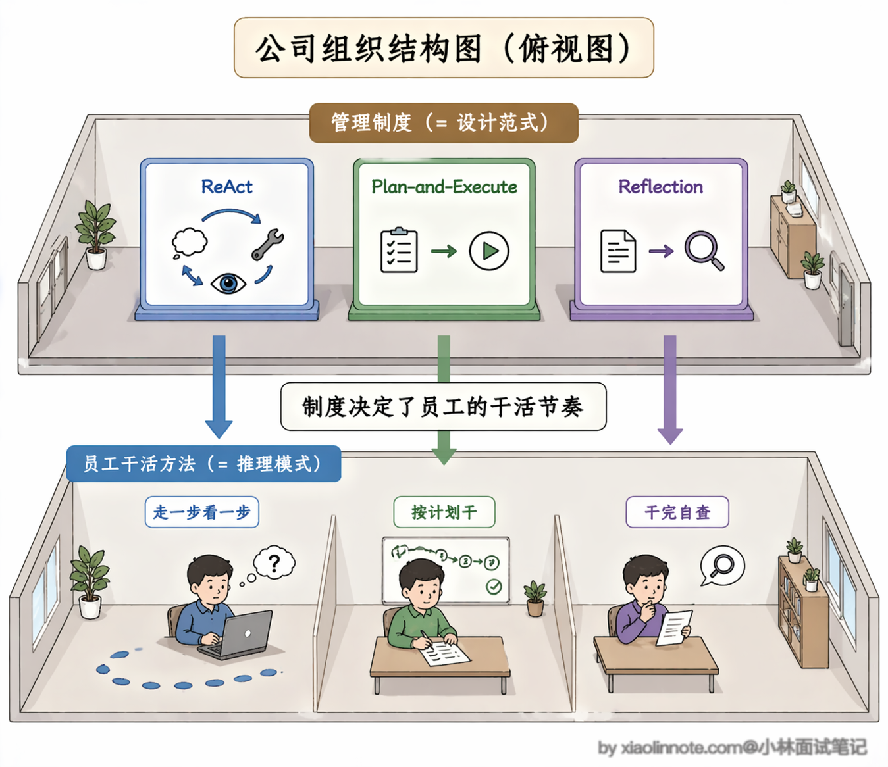
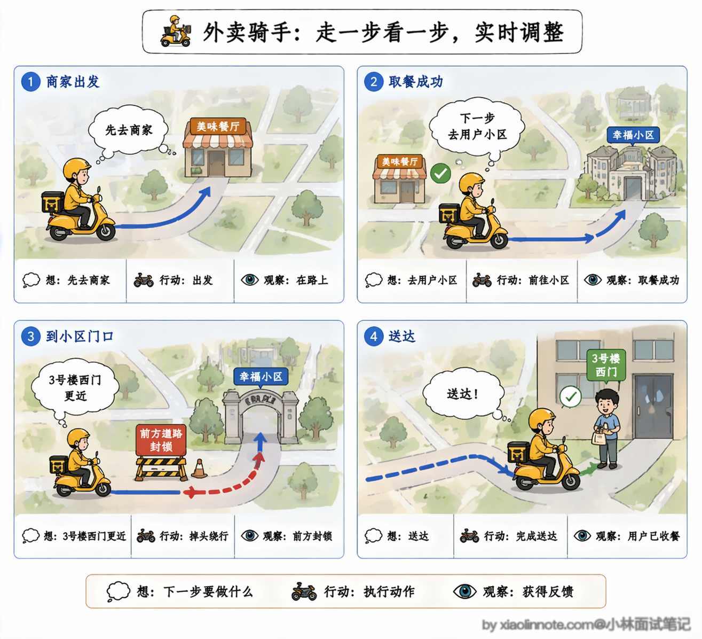
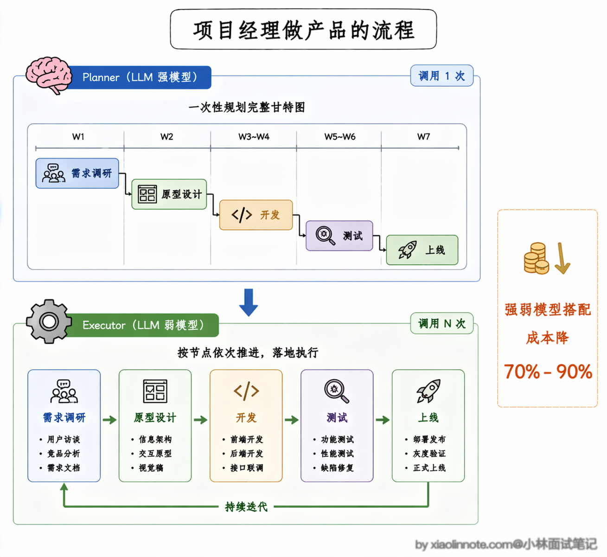
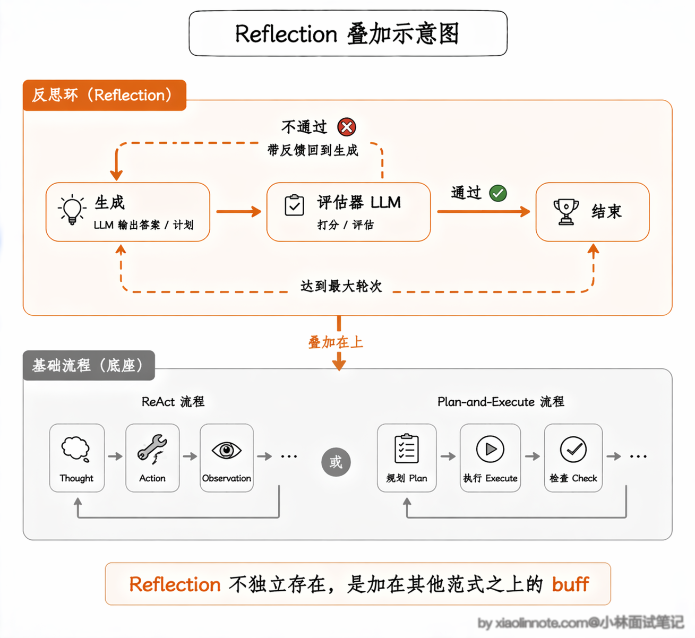
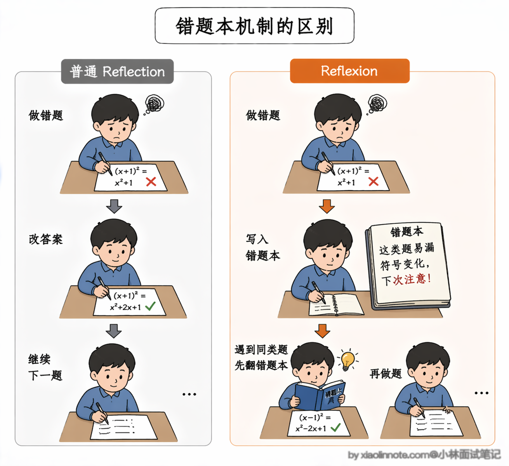
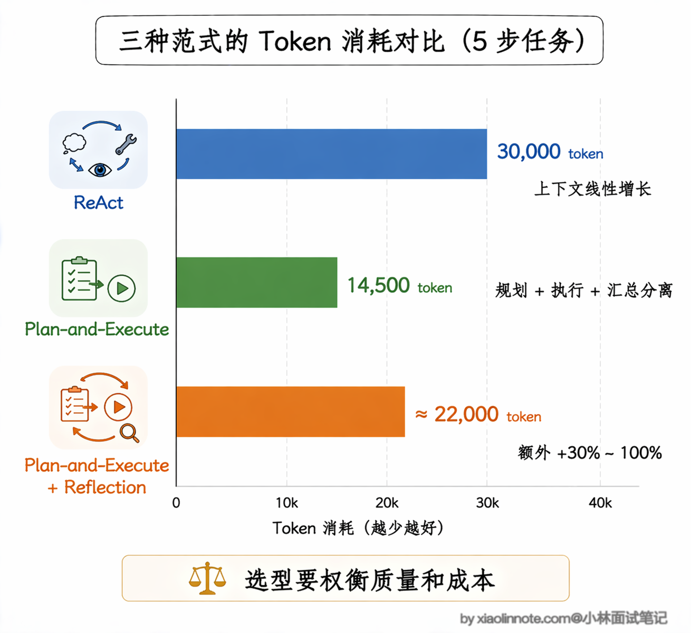
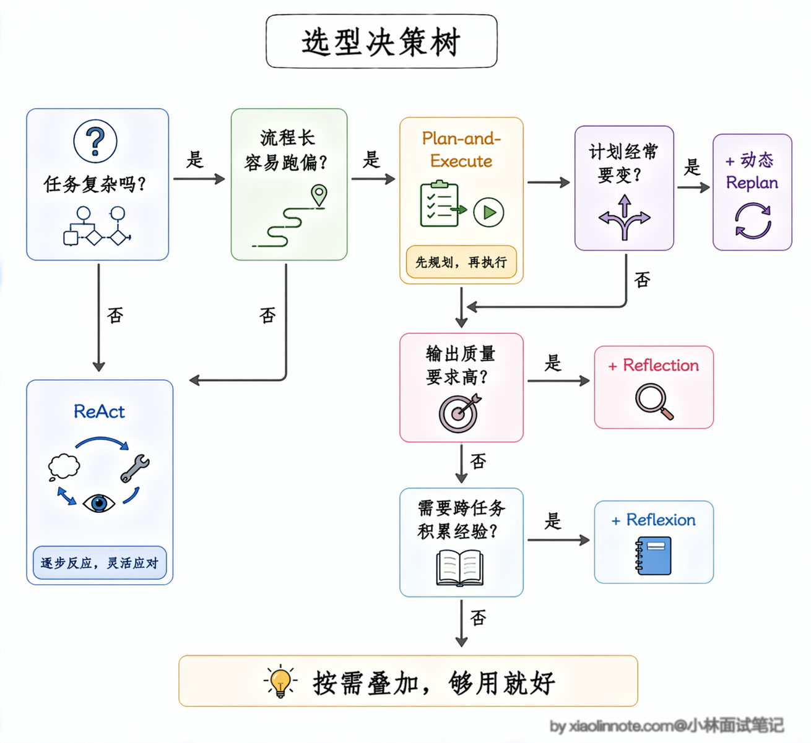
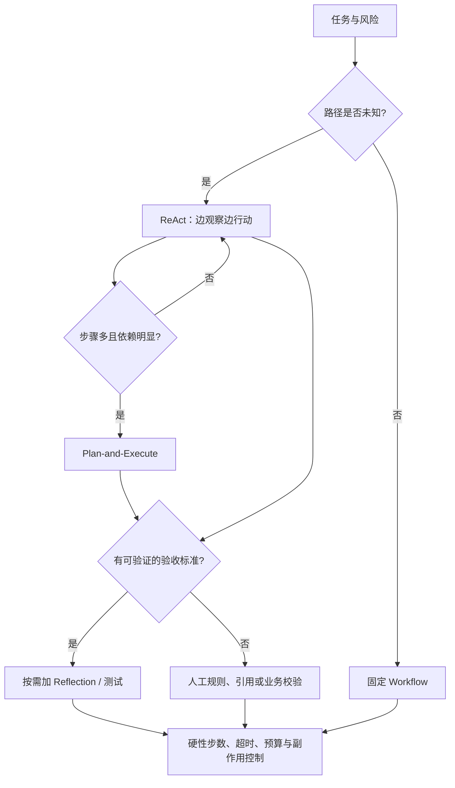

# ReAct、Plan-and-Execute、Reflection 三种范式有什么核心区别？实际项目中该如何选型？

> 原文：[ReAct、Plan-and-Execute、Reflection 三种范式有什么核心区别？实际项目中该如何选型？](https://xiaolinnote.com/ai/agent/6_three_patterns.html) · 小林面试笔记

👔面试官：你来说说 ReAct、Plan-and-Execute、Reflection 三种范式的区别？

🙋‍♂️我：ReAct 是边想边执行，Plan-and-Execute 是先规划再执行，Reflection 是……执行完之后反思？

👔面试官：Reflection 的定位你说对了，但它和另外两个是同一个层面的东西吗？你有没有想过它为什么单独列出来？

🙋‍♂️我：可能是因为它是一种独立的流程，和 ReAct、Plan-and-Execute 并列？

👔面试官：不对，Reflection 不是独立流程，它是给另外两种范式加的「检查 buff」，本身不能单独成立。你有没有考虑过这三者实际上是在解决不同层次的问题？

🙋‍♂️我：那 ReAct 解决的是单步灵活性的问题，Plan-and-Execute 解决的是长任务跑偏的问题……Reflection 解决的是输出质量不够好的问题？

👔面试官：对了，这才是核心。三者解决的问题层次不同，选型时要看任务复杂度、流程确定性、输出质量要求三个维度，而不是简单地说谁比谁好。

搞清楚「三者各自在解决什么问题」这个视角，选型就不会再纠结了。

## 💡 简要回答

我理解这三者是常见的 Agent 设计抽象，解决的层次不同：ReAct 组织决策与行动的交替，Plan-and-Execute 组织全局计划与执行，Reflection 组织结果评估与修正。

ReAct 是边想边干，走一步看一步，单步迭代实时调整，灵活度最高；Plan-and-Execute 是先想全再干，先定完整计划再分步执行，适合长流程复杂任务，不容易跑偏；Reflection 不是独立的完整流程，而是给前两者加的「检查修正 buff」，用来提升输出质量。

实际选型就看任务复杂度、路径不确定性、质量风险、延迟和预算；可以从最小的闭环开始，再用实测数据决定是否增加计划、重规划或反思。

## 📝 详细解析

很多同学容易把这三个概念搞混，要么觉得它们是完全割裂的，要么只会背概念说不出落地的区别，今天咱们就掰开揉碎了，用人话讲透每一个，保证你看完既能懂原理，又能直接用到面试和项目里。

在正式对比之前，先给大家把两个贯穿始终的概念讲透，再也不会看懵：

**设计范式**说白了就是你搭 Agent 的「顶层做事流程框架」，就像你开一家店，是走一步看一步的灵活夫妻店模式，还是先定好全流程标准的连锁模式，它定的是整个系统「从头到尾按什么大逻辑跑」。**推理模式**则是 Agent 在每一步干活的时候「脑子里具体是怎么思考的」，就像店里的员工接了活，是一步一步稳扎稳打，还是先想几个方案选最优，它是底层的思考逻辑，决定了每一步的决策怎么来。

这俩的关系特别好理解：**设计范式是公司的管理制度，推理模式是员工的干活方法**，两者可以组合，不是一一对应。接下来咱们就一个个拆解，把每一种范式的核心逻辑、和其他两种的区别、适用场景讲清楚。

### 一、基础款：ReAct 单步迭代范式

ReAct 是所有 Agent 范式的「祖宗」，它的本质就是「**思考→行动→观察→再思考**」的循环，走一步看一步，每一步的行动，都完全基于上一步的结果实时调整，没有提前定死的完整计划。

我再用大家最熟悉的生活化例子强化记忆：ReAct 就像外卖骑手小哥，接了「把餐送到用户手里」的目标，不会提前把全程每一步都定死，而是实时根据情况做决策。

他先想「我要先去商家取餐」，于是骑车到商家，顺利取到了餐。接着想「下一步要去用户的小区」，于是开导航骑过去，到了小区门口。然后想「用户在 3 号楼，走西门更近」，于是骑到西门，到了用户楼下。最后确认餐已经送到，给用户发消息完成交付。

每一步的决策都是基于上一步的实际情况做的，中途如果发现路封了，他会立刻改路线，不会死守原来的计划。

ReAct 和另外两种范式最核心的区别，在于它没有「提前做完整规划」的环节，规划和执行混在一起，走一步看一步；而 Plan-and-Execute 是把两者完全拆开，先做完整规划再统一执行。和 Reflection 相比，ReAct 的循环里没有「专门的自我检查环节」，只有行动后的结果观察，不会停下来复盘这一步做对没有。

ReAct 最大的优势是实现简单、灵活度高、逻辑透明，出了问题好排查，新手入门零门槛。但它的短板也很明显：遇到长流程、多步骤的复杂任务，很容易走着走着就跑偏，忘了最初的目标，也容易在某一步陷入无效循环。所以它更适合流程不固定、复杂度适中的任务，比如日常信息搜索、简单问答助手、客服机器人，也是新手入门的首选。

### 二、复杂任务款：Plan-and-Execute 规划执行范式

Plan-and-Execute 是针对 ReAct「长任务容易跑偏」的痛点，做的针对性优化，我一句话给你讲透它和 ReAct 的核心区别：

> ReAct 是「走一步看一步，边想边干」；Plan-and-Execute 是「先把完整计划定好，再按计划一步步干」，完全是两种做事思路。

对应到推理模式上，它把 ReAct 里混在一起的「规划推理」和「执行推理」给完全拆开了（行话叫解耦，说白了就是两件事分开干，各管各的）：专门用一个 LLM 负责「做规划」，把大目标拆成一步一步的执行清单；再用另一个 LLM（或者模块）负责「按清单执行」，执行完了再统一汇总。

还是用生活化的例子，它就像公司里的项目经理，接了「做一个新产品」的大目标，不会上来就直接写代码，而是先做完整的项目规划。

先做用户需求调研，明确要做什么，再出产品原型设计，定好功能细节，然后交给开发写代码实现功能，接着测试团队做全流程功能验收，最后上线发布，交付最终结果。先把完整的执行步骤全定好，再把每个步骤分给对应的模块去执行，全程按计划推进，不会中途随便乱改方向。

这里有一个实际项目中常用的策略：既然规划和执行是两个独立模块，就可以用不同模型。但“强模型规划”是否划算，要用计划有效率、工具成功率、延迟和成本验证。

执行阶段可以尝试更快或更便宜的模型，但不能默认“完全够用”或质量不受影响。规划、摘要、重规划和失败重试也会增加调用；最终应按自己的任务集测量完成率、延迟、token 和每任务成本。

Plan-and-Execute 和 ReAct 最核心的区别，就是把「规划」和「执行」完全解耦了：先有完整的执行计划，再分步执行，全程不会偏离最初的目标，而不是像 ReAct 那样边规划边执行、随时可能调整方向。和 Reflection 相比，它的核心是「先规划再执行」，没有强制的自我检查环节，但两者可以叠加使用。

优势正好补了 ReAct 的短板：整体结构清晰，执行链路可控，复杂度很高的长流程任务也不容易跑偏，还方便做并行优化，大幅降低整体耗时。

Plan-and-Execute 可能减少长任务漂移，但初始计划也可能错，且重规划会增加开销。只有在子任务真正独立、工具支持并发且副作用可控时，并行才可能缩短关键路径。

代价是灵活度不如 ReAct，遇到计划外的情况容易卡住；实现也更复杂，需要分别维护规划模块和执行模块，token 消耗也会增加。适合流程长、复杂度高的任务，比如写完整的竞品分析报告、全流程的项目开发、多维度的行业调研。

### 三、质量增强款：Reflection 反思迭代范式

这里必须给同学讲透一个最关键的点：**Reflection 不是一套独立的完整流程，而是给 ReAct、Plan-and-Execute 加的「锦上添花的 buff」**，它不改变原本的做事流程，只是在原本的基础上，加了一层「自我检查、自我修正」的环节。

还是用最熟悉的考试例子，你一下就能看懂三者的关系。ReAct 就像你一道题一道题挨着做，做一道过一道，不回头看。Plan-and-Execute 是你先把整张卷子的做题顺序、时间分配定好，再按计划做题。Reflection 则是你做完一道题（或者整张卷子），回头再检查一遍，看看有没有算错数、有没有看错题，发现错了马上改，改完再交卷。

它的核心循环，就是在原本的范式基础上，加了「**生成→评估→改进**」的闭环，专门设置了一个独立的检查环节，判断当前的输出有没有问题、达不达标，不达标就重试或调整策略，直到符合要求为止。

Reflection 和前两者最本质的区别，是它不是一套独立的做事流程，而是可以叠加在 ReAct 或 Plan-and-Execute 之上的增强机制，互不冲突。前两者的核心是「把事做完」，Reflection 的核心是「把事做好」，专门解决输出质量不达标、有事实错误、逻辑漏洞的问题。

优势是增加了额外的评估机会，代价是至少多一次模型或规则检查；质量不一定自动提升，评估器也可能误判。它适合有明确验收标准、可通过测试或引用检查的场景，而不是“凡是高风险都交给模型自审”。

### 进阶：动态 Replan 和 Reflexion

讲完了三个基础范式，再补充两个在实际项目中经常会遇到的进阶机制，面试时能说出来会很加分。

第一个是 **动态 Replan**，它解决的是 Plan-and-Execute 的一个核心痛点：计划定死了，中途遇到意外怎么办？

比如你规划了五步来写竞品分析报告，执行到第三步发现某个竞品已经被收购了，原来的分析框架需要调整，但计划已经定好了，后面的步骤还是按老计划跑，输出的报告就会有问题。

动态 Replan 的做法是在每个步骤执行完之后，把当前结果和剩余计划一起交给规划模块，让它判断「原来的计划还合理吗，需不需要调整」。如果需要，就生成一份新的剩余步骤计划，替换掉原来的。

这样既保留了 Plan-and-Execute「先规划再执行」的结构优势，又不会因为计划太僵硬而在意外情况下翻车。代价是每步都多了一次「重新评估计划」的 LLM 调用，token 消耗会增加。

第二个是 **Reflexion**，它把 Reflection 的「自我反思」推到了更深的层次。普通的 Reflection 是「做完了检查一遍、发现问题就重做」，有点像考试做完检查一遍。

Reflexion 在这个基础上多做了一件关键的事：它不仅检查输出对不对，还会把每次失败的原因总结成一段「经验教训」，存进记忆里，下次再遇到类似任务时，这段教训会作为上下文传给 LLM，让它避免重蹈覆辙。

这个机制有点像你做错了一道数学题，不只是改答案，还会记录失败原因和适用范围；写入长期存储前要考虑租户隔离、过期、删除和错误经验污染。

论文中的 Reflexion 结果来自特定模型、代码基准和实验设置，不能外推成固定的生产增益。它更适合有可执行测试或明确反馈信号的任务；没有可靠评估器时，反思可能只是重复生成。

背后的原因也好理解，代码生成天然适合 Reflexion，因为代码可以运行、可以测试，执行结果就是最直接的反馈信号。Agent 写完代码跑一遍测试，没通过的话就分析是哪里出了问题，把「这个 API 的参数顺序搞反了」或者「边界条件没处理」这样的具体教训记下来，下次重试时带着这些教训去改，成功率自然就高了。这种「verbal reinforcement learning」（语言强化学习）的思路，让 Agent 不需要梯度更新就能从错误中学习，非常适合在推理阶段提升质量。

### token 消耗对比

三种范式在 token 消耗上的差异是选型时必须考虑的现实因素，咱们用一个具体的例子来直观感受一下。

假设有一个需要 5 步工具调用的任务，每步产生的历史内容量不同。下面的数字只用于说明“完整历史会累积、摘要会改变输入量”，不是通用性能结论。

用 ReAct 来跑，如果每次调 LLM 都把完整历史带上，输入量会随步骤累积；真实大小取决于工具返回、摘要、上下文裁剪和模型接口，不应直接用一个固定总量估算成本。

换成 Plan-and-Execute，消耗集中在规划阶段和汇总阶段这两个「大头」上。

Plan-and-Execute 可以只向执行器传当前步骤、必要结果和结构化状态，从而减少重复上下文；但规划、摘要、汇总和重规划会增加额外调用，也可能因计划不佳而重做。是否更省 token 或费用必须在相同任务集、模型和并发条件下测量。

加了 Reflection 之后，每个被评估的节点至少多一次检查调用；总开销取决于评估输入、失败率和重试轮数。Reflection 不是越多越好，应设置硬上限，并用验收通过率、改动收益和每任务成本决定轮数。

实际项目中的建议是：先用 ReAct 快速验证效果，确认任务能跑通之后，再根据 token 消耗和延迟的实际数据，决定要不要切换到 Plan-and-Execute 或者叠加 Reflection。不要一上来就选最复杂的方案，先跑起来再优化。

### 选型指南

讲完了三者和进阶机制，选型的逻辑其实很清晰。

任务不复杂、流程不固定、需要实时调整的，直接用 **ReAct**，够用就好，别搞复杂的。任务很长、容易跑偏、需要整体结构清晰的，上 **Plan-and-Execute**，先把计划定清楚再执行。如果执行过程中经常遇到意外需要调整计划，就加上动态 Replan。输出要求高、不能出错的，在前两者基础上叠加 **Reflection** 做自我检查。如果还需要跨任务积累经验、避免重复犯错，就用 **Reflexion** 把失败教训沉淀下来。

实际项目中还有一种非常常见的混合用法：规划阶段用 Plan-and-Execute 的思路定好全局计划，每一步的执行用 ReAct 的循环来处理（因为单步执行可能也需要多轮工具调用），最后对整体输出做一次 Reflection 检查质量。这种三层嵌套的架构听起来复杂，但其实在 LangGraph 这类框架里实现起来很自然，很多生产级的 Agent 系统都是这么搭的。

最容易踩的坑是学了这些范式就全堆在一起，又要规划、又要反思、又要 Replan、又要积累经验，结果系统又复杂又慢，还容易出奇怪的 bug。工程开发永远是「够用就好」，先把最基础的 ReAct 玩明白，再根据实际需求往上加，别为了炫技搞过度工程化。

可以把选型落到三个可测量的问题：路径是否未知、是否需要全局依赖、是否有可执行的验收标准。没有验收标准时，Reflection 很难证明自己带来收益；有写操作时，任何范式都要额外加权限、幂等、人工确认和审计，而不是只增加一次模型检查。

## 🎯 面试总结

回答这道题最关键的一步，是先把 Reflection 的定位说清楚：它不是一套独立流程，而是可以叠加在 ReAct 或 Plan-and-Execute 之上的「质量增强 buff」，这一点很多人会搞错。

说完定位，再按维度对比三者的核心区别：ReAct 边想边干、灵活度最高但长任务容易跑偏；Plan-and-Execute 先规划再执行、结构清晰但灵活度不足；Reflection 专门解决输出质量问题，代价是增加 token 消耗和延迟。

如果面试官追问进阶内容，可以展开讲动态 Replan 是怎么解决「计划太僵硬」的问题，Reflexion 是怎么通过「错题本」机制实现跨任务经验积累的，再补充一下三种范式的 token 消耗差异。

最后给出选型口诀：任务简单用 ReAct，流程长且复杂用 Plan-and-Execute，输出要求高再加 Reflection，顺带提一句「别过度工程化、够用就好」，面试官会觉得你有实际项目经验，不是只会背概念。

---
