# 请你介绍一下 AI Agent 的记忆机制，并说明在实际开发中应该如何设计记忆模块？

> 原文：[请你介绍一下 AI Agent 的记忆机制，并说明在实际开发中应该如何设计记忆模块？](https://xiaolinnote.com/ai/agent/8_memory.html) · 小林面试笔记

👔面试官：你来讲讲 Agent 的记忆机制，分哪几种，各自有什么作用？

🙋‍♂️我：有短期记忆和长期记忆……短期就是当前对话历史，长期就是存到数据库里的内容？

👔面试官：分类方向对，但不够完整。短期记忆和长期记忆之外还有两种，你知道是哪两种吗？

🙋‍♂️我：还有……缓存？或者工具调用的结果？

👔面试官：不是，另外两种是感知记忆和实体记忆。感知记忆是当前输入的原始内容，实体记忆是从对话里提炼出来的结构化事实。那长期记忆一般用什么技术来实现？

🙋‍♂️我：向量数据库？用 embedding 存起来做语义检索？

👔面试官：对，但光会存还不够。你有没有想过记忆模块真正的难点在哪里：存什么内容值得存、用什么介质存、什么时机取出来用，这三个问题才是设计记忆系统的核心。

把四种记忆类型和「存什么、怎么存、什么时候取」这三个工程问题答全，才是一个完整的记忆模块方案。

## 💡 简要回答

Agent 需要外部状态才能在多步任务中保持连续性；跨任务记忆是可选能力，必须配合数据治理。

这里用四层作为学习上的分类：感知记忆（当前输入）、短期上下文/任务 State、长期存储和实体记忆。它不是统一协议或心理学标准；长期存储也不一定使用向量检索。

实际设计时要解决三个核心问题：存什么、怎么存、什么时候取出来用，根据信息类型选合适的存储方式，再搭配主动检索和按需检索两种策略使用。

## 📝 详细解析

### 没有记忆的 Agent 有多不好用

要搞清楚记忆机制为什么重要，得先感受一下「没有记忆」的 Agent 到底有多难用。

你今天告诉 Agent「我喜欢代码风格简洁、变量命名用英文、不要过度注释」，它帮你完成了今天的任务。明天你重新打开对话，让它帮你写一个新功能，它输出的代码风格完全和昨天说好的不一样，中文注释一堆，变量名也很啰嗦。

你很困惑，但对 Agent 来说，昨天的对话压根不存在，每次对话都是全新的开始，之前达成的所有约定都消失了。

这还只是「偏好记忆」的问题。更严重的是「任务状态」的问题：Agent 在执行一个多步任务的过程中，如果没有短期记忆来维持状态，它就不知道自己上一步做了什么、当前处于哪个阶段、已经收集到了哪些信息。

你让它「先查资料，再整理成报告」，没有记忆的话，整理报告这一步根本不知道查到了什么。

记忆，是 Agent 从「单次问答工具」变成「真正助手」的关键分水岭。有了记忆，它才能积累对你的了解，才能在多步任务中保持连贯，才能跨任务沉淀知识。

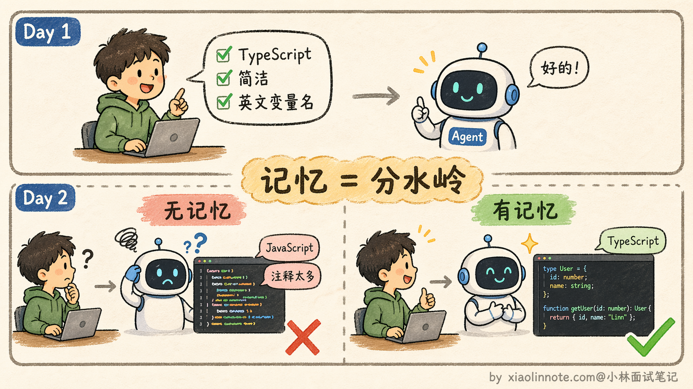

### 四种记忆类型（从最短暂到最持久）

记忆机制其实可以对应到人类的记忆系统来理解，从最短暂到最持久，分四个层次。这里要提醒一句：下面的「感知 / 短期 / 长期 / 实体」是工程上方便把记忆管理拆成四档的一种划分，借用了认知科学的一些词（情节、语义、程序），但和心理学严格意义上的分类不完全一致，目的是帮你建立直觉，不是学术标准。

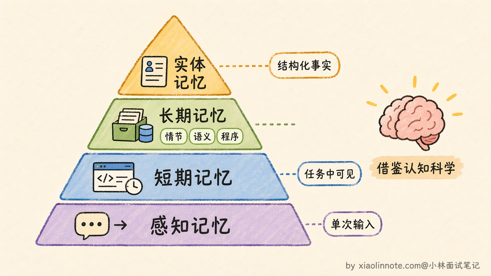

**第一层：感知记忆（Sensory Memory）**

这是最短暂的一层，就是「当前这次调用的原始输入」，用户发来的这条消息、上传的截图、传入的文档。它的生命周期只有一次调用，处理完就消失，不会主动保留。类比到人的话，就是你刚听到的一句话，如果没有主动去记，几秒后就忘了。感知记忆就是这个「刚进来还没处理」的原始感知，它存在的意义是给模型提供一个「入口」来接收外部信息。

**第二层：短期记忆（Short-term Memory）**

这是当前任务传给模型的 `messages` 和结构化 State，可能包括用户输入、模型输出、工具结果和进度。运行时可以裁剪、摘要或持久化检查点；任务结束后是否清理取决于审计、恢复和保留策略。工作台有上下文限制，不能把所有历史永久直接塞进 prompt。

**第三层：长期记忆（Long-term Memory）**

这是跨任务保留的信息，存在向量库、关系库、Key-Value 或事件存储中，并受租户、权限、保留和删除策略约束。非结构化经验适合语义检索，精确偏好、状态和权限字段更适合结构化查询；两者常常组合使用。

长期记忆其实不是铁板一块，它还可以细分成三种子类型，每种存的东西和用途都不一样。

第一种是「情节记忆」（Episodic Memory），存的是具体的事件经历。比如「上周二用户让我写了一个 Python 爬虫，中间遇到了反爬问题，最后用 Selenium 解决了」，这是一段完整的任务经历，包含了时间、场景、过程和结果。情节记忆的价值在于，当 Agent 遇到类似的新任务时，可以检索出历史上的相似经历，参考上次是怎么解决的，避免重复踩坑。

第二种是「语义记忆」（Semantic Memory），存的是从多次经历中提炼出来的通用知识和规律。比如经历了好几次反爬问题之后，Agent 沉淀出一条规律：「当目标网站有 JavaScript 动态渲染时，requests 库抓不到内容，应该优先考虑 Selenium 或 Playwright」。这不再是某一次具体的事件记录，而是跨多次经验总结出来的抽象知识。语义记忆的信息密度更高，检索时也更容易命中，因为它直接存储的就是结论而不是过程。

第三种是「程序记忆」（Procedural Memory），存的是怎么做某件事的操作流程。比如「部署一个 Flask 应用的标准步骤：创建虚拟环境 -> 安装依赖 -> 配置 gunicorn -> 设置 nginx 反向代理 -> 启动服务」，这是一套可以直接复用的操作 SOP。程序记忆在处理重复性任务时特别有用，Agent 不需要每次都从头推理，直接调出对应的 SOP 执行就行，既快又稳。

三种子类型各有侧重，实际项目中通常会混合使用。情节记忆提供具体的参考案例，语义记忆提供抽象的知识规律，程序记忆提供可复用的操作流程，三者配合起来才能让 Agent 的长期记忆真正好用。

**第四层：实体记忆（Entity Memory）**

这层比长期记忆更精炼，它不是存原文，而是把对话中出现的关键实体和事实主动提取出来，存成结构化字段。比如「用户偏好 Python」「客户预算是 5 万」「项目截止日是 3 月底」，这些是从对话里提炼出来的「结论」，而不是原始对话本身。类比到人的话，就像医生的病历卡，不是把问诊录音存起来，而是结构化地记录「主诉：头痛三天；诊断：偏头痛；用药：布洛芬」。信息密度高，查询快，而且不受原始表述方式影响。

四层记忆横向对比：

| 类型 | 载体 | 容量 | 生命周期 | 访问方式 |
| --- | --- | --- | --- | --- |
| 感知记忆 | 当次输入 | 极小 | 单次调用 | 即时访问 |
| 短期记忆 | context window | 受 token 限制 | 一次任务 | 直接读取 |
| 长期记忆 | 向量/关系/键值/事件存储 | 受容量、保留和治理策略限制 | 可持久 | 语义或结构化查询 |
| 实体记忆 | 结构化存储 | 受容量和治理策略限制 | 可持久 | 精确查询 |

### 实际设计记忆模块的三个核心问题

理解了四种记忆类型，设计记忆模块时还要解决三个工程问题。

**第一个：存什么？**

不是所有内容都值得写入长期记忆，存太多反而会引入噪音，让检索的精准度下降。判断标准其实很简单：「这条信息，下次任务开始时如果知道，会让 Agent 做得更好吗？」

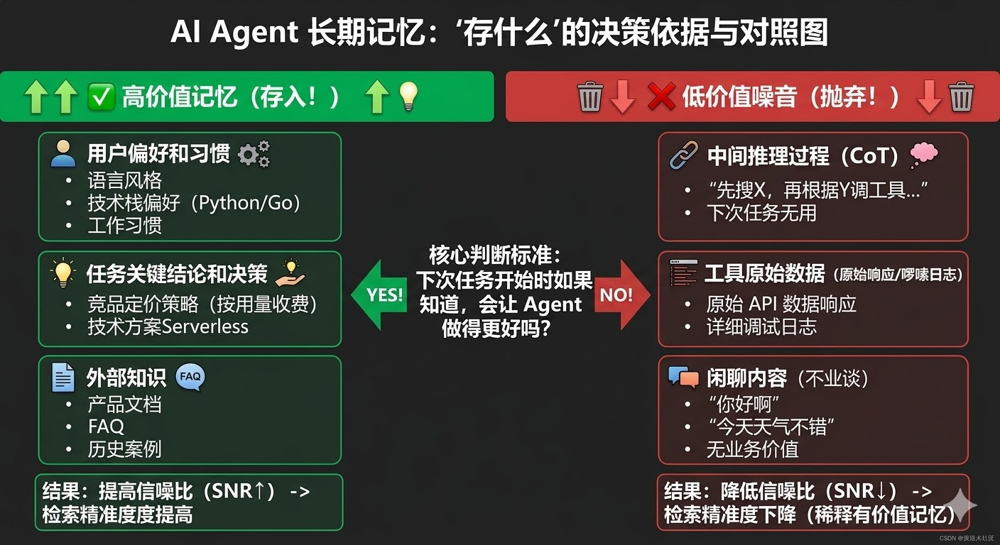

通常值得存的有三类：用户偏好和习惯（语言风格、技术栈偏好、工作习惯）、任务执行中产生的关键结论和决策（比如「调研发现竞品 A 的定价策略是按用量收费」）、以及外部知识（产品文档、FAQ、历史案例）。

不值得存的：中间推理过程、工具返回的原始数据（日志太啰嗦）、闲聊内容。这些存进去只会稀释有价值的记忆，让检索的信噪比下降。

**第二个：怎么存？**

根据信息的类型选合适的存储介质，而不是一刀切地全部塞进向量数据库。

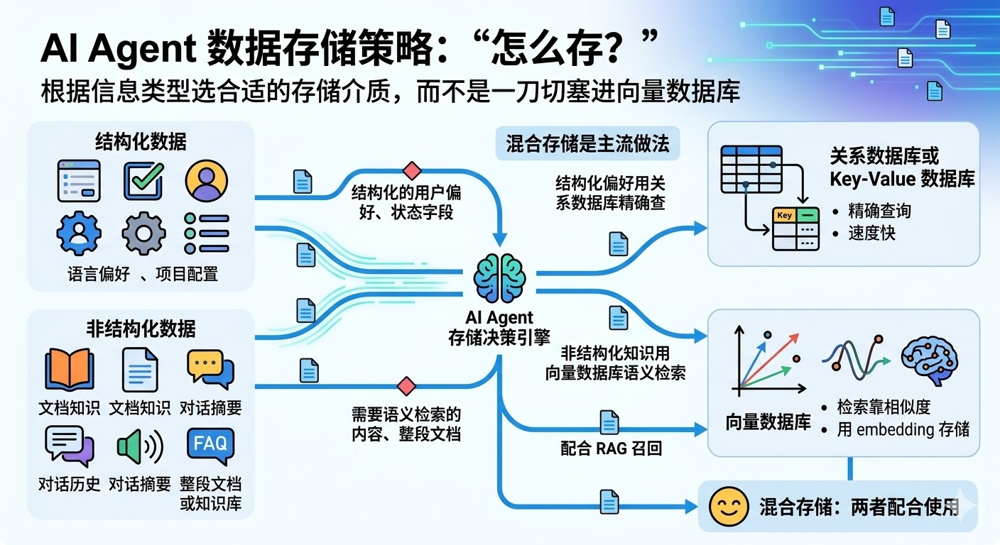

需要语义检索的内容，比如文档知识、对话摘要这类非结构化文本，可以用 embedding 编码后做相似度检索；结构化用户偏好、状态和权限字段更适合关系库或 Key-Value 查询。文档知识是否用向量库，还要看过滤、全文检索、更新和一致性要求。

一个常见基线是混合存储：结构化偏好用关系库精确查，非结构化知识和历史用向量检索；是否采用要通过查询集、延迟、成本和隐私要求验证。

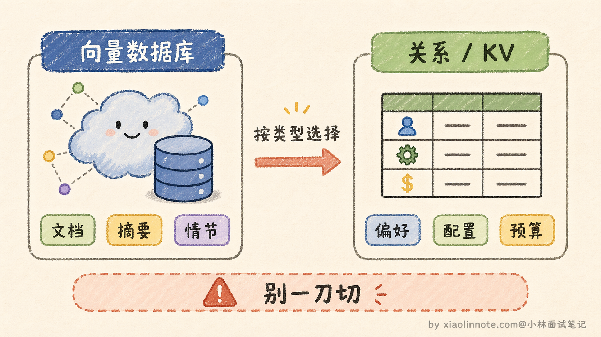

**第三个：什么时候取出来用？**

这个问题有两种策略，实践中通常结合使用。

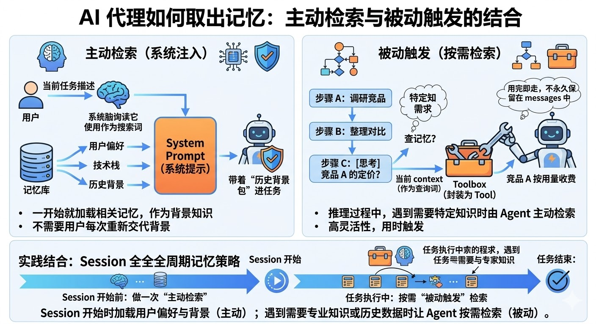

第一种叫「主动检索」，在任务开始前，用当前任务的描述去检索相关记忆，把结果注入 system prompt 作为背景知识。这样 Agent 一开始就带着「历史记忆」进入任务，不需要用户每次重新交代背景。第二种叫「被动触发」，Agent 在推理过程中，判断当前步骤需要某类特定知识时，主动发起检索。具体做法是把「查记忆」封装成一个 Tool，让 Agent 自己决定什么时候调。这种方式更灵活，但依赖模型判断什么时候该去查。

实践上可以结合：session 开始时加载少量经过权限过滤的偏好和背景，执行中按需检索；不要把未经筛选的长期记忆直接注入高优先级 system prompt。

### Context Window 管理：短期记忆的「工作台」不够大怎么办

短期记忆存在 context window 里，而 context window 是有 token 上限的。一个复杂的多步任务，对话历史越来越长，工具返回的结果越来越多，很快就会把 context window 塞满。满了之后新的内容就进不去了，或者被迫截断早期的历史，Agent 就会「失忆」，不知道前面做了什么。

这个问题在实际项目中非常常见，解决方案有好几种思路，从简单到复杂都有。

最简单的是「**滑动窗口**」，只保留最近 N 轮对话，更早的历史直接丢弃。好处是实现简单，代价是早期的重要信息可能被丢掉。比如用户在第一轮就说了「所有代码用 TypeScript」，到了第十轮这条信息被滑出窗口了，Agent 又开始写 JavaScript，用户就会很崩溃。

进阶一点的做法是「**摘要压缩**」。当历史长度接近上限时，用 LLM 把早期的对话历史压缩成一段摘要，替换掉原始的冗长历史。比如把前面十轮的详细对话压缩成「用户要求用 TypeScript 编写一个 REST API，已完成数据库设计和路由定义，当前正在实现用户认证模块」，一段话就把关键信息保留了，token 占用从几千降到几百。代价是压缩过程本身会丢失细节，而且需要额外的 LLM 调用来做摘要。

还有一种做法是把**不常用但重要的信息「卸载」到持久化存储里**。执行过程中产生的中间结果，如果后面可能用到，可以按任务/租户/版本写入可检索存储，并保留原始来源和删除句柄；需要时再召回，而不是默认全部写进向量数据库。

这三种传统方案已经能解决大部分场景的问题了，但最近两年出现了一些专门为 Agent 记忆设计的开源框架，把上面这些策略做了更系统的封装，值得了解一下。

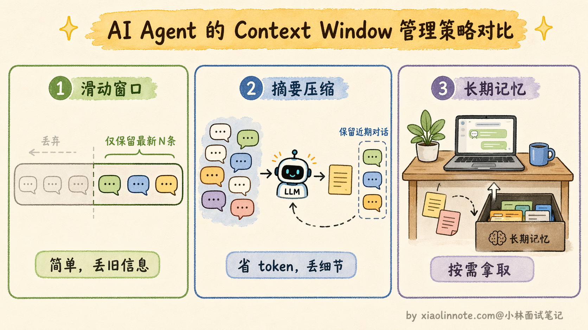

**Mem0** 等记忆框架把记忆管理抽成服务层，通常提供新增、搜索、去重或更新等接口；具体后端、功能、版本和隔离语义要以当前文档为准，不能默认它替应用完成授权、删除和冲突治理。它可以作为个性化记忆的候选，但应先验证租户隔离、数据出口和评估结果。

**Letta**（前身就是大名鼎鼎的 MemGPT）走的是另一条路，它的设计灵感来自操作系统的内存管理。就像操作系统把内存分成多个层级（寄存器、缓存、主存、磁盘），Letta 也把 Agent 的记忆分成了三个层级。

Core/Recall/Archival 这类分层是某些系统的设计术语：核心状态可常驻上下文，近期记录可快速回溯，归档内容需要主动检索。容量、生命周期、写入权限和删除语义都由具体实现决定，不能把“归档”理解成无限容量。

某些系统允许 Agent 通过工具管理不同记忆层；这种方式更灵活，也更依赖权限边界、字段校验和模型判断。高风险写入应由运行时批准，不应让模型直接决定任意数据的保存和删除。

有些记忆系统引入时间戳、有效期或时序图来处理“新旧事实”冲突。这类能力不能替代业务确认：预算、权限、合同等字段的有效期和覆盖规则应由业务系统定义，并保留来源和审计记录。

### 知识图谱：让记忆之间产生关联

前面讲的向量数据库做语义检索，本质上是「一条一条」地存记忆、「一条一条」地取记忆，每条记忆之间是独立的，没有关联。但很多时候，信息之间的关系和信息本身一样重要。比如你存了「用户 A 是公司 B 的 CTO」和「公司 B 的主营业务是云计算」，如果这两条记忆之间没有关联，当你问「用户 A 所在公司做什么业务」的时候，纯向量检索可能检索不到，因为这两条记忆的文本相似度并不高。

知识图谱就是用来解决这个问题的。它用「实体 -> 关系 -> 实体」的三元组结构来存储信息。什么是三元组呢？就是把一条知识拆成「主语、谓语、宾语」三个部分，每一组就是一个三元组。比如「用户 A -> 担任 CTO -> 公司 B」是一个三元组，「公司 B -> 主营业务 -> 云计算」是另一个三元组，「公司 B -> 成立于 -> 2015 年」又是一个。实体和实体之间通过明确的关系连接起来，形成一张网状的知识网络。

查询时可以沿着关系链条做多跳推理，这是知识图谱最厉害的地方。举个例子，你想知道「用户 A 所在公司做什么业务」，查询过程是这样的：先从「用户 A」这个实体出发，沿着「担任 CTO」这条关系找到「公司 B」，再从「公司 B」出发，沿着「主营业务」这条关系找到「云计算」，两跳就拿到了答案。

如果你还想知道「用户 A 的同事有谁」，可以从「公司 B」出发，沿着「员工」这条关系找到所有关联的人。这种沿着关系链条跳转查询的能力，是向量检索做不到的，因为向量检索只能找到文本语义相近的内容，而「用户 A」和「云计算」这两个文本在语义上根本不相近。

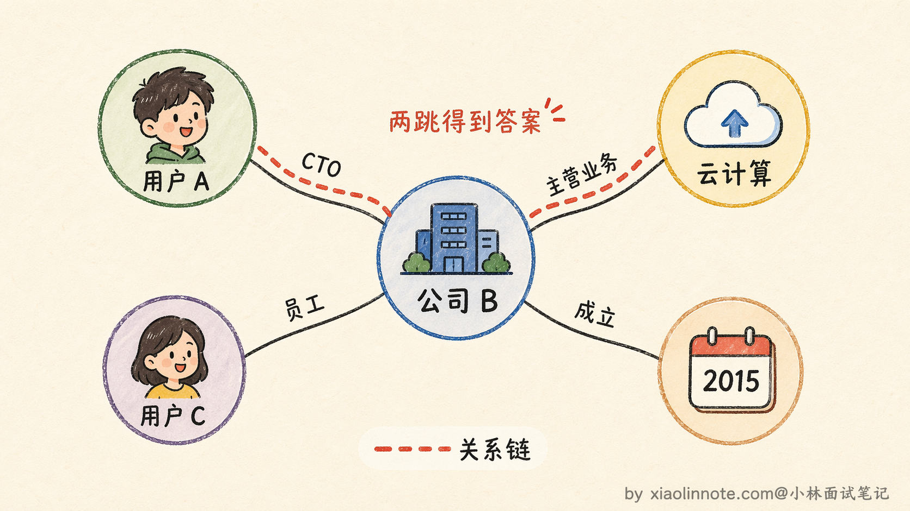

在 Agent 的记忆模块里引入知识图谱，通常是和向量数据库配合使用的。向量数据库负责处理模糊的语义检索（比如用户说「之前那个项目」，向量检索能找到最相关的项目记忆），知识图谱负责处理精确的关系推理（比如查某个用户的所有相关公司和角色），两者互补。具体做法是：对话过程中用 LLM 自动提取出实体和关系，存入知识图谱。检索时先用向量检索拿到一批候选记忆，再用知识图谱补充关联信息，最后把两部分结果合并后注入 context。

### 记忆整合：从碎片到知识

Agent 用久了之后，长期记忆里会积累大量的碎片化信息。同一个主题可能存了十几条不同时间的记忆，有些内容重复，有些已经过时，有些甚至互相矛盾。如果不做整理，检索时噪音越来越大，有用的记忆被淹没在无用的碎片里。

记忆整合就是定期对长期记忆做「清理和升华」的过程，它包含几个关键环节。

第一个环节是去重。把语义相近的多条记忆合并成一条更完整的版本。比如你存了「用户喜欢简洁的代码」「用户说过代码要精简」「用户要求不要冗余代码」三条，其实表达的是同一个意思，合并成一条「用户偏好简洁精练的代码风格，反对冗余」就够了。

第二个环节是冲突消解。当两条记忆互相矛盾时（比如「用户偏好 Python」和后来说的「最近转用 Go 了」），保留时间更新的那条，标记旧的为过期。这里时间戳就非常关键了，没有时间戳就无法判断哪条是最新的。

第三个环节也是最有价值的一个，叫做「抽象提炼」，本质上就是把情节记忆转化为语义记忆的过程。

什么意思呢？情节记忆存的是一次次具体的经历，比如第一次「用户让我写爬虫，requests 被反爬拦住了，换成 Selenium 才行」，第二次「用户让我抓某个电商网站的价格，页面是 JavaScript 渲染的，requests 拿到的是空页面，最后用 Playwright 解决了」，第三次「用户让我采集论坛帖子，同样遇到动态加载的问题」。

这三条情节记忆各自都是独立的事件记录，但把它们放在一起看，你会发现一个共同的规律：「当目标网站有动态渲染时，基于 HTTP 的简单请求库（如 requests）往往拿不到完整内容，需要用浏览器自动化工具（Selenium/Playwright）来处理」。

这条从多次经历中「蒸馏」出来的规律，就是语义记忆。它比任何一条情节记忆都更通用、更浓缩、更容易在未来的新任务中被检索命中。这个转化过程可以用 LLM 来自动完成：把一批相关的情节记忆喂给 LLM，让它总结出通用的知识和规律，然后把总结结果作为新的语义记忆存入长期记忆。

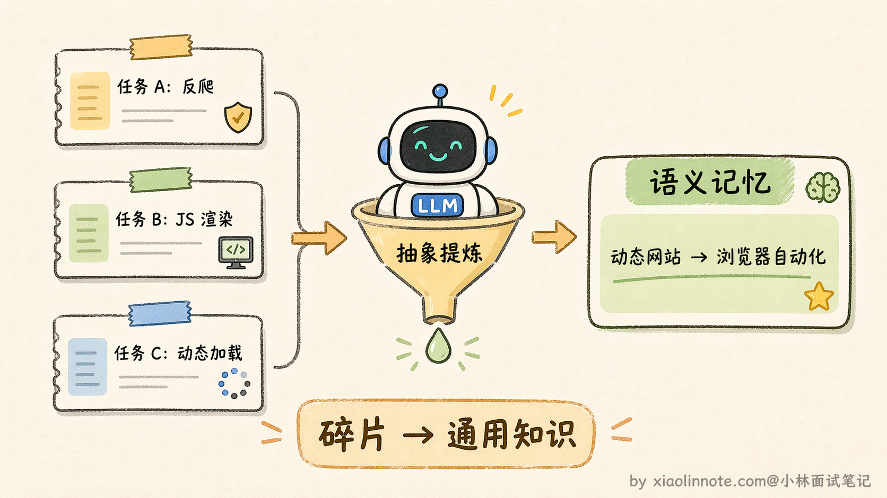

整合的节奏也很重要。每次任务结束后做一次轻量级的去重和更新就行，不需要大动干戈。然后每隔一段时间（比如每天或每周）再做一次深度的整理和提炼，把累积的情节记忆批量转化为语义记忆。有些框架（比如前面提到的 Mem0）已经内置了这种整合逻辑，它会在后台异步地对记忆做去重、冲突消解和提炼，你不需要手动触发。这样长期记忆会越来越精炼、越来越有价值，而不是越积越乱。

### 完整记忆模块的配合方式

把四层记忆和三个核心问题放在一起，来走一遍一次完整任务里它们是怎么协作的。整个过程可以用「读 -> 用 -> 写」三个阶段来描述。

**第一阶段：任务开始前，先「读」记忆**

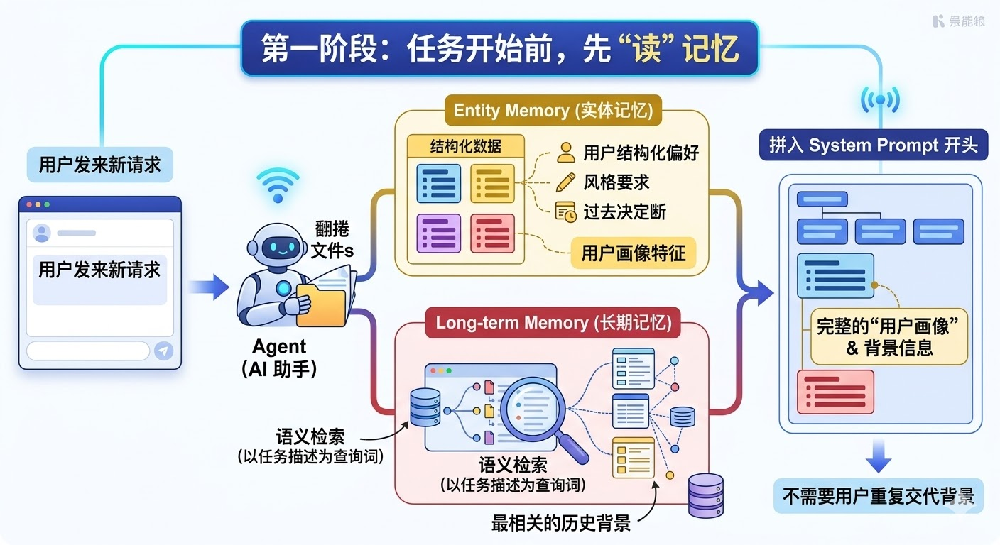

用户发来一个新请求，Agent 不是立刻开始干活，而是先去「翻档案」：从实体记忆里取出用户的结构化偏好（语言偏好、风格要求、过往决策），再用任务描述作为查询词，去长期记忆里做一次语义检索，拿回最相关的历史背景。把这两部分信息拼进 system prompt 的开头，Agent 进入任务时就已经带着完整的「用户画像」，不需要用户重复交代背景。

**第二阶段：任务执行中，持续「用」记忆**

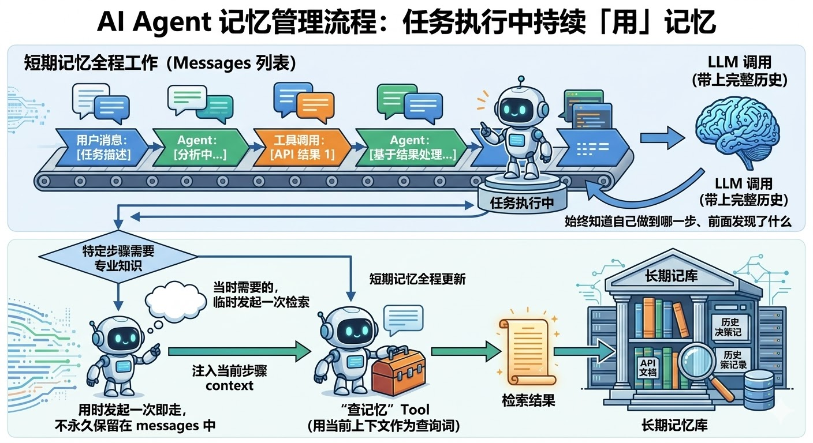

任务开始执行，短期记忆（messages 列表）全程工作：用户的每一条消息、模型的每一次输出、工具调用返回的每一个结果，都追加进 messages。每次调用 LLM 都把这份完整历史带上，Agent 始终知道自己做到哪一步、前面发现了什么。

如果某个执行步骤需要特定的专业知识（比如查某个 API 的文档、回想某次历史决策），Agent 可以临时发起一次长期记忆检索，把「查记忆」封装成一个 Tool，用当前上下文作为查询词，把检索结果注入到这一步的 context 里，用完即走，不需要永久保留在 messages 中。

**第三阶段：任务结束后，主动「写」记忆**

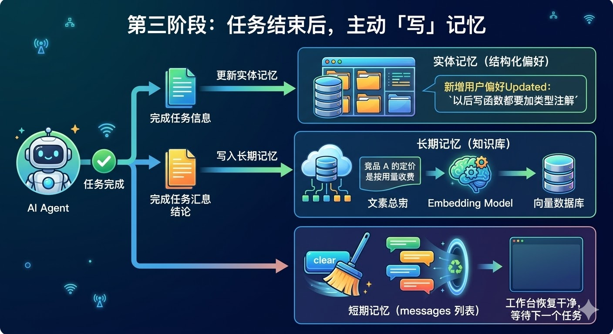

任务完成，进行最后一步：把本次任务产生的新知识写回持久化存储。具体来说，如果用户在对话中表达了新的偏好（「以后写函数都要加类型注解」），就更新实体记忆的对应字段；如果任务产生了有价值的结论（「竞品 A 的定价是按用量收费」），就把这条摘要写入长期记忆，embedding 后存入向量数据库，供下次检索。最后，短期记忆（messages 列表）清空，工作台恢复干净，等待下一个任务。

用流程图来看，整条链路是这样的：

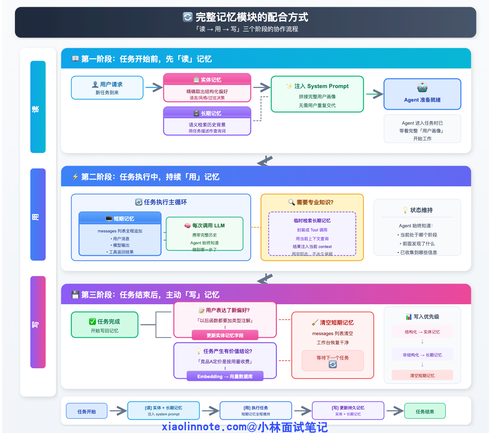

「读 -> 用 -> 写」三个阶段形成完整闭环：每次任务开始时把历史积累读进来，执行中靠短期记忆保持连贯，结束后把新知识写回去沉淀。Agent 用得越多，积累越厚，越来越「了解」用户，这才是记忆系统真正的价值所在。

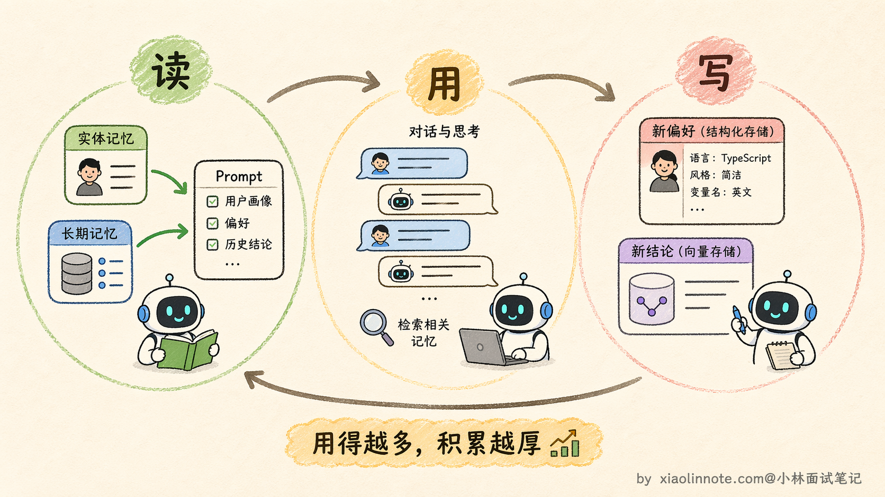

### 记忆系统的安全与评估

记忆不是“写进去就永久有用”。至少要记录 `tenant/user` 范围、来源、创建/更新时间、有效期、置信度和删除句柄；写入前过滤敏感信息，读取时做访问控制，更新时处理冲突，召回时保留原文和来源。长期记忆还可能携带提示注入或错误经验，不能直接覆盖系统规则或业务事实。

评估可拆成三层：记忆写入的精确率（是否把值得保留的事实写入）、召回的精确率/召回率（是否取对、是否漏掉）、以及对任务的净收益（完成率、错误率、延迟、token/费用和人工接管率）。同时测试跨租户泄露、删除后残留、过期事实和冲突事实，才能证明记忆真的改善了系统。

## 🎯 面试总结

回答 Agent 记忆机制这道题，先把四层分类说清楚：感知记忆是当次调用的原始输入，最短暂；短期记忆是 context window 里的 messages，维持任务状态；长期记忆是存在向量或关系数据库里、跨任务持久化的内容；实体记忆是从对话中提炼出来的结构化事实，信息密度最高。

说完分类，再答三个工程核心问题：存什么（只存对下次任务有价值的内容，过滤噪音）、怎么存（语义内容用向量数据库，结构化偏好用关系数据库，混合存储是主流）、什么时候取（任务开始前主动检索加载背景，执行中按需检索特定知识）。

最后用「读 -> 用 -> 写」三阶段闭环收尾，整个回答结构清晰、有深度，面试官很难挑剔。

---
