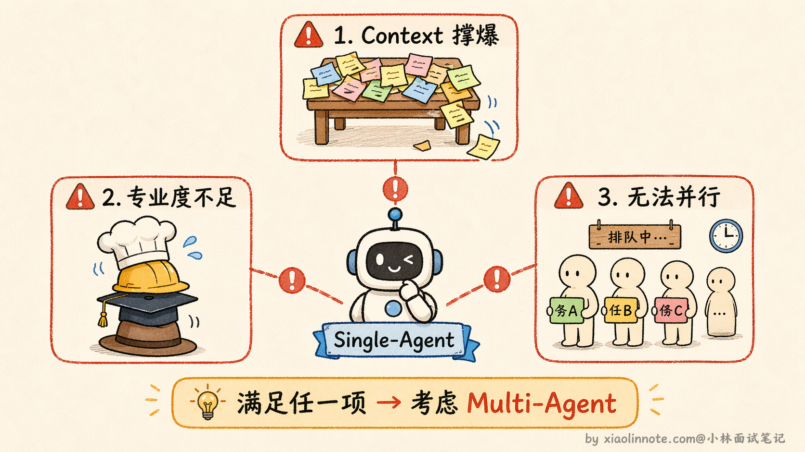
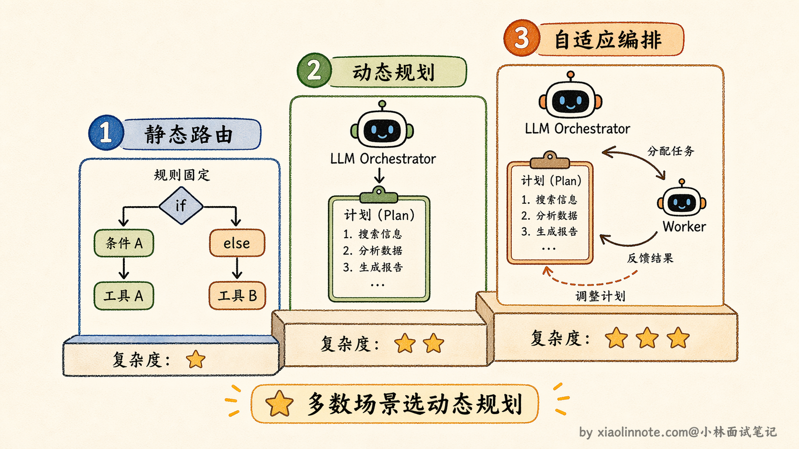
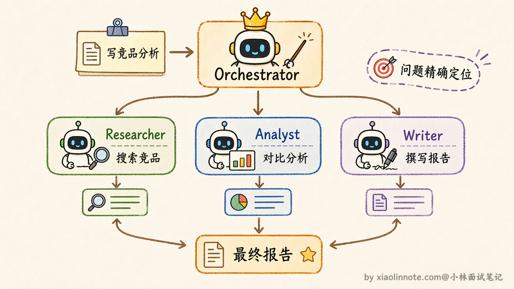
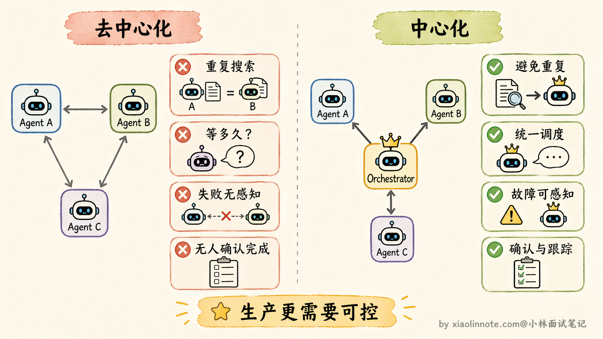
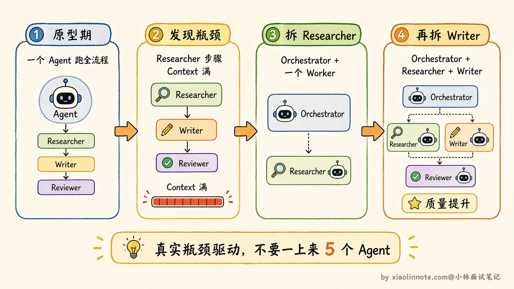
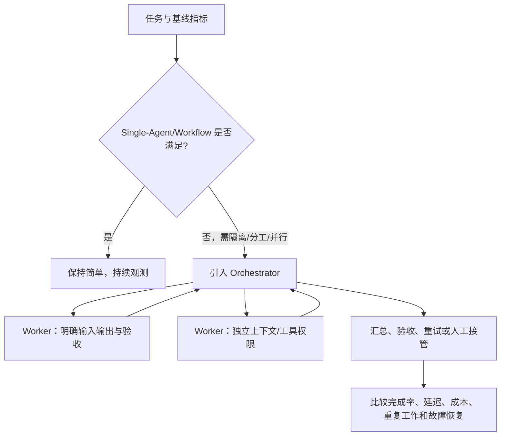

# 说说 Single-Agent 和 Multi-Agent 的设计方案？

> 原文：[说说 Single-Agent 和 Multi-Agent 的设计方案？](https://xiaolinnote.com/ai/agent/11_single_multi.html) · 小林面试笔记

👔面试官：你实际项目里是怎么做技术选型的，什么时候用 Single-Agent，什么时候上 Multi-Agent？

🙋‍♂️我：任务简单就用 Single-Agent，任务复杂就用 Multi-Agent，多个 Agent 可以并行，速度更快。

👔面试官：「复杂」这个词太模糊，有没有更具体的判断标准？

🙋‍♂️我：就是……步骤多、需要调很多工具，这种就用 Multi-Agent 吧。

👔面试官：步骤多不一定要 Multi-Agent，Single-Agent 循环调工具也能搞定很多步骤的任务。你有没有想过，Multi-Agent 本身是有成本的，盲目引入会有什么问题？

🙋‍♂️我：那 Multi-Agent 的话，两个方案都行，中心化和去中心化看情况选，去中心化更灵活，感觉挺好的。

👔面试官：去中心化在工程实践里几乎没有人用，你知道为什么吗？灵活只是表面，背后藏着几个很实际的工程问题。

被追到这儿了，其实选型这件事有一套清晰的决策逻辑，不是凭感觉的。

## 💡 简要回答

Single-Agent 适合任务流程清晰、复杂度适中的场景，实现简单、好维护；Multi-Agent 适合需要专业分工、任务量大或者需要并行执行的复杂场景。

Multi-Agent 架构上主要有两种拓扑：中心化的 Orchestrator 模式，由一个主 Agent 统一调度各个 Worker；去中心化的 Peer-to-Peer 模式，Agent 之间直接通信。

我在工程里用中心化用得更多，因为好控制、好调试，出问题链路清晰。

## 📝 详细解析

这道题的核心问题是：什么情况下用 Single-Agent 就够了，什么情况下必须上 Multi-Agent，而 Multi-Agent 又该怎么组织？这是实际工程里最常碰到的架构决策，选错了要么系统过度复杂难以维护，要么能力不够任务跑不起来。

### Single-Agent

先把 Single-Agent 说清楚。它的本质是一个 LLM 加上一套工具，跑一个受运行时约束的决策循环：LLM 提出下一步，系统校验并执行工具，保存结果，再决定继续或结束。

它最大的优势不只是「架构简单」，更核心的是「整条任务链路完全在你掌控之内」。任务怎么走、用什么工具、什么时候结束，所有逻辑都是你在一个地方写清楚的，出了问题链路短，好排查。

类比一下：一个人完全可以独立完成「写一篇博客」，自己查资料、想大纲、写下来，不需要团队协作，单人反而更高效，沟通成本为零。

Single-Agent 可能在这几类任务上遇到瓶颈：状态需要隔离、步骤需要不同工具/验收标准，或存在真正独立且可并行的子任务。但这些问题也可以用摘要、Workflow、路由或队列解决；只有拆分收益超过协调成本时，Multi-Agent 才有价值。

但需要强调的是：如果你的任务不属于这三类，Single-Agent 就够了，不要为了「用新技术」而强行引入 Multi-Agent，系统会变复杂、变难维护，但没有带来对应的收益。

### Multi-Agent 的中心化方案

Multi-Agent 的中心化方案，核心是一个叫 Orchestrator 的特殊角色。「Orchestrator」直译是「交响乐指挥」，在 Multi-Agent 系统里，它的中文可以理解成「总调度员」或「项目经理」。它是整个系统里最特殊的那个 Agent，因为它不做任何具体工作，它只负责三件事：读懂用户的大目标、把它拆成一个个子任务；判断每个子任务该交给哪个 Worker Agent 去做；收集每个 Worker 的产出，把它们拼成最终答案。

Orchestrator 其实有几种变体，适合不同复杂度的场景。最基础的是**静态路由**（Static Router），任务拆分和分配规则是预先定义好的，比如「遇到代码任务交给 Coder Agent，遇到搜索任务交给 Researcher Agent」，逻辑简单可预测。进阶一点的是**动态规划**（Dynamic Planner），Orchestrator 本身是一个 LLM，它会根据用户输入动态生成任务计划，决定需要几个步骤、每步交给谁，计划本身也可以在执行过程中调整。最复杂的是**自适应编排**（Adaptive Orchestration），Orchestrator 不仅动态规划，还会根据 Worker 的执行结果实时调整后续计划，比如 Researcher 搜回来的信息不够，Orchestrator 会追加一轮搜索任务，而不是硬着头皮往下走。实际项目里，大多数场景用动态规划就够了，自适应编排虽然更强大但调试复杂度也高很多。

相对的，Worker Agent 就是「执行者」。每个 Worker 只关注自己那块，它不需要知道整体任务是什么，不需要知道其他 Worker 在做什么，只需要拿到属于自己的那部分指令，做完返回结果，然后退出。它的 context 是干净的，只装着和自己职责相关的信息。

用一个具体任务来走一遍完整流程，帮你真正理解 Orchestrator 是怎么工作的。假设用户说「帮我写一份 AI 行业竞品分析」：

这个流程最大的好处，是每个环节出了问题，你能精准定位。报告内容不够准确？可能是 Researcher 搜的信息不够好。分析逻辑有问题？可能是 Analyst 的对比维度不对。报告格式不符合要求？是 Writer 的输出问题。每个 Agent 职责清晰，排查不需要猜，顺着 Orchestrator 的调度记录一步步追下去就能找到根源。

### 去中心化方案：为什么「听起来更灵活」却很少在工程上用

去中心化的思路是没有总调度，多个 Agent 通过共享的消息队列或状态空间自行协商、直接通信。听起来很美好，像一个能自我组织的团队，不需要领导，大家自动配合，还更灵活。

但实际工程里会遇到什么问题？用一个具体场景来说明。

假设三个 Agent 在处理同一个任务：Agent A 在搜索信息，Agent B 也在搜索类似的信息，Agent C 负责汇总结果，但没有人统筹调度。这时候几个问题会同时出现：首先，没有人告诉 A 和 B 「你们各搜什么范围」，很可能两个人搜了大量重叠的内容，做了重复工作；其次，C 需要等 A 和 B 都搜完才能汇总，但没有人告诉 C「A 和 B 什么时候算搜完了」，C 不知道该等多久，也不知道有没有漏掉某个 Agent 的结果；再者，如果 A 中途出错了，没有中央调度者收到错误通知，B 和 C 可能还在正常运行，最后汇总出来的是一份不完整的结果，但系统甚至不知道这里出了问题。

总结下来，去中心化系统里这几类问题会频繁出现：任务分配没有协调、执行顺序没有保证、失败没有感知、没有人来确认「任务整体完成了」。类比一个没有项目经理的团队：每个人都很能干，但没有人协调时间节点和接口，最后交出来的可能是互不兼容的结果，而且没有人知道整体进度到底怎么样了。

这就是为什么去中心化方案更多停留在学术研究里探索，研究的是「AI 系统能不能实现自主协调」这个更宏观的问题。而生产环境里，**几乎所有正经项目都选 Orchestrator 模式**，因为可控、可追踪、出了问题能排查，这才是工程上真正需要的。

### 怎么做选型决策？

选型的逻辑其实可以用两个问题来搞定。

先问第一个问题：你的任务，Single-Agent 能搞定吗？如果任务流程明确、不太长、不需要多种专业分工，Single-Agent 就够了。架构简单、维护成本低、链路透明，不要为了「显得高级」而引入 Multi-Agent。

如果任务确实超出了 Single-Agent 的边界，再问第二个问题：你能接受系统行为不可控的风险吗？生产环境里这个问题的答案几乎一定是「不能」，所以就用 Orchestrator 模式。

实际工程里有一个很实用的策略叫**渐进式演进**：先用 Single-Agent 或 Workflow 建立基线，记录上下文长度、工具成功率、每任务成本和失败类型；当某个环节确实成为瓶颈，再把它拆成 Worker。不要一上来就设计很多 Agent，否则很难判断收益来自哪里。

另一个常被讨论的方向是 **Agent-to-Agent（A2A）** 协议，用于约定不同团队或框架的 Agent 如何发现能力、传递任务和交换状态。具体版本、组织归属、互操作程度和生产可用性会演进；即使协议兼容，也仍需自行处理认证、权限、超时、取消、幂等、数据边界和审计。

把三种方案放在一起对比，选型时一眼就能看清差异：

| 维度 | Single-Agent | Multi-Agent（中心化） | Multi-Agent（去中心化） |
| --- | --- | --- | --- |
| 架构复杂度 | 低 | 中 | 高 |
| Context 压力 | 主要由一个 Agent 管理 | Worker 可隔离，但 Orchestrator/汇总状态仍会增长 | Worker 可隔离，但共享协调状态和消息可能增长 |
| 专业能力 | 泛才，什么都做 | 专才分工，各有专责 | 专才分工，各有专责 |
| 并行能力 | 不支持 | 支持子任务并行 | 支持并行 |
| 可控性 | 高，单链路简单 | 较高，但 Orchestrator 是关键控制点 | 取决于协议和停止/冲突机制，治理更难 |
| 调试难度 | 容易 | 中，按调度链路追踪 | 难，行为不可预测 |
| 工程实用性 | 高 | 在需要分工/隔离时可行 | 适合有明确协调协议和治理能力的场景，不能一概视为研究专属 |
| 适用场景 | 任务清晰、复杂度适中 | 需要分工、隔离或并行的复杂任务 | 需要自治协商且能承担协调复杂度的场景 |

多 Agent 的最小工程契约应包含：任务 ID、来源和租户、输入输出 schema、状态（queued/running/succeeded/failed/cancelled）、超时/取消、幂等键和 trace ID。没有这些契约时，增加 Agent 数量通常只会放大不可观测的复杂度。

## 🎯 面试总结

这道题最容易犯的错误有三个，对应开头对话里踩的三个雷。

第一，选型标准不能只说「任务复杂就用 Multi-Agent」，要说出具体的三类场景：context 要撑爆了、需要不同专业分工、有子任务可以并行，不属于这三类就用 Single-Agent，盲目引入 Multi-Agent 只会增加系统复杂度，带不来对应收益。

第二，Multi-Agent 架构方案要主动提中心化和去中心化两种，并说明中心化通常更容易做权限、追踪和失败出口；去中心化并非不能工程化，但需要更严格的消息契约、冲突处理和全局停止机制。

第三，去中心化「听起来灵活」但要能说清楚它的实际问题：任务分配、完成判定、失败传播和重复工作都需要显式协议解决；不能只凭“工程里少见”就断言不可用。

---
