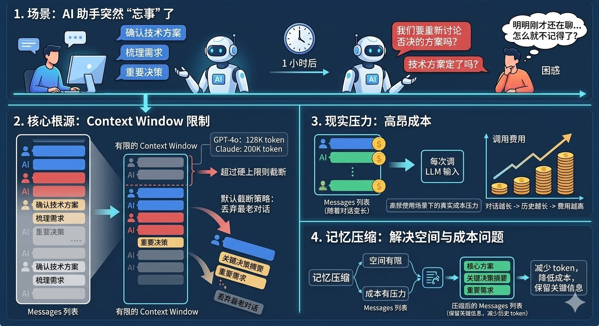
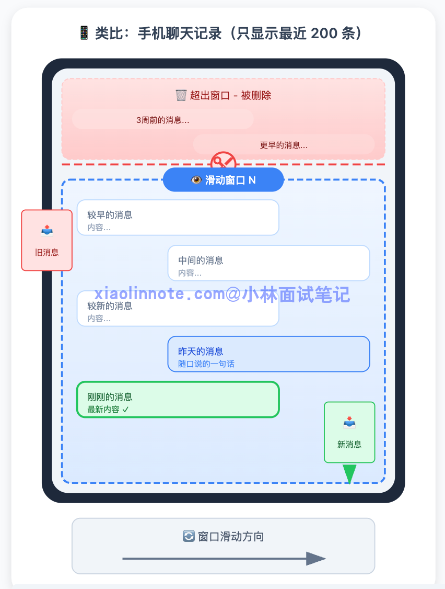
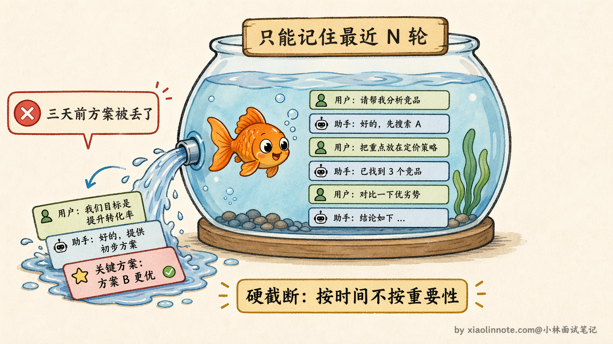
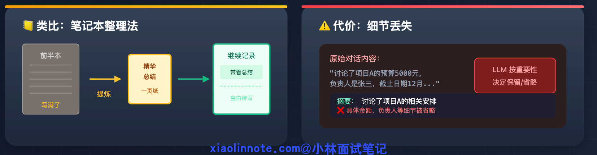
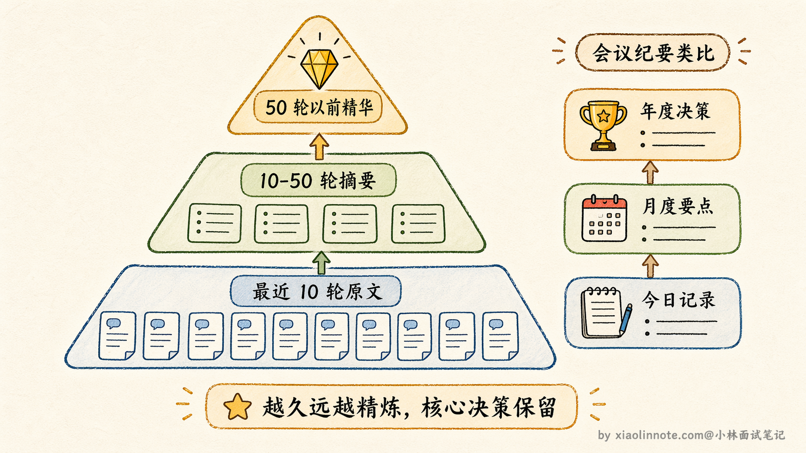
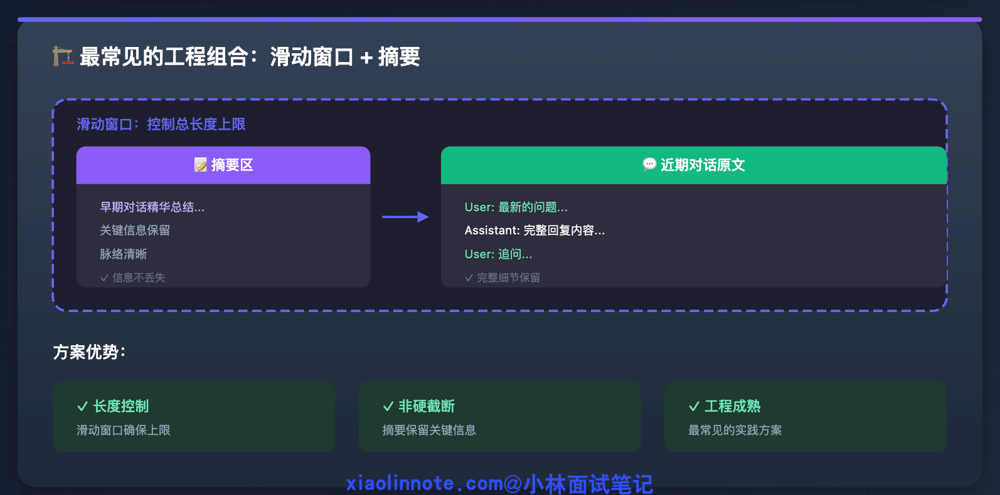
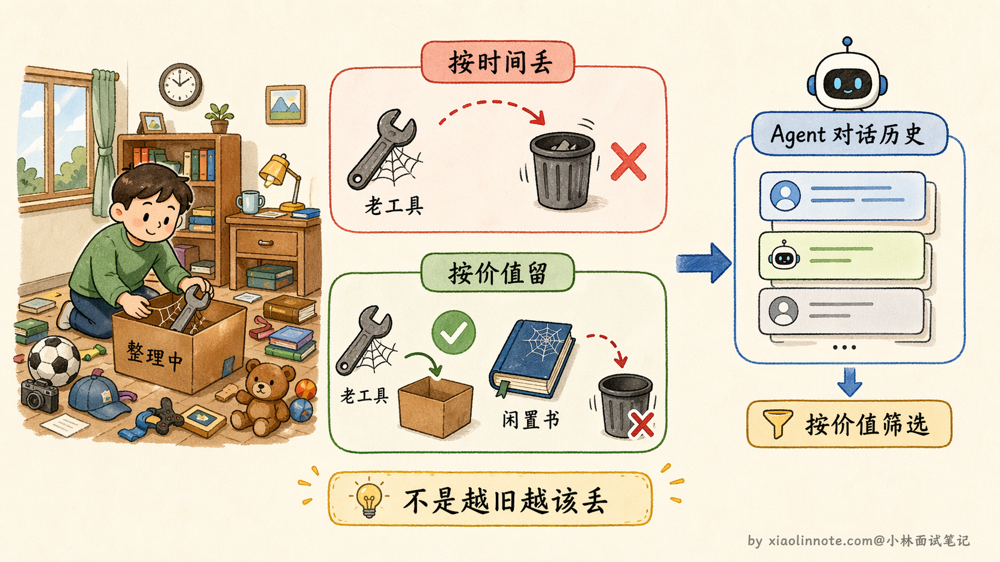
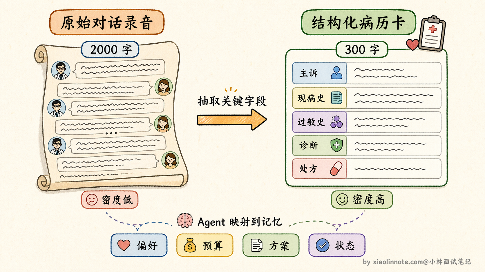
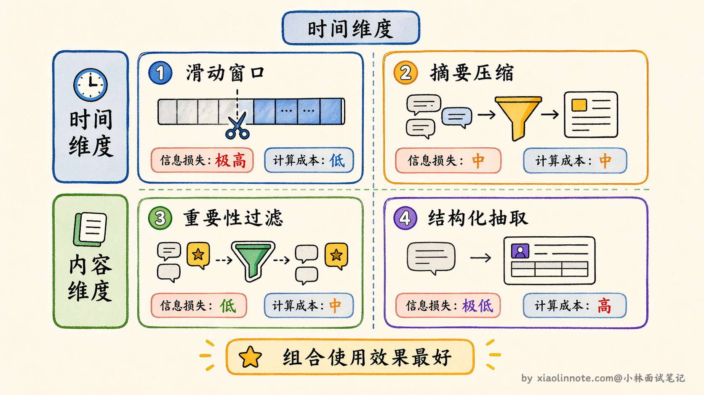
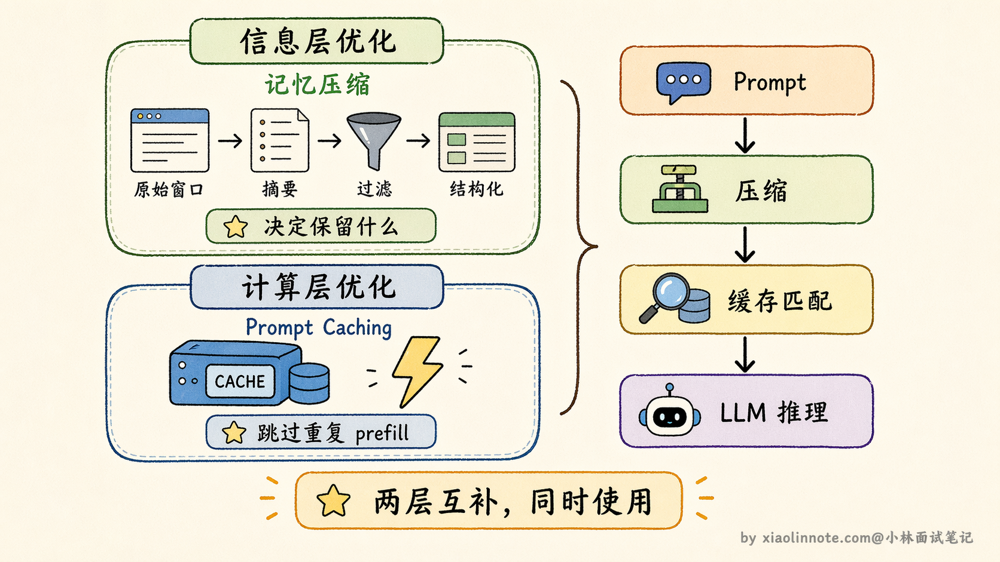

# Agent 记忆压缩通常有哪些方法？

> 原文：[Agent 记忆压缩通常有哪些方法？](https://xiaolinnote.com/ai/agent/12_memcompress.html) · 小林面试笔记

👔面试官：你项目里 Agent 对话历史越来越长，context 快撑满了怎么办？有没有做记忆压缩？

🙋‍♂️我：有，我们做了滑动窗口，只保留最近几轮对话，太早的就丢掉。

👔面试官：那如果用户三天前确认的一个关键决策被你这么丢了，Agent 回头又提那个已经被否决的方案，怎么办？

🙋‍♂️我：那就把窗口调大一点，多保留一些对话。

👔面试官：窗口调大治标不治本，你知道滑动窗口的本质缺陷是什么吗？「硬截断」意味着什么？

🙋‍♂️我：嗯……那可以用摘要压缩，让 LLM 把历史总结一下，信息就保留下来了。摘要之后应该就够用了。

👔面试官：摘要是一种方案，但你说「够用了」——有没有考虑过，有些场景里摘要本身也会丢失关键细节？还有没有其他角度的压缩思路？

被问出这个问题说明面试官在考你方案的全貌，记忆压缩其实有四个不同维度的方法，咱来系统梳理一遍。

## 💡 简要回答

记忆压缩常见有四种方法：摘要压缩、滑动窗口、重要性过滤、结构化抽取。

摘要压缩是把长对话总结成简短摘要；滑动窗口是只保留最近 N 轮对话；重要性过滤是打分筛选，只留重要内容；结构化抽取是把关键信息抽成结构化数据存起来。

我在实际项目里最常用的是摘要压缩和滑动窗口，而且经常组合用，滑动窗口丢弃前先做一次摘要，尽量不丢重要信息。

## 📝 详细解析

想象这样一个场景：你在用一个 AI 助手帮你推进一个复杂项目，聊了一个多小时，确认了技术方案、梳理了需求、定下了几个重要决策。然后有一刻，AI 突然开始「忘事」了，把你早就敲定的方案搞错，重新提出已经被你否决的思路。你感觉很困惑，明明刚才还在聊，它怎么就不记得了？

这个现象的根源，就是 context window 的限制。

LLM 每次生成回答，并不是像人脑一样有持续的记忆，它依赖的是「每次调用时传入的完整对话历史」。你和它聊的每一句话，都被打包成 messages 列表传进去，模型读完这些内容，才能生成下一条回复。

这个 messages 列表受提供方、模型版本、接口参数和实际上下文预算限制。超过上限时，接口可能拒绝请求，或由应用先裁剪/摘要；具体上下文大小和计费应以当前官方文档为准。即使没有超限，历史过长也会增加延迟、成本和注意力干扰。

更现实的压力还有成本。就算没有超过 token 上限，对话越长，每次调 LLM 的费用就越高，因为你把越来越多的历史塞进了输入。高频使用场景下，这是货真价实的成本压力。

记忆压缩要解决的，就是「空间有限、成本有压力」这两件事：在保留关键信息的前提下，减少历史记录占用的 token 数量。

### 第一种方法：滑动窗口，最简单的方案，也是最粗糙的

滑动窗口是最符合直觉的做法，就像手机聊天记录默认只显示最近 200 条：超出就从最老的开始删，只保留最近 N 轮对话。

好处是实现极其简单，不需要任何额外的 LLM 调用，也没有额外开销。坏处是「硬截断」，对话内容按时间一刀切，三周前确认的关键决策和昨天随口说的一句话，在这个方案里是被同等对待的，超出窗口就都消失了。

可以用一个词概括它的特性：「金鱼记忆」。它只记得最近发生的事，越往前越模糊，再久一点就什么都没了。对于短对话、或者历史信息不重要的场景，这个方案足够用，成本最低。

### 第二种方法：摘要压缩，丢之前先提炼一遍

摘要压缩是对滑动窗口「硬截断」的改进。核心思路是：不直接丢弃即将超出窗口的历史，而是先让 LLM 把这段历史总结成一段精华摘要，用摘要替换原始对话，再继续往前。

类比一下：你的笔记本快写满了，你没有把前面的页直接撕掉，而是先把前半本的要点重新整理成一页纸的精华总结，然后把前半本收起来，带着这页总结继续记录后面的内容。后来翻回去看，这页总结虽然不如原版详细，但关键脉络都在。

代价是摘要会丢失细节。LLM 在总结时，会按照自己判断的「重要性」来决定保留什么、省略什么。有些细节当时看起来不重要、被摘要略过了，后来却刚好需要，这时候就找不回来了。

这个方案单独用时，通常的做法是「旧的压缩成摘要，近的保持完整」，最近几轮对话往往和当前任务关系最密切，保持原文；更早的历史相关性低，压缩成摘要。

进阶一点的做法是**层级式摘要**（Hierarchical Summarization）。不是对所有旧历史做一次性摘要，而是分层处理：最近 10 轮保持原文，10 到 50 轮的历史压缩成一份「中期摘要」，50 轮之前的历史进一步压缩成更精炼的「长期摘要」。

每一层的信息密度不同，越久远的越精炼，但核心决策和关键结论始终被保留。这有点像公司的会议纪要体系：今天的会议有详细的逐条记录，上个月的会议只留要点摘要，去年的只留关键决策备忘。

层级式摘要可能让 Agent 同时保留近期细节和远期要点，但摘要本身仍可能错过 ID、数字、否定和来源；关键状态应使用结构化字段或可回查原文的引用。

**一个常见的工程组合：滑动窗口 + 摘要**

在实际工程里，这两种方法可以组合，但不是所有任务都适合。滑动窗口控制长度，摘要在裁剪前提炼；应通过关键决策保留率、任务完成率、延迟和成本验证摘要是否造成信息损失。

### 第三种方法：重要性过滤，按价值筛选，不按时间筛选

滑动窗口和摘要压缩有一个共同的思路：都是在「时间维度」处理历史，按照发生的先后顺序来决定保留什么。但时间不等于重要性。三周前的一句关键决策，可能远比昨天的几句闲聊更有价值，但在滑动窗口里它会先被丢掉。

重要性过滤换了一个角度，按内容的实际价值来决定去留：给每条对话记录打一个重要性分数，低于阈值的淘汰，高分的保留。

类比整理房间：一个人不会按照购买时间来决定扔什么东西，而是按照「这个东西现在还有没有用」来决定去留。一件五年前买的工具，如果还在用，就留着；一本上周买的书，如果一页没看还不打算看，就可以扔。

打分的方式有两种。一种是规则打分：包含「决定」「确认」「需求」等关键词的记录加分，被后续对话引用次数多的加分，纯闲聊降分。规则快、没有额外开销，但比较粗糙，边界情况容易判断失误。

另一种是让 LLM 来打分：逐条判断每条记录的重要程度。准确率更高，但每条记录都需要一次 LLM 调用，开销大，通常在批量清理历史时做，而不是实时处理每条消息。

还有一种更激进的重要性过滤思路叫**观察遮蔽**（Observation Masking）。它的做法不是删除低分内容，而是在构造 prompt 时选择性地「隐藏」某些历史条目。

比如当前任务是写代码，Agent 会把之前关于需求讨论的对话标记为「与当前步骤无关」，构造 prompt 时直接跳过这些条目，只把和代码相关的历史传进去。任务进入测试阶段时，再把测试相关的历史「显示」出来，代码实现的细节对话则被遮蔽。

这样做的好处是信息没有被真正删除，只是在不同阶段动态选择「当前最需要看到什么」，既节省了 token，又避免了不可逆的信息丢失。

另一个值得了解的概念是**主动压缩**（Proactive Compression）。前面说的所有方法都是被动触发的，等 context 快满了才开始压缩。主动压缩的思路是，Agent 在每一步执行完之后，主动判断哪些中间过程可以压缩。

比如 Agent 调用了一个搜索工具，返回了 2000 token 的原始搜索结果，Agent 在读完之后立刻把搜索结果压缩成 200 token 的要点摘要，替换掉原始内容。这样 context 的增长速度从一开始就被控制住了，而不是等到快满了才临时抱佛脚。

主动压缩特别适合工具调用频繁的 Agent，因为工具返回的原始数据往往很长，但真正有用的信息只占一小部分。

### 第四种方法：结构化抽取，换一种载体存信息

前三种方法有一个共同的前提假设：历史信息最好以「对话文本」的形式保留。结构化抽取的思路完全不同，它先问一个更本质的问题：我们真的需要保留对话文本本身吗？

很多场景里，真正有价值的不是对话文字，而是对话中传递的事实和状态。比如「用户偏好用 Python」「预算上限是 5 万」「已确认方案 B」「需要兼容移动端」。把这些信息主动提取出来，存成结构化字段，后续注入 prompt 时直接用这些字段，比传一大段对话文本要高效得多，信息密度也高得多。

类比医生记录病历的方式：医生不会把和病人的所有对话逐字记录下来，而是整理成结构化的病历档案，「主诉：头痛三天，现病史：无发热，过敏史：青霉素，初步诊断：紧张性头痛」。这份档案的信息密度远高于原始对话文字，下次就诊时医生直接读病历，不需要把上次的全程录音重听一遍。

这种方案可以减少摘要带来的模糊化，但不保证信息完整：抽取模型可能漏掉否定、条件、来源或时间。代价是需要定义字段、版本、校验和回溯策略，不同任务的 schema 也可能不同。

### 四种方法的关系梳理

这四种方法不是互斥的，也不是按优劣排列的，而是从三个不同维度来解决问题的。

滑动窗口和摘要压缩解决的是「历史太长，怎么截」的问题，前者直接截，后者截之前先提炼。重要性过滤解决的是「内容不等价，怎么挑」的问题，打破时间顺序，按价值筛选。结构化抽取解决的是「对话文本本身是不是最佳载体」的问题，换一种更高效的形式来存储信息。

这三个维度可以组合：比如先用重要性过滤筛掉低价值内容，再用摘要压缩处理剩余历史，同时对特定类型的关键信息做结构化抽取。实际系统里，往往是多种方法配合使用的。

**Prompt Caching：在「计算层」的互补手段**

除了上面这些「信息层」的压缩策略，还有一个工程上值得了解的技术叫 Prompt Caching；是否支持、缓存前缀规则、有效期和价格由具体提供方决定，应以当前官方文档为准。

理解它之前，先知道一个背景：LLM 每次处理请求，都需要把输入的所有 token「过一遍模型」来做计算，这个过程叫 prefill，是延迟和成本的主要来源之一。一个常见的场景是：你有一段固定的 system prompt 加上越来越长的对话历史，每次调用时这段历史都会被重新计算一遍，哪怕它和上一次调用时完全一样。

Prompt Caching 的思路是：如果 prompt 的前缀部分在多次请求之间满足提供方的匹配规则，就复用部分计算结果。它可能降低输入计算延迟和费用，但收益取决于命中率、缓存 TTL、最小缓存长度、提供方价格和请求模式，不能预设固定倍数。

具体费用和回本次数必须按提供方当前价目表与实际命中率计算。Agent 也不能把会变化的用户权限、租户数据或实时记忆盲目放进可复用前缀；缓存内容仍需符合隐私和隔离要求。

这和前面的记忆压缩是两个不同层次的优化。记忆压缩在「信息层」工作，决定哪些内容值得被保留在对话历史里；Prompt Caching 在「计算层」工作，对已经决定要带进去的内容减少重复计算的开销。两者解决的不是同一个问题，可以同时使用，是互补关系，不是替代。

**工程实践决策参考**

选方案的时候，可以按对话长度、关键信息类型、可回查性、延迟、成本和隐私要求选择，并用离线任务集与线上 trace 验证。对关键状态，建议把“当前目标、硬约束、已确认决策、未决问题、步骤依赖、来源/版本、权限范围”作为结构化字段；摘要只负责压缩叙事历史，保留原文或事件 ID 以便回查。压缩后应做 schema 校验、关键字段对照和必要的回退检索。

一个实用的触发策略是：按 token 预算的水位触发压缩，压缩前冻结一份可恢复 State；先抽取关键字段，再对旧消息做摘要，最后保留最近窗口。若压缩失败或摘要缺少关键字段，使用旧 State/原文回退，不要继续覆盖唯一副本。

## 🎯 面试总结

这道题的坑在于，很多人只知道滑动窗口，回答到这里就停了。面试官想考的是你对「压缩」这件事有没有完整的认识。

回答时要覆盖四种方法，并且能说清楚它们解决的是不同维度的问题：滑动窗口和摘要压缩解决「历史太长怎么截」，前者直接硬截，后者截之前先提炼；重要性过滤解决「内容不等价怎么挑」，打破时间顺序按价值保留；结构化抽取解决「对话文本是不是最佳载体」，换一种信息密度更高的形式存储。

另外，Prompt Caching 要和记忆压缩区分清楚，它是「计算层」的优化，对已经决定带进去的内容减少重复计算，和「信息层」的压缩是互补关系，不是替代关系，这个区别如果能主动点出来，会给面试官留下很好的印象。

---
