# 如何赋予 LLM 规划能力？

> 原文：[如何赋予 LLM 规划能力？](https://xiaolinnote.com/ai/agent/14_planning.html) · 小林面试笔记


👔面试官：说说你是怎么给 LLM 加规划能力的？

🙋‍♂️我：规划能力主要靠 CoT，就是在 prompt 里加一句「请一步步思考」，让 LLM 把推理过程写出来，就有规划能力了。

👔面试官：CoT 就是规划能力的全部？你有没有想过 CoT 最大的问题是什么？

🙋‍♂️我：CoT 的问题……就是有时候推理链比较长，token 消耗多一些？

👔面试官：不对。CoT 是单条推理链，一旦一开始方向走错，后面全错，没有任何纠偏机制。ToT 就是为了解决这个问题才出来的，你知道 ToT 怎么做的吗？

🙋‍♂️我：ToT 是同时生成多条推理链，然后选最好的那个，类似于 beam search 的思路？

👔面试官：方向对，但不够准确。ToT 不是最后才选，而是边探索边评估边剪枝，是一个循环的过程。那 GoT 又比 ToT 多解决了什么问题，你说说看？

被问到这里，才发现「加个 CoT 就是规划能力」这个认知太浅了。三种机制是层层递进的，搞清楚每一步在解决什么问题，才是真正理解了规划能力。

## 💡 简要回答

给 LLM 增加规划能力，常见思路包括：分步推理、候选路径搜索、显式计划和运行时校验。CoT 是推理策略，不等于完整的任务规划。

- CoT 是分步推导策略；工程接口不必暴露完整内部推理，可改为输出结构化计划或简短依据；
- ToT 是让它同时探索多条推理路径，选最优的继续深入；
- GoT 是图结构推理，推理节点可以复用和合并，适合更复杂的任务。

工程上通常先从结构化计划或简单的 ReAct/Workflow 开始。ToT/GoT 的搜索与合并会增加模型调用和实现复杂度，成本取决于分支数、深度和评估器；是否值得要用任务集验证，不能用固定倍数或“没人生产落地”概括。

## 📝 详细解析

要理解为什么需要规划能力，先看 LLM 在没有任何规划机制时是怎么运作的。

普通的问答模式下，LLM 接到一个问题，就直接「一口气」生成答案，中间没有任何推理过程。这对简单问题没啥大问题，但遇到需要多步推导的任务就很容易翻车。

比如让它做一道需要 3 步推导的逻辑题，如果直接让它给答案，出错概率会远高于让它把每步都写出来。

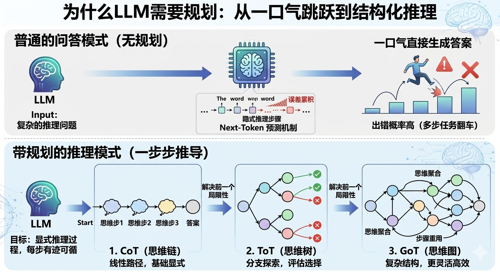

背后的原因是 Transformer 的 next-token 预测机制，每个 token 是基于前面所有 token 生成的，推理链越长、隐式的跳步越多，误差就越容易在中间某一步悄悄累积，最后给出一个看起来很自信但其实是错的答案。

「规划能力」要解决的是把目标、步骤、依赖和验收条件变成可执行状态，而不只是把推理文字写长。可追踪性应来自结构化计划、工具调用、状态和校验，不依赖暴露完整内部推理。

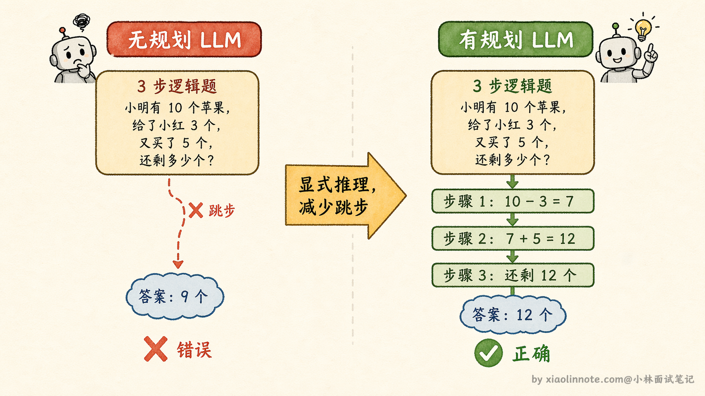

CoT、ToT、GoT 是论文和教学中常见的三种推理结构，但不是线性升级路线，也没有“后一种必然更好”的关系。

### CoT：最简单的激活方式，加一句话就够了

CoT 的全称是 Chain of Thought（思维链），核心是让模型进行分步推导；prompt 可能诱导出计划或摘要，但不应假设会稳定产生完整、真实且适合暴露的内部推理。

为什么这么简单的改变就有效？

本质是因为 LLM 的输出是顺序生成的，当它先输出推理步骤，这些推理内容会进入上下文，影响下一个 token 的生成。换句话说，「写下来的推理过程」本身就成为了后续生成的依据，帮助 LLM 不跳步、不乱想。就好比你在纸上演算数学题，把每一步写出来之后，下一步出错的概率会比在脑子里算要低得多，原理是一样的。

CoT 有两种触发方式。

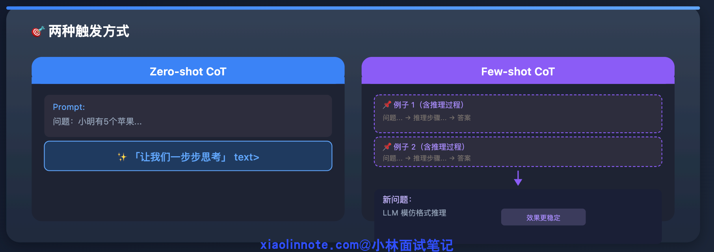

- 第一种叫 Zero-shot CoT，就是直接在 prompt 末尾加「让我们一步步思考」，LLM 自己展开推理，不需要额外例子；
- 第二种叫 Few-shot CoT，给几个“输入 -> 结构化步骤/结论”的例子，让模型模仿格式；示例可以展示可公开的步骤或验收字段，不必包含完整隐藏推理，效果和成本仍需在目标任务上验证。

CoT 的局限很明显：它只有「一条推理路径」。如果一开始走错了方向，整条链就歪了，没有任何纠偏机制。

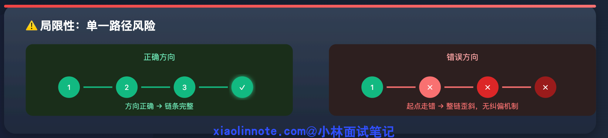

### ToT：从「一条链」到「一棵树」，解决走错方向的问题

ToT 的全称是 Tree of Thoughts（思维树），针对的正是 CoT「一旦走错就全错」的问题。

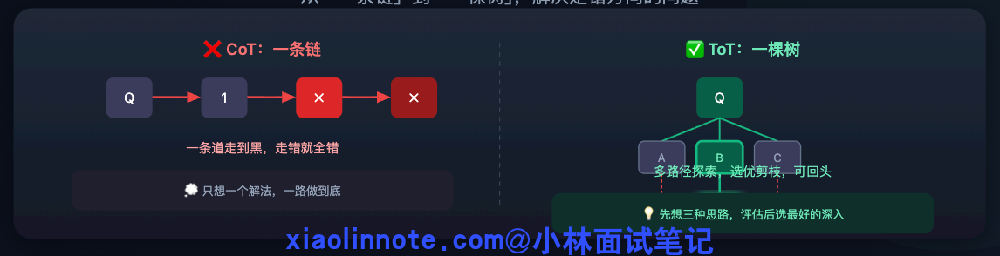

核心改变是把「生成一条推理链」变成「同时探索多条推理路径，边探索边剪枝，最终选出最优路径」。用一个生活类比来理解：CoT 像你做题时只想了一个解法，一路做到底；ToT 像你先想了三种可能的解题思路，评估了一下哪种最靠谱，选了最好的那条继续深入，另外两条直接放弃。

ToT 的执行流程可以分三步来理解。

首先是生成多个候选思路，让 LLM 针对同一个问题给出 3 个不同的初步方向，而不是只走一条路。

然后是评估每个思路的可行性，用另一个 LLM 调用（或同一个 LLM 带上评估 prompt）给每个思路打分，判断哪个最有希望。

最后是选优继续深入、剪掉差的，只保留分数高的思路，再展开下一层推理，反复循环直到得出最终答案。

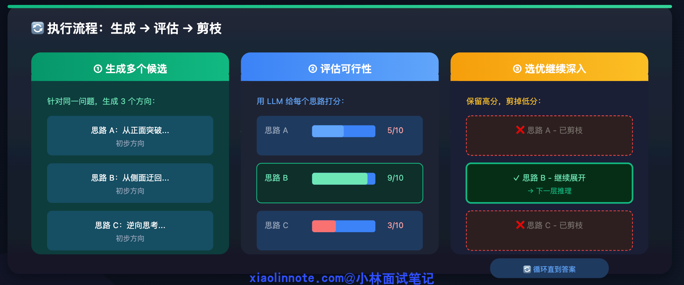

这个「生成 -> 评估 -> 剪枝」的循环让系统可以探索多个候选，但不会自动保证找到最优路径。成本取决于分支数、搜索深度、评估器和并行方式；分支越多，延迟、token 和评估误差也越大。

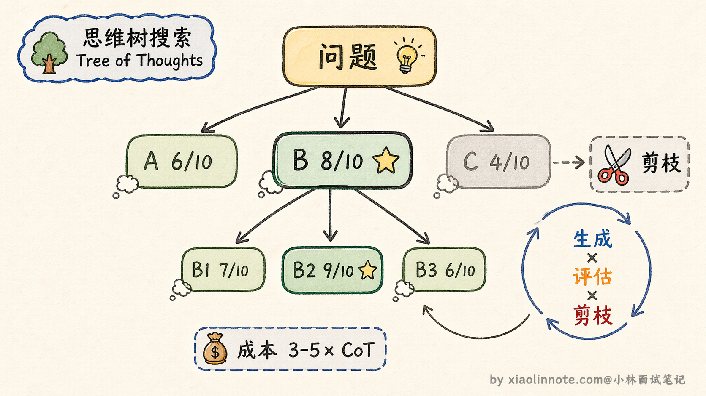

### GoT：从「树」到「图」，解决推理结果不能复用的问题

GoT 的全称是 Graph of Thoughts（思维图），是在 ToT 基础上再进一步的进化。

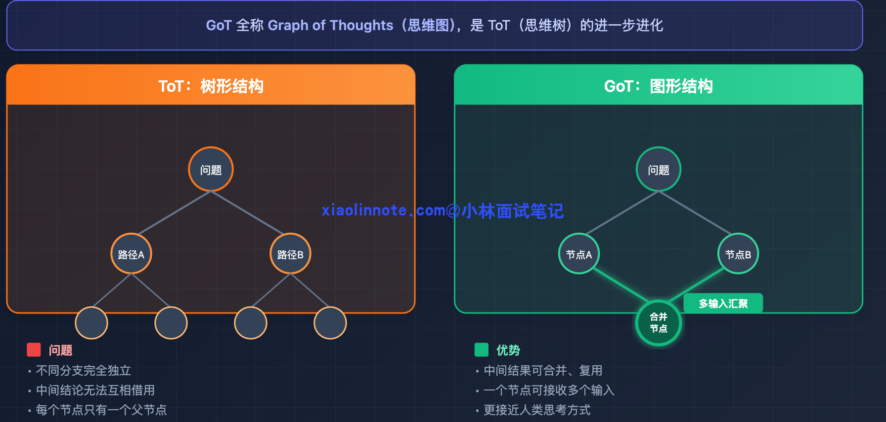

ToT 虽然引入了多路径探索，但它是树形结构，不同分支之间完全独立，两条推理路径上的中间结论无法互相借用。GoT 把推理结构换成了图，允许不同路径的中间结果合并、复用，也就是说一个推理节点可以接收来自多个前置节点的输出作为输入。

举个具体例子：如果任务是「分别研究竞品 A 和竞品 B，然后做综合对比分析」。ToT 里研究 A 和研究 B 是两条独立的路径，各自得出结论；但「综合对比分析」这一步需要同时用到两条路径的结论，在树形结构里很难自然表达，因为树的每个节点只有一个父节点。

GoT 的图结构允许把「研究 A 的节点」和「研究 B 的节点」的输出，汇聚到「综合对比分析节点」，这种「多个中间结论合并输入到下一步」的操作在图里是一等公民，表达起来非常自然。

GoT 能表达合并、复用和多父节点依赖，但调度、去重、状态一致性和评估都更复杂。它是否适合生产取决于任务是否真的需要图结构，以及团队能否承担运行时和评估成本。

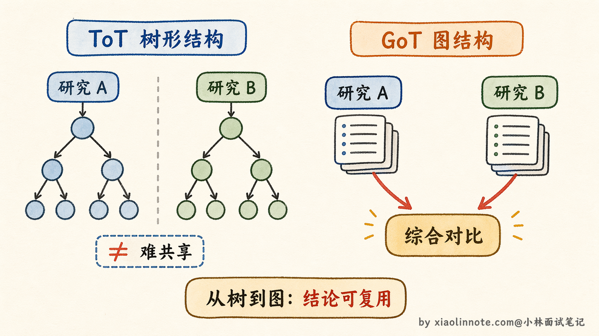

### 三者的演进关系

把这三者放在问题分解视角里看更稳妥：

CoT 关注分步推导，ToT 关注候选路径搜索与评估，GoT 关注中间结论的合并与复用。它们都可能失败：评估器会误判，搜索会放大错误，图结构也会增加协调成本。

工程上怎么选？先用结构化计划、规则校验或 Workflow 建立基线；只有任务确实需要多候选探索时再尝试 ToT，需要结论合并/复用时再考虑 GoT。对每种方案测完成率、评估一致性、延迟、token/费用和失败恢复，不用固定倍数做承诺。

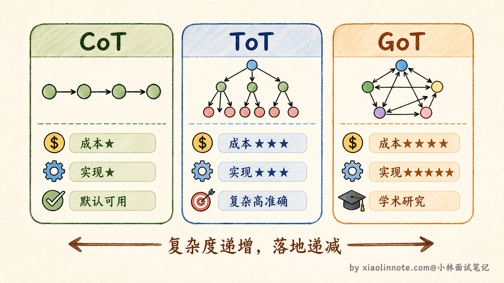

### 工程里真正常用的规划模式：Plan-and-Execute

CoT、ToT、GoT 说的都是「怎么让 LLM 把推理过程做得更好」，但在真实的 Agent 项目里，还有一种更贴近工程实践的规划模式，叫做 Plan-and-Execute（先规划再执行）。

这个模式的思路很直白：面对一个复杂任务，先让 LLM 制定一份完整的执行计划，把任务拆成若干步骤，然后一步一步执行，每完成一步就检查一下进度，必要时调整后续计划。你可以把它理解成「先写大纲再动笔」的写作方式，而不是拿到题目就开始一口气往下写。

为什么需要这种模式？因为 CoT 虽然能让 LLM 逐步推理，但它是「边想边做」的，走到哪算哪，没有全局视角。对于一个需要调用多个工具、经历多个环节的复杂任务来说，如果没有一个整体规划，LLM 很容易在某一步跑偏，后面的步骤全都白费。Plan-and-Execute 的核心价值就是：先用一次 LLM 调用建立全局视角，再用后续调用逐步落地，把「规划」和「执行」分成两个阶段来做。

具体执行流程分三步。

- 第一步，Planner（规划器）接收用户任务，生成一份步骤清单，比如「第一步搜索相关资料，第二步整理关键信息，第三步撰写总结报告」。
- 第二步，Executor（执行器）按照清单一步步执行，每步可能涉及工具调用或 LLM 推理。
- 第三步，也是容易被忽略的关键，每执行完一步，会有一个 Re-planner（重新规划器）回顾当前进展，判断原来的计划还适不适用，如果中间发现了新的信息或者某步执行结果不符合预期，就动态调整后续步骤。

这个模式和 ReAct 是什么关系？ReAct（Reasoning + Acting）是一种让 LLM 在每一步都先「思考」再「行动」再「观察」的循环模式，它的特点是每步都是即时决策，没有提前规划。Plan-and-Execute 则是在 ReAct 的基础上加了一层全局规划，你可以理解成 ReAct 负责每一步怎么执行，Plan-and-Execute 负责这些步骤的整体编排和动态调整。两者不是替代关系，而是经常搭配使用的。

工程上 Plan-and-Execute 的好处是把计划、执行和重规划的边界显式化；规划和执行可以尝试不同模型，但质量、延迟和成本要实测。LangGraph 等图运行时可以实现这种模式，具体 API 与能力以锁定版本的文档为准。

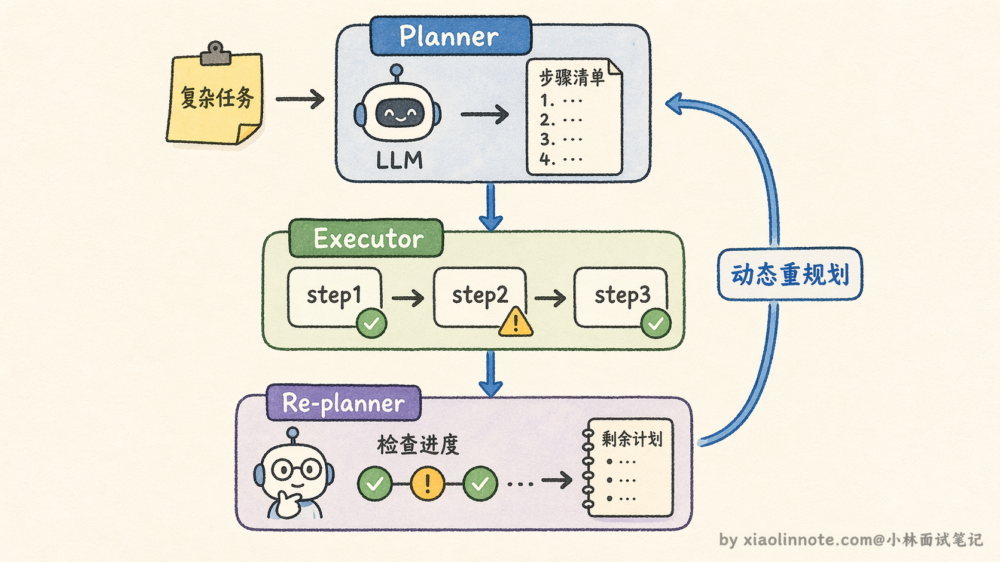

### 从“想法”到可执行计划

工程上不要直接把一段自然语言计划当作控制流。可以要求 Planner 输出经过 schema 校验的结构，例如：

```json
{
  "steps": [
    {"id": "s1", "goal": "收集资料", "depends_on": [], "acceptance": ["有来源"]},
    {"id": "s2", "goal": "整理对比", "depends_on": ["s1"], "acceptance": ["覆盖指定维度"]}
  ]
}
```

运行时再检查依赖是否成环、工具是否在白名单、参数和权限是否满足，并在每一步记录状态。只有在工具失败、证据不足或验收不通过等明确触发条件下才重规划；写操作还要有幂等键、人工确认或可回滚方案。

## 🎯 面试总结

回顾开头踩的雷，第一个最典型：把「CoT 就是规划能力」画等号，这是这道题最常见的误区。规划能力是个方向，CoT 只是最基础的一种实现手段。

答好这道题有几个层次。

首先要说清楚为什么需要规划能力，LLM 默认「一口气」生成答案，没有显式推理过程，多步推理任务容易跳步出错，规划机制就是把隐式推理过程显式化。

然后要说三种机制的演进逻辑：CoT 解决「要不要把推理写出来」，ToT 解决「走错了方向怎么纠偏」，GoT 解决「不同路径的中间结论能不能复用」，每一个都是针对上一个的局限性改进。

最容易被忽略的考点是工程取舍：逐步推理提示并不等于可靠规划，也会增加输出或暴露不必要的推理细节；ToT/GoT 只有在分支探索或结论汇聚能带来可测收益时才值得引入，调用次数、状态和评估复杂度应由候选数、深度、预算和验收指标共同控制。

面试里如果能把工程成本和适用场景说清楚，比只讲原理要加分得多。

---
