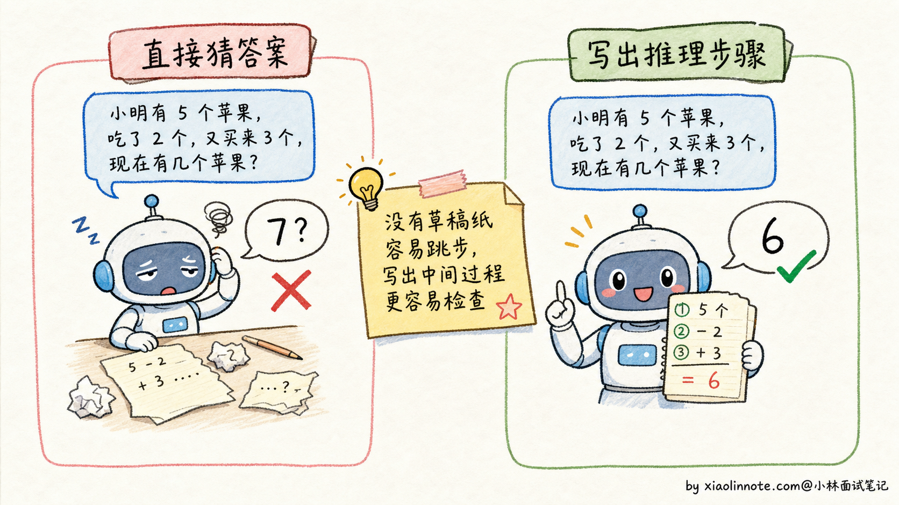
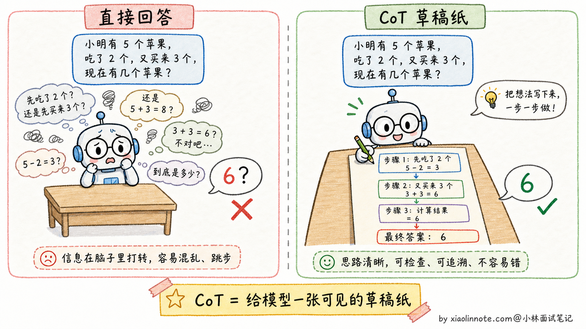
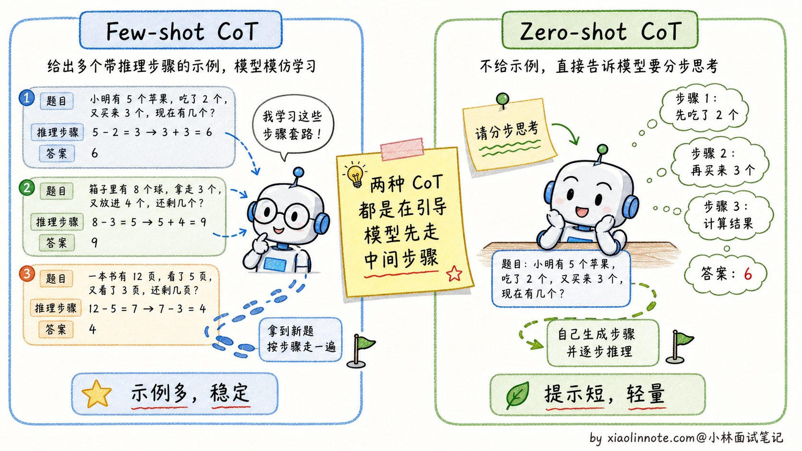
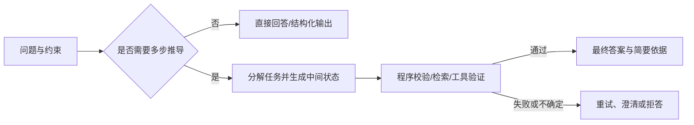
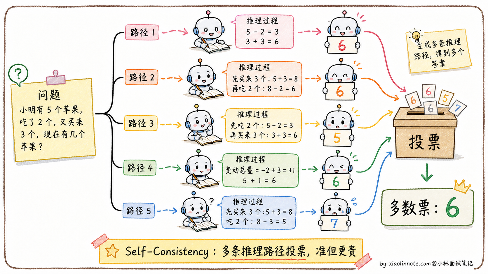
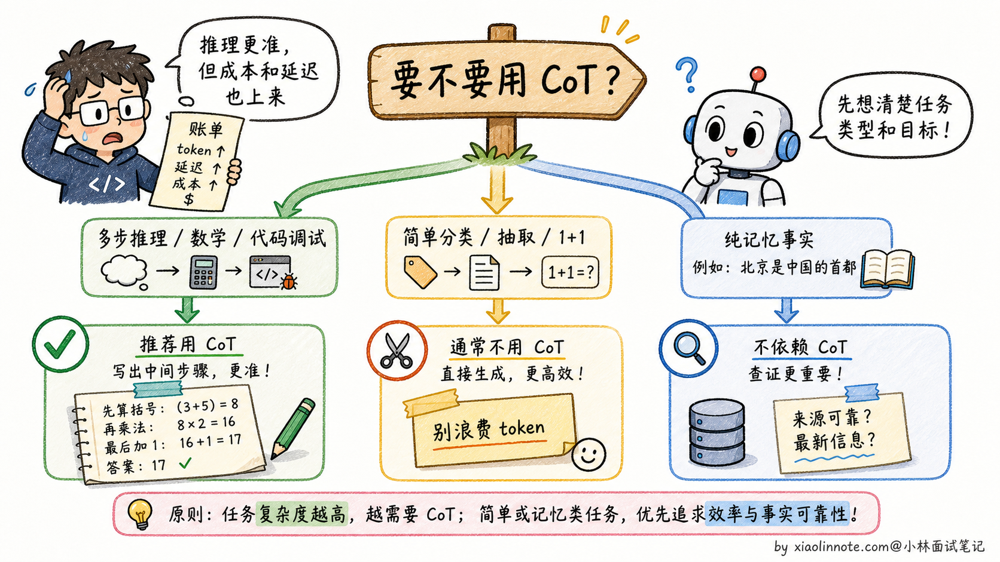

# 什么是 CoT？为啥效果好？它有什么缺点或局限性？

> 原文：[什么是 CoT？为啥效果好？它有什么缺点或局限性？](https://xiaolinnote.com/ai/llm/cot.html) · 小林面试笔记

👔面试官：来讲讲什么是 CoT？为啥效果好？它有什么缺点或局限性？

🙋‍♂️我：CoT 就是 Chain-of-Thought，让模型一步步思考，效果会更好。

👔面试官：……「让模型一步步思考」是表面话。**为什么**一步步思考效果就好？模型有想吗？再说，CoT 一定有用吗？什么场景下会反而拖累效果？

🙋‍♂️我：呃，应该是模型推理过程里能看到中间步骤？

👔面试官：方向对。但你只说了好的一面，没说局限。CoT 不是万能的，对简单问题反而是浪费 token，推理链本身也可能出错。这两个限制你能讲清楚吗？

🙋‍♂️我：呃……我以为 CoT 都是好的。

👔面试官：典型的「只看好处不看代价」。CoT 的成本（token 多 + 延迟高）和风险（推理链错误传导）都得讲清楚，才知道什么时候该用。回去搞清楚再来。

这几个反问问下来，其实点的是同一件事，CoT 真不是一句「让模型一步一步想」能糊弄过去的。它为什么有效、什么时候反而起反作用、怎么和 Few-shot 搭配，得连着讲清楚。

## 💡 简要回答

CoT 我第一次用是在做一个需要多步逻辑推理的任务，发现只要让模型先分步分析，效果提升就很明显。后来理解了为什么：模型是一个 token 一个 token 生成的，让它先组织中间步骤，等于给了它「草稿纸」，后面生成答案时能利用前面的推理上下文，自然出错就少了。缺点也很实际，消耗的 token 会多很多，延迟和成本都上去了，而且推理链本身也可能出错、错误还会累积传导。所以我的经验是：对需要多步推理的任务用 CoT，简单问答直接回答就好；对外产品里不一定展示完整 CoT，展示简要理由或核查步骤通常更合适。

## 📝 详细解析

### 没有 CoT 时模型在做什么

大语言模型在没有 CoT 的情况下，处理问题的方式有点像人在没睡醒的时候凭直觉答题：看到题目，从记忆里拼出一个听起来合理的答案，跳过了中间的推理过程。对于简单问题，这没什么问题。但一旦题目涉及多步计算、逻辑推导或因果链，直接跳答案就很容易出错，因为模型没有一步步「检查」自己的逻辑。

一个经典的例子：问模型「小明有 5 个苹果，他给了小红 2 个，然后又买了 3 个，最后还剩几个？」如果模型直接输出答案，可能会犯各种错误，比如只做了一步运算。但如果让模型写出推理过程：「小明初始 5 个，给出 2 个后剩 3 个，再买 3 个后变成 6 个」，每一步都很容易验证，错误自然就少了。

### CoT 的核心思路

CoT 的本质是让模型「推出来」而不是「直接猜出来」。对于复杂问题，答案无法直接从训练数据里召回，但可以通过一步步推理得到。每一步推理都基于上一步的结论，整个过程在模型上下文里更清晰。

但要注意，「让模型推理」和「把完整推理链展示给用户」不是一回事。现代产品和 API 往往会让模型内部完成推理，最终只给用户简洁答案、关键依据或可核查步骤。这样既保留推理收益，又避免输出冗长、不稳定的思考链。

一个关键的洞见是：语言模型生成 token 的方式本身就支持这种逐步推理，因为模型是一个 token 接一个 token 生成的，每生成一个新 token 时都能「看到」前面所有已生成的内容。所以让它先生成推理步骤，相当于给后续的答案生成提供了更多的「工作记忆」。

基于这个思路，CoT 有两种实现方式，复杂度不同，适用场景也有差异。

### 两种 CoT 形式

- **Few-shot CoT** 是在 Prompt 里给出几个完整的「推理示例」，每个示例都包含问题、可核查的中间步骤和最终答案。模型可能据此模仿任务结构，但效果依赖示例质量、任务分布和模型能力，不能保证“最稳定”。
- **Zero-shot CoT** 更简单：在问题末尾加上一句「请分步思考后再给结论」这类提示。它可能诱导模型生成中间步骤，但并不等于增加了真实的验证能力；对不同模型、语言和任务的收益需要实测。

### 为什么 CoT 有效

CoT 有效的原因可以从几个角度来理解。

- 第一，逐步推理让每一步的错误都暴露出来，方便模型（或人）发现和纠正，而不是把错误隐藏在一个不透明的「答案」里。
- 第二，中间步骤充当了「草稿纸」的作用，复杂的中间状态不再需要全部存在模型的「隐状态」里，通过显式输出记下来，减轻了模型的推理负担。
- 第三，CoT 激活了模型在预训练时从大量推理型文本（数学解题、逻辑分析等）中学到的推理模式。

把 CoT 放进生产链路时，还应补上校验环节：

中间步骤只是候选工作轨迹，不应直接当作事实或安全授权；真正重要的是可执行的验证器、停止条件和不确定性处理。

### Self-Consistency：CoT 的升级版

Self-Consistency 是在 CoT 基础上的进一步增强。做法是对同一个问题，用较高的温度（temperature）生成多条不同的推理路径，然后取最终答案里出现最多次的那个（多数投票）。

这个方法的直觉是：若多条独立路径收敛到同一答案，答案可能更可靠；但错误也可能因为共享偏差而一致，且多数投票只适合有可比较答案的任务。采样次数、温度和收益没有固定值，应在验证集上用预算约束评估。代价是调用次数、输入重复计算和延迟增加；如果有程序验证器，往往还应比较“多次采样 + 验证”和“单次生成 + 验证”的收益。

### CoT 的局限性

CoT 并不是万能的，它有几个明显的局限。

首先是 token 消耗和延迟增加，实际增加量取决于任务、模型、停止条件和是否有隐藏推理预算。其次是对简单问题可能适得其反：让模型对「1+1 等于几」也展开推理，通常只是在消耗预算。再者是推理链本身也会出错：如果某一步前提错了，后续可能沿着错误路径继续推导；“看起来详细”不等于正确。

CoT 能减少跳跃性错误，但不能消除推理错误。最后，CoT 对纯粹依赖记忆的任务（比如「请问 2020 年奥运会在哪里举办」）没有帮助，因为这类问题根本不需要推理。

简单来说，CoT 是为「需要多步推理」的问题设计的工具，在数学、逻辑题、代码调试这类场景里很有价值；对简单问答、分类、信息提取这类不需要推理的任务，用普通 Prompt 就好了。

## 🎯 面试总结

回到开头那段对话，问到 CoT，最重要的是先把**为什么有效**讲清楚。模型是一个 token 一个 token 生成的，让它先组织推理步骤，等于给了它一张「草稿纸」，后面生成答案时能利用前面的推理上下文，自然出错就少了。这一句铺垫先讲到，面试官就知道你抓到了 CoT 的本质机制。

讲完原理后，把**两种 CoT 形式**说清楚。Few-shot CoT 用示例约束任务结构，但会占用上下文；Zero-shot CoT 只增加指令，成本低但收益更不稳定。两者都要用任务集验证，不能把提示词当成准确率保证。

最关键的是讲清**CoT 的局限**：额外 token 与延迟随任务变化；简单或纯检索任务可能不需要推理；中间步骤可能是错的或事后合理化，错误会沿链路传导；对外展示完整推理链还可能泄露敏感信息。生产中应配合验证器、预算和拒答/澄清策略。

如果还想再加分，可以提一句 **Self-Consistency**（多次采样多条路径，再按答案聚合或交给验证器），同时强调它不是免费提升：要比较额外成本、延迟、相关错误和验证收益。生产环境也不必展示完整 CoT，通常展示结论、简要依据、引用或可复核的步骤。

---
