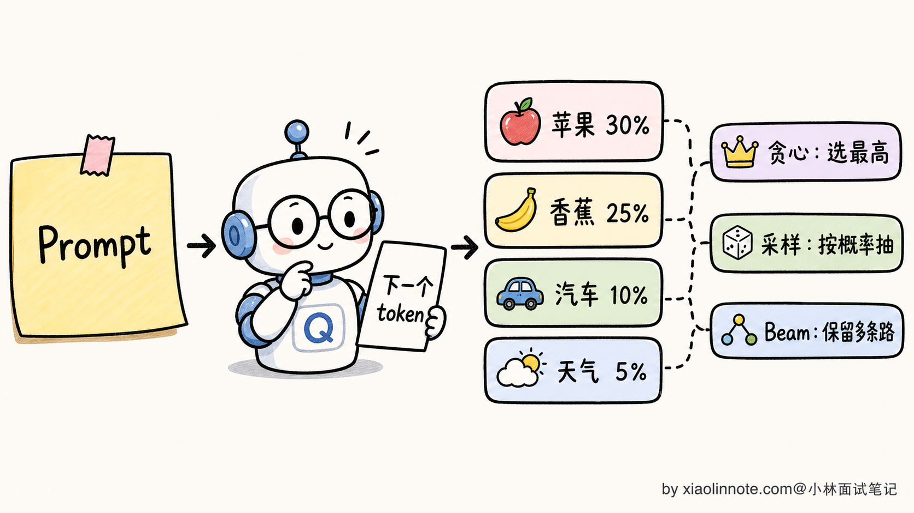
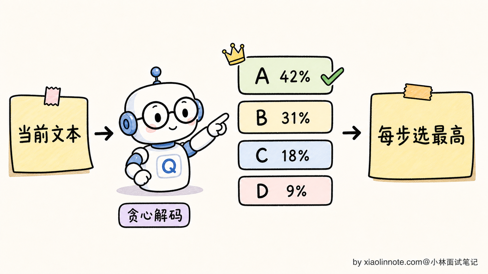
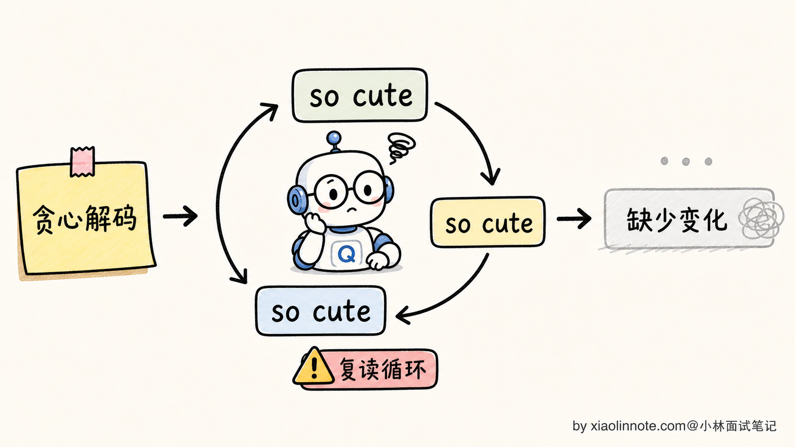
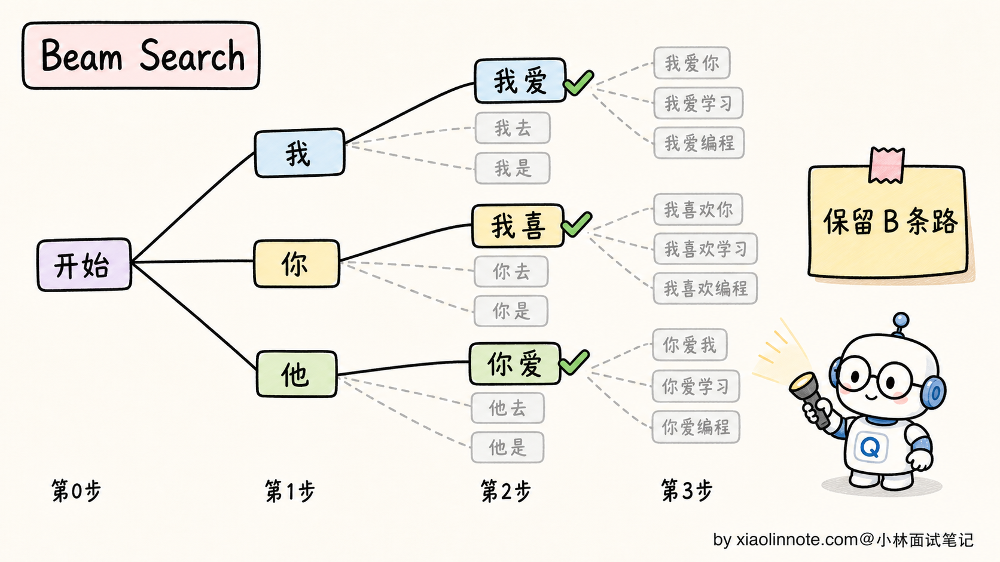
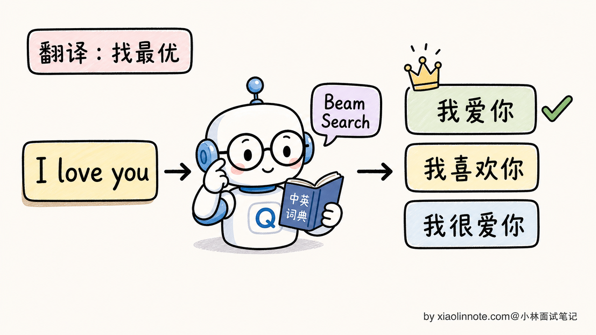
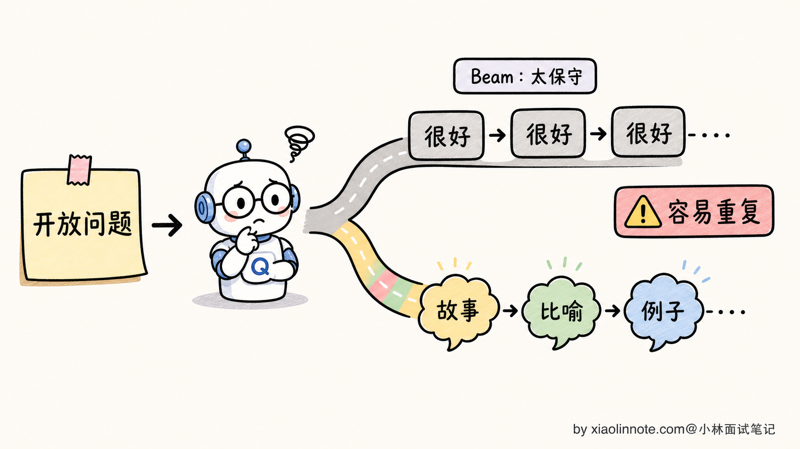
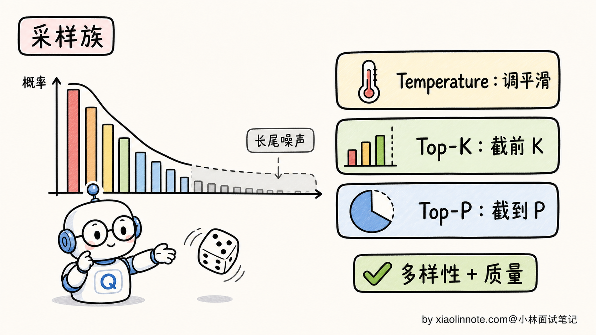
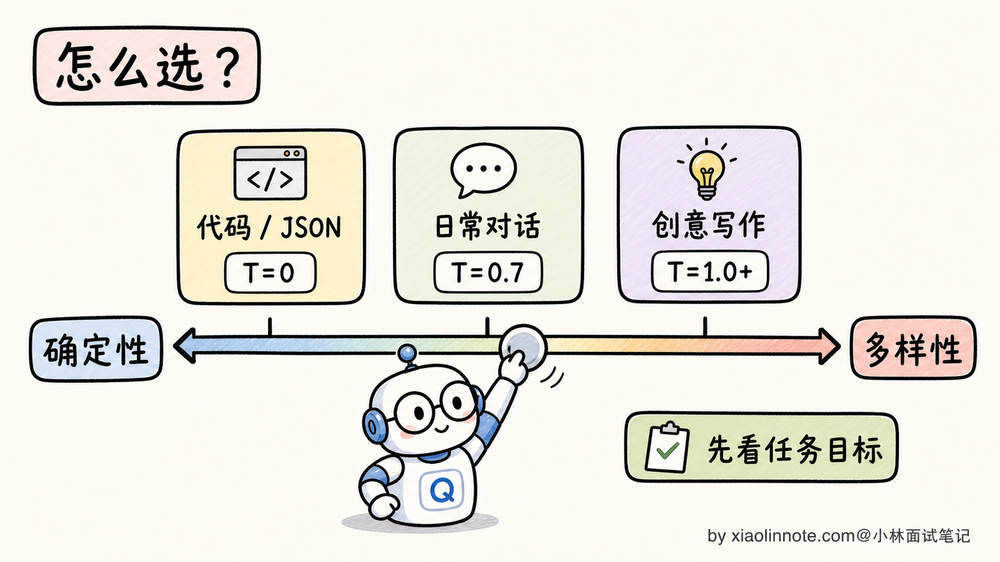
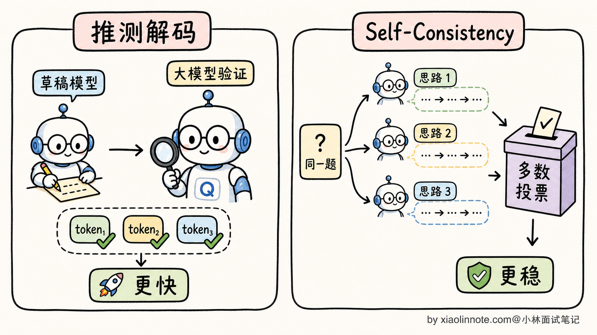

# 大模型生成文本时的解码策略有哪些？贪心、Beam Search、采样分别什么时候用？

> 原文：[大模型生成文本时的解码策略有哪些？贪心、Beam Search、采样分别什么时候用？](https://xiaolinnote.com/ai/llm/decoding_strategies.html) · 小林面试笔记


👔面试官：来讲讲大模型生成文本时的解码策略有哪些？贪心、Beam Search、采样这几种各自在什么场景用？

🙋‍♂️我：解码策略就是怎么从模型输出的概率分布里选一个 token。最简单的是贪心，每次选概率最高的那个；复杂一点是 Beam Search，会保留几个候选；还有采样的，有 Temperature、Top-K、Top-P 这些。

👔面试官：……你只列了名字，没说本质。贪心和采样的区别是「确定 vs 随机」，那 Beam Search 是确定还是随机？为什么 LLM 现在很少用 Beam Search 了？翻译模型时代为什么大家都用 Beam Search？

🙋‍♂️我：哦哦，Beam Search 应该是确定的，能更准。LLM 不用是因为……更慢吧？

👔面试官：「更慢」是表面原因。深一点说，Beam Search 在翻译时代很受欢迎是因为翻译任务有「单一最优译文」的特性，但生成式对话/写作任务没有「单一最优答案」，Beam Search 的「保留多个高概率路径」反而成了缺陷。这个本质区别你能讲清楚吗？

🙋‍♂️我：呃……我没想这么深。

👔面试官：那再问一个：贪心解码和「Temperature=0 的采样」是同一回事吗？为什么 LLM 工程实践里大多数推理 API 默认用 Temperature 采样而不是贪心？回去搞清楚再来。

问到这里我自己也清醒了，解码策略表面是「下一个 token 怎么挑」，本质是「不同生成任务想要什么样的结果」。把这层捋顺，每种策略适合在哪用就自然出来了。

## 💡 简要回答

我理解大模型的解码策略本质上是回答一个问题：**模型在每一步输出了一个 vocabulary 大小的概率分布，我们怎么从中选下一个 token？**

主流方案分两大类。

第一类是**确定性策略**，输入相同输出永远相同。

- **贪心解码（Greedy Decoding）**：每一步选概率最高的 token。简单、可复现，但容易重复啰嗦、缺乏多样性
- **Beam Search**：每一步保留 Top-B 条高分候选路径，最后按长度归一化等评分选一条序列。它比贪心保留更多搜索分支，但计算/显存开销随束宽和实现增加；束宽取值没有跨任务的固定标准。

第二类是**随机性策略**，引入随机性让输出有多样性。

- **Temperature 采样**：通过缩放概率分布的「锐度」，控制随机性强度。Temperature 越低越确定，越高越发散
- **Top-K 采样**：每步只从概率最高的 K 个 token 里采样，截断长尾
- **Top-P（Nucleus）采样**：每步累加概率到 P 为止，从这个「核」里采样，自适应截断

这两大类的核心区别是，**确定性策略保证质量但牺牲多样性；随机性策略保证多样性但每次输出不同**。

LLM 工程实践里常见的现象是：开放式聊天和写作较少默认使用 Beam Search。原因是 Beam Search 优化的是序列概率，而开放式任务通常存在多个可接受答案；高概率序列可能更保守、重复或缺乏多样性。但翻译、受约束生成、候选重排等任务仍可能使用它，不能说“已经弃用”。

许多 LLM API 会提供 **Temperature + Top-P** 这类采样参数，但默认值、参数组合和是否支持 Beam Search 都由供应商/模型决定。更稳的工程表达是：精确任务从低随机性或受约束解码开始，开放任务再增加多样性，并用回归集观察质量、格式错误和重复率。

## 📝 详细解析

### 解码策略的本质：从概率分布里选下一个 token

要讲清楚解码策略，得先回到大模型生成的最底层机制。

LLM 是自回归生成的，每生成一个新 token，模型都会输出一个 vocabulary 大小的 logits/概率分布。所谓的「解码策略」，就是回答**怎么从这个分布里选一个 token 出来**；词表大小和分布形状随 tokenizer 与模型而变，不宜背固定数字。



不同的解码策略就是不同的「选择规则」。规则的差异不只是「选哪个」，更深层是**对生成任务本质的不同假设**：

- 贪心和 Beam Search 更偏向寻找高概率序列，但这不等于任务真的存在唯一最优答案
- Temperature/Top-K/Top-P 允许从候选分布采样，用随机性探索多个合理答案

理解了这个底层假设的差异，下面五种策略各自的取舍就好理解了。

### 贪心解码：最简单也最容易踩坑

贪心解码（Greedy Decoding）是最朴素的策略：**每一步无脑选概率最高的那个 token**，然后这个 token 拼到序列后面，进入下一步。



贪心解码的优点：

- **极简**：每步只挑最大值，时间复杂度 O(V)，几乎没开销
- **完全确定**：相同输入永远得到相同输出，便于调试和复现
- **不引入随机性**：API 调用结果稳定，对单元测试、批处理友好

但贪心有一个臭名昭著的毛病，叫「**复读机问题（Repetition Loop）**」。

举个具体例子。让 GPT-2 用贪心解码续写「I love my dog because」，常见的输出会是这样：

```
I love my dog because he is so cute. He is so cute. He is so cute. He is so cute. ...
```

为什么会这样？因为模型某一步生成了「He is so cute」，下一步在概率分布里发现「He is so cute」这个模式刚刚出现过、上下文里这个模式的概率很高，又选了它；再下一步又选了一遍。贪心策略一旦走进这种「自我加强的循环」，就出不来了，会一直无限重复。



更隐蔽的问题是，贪心解码生成的文本**乏味、保守、缺乏惊喜**。因为模型每步都选最稳的那条路，最终生成的文本就是「最大众化的表达」，读起来很 boring。这对代码生成、信息抽取这类任务可能没问题，但对创意写作、对话场景就太单调了。

不过贪心也有它的最佳战场：**精确任务**。比如代码生成、SQL 生成、JSON 抽取这种「输出有标准答案」的任务，贪心反而是首选，因为它确定、不会乱写。

### Beam Search：翻译时代的王者

Beam Search 是贪心的扩展版本，思路是：**每一步不只保留一条路径，而是保留 B 条高分路径同时推进**（B 叫「束宽」beam width）。实际实现还要处理长度偏置、停止条件、重复惩罚、约束和候选去重。

具体怎么做？看个例子，假设 B=3：

- 第 1 步：模型预测下一个 token 的概率分布，保留前 3 个：「我」「你」「他」
- 第 2 步：把这 3 个 token 各自当作前缀继续预测，得到 3×V 个候选（V 是 vocabulary 大小），从中挑总概率最高的 3 条路径，可能是「我喜」「我爱」「你爱」
- 第 3 步：重复上述过程，3 个前缀各自展开，挑总概率最高的 3 条
- ……一直进行到生成结束（遇到 EOS token）
- 最后从 3 条最终路径里选**整体概率乘积最高**的那条作为输出



Beam Search 的优点：

- **全局视野更好**：能避开贪心走进死胡同的情况。比如某一步贪心选错了，Beam Search 还有其他 B-1 条备份路径可以走
- **接近全局最优**：总体概率上比贪心高得多，输出更「合理」

Beam Search 在 2014-2018 年的**机器翻译时代**是绝对主流，几乎所有翻译模型（Google NMT、Facebook fairseq、OpenNMT）都用 Beam Search。原因是翻译任务有一个独特属性：**给定源语言句子，存在一个或几个「最优译文」**，Beam Search 的「找概率最高序列」目标和翻译任务高度匹配。



但到了 LLM 时代，Beam Search 在开放式生成中的默认地位下降了。原因得单独讲一节。

### 为什么 LLM 时代 Beam Search 失宠了

这是一个面试里的高频追问点。表面理由是「Beam Search 慢」（B 倍计算量），但深层原因是**生成式任务的本质和 Beam Search 的目标不匹配**。

Beam Search 的优化目标是「**找到整体概率最高的那条序列**」。这个目标在翻译时代很合理，因为「I love you -> 我爱你」这种翻译任务确实有「最优答案」。但在 LLM 的开放式生成任务（写故事、对话、回答开放问题）里，**根本不存在「最优答案」**，存在的只是「一个广阔的合理回答空间」。

更糟的是，Beam Search 在长序列上可能出现一个反直觉的失效模式：**高概率序列并不一定是最有帮助、最自然或最多样的内容**。

为什么？因为「整体概率最高」往往等价于「每一步都选最稳的词」。最稳的词通常是「重复前面已经出现过的内容」，因为重复内容在概率分布上特别尖锐（模型对重复模式特别熟悉）。结果就是 Beam Search 在生成长文本时，会陷入和贪心类似的复读，甚至比贪心还严重。



束宽增大通常会带来更多搜索计算，但质量变化取决于模型、长度归一化、重复惩罚和任务；不能把“B 越大越差”或某个固定束宽当成普遍规律。

还有一个工程上的代价：**Beam Search 会让现代 LLM 推理调度更复杂**。

KV Cache 需要同时维护多个分支；实现可以共享公共前缀或使用分页/树状存储，但分支越多，调度、显存和带宽压力越大。Flash Attention、PagedAttention 等并非与 Beam Search 理论上不兼容，只是需要框架对分支、重排和缓存复用做额外支持。

所以许多推理框架会支持或部分支持 Beam Search，但是否可用、性能如何要看版本和模型；开放式对话和写作通常优先采用采样。更准确地说，Beam Search 从通用默认策略退回了特定任务工具，例如翻译、受约束生成或候选重排。

### 采样族：用随机性换多样性

LLM 时代的解码主流是**采样**，核心思路从「找最优」变成「按概率分布掷骰子」。

最基础的采样叫**普通采样（vanilla sampling）**：直接按模型输出的概率分布随机抽。这样每次生成的结果都不一样，多样性是有了，但有一个新问题：**长尾噪声**。

模型的概率分布往往有一个「长长的尾巴」，比如「下一个词」分布里前 20 个词概率合起来 90%，但后面还有几万个词分布着 10% 的概率，每个都极小。普通采样有概率从这堆极小概率的词里抽到一个完全不合理的词（比如生成中文时突然冒出「@$%」），让整段输出毁掉。

为了解决长尾问题，业界发展出三种采样调节器：**Temperature、Top-K、Top-P**。



**Temperature** 控制的是分布的**锐度**。数学上，正温度 T 会把 logit 除以 T 再做 softmax：

- T 趋近于 0：在理想数学定义下趋向选择最高 logit；许多 API 把 `Temperature=0` 实现为贪心或近似确定性，但并非所有后端完全相同
- T=1：用模型原始分布采样
- T<1（比如 0.5）：分布变尖锐，更倾向高概率词
- T>1（比如 1.2）：分布变平坦，更倾向探索低概率词

**Top-K** 是固定截断：每步只从概率最高的 K 个 token 里采样，后面全部丢弃。比如 K=50，意味着每步从概率前 50 的词里挑。

**Top-P（Nucleus 采样）** 是自适应截断：从高到低累加概率，超过阈值 P（比如 0.9）就停，从这个「核」里采样。Top-P 的好处是候选集大小会根据分布形状自动调整，分布尖锐时候选集小（几个词就累加到 0.9），分布平坦时候选集大。

这三种调节器的具体使用场景和参数选择，是另一个独立的话题。本题层面只需要记住：**采样族通过引入随机性 + 截断长尾，在「多样性」和「质量」之间找到平衡**。

### 实际选型：什么任务用什么策略

工业界的解码策略选择，本质上是看任务对「确定性」和「多样性」的需求：

| 任务类型 | 推荐策略 | 典型参数 | 为什么 |
| --- | --- | --- | --- |
| **代码生成** | 低随机性/约束解码，必要时多候选 | 从官方默认或低温基线开始 | 关注编译、测试和安全，不只看文本稳定 |
| **SQL 生成 / JSON 抽取** | 低随机性 + schema/语法校验 | 按供应商支持调参 | 结构约束和重试通常比某个温度数字更关键 |
| **数学推理** | 单次生成 + 验证，或预算内多次采样 | 由验证集和成本预算决定 | 多数投票不是对所有任务都有效 |
| **日常对话** | 采样 | 以默认值为基线 | 观察拒答、事实性、重复和用户满意度 |
| **创意写作/头脑风暴** | 更开放的采样 | 逐步增加随机性并设停止条件 | 多样性和可控性需要共同评估 |
| **机器翻译** | Beam/低温采样/约束解码均可能 | 由语言对和评测决定 | 仍可能有多个可接受译文，需看自动指标与人工质量 |



实践中有个简单的判断口诀：

- **任务需要可复现** -> 从贪心或低随机性开始，并锁定模型、模板和后端版本
- **任务有多种合理答案** -> 用采样，并用质量/安全/重复率评估预算
- **任务需要严格格式** -> 优先使用结构化输出、语法约束和程序校验，而不是只调温度

OpenAI、Claude、Qwen 这些主流 API 都提供 Temperature / Top-P 这类参数，但默认值会随模型版本和产品形态变化，不能死记一个固定配置。工程上更可靠的做法是：先用官方默认值作为基线，再按任务是「精确」还是「开放」去调。

### 进阶策略：推测解码与 Self-Consistency

讲到这里，主流策略基本覆盖了。再简单提两个进阶方向，作为面试加分项。

**推测解码（Speculative Decoding）** 是一种推理加速技术。核心思路是用一个**小的草稿模型**（比如 7B）快速生成多个 token，再用**大的目标模型**（比如 70B）一次性验证这几个 token。如果草稿模型的预测和大模型一致，就直接用；不一致就以大模型为准。

为什么可能加速？大模型验证多个草稿 token 时可以提高一次前向的利用率，减少逐 token 调度开销；但收益取决于草稿模型接受率、批量、硬件和实现，可能没有收益甚至变慢。特定接受算法可保持目标模型分布等价，不能把“完全等价”推广到所有近似实现。



**Self-Consistency** 是用于推理类任务的解码增强。核心思路：对同一个数学题/逻辑题，用较高的 Temperature 采样生成 N 条独立的推理路径，最后取**最终答案出现最多次**的那个（多数投票）。

直觉是：正确答案可能通过多条路径得到，聚合后有机会降低单条路径的随机错误；但共享模型偏差也会造成一致错误。收益应以任务集、采样数、验证器和总预算实测，代价不仅是 N 倍调用，还包括重复输入、排队和聚合延迟。

这两个进阶策略都是「在主流采样基础上的加速/加强」，不替代基础解码策略，而是叠加使用。能在面试里提一句，会显得你跟得上工业界的最新实践。

## 🎯 面试总结

回到开头那段对话，问到解码策略，最重要的是先把本质讲清楚。每生成一个 token 都对应一个 vocabulary 大小的概率分布，解码策略就是「怎么从这个分布里挑下一个 token」。不同策略对应「生成任务到底有没有最优答案」的不同假设，这是整道题的地基。

讲完本质，自然过渡到贪心和 Beam Search 这两种确定性策略。贪心每步选最高，简单可复现但容易陷入复读循环；Beam Search 是贪心的并行版，保留 B 条候选最后选总分最高的整条序列。Beam Search 在翻译时代是王者，因为翻译有「单一最优译文」，所以「找概率最高序列」这个目标和任务本质契合。

最关键的是讲清**为什么开放式 LLM 较少默认 Beam Search**：它优化序列概率，而开放式任务有多个合理答案，高概率不等于高帮助；多分支还增加调度和缓存成本。不要说成“与 KV Cache/Flash Attention 不兼容”或“工业界完全弃用”，应结合任务和框架实测。

最后讲采样族（Temperature/Top-K/Top-P）的整体定位。它们用随机性换多样性，配合长尾截断保证质量。实际选型上，精确任务（代码、SQL、JSON）用贪心或低温；对话/写作可以从官方默认值开始微调；创意任务再提高 Temperature，但要用测试集观察跑偏率。

如果还想再加分，可以提一句推测解码（小模型起草、大模型验证，收益依赖接受率和实现）和 Self-Consistency（多次采样后投票或验证，收益依赖任务与预算）。关键是说明这些都是可测量的工程策略，不是固定倍数或准确率承诺。

---
