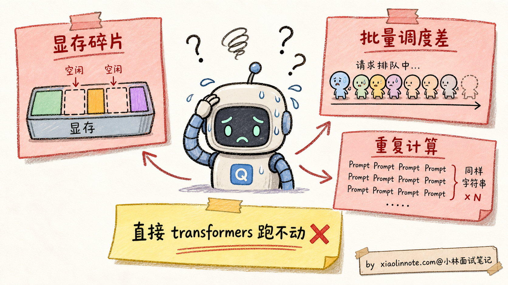
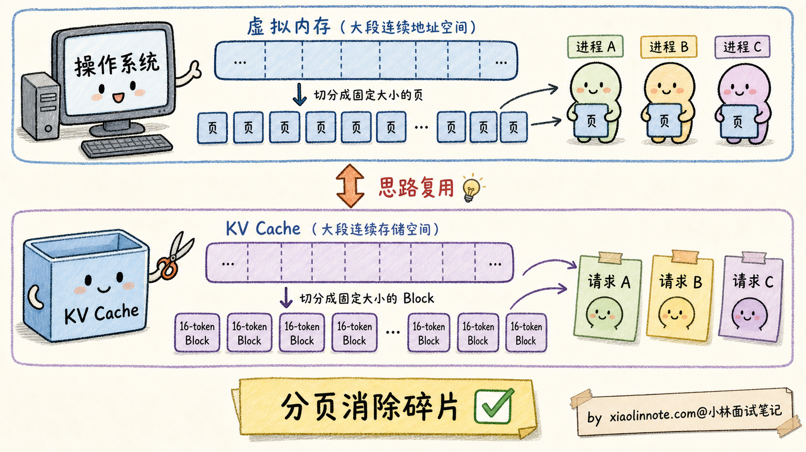
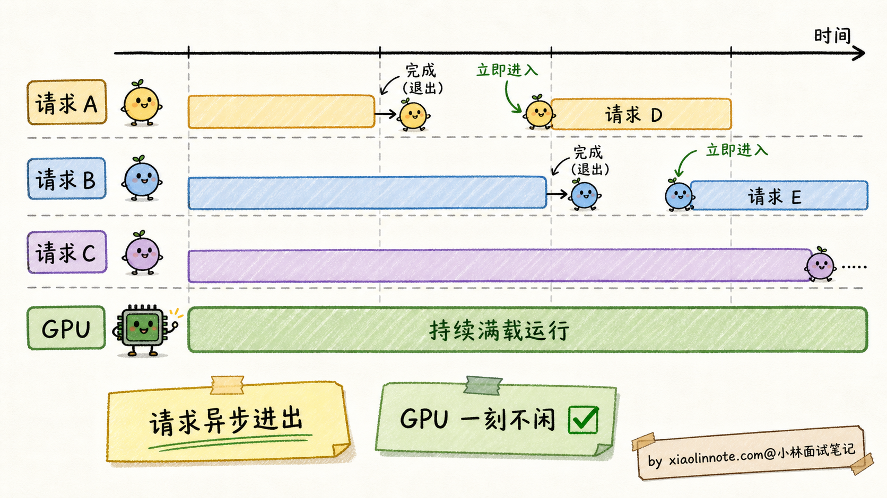
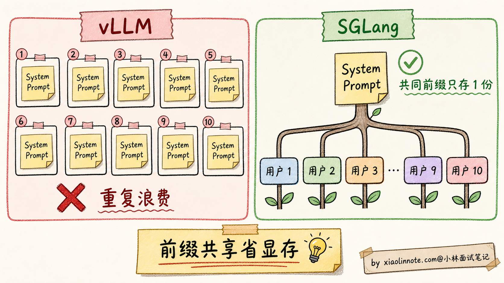
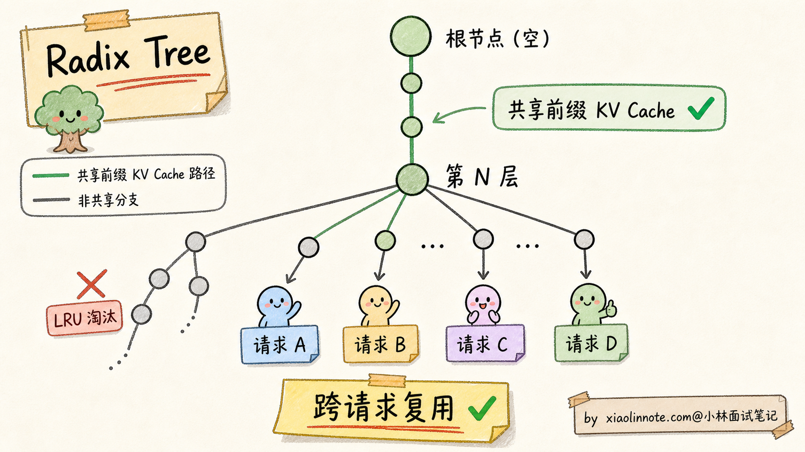
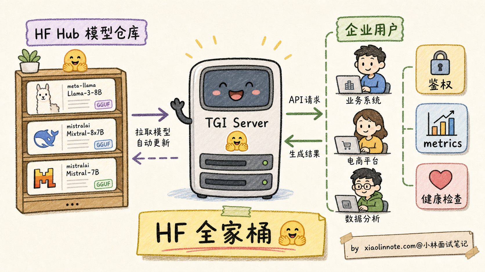
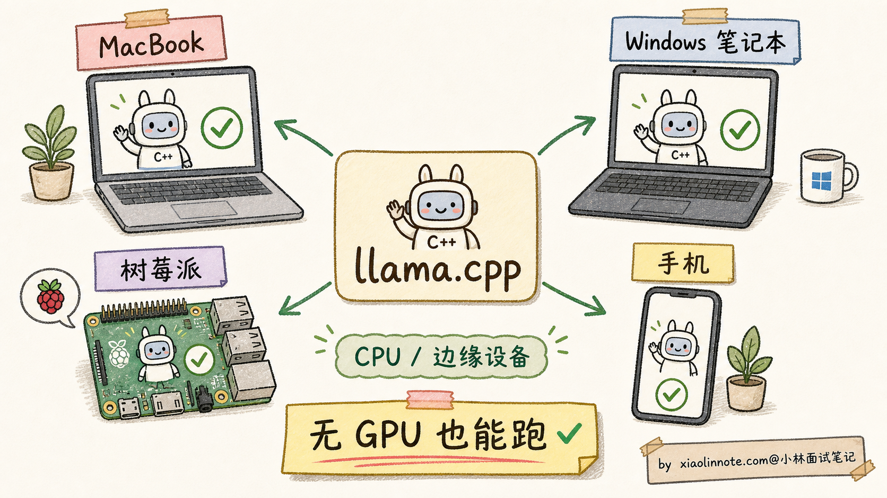
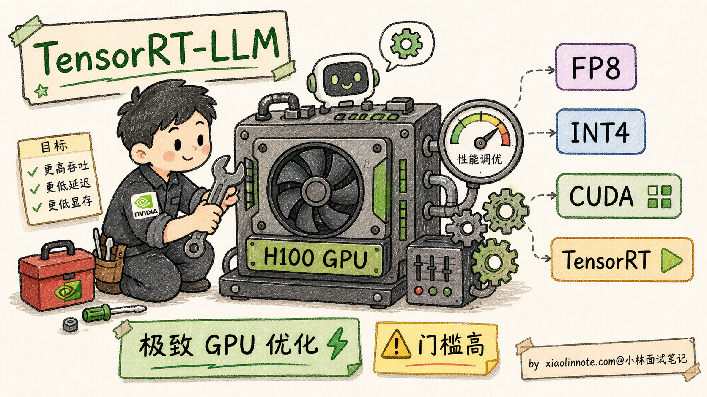
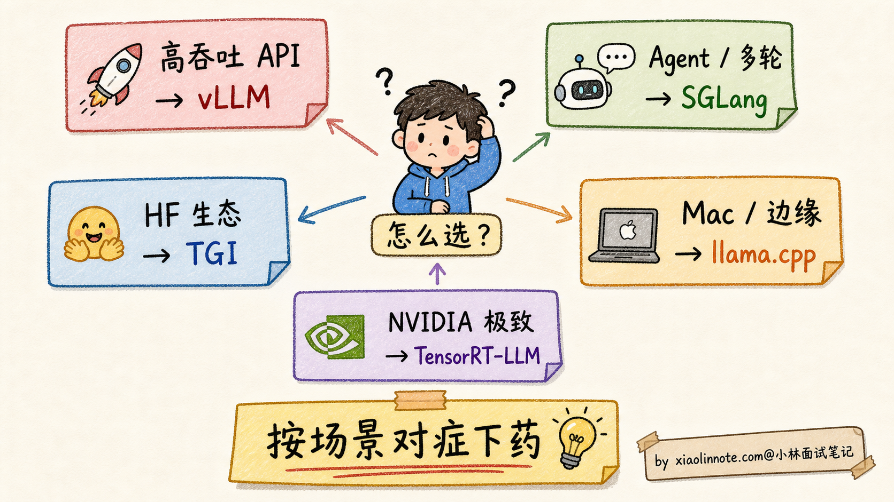
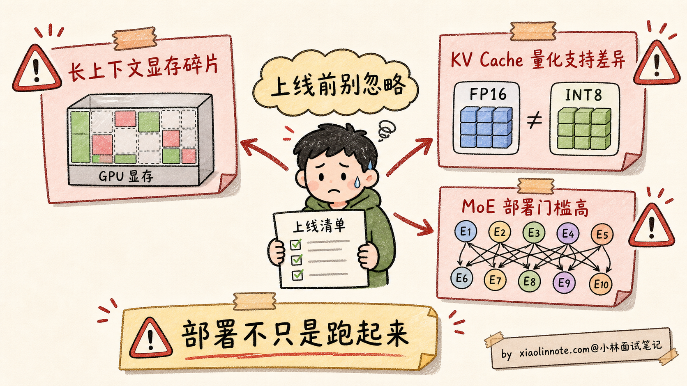

# 大模型部署有哪些主流方案？vLLM、TGI、llama.cpp、SGLang 实际项目里怎么选？

> 原文：[大模型部署有哪些主流方案？vLLM、TGI、llama.cpp、SGLang 实际项目里怎么选？](https://xiaolinnote.com/ai/llm/deployment_frameworks.html) · 小林面试笔记

👔面试官：来讲讲大模型部署有哪些主流方案？vLLM、TGI、llama.cpp、SGLang 这几个怎么选？

🙋‍♂️我：vLLM 用来部署大模型推理，速度快；llama.cpp 是 CPU 推理；TGI 和 SGLang 我没用过。

👔面试官：……「速度快」是表面话，vLLM 凭什么比直接用 transformers 库快？PagedAttention 是什么？为什么这个名字叫「Paged」？

🙋‍♂️我：哦哦，应该是分页管理 KV Cache 吧，类似操作系统的虚拟内存？

👔面试官：方向对，但具体怎么 Paged 你能讲清楚吗？再说，SGLang 的 RadixAttention 和 vLLM 的 PagedAttention 是什么关系？为什么 SGLang 在 Agent / 多轮对话场景比 vLLM 更省？

🙋‍♂️我：呃……RadixAttention 我不太熟。

👔面试官：RadixAttention 是 SGLang 的核心创新，把 KV Cache 组织成共享前缀树（Radix Tree），让多个请求的相同前缀只存一份。这个对 Agent / Few-shot Prompt 这种「前缀重复率高」的场景特别有效。这种细节都不知道，去面试就是被怼。回去补一下。

面试官这一连串追问其实在敲打同一件事，推理框架不是「随便挑一个跑起来」就行。每家解决的核心痛点不一样，PagedAttention、RadixAttention、CPU 量化背后各有一套设计哲学，得对着场景一个个对上。

## 💡 简要回答

我理解大模型部署框架的本质问题是：**怎么在固定的硬件上跑得更快、更省显存、支持更多并发用户？**

主流框架按定位分四类。

**1. vLLM**：常被用于服务化推理。核心能力包括 PagedAttention、连续批处理和多种模型/硬件适配；实际吞吐和显存效率取决于模型、上下文长度、量化、硬件、并发与版本，不能只凭框架名下结论。

**2. SGLang**：面向结构化生成和服务化推理的框架，提供 RadixAttention 等前缀复用能力。共享前缀较多时可能减少重复 prefill，但是否优于其他框架要用相同模型、硬件、请求分布和缓存策略对比。

**3. TGI（Text Generation Inference）**：Hugging Face 生态中的推理服务方案。优点是模型、tokenizer、chat template 和现有服务流程的集成；支持的模型、后端和接口能力需按具体版本验证，性能也要用业务负载基准测试。

**4. llama.cpp**：面向本地、边缘和跨平台推理的 C/C++ 实现，常与 GGUF 模型格式和量化结合，也支持部分 GPU/加速后端。适合本地隐私、离线和资源受限场景；是否能达到目标吞吐取决于设备与模型。

**怎么选**：

- **生产高吞吐 LLM API**：先比较 vLLM、SGLang、TGI 或其他后端的真实负载
- **Agent / 多轮对话 / Few-shot**：重点测共享前缀命中率、prefill/decoding 和缓存失效
- **拥抱 Hugging Face 生态**：优先评估 TGI 或与现有 Transformers 流程兼容的方案
- **本地 / Mac / 边缘 / 离线**：优先评估 llama.cpp 及目标设备后端
- **极致性能、自家定制**：TensorRT-LLM（NVIDIA 官方）

## 📝 详细解析

### 部署框架解决的核心问题

要理解为什么需要 vLLM、SGLang 这些专门的部署框架，得先看看「直接用 transformers 库跑模型」会有什么问题。

最朴素的部署方式是写个 Python 脚本，加载 HF transformers 的 AutoModelForCausalLM，调 `model.generate()`。能跑起来，但效率会很糟糕，三个核心痛点：

**1. KV Cache 显存碎片严重**

朴素实现可能按最大长度预留连续空间，导致内部碎片和容量利用率下降；实际浪费取决于分配器、请求长度分布、batch 和框架，并不存在一组对所有部署都成立的并发数字。

**2. 批量推理调度低效**

朴素批量处理（static batching）是「凑齐 N 个请求一起跑、所有请求一起结束」。但每个请求生成长度不同（有的 50 tokens 就完了、有的要 1000 tokens），短的请求等长的请求，GPU 大量时间在「跑了一半在等」。吞吐率上不去。

**3. 重复计算**

如果每个用户都用同一段 System Prompt（比如 1000 tokens 的产品知识库），朴素实现每次都要重新算这 1000 tokens 的 KV Cache，浪费极大。

部署框架就是为了解决这三个痛点。三大优化方向：**内存高效（显存碎片）+ 批量调度（吞吐率）+ 缓存复用（重复计算）**。每个主流框架在这三个方向上都有自己的创新。

### vLLM 与 PagedAttention：操作系统虚拟内存的灵感

vLLM 的核心能力之一是 **PagedAttention**，它借鉴分页思想管理 KV Cache。

PagedAttention 的灵感来自操作系统的**虚拟内存（Virtual Memory）**。

操作系统怎么管理内存？不是给每个进程预分配大块连续物理内存（这样会有大量碎片），而是把物理内存切成固定大小的「页（Page）」，每个进程拿到的是「逻辑地址」，通过页表（Page Table）映射到真实的物理页。这样物理内存可以充分利用，不浪费。

PagedAttention 把这个思路搬到 KV Cache 上：

- 把 GPU 显存切成若干逻辑 Block，具体大小由实现和版本决定
- 每个请求拿到的是「逻辑 KV 序列」，由一张 Block Table 映射到具体的物理 Block
- 一个请求实际用了 200 tokens 就只占 13 个 Block（200/16），用完即释放
- 没有「预分配 4096 但只用 200」的浪费

PagedAttention 的目标是减少连续预分配造成的碎片、支持按需分配和复用；具体利用率、并发和吞吐提升必须在目标模型、上下文长度和硬件上实测。

vLLM 还有第二个杀手锏：**Continuous Batching（连续批处理）**。

朴素 static batching 是「凑齐 N 个请求一起跑、跑完一起结束」。Continuous Batching 是「请求异步加入和退出，每个 token 步骤动态组 batch」。比如：

- 时刻 t1：请求 A、B、C 同时在跑
- 时刻 t5：A 生成完了退出，立刻有新请求 D 加入
- 时刻 t8：B 也生成完了退出，新请求 E 加入
  - 这样调度器可以在请求完成时及时补入新请求，通常比静态批处理更能利用 GPU；实际收益取决于请求长度与调度策略

可以把 vLLM 的一条主线概括为“分页式 KV Cache 管理 + 连续批处理”；它是常见候选方案之一，但不是所有生产环境的事实标准。闭源供应商的内部实现也不应根据传闻推断。

### SGLang 与 RadixAttention：共享前缀的杀手锏

SGLang 是 LMSYS（创建 Vicuna、Chatbot Arena 的团队）在 2024 年推出的新一代推理框架。它**不是要替代 vLLM**，而是针对 vLLM 没解决好的特定场景：**多请求共享前缀**。

什么场景下「共享前缀」很常见？

- **System Prompt 共享**：所有用户调用同一个 API，System Prompt 完全一样（几千 tokens）
- **Few-shot Examples 共享**：Prompt 里有 5-10 个固定示例，每个用户的查询前面都附带这些示例
- **多轮对话历史**：同一用户的多轮对话，每轮都包含前 N 轮的完整历史
- **Agent 工作流**：Agent 调用 LLM 多次，每次的上下文都从同一个 System Prompt 开始

vLLM 的 PagedAttention 虽然显存高效，但**不同请求的 KV Cache 仍然各存各的**。10 个用户都用同样的 1000 tokens System Prompt，vLLM 要存 10 份相同的 KV Cache。

SGLang 的核心创新 **RadixAttention** 把这个问题解决了。

RadixAttention 用的是计算机科学里的经典数据结构 **Radix Tree（基数树）**：

- 把 KV Cache 组织成一棵树
- 树的根节点是空（无 token）
- 每个请求的 token 序列从根节点开始往下走
- 多个请求如果开头 N 个 tokens 一样，就共享根节点到第 N 层的同一条路径
- 第 N+1 层开始分叉，各自存独立部分

这样在前缀重复且缓存可复用时，KV Cache 可能按共享前缀加分支部分组织，而不是为每个请求完整复制；节省比例受前缀命中率、生命周期、租户隔离和显存压力影响，不能固定为某个百分比。

RadixAttention 类机制还可能复用仍在缓存中的历史前缀；缓存会受容量、淘汰、租户隔离、敏感信息和模型版本影响，不能假设一小时后的内容仍在，也不能把命中收益承诺为固定毫秒数。

在 Agent 或多轮场景中，若共享前缀命中率高，前缀复用可能改善首 token 延迟和吞吐；但结果随请求分布、缓存策略、模型和硬件变化，不能用固定倍数概括，也不能据此说所有 Agent 框架都推荐某个后端。

但要注意：**纯单请求、无前缀共享场景下，SGLang 相对 vLLM 优势不明显**。两者目前是互补关系不是替代关系。

### TGI：HuggingFace 生态集成方案

TGI（Text Generation Inference）是 HuggingFace 在 2022 年推出的推理服务，专门为「让 HF Hub 上的模型一键部署成生产 API」设计。

它的核心卖点不是绝对性能，而是**生态集成 + 企业级特性**：

**生态集成**：

- 直接读 HF Hub 的模型 ID，自动下载部署，不用手动转格式
- 支持 HF 各种格式（safetensors、quantization 配置）
- 兼容 HF transformers 的 tokenizer 和 chat template

**企业级特性**：

- HTTP / gRPC 双协议
- 鉴权（API Key、JWT）
- Prometheus metrics
- 健康检查、优雅重启
- 流式响应（SSE）

**性能层面**：

- 也支持连续批处理、量化、流式输出等生产服务常用能力
- 不同版本和负载下的吞吐差异可能不同，应以相同基准测试为准
- 价值通常来自生态集成、服务接口和已有企业流程迁移成本低

适合用 TGI 的场景：

- 公司本来就用 HuggingFace 全套（数据集 / Transformers / Hub）
- 需要快速 POC，不想折腾推理框架
- 要部署的模型在 HF Hub 上有现成的，不想自己转格式
- 需要企业级特性（鉴权、metrics、可观测性）

### llama.cpp：CPU / 边缘设备的事实标准

llama.cpp 起源于个人开源项目，常用于让模型在本地和非数据中心设备上运行；“事实标准”应理解为社区常见选项，而不是所有平台的唯一标准。

它的核心思路与 vLLM/TGI 不同：使用轻量 C/C++ 推理实现、量化和可选硬件后端，减少本地部署依赖；并不意味着所有路径都是纯 CPU 或零依赖。

为什么要这样做？因为**绝大多数个人设备没有 GPU**：

- MacBook Pro（M1/M2/M3 芯片，统一内存架构）
- Windows 笔记本（集成显卡）
- 树莓派、Jetson 等嵌入式设备
- 手机（iPhone、Android）

llama.cpp 的几个关键技术：

**1. GGUF 文件格式**

llama.cpp 自定义的模型存储格式，把模型权重 + 量化方案 + 元数据打包到一个文件。常见的 GGUF 量化档位：

- **Q8_0**：8-bit 量化，几乎无损
- **Q5_K_M**：5-bit 量化，精度和体积平衡
- **Q4_K_M**：4-bit 量化，最常用，体积压到 1/4
- **Q3_K_S**：3-bit 量化，极端压缩，精度有损失

**2. SIMD 优化**

针对不同 CPU 指令集和 GPU 后端提供优化 kernel；性能与芯片、线程、量化、上下文和后端有关，不能用占 GPU 百分比的固定数字判断。

**3. Metal 后端（Apple Silicon）**

苹果 Silicon 的统一内存和 Metal 后端使本地运行大模型更方便，但可运行的模型大小、速度和内存余量要按具体设备、量化和上下文实测。

适合用 llama.cpp 的场景：

- 个人开发者本地玩模型
- Mac 用户想充分利用 M 系列芯片
- 边缘 / 嵌入式部署
- 离线场景（没网也能用）
- 隐私敏感场景（数据不出设备）

不适合的场景：

- 高并发生产 API（CPU 吞吐量上不去）
- 需要 batch 处理（llama.cpp 的批量支持较弱）
- 多卡 GPU 集群（不是它的设计目标）

### TensorRT-LLM：NVIDIA 官方极致优化

最后简单提一下 NVIDIA 自家的 **TensorRT-LLM**。它的定位很特殊：**针对 NVIDIA GPU 做极致优化，不考虑跨平台**。

核心特点：

- 对每个具体 GPU 型号（A100 / H100 / H200）做硬件级别 fine-tuning
- 集成 NVIDIA 自家的内核库（cuBLAS、cuDNN、TensorRT）
- 支持 FP8、INT4 等所有 NVIDIA 硬件支持的精度
- 性能可能受益于针对性内核和编译，但必须按模型、GPU、batch、精度和版本基准测试

代价：

- 开源但工程门槛高，部署相对复杂（需要先编译 engine）
- 只支持 NVIDIA GPU，AMD / Apple Silicon 不行
- 文档生态不如开源框架活跃

适合：

- 有 NVIDIA 大集群的大厂（字节、腾讯、阿里等）
- 追求极致 GPU 利用率
- 愿意承担额外的工程复杂度

### 怎么选部署方案：决策矩阵

把上面几个框架放一起对比：

| 框架 | 核心创新 | 最佳场景 | 性能 | 生态 |
| --- | --- | --- | --- | --- |
| **vLLM** | 分页式 KV Cache、连续批处理等 | 服务化吞吐、并发请求 | 需按负载基准 | GPU 服务生态 |
| **SGLang** | 结构化生成、前缀复用等 | 前缀共享或复杂生成流程 | 需按命中率基准 | 版本/模型适配需验证 |
| **TGI** | Hugging Face 生态集成 | 既有 HF 流程与服务治理 | 需按负载基准 | HF 工具链 |
| **llama.cpp** | 轻量 C/C++、GGUF 与量化/后端 | 本地、离线、边缘 | 依设备与后端 | 跨平台本地生态 |
| **TensorRT-LLM** | NVIDIA 定制内核与编译优化 | 固定 NVIDIA 集群、极致性能 | 需按 GPU/engine 基准 | NVIDIA 生态 |

实战中常见的几个**误用陷阱**：

**误用 1：用 vLLM 跑 Agent 多轮对话**

Agent 场景若前缀重复率高，可评估带前缀复用能力的后端；vLLM 是否能复用、SGLang 是否更优取决于版本和配置，不能预先承诺固定延迟收益。

**误用 2：用 llama.cpp 做高并发服务**

llama.cpp 的定位更偏本地和边缘，但它也有批处理和多后端能力；若要做高并发服务，应在目标设备上与 GPU 服务框架比较，不要把某一个框架写成唯一生产答案。

**误用 3：用 TGI 追求绝对性能**

如果你的瓶颈是 GPU 吞吐量，TGI 通常不是第一选择，应该优先评估 vLLM、SGLang 或 TensorRT-LLM。具体差距会随模型、硬件、量化方式和 batch 策略变化，不要死记一个固定百分比。

**误用 4：用 TensorRT-LLM 做快速 POC**

TensorRT-LLM 部署需要先编译 engine（每个模型 / GPU 组合都要编译），不适合「快速试验、模型经常换」的场景。

### 部署的三大隐藏陷阱

最后讲三个具体上线时容易踩的坑，作为面试加分项。

**陷阱 1：显存碎片在长上下文场景下还是会出现**

PagedAttention 等机制可以缓解分配碎片，但不消除长上下文、请求长度不均、调度保留和显存峰值问题。应对是监控实际显存、KV Cache 使用、排队、OOM 和 P95/P99 延迟，再调整最大上下文、并发、批处理和量化；不要用固定碎片百分比或单一利用率阈值下结论。

**陷阱 2：KV Cache 量化的支持差异大**

权重量化（FP16 -> INT4）很多框架都支持，但 KV Cache 量化（FP16 -> INT8 / FP8 / INT4）的支持差异很大，而且版本迭代很快。vLLM、SGLang、TensorRT-LLM 都在持续增强这块能力，TGI 和 llama.cpp 的支持方式也要看具体版本。如果你的瓶颈是长上下文 KV Cache 显存，选型前一定要查当前版本文档，别只听别人说「支持」。

**陷阱 3：MoE 模型的部署支持差异**

MoE 模型通常涉及专家路由、负载均衡、并行策略和跨卡通信，部署复杂度与具体模型/版本有关。各框架的支持、量化和性能差异要逐项验证，建议用真实专家激活分布和长上下文场景做预生产测试。

## 🎯 面试总结

回到开头那段对话，问到部署方案，最重要的是先讲清楚**部署框架解决什么问题**。直接用 transformers 库部署有三大痛点：显存碎片严重、批量调度低效、共享前缀重复计算。每个主流框架的核心创新都是攻击这些痛点的某个维度。这一层铺垫先讲到，面试官就知道你不是在背工具，是真的理解部署框架的设计动机。

接下来把**四类方案的边界**讲明白。vLLM 常以分页式 KV Cache 和连续批处理解决服务化内存与调度问题；SGLang 等方案可在共享前缀或结构化生成场景复用上下文；TGI 的优势通常在 Hugging Face 流程集成；llama.cpp 侧重轻量本地/边缘运行；TensorRT-LLM 适合愿意为固定 NVIDIA 环境做编译和调优的团队。具体数字必须来自同一测试条件。

然后给清晰的**选型决策**：先根据硬件、模型格式、上下文长度、并发、流式/工具调用、部署运维和合规约束筛选，再用统一压测比较首 token 延迟、生成吞吐、P99、显存峰值和成本。共享前缀只是一个测试维度，不能替代完整基准。

最关键的是讲清**部署陷阱**：显存碎片在长上下文场景还会出现、KV Cache 量化各框架支持差异大、MoE 模型部署比 Dense 复杂得多。能讲到这一层，面试官就知道你真的踩过部署的坑。

如果还想再加分，可以提一句 vLLM 和 SGLang 等框架可能互补，但是否混用取决于部署复杂度、模型适配和运维成本；不要把社区传闻或某个团队的架构当作通用结论。

---
