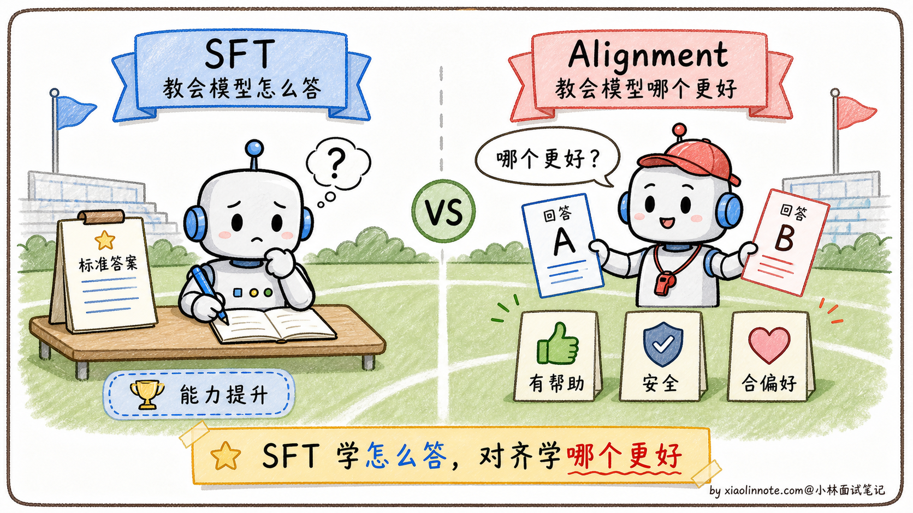
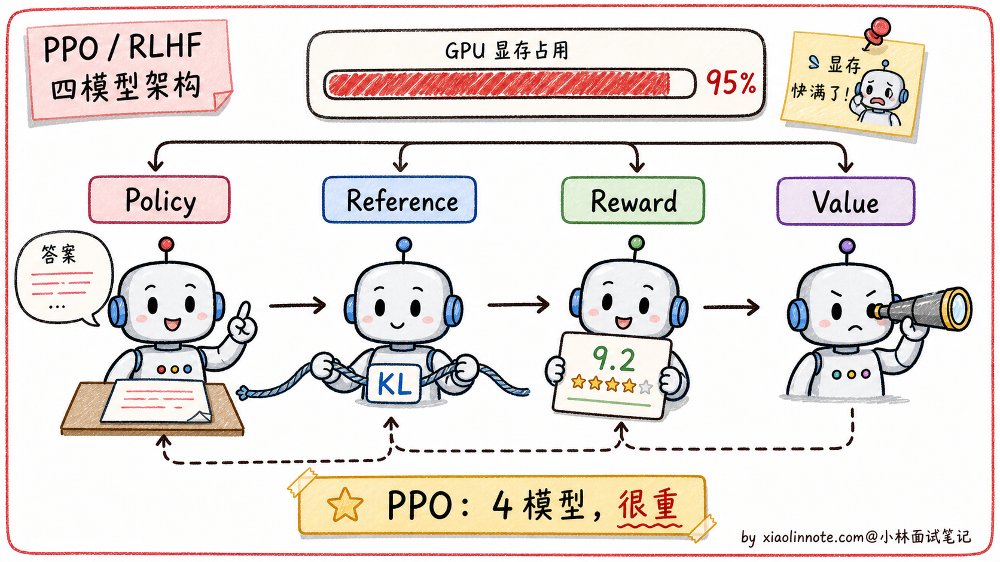
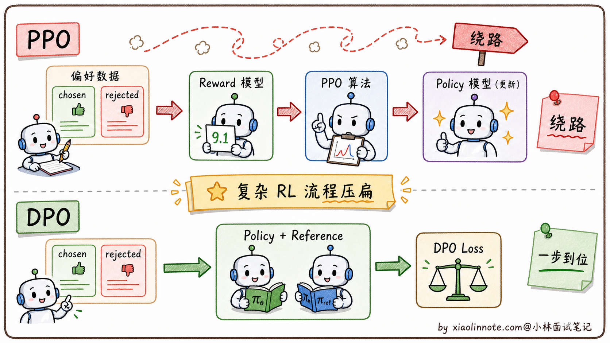
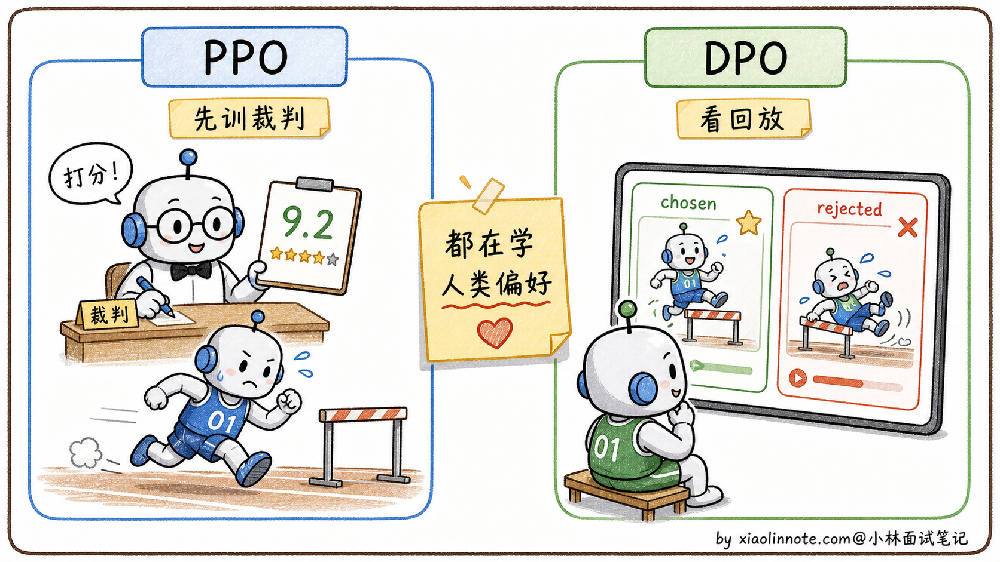
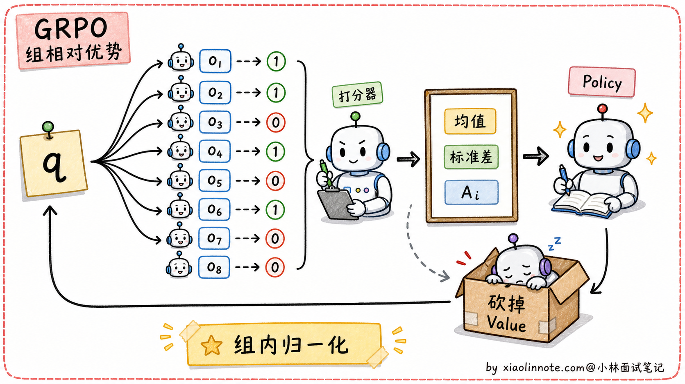
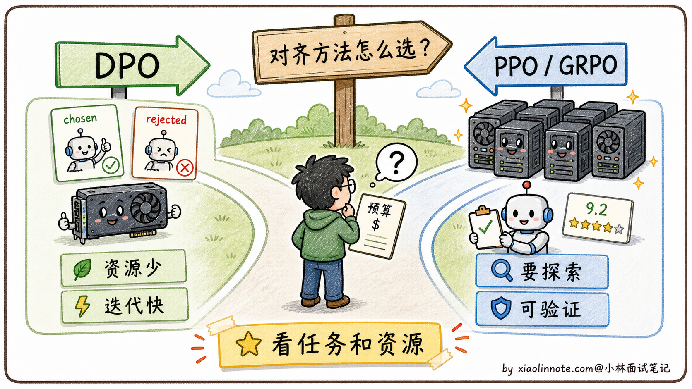

# 大模型的 DPO 和 PPO 的区别是什么？

> 原文：[大模型的 DPO 和 PPO 的区别是什么？](https://xiaolinnote.com/ai/llm/dpo_vs_ppo.html) · 小林面试笔记


👔面试官：来讲讲大模型的 DPO 和 PPO 有什么区别？

🙋‍♂️我：DPO 和 PPO 都是用来做对齐的，让模型的输出更符合人类偏好。DPO 比 PPO 简单一些。

👔面试官：……「简单一些」是表面话。具体哪里简单？少了什么组件？再说，PPO 是强化学习算法，DPO 是监督学习算法，这个根本性差别你能讲出来吗？

🙋‍♂️我：哦哦，DPO 不需要奖励模型，PPO 需要奖励模型？

👔面试官：方向对了。那再问一个：PPO 训练时要同时维护几个模型？为什么需要这么多？KL 约束又是干什么的？

🙋‍♂️我：呃……我记得是有 4 个模型，但具体是哪 4 个想不起来。

👔面试官：典型的「知道有但讲不清」。PPO 的 4 模型架构是 policy（主模型）+ reference（参考模型）+ reward model（奖励模型）+ value model（价值模型），DPO 把这个砍到只剩 policy + reference 两个。这种「能不能说清楚每个组件做什么」是面试拉差距的地方。回去搞清楚再来。

答到这里才反应过来，DPO 和 PPO 的区别不是「谁更简单」那一层，而是「离线偏好优化 vs 在线策略优化」的路径分歧。DPO 的推导有适用假设，不能说与所有 PPO/RLHF 流程完全等价；把这条主线讲清楚，才容易理解其他方法。

## 💡 简要回答

DPO 和 PPO 都是大模型对齐训练里的方法，都是在 SFT 之后让模型的输出更符合人类期望。

PPO 是强化学习里的一个算法。在一种 RLHF 用法中，会训练奖励模型给回答打分，再用 PPO 调整 policy；同时可能需要 reference 做 KL 约束、value/critic 估计优势。具体组件数量取决于实现，工程复杂度和稳定性成本通常高于纯离线偏好优化。

DPO 是后来提出的简化方案，它通常直接使用同一 prompt 下的 chosen/rejected 偏好对，不需要显式训练和调用奖励模型。更准确地说，DPO 是在特定奖励建模、参考策略和数据分布假设下，从带 KL 约束的偏好优化目标推导出的离线损失；不等于与任意 PPO 训练过程完全等价。工程上可把它理解成用标准训练循环拟合偏好，但稳定性和效果仍依赖数据、β、参考模型与评测。

简单总结：一种 PPO/RLHF 流程是「采样—裁判/验证—策略更新」，DPO 是「直接用偏好对和 reference 的概率关系训练」；两者都可用于对齐，但探索能力、数据假设和工程闭环不同。

## 📝 详细解析

### SFT 之后，还差什么？

要理解 PPO 和 DPO，得先搞清楚它们出现的背景：为什么 SFT 训完之后还需要对齐？

预训练让模型掌握了语言能力和世界知识；SFT（监督微调）让模型学会了用对话格式回答问题。但 SFT 本质上是「模仿」，模型在模仿标注人员写的标准答案的格式和风格。这里有一个根本问题：SFT 告诉模型「怎么写」，但没有告诉模型「哪个更好」。

举个例子，同一个问题「怎么学好 Python」，可以有很多种合格的回答：有的很简洁，有的很详细，有的带代码，有的全文字。SFT 只学了某一种写法，但用户对质量的偏好是有排序的，比如带代码示例的回答会更受欢迎，或者承认「我不知道」比自信地胡说更安全。

这种「知道合格，但不知道哪个更好」的局限，就是对齐阶段要解决的问题。不经过对齐的模型可能会生成有毒内容、一本正经地胡说八道，或者输出让用户不满意的答案。PPO 和 DPO 都是解决这个问题的方案，只是路径不同。



### PPO：先培养「裁判」，再训练「选手」

PPO（Proximal Policy Optimization，近端策略优化）是强化学习里的一个经典算法，最早不是为大模型设计的，但 OpenAI 在 InstructGPT 里把它用到了 RLHF（基于人类反馈的强化学习）流程里。

**第一步：训练奖励模型（Reward Model）**

这个阶段，人类标注员会拿到很多「同一问题的多个回答」，然后按质量排名。比如问题「解释什么是递归」，回答 A 比回答 B 好，回答 B 比回答 C 好。用这些排名数据，训练一个专门的奖励模型，让它学会「给一个回答打质量分」。这个奖励模型就是裁判，它代替人类完成后续的自动评分。

**第二步：用 PPO 优化主模型**

有了裁判，就可以用强化学习来训练主模型了。流程是：主模型生成一段回答 -> 奖励模型打分 -> PPO 根据得分调整主模型的参数，让它以后生成更高分的回答。

但这里有一个危险：如果只追求高分，模型可能学会「钻空子」，生成一些奖励模型打高分但实际上没用的内容（这叫做 reward hacking）。为了防止这个，PPO 流程里会同时维护一个「参考模型」（Reference Model），也就是 SFT 之后的原始模型的冻结副本，并用 KL 散度（一种衡量两个概率分布差距的指标）约束主模型，让它不要偏离参考模型太远。KL 散度就像一根绳子，主模型可以向高分方向移动，但不能走太远。

一种常见的 PPO/RLHF 训练实现会涉及以下组件；这不是所有实现的固定清单：

```python
# PPO 训练时需要同时维护的四个模型
policy_model     = load_sft_model()   # 主模型（正在被优化的）
reference_model  = load_sft_model()   # 参考模型（冻结，SFT 模型副本，用于 KL 约束）
reward_model     = load_reward_model() # 奖励模型（裁判，给回答打分）
value_model      = load_value_model()  # 价值模型（RL 辅助，估算未来奖励期望）
```

如果这些组件各自保留完整副本，显存、通信和采样成本会显著增加；也有实现采用参数共享、量化、LoRA 或其他 critic 设计。加上 RL 训练的超参数敏感、奖励投机和分布漂移，PPO 的工程难度通常较高，但不应把“只有极少团队能做”当成事实判断。



### DPO：绕过裁判，直接看回放

DPO（Direct Preference Optimization，直接偏好优化）是研究者提出的偏好优化方法，核心思路是把特定 KL 约束目标转写成可直接训练的偏好损失；年份和机构不是回答重点。

在相应假设下，带 KL 约束的奖励最大化目标可以通过推导改写成偏好损失，不需要显式训练和调用奖励模型。直觉上，主模型相对于 reference 的对数概率比值提供了隐式偏好信号；这不是对所有 RLHF/PPO 流程的无条件等价替代。

这个等价关系让 DPO 可以直接用「偏好对」数据（chosen/rejected）来训练，数据格式长这样：

```python
# DPO 的训练数据格式：同一问题的「好回答」和「差回答」对
{
    "prompt": "如何学好 Python？",
    "chosen": "建议先从官方文档入手，配合做小项目实践...",  # 人类更偏好的回答
    "rejected": "Python 很简单，随便找个教程看看就行了..."  # 人类不太喜欢的回答
}
```

DPO 的损失函数直觉上做的事情是：

```python
# DPO 损失函数直觉（简化版，不是完整公式）
loss = -log(
    sigma(
        beta * (log(policy(chosen) / ref(chosen))   # chosen 在主模型和参考模型之间的对数概率比
        -     log(policy(rejected) / ref(rejected))) # rejected 在主模型和参考模型之间的对数概率比
    )
)
# 目标：让 chosen 的比值 > rejected 的比值
# 即：相对于参考模型，主模型在 chosen 上的概率提升要大于在 rejected 上的提升
```

简单说就是两件事同时发生：模型对「好回答」的概率，相对于参考模型升高；模型对「差回答」的概率，相对于参考模型降低。整个过程不需要奖励模型，只需要主模型和参考模型两个：

```python
# DPO 训练只需要两个模型
policy_model    = load_sft_model()  # 主模型（正在被优化的）
reference_model = load_sft_model()  # 参考模型（冻结，用于计算概率比）
# 常见 DPO 目标不显式调用 reward_model 或 value_model；实际显存/吞吐仍取决于实现
```

DPO 可以用标准训练框架实现，通常比在线 PPO 少一套采样/奖励/critic 基础设施；但它仍可能过拟合偏好对、放大标注偏差或损伤能力，稳定性和超参数难度不能一概而论。



### 两种方案的对比

| 维度 | PPO | DPO |
| --- | --- | --- |
| 是否需要奖励模型 | 常见流程需要，也可用其他奖励/验证器设计 | 常见目标不需要显式奖励模型 |
| 组件形态 | policy、reference、reward、value/critic 的组合，具体实现可变 | policy + 冻结 reference（实现可用参数/LoRA 等方式优化） |
| 训练稳定性 | 受在线采样、奖励偏差、KL 和 critic 影响 | 少在线 RL 基础设施，但受偏好数据、参考模型和超参数影响 |
| 实现难度 | 高（需要 RL 基础设施） | 低（标准训练框架即可） |
| 表达能力 | 强（可探索训练数据之外的空间） | 稍弱（受偏好数据分布限制） |
| 代表性公开流程/实践 | 不同 RLHF 方案可能使用 PPO 或其变体，需以论文/技术报告为准 | 不同开源模型可能使用 DPO 或变体，需以对应训练报告为准 |



### PPO 的进阶版：GRPO 简介

讲 PPO 和 DPO 时可以补充 **GRPO（Group Relative Policy Optimization）**：它用同一问题的一组采样结果构造相对优势，减少对独立 value/critic 的依赖；具体算法、论文归属和工程实现应以所引用版本为准，不要把它说成所有 PPO 的统一替代。

GRPO 的核心创新是**砍掉了 PPO 的 Value Model**。

PPO 的 4 模型架构里，Value Model 的作用是估计「当前状态的预期奖励」作为基线，然后算「实际奖励 - 预期奖励」得到优势函数（Advantage）。但 Value Model 是一个独立的神经网络，规模和主模型差不多大，要单独训练、占显存。

GRPO 的一种做法是：对一个问题 q，从主模型采样一组回答，用奖励模型、规则或可验证判定得到 r_1, r_2, ...，再用「组内归一化」估计相对优势。组大小、归一化和 KL 项都是实现/算法配置，不应固定为某个数字：

```
A_i = (r_i - mean(r_1..r_G)) / std(r_1..r_G)
```

组内统计量可以承担基线作用，减少对独立 Value Model 的依赖；但仍可能需要 reference、奖励/验证器、采样和优化组件，资源占用也不会自动接近 DPO。

GRPO 对可验证任务很有吸引力：数学、代码等任务可以用程序或规则产生奖励，减少主观奖励模型依赖；但 0/1 判定的覆盖范围、奖励稀疏和验证器安全性仍需评估，不能由此推断所有推理能力都能纯靠规则获得。



谁在用 GRPO：

- **DeepSeek R1 / R1-Zero**：推理模型的代表
- **DeepSeek-Math**：数学推理模型
- **Qwen-Math 系列**：阿里的推理增强模型

面试中提到 GRPO 时，重点是说明“用组内相对奖励减少独立 value/critic 依赖”，并补充验证器、采样预算和奖励投机风险；不要背固定年份或“必问”判断。

### 各自适合什么场景？

理解了两者的权衡，选择就很清晰了。

**PPO 适合**有在线探索需求、可靠奖励/验证器、采样基础设施和 RL 工程能力的团队；它能优化离线偏好对之外的策略，但也更容易受到奖励投机和训练不稳定影响。

**DPO 适合**已有质量较好的偏好对、希望采用离线训练且不想维护在线 RL 基础设施的场景；它不保证训练一次成功，也不自动优于 PPO。

一个简单的判断原则是：若目标是在已有偏好分布上优化，先用 DPO/其他离线偏好方法建立基线；若需要在线探索或可验证奖励闭环，再评估 PPO/GRPO 等方法，并用能力保持、奖励黑客、成本和安全指标共同判断。



## 🎯 面试总结

回到开头那段对话，问到 DPO 和 PPO 的区别，最重要的是先讲清楚**两者都在解决「SFT 之后的对齐问题」**。SFT 让模型学会按指令回答，但回答风格不一定符合人类偏好，所以需要进一步训练让模型学会「哪种回答更受人类欢迎」。这一句铺垫先讲到，面试官就知道你抓到了对齐这件事的本质。

接下来讲 PPO 的一种流程：收集偏好数据 → 训练或接入奖励/验证器 → policy 采样 → 用 reference/KL 与 value/critic 计算更新 → 评测与防奖励投机。可以提到常见的 policy/reference/reward/value 角色，但要说明实现并非固定四份模型。

DPO 的核心创新是「**在特定假设下把带 KL 约束的偏好目标改写成偏好对损失**」。它通常不需要显式奖励模型或 PPO 在线采样，但仍要用 reference、选择合适 β、处理偏好噪声并评估能力保持。类比可以用，但不要把它说成任意 RLHF 的完全等价物。

最关键的一句话是：**两者都可用于偏好对齐，但优化路径、数据假设和在线探索能力不同；DPO 常通过偏好对和 reference 的概率比实现离线优化，PPO 则通过奖励/价值估计进行策略更新**。

如果还想再加分，可以提一句 GRPO：用同题多样本的相对奖励降低独立 value/critic 的依赖，尤其适合有程序验证器的任务；同时说明它仍有奖励设计、采样成本和奖励投机问题。

---
