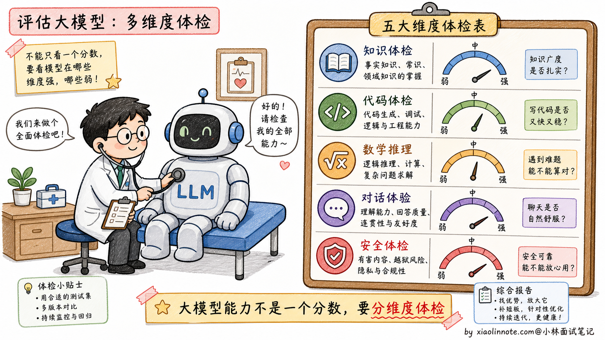
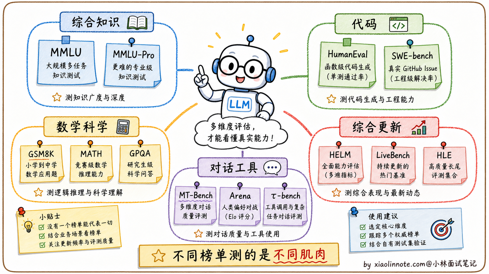
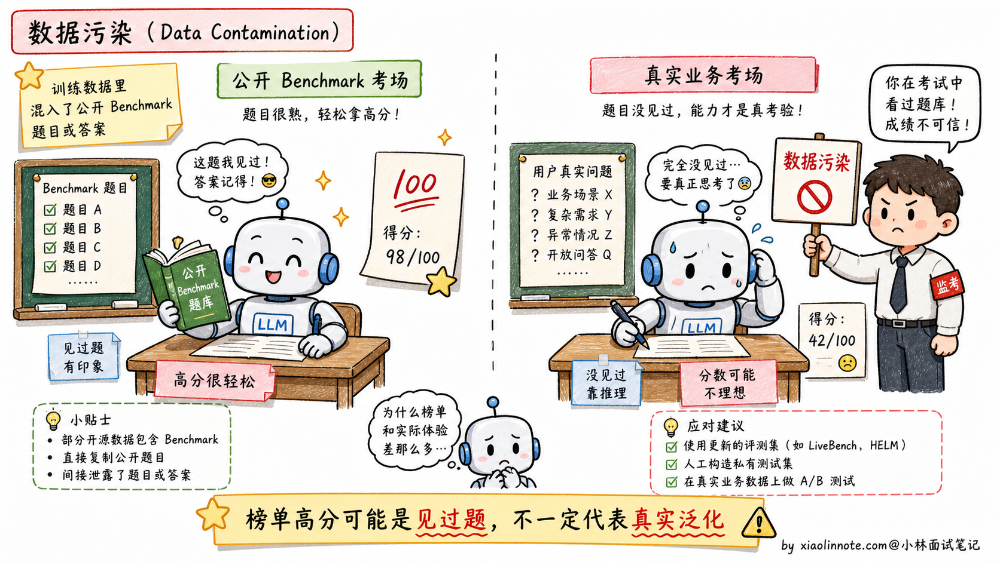
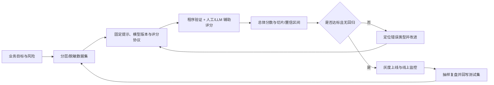
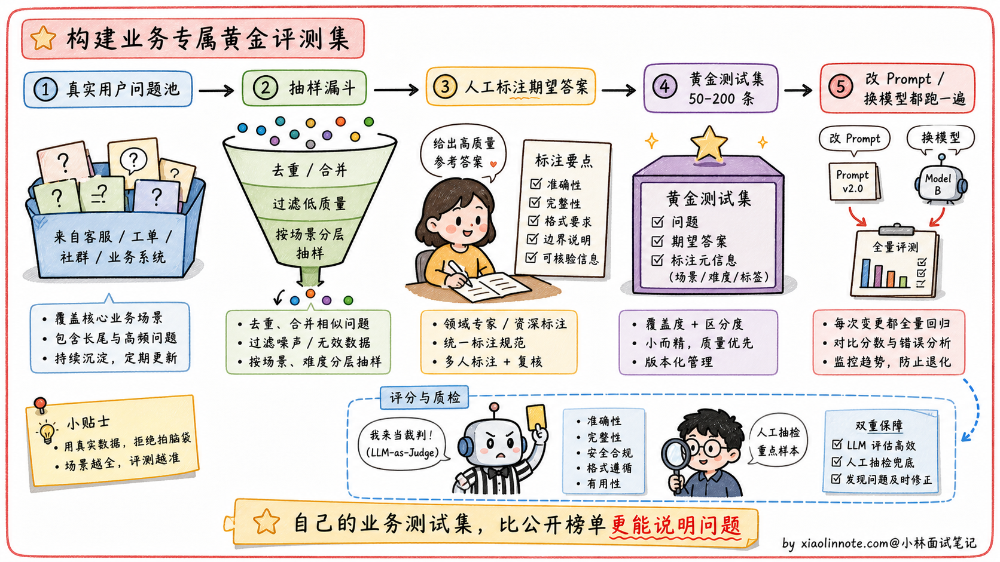
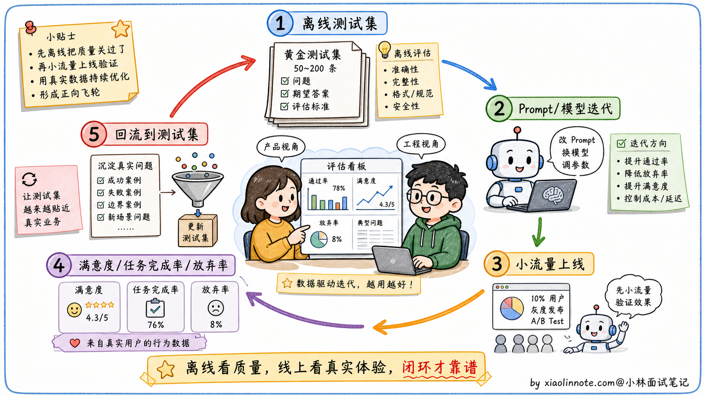

# 大模型能力评测指标有哪些？

> 原文：[大模型能力评测指标有哪些？](https://xiaolinnote.com/ai/llm/evaluation_metrics.html) · 小林面试笔记

👔面试官：来讲讲大模型能力的评测指标有哪些？

🙋‍♂️我：常用的有 MMLU、HumanEval、GSM8K 这些 Benchmark，能反映模型的综合能力。

👔面试官：……Benchmark 的名字会背是基本功。但你能说清楚每个 Benchmark 测什么吗？再说，学术 Benchmark 真的能反映实际效果吗？为什么有些模型在排行榜上很高但实际用起来不好？

🙋‍♂️我：哦哦，可能是过拟合到 Benchmark 上了？

👔面试官：方向对了一半。这个现象有专门的术语叫「**数据污染**」（Data Contamination）。再问你：如果不能完全相信 Benchmark，那工程上到底用什么评测模型？

🙋‍♂️我：呃……用户反馈？

👔面试官：「用户反馈」太笼统。工程上的标准做法是建**业务测试集**，从真实用户请求里采样、人工标注期望输出，每次改 Prompt 或换模型都跑一遍。这种「学术 Benchmark + 业务测试集 + 线上指标」的闭环你能讲清楚吗？回去搞清楚再来。

被这三个问题一通追下来，评测这道题就不再是「背几个 Benchmark 名字」的水平了。Benchmark 各自的局限、业务测试集怎么搭、线上反馈怎么闭环回来，这三件事得一起讲。

## 💡 简要回答

我对这块的理解是，学术 Benchmark 只能作为参考，真正重要的是在自己业务数据上的表现。MMLU / MMLU-Pro 可用于综合知识/推理对比，HumanEval / SWE-bench Verified 可覆盖不同层次的代码任务，GSM8K / MATH / GPQA 侧重数学和科学推理；具体版本、协议和评分实现必须记录。更新题集可能降低已知污染，但不能自动消除污染。这些指标不能直接等价成业务效果。工程上应从真实请求构建分层测试集，固定评测协议，结合程序验证、人工/模型辅助评分、统计不确定性和线上指标形成闭环。

## 📝 详细解析

### 为什么需要评测指标

大模型的能力是多维度的，「感觉用起来还不错」不足以支撑工程决策。当你比较不同供应商/模型版本、决定是否微调或衡量 Prompt 变化时，应同时量化正确性、任务完成率、鲁棒性、安全性、延迟、吞吐和成本。评测指标的价值不是把一切主观感受变成一个分数，而是把目标、样本、评分规则和不确定性固定下来，形成可比较的证据。

但评测模型远比评测传统软件难得多，因为语言生成是开放性任务，「正确答案」的边界往往是模糊的。这也是为什么这个领域同时存在多种不同侧重的 Benchmark。下面来认识几个最常被引用的学术 Benchmark，了解它们各自考查的是什么维度。

### 主流学术 Benchmark 逐一介绍

- **MMLU / MMLU-Pro** 可作为综合知识与推理的参考；题目范围、选项和评分应以具体数据集版本为准，不要把一个总分解释成通用智力。
- **HumanEval、MBPP 和 SWE-bench Verified** 覆盖从函数级生成到仓库级修复的不同代码任务。HumanEval 等数据集的题数、测试实现和去重方式可能随版本/评测脚本变化；`pass@k` 也要说明采样次数、去重和执行沙箱，不能只报一个分数。
- **GSM8K、MATH、GPQA** 测试数学和科学推理能力。GSM8K 是小学数学应用题，考基础的四则运算和逻辑推理；MATH 是竞赛数学，包含代数、几何、组合数学等；GPQA 更偏研究生级别的科学问答，很多题需要物理、化学、生物等专业知识和多步推理。
- **MT-Bench、Arena、τ-bench** 更偏对话和 Agent / Tool Use 能力。MT-Bench 设计了一系列需要多轮交互的场景，用「LLM-as-Judge」方式给回答打分；Chatbot Arena 更像用户真实偏好投票；τ-bench 这类评测会看模型在工具调用、多轮状态管理、业务流程里的表现，更贴近 Agent 应用。
- **HELM、LiveBench、Humanity’s Last Exam** 等评测覆盖更广或更难的维度。它们可能通过多维报告、更新题目或更高难度降低部分污染风险，但仍受题集、提示词、评测器、时间和可复现性影响。它们比单一指标更全面，也更需要核对版本与协议。

### Benchmark 的局限性：数据污染问题

Benchmark 有一个严重的问题：**数据污染**。

公开 Benchmark 的题目、解析或相似变体可能进入训练/后训练数据，也可能通过提示模板、评测脚本或人工调优造成间接过拟合。污染会让分数高估泛化能力，但“模型见过”通常难以仅凭成绩证明，应做去重、污染调查、时间切分和私有/新题验证。

这也是为什么有些模型在学术排行榜上名列前茅，实际用起来却不如名次更低的竞品，因为它们可能是「背过题」的，而不是真的更聪明。

### 如何建自己的业务评估集

面对 Benchmark 局限性，最务实的做法是建自己的任务特定测试集。

做法通常是：从真实用户请求中按任务、难度、语言、风险和用户群体分层抽样，脱敏后建立带版本的黄金集；样本量由风险、方差、成本和期望置信区间决定，不存在通用的 50-200 条标准。每次迭代模型或 Prompt 时固定随机种子/采样协议（能固定时），报告总体分数和关键切片。

评分方式上，客观任务（信息提取、分类、代码）优先用 schema、单元测试或规则验证；主观任务（摘要、问答质量）可用 rubric、成对比较和 LLM-as-Judge，但要校准位置偏差、长度偏差、模型偏好和提示泄漏，并保留人工盲评/抽检。抽检比例和一致性应由风险、分层和置信度决定，不能固定成 10-20%。

一套可复现的评测闭环可以概括为：

### 离线评估 + 线上指标的闭环

业务测试集解决了离线评估的问题，但只有离线测试集还不够，生产环境里还需要监控实际的用户体验指标：用户对回答是否满意（明确的点赞/踩、隐式的追问行为）、任务完成率（用户是否实现了目标）、会话放弃率（用户中途退出说明体验差）。

离线评估帮你找问题、快速迭代；线上指标告诉你优化是否真正改善了用户体验。两者结合才是完整的评估体系。

## 🎯 面试总结

回到开头那段对话，问到大模型评测指标，最重要的是先把**学术 Benchmark 和业务评测的关系**讲清楚。学术 Benchmark（MMLU、HumanEval、GSM8K、MT-Bench、HELM 等）适合横向对比模型的综合能力，但**不能完全相信**，因为存在严重的「数据污染」问题（模型在预训练时可能见过测试题）。这一句先讲到，面试官就知道你不是只会背 Benchmark 名字。

接下来讲清主流 Benchmark 各自测什么。MMLU / MMLU-Pro 测综合知识广度和推理，HumanEval / MBPP / SWE-bench Verified 测代码能力，GSM8K / MATH / GPQA 测数学和科学推理，MT-Bench / Arena / τ-bench 测对话、偏好和工具调用，HELM / LiveBench / Humanity’s Last Exam 则是更综合或更新型的评测。能用一两句话说清每个 Benchmark 的设计目标，比单纯报名字深刻得多。

最关键的是讲**业务测试集**的构建方法：按任务和风险分层、脱敏、版本化，样本量依据统计和业务风险决定；客观任务用程序验证，主观任务用明确 rubric，并用盲评和一致性检查校准 LLM-as-Judge。每次改 Prompt、模型或工具链都跑固定协议，报告总体与切片、置信区间和成本/延迟。

最后提一句**离线评估 + 线上指标**的闭环。离线评估帮你快速迭代找问题，线上指标（满意度、任务完成率、会话放弃率）告诉你优化是不是真的改善了用户体验。两者结合才是完整的评估体系。

如果还想再加分，可以提一句**数据污染**问题的应对方向：避免用公开 Benchmark 直接当训练集、用 LiveBench 这种「持续更新题库」的评测、用业务真实数据做评测。这种「不被 Benchmark 蒙蔽」的工程视角是面试里很难追问的水平。

---
