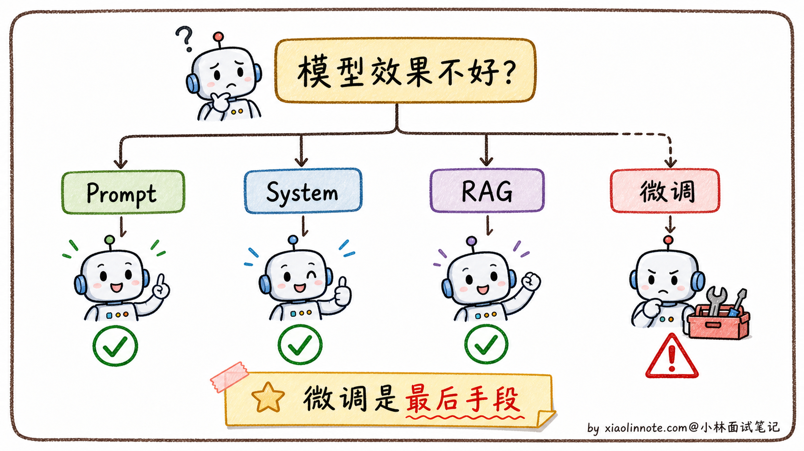
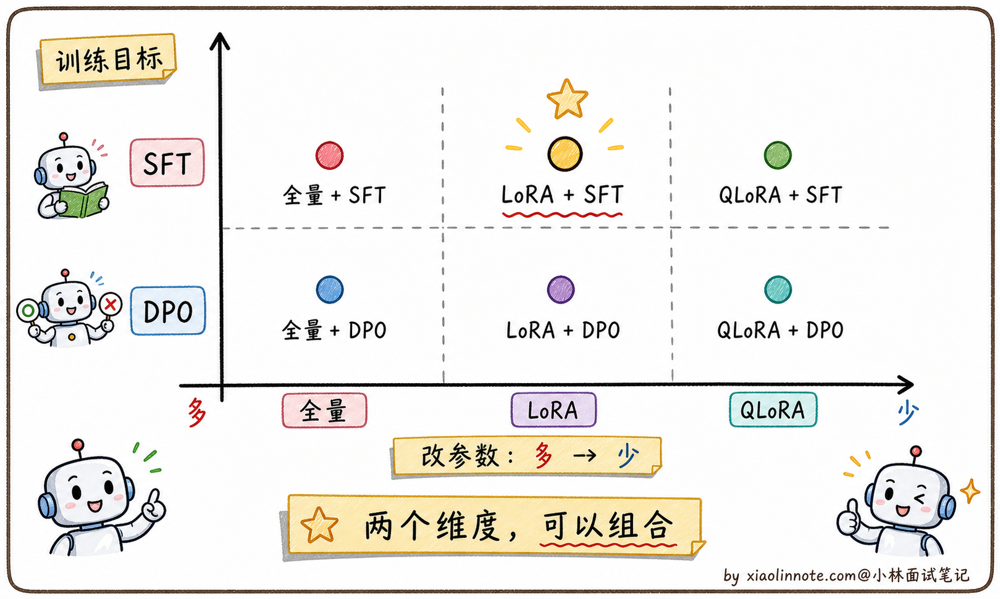
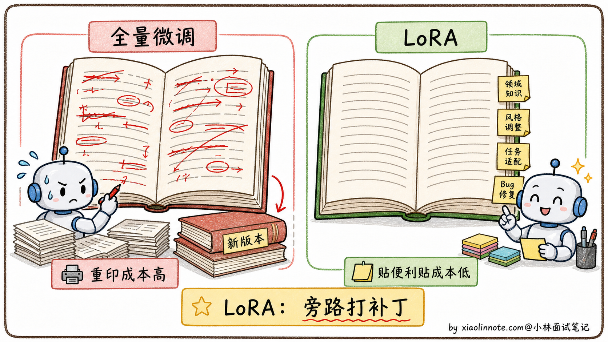
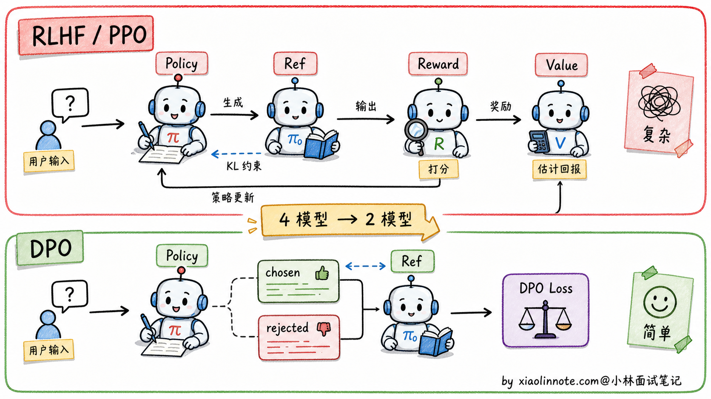
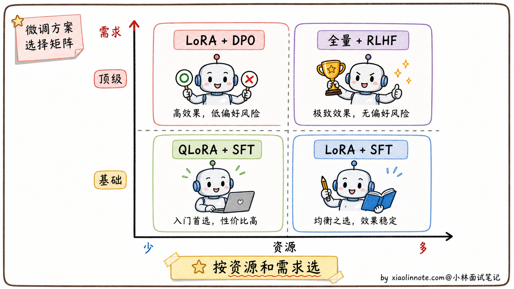

# 大模型微调的方案有哪些？

> 原文：[大模型微调的方案有哪些？](https://xiaolinnote.com/ai/llm/finetuning.html) · 小林面试笔记

👔面试官：来讲讲大模型微调的方案有哪些？

🙋‍♂️我：微调方案有全量微调、LoRA、QLoRA、SFT、DPO 这些，工业界常用 LoRA。

👔面试官：……你这是把名词都背了一遍，但没说清楚关系。LoRA 和 SFT 是同一个层面的东西吗？SFT 和 DPO 又是什么关系？为什么要分这么多名字？

🙋‍♂️我：呃，应该都是不同的微调方法吧？

👔面试官：完全错。这些名词其实分两个维度。一个维度是「**改哪些参数**」（全量微调 vs LoRA vs QLoRA），另一个维度是「**学什么目标**」（SFT vs DPO）。这两个维度是正交的，可以组合：你可以用 LoRA 做 SFT，也可以用 LoRA 做 DPO。这层关系搞不清楚就讲不出选型逻辑。

🙋‍♂️我：哦，原来是两个维度。

👔面试官：那再问你一个问题，什么时候真的需要微调？是不是模型表现不好就该上微调？

🙋‍♂️我：嗯，应该是吧？

👔面试官：典型的新人思维。微调是「最后手段」，不是「第一选择」。能用 Prompt + Few-shot 解决的问题，绝对不要上微调，因为微调的成本和维护代价远比想象大。「什么时候该微调、什么时候不该」是这道题的关键判断点。回去搞清楚再来。

这道题我开始还以为是把 LoRA、SFT、RLHF 这些名词背一遍就行，问到这里才反应过来，真正考的是两条正交的轴：改哪些参数、学什么目标，外加一条前置判断「这个需求到底该不该微调」。

## 💡 简要回答

我了解微调之后，首先意识到的是：微调不是首选，而是最后手段。大多数问题先把 Prompt 写好、加 Few-shot 示例，或者用 RAG 接外部知识，基本都能解决。真正需要微调的场景是：模型需要以特定风格持续输出、需要学会稳定的任务格式、或者需要大幅降低成本用小模型替代大模型。方案上，LoRA/QLoRA 是最常用的，因为它只训练一小部分参数，普通 GPU 上就能跑，不需要全量更新所有权重；SFT 是微调的目标形式，让模型从续写模式变成指令回答模式；有偏好对齐需求的话，DPO 比 RLHF 简单得多、效果也不差。选模型不是看谁排行榜最高，选微调方案也是同理，核心是看资源约束和实际需求。

## 📝 详细解析

### 先回答一个前置问题：什么时候才真的需要微调？

很多人一遇到「模型表现不好」就想上微调，这其实是新人的本能反应。但工业界踩过坑的人都知道，**微调是最后手段，不是第一选择**。

为什么？因为微调的成本远比想象大。需要准备高质量数据集、GPU/存储资源和工程验证，并处理过拟合、灾难性遗忘、许可证与安全问题。基础模型、tokenizer、模板或数据分布变化后，旧适配器可能需要重新评估甚至重训，维护成本不能只看一次训练费用。

那什么时候才该上微调？我自己总结的判断标准是这样的。

如果只是想让模型回答某种特定格式（比如必须是 JSON），先试 Prompt + Few-shot，写清楚格式要求 + 给 3-5 个示例，大模型基本能搞定。如果想让模型回答某种特定风格（比如公司客服的口吻），先试 System Prompt 描述风格 + 几个对话示例，多数情况也能行。如果想让模型懂某个领域知识，先试 RAG（检索增强），把领域知识库挂上让模型实时查，比硬塞进参数里灵活得多。

只有当上面这些都试过、效果还是不达标的时候，才认真考虑微调。具体来说，下面三种场景微调才是真的值得做：第一种是模型需要持续以一种特殊风格输出（Prompt 控制不住，比如生成特定格式的代码、特定语气的文案）；第二种是需要模型稳定掌握某类任务模式或内部术语表达；第三种是想用小模型替代大模型省成本（用 7B 微调模型替代 70B 通用模型，推理成本能省很多）。

这里要特别提醒：如果需求是「补充经常变化的事实知识」，微调通常不是好选择。比如产品价格、政策条款、库存状态、合同原文，这些内容应该放进 RAG 或数据库里实时查。微调更适合学行为、格式、风格和任务模式，不适合当一个会频繁更新的知识库。

理清「该不该微调」之后，再来看「微调有哪些方案」。这里有一个特别容易踩的坑，很多人把「全量微调、LoRA、QLoRA、SFT、DPO」都当成同一类的「不同微调方法」来背。其实它们分两个完全不同的维度。

### 微调的两个正交维度：改哪些参数 vs 学什么目标

微调本质上是回答两个问题。

**第一个问题是「改哪些参数」**。模型有几十亿到几百亿参数，你是要全部改，还是只改一小部分？这一维度上有三个主流方案：全量微调（全改）、LoRA（改一小部分）、QLoRA（改一小部分 + 量化基础模型）。

**第二个问题是「学什么目标」**。模型要学的是「按指令回答」还是「学会哪种回答更好」？这一维度上有两个主流方案：SFT（学指令格式）、DPO（学偏好对齐）。

这两个维度是**正交**的，可以任意组合。比如：

- 用全量微调做 SFT
- 用 LoRA 做 SFT
- 用 QLoRA 做 SFT
- 用 LoRA 做 DPO
- 用 QLoRA 做 DPO

每种组合都是合法的「微调方案」。理解这两个维度的正交关系，是回答这道题的钥匙。

下面分别看这两个维度上的方案。

### 「改哪些参数」维度：从全量微调到 QLoRA

**全量微调（Full Fine-tuning）**：所有参数都改

最朴素的方案就是把模型所有参数都拿出来在新数据上继续训练，让所有层都重新适配新任务。效果通常是最好的，因为模型有最大的自由度去调整。

但代价可能很高。全量微调除了参数，还要存梯度、优化器状态、激活和通信/检查点开销；显存取决于精度、优化器、序列长度、并行策略和是否使用 ZeRO/卸载，不能用“7B=固定几十 GB”或“70B=固定几十张卡”概括。

更糟的是「**灾难性遗忘**」（Catastrophic Forgetting）。模型在新任务上学得好了，原本预训练学到的通用能力反而下降。这是因为所有参数都在被改写，新数据分布有偏的话，模型会忘记原本的「通用知识」。

所以全量微调通常需要更高资源和更严格的回归，但是否值得取决于任务与数据；参数高效微调（如 LoRA）能降低门槛，却不保证效果一定相同。

**LoRA（Low-Rank Adaptation）**：只改一小部分参数

LoRA 的核心洞见特别巧妙。它发现一个事实：模型参数的「**更新量**」（即 ΔW = W微调后 - W原始）虽然维度很大（比如 4096×4096），但真正有意义的变化只发生在一个**低维子空间**里。换句话说，权重的更新具有「**内在低秩性**」，不需要每个维度都去改。

基于这个洞见，LoRA 的做法是：冻结原始权重 W，在 W 旁边新增两个低秩矩阵 A 和 B（其中秩 r 远小于 d），训练时只更新它们。推理时可以把增量合并到 W，也可以保留为独立 adapter；二者在部署灵活性、显存、切换成本和多 adapter 管理上不同。低秩假设是经验性取舍，秩、注入层和缩放需要验证。

打个比方，全量微调像是把一本厚厚的教科书全部重写一遍，LoRA 像是在书的空白处贴便利贴，原书一字不动，便利贴上写着新增的修正和补充。看书的时候原文 + 便利贴一起看，效果叠加。

参数量会从 d² 降为约 2dr，但实际可训练参数还取决于注入的层、秩和 bias 策略；训练显存还包括激活、梯度、优化器和基础模型加载，不能从参数量直接推出固定显存或卡数。

LoRA 是常见的参数高效微调方案之一，但“最主流”“几乎所有项目”会随模型社区和任务变化；还应比较 adapter、prompt tuning、全量更新和蒸馏等方案。

**QLoRA**：消费级 GPU 的入场券

LoRA 可以降低可训练参数和优化器状态，但基础模型权重、激活和上下文仍占显存；QLoRA 进一步量化冻结的基础模型，以降低加载/训练门槛。

QLoRA 的典型思路是：以低比特格式（常见实现使用 NF4）加载冻结基础模型，再训练 LoRA adapter，并配合分页优化器等技术降低峰值。能否在某张卡上训练某个模型取决于上下文、batch、梯度累积、实现和量化质量，不能承诺固定显存或模型大小。

QLoRA 的精度损失非常小，实测效果和全精度 LoRA 几乎没差别。这一招直接让微调民主化了，无数个人开发者用 QLoRA 训出了自己的领域模型。Alpaca、Vicuna 这些早期开源指令模型基本都是用 QLoRA 训出来的。

到这里，「改哪些参数」维度的三个方案就清楚了。下面看另一个维度。

### 「学什么目标」维度：SFT 和 DPO

「改哪些参数」回答的是「**怎么改**」的问题，但还有一个更核心的问题没回答：**改的目标是什么？让模型学会做什么？**

这一维度上有两个主流方案。

**SFT（Supervised Fine-Tuning，监督微调）**：让模型学会「按指令回答」

预训练模型本质是「文本续写机器」，给一段文字就接着往下写，根本不知道「问问题」是什么意思。SFT 的目标就是把模型从「续写模式」切换到「对话模式」。

它的训练数据格式是 (指令，期望回答) 的对，比如「请介绍一下北京 → 北京是中国的首都，位于华北平原……」。模型在这样的数据上继续训练，慢慢学会「看到这种格式就该给一个完整回答，不要无限续写下去」。

SFT 是一个「**目标**」，不是「**方法**」。具体怎么实现？可以用全量微调做 SFT、可以用 LoRA 做 SFT、也可以用 QLoRA 做 SFT。在工业界最常见的组合是 **QLoRA + SFT 数据**，性价比最高。

SFT 数据的关键是质量大于数量。Llama 2 用了大约 100 万条 SFT 数据，但每条都是精心标注的。AlpacaFarm 的研究还发现一个反直觉结论：几千条高质量数据训出来的效果，比几十万条粗糙数据要好。

**DPO（Direct Preference Optimization，直接偏好优化）**：让模型学会「哪种回答更受欢迎」

SFT 之后，模型已经会按指令回答了，但回答风格不一定是用户喜欢的（可能太啰嗦、太简洁、有时候说话不得体）。这时候需要更进一步的「**偏好对齐**」，告诉模型「同样合格的回答里，哪种用户更喜欢」。

早期做偏好对齐的标配方案是 RLHF（Reinforcement Learning from Human Feedback），流程是：收集人类偏好数据 → 训一个奖励模型 → 用 PPO 算法优化主模型。但 RLHF 流程长、要同时维护好几个模型、训练不稳定，能驾驭它的团队不多。

DPO 是斯坦福 2023 年提出的简化方案。它发现一个数学上的等价转换：RLHF 的优化目标可以推导成纯监督学习的损失函数，**完全绕过奖励模型，也不需要 PPO**。直接拿 (问题，好回答，差回答) 三元组训练，让模型直接学会「好回答的概率要比差回答提升得多」。

DPO 训练简单、稳定、工程门槛低，所以开源社区的偏好对齐阶段大量使用 DPO 或它的变体。但这里别说得太绝对，不同模型的 post-training 流程差异很大。比如 Llama 2-Chat 公开流程主要是 SFT、拒绝采样和 PPO/RLHF；很多社区模型为了降低成本，才会把偏好优化换成 DPO。

**DPO 也是一个「目标」，不是「方法」**。它可以用全量微调实现，也可以用 LoRA 实现。最常见的工业组合是 **LoRA + DPO**，资源友好。

### 实战选型怎么落地

理解了两个维度的方案之后，实战选型其实就清楚了。

如果你是资源受限的小团队，通常可以先评估 **QLoRA + SFT**；数据量、卡数和效果没有通用保证，应以小规模试验、验证集和成本预算决定。

如果你是中小企业、有几张 A100 但没有大集群，可以选 **LoRA + SFT**。比 QLoRA 精度略好一点（因为基础模型不量化），训练速度也更快。

如果你的需求是「让模型的回答风格更符合用户偏好」（不只是格式正确，还要好听），可以在 SFT 之后再加一步 **LoRA + DPO**。先用 SFT 让模型学会回答格式，再用 DPO 让回答风格对齐用户偏好。很多社区 Instruct 模型走的是 SFT -> DPO 这条轻量路线；而 Llama 2-Chat 这类大厂公开模型可能会用拒绝采样、PPO/RLHF 等更重的组合。

如果资源充足且任务确实需要大范围改变参数，可以评估全量微调或更重的后训练组合；公开资料通常不足以支持对闭源模型训练细节、成本或“最强”结论的推断，应以可核验的技术报告为准。

一个常见误区是「方案越重越好」。应先用 Prompt/RAG/工具和小规模 adapter 建立基线，再按效果、数据、许可证、部署延迟、遗忘和维护成本升级；重方案的收益不是自动出现，且训练成本不一定按简单的“指数”增长。

## 🎯 面试总结

回到开头那段对话，问到大模型微调方案，最重要的不是把名词列一遍，而是讲清楚两件事。

第一件事是**前置判断**：微调是最后手段不是第一选择。能用 Prompt + Few-shot 解决就别上微调；能用 System Prompt 控制风格就别上微调；能用 RAG 接知识库就别上微调。只有这些都试过不行，再考虑微调。这一句说出来，面试官就知道你不是「为了微调而微调」的新人。

第二件事是**两个正交维度**：「改哪些参数」（全量微调 / LoRA / QLoRA）和「学什么目标」（SFT / DPO）是两个独立的维度，可以任意组合。能说出「LoRA 是方法、SFT 是目标，可以用 LoRA 做 SFT，也可以用 LoRA 做 DPO」，比把这五个名词当作并列项罗列要深刻得多。

讲清楚这两点之后，再补一下实战选型经验：资源受限可先做 QLoRA/LoRA + SFT 基线，有可靠偏好数据再评估 DPO/其他偏好方法，资源和任务都要求时才评估全量或在线 RL。核心是按数据、目标、硬件、部署和评测结果选组合。

最关键的一句话是，**先用最小可行的适配方案和业务评测证明收益，再决定是否增加训练复杂度**。这比背“绝大多数项目都用某个固定组合”更可靠。

---
