# 大模型为什么会出现幻觉？怎么缓解？

> 原文：[大模型为什么会出现幻觉？怎么缓解？](https://xiaolinnote.com/ai/llm/hallucination.html) · 小林面试笔记

👔面试官：来讲讲大模型为什么会出现幻觉？怎么缓解？

🙋‍♂️我：幻觉就是模型胡说八道嘛，主要是训练数据有错误，所以模型学错了。缓解办法是用 RAG 加上外部知识库。

👔面试官：……「训练数据有错误」？那如果训练数据 100% 正确，模型就不会幻觉了吗？再说，RAG 是工程方案，但你现在让我从「模型本身」角度讲幻觉的根因，不是让你讲 RAG 系统。

🙋‍♂️我：哦哦，那可能是模型的概率采样有随机性，所以会乱选词？

👔面试官：那把 Temperature 调到 0 是不是就不会幻觉了？为什么很多 LLM 在 Temperature=0 的时候也会一本正经地胡说八道？这个根因你能讲出来吗？

🙋‍♂️我：呃……不太清楚。

👔面试官：我再换个角度问你。同一个事实问题，比如「鲁迅是谁的笔名」，模型有时候答对、有时候答错。这两次答案对应模型概率分布的什么不同？模型对「自己不知道的事」内部有没有信号？为什么模型不会主动说「我不知道」？这些都搞清楚了，再来谈缓解方案。

这一通追问下来才发现，「幻觉」根本不是「模型乱说」这一层能糊弄过去的。它的根源在 LLM 是概率续写器不是数据库，缓解也得训练、推理、系统三层一起上，少哪层都不行。

## 💡 简要回答

我理解大模型的幻觉本质是：**模型生成了听起来很合理但实际是错的内容**，这是 LLM 的固有缺陷，不是某个 bug。

幻觉的根因可以归到三个层面。

第一是**训练数据层面**：互联网语料本身就有错误、矛盾、过时的信息，模型把这些都「学进去」当作事实记忆。

第二是**生成机制层面**：LLM 本质是「按概率续写下一个 token」，不是「查询知识库」。模型对「自己知不知道某件事」没有显式信号，碰到不熟悉的问题，会按训练时见过的相似上下文「编一个看起来合理的答案」。这就是为什么 Temperature=0 也会幻觉，因为概率最高的那条路径本身就是错的。

第三是**对齐目标层面**：SFT 和 RLHF 训练时，「自信地回答」往往比「我不知道」得分更高，模型被无形中训练成了「不会拒答」。

幻觉分三类：**事实性幻觉**（编造不存在的事实，把人物事件张冠李戴）、**推理性幻觉**（推理链条错乱、前后矛盾）、**上下文不一致**（违背用户给的明确条件）。

缓解方案要分三层组合用。

**训练层**：对齐数据里专门加入「不知道就说不知道」的样例，做校准（Calibration）训练，让模型学会拒答。

**推理层**：让模型先做必要的分步分析再答（最终可以只展示简要依据）、Temperature 调低减少随机偏差、Self-Consistency 多次采样投票（错误答案不一定容易收敛）、约束解码（限制只能输出特定 vocabulary）。

**系统层**：RAG 接入外部知识库（让模型「看着资料答」而不是「凭记忆答」）、答案后处理核查、强制带引用来源。

最关键的认知是，**幻觉不可能完全消除**，因为它是 LLM 概率生成机制的固有副产物。工程上的目标是「降低发生率 + 让用户能识别」，不是「彻底消灭」。

## 📝 详细解析

### 幻觉到底是什么？为什么 LLM 必然会幻觉

要讲清楚幻觉，得先把它的定义说精确。学术界对 LLM 幻觉的定义是：

> **模型生成了与训练事实、用户输入、或者已知世界不一致的内容，但语言上看起来很流畅合理。**

关键的两个特征：第一，**内容错**；第二，**听起来对**。如果只是错但一眼看出来错（比如语法错乱），那是普通的生成质量问题，不算幻觉。幻觉特别指那种「读起来很顺、引用看起来很专业、但仔细查证发现是编的」的输出。

举几个真实的例子：

- 让 ChatGPT 推荐一本书，它给出书名「《时间之河》by 王小波」，听起来像那么回事，但王小波从没写过这本书
- 让模型解释「2026 年北京冬奥会有哪些项目」，模型一本正经列出十几项，但 2026 年根本没有冬奥会
- 让模型写一篇医学综述，文章里引用了「Smith et al., 2018」这个文献，去 PubMed 查根本不存在

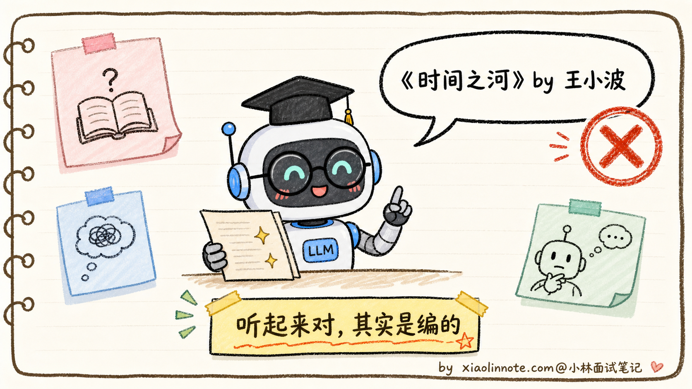

要理解为什么 LLM 会幻觉，得记住一句关键的话：**模型不是数据库**。

数据库的工作模式是「输入查询 -> 返回精确匹配的记录 -> 找不到就明确报错」。LLM 不是这样，它的工作模式是「输入上下文 -> 按概率续写最可能的下一个 token -> 一直续写直到结束」。模型从来没有「查询失败」这个状态，它永远会输出点什么，因为它的全部使命就是「续写」。

这是幻觉的元根源。再往下，可以拆成三个具体的成因层面。

### 根因一：训练数据本身就有错

最容易理解的一层是训练数据问题。

LLM 的训练数据来自互联网（Common Crawl）+ 各种公开语料 + 书籍 + 代码仓库。数据量是 TB 级别的，里面什么货色都有：

- 维基百科里有过时的、错误的、被破坏的版本
- 新闻里有谣言、虚假报道、带立场的扭曲叙述
- 论坛、博客、社交媒体里满是民科、阴谋论、错误的常识
- 不同来源之间互相矛盾（同一个事件的不同说法、同一个数据的不同版本）
- 时间过期的信息（2020 年的「今年是 2020 年」、十年前的「最新研究」）

模型在预训练时把这些**全都学进了参数里**，没有「真假区分」机制。等推理时它说出来的，可能就是某个 2015 年错误论坛帖子的回声。

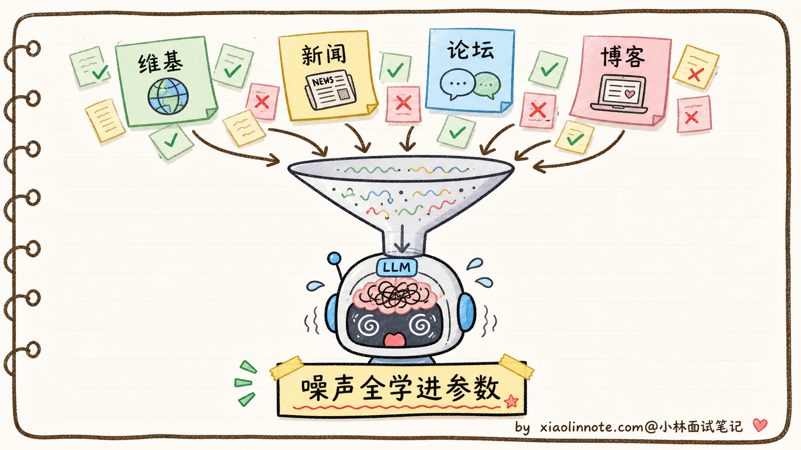

但要注意，**训练数据问题只是冰山一角**。即使数据 100% 正确干净，模型还是会幻觉。下面是更深层的根因。

### 根因二：生成机制是「续写」不是「查询」

这是幻觉最深的根因，也是面试里最容易问倒人的地方。

LLM 的本质训练目标通常包含 **next-token prediction**：给定上下文，模型输出下一个 token 的 logits/概率分布，再由解码器逐步生成。这个概率过程本身不等于事实查询或证明系统。

这里有一个被很多人忽略的事实：**模型对「自己知不知道某件事」根本没有显式信号**。

你问「鲁迅是谁的笔名？」，模型的处理流程不是「查一下知识库 -> 找到周树人 -> 输出周树人」，而是根据参数和上下文计算下一个 token 的分布。若知识过时、冲突、粒度不足或上下文触发了相似但错误的模式，模型就可能续出听起来合理但错误的答案；不能把记忆次数或某个 token 概率简单等同于事实置信度。

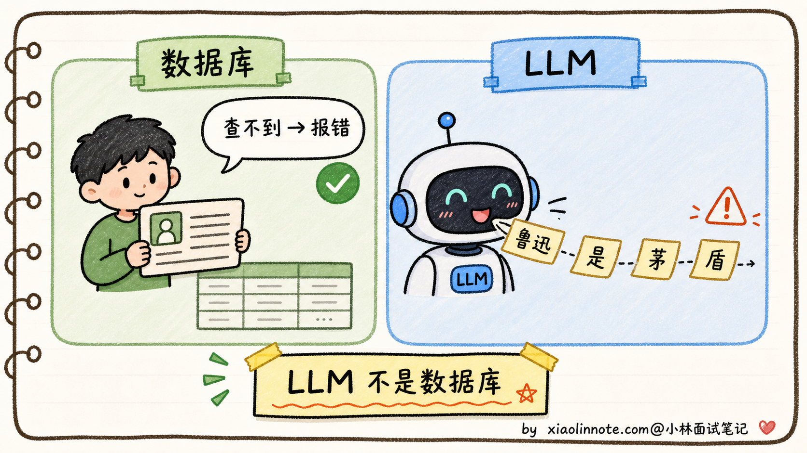

模型这种「永远会输出点什么」的特性带来一个反直觉的结果：**Temperature=0 也会幻觉**。

为什么？许多 API 的 `Temperature=0` 会近似采用贪心，但具体后端语义可能不同。即使选到最高 logit，“最可能”也不等于“事实正确”；错误可以稳定地重复输出。

这就是为什么把温度调低不能根除幻觉。**温度只能减少「同一个错误重复出现的随机性」，不能修正「错误本身」**。模型记错了就是记错了，温度调低反而让错误答案更稳定地输出。

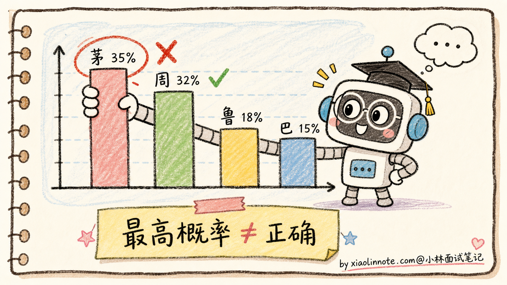

更进一步的是「**参数化知识 vs 检索式知识**」的对比。

LLM 的大量知识以分布式方式编码在参数中（参数化知识），这种存储方式是：

- **模糊的**：知识不是 key-value 存的，是分布式编码在权重里的，记得多准取决于训练时见过多少次
- **不可检索的**：模型自己不知道某条知识在哪几个权重里
- **不可验证的**：模型输出一个事实时，没法回过头标「这条来自训练数据的某段」

而 RAG（Retrieval-Augmented Generation，检索增强生成）把检索到的证据放入上下文。它可以提供出处和“无结果”路径，但检索错、文档过期、上下文冲突或模型误读时仍会产生幻觉；“有引用”也不自动等于“被引用内容支持结论”。

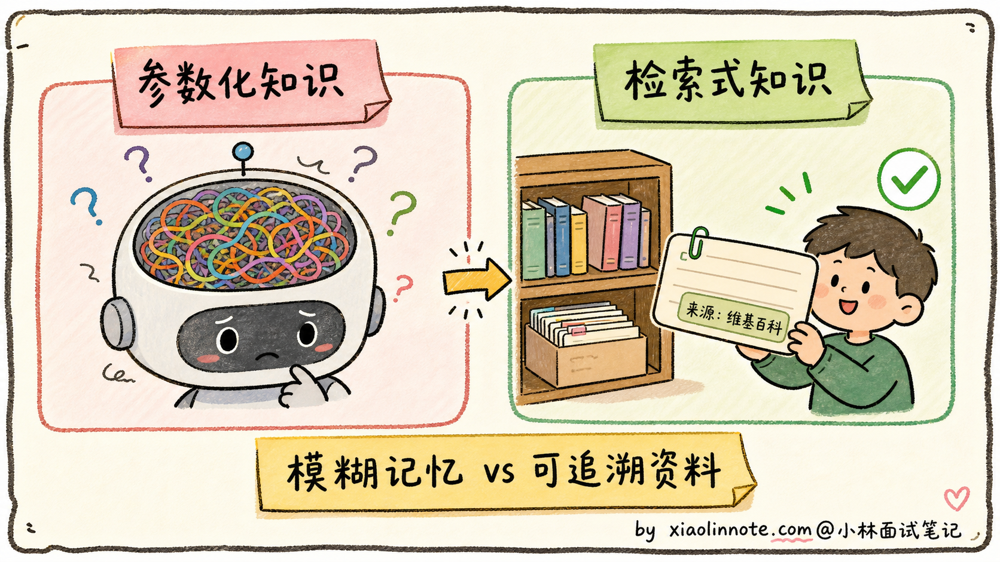

### 根因三：对齐目标的副作用

第三层根因更隐蔽：**某些对齐数据和评分偏好可能奖励流畅、完整的回答，却没有充分奖励校准的不确定性**。

什么意思？SFT 的训练数据是（指令，期望回答）对，但绝大多数标注员写期望回答时，都会写「自信、详细、专业」的回答，很少写「我不知道」。结果是模型学到了「碰到问题就要给出详细回答」的行为模式，根本没学过「碰到不会的就拒答」。

如果偏好标注没有可靠事实核验，详细、自信的错误回答可能被误选；这不是所有 RLHF 流程的必然结果，而是数据与奖励设计风险。

奖励模型可能把流畅度、详尽度等表面特征当作质量代理，导致过度自信或拒答校准不足；因此需要不确定性、事实性和安全切片评测，不能直接断言某个训练流程一定造成“永远不拒答”。

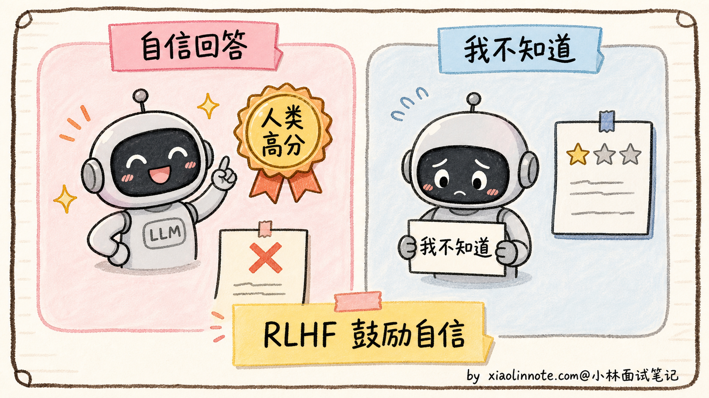

相关研究讨论过「**Calibrated Refusal（校准的拒答）**」：让模型在证据不足时表达不确定并请求核验。至于具体产品的训练配方，公开资料通常不足以还原内部流程，不能把某篇论文直接等同于某个产品。

到这里，三个根因层面都讲完了：训练数据有噪声、生成机制是「续写不是查询」、对齐目标鼓励「不拒答」。下面看看具体能产生哪些类型的幻觉。

### 三类幻觉的典型表现

工程上可以按错误来源把幻觉分为几类；不同论文的 taxonomy 不完全一致：

**1. 事实性幻觉（Factual Hallucination）**

模型编造不存在的事实，或把已知事实张冠李戴。最常见、最容易被识破：

- 编造不存在的人物（「李白曾担任唐朝丞相」）
- 编造不存在的论文（「Zhang et al. 2019 在 Nature 发表」）
- 时间错误（把发生在 2010 年的事说成 2015 年）
- 地理错误（「乌克兰的首都是莫斯科」）

**2. 推理性幻觉（Reasoning Hallucination）**

事实层面没问题，但推理过程错乱、前后矛盾、逻辑跳跃。在数学题、代码题里尤其常见：

- 数学题前面算对了，后面突然算错
- 代码生成里前半段定义了变量 x，后半段引用了从来没定义过的 y
- 推理链断了一步，最后结论强行得出

**3. 上下文不一致（Faithfulness Hallucination）**

最隐蔽的一类，不违反客观事实，但**违反用户在 Prompt 里给的明确条件**：

- 用户说「我已经吃饱了」，模型还推荐你去吃饭
- 用户给了一段文档说「请只根据下面的资料回答」，模型答的是它自己脑袋里的知识，不是文档里的
- 系统 Prompt 写了「不要泄露内部信息」，模型还是把内部 Prompt 复述了出来

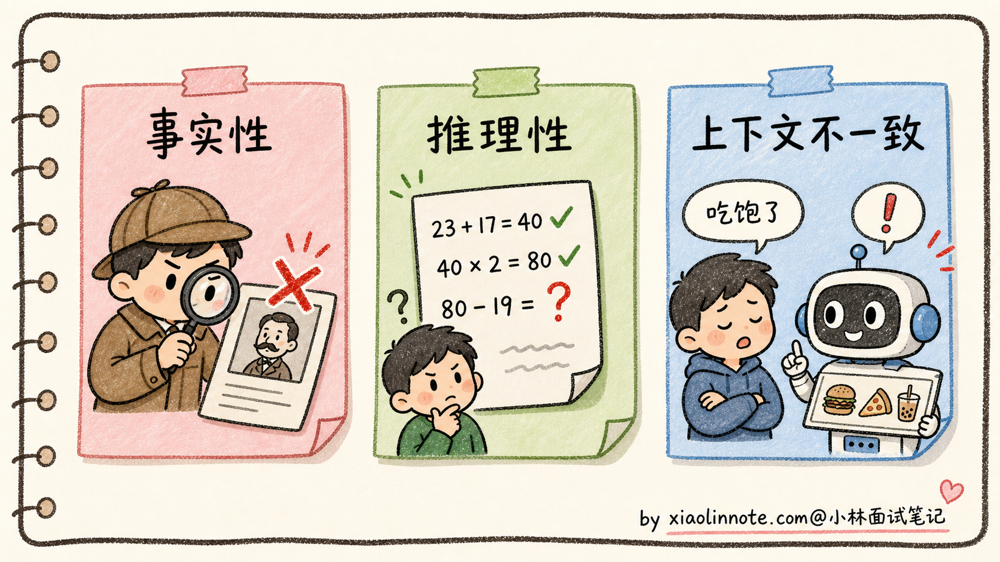

理解了根因和分类，缓解方案就有了对症下药的落点。下面分三层来看。

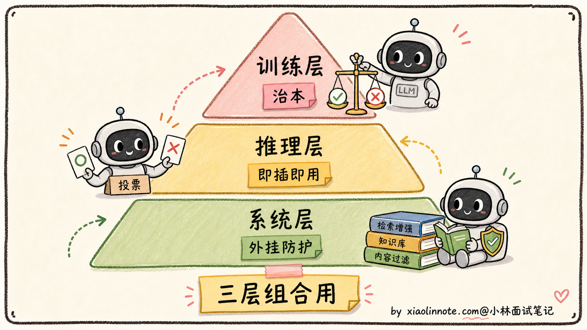

### 缓解方案：训练层

最根本的缓解办法是在训练阶段就教会模型「不知道就说不知道」。具体有几种做法：

**1. 在 SFT 数据里加入大量「拒答样例」**

主动加入证据不足时的澄清、拒答和引用核验样例，让模型学到“拒答/澄清也可能是合格行为”；具体产品是否大量采用某种数据配方，不应臆断。

**2. 校准（Calibration）训练**

用专门的偏好数据，让标注员对「正确且自信」「错误但谨慎」「错误且自信」打分，让奖励模型学到「错误且自信」要严厉扣分。这样训出来的模型会主动避免「自信地说错话」。

**3. 用奖励模型筛掉幻觉回答**

收集模型回答，用可核验来源、程序规则或人工进行事实核查，把错误和证据不足的回答纳入负样本/偏好数据；不要把这一通用策略直接归因于某个厂商的特定训练流程。

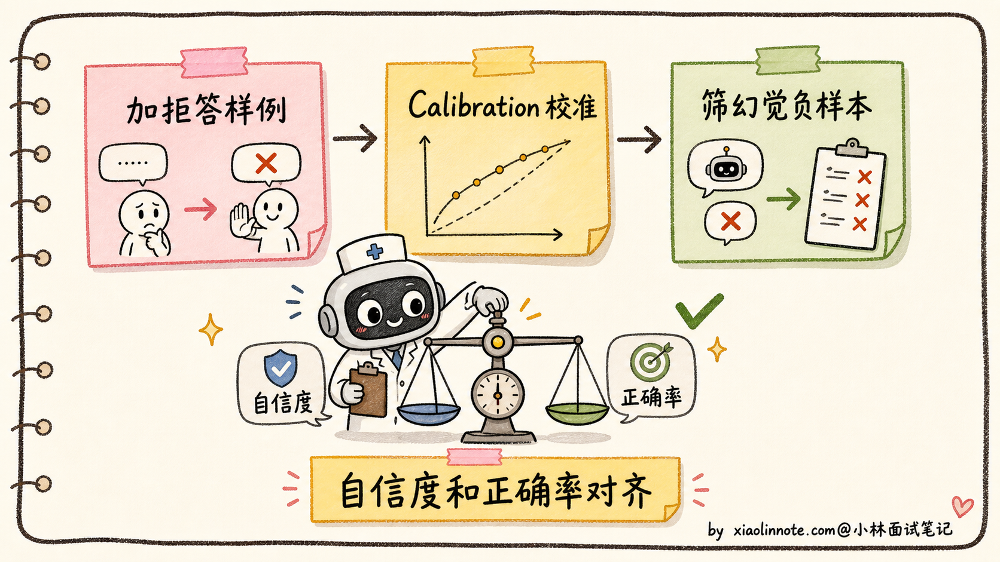

训练层缓解的优点是治本，但代价是训练成本高，且效果上限受训练数据质量限制。所以工程上还需要推理层和系统层的辅助。

### 缓解方案：推理层

推理层缓解不需要改模型，只需要在推理时调整解码行为或提示工程：

**1. CoT（链式思考）暴露推理错误**

让模型先做分步分析，再给出最终结论。这样模型更不容易跳步，最终答案错的时候也更容易通过简要依据追溯问题。对外产品里不一定展示完整 CoT，可以展示关键推理步骤或检查结果。CoT 对推理性幻觉有帮助，但不能保证一定正确。

**2. Temperature 调低**

虽然前面说过低温不能根除幻觉，但降低随机性有时能减少采样波动；它也可能让错误更稳定。温度范围不是“事实问答标配”，应按模型/API 行为和业务验证集调参。

**3. Self-Consistency 多次采样投票**

对同一个问题，在预算内采样多次，再对可比较的最终答案投票或交给验证器。正确路径可能更容易收敛，但共享偏差也会造成一致错误；采样数、温度和收益应通过任务集评估。

**4. 约束解码（Constrained Decoding）**

如果输出格式有严格约束（比如 JSON、SQL、特定 schema），可用结构化输出/约束解码并在服务端再次解析校验，降低格式错误；约束格式不等于保证事实正确，也不是所有框架/模型/流式模式都支持同样的约束。

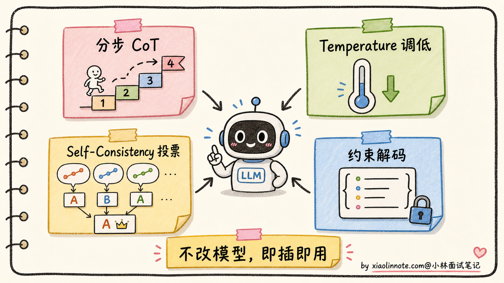

推理层缓解的优点是不改模型、可以即插即用，缺点是上限有限，对「模型记忆模糊」这种根本问题没办法。

### 缓解方案：系统层

系统层缓解是最工程化的方案，把 LLM 当成「会犯错的组件」，外面加防护栏：

**1. RAG：让模型「看着资料答」**

RAG 是常用的系统层方案：生成前检索相关资料，把证据放进上下文并要求按证据回答。它能改善有可靠知识源的事实问答，但效果取决于召回、排序、文档版本、上下文长度、提示约束和引用校验，不保证减少固定比例，也不适合替代所有推理或权限判断。

**2. 后处理事实核查（Fact-Checking）**

模型输出后，用另一个 LLM 或者检索系统去核查里面提到的事实声明。比如模型说「Smith et al. 2018 在 Nature 发表了 X」，后处理系统去 PubMed 查这篇论文是否存在。如果核查不过，把这部分内容标红或删掉。

**3. 强制带引用来源**

在 Prompt/输出 schema 中要求事实声明关联检索证据，并由服务端检查引用是否真的支持声明；用户可点击核验。引用应来自可信、权限正确且版本明确的来源，不能把“带编号”当作事实保证。

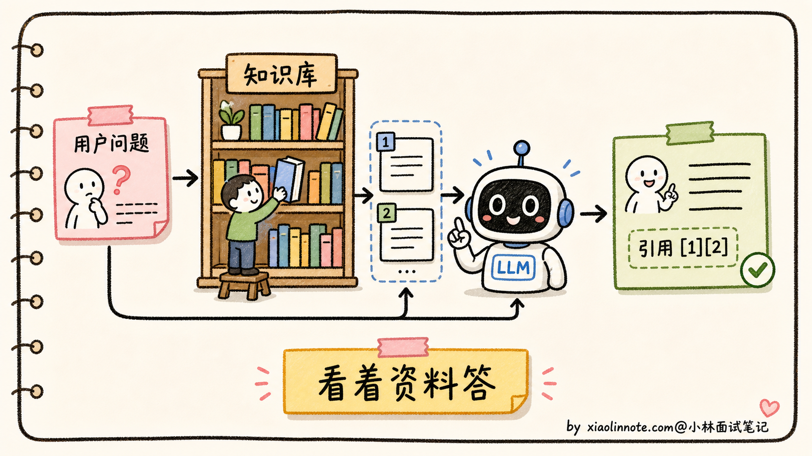

系统层缓解的优点是工程上最有效、可观测、可追溯，缺点是引入了额外的延迟和系统复杂度。但对企业级应用来说，几乎是必选项。

### 工程实践：为什么幻觉不可能完全消除

最后讲一个面试里很容易加分的点：**幻觉永远不会被「彻底消灭」**。

原因回到最开始那句话，**LLM 的本质是按概率续写下一个 token**，这个机制天然就带着「会编」的可能性。无论你再怎么对齐、怎么 RAG、怎么核查，只要模型还是按概率生成的，就一定有概率生成错误内容。

工程上现实的目标是：

- **降低发生率**（从 30% 降到 5% 是巨大的胜利）
- **让用户能识别**（带引用、加可信度标记、对不确定回答主动声明）
- **限定使用场景**（高风险场景如医疗、法律必须有人类把关）

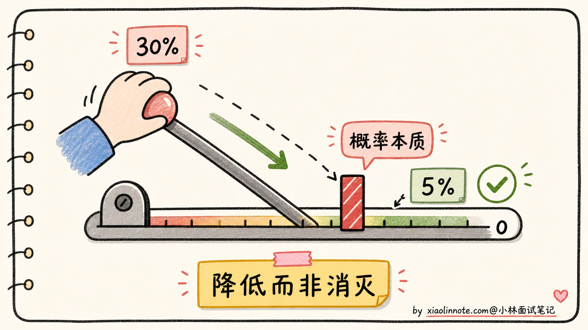

讲到这里，能在面试里说出「幻觉不可能消除，工程目标是降低发生率 + 让用户识别」这句话，就比绝大多数候选人深刻一个层次了。这个认知背后是「LLM 的概率本质」，是面试官想听到的。

## 🎯 面试总结

回到开头那段对话，问到大模型为什么会出现幻觉、怎么缓解，最重要的是先讲清楚**幻觉的定义和元根源**。幻觉不是简单的「模型出错」，而是「生成了流畅合理但实际错误的内容」。元根源是 **LLM 不是数据库，是续写器**，它的全部使命就是按概率输出下一个 token，没有「查询失败」这个状态，永远会输出点什么。这一句先讲到，就把幻觉的本质点出来了。

接下来讲**三个具体根因**。训练数据本身有错（互联网语料里有噪声、矛盾、过时信息）；生成机制是「续写不是查询」（参数化记忆模糊，所以 Temperature=0 也会幻觉）；对齐目标的副作用（RLHF 训练时人类标注偏好「自信回答」，模型被无形训练成「不会拒答」）。这三层根因层层递进，**第二层和第三层是面试里能加分的关键**，能讲出来比一般候选人深刻。

然后讲**缓解方案分三层组合用**。训练层（拒答数据增强、Calibration 校准、奖励模型筛幻觉），推理层（分步分析、温度调低、Self-Consistency、约束解码），系统层（RAG、事实核查、强制带引用）。每一层都不是银弹，工业级应用通常组合用。这里不要硬说某个闭源模型具体用了哪几招，公开资料没写的就保持谨慎。

最关键的一句话是：**幻觉不可能完全消除，因为它是 LLM 概率生成机制的固有产物**。工程目标是「降低发生率 + 让用户能识别」，不是「彻底消灭」。能讲到这一层，面试官就知道你不是在背工具，是真的理解 LLM 的本质。

---
