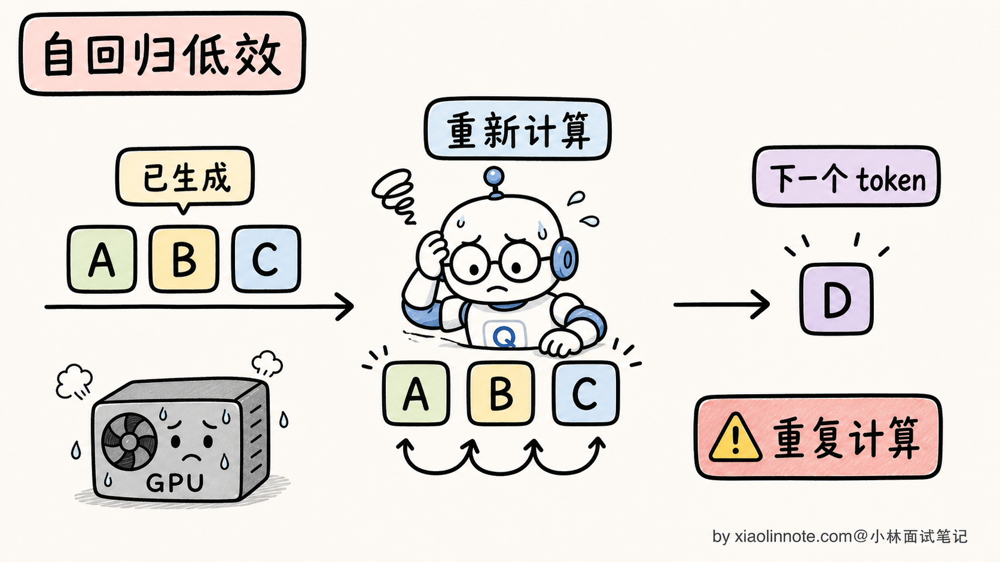
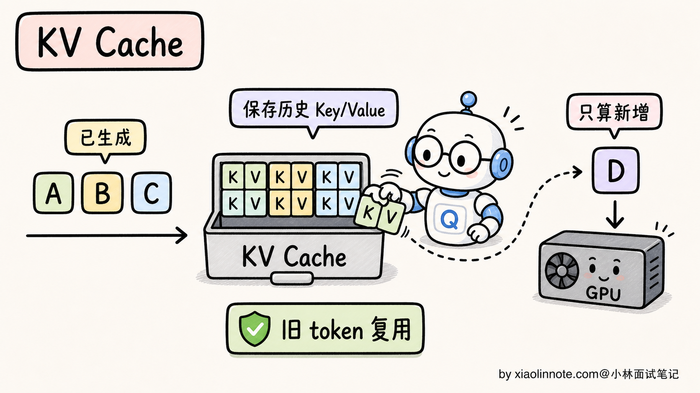
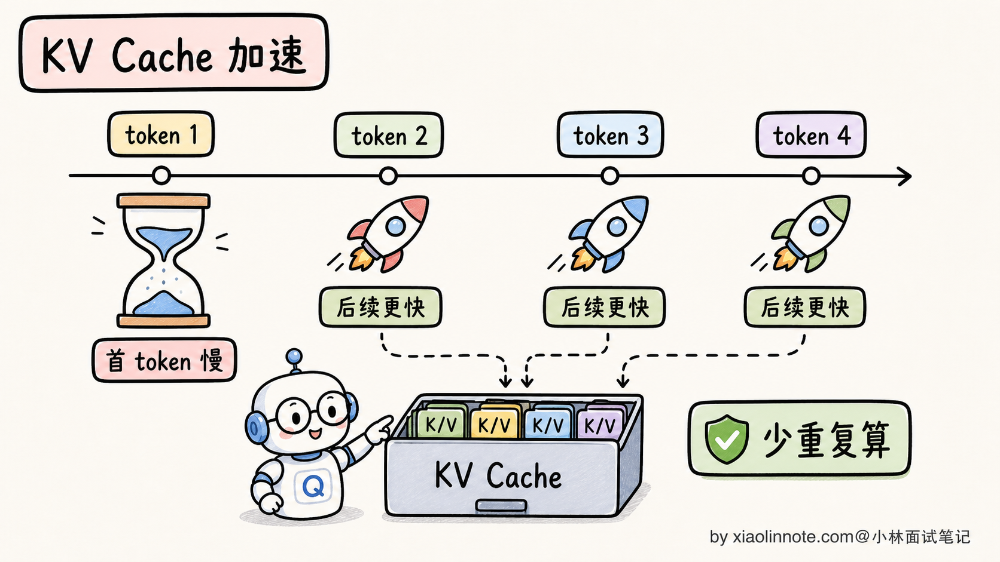
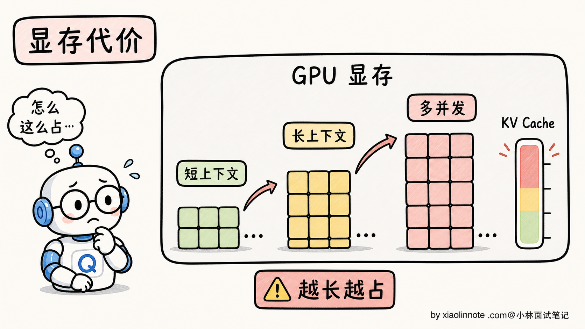
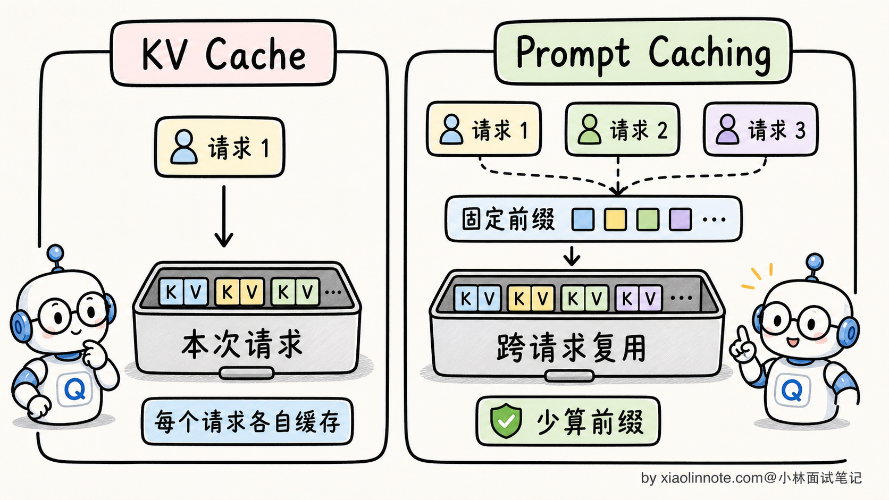
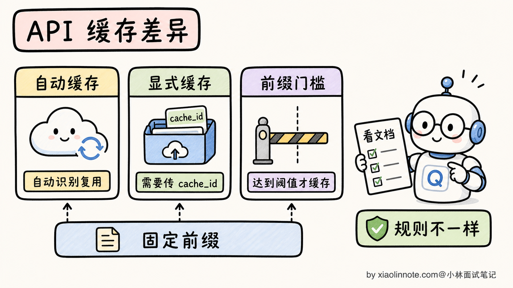
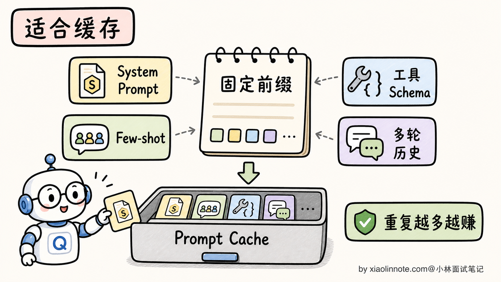
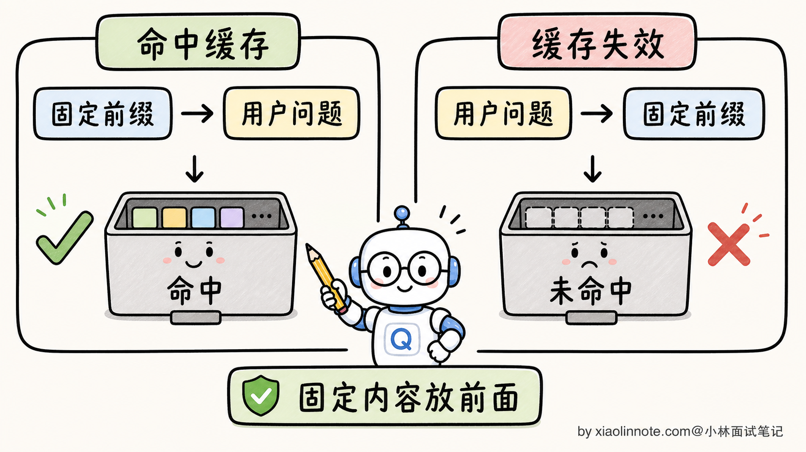
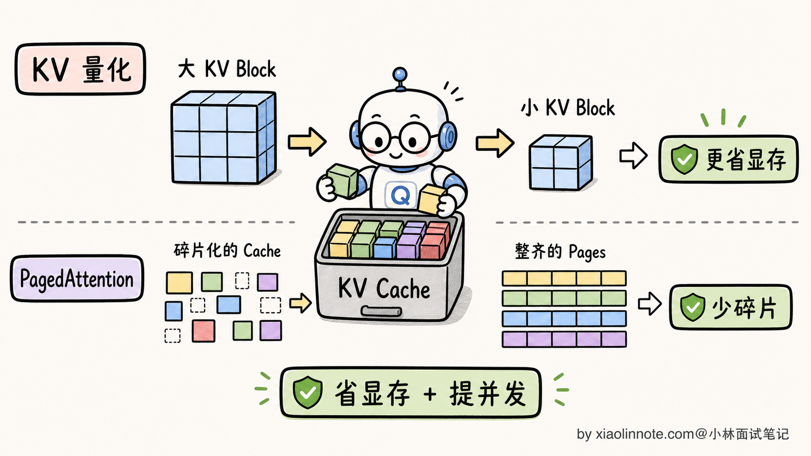

# KV Cache 是什么？Prompt Caching 的原理是什么？

> 原文：[KV Cache 是什么？Prompt Caching 的原理是什么？](https://xiaolinnote.com/ai/llm/kv_cache_prompt_caching.html) · 小林面试笔记


👔面试官：来讲讲什么是 KV Cache？Prompt Caching 又是怎么回事？这两个有什么关系？

🙋‍♂️我：KV Cache 是 Transformer 里的一个东西，存的是 K 和 V 矩阵。Prompt Caching 是 Claude 的一个 API 功能，能减少 token 费用。

👔面试官：……你只说了表面。KV Cache 具体是缓存什么、为了解决什么问题？为什么自回归生成必须要 KV Cache？没有 KV Cache 推理速度会变成什么样？

🙋‍♂️我：哦哦，因为每次生成新 token 都要重新计算前面所有 token 的 attention，KV Cache 就是把前面算过的存起来。

👔面试官：对了一半。那 Prompt Caching 和 KV Cache 是同一个东西吗？两者具体什么关系？为什么 OpenAI、Anthropic 都把 Prompt Caching 作为新功能大力推广？

🙋‍♂️我：呃……KV Cache 是模型内部的，Prompt Caching 是 API 层面的？

👔面试官：方向对，但具体差别能讲清楚吗？KV Cache 是「**单次推理内**」的优化（同一次生成的不同 token 之间复用），Prompt Caching 是「**跨请求**」的优化（不同请求之间复用相同前缀）。这两个是同一个底层机制在不同时间尺度上的应用，没搞清楚这层关系，就讲不出 Prompt Caching 的真正价值。

把这几个反问串起来其实就一句话，KV Cache 和 Prompt Caching 是**同一套缓存思路在两个时间尺度上的延伸**，前者是单次推理内的、后者是跨请求的。理解这一层，省钱和加速到底怎么发生的就清楚了。

## 💡 简要回答

我理解 KV Cache 和 Prompt Caching 是同一个机制在两个时间尺度上的应用。

**KV Cache** 是「**单次推理内**」的优化。自回归生成时，过去 token 的 K/V 在因果注意力下不会因为未来 token 改变；缓存它们就能避免重复计算。若用完全朴素的“每一步重跑整段序列”实现，注意力相关总成本会随序列长度快速增长；带 KV Cache 后，生成阶段每步只为新 token 计算投影，再读取历史 K/V，具体复杂度还取决于层、头、实现和 prefill/decode 划分。

**Prompt Caching** 是「**跨请求**」的优化。服务商可能缓存可复用的前缀表示、prefill 中间结果或 KV 状态；如果两个请求的可缓存前缀满足其匹配规则，后一个请求可以少做前缀计算。它不一定把一份裸 KV 张量永久暴露或直接复用，具体实现、TTL、隔离和计费由供应商决定。

价值上的区别：

- **KV Cache** 解决的是「**让自回归生成可行**」，是 Transformer 推理的基本盘
- **Prompt Caching** 解决的是「**降低重复前缀的计算/输入成本和延迟**」，是工程层面的 ROI 优化。不同厂商、模型版本和区域的命中条件、计费、TTL 与折扣不同，应以当前价格和接口文档为准；延迟收益也取决于前缀长度、命中率、服务端负载和网络。

最关键的认知是，**Prompt Caching 不是新发明，是 KV Cache 这个底层机制的工程级延伸**。理解了 KV Cache，Prompt Caching 几乎是自然推论。

实际工程使用 Prompt Caching 的核心要点是：**稳定、可共享且权限一致的内容在前，动态内容在后**；很多实现要求前缀按 token/请求结构匹配，但具体规范可能允许不同的规范化或断点规则，不能把“差一个字符必 miss”当成所有平台的定律。

## 📝 详细解析

### 自回归生成里隐藏的低效问题

要理解 KV Cache，得先看清楚自回归生成本身的低效在哪里。

LLM 是自回归生成的，每次只产出一个新 token，把它拼到序列末尾，再让模型对**整个新序列**重新计算一遍 attention，得到下一个 token。听起来很自然，但隐藏着一个巨大的浪费。

假设要生成 10 个 token，朴素实现的过程是：

```
第 1 步：输入 [P]（Prompt），算 attention，输出 token 1
第 2 步：输入 [P, t1]，算 attention，输出 token 2
第 3 步：输入 [P, t1, t2]，算 attention，输出 token 3
...
第 10 步：输入 [P, t1, t2, ..., t9]，算 attention，输出 token 10
```

每一步都把前面所有 token 重新算一遍 attention，包括 P 这个长 Prompt（可能几千 tokens）。



在完全朴素、每步重算整段序列的实现中，注意力矩阵的重复计算会产生近似立方级的累计项；这是说明“为什么要缓存”的直觉模型，不应拿它替代真实框架的 profile。实际服务会区分 prefill、decode、投影、访存和批处理。

注意一件事：**第 2 步算的「P」的 attention，和第 1 步算的「P」的 attention 是完全一样的**（因为输入和模型参数都没变）。每一步重算前缀，是纯粹的浪费。

KV Cache 就是为了消除这个浪费而生的。

### KV Cache：单次推理内的优化

KV Cache 的核心思路一句话：**把前面所有 token 的 K 和 V 矩阵缓存起来，每次新 token 只算自己的部分**。

具体怎么做？要先回到 attention 公式：

```
Attention(Q, K, V) = softmax(Q · K^T / √d_k) · V
```

注意这里：

- 新 token 只是一个 Q（它在「问」前面所有 token）
- 它做点积的对象 K^T 和加权求和的对象 V，**都来自前面所有 token**
- 但前面所有 token 的 K 和 V 是**固定的**，不会随新 token 而变（因为 K 和 V 是从已有 token 的 embedding 算的，新 token 不影响它们）

所以**前面所有 token 的 K 和 V 完全可以缓存**，每次只算新 token 自己的 Q、K、V，然后跟缓存的 K/V 拼起来做 attention。



工作流程详细看：

```python
# 朴素实现（无 KV Cache）
for step in range(max_tokens):
    K_all, V_all = model.compute_KV(全部已有 token)  # 重复算前面的
    Q_new = model.compute_Q(全部已有 token)
    attention_out = softmax(Q_new @ K_all.T / sqrt(d_k)) @ V_all
    next_token = sample(attention_out[-1])

# 带 KV Cache 的实现
kv_cache = []
for step in range(max_tokens):
    if step == 0:
        # 首次：处理整个 Prompt，把 K/V 全部缓存
        K, V = model.compute_KV(prompt_tokens)
        kv_cache.append((K, V))
    else:
        # 后续：只算新 token 的 Q、K、V（以下为伪代码）
        K_new, V_new = model.compute_KV([new_token])
        kv_cache.append((K_new, V_new))
    
    Q_new = model.compute_Q([current_token])
    K_all = concat(kv_cache.K)  # 缓存里取出来用
    V_all = concat(kv_cache.V)
    attention_out = softmax(Q_new @ K_all.T / sqrt(d_k)) @ V_all
    next_token = sample(attention_out)
```

关键变化：每一步只算 1 个 token 的 K/V（O(1) 工作量），而不是 N 个 token（O(N) 工作量）。总计算量：

| 实现 | 第 i 步开销 | N 步总开销 |
| --- | --- | --- |
| 朴素重算（注意力部分的直觉模型） | 随历史长度快速增长 | 近似立方级累计项 |
| 带 KV Cache（decode 注意力部分） | 读取历史 K/V，随历史长度增长 | 近似平方级累计项 |



KV Cache 是自回归 decode 的关键优化，但在调试、特殊内存约束或某些模型路径中也可能被关闭或不适用；生产框架通常提供并默认利用它，具体行为以实现为准。

### KV Cache 的显存代价

KV Cache 让计算速度大幅提升，但代价是显存占用。前面所有 token 的 K/V 都要常驻显存，长上下文下这是个不小的负担。

KV Cache 显存大小可以粗略写成（按实际 KV head 数和缓存精度计算）：

```
KV Cache 显存 ≈ 2（K 和 V）× B × N × L × H_kv（KV 头数）× d_k × 每元素字节数
```

以某个采用 L=32、H_kv=32、d_k=128 的模型配置为例，batch=1、N=32K 且使用 FP16 时：

```
2 × 1 × 32000 × 32 × 32 × 128 × 2 ≈ 17 GB
```

该数量级的 KV Cache 约为 17GB；再加权重、运行时和激活后，是否能放入某张 GPU 必须看实际模型、量化、上下文和框架开销，不能从“7B”三个字符推出固定结论。



这就是为什么大模型部署有一系列围绕 KV Cache 的优化（PagedAttention、KV Cache 量化、MQA/GQA 共享 K/V 等），目标都是把 KV Cache 显存压下来。这些优化是另一个层面的话题，本节不展开，只需要知道 **KV Cache 的显存压力是 LLM 工程的核心议题之一**。

### 从 KV Cache 到 Prompt Caching：同一机制的扩展

到这里，KV Cache 解决的是「**单次生成内**」的重复计算问题。但还有一个更隐蔽的浪费：**不同请求之间的重复计算**。

考虑一个场景：客服系统的稳定 System Prompt、规则和示例占据很长前缀，许多请求重复使用它们。如果每次都从零做 prefill，就会重复消耗前缀计算；是否值得缓存取决于重复率、前缀长度、并发、TTL、价格和数据隔离。



Prompt Caching 的核心思路就是：**把 KV Cache 的复用范围从「单次推理内」扩展到「不同请求之间」**。

具体机制：

- 服务端维护可复用的前缀状态或中间结果，并按 token 序列、断点或内部键匹配
- 首个请求先计算并按策略写入缓存，缓存可能位于 GPU、CPU、分布式内存或供应商内部层
- 后续请求若满足匹配、模型版本、权限和租户条件，就少做前缀计算，再处理动态部分

从抽象上看，这是把“复用已计算前缀”从单次请求扩展到跨请求；底层可能复用 KV，也可能复用更高层的 prefill 结果，因此不要把所有 Prompt Caching 都等同于客户端可见的 KV 张量池。

### 主流 API 的 Prompt Caching 实现

不同的 API 厂商对 Prompt Caching 的实现方式不太一样，主要分两派。

**某些供应商：显式标记缓存断点**

一种常见做法是让调用方在希望缓存的内容末尾加一个 `cache_control` 或类似断点标记；具体字段、模型支持和失效规则需以当前 API 文档为准：

```python
import anthropic
client = anthropic.Anthropic()

# System Prompt 带缓存断点：把「到这里为止的内容」标记为可缓存
SYSTEM_WITH_CACHE = [
    {
        "type": "text",
        "text": "你是一位专业的劳动法顾问。\n\n以下是完整的《劳动合同法》条文：\n\n[数千字的法律条文内容...]",
        "cache_control": {"type": "ephemeral"}  # 断点：这份法律条文会被缓存
    }
]

# 第一次请求：建立缓存（是否有写入费用、如何计费以当前文档为准）
response1 = client.messages.create(
    model="你的 Claude 模型 ID",
    max_tokens=512,
    system=SYSTEM_WITH_CACHE,
    messages=[{"role": "user", "content": "员工试用期最长可以是多久？"}]
)

# 第二次请求：满足供应商匹配规则时可能命中缓存（折扣与计费以当前文档为准）
response2 = client.messages.create(
    model="你的 Claude 模型 ID",
    max_tokens=512,
    system=SYSTEM_WITH_CACHE,
    messages=[{"role": "user", "content": "劳动合同必须包含哪些必备条款？"}]
)
```

显式标记的好处是用户清楚控制哪些内容缓存、哪些不缓存。代价是要改代码、加配置。

**另一类实现：自动或半自动缓存**

有些 API 会对满足最小长度和前缀匹配条件的请求自动尝试缓存，并在响应或用量信息中返回命中情况；阈值、可缓存字段、模型范围和可观测字段会随版本变化。

自动缓存的好处是开发者不用改代码就能享受到，缺点是控制粒度不如显式标记精细。



**价格优势**：

计费优势需要根据当前供应商、模型、区域、缓存写入/读取价格和 TTL 计算；写入成本、最小缓存长度、命中折扣和未命中回退都可能不同。只有在真实命中率和请求量下做账单模拟，才能判断是否省钱。

延迟优势：命中缓存时首 token 延迟通常会下降，因为 Prompt 部分不用重算了。具体能降多少，要看缓存前缀长度、模型、并发和服务端调度，工程上要用真实链路压测。

### 适合用 Prompt Caching 的场景

Prompt Caching 最适合「**前面固定、后面变化**」的使用模式，三类典型场景：

**场景 1：固定 System Prompt 的应用**

客服系统、AI 助手、代码 Review 工具，System Prompt 包含大量产品知识、规则说明、Few-shot 示例。用户每次发消息，System Prompt 都是固定的，可以一直命中缓存。这是最常见、收益最大的场景。

**场景 2：基于同一份长文档的多次问答**

比如「把合同文本放进 Prompt，然后问 10 个不同的问题」。第一次问问题时建立缓存，后续 9 次都命中缓存，节省了大量重复处理文档的成本。法律 AI、金融 AI、医疗 AI 这种场景特别多。

**场景 3：大量 Few-shot 示例**

如果你的 Prompt 里有 10-20 组 Few-shot 示例（用于引导模型输出特定格式），这部分内容非常适合缓存。每次用户的实际问题不同，但 Few-shot 部分一样。



### 工程陷阱：固定内容在前、动态内容在后

Prompt Caching 听起来很美，但实战中有一个最常见的陷阱：**前缀必须完全一致才能命中缓存，哪怕多了一个空格、改了一个字符，就算缓存 miss、重新计算**。

最经常踩的雷是把日期、用户名这类动态内容放在固定内容**前面**：

❌ **会让缓存失效的结构（动态内容在前）：**

```
今天是 2026-03-07，当前用户：张三

[数千字的系统提示 + 产品知识库]
← cache_control 断点

用户问题：我想退换货
```

问题：日期和用户名每次都不同，导致整个前缀每次都变了，缓存永远 miss。每次还是要从零开始算几千字的系统提示。

✅ **正确结构（固定内容在前，动态内容在后）：**

```
[数千字的系统提示 + 产品知识库]
← cache_control 断点放这里

今天是 2026-03-07，当前用户：张三
用户问题：我想退换货
```

把所有固定内容集中到断点之前，动态内容放在断点之后。前缀稳定不变，每次都能命中缓存。



第二个常见陷阱是**缓存的时效性**。缓存通常有供应商定义的 TTL、容量淘汰或显式失效规则；不要把某个平台某个版本的分钟数当成通用事实。这意味着：

- 高重复率应用更可能摊薄写入/预热成本
- 低流量应用可能频繁失效，命中不足，甚至不如直接 prefill

如果你的应用是低流量场景，Prompt Caching 的收益可能不如预期；应按当前价目、命中率、延迟和数据存储风险评估。

还要把安全边界纳入缓存键：不同租户、用户权限、工具授权、文档版本、模型版本和地域策略不能共享同一份前缀状态。缓存内容可能包含敏感 prompt 或个人数据，应有访问控制、加密、审计、TTL、删除和绕过策略；否则“命中缓存”可能变成跨用户泄露。

### 进阶：KV Cache 量化与 PagedAttention

最后简单提两个 KV Cache 的进阶优化方向，作为面试加分项。

**KV Cache 量化**：把 KV Cache 用更低精度存储以降低显存和带宽，但误差、支持范围和质量影响依赖模型/框架，应按任务回归测试；不必背固定“减半到四分之一”或年份判断。

**PagedAttention**：一种借鉴分页思想管理 KV Cache 的实现。请求通过逻辑 Block 映射到物理存储，以减少连续预分配造成的浪费并支持复用；Block 大小、利用率和吞吐收益由版本、模型和负载决定，不能承诺消除全部碎片或达到固定百分比。



这两个方向的具体细节是另一个层面的话题，但能在面试里提一句，会显示你对 KV Cache 这个核心机制有深入跟进。

## 🎯 面试总结

回到开头那段对话，问到 KV Cache 和 Prompt Caching，最重要的是先把**核心关系**讲清楚：这两个不是不相关的优化，是**同一个底层机制在两个时间尺度上的应用**。KV Cache 是「单次推理内」的优化（同一次生成里不同 token 之间复用），Prompt Caching 是「跨请求」的优化（不同请求之间复用相同前缀）。这一句话能讲清楚，就已经比绝大多数候选人深刻了。

接下来把 KV Cache 的来龙去脉讲明白：朴素重算会重复处理历史 token，KV Cache 让 decode 阶段复用过去的 K/V，复杂度和性能收益要按 prefill/decode、访存和 batch 分析。它是常见关键优化，但具体是否开启、如何分页/量化由框架实现决定。

然后讲 Prompt Caching 的工程价值。把 KV Cache 复用范围扩展到不同请求之间，让 N 个用户共用一个 System Prompt 的 KV Cache。Claude 用显式断点（cache_control），OpenAI 用自动缓存，本质都是同一个机制，只是触发方式和计费规则不同。面试里说「能显著降低重复前缀成本和首 token 延迟」就够稳，不要把某一家价格比例说成全行业通用。

最关键的一句话是讲清**工程陷阱**：稳定且权限一致的内容放前，动态内容放后，并按供应商规则监控命中/未命中。日期、用户名、权限和随机 ID 放入可缓存前缀可能降低命中，跨租户共享还会造成泄露；低流量应用也可能因 TTL、写入成本和命中不足而不划算。

如果还想再加分，可以提一句 KV Cache 量化和 PagedAttention 这种进阶优化方向，让面试官知道你对这个核心机制有持续跟进。能讲到这一层，已经是面试里很难追问的水平了。

---
