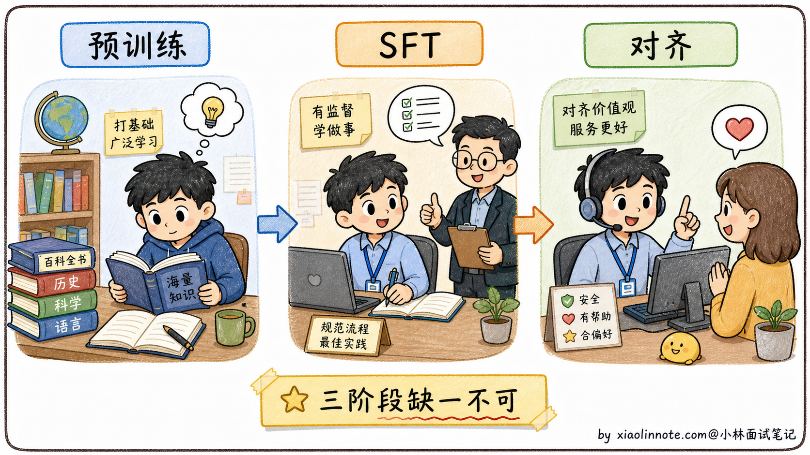
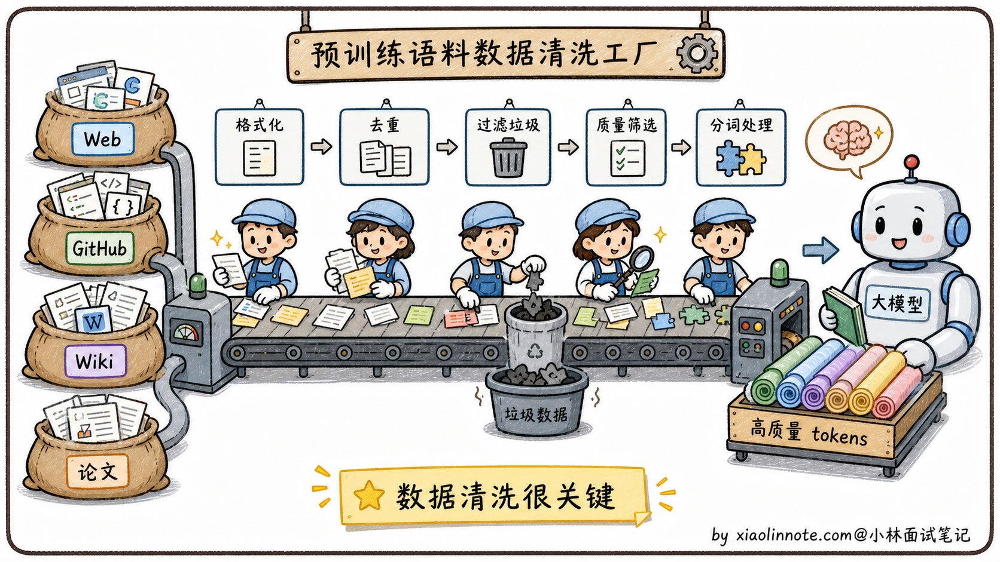
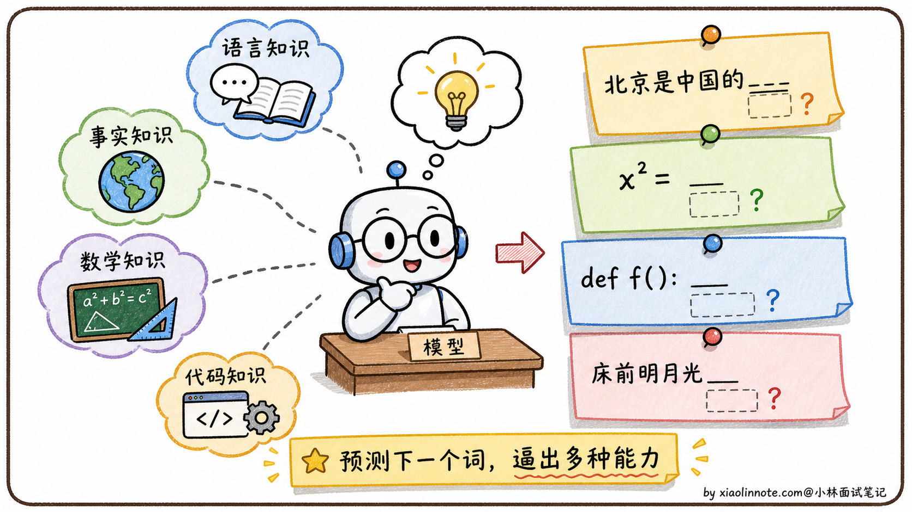
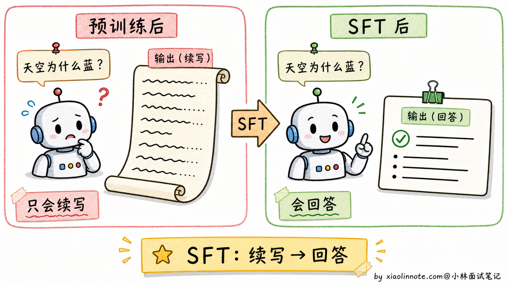
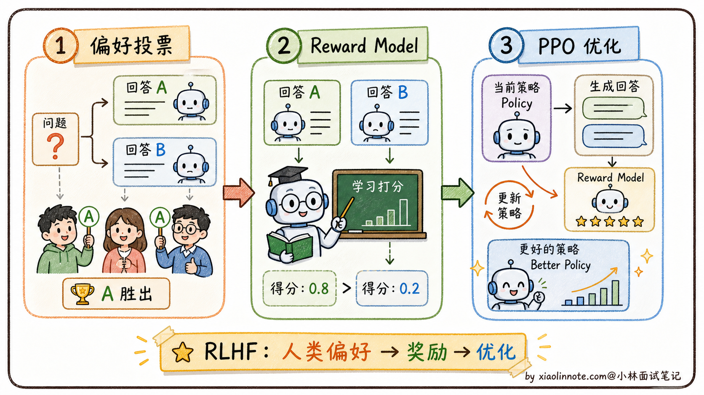
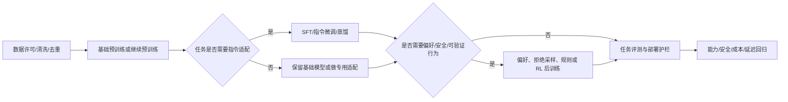
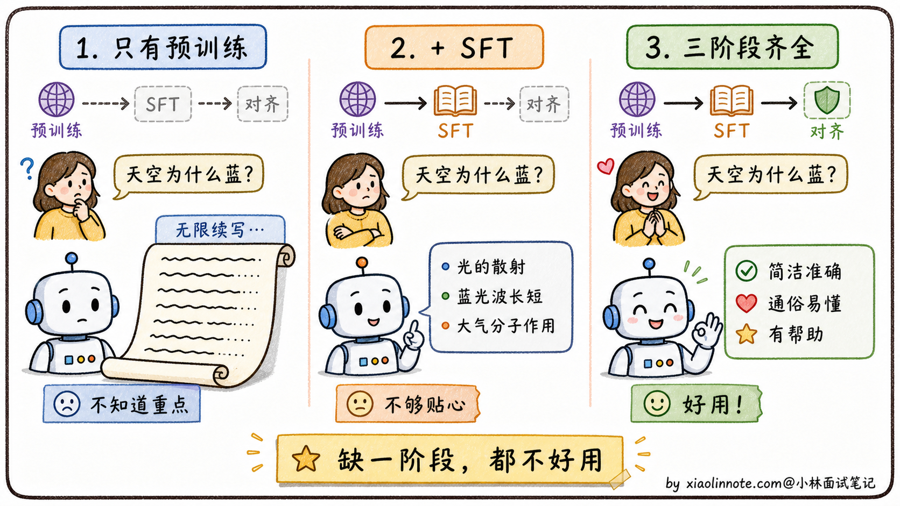

# 大模型是怎么训练出来的？

> 原文：[大模型是怎么训练出来的？](https://xiaolinnote.com/ai/llm/llm_training.html) · 小林面试笔记


👔面试官：来讲讲大模型是怎么训练出来的？

🙋‍♂️我：训练就是给模型喂大量数据让它学习，最后能回答各种问题。

👔面试官：……「喂大量数据」具体喂什么？数据从哪来？训练目标是什么？为什么训完一次就能回答问题？

🙋‍♂️我：哦哦，应该是给它 prompt 和答案对，让它学会回答？

👔面试官：你说的是 SFT 阶段，但常见流程还包括基础预训练、继续预训练/领域适配、指令微调和偏好/安全后训练。它们的目标、数据和是否必需并不相同，你能讲清楚各自解决什么问题、何时可以省略或替换吗？

🙋‍♂️我：呃……三个阶段我大概知道有，但具体差别讲不清楚。

👔面试官：典型的「知道有但讲不清」。预训练主要获得通用表示和生成能力，SFT 让模型学习指令/任务格式，偏好与安全后训练改变行为选择；这些是常见模块，不是固定且不可替代的三段流水线。回去把边界和替代方案搞清楚再来。

到这里我才老实了，训练大模型真不是「喂数据」三个字。常见主线可以画成「基础训练 → 任务/指令适配 → 偏好、安全与能力后训练」，但实际项目可能加入继续预训练、蒸馏、拒绝采样、可验证奖励或跳过某些模块。把每一段的目标、数据和评测拆开讲，整条主线才立得起来。

## 💡 简要回答

大模型训练通常包含几个功能层次：基础训练以自回归/掩码等目标学习语言和表示；继续预训练可让模型适应新领域；SFT/指令微调学习任务格式；偏好、安全或可验证后训练改变输出选择。它们可以用不同损失、数据和参数高效方法实现，是否全部采用取决于模型目标。预训练影响通用能力上限，但后训练也可能改变能力、知识与工具使用行为，不能把它们简化为固定“天花板/格式/价值观”三段。

## 📝 详细解析

### 先理一个直觉：训练大模型为什么要分阶段？

很多人第一次听说「大模型训练分三个阶段」会很困惑，为什么不能一次性训完？为什么要分这么麻烦？

要回答这个问题，先做个类比。培养一个能在公司独当一面的员工，至少要经过三件事。

他得先**有基础知识**，从小学读到大学，掌握语言、数学、逻辑、各种学科常识。没有这个基础，进了公司啥也干不了。然后他得**会公司的流程**，哪怕他知识再渊博，进了公司也不知道「怎么写汇报邮件、怎么和客户对话、怎么提交工单」。这些不是知识问题，是「适配工作场景」的问题。最后他得**懂职业素养**，知道该说什么、不该说什么、什么时候要谦虚、什么时候要拒绝不合理要求。这些不是技能问题，是「价值观和分寸感」的问题。

大模型的常见训练模块可以类比为这三件事，但模块不是固定顺序或不可替代：预训练获得基础能力，SFT/指令适配学习交互格式，偏好/安全后训练改变行为选择；继续预训练、蒸馏、拒绝采样或可验证奖励也可能加入。



有了这个类比打底，下面分别看每个阶段具体在做什么。

### 第一阶段：预训练，读万卷书

预训练是大模型能力的根基，所有上层能力都从这里来。

**数据从哪来？**

预训练数据规模通常很大，但具体 token 数、数据配比和清洗方法随模型版本、公开口径与去重规则变化，不能用某两个模型的数字代表行业标准。

数据来源可能包括经过授权/许可的网页、代码、书籍、论文、新闻、对话或合成数据；“能爬到的所有公开文本”不等于可以合法或高质量地训练，还要考虑版权、隐私、地域、毒性和许可证。

原始数据通常需要去重、质量过滤、语言识别、PII/版权与安全处理、数据混合和污染审计；清洗成本和重要性很高，但不能用“必然比训练贵”或“核心竞争力”作无证据断言。



**训练目标长什么样？**

这一点其实很反直觉。你猜大模型的训练目标是什么？是「回答正确率」？还是「写得通不通顺」？都不是，是一个看起来简单到让人怀疑的任务，**预测下一个 token**。

学术上叫 CLM（Causal Language Modeling，因果语言模型）。每条训练样本就是「给前 N 个 token，预测第 N+1 个 token」，对整个语料库做这件事，反复调整模型参数让它的预测越来越准。

「预测下一个 token」是一个简单的训练目标，但它会促使模型学习能降低损失的语言、模式和部分知识表示；不能由此严格推出模型具有人类式理解、可靠事实记忆或通用推理。

举几个例子你就明白了。要预测「北京是中国的____」，数据中可能提供与首都相关的模式；要预测代码、公式或诗句，模型也会学习相应的统计结构。但这些现象不等于模型必然拥有可靠事实、算术或人类式理解，仍需针对任务评测。



因此，简单目标配合大规模数据、模型容量、优化和后训练，可能产生跨任务能力；“涌现”是否真正离散出现、能力来源如何分解，在研究中仍需具体定义和测量。

**计算开销有多大？**

预训练通常需要大规模 GPU/TPU、数据管线、分布式训练和多轮失败重试；公开论文中的 FLOPs、卡数、训练时间和成本受估算口径影响，面试回答应说明“量级与依赖因素”，不要背一组固定数字。

预训练完之后，模型获得了语言建模能力和参数化模式，但它更接近通用续写器；是否能直接按指令回答，取决于训练数据、模板和模型本身。指令适配通常会改善交互格式，但不创造可靠事实或安全授权。

### 第二阶段：SFT，从「续写机器」变「对话机器」

预训练后的模型本质上是一个「文本续写机器」。

什么意思？你给它一段文字，它会继续往下写，但**不真的理解你在「问问题」**。打个比方，你问它「天空为什么是蓝色的？」，它可能续写成「天空为什么是蓝色的？这是个有趣的科学问题。今天天气不错，让我们看看……」一直发散下去，根本没在回答你。



SFT 的目的就是把这个「续写机器」改造成「对话机器」。

它怎么做？训练数据格式变了，从「连续文本」变成「(指令，期望回答) 对」，比如这种格式：

```
指令：请用简单易懂的语言解释为什么天空是蓝色的
回答：天空呈现蓝色是因为大气中的散射现象。太阳光包含所有颜色，
当光进入大气层时，氮气和氧气分子会将短波长的蓝光散射到各个方向，
而长波长的红光穿透能力更强，散射较少。所以我们从任何方向看天空，
都能看到散射来的蓝光。
```

模型在这种数据上继续训练，慢慢学会「啊，看到这种格式我就该给一个完整答案，不要无限续写下去」。这就是从「续写模式」切换到「对话模式」的关键。

数据质量比数量更重要。公开技术报告可能披露某些模型的 SFT 数据规模，但数据定义、筛选和配比不能直接横向比较。小而高质量的数据集有时能胜过大而嘈杂的数据集，具体收益需要按任务和验证集测量；因此工业界会同时关注覆盖、去重、难例和标注一致性。

数据多样性也很关键，不能只覆盖一种任务。一份合格的 SFT 数据集会涵盖问答、写作、代码、角色扮演、数学推理、翻译等各种场景。覆盖面不够的话，模型在没见过的任务上就会表现拉胯。

SFT 之后，模型已经会按指令回答问题了。但它的回答方式不一定是你喜欢的，可能太啰嗦、太简洁、或者偶尔说出一些不该说的话。这就需要第三阶段。

### 第三阶段：对齐，学会「好好说话」

对齐（Alignment）的目标是让模型的行为更符合人类的价值观和偏好。

举个例子。同一个问题「怎么学好 Python」，可以有很多种「合格」的回答。有的简洁、有的详细、有的带代码示例、有的纯文字、有的承认「我不熟悉这块」、有的硬装专家胡说。SFT 只教会了模型「这种格式叫合格回答」，但没告诉它「哪种回答用户更喜欢」。对齐就是补这一课。

对齐的一条经典路线是 **RLHF**（Reinforcement Learning from Human Feedback，基于人类反馈的强化学习）；InstructGPT 让这条路线广为人知，但偏好对齐也可以使用 DPO、拒绝采样、可验证奖励、规则或其他后训练方法。

它的流程是这样的。先让人类标注员对同一个问题的多个回答做排序（A 比 B 好、B 比 C 好），收集大量这种「偏好排序」数据。然后用这些数据训一个独立的「奖励模型」，让它学会自动给回答打分（代替人类，因为人类标注太慢太贵）。最后用强化学习算法（PPO）调整大模型的参数，让它生成的回答尽量得高分。



RLHF 流程可能较长，需要偏好数据、奖励/价值估计、在线采样和安全评测；奖励模型可能被“钻空子”（reward hacking），所以要用人工、程序验证和业务指标交叉检查。具体难度取决于实现与资源，不能用“只有极少团队能做”概括。

后来出现了 **DPO**（Direct Preference Optimization，直接偏好优化）等离线偏好方法。DPO 在特定参考策略、奖励和 KL 假设下把目标写成偏好损失，通常不需要显式奖励模型或 PPO 在线循环；这不是任意 RLHF 的无条件等价替代。它直接使用（问题、chosen、rejected）偏好对，但仍需防止偏好噪声、过拟合和能力回退。

DPO 可用标准训练框架实现，许多开源模型会把它或其他偏好方法作为候选，但训练稳定性和效果仍需实测。不同模型的公开技术报告可能采用 SFT、拒绝采样、PPO/RLHF 或多阶段 post-training；面试时应引用对应报告，不能按模型家族臆断训练配方。

到这里，常见模块的目标都讲完了。最后回头看一遍，理解哪些是基础能力、哪些是产品目标和风险要求。

### 常见训练模块如何形成因果链

如果只做基础预训练，模型可能更偏续写范式，指令遵循和对话格式未必稳定；但部分预训练模型也能通过提示模板完成一定的问答，具体行为不能一概而论。SFT/指令适配的价值是把目标任务、角色和输出格式写进训练分布。

如果只做预训练加 SFT，不做额外的偏好/安全后训练，模型可能缺少产品需要的拒答、风格、偏好和风险控制；但安全并不只靠训练，还需要系统权限、内容策略、监控和人工处置。

如果没有可用的基础模型，单独用少量 SFT/偏好数据很难获得通用语言能力；但实践也可能从已有基座、继续预训练、蒸馏或专用模型开始。预训练影响通用能力的重要上限，后训练同样会改变能力、行为和工具使用，不能把它们只说成“在天花板内调格式”。





理解了这一点，再看模型竞争就清楚了：数据许可与质量、算力与分布式工程、模型设计、后训练数据、评测闭环和产品反馈都会影响结果。对闭源公司的内部训练配方和“最大护城河”不要仅凭外部产品表现推断。

## 🎯 面试总结

回到开头那段对话，问到「大模型是怎么训练出来的」，最关键的是把各训练模块的因果关系讲清楚，而不是只会背“固定三阶段”。

预训练/继续预训练提供语言建模和领域表示，常见目标是预测下一个 token，但数据、模型和优化共同决定学到什么。它通常是最昂贵的阶段之一，具体卡数、时间和成本应以项目预算和公开报告为准。

SFT/指令适配把任务示例、角色和输出格式纳入训练分布，数据质量、覆盖、去重和评测比盲目堆数量重要；不存在跨任务普遍成立的“几千条一定胜几十万条”。

偏好/安全后训练可以改变拒答、风格、帮助性和可验证行为。RLHF 是一条经典路线，DPO、ORPO、KTO、拒绝采样和规则/验证器训练是其他可能选择；不同模型的配方和公开程度不同，不能用一套流程替代全部。

最关键的一句话是，**基础训练提供能力底座，任务适配改变可用方式，偏好/安全后训练改变行为目标；是否需要每个模块要由任务、数据、风险和评测决定**。能讲清楚这条因果链，比单纯背三个阶段名字更可靠。

如果还想加分，可以提数据许可与质量、分布式训练、评测闭环、后训练数据和部署反馈之间的协同；不要把某一阶段单独说成所有公司的唯一护城河。

---
