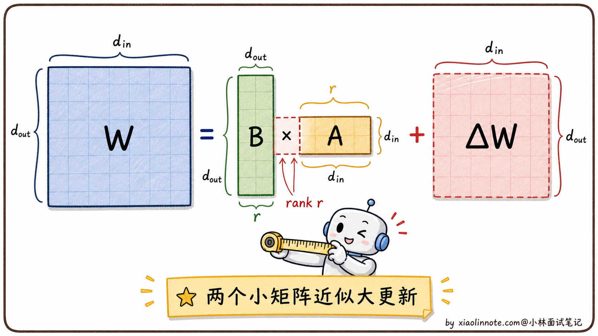
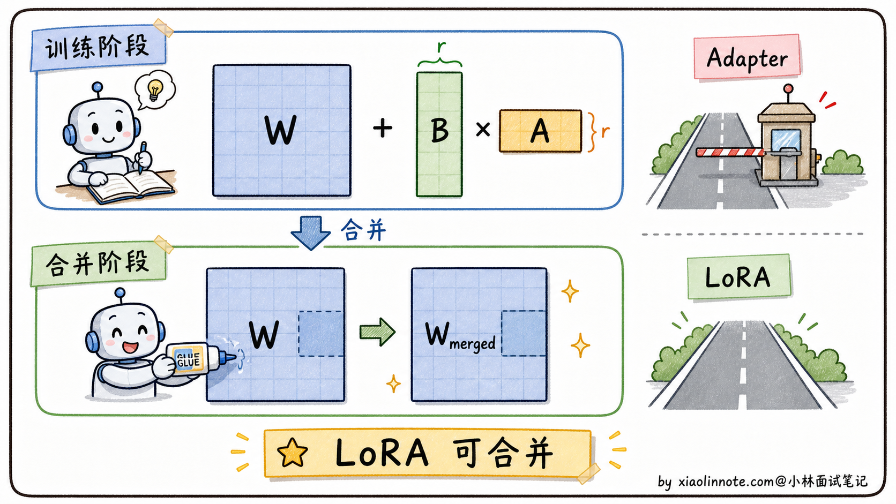
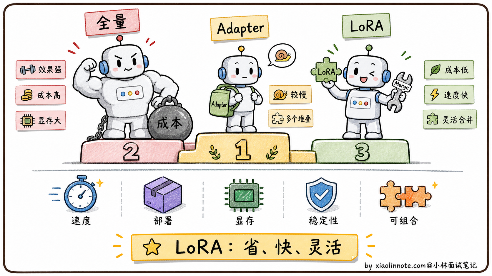

# 请讲一下 LoRA 技术，除了减少参数量，它还有哪些优点？

> 原文：[请讲一下 LoRA 技术，除了减少参数量，它还有哪些优点？](https://xiaolinnote.com/ai/llm/lora.html) · 小林面试笔记


👔面试官：来讲一下 LoRA 技术，除了减少参数量，它还有哪些优点？

🙋‍♂️我：LoRA 主要就是减少参数量，让显存占用降下来，普通 GPU 也能微调大模型。

👔面试官：……「除了减少参数量」是题目里写明白了的限定条件，你又把这个答了一遍。我问的是「除了这个还有什么」，你能再说几条吗？

🙋‍♂️我：呃……训练快一点？

👔面试官：「快一点」太笼统。LoRA 在「可合并部署」「部署灵活性」「基座隔离」「训练资源」「权重组合」这些维度有自己的取舍，也常被拿来和 Adapter 对比。这些点你能讲清楚吗？

🙋‍♂️我：呃……我没仔细想过这么多优点。

👔面试官：典型的「会用但没深入想过」。LoRA 流行不只因为参数少，还因为它可以冻结基座、按需挂载 adapter，并在合适时合并权重；但 Adapter、IA3、Prompt Tuning 等方案并没有被“完全淘汰”，各有延迟、容量和部署取舍。回去把条件讲清楚再来。

这几个问题问完，LoRA 才显出真容貌，「省参数」只是它最浅的那一层。可合并部署、多任务可插拔、训练资源降低和潜在组合性是重要工程收益，但都依赖实现与评测条件。

## 💡 简要回答

LoRA 我在项目里用过，省参数这个优点大家都知道，但它还有几个很实用的好处。

- 第一个是可选的推理开销：把 LoRA 增量合并回基座权重后，计算图可恢复为基座模型；若保留 adapter 以便热切换，则会有额外的投影/调度成本，不能统称为“零开销”。
- 第二个是部署灵活，一个基座可管理多套 adapter，按请求挂载或路由；adapter 大小、并发挂载能力、切换成本和服务框架支持会随模型与实现变化，不是固定“几十 MB”。
- 第三个是灾难性遗忘风险通常更容易隔离，因为基座权重冻结；但 adapter 也可能覆盖行为、造成任务干扰或让模型在通用评测上回退，仍需回归。
- 第四个是优化问题规模较小，常能降低实验和存储成本，但学习率、秩、注入层、数据和量化仍会影响稳定性。
- 还有一个进阶的点是多个 LoRA 可以尝试加权混合；线性相加不保证能力互补，可能产生冲突，通常需要验证或重新训练。

## 📝 详细解析

### 背景：微调大模型，代价有多大？

要理解 LoRA 的价值，先得搞清楚它在解决什么问题。

大模型预训练完之后，通用能力很强，但要让它专注做某类任务（比如医疗问答、代码生成），通常需要在特定数据上做微调。最直接的方式是**全量微调（Full Fine-tuning）**：把模型所有参数都拿出来，在新数据上继续训练，更新全部权重。

但全量微调的显存需求通常很高。权重、梯度、优化器状态、激活、并行通信和检查点都会占用资源；具体大小取决于精度、优化器、序列长度、batch、ZeRO/卸载和并行策略，不能用一个 7B 模型的固定 80GB 数字概括。

资源有限时，很多人会考虑 PEFT、量化、梯度检查点、卸载或分布式训练；能否运行某个模型必须结合实际配置测量，不宜按“个人/公司”一刀切。

这就催生了一类新方法，**参数高效微调（PEFT，Parameter-Efficient Fine-Tuning）**，核心思路是：不更新全部参数，只训练一小部分，同时尽量不损失微调效果。LoRA 是其中最成功的方案之一。

### LoRA 的核心思路：不改原模型，在旁边打补丁

LoRA（Low-Rank Adaptation）的思路很直觉：**不动原始权重 W，在旁边加两个小矩阵 A 和 B**，训练时只更新 A 和 B，W 全程冻结。

前向传播的公式变成：

```python
# W 是原始权重（冻结，不更新）
# A 和 B 是两个小矩阵（可训练，随机初始化）
# α 是缩放因子（超参，控制 LoRA 更新的强度）

output = x @ (W + α * (B @ A))
#                   ↑ 这部分就是 LoRA 的「旁路」，只有这里在学习
```

A 和 B 两个小矩阵组成一个「旁路分支」，负责学习微调任务需要的增量知识；原始权重 W 保存着预训练学到的通用知识，一字不改。

可以用「给书批注」来类比：全量微调是把书重新印一遍、改掉原文内容；LoRA 是在书的空白处贴便利贴，原书一个字都不动，便利贴上写的是修正和补充。读书的时候，原文和便利贴的内容都能看到，效果叠加在一起。这种「在旁边打补丁」的设计，是 LoRA 后续很多优点的根源。


### 「低秩分解」到底是什么意思？

LoRA 里最让初学者困惑的词是「低秩分解」。拆开来理解：

**先说「秩」（rank）是什么。** 矩阵的秩代表独立的信息维度。一个 4096×4096 的矩阵秩最高可以是 4096；LoRA 用低秩增量近似微调更新，低秩是否足够是经验假设，取决于任务、层、数据和基座，不能把秩固定成 8-16 或说其余方向都无效。

用一个类比来感受：一张 4K 照片有几百万像素，但它的信息量可以用几十个主要「颜色分量」来近似表达，这正是 JPEG 压缩的工作原理，把高维数据投影到低维空间，保留最主要的信息，丢掉噪声。低秩分解的思路与此类似。

**再说「分解」是什么操作。** 既然「有效信息只在 r 维子空间」，我们就不需要存储整个 d×d 的大矩阵来表示更新量，而是用两个小矩阵的乘积来近似它：

- 矩阵 A：形状 d×r（把输入从 d 维压缩到 r 维）
- 矩阵 B：形状 r×d（把 r 维还原回 d 维）
- 两者乘积 B·A 形状是 d×d，和原始更新矩阵同维，但参数量大幅减少

这里的 r 就叫做**秩（rank）**，是重要超参之一。r 越小，参数越少但容量可能不足；r 越大，参数更多、过拟合和显存/延迟成本也可能上升。应根据任务验证集选择，而不是背某个通用秩。



### 参数量减少了多少？

来做一道具体的计算，有个直观感受：

- 原始更新矩阵（若 d_in=d_out=4096）：4096 × 4096 = **约 1677 万参数**
- LoRA r=16：4096×16 + 16×4096 = **约 13.1 万参数**；这是一个示例，实际还取决于注入层和秩

放到整个模型上，可训练参数比例会显著下降，但不应从一个矩阵示例直接推出固定的 adapter 参数量或显存；激活、优化器和基础模型加载仍决定峰值。

参数少只是第一步，LoRA 还带来了几个连锁的好处，理解了它「原始权重冻结 + 旁路小矩阵」的数学结构，这些优点都是自然推论出来的。

### 优点一：可合并部署，或保留 adapter 灵活切换

LoRA 的一个工程优势是可以在“灵活挂载”和“合并部署”之间选择；只有合并后才可以把额外分支从推理图中移除。

来看一下数学上是怎么回事。LoRA 的完整公式是这样的：

```python
# LoRA 的核心公式
# W 是原始权重（冻结），A 和 B 是两个小矩阵（可训练）
# α 是缩放因子（超参，控制 LoRA 更新的强度）

# 前向计算时：
output = x @ (W + α * (B @ A))

# 但由于 W 是固定的，我们可以提前把 LoRA 更新合并进去：
W_merged = W + α * (B @ A)  # 提前算好，只做一次

# 推理时，就和原始模型完全一样，没有额外计算
output = x @ W_merged
```

训练完成之后，把 `α * B·A` 的结果加到 W 上，得到 `W_merged`；合并操作需要按部署精度和权重格式执行，且会失去单独切换该 adapter 的便利。若保留 A/B，就可以灵活切换，但会有额外计算、显存或调度开销。

这与某些 Adapter 方案的部署取舍不同：Adapter 保留模块时通常会引入额外层计算，而 LoRA 可以通过合并消除旁路；但不同实现的 kernel、融合和批处理会改变实际延迟，不能用固定的“每层几毫秒”判断。

对延迟敏感的在线服务来说，这个特性非常重要。



### 优点二：模块化插拔，一个基底，多套能力

LoRA 带来了一种非常灵活的部署模式：**一个基础模型 + 多套 LoRA 权重，按需加载**。

可以用手机来类比：基础模型是共同底座，每套 LoRA 像可切换的插件；实际 adapter 大小和切换成本取决于注入层、秩、精度与框架。

这种模式在实际工程里是怎么运作的？基础模型可以只加载一次，常驻显存；不同场景的 LoRA 像插件一样按需挂载，需要哪个能力就路由到哪个 adapter。是否能在同一 batch 热切换、是否需要预加载和如何隔离，要看服务框架：

```python
from peft import PeftModel
from transformers import AutoModelForCausalLM

# 基础模型只加载一次，常驻显存（大小取决于模型和精度）
base_model = AutoModelForCausalLM.from_pretrained("Qwen2.5-7B")

# 场景一：用户发来客服请求，挂载客服 LoRA（大小取决于秩和注入层）
lora_customer_service = PeftModel.from_pretrained(
    base_model,
    "path/to/customer_service_lora"
)

# 场景二：用户发来代码问题，换成代码 LoRA
# 基础模型不用重新加载，只替换旁路矩阵
lora_coding = PeftModel.from_pretrained(
    base_model,
    "path/to/coding_lora"
)
```

可以看到，`base_model` 可以只加载一份，多个 adapter 共享它；但同时挂载、并发隔离、权重合并和批处理支持要由框架验证。相比每个场景部署一个独立模型，它通常节省存储和基础权重重复加载，但不保证在所有服务形态下都更便宜。


### 优点三：不丢通用能力，白板旁边贴便利贴

全量微调有一个著名的问题叫**灾难性遗忘（Catastrophic Forgetting）**。

这个问题是这样产生的：全量微调时，所有参数都在被更新，模型为了在新任务上表现好，会把原来的权重改掉。如果新任务的训练数据分布比较窄（比如只有医疗问答），模型就会逐渐「忘掉」它在预训练时学到的通用能力，比如代码能力、逻辑推理能力。你微调完一个专门回答医疗问题的模型，发现它写代码的能力大幅下降了，这就是灾难性遗忘。

LoRA 对这个问题的风险要低得多，原因直接体现在它的设计上：**原始权重 W 全程冻结，训练过程中一个参数都不动**，所有的学习都发生在旁边的 A、B 小矩阵里。

用这个类比来理解：全量微调是在白板上擦掉原来的内容再重写，LoRA 是在白板旁边贴便利贴，原来白板上的内容完好无损，便利贴上写的是新补充的知识。推理时，白板内容（原始知识）和便利贴内容（新知识）都能用到。

这也是为什么 LoRA 微调的模型通常能在新任务上学好，同时尽量保留预训练的通用能力。不过它不是绝对不会遗忘，如果数据很偏、rank 设得很大、学习率过高，或者把 LoRA 合并后继续训练，通用能力仍然可能下降，所以微调后还是要跑通用能力回归测试。

### 优点四：训练更稳定，超参不敏感

全量微调对超参很敏感，尤其是学习率。学习率稍微大一点，模型就会「跑飞」，训练不稳定甚至崩溃；学习率太小，收敛又非常慢。这是因为要同步调整几十亿个参数，梯度空间极其复杂。

LoRA 只训练 A 和 B 两个小矩阵，可训练参数量减少了 100 倍以上，梯度的搜索空间随之大幅缩小。搜索空间小，意味着优化器更容易找到好的方向，训练过程更平稳，对学习率等超参的敏感性也更低。

实践中，rank r 很重要，但不是唯一超参；学习率、目标层、缩放、dropout、数据配比、量化和训练步数同样影响结果。LoRA 往往降低了搜索空间和单次实验成本，但仍需要小规模消融和回归。

### 优点五（进阶）：LoRA 权重可以加权混合

这是一个比较进阶的点：**多个 LoRA 权重可以尝试加权混合，实现能力融合**；不需要重新训练只是可能的起点，不是效果保证。

数学上，合并两个 LoRA 非常简单。假设有一个指令遵循 LoRA（A₁, B₁）和一个代码生成 LoRA（A₂, B₂），同时使用时：

```
W' = W + α₁ * (B₁ · A₁) + α₂ * (B₂ · A₂)
```

调整 α₁ 和 α₂ 的比例，就可以调整两种能力的「配比」。在代码里，PEFT 库支持同时加载多个 LoRA：

```python
from peft import PeftModel

# 加载第一个 LoRA（指令遵循能力）
model = PeftModel.from_pretrained(base_model, "instruction_lora")

# 再加载第二个 LoRA（代码生成能力）
model.load_adapter("coding_lora", adapter_name="coding")

# 同时激活两个 LoRA，两套权重叠加生效
model.set_adapter(["default", "coding"])
```

这种技术常称为 **LoRA Merging**。它可以作为低成本实验，但不同 adapter 的基座、tokenizer、任务分布和参数空间需要兼容；线性相加可能产生冲突、遗忘或安全回退，仍应在目标任务上验证，必要时再用组合数据训练。


### 总结对比：LoRA vs 全量微调 vs Adapter

| 维度 | 全量微调 | Adapter | LoRA |
| --- | --- | --- | --- |
| 可训练参数量 | 全部 | 少量额外参数 | 少量旁路参数（比例取决于注入层/秩） |
| 推理额外开销 | 无额外 adapter | 通常有额外网络 | 合并后可接近基座；未合并时有额外计算/调度 |
| 灾难性遗忘风险 | 可能较高，需回归 | 取决于数据与结构 | 基座冻结有助于隔离，但仍需回归 |
| 部署灵活性 | 每个任务通常需独立权重 | 可插拔 | 可插拔，也可合并；依赖服务框架 |
| 训练稳定性 | 受全量参数与超参影响 | 受结构与超参影响 | 常降低单次资源，但并非超参不敏感 |
| 权重可组合性 | 需额外融合/再训练 | 依实现 | 可尝试线性/任务向量合并，需验证兼容性 |
| 效果上限 | 可能较高 | 取决于任务 | 可能接近全量，也可能受低秩容量限制 |

从这张表里可以看到，LoRA 的价值在于把冻结基座、低秩增量、可插拔和可合并结合起来；但它并不在每个维度全面优于 Adapter 或全量微调，最终要看任务效果、延迟、并发、许可证和运维成本。



## 🎯 面试总结

回到开头那段对话，问到「LoRA 除了减少参数量还有哪些优点」，最关键的是要跳出「省参数」这一个点，把 LoRA 在多个维度上的优势都讲出来。

最容易被低估的是**合并部署的选择权**。训练后可以把 LoRA 增量合并到基座，减少未合并旁路的额外计算；若保留 adapter 以便切换，就要测量实际延迟、显存和批处理影响，不能说绝对“零开销”。

接下来讲**部署灵活性**。一个基座可以维护多套 adapter，按请求路由或合并部署；大小、热切换和成本取决于模型、秩、注入层与服务框架，不应承诺固定 GB/MB 或数量级节省。

然后是**灾难性遗忘风险更低**。原始权重全程冻结，所有学习都发生在旁路的小矩阵里，相当于在原本的知识旁边贴便利贴，通用能力更容易保住。这是 LoRA 比全量微调最大的稳定性优势之一，但不是免测金牌，微调后仍然要做回归评测。

还有两个进阶优点可以提：**实验资源较低**（可训练参数少，但仍需调学习率、秩、目标层和数据）和 **LoRA 权重的可组合性**（不同任务的 LoRA 可尝试加权混合，可能冲突，必须回归验证）。

最关键的一句话：**LoRA 的工程价值是可合并、可插拔、基座冻结和较低适配成本的组合，但每个收益都有条件，必须用任务效果、延迟、回归和安全测试验证**。能讲清这些边界，比把它说成“全面淘汰 Adapter”更可靠。

---
