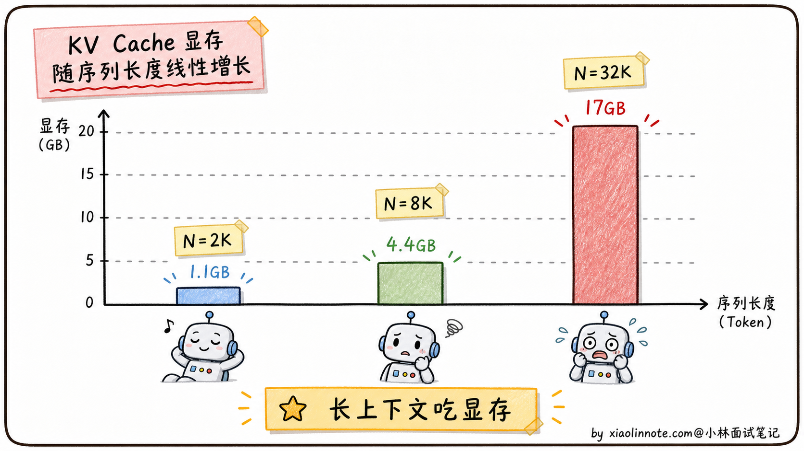
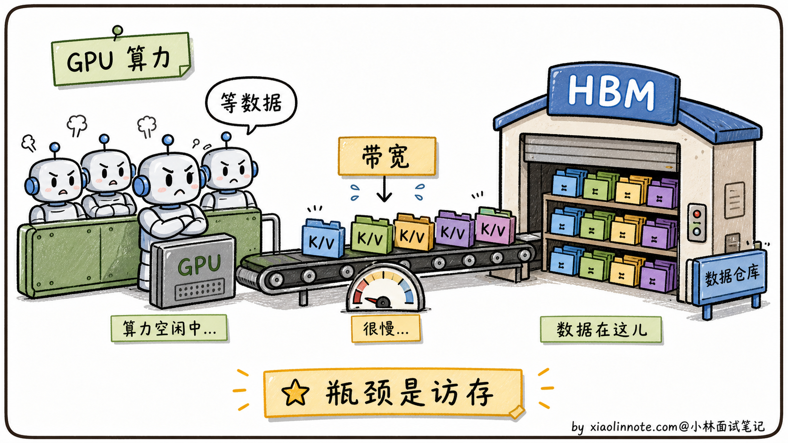
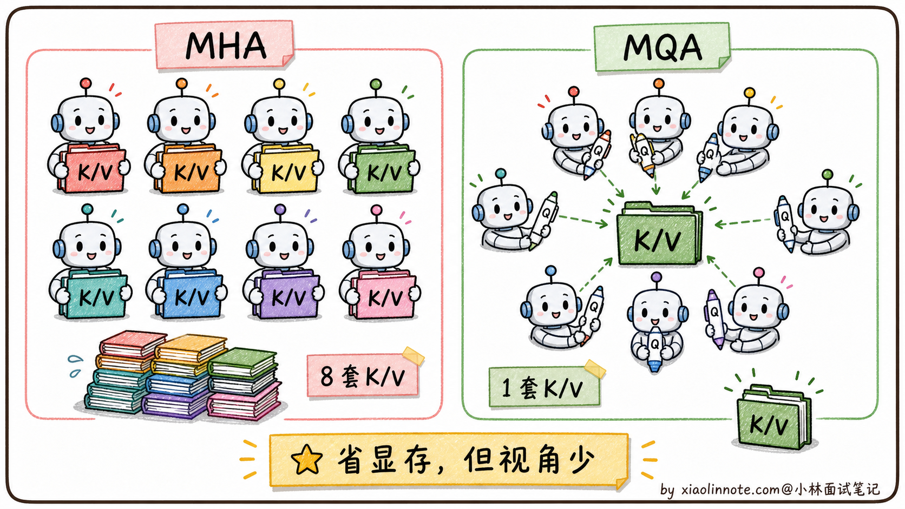
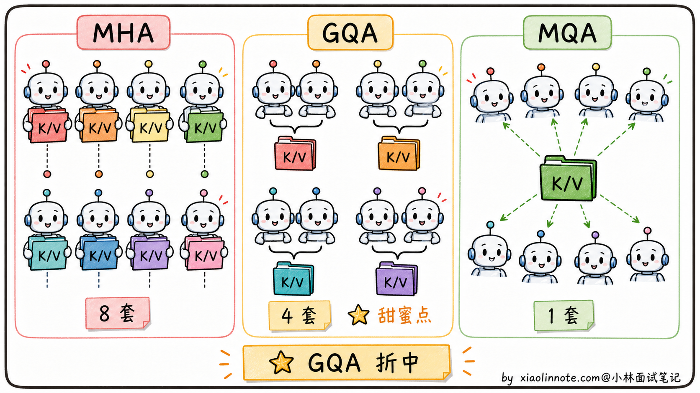
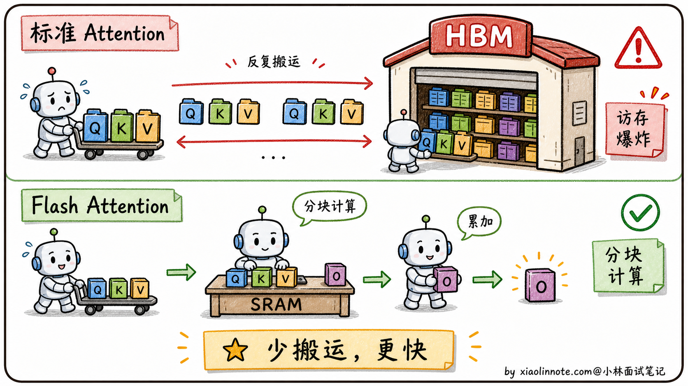
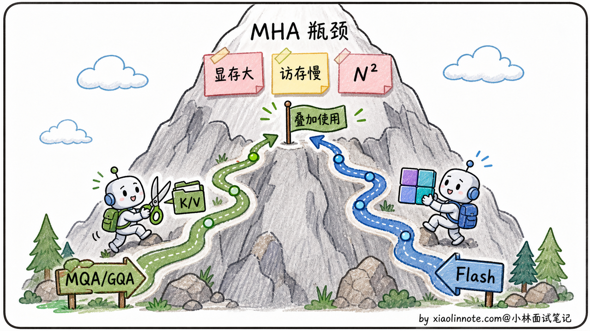

# 多头注意力（MHA）有哪些局限？MQA、GQA、Flash Attention 怎么解决？

> 原文：[多头注意力（MHA）有哪些局限？MQA、GQA、Flash Attention 怎么解决？](https://xiaolinnote.com/ai/llm/mha_mqa_gqa_flash_attention.html) · 小林面试笔记


👔面试官：来讲讲多头注意力（MHA）有哪些局限？工业界怎么优化？

🙋‍♂️我：MHA 局限我知道，就是计算复杂度是 O(N²)，长序列特别慢。Flash Attention 用了一些数学技巧让它变快。

👔面试官：……「数学技巧」是什么技巧？说具体一点。再说，O(N²) 是「计算复杂度」还是「显存复杂度」？这俩是一回事吗？还有，MHA 的真正瓶颈在训练还是推理？训练慢和推理慢是一个原因吗？

🙋‍♂️我：哦哦，MHA 主要是显存占用大，因为每个 token 都要保存 K 和 V。MQA 是所有头共享一份 K 和 V 来减少显存。

👔面试官：你说 MQA「所有头共享一份 K 和 V」，那它是只在推理时共享，还是训练时也共享？共享之后效果会不会下降？为什么 Llama 2 不用 MQA 而用 GQA？这两个有什么关系？

🙋‍♂️我：呃……GQA 是 MQA 的改进版？把头分成几组共享？

👔面试官：你这是在猜词。「分成几组」具体怎么分？分组数对效果和显存的影响是什么？为什么 Llama 系列、Qwen 系列都默认用 GQA？还有最关键的：MQA 和 GQA 是从「显存」角度优化的，Flash Attention 是从「显存 + 计算」两个角度同时优化的，这两类优化是替代关系还是叠加关系？回去搞清楚再来。

这道题问下来才发现，光说出 MQA、GQA、Flash Attention 几个名字完全不够。MHA 的瓶颈到底卡在「显存」还是「带宽」、每种方案分别在哪一层动刀、它们之间是替代关系还是可以叠加，这一整套逻辑必须捋顺。

## 💡 简要回答

我理解 MHA 有三个核心痛点。

第一是「**显存压力**」。在 MHA 中，KV Cache 通常按 KV head 数保存每个历史 token 的 K/V；头数、层数、序列长度、batch 和精度都会影响占用。某些 7B 配置在长上下文下确实可能达到 GB 级，但不能从参数规模直接推出固定数字。

第二是「**访存慢**」。Attention 计算里 softmax 那步要把整个 N×N 的注意力矩阵搬来搬去，频繁读写 GPU 显存，瓶颈不在算力而在「内存带宽」。

第三是「**N² 复杂度**」。注意力分数矩阵是 N×N 的，序列翻倍计算量翻 4 倍，长上下文极其昂贵。

工业界对应了三类优化。MQA 让多个 query head 共享较少的 K/V，降低 KV Cache，但可能损伤表达能力；GQA 在 MHA 与 MQA 之间折中，组数和效果需要按模型训练/评测决定。Flash Attention 不改变注意力数学目标，而从 kernel/IO 层分块计算并在线归一化，降低中间注意力矩阵的读写和训练 workspace；它仍需做二次复杂度的注意力计算，速度收益也依赖硬件和实现。

最关键的认知是：MQA/GQA 是模型结构层的选择，Flash Attention 是计算实现层的优化，两者可以叠加但不是所有模型/后端都采用同一组合。选型要同时看训练质量、KV Cache、kernel 支持和服务负载。

## 📝 详细解析

### 先理清 MHA 的瓶颈到底卡在哪

要讲清楚 MHA 的局限，得先把「训练」和「推理」两个阶段分开看。很多人在面试里只笼统说「O(N²) 慢」，被一追问就答不下去，根源就是把这两个阶段混在一起讲。其实它们的痛点完全不一样，得分别说。

先看训练阶段。长度为 N 的序列需要计算 `softmax(QK^T/√d) · V`，注意力的计算量随 N² 增长；朴素实现还可能保存 N×N 中间矩阵给反向传播。实际内存受 checkpoint、flash kernel、并行和精度影响，因此不要只背某个 N 对应的 GB 数。

推理阶段需要区分 prefill 与 decode。prefill 对输入上下文做一次并行计算；decode 每次生成一个 token，需要读取历史 K/V。若每步完全重算历史，累计成本会快速增长；KV Cache 让 decode 复用历史 K/V，但读取带宽和 Cache 显存会成为新瓶颈。

但 KV Cache 这个救星本身就是个显存大户。粗略算一下，KV Cache 显存大小是：

```
2（K/V）× B × N × L × H_kv（KV 头数）× d_k × 每元素字节数
```

以某个 L=32、H_kv=32、d_k=128 的配置为例，batch=1、N=32K、FP16：

```
2 × 1 × 32000 × 32 × 32 × 128 × 2 ≈ 17 GB
```

这个示例的 KV Cache 约为 17GB；实际还要加权重、激活、运行时和碎片，是否能放入某张 GPU 取决于具体模型和框架。



显存挤爆只是一面，更隐蔽的痛点是「**速度也快不起来**」。原因是 GPU 计算单元（CUDA Core / Tensor Core）的算力很猛，但显存带宽跟不上。Attention 计算里大量时间花在「等数据从显存搬到计算单元」，计算单元很多时候在「等米下锅」。这就是著名的 **memory-bound（访存受限）** 问题。哪怕你的 GPU 算力是另一台的两倍，跑 Attention 时速度可能只快 20%，因为瓶颈根本不在算力。



到这里，MHA 的三个痛点就连成一条线了。**N² 复杂度让序列稍微长一点，计算量就按平方级膨胀；KV Cache 让长上下文显存爆掉；访存带宽让 GPU 算力发挥不出来**。这三个痛点互相加剧，长上下文场景下尤其明显。后面的所有优化方案，都是在攻击这三个痛点中的一个或多个。

### MQA：暴力共享 K/V，显存直接压到 1/H

MQA（Multi-Query Attention，多查询注意力）的思路非常暴力：**所有 head 共享同一份 K 和 V，只有 Q 是每个 head 独立的**。

举个例子。原本 MHA 有 32 个 head，每个 head 都有自己的 W_Q、W_K、W_V 投影矩阵，输出 32 套独立的 Q、K、V。MQA 只保留 32 套 Q（每个 head 自己的 Query），但 K 和 V 全 32 个 head 共享同一套。

这样做的直接后果（在相同层数、序列、精度和 batch 下）：

**KV Cache 的 K/V 头数降为 1**：相对于 H 个 KV head，理论上 K/V 部分约降到 1/H；实际占用还受布局、对齐、量化和其他缓存影响。

**查询仍分头**：每个 query head 可独立计算注意力，但共享 K/V 改变了参数化结构，通常需要在训练或继续训练时适配，不能说训练流程“几乎不用改”。

但 MQA 的代价也很明显，**表达能力下降**。

直觉上理解：原本 32 个 head 各自有 32 套不同的「视角」（K 表示「我有什么标签」、V 表示「我的内容」），可以从 32 个角度去理解上下文；MQA 强行让 32 个 head 共用一套 K/V，等于 32 个视角变成「都看同样的标签和内容，只是用不同的 Query 去问」，多视角的能力被压缩成单视角。

效果损失与模型、训练方式、任务和 head 配置有关；有的任务影响小，有的任务会明显退化，不能用固定百分比概括。是否采用 MQA 要用目标模型的质量/吞吐基准决定。



### GQA：折中方案，效果与显存的甜蜜点

GQA（Grouped-Query Attention，分组查询注意力）是 MHA 和 MQA 的折中。

它的思路是：**把 H 个 head 分成 G 组，每组内部共享一份 K/V，组之间各自独立**。

数学上很直观：

- MHA：H 个 head，H 套 K/V
- MQA：H 个 head，1 套 K/V
- GQA：H 个 head，G 套 K/V（1 ≤ G ≤ H）

GQA 是个连续光谱，G=H 退化成 MHA，G=1 退化成 MQA，中间任意取值都行。

为什么 GQA 是个好折中？

**显存上**：KV Cache 从原本的 H 套压到 G 套，显存占用是 G/H 比例。比如 H=32、G=8 时，显存压到 1/4，比 MQA 的 1/32 略大但也很省。

**表达力上**：每组内部共享 K/V，组间独立，等于每组都有自己的「视角」。组数越多视角越丰富，G=8 通常已经足够保持模型效果。

**效果需要实测**：合适的 G 可以在质量与 KV Cache 之间折中，但是否接近 MHA 取决于模型规模、训练/转换方式和任务，不能固定为某个差值或称为所有模型的标配。



哪些主流模型用 GQA：

- 一些 Llama、Qwen 等模型家族的具体版本采用了 GQA；应以对应模型配置核对，不能按家族名称推断全系。
- 某些模型采用 MLA（Multi-head Latent Attention，多头潜在注意力）等不同路径，把缓存状态压缩到潜在表示；它的目标与 GQA 有重叠，但机制不同。

MLA 的一类思路是把部分历史状态投影/压缩到潜在表示，再通过额外计算参与注意力；具体缓存哪些分量由实现决定。它可能减少 KV Cache，但会引入投影计算、质量和兼容性取舍，不能简单说成 GQA 的升级版。

### Flash Attention：换条赛道，从计算实现优化

MQA 和 GQA 都是改 Attention 结构，从「需要存几套 K/V」这个角度切入。Flash Attention 完全是另一条赛道，**不改 Attention 的数学公式，从底层实现优化**。

要理解 Flash Attention 厉害在哪，得先回到上面提到的「访存瓶颈」。

**问题的根源：显存层级差距巨大**

GPU 的存储分两层：

- **HBM（High Bandwidth Memory，高带宽显存）**：容量较大但访问延迟/带宽与片上存储不同，具体规格随 GPU 型号变化
- **SRAM（Static RAM，片上缓存）**：容量小但访问快，适合保存分块计算的中间状态

标准 Attention 的实现是这样的：

```python
# 标准实现，每一步都把大矩阵搬到 HBM 上存一次
S = Q @ K.T              # 算出 N×N 注意力分数矩阵，写回 HBM
P = softmax(S)           # 从 HBM 读 S，算 softmax，再写回 HBM
O = P @ V                # 从 HBM 读 P，算最终输出 O，再写回 HBM
```

朴素 kernel 可能在 HBM 上反复读写 N×N 中间矩阵，IO 开销会成为瓶颈；具体比例取决于 GPU、kernel、精度和 batch，不能用某两个长度的固定倍数概括。

**Flash Attention 的核心思路：分块 + 在线 softmax**

Flash Attention 类 kernel 会把 Q、K、V 分块，在片上存储中计算并在线累积输出，避免把完整 N×N 注意力矩阵写回 HBM；分块大小和调度由实现与硬件决定。

听起来简单，但有个数学难题：softmax 操作要看「整行」才能算出来，不能局部独立计算。Flash Attention 用了一个叫「**在线 softmax（online softmax）**」的算法，分块计算的同时维护一个「当前最大值 + 累积和」的状态，每来一块就做增量更新，最终结果和一次性算 softmax 完全一样。



这样做的好处是：

**注意力中间 workspace 可从 O(N²) 降到近似 O(N)**：它减少保存完整 N×N 矩阵的需要，但不改变模型参数、输出和 KV Cache 的总内存问题。

**可能更快**：减少 HBM 往返和 kernel 中间写回，实际速度收益受长度、GPU、并发、kernel 版本和算子融合影响，不能固定为 2-4 倍。

**结果在数学上等价**：Flash Attention 算的是同一个 Attention 公式，不是稀疏近似或低秩近似。实际浮点实现里，因为分块顺序和数值精度不同，最后几位可能有微小差异，但不会像近似注意力那样引入模型精度损失。

Flash Attention 有多个版本和实现，部分推理框架/硬件会在条件满足时使用类似 kernel；是否默认、支持哪些模型和算子要看具体版本，不能把它当成所有框架的统一默认实现。

### 三类优化的关系：是叠加不是替代

讲到这里，可以把三类优化总结成一张表：

| 优化方案 | 改的是什么 | 攻击的痛点 | 效果损失 |
| --- | --- | --- | --- |
| **MQA** | Attention 结构（K/V 头数降为 1） | KV Cache 显存 | 质量影响依模型/训练/任务而变 |
| **GQA** | Attention 结构（K/V 按组共享） | KV Cache 显存与表达力折中 | 质量影响依组数与模型而变 |
| **Flash Attention** | Attention kernel（分块 + 在线归一化） | 中间 IO/workspace 与带宽 | 目标是计算等价，浮点实现可能有微小差异 |

关键的认知：**这三类优化是叠加关系，不是替代关系**。

MQA/GQA 是「**结构层**」的优化，改的是 Attention 公式里有几套 K/V，让 KV Cache 占用降下来。Flash Attention 是「**实现层**」的优化，改的是 Attention 计算的具体执行方式，让计算和访存都加速。

它们攻击的是不同维度的问题，可以同时使用。现在主流大模型的标配是：

```
GQA 结构 + Flash Attention 实现
```

某些模型配置会把 GQA/MLA 与 Flash 类 kernel 组合使用，但具体组合与支持情况要按模型和后端核对。结构层降低 KV Cache 与实现层降低中间 IO 可以叠加，但不能从组合名称推出固定倍数或某张显卡必然能跑某个上下文。



这个「叠加」的认知很重要。面试官如果追问「MQA、GQA、Flash Attention 你只能选一个用，选哪个」，你应该指出这是个伪命题：**真实工程里它们一定是组合用的，因为它们攻击的是不同维度的瓶颈**。能说出这一句，面试官就知道你不是在背单点优化，而是真的理解了整套优化体系的层次结构。

### 拓展：长上下文时代还有哪些新方向

长上下文需求推动了更多 MHA 优化方向，但上下文上限和可用性随模型/产品而变。简单提几个进阶方向：

- **MLA（Multi-head Latent Attention）**：DeepSeek V2/V3 用的方案，前面提过。把 K/V 压缩到低维潜在空间，KV Cache 比 GQA 还小，效果反而更好
- **Sliding Window Attention（滑动窗口注意力）**：每个 token 只关注最近 N 个 token（比如 N=4096），不再做全局注意力。Mistral 系列用了这个思路。代价是丢失远距离信息，所以通常和全局注意力混合用
- **Linear Attention（线性注意力）**：用核函数近似 softmax，把 Attention 复杂度从 O(N²) 降到 O(N)。代表是 Performer、Linformer，但效果离 MHA 还是差一截，没成为主流
- **Mamba / 状态空间模型（SSM）**：用状态空间更新替代部分注意力，单步状态开销可较低，但有限状态不等于无限记忆；长距离检索、训练和任务效果仍需单独评估


需要强调的是，这些方向大多还在演进，大厂面试问到 MHA 优化，把 MQA、GQA、Flash Attention 这三个讲清楚就足够拿高分了。MLA 作为加分项可以提一句，再深的就不用展开。

## 🎯 面试总结

回到开头那段对话，被怼三次后再回答这个问题，最重要的是先把 MHA 的三个痛点讲清楚，因为这是整道题的地基。

讲三个痛点的时候可以这样组织：KV Cache 随 KV head、层数、序列和 batch 增长；训练/全量 prefill 的注意力计算与中间矩阵随 N² 增长；decode 还会受 KV 读取带宽影响。具体峰值由模型、精度、kernel 和调度决定。

讲完痛点之后，把三类优化方案各自的位置讲清。MQA 共享 K/V 头，降低 KV Cache 但可能损失质量；GQA 按组折中，组数和效果要按模型配置；Flash Attention 不改目标公式，通过分块和在线归一化减少中间 IO/workspace，可能提高速度。它们可以叠加，但没有固定质量/速度收益。

最关键的一句话是：**这三类优化可以叠加但不是自动绑定**。结构层降低 KV 状态，kernel 层降低中间 IO；是否采用以及收益必须按具体模型、硬件和服务负载测试。

如果还想再加分，可以提一句 MLA/滑动窗口/线性或状态空间方向作为候选，并说明它们改变了缓存、全局依赖或近似方式，需要单独评估质量和兼容性。

---
