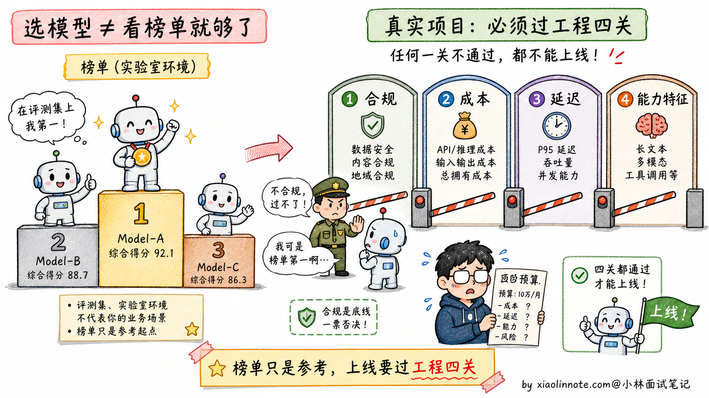
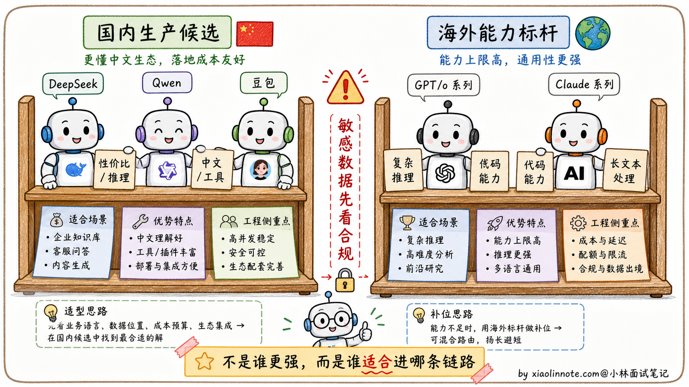
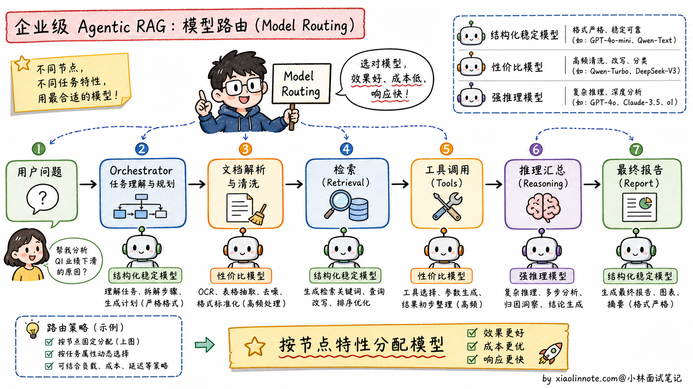
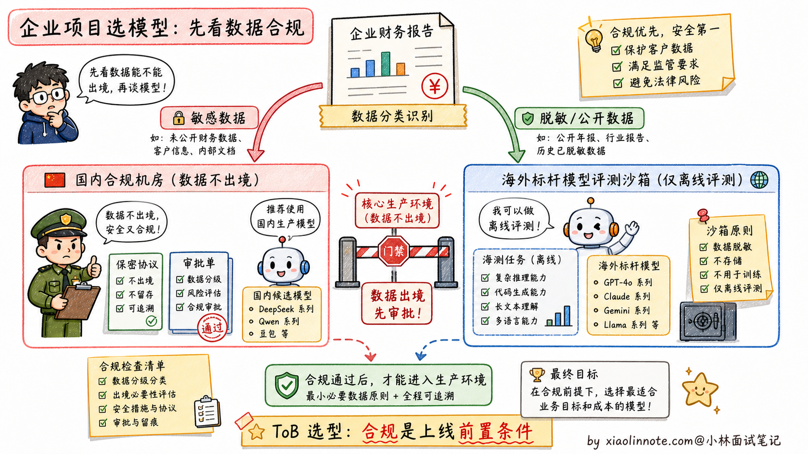

# 对比使用过哪些主流大模型？你们项目中最终选用了哪个模型？为什么？

> 原文：[对比使用过哪些主流大模型？你们项目中最终选用了哪个模型？为什么？](https://xiaolinnote.com/ai/llm/model_selection.html) · 小林面试笔记

👔面试官：来讲讲你对比过哪些主流大模型？项目里最终选了哪个？为什么？

🙋‍♂️我：我们先按同一批业务样本对比了几类国内外模型，再根据能力、合规、成本、延迟和稳定性选主链路；具体模型 ID 和版本会记录在评测报告里，而不是只报排行榜名次。

👔面试官：……「能力强」「排行榜靠前」是表面话。你们是面向什么用户的项目？数据合规要求是什么？API 成本受得了吗？这些都没说，就直接选最贵的，是典型的新人决策方式。

🙋‍♂️我：呃，我们项目是面向国内企业用户的……

👔面试官：那海外模型能不能进入生产，要看数据分类、合同、部署区域、访问稳定性和成本，不是只看能力强不强。国内企业项目还要说明敏感数据是否出境、谁审批、如何脱敏和如何降级。

🙋‍♂️我：呃……

👔面试官：典型的「不看场景、跟着排行榜选」。模型选型从来不是看跑分最高，是看「**合规、成本、延迟、能力特征**」四个维度匹配业务需求。这种工程化的选型思路你有没有？回去搞清楚再来。

被这几个问题逼到墙角才意识到，模型选型这道开放题考的不是「谁最强」，是「在我的业务约束里谁最合适」。合规、成本、延迟、能力，四条线得一起拉，才答得到点上。

## 💡 简要回答

在项目选型阶段，我会先按部署与合规边界列出候选：可以是国内托管/私有部署模型，也可以是海外 API 或自部署模型。模型家族和版本只是待验证候选，不能把当前产品名当成永久答案。

如果是面向国内企业用户的 Agentic RAG 系统，我倾向于把国内模型作为主链路候选，海外模型只做离线评测或非敏感场景兜底。原因不是海外模型不好，而是企业项目里合规、网络稳定性、成本预算、售后支持这些约束会直接决定方案能不能上线。

最终落地时，我不会死磕一个模型，而是用 **Model Routing（模型路由）**：格式要求严格、Tool Use 多的节点优先选指令遵循和结构化输出稳定的模型；高频推理、数据清洗、摘要归纳这类节点优先选性价比高的模型；特别难的问题再路由给能力更强但更贵的模型。选模型从来不是看谁跑分最高，而是看谁最契合业务的**合规、成本、延迟与能力特征**。

## 📝 详细解析

### 1. 为什么不能盯着「排行榜」无脑选？

很多新手选模型喜欢盯着大模型榜单，看谁排第一就想用谁，这在工程落地时是个巨大的坑。

跑分高，不代表在你的特定业务里表现好。比如海外标杆模型在多模态、代码、复杂推理上通常很强，但它的 API 成本、数据出境、网络访问、企业合同支持，都可能卡住国内 ToB 项目；有些模型榜单漂亮，但在你的财报格式、行业黑话、内部接口调用上不一定稳定；如果系统存在大量高频的 Agent 内部循环调用，硬上最贵的标杆模型，可能一个月就把项目预算烧穿。

### 2. 候选模型如何横向比较

在评估时，可以把模型按部署区域、许可/托管方式、能力侧重点和供应商 SLA 分组。模型版本迭代很快，面试时更重要的是讲清评测协议和淘汰条件。

**本地/国内生产候选（示例）**

- **国产/本地模型家族**：可重点测中文、工具调用、结构化输出、长上下文、私有化能力和供应商支持；不同版本差异很大，不能按家族标签推断能力。
- **自部署开源模型**：可重点测许可证、硬件占用、量化、更新和数据不出域收益；运维、补丁和安全责任由团队承担。

**海外 API/托管模型（示例）**

- **海外通用/推理模型**：可测复杂推理、代码、多模态、长文本与工具调用，但要记录当前模型 ID、区域、数据保留、合同、可用性、价格和速率限制。
- **供应商托管模型**：可带来更少运维和更快迭代，但有供应商依赖、版本漂移、数据驻留和服务变更风险。

### 3. 我们最终选型落地的思考逻辑

如果项目是一个**企业级多智能体 RAG 问答系统**，业务链路可能是：解析长篇企业财报 -> 多个 Agent 规划拆解任务 -> 调用内部数据库与搜索 -> 汇总生成中文报告。面试中应把“示例场景”和自己的真实经历分开。

基于这个真实场景，我们没有死磕单一模型，而是设计了**「大模型路由分配（Model Routing）」**策略：

主调度节点（Orchestrator）和格式要求严格的节点，优先选结构化输出稳定、Tool Use 准确率高、长上下文指令遵循好的模型。在这个环节，Agent 需要频繁调用内部 API，JSON、函数参数、字段名都不能乱，所以「稳定」比「榜单第一」更重要。

逻辑推理与高频数据清洗节点，优先选推理能力和 token 单价更均衡的模型。在对财报数据做归纳、比对、异常解释时，很多调用不是面向用户的最终回答，而是 Agent 内部中间步骤，这类节点最怕成本失控，所以要把便宜且够用的模型用起来。

最重要的合规边界是：敏感商业数据应留在经过数据分类分级、客户合同、监管要求和企业审批认可的链路里。海外模型并非在所有场景都禁止，但在无法满足数据驻留、脱敏、访问控制或审批要求时，就不能进入对应的生产链路；可用离线合成/脱敏数据评测。

可以用下面的评分卡替代“排行榜第一”的判断：

| 维度 | 需要测什么 | 典型淘汰信号 |
| --- | --- | --- |
| 能力与可靠性 | 业务准确率、工具参数、结构化输出、拒答、长上下文 | 关键任务失败或回归不可接受 |
| 数据与合规 | 数据驻留、训练/保留策略、许可证、合同、审计 | 无法满足客户或监管边界 |
| 性能 | 首 token、总延迟、P95/P99、并发、超时/限流 | SLA 或交互预算不达标 |
| 成本 | 输入/输出 token、缓存、重试、GPU/运维、人审 | 单任务成本超预算 |
| 可运营性 | 版本锁定、监控、降级、供应商 SLA、迁移成本 | 无法回滚或无备选路由 |

## 🎯 面试总结

回到开头那段对话，问到大模型选型，最重要的是先把**选型不是看排行榜**讲清楚。模型选型从来不是看跑分最高，是看「**合规、成本、延迟、能力特征**」四个维度匹配业务需求。这一句先讲到，面试官就知道你不是会背榜单的新人，是真的想过工程问题。

接下来讲清**候选模型的定位**：本地/国内候选重点看中文、工具调用、私有化与运维；海外/托管候选重点看复杂推理、代码、长文本或多模态，以及数据与供应商边界。不要把未经当前评测的模型家族特长说成稳定事实。

最关键的是讲**选型落地的思考逻辑**。不是死磕单一模型，而是设计「**模型路由（Model Routing）**」策略，按节点特性分配模型。比如格式要求严格的调度节点用结构化输出稳定的模型，高频推理任务用性价比高的模型，敏感数据链路优先走合规可控的模型。这种混合策略的关键在于路由条件、回退语义、版本锁定和成本/质量监控，而不是追逐某个年份的模型名单。

如果还想加分，可以提一句**合规约束的现实意义**：业务约束优先于技术先进性，敏感数据链路要有分类、脱敏、审批、审计和降级；不能把复杂合规问题简化为“海外模型永远不能用”。

---
