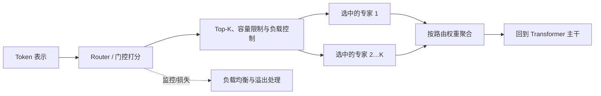
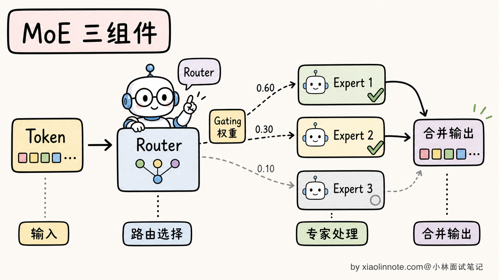
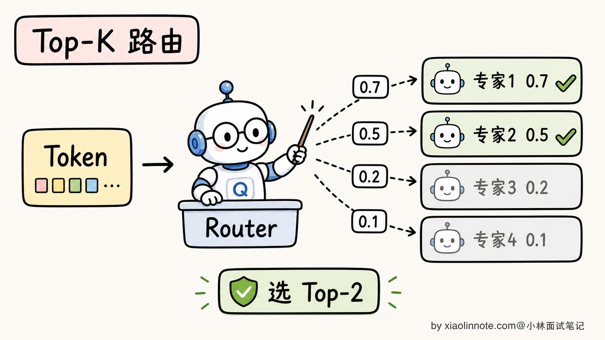
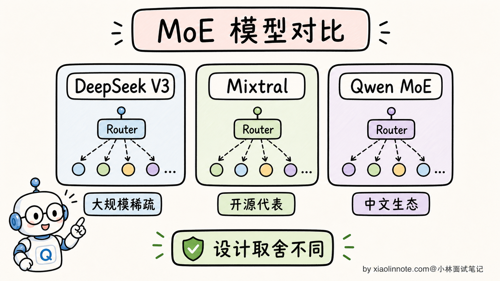
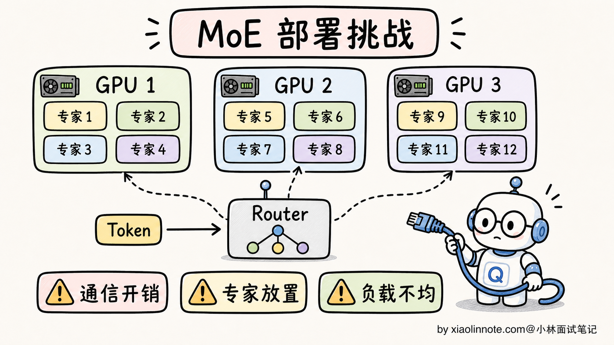

# MoE 混合专家模型是什么？DeepSeek V3、Qwen 为什么用 MoE？

> 原文：[MoE 混合专家模型是什么？DeepSeek V3、Qwen 为什么用 MoE？](https://xiaolinnote.com/ai/llm/moe.html) · 小林面试笔记


👔面试官：来讲讲什么是 MoE（Mixture of Experts，混合专家）？为什么一些公开模型和模型家族会采用它？

🙋‍♂️我：MoE 就是把多个小模型合在一起，每次用一个，效果好。

👔面试官：……「合在一起」是怎么合的？「每次用一个」具体是哪个组件决定的？再说，MoE 在大模型流行前就有研究，为什么近几年才在 LLM 领域受到更多关注？

🙋‍♂️我：哦哦，应该是有个 Router 来选用哪个专家。火起来是因为 DeepSeek？

👔面试官：Router 我接受，DeepSeek 也对，但你只说了「火起来」，没说「为什么火起来」。MoE 解决了什么 Dense 模型解决不了的问题？为什么 DeepSeek V3 总参数 671B 但激活只有 37B？这种「671B / 37B」的设计哲学是什么？

🙋‍♂️我：呃……我没仔细看过 DeepSeek 的论文。

👔面试官：MoE 的常见卖点是「**总参数大但每个 token 激活的计算路径较小**」，但显存、通信、负载和吞吐不一定按激活参数同比下降。这个 trade-off 你能讲清楚吗？还有，MoE 训练有什么坑？专家不平衡是什么意思？

🙋‍♂️我：呃……

👔面试官：专家不平衡（Expert Imbalance）是 MoE 训练的著名难题，意思是 Router 可能偏爱某几个专家，导致其他专家根本没被训过。这种问题不知道，去面试就是被怼。回去补一下。

问到这里 MoE 这道题的真面目才浮出来，它的核心思想不是「拼几个小模型」，而是「稀疏激活换便宜推理」。Router 怎么挑专家、训练为什么会塌、推理为什么便宜，这几条得一条条拆。

## 💡 简要回答

我理解 MoE（Mixture of Experts，混合专家）的核心思想是把部分 Transformer 的 FFN（前馈网络）层替换成 N 个并行的专家网络，再加一个 Router 为 token 选择一个或多个专家；具体是 token routing、expert routing 还是其他稀疏结构，要以模型实现为准。

核心设计哲学是「**总参数与每 token 的激活计算解耦**」。某些公开模型报告了类似 671B 总参数、约 37B 激活参数的配置，但这些数字属于特定模型版本和统计口径；激活参数不等于总延迟、显存或实际成本。

具体看 MoE 三个核心组件。

**1. 多个专家（Experts）**：把部分 Transformer FFN 复制成 N 份，每份参数独立；专家可能形成不同的使用模式，但通常不是预先指定“某个专家专门负责数学/代码”。

**2. Router（路由器）**：每个 token 进到 MoE 层时，Router 计算门控分数，选择一个或多个专家。Top-K 是常见形式，但 K、容量限制、共享专家和路由位置由模型决定；部分公开配置使用 routed experts 加 shared expert。

**3. 负载均衡**：需要通过辅助损失、门控偏置、容量限制或其他机制避免 Router 过度偏爱少数专家；“均匀”也不是越强越好，要兼顾路由质量。

为什么 DeepSeek V3、Mixtral、部分 Qwen 模型都在用 MoE？

- **容量/计算折中**：在合适的训练与路由条件下，可以增加总容量而控制每 token 的部分计算；效果和性价比需要同算力基准比较
- **推理潜力**：每个 token 只走部分专家，但实际速度还受专家权重加载、通信、batch、负载均衡、kernel 和调度影响
- **可扩展性**：增加专家数可以沿着稀疏维度扩大容量，但会同时增加权重存储、路由、通信和调度复杂度

但 MoE 也有挑战：训练难度高（专家不平衡、Router 训练不稳、并行化复杂）；权重存储通常仍接近总参数规模，若把专家分片、卸载或按需加载，便会用额外通信和延迟换显存；分布式部署时 token 路由还可能产生跨卡通信。

MoE 是一种持续演进的架构路线，多个公开模型/模型家族采用过不同变体；它不是唯一答案，Dense 模型在中小规模、部署简单和延迟可控场景仍常见。具体模型名称、参数统计和路由配置都要以对应版本的模型卡或论文为准，不要把某个版本的数字当成通用规律。



上图只表达通用数据流；专家数量、K、是否有 shared expert、容量溢出策略和跨卡通信方式都属于具体实现。

## 📝 详细解析

### MoE 是什么？为什么 Dense 模型不够用了

要理解 MoE，得先看清楚传统 Dense 模型的瓶颈。

Dense 模型（标准 Transformer）的特点是：**模型主体的每个 token 通常都走同一套参数路径**。因此每层的权重都会参与前向计算；具体参数统计还可能包含嵌入、输出头等不在每一步完全相同的部分。

这就带来一个棘手的权衡：

- 想提升模型容量，通常需要增加参数或更有效的数据/训练方法
- Dense 模型的主体参数会在每个 token 的前向路径上参与计算，因此计算、显存、带宽和延迟会一起成为约束
- 能否在某台服务器上运行取决于权重精度、并行方式、上下文长度、KV cache、批量和框架，不能只按参数量或卡数下结论


MoE 的核心创新是**打破「知识量」和「推理成本」的绑定**。它的思路是：

- 模型有 N 个专家，每个专家是一份独立的 FFN
- 每个 token 进来时，Router 只挑 K 个专家来处理（K 远小于 N）
- 专家部分的总参数量约为 N × 单专家参数量；完整模型还包括注意力、嵌入、归一化等共享部分
- 激活参数量只描述本 token 走过的专家路径；专家部分的理论比例大致受 K/N 影响，但实际计算、通信和内存访问不等于这个比例

直观的类比：Dense 像一本厚厚的百科全书，你查一个词要把整本书过一遍；MoE 像一个图书馆，前台咨询员（Router）听到你的问题，告诉你去 3 楼的「数学专家区」就好，不用整个图书馆都搜索。


这个设计提供了在相近的专家计算预算下扩大总容量的可能性，但是否更快、更便宜要通过同硬件、同精度、同上下文和同吞吐目标的基准测试验证。这是 MoE 受到关注的主要原因之一，而不是无条件的速度保证。

### MoE 的三个核心组件

理解了核心思想，下面拆解 MoE 的三个具体组件。

**1. 多个专家（Experts）**

MoE 把 Transformer 每一层的 FFN 替换成 N 个并行的 FFN。每个 FFN 结构完全一样，但参数独立，在训练中各自学会不同的「擅长方向」。

具体专家数 N 的选择是个工程权衡：

- N 太小：稀疏化带来的容量收益有限；N 太大：路由、容量、通信和每个专家获得的训练信号都会变得更难控制
- 具体 N 的跨度很大；公开架构中可以见到从个位数到数百个专家的配置，但不能把某个模型的 N 当作“业界主流”或质量排序

每个专家学到的「擅长方向」**通常不是预先指定的**，而是在训练中由路由和数据分布共同形成；是否出现稳定、可解释的分工要看模型与分析方法，不能简单宣称某个专家固定负责数学、代码或中文。

**2. Router（路由器）**

Router 是 MoE 最关键的组件，决定每个 token 该去哪个专家。结构通常是一个简单的线性层：

```python
# Router 的核心计算（简化版）
gate_logits = token_embedding @ W_router   # 算每个专家的偏好分数
expert_weights = softmax(gate_logits)      # 归一化成概率
top_k_experts = topk(expert_weights, k=2)  # 选 Top-K 个专家
```

每个 token 进来时，Router 根据当前表示算出各专家的分数，挑分数最高的 K 个专家来处理这个 token。K 是模型配置，不同架构差异很大，以下只是帮助理解的例子：

- **K=1**：每个 token 只去 1 个专家，路由最稀疏，但对单个专家的负载和容量更敏感
- **K=2**：每个 token 去 2 个专家，通常需要按权重聚合多个输出
- 更大的 K：可能增加路由容量和计算，也可能改善表达能力；必须结合具体模型配置与基准测试判断



**3. 负载均衡与容量控制**

朴素的 Router 训练有个著名问题：**专家不平衡（Expert Imbalance）**。

什么意思？训练初期 Router 的偏差可能让少数专家收到过多 token，其他专家收到的训练信号不足；如果容量和路由控制失效，负载会进一步偏斜，造成溢出、吞吐下降或专家利用率很低。极端程度取决于实现，不应把“只剩 1–2 个专家工作”当作必然结果。



为了解决这个问题，MoE 可以使用**负载均衡损失（Load Balancing Loss）**，也可以使用门控偏置、容量约束或其他路由策略。下面的代码只是把“惩罚不均衡”抽象成方差的直觉示意，不代表所有模型的真实损失公式：

```python
# 负载均衡损失（直觉版）
expert_load = mean(expert_probability_distribution)  # 每个专家的平均使用率
balance_loss = variance(expert_load)                  # 使用率的方差（越大越不平衡）

total_loss = main_loss + α × balance_loss             # 加到主损失里
```

这个损失项把「专家使用率不均」的方差作为惩罚加进总损失，鼓励 Router 改善利用率；真实实现还会区分路由概率、实际 token 计数、容量溢出等因素，并不要求所有专家严格均匀。α 是个超参，平衡主任务和均衡性。

一些公开工作报告过 **Auxiliary-Loss-Free Load Balancing** 一类策略：通过动态调整专家偏置等方式控制负载，而不是把同一种辅助损失直接加到主目标中。具体公式和效果应以对应论文、实现和复现实验为准。

### 总参数 vs 激活参数：MoE 的设计哲学

MoE 最反直觉、也最容易在面试踩坑的概念，是「**总参数 vs 激活参数**」的区别。

来看一个具体计算：

```
Dense 模型 70B：
  推理一个 token 要算 70B 参数
  显存（FP16）：140GB
  推理速度：以 70B 参数的延迟为基准

某些公开 MoE 配置会同时报告“总参数 / 激活参数”，例如 671B / 37B；
  37B 只是该配置下的激活参数统计口径，不等于端到端计算量或延迟
  权重存储至少受总参数、精度和分片方式影响；若把专家卸载或按需加载，还要支付通信与调度成本
  实际速度需要在目标硬件、上下文、batch、并行策略和框架上实测
```

注意三个边界：

**第一**，总参数与激活参数是两种统计口径。总参数描述模型权重规模，激活参数描述某个 token 经过的部分路径；它们都不能直接等价为“学过的知识量”。

**第二**，如果所有专家常驻显存，权重容量大致按总参数和精度计算，还要加量化元数据、运行时缓冲、KV cache 和并行副本；如果不常驻，则用加载、卸载或远程访问换取显存空间。

**第三**，延迟既受激活路径影响，也受路由、通信、内存带宽、batch 和 kernel 影响；“激活参数接近某个 Dense 模型”不能推出端到端延迟接近。


这种“总容量扩大、专家路径稀疏”的组合，是 MoE 受到关注的原因之一。它也把权重存储、跨卡通信、负载均衡和服务调度推到了更重要的位置，不能简单概括为“学得多、跑得快”。

### 如何比较不同 MoE 模型

不同公司的 MoE 设计差别很大。公开资料中的“总参数 / 激活参数 / 专家数 / Top-K”必须绑定具体模型版本、统计口径和是否包含共享模块，不能只背一组数字。面试时可以这样比较：

| 比较维度 | 要确认的问题 | 对系统的影响 |
|---|---|---|
| 路由 | token 级还是其他粒度？Top-K、容量因子和溢出如何处理？ | 影响计算量、丢 token 风险与负载均衡 |
| 专家 | 专家数、专家 FFN 规模、是否有 shared expert？ | 影响总权重、专家粒度和路由通信 |
| 激活口径 | 统计的是专家参数，还是包含注意力和共享部分？ | 防止把激活参数误当成端到端 FLOPs |
| 并行 | 是否使用 Expert Parallel、Tensor Parallel 或跨节点 All-to-All？ | 影响显存切分、带宽、尾延迟和运维复杂度 |
| 质量与成本 | 在同数据、精度、上下文和服务目标下如何测？ | 决定 MoE 是否真的优于 Dense |

可以把公开模型作为例子来说明差异：有的架构采用少量专家和较大的 Top-K，有的采用大量细粒度专家和更小的 Top-K，有的还加入 shared expert。具体数字应现场打开对应版本的配置或论文核对；不要把“专家越多”或“激活率越低”直接等价为更先进。



不同架构可能沿着“更多专家、更细粒度路由”发展，也可能选择更简单的路由以降低服务复杂度；不存在只由专家数或激活率决定的单调趋势。最终要把质量、吞吐、尾延迟、显存、通信和故障恢复一起比较。

### MoE 的三大训练挑战

MoE 看起来很美，但训练起来比 Dense 难得多。三个最大的坑：

**挑战 1：专家不平衡**

前面讲过，Router 容易陷入「只用几个专家」的恶性循环。除了负载均衡损失，业界还发展出几种应对：

- **Expert Choice Routing**：让专家或容量约束参与 token 分配，目标是控制每个专家接收的 token 数；具体是否采用要看架构
- **无辅助损失的偏置调节**：一些公开工作报告过动态调整专家偏置的做法，但不能泛化为所有 MoE
- **探索与容量策略**：噪声、温度或其他训练策略可能帮助探索，但都需要验证对稳定性和质量的影响

**挑战 2：Router 训练不稳定**

Router 是带离散选择的门控网络。Top-K 的选择本身是离散的，但被选中的路由权重仍可通过相应路径获得梯度；容量截断、分数尖锐化和负载偏斜仍可能造成训练不稳定。常见的稳定化思路包括：

- **Noisy Top-K Gating**：训练时给 Router 输出加噪声，鼓励探索
- **Z-loss**：限制 Router logits 的范数，防止极端化
- **软/硬路由的近似或逐步切换**：可在训练中用近似目标帮助优化，但“加权所有专家”会显著增加计算，不是免费的通用方案

**挑战 3：分布式并行复杂**

MoE 模型的并行方式通常比 Dense 复杂。Dense 也可能同时使用多种并行方式，MoE 还要额外考虑：

- **Expert Parallel**：不同专家分配到不同 GPU，token 在 GPU 之间路由
- **All-to-All 通信**：每个 token 选了几个专家后，可能要把 token 发送到对应专家所在的 GPU，处理完再发回来；这往往是重要的通信瓶颈，但是否成为最大开销取决于拓扑、batch 和实现


通信开销会让 MoE 在多机训练时更依赖拓扑和调度优化。公开工作中也有把通信与计算重叠的方案；具体算法、收益和适用条件要以对应实现及基准为准。

### MoE 的部署挑战

训练完之后，部署 MoE 还有自己的挑战。

**挑战 1：显存占用按总参数走**

虽然每个 token 只激活部分专家，但如果追求稳定低延迟，通常需要让相关专家权重可快速访问；可以选择全量常驻、分片、卸载或远程专家服务。显存还要容纳运行时缓冲、KV cache、量化元数据和并行副本，因此不能只用总参数乘字节数估算部署门槛，也不能从某个模型的卡数配置推出所有 MoE 的最低硬件。

**挑战 2：批量推理时通信开销大**

批量推理时，不同 token 可能选择不同专家，跨卡通信和动态聚合会变得明显；但吞吐结果并不固定，必须和同质量、同显存预算、同 batch/上下文的 Dense 基线实测。

**挑战 3：专家不均衡导致负载不均**

部署时，如果某个专家热门（被很多 token 路由到），它所在的 GPU 就会过载，其他 GPU 空闲。需要动态负载均衡机制（专家迁移、复制热门专家等），这又是一个工程坑。



应对这些挑战，主流推理框架会提供不同程度的 MoE 并行、量化和调度支持，但具体能力随框架版本、模型结构和硬件而变。很多团队仍会在部署简单、负载稳定或尾延迟敏感的场景选择 Dense；这属于工程权衡，不是 MoE 的绝对劣势。

### 为什么近几年 MoE 在 LLM 领域受到更多关注

MoE 不是新思想；它在大模型中的普及是多项条件叠加的结果，不能归因于某一个模型或某一个年份：

三个原因：

**1. 训练经验积累到位了**

早期 MoE 训练容易受到专家不平衡、容量溢出和 loss 震荡影响，需要负载均衡、容量控制和并行训练方面的经验；不同团队的公开工作逐步丰富了可复现的设计空间。

**2. 推理框架支持完善了**

推理框架需要同时处理专家并行、路由聚合、量化和跨设备通信。框架支持不断完善降低了落地门槛，但能力仍与版本、模型和硬件绑定，不能用一个年份概括。

**3. DeepSeek V3 把成本打下来了**

一些公开模型展示了大总参数、较小激活路径的组合，并报告了自己的训练成本和效果。这类公开结果让社区更容易评估 MoE 的工程价值，但成本与质量结论必须连同数据、训练硬件、评测协议和统计口径一起阅读，不能直接迁移到另一个项目。


更稳的说法是：**MoE 适合在可接受的路由和通信复杂度下扩大总容量；Dense 通常更容易部署、调度和预测延迟**。到底选哪一种，要由目标质量、吞吐、尾延迟、显存、网络拓扑和运维能力共同决定。

## 🎯 面试总结

回到开头那段对话，问到 MoE，最重要的是先把**核心思想**讲清楚。MoE 把 Transformer 中的部分 FFN 替换为多个专家，加一个 Router 为每个 token 选择一个或多个专家。最关键的设计哲学是**总参数与激活路径解耦**：可以扩大专家容量，同时让单个 token 只经过部分专家；但实际成本还包括共享层、通信、权重存储和调度。

接下来把**三个核心组件**讲清：多个专家、Router，以及负载均衡/容量控制。专家可能形成不同使用模式，但不要在没有分析证据时把它们命名为固定领域专家；Router 计算分数并选择路径；负载控制防止少数专家过载或其他专家训练信号不足。某些公开工作还报告了不依赖同一种辅助损失的偏置调节方案，不能泛化为所有实现。

然后说明**如何比较模型**：核对总参数和激活参数的统计口径、专家数与 Top-K、容量/溢出策略、并行通信和同条件基准。能解释“为什么激活参数不等于显存和延迟”，比背一组脱离版本的数字更能体现工程理解。

最关键的一句话是讲清 MoE 的训练 + 部署挑战。训练上有专家不平衡、Router 不稳、All-to-All 通信复杂这些坑；部署上显存按总参数走、批量推理通信开销大、热门专家负载不均。能讲出「**显存按总参数走，但推理速度按激活参数走**」这一句反直觉但精确的话，面试官就知道你真的理解 MoE 在工程上的取舍。

如果还想再加分，可以指出 MoE 是较早就出现的稀疏建模思路，近几年因为训练方法、并行硬件、推理框架和公开模型案例共同成熟而受到关注。它是可选架构路线，但不是唯一方向；能够同时讲清收益和边界，更像真实工程师。

---
